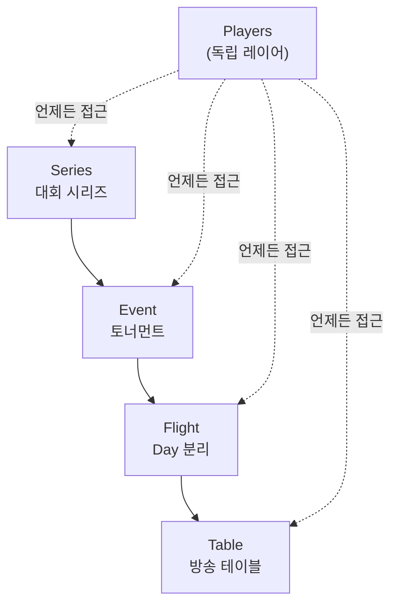
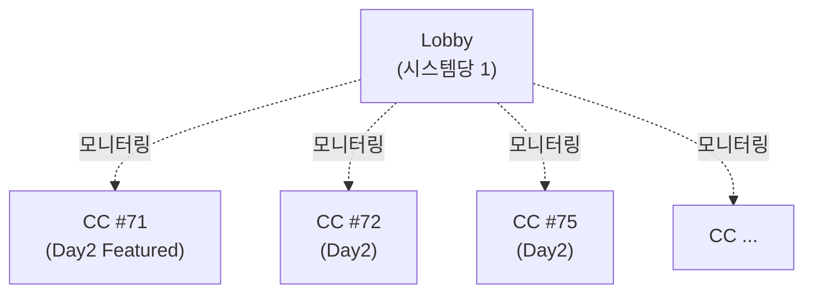
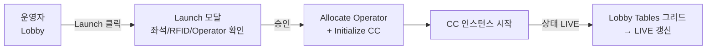
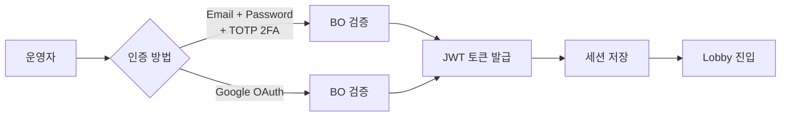
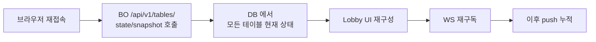

# Lobby — 모든 테이블을 내려다보는 관제탑

> **Version**: 1.0.0
> **Date**: 2026-05-04
> **문서 유형**: 외부 인계용 PRD (Product Requirements Document)
> **대상 독자**: 외부 개발팀, 경영진, PM, 방송 운영에 관심 있는 누구나
> **범위**: Lobby 의 정체성·구조·시나리오·권한. 기술 명세는 `2. Development/2.1 Frontend/Lobby/Overview.md` 정본 참조.

---

## 목차

**Part I — 정체성: Lobby 가 무엇인가**

- [Ch.1 — 관제탑](#ch1--관제탑) — 운영자가 모든 테이블을 한눈에
- [Ch.2 — 3계층 항해](#ch2--3계층-항해) — 시리즈 → 이벤트 → 테이블
- [Ch.3 — 1 : N 관계](#ch3--1--n-관계) — 한 Lobby 가 여러 CC 를 보는 법

**Part II — 사용: 누가 무엇을 하는가**

- [Ch.4 — 운영자의 하루](#ch4--운영자의-하루) — 시나리오 4종 (셋업 / 진행 / 알림 / 정리)
- [Ch.5 — 권한의 분리](#ch5--권한의-분리) — Admin / Operator / Viewer

**Part III — 깊이: 특별한 기능들**

- [Ch.6 — Mix 게임](#ch6--mix-게임) — 17 종을 한 화면에서
- [Ch.7 — 비상 시나리오](#ch7--비상-시나리오) — 세션 복원 + 장애 디그레이드
- [Ch.8 — 화면 갤러리](#ch8--화면-갤러리) — 5 핵심 화면 + 디자인 톤

---

## Ch.1 — 관제탑

비행기 공항을 본 적이 있으신가요. 활주로에는 여러 비행기가 동시에 이착륙하고, 격납고에서는 정비가 진행되고, 게이트에는 승객이 탑승하고 있습니다. 이 모든 것을 동시에 안전하게 통제하는 단 한 곳이 있습니다 — **관제탑** 입니다.

> **포커 방송의 관제탑이 Lobby 입니다.**


12 개의 테이블이 동시에 진행되는 대규모 토너먼트를 상상해 보세요. 각 테이블에서는 카드가 펼쳐지고, 베팅이 오가고, 누군가는 탈락하고, 누군가는 칩을 두 배로 늘립니다. 어느 테이블에서 결정적 순간이 벌어지고 있는지, 어느 테이블에 중계 카메라를 추가로 배치해야 하는지, 어느 테이블의 RFID 리더에 문제가 생겼는지 — 이 모든 정보를 한눈에 파악하는 단 한 곳이 Lobby 입니다.

### 1.1 한 줄 정의

> **Lobby** = 모든 테이블의 상태를 한눈에 내려다보고, 시스템 전체를 설정하며, 새로운 테이블을 방송에 올리는 **중앙 관제탑** (Foundation §Ch.5.1).

### 1.2 비유 — Lobby 가 사라진 세상

만약 Lobby 가 없다면 운영진은 12 개 테이블 각각의 Command Center 를 따로 열어 일일이 확인해야 합니다. 한 사람이 12 개의 화면을 동시에 보는 것은 불가능합니다. Lobby 는 **12 개 테이블의 요약을 1 개 화면에 압축** 합니다.

| 일이 벌어지는 곳 | Lobby 가 보여주는 것 |
|------------------|---------------------|
| 테이블 #71 에서 거대 팟이 열림 | "Day2-#71 · LIVE · 팟 142,400" |
| 테이블 #72 의 RFID 리더가 desync | "Day2-#72 · ⚠ RFID 오류 · 운영자 C 일시정지" |
| 테이블 #75 의 운영자가 8분 idle | "Day2-#75 · ⚠ Op B idle > 8min" |
| 다음 레벨 시작 22 분 전 | "L18 · Next 22:48" |

운영자는 12 줄의 요약을 보면서 어디에 주의를 집중해야 할지 결정합니다. 모든 결정은 12 줄 안에서 내려집니다.

### 1.3 Lobby 는 어디서 돌아가는가

```
  +-----------------------------------------+
  | 운영실 — Lobby 브라우저 (lobby-web :3000)|
  |                                          |
  |  운영자 1: 12 테이블 동시 모니터링      |
  |  운영자 2: 신규 등록 처리                |
  |  관리자:   설정 + 권한 관리              |
  +-----------------------------------------+
            |
            v LAN
  +-----------------------------------------+
  | 중앙 서버 (BO + DB)                     |
  +-----------------------------------------+
```

Lobby 는 **Flutter Web 애플리케이션** 으로 빌드되어 nginx Docker 컨테이너 (`lobby-web`, port 3000) 로 배포됩니다. 운영실에서 어떤 컴퓨터든 브라우저로 LAN 의 `http://<서버-IP>:3000/` 에 접속하면 즉시 사용 가능합니다.

여러 운영자가 동시에 접속해 동일 데이터를 볼 수 있습니다. 한 운영자의 변경 사항은 다른 운영자의 화면에 0.1 초 이내로 반영됩니다 (BO 의 WebSocket push 약속).

---

## Ch.2 — 3계층 항해

Lobby 의 정보 구조는 **3 계층 + Player 독립 레이어** 입니다.



### 2.1 4 계층의 의미

| 계층 | 답하는 질문 | 예시 |
|:----:|------------|------|
| **Series** | "어떤 대회 시리즈인가?" | "World Poker Series Europe 2026" |
| **Event** | "그 시리즈의 어떤 이벤트인가?" | "Event #5 — Europe Main Event (€5,300)" |
| **Flight** | "그 이벤트의 며칠 차인가?" | "Day2 (3/4 진행)" |
| **Table** | "그 Day 의 어느 테이블인가?" | "Day2-#71 (Featured)" |

운영자는 Series 카드를 클릭해 Event 목록으로, Event 카드를 클릭해 Flight 목록으로, Flight 카드를 클릭해 그 Flight 의 모든 Table 그리드로 들어갑니다. 각 단계에서 빠지지 않도록 **Breadcrumb 네비게이션** 이 화면 상단에 표시됩니다.

```
  Home > WPS · EU 2026 > Event #5 > Day2 > Tables
```

언제든 Breadcrumb 의 한 단계를 클릭하면 그 깊이로 즉시 돌아갈 수 있습니다.

### 2.2 Player 는 왜 독립 레이어인가

**선수 (Player)** 는 어떤 깊이에서도 접근 가능합니다. 한 선수가 여러 이벤트에 참가하고, 여러 Day 에 등록되며, 여러 테이블을 옮겨 다닐 수 있기 때문입니다. 선수 정보를 특정 Series/Event/Flight 안에 가두면 같은 선수에 대한 정보가 여러 곳에 중복됩니다.

> 선수 명단은 어디에서 들어가도 같은 결과를 보여주는 **공통 검색대** 입니다.

### 2.3 메인 화면 — Tables 그리드

3 계층을 따라 마지막 단계인 **Tables** 그리드가 운영자가 가장 많이 보는 화면입니다.

```
  +======================================================+
  | KPI: Players 918 / Tables 124 / CC 3 / Avg 27.4BB    |
  +======================================================+
  | Levels: Now L17 · 6,000/12,000 · Next L18 in 22:48    |
  +======================================================+
  | Day2-#71 ★ FT  | seats 9/9 | RFID Rdy | NDI | LIVE   |
  | Day2-#72 ★     | seats 8/9 | RFID Err | SDI | ERROR  |
  | Day2-#73       | seats 7/9 | —        | —   | IDLE   |
  | ... (124 rows)                                       |
  +======================================================+
              |                                  |
              v Waiting List (12)                v Launch CC
```

각 행이 한 테이블의 요약입니다. 좌측에 좌석 점유, 중앙에 RFID/덱/출력 상태, 우측에 Command Center 연결 상태와 운영자 ID 가 표시됩니다.

`★ FT` 는 Featured Table (마키 테이블 — 메인 카메라가 잡는 핵심 테이블) 표시입니다. 가장 중요한 테이블이 한눈에 보이도록 별표로 강조됩니다.

---

## Ch.3 — 1 : N 관계

Lobby 와 Command Center 의 관계는 EBS 시스템의 가장 중요한 설계 결정입니다.

### 3.1 1 : N 의 의미

| 컴포넌트 | 수량 | 어디서 |
|----------|:---:|--------|
| **Lobby** | 시스템당 1 (브라우저 다중 접속) | 운영실의 모든 PC |
| **Command Center** | 테이블당 1 인스턴스 | 각 피처 테이블 PC |



> **한 개의 Lobby 가 여러 개의 Command Center 를 동시에 본다.**

### 3.2 Lobby 가 CC 를 모니터링하는 방법

각 CC 는 자신의 테이블 상태를 BO 에게 실시간으로 보고합니다. Lobby 는 BO 의 WebSocket 채널 (`ws/lobby`) 을 구독하여 모든 CC 의 상태를 0.1 초 이내로 받아봅니다.

| Lobby 가 보는 CC 정보 | 의미 |
|---------------------|------|
| 연결 상태 (LIVE / IDLE / ERROR) | CC 가 살아 있는가 |
| 운영자 ID | 누가 이 테이블을 운영 중인가 |
| RFID 상태 | 카드 인식이 정상인가 |
| 덱 등록 상태 | 52 장이 매핑되었는가 |
| 출력 상태 (NDI / SDI) | 방송 신호가 나가고 있는가 |
| 마지막 액션 시각 | 운영자가 idle 상태가 아닌가 |

이 정보들이 Lobby 의 Tables 그리드 한 행을 구성합니다.

### 3.3 Lobby 에서 CC 를 켜는 법 — Launch

새 테이블을 방송에 올리려면 운영자는 Lobby 에서 그 테이블 카드의 **Launch ⚡** 버튼을 누릅니다.



이 한 클릭이 다음의 작업을 자동으로 트리거합니다:
1. idle 상태의 운영자 (Operator) 1 명 자동 할당
2. 해당 테이블 PC 의 Command Center 인스턴스 활성화
3. 테이블 ID 기반 설정 자동 로드 (RFID 리더, 덱, 출력 장비)
4. Lobby 의 Tables 그리드에 LIVE 상태 즉시 반영

운영자는 더 이상 SSH 로 PC 에 접속하거나 명령줄로 프로세스를 띄울 필요가 없습니다.

### 3.4 직접 연결은 금지

Lobby 와 CC 는 직접 통신하지 않습니다. 모든 데이터는 **BO 의 데이터베이스를 경유** 합니다 (Foundation §Ch.6.3 — DB SSOT 원칙).

```
  +--------+    ❌ 직접 연결 금지       +--------+
  | Lobby  |---X--------------X--------| CC #71 |
  +--------+                            +--------+
       |                                     |
       |           +------+                  |
       +---------> |  BO  | <----------------+
                   +------+
                   (DB SSOT)
                   (모든 길이 여기를 거침)
```

이 원칙이 분산 시스템의 동기화 문제를 봉쇄합니다 (자세히는 `Back_Office_PRD.md §Ch.3 DB 는 단일 진실`).

---

## Ch.4 — 운영자의 하루

Lobby 는 운영자가 하루 종일 들여다보는 화면입니다. 시간대별 시나리오 4 종을 통해 Lobby 가 어떻게 사용되는지 살펴봅시다.

### 4.1 셋업 — 방송 시작 30 분 전

```
  09:30  대회장 도착
  09:45  운영실 PC 부팅 → 브라우저 Lobby 접속
  09:50  Series 카드 확인 (WSOP LIVE 동기화 정상?)
  09:55  Event #5 → Day2 → Tables 그리드 진입
  10:00  Featured Table 3 개 ★ 표시 확인
         RFID 리더 12 개 모두 Rdy 상태?
         덱 52/52 매핑 완료?
         NDI/SDI 출력 장비 연결?
  10:15  ⚠ Day2-#72 RFID Err — 현장에 무전, 리더 교체
  10:25  Day2-#72 Rdy 복귀 확인
  10:28  Launch 버튼 누르기 (테이블 3 개)
  10:30  방송 시작 ── 모든 테이블 LIVE
```

**시나리오 1 — 셋업** 의 Lobby 화면은 _준비 모드_ 입니다. KPI 패널은 모든 0 (아직 핸드 0 회), Tables 그리드는 IDLE 상태로 가득합니다. 한 행씩 점검하며 Launch 합니다.

### 4.2 진행 — 방송 중

방송이 시작되면 Lobby 화면은 _운영 모드_ 로 전환됩니다.

```
  +======================================================+
  | KPI: Players 918→876 / CC 3 LIVE / Avg 28.1BB        |
  +======================================================+
  | Levels: Now L18 · 8K/16K · Next L19 in 28:14         |
  +======================================================+
  | Day2-#71 ★ FT  | LIVE · Op A · 142.4K pot            |
  | Day2-#72 ★     | LIVE · Op B · NEW HAND              |
  | Day2-#75       | LIVE · Op C · WAITING ELIM          |
  +======================================================+
```

운영자는 화면을 통해 **각 테이블에서 무엇이 벌어지고 있는지** 가 아니라 **어디에 주의가 필요한지** 를 봅니다. 정상 LIVE 상태는 화면에서 거의 보이지 않고, 알림 (`⚠`) 만이 시야에 들어옵니다.

> 정상은 보이지 않게, 비정상만 강조한다 — 운영실 디자인의 핵심 원칙.

### 4.3 알림 — 비상 상황

Day2-#72 의 RFID 리더가 갑자기 desync 됩니다. CC 가 즉시 알림을 BO 로 발행하고, BO 는 Lobby 에 broadcast 합니다.

```
  +======================================================+
  | ⚠ ALERT — Day2-#72 RFID 리더 desync                  |
  | "Deck integrity drifted to 0/52 mid-hand.             |
  |  Operator C is paused; pairing required before        |
  |  next deal."                              [Resync RFID] |
  +======================================================+
```

알림 한 개가 화면 상단에 모달처럼 떠오릅니다. 운영자는 즉시 [Resync RFID] 버튼을 누르거나, 현장에 무전하여 물리적 점검을 요청합니다.

알림은 4 가지 source × 3 가지 severity 분류로 나뉩니다:

| Source | 의미 | 예시 |
|--------|------|------|
| RFID | 카드 인식 하드웨어 | 리더 desync, 덱 누락 |
| Seat | 좌석 상태 | 탈락 미확인, 빈 좌석 |
| CC | 운영자 / Command Center | Operator idle, CC error |
| Level / Stream / System | 시스템 운영 | 다음 레벨 임박, NDI 승격 |

### 4.4 정리 — 방송 종료 후

방송이 끝나면 Lobby 의 마지막 임무는 **데이터 무결성 확인** 입니다.

```
  18:30  마지막 핸드 종료
  18:32  Lobby Tables 그리드 — 모든 테이블 COMPLETED 전환
  18:40  Lobby Reports 진입 — Hand History 142 회 기록 확인
  18:45  Hand JSON Export 트리거
  18:50  Lobby 종료 (브라우저 닫기)
```

Hand JSON Export 가 후편집 스튜디오로 데이터를 보내는 마지막 단계입니다 (`Back_Office_PRD.md §Ch.8 후편집을 위한 데이터` 참조).

---

## Ch.5 — 권한의 분리

Lobby 의 모든 화면이 누구에게나 열려 있는 것은 아닙니다.

### 5.1 3 역할

| 역할 | 무엇을 할 수 있는가 |
|------|---------------------|
| **Admin (관리자)** | 시스템 전체 권한. 모든 테이블 + 설정 + 권한 관리 |
| **Operator (운영자)** | 자신에게 할당된 1 개의 CC 만 + Lobby 의 모니터링 권한 |
| **Viewer (열람자)** | 읽기 전용. 어떠한 조작도 불가 |

### 5.2 RBAC 매트릭스

```
  +-----------------+--------+----------+--------+
  | 화면 / 액션    | Admin  | Operator | Viewer |
  +-----------------+--------+----------+--------+
  | Tables 그리드   |   ✅   |    ✅    |   ✅   |
  | CC Launch       |   ✅   |    ⚠*    |   ❌   |
  | Settings        |   ✅   |    ❌    |   ❌   |
  | Players 등록    |   ✅   |    ❌    |   ❌   |
  | Series 신규 생성|   ✅   |    ❌    |   ❌   |
  | Hand History    |   ✅   |    ✅    |   ✅   |
  | Reset / Restart |   ✅   |    ❌    |   ❌   |
  +-----------------+--------+----------+--------+
   ⚠* Operator 는 자신에게 할당된 테이블만 Launch 가능
```

### 5.3 인증 — 두 가지 경로



이 인증은 한 번만 수행됩니다. 한 번 로그인하면 그 운영자의 권한 (Admin / Operator / Viewer) 이 BO 에 의해 자동 적용되며, 화면과 버튼이 그 권한에 맞게 활성화/비활성화됩니다.

---

## Ch.6 — Mix 게임

EBS 가 WSOP LIVE 와 차별화되는 한 가지 영역이 **Mix 게임 모드** 입니다.

### 6.1 Mix 게임이란

하나의 토너먼트 안에서 여러 종류의 포커가 번갈아 진행되는 형식입니다. 가장 유명한 Mix 형식은:

| 이름 | 게임 종류 |
|------|-----------|
| **HORSE** | Hold'em / Omaha Hi-Lo / Razz / Stud / Stud Hi-Lo (5 종) |
| **8-Game** | HORSE + Triple Draw + NL Hold'em + PL Omaha (8 종) |
| **PPC** | PLO / PLO8 / Big O (3 종) |
| **Dealer's Choice** | 매 핸드마다 딜러가 게임 종류 선택 |

WSOP LIVE 시리즈에는 17 개 Mix 이벤트가 존재합니다.

### 6.2 Lobby 에서 Mix 게임을 다루는 법

Mix 게임의 Event 카드는 일반 Event 와 다른 표시를 가집니다:

```
  +--------------------------------------+
  | #14   04/02 14:00                     |
  | Mixed PLO/Omaha/Big O   €1,500       |
  | 게임: MIX   모드: Choice              |
  | 412 entries / 187 re-entries · ★FT   |
  +--------------------------------------+
  | 현재 게임: PLO (3/8 라운드)           |
  | 다음 게임: PLO8 (10 핸드 후)         |
  +--------------------------------------+
```

운영자는 Lobby 에서 **현재 어떤 게임이 진행 중인지**, **다음 라운드가 무엇인지** 를 한 화면에서 확인합니다. CC 는 게임 전환 신호를 자동으로 받아 8 버튼 액션을 새 게임 규칙으로 갱신합니다.

### 6.3 왜 Mix 게임이 중요한가

> 외부 stakeholder 가 EBS 를 평가할 때 가장 까다로운 검증 포인트가 Mix 게임입니다.

22 종 포커 규칙을 모두 처리하는 게임 엔진과, 그 엔진의 출력을 한 화면에서 일관되게 표시하는 Lobby 와, 8 버튼이 게임 종류에 맞게 자동 변경되는 Command Center 의 삼위일체가 Mix 게임에서 검증됩니다.

PokerGFX 같은 경쟁 시스템은 Mix 게임을 별도 토너먼트 운영자가 매번 게임 종류를 수동 전환합니다. EBS 는 자동입니다.

---

## Ch.7 — 비상 시나리오

### 7.1 세션 복원

12 시간 방송 중 운영자의 브라우저가 새로고침되거나, PC 가 재부팅되거나, 네트워크가 잠시 끊겼다고 가정해 봅시다. Lobby 에 다시 접속했을 때 운영자는 **이전 상태에서 계속** 작업할 수 있어야 합니다.



이 5 초 안에 운영자는 끊김 없이 작업을 재개합니다. **뜨거운 핸드가 진행 중이라면** 그 핸드의 현재 상태 (보드 카드, 팟, 베팅 라운드) 까지 모두 복원됩니다.

### 7.2 장애 디그레이드 — Mock RFID 모드

RFID 리더가 물리적으로 고장났다면? Lobby 는 그 테이블을 **Mock RFID 모드** 로 전환할 수 있습니다.

| 상태 | 의미 |
|------|------|
| RFID Rdy | 정상 RFID 인식 |
| RFID Err | 리더 또는 덱 오류 — 자동 일시정지 |
| **Mock Ready** | Mock 모드 준비 — 운영자 수동 카드 입력 |
| **Mock Deck Required** | Mock 모드인데 덱 등록 미완료 |

Mock 모드에서는 운영자가 CC 의 카드 입력 UI 를 통해 카드를 직접 입력합니다. 방송은 끊기지 않고 계속됩니다 — 단지 자동화 수준이 낮아질 뿐입니다.

### 7.3 BO 가 다운되면

BO 가 다운되면 새로운 데이터 commit 이 불가능합니다. 그러나 CC 는 로컬 버퍼로 제한 동작합니다:

| 영향 | 결과 |
|------|------|
| Lobby | 접속 불가 — "BO 연결 실패" 화면 |
| CC | 로컬 모드 진입 — 핸드 진행 가능, 단 새 BO 동기화 보류 |
| Overlay | 마지막 받은 데이터로 정지 |

BO 가 복구되면 CC 가 로컬 버퍼의 데이터를 BO 로 일괄 발행합니다. 데이터는 손실되지 않습니다.

이 시나리오는 운영실에 **백업 BO 서버** 또는 **빠른 복구 절차** 를 준비할 책임이 있다는 의미입니다 (`docs/4. Operations/Network_Deployment.md`).

---

## Ch.8 — 화면 갤러리

Lobby 의 모든 화면은 **5 핵심 화면 + Login + Player 독립 레이어** 로 구성됩니다.

### 8.1 화면 0 — Login

```
  +-----------------------------+
  |        EBS LOBBY            |
  |                             |
  |  Welcome back               |
  |  Sign in to broadcasting    |
  |  console.                   |
  |                             |
  |  Email   [.................]|
  |  Pass    [.................]|
  |  ☑ Keep me signed in        |
  |                             |
  |  [   Sign In   ]            |
  |  ─── or ───                 |
  |  [ Continue with Entra ID ] |
  |                             |
  |  EBS v5.0.0 · WSOP LIVE     |
  +-----------------------------+
```

### 8.2 화면 1 — Series 목록

연도별 또는 월별로 그룹화된 카드 그리드. 각 카드에 venue / date range / event count / status badge 표시.

> 디자인 SSOT: `Lobby/References/EBS_Lobby_Design/screenshots/`

### 8.3 화면 2 — Event + Flight 통합

KPI 5 개 + 상태 탭 (created/announced/registering/running/completed) + 데이터 테이블 (15 컬럼 — No, Time, Name, Buy-In, Game, Mode, Entries, Re-Entries, Unique, Status 등). Flight 가 인라인으로 펼쳐짐 (accordion).

### 8.4 화면 3 — Tables 그리드 (메인)

```
  KPI 5 (Players 918 / Tables 124 / Waiting 12 / CC 3 / Avg Stack)
  +
  Levels (Now / Next / L+1 / Clock)
  +
  Tables 데이터 테이블 (124 rows × 9 컬럼: 좌석 그리드 9 + Std/RFID/Deck/Out/CC)
  +
  Waiting List (사이드바)
```

운영자가 가장 많이 보는 화면. 본 PRD §Ch.4.2 의 진행 시나리오 화면.

### 8.5 화면 4 — Players (독립 레이어)

선수 리더보드 + 검색 + 통계 (VPIP/PFR/AGR). 여기서 클릭한 선수는 어떤 테이블에 앉아 있는지 자동 매핑.

### 8.6 화면 5 — Hand History (Tools)

방송 종료 후 또는 진행 중 특정 핸드 재생. 보드 카드 + 액션 시퀀스 + 결과.

### 8.7 디자인 톤

Lobby 의 디자인 톤은 **black-and-white refined minimal** 입니다:

| 요소 | 톤 |
|------|----|
| 색상 | 흰 바탕 + 검은 텍스트 + 1 점 강조 (LIVE 녹색, ERROR 빨강, WARN 노랑) |
| 타이포 | UI 본문은 sans-serif, 숫자는 monospace |
| 레이아웃 | 작은 padding, 높은 정보 밀도 (12 테이블이 한 화면에 들어감) |
| 애니메이션 | 거의 없음 (운영실의 집중 환경 보호) |

이 톤은 운영실의 산업적 환경 (큰 화면 + 다중 모니터 + 12 시간 시청) 에 최적화되어 있습니다.

> 디자인 SSOT: `Lobby/References/EBS_Lobby_Design/` (HTML/React/CSS, 230KB).

---

## 더 깊이 알고 싶다면

| 주제 | 정본 문서 |
|------|----------|
| Lobby 전체 통합 비전 | `Foundation.md §Ch.4.1`, `§Ch.5.1`, `§Ch.5.5` |
| Lobby 기능 명세 (124 데이터 필드) | `2. Development/2.1 Frontend/Lobby/Overview.md` |
| Lobby UI 화면 설계 | `2. Development/2.1 Frontend/Lobby/UI.md` |
| 디자인 SSOT (HTML/React 230KB) | `2. Development/2.1 Frontend/Lobby/References/EBS_Lobby_Design/` |
| Settings 6탭 | `2. Development/2.1 Frontend/Settings/` |
| BO 데이터 흐름 | `Back_Office_PRD.md` |
| Command Center 깊은 이해 | `Command_Center_PRD.md` |

---

## Changelog

| 날짜 | 버전 | 변경 |
|------|:---:|------|
| 2026-05-04 | 1.0.0 | 초기 작성 — Foundation 톤 + 8 챕터 (Part I 정체성 / II 사용 / III 깊이). 정본 = `Lobby/Overview.md` (1179줄 internal) + `Lobby/UI.md` + design SSOT (HTML/React) 외부 친화 재가공. SSOT 위반 회피 = frontmatter `derivative-of` + `if-conflict: derivative-of takes precedence`. |
