# RIVE Standards — Overlay Graphics 정본

> **Version**: 0.7.0
> **Date**: 2026-05-12
> **문서 유형**: 정본 SSOT (Reference Manual)
> **대상 독자**: 외부 개발팀 / 외부 디자이너 / 방송 PD
> **범위**: Overlay 그래픽이 어떤 요소로 이루어지고, 어떻게 출력되며, 어디에서 어떤 데이터를 받아 출력되는가의 정의. 단, **EBS Rive Rendering 책임** 과 **JSON DB Output Only** 영역은 명시 분리 (Ch.2 참조).

---

## 한 줄 정의

> **Overlay Graphics** = 포커 테이블 위 카메라 화면 위에 떠 있는 투명한 막.
> 그 막은 처음에 비어 있다. **다섯 명의 작가** — Rive Asset, EBS DB, Command Center, RFID, Game Engine — 가 동시에 같은 막에 글을 쓰기 시작하면, 그 막은 비로소 한 장면이 된다.

다섯 중 하나라도 빠지면 화면은 불완전해진다.

| 빠진 작가 | 화면이 되는 것 |
|----------|---------------|
| Rive Asset 가 없으면 | 그래픽 형태가 없어 데이터 표시 불가 |
| EBS DB 가 없으면 | 선수 이름·국가·브랜딩 정보 부재 |
| Command Center 가 없으면 | 액션 표식 갱신 불가 |
| RFID 가 없으면 | 카드 정보 부재 |
| Game Engine 이 없으면 | 팟·스택·Equity 등 계산값 부재 |

본 문서는 이 다섯 작가가 어떻게 한 장의 막에 동시에 글을 쓰는지를 정의한다.

---

## 목차

**Part I — 만남 (Overlay 의 정체)**

- [Ch.1 — 다섯 작가의 만남](#ch1) — 5 작가 ↔ Foundation §7 의 6 기능 매핑
- [Ch.2 — 그래픽 요소 11 카테고리 한눈에 + Rendering / JSON DB 분리 (v0.7.0)](#ch2)

**Part II — Rive 런타임**

- [Ch.3 — Rive 의 정체](#ch3) — 벡터 + State Machine + Variable Binding
- [Ch.4 — Rive Editor ↔ EBS 통합](#ch4) — Export-Import / API 두 경로 + Rive Manager (Foundation §A.3)
- [Ch.5 — Variable Binding](#ch5) — 데이터를 그래픽 속성에 묶는 메커니즘

**Part III — 다섯 데이터 소스**

- [Ch.6 — Rive Asset](#ch6) — `.riv` 파일 명세 + 디자이너 의무
- [Ch.7 — EBS DB](#ch7) — 영속의 기억
- [Ch.8 — Command Center 입력](#ch8) — 인간의 결정
- [Ch.9 — RFID](#ch9) — 카드의 정체
- [Ch.10 — Game Engine](#ch10) — 계산 결과
- [Ch.11 — 다섯의 합류](#ch11) — 한 변수에서 만나는 길

**Part IV — 그래픽 요소 카탈로그 (11)**

- [Ch.12 — Player Info Layout: Identity](#ch12) — 이름·국가·좌석·아바타 (영역 A)
- [Ch.13 — Player Info Layout: Stack + Bet 라인](#ch13) — 자산의 흐름 (영역 A)
- [Ch.14 — Community & Table Layout (Hole + Community **완전 분리**)](#ch14) — Lego-Block 분리 + Flop 동시 표시 룰 (영역 A)
- [Ch.15 — 핸드 강도와 Equity](#ch15) — 확률의 시각화 (영역 A)
- [Ch.16 — Action Indicators (Check/Bet/Call/Raise/Fold)](#ch16) — ALL-IN emphasis 는 Player Info Window 내부 (영역 A)
- [Ch.17 — Pot (Main + Side, edge-case 분석)](#ch17) — 7 종 edge-case (영역 A)
- [Ch.18 — 블라인드와 레벨](#ch18) — 토너의 박동 (영역 A)
- [Ch.19 — 토너먼트 상태](#ch19) — **JSON DB Output Only (영역 B)**
- [Ch.20 — 시계](#ch20) — Hand Clock + Level Clock — **JSON DB Output Only (영역 B)**
- [Ch.21 — 브랜딩](#ch21) — sponsor / logo / banner — **JSON DB Output Only (영역 B)**
- [Ch.22 — 운영자 전용 표식](#ch22) — 운영자만 보는 영역 (영역 A)

**Part V — 살아 움직이는 법**

- [Ch.24 — State Machine](#ch24) — Rive 의 상태 전이
- [Ch.25 — 게임 흐름과 그래픽 전이 (Lego-Block Modular Architecture)](#ch25) — Ch.25.0 Lego-Block 원칙 + 5 단계 + 21 OutputEvent → Rive 트리거 매핑
- [Ch.26 — Entry / Emphasis / Exit](#ch26) — 모든 그래픽의 3 막극

**Part VI — 무대 구조**

- [Ch.27 — 9 단 z-layer](#ch27) — 막의 순서
- [Ch.28 — Safe Zone 과 시각 위계](#ch28) — 화면 안의 좌표

**Part VII — 부록**

- [Ch.29 — 용어 사전](#ch29)
- [Ch.30 — FAQ](#ch30)
- [Ch.31 — 송출 준비 체크리스트](#ch31)

---

# Part I — 만남

<a id="ch1"></a>

## Ch.1 — 다섯 작가의 만남

### 1.1 다섯 작가가 누구인가

Overlay 화면 한 장이 만들어지려면 — 다음 다섯 출처의 데이터가 동시에 필요하다.

| 데이터 소스 | 가져오는 것 |
|------|------------|------|
| **Rive Asset** | 그래픽의 형태 (벡터 도형, 색, 폰트, 애니메이션) |
| **EBS DB** | 영속 데이터 (선수 프로필, 토너 정보, 브랜드 패키지, 히스토리) |
| **Command Center** | 운영자 결정 (FOLD / BET / RAISE / ALL-IN / 핸드 시작 / 종료) |
| **RFID** | 카드의 정체 (무늬·숫자·좌석) |
| **Game Engine** | 계산된 결과 (팟, 사이드 팟, Equity, 핸드 강도, 스택 변동) |

이 다섯이 만나는 곳이 **Rive Variable** 이다 (Ch.5). Variable 하나하나가 그래픽 한 조각으로 변환된다.

### 1.2 한 화면에 동시에 흐르는 다섯 줄기

```
   +---------------+    +---------------+    +---------------+
   |  Rive Asset   |    |    EBS DB     |    | Command Center|
   |  (.riv 파일)  |    |  (영속 기억)   |    |  (운영자 입력) |
   +-------+-------+    +-------+-------+    +-------+-------+
           |                    |                    |
           v                    v                    v
   +---------------+    +---------------+    +---------------+
   |     RFID      |    |  Game Engine  |    |  (다른 출처   |
   |  (카드 인식)   |    |   (계산기)    |    |   는 없음)    |
   +-------+-------+    +-------+-------+    +---------------+
           |                    |
           +--------+-----------+
                    |
                    v
           +-------------------+
           |  Rive Variables   |  <- 다섯이 만나는 지점
           +---------+---------+
                     |
                     v
           +-------------------+
           |  Rive Renderer    |  <- 변수를 그림으로
           +---------+---------+
                     |
                     v
           +-------------------+
           |   Overlay 화면    |  <- 시청자가 보는 한 장
           +-------------------+
```

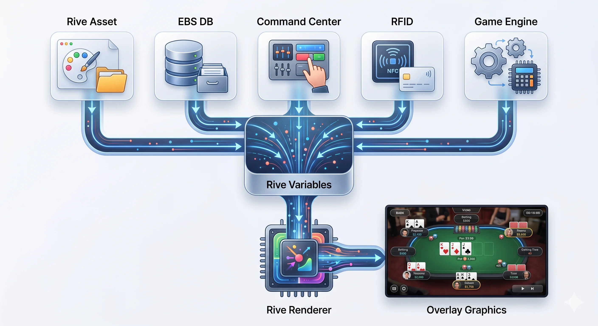

> *FIG · 5 데이터 소스 → Rive Variables → Rive Renderer → Overlay Graphics*

### 1.3 5 작가 ↔ 6 기능 매핑 (Foundation §7 cascade)

5 데이터 소스 (작가) 는 Foundation §7 의 **3 그룹 6 기능** 위에서 다음과 같이 분포한다:

| 5 작가 (데이터 소스) | 6 기능 호스트 | RIVE 역할 | 스택 |
|---------------------|--------------|-----------|------|
| **Rive Asset** | (외부 디자이너 → Lobby Web 의 Rive Manager 로 등록) | 그래픽 형태 공급자 | Rive Editor → `.riv` |
| **EBS DB** | **Lobby Web** + **Backend (BO)** | "EBS DB 작가" — 영속 데이터 (선수 / 토너 / Brand Pack) 공급 | Flutter Web + FastAPI/SQLite·PostgreSQL |
| **Command Center** | **Command Center** | "운영자 결정 작가" — 입력 (Mouse / Keyboard / Touch) → Action 객체 → Rive Variable / Engine | Flutter Desktop + Rive |
| **RFID** | **RFID Hardware** (가변 안테나 — 좌석 수 + Muck 보드 유무) | 카드 정체 작가 | ST25R3911B + ESP32 (USB) |
| **Game Engine** | **Game Engine** | 계산 작가 — 22 룰 + 21 OutputEvent 발행 | Pure Dart (코드 내장 상수) |

#### Rive 측 책임 분리

| 6 기능 | Rive 직접 사용 여부 | 역할 |
|--------|:-------------------:|------|
| **Lobby Web** | ✅ (Rive 사용) | Rive Manager 호스트 (자산 등록·검증·활성) + 5분 게이트웨이 |
| **Command Center** | ✅ (Rive 사용) | "Rive 출력자" — Mouse / Keyboard / Touch 입력 + 자체 Overlay 렌더 인스턴스 (1 테이블 = 1 인스턴스) |
| **Overlay View** | ✅ (Rive 출력자) | CC 인스턴스의 Rive Renderer 결과를 SDI/NDI 로 송출 |
| **Game Engine** | ❌ (Rive 직접 사용 X) | 계산만, OutputEvent 만 발행 — Renderer 가 아님 |
| **Backend (BO)** | ❌ (Rive 직접 사용 X) | "데이터 공급자" — DB 호스트 + 권한 검증 + 외부 동기화 |
| **RFID Hardware** | ❌ (Rive 직접 사용 X) | 카드 ID + 안테나 좌석 매핑만 — 그래픽 책임 없음 |

> **요약**: Rive 직접 사용은 Lobby Web (Manager) + CC (입력 + 출력) + Overlay (송출) 세 곳. Engine / BO / RFID 는 Rive Variable 을 채우는 **데이터 공급자** 로서 Renderer 와 분리된다.

### 1.4 본 문서의 범위

본 문서는 이 다섯 작가의 글이 **어디에서 와서 어떻게 변수에 담기고, 어떻게 그림으로 변환되는가** 만 정의한다. 다섯 작가 각자의 내부 동작 (예: RFID 안테나가 NFC 를 읽는 알고리즘, Engine 이 Equity 를 계산하는 몬테카를로 시뮬레이션) 은 본 문서의 범위가 아니다. 그건 각 작가의 영역이다.

본 문서가 답하는 세 가지 질문:

1. **무엇이 보이는가?** — 11 카테고리 그래픽 요소 (Part IV)
2. **어떻게 만들어지는가?** — Rive 런타임 + Variable Binding (Part II)
3. **어디에서 데이터가 오는가?** — 다섯 작가별 매핑 (Part III)

<a id="ch2"></a>

## Ch.2 — 그래픽 요소 11 카테고리 한눈에 + Rendering / JSON DB 분리 (v0.7.0)

본 Part 의 끝에서 — Part IV 본문 들어가기 전에 — 11 카테고리를 한 페이지로 펼친다. 시청자가 화면에서 보게 되는 모든 것은 다음 11 안에 들어간다.

**v0.7.0 architecture pivot** — 11 카테고리는 두 책임 영역으로 분리된다:

| 영역 | 책임 | 11 카테고리 분포 |
|------|------|---------------|
| **A. EBS Rive Rendering Area** (highly modular) | EBS 가 실시간 Rive Overlay 로 직접 렌더링 | Player Info Layout (#1·#2) + Cards (#3) + Hand Strength (#4) + Action Indicators (#5) + Pot (#6) + Blinds/Level (#7) + Operator (#11) |
| **B. JSON DB Output Only** (NO EBS Rendering) | EBS 가 JSON DB 로만 출력. 외부 그래픽 시스템 / 방송 자막 시스템이 자체 렌더링 | Tournament State (#8) + Clock (#9) + Branding (#10) |

> **분리 원칙**: A 영역은 카메라 위 Rive Overlay 의 실시간 합성 — Lego-Block (Ch.25) 으로 load/unload. B 영역은 EBS 가 데이터를 JSON 으로 송출하기만 함 — 그래픽 형태는 EBS 책임 밖. 두 영역의 같은 변수 (예: `level_clock`) 는 동일 데이터지만, A 는 트리거 변수로 사용 / B 는 출력 채널로만 송출.

> **8 vs 11 카테고리 차이** (Foundation 정합):
> Foundation §Ch.2 Scene 1 의 "8 EBS 책임 그래픽" 은 본 11 카테고리 중 #1~#6 (홀카드 / 커뮤니티 / 액션 / 팟 / 승률 / 아웃츠) + 일부 (플레이어 정보 / 위치) 에 해당.
> 차이 = **정의 범위**: Foundation = "EBS 직접 생성" (실시간 트리거), RIVE_Standards = "Rive 자산 측 분류" (사전 제작 + 운영자 영역 #7~#11 포함).
> 같은 화면을 두 시각 (책임 vs 자산) 으로 분류하기 때문에 갯수가 다르다 — 모순 X.

<table role="presentation" width="100%">
<tr>
<td width="50%" valign="middle" align="center">


> *FIG · 시청자가 보는 실제 송출 화면 (WSOP Paradise reference)*

</td>
<td width="50%" valign="middle" align="center">


> *FIG · 11 카테고리 위치와 정체 (해부 도식)*

</td>
</tr>
</table>

| # | 카테고리 | 영역 (A/B) | 데이터 소스 매핑 |
|---|---------|:---------:|--------------|
| 1 | Player Info Layout — Identity (Name/Avatar/Position) | **A** | DB (이름·국가·아바타) + RFID (좌석) + Engine (탈락 여부) |
| 2 | Player Info Layout — Stack + Bet 라인 | **A** | Engine (계산된 stack, bet) |
| 3 | Community & Table Layout (Hole + Community **완전 분리**) | **A** | RFID (카드 정체) + Engine (공개 시점) |
| 4 | Hand Strength + Equity | **A** | Engine (계산 결과) |
| 5 | Action Indicators (Check/Bet/Call/Raise/Fold) | **A** | Command Center (FOLD/BET/CHECK/CALL/RAISE) |
| 6 | Pot (Main + Side, edge-case 포함) | **A** | Engine (메인 + 사이드 계산) |
| 7 | 블라인드 / 레벨 | **A** | DB (스케줄) + Engine (현재 레벨) |
| 8 | 토너먼트 상태 (players total/left/avg/ITM) | **B** | DB (총 인원) + Engine (남은 인원, ITM) — **JSON DB Output Only** |
| 9 | 시계 (Level Clock + Hand Clock) | **B** | Engine (Hand Clock + Level Clock 카운트) — **JSON DB Output Only** |
| 10 | 브랜딩 (sponsor logos / tournament names) | **B** | DB (브랜드 패키지) — **JSON DB Output Only** |
| 11 | 운영자 전용 표식 | **A** | Command Center + RFID 진단 |

> **A 영역 모든 카테고리는 Rive Asset (.riv 파일) 이 그래픽 형태를 제공**. B 영역은 EBS 가 JSON 만 송출하므로 그래픽 형태는 외부 책임.

> **카테고리 #5 (Action Indicators)** — Check/Bet/Call/Raise/Fold 5 종 만 시각 표식. New Hand / Deal 은 visual X (시청자 화면 미반영, 운영자 흐름 제어 전용).

각 카테고리는 Part IV 의 별도 챕터에서 — 그래픽 모양, 5 데이터 소스에서 받는 정확한 변수, 변화의 순간 — 으로 풀어 다룬다. **B 영역 (Ch.19/20/21) 은 JSON 스키마 정의 중심으로 풀이.**

---

# Part II — Rive 런타임

<a id="ch3"></a>

## Ch.3 — Rive 의 정체

5 데이터 소스의 값을 화면에 옮기는 런타임이 **Rive** 다. 왜 Rive 인가.

### 3.1 Rive 가 답하는 세 질문

| 질문 | Rive 의 답 |
|------|-----------|
| 어떻게 그릴 것인가? | **벡터 그래픽** — 어떤 해상도에서도 깨지지 않음 |
| 어떻게 움직일 것인가? | **State Machine** — 그래픽이 상태를 갖고 상태 사이를 이동 |
| 어떻게 데이터를 받을 것인가? | **Variable Binding** — 그래픽의 모든 속성이 변수에 묶일 수 있음 |

### 3.2 Rive 파일 (.riv) 안에 있는 것

<table role="presentation" width="100%">
<tr>
<td width="50%" valign="middle" align="left">

```
   +-----------------------+
   |       .riv 파일       |
   +-----------------------+
   |                       |
   |  [Vector Artwork]     |
   |    도형 / 색 / 폰트   |
   |                       |
   |  [Animations]         |
   |    Timeline / Tween   |
   |                       |
   |  [State Machine]      |
   |    States + Trans.    |
   |                       |
   |  [Variables (Inputs)] |
   |    Number / Bool /    |
   |    Trigger / Text     |
   |                       |
   +-----------------------+
```

</td>
<td width="50%" valign="middle" align="center">

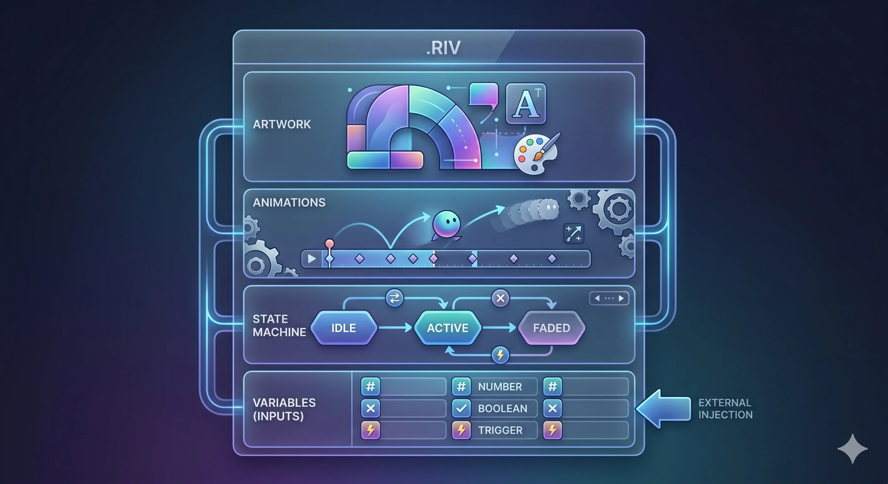

> *FIG · .riv 내부 — Artwork / Animations / State Machine / Variables (외부 주입)*

</td>
</tr>
</table>

이 한 파일이 디자이너가 Rive Editor 에서 만들어 export 한 산출물이다. EBS 는 이 파일을 받아 — Variable 에 데이터를 주입하면서 — 화면에 그린다.

### 3.3 그래픽 요소 1 개 = .riv 파일 1 개 (원칙)

본 문서의 11 카테고리는 각각 별도의 `.riv` 파일로 만들어진다.

| 카테고리 | 영역 | 파일명 (제안) |
|---------|:----:|--------------|
| Player Info — Identity | A | `player_card.riv` |
| Player Info — Stack + Bet | A | `stack_bet.riv` |
| 카드 (홀카드) | A | `hole_card.riv` |
| 카드 (커뮤니티) | A | `community_card.riv` |
| Hand Strength | A | `hand_strength.riv` |
| Action Indicators | A | `action_badge.riv` |
| Pot | A | `pot.riv` |
| 블라인드 / 레벨 | A | `blind_level.riv` |
| 토너먼트 상태 | **B** | **`.riv` 없음 — JSON 송출** |
| 시계 | **B** | **`.riv` 없음 — JSON 송출** |
| 브랜딩 | **B** | **`.riv` 없음 — JSON 송출** (Brand Pack 의 영역 A 주입 변수는 별도 유지) |
| 운영자 표식 | A | `ops_overlay.riv` |

> 위 파일명은 1 차 가설 제안. 실제 명명 규칙은 외부 디자이너 / 개발팀 합의로 확정.

이 분할의 이유는 **변경 격리** 다. 디자이너가 Player Card 만 다듬고 싶을 때 — 그 한 파일만 export 하여 EBS 에 교체한다. 전체 Overlay 를 다시 빌드할 필요가 없다.

<a id="ch4"></a>

## Ch.4 — Rive Editor ↔ EBS 통합 두 경로

디자이너가 Rive Editor 에서 만든 `.riv` 파일이 EBS 에 들어가는 길은 두 가지다. 각각의 장단이 있다.

### 4.1 경로 A — Export & Import (정적 통합)

```
   디자이너 (Rive Editor)
      |
      | "Player Card 디자인 완성"
      v
   +---------------------+
   |  .riv export        |
   |  player_card.riv    |
   +---------------------+
      |
      | (파일 전송: Git / Drive / 메일)
      v
   +---------------------+
   |  EBS Repo           |
   |  assets/rive/       |
   +---------------------+
      |
      | (빌드 시 번들링)
      v
   +---------------------+
   |  EBS 앱 빌드         |
   +---------------------+
```

| 특징 | 설명 |
|------|------|
| 흐름 | Rive Editor 에서 export → 파일 전송 → EBS repo 추가 → 빌드 |
| 장점 | 디자이너 작업이 EBS 운영과 분리. 버전 관리 (Git) 가 자연스러움 |
| 단점 | 디자이너가 변경할 때마다 파일을 다시 보내야 함 |
| 적합한 시기 | 초기 개발, 안정 단계. 디자인이 자주 바뀌지 않을 때 |

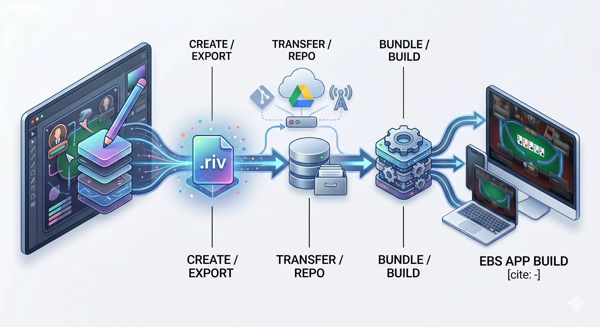

> *FIG · 경로 A — Create / Export → Transfer / Repo → Bundle / Build → EBS App Build*

### 4.2 경로 B — Rive Editor ↔ EBS API 직접 연동 (동적 통합)

```
   디자이너 (Rive Editor)
      |
      | "Player Card 디자인 완성"
      v
   +---------------------+
   |  Rive Editor        |
   |  "Publish" 버튼      |
   +---------------------+
      |
      | (Rive Cloud API)
      v
   +---------------------+
   |  Rive Cloud         |
   |  (디자이너의 작업물)  |
   +---------------------+
      |
      | (EBS 가 API 로 fetch)
      v
   +---------------------+
   |  EBS Asset Sync     |
   |  (자동 다운로드)     |
   +---------------------+
      |
      v
   +---------------------+
   |  EBS 런타임 즉시 반영 |
   +---------------------+
```

| 특징 | 설명 |
|------|------|
| 흐름 | 디자이너 publish → Rive Cloud → EBS 가 API 로 가져옴 → 런타임 반영 |
| 장점 | 디자이너 변경이 EBS 운영자에게 직접 전달. 파일 수동 전송 불필요 |
| 단점 | Rive Cloud 의존성. 인증 / 권한 / 버전 lock 메커니즘 필요 |
| 적합한 시기 | 후기 안정화, 라이브 시즌 중 빠른 디자인 보정 필요 시 |

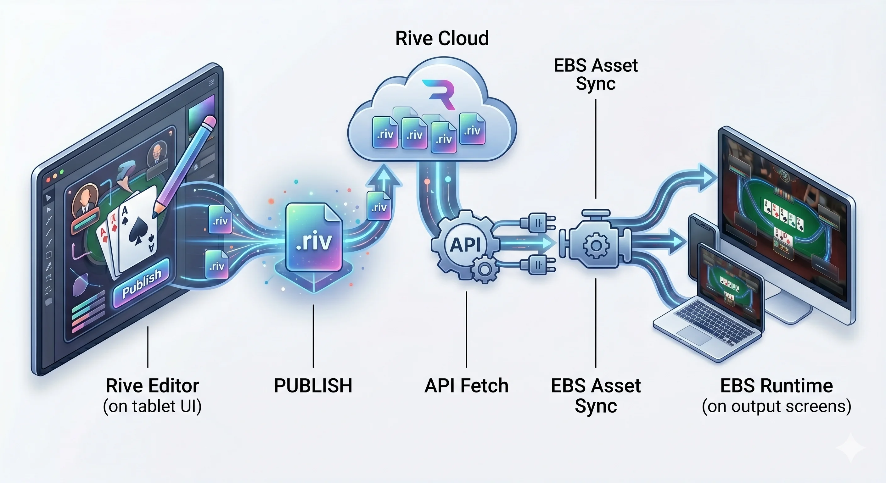

> *FIG · 경로 B — Editor publish → Rive Cloud → API Fetch → EBS Asset Sync → Runtime*

### 4.3 두 경로의 동시 운영 (권장 모델)

본 문서가 권장하는 1 차 가설은 — **두 경로의 동시 운영**:

| 환경 | 경로 |
|------|------|
| 개발 / 스테이징 | 경로 A (Export & Import, Git 관리) |
| 라이브 운영 | 경로 A 가 기본. 경로 B 는 긴급 디자인 보정 채널 |

```
   +--------------------------------+
   |       EBS Asset Loader         |
   +--------------------------------+
   |                                |
   |  1. assets/rive/{name}.riv     |  <- 경로 A (빌드 번들)
   |     (로컬 파일 우선)            |
   |                                |
   |  2. (옵션) Rive Cloud API      |  <- 경로 B (런타임 fetch)
   |     (긴급 override 시)         |
   |                                |
   +--------------------------------+
```

이 구조는 — 평소엔 안정된 빌드를 쓰고, 비상시에만 Cloud override 가 작동한다는 뜻이다.

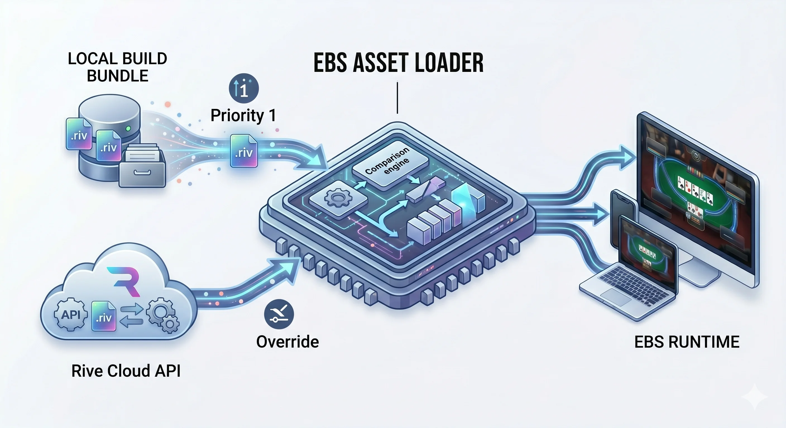

> *FIG · EBS Asset Loader — Local Build (Priority 1) + Rive Cloud API (Override)*

### 4.4 Rive Manager — 외부 자산을 EBS 로 들이는 단일 경로 (Foundation §A.3 cascade)

`.riv` 파일을 EBS 로 등록·검증·활성화하는 운영 인터페이스가 **Rive Manager** 다. 별도 앱이 아니라 **Lobby Web 내부 섹션** 으로 존재하며, **Admin 권한 전용** 이다 (Foundation §A.3).

```
   Import (.riv 업로드)
        |
        v
   Validate (변수 슬롯 / State 명명 규칙 확인)
        |
        v
   Preview (Rive 즉시 렌더 — 변수 mock 주입)
        |
        v
   Activate (시스템 활성 스킨으로 등록)
```

| 항목 | 내용 |
|------|------|
| 호스팅 위치 | Lobby Web 내부 섹션 (별도 앱 X — Foundation §7 "Settings, Rive Manager 는 Lobby 의 일부") |
| 권한 | Admin 전용 (Operator / Viewer 접근 X — RBAC, Foundation §15) |
| 메타데이터 | **Rive 파일 내장** (사내 Graphic Editor 폐기, D3 회의 2026-04-22) |
| 외부 도구 의존 | Rive Editor (디자이너) — Rive Manager 는 그 산출물을 받기만 함 |
| 4 단계 흐름 | Import → Validate → Preview → Activate |

> Ch.4.1 (경로 A) 와 Ch.4.2 (경로 B) 의 EBS 측 진입점이 모두 Rive Manager 다. Manager 가 곧 EBS 의 단일 자산 게이트.

<a id="ch5"></a>

## Ch.5 — Variable Binding

Rive 의 핵심 메커니즘은 그래픽의 거의 모든 속성이 **변수에 묶일 수 있다**는 데 있다.

### 5.1 Variable 이 무엇인가

`.riv` 파일 안에는 외부에서 주입할 수 있는 **Inputs** (변수) 가 들어 있다. 디자이너가 Rive Editor 에서 미리 선언한다.

| 변수 타입 | 의미 | 사용 예시 |
|-----------|------|----------|
| **Number** | 실수 / 정수 | `stack_amount = 480000` |
| **Boolean** | true / false | `is_folded = true` |
| **Trigger** | 1 회성 신호 | `play_fold_animation` |
| **Text** | 문자열 | `player_name = "PLAYER A"` (Rive 7+ 지원) |

### 5.2 Player Card 의 변수 예시

```
   player_card.riv 의 Inputs:
   +-----------------------------------+
   |  Number   stack_amount            |
   |  Number   bet_amount              |
   |  Number   equity_percent          |
   |  Boolean  is_to_act               |
   |  Boolean  is_folded               |
   |  Boolean  is_eliminated           |
   |  Trigger  on_action               |
   |  Text     player_name             |
   |  Text     country_code            |
   |  Text     hand_label              |
   +-----------------------------------+
```

### 5.3 데이터 소스 → 변수 매핑

위 변수 10 개에 데이터를 채우는 출처:

| 변수 | 출처 (데이터 소스) |
|------|------------------|
| `player_name` | EBS DB (selectedPlayerProfile.name) |
| `country_code` | EBS DB (selectedPlayerProfile.country) |
| `stack_amount` | Game Engine (engineState.players[i].stack) |
| `bet_amount` | Command Center (cc.lastBet) → Engine 정합 |
| `equity_percent` | Game Engine (engineState.equity[i]) |
| `is_to_act` | Game Engine (engineState.actorIndex == i) |
| `is_folded` | Command Center (cc.foldedSeats) |
| `is_eliminated` | Game Engine (engineState.eliminatedAt[i]) |
| `on_action` | Command Center (action 발생 시 trigger) |
| `hand_label` | Game Engine (engineState.handStrength[i]) |

> 위 매핑은 1 차 가설 제안. 실제 변수명과 데이터 경로는 외부 개발팀 / 디자이너 합의로 확정.

---

# Part III — 다섯 데이터 소스

이 Part 는 5 데이터 소스 각자를 자세히 들여다본다. 각 소스가 어떤 데이터를 가지고 있고, 그 데이터가 어떤 변수를 채우는지.

<a id="ch6"></a>

## Ch.6 — Rive Asset

### 6.1 Rive Asset 이 가져오는 것

| 요소 | 의미 |
|------|------|
| **Vector artwork** | 도형 / 색상 / 폰트 / 그림자 |
| **Timeline** | 키프레임 애니메이션 (페이드, 슬라이드, 회전) |
| **State Machine** | 상태 전이 규칙 |
| **Variable schema** | 외부에서 주입 받을 변수 목록 |

다른 네 데이터 소스는 모두 **데이터** 만 제공한다. Rive Asset 만이 **형태** 를 제공한다. 데이터가 어떻게 보일지를 결정하는 유일한 출처다.

### 6.2 디자이너의 책임

Rive Asset 을 만드는 주체는 **외부 디자이너** 다. 디자이너가 Rive Editor 에서 — 본 문서의 Part IV 11 카테고리 각각에 대해 — `.riv` 파일을 만든다.

디자이너의 의무 (외부 합의 후 확정):

| 의무 | 내용 |
|------|------|
| Variable 명명 규칙 | 본 문서 Ch.5.3 매핑 표를 표준으로 사용 |
| State 명명 규칙 | `idle` / `entering` / `exiting` / `highlighted` / `folded` / ... |
| Trigger 명명 규칙 | `on_action` / `on_fold` / `on_eliminate` / ... |
| Safe Zone 준수 | Ch.28 Title Safe 90% 안에 핵심 그래픽 배치 |
| 색상 변수화 | 하드코드 색상 금지 — Brand Pack 으로 override 가능하게 |

### 6.3 Brand Pack — 외부 분리된 색상 / 폰트 / 로고

대회마다 그래픽의 색·폰트·로고가 다르다. `.riv` 파일을 대회마다 새로 만들지 않고, `.riv` 안의 색·폰트·로고를 **Brand Pack** 이라는 별도 데이터로 분리하여 외부에서 주입한다.

```
   +-----------------------+         +-----------------------+
   |  player_card.riv      |  +      |  brand_packs/         |
   |  (변수만 정의)         |         |    wsop_2026.json     |
   +-----------------------+         |    ept_2026.json      |
              |                      |    gg_master.json     |
              |   (브랜드 변수 주입)   +-----------------------+
              v
   +-----------------------+
   |  화면 출력 결과         |
   |  - WSOP 일 때 검정·금색  |
   |  - EPT 일 때 빨강·검정   |
   |  - GG 일 때 청록·흰색    |
   +-----------------------+
```

Brand Pack 은 **EBS DB** 에 저장된다 (Ch.7 참조). 대회 하나가 시작되면 그 대회의 Brand Pack 이 모든 `.riv` 파일에 주입된다.

<a id="ch7"></a>

## Ch.7 — EBS DB

### 7.1 EBS DB 가 가져오는 것

EBS DB 는 **시간이 지나도 변하지 않는** 데이터의 저장소다. 한 핸드, 한 토너먼트가 끝나도 사라지지 않는다.

| 도메인 | 데이터 |
|--------|--------|
| **Player Profile** | 이름, 국적, 아바타 이미지, 경력, 별명 |
| **Tournament** | 대회명, 일정, 상금 풀, 바이인, 레벨 구조 |
| **Brand Pack** | 컬러 팔레트, 폰트, 로고 (3 종), 그래픽 모티프 |
| **Sponsor** | 스폰서 로고, 회전 슬롯, 노출 시간 |
| **History** | 이전 핸드 기록 |
| **Asset Index** | `.riv` 파일의 위치, 버전, 만료 |

### 7.2 어떻게 query 되는가

DB 의 데이터는 — Engine 또는 Renderer 가 — query 하여 Rive Variable 에 주입한다.

```
   +----------------+
   |  Game Engine   |
   +-------+--------+
           |
           | "이번 핸드 P3 좌석의 player_id 는?"
           v
   +-------+--------+
   |  RFID + Lobby   |  (RFID 좌석 매핑 + 좌석↔player 매핑)
   +-------+--------+
           |
           | "player_id = 472"
           v
   +-------+--------+
   |  EBS DB        |
   |  SELECT name,   |
   |  country, ...   |
   |  WHERE id=472   |
   +-------+--------+
           |
           v
   +-------+--------+
   |  Rive Variable |
   |  player_name   |
   |  country_code  |
   +----------------+
```

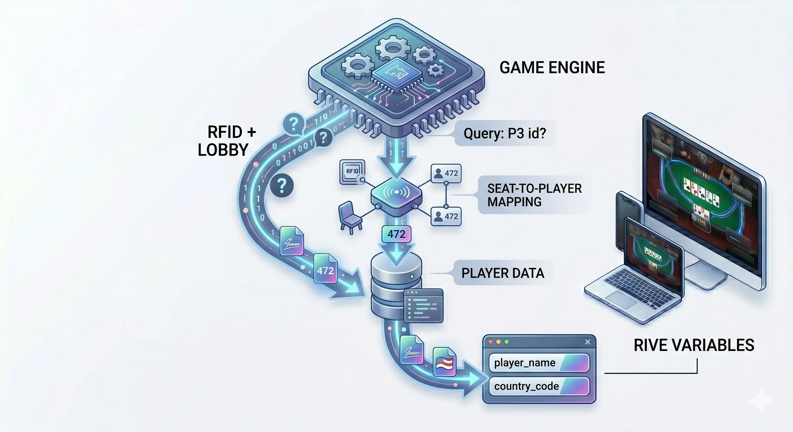

> *FIG · RFID + Lobby seat-map → DB query → Player Data → Rive Variables (player_name, country_code)*

### 7.3 캐싱 전략 (1 차 가설)

매 프레임마다 DB 를 조회하지 않는다. 한 핸드의 시작에 한 번 로드하여 **메모리 캐시** 에 둔다.

| 캐시 영역 | TTL |
|----------|-----|
| Player Profile (현재 테이블) | 한 핸드 |
| Tournament 정보 | 한 레벨 |
| Brand Pack | 한 대회 |
| Sponsor | 한 대회 |
| Asset Index | 앱 시작 시 |

> TTL (Time To Live) 정책은 1 차 가설. 외부 검증 후 확정.

<a id="ch8"></a>

## Ch.8 — Command Center 입력

### 8.1 Command Center 가 가져오는 것

운영자가 입력하는 — 다른 어떤 데이터 소스에도 없는 — 한 핸드의 **결정** 들.

**v0.7.0 architecture pivot** — CC 는 더 이상 6 물리 키에 제약되지 않는다. 입력은 **Mouse / Keyboard / Touch** 모두 지원하며, UI 컴포넌트 (버튼, 사이즈 슬라이더, 좌석 그리드 등) 가 입력 표면을 제공한다. 키보드는 **단축키** 로만 작동 (필수 X — 선택적 가속기).

#### 입력 방식 (3 종 — 운영자 환경 별 선택)

| 입력 방식 | 적합한 환경 | UI 표면 |
|----------|------------|--------|
| **Mouse** | 데스크톱 운영실 | 모든 버튼 / 모달 / 좌석 그리드 클릭 가능 |
| **Keyboard** | 빠른 운영자, 데스크톱 | 단축키 매핑 (아래 §8.1a) |
| **Touch** | 태블릿 / 휴대용 운영, 백업 운영 | 모든 버튼 / 모달 / 좌석 터치 가능 (mouse 와 동일 UI 표면) |

> **입력 동등성 원칙**: 모든 액션은 3 입력 방식 모두로 도달 가능해야 한다. Keyboard 전용 액션 금지 — 그래야 백업 운영자가 Touch 환경에서도 동일 워크플로우 수행 가능.

#### 8.1a 단축키 매핑 (Keyboard 선택적 가속기)

| 키 | 액션 | 컨텍스트 |
|:--:|------|---------|
| **N** | New Hand / Next Hand (Finish Hand) | 핸드 시작 / 종료 — 같은 키 컨텍스트 분기 |
| **F** | Fold | Bet 라운드 (베팅 의무 있는 좌석) |
| **C** | Call / Check | Bet 라운드 (Engine 컨텍스트 — 베팅 無 → Check, 有 → Call) |
| **B** | Bet / Raise | Bet 라운드 (사이즈 모달 진입) |
| **R** | Raise | Bet 라운드 (이미 베팅 있는 컨텍스트 — 별도 단축키, B 의 컨텍스트 분기를 명시적으로 분리) |
| **A** | All-in | Bet 라운드 |

> **v0.7.0 변경점**:
> - `N` 키는 **양방향** (New Hand 시작 + Next Hand = Finish Hand 동시) — 컨텍스트 분기
> - `B` 와 `R` 분리 (이전 v0.6.0 의 `B` 사이즈 모달 단일 키 → `B` (Bet/Raise 통합) + `R` (Raise 명시) 2 키로 분리). 운영자 명시적 의도 표현 우선
> - **`M` 키 primary action 제거** — Deal / Showdown / HandEnd 의 진행은 더 이상 단일 키 트리거가 아님. 각 단계는 UI 흐름 (자동 진행 또는 명시적 액션 버튼) 으로 대체 (Lego-Block 원칙 Ch.25 참조)

#### 액션 → Engine 흐름 (입력 방식 무관)

```
   Mouse click / Keyboard 단축키 / Touch tap
        |
        v
   Action Object 생성 (type / seat / amount)
        |
        v
   Engine 수신 → Rive Variable 갱신
```

> **시각 표식 (Ch.16) ↔ 입력 분리**: 시청자는 화면에서 FOLD/CHECK/BET/CALL/RAISE/ALL-IN 등 명시적 라벨을 본다. 운영자 입력 방식은 mouse/keyboard/touch — 시청자 화면에는 그 흔적이 남지 않는다.

### 8.2 입력이 변수로 가는 길

운영자의 한 입력 (Mouse click / Keyboard 단축키 / Touch tap) 이 — 화면의 그래픽 한 조각으로 변환되는 길. 아래 예시는 RAISE 입력 (입력 방식 무관 — 동일 Action Object 생성).

```
   운영자: [B] 키 또는 [Raise 버튼] click/tap -> 사이즈 모달 [30000] -> [Enter / Confirm]
                |
                v
   +---------------------+
   |  Command Center     |
   |  Action 객체 생성    |
   |  {                  |
   |    type: "RAISE",   |   <- Engine 이 컨텍스트 (이미 베팅 있음) 로
   |    seat: 3,         |      RAISE 라벨로 분류
   |    amount: 30000    |
   |  }                  |
   +---------+-----------+
             |
             v
   +---------------------+
   |  Game Engine 수신    |
   |  - 베팅 라운드 갱신   |
   |  - 팟 갱신           |
   |  - 다음 차례 결정     |
   +---------+-----------+
             |
             v
   +---------------------+
   |  Rive Variables     |
   |  - bet_amount[3] = 30000      |
   |  - on_action[3] (trigger)     |
   |  - actor_index = 4 (다음)     |
   |  - pot_total += 30000         |
   +---------+-----------+
             |
             v
   +---------------------+
   |  Rive 화면 갱신      |
   |  - P3 베팅 라인 등장 |
   |  - "RAISE" 라벨     |
   |  - P4 highlight     |
   |  - 팟 카운트업       |
   +---------------------+
```


> *FIG · 운영자 입력 (Mouse / Keyboard / Touch) → Action Object (RAISE seat:3 amount:30000) → Engine → Rive Variables → 화면 highlight*

### 8.3 Command Center 가 직접 변수에 닿는 것 vs Engine 을 거치는 것

| 변수 | 직접 / Engine 경유 |
|------|:-----------------:|
| `on_action` (trigger) | **직접** (CC → Rive) |
| 액션 라벨 텍스트 ("RAISE" 등) | **직접** |
| `bet_amount` | Engine (검증 + 정합 후) |
| `stack_amount` | Engine (베팅만큼 차감) |
| `pot_total` | Engine (합산) |
| `actor_index` (다음 차례) | Engine (게임 룰 적용) |

원칙: **즉각 반응이 필요한 시각 표식 (라벨, 트리거) 은 직접 / 계산이 필요한 숫자는 Engine 경유**.

<a id="ch9"></a>

## Ch.9 — RFID

### 9.1 RFID 가 가져오는 것

테이블 아래 깔린 **가변 안테나** 가 카드의 NFC 태그를 읽어 가져오는 단 한 가지 데이터 (Foundation §13 정합):

| 데이터 | 형식 |
|--------|------|
| 카드 ID | 무늬 + 숫자 (예: `AS` = Ace of Spades) |
| 좌석 / 위치 | 안테나 번호 → 좌석 / 보드 매핑 |
| 시점 | 카드가 안테나에 닿은 순간 |

#### 9.1a 안테나 수 — 동적 정의 (v0.7.0)

**v0.7.0 architecture pivot** — 안테나 수는 더 이상 hardcode 되지 않는다. **테이블 구성** 에 따라 가변:

| 변수 | 값 | 영향 |
|------|----|------|
| **좌석 수** | 8 ~ 10 (테이블 별) | 좌석 안테나 = 좌석 수와 동일 |
| **Muck Board 유무** | true / false | true → Muck 보드 안테나 +1 |
| **Community Board** | 항상 1 (Hold'em / Omaha / Stud 공통 board area) | community 안테나 = 1 |

**필수 안테나 포지션** (required positions only — 고정 갯수 X):

```
   Required:
     - 각 좌석마다 1 안테나 (좌석 수 = N, 8 <= N <= 10)
     - Community Board 영역 1 안테나
   Optional:
     - Muck Board 영역 1 안테나 (테이블이 Muck 분리 운영 시)

   안테나 총합 = N (좌석) + 1 (community) + 0 or 1 (muck)
              = 9 ~ 12 (이전 v0.6.0 의 "12 hardcode" 폐기)
```

> **Engine / Rive 변수 영향**: `rfid_status[]` 배열 길이도 가변 (이전 `rfid_status[1..12]` → `rfid_status[1..N+1]` 또는 `[1..N+2]`). 테이블 등록 시 EBS DB 가 `seat_count` + `has_muck_board` 메타데이터를 가지며, RFID Reader 가 부팅 시 이 메타데이터를 읽어 안테나 mapping 을 결정.

### 9.2 RFID 가 답하는 질문

> **"지금 좌석 3 의 첫 카드는 무엇인가?"**

이 질문에 답하는 것이 RFID 의 유일한 역할이다.

```
   가변 배치 예시 — 10 좌석 + Community + Muck (총 12 안테나):

   +----------------------------------------------+
   |                                              |
   |  [Muck Board]    [Community Board]           |
   |  (안테나 +1,     (안테나 +1,                 |
   |   optional)        required)                 |
   |                                              |
   |   [P1] [P2] [P3] [P4] [P5]                   |
   |    안테나 1~5                                |
   |                                              |
   |   [P6] [P7] [P8] [P9] [P10]                  |
   |    안테나 6~10                               |
   |                                              |
   +----------------------------------------------+
              ASCII MOCK · 가변 배치 (8~10 좌석 + Community + Muck optional)

   8 좌석 테이블 변형:
     안테나 = 8 (좌석) + 1 (community) + 0 (muck off) = 9
   9 좌석 테이블 + muck:
     안테나 = 9 (좌석) + 1 (community) + 1 (muck) = 11
   10 좌석 테이블 + muck:
     안테나 = 10 (좌석) + 1 (community) + 1 (muck) = 12
```

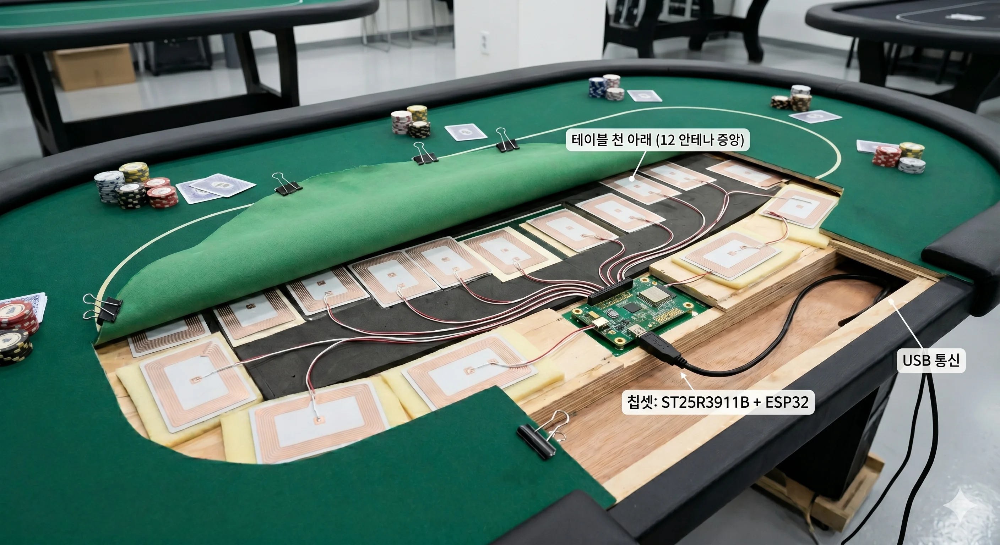

> *FIG · 실제 테이블 RFID 안테나 가변 배치 (ST25R3911B + ESP32, USB 통신) — 위 사진은 10 좌석 + Community + Muck = 12 안테나 사례. 8 좌석 / Muck 미운영 테이블은 안테나 9~11 가변.*

### 9.3 RFID 가 변수로 가는 길

```
   카드가 안테나 3 위에 놓임
        |
        v
   +---------------------+
   |  RFID 안테나 3 신호  |
   |  NFC ID = "AS"      |
   +---------+-----------+
             |
             v
   +---------------------+
   |  RFID Reader 변환    |
   |  {                  |
   |    seat: 3,         |
   |    slot: "hole_1",  |
   |    card: "AS"       |
   |  }                  |
   +---------+-----------+
             |
             v
   +---------------------+
   |  Game Engine 수신    |
   |  - 핸드 전개 검증     |
   |  - 카드 공개 시점 결정 |
   +---------+-----------+
             |
             v
   +---------------------+
   |  Rive Variables     |
   |  hole_card_1[3] = "AS"        |
   |  show_hole_card[3] (trigger)  |
   +---------------------+
```

### 9.4 보드 (커뮤니티) 의 특별한 흐름

좌석의 홀카드와 달리, 보드 카드는 **공개 시점이 게임 단계에 따라 결정**된다.

| 카드 | 공개 시점 |
|------|---------|
| 보드 1, 2, 3 (Flop) | Flop 이 시작될 때 |
| 보드 4 (Turn) | Turn 이 시작될 때 |
| 보드 5 (River) | River 가 시작될 때 |

RFID 가 카드를 인식해도 — 게임 단계가 도래해야 변수가 활성화된다.

```
   카드가 보드 안테나 위에 놓임
        |
        v
   RFID 인식 (즉시)
        |
        v
   +---------------------+
   |  Game Engine 보관    |
   |  pendingBoard[1..5]  |
   +---------+-----------+
             |
             | (게임 단계 도래 시 — Command Center 가 보냄)
             v
   +---------------------+
   |  Rive Variables     |
   |  community_card[i]  |
   |  show_community[i]  |
   +---------------------+
```


> *FIG · 보드 안테나 — 카드 놓기 → RFID 인식 → 게임 단계 도래 시 화면 등장*

<a id="ch10"></a>

## Ch.10 — Game Engine

### 10.1 Game Engine 이 가져오는 것

다른 네 데이터 소스의 입력을 받아 — **계산해서** 새 데이터를 만든다. 가장 풍부한 출력을 만드는 소스다.

| 계산 결과 | 의미 |
|-----------|------|
| `stack[i]` | 좌석 i 의 현재 칩 (베팅만큼 차감 누적) |
| `bet_round[i]` | 좌석 i 의 이번 라운드 베팅 합계 |
| `pot_main` | 메인 팟 |
| `pot_side[]` | 사이드 팟 (ALL-IN 시 분리) |
| `actor_index` | 지금 차례인 좌석 |
| `equity[i]` | 좌석 i 가 이길 확률 |
| `hand_strength[i]` | 좌석 i 의 현재 핸드 명칭 |
| `phase` | preflop / flop / turn / river / showdown |
| `hand_clock` | 한 핸드의 진행 시간 |
| `level_clock` | 레벨 남은 시간 |
| `players_left` | 토너먼트 전체 남은 인원 |
| `avg_stack` | 평균 스택 |
| `winner_seat` | 핸드 우승 좌석 (사이드 팟 분배에 사용) |

### 10.2 Game Engine 의 입력 의존성

Engine 은 단독으로 작동하지 않는다. 다른 네 데이터 소스의 입력에 기반한다.

```
   +---------------+   +---------------+   +---------------+
   |  EBS DB       |   |  RFID         |   | Command Center |
   |  (선수 정보,   |   |  (카드 정체)   |   | (액션 + 금액)  |
   |   토너 정보)   |   |               |   |                |
   +-------+-------+   +-------+-------+   +-------+-------+
           |                   |                   |
           +---------+---------+-------------------+
                     |
                     v
              +-------------+
              | Game Engine |
              |  (계산기)    |
              +------+------+
                     |
                     v
   +-----------------+-----------------+
   |   계산된 결과 → Rive Variables    |
   |                                   |
   |   stack / bet_round / pot         |
   |   actor_index / equity            |
   |   hand_strength / phase           |
   |   players_left / avg_stack ...    |
   +-----------------------------------+
```

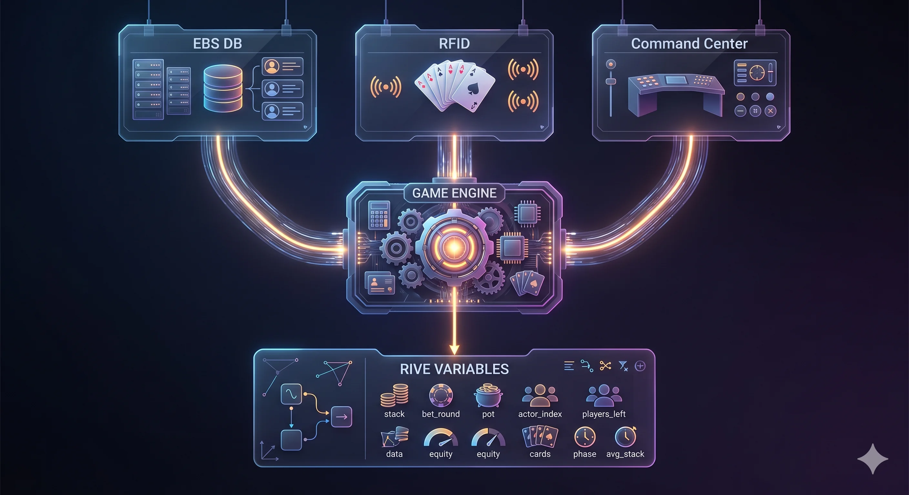

> *FIG · Game Engine — DB + RFID + CC 입력 → 10+ 계산 결과 → Rive Variables*

### 10.3 게임 룰의 변형

| 게임 | Engine 동작의 차이 |
|------|------------------|
| **NL Hold'em** | 표준. 홀카드 2 / 커뮤니티 5 |
| **PL Omaha** | 홀카드 4. Equity 시뮬 입력이 더 큼 |
| **Stud** | 커뮤니티 카드 없음. door card 분리 |
| **Razz** | "낮은 패가 이긴다". hand_strength 평가 반전 |
| **Mixed Game** | 게임 종목 회전. phase 와 별도로 game_type 변수 |

> Engine 의 게임 룰 상세는 Game_Rules 폴더 정본 참조.

### 10.4 Engine 이 직접 만지지 않는 변수

Engine 은 **계산** 의 책임만 진다. 다음 변수는 Engine 의 책임이 아니다:

| 변수 | 책임 소스 |
|------|----------|
| `player_name` | EBS DB |
| `country_code` | EBS DB |
| `brand_color_*` | EBS DB (Brand Pack) |
| `hole_card[i][j]` | RFID |
| `community_card[i]` | RFID (Engine 이 시점만 결정) |
| `last_action_label` | Command Center |
| `is_folded[i]` | Command Center (Engine 이 검증) |

<a id="ch11"></a>

## Ch.11 — 다섯의 합류

### 11.1 한 변수에서 다섯이 만나는 사례

5 데이터 소스는 **같은 변수에 동시에 쓰지 않는다**. 각 변수는 **단 하나의 소스가 책임**진다. 그러나 한 그래픽 조각을 만들기 위해서는 여러 변수가 동시에 채워져야 한다.

예시: **Player Card 한 장이 그려지려면**

```
   player_card.riv (P3 좌석)
   +-------------------------------------+
   |   변수             |  책임 소스      |
   +-------------------------------------+
   |   player_name      |  EBS DB         |
   |   country_code     |  EBS DB         |
   |   avatar_image     |  EBS DB         |
   |   stack_amount     |  Game Engine    |
   |   bet_amount       |  Game Engine    |
   |   equity_percent   |  Game Engine    |
   |   hand_label       |  Game Engine    |
   |   is_to_act        |  Game Engine    |
   |   is_folded        |  Command Center |
   |   on_action        |  Command Center |
   |   hole_card_1      |  RFID           |
   |   hole_card_2      |  RFID           |
   |   show_hole        |  Game Engine    |  (시점 결정)
   |   brand_color_*    |  EBS DB         |  (Brand Pack)
   |   (그래픽 형태)       |  Rive Asset     |  (.riv 파일)
   +-------------------------------------+
```

5 소스 모두가 한 Player Card 의 변수를 채운다. 한 소스라도 빠지면 그 자리는 변수가 default 값으로 남는다.

### 11.2 합류 다이어그램

```
   +----------+   +----------+   +----------+   +----------+   +----------+
   |  Rive    |   |  EBS DB  |   |   CC     |   |  RFID    |   | Engine   |
   |  Asset   |   |          |   |          |   |          |   |          |
   +----+-----+   +----+-----+   +----+-----+   +----+-----+   +----+-----+
        |              |              |              |              |
        | (그래픽)     | (이름·       | (액션·       | (카드        | (계산된
        |              |  Brand)      |  trigger)    |  ID)         |  숫자)
        |              |              |              |              |
        v              v              v              v              v
   +-----------------------------------------------------------------------+
   |                    Rive Variables (player_card.riv)                   |
   |                                                                       |
   |   player_name | brand_* | bet_amount | hole_card | stack | equity ... |
   +---------------------------------+-------------------------------------+
                                     |
                                     v
                         +------------------------+
                         |   Rive Renderer        |
                         |   (변수 -> 픽셀)       |
                         +------------+-----------+
                                      |
                                      v
                         +------------------------+
                         |   Overlay 화면 출력     |
                         +------------------------+
```

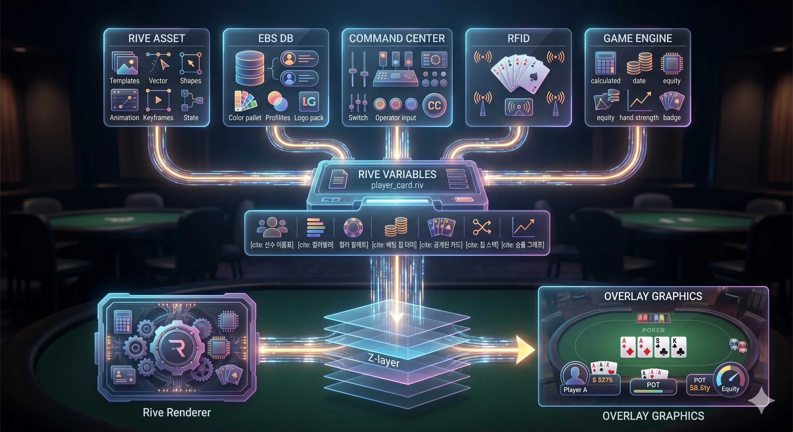

> *FIG · 5 데이터 소스 → Rive Variables → Renderer (Z-layer) → Overlay 최종 출력*

### 11.3 변수 책임 매트릭스 (요약)

본 매트릭스는 5 데이터 소스가 11 카테고리에 어떻게 기여하는지를 한 번에 보여준다.

```
                      Rive   EBS    CC     RFID   Engine
                      Asset  DB
   ----------------- ------ ------ ------ ------ -------
   Player Card        Asset  이름   폴드   좌석    스택
   Stack + Bet        Asset  -      -      -      합산
   홀카드             Asset  -      -      ID     공개시점
   커뮤니티 카드       Asset  -      -      ID     공개시점
   Hand Strength      Asset  -      -      -      계산
   액션 표식          Asset  -      라벨   -      차례
   팟                 Asset  -      -      -      합산
   블라인드           Asset  스케줄  -      -      현재값
   토너먼트 상태       Asset  기준값  -      -      현재값
   시계               Asset  -      Time   -      카운트
                              -    Bank
   브랜딩             Asset  Brand  -      -      -
                              Pack
   운영자 표식        Asset  -      모드   진단    응답상태
```

이 표는 Part IV 본문의 12 챕터에서 각각 자세히 풀어진다.

---

# Part IV — 그래픽 요소 카탈로그

이 Part 의 12 챕터는 같은 형식을 갖는다.

| 섹션 | 내용 |
|------|------|
| {N}.1 시각 | 그래픽이 어떻게 보이는가 (ASCII mockup) |
| {N}.2 데이터 소스 매핑 | 어디에서 어떤 데이터가 오는가 |
| {N}.3 변화의 순간 | 언제 그래픽이 바뀌는가 |

<a id="ch12"></a>

## Ch.12 — 플레이어 정체성

### 12.1 시각

```
  +-----------------------------+
  | [국기] PLAYER A (가공)       |  <- 이름 (Primary)
  |        Country               |  <- 국적 (Secondary)
  |                              |
  |  Stack: 1,250,000            |  <- 칩 스택
  |  ━━━━━━━━━━━━━━━━━━━━━━━━━ |  <- 스택 바
  |                              |
  |  [Avatar 64x64]              |  <- 아바타 (선택)
  +-----------------------------+
              ASCII MOCK · Player Card 기본형
```

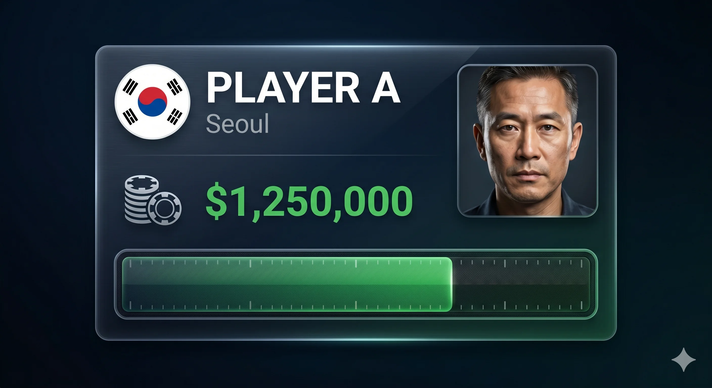

> *FIG · Player Card 시안 — 국기 + 이름 + 도시 + 아바타 + Stack + 게이지*

### 12.2 데이터 소스 매핑

| 변수 | 데이터 소스 |
|------|------|
| Rive Asset (도형, 폰트, 그림자) | Rive Asset (`player_card.riv`) |
| `player_name` | EBS DB (Player Profile) |
| `country_code` + 국기 이미지 | EBS DB |
| `avatar_image` | EBS DB |
| `seat_index` (좌석 매핑) | RFID + Lobby seat-map |
| `stack_amount` | Game Engine |
| `is_to_act` | Game Engine |
| `is_folded` | Command Center |
| `is_eliminated` | Game Engine |
| `brand_color_*` | EBS DB (Brand Pack) |

### 12.3 변화의 순간

| 이벤트 | 변화 |
|--------|------|
| 좌석 착석 | Entry 애니메이션 (페이드 + 슬라이드) |
| 칩 스택 변동 | Stack 숫자 Tween |
| 차례 (To Act) | highlight border 펄싱 |
| 폴드 | dim + grayscale + 50% 투명 |
| 탈락 | Exit 애니메이션 |
| 다른 테이블로 이동 | Player Card 제거 |


<a id="ch13"></a>

## Ch.13 — 칩 스택과 베팅 라인

### 13.1 시각

```
  +----------------------------+        +----------------------------+
  | PLAYER A (가공)             |        | PLAYER B (가공)             |
  | Stack: 1,250,000           |        | Stack:   480,000           |
  +----------------------------+        +----------------------------+
            |                                       |
            v  Bet: 50,000                          v  Bet: 50,000
       [Chip Stack Icon]                       [Chip Stack Icon]
            \                                     /
             \                                   /
              \         [POT: 250,000]          /
               \________/                \_____/
              ASCII MOCK · 베팅 라인이 팟으로 흘러가는 모습
```

### 13.2 데이터 소스 매핑

| 변수 | 데이터 소스 |
|------|------|
| Rive Asset (라인 도형, 칩 아이콘) | Rive Asset (`stack_bet.riv`) |
| `stack_amount` | Game Engine |
| `bet_amount` (이번 라운드) | Command Center → Engine 검증 |
| 색상 (스택 위계 — 안정/위험) | Rive Asset 변수 (Engine 이 임계값 비교 후 색상 변수 주입) |

### 13.3 변화의 순간

| 이벤트 | 변화 |
|--------|------|
| BET / RAISE / CALL | 칩 → 베팅라인 슬라이드 + 숫자 카운트업 |
| 라운드 종료 | 베팅 라인 → 팟 sweep 애니메이션 |
| ALL-IN | 전체 stack → 베팅라인 통째 이동 |

### 13.4 스택 위계 색상 (1 차 가설)

| 스택 크기 | 제안 색상 | 이유 |
|-----------|----------|------|
| > 평균 × 1.5 | Green | 안정 |
| 평균 ± 50% | White | 보통 |
| < 평균 × 0.5 | Yellow | 위험 |
| < BB × 10 | Red | 다음 핸드면 모든 칩이 블라인드로 사라질 수 있는 위치 |

> 색상은 1 차 가설. 외부 디자이너 / 방송 PD 검증 후 확정.


<a id="ch14"></a>

## Ch.14 — Community & Table Layout (Hole + Community **완전 분리**)

> **v0.7.0 architecture pivot — Hole vs Community 완전 분리**: 이전 v0.6.0 까지 두 카드 종류가 같은 챕터 안에 grouped 되어 있었으나, **각각 독립 Lego-Block 으로 분리** (Ch.25 Lego-Block Modular Architecture 참조). 두 카드 종류는 별도 `.riv` 파일 (`hole_card.riv` / `community_card.riv`) + 별도 트리거 + 별도 load/unload 라이프사이클.

| 카드 종류 | 책임 영역 | 라이프사이클 |
|----------|---------|------------|
| **Hole Cards** | Player Info Window 내부 — 각 좌석 별 독립 인스턴스 | Deal Act 시점 트리거 → 좌석별 load → Showdown 또는 Fold 시 unload |
| **Community Cards** | Table Center 영역 — 보드 인스턴스 단일 | Flop/Turn/River 트리거 시 load → Hand End 시 unload |

> **Flop 동시 표시 룰 (v0.7.0 신규)**: 실제 테이블에서 딜러가 Flop 카드를 **하나씩** 열어 보드 위에 놓는다 (RFID 가 순차 인식). 그러나 **Rive Overlay 는 3 장을 동시에 표시** 한다 — Engine 이 `FlopReady` 트리거 발행 시점에 `community_card[1..3]` 가 동시 활성화. 시청자 시선이 흩어지지 않도록 시각적으로 통합. 단, 카드 3 장이 모두 RFID 인식되어야 트리거 발행 — 부분 인식 상태에서 트리거 금지.

### 14.1 시각 — 홀카드

```
   카메라 화면 (실물)             Overlay 가 덧씌운 화면

   +-------+                       +-------+
   | (뒤)  |                       | A♠ K♠ |
   |       |       =>              | (앞면 |
   |       |                       |  공개) |
   +-------+                       +-------+
   플레이어 손에 있는              RFID 가 인식한 카드를
   뒤집힌 카드                      Overlay 가 덧씌움
```

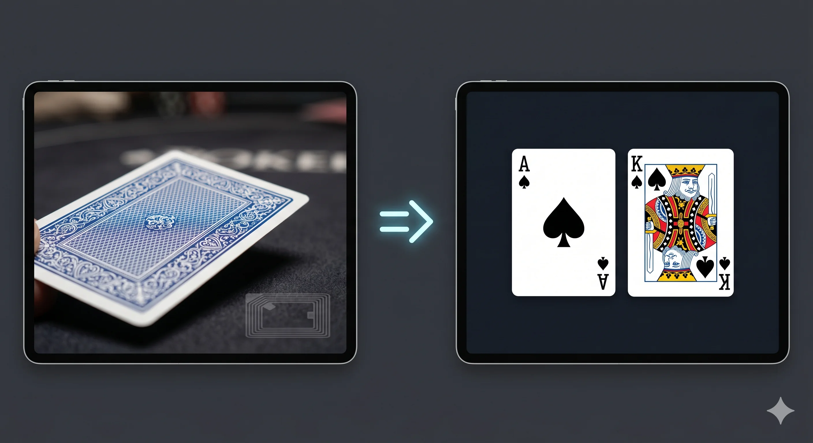

> *FIG · 카메라 화면 (RFID 태그 있는 뒤집힌 카드) → Overlay 덧씌움 (A♠ K♠ 앞면 공개)*

### 14.2 시각 — 커뮤니티

```
  +--------------------------------------------+
  |                                            |
  |  [ A♠ ] [ K♥ ] [ Q♦ ]  <- Flop (3 장)        |
  |                                            |
  |  [ A♠ ] [ K♥ ] [ Q♦ ] [ J♣ ]                |
  |                              ↑             |
  |                            Turn (4 번째)    |
  |                                            |
  |  [ A♠ ] [ K♥ ] [ Q♦ ] [ J♣ ] [ T♠ ]         |
  |                                    ↑       |
  |                                  River     |
  |                                (5 번째)     |
  +--------------------------------------------+
              ASCII MOCK · Flop -> Turn -> River
```

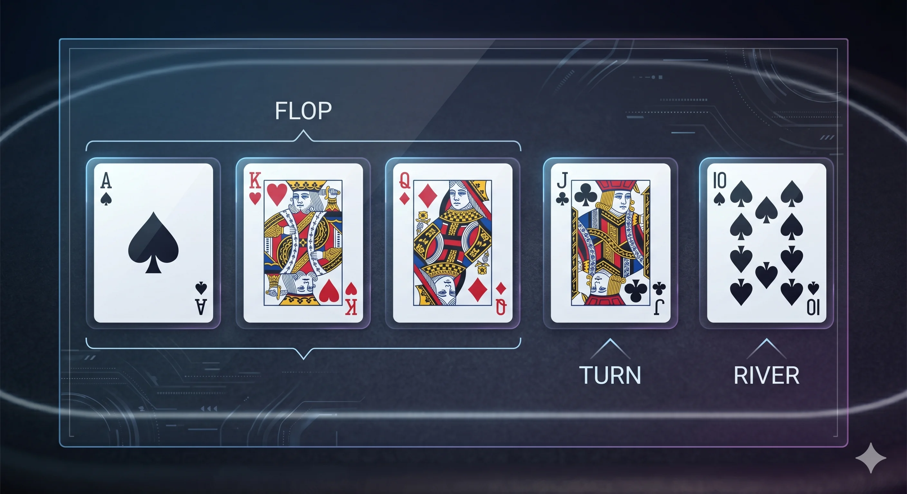

> *FIG · Flop (3 장) + Turn (1 장) + River (1 장) — 5 장 커뮤니티 카드*

### 14.3 데이터 소스 매핑

| 변수 | 데이터 소스 |
|------|------|
| Rive Asset (카드 도형, 무늬 SVG) | Rive Asset (`hole_card.riv`, `community_card.riv`) |
| `card_id` (예: "AS") | RFID |
| `seat_index` / `board_slot` | RFID (안테나 매핑) |
| `show_card` (공개 시점 trigger) | Game Engine (게임 단계 도래 시) |

### 14.4 카드 등장 4 단계

```
  +-----+       +-----+       +-----+       +-----+
  |     |  ->   |  ▌  |  ->   |  /  |  ->   | A♠ |
  | (뒤)|       |회전 |       |회전 |       |(앞) |
  +-----+       +-----+       +-----+       +-----+
   단계 1        단계 2        단계 3        완료
```


> *FIG · 카드 Flip 4 단계 — 뒤 → 회전 → 회전 → 앞면 (A♠)*

> 회전 키프레임의 길이와 보간은 디자이너의 영역. 본 문서는 단계의 존재만 정의한다.


<a id="ch15"></a>

## Ch.15 — 핸드 강도와 Equity

### 15.1 시각

```
  +----------------------------------+
  | PLAYER A (가공)                   |
  | A♠ K♠                             |
  |                                  |
  | Flush Draw                       |  <- 핸드 명칭
  | --------                         |
  | 65.2%                            |  <- Equity (%)
  | ▰▰▰▰▰▰▱▱▱                        |  <- 시각 게이지
  +----------------------------------+
              ASCII MOCK · Hand Strength + Equity
```

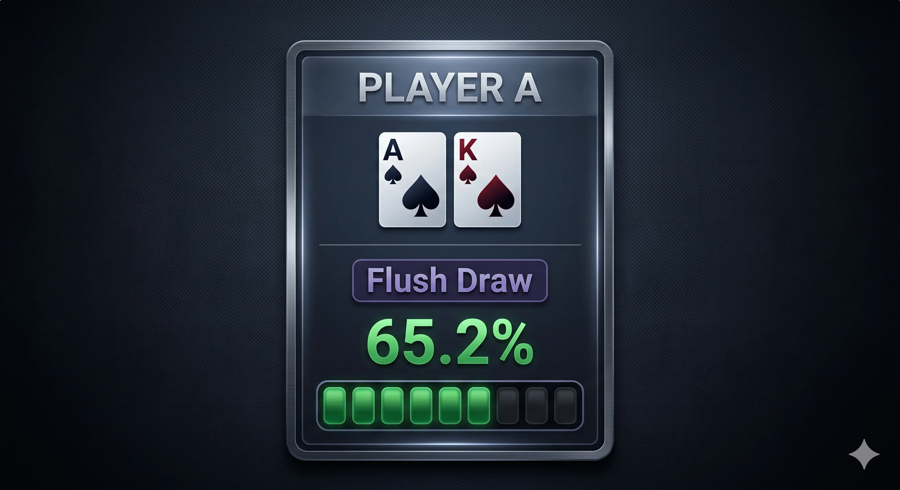

> *FIG · Hand Strength + Equity 시안 — Flush Draw 65.2% + 시각 게이지*

### 15.2 데이터 소스 매핑

| 변수 | 데이터 소스 |
|------|------|
| Rive Asset (게이지 도형) | Rive Asset (`hand_strength.riv`) |
| `hand_label` (예: "Flush Draw") | Game Engine |
| `equity_percent` | Game Engine |
| `is_winning` (우승 가능성 100%) | Game Engine |

### 15.3 핸드 명칭 (11 종)

| 명칭 | 영문 |
|------|------|
| 하이카드 | High Card |
| 원페어 | One Pair |
| 투페어 | Two Pair |
| 트립스 / 셋 | Three of a Kind |
| 스트레이트 | Straight |
| 플러시 | Flush |
| 풀하우스 | Full House |
| 포카드 | Four of a Kind |
| 스트레이트 플러시 | Straight Flush |
| 로열 플러시 | Royal Flush |
| (드로우) | Straight Draw / Flush Draw |

### 15.4 Equity 의 변화

| 단계 | Engine 시뮬 |
|------|-----------|
| Preflop | 보유 카드만으로 시뮬 |
| Flop | + 커뮤니티 3 장, 남은 2 장 시뮬 |
| Turn | + 커뮤니티 4 장, 남은 1 장 시뮬 |
| River | 100% 또는 0% 확정 |

게이지가 100% 가 되면 — 우승 직전을 알리는 황금색 펄싱 (Rive Asset 책임).

<a id="ch16"></a>

## Ch.16 — Action Indicators (Check/Bet/Call/Raise/Fold)

### 16.1 5 시각 표식 ↔ 입력 매핑 (v0.7.0)

**v0.7.0 architecture pivot — 시각 표식 범위 축소**: 시청자에게 보이는 액션 표식은 **5 종 만**. **NEW HAND / DEAL 은 visual X** (시청자 화면 미반영 — 운영자 흐름 제어 전용).

| 시각 표식 | 표시 | 색상 (1 차 가설) | 입력 (Mouse/Keyboard/Touch) |
|----------|------|:----------------:|---------------------------|
| **CHECK** | "CHECK" 텍스트 | 청색 | C (베팅 無 컨텍스트) / Check 버튼 |
| **BET** | 칩 → 베팅라인 + "BET" 라벨 | 황색 | B (사이즈 모달) / Bet 버튼 |
| **CALL** | 칩 → 베팅라인 매칭 | 청색 | C (베팅 有 컨텍스트) / Call 버튼 |
| **RAISE** | 칩 → 베팅라인 + "RAISE" 라벨 | 적색 | R (명시) 또는 B (베팅 有 컨텍스트) / Raise 버튼 |
| **FOLD** | 카드 회색 + 좌석 dim | 회색 | F / Fold 버튼 |

> **ALL-IN 은 별도 표식이 아니다 (v0.7.0)** — ALL-IN 발생 시 해당 player info window 에 emphasis 처리 (아래 §16.2). 전화면 박스 X.

> **NEW HAND / DEAL 제외 사유**: 두 액션은 운영자가 흐름을 진행시키는 신호일 뿐, 시청자가 볼 시각적 변화는 다른 카테고리 (Player Card 등장, 홀카드 Flip) 에 흡수되어 있음. 별도 표식 중복 → 제거.

> 색상은 1 차 가설. 외부 디자이너 / Brand Pack 별 override.

### 16.2 ALL-IN Emphasis — Player Info Window 강조 (v0.7.0)

**v0.7.0 architecture pivot — 별도 ALL-IN 박스 폐기**: 이전 v0.6.0 까지 ALL-IN 발생 시 전화면 모달 (★★★ ALL-IN ★★★ 박스) 을 띄웠으나, **해당 player info window 에 강한 시각 강조** 로 변경. Lego-Block 원칙 (Ch.25) 정합 — 화면 전체 차폐 대신 해당 좌석 window 만 emphasis state 진입.

```
   ALL-IN 발생 → P3 좌석 player info window 만 emphasis:

   +-----------------------------+
   | [국기] PLAYER A (가공)       |  <- 평소
   |        Country               |
   |  Stack: 1,250,000            |
   +-----------------------------+

   ===== ALL-IN 발생 후 =====

   ╔═════════════════════════════╗   <- 강조 border (pulsing)
   ║ [국기] PLAYER A (가공)       ║
   ║        Country               ║
   ║  ALL-IN: 1,250,000           ║   <- stack → ALL-IN 라벨 + 진동 색
   ║  ▰▰▰▰▰▰▰▰▰▰ (펄싱)            ║
   ╚═════════════════════════════╝
              ASCII MOCK · player info window 내부 emphasis (별도 박스 X)
```

| 시각 효과 | 구현 |
|----------|------|
| **Border pulsing** | Rive State Machine `all_in_emphasis` 상태 — 펄싱 속도 1.5Hz |
| **색상 변화** | Brand Pack `all_in_emphasis_color` 변수 (1 차 가설 적색 + 황색 그라데이션) |
| **Stack 라벨 변환** | "Stack: ..." → "ALL-IN: ..." 텍스트 transform |
| **차폐 X** | 화면 다른 영역 (다른 좌석, 팟, 시계) 모두 평소 z-layer 유지 |

> **왜 변경했는가**: 전화면 박스는 시청자 시선을 카메라 영상 (실제 테이블) 에서 떼어버리는 효과 → 방송 임팩트 ↓. 좌석 emphasis 만으로도 ALL-IN 신호는 명확히 전달됨. 또한 Lego-Block 원칙 — 각 graphic element 가 독립 라이프사이클을 갖는다 → 전화면 모달 같은 cross-cutting 요소는 원칙에 반함.

### 16.3 데이터 소스 매핑

| 변수 | 데이터 소스 |
|------|------|
| Rive Asset (라벨 도형, 박스) | Rive Asset (`action_badge.riv`) |
| 라벨 텍스트 ("RAISE" 등) | Command Center |
| `on_action` trigger | Command Center |
| 라벨 색상 | EBS DB (Brand Pack) — `action_color_raise` 등 |
| `all_in_emphasis[seat]` (boolean) | Game Engine (전체 스택 commit 시 true) |
| ALL-IN 시 amount 표시 | Game Engine (전체 스택값) → Player Info Window 내부 |

<a id="ch17"></a>

## Ch.17 — 팟

### 17.1 시각 — 메인 + 사이드

```
  +======================================================+
  |                                                      |
  |        (테이블 + 좌석 + 카드)                          |
  |                                                      |
  |    [Main Pot: 800,000]    [Side Pot 1: 300,000]      |
  |                            (P3 only)                  |
  |    [Side Pot 2: 150,000]                              |
  |    (P5 only)                                          |
  |                                                      |
  +======================================================+
              ASCII MOCK · 다중 사이드 팟 표시
```

### 17.2 데이터 소스 매핑

| 변수 | 데이터 소스 |
|------|------|
| Rive Asset (팟 박스, 칩 그래픽) | Rive Asset (`pot.riv`) |
| `pot_main_amount` | Game Engine |
| `pot_side[i]_amount` | Game Engine (ALL-IN 시 분리) |
| `pot_side[i]_eligible_seats[]` | Game Engine (자격 좌석 배열) |
| `winner_seat` (사이드 팟 분배 시) | Game Engine |

### 17.3 Edge-Case 분석 (v0.7.0)

**v0.7.0 architecture pivot — 팟 계산 범위 명시**: 이전 "winner/loser seat 만" 단순 모델 폐기. 다음 edge-case 모두 Engine 이 계산하여 Rive 변수에 주입:

| Edge-Case | 시나리오 | Engine 계산 | Rive 표시 |
|----------|---------|------------|----------|
| **Single winner** | 1 좌석만 핸드 강도 최상 | `winner_seat[0] = seatX`, 메인 팟 전체 → seatX | 메인 팟 → seatX stack 흡수 애니메이션 |
| **Split pot (동일 핸드)** | 2+ 좌석 정확히 동일 핸드 강도 | `winner_seat[0..n]` 다수, amount 균등 분배 | 메인 팟 → 각 seat 분할 sweep |
| **Side pot ALL-IN 분리** | 1+ 좌석 ALL-IN, 나머지 추가 베팅 | 메인 팟 (ALL-IN 좌석 자격) + 사이드 팟 (잔여 베팅 좌석 자격) 분리 | 별도 박스 등장 + 각 자격 좌석 매칭 |
| **Multi-way side pot** | 2+ 좌석 다른 시점 ALL-IN | 사이드 팟 다수 생성 (각 ALL-IN 시점별) | `pot_side[1..k]` 다중 박스 |
| **Uncalled bet 반환** | 마지막 베팅 매칭 없음 | uncalled amount 를 betting 좌석에 즉시 반환 | 베팅 라인 → 본인 stack 으로 역방향 sweep |
| **Dead chip (Antes)** | 베팅 라운드 전 ante 누적 | ante 합산은 메인 팟 시작값으로 합류 | 핸드 시작 시 팟 초기값 즉시 표시 |
| **All-in over-bet 정합** | ALL-IN 좌석 추가 액션 불가 | ALL-IN 좌석은 모든 후속 액션에서 actor_index 제외 | Player Info window 의 `all_in_emphasis` 유지, betting 라인 X |

> **계산 책임은 Engine 단독** — Rive 는 결과 변수 (`pot_main_amount`, `pot_side[i]_amount`, `pot_side[i]_eligible_seats[]`, `uncalled_return_seat`, `uncalled_return_amount`) 만 받아 시각화.

### 17.4 변화의 순간

| 이벤트 | 애니메이션 |
|--------|-----------|
| 베팅 추가 | 팟 숫자 카운트업 tween |
| 라운드 종료 | 베팅 라인 → 팟 sweep |
| 사이드 팟 생성 | 메인 팟에서 분리 + 새 박스 등장 |
| Uncalled bet 반환 | 베팅 라인 → 본인 stack 역방향 sweep |
| 핸드 종료 (팟 분배) | 팟 박스 페이드 아웃 |


<a id="ch18"></a>

## Ch.18 — 블라인드와 레벨

### 18.1 시각

```
  +============================================+
  |  Level {N}                                  |
  |  Blinds: {SB} / {BB}                        |
  |  Ante:   {Ante}                             |
  |  Time Left: {MM:SS}                         |
  +============================================+
              ASCII MOCK · 좌측 하단 블라인드 박스
```

### 18.2 레벨 전환 알림 (1 분 전)

```
  +======================================================+
  |                                                      |
  |    NEXT LEVEL IN 1:00                                |
  |    Blinds will increase to {next-SB} / {next-BB}     |
  |    Ante: {next-ante}                                 |
  |                                                      |
  +======================================================+
              ASCII MOCK · 레벨 전환 1 분 전 알림 (상단 배너)
```

### 18.3 데이터 소스 매핑

| 변수 | 데이터 소스 |
|------|------|
| 그래픽 형태 | Rive Asset (`blind_level.riv`) |
| `level_index` | Game Engine |
| `sb_amount` / `bb_amount` / `ante_amount` | EBS DB (스케줄) → Engine (현재 레벨 lookup) |
| `level_clock` | Game Engine |
| `next_level_*` (전환 알림용) | EBS DB (다음 레벨 미리 fetch) |

<a id="ch19"></a>

## Ch.19 — 토너먼트 상태 — **JSON DB Output Only (No EBS Rendering)**

> **v0.7.0 architecture pivot — 영역 B 분류**: 토너먼트 상태 (players total/left/avg stack/ITM/prize pool) 는 **EBS Rive Rendering 책임 밖**. EBS 는 JSON DB 로만 출력하며, 외부 그래픽 시스템 (방송 자막 시스템, Tournament Director software, 외부 송출용 그래픽 엔진) 이 자체 렌더링한다.
>
> 본 챕터는 **참고 ASCII mockup + JSON 스키마 정의** 로 풀이. Rive Asset / Rive Variable 정의 X — `tournament_state.riv` 는 **존재하지 않는다**.

### 19.1 시각 (참고만 — 외부 시스템 자체 렌더링)

```
  +======================================================+
  |  {Tournament Name} · Day {N}                          |
  |                                                      |
  |  Players Left:  {N} / {Total}                        |
  |  Avg Stack:     {Average}                            |
  |  ITM:           {ITM-position} (Top {%})             |
  |  Prize Pool:    ${Total}                             |
  |  Next Payout:   ${Amount} ({Position})               |
  +======================================================+
              ASCII MOCK · 토너먼트 상태 (우상단)
```

### 19.2 JSON DB Output 스키마 (EBS → 외부 시스템)

```json
{
  "tournament_state": {
    "tournament_name": "WSOP Paradise 2026 Main Event",
    "day": 3,
    "total_players": 1842,
    "players_left": 312,
    "avg_stack": 472000,
    "itm_position": 280,
    "prize_pool_usd": 18420000,
    "next_payout": {
      "amount_usd": 32000,
      "position": 280
    }
  }
}
```

| JSON 키 | EBS 측 데이터 소스 |
|--------|------------------|
| `tournament_name` / `day` | EBS DB (대회 메타) |
| `total_players` | EBS DB (등록 인원) |
| `players_left` | Game Engine (탈락 누적 추적) |
| `avg_stack` | Game Engine (계산) |
| `itm_position` | EBS DB (상금 구조) |
| `prize_pool_usd` | EBS DB |
| `next_payout` | EBS DB |

> **출력 채널**: WebSocket 또는 HTTP poll (외부 시스템 합의). Update 주기는 외부 시스템 요구 (1Hz / 5Hz / on-change).

### 19.3 ITM 신호 (외부 시스템이 어떻게 시각화할지는 자유)

| ITM 거리 | EBS 가 emit 하는 JSON 신호 |
|----------|-----------|
| Bubble 까지 5 명 | `{"bubble_distance": 5}` |
| Bubble 까지 1 명 | `{"bubble_distance": 1, "is_bubble_imminent": true}` |
| Bubble Burst | `{"event": "bubble_burst", "burst_player_id": 472}` |

> 외부 시스템이 "BUBBLE" 배너 / "MONEY!" 애니메이션을 어떻게 표현할지는 그 시스템의 영역. EBS 는 신호만.

<a id="ch20"></a>

## Ch.20 — 시계 — **JSON DB Output Only (No EBS Rendering)**

> **v0.7.0 architecture pivot — 영역 B 분류**: Hand Clock + Level Clock 은 **EBS Rive Rendering 책임 밖**. EBS 는 JSON DB 로만 출력하며, 외부 그래픽 시스템 / 방송 자막 시스템이 자체 렌더링한다.
>
> Rive Asset (`clock.riv`) 은 **존재하지 않는다** — 폐기. 단, 카운트다운 시각 효과 / 폰트 / 색상 등은 외부 시스템 영역.

### 20.1 두 종류

| 시계 | 측정 | EBS 책임 |
|------|------|---------|
| **Hand Clock** | 한 핸드의 진행 시간 | JSON 송출만 |
| **Level Clock** | 레벨 남은 시간 | JSON 송출만 |

### 20.2 JSON DB Output 스키마

```json
{
  "clocks": {
    "hand_clock_seconds": 47,
    "level_clock_seconds": 1843,
    "level_index": 12
  }
}
```

| JSON 키 | EBS 측 데이터 소스 |
|--------|------------------|
| `hand_clock_seconds` | Game Engine (핸드 시작 후 경과) |
| `level_clock_seconds` | Game Engine (레벨 남은 초 카운트다운) |
| `level_index` | Game Engine (현재 레벨 — 외부 시스템이 SB/BB 매핑) |

> **출력 채널**: WebSocket (1Hz update) 권장 — 시계는 초 단위 변경. Update 주기는 외부 시스템 요구.

<a id="ch21"></a>

## Ch.21 — 브랜딩 — **JSON DB Output Only (No EBS Rendering)**

> **v0.7.0 architecture pivot — 영역 B 분류**: Sponsor logos / tournament names / watermark / banner 회전 등 브랜딩 그래픽은 **EBS Rive Rendering 책임 밖**. EBS 는 JSON DB 로 sponsor 메타데이터 + 회전 스케줄만 출력하며, 외부 그래픽 시스템 / 방송 자막 시스템이 자체 렌더링한다.
>
> Rive Asset (`branding.riv`) 은 **존재하지 않는다** — 폐기. 단, 본 챕터의 "4 슬롯 배치" + Brand Pack 의 `color`/`font` 변수 (Player Info / Pot / Action 등 영역 A 카테고리에 주입되는 부분) 는 영역 A 의 일부로 유지 (Ch.6.3 참조).

### 21.1 4 슬롯 (외부 시스템 가이드라인)

```
  +======================================================+
  |  [Tournament Logo]                    [Sponsor Logo] |
  |                                                      |
  |       (테이블 콘텐츠)                                  |
  |                                                      |
  |  [Watermark · 우하단]                                  |
  |  [Bottom Banner — 회전 광고]                          |
  +======================================================+
              ASCII MOCK · 4 브랜딩 슬롯
```

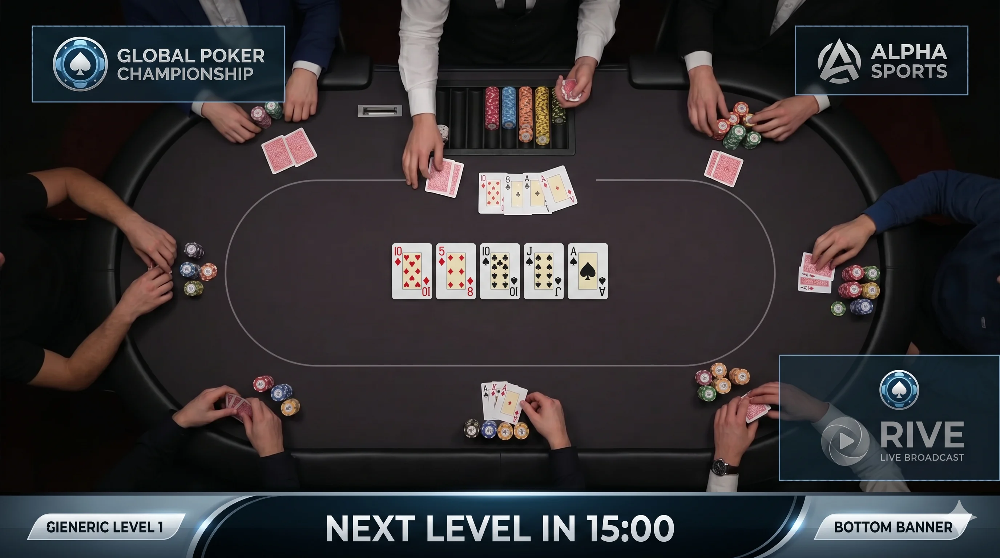

> *FIG · 4 슬롯 적용 실제 송출 시안 — Tournament Logo / Sponsor / Watermark / Bottom Banner*

### 21.2 JSON DB Output 스키마 (sponsor / branding 회전)

```json
{
  "branding": {
    "tournament_logo_url": "https://cdn.../wsop_2026_paradise.png",
    "tournament_name_text": "WSOP Paradise 2026 Main Event",
    "sponsor_slots": [
      {"logo_url": "https://cdn.../sponsor_a.png", "display_seconds": 10},
      {"logo_url": "https://cdn.../sponsor_b.png", "display_seconds": 10},
      {"logo_url": "https://cdn.../sponsor_c.png", "display_seconds": 15}
    ],
    "watermark_url": "https://cdn.../wsop_watermark.png",
    "rotation_interval_seconds": 10
  }
}
```

| JSON 키 | EBS 측 데이터 소스 |
|--------|------------------|
| `tournament_logo_url` / `tournament_name_text` | EBS DB (Brand Pack) |
| `sponsor_slots[]` | EBS DB (Sponsor 테이블 + 광고 스케줄) |
| `watermark_url` | EBS DB (Brand Pack) |
| `rotation_interval_seconds` | EBS DB (Brand Pack) |

> 회전 메커니즘 / 실제 표시 위치 (좌상단? 우상단? 하단 배너?) 는 외부 시스템 영역. EBS 는 sponsor pool + 회전 주기만 송출.

### 21.3 Brand Pack 의 Override 흐름 (영역 A 카테고리만)

**v0.7.0 명시**: Brand Pack 은 **영역 A (Rive Rendering) 카테고리의 색상 / 폰트 변수** 만 override 한다. 영역 B (시계 / 토너먼트 상태 / 브랜딩 자체) 의 시각 표현은 외부 시스템 영역.

```
   대회 = WSOP 2026
        |
        v
   EBS DB.brand_pack["wsop_2026"]
        |
        +--- 영역 A .riv 파일에 변수 주입 ----+
        |                                    |
        v                                    v
   +----------------+----------------+----------------+
   | player_card.riv| pot.riv        | action_badge.riv|
   | brand_color_*  | brand_color_*  | brand_color_*  |
   +----------------+----------------+----------------+
        |
        +--- 영역 B 외부 시스템 JSON 송출 ----+
        |                                    |
        v                                    v
   외부 자막 시스템     외부 송출 그래픽 엔진     ...
   (각자 자체 렌더링, Brand Pack 메타데이터를 JSON 으로 받아 자체 시각화)
```

<a id="ch22"></a>

## Ch.22 — 운영자 전용 표식

### 22.1 시청자에게 보이지 않는 영역

이 카테고리는 **PGM 채널 (시청자 송출) 에 절대 나가지 않는다**. OPS 채널 (운영자 모니터) 에만 표시된다.

```
  +======================================================+
  |  [PGM 화면 그대로 + 아래 추가 정보]                    |
  |                                                      |
  |  ----------------------------------------            |
  |                                                      |
  |  RFID Status:                                        |
  |    Antenna 1: OK    Antenna 6: OK                    |
  |    Antenna 2: OK    Antenna 7: slow                  |
  |    Antenna 3: disconnected   ...                     |
  |                                                      |
  |  Engine 응답 상태: OK                                  |
  |  Last Action:   {액션} by P{N}                        |
  |  Mock Mode:     OFF                                  |
  |                                                      |
  |  [DEBUG TOGGLE]  [ERROR LOG]  [MOCK MODE]            |
  +======================================================+
              ASCII MOCK · 운영자 화면 하단 debug 영역
```

### 22.2 데이터 소스 매핑

| 변수 | 데이터 소스 |
|------|------|
| Rive Asset (debug 패널 도형) | Rive Asset (`ops_overlay.riv`) |
| `rfid_status[1..N]` (N = 좌석 수 + community + optional muck, 9~12) | RFID (안테나 진단, Foundation §13 — Ch.9.1a 가변 안테나) |
| `engine_responsive` | Game Engine (heartbeat) |
| `last_action_summary` | Command Center |
| `mock_mode_active` | Command Center (운영자 토글) |

### 22.3 채널 분리

| 채널 | 출력 |
|------|------|
| **PGM (Program)** | Ch.12-21, 23 만 |
| **OPS (Operator)** | PGM + Ch.22 (debug) |
| **BAK (Backup)** | PGM 동일 |
| **REC (Recording)** | PGM 동일 |

분리는 **하드웨어 SDI (Serial Digital Interface — 방송용 디지털 영상 전송 표준) 라우터** 에서 보장.

---

# Part V — 살아 움직이는 법

<a id="ch24"></a>

## Ch.24 — State Machine

### 24.1 Rive State Machine 의 정체

`.riv` 파일 안에는 — 그래픽이 가질 수 있는 **상태들** 과 **상태 사이를 이동하는 규칙** 이 정의되어 있다. 디자이너가 Rive Editor 에서 시각적으로 그린다.

### 24.2 Player Card 의 State Machine 예시

```
   player_card.riv 의 상태 머신
   +--------------------------------------------+
   |                                            |
   |   [hidden]                                 |
   |      |                                     |
   |   on_seat (true)                           |
   |      v                                     |
   |   [entering] (페이드 인 + 슬라이드)          |
   |      |                                     |
   |   onActionComplete                         |
   |      v                                     |
   |   [idle] ---- is_to_act --> [highlighted]  |
   |      ^                          |          |
   |      +--- !is_to_act ------------+          |
   |      |                                     |
   |   is_folded (true)                         |
   |      v                                     |
   |   [folded] (회색 + dim)                     |
   |      |                                     |
   |   is_eliminated (true)                     |
   |      v                                     |
   |   [exiting] (페이드 아웃)                    |
   +--------------------------------------------+
```

### 24.3 누가 State 를 바꾸는가

State 의 전환은 **Rive Variable 의 값 변화** 가 trigger 한다. 5 데이터 소스 중 책임 소스가 자기 변수를 갱신하면 — Rive 가 자동으로 적절한 상태로 이동한다.

| State 전환 | trigger 변수 | 책임 소스 |
|-----------|------------|----------|
| hidden → entering | `on_seat` (true) | RFID + Lobby seat-map |
| idle → highlighted | `is_to_act` (true) | Game Engine |
| idle → folded | `is_folded` (true) | Command Center |
| idle → exiting | `is_eliminated` (true) | Game Engine |

> 디자이너는 변수 trigger 만 정의한다. 실제로 누가 그 trigger 를 누르는지는 디자이너의 관심 밖.

<a id="ch25"></a>

## Ch.25 — 게임 흐름과 그래픽 전이 (Lego-Block Modular Architecture)

### 25.0 Lego-Block Modular Architecture (v0.7.0 핵심 원칙)

**v0.7.0 architecture pivot** — 그래픽 요소는 **독립 Lego-Block** 으로 작동한다. 이전 v0.6.0 까지 의 monolithic rendering (전체 Overlay 를 단일 상태 머신으로 관리) **참조는 폐기**.

| 원칙 | 정의 |
|------|------|
| **Independent block** | 각 graphic element 는 별도 `.riv` + 별도 라이프사이클. 다른 block 과 직접 의존 X |
| **Event/trigger 기반 load** | 필요 시점에만 메모리 / GPU 에 load. 기본 상태 = unload (메모리 비점유) |
| **Event/trigger 기반 unload** | 더 이상 필요 없으면 즉시 unload. 페이드 아웃 후 메모리 해제 |
| **State Machine 격리** | 각 block 자체 State Machine. 다른 block 의 상태 영향 X |
| **Variable Binding 격리** | 각 block 의 Rive Variable 은 본인 영역만. 다른 block 변수 직접 접근 X |

#### 라이프사이클 예시

| 게임 단계 | Load 된 Block | Unload 된 Block |
|----------|--------------|----------------|
| **Hand Start (Preflop 직전)** | Player Info (name + avatar 만), Pot (초기값 0) | 홀카드 / 커뮤니티 / Hand Strength / Action / ALL-IN emphasis |
| **Hole Card Deal 직후** | Player Info + Hole Card (해당 좌석만, RFID 인식된 좌석) | 커뮤니티 / Hand Strength / Action / ALL-IN |
| **Bet Round 중** | Player Info + Hole Card + Action (현재 actor 만), Pot 갱신 | 커뮤니티 (해당 라운드 아직 안 옴) |
| **Flop 직후** | Player Info + Hole Card + Community (3 동시) + Hand Strength + Equity | Action (라운드 시작 전 잠시 unload) |
| **Fold 발생** | 해당 좌석 Hole Card + ALL-IN emphasis 즉시 **unload**. Player Info 는 fold dim 상태로 유지 | — |
| **ALL-IN 발생** | 해당 좌석 Player Info 에 `all_in_emphasis` state 진입 (별도 박스 load X) | — |
| **Hand End** | 모든 Hole Card / Community / Action / Hand Strength **unload** | (다음 Hand Start 까지 비어있음) |

#### 왜 Lego-Block 인가

| 기준 | 이유 |
|------|------|
| **메모리 효율** | 필요 시점에만 load → idle 상태에서 GPU 메모리 ↓ |
| **변경 격리** | 디자이너가 한 block 만 수정해도 다른 block 영향 X (Ch.3.3 변경 격리 원칙 강화) |
| **트리거 단순화** | block 단위 trigger → cross-cutting state 추적 불필요 |
| **테스트 격리** | 각 block 을 단독으로 mock 데이터로 검증 가능 |

> **이전 v0.6.0 의 monolithic rendering 가정 폐기**: 전체 Overlay 가 단일 상태 머신을 갖던 모델 → 11 카테고리 각자가 독립 block 으로 작동. ALL-IN 박스 같은 전화면 모달도 Lego-Block 원칙에 반하므로 폐기 (Ch.16.2 참조 — 좌석 emphasis 로 대체).

### 25.1 5 단계 (Hold'em 기준)

```
  +-------------+    +-------------+    +-------------+
  |  Preflop    |    |    Flop     |    |    Turn     |
  | (홀카드만)   | -> | (커뮤니티 3) | -> | (커뮤니티 4) | ->
  +-------------+    +-------------+    +-------------+

  +-------------+    +-------------+
  |   River     |    |  Showdown   |
  | (커뮤니티 5) | -> | (모든 카드   |
  +-------------+    |   공개)      |
                     +-------------+
```

### 25.2 단계 전이 시 일어나는 일

| 전이 | 변수 변화 | 그래픽 변화 |
|------|----------|----------|
| Preflop → Flop | `phase = "flop"`, `community_card[1..3]` 활성화 | 커뮤니티 카드 3 장 Flip |
| Flop → Turn | `phase = "turn"`, `community_card[4]` 활성화 | Turn 카드 Flip + Equity 갱신 |
| Turn → River | `phase = "river"`, `community_card[5]` 활성화 | River Flip + Equity 갱신 |
| River → Showdown | `phase = "showdown"`, 모든 `show_hole[i]` 활성화 | 모든 홀카드 공개 + Hand Strength 라벨 |
| Showdown → 핸드 종료 | `winner_seat` 결정 | 팟 박스 페이드 아웃 |

### 25.3 베팅 라운드 종료 sweep

각 단계마다 베팅 라운드가 있다. 라운드 종료 시:

```
   베팅 라운드 종료 (Game Engine 판정)
        |
        v
   bet_round[i] = 0  (모든 좌석 리셋)
   pot_main += sum(이전 bet_round)
        |
        v
   Rive 가 변수 변화를 감지하여:
   - 모든 베팅 라인 -> 팟 sweep 애니메이션
   - 팟 카운트업 tween
        |
        v
   다음 단계 (Flop / Turn / River) 카드 등장
```

### 25.4 21 OutputEvent → Rive 트리거 매핑 (Foundation §B.1 cascade)

Engine 은 **21 OutputEvent** 를 발행한다 (Foundation §B.1: "판돈 변동 / 승률 업데이트 / 승자 결정 등 → 적절한 Rive 애니메이션 트리거"). 본 표는 21 이벤트 각각이 본 문서의 어떤 Rive Variable / Trigger 와 결선되는지를 1 차 매핑한다.

| # | OutputEvent (Engine 발행) | 영향 받는 Rive Variable / Trigger | 그래픽 카테고리 |
|:-:|--------------------------|-----------------------------------|----------------|
| 1 | `HandStarted` | `phase = "preflop"`, `actor_index` 초기화 | Player Card / Pot 리셋 |
| 2 | `HoleCardDealt` | `hole_card[seat][slot]`, `show_hole[seat]` (운영자만) | 카드 (Ch.14) |
| 3 | `CommunityCardDealt` | `community_card[i]`, `show_community[i]` | 카드 (Ch.14) |
| 4 | `BettingRoundStarted` | `phase` 갱신, `bet_round[i] = 0` | Stack + Bet 라인 (Ch.13) |
| 5 | `ActorChanged` | `is_to_act[i]`, `actor_index` | Player Card highlight (Ch.12.3) |
| 6 | `BetPlaced` | `bet_amount[seat]`, `on_action[seat]` (trigger) | 액션 표식 (Ch.16) + Stack (Ch.13) |
| 7 | `Folded` | `is_folded[seat]`, `on_action[seat]` | 액션 표식 + Player Card dim |
| 8 | `Checked` | `on_action[seat]` (CHECK 라벨) | 액션 표식 |
| 9 | `Called` | `bet_amount[seat]`, `on_action[seat]` | 액션 표식 + Stack |
| 10 | `Raised` | `bet_amount[seat]`, `on_action[seat]` (RAISE 라벨) | 액션 표식 + Stack |
| 11 | `AllInDeclared` | `is_all_in[seat]`, `all_in_emphasis[seat]` (boolean trigger), `on_action[seat]` | Player Info Window emphasis (Ch.16.2 — 별도 박스 X) |
| 12 | `BettingRoundEnded` | `bet_round[i] = 0`, `pot_main += sum(...)` | 베팅 라인 sweep (Ch.25.3) |
| 13 | `SidePotCreated` | `pot_side[k]_amount`, `pot_side[k]_eligible_seats[]` | 팟 (Ch.17) |
| 14 | `EquityUpdated` | `equity_percent[i]`, `hand_label[i]` | Hand Strength + Equity (Ch.15) |
| 15 | `ShowdownStarted` | `phase = "showdown"`, 모든 `show_hole[i] = true` | 모든 홀카드 공개 |
| 16 | `WinnerDetermined` | `winner_seat` (사이드 팟 분배 input) | 팟 분배 (시각 효과는 Ch.17.3 페이드) |
| 17 | `PotDistributed` | `pot_main = 0`, `pot_side[k] = 0`, `stack[winner] += amount` | 팟 페이드 + Stack 카운트업 |
| 18 | `HandEnded` | 한 핸드 변수 초기화, `hand_clock = 0` | Player Card 정리 / 다음 핸드 준비 |
| 19 | `LevelChanged` | `level_index`, `sb_amount`, `bb_amount`, `ante_amount`, `level_clock` | 블라인드 / 레벨 (Ch.18) |
| 20 | `PlayerEliminated` | `is_eliminated[seat]`, `players_left -= 1` | Player Card Exit (Ch.12.3) |
| 21 | `GameTypeChanged` (Mixed Game) | `game_type` (HORSE / 8-Game cycle) | 모든 카테고리 State 재진입 (FAQ Q4) |

> **Mixed Game 전환** (이벤트 21): Foundation §B.1 정의대로 HORSE (Hold'em / Omaha / Razz / Stud / Stud Hi-Lo, FL) / 8-Game (NLHE / PLO / Razz / Stud / Stud Hi-Lo / 2-7 Triple Draw / Limit Hold'em / Omaha 8/B, NL/PL/FL 혼재) cycle 종료 시 자동 전환.
> 위 매핑은 1 차 가설. 실제 OutputEvent 명칭과 변수 결선은 Engine (Pure Dart) 구현 시 외부 개발팀과 합의 후 확정.

<a id="ch26"></a>

## Ch.26 — Entry / Emphasis / Exit

모든 그래픽 요소는 **3 막극** 으로 움직인다.

### 26.1 3 막의 정의

| 막 | 의미 | Rive 구현 |
|----|------|----------|
| **Entry** | 등장 (페이드 + 슬라이드 + 스케일) | Timeline 애니메이션 (한 번 재생) |
| **Emphasis** | 강조 (펄싱, 색상, 흔들림) | State Machine `highlighted` 상태 |
| **Exit** | 퇴장 (페이드 + 축소) | Timeline 애니메이션 (한 번 재생) |

### 26.2 요소별 패턴

| 요소 | Entry | Emphasis | Exit |
|------|-------|----------|------|
| Player Card | 슬라이드 + 페이드 | `is_to_act` 펄싱 | `is_eliminated` 페이드 |
| 카드 (홀카드) | Flip (뒤→앞) | 우승 시 황금 글로우 | 핸드 종료까지 유지 |
| Pot 박스 | 스케일 0→1 | 베팅 추가 카운트업 | 페이드 아웃 |
| 액션 표식 | Slide-in | 색상 깜빡임 | Slide-out |
| ALL-IN emphasis (Player Info Window) | Border + 색상 transform | 펄싱 | Hand End 또는 Fold 시 emphasis 해제 |

---

# Part VI — 무대 구조

<a id="ch27"></a>

## Ch.27 — 9 단 z-layer

### 27.1 9 단 구조

```
  z = 0   [카메라 영상 (배경막)]              <- 가장 뒤
  z = 1   [테이블 boundary 표시]
  z = 2   [Player Card 배경 박스]
  z = 3   [카드 (홀카드 + 커뮤니티)]
  z = 4   [칩 스택 + 베팅 라인]
  z = 5   [팟 박스]
  z = 6   [블라인드 / 레벨 / 시계]
  z = 7   [브랜딩 (로고, 워터마크)]
  z = 8   [액션 표식 (Check/Bet/Call/Raise/Fold)]
  z = 9   [모달 / 시스템 알림]                <- 가장 앞

  * ALL-IN emphasis 는 별도 z-layer X — z=2 Player Info Window 내부에서 시각 변화 (border + color)
```

### 27.2 왜 9 단인가

| 기준 | 이유 |
|------|------|
| 시각 위계 | 시청자 시선 흐름 (배경 → 콘텐츠 → 알림) |
| 차폐 | 모달 등장 시 그 아래 흐림 |
| 격리 | layer 별로 캐싱 / culling 가능 |

> 9 단은 1 차 가설. 외부 개발팀이 GPU 성능 / 디자이너 워크플로우에 따라 8 단 또는 10 단으로 조정 가능.

### 27.3 차폐의 사례 (v0.7.0 갱신)

**v0.7.0 — ALL-IN 시 전체 차폐 제거**: 이전 v0.6.0 의 "ALL-IN 시 z=0~7 모두 blur" 모델은 Lego-Block 원칙 (Ch.25.0) 에 반함 → 폐기. ALL-IN 은 해당 좌석 Player Info Window 내부 emphasis 만으로 신호 전달.

```
  모달 / 시스템 알림 발생 시 (예: 운영자 confirm 모달):
  z = 0 ~ 8  -> blur (배경 흐림)
  z = 9      -> 모달 (선명)

  ALL-IN 발생 시 (v0.7.0):
  z = 0 ~ 9  -> 모두 평소 선명 유지
  z = 2 Player Info Window (해당 좌석만) -> emphasis state (border + color, 차폐 X)
```

<a id="ch28"></a>

## Ch.28 — Safe Zone 과 시각 위계

### 28.1 3 단 안전 영역

```
  +==========================================================+   <- Frame (1920x1080)
  |                                                          |
  | +======================================================+ |   <- Action Safe (94%)
  | |                                                      | |
  | | +==================================================+ | |   <- Title Safe (90%)
  | | |                                                  | | |
  | | |     [모든 텍스트 + 핵심 그래픽은 여기 안]           | | |
  | | |                                                  | | |
  | | +==================================================+ | |
  | |                                                      | |
  | |     [중요한 그래픽은 여기 안]                          | |
  | |                                                      | |
  | +======================================================+ |
  |                                                          |
  |   [모서리는 잘릴 수 있음 — 장식만 배치]                    |
  +==========================================================+
              ASCII MOCK · 3 단 Safe Zone
```

### 28.2 영역별 정책

| 영역 | 사용 |
|------|------|
| Frame 100% | 카메라 영상, 배경 그라데이션 |
| Action Safe 94% | 보조 그래픽, 워터마크, 작은 로고 |
| Title Safe 90% | 핵심 텍스트, Player Card, Pot, 시계 |

> 94% / 90% 는 방송 안전 영역 업계 표준 (SMPTE / EBU 계열) 을 준용한 1 차 가설. 정확한 표준 ID 는 외부 방송 PD 검증 후 frontmatter `standards:` 항목에 명시.

### 28.3 투명도 위계 (1 차 제안)

| 상태 | 투명도 |
|------|:------:|
| 활성 (To Act) | 100% |
| 일반 표시 | 90% |
| 보조 정보 (배경 박스) | 60% |
| 폴드된 플레이어 | 50% |
| 비활성 (이번 핸드 미참여) | 30% |
| 차폐 시 (ALL-IN 동안) | 20% |

---

# Part VII — 부록

<a id="ch29"></a>

## Ch.29 — 용어 사전

| 용어 | 의미 |
|------|------|
| **Overlay** | 카메라 영상 위에 덧씌우는 그래픽 층 |
| **Rive** | 본 시스템이 사용하는 벡터 그래픽 + 애니메이션 도구 |
| **`.riv` 파일** | Rive Editor 에서 export 한 그래픽 산출물 |
| **Variable Binding** | `.riv` 안의 변수에 외부 데이터를 주입하는 메커니즘 |
| **State Machine** | Rive 의 상태 전이 그래프 |
| **Brand Pack** | 대회별 컬러 / 폰트 / 로고 한 벌 (EBS DB 저장) |
| **PGM** | Program — 시청자가 보는 송출 채널 |
| **OPS** | Operator — 운영자가 보는 채널 (PGM + debug) |
| **BAK** | Backup — PGM 장애 시 대체 채널 |
| **REC** | Recording — 아카이브 채널 |
| **SDI** | Serial Digital Interface — 방송용 디지털 영상 전송 표준 |
| **Z-layer** | 그래픽 깊이 순서 (0=가장 뒤, 9=가장 앞) |
| **Safe Zone** | 화면 모서리 잘림 방지 영역 |
| **Hand Clock** | 한 핸드의 진행 시간 |
| **Level Clock** | 레벨의 남은 시간 |
| **ITM** | In The Money — 상금권 진입 |
| **Bubble** | 마지막 1 명 탈락 = 상금권 결정 순간 |
| **Equity** | 끝까지 갔을 때의 승률 |
| **Showdown** | 최종 카드 공개 단계 |
| **Sweep** | 베팅 라인 → 팟 흐름 애니메이션 |

<a id="ch30"></a>

## Ch.30 — FAQ

**Q1. Overlay 가 안 보이면 시청자는 무엇을 보나요?**
A. 카메라 영상만 봅니다. 카드도 액션도 모르는 상태로 화면을 봅니다. 그래서 Overlay 는 선택이 아니라 필수입니다.

**Q2. 디자이너가 Player Card 를 다듬으면 EBS 전체를 다시 빌드해야 하나요?**
A. 아니오. `player_card.riv` 한 파일만 교체하면 됩니다 (경로 A). 또는 Rive Cloud 로 publish 하여 EBS 가 자동 fetch 합니다 (경로 B).

**Q3. Rive 변수에 데이터가 안 들어가면 화면은 어떻게 되나요?**
A. 그 변수가 채워질 때까지 — 디자이너가 정의한 default 값으로 표시됩니다 (예: `player_name = "TBD"`). Default 값을 모든 변수에 정의하는 것이 디자이너의 의무입니다.

**Q4. Mixed Game (게임 종목 회전) 에서 그래픽은 어떻게 바뀌나요?**
A. `game_type` 변수가 바뀌면 — 각 `.riv` 의 State Machine 이 게임별 상태로 이동합니다. 예: Stud 일 때는 community_card 가 hidden, hole_card 가 5 장으로 늘어남.

**Q5. Brand Pack 을 바꾸면 모든 그래픽이 동시에 바뀌나요?**
A. 네. Brand Pack 의 색상 / 폰트 변수는 모든 `.riv` 에 동시 주입됩니다. 디자이너는 `.riv` 안에서 색상 / 폰트를 하드코드하지 않고 변수로 빼야 합니다.

**Q6. 모바일에서도 Overlay 가 보이나요?**
A. 네. 모든 그래픽은 Title Safe 90% 안에 배치되어 16:9 모바일에서도 잘리지 않습니다. 단, OPS 전용 (Ch.22) 은 모바일에 보이지 않습니다.

<a id="ch31"></a>

## Ch.31 — 송출 준비 체크리스트

```
  [ ] 1. Rive 에셋 준비 (영역 A 카테고리만)
       [ ] 영역 A 카테고리 .riv 파일 export 완료
            (player_card / hole_card / community_card / hand_strength /
             action_badge / pot / blind_level / ops_overlay)
       [ ] 영역 B (Tournament State / Clock / Branding) 는 JSON 송출 검증으로 대체 — .riv X
       [ ] 변수 명명 규칙 준수 (Ch.5.3)
       [ ] State 명명 규칙 준수 (Ch.24.3)
       [ ] Lego-Block 격리 검증 (Ch.25.0 — 각 block 독립 load/unload)
       [ ] Default 값 모두 정의
       [ ] Safe Zone 90% 안에 핵심 배치
  [ ] 2. EBS DB 준비
       [ ] 대회 정보 입력
       [ ] Brand Pack 업로드 + 변수 매핑 (영역 A 카테고리에 주입)
       [ ] 선수 프로필 일괄 import
       [ ] Sponsor 슬롯 / 회전 설정 (영역 B JSON 송출 데이터)
  [ ] 3. 통합 경로 선택
       [ ] 경로 A (Export-Import) — 빌드에 .riv 번들링
       [ ] 경로 B (Cloud API) — 인증 + override 정책 명시
  [ ] 4. RFID (가변 안테나, Ch.9.1a)
       [ ] 테이블 메타 (seat_count + has_muck_board) 등록 후
            안테나 N개 (N = seat_count + 1 community + optional muck = 9~12) 신호 확인
       [ ] Mock 카드로 카드 인식 검증 (각 좌석 + community + muck 모두)
  [ ] 5. Command Center (Mouse/Keyboard/Touch 모두 검증, Ch.8.1)
       [ ] Mouse 입력 — 모든 UI 버튼 / 모달 / 좌석 그리드 클릭 작동 확인
       [ ] Keyboard 단축키 — N/F/C/B/R/A 응답 확인 (Ch.8.1a, M 키 primary action X)
       [ ] Touch 입력 — 태블릿 환경에서 동일 UI 표면 작동 확인
       [ ] 액션 흐름 (Hand Start → Bet → Showdown → Hand End) 검증
  [ ] 6. Game Engine
       [ ] 게임 종목 룰 검증 (Hold'em / Omaha / Mixed 등)
       [ ] 팟 edge-case 검증 (Ch.17.3 — single/split/side-pot/uncalled/dead-chip)
       [ ] Equity 계산 검증
  [ ] 7. 영역 분리 검증
       [ ] 영역 A 카테고리 (Rive Rendering) 모두 변수 채워짐 + 시각 확인
       [ ] 영역 B 카테고리 (JSON DB Output) — 외부 시스템이 JSON 수신 + 자체 렌더링 확인
       [ ] State Machine 전이 + Lego-Block load/unload 검증
       [ ] Brand Pack 적용 검증 (영역 A 만)
  [ ] 8. 채널 분리
       [ ] PGM / OPS / BAK / REC 분리 확인 (SDI 라우터)
  [ ] 9. 본 송출 시작
```

---

## Changelog

| 날짜 | 버전 | 변경 | 결정 근거 |
|------|------|------|----------|
| 2026-05-12 | v0.7.0 | **Architecture Pivot (S10-W cycle-8 cross-cutting)** — 4 영역 갱신: (1) **CC Input (Ch.8 + Ch.1.3 + Ch.31)** "6 물리 키" hardcode 제거 → Mouse/Keyboard/Touch 3 입력 동등성 + 단축키 매핑 갱신 (N=NewHand/NextHand 양방향, F=Fold, C=Call/Check, B=Bet/Raise, R=Raise 명시, A=All-in, M 키 primary action 제거). (2) **RFID Antenna (Ch.9 + Ch.1.3 + Ch.22 + Ch.31)** "12 안테나" hardcode 제거 → 가변 (좌석 수 8~10 + Community 1 + Muck optional 0~1 = 9~12). EBS DB 의 `seat_count`/`has_muck_board` 메타로 RFID Reader 부팅 시 매핑 결정. (3) **Rendering Scope vs JSON DB 분리 (Ch.2 + Part IV)** — 11 카테고리를 영역 A (EBS Rive Rendering, highly modular: Player Info / Cards / Hand Strength / Action / Pot / Blinds / Operator) vs 영역 B (JSON DB Output Only, NO EBS Rendering: Tournament State Ch.19 / Clock Ch.20 / Branding Ch.21) 로 분리. Ch.14 Hole + Community 완전 분리 + Flop 동시 표시 룰. Ch.16.2 ALL-IN 박스 전화면 모달 폐기 → Player Info Window 내부 emphasis. Ch.17.3 팟 edge-case 분석 (single/split/side-pot/uncalled/dead-chip/all-in-overbet 7 종). Ch.16.1 액션 표식 5 종으로 축소 (NEW HAND/DEAL visual 제거). (4) **Lego-Block Modular Architecture (Ch.25.0 신규 + Ch.27.3)** — graphic elements = 독립 Lego-Block, event/trigger 기반 load/unload. monolithic rendering 가정 폐기. ALL-IN 전체 차폐 (z=0~7 blur) 폐기. | 사용자 명시 — 외부 디자이너/PD 이해 가능 + modular boundary 명확. PR → conductor (S0) 머지 |
| 2026-05-08 | v0.6.0 | **S4 정합성 감사 cascade** (2026-05-08 Phase 0). (a) **Self-consistency 7건 정정**: Ch.9.1 / Ch.9.2 캡션 / Ch.22.2 / Ch.31 의 "11 안테나" → "12 안테나" (Foundation §13 정합), Ch.8.1 의 "9 입력 표" → "6 키 (N · F · C · B · A · M) + 5-Act 시퀀스" (Foundation §3 정합), Ch.8.2 의 "[R] 키" → "[B] 키 + 사이즈 모달" 예시 정정, Ch.16.1 의 "8 가지 액션" → "8 시각 표식 ↔ 6 물리 키 매핑" 표 보강, Ch.31 체크리스트 5번 정정. (b) **Foundation §7 cascade 5 검증 항목 보강**: Ch.1.3 신규 "5 작가 ↔ 6 기능 매핑" 박스 (Lobby Web = EBS DB 작가 + Rive Manager 호스트 / CC + Overlay = Rive 출력자 / Engine = 계산 작가 / BO = 데이터 공급자 / RFID = 카드 정체 작가), Ch.4.4 신규 "Rive Manager" 섹션 (Foundation §A.3 cascade — Lobby Web 내부 섹션, Admin 전용, Import → Validate → Preview → Activate, 메타데이터 Rive 파일 내장), Ch.25.4 신규 "21 OutputEvent → Rive 트리거 매핑" 표 (Foundation §B.1 cascade — 21 이벤트 각각 + Mixed Game HORSE/8-Game 전환). 목차 Ch.1 / Ch.4 / Ch.25 description 갱신. | S4-rive.md spec 5 검증 항목 (#1 OutputEvent / #2 Lobby=DB작가 / #3 CC+Overlay=출력자 / #4 BO=직접사용X / #5 Rive Manager) 모두 PASS |
| 2026-05-07 | v0.5.0 | 시각 자료 18 이미지 + Ch.2 catalog 2 reference 이미지 삽입 (시간순 = 챕터 흐름). Ch.2 catalog ASCII mockup → wsop-2025-paradise-overlay.png + overlay-anatomy.png 2열 feature block 으로 대체. 17 챕터별 feature block (Hero/2열/1열) 19 이미지 삽입. IMG_TODO 마커 5건 → 실제 이미지 link 로 교체. Vision Layer (Phase 2) 이미지 1건 EBS 처리 범위 외 사유로 미사용. | 사용자 명시 — 18 Rive 이미지 + reference 이미지 배치 |
| 2026-05-07 | v0.4.0 | EBS 처리 범위 외 그래픽 제거 — Time Bank 통째 (Ch.20.2 + ToC + Ch.2 catalog + Ch.8 CC 입력 + Ch.29 용어 + Ch.31 체크리스트), Ch.23 우승 화면 통째 (본문 + ToC + Ch.2 catalog + Ch.3.3 winner.riv + Ch.11 매트릭스 + Ch.7 EBS DB History + Ch.10 winner_seat 설명 + Ch.17 흡수 애니 + Ch.25 Showdown→우승 + Ch.26 패턴 + Ch.27 z-layer). 카테고리 12 → 11. winner_seat 변수는 사이드 팟 분배 용도로 유지. | 사용자 명시 — Time Bank, Ch.23 우승 화면은 EBS 처리 범위 밖 |
| 2026-05-07 | v0.3.0 | Reference 톤 정리 — 13 fortune cookie 격언 제거 (Ch.5.4 잉크병 박스 / Ch.7-11 비유 격언 / Ch.12-26 한 마디 섹션). "다섯 작가" 메타포 40 → 6 (Part I Ch.1 도입만 유지). "의상" 31 → 0. "그릇/vessel" 6 → 0. 표 헤더 "다섯 작가 매핑" 14 회 → "데이터 소스 매핑". 챕터 제목 "Variable Binding 의 마법" → "Variable Binding". | 사용자 비평 — 자기 반복적, 문학적 가치 0. 방향 A (Reference 톤) 선택 |
| 2026-05-07 | v0.2.0 | 전면 재설계 — Voldemort 룰 (시간 약속 / human error / 다른 PRD cross-ref 모두 제거). 5 데이터 소스 중심 재구조. Rive Editor ↔ EBS 통합 2 경로. Variable Binding 메커니즘. SUPERSEDED by v0.3.0 | — |
| 2026-05-07 | v0.1.0 | 최초 작성 (SUPERSEDED) | — |

---

## 작성 메모

> 본 문서는 reference manual 입니다. 5 데이터 소스 (Rive Asset / EBS DB / Command Center / RFID / Game Engine) 가 11 카테고리 그래픽 요소의 변수를 어떻게 채우는지를 표 + ASCII mockup 으로 명세합니다. 외부 인계 시 contract 문서로 사용 가능합니다.
>
> v0.5.0 부터 시각 자료 19 이미지 삽입 (Ch.2 catalog reference 2 + 17 챕터별 Rive 이미지). 추가 이미지가 필요해지면 `docs/images/rive/` 에 추가 후 본 문서에 feature block 으로 삽입. 외부 디자이너가 본 이미지를 brand 별로 교체할 때는 동일 파일명 유지 + 본문 link 변경 없이 교체 가능.
>
> **v0.7.0 부터 영역 분리**: A (EBS Rive Rendering) vs B (JSON DB Output Only). 영역 B 의 `.riv` 파일 (`tournament_state.riv` / `clock.riv` / `branding.riv`) 은 폐기 — EBS 는 JSON 송출만, 외부 시스템 자체 렌더링. Lego-Block 원칙 (Ch.25.0) 으로 각 graphic element 가 독립 라이프사이클을 가짐.
