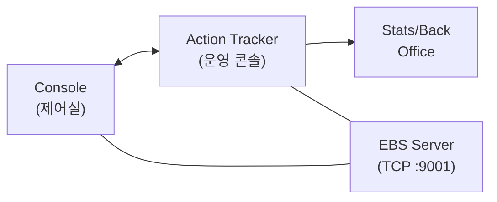
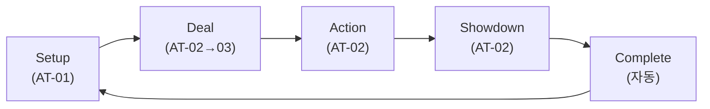
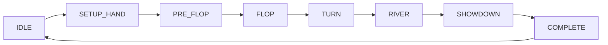
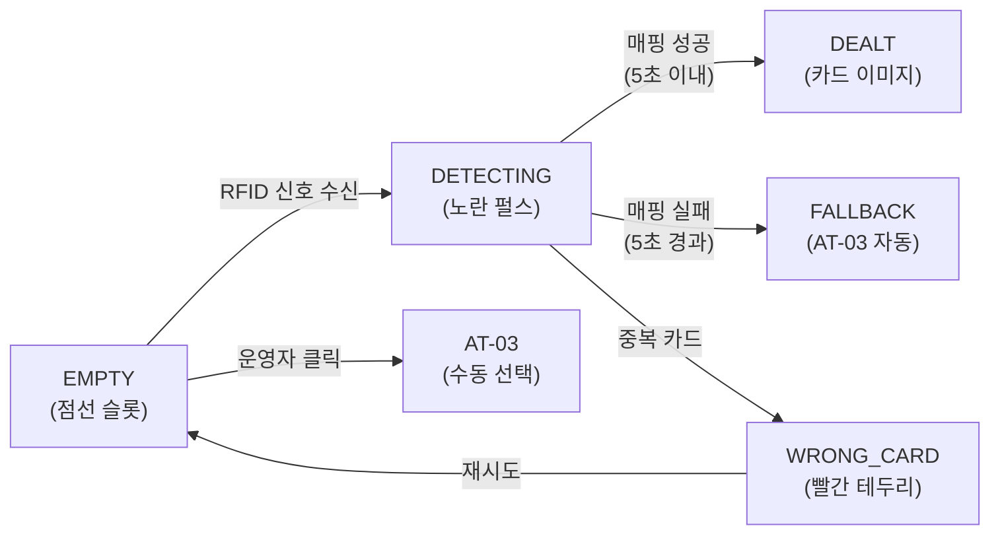
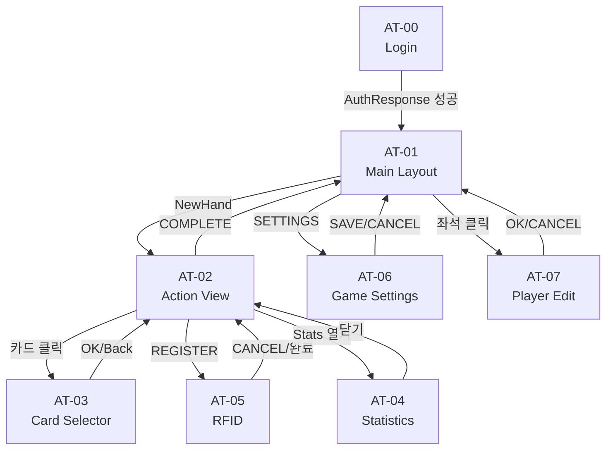
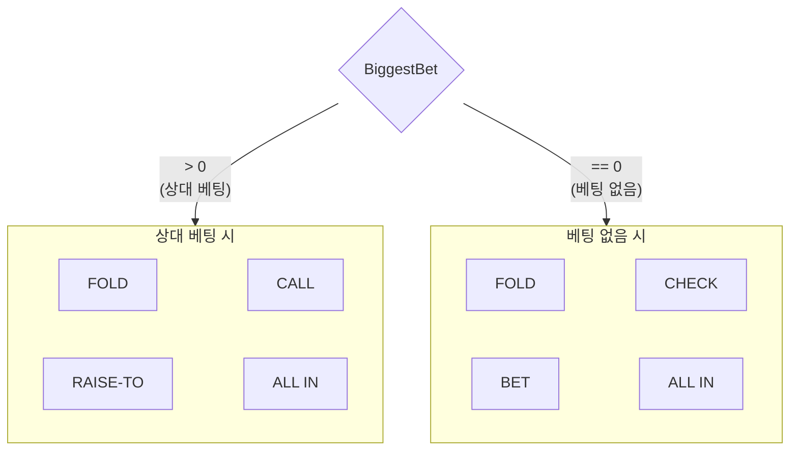
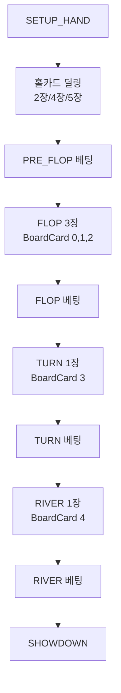
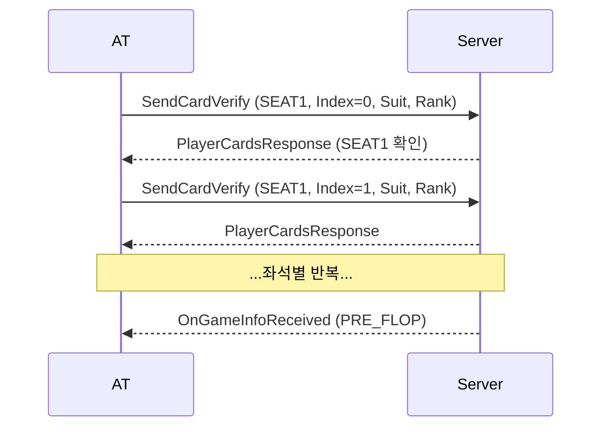

# EBS Action Tracker — 통합 Reference (v8.5.0)

> **통합 노트 (2026-04-14)**: PokerGFX Action Tracker 역설계 자료 12개 문서를 본 통합본 1개로 정리. 원본 (분석 6,596줄, 분석 도구 + HTML 목업 + 스크린샷 + 구버전 PRD 포함) 은 `C:/claude/ebs-archive-backup/07-archive/team4-cc-cleanup-20260414/at-reference/` 에 보존.
>
> **소비자**: team4 Command Center 구현 시 참고. 현재 설계 SSOT 는 `../../2. Development/2.4 Command Center/Command_Center_UI/Overview.md` + `../../2. Development/2.4 Command Center/` 하위 모듈 문서.
>
> **백업된 원본 13개 (역사 추적용)**:
> - `analysis/` 4개 — Annotation, Workflow Mapping, Design Rationale, annotation-plan
> - `design/` 3개 — PokerGFX UI 해부, AT redesign plan, AT overlay redesign plan
> - `prd/` 보조 2개 — at-html-annotation, at-workflow
> - `prd/archive/` 2개 — v2.2.0, v6.2.0 구버전
> - mockups v3~v6 + analysis HTML/PNG/JSON + Python annotation 도구

# PRD-AT-002: EBS Action Tracker UI Design v8.0.0

> EBS 전용 포커 방송 운영 콘솔 UI 설계 문서.

## 스냅샷 목차

| Part | 섹션 | 라인 |
|------|------|-----:|
| **I Context** | §0 개요, §1 1핸드 워크플로우 | L20~160 |
| **II System Model** | §2 State Machine, §3 화면 흐름 | L162~283 |
| **III Screen Design** | §4 AT-00 Login, §5 AT-01 Main, §6 AT-02 Action | L285~863 |
| — | Changelog | L864~ |

> 읽기 팁: 처음이면 Part I → II → III §5, 화면 디테일만 필요하면 §4~§6 직행.

---

# Part I: Context

> 모든 독자 대상 — AT의 역할, 운영자 워크플로우, 핵심 설계 결정.

## §0. 개요

### 0.1 AT는 운영자 → 데이터 시스템의 유일한 실시간 입력점

포커 방송에서 발생하는 모든 액션(폴드, 콜, 레이즈, 올인)은 **AT를 통해서만** 데이터 시스템에 입력된다. 카메라가 포착한 게임 상황을 운영자가 AT에 입력하면, 그 데이터가 방송 그래픽(GFX)과 통계(Stats)로 변환된다.

한 핸드당 3~8개 베팅 액션이 발생하며, 포커 본방송 중 운영자 주의력의 대부분이 AT에 집중된다.

| 시점 | AT의 역할 | 데이터 흐름 |
|------|----------|------------|
| 방송 전 | 좌석 배치, 블라인드/칩 설정 | Console 설정 → AT 동기화 |
| 핸드 진행 중 | 액션 실시간 입력 (FOLD/CALL/BET/RAISE/ALL-IN) | AT 입력 → GFX 즉시 반영 |
| 핸드 종료 시 | SHOWDOWN 결과 입력 → 자동 완료 | AT → Stats 아카이브 (핸드 단위 개별 송출) |

> **Stats 아카이브 출력 시점**: 방송 중 각 핸드가 종료되는 시점(HAND_COMPLETE)에 해당 핸드의 액션/결과 데이터가 개별 송출된다. 실시간 누적이 아닌 **핸드 단위 아카이브** 방식.

### 0.2 Persona

| Persona | 역할 | 주요 관심사 |
|---------|------|------------|
| 방송 운영자 | 실시간 액션 입력 | "1초 지연 = 방송 공백" |
| 방송 감독 | 통계 확인, 그래픽 제어 | "올바른 데이터가 방송에 나가는가" |
| 기술 운영자 | 설정, 연결, 문제 해결 | "RFID/TCP 연결이 안정적인가" |

### 0.3 세 도구의 관계

### 0.4 설계 결정

| 결정 | 근거 | UX 원칙 |
|------|------|---------|
| **640px 고정 폭** | 1920÷3 = 640px. 운영 환경에서 AT + GFX Preview + Stats를 3분할 타일링으로 동시 표시. 운영자가 단일 모니터에서 세 도구를 병행 사용하는 실제 워크플로우에 기반 | 운영 환경 최적화 |
| **수평 10좌석 리스트** | 운영 콘솔에서 정보 밀도와 접근 속도가 핵심. 타원형 레이아웃(v2)은 플레이어 클라이언트에 적합하나, 640px 운영 콘솔에서는 정보 밀도/접근성 저하. 6-Layer 수직 구조로 시선 흐름 최적화 | Fitts' Law, 운영 효율 |
| **7존 레이아웃 (AT-01)** | 90개 요소를 기능별 7개 그룹으로 편성. 작업 기억 한계 내에서 빠른 탐색 가능 | Miller's Law (7±2) |
| **AT-01/AT-06 분리** | AT-01은 핸드 사이 **런타임 퀵 토글** (SB/BB 표시, HOLDEM 1클릭 전환, 값 표시 버튼). AT-06은 세션 초기 **상세 폼** (Event Name, Ante Type 7종, Bet Structure, Payouts). 빈도 높은 조작과 1회 설정을 분리 | Hick's Law, 맥락 분리 |
| **Pre/Post-Flop 통합 (AT-02)** | Pre-Flop과 Post-Flop의 83% 요소가 동일. 1화면 통합으로 화면 전환 비용 제거 | Context Switching Cost |
| **Blind 직접 입력** | QInput 1회 직접 입력. 반복 클릭(◀▶ 50회) 제거 | Hick's Law, O(1) vs O(n) |
| **동적 버튼 라벨** | BiggestBet 기준 CALL↔CHECK, RAISE-TO↔BET 자동 전환. 서버의 `biggest_bet_amt` 값에 따라 UI 라벨 동적 변경 | 상태 기반 UI |
| **Keyboard-First** | 6시간+ 연속 사용 운영 콘솔. F/C/B/A 단축키로 마우스 없이 액션 입력. Quasar dense 모드 적용 | 운영 효율, 반복 피로 감소 |

### 0.5 AT 아키텍처

AT는 **Stateless Input Terminal** — 게임 로직을 계산하지 않는다. 서버가 모든 것을 처리하고, AT는 결과를 표시한다.

| 서버 자동 처리 | AT의 역할 |
|---------------|----------|
| 다음 액션 플레이어 결정 (`ActionOnResponse`) | 해당 좌석 `action-glow` 표시 |
| 블라인드/앤티 자동 수거 | 수거된 금액 표시 |
| 팟 계산, 스트리트 전환 | `GameInfoResponse` 수신 → UI 전환 |
| 승자 결정, 팟 분배 | 결과 표시, 스택 갱신 |
| 블라인드 위치 이동 (Dead Button Method) | 위치 표시 |
| 동적 버튼 라벨 (`biggest_bet_amt`) | `== 0` → CHECK/BET, `> 0` → CALL/RAISE-TO |

## §1. 1핸드 워크플로우

운영자가 AT를 사용하여 1핸드를 처리하는 행동 흐름.

### 1.1 핸드 라이프사이클

| 단계 | 운영자 행동 | 화면 | 시스템 상태 (§2) |
|------|------------|------|:---------------:|
| **Setup** | 좌석 배치, 블라인드 설정, NEW HAND | AT-01 | IDLE → SETUP_HAND |
| **Deal** | 홀카드 배분 (RFID 자동 or 수동 선택) | AT-02 → AT-03 | SETUP_HAND → PRE_FLOP |
| **Action** | Action-On 좌석에 FOLD/CALL/BET/RAISE/ALL-IN 입력 | AT-02 | PRE_FLOP → FLOP → TURN → RIVER |
| **Showdown** | MUCK/SHOW 선택, 위너 지정, 팟 지급 | AT-02 | SHOWDOWN |
| **Complete** | 자동: 스택 갱신 → Stats 아카이브 송출 → 3초 → IDLE | AT-02 → AT-01 | COMPLETE → IDLE |

### 1.2 카드 딜링

카드는 3가지 경로로 입력된다:

| 경로 | 조건 | 운영자 행동 |
|------|------|------------|
| RFID 자동 | 안테나가 카드 인식 성공 | 없음 (자동 완료) |
| RFID Fallback | 신호는 왔지만 5초 내 매핑 실패 | AT-03 자동 팝업 → 카드 선택 |
| 수동 | RFID 신호 자체 없음 | 카드 아이콘 클릭 → AT-03 → 카드 선택 |

홀카드는 좌석별 반복(Hold'em 2회, PLO4 4회), 커뮤니티 카드는 스트리트별(FLOP 3회, TURN/RIVER 1회). **1회 진입 = 1장 선택**. 프로토콜 시퀀스 상세: §6.1.

### 1.3 액션 입력

`ActionOnResponse` 수신 → 해당 좌석 강조 → 운영자가 키보드로 액션 입력:

| 키 | 액션 | 조건 |
|----|------|------|
| `F` | FOLD | — |
| `C` | CALL / CHECK | BiggestBet 기준 분기 |
| `B` | BET / RAISE-TO | BiggestBet 기준 분기 |
| `A` | ALL IN | — |

BET/RAISE-TO 시 AMOUNT 필드에 금액 직접 입력. ALL IN은 Layer 5 버튼. `Ctrl+Z`로 UNDO(최대 5단계). 상세: §6.3.

### 1.4 자동화 처리

1핸드 진행 중 서버가 자동으로 처리하는 항목. 운영자 개입 불필요.

| 자동화 | 트리거 | 서버 처리 | AT 표시 |
|--------|--------|----------|---------|
| **포지션 자동 이동** | NEW HAND (핸드 시작) | D/SB/BB를 Dead Button Method에 따라 다음 좌석으로 이동 | 포지션 마커 갱신 (Zone 3) |
| **블라인드 자동 수거** | SETUP_HAND 진입 | SB/BB/Ante를 해당 좌석 스택에서 자동 차감 | 스택 금액 갱신 |
| **Action-On 자동 이동** | 액션 완료 (FOLD/CALL/BET 등) | 다음 액션 순서 플레이어 결정 → `ActionOnResponse` 전송 | `action-glow` 펄스가 다음 좌석으로 이동 |
| **스트리트 자동 전환** | 현재 스트리트 베팅 라운드 종료 | PRE_FLOP→FLOP→TURN→RIVER 자동 전이 → `GameInfoResponse` 전송 | 커뮤니티 카드 슬롯 활성화 |
| **팟 자동 갱신** | 매 액션 후 | 베팅 합산 + 사이드팟 계산 | POT 금액 실시간 갱신 |

> 운영자의 역할은 **카드 입력**과 **액션 입력** 두 가지다. 포지션 이동, 블라인드 수거, Action-On 순서, 스트리트 전환, 팟 계산은 모두 서버가 자동으로 처리한다.

---

# Part II: System Model

> 화면 설계를 이해하기 위한 전제 — 게임 상태와 화면 흐름을 먼저 정의한다.

## §2. State Machine

### 2.1 게임 상태 7단계

| 상태 | 좌석 표시 | 보드 | 가능 액션 | 정보 바 |
|------|----------|------|----------|---------|
| IDLE | 이름+스택만 | — | NEW HAND, EDIT SEATS | Hand # |
| SETUP_HAND | 포지션 뱃지, 블라인드 자동 수거 | — | 대기 | SB/BB/Ante |
| PRE_FLOP | 홀카드 슬롯 활성, Action-on 펄스 | — | FOLD/CHECK/BET/CALL/RAISE/ALL-IN | 팟 실시간 |
| FLOP | 액션 플레이어 강조, 폴드 반투명 | 3장 | 동일 | 팟 갱신 |
| TURN | 동일 | 4장 | 동일 | 팟 갱신 |
| RIVER | 동일 | 5장 | 동일 | 팟 갱신 |
| SHOWDOWN | 위너 강조, 핸드 공개 | 5장+핸드명 | MUCK/SHOW/SPLIT | 결과 |
| COMPLETE | 팟 지급 → 스택 갱신 → **Stats 아카이브 송출** → 3초 → IDLE | 클리어 | — | Hand#+1 |

#### Draw/Stud 게임 분기

위 상태 머신은 Flop 게임(Holdem, Omaha 등 13종) 기준이다. Draw 게임과 Stud 게임은 고유한 스트리트 구조를 가진다.

| 게임 클래스 | 스트리트 구조 | 비고 |
|------------|-------------|------|
| **Flop** (13종) | PRE_FLOP → FLOP → TURN → RIVER | 위 상태 머신과 동일 |
| **Draw** (6종) | BETTING_1 → DRAW_PHASE → BETTING_2 (Triple Draw: 3회 반복) | DRAW_PHASE 완료 시 SendDrawDone 전송 |
| **Stud** (3종) | THIRD → FOURTH → FIFTH → SIXTH → SEVENTH | 커뮤니티 카드 없음, 좌석별 개별 카드 5~7장 |

Draw 게임에서 AT-02 Action View는 DRAW_PHASE 진입 시 액션 버튼 대신 **DRAW** 버튼을 표시한다. 운영자가 DRAW를 누르면 카드 교환 절차가 시작되고, 완료 시 다음 베팅 라운드로 전환된다.

### 2.2 카드 슬롯 상태 머신

카드 슬롯(홀카드/커뮤니티)의 RFID 연동 상태 전이.

| 상태 | 시각화 | 트리거 | 다음 상태 |
|------|--------|--------|----------|
| EMPTY | 빈 슬롯 (점선 테두리) | RFID 신호 수신 | DETECTING |
| EMPTY | 빈 슬롯 | 운영자 클릭 | AT-03 수동 진입 |
| DETECTING | 노란색 펄스 (`#FFD600`) | 매핑 성공 (5초 이내) | DEALT |
| DETECTING | 노란색 펄스 | 매핑 실패 (5초 경과) | FALLBACK → AT-03 자동 진입 |
| DETECTING | 노란색 펄스 | 중복 카드 UID | WRONG_CARD |
| DEALT | 카드 이미지 표시 | — | 완료 |
| WRONG_CARD | 빨간 테두리 (`#DD0000`) | 재시도 | EMPTY |

> **5초 카운트다운 = "RFID 신호는 왔는데 매핑이 안 된다".** 신호가 없으면 EMPTY 유지. RFID 신호 없이는 DETECTING으로 전이되지 않는다.

### 2.3 상태-요소 활성 매트릭스

| Category | IDLE | SETUP | PRE_FLOP | FLOP~RIVER | SHOWDOWN | COMPLETE |
|----------|:----:|:-----:|:--------:|:----------:|:--------:|:--------:|
| hand_control | edit | edit | r/o | r/o | r/o | r/o |
| blind | edit | r/o | r/o | r/o | r/o | r/o |
| seat | edit | edit | 상태표시 | 상태표시 | 위너강조 | r/o |
| chip_input | edit | edit | r/o | r/o | r/o | r/o |
| card_area | — | edit | r/o(RFID) | r/o | 공개 | — |
| action_button | hidden | hidden | **ACTIVE** | **ACTIVE** | MUCK/SHOW | hidden |
| community_cards | — | — | empty | 3→4→5장 | 5장+핸드명 | clear |
| info_bar | — | — | 현재 플레이어 | 현재 플레이어 | 위너 | — |
| broadcast_control | 가능 | 가능 | 가능 | 가능 | 가능 | 가능 |

## §3. 화면 흐름

### 3.1 화면 전이 다이어그램

화면은 두 허브를 중심으로 전이된다:
- **AT-01 (Setup)**: 방송 전 설정 허브 — Settings(AT-06), Player Edit(AT-07) 진입점
- **AT-02 (Action)**: 핸드 진행 허브 — Card Selector(AT-03), Statistics(AT-04), RFID(AT-05) 진입점

### 3.2 화면 목록

| ID | 화면 | 진입 조건 | 핵심 행동 | 크기 |
|----|------|----------|----------|:----:|
| AT-00 | Login | 앱 시작 | 서버 연결 + 인증 | 480×360 |
| AT-01 | Main Layout | 로그인 성공 / 핸드 완료 | 좌석 배치, 블라인드 설정, NEW HAND | 640×auto |
| AT-02 | Action View | NEW HAND | 실시간 액션 입력 (FOLD/CALL/BET/RAISE/ALL-IN) | 640×auto |
| AT-03 | Card Selector | 카드 아이콘 클릭 / RFID Fallback | 52장 그리드에서 1장 선택 | 560×auto |
| AT-04 | Statistics | Stats 버튼 | 10좌석 통계 확인 + 방송 GFX 제어 | 640×auto |
| AT-05 | RFID Register | REGISTER 버튼 | 52장 RFID 등록/검증 | 480×auto |
| AT-06 | Game Settings | SETTINGS 버튼 | 게임 종목/블라인드/특수규칙 상세 편집 | 640×auto |
| AT-07 | Player Edit | 좌석 클릭 | 플레이어 정보 편집 (이름, 국가, SIT OUT) | 400×auto |

---

# Part III: Screen Design

> 각 화면의 설계 명세. 시각적 디자인은 목업 이미지를 참조하고, 본문은 동작과 조건을 설명한다.

## §4. AT-00 Login

**480×360** | 앱을 시작하면 가장 먼저 표시되는 화면. 인증 성공 시 AT-01로 이동.

EBS Server에 연결하고 운영자 인증을 수행하는 진입 화면.

| ID | 이름 | 설명 |
|:--:|------|------|
| 1~4 | 윈도우 타이틀바 | 앱 아이콘, 제목, 최소화/최대화/닫기 버튼 |
| 5 | 앱 제목 | "EBS ACTION TRACKER" 텍스트를 화면 중앙에 크게 표시 |
| 6 | 버전 | "v1.0.0" 텍스트를 제목 아래에 작게 표시 |
| 7 | 운영자 ID | 서버 주소 또는 운영자 ID를 입력하는 텍스트 필드. Enter를 누르면 비밀번호 필드로 이동 |
| 8 | 비밀번호 | 비밀번호를 입력하는 텍스트 필드 (입력 내용 숨김). Enter를 누르면 CONNECT 실행 |
| 9 | CONNECT 버튼 | 클릭하거나 Enter를 누르면 서버 인증을 시작한다. 전송 중에는 버튼이 비활성화되고 로딩 표시. 프로토콜: AuthRequest (인증 요청) |
| 10 | 연결 상태 | 서버 연결 상태를 점과 텍스트로 표시. **Disconnected**: 빨간 점이 깜빡임. **Connecting**: 노란 점이 깜빡임. **Connected**: 검정 점이 고정 표시 |
| 11 | 에러 메시지 | 인증에 실패하면 빨간 글자로 에러 메시지 표시 (예: "Invalid password"). 성공하면 숨겨짐 |

---

## §5. AT-01 Main Layout (Setup)

**640×auto** | 로그인 성공 또는 핸드 완료 시 표시. NEW HAND를 누르면 AT-02로 이동.

핸드를 시작하기 전에 좌석 배치, 블라인드/칩 설정, 게임 타입을 선택하는 Setup 허브. 7개 영역으로 구성되어 있다.

#### Zone 1: 상단 도구 모음

| ID | 이름 | 설명 |
|:--:|------|------|
| 1~5 | 윈도우 타이틀바 | 앱 아이콘, 제목 "EBS Action Tracker", 최소화/최대화/닫기 버튼 |
| 6 | USB 연결 상태 | USB 서버 연결 여부를 아이콘으로 표시. 연결되면 검정, 끊기면 회색으로 바뀜 |
| 7 | WiFi 신호 상태 | TCP 연결 품질을 신호 막대 4단계로 표시. Good: 4칸 모두 채워짐. Fair: 3칸. Poor: 2칸. Disconnected: 빈 막대가 빨간색으로 깜빡임 |
| 8 | 핸드 번호 | 현재 핸드 번호를 숫자로 표시하는 입력란. 한번 등록된 핸드는 수정할 수 없다 |
| 9 | HAND 라벨 | "HAND"라는 텍스트 라벨 (편집 불가) |
| 10 | 전체화면 | F11 키로도 전환 가능한 전체화면 토글 버튼 |
| 11 | 앱 닫기 | 앱을 종료하는 버튼. 누르면 "정말 종료하시겠습니까?" 확인 창이 표시됨 |

#### Zone 2: 카드 아이콘 행

각 좌석의 카드 상태를 보여주는 영역. 18번부터 27번까지 Seat 1~10에 같은 방식으로 반복된다.

| ID | 이름 | 설명 |
|:--:|------|------|
| 18~27 | Seat 1~10 카드 슬롯 | 각 좌석의 카드 입력 상태를 보여준다. 클릭하면 카드 선택 화면(AT-03)이 열린다. 프로토콜: SendCardVerify (카드 확인 전송) |

카드 슬롯은 §2.2에서 정의한 4가지 상태로 전환된다:

| 상태 | 시각적 표현 | 동작 |
|------|-----------|------|
| EMPTY (빈 상태) | 점선 테두리의 빈 슬롯 | 클릭하면 카드 선택 화면(AT-03)으로 이동 |
| DETECTING (RFID 감지 중) | 노란색 배경으로 깜빡임 | 5초 내 매핑 성공하면 DEALT로. 실패하면 AT-03이 자동으로 열림 |
| DEALT (카드 입력 완료) | 카드 이미지 표시. 스페이드/클럽은 검정, 하트/다이아몬드는 빨간색 | 변경 없음 |
| WRONG_CARD (중복 카드) | 빨간 테두리가 깜빡임 | 재시도하면 EMPTY로 돌아감 |

#### Zone 3: 좌석 라벨 행

28번부터 37번까지 Seat 1~10에 같은 방식으로 반복된다.

| ID | 이름 | 설명 |
|:--:|------|------|
| 28~37 | Seat 1~10 라벨 | 좌석을 클릭하면 플레이어 편집 화면(AT-07)이 열린다. 각 좌석 안에 포지션 마커(작은 원)가 표시된다. 플레이어 편집(AT-07)에서 이름을 등록하면 "SEAT 1" → 플레이어 이름으로 변경된다 |

**포지션 마커 색상**: Dealer는 빨간색, SB는 노란색, BB는 파란색, UTG는 초록색, 일반 좌석은 흰색 원으로 표시된다.

**좌석 상태** (자세한 색상: §7.6):

| 상태 | 시각적 표현 |
|------|-----------|
| Active (활성) | 흰 배경에 검정 글자 |
| Action-On (현재 턴) | 검정 배경에 흰 글자, 은은하게 빛나는 효과 |
| Empty (빈 좌석) | 회색 배경에 "SEAT N" 텍스트 |
| Folded (폴드됨) | 반투명하게 흐려짐 |
| All-In (올인) | 검정 배경에 "ALL-IN" 배지 |
| Sitting-Out (자리 비움) | 밝은 회색 배경에 "SITTING OUT" 배지 |

#### Zone 4: 스트래들 토글 행

38번부터 47번까지 Seat 1~10에 같은 방식으로 반복된다.

| ID | 이름 | 설명 |
|:--:|------|------|
| 38~47 | Seat 1~10 스트래들 | 각 좌석의 스트래들을 켜거나 끄는 토글 스위치. SB/BB/D(Dealer) 포지션이 등록되면 해당 좌석 위치에 포지션 마커가 표시된다 |

#### Zone 5: 칩 입력 그리드

48번부터 57번까지 Seat 1~10에 같은 방식으로 반복된다.

| ID | 이름 | 설명 |
|:--:|------|------|
| 48~57 | Seat 1~10 칩 입력 | 각 좌석의 칩(스택) 금액을 수동으로 직접 입력하는 필드. Tab 키로 다음 좌석으로 이동할 수 있다. 서버에서 받은 스택 금액과 자동으로 동기화된다. 프로토콜: SendPlayerStack |

#### Zone 6: 블라인드 패널

블라인드 구조와 포지션을 설정하는 영역. 라벨(편집 불가)과 입력란이 상하로 배치된다. 이 영역의 모든 값 변경은 WriteGameInfo로 서버에 일괄 전송된다.

| ID | 이름 | 설명 |
|:--:|------|------|
| 58~63 | CAP / ANTE / BTN BLIND / DEALER / SB / BB 라벨 | 각 항목의 이름을 표시하는 라벨 (편집 불가) |
| 64 | 3B 라벨 | 클릭하면 3B(서드 블라인드)를 활성화하거나 비활성화한다 |
| 65 | CAP 값 입력 | CAP 금액을 직접 입력하는 필드 |
| 67 | ANTE 값 입력 | ANTE 금액을 직접 입력하는 필드 |
| 101 | BTN BLIND 값 입력 | 버튼 블라인드 금액을 직접 입력하는 필드 |
| 95~96 | DEALER 좌우 화살표 | 딜러 위치를 왼쪽/오른쪽으로 이동시키는 버튼 |
| 69~70 | SB 좌우 화살표 | SB 위치를 이동시키는 버튼 |
| SB$ | SB 금액 표시 | 현재 SB 금액을 보여주는 읽기 전용 영역 (예: 200) |
| 71~72 | BB 좌우 화살표 | BB 위치를 이동시키는 버튼 |
| BB$ | BB 금액 표시 | 현재 BB 금액을 보여주는 읽기 전용 영역 (예: 400) |
| 73~74 | 3B 좌우 화살표 | 3B 값을 조정하는 버튼 |
| 3B$ | 3B 금액 표시 | 현재 3B 금액을 보여주는 읽기 전용 영역 (예: 800) |

#### Zone 7: 게임 설정

특수 규칙과 게임 타입을 빠르게 전환하는 영역. 상세 설정은 AT-06에서 편집한다. 값 변경은 WriteGameInfo로 전송된다 (SendGameType 제외).

| ID | 이름 | 설명 |
|:--:|------|------|
| 75 | MIN CHIP 버튼 | 최소 칩 단위를 표시하고, 클릭하면 값을 편집할 수 있다 |
| 76 | 7 DEUCE 버튼 | 72o 사이드 베팅 금액을 표시하고 편집 |
| 77 | BOMB POT 버튼 | 전원 참여 팟 금액을 표시하고 편집 |
| 78 | # BOARDS 버튼 | 동시 보드 수를 표시하고 편집 |
| 79 | NIT GAME 버튼 | 올인 시 자동 보험 금액을 설정. 프로토콜 필드: `nit_game_amt`. 표시 모드는 `nit_display`(at_risk/safe)로 제어 |
| 80 | 게임 변형 버튼 | 현재 선택된 게임 변형을 표시 (예: "HOLDEM"). 클릭하면 22종 게임 목록 드롭다운이 열린다. 프로토콜: SendGameVariant |
| 82 | SINGLE BOARD | 보드 수를 표시하고, 클릭하면 SINGLE과 DOUBLE 사이를 전환 |
| 83 | SETTINGS 버튼 | 클릭하면 게임 상세 설정 화면(AT-06)으로 이동 |
| 85, 87, 89, 93 | 값 표시 | MIN CHIP(100), 7 DEUCE(0), BOMB POT(0), NIT GAME(0)의 현재 설정값 표시 (편집 불가) |
| 84 | RESET HAND 버튼 | 현재 핸드를 무효화하고 IDLE 상태로 초기화한다. 누르면 "현재 핸드를 초기화하시겠습니까?" 확인 창이 표시됨. 프로토콜: SendGameClear |

#### AT-01과 AT-06의 역할 분리

AT-01은 핸드 사이에 빠르게 조작하는 **퀵 토글** 화면이고, AT-06은 방송 세션 시작 전에 상세하게 설정하는 **설정 폼** 화면이다.

| 항목 | AT-01 (빠른 전환) | AT-06 (상세 설정) |
|------|:-----------------:|:-----------------:|
| 게임 타입 | 버튼 1번 클릭으로 순환 | 4개 버튼에서 명시적 선택 |
| 블라인드 | SB/BB 값만 표시 | SB/BB/Ante/CAP/3B 모두 개별 입력 |
| 특수 규칙 | 현재 값만 표시 | 토글 켜기/끄기 + 금액 입력 |
| 저장 | 즉시 반영 | SAVE 버튼으로 일괄 저장 |

### §5.1 AT-07 Player Edit (좌석 클릭 시)

**400×480** | AT-01에서 좌석을 클릭하면 열리는 팝업. OK 또는 CANCEL로 닫으면 AT-01로 돌아감.

플레이어의 이름, 국가, SIT OUT 상태를 편집하는 다이얼로그 팝업.

| ID | 이름 | 설명 |
|:--:|------|------|
| 1 | 배경 오버레이 | 팝업 뒤의 반투명 어두운 배경. 클릭하면 팝업이 닫힌다 |
| 2 | 팝업 헤더 | "SEAT X" 제목 표시 (X는 좌석 번호) |
| 3 | 닫기 버튼 | X 버튼을 누르면 팝업이 닫히고 AT-01로 돌아간다 |
| 4 | 사진 영역 | 프로필 사진을 등록할 수 있는 영역. 사진이 없으면 카메라 아이콘과 "PHOTO" 텍스트가 표시됨 |
| 5 | DELETE 버튼 | 플레이어를 삭제하는 빨간색 버튼. 누르면 "정말 삭제하시겠습니까?" 확인 창이 표시됨. 프로토콜: SendPlayerDelete |
| 6 | MOVE SEAT 버튼 | 플레이어를 다른 좌석으로 이동시키는 버튼. 누르면 대상 좌석을 선택하는 화면이 나타남 |
| 7 | SIT OUT 토글 | 자리 비움 상태를 켜거나 끄는 스위치. 서버에 반대 값을 전송한다 (§8.3 참조). 프로토콜: SendPlayerSitOut |
| 8 | NAME 입력란 | 플레이어 이름을 입력하는 텍스트 필드 |
| 9 | COUNTRY 선택 | 국가를 선택하는 드롭다운 목록. 초기 동기화 시 CountryListResponse에서 수신한 국가 목록으로 채워진다 (ISO 국가 코드 기준) |
| 10 | CANCEL / OK | CANCEL을 누르면 변경 없이 닫힘. OK를 누르면 저장하고 AT-01로 돌아감. 프로토콜: SendPlayerAdd (플레이어 추가/수정)

### §5.2 AT-06 Game Settings (SETTINGS 시)

**640×auto** | AT-01에서 SETTINGS 버튼을 누르면 열림. SAVE 또는 CANCEL로 AT-01에 돌아감.

게임 종목, 블라인드 구조, 특수 규칙을 상세하게 편집하는 화면. AT-01의 퀵 토글과 달리, 여기서는 모든 설정을 개별적으로 입력할 수 있다.

#### 헤더 영역

| ID | 이름 | 설명 |
|:--:|------|------|
| 1~2 | 윈도우 타이틀바 | 앱 아이콘, 제목, 최소화/최대화/닫기 |
| 3 | 화면 제목 | "GAME SETTINGS" 텍스트 |
| 4 | 게임 타입 배지 | 현재 선택된 게임 타입을 표시하는 작은 라벨 (예: "HOLDEM") |

#### 이벤트 및 게임 타입

| ID | 이름 | 설명 |
|:--:|------|------|
| 5 | 이벤트 이름 | 방송 이벤트 이름을 자유롭게 입력하는 텍스트 필드. 프로토콜: WriteGameInfo (게임 설정 저장) |
| 6 | 게임 타입 | 4개 버튼 중 하나를 선택: **Cash** / **Feature Table** / **Final Table** / **SNG**. 기본값: Cash. 선택된 버튼은 검정 배경으로 강조됨 |
| 7 | 베팅 구조 | 4개 버튼 중 하나를 선택: **NL**(No Limit) / **FL**(Fixed Limit) / **PL**(Pot Limit) / **Capped**. 기본값: NL |
| 8 | 게임 변형 | 드롭다운에서 22종 중 하나를 선택. 기본값: Holdem. 프로토콜: SendGameVariant. 3개 클래스로 분류된다 — **Flop**(13종: Holdem, 6+ Holdem×2, Pineapple, Omaha4/5/6, Omaha4/5/6 Hi-Lo, Courchevel, Courchevel Hi-Lo), **Draw**(6종: 5-Card Draw, 2-7 Single/Triple, A-5 Triple, Badugi, Badeucy, Badacey), **Stud**(3종: 7-Card Stud, Stud Hi-Lo8, Razz) |

#### 블라인드 구조

| ID | 이름 | 설명 |
|:--:|------|------|
| 9 | 섹션 제목 | "BLIND STRUCTURE" 텍스트 (편집 불가) |
| 10 | SB / BB / Ante 입력 | 스몰 블라인드(기본 200), 빅 블라인드(기본 400), 앤티(기본 0)를 각각 직접 입력 |
| 11 | Cap / BTN BLD / 3B 입력 | 추가 블라인드 금액을 각각 직접 입력 |
| 12 | 앤티 타입 | 5개 버튼 중 하나를 선택: **None** / **STD**(표준) / **Button** / **BB** / **Live**. 기본값: None |
| 13 | 스트래들 좌석 | Seat 1~10 각각에 대해 스트래들을 켜거나 끄는 토글. 켜진 좌석은 검정 배경, 꺼진 좌석은 흰 배경 |
| 14 | 스트래들 타입 | 3개 버튼 중 하나를 선택: **Live** / **Sleeper** / **Mississippi**. 기본값: Live |

#### 특수 규칙

각 규칙은 **켜기/끄기 스위치 + 이름 + 금액 입력란** 3단 구성으로 되어 있다.

| ID | 이름 | 설명 |
|:--:|------|------|
| 15 | 섹션 제목 | "SPECIAL RULES" 텍스트 (편집 불가) |
| 16 | Min Chip | 최소 칩 단위를 설정하는 스위치와 금액 입력란. 기본: 켜짐, 금액 100 |
| 17 | 7 Deuce | 72o 사이드 베팅 금액. 기본: 꺼짐, 금액 0 |
| 18 | Bomb Pot | 전원 참여 팟 금액. 기본: 꺼짐, 금액 0 |
| 19 | # Boards | 동시에 진행하는 보드 수. 기본: 켜짐, 수량 1 |
| 20 | Nit Game | 올인 시 자동 보험(Nit Insurance) 금액. 활성화하면 올인 플레이어의 위험/안전 상태를 추적하여 방송 그래픽에 표시한다. 기본: 꺼짐, 금액 0 |
| 21 | RESET VPIP | 클릭하면 모든 플레이어의 VPIP 통계가 초기화된다. "정말 초기화하시겠습니까?" 확인 창이 표시됨 |

> 스위치가 꺼져 있으면 해당 행의 라벨과 금액 입력란이 흐리게 표시되어 비활성 상태임을 알 수 있다.

#### 세션 관리

크래시나 오류 복구를 위한 게임 상태 체크포인트 기능.

| ID | 이름 | 설명 |
|:--:|------|------|
| 26 | SAVE STATE 버튼 | 현재 게임 상태를 체크포인트로 저장한다. 저장 성공 시 "상태 저장 완료" 토스트 메시지가 표시됨. 프로토콜: SendGameSaveBack |
| 27 | RESTORE STATE 버튼 | 마지막 체크포인트에서 게임 상태를 복원한다. 누르면 "마지막 저장 상태로 복원하시겠습니까?" 확인 창이 표시됨. 프로토콜: SendGameRestore |

#### 상금 배분 및 하단 버튼

| ID | 이름 | 설명 |
|:--:|------|------|
| 22 | 1위~5위 상금 | 1ST부터 5TH까지 상금을 입력하는 필드 5개. 토너먼트 모드(Final Table, SNG)에서만 표시됨 |
| 23 | 6위~10위 상금 | 6TH부터 10TH까지 상금을 입력하는 필드 5개. 마찬가지로 토너먼트 모드에서만 표시됨 |
| 24 | CANCEL 버튼 | 변경 사항을 저장하지 않고 AT-01로 돌아간다 |
| 25 | SAVE 버튼 | 모든 설정을 서버에 저장하고 AT-01로 돌아간다. 프로토콜: WriteGameInfo |

---

## §6. AT-02 Action View

**640×auto** | NEW HAND를 누르면 표시됨. 핸드가 완료되면(COMPLETE) AT-01로 돌아감.

핸드가 진행되는 동안 실시간으로 액션을 입력하는 핵심 화면. Pre-Flop과 Post-Flop을 하나의 화면으로 통합했다 (83%의 요소가 동일하므로 화면 전환 비용을 제거). 화면은 6개 수평 층으로 구성된다.

#### Layer 1: 상단 도구 모음

| ID | 이름 | 설명 |
|:--:|------|------|
| 1 | 윈도우 타이틀바 | 앱 이름, 최소화/최대화/닫기 버튼 |
| 2 | 연결 상태 | USB와 WiFi 연결 상태를 표시. 끊기면 빨간색으로 깜빡임 |
| 3 | 핸드 번호 | 현재 핸드 번호를 표시 (예: "HAND 1") |
| 4 | 비디오 캡처 | 카메라/비디오 캡처 아이콘 버튼 |
| 5 | GFX 토글 | 방송 그래픽 송출을 켜거나 끈다. 서버에 반대 값을 전송 (§8.3). 프로토콜: SendGfxEnable |
| 6 | REGISTER 버튼 | 누르면 RFID 등록 화면(AT-05)으로 이동 |
| 7 | 전체화면 / 닫기 | F11 전체화면 토글과 앱 종료(X) 버튼 |

#### Layer 2: 카드 아이콘 행

8번부터 17번까지 Seat 1~10에 같은 방식으로 반복된다.

| ID | 이름 | 설명 |
|:--:|------|------|
| 8~17 | Seat 1~10 카드 아이콘 | 각 좌석의 카드 상태를 표시. 클릭하면 카드 선택 화면(AT-03)이 열린다. 프로토콜: SendCardVerify |

카드 아이콘은 다음 5가지 상태로 표시된다:

| 상태 | 시각적 표현 |
|------|-----------|
| 카드 있음 (DEALT) | 노란 배경 위에 카드 이미지 |
| 빈 슬롯 (EMPTY) | 점선 테두리의 빈 카드 모양 |
| 폴드됨 | 반투명으로 흐려짐 |
| 올인 | 검정 배경 위에 카드 이미지 |
| 빈 좌석 | 회색 배경, 카드 없음 |

#### Layer 3: 좌석 라벨 행

18번부터 27번까지 Seat 1~10에 같은 방식으로 반복된다.

| ID | 이름 | 설명 |
|:--:|------|------|
| 18~27 | Seat 1~10 라벨 | 포지션 배지, 이름, 스택, 현재 베팅 금액을 표시. 좌석 상태(§5 Zone 3 참조)에 따라 시각이 바뀐다. 현재 턴인 좌석은 검정 배경에 흰 글자로 강조되며 은은하게 빛남 |

#### Layer 4: 액션 패널

화면 중앙의 핵심 영역. 좌측에 특수 버튼, 중앙에 커뮤니티 카드와 플레이어 정보, 우측에 보조 버튼이 배치된다.

| ID | 이름 | 설명 |
|:--:|------|------|
| 28 | MISS DEAL | 딜을 취소하고 핸드를 처음부터 다시 시작한다. "정말 취소하시겠습니까?" 확인 창이 표시됨. 프로토콜: SendMissDeal |
| 29 | CHOP | 잔류 플레이어가 합의하면 팟을 균등 분배한다. 베팅 액션이 없는 상태에서만 활성화됨. 프로토콜: SendChop |
| 30 | RUN IT | 클릭할 때마다 X1, X2, X3 순환. 모든 플레이어가 올인한 후 RIVER 전에만 활성화됨. 프로토콜: SendRunItTwice |
| 31 | TAG | 핸드에 별표 북마크를 표시하거나 해제하는 토글 버튼. 프로토콜: SendTagHand |
| 32 | 커뮤니티 카드 | FLOP에서 3장, TURN에서 +1장, RIVER에서 +1장이 표시된다. 빈 슬롯은 점선으로 표시. 클릭하면 카드 선택 화면(AT-03)이 열림. 프로토콜: SendBoardCard |
| 33 | 플레이어 정보 바 | 현재 턴인 선수의 이름, 스택, 팟 금액을 표시. 턴이 바뀔 때마다 갱신됨 |
| 34 | REC | 핸드 녹화를 시작하거나 중지하는 토글 버튼 |
| 35 | HIDE GFX | 방송 그래픽을 일시적으로 숨기는 버튼 |

#### Layer 5: 액션 버튼

서버에서 ActionOnResponse를 받기 전까지는 모든 버튼이 비활성 상태로 흐리게 표시된다.

| ID | 이름 | 설명 |
|:--:|------|------|
| 36 | UNDO | 직전 액션을 취소한다. Ctrl+Z 또는 Backspace 키. 최대 5단계까지 연속 취소 가능. 프로토콜: UndoLastAction |
| 37 | FOLD | 현재 턴 플레이어가 폴드한다. 키보드 F. 프로토콜: SendPlayerFold |
| 38 | CALL / CHECK | 상대의 베팅이 있으면 "CALL", 없으면 "CHECK"으로 버튼 이름이 자동으로 바뀐다. 키보드 C. 프로토콜: SendPlayerBet |
| 39 | RAISE-TO / BET | 상대의 베팅이 있으면 "RAISE-TO", 없으면 "BET"으로 버튼 이름이 자동으로 바뀐다. 검정 배경의 강조 버튼. 키보드 B 또는 R. 프로토콜: SendPlayerBet |
| 40 | ALL IN | 현재 턴 플레이어가 올인한다. 키보드 A. 프로토콜: SendPlayerAllIn |

#### Layer 6: 금액 입력 행

BET 또는 RAISE-TO를 선택했을 때만 이 행이 활성화된다.

| 이름 | 설명 |
|------|------|
| AMOUNT | 금액을 직접 입력하는 필드. 마침표(.)나 쉼표(,)를 누르면 '000'이 추가된다 (예: 5. = 5000) |

#### 베팅 프리셋 버튼

AMOUNT 필드 옆에 빠른 금액 설정을 위한 프리셋 버튼이 배치된다. 서버의 GameInfoResponse 필드를 기반으로 동적 계산된다.

| 이름 | 설명 |
|------|------|
| MIN | 최소 레이즈 금액을 자동 입력. `MinRaiseAmt` 값 사용 |
| ½ POT | 현재 팟의 절반 금액을 자동 입력 |
| POT | 현재 팟 전체 금액을 자동 입력 |

프리셋 버튼을 누르면 AMOUNT 필드에 해당 금액이 자동 채워진다. 운영자는 이 값을 그대로 사용하거나 수정할 수 있다.

> **참조 필드**: `GameInfoResponse.BiggestBet`, `MinRaiseAmt`, `PredictiveBet`, `SmallestChip` — 서버가 계산한 값을 기반으로 프리셋 금액이 결정된다.

#### 버튼 이름 자동 전환 규칙

상대방의 베팅 유무(`BiggestBet`)에 따라 버튼 이름이 자동으로 바뀐다:

> RAISE-TO / BET은 검정 배경 강조 버튼.

### §6.1 카드 딜링 워크플로우

1핸드에서 카드가 딜링되는 전체 흐름.

**5단계 딜링**:

| 딜링 단계 | 카드 수 | 프로토콜 | 완료 후 상태 |
|----------|:-------:|---------|:----------:|
| 홀카드 (Hold'em) | 2장 × N좌석 | SendCardVerify | PRE_FLOP |
| 홀카드 (PLO4/PLO5) | 4~5장 × N좌석 | SendCardVerify | PRE_FLOP |
| FLOP | 3장 | SendBoardCard(0,1,2) | FLOP |
| TURN | 1장 | SendBoardCard(3) | TURN |
| RIVER | 1장 | SendBoardCard(4) | RIVER |

**홀카드 딜링 시퀀스** (AT ↔ Server):

- **좌석 순서**: 자유 (어떤 좌석이든 먼저 입력 가능)
- **완료 조건**: 활성 좌석 수 × 게임별 카드 수 충족 → `game_state=PRE_FLOP` 전이
- **프로토콜 차이**: 홀카드 `SendCardVerify` (Player + CardIndex + Suit + Rank) / 커뮤니티 `SendBoardCard` (CardIndex + Suit + Rank, Player 없음)

**카드 입력 경로와 슬롯 상태** (§2.2 참조):

| 경로 | 트리거 | 슬롯 상태 전이 | AT-03 진입 |
|------|--------|:-------------:|:----------:|
| RFID 자동 | RFID 안테나 감지 | EMPTY → DETECTING → DEALT | 진입 안 함 |
| RFID Fallback | RFID 신호 후 5초 내 매핑 실패 | DETECTING → AT-03 자동 진입 | 자동 |
| 수동 | 운영자 카드 아이콘 클릭 | EMPTY → AT-03 | 즉시 |

**예외 처리**:

| 예외 | AT 동작 | 프로토콜 |
|------|---------|---------|
| Bomb Pot | 홀카드 스킵 → FLOP 직행 | WriteGameInfo(_bomb_pot) |
| WRONG_CARD | 빨간 테두리 표시 | PlayerCardsResponse (중복) |
| MISS DEAL | 확인 다이얼로그 → 전체 리셋 | SendMissDeal |
| RFID 리더 해제 | 수동 입력만 가능 | SendReaderStatus |

### §6.2 AT-03 Card Selector

**560×auto** | 카드 아이콘을 클릭하거나 RFID Fallback이 발생하면 열림. OK를 누르면 서버에 전송 후 AT-02로 복귀. Back(또는 Esc)을 누르면 전송 없이 복귀.

52장 카드 그리드에서 수동으로 1장을 선택하는 팝업. **1회 진입에 1장만 선택** 가능하며, 여러 장이 필요하면 반복 진입한다.

| ID | 이름 | 설명 |
|:--:|------|------|
| 1~4 | 윈도우 타이틀바 | 앱 아이콘, 제목, 최소화/최대화/닫기 |
| 5 | Back 버튼 | 뒤로 가기. Esc 키로도 동작. 서버에 아무것도 전송하지 않고 AT-02로 돌아감 |
| 6 | 선택 카드 미리보기 | 현재 선택한 카드가 실시간으로 표시되는 영역 |
| 7 | OK 버튼 | 선택을 확정하고 서버에 전송한 뒤 AT-02로 돌아감. 프로토콜: 홀카드면 SendCardVerify, 커뮤니티 카드면 SendBoardCard |
| 8 | ♠ 스페이드 행 | A부터 K까지 13장. 검정 글자 |
| 9 | ♥ 하트 행 | A부터 K까지 13장. 빨간 글자 |
| 10 | ♦ 다이아몬드 행 | A부터 K까지 13장 |
| 11 | ♣ 클럽 행 | A부터 K까지 13장. 검정 글자 |

**이미 사용된 카드는 흐리게 표시**되어 선택할 수 없다. 예를 들어 TURN 상태에서 SEAT1(2장) + SEAT2(2장) + 보드(3장) = 7장이 흐리게 표시되고, 나머지 45장만 선택 가능하다.

**어디서 진입했느냐에 따라 서버 전송이 달라진다**:

| 진입 경로 | 전송 프로토콜 |
|----------|-------------|
| 플레이어 카드 아이콘을 클릭해서 진입 | SendCardVerify (카드 확인 전송) |
| 커뮤니티 카드 슬롯을 클릭해서 진입 | SendBoardCard (보드 카드 전송) |

**반복 진입 횟수**: Hold'em 홀카드 2회, Omaha 4회, FLOP 3회, TURN/RIVER 각 1회.

### §6.3 액션 입력 워크플로우

핸드 진행 중 운영자의 액션 입력 흐름.

**Action-On 수신 → 입력**:

1. `ActionOnResponse` 수신 → 해당 좌석 `action-glow` 펄스 활성
2. 운영자가 키보드(§9) 또는 버튼으로 액션 선택 (FOLD / CALL·CHECK / BET·RAISE-TO / ALL IN)
3. 액션 전송 → 팟 갱신 → 다음 `ActionOnResponse` 대기

**Bet/Raise 금액 입력**:

| 방법 | UI 요소 | 동작 |
|------|---------|------|
| 직접 입력 | AMOUNT 필드 | 금액 직접 입력 (ALL IN은 Layer 5 버튼) |

금액 확정 후 BET/RAISE-TO 버튼 클릭 또는 `B` 키로 전송.

**UNDO**: `Ctrl+Z` → UndoLastAction 전송. 서버가 게임 상태를 이전 단계로 롤백. 최대 5단계.

**CHOP (팟 분할)**: 베팅 미진행 상태에서 잔류 플레이어 합의 시. CHOP 버튼 → SendChop → 팟 균등 분배 → HAND_COMPLETE.

**Run It Twice/X3**: 모두 All-In 후 RIVER 전 "RUNNING IT X1" → X2 → X3 순환. SendRunItTwice 전송. NEXT RUN OUT 버튼으로 보드 간 전환.

**Mucked Cards**: 쇼다운에서 카드 미공개 폴드 시 — 노란 카드 버튼 → AT-03 카드 입력 → MUCKED 버튼 → 폴드 처리.

**SHOWDOWN**:

| 단계 | 운영자 행동 | 서버 자동 처리 |
|------|------------|--------------|
| 1. 진입 | — | `GameInfoResponse(SHOWDOWN)` 수신 |
| 2. 카드 공개 | SHOW / MUCK 선택 | 위너 결정 (hand_eval) |
| 3. 팟 지급 | — | 사이드팟 포함 자동 분배 |
| 4. SPLIT (동점) | SPLIT 버튼 | 팟 균등 분배 |

**NEXT HAND**: 모든 카드 수거 + 잔류 플레이어 홀카드 확인 후 표시. 미확인 카드 → 수동 입력 필요.

**Transfer Chips**: AT-01에서 핸드 사이에 플레이어 간 칩 이동 (바운티, 사이드벳 등).

### §6.4 AT-04 Statistics Panel

**640×auto** | AT-02에서 Stats 버튼을 누르면 열림. CLOSE를 누르면 AT-02로 복귀.

10좌석 통계 테이블과 방송 그래픽 제어 버튼을 함께 보여주는 화면. 방송 감독이 통계를 확인하면서 동시에 방송 그래픽을 제어할 수 있다.

#### 통계 테이블

| ID | 이름 | 설명 |
|:--:|------|------|
| 1~4 | 윈도우 타이틀바 | 앱 아이콘, 제목, 최소화/최대화/닫기 |
| 5 | 테이블 헤더 | 7개 열의 제목 행: SEAT, STACK, VPIP, PFR, AGRFq, WTSD, WIN |
| 6 | SEAT 열 | 좌석 번호 (1~10) |
| 7 | STACK 열 | 각 플레이어의 칩 보유량 (고정폭 숫자로 정렬) |
| 8 | VPIP% 열 | 자발적 팟 참여율 — Voluntarily Put $ In Pot |
| 9 | PFR% 열 | 프리플롭 레이즈 빈도 — Pre-Flop Raise |
| 10 | AGRFq% 열 | 공격 빈도 — Aggression Frequency |
| 11 | WTSD% 열 | 쇼다운 진행률 — Went To ShowDown |
| 12 | WIN 열 | 순이익/손실 금액. 이긴 금액은 검정, 잃은 금액은 빨간색으로 표시 |
| 13 | 활성 좌석 행 | 플레이어가 앉아있는 좌석의 데이터 행. 통계 값이 표시됨 |
| 14 | 비활성 좌석 행 | 빈 좌석은 회색 배경으로 비어있게 표시됨 |

#### 우측 방송 제어 패널

통계 테이블 오른쪽에 세로로 배치된 방송 그래픽 제어 버튼들.

| ID | 이름 | 설명 |
|:--:|------|------|
| 15 | 방송 제어 패널 | 아래 버튼들을 세로로 배치하는 영역 |
| 16 | EXPAND | 통계 패널을 전체 화면으로 확대하는 버튼 |
| 17 | CLOSE | 통계 패널을 닫고 AT-02로 돌아가는 버튼 |
| 18 | GFX | 방송 그래픽 오버레이를 켜거나 끈다. 서버에 반대 값을 전송 (§8.3). 프로토콜: SendGfxEnable |
| 19 | HAND | 방송 화면에 핸드 번호 그래픽을 표시하거나 숨기는 토글 |
| 20 | FIELD | 토너먼트 참가자/잔류 인원 정보를 방송 화면에 표시하거나 숨기는 토글 |
| 21 | REMAIN 입력 | 잔류 인원 수를 입력하는 필드 (FIELD의 하위 항목). 숫자만 입력 가능 |
| 22 | TOTAL 입력 | 전체 참가자 수를 입력하는 필드 (FIELD의 하위 항목). 숫자만 입력 가능 |
| 23 | STRIP STACK | 플레이어별 칩 카운트 스트립 그래픽을 방송에 표시하거나 숨기는 토글 |
| 24 | STRIP WIN | 플레이어별 순이익 스트립 그래픽을 방송에 표시하거나 숨기는 토글 |

> **범위 외**: LIVE(딜레이 통계 전환)와 TICKER(스크롤 텍스트 입력)는 EBS AT 범위에서 제외.

**통계 갱신 시점**: 통계 데이터는 각 핸드가 끝나는 시점에 해당 핸드의 결과가 서버에서 전송되어 갱신된다. 핸드가 진행 중일 때는 이전 핸드까지의 누적 통계를 보여준다.

#### 향후 확장: 핸드 로그

현재 Statistics Panel은 플레이어 통계와 방송 GFX 제어에 집중한다. 향후 핸드별 액션 로그(HAND_LOG)와 세션 로그(GAME_LOG)를 조회하는 기능이 추가될 수 있다.

### §6.5 AT-05 RFID Registration

**480×auto** | AT-02에서 REGISTER 버튼을 누르면 열림. CANCEL을 누르거나 등록이 완료되면 AT-01로 돌아감.

52장의 카드를 RFID 안테나에 순서대로 올려놓아 등록하거나 검증하는 화면.

| ID | 이름 | 설명 |
|:--:|------|------|
| 1~4 | 윈도우 타이틀바 | 앱 아이콘, 제목, 최소화/최대화/닫기 |
| 5 | 안내 문구 | "PLACE CARD ON RFID ANTENNA" — 카드를 안테나 위에 올려놓으라는 안내 |
| 6 | 카드 이미지 | 현재 등록/검증해야 하는 카드를 크게 보여줌. A♠부터 K♣까지 순서대로 표시 |
| 7 | 진행률 | 진행률 바와 카운터로 진행 상황 표시 (예: 12/52) |
| 8 | 모드 표시 | 현재 모드를 배지로 표시. 등록 모드면 "REGISTER", 검증 모드면 "VERIFY" |
| 9 | CANCEL 버튼 | 등록/검증을 중단하고 AT-01로 돌아가는 빨간 테두리 버튼 |

**검증 모드 순서**: 검증 시작 요청(SendVerifyDeck) → 스캔 시작(SendVerifyStart) → 카드 52장 순차 스캔 → 검증 종료(SendVerifyExit).

---

## Changelog

| 날짜 | 버전 | 변경 내용 | 변경 유형 | 결정 근거 |
|------|------|-----------|----------|----------|
| 2026-03-31 | v8.5.0 | 역설계 문서 대조 반영: GAME_CLEAR(AT-01), GAME_SAVE_BACK(AT-06), Draw/Stud state machine 분기, COUNTRY_LIST(AT-07), HAND_LOG 참조(AT-04), 베팅 프리셋 UI 복원(AT-02 Layer 6) | PRODUCT | 프로토콜 커버리지 갭 분석 결과 |
| 2026-03-25 | v8.4.0 | Layer 6 정정: ±버튼/ALL-IN 제거 (AMOUNT만 잔류, ALL IN은 Layer 5). HTML 목업 v6 동기화: at-01(툴바 6개 제거+NIT GAME+22종 드롭다운), at-08(드롭다운+None 앤티+NIT), at-02/at-04(Layer 6 AMOUNT 추가). Annotated HTML 4개 + PNG 8개 재생성 | PRODUCT | PRD v8.3.0 변경사항 → HTML 목업 동기화 |
| 2026-03-25 | v8.3.0 | §1.4 자동화 처리 추가 (포지션/블라인드/Action-On/스트리트/팟 서버 자동 처리), AT-01 Zone 1 요소 6개 제거 (이전/다음 핸드, AUTO, 비디오, GFX, 스냅샷), HIT GAME→NIT GAME 정정 (올인 보험 메커니즘), 게임 변형 22종 반영 (Flop 13+Draw 6+Stud 3), AT-06 앤티 타입 None 추가, MIN/½P/POT 프리셋 제거, 버튼 전환 규칙 ASCII 시각화, WriteGameInfo 중복 참조 제거, Zone 3/4/5 설명 보강 | PRODUCT | 사용자 피드백 8건 반영 + 역설계 문서 대조 |
| 2026-03-25 | v8.2.0 | Part I~III 전체를 인간 친화적 언어로 재작성: CSS 문법/hex 코드를 자연어+색상명(hex) 형태로 변환, AI적 축약 표현을 서술형 문장으로, 테이블 헤더 Name/Behavior를 이름/설명으로, 로봇식 기술("읽기 전용 헤더")을 자연어("편집 불가인 라벨")로. 처음 보는 사람도 설명 없이 이해할 수 있는 문서 지향 | PRODUCT | PRD는 AI가 아닌 인간이 읽는 문서 |
| 2026-03-25 | v8.1.0 | Part III 요소 상세화: zone 요약(1~17 Toolbar) → 개별 요소 명세(ID/Name/Component/Behavior/Protocol). Quasar 컴포넌트, 크기, 동작, 프로토콜을 요소별로 정의. 반복 패턴(Seat 1~10)은 템플릿+×N 표기. Appendix C(요소 카탈로그) 삭제 — 본문에 통합됨 | PRODUCT | 개발자가 바로 구현할 수 있는 수준의 상세 명세 |
| 2026-03-25 | v8.0.0 | 문서 전면 재구조화: 4-Part 구조(Context→System Model→Screen Design→Build Guide)로 재편. 화면 목록에서 요소 수 제거→진입 조건+핵심 행동으로 교체. 요소 카탈로그(annotation ID)를 Appendix C로 분리. State Machine을 화면 상세 앞으로 이동. 중복 제거(카드 딜링 3회→1회, 게임 상태 3회→1회). §0.4 설계 결정 8항목으로 확장(640px, AT-01/06 분리, 수평 레이아웃 등). 화면별 존 구조+동작 명세로 전환 | PRODUCT | PRD 내러티브 일관성: annotation 카탈로그→설계 명세, 독자 관점 정보 순서 최적화 |
| 2026-03-25 | v7.9.0 | PokerGFX 비교 내용 전면 제거 | PRODUCT | EBS AT 고유 설계 문서 |
| 2026-03-25 | v7.8.0 | Annotated PNG 리사이즈 (2x→1x). 요소 ID를 annotated 배지 번호로 교체 | PRODUCT | 시각적 1:1 대응 |
| 2026-03-24 | v7.7.0 | §2 운영자 워크플로우 완성 | PRODUCT | 독자 세분화 |
| 2026-03-24 | v7.6.0 | PRD 스크린샷을 annotated 버전으로 교체 | PRODUCT | PRD 단독 가독성 |
| 2026-03-24 | v7.5.0 | 참조 문서 4개 제거, PRD 단독화 | PRODUCT | PRD 단독 가독성 확보 |
| 2026-03-24 | v7.4.0 | 기능 상세 보강 (Statistics, Game Settings, CHOP/Run It, 단축키) | PRODUCT | 운영 기능 상세화 |
| 2026-03-24 | v7.3.0 | AT-06 Game Settings 재정의 | PRODUCT | 사용자 피드백 |
| 2026-03-24 | v7.2.0 | 목업 참조 v4/v5→v6 교체 | PRODUCT | v6 HTML 목업 반영 |
| 2026-03-24 | v7.1.0 | Flutter→Quasar 복원 | PRODUCT | 프레임워크 방향 재결정 |
| 2026-03-24 | v7.0.0 | 전면 재설계 (Quasar→Flutter→Quasar) | PRODUCT | 구조 문제 해결 |
| 2026-03-24 | v6.2.0 | (아카이브) | — | v7.0.0으로 교체 |
