# WSOP 방송 자막 구조 분석

| 날짜 | 항목 | 내용 |
|------|------|------|
| 2026-04-06 | 전면 재설계 | 프로덕션 파이프라인 기반 구조 분석, 그래픽을 데이터 소스 기준으로 분류 |

---

## 개요

이 문서는 포커 대회 방송이 어떻게 만들어지는지 분석한다.

> **대상 독자**: WSOP 방송 프로덕션 구조를 이해하고 싶은 사람.

---

## 1. 프로덕션 파이프라인 개요

WSOP 방송은 4개 구간(Section)을 거쳐 시청자에게 도달한다.

| Section | 위치 | 역할 |
|---------|------|------|
| **A** | 현장  | 촬영 + 실시간 그래픽 오버레이 + 송출 |
| **B** | LiveU Cloud (SaaS) | 클라우드 전송/분배/녹화 |
| **C** | 서울 GGProduction | 후편집 (Block Edit) + 그래픽 삽입 |
| **E-1** | YouTube | 무료 시청자 송출 |

---

## 2. Section A — 현장 프로덕션

### 2.1 장비 체인

| 단계 | 장비 | 설명 |
|------|------|------|
| 촬영 | Camera x4+@/테이블 | 메인 포커 테이블 촬영 (카메라 4대+@/테이블) |
| 전환 | Switcher | 카메라 전환 + 그래픽 합성 (Cut Edit + GFX DSK) |
| 오버레이 | **EBS** | 투명 배경 그래픽 합성 — 카드, 팟, 승률 표시 (Fill & Key) |
| 출력 | PGM+GFX | 최종 방송 영상 (SDI 1080p60) |
| 업링크 | LiveU LU800 | 영상 압축(H.264/HEVC) 후 4G x4 + 5G x2로 전송 |

### 2.2 실시간 오버레이 그래픽

EBS는 현장에서 실시간으로 화면 그래픽을 생성하는 오버레이 시스템이다. RFID와 Command Center 데이터를 받아 즉시 화면에 표시한다.

| 항목 | 데이터 소스 | 방식 |
|------|-----------|------|
| **홀카드 표시** | RFID | 자동감지 — 카드를 테이블에 놓으면 즉시 인식 |
| **커뮤니티 카드** | RFID | 자동감지 |
| **플레이어 포지션** | CC | 운영자 수동입력 |
| **스택 사이즈** | CC | 운영자 수동입력 |
| **베팅 액션** (bet/check/raise) | CC | 운영자 수동입력 |
| **베팅 금액** | CC | 운영자 수동입력 |
| **팟 사이즈** | 엔진 | 자동 계산 |
| **승률 + Outs** | RFID + 엔진 | 자동 계산 |

> 이 그래픽들은 **현장에서 실시간으로 생성**된다. 카드가 놓이는 그 순간, 또는 운영자가 액션을 입력하는 그 순간 화면에 표시된다.

---

## 3. Section B — LiveU Cloud (전송)

> 클라우드 기반 전송 인프라.

| 구성 | 역할 |
|------|------|
| Cloud Channel | LRT 수신 + 디코딩 |
| LiveU Matrix | 공유/수신/녹화 (SaaS 플랫폼) |
| Output Protocols | LRT, SRT, RTMP, NDI, HLS, MPEG-TS |
| LiveU Central | 전체 모니터링/오케스트레이션 |

> Section B는 물리 서버 없이 클라우드에서 동작하는 전송 인프라다.

---

## 4. Section C — 후편집 (서울 GGProduction)

> 후편집 워크플로우.

### 4.1 Block Edit 파이프라인

Block Edit란 실시간으로 내보낸 방송 영상을 1시간 단위(블록)로 나누어, 흥미로운 핸드만 골라 재편집하는 작업이다.

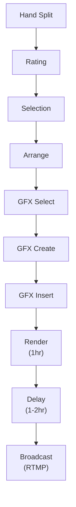

| 단계 | 설명 |
|------|------|
| Hand Split | 영상을 핸드(한 판) 단위로 분리 |
| Rating | 각 핸드에 A+~D 등급 매김 |
| Selection | 볼거리 높은 상위 핸드 선별 |
| Arrange | 방송 순서로 재배치 |
| GFX Select | 그래픽 선정 — 어떤 그래픽을 넣을지 결정, 큐시트 작성 |
| GFX Create | 그래픽 생성 — 데이터 소스에서 그래픽 제작 |
| GFX Insert | 그래픽 삽입 — 타임라인에 배치 |
| Render | 1시간 블록 단위 렌더링 |
| Delay | 1~2시간 지연 버퍼 |
| Broadcast | RTMP로 YouTube 송출 |

### 4.3 Graphics Workflow — 후편집 그래픽 제작 과정

후편집 그래픽은 4단계를 거쳐 완성된다:

1. **데이터 수집**: Graphics Producer가 핸드 등급 정보와 WSOP LIVE DB 데이터를 모니터링
2. **JSON 변환**: EBS가 WSOP LIVE DB에서 핸드 히스토리를 JSON 파일로 변환
3. **큐시트 합류**: 핸드 히스토리 JSON과 Producer 지시가 큐시트에 합류
4. **그래픽 제작**: Post-production 팀이 큐시트에 따라 그래픽 제작/삽입

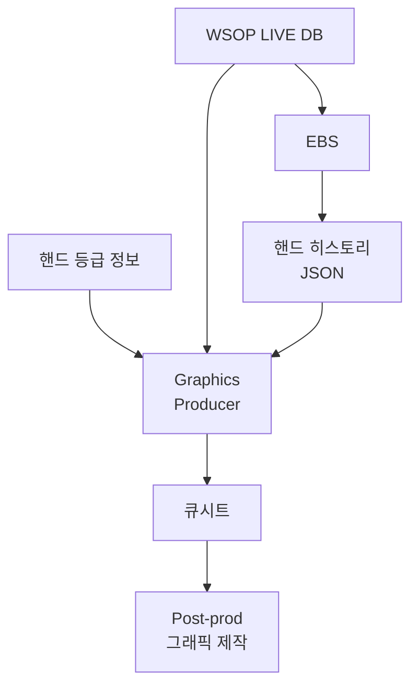

후편집 그래픽은 **WSOP LIVE DB**에서 데이터를 가져와 서울에서 제작한다. EBS가 핸드 히스토리를 JSON으로 변환하여 제공하지만, 그래픽 자체는 서울 Post-production 팀이 생성한다.

**L-Bar 워크플로우**: 큐시트 → Graphics 팀(lower-third + 투명 배경 이미지) → GFX 소프트웨어(코드/이름으로 저장) → 편집 프로그램(L-Bar 섹션 채우기) → 타임라인 배치. 레벨 전환, PIP 전환, 블록 전환 시 사용.

---

## 5. Section E-1 — YouTube 송출

> YouTube 무료 시청자 경로.

| 항목 | 값 |
|------|-----|
| 프로토콜 | RTMP |
| 플랫폼 | YouTube Live |
| 시청자 | 무료 (Free/Teaser) |
| DVR | OFF |
| Post-Live | Private 전환 |

> 전체 지연: 프로덕션 1~2시간 + LiveU 전송 3~8초 + YouTube 스트림 15~30초.

---

## 6. 화면 그래픽 분류 — 데이터 소스 기준

WSOP 방송에 등장하는 그래픽을 **데이터가 어디서 오는지** 기준으로 분류한다.

### 6.0 전체 자막 오버뷰

| # | 그래픽 | 데이터 소스 | Section | 상태 |
|:-:|--------|:---:|:---:|:---:|
| 1 | Current Chip Stack | EBS | C | ✅ |
| 2 | Mini Leaderboard | EBS | C | ✅ |
| 3 | Chip Stack Meter | EBS | C | 미구현 |
| 4 | Chip Flow | EBS | C | 미구현 |
| 5 | At Risk of Elimination | WSOP LIVE DB | C | ✅ |
| 6 | Table Leaderboard | WSOP LIVE DB | C | ✅ |
| 7 | Multi-Table Leaderboard | WSOP LIVE DB | C | ✅ |
| 8 | Tournament Leaderboard | WSOP LIVE DB | C | 미구현 |
| 9 | Total Earning | Manual | C | ✅ |
| 10 | Profile Card | Manual | C | ✅ |
| 11 | Live Updates | Manual | C | ✅ |
| 12 | 정보 대판 (Info Board) | WSOP LIVE DB + Manual | C | ✅ |
| 13 | Break | Manual | C | ✅ |
| 14 | Venue | Manual | C | ✅ |
| 15 | Commentator | Manual | C | ✅ |
| 16 | Chips in Play | Manual | C | 미구현 |
| 17 | Player vs Player | Manual | C | 미구현 |
| 18 | L-Bar Overlay | WSOP LIVE + X + Manual | C | 미구현 |
| 19 | Outer Table Transition | WSOP LIVE DB + Manual | C | 미구현 |

> RFID 오버레이 그래픽(홀카드, 커뮤니티 카드, 액션 배지, 팟, 승률 등)은 Section A에서 EBS가 실시간 생성한다. §2.2 참조.

| 데이터 소스 | 구현 | 미구현 | 합계 |
|:---:|:---:|:---:|:---:|
| **EBS** | 2 | 2 | 4 |
| **WSOP LIVE DB** | 3 | 1 | 4 |
| **Manual / 복합** | 7 | 4 | 11 |
| **합계** | **12** | **7** | **19** |

---

### 6.1 EBS 데이터 (4종)

EBS가 실시간으로 생성하거나, 핸드 히스토리 JSON으로 변환하여 후편집에서 활용하는 그래픽이다.

---

#### Current Chip Stack

> Total Earning(§6.3)과 동일한 하단 자막 형식을 사용한다.

- **WHAT**: 플레이어의 현재 칩 스택을 표시하는 하단 자막
- **INPUT DATA**: 핸드 승패 후 칩 변동 데이터 (EBS 핸드 히스토리 JSON)
- **USAGE**: 플레이어가 핸드를 이기거나 졌을 때 트리거

https://www.youtube.com/live/pp9pA3dQWIk?si=1X2dJTEyPTE80Yk3&t=5535

---

#### Mini Leaderboard
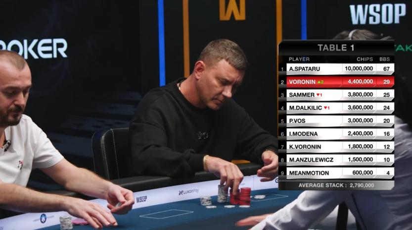

- **WHAT**: 테이블 내 플레이어 칩 순위 + 순위 변동 표시
- **INPUT DATA**: 테이블 내 상대적 칩 순위, 변동 방향 (EBS 핸드 히스토리 JSON)
- **USAGE**: 핸드 완료 후 트리거

https://www.youtube.com/live/pp9pA3dQWIk?si=Oq2N1_2k8qOqk_h7&t=4121

---

#### Chip Stack Meter (미구현)
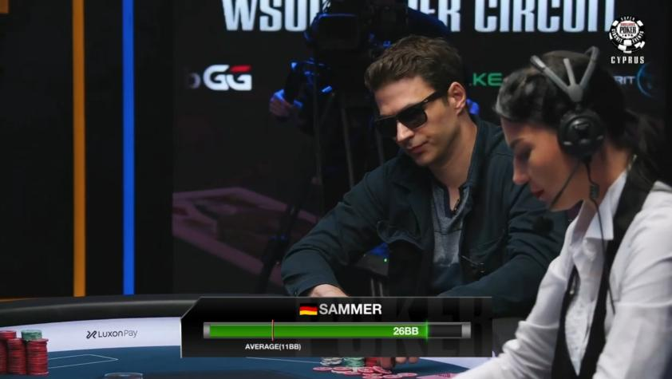

- **WHAT**: 플레이어의 칩 증감을 표시하는 애니메이션 하단 자막
- **INPUT DATA**: 핸드별 칩 변동량 (EBS 핸드 히스토리 JSON)
- **USAGE**: 스택 변동이 의미 있는 핸드 결과 후 트리거

---

#### Chip Flow (미구현)
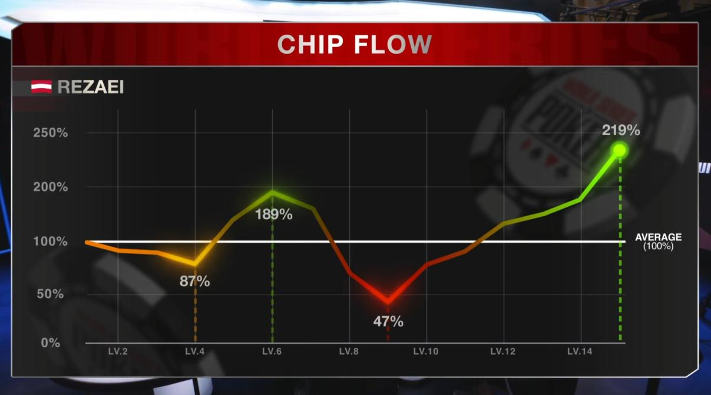

- **WHAT**: 플레이어의 칩 증감 추이를 그래프로 보여주는 애니메이션 팝업
- **INPUT DATA**: 여러 핸드에 걸친 누적 칩 변동 데이터 (EBS 핸드 히스토리 JSON)
- **USAGE**: 토너먼트 내러티브 시각화, 핵심 전환점 식별

---

### 6.2 WSOP LIVE DB 데이터 (4종)

WSOP LIVE DB 대회 운영 시스템이 제공하는 데이터를 활용하여 만드는 그래픽이다.

---

#### At Risk of Elimination
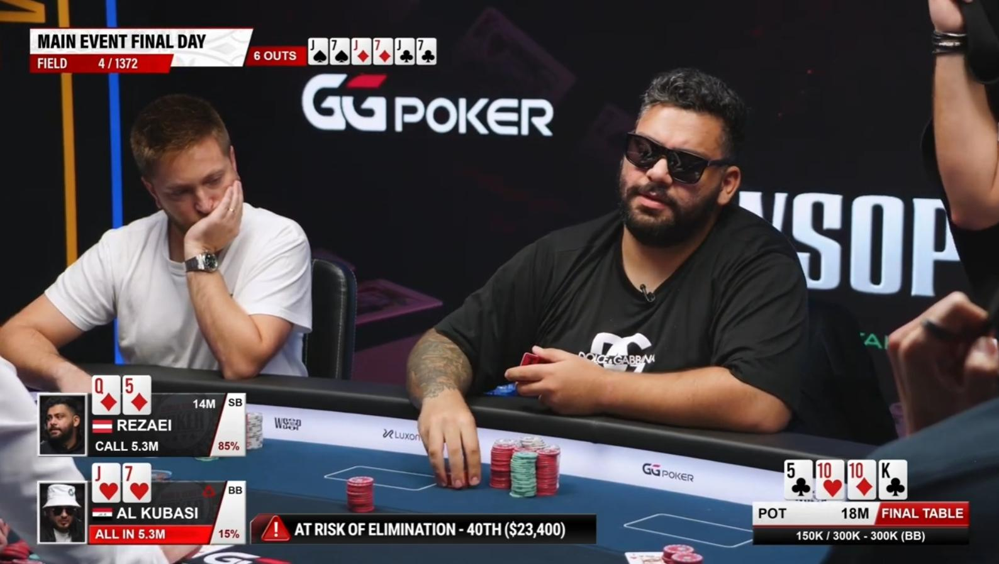

- **WHAT**: 탈락 위기에 처한 플레이어를 알리는 애니메이션 하단 자막
- **INPUT DATA**: 현재 칩 스택 대비 블라인드 비율 (WSOP LIVE DB)
- **USAGE**: 핸드에 참여한 플레이어가 탈락 위기일 때 트리거

https://www.youtube.com/live/pp9pA3dQWIk?si=oR0abHuHplPI-Bw5&t=2824

---

#### Table Leaderboard
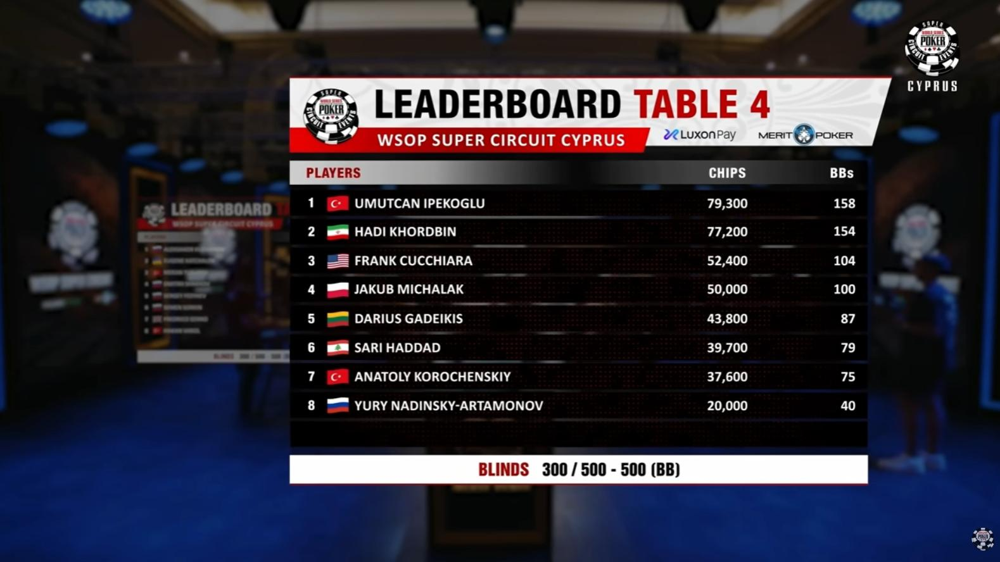

- **WHAT**: 현재 스트리밍 피처 테이블의 플레이어 순위
- **INPUT DATA**: 테이블별 플레이어 순위 (WSOP LIVE DB)
- **USAGE**: 방송 전반에 걸쳐 표시

https://www.youtube.com/live/pp9pA3dQWIk?si=GUTsgAC_VGabvqqS&t=13534

---

#### Multi-Table Leaderboard
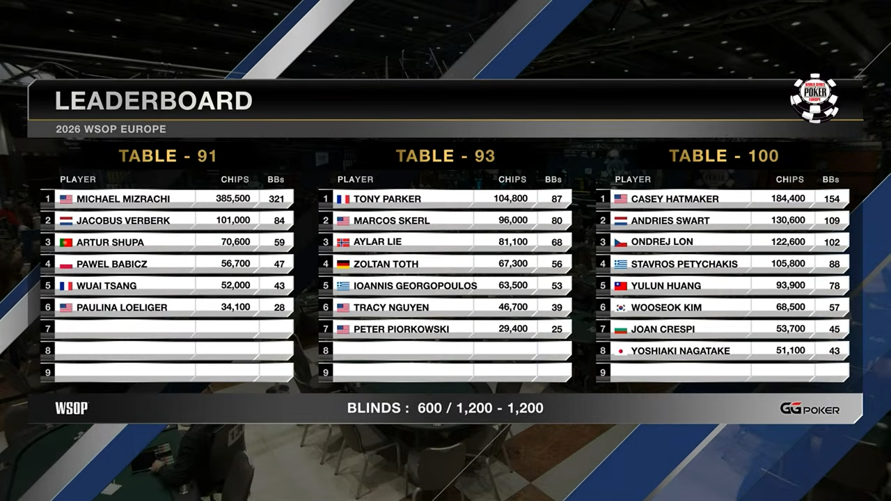

- **WHAT**: 여러 테이블의 플레이어 순위를 한 화면에 보여주는 그래픽
- **INPUT DATA**: 다중 테이블 플레이어 순위, 칩 수, BB 수 (WSOP LIVE DB)
- **USAGE**: 방송 시작, 피처 테이블 전환 전/후, 핸드 사이

https://www.youtube.com/live/pp9pA3dQWIk?si=7pse8h2vKaBFJViV&t=21500

---

#### Tournament Leaderboard (미구현)
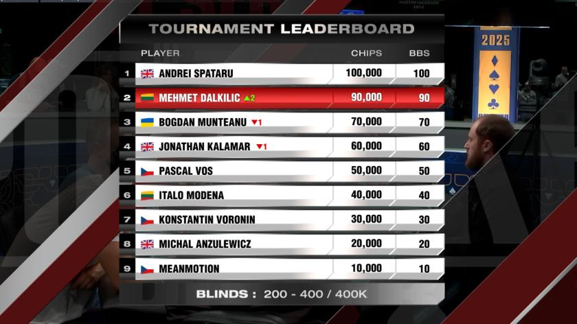

- **WHAT**: 토너먼트 전체 플레이어 순위를 보여주는 그래픽
- **INPUT DATA**: 전체 대회 순위, 칩 수, BB 수 (WSOP LIVE DB)
- **USAGE**: 방송 시작, 피처 테이블 전환 전/후, 핸드 사이

---

### 6.3 Manual / 복합 소스 (9종)

프로듀서 판단, 사전 제작, 수동 편집, 또는 여러 소스를 조합하여 만드는 그래픽이다.

---

#### Total Earning
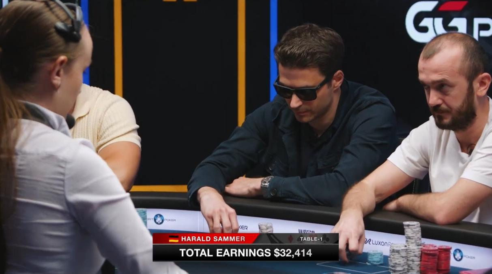

> Current Chip Stack(§6.1)과 동일한 하단 자막 형식을 사용한다.

- **WHAT**: 플레이어의 토너먼트 총 수입을 표시하는 하단 자막
- **INPUT DATA**: Manual — 사전 조사(scouting) 데이터
- **USAGE**: 선수 소개, 주요 핸드 전

https://www.youtube.com/live/pp9pA3dQWIk?si=Ckb_4UICcRKWl75c&t=2386

---

#### Profile Card
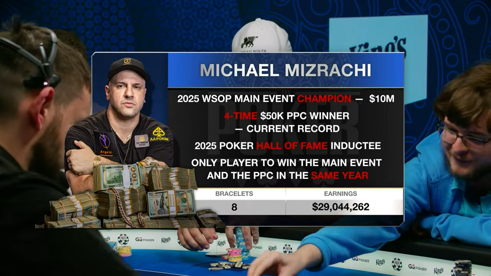

- **WHAT**: 주요 선수의 경력 하이라이트를 보여주는 그래픽
- **INPUT DATA**: Manual — 사전 제작 (선수 경력, 브레이슬릿 수, 총 상금)
- **USAGE**: 방송 시작, 주요 핸드 전

https://www.youtube.com/live/pp9pA3dQWIk?si=VN-xmUqOOQHIGGT2&t=14571

---

#### Live Updates

- **WHAT**: 라이브 토너먼트 업데이트를 전달하는 하단 스크롤 텍스트
- **INPUT DATA**: Manual — 프로듀서 수동 입력 (뉴스, 상금 업데이트, 긴급 속보)
- **USAGE**: 핸드 사이 알림

https://www.youtube.com/live/pp9pA3dQWIk?si=69L6EPZNWGOGmG_4&t=2903

---

#### 정보 대판 (Info Board)

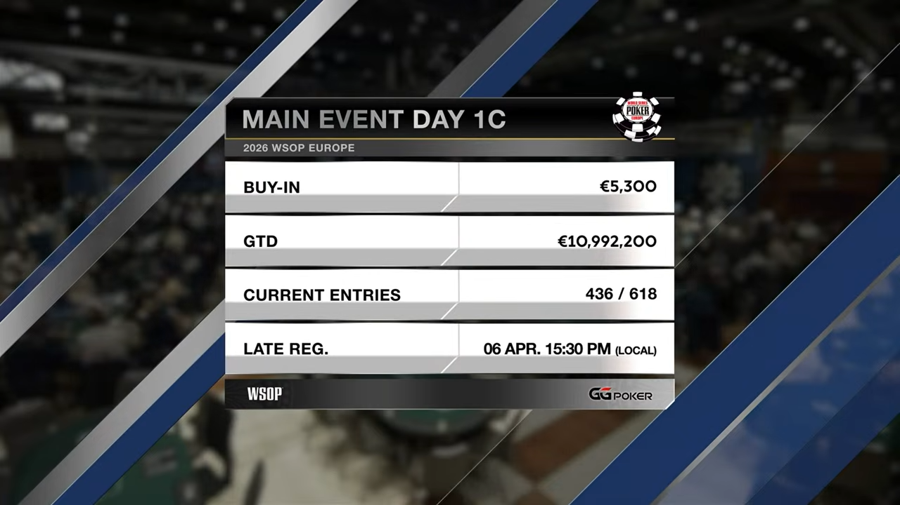

- **WHAT**: 대회 정보(이벤트명, Buy-in, GTD, 엔트리 수, Late Reg) 또는 소셜 미디어 연결 정보를 보여주는 풀스크린 그래픽
- **INPUT DATA**: WSOP LIVE DB (대회 정보) + Manual (레이아웃 편집, 소셜 미디어 정보)
- **USAGE**: 방송 전/후, 핸드 사이, 브레이크 전

---

#### Break

- **WHAT**: 휴식 시간을 알리는 카운트다운 화면 + 방송 콘텐츠(인터뷰 등)
- **INPUT DATA**: Manual — 카운트다운 시간 설정, 방송 콘텐츠 편집
- **USAGE**: 레벨 간 휴식 시간

---

#### Venue

- **WHAT**: 대회 개최 장소를 보여주는 외부 전경 자막
- **INPUT DATA**: Manual — 사전 촬영 영상 + 장소명 자막 (예: KING'S CASINO, HILTON, PRAGUE)
- **USAGE**: 방송 오프닝, 브레이크 전환 시

---

#### Commentator
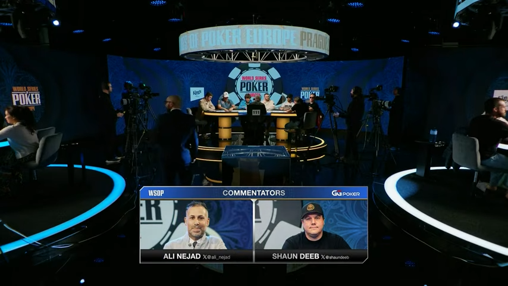

- **WHAT**: 해설진 소개 자막
- **INPUT DATA**: Manual — 사전 제작 (해설자 이름, 사진)
- **USAGE**: 방송 시작, 해설진 교체 시

---

#### Chips in Play (미구현)
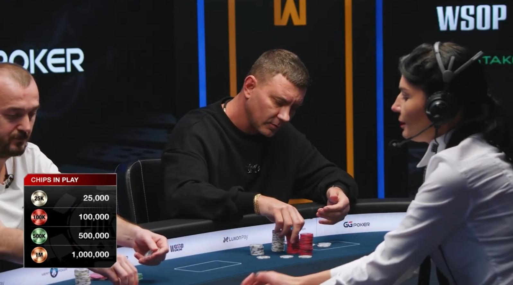

- **WHAT**: 현재 사용 중인 칩 종류를 보여주는 애니메이션 팝업
- **INPUT DATA**: Manual — 토너먼트 단계별 칩 종류 (프로듀서 입력)
- **USAGE**: 방송 시작 시, 새 칩 도입 시

---

#### Player vs Player (미구현)
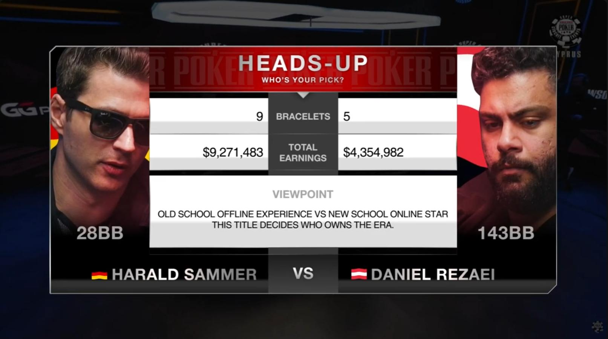

- **WHAT**: 남은 2명의 게임 통계 및 경력을 비교하는 그래픽
- **INPUT DATA**: Manual — 사전 제작 (두 선수의 경력 비교 데이터)
- **USAGE**: 헤즈업(1:1) 진입 시, 파이널 테이블 후반부

---

#### L-Bar Overlay (미구현)
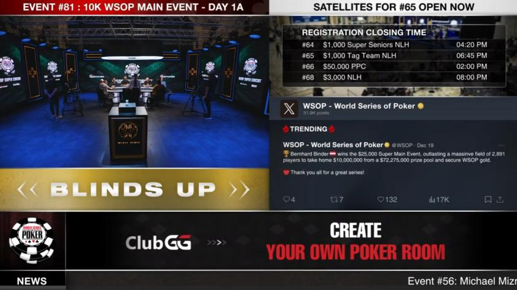

- **WHAT**: 다양한 WSOP 이벤트 콘텐츠를 보여주는 멀티스크린 레이아웃
- **INPUT DATA**: 복합 소스
  1. WSOP LIVE DB — 레벨/블라인드, 대회 일정, 위성 토너먼트 정보
  2. X (Twitter) — 공식 계정 피드, 트렌딩 포스트
  3. Manual — Graphics 팀 수동 편집
- **USAGE**: 핸드 사이, 레벨 전환, 블록 전환 시

---

#### Outer Table Transition (미구현)
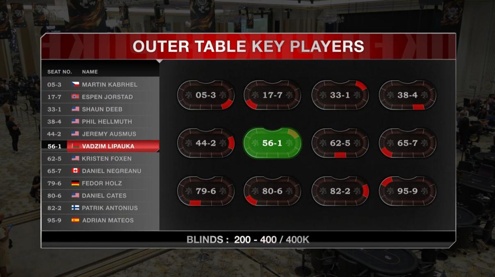

- **WHAT**: 아우터 테이블 플레이어 데이터를 제공하는 전환 그래픽
- **INPUT DATA**: 복합 소스
  1. WSOP LIVE DB — 아우터 테이블 선수 데이터
  2. Manual — Key Player 선정 (프로듀서 판단)
- **USAGE**: 아우터 테이블 전환 시

---

### 6.4 데이터 소스 요약 매트릭스

| 데이터 소스 | 그래픽 수 | 그래픽 목록 |
|:---:|:---:|------|
| **EBS** | 4종 (2 미구현) | Current Chip Stack, Chip Stack Meter *(미구현)*, Chip Flow *(미구현)*, Mini Leaderboard |
| **WSOP LIVE DB** | 4종 (1 미구현) | At Risk, Table Leaderboard, Multi-Table Leaderboard, Tournament Leaderboard *(미구현)* |
| **Manual / 복합** | 11종 (4 미구현) | Total Earning, Profile Card, Live Updates, 정보 대판, Break, Venue, Commentator, Chips in Play *(미구현)*, PvP *(미구현)*, L-Bar *(미구현)*, Outer Table *(미구현)* |

> **총 19종 (7종 미구현)**. RFID 오버레이 그래픽은 §2.2 참조.

## 용어집

> 이 문서에서 자주 등장하는 전문 용어를 정리한다.

### 시스템/소프트웨어

| 용어 | 설명 |
|------|------|
| **EBS** | 현장에서 실시간으로 화면 그래픽을 생성하는 오버레이 시스템 |
| **RFID** | 카드에 내장된 무선 인식 칩. 카드를 테이블에 놓으면 자동으로 인식 |
| **CC (Command Center)** | 방송 스태프가 게임 상황(베팅, 액션 등)을 수동으로 입력하는 프로그램 |
| **WSOP LIVE DB** | 대회 운영 데이터베이스. 플레이어 순위, 칩 수, 토너먼트 스케줄 관리 |

### 방송 장비/기술

| 용어 | 설명 |
|------|------|
| **SDI** | 방송용 고화질 영상 케이블 |
| **NDI** | 네트워크(LAN)를 통한 영상 전송 방식 |
| **Fill & Key** | 투명 배경 그래픽을 영상 위에 겹치는 기술 |
| **Switcher** | 여러 카메라 영상을 전환하고 그래픽을 합성하는 장비 |
| **PGM (Program)** | Switcher에서 출력되는 최종 방송 영상 |
| **LiveU** | 현장에서 인터넷(4G/5G)으로 영상을 보내는 무선 송출 장비 |

### 스트리밍/전송

| 용어 | 설명 |
|------|------|
| **RTMP** | 실시간 영상을 YouTube 등에 보내는 전송 프로토콜 |
| **HLS** | 영상을 잘게 쪼개서 보내는 방식 |
| **SRT** | 불안정한 인터넷에서도 안정적으로 영상을 보내는 전송 방식 |

### 포커 용어

| 용어 | 설명 |
|------|------|
| **핸드 (Hand)** | 카드를 나누고 승부가 결정되기까지의 한 판 |
| **홀카드 (Hole Card)** | 각 플레이어에게만 보이는 개인 카드 |
| **커뮤니티 카드** | 테이블 중앙에 공개되는 공용 카드 |
| **팟 (Pot)** | 한 핸드에서 모인 총 베팅 금액 |

