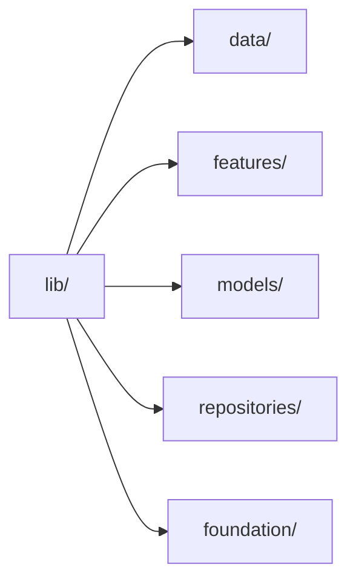
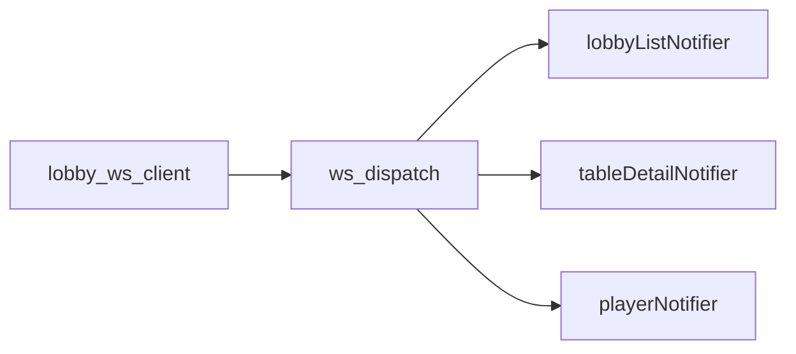
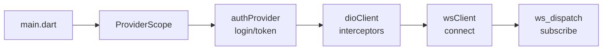
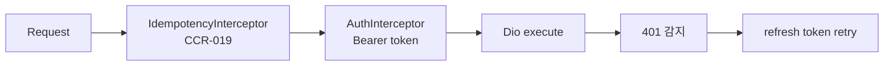

# Engineering — Frontend (Flutter)

| 날짜 | 항목 | 내용 |
|------|------|------|
| 2026-04-21 | features 정렬 완료 | 선언 8 → 실측 6 일치. players → lobby 통합, audit_log + hand_history → reports 통합. CLAUDE.md §아키텍처 동기화 |
| 2026-04-20 | Conductor audit | SG-001 resolution 반영 + features 실측/선언 공백 §0 명시 |
| 2026-04-16 | Flutter 전환 | Quasar→Flutter 전면 재작성. Riverpod+Freezed+Dio+go_router+rive |
| 2026-04-15 | (이전) | Quasar/Vue 3 아키텍처 최종본 — §12 아카이브 참조 |

---

## 0. features 선언 vs 실측 정렬 (2026-04-21 resolved)

### 0.1 최종 상태 (6 feature)

team1 CLAUDE.md §"아키텍처" 와 `team1-frontend/lib/features/` 가 완전 일치:

```
auth / lobby / settings / graphic_editor / staff / reports
```

| Feature | 역할 | 관련 기획 |
|---------|------|-----------|
| `auth` | 로그인 + 2FA StateNotifier | `Login/` |
| `lobby` | Series→Event→Flight→Table 드릴다운 + **Player 관리 서브뷰** | `Lobby/` |
| `settings` | 6탭 (Outputs / GFX / Display / Rules / Statistics / Preferences) | `Settings/` |
| `graphic_editor` | `.gfskin` 허브 + Rive 프리뷰 (Flutter rive ^0.13) | `Graphic_Editor/` |
| `staff` | 운영자 관리 (RBAC 3역할) | BS-01 Authentication |
| `reports` | **Hand History + Audit Log 뷰어** (읽기 전용, BO DB 소비) | API-01 §Hands + §Audit |

### 0.2 이관 매핑 (과거 선언 → 현재 통합)

2026-04-20 audit 에서 발견된 선언/실측 공백 3건이 아래와 같이 해소됨:

| 과거 선언 | 최종 위치 | 사유 |
|----------|----------|------|
| `players` | `lobby/` 하위 서브뷰 | Player 관리는 Lobby 드릴다운의 독립 레이어 (`Lobby/UI.md` §5 Player 독립 레이어 참조). 별도 feature 디렉토리 불필요 — Lobby 라우트 내부에서 Series/Event 와 직교 |
| `audit_log` | `reports/` 통합 | BO 가 감사 로그 SSOT. team1 은 읽기 전용 뷰만 제공 → reports 하위 탭으로 통합 자연 |
| `hand_history` | `reports/` 통합 | 핸드 기록도 읽기 전용 뷰어 성격. reports 하위 탭으로 통합 — 공통 페이지네이션/필터/export UX |

### 0.3 결정 근거

- **"feature 디렉토리 = 독립 라우트"** 원칙 유지. 읽기 전용 뷰 3개 (players/audit_log/hand_history) 를 각각 feature 로 만들면 의미 중복.
- `reports` feature 하위에 탭 구조로 hand_history + audit_log 배치가 Material3 `DefaultTabController` 로 즉시 구현 가능.
- Player 관리는 Lobby 드릴다운 맥락 강함 (Series/Event/Flight 선택 후 Player 배치) → Lobby 하위가 맥락 보존.

### 0.4 영향 받은 문서

- `team1-frontend/CLAUDE.md §"아키텍처"` 선언 목록 6개로 재작성
- `team1-frontend/INDEX.md` 전면 Flutter v10 재작성 (Quasar 경로 참조 제거)
- 본 Engineering.md frontmatter `reimplementability: UNKNOWN → PASS`
- `Roadmap.md §"2.1 Frontend"` 의 "features 미정렬" 라인 — Conductor 세션이 resolved 반영 후속

관련 SG: 없음 (team1 내부 결정, 공식 spec_gap 승격 불필요).

---

## 1. 기술 스택

| 영역 | 선정 | 버전 | 근거 |
|------|------|:----:|------|
| Framework | **Flutter** (Windows desktop) | `^3.29` | team4 CC 와 스택 통일, 크로스 플랫폼 |
| Language | **Dart** (strict analysis) | `^3.7` | Flutter 네이티브, null-safety |
| State | **Riverpod** (`flutter_riverpod`) | `^2.6` | 컴파일 타임 안전, Provider 트리 독립, 테스트 용이 |
| Code-gen | **Freezed** + `json_serializable` | `^2.5` | immutable 모델 + `fromJson`/`toJson` 자동 생성 |
| HTTP | **Dio** | `^5.7` | interceptor 체이닝(Idempotency, Auth refresh) |
| Router | **go_router** | `^14.6` | 선언적 라우팅, redirect guard, ShellRoute |
| WebSocket | `web_socket_channel` + 커스텀 래퍼 | `^3.0` | seq 검증 직접 제어, reconnect 로직 |
| Rive preview | **`rive`** (flutter) | `^0.13` | CCR-011 GE 프리뷰 (`.gfskin` artboard 렌더) |
| i18n | `flutter_localizations` + `intl` | — | ARB 기반 3 locale (ko/en/es) |
| Testing | `flutter_test` + `mocktail` | — | 단위/위젯 테스트 |
| Lint | `flutter_lints` + `custom_lint` | — | `analysis_options.yaml` strict |
| Shared | **ebs_common** (path dep) | — | CCR-017/019/021 공용 유틸 |

---

## 2. 아키텍처 개요

team4 CC 패턴과 동일한 feature-based 디렉토리 구조를 따른다.



### 2.1 디렉토리 구조 (2026-04-21 실측 재작성)

```
team1-frontend/lib/
├── main.dart
├── app.dart                            # MaterialApp.router + ProviderScope
├── data/
│   ├── remote/
│   │   ├── bo_api_client.dart          # Dio + Idempotency + Auth refresh interceptor
│   │   ├── lobby_websocket_client.dart # WS + seq 단조증가 + replay
│   │   └── ws_dispatch.dart            # 중앙 이벤트 라우터 (25+ 이벤트)
│   └── local/
│       ├── mock_dio_adapter.dart       # MockDioAdapter (개발용)
│       └── mock_data.dart              # 10 competitions / 10 flights / 20 tables / 100 players fixture
├── features/                           # 7 feature (2026-04-21 Players 독립 레이어 추가)
│   ├── auth/                           # login_screen + forgot_password + auth_provider
│   ├── lobby/                          # lobby_dashboard (series/event/flight/table 통합 드릴다운) + table_detail
│   ├── players/                        # players_screen + player_detail_dialog (Lobby/UI.md §화면 4 독립 레이어)
│   ├── settings/                       # 8 screens (blind_structure / prize_structure / outputs / gfx / display / rules / stats / preferences + layout)
│   ├── graphic_editor/                 # ge_hub + ge_detail + rive_preview (rive ^0.13)
│   ├── staff/                          # staff_list + user_form_dialog
│   └── reports/                        # reports_screen (4탭: hands-summary / player-stats / session-log / table-activity — hand_history + audit_log 통합)
├── models/entities/                    # 19 @freezed entities
│   ├── series / ebs_event / event_flight / table / table_seat
│   ├── player / session_user / user / staff
│   ├── hand / hand_player / hand_action
│   ├── config / skin / skin_metadata
│   ├── blind_structure / blind_structure_level
│   ├── competition / audit_log / output_preset
│   └── (각 entity 당 .freezed.dart + .g.dart 자동 생성)
├── repositories/                       # 14 Repository (API-01 계약 소비)
│   ├── auth / competition / series / event / flight
│   ├── table (seat endpoints 통합) / player / hand
│   ├── settings (configs rename) / skin / staff (users rename)
│   ├── audit_log / report / payout_structure
│   └── (blind_structure 는 settings_repository 에 통합 — B-084 재평가 대상)
├── foundation/
│   ├── theme/ebs_theme.dart            # Material3 dark (team4 기반 동일 colorSchemeSeed)
│   ├── router/app_router.dart          # go_router 9 routes (§4.3)
│   ├── i18n/ (+ resources/l10n/)       # ARB 3 locale (ko/en/es, 231 keys)
│   ├── configs/env_config.dart         # --dart-define 환경변수
│   └── widgets/                        # empty_state / error_banner / loading_state 등 공통
└── resources/l10n/                     # app_{ko,en,es}.arb
```

**이전 설계와의 차이** (Quasar 시대 원안 대비):
- Settings 4 분할 (`settings_output/settings_gfx/settings_display/settings_rules`) → 단일 `settings/` 통합
- `player/` 독립 feature → `lobby/` 하위 서브뷰 (드릴다운 맥락 보존)
- `staff/`, `reports/` 신규 feature (Quasar → Flutter 이전 중 분리)
- 파일명: `dio_client` → `bo_api_client`, `lobby_ws_client` → `lobby_websocket_client`
- Repository 11 → 14 (staff/audit_log/report/payout_structure 신규, settings rename, seat 통합)

---

## 3. 상태 관리 — Riverpod

### 3.1 Provider 패턴

| 패턴 | 용도 | 예시 |
|------|------|------|
| `StateNotifierProvider` | stateful feature | `authProvider`, `lobbyListProvider`, `settingsProvider`, `geProvider` |
| `StateProvider` | 단순 선택값 | `navBreadcrumbProvider` (현재 Series → Event → … 경로) |
| `Provider.family` | 파라미터 목록 | `eventsBySeriesProvider(seriesId)`, `tablesByFlightProvider(flightId)` |
| `Provider` | 싱글턴 의존성 | `dioClientProvider`, `wsClientProvider` |

### 3.2 WS dispatch 패턴

WebSocket 이벤트는 중앙 라우터(`ws_dispatch.dart`)가 수신 후 해당 StateNotifier 에 분배한다.



### 3.3 초기화 순서



---

## 4. 라우팅 — go_router

### 4.1 Auth redirect guard

`redirect` 콜백에서 `authProvider` 상태 확인. 미인증이면 `/login` 으로 리디렉트, 인증 후 원래 경로 복원.

### 4.2 ShellRoute + NavigationRail

`ShellRoute` 내부에 좌측 `NavigationRail` 배치. 하위 경로 전환 시 Rail 유지.

### 4.3 Route table (14 routes)

### 4.3 Route table (10 routes, 2026-04-21 실측 — Players 추가)

| # | Path | Feature | Builder | 비고 |
|---|------|---------|---------|------|
| 1 | `/login` | auth | `LoginScreen` | 미인증 진입점. `redirect` 로 로그인 후 원래 경로 복원 |
| 2 | `/forgot-password` | auth | `ForgotPasswordScreen` | 비밀번호 초기화 플로우 |
| 3 | `/lobby` | lobby | `LobbyDashboardScreen` | **단일 대시보드** — Series selector + Events + Tables 3 section 통합 (이전 `/series`, `/series/:id/events`, `/flights`, `/tables` 드릴다운 라우트를 단일 화면 state 로 통합) |
| 4 | `/tables/:tableId` | lobby | `TableDetailScreen` | Table 상세 (SeatGrid) |
| 5 | `/players` | players | `PlayersScreen` | **독립 레이어** — Player DataTable + 검색 + Status filter + 상세 dialog. `Lobby/UI.md §화면 4` 스펙 |
| 6 | `/staff` | staff | `StaffListScreen` | 운영자 관리 |
| 6 | `/settings` → `/settings/blind-structure` | settings | redirect | Settings 진입 시 기본 탭 |
| 7 | `/settings/:section` | settings | `SettingsLayout(section:)` | dynamic section 파라미터. 허용 값: `blind-structure / prize-structure / outputs / gfx / display / rules / stats / preferences` (8 탭) |
| 8 | `/graphic-editor` | graphic_editor | `GeHubScreen` | `.gfskin` 허브 |
| 9 | `/graphic-editor/:skinId` | graphic_editor | `GeDetailScreen` | 스킨 상세 편집 |
| 10 | `/reports` → `/reports/hands-summary` | reports | redirect | Reports 진입 시 기본 탭 |
| 11 | `/reports/:type` | reports | `ReportsScreen(reportType:)` | dynamic type 파라미터. 허용 값: `hands-summary / player-stats / session-log / table-activity` (4탭) |

**이전 설계와의 차이** (Quasar 시대 14 routes 대비):
- Series/Event/Flight 3단계 드릴다운 (4 routes) → 단일 `/lobby` 대시보드 내부 state 로 통합 (UX 단순화 결정)
- `/players` — **2026-04-21 구현** (`Lobby/UI.md §화면 4 독립 레이어` 준수). 상세는 dialog (별도 라우트 없음)
- Settings 4 하드코딩 path → 단일 dynamic `/settings/:section`
- `/forgot-password`, `/staff`, `/reports/:type`, `/graphic-editor/:skinId` 추가 (Quasar 이후 신규 화면)
- `errorBuilder: _PlaceholderScreen(title: '404 Not Found')` — 간소화된 NotFound 처리 (Quasar `NotFoundPage.vue` 의 경량 대체)

---

## 5. API 클라이언트 — Dio

### 5.1 Interceptor 체인



**IdempotencyInterceptor (CCR-019)**: POST/PUT/PATCH 요청에 `Idempotency-Key: {UUID v4}` 헤더 자동 주입. `UuidIdempotency` 는 `ebs_common` 패키지에서 제공.

**AuthInterceptor**: `Authorization: Bearer {token}` 주입. 401 응답 시 refresh token 으로 재발급 → 원래 요청 재시도. refresh 실패 시 `/login` 으로 리디렉트. 무한 루프 방지를 위해 refresh 요청 자체에는 interceptor 미적용.

### 5.2 Repository 매핑 (14 classes, 2026-04-21 실측)

| Repository | Base path | 주요 메서드 | 비고 |
|------------|-----------|------------|------|
| `AuthRepository` | `/auth` | `login`, `refresh`, `logout`, `verify2FA` | |
| `CompetitionRepository` | `/competitions` | `list`, `get` | 신규 (Quasar api 이식) |
| `SeriesRepository` | `/series` | `list`, `get`, `create`, `update`, `delete` | |
| `EventRepository` | `/series/:id/events`, `/events/:id` | `list`, `get`, `create`, `update` | |
| `FlightRepository` | `/events/:id/flights`, `/flights/:id` | `list`, `get`, `create`, `update` | |
| `TableRepository` | `/tables`, `/flights/:id/tables`, `/tables/:id/seats` | `list` (flight_id query), `get`, `create`, `update`, `updateStatus`, `listSeats`, `seatPlayer`, `unseatPlayer`, `launchCc`, `rebalance` | **SeatRepository 통합** — Seat endpoints 를 테이블 맥락에서 노출 |
| `PlayerRepository` | `/players` | `list`, `get`, `create`, `update`, `search` | UI 미구현 (B-080) |
| `HandRepository` | `/tables/:id/hands`, `/hands/:id` | `list`, `current`, `get` | |
| `SettingsRepository` | `/configs` | `get`, `update` (scope: series/event/table/global) | `ConfigRepository` rename |
| `SkinRepository` | `/skins` | `list`, `get`, `uploadSkin`, `activate`, `delete`, `updateMetadata` | Graphic Editor 소비 |
| `StaffRepository` | `/users` | `list`, `get`, `create`, `update`, `delete` | `UsersRepository` rename |
| `AuditLogRepository` | `/audit-logs` | `list` (filter: actor/action/date) | Reports 소비 |
| `ReportRepository` | `/reports/{hands-summary/player-stats/session-log/table-activity}` | `getReport(type, filter)`, `exportCsv(type, filter)` | 4탭 통합 |
| `PayoutStructureRepository` | `/payout-structures` | `list`, `get`, `create`, `update` | 신규 |

**미구현 / 통합 결정**:
- **BlindStructureRepository** — settings_repository 에 통합 (`blind_structure_screen.dart` 가 settings_provider 경유 접근). 분리 재평가 B-084.
- **SeatRepository** — `TableRepository` 의 seat* 메서드로 통합 (별도 파일 없음).
- **SyncRepository** — Backend (team2) 가 WSOP LIVE 폴링 담당. Frontend 미이식. B-085 관찰.

---

## 6. WebSocket — lobby_ws_client

### 6.1 연결

읽기 전용 `/ws/lobby`. 모니터링 이벤트만 수신 (write 명령 없음).

### 6.2 SeqTracker gap 감지 (CCR-021)

수신 메시지마다 `seq` 필드를 `SeqTracker` (ebs_common) 로 검증. gap 감지 시 `/ws/replay?from_seq=N` 으로 누락분 요청.

### 6.3 Reconnect

Exponential backoff: 1s → 2s → 4s → 8s → 16s (max). 연결 복구 시 마지막 `seq` 부터 replay.

### 6.4 ws_dispatch 라우팅

| 이벤트 타입 | 수신자 |
|------------|--------|
| `series.*`, `event.*`, `flight.*`, `table.*` | `lobbyListNotifier` |
| `table.detail.*`, `seat.*` | `tableDetailNotifier` |
| `player.*` | `playerNotifier` |
| `hand.*` | `handNotifier` |
| `config.*` | `settingsNotifier` |

---

## 7. Mock 서버 — MockDioAdapter

### 7.1 구현 방식

Dio 의 `HttpClientAdapter` 를 구현한 `MockDioAdapter`. 요청 URL + method 패턴 매칭으로 JSON 응답 반환.

### 7.2 토글

`--dart-define=USE_MOCK=true` (기본값: development). `env_config.dart` 에서 분기:

```dart
final useMock = const bool.fromEnvironment('USE_MOCK', defaultValue: true);
```

### 7.3 데이터 소스

기존 Quasar MSW `data.ts`/`handlers.ts` 의 fixture 데이터를 Dart 로 포팅. `test/fixtures/` 에 JSON 파일로 관리.

---

## 8. 국제화 — flutter_localizations + intl

| 항목 | 값 |
|------|-----|
| 기본 locale | `ko` |
| 지원 locale | `ko`, `en` (Vegas), `es` (Vegas sub) |
| 키 수 | 231 (기존 vue-i18n 동일) |
| 형식 | ARB (`app_{locale}.arb`) |
| 설정 | `l10n.yaml` — `arb-dir: lib/foundation/i18n`, `output-class: AppLocalizations` |

`flutter gen-l10n` 으로 타입 안전 접근자 자동 생성.

---

## 9. 테마 — Material3 Dark

team4 CC `ebs_theme` 패키지를 기반으로 동일 color scheme 적용.

| 속성 | 값 |
|------|-----|
| `useMaterial3` | `true` |
| `brightness` | `Brightness.dark` |
| `colorSchemeSeed` | team4 와 동일 primary seed |
| Typography | `GoogleFonts.notoSansKr` (한글) + `Roboto` (영문) |

`foundation/theme/ebs_theme.dart` 에 정의. `ebs_common` 에 공유 색상 상수를 두고 두 앱이 참조.

---

## 10. Shared Package — ebs_common

`../shared/ebs_common` path dependency. team1 + team4 공용.

| 모듈 | CCR | 역할 |
|------|-----|------|
| `permission.dart` | CCR-017 | `Role` enum + `hasPermission()` 헬퍼 |
| `uuid_idempotency.dart` | CCR-019 | Dio interceptor 용 UUID v4 생성 |
| `seq_tracker.dart` | CCR-021 | WebSocket seq 단조증가 검증 + gap 감지 |
| `ebs_colors.dart` | — | 공용 색상 상수 |

```yaml
# team1-frontend/pubspec.yaml
dependencies:
  ebs_common:
    path: ../shared/ebs_common
```

---

## 11. 빌드 & 테스트

```bash
# 의존성
flutter pub get
dart run build_runner build --delete-conflicting-outputs

# 정적 분석
flutter analyze

# 테스트
flutter test

# 개발 실행 (Windows)
flutter run -d windows

# 프로덕션 빌드
flutter build windows --release
```

**커밋 전 필수**: `flutter analyze && flutter test` 통과.

**환경 변수** (`--dart-define`):

| 키 | 개발 기본값 | 프로덕션 |
|----|-----------|---------|
| `EBS_BO_HOST` | (미설정 → localhost) | LAN IP 주입 |
| `EBS_BO_PORT` | `8000` | 배포 시점 주입 |
| `USE_MOCK` | `false` | `false` |
| `API_BASE_URL` | `http://localhost:8000/api/v1` | fallback (호스트 미설정 시) |
| `WS_BASE_URL` | `ws://localhost:8000` | fallback (호스트 미설정 시) |

### 네트워크 배포

| 시나리오 | 명령 |
|----------|------|
| 개발 (localhost) | `flutter run -d windows` |
| LAN | `flutter run -d windows --dart-define=EBS_BO_HOST=192.168.1.100` |
| 빌드 (LAN) | `flutter build windows --release --dart-define=EBS_BO_HOST=192.168.1.100` |
| 커스텀 | `flutter run -d windows --dart-define=API_BASE_URL=http://host:port/api/v1 --dart-define=WS_BASE_URL=ws://host:port` |

---

## 12. 이전 아키텍처 (아카이브)

Quasar (Vue 3) + TypeScript 기반의 이전 아키텍처는 Flutter 크로스 플랫폼 통일 결정에 따라 교체되었다.

| 항목 | 이전 (Quasar) | 현재 (Flutter) |
|------|-------------|---------------|
| State | Pinia 5 stores | Riverpod providers |
| Router | vue-router 계층 트리 | go_router 14 routes |
| HTTP | axios + interceptor | Dio + interceptor |
| WebSocket | 네이티브 WebSocket 래퍼 | web_socket_channel 래퍼 |
| Mock | MSW 2.x | MockDioAdapter |
| i18n | vue-i18n (JSON) | flutter_localizations (ARB) |
| Rive | `@rive-app/canvas` | `rive` (Flutter) |

이전 코드 참조: `C:/claude/ebs-archive-backup/07-archive/legacy-repos/ebs_lobby-react/`

이전 Engineering.md (Quasar 버전) 이력: 2026-04-10 신규 작성 → 2026-04-13 WSOP LIVE 정렬 → 2026-04-15 Store 초기화/401 refresh 상세 추가.
