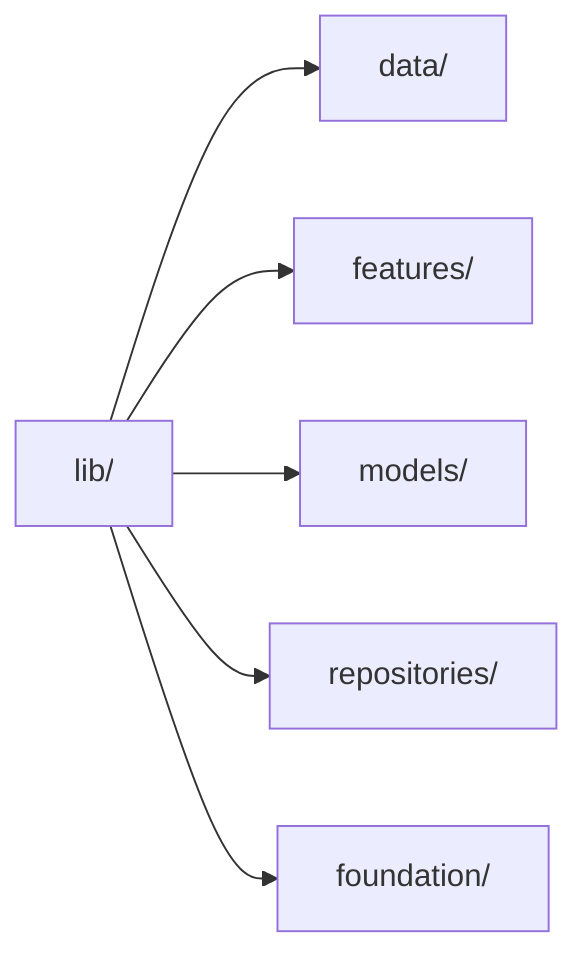
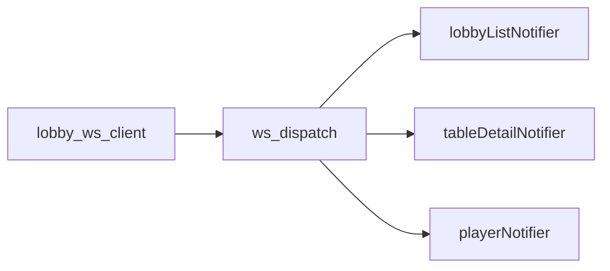
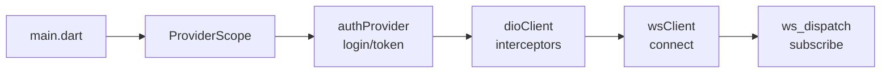
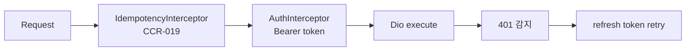

# Engineering — Frontend (Flutter)

| 날짜 | 항목 | 내용 |
|------|------|------|
| 2026-04-16 | Flutter 전환 | Quasar→Flutter 전면 재작성. Riverpod+Freezed+Dio+go_router+rive |
| 2026-04-15 | (이전) | Quasar/Vue 3 아키텍처 최종본 — §12 아카이브 참조 |

---

## 1. 기술 스택

| 영역 | 선정 | 버전 | 근거 |
|------|------|:----:|------|
| Framework | **Flutter** (Windows desktop) | `^3.29` | team4 CC 와 스택 통일, 크로스 플랫폼 |
| Language | **Dart** (strict analysis) | `^3.7` | Flutter 네이티브, null-safety |
| State | **Riverpod** (`flutter_riverpod`) | `^2.6` | 컴파일 타임 안전, Provider 트리 독립, 테스트 용이 |
| Code-gen | **Freezed** + `json_serializable` | `^2.5` | immutable 모델 + `fromJson`/`toJson` 자동 생성 |
| HTTP | **Dio** | `^5.7` | interceptor 체이닝(Idempotency, Auth refresh) |
| Router | **go_router** | `^14.6` | 선언적 라우팅, redirect guard, ShellRoute |
| WebSocket | `web_socket_channel` + 커스텀 래퍼 | `^3.0` | seq 검증 직접 제어, reconnect 로직 |
| Rive preview | **`rive`** (flutter) | `^0.13` | CCR-011 GE 프리뷰 (`.gfskin` artboard 렌더) |
| i18n | `flutter_localizations` + `intl` | — | ARB 기반 3 locale (ko/en/es) |
| Testing | `flutter_test` + `mocktail` | — | 단위/위젯 테스트 |
| Lint | `flutter_lints` + `custom_lint` | — | `analysis_options.yaml` strict |
| Shared | **ebs_common** (path dep) | — | CCR-017/019/021 공용 유틸 |

---

## 2. 아키텍처 개요

team4 CC 패턴과 동일한 feature-based 디렉토리 구조를 따른다.



### 2.1 디렉토리 구조

```
team1-frontend/lib/
├── main.dart
├── app.dart                      # MaterialApp.router + ProviderScope
├── data/
│   ├── remote/
│   │   ├── dio_client.dart       # Dio instance + interceptors
│   │   └── lobby_ws_client.dart  # WebSocket wrapper
│   └── local/
│       └── mock_dio_adapter.dart # MockDioAdapter (개발용)
├── features/
│   ├── auth/                     # 로그인 화면
│   ├── lobby/                    # Series → Event → Flight → Table
│   ├── player/                   # Player 독립 레이어
│   ├── settings_output/          # Settings: Outputs 탭
│   ├── settings_gfx/             # Settings: GFX 탭
│   ├── settings_display/         # Settings: Display 탭
│   ├── settings_rules/           # Settings: Rules 탭
│   └── graphic_editor/           # GE Import/Activate 허브
├── models/
│   ├── series.dart               # @freezed
│   ├── event.dart
│   ├── flight.dart
│   ├── table.dart
│   ├── seat.dart
│   ├── player.dart
│   ├── hand.dart
│   ├── config.dart
│   ├── skin.dart
│   ├── blind_structure.dart
│   └── enums.dart                # GameType, TableStatus, Role 등
├── repositories/
│   ├── auth_repository.dart
│   ├── series_repository.dart
│   ├── event_repository.dart
│   ├── flight_repository.dart
│   ├── table_repository.dart
│   ├── seat_repository.dart
│   ├── player_repository.dart
│   ├── hand_repository.dart
│   ├── config_repository.dart
│   ├── skin_repository.dart
│   └── blind_structure_repository.dart
└── foundation/
    ├── theme/
    │   └── ebs_theme.dart        # Material3 dark (team4 기반)
    ├── router/
    │   └── app_router.dart       # go_router 정의 (§4)
    ├── i18n/
    │   ├── l10n.yaml
    │   ├── app_ko.arb
    │   ├── app_en.arb
    │   └── app_es.arb
    ├── configs/
    │   └── env_config.dart       # --dart-define 환경변수
    └── widgets/
        └── ...                   # 공통 위젯 (NavigationRail 등)
```

---

## 3. 상태 관리 — Riverpod

### 3.1 Provider 패턴

| 패턴 | 용도 | 예시 |
|------|------|------|
| `StateNotifierProvider` | stateful feature | `authProvider`, `lobbyListProvider`, `settingsProvider`, `geProvider` |
| `StateProvider` | 단순 선택값 | `navBreadcrumbProvider` (현재 Series → Event → … 경로) |
| `Provider.family` | 파라미터 목록 | `eventsBySeriesProvider(seriesId)`, `tablesByFlightProvider(flightId)` |
| `Provider` | 싱글턴 의존성 | `dioClientProvider`, `wsClientProvider` |

### 3.2 WS dispatch 패턴

WebSocket 이벤트는 중앙 라우터(`ws_dispatch.dart`)가 수신 후 해당 StateNotifier 에 분배한다.



### 3.3 초기화 순서



---

## 4. 라우팅 — go_router

### 4.1 Auth redirect guard

`redirect` 콜백에서 `authProvider` 상태 확인. 미인증이면 `/login` 으로 리디렉트, 인증 후 원래 경로 복원.

### 4.2 ShellRoute + NavigationRail

`ShellRoute` 내부에 좌측 `NavigationRail` 배치. 하위 경로 전환 시 Rail 유지.

### 4.3 Route table (14 routes)

| # | Path | Feature | 비고 |
|---|------|---------|------|
| 1 | `/login` | auth | 미인증 진입점 |
| 2 | `/` | lobby | 리디렉트 → `/series` |
| 3 | `/series` | lobby | Series 목록 |
| 4 | `/series/:id/events` | lobby | Event 목록 |
| 5 | `/series/:sid/events/:eid/flights` | lobby | Flight 목록 |
| 6 | `/series/:sid/events/:eid/flights/:fid/tables` | lobby | Table 목록 |
| 7 | `/tables/:id` | lobby | Table 상세 (Seat grid) |
| 8 | `/players` | player | Player 독립 목록 |
| 9 | `/players/:id` | player | Player 상세 |
| 10 | `/settings/outputs` | settings_output | Outputs 탭 |
| 11 | `/settings/gfx` | settings_gfx | GFX 탭 |
| 12 | `/settings/display` | settings_display | Display 탭 |
| 13 | `/settings/rules` | settings_rules | Rules 탭 |
| 14 | `/graphic-editor` | graphic_editor | GE Import/Activate |

---

## 5. API 클라이언트 — Dio

### 5.1 Interceptor 체인



**IdempotencyInterceptor (CCR-019)**: POST/PUT/PATCH 요청에 `Idempotency-Key: {UUID v4}` 헤더 자동 주입. `UuidIdempotency` 는 `ebs_common` 패키지에서 제공.

**AuthInterceptor**: `Authorization: Bearer {token}` 주입. 401 응답 시 refresh token 으로 재발급 → 원래 요청 재시도. refresh 실패 시 `/login` 으로 리디렉트. 무한 루프 방지를 위해 refresh 요청 자체에는 interceptor 미적용.

### 5.2 Repository 매핑 (11 classes)

| Repository | Base path | 주요 메서드 |
|------------|-----------|------------|
| `AuthRepository` | `/auth` | `login`, `refresh`, `logout` |
| `SeriesRepository` | `/series` | `list`, `get`, `create`, `update`, `delete` |
| `EventRepository` | `/series/:id/events` | `list`, `get`, `create`, `update` |
| `FlightRepository` | `/events/:id/flights` | `list`, `get`, `create`, `update` |
| `TableRepository` | `/flights/:id/tables` | `list`, `get`, `create`, `update`, `assign` |
| `SeatRepository` | `/tables/:id/seats` | `list`, `seatPlayer`, `unseatPlayer` |
| `PlayerRepository` | `/players` | `list`, `get`, `create`, `update`, `search` |
| `HandRepository` | `/tables/:id/hands` | `list`, `current` |
| `ConfigRepository` | `/configs` | `get`, `update` (scope: series/event/table) |
| `SkinRepository` | `/skins` | `list`, `get`, `upload`, `activate` |
| `BlindStructureRepository` | `/blind-structures` | `list`, `get`, `create`, `update` |

---

## 6. WebSocket — lobby_ws_client

### 6.1 연결

읽기 전용 `/ws/lobby`. 모니터링 이벤트만 수신 (write 명령 없음).

### 6.2 SeqTracker gap 감지 (CCR-021)

수신 메시지마다 `seq` 필드를 `SeqTracker` (ebs_common) 로 검증. gap 감지 시 `/ws/replay?from_seq=N` 으로 누락분 요청.

### 6.3 Reconnect

Exponential backoff: 1s → 2s → 4s → 8s → 16s (max). 연결 복구 시 마지막 `seq` 부터 replay.

### 6.4 ws_dispatch 라우팅

| 이벤트 타입 | 수신자 |
|------------|--------|
| `series.*`, `event.*`, `flight.*`, `table.*` | `lobbyListNotifier` |
| `table.detail.*`, `seat.*` | `tableDetailNotifier` |
| `player.*` | `playerNotifier` |
| `hand.*` | `handNotifier` |
| `config.*` | `settingsNotifier` |

---

## 7. Mock 서버 — MockDioAdapter

### 7.1 구현 방식

Dio 의 `HttpClientAdapter` 를 구현한 `MockDioAdapter`. 요청 URL + method 패턴 매칭으로 JSON 응답 반환.

### 7.2 토글

`--dart-define=USE_MOCK=true` (기본값: development). `env_config.dart` 에서 분기:

```dart
final useMock = const bool.fromEnvironment('USE_MOCK', defaultValue: true);
```

### 7.3 데이터 소스

기존 Quasar MSW `data.ts`/`handlers.ts` 의 fixture 데이터를 Dart 로 포팅. `test/fixtures/` 에 JSON 파일로 관리.

---

## 8. 국제화 — flutter_localizations + intl

| 항목 | 값 |
|------|-----|
| 기본 locale | `ko` |
| 지원 locale | `ko`, `en` (Vegas), `es` (Vegas sub) |
| 키 수 | 231 (기존 vue-i18n 동일) |
| 형식 | ARB (`app_{locale}.arb`) |
| 설정 | `l10n.yaml` — `arb-dir: lib/foundation/i18n`, `output-class: AppLocalizations` |

`flutter gen-l10n` 으로 타입 안전 접근자 자동 생성.

---

## 9. 테마 — Material3 Dark

team4 CC `ebs_theme` 패키지를 기반으로 동일 color scheme 적용.

| 속성 | 값 |
|------|-----|
| `useMaterial3` | `true` |
| `brightness` | `Brightness.dark` |
| `colorSchemeSeed` | team4 와 동일 primary seed |
| Typography | `GoogleFonts.notoSansKr` (한글) + `Roboto` (영문) |

`foundation/theme/ebs_theme.dart` 에 정의. `ebs_common` 에 공유 색상 상수를 두고 두 앱이 참조.

---

## 10. Shared Package — ebs_common

`../shared/ebs_common` path dependency. team1 + team4 공용.

| 모듈 | CCR | 역할 |
|------|-----|------|
| `permission.dart` | CCR-017 | `Role` enum + `hasPermission()` 헬퍼 |
| `uuid_idempotency.dart` | CCR-019 | Dio interceptor 용 UUID v4 생성 |
| `seq_tracker.dart` | CCR-021 | WebSocket seq 단조증가 검증 + gap 감지 |
| `ebs_colors.dart` | — | 공용 색상 상수 |

```yaml
# team1-frontend/pubspec.yaml
dependencies:
  ebs_common:
    path: ../shared/ebs_common
```

---

## 11. 빌드 & 테스트

```bash
# 의존성
flutter pub get
dart run build_runner build --delete-conflicting-outputs

# 정적 분석
flutter analyze

# 테스트
flutter test

# 개발 실행 (Windows)
flutter run -d windows

# 프로덕션 빌드
flutter build windows --release
```

**커밋 전 필수**: `flutter analyze && flutter test` 통과.

**환경 변수** (`--dart-define`):

| 키 | 개발 기본값 | 프로덕션 |
|----|-----------|---------|
| `EBS_BO_HOST` | (미설정 → localhost) | LAN IP 주입 |
| `EBS_BO_PORT` | `8000` | 배포 시점 주입 |
| `USE_MOCK` | `false` | `false` |
| `API_BASE_URL` | `http://localhost:8000/api/v1` | fallback (호스트 미설정 시) |
| `WS_BASE_URL` | `ws://localhost:8000` | fallback (호스트 미설정 시) |

### 네트워크 배포

| 시나리오 | 명령 |
|----------|------|
| 개발 (localhost) | `flutter run -d windows` |
| LAN | `flutter run -d windows --dart-define=EBS_BO_HOST=192.168.1.100` |
| 빌드 (LAN) | `flutter build windows --release --dart-define=EBS_BO_HOST=192.168.1.100` |
| 커스텀 | `flutter run -d windows --dart-define=API_BASE_URL=http://host:port/api/v1 --dart-define=WS_BASE_URL=ws://host:port` |

---

## 12. 이전 아키텍처 (아카이브)

Quasar (Vue 3) + TypeScript 기반의 이전 아키텍처는 Flutter 크로스 플랫폼 통일 결정에 따라 교체되었다.

| 항목 | 이전 (Quasar) | 현재 (Flutter) |
|------|-------------|---------------|
| State | Pinia 5 stores | Riverpod providers |
| Router | vue-router 계층 트리 | go_router 14 routes |
| HTTP | axios + interceptor | Dio + interceptor |
| WebSocket | 네이티브 WebSocket 래퍼 | web_socket_channel 래퍼 |
| Mock | MSW 2.x | MockDioAdapter |
| i18n | vue-i18n (JSON) | flutter_localizations (ARB) |
| Rive | `@rive-app/canvas` | `rive` (Flutter) |

이전 코드 참조: `C:/claude/ebs-archive-backup/07-archive/legacy-repos/ebs_lobby-react/`

이전 Engineering.md (Quasar 버전) 이력: 2026-04-10 신규 작성 → 2026-04-13 WSOP LIVE 정렬 → 2026-04-15 Store 초기화/401 refresh 상세 추가.
