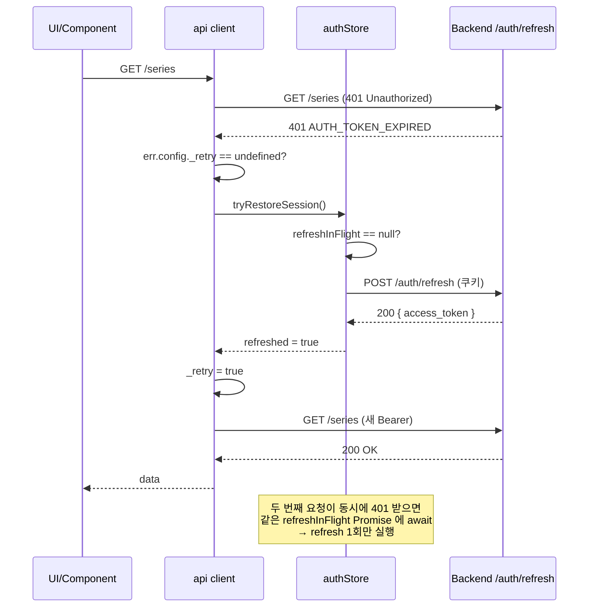

# UI-A1 Frontend Architecture — Router / Pinia / API Client / WebSocket

| 날짜 | 항목 | 내용 |
|------|------|------|
| 2026-04-10 | 신규 작성 | Vue Router 트리, Pinia 5 store 설계, API client wrapper(CCR-019 Idempotency-Key), WS client(CCR-021 seq 검증 + replay), MSW mock 전략, vue-i18n 3 locale, Quasar build 명령 |
| 2026-04-13 | WSOP LIVE 정렬 | Router 경로 변경(Flight 독립 경로 제거→Day 탭), Staff 경로 추가, 신규 컴포넌트 9개 |
| 2026-04-13 | Player 독립 레이어 | Player를 Table 종속→독립 경로로 분리, 5계층→3계층+독립 레이어 |

---

<!--
Edit History:
| 날짜 | 항목 | 내용 |
|------|------|------|
| 2026-04-15 | §3.1a·§4.4~§4.6·§6.7 추가 | Store 초기화 순서 시퀀스 + 401 자동 refresh 상세 시퀀스 + 무한루프 방지 조건 표 + authStore 필드 정의 + WebSocket 개발 환경 (MSW 는 HTTP 만) 대체 전략. team1 발신, 기획 문서 충분성 보강 작업. |
-->

## 0. 이 문서를 읽는 법

이 문서는 **"무엇을"이 아니라 "어떻게"를 말한다.** Team 1 frontend 가 Quasar + Vue 3 + TypeScript 로 실제 구현을 시작할 때 필요한 **아키텍처 결정**을 기록한다.

| 당신이 | 참조할 곳 |
|--------|-----------|
| 새 화면의 URL 을 정하려 한다 | §2 Vue Router 트리 |
| 서버 상태를 어떤 store 에 넣을지 모르겠다 | §3 Pinia stores |
| API 호출을 작성한다 | §4 API Client wrapper |
| WebSocket 이벤트를 구독한다 | §5 WebSocket Client |
| 백엔드 없이 화면만 만들고 싶다 | §6 Mock Server 전략 |
| 영문/스페인어 문자열을 추가한다 | §7 i18n 전략 |
| `pnpm dev` 가 뭐 하는지 모르겠다 | §8 Build/Dev 명령 |

`contracts/` 의 계약 변경이 필요하면 이 문서를 고치지 말고 CCR-DRAFT 경로를 사용한다.

---

## 1. Overview

### 1.1 기술 스택 (확정)

| 영역 | 선정 | 버전 | 근거 |
|------|------|:----:|------|
| Framework | **Quasar Framework** (Vue 3) | `^2.16` | CCR-016 tech-stack-ssot APPLIED. Quasar CLI 로 SPA/SSR/PWA/Electron 전환 자유, 100+ 컴포넌트 내장, TypeScript 1급 |
| Language | **TypeScript** (strict) | `^5.5` | 타입 안정성 + 계약(`contracts/data/*`) 스키마 파싱 |
| State | **Pinia** | `^2.2` | Vue 3 공식 state, Composition API 친화, TS 타입 추론 우수 |
| Router | **vue-router** | `^4.4` | Pinia 와 함께 Vue 3 표준 |
| HTTP | **axios** (`boot/axios.ts`) | `^1.7` | interceptor 로 Idempotency-Key 주입 용이, 취소 토큰 지원 |
| WebSocket | 네이티브 `WebSocket` + 커스텀 래퍼 | — | 외부 라이브러리 최소화, seq 검증 로직 직접 제어 |
| Mock | **MSW 2.x** | `^2.4` | 개발/테스트 양쪽에서 동일 핸들러 재사용 |
| i18n | **vue-i18n** | `^9.14` | Vue 3 Composition API 지원, ko/en/es 3 locale |
| Rive preview | **`@rive-app/canvas`** | `^2.21` | CCR-011 Graphic Editor 허브의 `.gfskin` 프리뷰. DOM canvas 렌더링 |
| Testing | **Vitest** + **@vue/test-utils** + **Playwright** | `^2.1` / `^2.4` / `^1.48` | QA-LOBBY-06 상세 |
| Lint | **ESLint** + **vue-tsc** | — | Quasar CLI 기본 |

### 1.2 소스 트리 (목표)

```
team1-frontend/
├── package.json
├── quasar.config.js          # Quasar 프로젝트 설정 (boot files, framework, build, dev)
├── tsconfig.json
├── index.html
├── .env.development          # VITE_API_BASE_URL, VITE_USE_MOCK=true
├── .env.production           # VITE_API_BASE_URL=https://bo.wsop.../api/v1
├── public/
└── src/
    ├── boot/                 # Quasar boot files (순서대로 실행)
    │   ├── axios.ts          # API client 생성 + interceptor 등록
    │   ├── pinia.ts          # createPinia() 등록
    │   ├── i18n.ts           # vue-i18n 등록
    │   ├── msw.ts            # dev 에서만 MSW worker start
    │   └── router-guards.ts  # beforeEach auth + RBAC
    ├── router/
    │   ├── index.ts          # createRouter
    │   └── routes.ts         # route 정의 (§2)
    ├── stores/               # Pinia stores (§3)
    │   ├── authStore.ts
    │   ├── lobbyStore.ts
    │   ├── settingsStore.ts
    │   ├── geStore.ts
    │   └── wsStore.ts
    ├── api/                  # API client modules (§4)
    │   ├── client.ts         # axios instance
    │   ├── auth.ts
    │   ├── series.ts
    │   ├── events.ts
    │   ├── flights.ts
    │   ├── tables.ts
    │   ├── seats.ts
    │   ├── players.ts
    │   ├── hands.ts
    │   ├── configs.ts
    │   ├── skins.ts
    │   ├── blind-structures.ts
    │   ├── audit-logs.ts
    │   └── reports.ts
    ├── mocks/                # MSW 핸들러 (§6)
    │   ├── browser.ts
    │   ├── handlers.ts
    │   └── data.ts
    ├── types/                # 공유 TS 타입 (DATA-04 정렬)
    │   ├── entities.ts
    │   ├── api.ts
    │   └── ws.ts
    ├── i18n/                 # vue-i18n 사전 (§7)
    │   ├── index.ts
    │   ├── ko.json
    │   ├── en.json
    │   └── es.json
    ├── layouts/
    │   ├── MainLayout.vue    # Quasar q-layout
    │   ├── AppHeader.vue     # Red header bar (WSOP LIVE 정렬)
    │   └── AppSidebar.vue    # Left sidebar navigation
    ├── pages/                # 각 URL 에 대응 (§2)
    │   ├── LoginPage.vue
    │   ├── SeriesListPage.vue
    │   ├── EventListPage.vue
    │   ├── TableListPage.vue
    │   ├── TableDetailPage.vue
    │   ├── PlayerListPage.vue
    │   ├── PlayerDetailPage.vue
    │   ├── HandHistoryPage.vue
    │   ├── settings/
    │   │   ├── SettingsLayout.vue
    │   │   ├── OutputsPage.vue
    │   │   ├── GfxPage.vue
    │   │   ├── DisplayPage.vue
    │   │   ├── RulesPage.vue
    │   │   ├── StatsPage.vue
    │   │   └── PreferencesPage.vue
    │   ├── staff/
    │   │   ├── StaffListPage.vue           # User list (Admin only)
    │   │   └── StaffDetailPage.vue
    │   └── graphic-editor/
    │       ├── GraphicEditorHubPage.vue
    │       └── GraphicEditorDetailPage.vue
    ├── components/
    │   ├── common/           # 공용 컴포넌트 (LoadingState, ErrorBanner, EmptyState)
    │   ├── auth/
    │   │   └── GoogleLoginBtn.vue          # Google OAuth button
    │   ├── event/
    │   │   └── EventFilterBar.vue          # Multi-filter bar + status tabs
    │   ├── table/
    │   │   ├── SeatGrid.vue                # Seat color grid
    │   │   └── DayTabs.vue                 # Day tab switcher
    │   ├── staff/
    │   │   ├── UserFormDialog.vue           # User create/edit dialog
    │   │   └── TableAssignment.vue          # Operator table assignment
    │   ├── lobby/            # Lobby 전용 (TableCard, PlayerRow, FlightAccordion)
    │   └── graphic-editor/   # GE 전용 (RiveCanvasPreview, UploadDropzone, MetadataForm)
    └── utils/
        ├── permissions.ts    # Bit Flag RBAC 헬퍼 (CCR-017)
        ├── date.ts
        └── idempotency.ts    # crypto.randomUUID() 래퍼
```

### 1.3 데이터 흐름 한눈에

```
                 ┌─────────┐
                 │  Pages  │ ← vue-router
                 └────┬────┘
                      │ store 호출 / computed
                      ▼
                 ┌─────────┐
                 │  Stores │ (Pinia: auth/lobby/settings/ge/ws)
                 └────┬────┘
                      │ state mutation / actions
         ┌────────────┼────────────┐
         ▼            ▼            ▼
    ┌────────┐   ┌────────┐   ┌────────┐
    │  api/  │   │mocks/  │   │ WS     │
    │ axios  │──▶│ MSW    │   │ client │
    │        │   │ (dev)  │   │(seq)   │
    └───┬────┘   └────────┘   └───┬────┘
        │                          │
        ▼                          ▼
   HTTP to BO                  ws://host/ws/lobby
   (Team 2, prod)              (Team 2, prod)
```

---

## 2. Vue Router 트리

### 2.1 경로 정의

```typescript
// src/router/routes.ts
export const routes: RouteRecordRaw[] = [
  { path: '/login', name: 'login', component: () => import('pages/LoginPage.vue'), meta: { public: true } },

  {
    path: '/',
    component: () => import('layouts/MainLayout.vue'),
    meta: { requiresAuth: true },
    children: [
      { path: '', redirect: '/series' },

      // 3계층 Lobby 네비게이션 + Player 독립 레이어 (UI-01 §화면 1~3)
      { path: 'series', name: 'series-list', component: () => import('pages/SeriesListPage.vue') },
      { path: 'series/:seriesId/events', name: 'event-list', component: () => import('pages/EventListPage.vue'), props: true },
      { path: 'events/:eventId/tables', name: 'table-list', component: () => import('pages/TableListPage.vue'), props: true }, // Day tab = query param ?day=2
      { path: 'tables/:tableId', name: 'table-detail', component: () => import('pages/TableDetailPage.vue'), props: true },

      // Player 독립 레이어 (Table 종속 아님, 어디서든 접근 가능)
      { path: 'players', name: 'player-list', component: () => import('pages/PlayerListPage.vue') },
      { path: 'players/:playerId', name: 'player-detail', component: () => import('pages/PlayerDetailPage.vue'), props: true },

      { path: 'hand-history/:tableId?', name: 'hand-history', component: () => import('pages/HandHistoryPage.vue'), props: true },

      // Settings 6탭 (UI-03)
      {
        path: 'settings',
        component: () => import('pages/settings/SettingsLayout.vue'),
        meta: { requiredPermission: 'Settings:Read' },
        children: [
          { path: '', redirect: '/settings/outputs' },
          { path: 'outputs', name: 'settings-outputs', component: () => import('pages/settings/OutputsPage.vue') },
          { path: 'gfx', name: 'settings-gfx', component: () => import('pages/settings/GfxPage.vue') },
          { path: 'display', name: 'settings-display', component: () => import('pages/settings/DisplayPage.vue') },
          { path: 'rules', name: 'settings-rules', component: () => import('pages/settings/RulesPage.vue') },
          { path: 'stats', name: 'settings-stats', component: () => import('pages/settings/StatsPage.vue') },
          { path: 'preferences', name: 'settings-preferences', component: () => import('pages/settings/PreferencesPage.vue') },
        ],
      },

      // Graphic Editor 허브 (CCR-011 Team 1 이관)
      {
        path: 'lobby/graphic-editor',
        name: 'ge-hub',
        component: () => import('pages/graphic-editor/GraphicEditorHubPage.vue'),
        meta: { requiredPermission: 'GraphicEditor:Read' },
      },
      {
        path: 'lobby/graphic-editor/:skinId',
        name: 'ge-detail',
        component: () => import('pages/graphic-editor/GraphicEditorDetailPage.vue'),
        props: true,
        meta: { requiredPermission: 'GraphicEditor:Read' },
      },

      // Staff 관리 (Admin only)
      { path: 'staff', name: 'staff-list', component: () => import('pages/staff/StaffListPage.vue'), meta: { requireRole: 'admin' } },
      { path: 'staff/:id', name: 'staff-detail', component: () => import('pages/staff/StaffDetailPage.vue'), props: true, meta: { requireRole: 'admin' } },
    ],
  },

  // 404
  { path: '/:pathMatch(.*)*', name: 'not-found', component: () => import('pages/NotFoundPage.vue'), meta: { public: true } },
];
```

### 2.2 Navigation Guards (boot/router-guards.ts)

```typescript
// boot/router-guards.ts
router.beforeEach(async (to) => {
  const auth = useAuthStore();

  // public route (login, 404)
  if (to.meta.public) return true;

  // requiresAuth 체크
  if (to.meta.requiresAuth && !auth.isAuthenticated) {
    // session restore 시도 (GET /auth/session)
    const restored = await auth.tryRestoreSession();
    if (!restored) {
      return { name: 'login', query: { redirect: to.fullPath } };
    }
  }

  // 역할 체크 (Staff 등 Admin only 경로)
  if (to.meta.requireRole) {
    if (auth.role !== to.meta.requireRole) {
      return { name: 'series-list' };
    }
  }

  // 권한 체크 (CCR-017 Bit Flag)
  if (to.meta.requiredPermission) {
    const [resource, action] = (to.meta.requiredPermission as string).split(':');
    if (!auth.hasPermission(resource, action)) {
      return { name: 'series-list' }; // 권한 없으면 기본 화면으로
    }
  }

  return true;
});
```

**규칙**:
- `meta.public = true` — 로그인 불필요 (login, 404)
- `meta.requiresAuth = true` — 로그인 필수 (layout 단위)
- `meta.requiredPermission = 'Resource:Action'` — 추가 권한 (Settings, GE 등)
- 권한 체크는 **문자열 비교 금지**. `auth.hasPermission()` 은 내부에서 `role.permission & Permission.Write` 비트 연산 (UI-01 §9.5)

---

## 3. Pinia Stores

### 3.1 Store 분할 원칙

| 원칙 | 예 |
|------|------|
| **도메인 경계로 분할** | auth / lobby / settings / ge / ws 5개. API 파일 그룹과 거의 1:1 |
| **서버 캐시는 persist 하지 않는다** | lobby/settings/ge 는 `persist` 미사용. 새로고침 시 재요청 |
| **민감 데이터는 메모리만** | Access Token 은 메모리, Refresh Token 은 HttpOnly Cookie (Team 2 가 세팅) |
| **UI 선호만 localStorage** | `uiStore` 같은 건 만들지 않고, 필요 시 sessionStorage 보조 |
| **WS 상태는 전용 store** | 재연결 상태, seq cursor, 이벤트 버퍼는 `wsStore` 에만 |

### 3.1a Store 초기화 순서 (부팅 시퀀스)

`boot/session-bootstrap.ts` 에서 아래 순서로 초기화한다. 뒤 store 가 앞 store 의 상태(토큰·role)에 의존하므로 순서 변경 금지.

```mermaid
flowchart TD
    Start[App 부팅] --> A[1. authStore.tryRestoreSession]
    A -->|refresh 성공| B[2. wsStore.connect '/ws/lobby']
    A -->|refresh 실패| Login[/login 리다이렉트]
    B -->|connected| C[3. lobbyStore.hydrate from GET /series]
    C --> D[4. settingsStore.hydrate from GET /configs]
    D --> E[5. geStore.hydrateActiveSkin from GET /skins/active]
    E --> Ready[Router next]
```

| 순서 | store | 초기화 내용 | 실패 시 |
|:----:|-------|-------------|---------|
| 1 | `authStore` | cookie → refresh token 검증 → accessToken 발급 | `/login` 리다이렉트, 이후 단계 skip |
| 2 | `wsStore` | `/ws/lobby` 연결 + DEFAULT_SUBSCRIPTIONS 구독 | 배너 표시 후 HTTP 데이터만으로 계속 |
| 3 | `lobbyStore` | `GET /series` (초기 목록만) | 에러 배너 + 빈 목록 렌더 |
| 4 | `settingsStore` | `GET /configs/*` 6카테고리 병렬 | 기본값 폴백 |
| 5 | `geStore` | `GET /skins/active` | Active skin 미상 배너 |

### 3.1b Store 종속성 규칙

| 종속 | 허용 | 금지 |
|------|------|------|
| `lobbyStore` → `authStore` (role 읽기) | ○ | — |
| `settingsStore` → `authStore` (Admin 여부) | ○ | — |
| `wsStore` → `authStore` (JWT 헤더) | ○ | — |
| `lobbyStore` → `wsStore` (이벤트 구독) | — (역방향만 허용) | `wsStore.$onAction` 에서 `lobbyStore` 변경은 `wsStore` 의 이벤트 핸들러에서 직접 |
| `authStore` → 다른 store | — | 금지 (auth 는 가장 안쪽) |
| 순환 의존 | — | 절대 금지 |

### 3.1c 로그아웃 시 역순 정리

```ts
async function logout() {
  geStore.$reset()
  settingsStore.$reset()
  lobbyStore.$reset()
  wsStore.disconnect()
  authStore.clearTokens()
  router.push({ name: 'login' })
}
```

### 3.2 Store 5개 설계

#### 3.2.1 `useAuthStore`

```typescript
// src/stores/authStore.ts
import { defineStore } from 'pinia';
import * as authApi from 'src/api/auth';

interface AuthState {
  user: { id: string; email: string; displayName: string } | null;
  accessToken: string | null;
  role: 'admin' | 'operator' | 'viewer' | null;
  permissions: Record<string, number>; // { 'Series': 7, 'Table': 3, ... } bit flag
  status: 'idle' | 'loading' | 'authenticated' | 'error';
  error: string | null;
}

export const useAuthStore = defineStore('auth', {
  state: (): AuthState => ({
    user: null,
    accessToken: null,
    role: null,
    permissions: {},
    status: 'idle',
    error: null,
  }),

  getters: {
    isAuthenticated: (state) => state.status === 'authenticated' && state.accessToken !== null,
    isAdmin: (state) => state.role === 'admin',
  },

  actions: {
    async login(email: string, password: string, totpCode?: string) {
      this.status = 'loading';
      try {
        const res = await authApi.login(email, password, totpCode);
        this.user = res.user;
        this.accessToken = res.accessToken;
        this.role = res.role;
        this.permissions = res.permissions;
        this.status = 'authenticated';
      } catch (e: any) {
        this.status = 'error';
        this.error = e.message;
        throw e;
      }
    },

    async tryRestoreSession(): Promise<boolean> {
      // Refresh Token(HttpOnly Cookie) 이 있으면 서버가 자동 처리
      try {
        const res = await authApi.getSession();
        if (res) {
          this.$patch({ ...res, status: 'authenticated' });
          return true;
        }
      } catch {
        // 401 정상 — 복원 실패
      }
      return false;
    },

    async logout() {
      await authApi.logout();
      this.$reset();
    },

    hasPermission(resource: string, action: 'Read' | 'Write' | 'Delete'): boolean {
      const perm = this.permissions[resource] ?? 0;
      const mask = { Read: 1, Write: 2, Delete: 4 }[action];
      return (perm & mask) !== 0;
    },
  },
});
```

persist: `user` 만 SessionStorage (새 탭에서도 동일 세션 유지). Access Token 은 persist 하지 않고 refresh 로 복구.

#### 3.2.2 `useLobbyStore`

```typescript
interface LobbyState {
  series: Series[];
  events: Record<string, Event[]>;        // seriesId → events
  flights: Record<string, Flight[]>;      // eventId → flights
  tables: Record<string, Table[]>;        // flightId → tables
  players: Record<string, Player[]>;      // tableId → players

  // WebSocket 이벤트 반영 필드 (§5.4 매트릭스)
  tablesByHand: Record<string, { handNumber: number; dealerSeat: number; lastWinners?: number[] }>;
  liveActions: Record<string, RingBuffer<Action>>;  // TableDetail 전용, MAX 20건
  eventFlightSummary: Record<number, EventFlightSummary>;  // flight_id → 25 필드 요약
  clocks: Record<number, { level: number; remainingSec: number; onBreak: boolean }>;
  clockDetail: Record<number, ClockDetail>;
  blindStructure: Record<number, BlindStructure>;
  prizePool: Record<number, PrizePool>;

  selection: {
    seriesId: string | null;
    eventId: string | null;
    flightId: string | null;
    tableId: string | null;
    playerId: string | null;
  };

  loading: Record<string, boolean>;       // 'series', 'events:{id}', ...
  errors: Record<string, string | null>;
}
```

Actions: `fetchSeries()`, `fetchEvents(seriesId)`, `fetchFlights(eventId)`, `fetchTables(flightId)`, `fetchPlayers(tableId)`, `select({seriesId?, eventId?, ...})`, `rebalance(flightId)` — 마지막은 CCR-020 saga 를 구독. WS 이벤트 핸들러는 §5.4 매트릭스에 따라 해당 필드를 갱신.

persist: 없음. 새로고침 시 현재 route 기반 재요청.

#### 3.2.3 `useSettingsStore`

```typescript
interface SettingsState {
  activeConfig: Record<string, unknown>;  // 현재 실효 중인 설정 (ConfigChanged 반영)
  outputs: OutputsConfig | null;
  graphics: GraphicsConfig | null;         // 구 gfx 필드 (Graphics 탭, 5탭 구조)
  display: DisplayConfig | null;
  rules: RulesConfig | null;
  stats: StatsConfig | null;
  // preferences 는 Lobby/Operations.md 로 이전 (Round 2). 본 store 에서 제거

  // CONFIRM 분류 대기 큐 (Settings/Overview.md §3.5 적용 시점 규칙)
  pendingConfigChanges: Array<{
    key: string;
    value: unknown;
    category: 'Outputs' | 'Graphics' | 'Display' | 'Rules' | 'Stats';
    stagedAt: string;    // ISO
    stagedBy: string;    // user_id
  }>;
  gameState: 'IDLE' | 'RUNNING' | 'UNKNOWN';  // HandStarted/HandEnded 로 갱신
  handNumber: number;                          // HandStarted 에서 갱신
  connectionLost: boolean;                     // WS 단절 배너 트리거

  dirty: Record<keyof SettingsState, boolean>;
  status: 'idle' | 'loading' | 'saving' | 'error';
}
```

Actions: `fetchSection(section)`, `updateField(section, key, value)` (dirty=true), `saveSection(section)` (`PUT /configs/{section}`), `revertSection(section)`, `drainPending()` (HandStarted 수신 시 큐 전체 → activeConfig 적용).

WS 구독: `ConfigChanged` 이벤트 → 해당 섹션만 덮어쓰기. CONFIRM 분류 처리는 `Settings/Overview.md §3.5`. `HandStarted` → `gameState='RUNNING'` + `drainPending()`. `HandEnded` → `gameState='IDLE'`.

#### 3.2.4 `useGeStore`

```typescript
interface GeState {
  skins: Skin[];
  selectedSkinId: string | null;
  metadata: SkinMetadata | null;            // 편집 중 draft
  metadataDirty: boolean;
  uploadProgress: number | null;
  validationErrors: ValidationError[];
  preview: { riveInstance: Rive | null; loading: boolean };
  activationState: 'idle' | 'warning' | 'confirming' | 'activating' | 'activated' | 'error';
}
```

Actions: `fetchSkins()`, `uploadSkin(file)` (ZIP → validate → preview), `editMetadata(field, value)`, `saveMetadata()`, `activateSkin(id)` (`PUT /api/v1/skins/{id}/activate` with `X-Game-State` + `If-Match ETag`).

WS 구독: `skin_updated` (CCR-015) → `skins` 배열 동기화.

#### 3.2.5 `useWsStore`

```typescript
interface WsState {
  connectionState: 'CONNECTED' | 'RECONNECTING' | 'DISCONNECTED' | 'connecting';
  lastSeqByChannel: Record<string, number>;   // 채널별 단조증가 cursor (CCR-021)
  bufferingByChannel: Record<string, unknown[] | null>;  // 재연결 중 수신 버퍼 (MAX 500)
  subscriptions: Set<string>;                 // 구독 중인 이벤트 타입
  reconnectAttempt: number;
  lastError: { code: string; message: string } | null;
}
```

Actions: `connect()`, `disconnect()`, `subscribe({event_types, scope?, table_id?})`, `unsubscribe(...)`, `replay(channel, fromSeq, toSeq)` (`GET /ws/replay?channel=...&from_seq=N&to_seq=M`). 내부적으로 WebSocket 인스턴스 1개 유지. 이벤트 → store 매핑과 구독 대상은 **§5.4 이벤트 구독 매트릭스 참조**.

---

## 4. API Client Wrapper

### 4.1 `src/api/client.ts`

```typescript
import axios, { AxiosInstance, AxiosError } from 'axios';
import { useAuthStore } from 'src/stores/authStore';

export class ApiError extends Error {
  constructor(
    public status: number,
    public code: string,
    message: string,
    public details?: unknown,
  ) {
    super(message);
  }
}

export function createApiClient(): AxiosInstance {
  const client = axios.create({
    baseURL: import.meta.env.VITE_API_BASE_URL || '/api/v1',
    withCredentials: true, // Refresh Token cookie
    timeout: 10_000,
  });

  // Request interceptor: Bearer token + Idempotency-Key (CCR-019)
  client.interceptors.request.use((config) => {
    const auth = useAuthStore();
    if (auth.accessToken) {
      config.headers.Authorization = `Bearer ${auth.accessToken}`;
    }

    // CCR-019: 모든 mutation 에 Idempotency-Key 자동 주입
    const method = (config.method ?? 'get').toLowerCase();
    if (['post', 'put', 'patch', 'delete'].includes(method)) {
      // 호출측에서 명시적으로 지정하면 그걸 사용 (재시도 시 동일 key 필요)
      if (!config.headers['Idempotency-Key']) {
        config.headers['Idempotency-Key'] = crypto.randomUUID();
      }
    }

    return config;
  });

  // Response interceptor: 에러 정규화 + 401 refresh 시도
  client.interceptors.response.use(
    (res) => res,
    async (err: AxiosError<{ error?: { code: string; message: string; details?: unknown } }>) => {
      if (err.response?.status === 401 && !err.config?._retry) {
        // Access Token 만료 → Refresh 시도
        const auth = useAuthStore();
        const refreshed = await auth.tryRestoreSession();
        if (refreshed && err.config) {
          err.config._retry = true;
          return client(err.config);
        }
      }

      const body = err.response?.data?.error;
      throw new ApiError(
        err.response?.status ?? 0,
        body?.code ?? 'UNKNOWN',
        body?.message ?? err.message,
        body?.details,
      );
    },
  );

  return client;
}

export const api = createApiClient();
```

### 4.2 재시도 정책

| 에러 유형 | 자동 재시도 | 백오프 | 수동 재시도 UI |
|----------|:---------:|-------|---------------|
| `NETWORK_ERROR` (연결 실패) | 5회 | 1s → 2s → 4s → 8s → 16s (max 30s) | ErrorAlert + 재시도 버튼 |
| `SERVER_ERROR` 5xx | 3회 | 500ms → 1s → 2s | 동 위 |
| `RATE_LIMITED` 429 | 1회 | 서버 `retry_after_sec` 존중 | 동 위 |
| `AUTH_TOKEN_EXPIRED` 401 | 1회 (refresh 시도) | 즉시 | 없음 (실패 시 logout) |
| 4xx (그 외) | 0회 | — | ErrorAlert + 재시도 |
| WebSocket 단절 | 무제한 | 1s → 2s → 4s (max 10s, 지터 ±20%) | 수동 재연결 |

자동 재시도 중에는 `ErrorAlert` 를 **회색** 으로 (복구 시도 중). 수동 재시도 필요 시점에 **빨강** 으로 전환.

Idempotency-Key 는 재시도 시 **원래 값 재사용** (CCR-019). 재시도 로직은 각 API 모듈에서 `withRetry()` 래퍼로 감싼다:

```typescript
// src/api/series.ts
export const fetchSeries = () => withRetry(() => api.get<Series[]>('/series'));
```

### 4.3 주의 사항

- **Bearer token 은 store 에서만**. localStorage 에 저장 금지.
- **Idempotency-Key 는 재시도 시 동일 값**. 매 요청 새로 발급하면 CCR-019 의미가 없어진다.
- **401 루프 방지**. `_retry` 플래그로 재시도 1회 제한.
- **CORS**: dev 는 Vite proxy (`vite.config.ts` / `quasar.config.js > devServer.proxy`), prod 는 동일 도메인 가정.

### 4.4 401 자동 refresh 시퀀스 (상세)

`client.interceptors.response` 의 401 처리 흐름을 다이어그램으로 고정한다. 무한 루프·동시 refresh 경쟁을 방지하기 위한 규약.



### 4.5 무한 루프 방지 조건

| 조건 | 처리 | 이유 |
|------|------|------|
| 첫 401 + `_retry=undefined` | refresh 시도 → 성공 시 원래 요청 재시도 | 정상 경로 |
| 첫 401 + refresh 실패 | `authStore.logout()` → `/login` 리다이렉트 | 토큰 완전 만료 |
| 재시도 요청에서 또 401 (`_retry=true`) | refresh 재시도 금지 → logout | 루프 방지 |
| 복수 요청 동시 401 | `authStore.refreshInFlight` 단일 Promise 공유 | refresh 1회만 |
| `/auth/refresh` 자체가 401 | 즉시 logout, 재시도 불가 | 리프레시 토큰 만료 |
| `/auth/refresh` 5xx | 지수 백오프 1회만 재시도 후 logout | 서버 일시 장애는 재로그인으로 전환 |

### 4.6 authStore 필수 필드

```ts
interface AuthStoreState {
  accessToken: string | null
  user: UserProfile | null
  role: 'Admin' | 'Operator' | 'Viewer' | null
  refreshInFlight: Promise<boolean> | null   // 동시 refresh 경쟁 방지
  lastRefreshAt: string | null               // ISO 시각, 디버깅용
}
```

```ts
// tryRestoreSession 구현 요약
async tryRestoreSession(): Promise<boolean> {
  if (this.refreshInFlight) return this.refreshInFlight
  this.refreshInFlight = (async () => {
    try {
      const res = await axios.post('/auth/refresh', null, { withCredentials: true })
      this.accessToken = res.data.access_token
      this.lastRefreshAt = new Date().toISOString()
      return true
    } catch {
      this.logout()
      return false
    } finally {
      this.refreshInFlight = null
    }
  })()
  return this.refreshInFlight
}
```

> Shared 측 토큰 TTL/rotation 정책은 `../2.5 Shared/Authentication.md` 가 SSOT. 본 섹션은 그 정책을 구현하는 방법만 다룬다.

### 4.7 공통 UI 상태 (로딩·에러·빈·성공)

모든 화면은 네트워크 요청·WebSocket 구독·사용자 입력 중 **loading / error / empty / success** 4가지 상태 중 하나를 표현한다. 본 섹션은 해당 스펙의 **단일 진실**.

#### 4.7.1 상태 분류

| 상태 | 정의 | 트리거 |
|------|------|--------|
| `idle` | 사용자 입력 대기 | 초기 렌더, 작업 완료 후 복귀 |
| `loading` | 비동기 작업 진행 중 | HTTP 요청, WebSocket 초기 구독 |
| `error` | 실패, 복구 UI 필요 | 4xx/5xx, 타임아웃, WS 단절 |
| `empty` | 요청 성공 + 표시 데이터 0건 | `data.length === 0` |
| `success` (transient) | 작업 완료 피드백 | 저장/삭제/생성 성공 |

`loading` 과 `error` 배타. `loading + error` (재시도 중 이전 에러 유지) 는 허용. `success` 는 3s 자동 dismiss.

#### 4.7.2 컴포넌트 스펙

**Skeleton (구조 로딩)**
| 속성 | 값 |
|------|-----|
| Quasar | `QSkeleton` |
| 개수 | 실제 예상 아이템 수 (리스트 10개 예상 → skeleton 10개) |
| 애니메이션 | `animation="wave"` (pulse 금지) |
| 색 | `bg-grey-3` (light) / `bg-grey-8` (dark) |
| 높이 | 실제 아이템 ±4px |
| 최소 표시 시간 | 200ms (깜빡임 방지) |
| 최대 표시 시간 | 10s → `error` 자동 전환 (`NETWORK_ERROR`) |

**Spinner (포인트 로딩)**
| 속성 | 값 |
|------|-----|
| Quasar | `QSpinner` 또는 `QSpinnerDots` |
| 크기 | 버튼 `size="sm"` (16px) · 카드 `size="md"` (32px) · 페이지 `size="lg"` (48px) |
| 색 | 버튼: `color="white"` · 카드: `color="primary"` |
| 최소 | 없음 (즉시) / 카드·페이지: 300ms |
| 최대 | 30s → `error` 전환 |

버튼 내부 스피너는 좌측 배치 + 버튼 텍스트 유지 + `disable`.

**ErrorAlert (복구 가능한 에러)**
| 표시 위치 | Quasar | Dismiss | 색 |
|-----------|--------|:-------:|-----|
| 폼 필드 하위 | `q-field--error` + hint | 입력 수정 시 | `text-negative` |
| 영역 상단 | `QBanner class="bg-red-1 text-red-10"` | X 버튼 | red-1 |
| 화면 상단 고정 | `QBanner dense class="bg-red-1"` | 재연결/성공 시 자동 | red-1 |
| 단발성 | `Notify.create({type:'negative'})` | 5s | negative 토스트 |

필수 요소: (1) 문구, (2) 재시도 버튼/대안 액션, (3) 기술 상세 접기.

```vue
<q-banner class="bg-red-1 text-red-10" rounded>
  {{ $t('error.network') }}
  <template #action>
    <q-btn flat :label="$t('common.retry')" @click="retry" />
  </template>
</q-banner>
```

**EmptyState (빈 데이터)**
| 속성 | 값 |
|------|-----|
| 일러스트 | `src/assets/empty/{domain}.svg` 120×120px 중앙 |
| 문구 | H6 "아직 없습니다" + caption "첫 {항목}을 만들어보세요" |
| 액션 | Primary 버튼 1개 (Admin 만 표시). 예: "+ 새 Series 생성" |
| Admin 외 | 일러스트 + 문구만, 버튼 숨김 |

**Success Toast**
- `Notify.create({type:'positive', position:'top', message, timeout:3000})`
- 파괴적 작업(삭제) 의 성공은 토스트 대신 전체 페이지 상태 변화로 확인.

#### 4.7.3 비즈니스 상태 × UI 상태 조합

컴포넌트 prop 으로 **비즈니스 도메인 상태** 와 **UI 상태** 를 직교 축으로 받는다.

```ts
interface UIStatefulProps<T> {
  data: T | null
  uiState: 'idle' | 'loading' | 'error' | 'empty'
  error?: { code: string; message?: string } | null
  onRetry?: () => void
}
```

```vue
<template>
  <Skeleton v-if="uiState === 'loading'" />
  <ErrorAlert v-else-if="uiState === 'error'" :error="error" @retry="onRetry" />
  <EmptyState v-else-if="uiState === 'empty'" />
  <ActualContent v-else :data="data" />
</template>
```

**조합 금지**:
- `loading + empty` 금지 — loading 중 empty 판정 불가
- `error + empty` 금지 — error 우선
- `success + error` 금지 — 마지막 결과만 표시

**화면별 대표 조합**: 각 화면 UI 문서(`Lobby/UI.md`, `Lobby/Table.md §6`, `Graphic_Editor/UI.md`, `Settings/Overview.md`) 에서 필요 시 본 섹션 기준으로 작성. 여기서는 규약만 고정.

#### 4.7.4 접근성

| 항목 | 규칙 |
|------|------|
| 스크린 리더 | 상태 전환 시 `aria-live="polite"`. 에러는 `aria-live="assertive"` |
| 키보드 | ErrorAlert 재시도 버튼 `tabindex="0"` + Enter/Space |
| 색 외 신호 | 에러 = 빨강만 금지. 아이콘(warning/error) + 텍스트 동반 |

#### 4.7.5 최소 표시 시간 (깜빡임 방지)

| 컴포넌트 | 최소 |
|----------|:----:|
| Skeleton | 200ms |
| Spinner (버튼) | 없음 |
| Spinner (카드/페이지) | 300ms |
| Success Toast | 3000ms |

서버 응답이 200ms 이내 와도 Skeleton 은 200ms 유지.

---

## 5. WebSocket Client

### 5.1 연결

```typescript
// src/stores/wsStore.ts (부분)
actions: {
  connect() {
    const auth = useAuthStore();
    if (!auth.accessToken) return;

    const url = `${import.meta.env.VITE_WS_BASE_URL}/ws/lobby?token=${auth.accessToken}`;
    this.socket = new WebSocket(url);

    this.socket.onopen = () => {
      this.status = 'connected';
      this.reconnectAttempts = 0;
      // 재연결 후 누락 이벤트 replay
      if (this.lastSeq > 0) {
        this.replay(this.lastSeq + 1);
      }
    };

    this.socket.onmessage = (ev) => this.handleMessage(ev.data);
    this.socket.onclose = () => this.scheduleReconnect();
    this.socket.onerror = (e) => console.error('[ws] error', e);
  },

  handleMessage(data: string) {
    const msg: WsEvent = JSON.parse(data);

    // CCR-021: seq 단조증가 검증
    if (msg.seq <= this.lastSeq) {
      console.warn(`[ws] out-of-order: got ${msg.seq}, have ${this.lastSeq}`);
      return; // 중복 무시
    }
    if (msg.seq > this.lastSeq + 1) {
      // gap 감지 → replay 요청
      console.warn(`[ws] gap: expected ${this.lastSeq + 1}, got ${msg.seq}`);
      this.replay(this.lastSeq + 1);
      return;
    }

    this.lastSeq = msg.seq;
    this.dispatch(msg);
  },

  dispatch(msg: WsEvent) {
    switch (msg.type) {
      case 'ConfigChanged':
        useSettingsStore().applyRemoteChange(msg.payload);
        break;
      case 'skin_updated':
        useGeStore().applyRemoteSkinUpdate(msg.payload);
        break;
      case 'table_status_changed':
      case 'player_moved':
        useLobbyStore().applyRemoteChange(msg);
        break;
      // ...
    }
  },

  async replay(fromSeq: number) {
    const events: WsEvent[] = await api.get('/ws/replay', { params: { from_seq: fromSeq } }).then(r => r.data);
    for (const ev of events) {
      this.lastSeq = Math.max(this.lastSeq, ev.seq);
      this.dispatch(ev);
    }
  },

  scheduleReconnect() {
    if (this.reconnectAttempts >= 10) {
      this.status = 'disconnected';
      Notify.create({ type: 'negative', message: '실시간 연결이 끊겼습니다. 페이지를 새로고침하세요.' });
      return;
    }
    this.status = 'reconnecting';
    this.reconnectAttempts++;
    this.reconnectDelay = Math.min(1000 * 2 ** (this.reconnectAttempts - 1), 30_000);
    setTimeout(() => this.connect(), this.reconnectDelay);
  },
}
```

### 5.2 seq 정책 요약 (CCR-021)

| 상황 | 동작 |
|------|------|
| `msg.seq === lastSeq + 1` | 정상. dispatch + `lastSeq++` |
| `msg.seq <= lastSeq` | 중복. 무시 |
| `msg.seq > lastSeq + 1` | gap. `replay(lastSeq+1)` 호출 후 dispatch 재개 |
| 재연결 성공 | 연결 직후 `replay(lastSeq+1)` 자동 호출 |
| `lastSeq === 0` | 첫 연결. replay 하지 않고 수신 이벤트부터 시작 |

### 5.3 재연결 정책

| 시도 | 지연 | 한도 |
|:----:|-----|-----|
| 1 | 1s | — |
| 2 | 2s | — |
| 3 | 4s | — |
| 4 | 8s | — |
| 5+ | 10s | 무제한 반복 |

지터: 각 지연값에 ±20% 랜덤 가산. 사용자 수동 재연결 클릭 시 카운터 리셋. `accessToken` 이 없으면 연결 시도 안 함 (logout 후).

**재연결 중 수신 메시지 버퍼링**:
| 상태 | 처리 | 한계 |
|------|------|------|
| `CONNECTED` | 즉시 `processEvent` | — |
| `RECONNECTING` | 큐에 append. replay 완료 후 drain. seq 검증으로 중복 자동 무시 | MAX 500건 |
| `DISCONNECTED` (5회+ 실패) | 사용자 액션 대기. 큐 MAX 500 유지, 초과 시 오래된 것부터 폐기 | — |

**타임아웃**:
| 대상 | 값 | 실패 시 |
|------|-----|---------|
| 초기 연결 | 10s | 백오프 진입 |
| 핸드셰이크 + 인증 | 5s | 재시도 |
| heartbeat interval | 30s | 클라이언트 → 서버 ping |
| heartbeat miss | 2회 연속 | 단절 판정 → 재연결 |
| replay HTTP | 15s | 1회 재시도 후 실패 시 페이지 전체 refresh |

### 5.4 이벤트 구독 매트릭스 (Lobby 클라이언트 관점)

Backend `../2.2 Backend/APIs/WebSocket_Events.md` 의 이벤트 카탈로그를 **Lobby Frontend 관점** 에서 뒤집어 "어느 이벤트를 어느 store 에 저장하고 어느 UI 가 재렌더링되는가" 로 정리. `wsStore`/`lobbyStore`/`settingsStore`/`geStore` 설계의 SSOT.

**엔드포인트별 구독자**:
| 엔드포인트 | 구독자 | 목적 |
|-----------|--------|------|
| `ws://host/ws/lobby` | Lobby (Quasar) | 모니터링. 읽기 전용 |
| `ws://host/ws/cc` | Command Center (Flutter, team4) | 게임 조작 + 이벤트 송수신 |
| `ws://host/ws/overlay` | Overlay (team3 Dart) | 실시간 그래픽 렌더링 |

팀1(Lobby) 은 `/ws/lobby` **만** 구독. `/ws/cc`, `/ws/overlay` 구독 금지.

**이벤트 → Store → UI (Lobby 기준)**:
| 이벤트 | 구독 | 저장 store · 필드 | 트리거 UI |
|--------|:---:|------------------|----------|
| `HandStarted` | ● | `lobbyStore.tablesByHand[table_id]` | TableCard "HAND #NN" 배지 |
| `HandEnded` | ● | 동 위 + `lastWinners` | TableCard 배지 초기화 |
| `ActionPerformed` | ○ | `lobbyStore.liveActions[table_id]` ring MAX 20 | TableDetail 만 렌더. 리스트 뷰 무시 |
| `OperatorConnected` | ● | `lobbyStore.tables[id].operator` | 프로필 아이콘 on |
| `OperatorDisconnected` | ● | 동 위 null | 아이콘 off + "Operator 단절" 배너 |
| `event_flight_summary` | ● | `lobbyStore.eventFlightSummary[flight_id]` | Lobby 대시보드 카드 (30s 주기) |
| `clock_tick` | ● | `lobbyStore.clocks[flight_id]` (throttle 500ms) | Flight 헤더 블라인드 타이머 |
| `clock_level_changed` | ● | 동 위 + `levelIndex`, `onBreak` | 레벨 배지 + 토스트 |
| `clock_detail_changed` | ● | `lobbyStore.clockDetail[flight_id]` | 대시보드 테마/공지/이벤트명 |
| `clock_reload_requested` | ● | 즉시 처리 (상태 저장 X) | 대시보드 강제 페이지 리로드 |
| `tournament_status_changed` | ● | `lobbyStore.eventFlightSummary[flight_id].status` | Flight 상태 배지 + 잠금 규칙 |
| `blind_structure_changed` | ● | `lobbyStore.blindStructure[flight_id]` | 편집 화면 열려있으면 dirty 경고 |
| `prize_pool_changed` | ● | `lobbyStore.prizePool[flight_id]` | 상금 풀 카드 + highlight |
| `stack_adjusted` | ● | `lobbyStore.eventFlightSummary[flight_id].avg_stack` | avg_stack 카드 + 토스트 |
| `ConfigChanged` | ● | `settingsStore.activeConfig[key]` (CONFIRM 큐 drain 규칙은 `Settings/Overview.md §3.5`) | Settings 열려있으면 필드 동기화 + 배너 |
| `skin_updated` | ● | `geStore.activeSkin` | GE 리스트 active 배지 이동 + 토스트 |
| (모든 에러 이벤트) | ● | `wsStore.lastError` | ErrorAlert 배너 (§4.7.2) |

**구독 아이콘**: ● = 항상 구독, ○ = 특정 화면 진입 시만

**CC/Overlay 전용 이벤트**(RFID, HandLocal, render tick 등) 는 Lobby 구독 **금지**.

**구독 필터링** (초기 연결 시):
```ts
const DEFAULT_SUBSCRIPTIONS = [
  'HandStarted', 'HandEnded',
  'OperatorConnected', 'OperatorDisconnected',
  'event_flight_summary', 'clock_tick', 'clock_level_changed',
  'clock_detail_changed', 'clock_reload_requested',
  'tournament_status_changed', 'blind_structure_changed',
  'prize_pool_changed', 'stack_adjusted',
  'ConfigChanged', 'skin_updated',
] as const

wsStore.subscribe({ event_types: DEFAULT_SUBSCRIPTIONS })

// TableDetail 진입 시 추가 구독
wsStore.subscribe({
  scope: 'table',
  table_id: route.params.id,
  event_types: ['ActionPerformed'],
})
// 떠날 때 unsubscribe
```

**Replay 트리거** (gap 감지 시):
```ts
async function onGapDetected(channel: string, fromSeq: number, toSeq: number) {
  wsStore.bufferingByChannel[channel] = []
  const events = await api.get('/ws/replay', { params: { channel, from_seq: fromSeq, to_seq: toSeq } })
  for (const e of events) processEvent(e)
  for (const e of wsStore.bufferingByChannel[channel]) processEvent(e)
  wsStore.bufferingByChannel[channel] = null
}
```

**Replay 실패 처리**:
| 상황 | 처리 |
|------|------|
| 5xx/timeout | 1회 재시도(2s). 실패 시 `lobbyStore.$reset()` + 페이지 전체 refresh |
| 410 Gone (seq 너무 오래됨) | 페이지 전체 refresh |
| 401/403 | `authStore.tryRestoreSession()` → 성공 시 재시도, 실패 시 `/login` |
| `has_more=true` 10페이지 초과 | 페이지 전체 refresh (데이터량 과다) |

**글로벌(flight 단위) 이벤트 replay**: `GET /tables/:id/events` 는 테이블 단위. `event_flight_summary`/`clock_*` 등 flight 단위 이벤트의 replay 엔드포인트는 Phase 2 에 `/flights/:id/events?since=N` 예정. 현재는 `GET /series` + `GET /flights/:id/summary` 로 전체 재조회로 대체. `ConfigChanged` 는 `GET /configs/*` 로 현재값만 재조회.

**UI 반영**:
- `wsStore.connectionState` (`CONNECTED`/`RECONNECTING`/`DISCONNECTED`) 기반 전역 배너
- `CONNECTED` → 배너 없음
- `RECONNECTING` → 회색 배너 "연결 복구 중... ({시도회차})"
- `DISCONNECTED` → 빨강 배너 "연결이 끊어졌습니다" + 수동 재연결 버튼
- 배너 컴포넌트는 `§4.7 ErrorAlert` 규약 사용

---

## 6. Mock Server 전략

### 6.1 배경

Team 2 FastAPI backend 가 아직 구현되지 않은 상태에서 Team 1 이 병렬 개발하려면 **브라우저에서 직접 API 를 가로채는 mock** 이 필요하다. MSW (Mock Service Worker) 를 채택한다.

### 6.2 활성화 조건

```bash
# .env.development
VITE_USE_MOCK=true
VITE_API_BASE_URL=/api/v1
VITE_WS_BASE_URL=ws://localhost:9080
```

```typescript
// src/boot/msw.ts
import { boot } from 'quasar/wrappers';

export default boot(async () => {
  if (import.meta.env.VITE_USE_MOCK !== 'true') return;
  if (import.meta.env.PROD) return;

  const { worker } = await import('src/mocks/browser');
  await worker.start({
    onUnhandledRequest: 'bypass',
    serviceWorker: { url: '/mockServiceWorker.js' },
  });
  console.info('[MSW] worker started');
});
```

### 6.3 Handler 구조

```typescript
// src/mocks/handlers.ts
import { http, HttpResponse } from 'msw';
import * as db from './data';

export const handlers = [
  // Auth
  http.post('/api/v1/auth/login', async ({ request }) => {
    const body = await request.json() as { email: string; password: string };
    const user = db.users.find(u => u.email === body.email);
    if (!user) return HttpResponse.json({ error: { code: 'INVALID_CREDENTIALS', message: '...' } }, { status: 401 });
    return HttpResponse.json({
      user: { id: user.id, email: user.email, displayName: user.displayName },
      accessToken: 'mock-jwt-' + user.id,
      role: user.role,
      permissions: user.permissions,
    });
  }),

  // Series
  http.get('/api/v1/series', () => HttpResponse.json(db.series)),
  http.get('/api/v1/series/:id/events', ({ params }) =>
    HttpResponse.json(db.events.filter(e => e.seriesId === params.id)),
  ),

  // Tables (CCR-020 saga 시나리오 포함)
  http.post('/api/v1/tables/rebalance', async ({ request }) => {
    const body = await request.json() as { flightId: string };
    return HttpResponse.json({
      sagaId: crypto.randomUUID(),
      status: 'in_progress',
      totalSteps: 8,
      completedSteps: 0,
    });
  }),

  // ... (19개 API 모듈별로)
];
```

### 6.4 Seed Data

`src/mocks/data.ts` 는 DATA-04 엔티티 구조를 따르는 TS 상수. Playground 에서 사용할 최소 데이터:
- Series 2개 (WSOP Main, WSOPC Cyprus)
- Events 5개
- Flights 10개
- Tables 20개
- Players 100명
- Skins 3개 (default, custom-bracelet, playground)

### 6.5 Test 모드

Vitest 는 브라우저 없이 Node 에서 실행하므로 MSW 는 **server 모드**로 돌린다:

```typescript
// src/mocks/server.ts (test only)
import { setupServer } from 'msw/node';
import { handlers } from './handlers';
export const server = setupServer(...handlers);
```

`vitest.setup.ts`:
```typescript
import { server } from 'src/mocks/server';
beforeAll(() => server.listen());
afterEach(() => server.resetHandlers());
afterAll(() => server.close());
```

### 6.6 Real backend 전환

```bash
# .env.development (backend 준비 후)
VITE_USE_MOCK=false
VITE_API_BASE_URL=http://localhost:8000/api/v1
VITE_WS_BASE_URL=ws://localhost:8000
```

`VITE_USE_MOCK=false` 로 바꾸고 `pnpm dev` 재시작하면 MSW 는 로드되지 않는다. 코드 변경 0.

### 6.7 WebSocket 개발 환경 (MSW 는 HTTP 만)

MSW 는 HTTP 요청만 intercept 한다. WebSocket 은 지원하지 않으므로 WS 이벤트 기반 화면(Lobby 대시보드 실시간 타이머, Settings 대기 큐, GE `skin_updated` 등)의 로컬 개발은 별도 전략이 필요하다.

**전략 매트릭스**:

| 상황 | 방법 | 파일 |
|------|------|------|
| Unit/컴포넌트 테스트 | `wsStore` 를 vitest 에서 stub — `vi.spyOn(wsStore, 'subscribe')` 로 직접 이벤트 주입 | `test/**/*.test.ts` |
| E2E 테스트 (Playwright) | `playwright-ws-mock` 또는 자체 `ws` 서버 (`tools/dev-ws-mock.ts`) 구동 후 시나리오 이벤트 전송 | `e2e/fixtures/ws-server.ts` |
| 로컬 개발 중 실시간 시뮬레이션 | 경량 Node WS 서버 `pnpm dev:ws-mock` 를 별도 터미널에서 구동 (포트 9080). `.env.development` 의 `VITE_WS_BASE_URL=ws://localhost:9080` | `tools/dev-ws-mock.ts` |
| Backend 가 일부 연결된 상태 (HTTP only) | `VITE_USE_MOCK=true` + `VITE_WS_BASE_URL=` 빈 값 → `wsStore.connect()` 스킵 조건 감지 → 배너 "WebSocket 개발 모드 비활성" 후 화면은 HTTP 응답만으로 동작 | — |

**`tools/dev-ws-mock.ts` 최소 구현**:

```ts
import { WebSocketServer } from 'ws'
const wss = new WebSocketServer({ port: 9080 })
let seq = 0
wss.on('connection', (ws) => {
  ws.send(JSON.stringify({ type: 'connected', seq: ++seq, server_time: new Date().toISOString() }))
  // 1초마다 clock_tick 보내기
  const tick = setInterval(() => {
    ws.send(JSON.stringify({ type: 'clock_tick', seq: ++seq, payload: { level: 8, remaining: 720 } }))
  }, 1000)
  ws.on('close', () => clearInterval(tick))
})
```

시나리오 이벤트(HandStarted, ConfigChanged 등) 주입은 CLI 파라미터 또는 로컬 HTTP admin 엔드포인트로 추가. 이 도구는 "실제 Backend 없이 화면 렌더를 보기" 만을 목적으로 하며, 계약 검증은 `integration-tests/` 로 한다.

> 구현 가이드의 이벤트 명단은 `§5.4 이벤트 구독 매트릭스` 를 그대로 따른다. 이 외 이벤트를 dev-ws-mock 이 발행하면 안 된다 (실제 Backend 와 drift 방지).

---

## 7. i18n 전략

### 7.1 Locale

| Locale | 용도 | Fallback |
|--------|------|:--------:|
| `ko` | 기본 (한국 운영팀) | — |
| `en` | Vegas WSOP 운영 | `ko` |
| `es` | Vegas 스페인어 운영 | `en` |

### 7.2 파일 구조

```
src/i18n/
├── index.ts       # createI18n() + locale detection
├── ko.json
├── en.json
└── es.json
```

`ko.json` 예시:
```json
{
  "common": {
    "save": "저장",
    "cancel": "취소",
    "loading": "불러오는 중...",
    "error": "오류가 발생했습니다"
  },
  "lobby": {
    "series": {
      "title": "시리즈 목록",
      "empty": "등록된 시리즈가 없습니다"
    },
    "table": {
      "status": {
        "empty": "빈 테이블",
        "setup": "설정 중",
        "live": "진행 중",
        "paused": "일시정지",
        "closed": "종료"
      }
    }
  },
  "graphicEditor": {
    "upload": {
      "dropzone": ".gfskin 파일을 여기에 끌어놓거나 클릭하여 선택",
      "validating": "ZIP 구조 검증 중...",
      "preview": "프리뷰 로드 중..."
    }
  }
}
```

### 7.3 컴포넌트 사용

```vue
<template>
  <q-btn :label="$t('common.save')" color="primary" @click="save" />
</template>

<script setup lang="ts">
import { useI18n } from 'vue-i18n';
const { t, locale } = useI18n();
</script>
```

### 7.4 Locale 전환

- 초기값: `navigator.language` 에서 추출. 지원 목록에 없으면 `ko`
- 사용자 수동 전환: Settings > Preferences 탭의 "Language" 드롭다운
- persist: `localStorage.lobby.locale`

### 7.5 번역 workflow

- 개발자는 `ko.json` 에만 key 추가. `en`/`es` 는 추후 번역가 담당
- 누락 key 는 개발 환경에서 콘솔 경고 + `ko` fallback
- **절대 문자열 하드코딩 금지**. 새 UI 추가 시 즉시 i18n key 도 같이 추가

### 7.6 복수형·성별 규칙

vue-i18n 9 의 `@linked` 와 `{n, plural, ...}` 구문을 사용.

| locale | 복수형 규칙 |
|--------|----------|
| `ko` | 단·복수 구분 없음. `"{n}명의 플레이어"` 하나로 충분 |
| `en` | `one / other` 2형. `"{n, plural, one {# player} other {# players}}"` |
| `es` | `one / other` 2형 (영어 동일). `"{n, plural, one {# jugador} other {# jugadores}}"` |

예시 i18n key:
```json
{
  "lobby.players_count": {
    "ko": "{n}명의 플레이어",
    "en": "{n, plural, one {# player} other {# players}}",
    "es": "{n, plural, one {# jugador} other {# jugadores}}"
  }
}
```

성별이 필요한 경우(스페인어 형용사 일치 등) 는 `@linked` 로 별도 key 사용. 대화 메시지는 중성적 어휘 우선.

### 7.7 접근성 (i18n 연계)

| 항목 | 규칙 |
|------|------|
| `aria-label` | i18n key 사용 필수 (하드코딩 금지) |
| `aria-live` | 상태 전환 시 `polite`, 에러 시 `assertive` (§4.7.4 참조) |
| `aria-busy` | `uiState === 'loading'` 시 해당 영역에 설정 |
| 키보드 포커스 순서 | `tabindex` 는 논리 순서만, 기본 `0` 또는 `-1` 만 사용 |
| 색 외 신호 | §4.7.4 — 색 단독 금지, 아이콘/텍스트 동반 |

---

## 8. Build / Dev 명령

### 8.1 개발

```bash
cd team1-frontend
pnpm install           # 첫 설치
pnpm dev               # Quasar dev server, localhost:9000 (또는 9080)
```

환경변수는 `.env.development` 참조 (MSW 활성화 기본).

### 8.2 빌드

```bash
pnpm build             # quasar build (SPA), 출력 → dist/spa/
pnpm build:ssr         # (옵션) SSR 모드
```

### 8.3 테스트

```bash
pnpm test              # Vitest unit + component
pnpm test:watch
pnpm e2e               # Playwright E2E
pnpm e2e:ui            # Playwright UI 모드
```

QA-LOBBY-06 참조.

### 8.4 린트 / 타입 체크

```bash
pnpm lint              # eslint
pnpm typecheck         # vue-tsc --noEmit
```

커밋 전에 `pnpm lint && pnpm typecheck && pnpm test` 통과 필수.

---

## 9. 관련 CCR

본 문서의 아키텍처 결정이 참조하는 APPLIED CCR:

| CCR | 관련 섹션 | 반영 내용 |
|-----|-----------|----------|
| **CCR-011** ge-ownership-move | §1.1, §2.1, §3.2.4 | Graphic Editor 허브 라우팅 + `useGeStore` + rive-js 프리뷰 |
| **CCR-012** gfskin-format-unify | §3.2.4, §6 seed | `.gfskin` ZIP 구조 mock data |
| **CCR-013** ge-api-spec (API-07) | §4, `src/api/skins.ts` | GE 엔드포인트 정의 |
| **CCR-015** skin-updated-ws | §5.1 dispatch | WS `skin_updated` → `useGeStore` 동기화 |
| **CCR-016** tech-stack-ssot | §1.1 | Quasar (Vue 3) + TS 확정 근거 (BS-00-definitions) |
| **CCR-017** wsop-parity | §2.2 guards, §3.2.1 permissions, §5 dispatch | Bit Flag RBAC, dayIndex, isPause, BlindDetailType enum |
| **CCR-019** idempotency-key | §4.1 interceptor | 모든 mutation 자동 헤더 주입 |
| **CCR-020** table-rebalance-saga | §3.2.2 rebalance, §6.3 handler | saga 응답 구조 + UI 진행 표시 연동 |
| **CCR-021** ws-event-seq | §5.1 seq validation | 단조증가 검증 + replay 엔드포인트 |
| **CCR-025** bs03-graphic-settings-tab | §3.2.3 gfx config | Settings GFX 탭의 시각 asset 메타 필드 |

---

## 10. Non-Goals

이 문서는 다음을 **다루지 않는다**:

- **서버 측 구현** (Team 2): FastAPI 엔드포인트, DB 스키마, 인증 로직 — `team2-backend/` 소유
- **CC/Overlay/Engine** (Team 4, Team 3): Flutter 앱, Rive 렌더링, 게임 엔진 — 각 팀 소유
- **Figma/Sketch 디자인 파일**: UI-00 및 `reference/` 참조. 본 문서는 구현 아키텍처만
- **배포 파이프라인 (CI/CD)**: 별도 DevOps 작업. `team1-frontend/README.md` 에 docker/vercel 가이드
- **End-user 매뉴얼**: 운영팀 교육 자료는 별도 문서
