# EBS Skin Editor — UI Design PRD v3

> PokerGFX 내재화를 통한 EBS 자체 Skin Editor UI 설계 통합 문서.

## 스냅샷 목차 (총 1,619줄)

| Part | 섹션 | 라인 |
|------|------|-----:|
| **I 개념** | 1~4 개요/스킨/세도구/여정 | L7~121 |
| **II SE 메인** | 8장 | L122~269 |
| **III Graphic Editor** | 9 아키텍처 · 10 GE 8종 모드 | L270~1030 |
| **IV 구현 참조** | 11~16 결정/Quasar/데이터/레이아웃/검증/로드맵 | L1031~1244 |
| **부록** | A Console-Skin SSOT · B GAP · C ConfigurationPreset · D~G | L1245~1488 |
| **V 디자인 시스템** | 5~7 원칙/시스템/계층 | L1489~ |

> 관계: `prd-skin-editor.prd.md`가 Impact-Map 중심 최신판. 이 문서는 내재화 전략 + 구현 참조.

---

# Part I — 개념

## 1장. 개요

PokerGFX는 북미 포커 방송의 사실상 표준 소프트웨어다. Skin Editor, Graphic Editor, Console 세 도구로 구성되며, 대부분의 메이저 대회가 이 도구로 방송 화면을 만든다.

EBS Skin Editor는 PokerGFX의 기능을 우리 것으로 만드는 프로젝트다. 먼저 똑같이 만들고, 그 다음 우리 방식에 맞게 바꾼다.

### 내재화 전략

| 단계 | 목표 | 설명 |
|------|------|------|
| **1단계: 복제** | 기능 동등성 확인 | PokerGFX SE의 기능을 어디까지 동일하게 구현할 수 있는지 검증 |
| **2단계: 적용** | 우리 톤앤매너 | 복제 완료 후, WSOP 브랜드와 운영 방식에 맞게 커스터마이징 |
| **3단계: 확장** | 자체 기능 추가 | PokerGFX에 없는 WSOPLIVE 통합, AI 분석 등 차별화 기능 |

### Persona

| Persona | 역할 | 주요 관심사 |
|---------|------|------------|
| 방송 디자이너 | 스킨 색상, 폰트, 이미지 조합 | "이 대회 브랜드에 맞는 화면" |
| 방송 감독 | 디자인 확인, 최종 승인 | "방송 화면이 의도대로인가" |
| 기술 운영자 | Console에 스킨 로드, 문제 해결 | "파일 포맷이 호환되는가" |

### 사용 타이밍

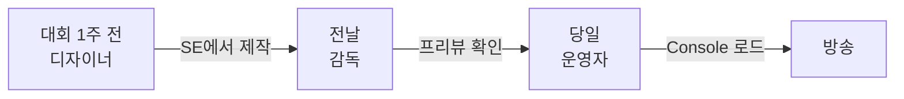

## 2장. 스킨

스킨은 포커 방송 화면의 **모든 시각적 설정 묶음**이다 — 위치, 글씨, 그림, 움직임, 색감 5가지를 제어한다. Console은 게임 규칙, 카메라, 실시간 데이터 등 런타임을 담당한다.

### 스킨이 제어하는 5가지

| # | 영역 | 예시 |
|:-:|------|------|
| 1 | 위치 | 카드 5장의 x, y 좌표 |
| 2 | 글씨 | 폰트, 크기, 색상, 그림자 |
| 3 | 그림 | Board 배경 이미지, 로고 |
| 4 | 움직임 | Fade, Slide, Pop, Expand |
| 5 | 색감 | Hue, Tint, Color Replace |

### .gfskin 파일 구조

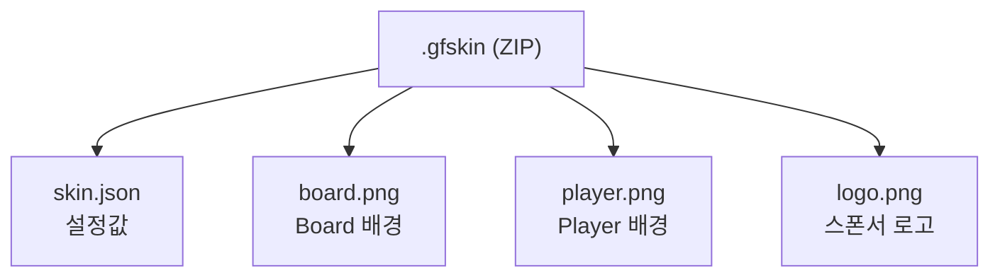

## 3장. 세 도구의 관계

포커 방송 제작에는 세 도구가 쓰인다. Console은 생방송 중 조종석이고, SE는 방송 전 디자인을 준비하는 작업실이고, GE는 요소 하나하나를 픽셀 단위로 다듬는 작업대다. 하나의 설정은 반드시 한 곳에서만 편집한다.

### Console ↔ SE ↔ GE

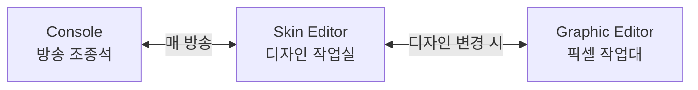

### SSOT 매핑

| 설정 영역 | SSOT (주인) | 다른 곳에서는 |
|----------|:-----------:|-------------|
| 색상, 폰트, 배치 | **Skin** | Console이 로드만 |
| Blind 구조, 칩 표시 | **Console** | SE에 없음 |
| 통계 ON/OFF | **Console** | SE에 없음 |
| Transition 효과 | **Skin** | Console이 런타임 override |

### 사용 빈도

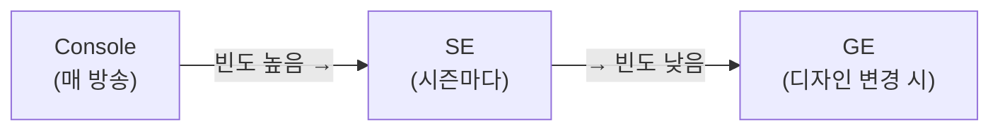

### 작업 시퀀스

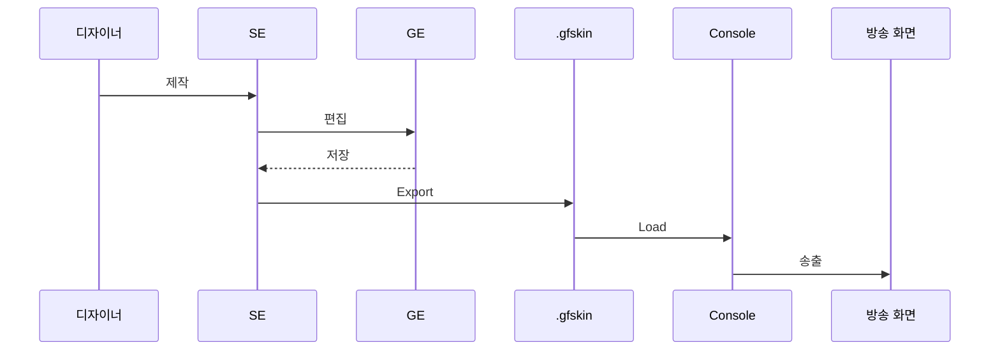

## 4장. 사용자 여정

디자이너가 스킨을 다루는 방법은 크게 세 가지다.

| 시나리오 | 시작점 | 경로 | 소요 |
|---------|-------|------|------|
| **신규 생성** | 빈 스킨 | SE → GE(8종) → Export | 2~4시간 |
| **기존 수정** | .gfskin Import | SE → 색상/폰트 변경 → Export | 30분 |
| **빠른 시작** | 기본 스킨 복제 | SE → 로고만 교체 → Export | 10분 |

---

# Part II — SE 메인 화면

## 8장. SE 메인 화면

### 화면 이미지

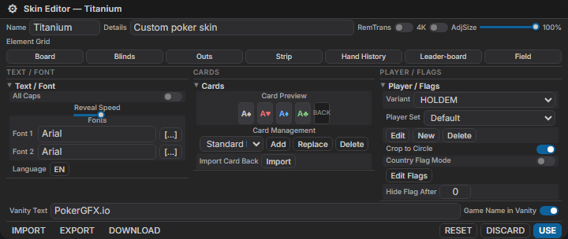
*Skin Editor QDialog — 3열 레이아웃. [HTML 원본](mockups/ebs-skin-editor.html)*

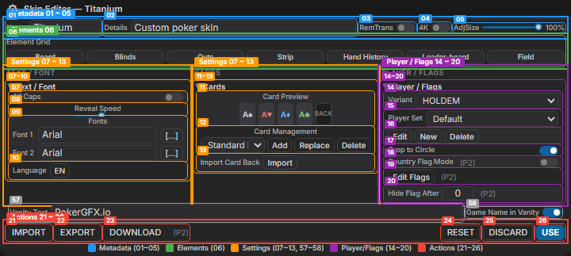
*■ Metadata(01~05) ■ Elements(06, 27~30) ■ Settings(07~26) ■ Actions(21~26)*

### 전체 구조 (QDialog)

PokerGFX Skin Editor는 897×468 모달 윈도우. EBS에서는 `QDialog`(persistent, maximizable)로 구현하여 responsive 레이아웃을 지원한다.

v1의 Grid 160px 고정 3열 구조를 **QSplitter 중첩 3열**로 재설계한다. 근본 원인: Grid에 `align-items: stretch` 없음 → 열 높이 최대 600px 편차, 좌측 160px 협소(업계 평균 220-280px), 우측 Behaviour 전부 접힘 → 빈 공간 극대화.

**CSS 핵심**: `display: flex; align-items: stretch; gap: 16px` — 좌측 `240px` 고정, 중앙 `flex: 1.2`, 우측 `flex: 1`. Colour 섹션이 `flex-grow: 1`로 남는 높이 흡수.

#### 열 치수 테이블

| 영역 | CSS | 값 | QSplitter limits | 비고 |
|------|-----|----|:----------------:|------|
| 좌측 열 | `width` | 240px | [15%, 35%] | `flex-shrink: 0`, 고정 |
| 중앙 열 | `flex` | 1.2 | [40%, 70%] (내부) | 좌/우 대비 20% 넓음 |
| 우측 열 | `flex` | 1 | [40%, 70%] (내부) | 기준 열 |
| 열 간격 | `gap` | 16px | — | 8px 그리드 단위 (`q-gutter-md`) |
| 컨트롤 내부 | `padding` | 4px | — | 최소 내부 여백 (`q-pa-xs`) |

#### 4-Zone 구역 테이블

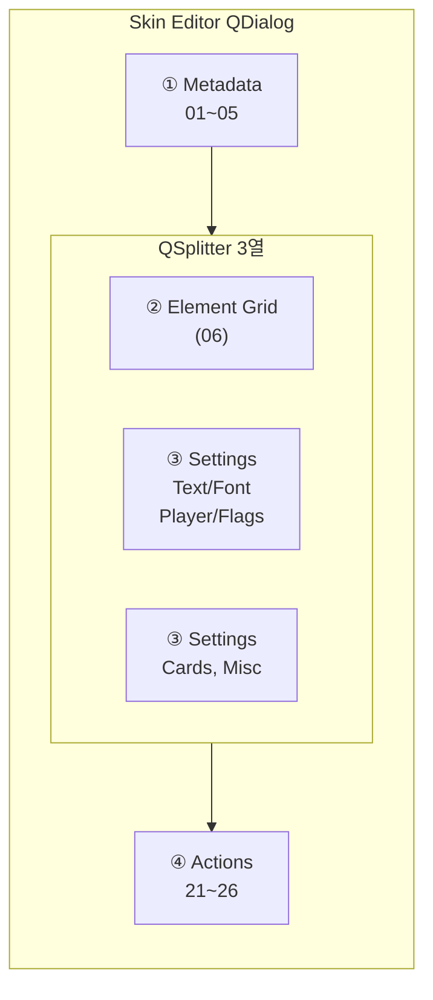

| 구역 | 위치 | Element ID | Tier |
|:----:|------|:----------:|:----:|
| ① Skin Metadata | 최상단 | 01 ~ 05 | — |
| ② Element Grid + Adjustments | 좌측 중앙 | 06 | T1/T2/T3 |
| ③ Settings | 중앙+우측 | 07~13, 15~19, 72 | T1/T2/T3 |
| ④ Action Bar | 최하단 | 21 ~ 26 | — |

### 8.1 Skin Metadata (01 ~ 05)

스킨 식별 정보 + 글로벌 옵션. 5개 컨트롤.

| Element ID | 이름 | Quasar 컴포넌트 | 설명 | → 오버레이 영향 |
|:----------:|------|-----------------|------|:---:|
| **01** | Name (= Theme Name) | `QInput` | 스킨 이름 (예: "Titanium"). Whitepaper의 "Theme name"과 동일 필드 | 없음 (메타데이터) |
| **02** | Details | `QInput[type=textarea]` | 스킨 설명 | 없음 (메타데이터) |
| **03** | Remove Transparency | `QToggle` | 크로마키 모드 반투명 픽셀 제거 | 전체 (#1~#10) |
| **04** | 4K Design | `QToggle` | Graphic Editor 좌표계 1920×1080 ↔ 3840×2160 전환 | 전체 (#1~#10) |
| **05** | Adjust Size | `QSlider` | 스킨 전체 스케일 팩터 | 전체 (#1~#10) |

### 8.2 Element Grid (06)

7개 요소 버튼을 4+3 Grid로 배치. 각 버튼 클릭 시 해당 Graphic Editor(9장)가 QDialog로 열린다. 범위 외 요소(Split Screen Divider, Ticker, Action Clock 등)는 §1.3 Scoping Decisions 참조.

| Element ID | 이름 | 배치 | → GE 모드 | → 오버레이 요소 |
|:----------:|------|:----:|:---:|:---:|
| **06** | Element Grid | — | — | — |
| 06.1 | Board | 1행 1열 | Board 모드 | #5, #8 |
| 06.2 | Blinds | 1행 2열 | Blinds 모드 | #7 |
| 06.3 | Outs | 1행 3열 | Outs 모드 | #4 승률 바 (간접) |
| 06.4 | Strip | 1행 4열 | Strip 모드 | #7, #9, #10 |
| 06.5 | Hand History | 2행 1열 | History 모드 | (독립 오버레이 패널) |
| 06.6 | Leaderboard | 2행 2열 | Leaderboard 모드 | (별도 패널) |
| 06.7 | Field | 2행 3열 | Field 모드 | #9 |

Quasar 구현: `QBtn` × 7, `q-btn-group`으로 4+3 Grid 레이아웃. 각 버튼은 `@click`으로 Graphic Editor QDialog를 열며 모드 파라미터를 전달.

### 8.3 Settings 영역

중앙+우측 Settings 영역은 9개 서브섹션(중앙 6 + 우측 3)으로 구성된다. `QExpansionItem`으로 접이식 구현. v2.2.0에서 Currency 삭제, Card Display/Statistics를 우측→중앙 이동.

#### 8.3.1 Text/Font (07 ~ 10)

전역 텍스트 속성. 모든 오버레이 텍스트 요소에 영향.

| Element ID | 이름 | Quasar 컴포넌트 | 설명 | → 오버레이 영향 |
|:----------:|------|-----------------|------|:---:|
| **07** | All Caps | `QToggle` | 전체 텍스트 대문자 변환 | #1,#3,#4,#7~#9 |
| **08** | Reveal Speed | `QSlider` | 텍스트 등장 타이핑 효과 속도 | #1,#3 |
| **09** | Font 1/2 | `QInput` + `QBtn[...]` | 1차/2차 폰트 패밀리 (Font Picker) | 모든 텍스트 |
| **10** | Language | `QBtn` | 다국어 텍스트 설정 | 텍스트 전환 |

#### 8.3.2 Cards (11 ~ 13)

카드 PIP 이미지 관리.

| Element ID | 이름 | Quasar 컴포넌트 | 설명 | → 오버레이 영향 |
|:----------:|------|-----------------|------|:---:|
| **11** | Card Preview | `QImg` × 5 | 4수트 A + 뒷면 미리보기 | — |
| **12** | Card Management | `QBtn` × 3 (Add/Replace/Delete) + `QSelect` | 카드 세트 선택/관리 | #2, #5 |
| **13** | Import Card Back | `QBtn` | 카드 뒷면 이미지 교체 | #2 |

#### 8.3.3 Player/Flags (14 ~ 20)

Player Panel 외형 결정.

| Element ID | 이름 | Quasar 컴포넌트 | 설명 | → 오버레이 영향 |
|:----------:|------|-----------------|------|:---:|
| **14** | Variant | `QSelect` | 게임 타입 (HOLDEM/OMAHA 등) → 카드 장수 | #1, #2 |
| **15** | Player Set | `QSelect` | 게임별 Player 에셋 세트 | #1 |
| **16** | Set Management | `QBtn` × 3 (Edit/New/Delete) | Player Set CRUD. Edit → Graphic Editor Player 모드 | #1 |
| **17** | Crop to Circle | `QToggle` | 플레이어 사진 원형 마스크 | #1 |
| **18** | Country Flag Mode | `QToggle` | 국기 독립 표시 모드 (P2) | #1 |
| **19** | Edit Flags | `QBtn` | 국기 이미지 편집 다이얼로그 (P2) | #1 |
| **20** | Hide Flag After | `QInput[type=number]` | N초 후 국기 자동 숨김, 0=숨기지 않음 (P2) | #1 |

#### 8.3.4 Misc (72)

기타 ConfigurationPreset 필드. Whitepaper에 존재하나 주요 카테고리에 속하지 않는 설정.

| Element ID | 이름 | Quasar 컴포넌트 | 설명 | → 오버레이 영향 |
|:----------:|------|-----------------|------|:---:|
| **72** | Nit Display | `QSelect` | Nit(타이트 플레이어) 표시 모드: at_risk=0, safe=1 | #1 Player Panel |

### 8.4 Action Bar (21 ~ 26)

최하단 액션 버튼 행.

| Element ID | 이름 | Quasar 컴포넌트 | 설명 | → 오버레이 영향 |
|:----------:|------|-----------------|------|:---:|
| **21** | IMPORT | `QBtn` | .gfskin 파일 선택 → 에디터에 로드 | 전체 (새 스킨 로드) |
| **22** | EXPORT | `QBtn` | 현재 상태 → .gfskin 저장 | — |
| **23** | DOWNLOAD | `QBtn` | 온라인 스킨 마켓플레이스 (P2) | — |
| **24** | RESET | `QBtn` | 내장 기본 스킨 복원 | 전체 (초기화) |
| **25** | DISCARD | `QBtn` | 마지막 저장 상태 복원 | 전체 (복원) |
| **26** | USE | `QBtn[color=primary]` | ConfigurationPreset → GPU Canvas 즉시 반영 | 전체 (적용) |

**EBS 추가**: EXPORT FOLDER 버튼 — .gfskin을 폴더 구조(ZIP 해제 상태)로 내보내기. 커뮤니티 스킨 수정 편의성 제공 (P2, SE-F16).

---

# Part III — Graphic Editor

## 9장. GE 아키텍처 (공통)

### 9.1 왜 8종이 하나인가

PokerGFX는 Board Graphic Editor(`gfx_edit.cs`, 39 컨트롤)와 Player Graphic Editor(`gfx_edit_player.cs`, 48 컨트롤)를 별도 클래스로 구현한다. 두 클래스의 코드 87%가 동일하다 — Transform, Animation, Text, Background 패널이 완전히 중복된다.

EBS에서는 **단일 GraphicEditor.vue QDialog + mode parameter**로 통합한다. 8종 모드(Board, Player, Blinds, Outs, History, Leaderboard, Field, Strip)가 동일한 공통 패널을 공유하고, Element Selector(GE-02)의 서브요소 목록과 Import Mode만 모드별로 달라진다.

| 결정 | PokerGFX (AS-IS) | EBS (TO-BE) | 사유 |
|------|-------------------|-------------|------|
| 에디터 수 | Board GE + Player GE 별도 | 단일 GE + 모드 파라미터 | 코드 중복 87% 제거 |
| 진입 방식 | 06 버튼 → 별도 모달 | 06 버튼 → QDialog(mode=Board\|Player\|...) | 일관된 UX |

### 9.2 공통 패널 구조

모든 GE 모드는 Canvas + Properties + Actions의 **공통 4-Zone**을 공유한다. Pattern A(Board/Field/Strip)에서만 Element List가 추가되어 5-Zone이 된다.

#### 9.2.1 공통 4-Zone (전 모드)

8종 모드 **모두**에 존재하는 4개 Zone:

| Zone | 이름 | GE ID | 역할 |
|:----:|------|-------|------|
| ① | Canvas | GE-01 | WYSIWYG 프리뷰 |
| ② | Properties: Transform | GE-03~08 | 위치/크기/회전 |
| ③ | Properties: Text/Animation/BG | GE-09~23 | 스타일/효과 |
| ④ | Actions | — | 저장/닫기 |

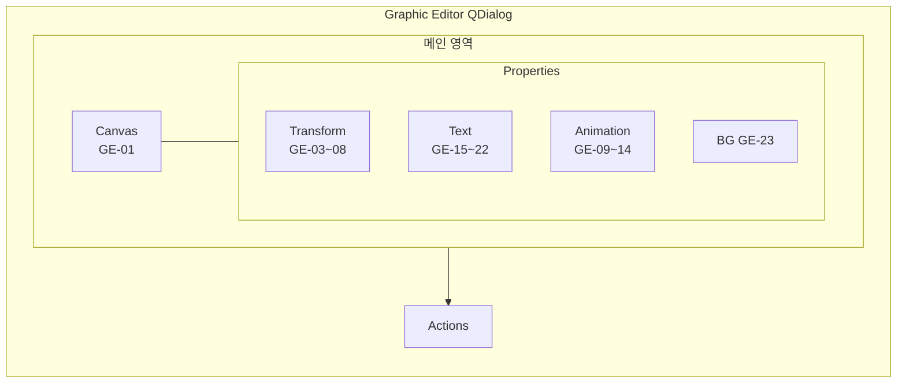

#### 9.2.2 Element List (Pattern A 전용)

Pattern A(Board/Field/Strip)에서만 120px 사이드바로 Element List(GE-02)가 추가되어 5-Zone 구조가 된다.

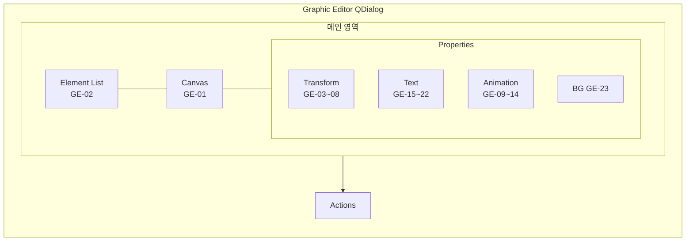

**모드별 Zone 수 요약:**

| 모드 | 패턴 | Element List | Zone 수 |
|------|:----:|:---:|:---:|
| Board / Field / Strip | A | O (120px) | 5 |
| Player / Outs / Leaderboard | C | — | 4 |
| Blinds / History | B | — | 4 |

### 9.3 공통 패널 상세

#### Canvas/Preview (GE-01)

| Element ID | 이름 | Quasar 컴포넌트 | 설명 |
|:----------:|------|-----------------|------|
| **GE-01** | WYSIWYG Canvas | `EbsGfxCanvas` (커스텀) | 요소 프리뷰 + 마우스 드래그. 캔버스 크기는 모드별 상이. 선택된 서브요소는 노란 점선 하이라이트 |

#### Element Selector (GE-02)

| Element ID | 이름 | Quasar 컴포넌트 | 설명 |
|:----------:|------|-----------------|------|
| **GE-02** | Element Dropdown | `QSelect` | 모드별 서브요소 선택. Board=14개, Player=N+7개 등. Player 공식: N(카드) + 5(Name/Action/Stack/Odds/Position) + 2(Photo/Flag) = N+7 |

#### Transform (GE-03 ~ GE-08, GE-08a~d)

| Element ID | 이름 | Quasar 컴포넌트 | 설명 | skin_type |
|:----------:|------|-----------------|------|-----------|
| **GE-03** | Left | `QInput[type=number]` | 수평 위치 (px) | per-element rect.X |
| **GE-04** | Top | `QInput[type=number]` | 수직 위치 (px) | per-element rect.Y |
| **GE-05** | Width | `QInput[type=number]` | 너비 (px) | per-element rect.Width |
| **GE-06** | Height | `QInput[type=number]` | 높이 (px) | per-element rect.Height |
| **GE-07** | Z-order | `QInput[type=number]` | 레이어 순서 (-99~99) | per-element `z_pos` |
| **GE-08** | Angle | `QInput[type=number]` | 회전 (-360~360) | per-element `rot_*` |
| GE-08a | Anchor H | `QSelect` (Left/Right) | 해상도 변경 시 수평 기준점 | per-element `anchor_x` |
| GE-08b | Anchor V | `QSelect` (Top/Bottom) | 해상도 변경 시 수직 기준점 | per-element `anchor_y` |
| GE-08c | Margins X/Y | `QInput[type=number]` x2 | 요소 내부 여백 | per-element `margins`, `margins_h` |
| GE-08d | Corner Radius | `QInput[type=number]` | 배경 라운드 모서리 | per-element `background_corner_radius` |

#### Animation (GE-09 ~ GE-14)

| Element ID | 이름 | Quasar 컴포넌트 | 설명 | skin_type |
|:----------:|------|-----------------|------|-----------|
| **GE-09** | Transition In | `QSelect` | `skin_transition_type` 5종 | per-element `trans_in` |
| **GE-10** | Transition Out | `QSelect` | `skin_transition_type` 5종 | per-element `trans_out` |
| **GE-11** | AnimIn File | `QBtn` (Import) | 커스텀 등장 애니메이션 파일 | per-element anim asset |
| **GE-12** | AnimIn Speed | `QSlider` | 등장 속도 (ms) | per-element `anim_in_speed` |
| **GE-13** | AnimOut File | `QBtn` (Import) | 커스텀 퇴장 애니메이션 파일 | per-element anim asset |
| **GE-14** | AnimOut Speed | `QSlider` | 퇴장 속도 (ms) | per-element `anim_out_speed` |

#### Text (GE-15 ~ GE-22)

텍스트를 포함하는 서브요소 선택 시 활성화.

| Element ID | 이름 | Quasar 컴포넌트 | 설명 | skin_type |
|:----------:|------|-----------------|------|-----------|
| **GE-15** | Text Visible | `QToggle` | 텍스트 렌더링 on/off | per-text `visible` |
| **GE-16** | Font Select | `QSelect` (Font 1/Font 2) | 폰트 패밀리 선택 | per-text `font_set` |
| **GE-17** | Text Colour | `QColor` + `QPopupProxy` | 텍스트 색상 | per-text `colour` |
| **GE-18** | Hilite Colour | `QColor` + `QPopupProxy` | 강조 상태 색상 | per-text `hilite_colour` |
| **GE-19** | Alignment | `QSelect` (Left/Center/Right) | 텍스트 정렬 | per-text `alignment` |
| **GE-20** | Drop Shadow | `QToggle` + `QSelect` (9방향) | 그림자 효과 + 방향 | per-text `shadow`, `shadow_direction` |
| **GE-21** | Shadow Colour | `QColor` + `QPopupProxy` | 그림자 색상 | per-text `shadow_colour` |
| **GE-22** | Triggered by Language | `QToggle` | 다국어 전환 시 갱신 여부 | per-text `language_trigger` |

#### Background (GE-23)

| Element ID | 이름 | Quasar 컴포넌트 | 설명 |
|:----------:|------|-----------------|------|
| **GE-23** | Background Image | `QImg` + `QBtn` (Import/Delete) | 요소별 배경 이미지. Import Mode 드롭다운으로 모드별 이미지 교체 |

### 9.4 공통 드롭다운 값

| 항목 | 값 목록 |
|------|---------|
| Transition 타입 | Default, Fade, Slide, Pop, Expand (5종) |
| Anchor H | Left, Right |
| Anchor V | Top, Bottom |
| Shadow 방향 | None, North, North East, East, South East(기본), South, South West, West, North West (9방향) |

### 9.5 적응형 레이아웃 패턴 A/B/C

캔버스 크기와 서브요소 수에 따라 3종 레이아웃 패턴을 적용한다.

| 패턴 | 구조 | 적용 모드 | 캔버스 | 서브요소 |
|:----:|------|----------|:------:|:--------:|
| **A** | Left(Element List) \| Center(Canvas) \| Right(Properties) | Board, Field, Strip | ≤300px | 3~14 |
| **B** | Canvas Top 전폭 + 2x2 Grid | Blinds, History | 극단적 가로 띠 | 3~4 |
| **C** | Canvas Top 전폭 + 3열 하단 | Player, Outs, Leaderboard | 465px+ | 3~9 |

**패턴 선택 기준**: 캔버스 폭 ≤300px → A, 종횡비 >10:1 또는 서브요소 ≤4개 → B, 그 외 → C.

#### CSS 레이아웃 요약

| 패턴 | 구조 | CSS 핵심 |
|:----:|------|---------|
| **A** | QSplitter 3열 | ElementList `120px` \| Canvas `flex:1` \| Props `280px` |
| **B** | Canvas 전폭 + 2×2 Grid | `grid-template-columns: 1.15fr 1fr`, `gap: 16px` |
| **C** | Canvas 전폭 + 3열 Grid | `grid-template-columns: 1.2fr 1fr 1.3fr`, `gap: 16px` |

### 9.6 모드별 치수 요약

| 모드 | 패턴 | Canvas (px) | 서브요소 | ElementList | Props 열 | CSS Grid |
|------|:----:|:-----------:|:--------:|:-----------:|:--------:|----------|
| Board | A | 296x197 | 14 | 120px | 280px | — |
| Field | A | 270x90 | 3 | 120px | 280px | — |
| Strip | A | 270x90 | 6 | 120px | 280px | — |
| Blinds | B | 790x52 | 4 | — | — | `1.15fr 1fr` |
| History | B | 345x33 | 3 | — | — | `1.15fr 1fr` |
| Player | C | 465x120 | 9 | — | — | `1.2fr 1fr 1.3fr` |
| Outs | C | 465x84 | 3 | — | — | `1.2fr 1fr 1.3fr` |
| Leaderboard | C | 800x103 | 9 | — | — | `1.2fr 1fr 1.3fr` |

### 9.7 공통 vs 개별 매트릭스

| 기능 | Board | Player | Blinds | Outs | History | LB | Field | Strip |
|------|:-----:|:------:|:------:|:----:|:-------:|:--:|:-----:|:-----:|
| Canvas (GE-01) | O | O | O | O | O | O | O | O |
| Element Selector (GE-02) | O | O | — | O | — | O | O | O |
| Transform (GE-03~08) | O | O | O | O | O | O | O | O |
| Animation (GE-09~14) | O | O | O | O | O | O | O | O |
| Text (GE-15~22) | O | O | O | O | O | O | O | O |
| Background (GE-23) | O | O | O | O | O | O | O | O |
| Import Mode | 3종 | — | Ante | — | 4종 | 3종 | — | — |
| Layout Type | — | 3종 | — | — | — | — | — | — |
| Player Set | — | 2종 | — | — | — | — | — | — |
| 배경 6상태 | — | O | — | — | — | — | — | — |
| Drop Shadow | — | O | — | — | — | — | — | — |
| Video Lines | — | — | — | — | — | — | — | O |
| Transition 기본값 | Default | Default | Default | Default | Default | Expand | Pop | Default |

---

## 10장. GE 8종 모드별 상세

> 공통 패널(9장)에서 설명한 GE-01~GE-23 컨트롤은 이 장에서 반복하지 않는다. 각 모드는 서브요소 카탈로그, Import Mode/Layout Type, 배경 상태, 오버레이 영향 등 **모드 고유 사항**만 기술한다.

### 10.1 Board

**(1) 역할**: 테이블 중앙 보드 영역 — 커뮤니티 카드 5장, 팟/블라인드 정보, 스폰서 로고를 배치하는 핵심 캔버스.

**(2) 이미지**

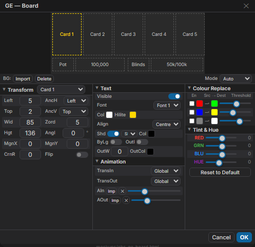
*Board — 14개 서브요소, Canvas 296x197, 패턴 A. [HTML 원본](mockups/ebs-ge-board.html)*

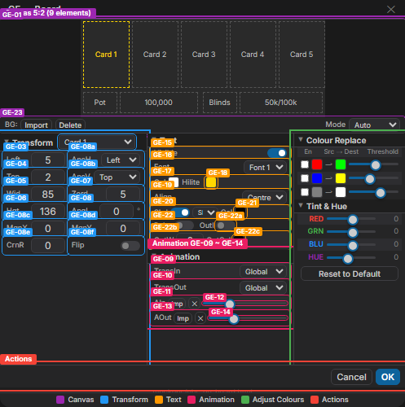
*5-Zone: ■ Canvas ■ Elements ■ Transform ■ Text/Anim/BG ■ Actions*

**(3) 캔버스 서브요소 배치**

```
+------------------------------------------+
|  [Card1][Card2][Card3][Card4][Card5]     |
|                                          |
|  [Sponsor Logo]    [PokerGFX.io]         |
|                                          |
|  [Pot] [100,000]                         |
|  [Blinds] [50,000/100,000]              |
|  [Hand] [123]  [Game Variant]            |
+------------------------------------------+
  296 x 197
```

**(4) 서브요소 카탈로그**

| # | 서브요소 | 타입 | skin_type 필드 |
|:-:|---------|------|----------------|
| 1~5 | Card 1~5 | Image (PIP) | `board_cards_rect` (RectangleF[]), `z_board_cards`, `rot_board_cards` |
| 6 | Sponsor Logo | Image | `board_logo_rect` (RectangleF) |
| 7 | PokerGFX.io | Text | — (EBS 브랜딩으로 교체) |
| 8 | 100,000 | Text | `board_pot` (font_type) |
| 9 | Pot | Text | (board_pot 내) |
| 10 | Blinds | Text | (Board에서 참조) |
| 11 | 50,000/100,000 | Text | (Board에서 참조) |
| 12 | Hand | Text | — |
| 13 | 123 | Text | — |
| 14 | Game Variant | Text | — |

**(5) Import Mode 3종**

| Mode | 설명 | skin_type 필드 |
|------|------|----------------|
| Auto | 기본 배경 로드 | `board_image` / `ai_board_image` (byte[] / asset_image) |
| AT Mode (Flop Game) | Flop 게임용 대체 배경 | `board_at_image` / `ai_board_at_image` |
| AT Mode (Draw/Stud Game) | Draw/Stud 게임용 대체 배경 | `board_at_image` / `ai_board_at_image` |

**(6) 오버레이 영향**

| 설정 변경 | 오버레이 요소 | 변화 내용 | skin_type 필드 |
|-----------|:---:|----------|----------------|
| Card 1~5 좌표 변경 | #5 커뮤니티 카드 | 카드 배치 위치/크기/회전 | `board_cards_rect`, `z_board_cards`, `rot_board_cards` |
| 100,000/Pot 텍스트 스타일 | #8 팟 카운터 | 폰트/색상/정렬/그림자 | `board_pot` (font_type) |
| Board 배경 이미지 교체 | #5, #8 전체 배경 | 커뮤니티 카드 + 팟 영역 외형 | `board_image` / `ai_board_image` |
| Import Mode 전환 | #5, #8 배경 전환 | AT Mode별 배경 이미지 자동 전환 | `board_at_image` / `ai_board_at_image` |

### 10.2 Player

**(1) 역할**: 개별 플레이어 패널 — 사진, 홀카드, 이름, 액션, 스택, 포지션 등을 표시. `skin_layout_type`에 따라 3종 캔버스 변형.

**(2) 이미지**

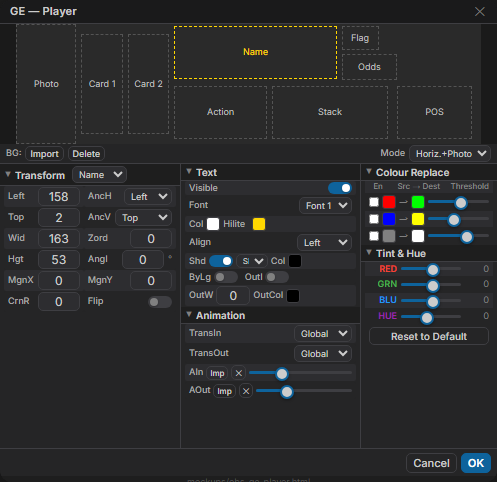
*Player — horizontal_with_photo, Canvas 465x120, 패턴 C. [HTML 원본](mockups/ebs-ge-player.html)*

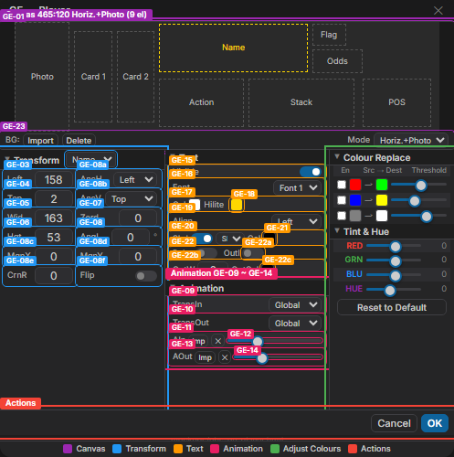
*4-Zone: ■ Canvas ■ Transform ■ Text/Anim/BG ■ Actions*

**(3) 캔버스 서브요소 배치** (horizontal_with_photo 기준)

```
+----------------------------------------------+
| [Photo] [Card1][Card2] [Name]   [Flag]       |
|         [Odds]  [Action] [Stack] [POS]       |
+----------------------------------------------+
  465 x 120
```

**(4) 서브요소 카탈로그**

서브요소 수는 게임 Variant에 따라 가변: Holdem N=2, Omaha N=4.

| # | 서브요소 | 타입 | skin_type 필드 |
|:-:|---------|------|----------------|
| 1~N | Card 1~N | Image (PIP) | `player_cards_rect` (RectangleF[]) |
| N+1 | Name | Text | `player_name` (font_type) |
| N+2 | Action | Text | `player_action` (font_type) |
| N+3 | Stack | Text | `player_stack` (font_type) |
| N+4 | Odds | Text | `player_odds` (font_type) |
| N+5 | Position | Text | `player_pos` (font_type) |
| N+6 | Photo | Image | `player_pic_rect` (RectangleF) |
| N+7 | Flag | Image | `player_flag_rect` (RectangleF) |

**(5) Layout Type 3종**

**horizontal_with_photo (기본)** — 465x120, 9 elements (Photo+Flag 포함)


| # | Element | Type | skin_type 필드 |
|:-:|---------|:----:|----------------|
| 1 | Photo | Image | `player_pic_rect` |
| 2 | Card 1 | Image | (카드 렌더링) |
| 3 | Card 2 | Image | (카드 렌더링) |
| 4 | Name | Text | `player_name` |
| 5 | Flag | Image | `player_flag_rect` |
| 6 | Odds | Text | `player_odds` |
| 7 | Action | Text | `player_action` |
| 8 | Stack | Text | `player_stack` |
| 9 | POS | Text | `player_pos` |

**vertical_only** — 465x84, 7 elements (Photo/Flag 제거)

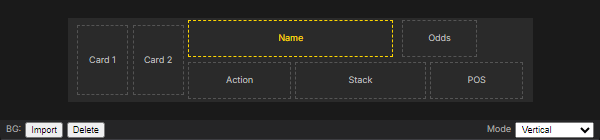

| # | Element | Type | skin_type 필드 | 비고 |
|:-:|---------|:----:|----------------|------|
| 1 | Card 1 | Image | (카드 렌더링) | |
| 2 | Card 2 | Image | (카드 렌더링) | |
| 3 | Name | Text | `player_name` | selected |
| 4 | Odds | Text | `player_odds` | |
| 5 | Action | Text | `player_action` | |
| 6 | Stack | Text | `player_stack` | |
| 7 | POS | Text | `player_pos` | |

**compact** — 270x90, 5 elements (최소 구성)

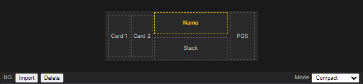

| # | Element | Type | skin_type 필드 | 비고 |
|:-:|---------|:----:|----------------|------|
| 1 | Name | Text | `player_name` | selected |
| 2 | Odds | Text | `player_odds` | |
| 3 | Action | Text | `player_action` | |
| 4 | Stack | Text | `player_stack` | |
| 5 | POS | Text | `player_pos` | |

**(6) 배경 이미지 6상태**

| # | 상태 | skin_type 필드 | 트리거 |
|:-:|------|----------------|--------|
| 1 | 기본 | `player_image` (byte[]) | 일반 상태 |
| 2 | 액션 중 | `player_action_image` | 플레이어 액션 시 |
| 3 | 자동 | `player_auto_image` | Auto-play 상태 |
| 4 | 사진 포함 | `player_pic_image` | Photo 활성 시 |
| 5 | AT 기본 | (AT variant) | AT Mode 기본 |
| 6 | AT 사진 | (AT variant + photo) | AT Mode + Photo |

**(7) Player Set 드롭다운**

| Player Set | 카드 수 | 용도 |
|:---|:---:|:---|
| 2 Card Games | N=2 | Holdem 계열 |
| 4 Card Games | N=4 | Omaha 계열 |

**(8) Drop Shadow**

None / North / North East / East / **South East**(기본) / South / South West / West / North West — 9방향

**(9) 오버레이 영향**

| 설정 변경 | 오버레이 요소 | 변화 내용 | skin_type 필드 |
|-----------|:---:|----------|----------------|
| Name 좌표/스타일 | #1 Player Panel | 이름 위치/폰트/색상/정렬/그림자 | `player_name` (font_type) |
| Card 1~N 좌표 | #1, #2 홀카드 | 홀카드 위치/크기 | `player_cards_rect` (RectangleF[]) |
| Action/Odds/Stack/Pos | #1, #3, #4 | 텍스트 스타일 | `player_action`, `player_odds`, `player_stack`, `player_pos` |
| Player 배경 교체 | #1 Panel 배경 | 6상태 x Photo 유무별 외형 | `player_image` 등 byte[] x 6 |
| Drop Shadow 방향 | #1 텍스트 그림자 | 8방향 그림자 렌더링 | shadow_direction |

### 10.3 Blinds

**(1) 역할**: 하단 스트립 영역 — 블라인드 레벨과 핸드 번호를 표시하는 가로 띠 형태 캔버스.

**(2) 이미지**

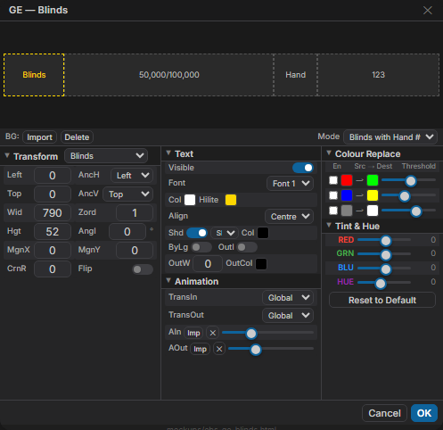
*Blinds — 4개 서브요소, Canvas 790x52, 패턴 B. [HTML 원본](mockups/ebs-ge-blinds.html)*

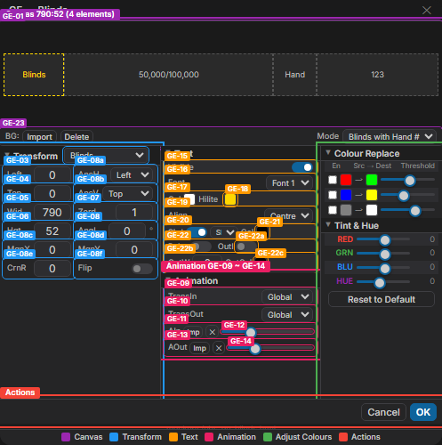
*4-Zone: ■ Canvas ■ Transform ■ Text/Anim/BG ■ Actions*

**(3) 캔버스 서브요소 배치**

```
+---------------------------------------------------+
| [Blinds] [50,000/100,000]   [Hand] [123]          |
+---------------------------------------------------+
  790 x 52
```

**(4) 서브요소 카탈로그**

| # | 서브요소 | 타입 | skin_type 필드 |
|:-:|---------|------|----------------|
| 1 | Blinds | Text | `blinds_msg` (font_type) |
| 2 | 50,000/100,000 | Text | `blinds_amt` (font_type) |
| 3 | Hand | Text | (참조) |
| 4 | 123 | Text | (참조) |

**(5) Ante 변형** (+2 요소)

Ante 활성 시 배경이 `blinds_ante_image`로 자동 전환되고, 요소 2개가 추가된다.

**Blinds with Hand # (기본)** — 4 elements


| # | Element | Type | skin_type 필드 |
|:-:|---------|:----:|----------------|
| 1 | Blinds | Text | `blinds_msg` |
| 2 | 50,000/100,000 | Text | `blinds_amt` |
| 3 | Hand | Text | (참조) |
| 4 | 123 | Text | (참조) |

**Ante** — 6 elements (+ante_msg, +ante_amt)

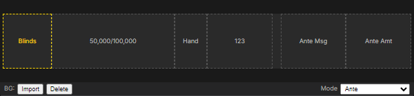

| # | Element | Type | skin_type 필드 | 비고 |
|:-:|---------|:----:|----------------|------|
| 1 | Blinds | Text | `blinds_msg` | selected |
| 2 | 50,000/100,000 | Text | `blinds_amt` | |
| 3 | Hand | Text | (참조) | |
| 4 | 123 | Text | (참조) | |
| 5 | Ante Msg | Text | `ante_msg` | Ante 모드 추가 |
| 6 | Ante Amt | Text | `ante_amt` | Ante 모드 추가 |

**(6) 배경 이미지 상태**

| 상태 | skin_type 필드 |
|------|----------------|
| 기본 | `blinds_image` / `ai_blinds_image` (byte[] / asset_image) |
| Ante 활성 | `blinds_ante_image` (자동 전환) |

**(7) 오버레이 영향**

| 설정 변경 | 오버레이 요소 | 변화 내용 | skin_type 필드 |
|-----------|:---:|----------|----------------|
| Blinds 텍스트 좌표/스타일 | #7 Bottom Strip | Blinds 라벨 위치/폰트/색상 | `blinds_msg` (font_type) |
| Amount 텍스트 변경 | #7 Bottom Strip | Blind 금액 표시 스타일 | `blinds_amt` (font_type) |
| Hand/123 변경 | #7 Bottom Strip | 핸드 번호 위치/스타일 | (참조) |
| Blinds 배경 교체 | #7 Bottom Strip | Blinds 영역 외형 (Ante 시 자동 전환) | `blinds_image`, `blinds_ante_image` |

### 10.4 Outs

**(1) 역할**: 아웃 카운터 패널 — 특정 카드의 아웃(승리 가능성 카드) 수를 표시.

**(2) 이미지**

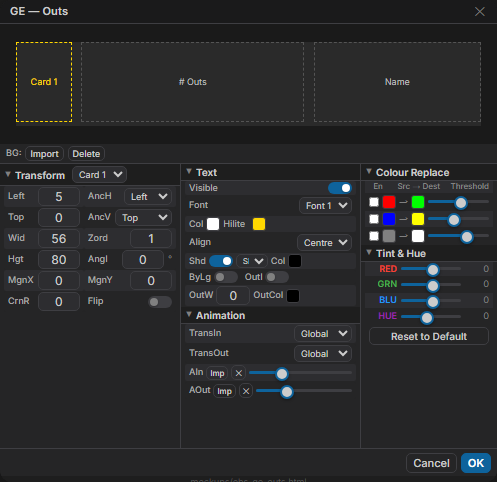
*Outs — 3개 서브요소, Canvas 465x84, 패턴 C. [HTML 원본](mockups/ebs-ge-outs.html)*

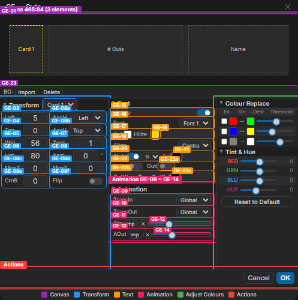
*4-Zone: ■ Canvas ■ Transform ■ Text/Anim/BG ■ Actions*

**(3) 캔버스 서브요소 배치**

```
+----------------------------------------------+
| [Card 1]   [Name]               [# Outs]    |
+----------------------------------------------+
  465 x 84
```

**(4) 서브요소 카탈로그**

| # | 서브요소 | 타입 | skin_type 필드 |
|:-:|---------|------|----------------|
| 1 | Card 1 | Image (PIP) | `outs_cards_rect` (RectangleF[]), `z_outs_cards`, `rot_outs_cards` |
| 2 | Name | Text | `outs_name` (font_type) |
| 3 | # Outs | Text | `outs_num` (font_type) |

**(5) 배경 이미지**

배경: `outs_image` / `ai_outs_image` (byte[] / asset_image)

**(6) 오버레이 영향**

| 설정 변경 | 오버레이 요소 | 변화 내용 | skin_type 필드 |
|-----------|:---:|----------|----------------|
| Card 1 좌표 변경 | Outs 패널 | 카드 배치 위치/크기/회전 | `outs_cards_rect`, `z_outs_cards`, `rot_outs_cards` |
| Name 텍스트 스타일 | Outs 패널 | 이름 폰트/색상/정렬 | `outs_name` (font_type) |
| # Outs 텍스트 스타일 | Outs 패널 | 숫자 폰트/색상 | `outs_num` (font_type) |
| 배경 이미지 교체 | Outs 패널 | Outs 패널 외형 | `outs_image` / `ai_outs_image` |

### 10.5 History

**(1) 역할**: 핸드 히스토리 패널 — 라운드별 플레이어 액션을 4-Section 구조로 표시.

**(2) 이미지**

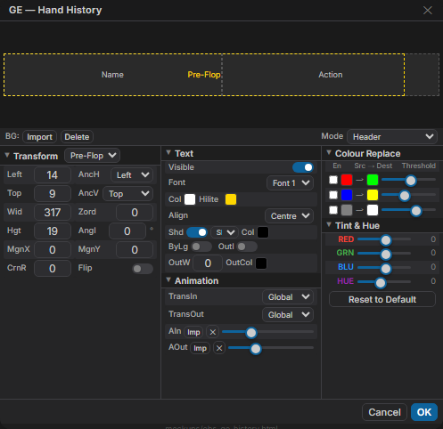
*History — 3개 서브요소, Canvas 345x33, 패턴 B. [HTML 원본](mockups/ebs-ge-history.html)*

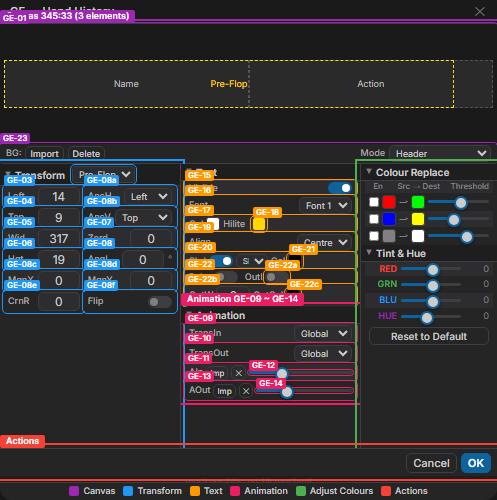
*4-Zone: ■ Canvas ■ Transform ■ Text/Anim/BG ■ Actions*

**(3) 캔버스 서브요소 배치**

```
+------------------------------------------+
| [Pre-Flop]  [Name]           [Action]    |
+------------------------------------------+
  345 x 33
```

**(4) 서브요소 카탈로그**

| # | 서브요소 | 타입 | skin_type 필드 |
|:-:|---------|------|----------------|
| 1 | Pre-Flop | Text | `history_panel_header` (font_type) |
| 2 | Name | Text | `history_panel_detail_left_col` (font_type) |
| 3 | Action | Text | `history_panel_detail_right_col` (font_type) |

**(5) 4-Section Import Mode**

**Header** — 1 element (Pre-Flop 헤더)


| # | Element | Type | skin_type 필드 |
|:-:|---------|:----:|----------------|
| 1 | Pre-Flop | Text | `history_panel_header` |

**Repeating header** — 1 element (반복 섹션 헤더)

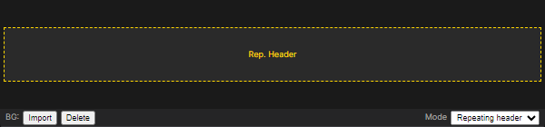

| # | Element | Type | skin_type 필드 |
|:-:|---------|:----:|----------------|
| 1 | Rep. Header | Text | (반복 섹션 헤더) |

**Repeating detail** — 2 elements (Name + Action)

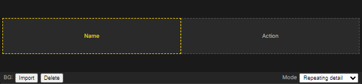

| # | Element | Type | skin_type 필드 |
|:-:|---------|:----:|----------------|
| 1 | Name | Text | `history_panel_detail_left_col` |
| 2 | Action | Text | `history_panel_detail_right_col` |

**Footer** — 1 element (푸터)

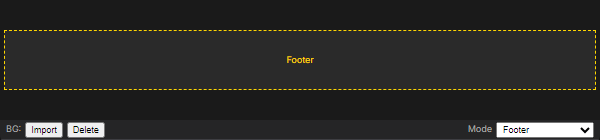

| # | Element | Type | skin_type 필드 |
|:-:|---------|:----:|----------------|
| 1 | Footer | Text | (푸터 텍스트) |

기본 비트맵: `history_panel_bitmap` / `ai_history_panel_bitmap` (byte[] / asset_image)

**(6) 오버레이 영향**

| 설정 변경 | 오버레이 요소 | 변화 내용 | skin_type 필드 |
|-----------|:---:|----------|----------------|
| Pre-Flop 텍스트 스타일 | History 패널 | 라운드 헤더 폰트/색상/정렬 | `history_panel_header` |
| Name 텍스트 스타일 | History 패널 | 플레이어 이름 폰트/색상 | `history_panel_detail_left_col` |
| Action 텍스트 스타일 | History 패널 | 액션 텍스트 폰트/색상 | `history_panel_detail_right_col` |

### 10.6 Leaderboard

**(1) 역할**: 리더보드 패널 — 토너먼트 순위/상금을 3-Section 구조로 표시. Transition 기본값 Expand.

**(2) 이미지**

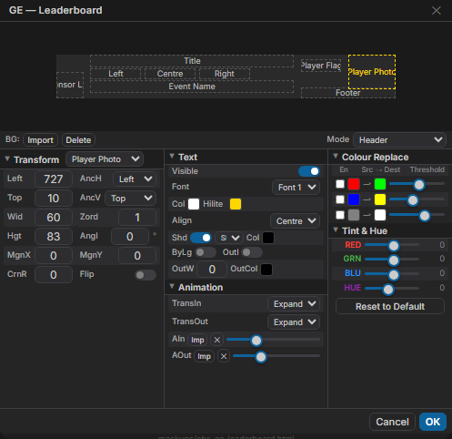
*Leaderboard — 9개 서브요소, Canvas 800x103, 패턴 C. [HTML 원본](mockups/ebs-ge-leaderboard.html)*

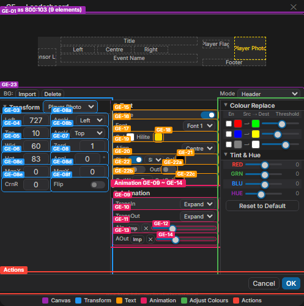
*4-Zone: ■ Canvas ■ Transform ■ Text/Anim/BG ■ Actions*

**(3) 캔버스 서브요소 배치**

```
+---------------------------------------------------+
| [Title]  [Event Name]            [Sponsor Logo]   |
| [Photo][Flag] [Left] [Centre] [Right]             |
| [Footer]                                          |
+---------------------------------------------------+
  800 x 103
```

**(4) 서브요소 카탈로그**

| # | 서브요소 | 타입 | skin_type 필드 |
|:-:|---------|------|----------------|
| 1 | Player Photo | Image | `panel_photo_rect` (RectangleF) |
| 2 | Player Flag | Image | `panel_flag_rect` (RectangleF) |
| 3 | Sponsor Logo | Image | `panel_logo_rect` (RectangleF) |
| 4 | Title | Text | `panel_header` (font_type) |
| 5 | Left | Text | `panel_left_col` (font_type) |
| 6 | Centre | Text | `panel_centre_col` (font_type) |
| 7 | Right | Text | `panel_right_col` (font_type) |
| 8 | Footer | Text | `panel_footer` (font_type) |
| 9 | Event Name | Text | `panel_game_title` (font_type) |

**(5) 3-Section Import Mode**

**Header** — 4 elements (Title, Event, Logo, Footer)


| # | Element | Type | skin_type 필드 |
|:-:|---------|:----:|----------------|
| 1 | Title | Text | `panel_header` |
| 2 | Event Name | Text | `panel_game_title` |
| 3 | Sponsor Logo | Image | `panel_logo_rect` |
| 4 | Footer | Text | `panel_footer` |

**Repeating section** — 5 elements (Photo, Flag, L/C/R)

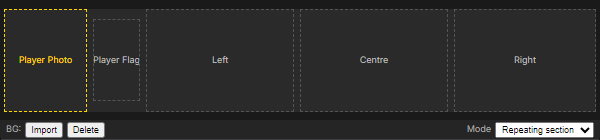

| # | Element | Type | skin_type 필드 |
|:-:|---------|:----:|----------------|
| 1 | Player Photo | Image | `panel_photo_rect` |
| 2 | Player Flag | Image | `panel_flag_rect` |
| 3 | Left | Text | `panel_left_col` |
| 4 | Centre | Text | `panel_centre_col` |
| 5 | Right | Text | `panel_right_col` |

**Footer** — 3 elements (Logo, Event, Footer)

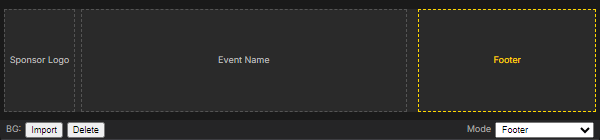

| # | Element | Type | skin_type 필드 |
|:-:|---------|:----:|----------------|
| 1 | Sponsor Logo | Image | `panel_logo_rect` |
| 2 | Event Name | Text | `panel_game_title` |
| 3 | Footer | Text | `panel_footer` |

기본 비트맵: `panel_bitmap` / `ai_panel_bitmap` (byte[] / asset_image)

**(6) 모드 고유 기능**: Transition In/Out 모두 **Expand** (PokerGFX Default → EBS Expand 변경)

**(7) 오버레이 영향**

| 설정 변경 | 오버레이 요소 | 변화 내용 | skin_type 필드 |
|-----------|:---:|----------|----------------|
| Title~Right 텍스트 스타일 | LB 패널 | 컬럼 헤더/데이터 텍스트 폰트/색상 | `panel_header` ~ `panel_right_col` (font_type x 5) |
| Photo/Flag 좌표 | LB 패널 | 사진/국기 배치 위치 | `panel_photo_rect`, `panel_flag_rect` |
| Logo 좌표 | LB 패널 | 스폰서 로고 위치/크기 | `panel_logo_rect` |
| 배경 이미지 교체 (3종) | LB 패널 | Header/Repeating/Footer 영역 외형 | `ai_panel_header_image` 등 |
| Transition Expand | LB 패널 | 등장/퇴장 확장 효과 | (transition 설정) |

### 10.7 Field

**(1) 역할**: 필드 카운터 — 토너먼트 참가 인원(Total/Remaining)을 표시하는 소형 패널. Transition 기본값 Pop.

**(2) 이미지**

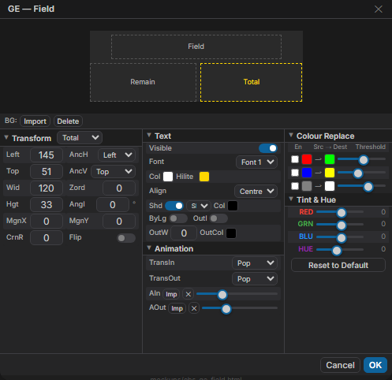
*Field — 3개 서브요소, Canvas 270x90, 패턴 A. [HTML 원본](mockups/ebs-ge-field.html)*

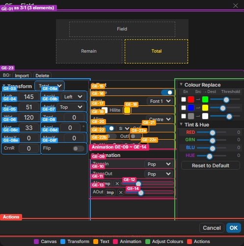
*5-Zone: ■ Canvas ■ Elements ■ Transform ■ Text/Anim/BG ■ Actions*

**(3) 캔버스 서브요소 배치**

```
+---------------------------+
| [Field]                   |
|                           |
| [Remain]       [Total]    |
+---------------------------+
  270 x 90
```

**(4) 서브요소 카탈로그**

| # | 서브요소 | 타입 | skin_type 필드 |
|:-:|---------|------|----------------|
| 1 | Total | Text | `field_total` (font_type) |
| 2 | Remain | Text | `field_remain` (font_type) |
| 3 | Field | Text | `field_title` (font_type) |

**(5) 배경 이미지**

배경: `ai_field_image` (asset_image)

**(6) 모드 고유 기능**: Transition In/Out 모두 **Pop** — `field_trans_in`, `field_trans_out` (skin_transition_type)

**(7) 오버레이 영향**

| 설정 변경 | 오버레이 요소 | 변화 내용 | skin_type 필드 |
|-----------|:---:|----------|----------------|
| Total 텍스트 변경 | #9 FIELD | 총 인원 카운터 위치/폰트 | `field_total` (font_type) |
| Remain 텍스트 변경 | #9 FIELD | 잔여 인원 카운터 위치/폰트 | `field_remain` (font_type) |
| Field 텍스트 변경 | #9 FIELD | 라벨 위치/폰트 | `field_title` (font_type) |
| Transition Pop | #9 FIELD | 등장/퇴장 팝업 효과 | `field_trans_in`, `field_trans_out` |
| 배경 이미지 교체 | #9 FIELD | Field 카운터 외형 | `ai_field_image` |

### 10.8 Strip

**(1) 역할**: 하단 정보 스트립 — 플레이어 통계(Name, Count, Position, VPIP, PFR)와 스폰서 로고를 가로 띠로 표시. Video Lines 고유 기능 보유.

**(2) 이미지**

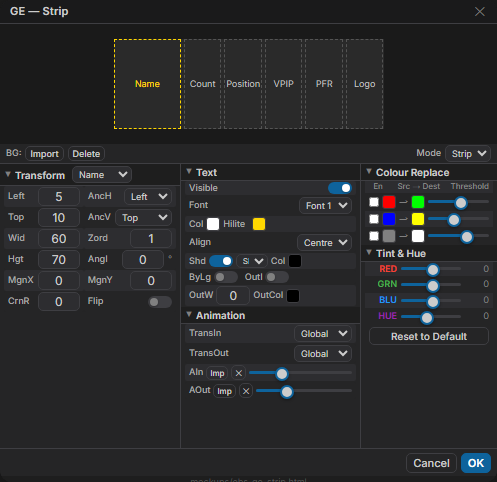
*Strip — 6개 서브요소, Canvas 270x90, 패턴 A. [HTML 원본](mockups/ebs-ge-strip.html)*

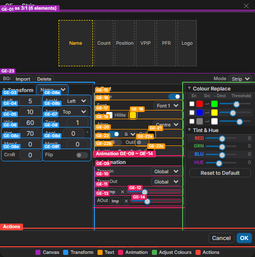
*5-Zone: ■ Canvas ■ Elements ■ Transform ■ Text/Anim/BG ■ Actions*

**(3) 캔버스 서브요소 배치**

```
+---------------------------+
| [Name] [Count] [Position] |
| [VPIP] [PFR]   [Logo]     |
+---------------------------+
  270 x 90
```

**(4) 서브요소 카탈로그**

| # | 서브요소 | 타입 | skin_type 필드 |
|:-:|---------|------|----------------|
| 1 | Name | Text | `strip_name` (font_type) |
| 2 | Count | Text | `strip_count` (font_type) |
| 3 | Position | Text | `strip_pos` (font_type) |
| 4 | VPIP | Text | `strip_vpip` (font_type) |
| 5 | PFR | Text | `strip_pfr` (font_type) |
| 6 | Logo | Image | (이미지 좌표) |

**(5) 배경 이미지**

배경: `ai_strip_image` (asset_image)

**(6) 모드 고유 기능**

- **Transition**: `strip_trans_in`, `strip_trans_out` (skin_transition_type)
- **Video Lines**: `strip_asset_video_lines` (int) — Strip 해상도 세로 픽셀 수. 명시적 슬라이더로 노출

**(7) 오버레이 영향**

| 설정 변경 | 오버레이 요소 | 변화 내용 | skin_type 필드 |
|-----------|:---:|----------|----------------|
| Name~PFR 텍스트 스타일 (5건) | #7 Bottom Strip | 각 텍스트 위치/폰트/색상 | `strip_name` ~ `strip_pfr` (font_type x 5) |
| Strip 배경 교체 | #7 Bottom Strip | Strip 영역 외형 | `ai_strip_image` |
| Logo 좌표 변경 | #10 스폰서 로고 | 로고 위치/크기 | (이미지 좌표) |
| Transition 설정 | #7 Bottom Strip | 등장/퇴장 효과 | `strip_trans_in`, `strip_trans_out` |
| Video Lines 변경 | #7, #9, #10 | Strip 렌더링 해상도 (세로 픽셀) | `strip_asset_video_lines` (int) |

---

# Part IV — 구현 참조

## 11장. 설계 결정

### 내재화 설계 결정 10선

PokerGFX를 내재화하면서 내린 핵심 설계 결정 10가지를 요약한다.

| # | 결정 | 내재화 전 | 내재화 후 | 사유 |
|:-:|------|----------|----------|------|
| 1 | GE 통합 | 2개 별도 클래스 (87% 중복) | 단일 다이얼로그 + mode 탭 | 코드 중복 87% 제거 |
| 2 | Element Grid 축소 | 10버튼 | 7버튼 (SSD, Ticker, Action Clock 제외) | 범위 정리 — Ticker 별도, Clock 운영 설정 |
| 3 | Settings 표면화 | 3섹션 플랫 + 48필드 숨김 | 3섹션 접이식 | 숨겨진 필드 UI 노출 후 Console 이관 |
| 4 | 파일 포맷 전환 | .skn (AES + Binary) | .gfskin (ZIP + JSON) | 개방형 포맷, 보안 취약점 해소 |
| 5 | Canvas 위치 변경 | 하단 배치 | 좌측 상단 (WYSIWYG 우선) | 편집 결과 즉시 확인 |
| 6 | 패널 접이식 전환 | 플랫 (모두 노출) | 접이식 (핵심 펼침, 나머지 접힘) | 720×480 공간 최적화 |
| 7 | 테마 전환 | 다크 (회색/검정) | B&W Refined Minimal | 모던 UI 표준, Canvas 대비 강화 |
| 8 | Console-Skin SSOT | 동일 필드 양쪽 노출 | Skin = 디자인 기본값, Console = override | 데이터 충돌 방지 |
| 9 | Colour Tools 이관 | 메인 인라인 | GE "Adjust Colours" 모달 복원 | 원본 패턴 회귀, GE 프리뷰 제공 |
| 10 | SE 스코프 재정의 | 9개 Settings (48필드) | 3개 Settings (스킨 고유만) | Console D1~D4 중복 제거 |

## 12장. Quasar Component 매핑

### 12.1 WinForms → Quasar 매핑

핵심 매핑:

| WinForms | Quasar | 대표 사용처 |
|----------|--------|-----------|
| TextBox | `QInput` | 01 Name, 09 Font |
| CheckBox | `QToggle` | 03, 07, GE-09 |
| ComboBox | `QSelect` | 14 Variant, GE-02 |
| TrackBar | `QSlider` | 05, 08, GE-12 |
| NumericUpDown | `QInput[type=number]` | GE-03~08 |
| ColorPicker | `QColor` + `QPopupProxy` | GE-17~21, 28~30 |
| Button | `QBtn` | 06, 21~26 |
| Panel (모달) | `QDialog` | SE/GE 전체 |

### 12.2 커스텀 컴포넌트

### 12.3 공유 컴포넌트 9종

SE↔GE 간 일관성을 보장하는 공유 에디터 컴포넌트.

| 컴포넌트 | 역할 | 핵심 Props | Quasar 의존 |
|----------|------|-----------|------------|
| `EbsSectionHeader` | 접이식 섹션 헤더 (T1/T2/T3) | `label`, `tier`, `group?` | `QExpansionItem` |
| `EbsPropertyRow` | 라벨+컨트롤 행, 교차 배경색 | `label` | CSS only |
| `EbsColorPicker` | 색상 선택기 | `modelValue` (hex) | `QColor`, `QPopupProxy` |
| `EbsNumberInput` | 숫자 입력 (min/max/step) | `modelValue`, `suffix?` | `QInput` |
| `EbsSlider` | 슬라이더 (label-always) | `modelValue`, `min`, `max` | `QSlider` |
| `EbsToggle` | 토글 스위치 | `modelValue`, `label` | `QToggle` |
| `EbsSelect` | 드롭다운 (emit-value) | `modelValue`, `options` | `QSelect` |
| `EbsActionBar` | 하단 액션 버튼 행 | `buttons[]` | `QBtn`, `QSeparator` |
| `GfxEditorBase` | GE 레이아웃 컨테이너 (A/B/C) | `mode`, `pattern` | `QSplitter`, `QCard` |

## 13장. 데이터 흐름

### 13.1 .gfskin 로드/저장

EBS는 PokerGFX `.skn`(AES+BinaryFormatter)에서 `.gfskin`(ZIP+JSON) 개방형 포맷으로 전환한다.

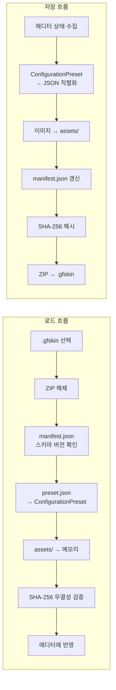

| 비교 항목 | PokerGFX .skn | EBS .gfskin |
|-----------|:---:|:---:|
| 컨테이너 | 단일 바이너리 | ZIP 아카이브 |
| 직렬화 | BinaryFormatter | JSON |
| 암호화 | AES 강제 | 선택적 (상용만) |
| 이미지 | byte[] 인라인 | assets/ 개별 PNG |
| 호환성 | 버전 종속 | 스키마 버전 + 마이그레이션 |

### 13.2 Editor State ↔ ConfigurationPreset

Skin Editor/Graphic Editor의 모든 UI 값은 `ConfigurationPreset` DTO(187+ 필드)와 양방향 바인딩된다.

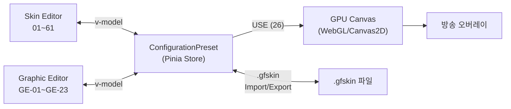

| 계층 | 기술 | 역할 |
|------|------|------|
| UI Layer | Quasar Components (S-##, GE-##) | 사용자 입력 수집 |
| State Layer | Pinia Store (`useSkinStore`) | ConfigurationPreset 반응형 관리 |
| Persistence Layer | .gfskin (ZIP+JSON) | 파일 I/O |
| Render Layer | Canvas 2D / WebGL | 오버레이 프리뷰 + 방송 출력 |

skin_type 187개 필드의 카테고리별 분류와 전체 매핑은 부록 C를 참조한다.

## 14장. 레이아웃 아키텍처

### 14.1 SE 메인 레이아웃 상세

#### SE 전체 구조 트리

**Overview — 최상위 구조**:

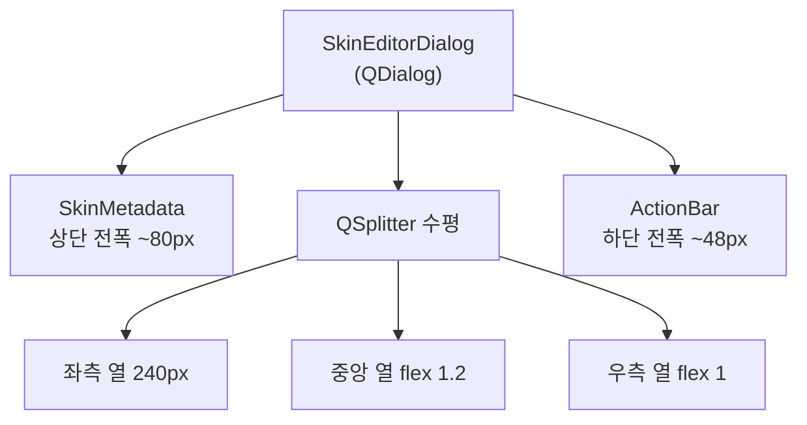

**Detail — 3열 패널 구성**:

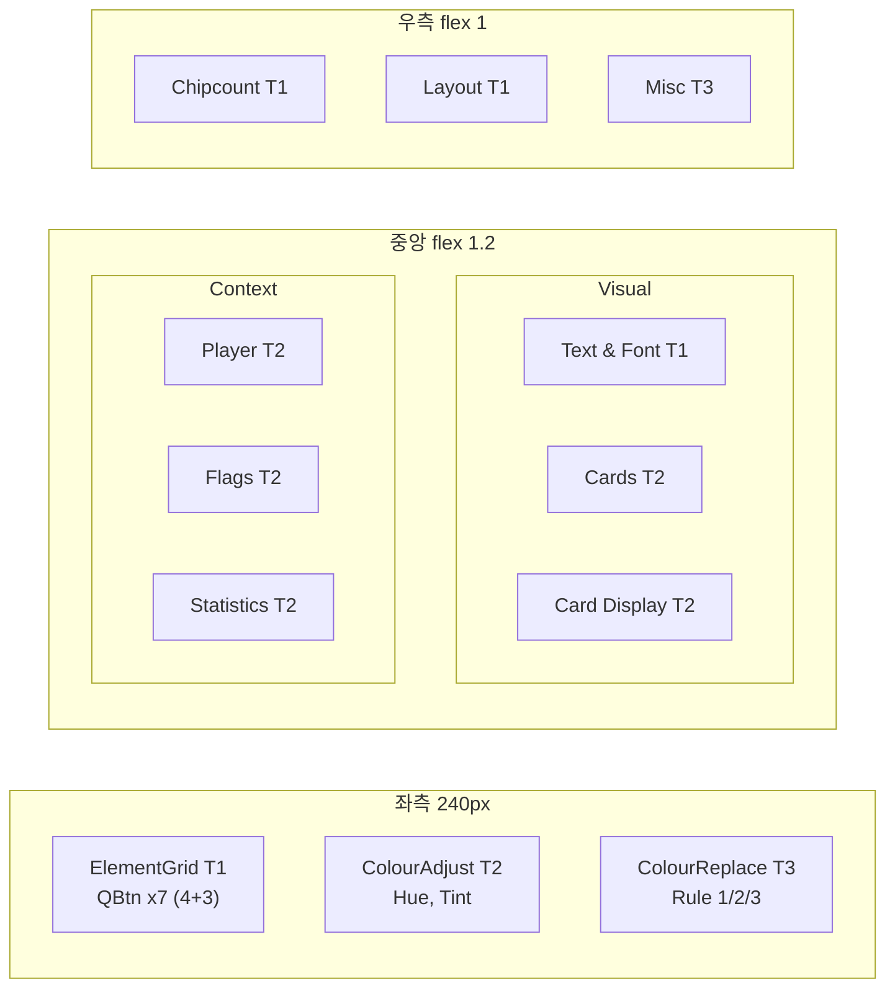

## 15장. 검증 전략

### 15.1 정량 지표 5종

| 지표 | 측정 방법 | 목표 |
|------|----------|------|
| 열 높이 편차 | `max(col height) - min(col height)` | ≤ 50px |
| T1 분포 | 각 열의 T1 항목 수 | 편차 ≤ 1개 |
| 정보 밀도 | 컨트롤 수 / 열 면적 | 열 간 편차 ≤ 20% |
| 여백 비율 | 여백 / 전체 면적 | 각 열 25-35% |
| 경계선 수 | `border` 속성 카운트 | Phase 2 후 ≤ 5개 |

### 15.2 사용성 체크리스트

| # | 항목 |
|:-:|------|
| 1 | 첫 방문 사용자가 3초 내 편집 시작점을 찾을 수 있는가? |
| 2 | Element Grid → GE → 속성 편집 → 결과 확인이 3클릭 이내인가? |
| 3 | T1 섹션만으로 기본 스킨 편집이 완료 가능한가? |
| 4 | SE와 GE에서 동일 속성(예: 색상)이 동일 위치에 있는가? |
| 5 | 모든 열의 높이가 시각적으로 균등한가? |
| 6 | 접힌 섹션 헤더만으로 내용을 예측할 수 있는가? |
| 7 | Advanced 토글 없이도 핵심 기능이 모두 접근 가능한가? |
| 8 | 8px 그리드에서 벗어난 간격이 없는가? |
| 9 | 교차 배경색으로 밀집 행이 시각적으로 구분되는가? |
| 10 | Canvas 프리뷰가 속성 변경에 즉시 반응하는가? |

### 15.3 SE + GE 검증 결과

| 화면 | 열 높이 편차 | T1 분포 | 밀도 편차 | 여백 비율 | 경계선 수 | 판정 |
|------|:-----------:|:-------:|:---------:|:---------:|:---------:|:----:|
| **SE 메인** | ~40px | 좌1/중1/우2 | **14%** | ~30% | 3 | PASS |
| Board (A) | ≤50px | T1×1열 | ≤20% | ~28% | 3 | PASS |
| Field (A) | ≤50px | T1×1열 | ≤20% | ~32% | 3 | PASS |
| Strip (A) | ≤50px | T1×1열 | ≤20% | ~30% | 3 | PASS |
| Blinds (B) | N/A (2×2) | T1×1셀 | ≤20% | ~27% | 4 | PASS |
| History (B) | N/A (2×2) | T1×1셀 | ≤20% | ~35% | 4 | PASS |
| Player (C) | ≤50px | T1×1열 | ≤20% | ~25% | 3 | PASS |
| Outs (C) | ≤50px | T1×1열 | ≤20% | ~33% | 3 | PASS |
| Leaderboard (C) | ≤50px | T1×1열 | ≤20% | ~26% | 3 | PASS |

## 16장. 구현 로드맵

프로젝트 구조 상세는 **부록 G** 참조. 4-Phase 로드맵 요약:

| Phase | 범위 | 핵심 산출물 |
|:-----:|------|-----------|
| 1 (Foundation) | Quasar 초기화 + 공유 컴포넌트 4종 + SE 스켈레톤 | `SkinEditorDialog`, `useSkinStore`, `skin-types.ts` |
| 2 (Core Editor) | SE 전체 (Metadata/Settings/Actions/Colour) + .gfskin I/O | 01~26 + 27~30 컨트롤, ZIP+JSON 직렬화 |
| 3 (Graphic Editor) | GE Base(A/B/C) + Canvas + 4패널 + 8모드 통합 | `GfxEditorBase`, `EbsGfxCanvas`, Transform/Anim/Text/BG |
| 4 (Polish) | 교차 배경색 + 패널 Toggle + T3 Advanced + Dark Mode | UX 개선 + 시각 일관성 |

---

# 부록

## 부록 A. Console-Skin SSOT 정책 (D1~D5)

Console과 Skin Editor 간 중복 필드의 SSOT 지정 정책.

| # | 필드 그룹 | Console 위치 | Skin Editor 위치 | SSOT | Override 정책 |
|:-:|----------|-------------|-----------------|:----:|-------------|
| D1 | Layout (`board_pos`, margins 등 7필드) | GFX 탭 Layout | Settings Layout(50~56) | **Console** | Console 전용 — Skin Editor에서 제거. Layout은 Console GFX 탭에서만 설정 |
| D2 | Chipcount Precision (5영역) | Display 탭 Precision | Settings Chipcount(31~33) | **Console** | Console 전용 — Skin Editor에서 제거. Chipcount Precision은 Console Display 탭에서만 설정 |
| D3 | Card Display (`at_show`, `card_reveal` 등) | GFX 탭 Card&Player | Settings CardDisplay(44~49) | **Console** | Console 전용 — Skin Editor에서 제거. Card Display는 Console GFX 탭에서만 설정 |
| D4 | Statistics (`auto_stats` 등 6필드) | Stats 탭 | Settings Statistics(38~43) | **Console** | Console 전용 — Skin Editor에서 제거. Statistics는 Console Stats 탭에서만 설정 |
| D5 | Transition In/Out (타입+시간) | GFX 탭 Animation | GE Animation 패널 | **Skin** | Console Override — 운영 중 전환 효과 즉시 변경 |

## 부록 B. GAP 분석 (P1/P2: G1~G9)

Whitepaper의 모든 Skin 관련 필드를 EBS Skin Editor UI와 대조한 결과.

### P1 — 즉시 반영 (HIGH/MED)

| # | 누락 기능 | RE 문서 위치 | 심각도 | 조치 |
|:-:|----------|-------------|:------:|------|
| G1 | `_flip_x` (수평 반전) | image_element 41필드 | **HIGH** | GE Transform 패널에 QToggle 추가 |
| G2 | 텍스트 아웃라인 (`custom_text_renderer`) | text_element 52필드 | **MED** | GE Text 패널에 Outline 두께/색상 추가 |
| G4 | `game_name_in_vanity` | ConfigurationPreset Misc | **DROP** | Vanity Text(57, 58) SE 스코프 제거 — 부록 E 범위 외 이동 |
| G7 | `cp_strip` precision 위치 불명확 | Chipcount Precision | **MED** | Strip GE 모드에서 Chipcount 섹션에 명시 |

### P2 — 백로그 (LOW)

| # | 누락 기능 | RE 문서 위치 | 심각도 | 비고 |
|:-:|----------|-------------|:------:|------|
| G3 | 텍스트 그라디언트 (`gradient fills`) | text_element | **LOW** | P2 검토 항목 — 그라디언트 렌더러 엔진 의존 |
| G5 | `nit_display` (NIT 표시 모드) | ConfigurationPreset Additional | **LOW** | Misc 섹션에 QSelect 추가 검토 |
| G6 | 스프라이트 프레임 제어 (`_seq_num`/`_frame_num`) | image_element | **LOW** | P2 고급 기능 — 애니메이션 시퀀스 제어 |
| G8 | Effects Chain 세밀 제어 (Crop/ColorMatrix) | GPU Effects Chain | **LOW** | 현재 Brightness/Hue/Tint만 노출. 엔진 레벨 P2 |

### VERIFY — 확인 후 재분류

| # | 항목 | RE 문서 위치 | 확인 내용 |
|:-:|------|-------------|----------|
| G9 | `skin_transition_type` "global=0" 의미 | Animation enum | 개별 GE 모드에서 global transition 참조 메커니즘 확인 필요 |

### 의도적 제거 확인 (DROP)

| 항목 | 필드 | 제거 사유 |
|------|------|----------|
| Ticker | `ticker_stat_*` 6종 | Element Grid에서 Ticker 제외 (별도 시스템) |
| Action Clock | `action_clock_count` | 운영 설정으로 분리 |
| Currency | 4필드 | v2.2.0에서 Console 전용으로 이관 |
| Twitch/Ticker CP | `cp_twitch`, `cp_ticker` | 명시적 DROP |
| PIP Editor | PIP 관련 | 카메라 오버레이, Skin Editor 범위 밖 |

## 부록 C. ConfigurationPreset 필드 감사 + WinForms 매핑

Whitepaper의 ConfigurationPreset 99+ 필드를 귀속별로 분류한다. WinForms→Quasar 전체 매핑(12종)도 본 부록에 통합한다. 전체 필드 상세는 부록 C를 참조한다.

| 카테고리 | 필드 수 (근사) | 귀속 | 본 문서 참조 |
|----------|:-----------:|------|-------------|
| Skin Metadata | 5 | Skin Editor (01~05) | 8장 §Metadata |
| Element Grid | 7 요소 | Skin Editor (06) | 8장 §Element Grid |
| Text/Font | 6 | Skin Editor (07~10) | 8장 §Settings |
| Cards | 5 | Skin Editor (11~13) | 8장 §Settings |
| Player/Flags | 8 | Skin Editor (14~20) | 8장 §Settings |
| Misc | 1 | Skin Editor (72) | 8장 §Settings |
| Transform (per element) | 6+4 | Graphic Editor (GE-03~GE-08d) | 9장 GE 공통 |
| Animation (per element) | 6 | Graphic Editor (GE-09~GE-14) | 9장 GE 공통 |
| Text (per element) | 8+7 | Graphic Editor (GE-15~GE-22). per-text 추가 필드 7개(`z_pos`, `background_bm`, `margins`, `margins_h`, `background_corner_radius`, `font_set`, `rendered_size`)는 Transform/Background와 중복 가능 — 구현 시 통합 여부 결정 | 9장 GE 공통 |
| Background (per element) | 1 | Graphic Editor (GE-23) | 9장 GE 공통 |
| Logo Assets | 3 | Skin Editor (GE-23 Import 또는 별도) | 9장 GE 공통 |
| **GFX 탭 전용** | ~30 | GFX 탭 (본 문서 범위 외). Panel `gfx_type=4` + GfxPanelType 20종 포함 | EBS-UI-Design-v3 |
| **Runtime-only** | ~15 | 내부 상태 (UI 노출 없음) | — |

> **감사 현황**: v3.0.2 기준 — Console 전용 이관(D1~D4) + GE 서브 editor 이관(Colour Tools) 후 SE 잔존 필드: 01~20, 21~26, 72. per-text 추가 필드 7개는 GE-08c/GE-08d/GE-23과 중복 가능하여 구현 시 통합 결정 보류.

## 부록 D. 요구사항 교차 참조

### Skin Editor 기능 요구사항 (SE-F01 ~ SE-F16)

| 요구사항 ID | 요구사항 | EBS Element ID | 우선순위 |
|:---:|----------|:---:|:---:|
| SE-F01 | 스킨 로드 (.gfskin Import) | 21 | P1 |
| SE-F02 | 스킨 저장 (.gfskin Export) + 선택적 AES | 22 | P1 |
| SE-F03 | 스킨 생성 (기본 템플릿) | 24 | P1 |
| SE-F04 | 스킨 프리뷰 (실시간 렌더링) | GE-01 | P1 |
| SE-F05 | 배경 이미지 Import (요소별) | 06 → GE-23 | P1 |
| SE-F06 | 카드 PIP 이미지 관리 | 11~13 | P1 |
| SE-F07 | 좌표 편집 (LTWH, Z, Angle, Anchor) | GE-03~GE-08 | **P0** |
| SE-F08 | 폰트 설정 (Font 1/2, All Caps) | 07~09 | P1 |
| SE-F09 | 색상 조정 (Hue/Tint) | 27~30 | P1 |
| SE-F10 | Undo/Redo | (Pinia 히스토리) | P2 |
| SE-F11 | 이미지 에셋 교체 (배경/로고) | GE-23 | P1 |
| SE-F12 | 애니메이션 속도/타입 설정 | GE-09~GE-14 | P1 |
| SE-F13 | 투명도 제거 (크로마키) | 03 | P1 |
| SE-F14 | 레이어 Z-order 제어 | GE-07 | **P0** |
| SE-F15 | Player Set 복제/관리 | 15~16 | P1 |
| SE-F16 | 스킨 내보내기 (폴더 구조) | 22 (확장) | P2 |

### Graphic Editor 기능 요구사항 (GE-F01 ~ GE-F15)

| 요구사항 ID | 요구사항 | EBS Element ID | 우선순위 |
|:---:|----------|:---:|:---:|
| GE-F01 | Element 드롭다운 서브요소 선택 | GE-02 | **P0** |
| GE-F02 | WYSIWYG 프리뷰 + 마우스 드래그 | GE-01 | **P0** |
| GE-F03 | Transform (L/T/W/H) 편집 | GE-03~GE-06 | **P0** |
| GE-F04 | Z-order 제어 | GE-07 | **P0** |
| GE-F05 | Anchor 설정 (해상도 적응) | GE-08a~GE-08b | **P0** |
| GE-F06 | Animation/Transition 설정 (타입 + 파일 + 속도) | GE-09~GE-14 | P1 |
| GE-F08 | 텍스트 속성 편집 (Font/Color/Align/Shadow) | GE-15~GE-21 | P1 |
| GE-F09 | 배경 이미지 설정 | GE-23 | P1 |
| GE-F10 | Adjust Colours (색상 조정) | 27~30 | P1 |
| GE-F11 | Board — 커뮤니티 카드 배치 (5장) | GE-01 (Board 모드) | **P0** |
| GE-F12 | Board — POT/딜러 영역 배치 | GE-01 (Board 모드) | **P0** |
| GE-F13 | Player — 이름/칩/홀카드/액션/승률/포지션 배치 | GE-01 (Player 모드) | **P0** |
| GE-F14 | Player — 카드 애니메이션 | GE-11~GE-14 (Player 모드) | P1 |
| GE-F15 | 캔버스 크기 표시 (Design Resolution) | GE-01 | P1 |

### 구현 우선순위 (P0/P1/P2)

| 우선순위 | 범위 | 요구사항 ID | 목표 |
|:--------:|------|------------|------|
| **P0** (MVP) | GE Transform + Element 선택 + WYSIWYG + Board/Player 핵심 배치 | GE-F01~F05, GE-F11~F13, SE-F07, SE-F14 | 오버레이 요소 위치/크기 편집 가능 |
| **P1** (초기 배포) | SE 전체 (로드/저장/프리뷰/폰트/색상/애니메이션/카드/Player Set) | SE-F01~F09, SE-F11~F15, GE-F06~F10, GE-F14~F15 | 완전한 스킨 편집 워크플로우 |
| **P2** (안정화 후) | Undo/Redo, 폴더 내보내기, 온라인 다운로드, 국기 설정 | SE-F10, SE-F16, 23, 18~20 | 편의 기능 및 커뮤니티 기능 |

### 비기능 요구사항

| ID | 요구사항 | 기준 |
|:--:|----------|------|
| SE-NF01 | 스킨 로드 시간 | .gfskin < 5MB 기준 < 2초 |
| SE-NF02 | 프리뷰 프레임레이트 | 편집 중 최소 30fps (Canvas 2D) |
| SE-NF03 | GPU 메모리 | 스킨 1개 로드 시 < 512MB VRAM |
| SE-NF04 | .gfskin 파일 크기 | 기본 < 10MB, 커스텀 카드 포함 < 50MB |
| SE-NF05 | 하위 호환 | PokerGFX .skn 읽기 전용 임포트 |
| SE-NF06 | 해상도 적응 | 1080p~4K 자동 스케일링, 업스케일 경고 |
| SE-NF07 | Master-Slave 동기화 | 스킨 변경 후 Slave 적용 < 5초 |

## 부록 E. 범위 외 요소 (Scoping Decisions)

Whitepaper는 15개 오버레이 요소를 문서화한다. EBS는 이 중 5개를 **의도적으로 제외**한다. v2.2.0에서 운영 설정 3개 추가 제외, v3.1.0에서 Vanity Text 1개 추가 제외. 반복 질의를 방지하기 위해 제외 사유를 명시한다.

| Whitepaper 요소 | 제외 사유 | 대체 |
|----------------|----------|------|
| **PIP** (Picture-in-Picture) | 전용 하드웨어 비디오 스위처 영역. 소프트웨어 오버레이와 무관 | 해당 없음 |
| **Commentary Header** | 해설자 오디오 라우팅/자막 전용. 오버레이 스킨과 무관 | 해당 없음 |
| **Split Screen Divider** | 멀티뷰 레이아웃 전용. EBS v1은 단일 테이블 뷰만 지원 | 향후 멀티테이블 지원 시 재검토 |
| **Cards** (독립 렌더) | Whitepaper의 독립 Cards 오버레이는 EBS에서 11~13(카드 PIP 관리)으로 대체 | 11~13 |
| **Countdown** | Secure Delay 기능 폐지에 따른 비활성 기능 (Whitepaper 54개 비활성 목록) | 해당 없음 |
| **Ticker** | EBS 스코프에서 제외 확정. 별도 자막 시스템으로 대체 예정 | 향후 별도 설계 |
| **Panel** (`gfx_type=4`) | GfxPanelType 20종은 GFX 탭에서 런타임 패널 전환을 제어하는 기능. Skin Editor의 정적 스킨 편집 범위가 아닌 GFX 탭 라이브 운영 영역 | GFX 탭 (EBS-UI-Design-v3) |
| **Action Clock** (v2.2.0) | 운영 설정. 스킨 외형이 아닌 런타임 타이머 제어 | GFX 탭 운영 패널로 이동 예정 |
| **Currency** (v2.2.0) | 운영 설정. 통화 기호/표시는 방송별 설정이며 스킨 고유 속성이 아님 | GFX 탭 운영 패널로 이동 예정 |
| **Auto Blinds/Stats Timing** (v2.2.0) | 운영 타이밍 설정. 스킨 외형과 무관 | GFX 탭 운영 패널로 이동 예정 |
| **Vanity Text** (v3.1.0) | 더 이상 필요 없는 항목. 브랜드 텍스트는 운영 레벨 설정 | GFX 탭 운영 패널로 이동 예정 |

## 부록 F. Architecture Decision Records + 커스텀 컴포넌트

### F.1 ADR (DR-01 ~ DR-06)

| DR | 결정 | 우려 | 완화 전략 |
|:--:|------|------|----------|
| **01** | 8 모드 단일 QDialog 통합 | 상태 관리 복잡도 폭발, 실제 공통률 불확실 | `GfxEditorBase` + mode-specific panel 패턴 |
| **02** | v1은 SHA-256 hash-only | integrity만 보장, authenticity 미보장 | v2에서 Ed25519/HMAC-SHA256 서명. `.skn`은 CRC32 |
| **03** | WYSIWYG = 정적 레이아웃만 | Canvas 2D로 11 애니메이션 클래스/60fps PNG 불가 | 정적 O, Transition 제한적, PNG 시퀀스 X (USE 후 확인) |
| **04** | 187+ 필드 reactive 바인딩 | 키 입력마다 전체 반응 체인 트리거 | debounce 300ms, draft+Apply, `shallowRef` |
| **05** | 에러 7종 처리 정의 | ZIP 손상, CRC 불일치, 스키마 불일치 등 | QDialog/QNotify/QBanner 피드백 (아래 상세) |
| **06** | Grid→Flexbox+QSplitter 전환 | QSplitter 중첩 시 리사이즈 이중 발생 | `limits` 제한, lazy rendering, `rAF` throttle |

#### DR-05 에러 처리 상세

| 에러 상황 | 처리 | 피드백 |
|----------|------|--------|
| .gfskin ZIP 손상 | 로드 중단 | `QDialog` 에러 + 파일 경로 |
| .skn CRC32 불일치 | 경고 후 확인 | `QDialog` 확인/취소 |
| 스키마 버전 불일치 | 자동 마이그레이션 → 실패 시 중단 | `QNotify` |
| 이미지 >4096×4096 | Import 거부 | `QNotify` 크기 안내 |
| 폰트 미존재 | fallback + 경고 | `QBanner` 폰트명 |
| Transform 범위 초과 | 값 클램핑 | 빨간 테두리 + 범위 |
| 저장 실패 | 재시도 + 대체 경로 | `QDialog` 경로 선택 |

### F.2 커스텀 컴포넌트 2종

#### F.2.1 WYSIWYG Canvas (`EbsGfxCanvas`)

Graphic Editor의 핵심 프리뷰 영역. PokerGFX `gfx_edit.cs`의 Canvas + 마우스 드래그 기능을 재현한다.

| 속성 | 설명 |
|------|------|
| 기술 | HTML5 `<canvas>` + Canvas 2D API |
| 기능 | 서브요소 렌더링, 선택(노란 점선), 드래그 이동/리사이즈 |
| 입력 | `ConfigurationPreset` 현재 요소 데이터 |
| 출력 | 드래그 결과 → L/T/W/H 값 양방향 바인딩 |
| 해상도 | Design Resolution 기준 좌표계 (1920×1080 또는 3840×2160) |

#### F.2.2 Color Adjustment Dialog (`EbsColorAdjust`)

Hue/Tint 일괄 색상 조정 다이얼로그.

| 속성 | 설명 |
|------|------|
| 기술 | `QDialog` + `QSlider` × 4 |
| 컨트롤 | Hue, Tint R, Tint G, Tint B 슬라이더 |
| 적용 | 전체 오버레이 요소(#1~#10) 일괄 색상 변환 |
| skin_type | `adjust_hue`, `adjust_tint_r/g/b` (float × 4) |

## 부록 G. 프로젝트 구조

```
src/
├── css/
│   └── quasar.variables.scss
├── components/
│   ├── editor/                    ← 공유 9종
│   │   ├── EbsSectionHeader.vue
│   │   ├── EbsPropertyRow.vue
│   │   ├── EbsColorPicker.vue
│   │   ├── EbsNumberInput.vue
│   │   ├── EbsSlider.vue
│   │   ├── EbsToggle.vue
│   │   ├── EbsSelect.vue
│   │   ├── EbsActionBar.vue
│   │   └── GfxEditorBase.vue
│   ├── skin-editor/               ← SE 전용
│   │   ├── SkinEditorDialog.vue
│   │   ├── SkinMetadata.vue       (01~05)
│   │   ├── ElementGrid.vue        (06)
│   │   ├── ColourAdjust.vue       (27~30)
│   │   ├── VisualSettings.vue     (07~20)
│   │   └── BehaviourSettings.vue  (31~61)
│   └── graphic-editor/            ← GE 전용
│       ├── GfxEditorDialog.vue
│       ├── EbsGfxCanvas.vue
│       ├── ElementSelector.vue
│       ├── TransformPanel.vue
│       ├── AnimationPanel.vue
│       ├── TextPanel.vue
│       └── BackgroundPanel.vue
├── stores/
│   └── useSkinStore.ts
└── types/
    └── skin-types.ts
```

---

# Part V — 설계 원칙 / 디자인 시스템

이 파트는 구현 시 참조하는 시각 규칙과 디자인 토큰을 정리한다.
UI를 만들 때 색상, 간격, 서체를 어떤 값으로 쓸지 여기서 찾는다.

## 5장. UI 디자인 원칙

| # | 원칙 | 설명 |
|:-:|------|------|
| 1 | **WYSIWYG-First** | Canvas 프리뷰가 편집의 중심. 모든 변경은 즉시 시각적 피드백 |
| 2 | **Progressive Disclosure** | T1(항상)/T2(1클릭)/T3(Advanced) 3단계로 정보 노출 제어 |
| 3 | **Spatial Consistency** | SE↔GE 간 동일 속성은 동일 위치. 학습 비용 최소화 |
| 4 | **Density Balance** | 열 간 정보 밀도 편차 ≤20%. 빈 공간 zero tolerance |
| 5 | **PokerGFX Parity** | 187필드 완전 매핑. 기능 누락 zero |

## 6장. 디자인 시스템

### 6.1 Brand Colors

VS Code Dark+ 계열, PokerGFX 톤 보정. Quasar Brand 8색 + EBS 커스텀 확장 5색.

#### Quasar Brand 8색

| Quasar Brand | SCSS 변수 | 값 | 용도 |
|---|---|---|---|
| primary | `$primary` | `#0e639c` | 포커스/선택 강조, CTA 버튼 |
| secondary | `$secondary` | `#26a69a` | 보조 액션 |
| accent | `$accent` | `#9c27b0` | 강조 |
| dark | `$dark` | `#1e1e1e` | 앱 배경 (Dark Mode 기본) |
| positive | `$positive` | `#21ba45` | 성공 상태 |
| negative | `$negative` | `#c10015` | 에러 상태 |
| info | `$info` | `#31ccec` | 정보 |
| warning | `$warning` | `#f2c03e` | 경고 |

#### EBS 커스텀 확장 5색

| 이름 | SCSS 변수 | 값 | 용도 |
|---|---|---|---|
| Surface | `$ebs-surface` | `#2d2d30` | 교차 배경색 (odd row) |
| Panel | `$ebs-panel` | `#252526` | 교차 배경색 (even row), 패널 배경 |
| Hover | `$ebs-hover` | `#2a2d2e` | 호버 상태 배경 |
| Border | `$ebs-border` | `#3c3c3c` | 최소 경계선 |
| Text Muted | `$ebs-text-muted` | `#969696` | 보조 텍스트, 힌트 |

### 6.2 Spacing

8px 그리드 시스템. Quasar CSS 유틸리티 클래스 패턴: `q-[p|m][t|r|b|l|a|x|y]-[none|xs|sm|md|lg|xl]`

| Quasar 클래스 | 값 | 용도 | 예시 |
|---|---|---|---|
| `q-*-none` | 0 | 제로 간격 | `q-pa-none` |
| `q-*-xs` | 4px | 컨트롤 내부 | `q-pa-xs` |
| `q-*-sm` | 8px | 컨트롤 간격 | `q-mt-sm` |
| `q-*-md` | 16px | 섹션 간격 | `q-pa-md` |
| `q-*-lg` | 24px | 그룹 간격 | `q-mt-lg` |
| `q-*-xl` | 32px | 영역 간격 | `q-pa-xl` |

### 6.3 공간 밀도

| 제약 | 값 | 의미 |
|------|-----|------|
| 전체 viewport | 720×480px | 16:9 비율, 스크롤 없음 |
| 최소 폰트 | 9px | 가독성 하한 |
| 간격 단위 | 1~4px | 일반 앱(8~16px)의 1/4 |

### 6.4 Typography

| 역할 | Quasar 클래스 | 스타일 | 용도 |
|---|---|---|---|
| 섹션 헤더 | `text-subtitle1 text-weight-bold` | 16px/600 | QExpansionItem 헤더 |
| 서브 헤더 | `text-subtitle2` | 14px/500 | 패널 내 그룹 라벨 |
| 본문 라벨 | `text-body2` | 14px/400 | 속성 라벨 |
| 보조 텍스트 | `text-caption` | 12px/400 | 힌트, 범위 표시 |
| 코드/수치 | `text-body2 font-mono` | 14px mono | 좌표값, 색상코드 |

### 6.5 교차 배경색

`EbsPropertyRow` 컴포넌트가 `.property-row` 클래스를 자동 적용 — odd=`$ebs-surface`, even=`$ebs-panel`.

### 6.6 Zone 색상

| 모드 | 용도 | 표시 |
|------|------|------|
| Clean | 실제 UI 확인 | 순수 UI만 |
| Default | 개발 참조 | Element ID 표시 |
| Annotated | 영역 학습 | Zone별 색상 테두리 |

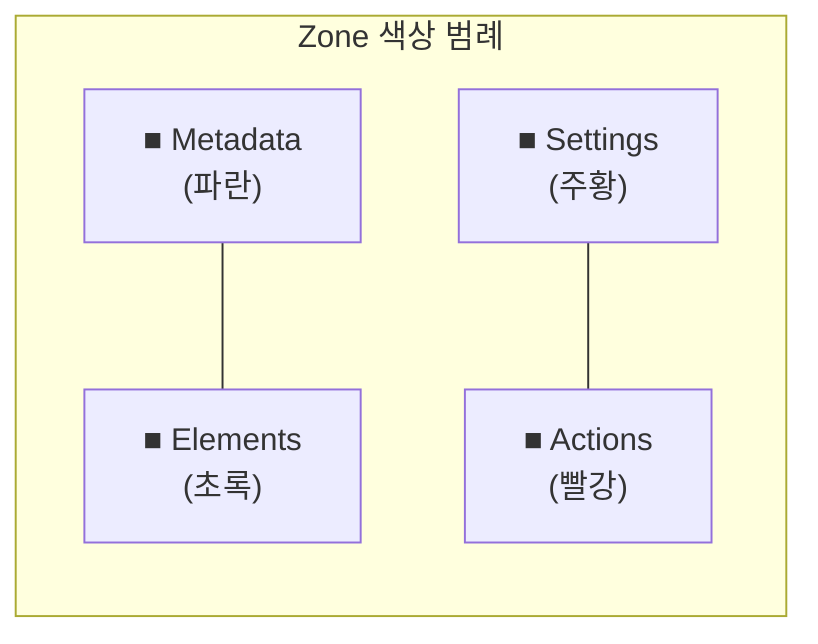

### 6.7 컴포넌트 시각 계층

| 단계 | Quasar 클래스 | 예시 |
|------|---------------|------|
| 섹션 헤더 | `text-subtitle1 text-weight-bold bg-dark-2` | "Text & Font" |
| 라벨 | `text-body2` | "Font Size" |
| 보조 텍스트 | `text-caption text-grey-6` | "px, 8~72" |

## 7장. 정보 계층

| Tier | 접근 | SE에서 | GE에서 |
|:----:|------|--------|--------|
| T1 | 항상 보임 | Element Grid, Text/Font | Canvas, Transform |
| T2 | 1클릭 (접힌 섹션 펼치기) | Cards, Player/Flags | Animation, Text |
| T3 | Advanced (숨김) | — | Background |

### 사용자 레벨별 접근 깊이

| 레벨 | Tier 사용 | 커버리지 | 전형적 작업 |
|------|:---------:|:--------:|------------|
| 초보 | T1만 | 80% | 폰트/색상 변경 |
| 중급 | T1 + T2 | 95% | 카드 표시, 플래그 |
| 전문가 | T1 + T2 + T3 | 100% | 고급 설정 |

---

## Changelog

| 날짜 | 버전 | 변경 내용 | 변경 유형 | 결정 근거 |
|------|------|-----------|----------|----------|
| 2026-03-23 | v3.1.1 | Vanity Text(57, 58) SE 스코프 제거; Confluence 정리 — 구현 상세/외부 문서 참조 31건 제거 | PRODUCT | 불필요 항목 정리 + Confluence 업로드 준비 |
| 2026-03-23 | v3.1.0 | 전면 간결화: 학술/코드/이력 삭제, ADR/구조→부록 이동, 패턴 중복 통합 (~27% 감축) | PRODUCT | 문서 가독성 개선 — 핵심 설계 정보 집중 |
| 2026-03-23 | v3.0.3 | 9.2 공통 5-Zone→4-Zone+ElementList 분리; 10장 HTML 목업 링크 8종 추가 | TECH | Zone 용어 정합성 + 목업 링크 일관성 |
| 2026-03-23 | v3.0.2 | 5~7장 복원 + 8장 취소선 섹션 실제 삭제 (이관 완료 항목 정리) | TECH | 오삭제 복원 + 이관 완료 코드 클린업 |
| 2026-03-23 | v3.0.1 | Part I 맥락 문구 추가(1·3·4장), Part II(설계 원칙)→Part V 후방 이동 | PRODUCT | 표 중심 구조 가독성 개선 + 읽기 흐름 최적화 |
| 2026-03-23 | v3.0.0 | v1(UI-Design) + v2(구현 상세) 통합 문서 신규 작성. 16장 + 부록 5개 구조 | PRODUCT | 두 문서 분리로 인한 참조 혼란 해소 — "왜→무엇→어떻게" 단일 문서화 |
