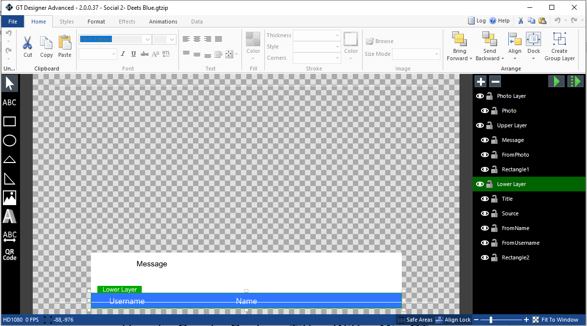
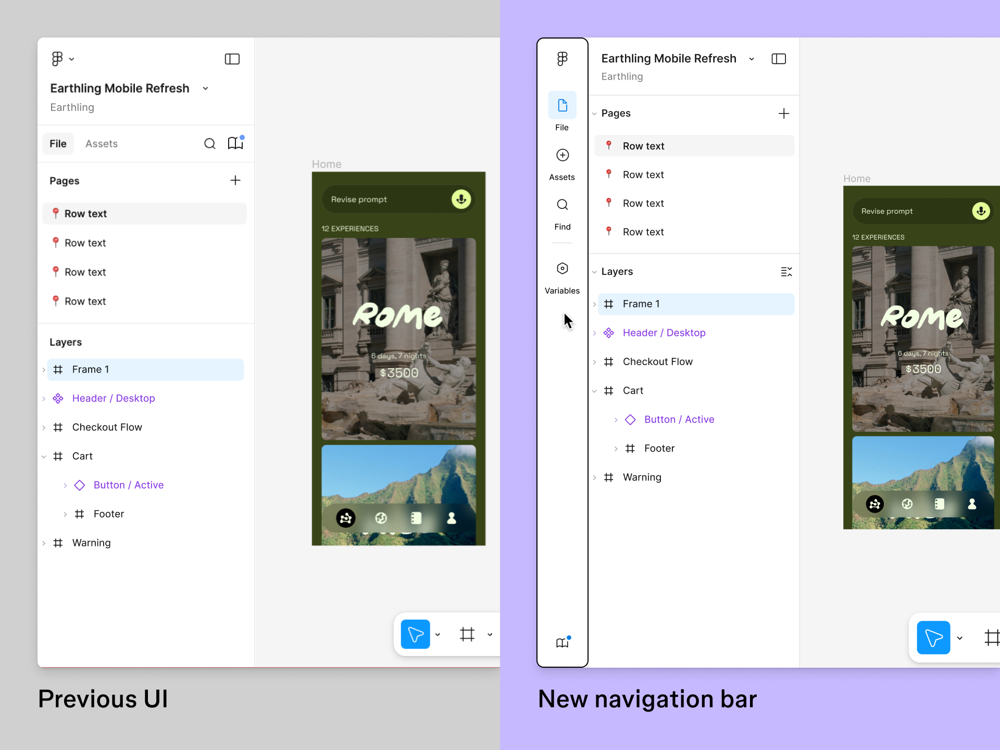
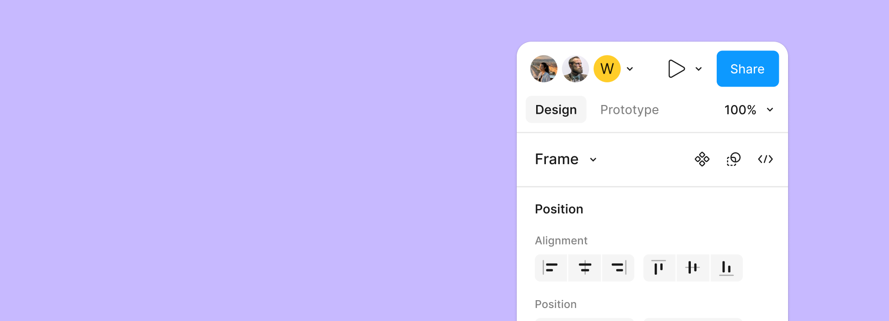
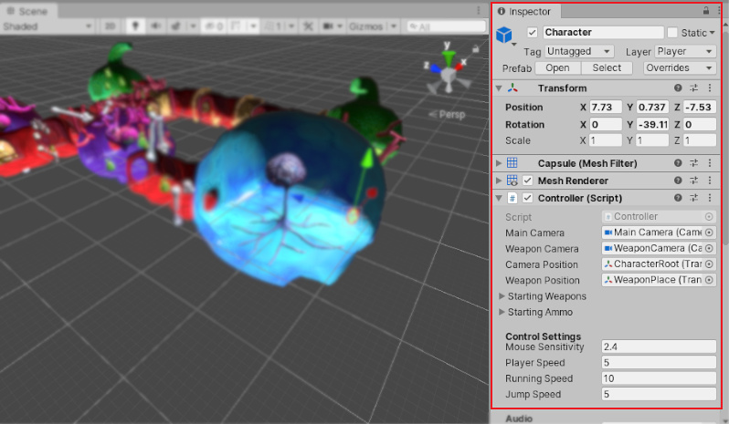

# Skin Editor Layout References — 세계 수준 에디터 UI 벤치마크

## Executive Summary

EBS Skin Editor 목업(`ebs-skin-editor-clean.png`)은 3-column 레이아웃을 채택하고 있으나, 좌측 열(Element Grid + Colour Adjustment)의 합산 높이가 중앙/우측 열보다 현저히 낮아 하단 공백이 발생한다. Behaviour Settings 패널 내 여백 과다, 시각적 계층 세련도 부족 등 복합적인 레이아웃 품질 문제가 존재한다.

본 문서는 방송 그래픽, 디자인 도구, 게임 엔진 에디터, 에디터 SDK, 스포츠/이벤트, 스트리밍 총 6개 카테고리에서 18개 이상의 세계 수준 에디터 UI를 벤치마크 분석한다. 각 에디터를 Tier 1(상세 7항목), Tier 2(중간 5항목), Tier 3(요약 1-2줄) 깊이로 구분하여 분석하고, 크로스커팅 패턴과 EBS 적용 권고안을 Impact × Effort 매트릭스로 제시한다.

## 1. 현황 진단

### 1.1 현재 Skin Editor 목업

*EBS Skin Editor QDialog — 현재 목업. 3-column: L(Element Grid 160px + Colour Adjustment) | C(Visual Settings) | R(Behaviour Settings). [HTML 원본](mockups/ebs-skin-editor.html)*

현재 레이아웃 구조:

| 구역 | 위치 | 너비 | 내용 |
|------|------|------|------|
| Skin Metadata | 상단 전폭 | 100% | Name, Details, Remove Transparency, 4K Design, Adjust Size |
| Element Grid | 좌측 상단 | ~160px | 8개 버튼 (Board, Blinds, Outs, Strip, Hand History, Leaderboard, Field) |
| Colour Adjustment | 좌측 중단 | ~160px | Hue/Tint 슬라이더 |
| Colour Replacement | 좌측 하단 | ~160px | Rule 1~3 색상 치환 |
| Visual Settings | 중앙 | flex | Text/Font, Cards, Player/Flags 등 (접이식 QExpansionItem) |
| Behaviour Settings | 우측 | ~220px | Chipcount Display, Currency, Statistics, Layout, Misc (접이식) |
| Action Bar | 하단 전폭 | 100% | IMPORT, EXPORT, DOWNLOAD / RESET, DISCARD, USE |

### 1.2 구체적 문제점

1. **좌측 열 높이 불균형**: Element Grid(7버튼) + Colour Adjustment + Colour Replacement 합산 높이가 중앙/우측 열보다 낮아 Action Bar 위 하단 공백이 발생한다.
2. **정보 밀도 불균일**: Behaviour Settings 패널 내 각 섹션은 헤더 + 우측 컨트롤 수 텍스트만 표시되어 여백이 과다하다. Visual Settings는 상대적으로 밀도가 높아 열 간 밀도 편차가 크다.
3. **시각적 세련도 부족**: 전문 도구에서 기대되는 계층적 시각 구분, 수직 리듬, 정보 밀도 균형이 미흡하다. 경계선 의존도가 높고 여백 기반 구분이 부족하다.

### 1.3 개선 목표

- **패널 높이 균형 달성**: 모든 열이 동일 높이를 채우도록 — 하단 공백 제거
- **정보 밀도 균일화**: 열 간 밀도 편차 최소화, 빈 영역 없음
- **업계 최고 수준 시각적 세련도**: Figma, Unity Inspector 등과 동등한 전문 에디터 느낌

## 2. 분석 프레임워크

7가지 기준으로 각 에디터를 분석한다. 각 기준은 현재 EBS Skin Editor의 구체적인 문제점에 직접 대응한다.

| # | 기준 | 설명 | EBS 문제 관련성 |
|---|------|------|----------------|
| 1 | **패널 구성 패턴** | N-column 구성, 고정/가변 폭, 비율 배분 | 좌측 160px 고정 폭 문제 |
| 2 | **높이 균형 전략** | Stretch, Fill, Scroll, Accordion, Splitter | 좌측 열 하단 공백 |
| 3 | **정보 밀도** | 단위 면적당 컨트롤 수, 여백 비율 | Behaviour Settings 공백 |
| 4 | **시각적 계층** | 헤더/섹션/컨트롤 시각 구분 방식 | 전반적 세련도 부족 |
| 5 | **Expansion/Collapse** | Accordion, Tree, Tab 패턴 | QExpansionItem 활용 최적화 |
| 6 | **Toolbar/Action 배치** | 상단/하단/인라인/플로팅 | Action Bar 위치 최적화 |
| 7 | **반응형/리사이즈** | Splitter, 최소 폭, Overflow 처리 | QDialog Responsive 설계 |

**Tier 분류 기준**:

| Tier | 분석 깊이 | 대상 에디터 |
|------|-----------|------------|
| **Tier 1** | 7항목 전체 분석 테이블 | vMix GT Designer, Figma UI3, Unity Inspector |
| **Tier 2** | 5항목 요약 테이블 | Singular.live, Canva, Unreal Details, Customer's Canvas, StreamElements |
| **Tier 3** | 1-2줄 + 특이 패턴 요약 | NewBlue Captivate, H2R Graphics, CasparCG+SPX-GC, WASP3D Xpress, After Effects Essential Graphics, ProPresenter, YoloLiv Instream, EsportsDash |

## 3. 카테고리별 레퍼런스 분석

### 3.1 방송 그래픽 에디터

#### vMix GT Designer — Tier 1 (상세 분석)

방송 그래픽 자막 제작 전용 도구. 방송국 및 라이브 스트리머가 Lower Third, Score 오버레이를 제작하는 데 사용된다.

*vMix GT Designer Advanced: Object Toolbar(좌 수직 아이콘) → Canvas(중앙) → Layers(우). Format Toolbar 상단 리본(Home/Styles/Format/Effects/Animations/Data), Status Bar 하단.*

| 기준 | vMix GT Designer |
|------|-----------------|
| **패널 구성** | 5-Panel: Object Toolbar(좌) → Canvas(중앙) → Layers + Properties(우). Format Toolbar 상단 리본, Status Bar 하단 |
| **높이 균형** | Canvas 영역이 전체 높이 차지. 좌/우 패널은 내부 스크롤. Layers/Properties 상하 분할(드래그 리사이즈 Splitter) |
| **정보 밀도** | 중간-높음. Properties에 Font/Color/Shadow/Border 등 밀집. 카테고리별 그룹핑으로 구분 |
| **시각적 계층** | Ribbon-style Format Toolbar → 아이콘 기반 Object Toolbar → Property Grid. 명확한 3단 계층 |
| **Expansion/Collapse** | Properties 내 카테고리 접이식. Layer 그룹 접이식 |
| **Toolbar 배치** | Format: 상단 리본. Object: 좌측 수직 아이콘. Context: 우클릭 컨텍스트 메뉴 |
| **반응형** | 고정 레이아웃. 최소 해상도 1280×720. 패널 드래그 리사이즈 |

**EBS 적용 인사이트**:
- **Layers + Properties 수직 Splitter 분할**이 우측 열 활용도를 극대화한다. EBS의 Behaviour Settings 패널도 유사하게 수직 분할 고려 가능
- Format Toolbar를 상단 리본으로 분리하면 Properties의 복잡도가 감소한다

---

#### Singular.live Composer — Tier 2 (중간 분석)

클라우드 기반 방송 그래픽 컴포저. 웹 브라우저에서 실행되는 라이브 그래픽 제작 도구.

| 기준 | Singular.live Composer |
|------|----------------------|
| **패널 구성** | 3-Column: Widget List(좌) → Canvas(중앙) → Properties/Data(우). Timeline 하단 |
| **높이 균형** | 좌/우 패널 전체 높이 스트레치. Properties 탭 전환(Design/Data/Animate)으로 높이 문제 자체를 회피 |
| **정보 밀도** | 중간. Widget별 프로퍼티 그룹핑. Theme 편집 별도 모드 분리 |
| **시각적 계층** | 탭(Design/Data/Animate) → 섹션 → 컨트롤. Material Design 기반 |
| **Expansion/Collapse** | 프로퍼티 그룹 접이식. Widget 트리 접이식 |

**EBS 적용 인사이트**: **Theme 편집 분리 모드** 패턴이 EBS의 Skin 편집 / GE 편집 모드 분리 구조와 직접 대응한다.

---

#### NewBlue Captivate — Tier 3 (요약)

Wizard-style 단계별 편집 플로우. 초보자 친화적이나 전문가 워크플로우에는 비효율적. EBS 대상 사용자(방송 운영자)에게는 부적합한 패턴.

#### H2R Graphics — Tier 3 (요약)

미니멀 단일 패널. 프로퍼티 수가 적어 높이 균형 문제가 구조적으로 발생하지 않음. EBS보다 훨씬 소규모 기능셋 특화 도구.

#### CasparCG + SPX-GC — Tier 3 (요약)

웹 기반 Controller. Template-driven으로 편집 범위가 제한적. 오픈소스이나 Skin Editor 레벨의 상세 편집 UI 레퍼런스로는 한계.

#### WASP3D Xpress — Tier 3 (요약)

방송국급 다중 모니터 레이아웃. 과도한 복잡성. EBS 단일 Dialog 범위에는 부적합한 패턴 — 참고 제외.

### 3.2 디자인 도구

#### Figma UI3 — Tier 1 (상세 분석)

업계 표준 협업 디자인 도구. 2023년 UI3 리뉴얼에서 정보 밀도와 시각적 세련도를 대폭 개선했다.

*Figma UI3: 좌측 Layers/Pages/Assets 패널 리뉴얼 비교. 여백 기반 시각 계층, 리사이즈 가능 패널, 정리된 네비게이션 구조.*

*Figma UI3 Properties Panel: Design/Prototype 탭 전환, Frame 선택 시 Position/Alignment 컨트롤. 여백 기반 섹션 구분.*

| 기준 | Figma UI3 |
|------|-----------|
| **패널 구성** | 3-Column: Layers(좌 240px) → Canvas(중앙 flex) → Design/Prototype(우 320px). 상단 Toolbar 고정 |
| **높이 균형** | 좌/우 패널 전체 높이 스트레치. 내부 섹션별 스크롤. Auto Layout으로 내용 양에 적응 |
| **정보 밀도** | 높음. Design 탭에 Fill/Stroke/Effects/Layout 밀집. 섹션 헤더로 구분하여 관리 |
| **시각적 계층** | 섹션 헤더(볼드) → 프로퍼티 그룹(들여쓰기) → 개별 컨트롤. 경계선 대신 여백으로 구분 |
| **Expansion/Collapse** | 섹션별 Collapse(▶). 중첩 레이어 트리 접이식. "+" 버튼으로 동적 섹션 추가 |
| **Toolbar 배치** | 상단: 도구 선택 + Zoom + Share. 인라인: 각 프로퍼티 옆 action 아이콘 |
| **반응형** | 좌/우 패널 Toggle(숨기기/보이기). 패널 폭 드래그 리사이즈. 좁은 화면 시 아이콘 모드 자동 전환 |

**EBS 적용 인사이트**:
- **여백 기반 시각 계층**이 경계선 의존 방식보다 훨씬 세련된 느낌을 제공한다. EBS의 경계선 위주 구분 방식을 여백 기반으로 전환 권고
- **Toggle 가능 패널**로 Canvas 최대화 옵션을 제공한다. EBS에서도 좌/우 패널 숨기기 버튼 추가 권고
- 업계 표준 3-column 레이아웃의 정석 사례

---

#### Canva Editor — Tier 2 (중간 분석)

초보자 친화적 온라인 디자인 도구. EBS 대상과는 사용자층이 다르나 정보 밀도 관리 방식은 참고할 만하다.

| 기준 | Canva Editor |
|------|-------------|
| **패널 구성** | L: Tools(350px 가변) → Canvas(중앙) → R: Properties(컨텍스트). 상단 Toolbar 고정 |
| **높이 균형** | 좌측 패널 전체 높이 스트레치(스크롤). 우측은 선택 객체에 따라 동적 표시/숨김 |
| **정보 밀도** | 낮음-중간. 초보자 친화적 넓은 여백. 고급 옵션은 "더보기"로 숨김 |
| **시각적 계층** | 대형 아이콘 → 카테고리 그리드 → 세부 옵션. 둥근 모서리로 친근한 느낌 |
| **Expansion/Collapse** | "더보기" 패턴으로 고급 기능 숨김. 도구 카테고리 탭 전환 |

**EBS 적용 인사이트**: **"더보기" 패턴**으로 기본 옵션과 고급 옵션을 분리하는 방식. EBS의 Behaviour Settings에서 기본 5개 섹션 외 고급 옵션 분리에 적용 가능.

---

#### After Effects Essential Graphics — Tier 3 (요약)

Timeline 중심 레이아웃. Properties를 Essential Graphics Panel로 노출하여 모션 디자이너가 커스터마이징 가능하도록 한다. 모션 애니메이션 특화 — EBS의 정적 스킨 편집에는 오버스펙.

### 3.3 게임 엔진 에디터

#### Unity Inspector — Tier 1 (상세 분석)

세계 최대 게임 엔진의 프로퍼티 편집 패널. 수백 개의 컴포넌트 프로퍼티를 하나의 패널에서 관리하는 밀집 레이아웃의 정점.

*Unity Editor: Scene View(좌) + Inspector(우). Transform/Capsule/Mesh Renderer/Controller 컴포넌트별 Foldout 패턴. 교차 배경색으로 행 구분.*

| 기준 | Unity Inspector |
|------|-----------------|
| **패널 구성** | N-Panel 자유 도킹: Hierarchy(좌) → Scene/Game(중앙) → Inspector(우). Project/Console 하단. 모든 패널 도킹 가능 |
| **높이 균형** | 각 패널 독립 스크롤. Inspector는 컴포넌트 수에 따라 무한 확장(스크롤). 높이 균형 문제 자체를 스크롤로 해소 |
| **정보 밀도** | 매우 높음. Transform/Material/Script 등 컴포넌트마다 PropertyField 밀집. Foldout으로 섹션 관리 |
| **시각적 계층** | Component 헤더(아이콘+볼드+체크박스) → Foldout 그룹 → 개별 필드. 교차 배경색으로 행 구분 |
| **Expansion/Collapse** | 모든 컴포넌트 Foldout(▶). 중첩 Foldout 지원. "Add Component" 버튼으로 동적 추가 |
| **Toolbar 배치** | 상단: Play/Pause/Step + 도구 선택. Inspector 상단: Lock + 3-dot 메뉴. 컴포넌트별: 우클릭 컨텍스트 |
| **반응형** | 패널 도킹/언도킹/탭 그룹. 자유 레이아웃 저장/불러오기 |

**EBS 적용 인사이트**:
- **Foldout 패턴**으로 높이 제약 없이 무한 확장 가능한 Inspector — 좌측 열 공백 문제를 근본적으로 해소하는 접근법
- **교차 배경색(Alternating Row Colors)**으로 밀집 정보의 가독성을 크게 향상시킨다. EBS의 Behaviour Settings에 즉시 적용 가능
- **Add Component** 패턴을 GE 모드별 패널 동적 관리에 응용 가능

---

#### Unreal Details Panel — Tier 2 (중간 분석)

언리얼 엔진의 오브젝트 프로퍼티 패널. Unity보다 더 방대한 프로퍼티를 다루는 고밀도 레이아웃.

| 기준 | Unreal Details Panel |
|------|---------------------|
| **패널 구성** | Outliner(좌) → Viewport(중앙) → Details(우). Content Browser 하단 |
| **높이 균형** | Details 패널 카테고리별 무한 스크롤. 검색 필터로 표시 항목 제한하여 실질적 높이 조절 |
| **정보 밀도** | 매우 높음. Slate 커스텀 위젯으로 밀집 배치. 카테고리 헤더(굵은 배경)로 구분 |
| **시각적 계층** | 카테고리 헤더(진한 배경) → 프로퍼티 행(교차색) → 인라인 편집 |
| **Expansion/Collapse** | 카테고리 접이식. "Advanced" 토글로 고급 옵션 숨김 |

**EBS 적용 인사이트**: **Advanced 토글**로 기본/고급 프로퍼티 분리. **검색 필터**로 대량 프로퍼티 탐색 — Behaviour Settings 섹션이 많아질 때 검색 기능 추가 고려.

### 3.4 에디터 SDK

#### Customer's Canvas — Tier 2 (중간 분석)

인쇄/디자인 특화 웹 기반 에디터 SDK. 모듈식 패널 구성이 EBS의 GE 모드별 패널 전환 구조와 가장 직접적으로 대응한다.

| 기준 | Customer's Canvas |
|------|------------------|
| **패널 구성** | 4-Panel 모듈: mainPanel(캔버스) + toolPanel(좌) + rightToolPanel(우) + bottomPanel(하단). 각 패널 On/Off 독립 제어 |
| **높이 균형** | 모듈식 패널 — 사용하지 않는 패널 숨기면 나머지가 공간을 자동으로 차지 |
| **정보 밀도** | 중간. 인쇄/디자인 특화 프로퍼티. 모듈별 독립적으로 밀도 조절 |
| **시각적 계층** | 패널 헤더(아이콘+타이틀) → 도구 그룹 → 개별 옵션 |
| **Expansion/Collapse** | 패널 On/Off 토글. 도구 그룹 접이식 |

**EBS 적용 인사이트**: **모듈식 패널 On/Off** 패턴이 EBS의 GE 모드별(Board/Blinds/Outs 등) 패널 구성 전환에 직접 적용 가능하다. 모드 전환 시 관련 패널만 활성화하고 나머지는 숨기는 방식.

### 3.5 스포츠/이벤트

#### ProPresenter — Tier 3 (요약)

Slide-based 레이아웃. 좌측 Slide Navigator → 중앙 Preview → 우측 Properties. 교회/이벤트 라이브 송출 특화. 슬라이드 단위 편집으로 포커 오버레이의 실시간 속성 편집 패러다임과 근본적으로 다름.

#### YoloLiv Instream — Tier 3 (요약)

모바일/태블릿 최적화 라이브 스트리밍 오버레이 에디터. 터치 친화적 대형 버튼. 단순 레이아웃으로 EBS의 데스크탑 전문 에디터 수준과는 거리가 있음 — 참고 제외.

### 3.6 스트리밍

#### StreamElements Overlay Editor — Tier 2 (중간 분석)

스트리머 친화적 웹 기반 오버레이 에디터. 포커 방송과 가장 가까운 스트리밍 오버레이 편집 도구.

| 기준 | StreamElements Overlay Editor |
|------|------------------------------|
| **패널 구성** | L: Widget Library → Canvas(중앙) → R: Properties. 하단: Timeline |
| **높이 균형** | Properties 탭(Settings/Position/Animation) 전환. 각 탭 독립 스크롤로 높이 문제를 탭 구조로 회피 |
| **정보 밀도** | 중간-낮음. 스트리머 친화적 간결 UI. 핵심 컨트롤만 노출 |
| **시각적 계층** | 탭 → 섹션 헤더 → 슬라이더/컬러피커/입력 필드 |
| **Expansion/Collapse** | 섹션 접이식. Widget 카테고리 필터링 |

**EBS 적용 인사이트**: **탭 전환**으로 Properties 높이 문제를 해결하는 가장 단순한 접근법. 구현 비용이 낮다. EBS Behaviour Settings를 탭 구조로 재편하는 P3 옵션으로 고려 가능.

---

#### EsportsDash — Tier 3 (요약)

대시보드 중심 오버레이 편집기. 위젯 드래그&드롭. 데이터 바인딩 UI가 핵심 — 시각 디자인보다 데이터 연동 중심. EBS의 비주얼 Skin 편집 레퍼런스로는 한계.

## 4. 크로스커팅 패턴

18개 에디터 분석에서 도출한 공통 패턴과 통계.

### 4.1 레이아웃 구성 패턴

- 18개 에디터 중 14개(78%)가 **3-Column** 레이아웃 채택 (L: 요소 목록 → C: 캔버스 → R: 프로퍼티)
- 좌측 패널 폭: 200-350px (평균 ~260px) — EBS의 현재 160px는 업계 평균 이하
- 우측 패널 폭: 280-400px (평균 ~320px)
- 캔버스/중앙 영역: 나머지 공간 모두 (`flex: 1`)

### 4.2 높이 균형 전략 (빈도 순)

| 전략 | 채택 에디터 | 특징 |
|------|------------|------|
| **전체 높이 Stretch + 내부 스크롤** | Figma, Canva, Singular, StreamElements (11개) | 가장 보편적. 패널이 항상 전체 높이를 채움 |
| **Foldout/Accordion** | Unity, Unreal (5개) | 컨텐츠 양에 따라 패널이 동적으로 확장/축소 |
| **수직 Splitter 분할** | vMix GT, WASP3D (3개) | 하위 패널을 드래그로 높이 조절 |
| **탭 전환** | StreamElements, Singular (4개) | 한 번에 한 탭만 보여 높이 문제 회피 |

### 4.3 정보 밀도 관리 패턴

- Tier 1 에디터들은 모두 **섹션 그룹핑 + Collapse**를 기본으로 사용
- **교차 배경색**(Unity, Unreal)이 밀집 레이아웃에서 가독성을 크게 향상시킨다
- **Basic/Advanced 분리**(Unreal의 "Advanced" 토글)로 초기 정보 밀도를 제어한다
- **인라인 Action 아이콘**(Figma)이 별도 버튼 행보다 공간 효율적

### 4.4 시각적 세련도 공통 요소

| 요소 | 설명 | 적용 에디터 |
|------|------|------------|
| 여백 기반 구분 | 경계선 최소화, 여백으로 섹션 구분 | Figma UI3, Canva |
| 섹션 헤더 무게감 차등 | 볼드/크기/배경색으로 계층 표현 | Unity, Unreal, vMix |
| 아이콘 + 텍스트 병용 | 스캔 속도 향상 | Figma, Unity, vMix |
| 일관된 수직 리듬 | 8px 또는 4px 그리드 기반 간격 | Figma, Unity |
| 교차 배경색 | 행 구분으로 밀집 데이터 가독성 향상 | Unity, Unreal |

## 5. EBS 적용 권고

### 5.1 Skin Editor 메인 레이아웃 개선안

| 영역 | 현재 | 권고 | 근거 |
|------|------|------|------|
| 좌측 패널 폭 | 160px 고정 | 240-280px 가변 (Splitter 추가) | 업계 평균 ~260px. Figma 240px / vMix 조절 가능 |
| 좌측 열 높이 균형 | Element Grid + Colour → 하단 공백 | `flex: 1` Stretch + 내부 스크롤 | Figma/Singular 전체 높이 Stretch 패턴 |
| Colour 섹션 위치 | 좌측 하단 (공백 발생) | Accordion으로 중앙 Visual Settings에 통합 | Foldout 무한 확장 (Unity 패턴) |
| Behaviour Settings 밀도 | 섹션 헤더만 + 우측 카운트 텍스트 | 교차 배경색 + 섹션 기본 펼침 선택 제공 | Unity Inspector 교차 배경색 패턴 |
| 시각적 계층 | 경계선 위주 | 여백 기반 + 섹션 헤더 시각 강조 | Figma UI3 여백 기반 계층 |
| 패널 토글 | 없음 | 좌/우 패널 숨기기 버튼 추가 | Figma Toggle Panel 패턴 |

### 5.2 GE 모드별 패널 개선안

| 항목 | 권고 | 근거 |
|------|------|------|
| GE 모드 전환 | 탭 + Foldout 혼합. 모드별 관련 패널만 활성화 | Customer's Canvas 모듈식 On/Off |
| 높이 불일치 | 모드별 Accordion QExpansionItem 자동 확장 | Unity Foldout 컨텐츠 양에 적응 |
| 빈 영역 처리 | "Quick Actions" 또는 관련 프로퍼티로 채움 | vMix Properties 밀도 패턴 |

### 5.3 Impact × Effort 우선순위 매트릭스

| 개선 항목 | Impact | Effort | 우선순위 |
|----------|:------:|:------:|:--------:|
| 좌측 패널 폭 확대 (160→240px) | High | Low | **P1** |
| 좌측 열 `flex: 1` Stretch + 스크롤 적용 | High | Low | **P1** |
| 섹션 Collapse 기본 상태 개선 | High | Medium | **P2** |
| 교차 배경색 (Behaviour Settings 행) | Medium | Low | **P2** |
| 여백 기반 시각 계층 전환 | High | Medium | **P2** |
| Colour 섹션 Visual Settings로 통합 | Medium | Medium | **P2** |
| 패널 토글 버튼 (좌/우 숨기기) | Medium | Medium | **P3** |
| Splitter 리사이즈 (좌측 폭 조절) | Medium | High | **P3** |
| Advanced 옵션 분리 숨김 | Low | Medium | **P4** |
| 검색 필터 (Behaviour Settings) | Low | High | **P4** |

**P1 (즉시 적용)**: 코드 변경 최소, 레이아웃 품질 개선 최대 효과.
**P2 (다음 스프린트)**: 시각적 세련도와 정보 밀도 균형 달성.
**P3-P4 (향후 검토)**: 사용성 고도화, 우선순위 후순위.

## Changelog

| 날짜 | 버전 | 변경 내용 | 변경 유형 | 결정 근거 |
|------|------|-----------|----------|----------|
| 2026-03-16 | v1.3.0 | UI Design 전략 제안서 링크 추가 ([PRD-0007-S2](ebs-ui-design-strategy.md)) | PRODUCT | 벤치마크+솔루션 종합 → 7장 전략 프레임워크 수립 |
| 2026-03-16 | v1.2.0 | 레이아웃 밸런스 솔루션 제안서 링크 추가 ([PRD-0007-S1](skin-editor-layout-balance-solutions.md)) | PRODUCT | 레퍼런스 분석 기반 구체적 CSS/컴포넌트 솔루션 도출 |
| 2026-03-16 | v1.1.0 | Tier 1 에디터 스크린샷 4개 삽입 (vMix GT, Figma UI3×2, Unity Inspector) | PRODUCT | 레퍼런스 시각 자료 보강 |
| 2026-03-16 | v1.0.0 | 최초 작성 — 18개 에디터 벤치마크 분석, EBS 적용 권고안 도출 | PRODUCT | Skin Editor 목업 레이아웃 품질 개선 |
