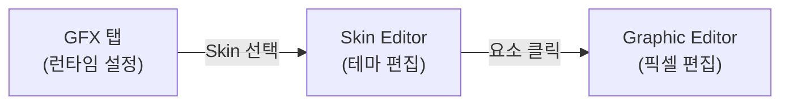
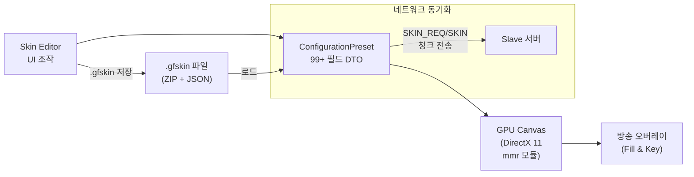
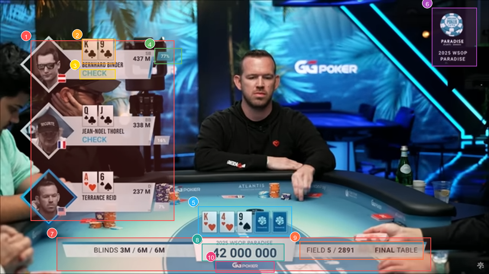
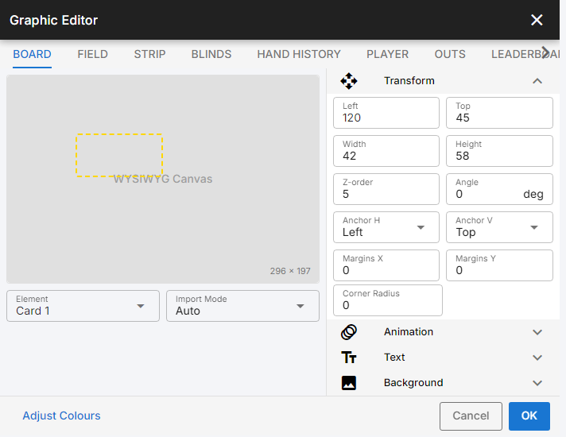
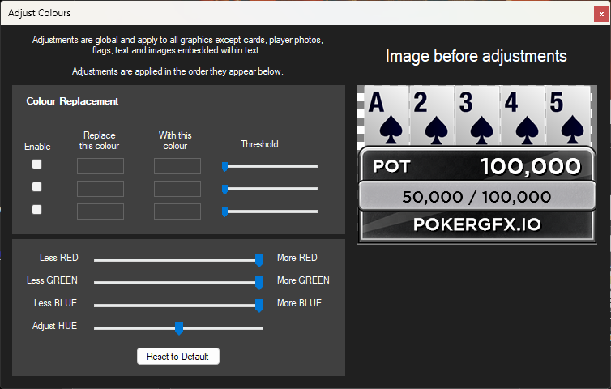
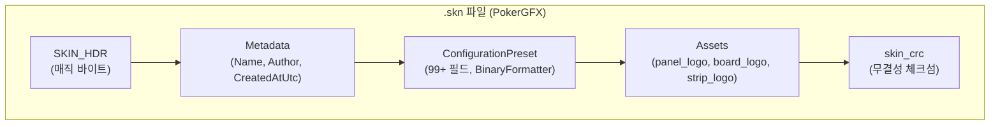
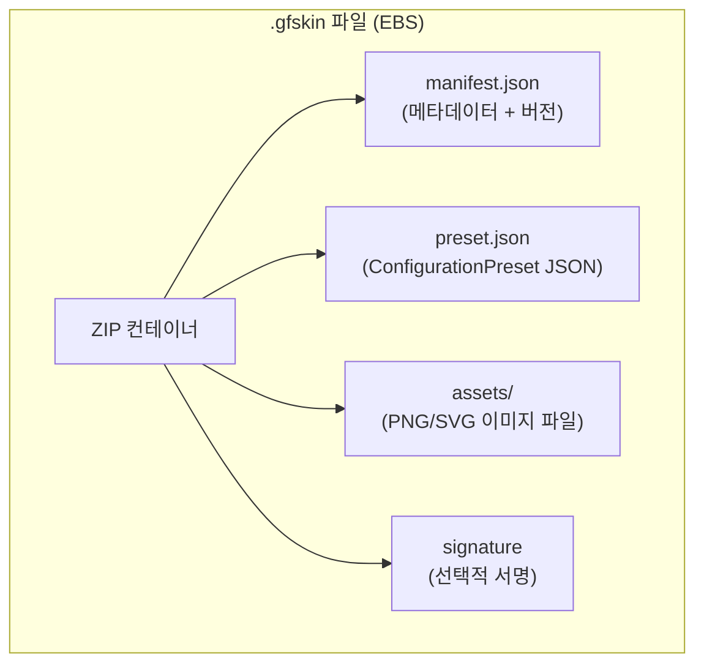
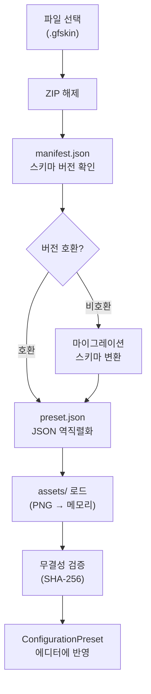
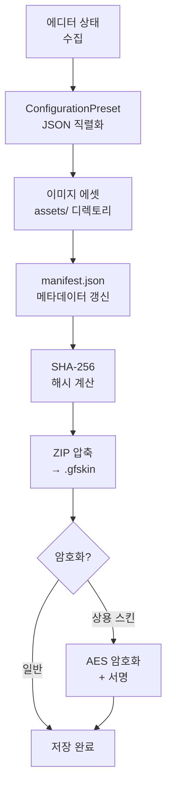

# EBS Skin Editor PRD

> **Version**: 3.1.0 | **Date**: 2026-03-12
> **상위 문서**: [EBS PRD v29.3.0](../PokergfxPrdV2.md) | **문서 ID**: PRD-0005
> **Google Docs**: (동기화 예정)

## 스냅샷 목차 (총 1,809줄)

| Part | 섹션 | 라인 |
|------|------|-----:|
| **I 스킨 시스템 개요** | 1 스킨이란 · 2 파이프라인 · 3 시나리오 | L32~117 |
| **II 오버레이 시각 구조** | 4 해부도 · 5 Impact Map | L118~217 |
| **III Skin Editor 화면 분석** | 6~12 메인 윈도우 + 4개 설정 영역 | L218~496 |
| **IV Graphic Editor 화면 분석** | 13~21 Board/Blinds/Outs/HH/LB/Ticker/Player/Field/Strip/공통 | L497~1239 |
| **V 데이터 구조** | .gfskin ZIP 포맷, JSON Schema | L1240~ |

> 역할: Editor 설정 → Overlay 영향 매핑이 핵심. Part II가 전체 기준점.

## Executive Summary

Skin Editor는 라이브 포커 방송의 **시각적 테마 전체**를 편집하는 도구다. 운영자는 Skin Editor에서 색상, 폰트, 레이아웃, 카드 이미지, 애니메이션을 설정하고, 그 결과가 방송 오버레이에 실시간으로 반영된다. 본 PRD는 "에디터에서 무엇을 바꾸면 방송 화면에서 무엇이 변하는가?"를 시각적으로 추적할 수 있도록 구성되었다.

**핵심 설계 축**: Editor 설정 → Overlay 출력 시각적 매핑. Part II(오버레이 해부도 + Impact Map)가 문서 전체의 기준점이다.

**PokerGFX → EBS 전환 요약**:
- 파일 포맷: `.skn`(AES+binary) → `.gfskin`(ZIP+JSON) 개방형
- 에디터 통합: Board/Player 별도 Graphic Editor → 단일 에디터 모드 전환
- 암호화: 강제 AES → 선택적 (상용 스킨만)

## 문서 범위 및 관계

| 관계 | 문서 | 설명 |
|------|------|------|
| **상위** | [EBS PRD v29.3.0](../PokergfxPrdV2.md) | 부록 B 요구사항 ID (SK-001~SK-016, GEB-001~GEB-015, GEP-001~GEP-015) |
| **UI 설계** | [pokergfx-ui-screens.md](pokergfx-ui-screens.md) | SK-01~SK-26, GE-01~GE-18 요소 카탈로그 |
| **UI 개요** | [pokergfx-ui-overview.md](pokergfx-ui-overview.md) | VO-001~014 오버레이 요소 정의 |
| **역공학** | [pokergfx-reverse-engineering-complete.md](../02-design/pokergfx-reverse-engineering-complete.md) §11 | 스킨 시스템 원본 분석 |
| **기술 설계** | [pokergfx.design.md](../02-design/features/pokergfx.design.md) | HOW — 구현 아키텍처 |

본 문서는 **WHAT/WHY**(무엇을, 왜)에 집중한다. 구현 상세(HOW)는 기술 설계 문서를 참조한다.

---

# Part I: 스킨 시스템 개요

## 1. 스킨이란 무엇인가

**스킨(Skin)**은 방송 오버레이의 시각적 테마를 정의하는 단일 패키지다. 하나의 스킨 파일에는 다음이 포함된다:

| 구성 요소 | 예시 | 영향 범위 |
|-----------|------|----------|
| **레이아웃 좌표** | Player Panel L=40, T=53 | 오버레이 요소 위치/크기 |
| **폰트 설정** | Font 1: Gotham, All Caps | 모든 텍스트 렌더링 |
| **이미지 에셋** | Board 배경, 카드 PIP, 국기 | 그래픽 요소 외형 |
| **애니메이션** | Transition In: Pop 500ms | 등장/퇴장 연출 |
| **색상 조정** | Hue +10, Tint R=0.8 | 전체 색감 |
| **메타데이터** | Name: "Titanium", Author | 스킨 관리 |

**사용 시점**: 방송 전날 또는 며칠 전 사전 준비 단계. 본방송 중에는 스킨을 변경하지 않는다.

**에디터 계층 구조**:



변경 빈도: GFX(방송마다) > Skin(시즌마다) > Graphic(디자인 변경 시). 빈도가 낮을수록 접근이 깊다.

## 2. 에디터 → 오버레이 파이프라인

Skin Editor에서 설정한 값이 방송 화면에 도달하는 전체 경로:



| 단계 | 입력 | 출력 | 지연 |
|------|------|------|------|
| 1. UI 조작 | 운영자 클릭/입력 | ConfigurationPreset 필드 갱신 | 즉시 |
| 2. 직렬화 | ConfigurationPreset | .gfskin (ZIP+JSON) | ~100ms |
| 3. GPU 렌더링 | ConfigurationPreset | DirectX 11 텍스처 | ~16ms (60fps) |
| 4. 합성 출력 | Fill & Key 채널 | NDI/SDI 스트림 | ~1 frame |

## 3. 사용자 시나리오

### 시나리오 A: 신규 이벤트 스킨 제작

> "WSOP 2026 메인 이벤트용 스킨을 처음부터 만들어야 한다"

1. Skin Editor 열기 → Name: "WSOP 2026 Main Event"
2. 요소 버튼 Grid에서 **Board** 클릭 → Graphic Editor에서 Board 배경 이미지 교체, POT 텍스트 위치/크기 조정
3. **Player** 버튼 → Player Panel 배경, 이름/스택/액션 폰트 색상 변경
4. Cards 섹션에서 커스텀 카드 PIP 이미지 Import
5. Font 1/2를 이벤트 전용 폰트로 교체
6. **Export** → `wsop-2026-main.gfskin` 저장
7. 팀원에게 파일 공유 → 상대방 **Import**로 로드

### 시나리오 B: 기존 스킨 미세 조정

> "Titanium 스킨에서 Player Panel 위치만 약간 아래로 내리고 싶다"

1. Skin Editor에서 Titanium 스킨 로드
2. 요소 버튼 **Player** → Graphic Editor
3. Transform에서 Top 값 53 → 70으로 변경 (오버레이에서 Player Panel이 17px 아래로 이동)
4. OK → **Use**로 즉시 적용, 프리뷰에서 확인

### 시나리오 C: 색상 테마 일괄 변경

> "전체 오버레이 색감을 따뜻한 톤으로 바꾸고 싶다"

1. Skin Editor > Adjustments > **Adjust Colours** 클릭
2. Hue 슬라이더로 전체 색상 시프트
3. Tint R/G/B로 따뜻한 톤 적용
4. 모든 오버레이 요소(Player Panel, Board, Blinds 등)에 일괄 반영

---

# Part II: 오버레이 시각 구조

## 4. 방송 오버레이 해부도

방송 화면에 렌더링되는 오버레이는 **10개 독립 요소**로 구성된다. 각 요소는 Skin Editor의 설정에 의해 외형이 결정된다.

**참조 이미지**:
- 실제 방송 캡처: 
- 주석 해부도: 
- 좌표 데이터: [`overlay-anatomy-coords.json`](data/overlay-anatomy-coords.json) v1.7

| ID | 요소 | 설명 | GFX 타입 | 프로토콜 |
|:--:|------|------|----------|----------|
| 1 | **Player Info Panel** | 플레이어 정보 패널 (이름, 칩, 국적, 사진) 세로 스택 | Text + Image | SHOW_PANEL |
| 2 | **홀카드 표시** | 플레이어 패널 우상단 홀카드 (Broadcast Canvas 전용) | Image (PIP) | DELAYED_FIELD_VISIBILITY |
| 3 | **Action Badge** | 플레이어 액션 배지 (CHECK/FOLD/RAISE 등) | Text + Border | FIELD_VISIBILITY |
| 4 | **승률 바** | 패널 하단 실시간 승률 (Monte Carlo, 500ms 갱신) | Border + Text | FIELD_VISIBILITY |
| 5 | **커뮤니티 카드** | 테이블 중앙 커뮤니티 카드 (PIP 렌더링) | Image (PIP) | SHOW_PIP |
| 6 | **이벤트 배지** | 우측 상단 이벤트/스폰서 배지 | Text + Image | FIELD_VISIBILITY |
| 7 | **Bottom Info Strip** | 하단 전체 폭 정보 스트립 (BLINDS, POT, FIELD 등) | Text + Border | SHOW_STRIP |
| 8 | **팟 카운터** | 하단 중앙 팟 금액 표시 | Text | FIELD_VISIBILITY |
| 9 | **FIELD / 스테이지** | 하단 우측 FIELD 카운터 + 스테이지 배지 | Text | FIELD_VISIBILITY |
| 10 | **스폰서 로고** | 하단 스트립 중앙 스폰서 로고 | Image | GFX_ENABLE |

> **읽기 가이드**: 이후 Part III~VII의 모든 설정 설명은 "이것이 위 10개 요소 중 어디에 영향을 주는가?"로 수렴한다. 각 섹션에서 `→ 오버레이 #N` 태그로 대응 요소를 표기한다.

## 5. Impact Map: 설정 → 오버레이 영향 매핑

**이 테이블이 문서의 핵심이다.** Skin Editor의 모든 설정 그룹이 10개 오버레이 요소에 미치는 영향을 교차 매핑한다.

### 5.1 설정 그룹 → 오버레이 요소 매트릭스

범례: ● 직접 영향 | ○ 간접 영향 | — 무관

| Skin Editor 설정 그룹 | #1 Player Panel | #2 홀카드 | #3 Action Badge | #4 승률 바 | #5 커뮤니티 카드 | #6 이벤트 배지 | #7 Bottom Strip | #8 팟 카운터 | #9 FIELD | #10 스폰서 로고 |
|:---|:---:|:---:|:---:|:---:|:---:|:---:|:---:|:---:|:---:|:---:|
| **메타데이터** (SK-01~05) | — | — | — | — | — | — | — | — | — | — |
| **Board 요소** (SK-06→Board) | — | — | — | — | ● | — | — | ● | — | — |
| **Blinds 요소** (SK-06→Blinds) | — | — | — | — | — | — | ● | — | — | — |
| **Outs 요소** (SK-06→Outs) | — | — | — | ○ | — | — | — | — | — | — |
| **Strip 요소** (SK-06→Strip) | — | — | — | — | — | — | ● | — | ● | ● |
| **Hand History** (SK-06→History) | — | — | — | — | — | — | — | — | — | — |
| **Action Clock** (SK-06→Clock) | — | — | ○ | — | — | — | — | — | — | — |
| **Leaderboard** (SK-06→Ldrbd) | — | — | — | — | — | — | — | — | — | — |
| **Field** (SK-06→Field) | — | — | — | — | — | — | — | — | ● | — |
| **텍스트/폰트** (SK-07~10) | ● | — | ● | ● | — | ● | ● | ● | ● | — |
| **카드 이미지** (SK-11~13) | — | ● | — | — | ● | — | — | — | — | — |
| **Player 설정** (SK-14~17) | ● | ● | ● | ● | — | — | — | — | — | — |
| **국기 설정** (SK-18~20) | ● | — | — | — | — | — | — | — | — | — |
| **색상 조정** (Adjust Colours) | ● | ● | ● | ● | ● | ● | ● | ● | ● | ● |
| **GE Transform** (LTWH, Z, Anchor) | ● | ● | ● | ● | ● | ● | ● | ● | ● | ● |
| **GE 애니메이션** (In/Out) | ● | — | ● | — | ● | — | ● | — | — | — |

### 5.2 Impact Map 상세: 설정 → 변화 내용

| Skin Editor 설정 | 영향받는 오버레이 요소 | 변화 내용 |
|:---|:---|:---|
| SK-01 Name / SK-02 Details | 없음 (메타데이터) | 스킨 파일 내 식별 정보만 변경 |
| SK-03 Remove Transparency | 전체 | 크로마키 모드에서 반투명 픽셀 제거 |
| SK-04 4K Design | 전체 | Graphic Editor 좌표계 1920×1080 ↔ 3840×2160 전환 |
| SK-05 Adjust Size | 전체 | 스킨 전체 스케일 팩터 변경 |
| SK-06 Board → GE | #5 커뮤니티 카드, #8 팟 카운터 | Board 배경 이미지, 카드 배치 좌표, POT 텍스트 위치/크기 |
| SK-06 Blinds → GE | #7 Bottom Strip | Blinds 배경, 금액/메시지 텍스트 위치 |
| SK-06 Outs → GE | (별도 Outs 패널) | Outs 카드 배치, 이름/숫자 텍스트 |
| SK-06 Strip → GE | #7 Bottom Strip, #9 FIELD, #10 스폰서 로고 | Strip 배경, 이름/카운트/포지션 텍스트, VPIP/PFR 통계 |
| SK-06 Field → GE | #9 FIELD | Field 배경, 총/잔여 인원 텍스트 |
| SK-07 All Caps | #1,#3,#4,#7,#8,#9 (모든 텍스트) | 전체 텍스트 대문자 변환 |
| SK-08 Reveal Speed | #1,#3 (텍스트 애니메이션) | 텍스트 등장 타이핑 효과 속도 |
| SK-09 Font 1/2 | 모든 텍스트 요소 | 1차/2차 폰트 패밀리 + 스타일 변경 |
| SK-11~13 Card Images | #2 홀카드, #5 커뮤니티 카드 | 카드 PIP 이미지 (4수트 × 13랭크 + 뒷면) |
| SK-14 Variant | #1 Player Panel, #2 홀카드 | 게임 타입별 카드 장수 (Hold'em 2장, Omaha 4장 등) |
| SK-15~16 Player Set | #1 Player Panel | 게임별 Player 에셋 세트 (배경, 상태 이미지) |
| SK-17 Crop to Circle | #1 Player Panel | 플레이어 사진 원형 마스크 적용/해제 |
| SK-18~20 Flags | #1 Player Panel | 국기 아이콘 표시 모드, 이미지, 자동 숨김 |
| Adjust Colours (Hue/Tint) | **전체 10개 요소** | 색상 시프트 + RGB 틴트 일괄 적용 |
| GE Transform (LTWH) | 개별 요소 | 해당 요소의 위치/크기 변경 |
| GE Z-order | 개별 요소 | 레이어 겹침 순서 변경 |
| GE Animation In/Out | 개별 요소 | 등장/퇴장 전환 효과 + 속도 |
| GE Text (Font/Color/Align) | 텍스트 포함 요소 | 개별 텍스트 서브요소 스타일 |
| GE Background Image | 개별 요소 | 요소별 배경 이미지 교체 |

### 5.3 역방향 추적: 오버레이 요소 → 관련 설정

"이 오버레이 요소를 바꾸려면 어디를 편집해야 하는가?"

| 오버레이 요소 | Skin Editor 진입 경로 |
|:---|:---|
| #1 Player Info Panel | SK-06→Player 버튼 → GE (배경/좌표) + SK-09 (폰트) + SK-14~17 (Variant/Set/Crop) + SK-18~20 (국기) |
| #2 홀카드 표시 | SK-11~13 (카드 이미지) + SK-06→Player→GE `cards_rect` (좌표) + SK-14 (Variant = 카드 장수) |
| #3 Action Badge | SK-06→Player→GE `action` 서브요소 (좌표/폰트/색상) |
| #4 승률 바 | SK-06→Player→GE `odds` 서브요소 (좌표/폰트/색상) |
| #5 커뮤니티 카드 | SK-06→Board→GE `board_cards_rect` (좌표) + SK-11~13 (카드 이미지) |
| #6 이벤트 배지 | SK-06→Panel→GE (배경/텍스트) — Panel 요소로 제어 |
| #7 Bottom Info Strip | SK-06→Strip→GE (배경/텍스트) + SK-06→Blinds→GE (Blinds 영역) + SK-06→Ticker→GE |
| #8 팟 카운터 | SK-06→Board→GE `board_pot` 서브요소 (좌표/폰트) |
| #9 FIELD / 스테이지 | SK-06→Field→GE (배경/텍스트) + SK-06→Strip→GE (Strip 내 위치) |
| #10 스폰서 로고 | SK-06→Strip→GE `strip_logo` (이미지/좌표) |

---

# Part III: Skin Editor 화면 분석 (스크린샷 기반)

## 6. 전체 뷰 — Skin Editor 메인 윈도우

**스크린샷**: 

Skin Editor는 GFX 탭에서 진입하는 **모달 창**이다. PokerGFX skin_edit.cs에서 확인된 컨트롤: 94개 (37개 의미 있는 UI 요소 + 57개 레이블/패널/구분자). 수동 스크린샷 + UI Automation 트리(`data/skin-editor-ui-tree.json`)로 교차 검증 완료.

### 화면에서 보이는 것

스크린샷에서 Skin Editor는 **4구역**으로 분할된다:

| 구역 | 위치 | 포함 UI 요소 | 대응 섹션 |
|:----:|------|-------------|:---------:|
| **① 스킨 정보** | 최상단 | Name, Details, Remove Transparency, 4K, Adjust Size | §7 |
| **② 요소 버튼 Grid + 색상** | 좌측 중앙 | Elements(10개 버튼), Adjustments(Adjust Size, Adjust Colours 안내) | §8, §12 |
| **③ 설정 영역** | 우측 중앙 | Cards, Flags, Player, Text/Font | §9~§11 |
| **④ 액션 바** | 최하단 | IMPORT, EXPORT, SKIN DOWNLOAD CENTRE, RESET, DISCARD, USE | §12 |

### 오버레이 영향

Skin Editor 자체는 오버레이에 직접 렌더링하지 않는다. 모든 시각적 변경은 **개별 설정 그룹**(§7~§12)을 통해 ConfigurationPreset → GPU Canvas → 오버레이로 전파된다. Part II §5 Impact Map이 전체 매핑의 기준점이다.

## 7. ① 스킨 메타데이터 — 스킨 식별 + 글로벌 옵션

**스크린샷 영역**:  — 최상단 행

### 화면에서 보이는 것

| 영역 | UI 요소 | 현재 값 (스크린샷) | 설명 |
|------|---------|-------------------|------|
| 좌상단 | **Name** TextBox | "Titanium" | 스킨 이름 |
| 좌상단 | **Details** TextBox | "Modern, layered skin with neutral colours. Titanium is the default sk..." | 스킨 설명 (잘림) |
| 우상단 | **Remove Partial Transparency when Chroma Key Enabled** CheckBox | ☐ (미체크) | 크로마키 모드 반투명 픽셀 제거 |
| 우상단 | **Designed for 4K (3840 x 2160)** CheckBox | ☐ (미체크) | 스킨 좌표계 선언 (1080p vs 4K) |
| 좌측 | **Adjust Size** TrackBar | 중앙 (기본) | 스킨 전체 스케일 팩터 |

### 오버레이 영향

| 설정 변경 시 | → 오버레이 요소 | 변화 내용 |
|-------------|:---:|----------|
| Name / Details 변경 | 없음 | 메타데이터만 변경 (파일 식별용) |
| Remove Transparency 체크 | → 전체 (#1~#10) | 모든 이미지 에셋의 partial alpha → 0 또는 255 양자화 |
| 4K Design 체크 | → 전체 (#1~#10) | Graphic Editor 좌표계가 1920×1080 → 3840×2160 전환 |
| Adjust Size 이동 | → 전체 (#1~#10) | 모든 요소 크기에 비례 스케일 적용 |

### skin_type 매핑

| UI 컨트롤 | skin_type 필드 | 타입 |
|-----------|----------------|------|
| Name | `name` | string |
| Details | `details` | string |
| Remove Transparency | `remove_partial_alpha` | bool |
| 4K Design | `video_lines` (1080 or 2160) | int |
| Adjust Size | `scale_factor` | float |

## 8. ② 요소 버튼 Grid — Graphic Editor 진입점

**스크린샷 영역**:  — 좌측 중앙 "Elements" 영역

### 화면에서 보이는 것

스크린샷에서 "Elements" 라벨 아래 **10개 버튼**이 4열 × 3행 Grid로 배치되어 있다:

| 행 | 1열 | 2열 | 3열 | 4열 |
|:--:|-----|-----|-----|-----|
| 1 | Board | Blinds | Outs | Strip |
| 2 | Hand History | Action Clock | Leaderboard | — |
| 3 | Split Screen Divider | Ticker | Field | — |

각 버튼 클릭 시 해당 요소의 **Graphic Editor**(§13~§20)가 별도 창으로 열린다. **예외**: Ticker → Ticker Editor(§18) 별도 모달.

### 오버레이 영향

| 버튼 클릭 | → Graphic Editor | → 오버레이 요소 | 주요 편집 대상 |
|----------|:---:|:---:|---|
| **Board** | §13 | #5 커뮤니티 카드, #8 팟 카운터 | Board 배경, 카드 배치 좌표, POT 텍스트 |
| **Blinds** | §21.1 | #7 Bottom Strip | Blinds 배경, 금액/메시지 텍스트 |
| **Outs** | §15 | (별도 패널) | Outs 카드 배치, 이름/숫자 |
| **Strip** | §20.5 | #7, #9, #10 | Score Strip 배경, 통계 텍스트 |
| **Hand History** | §16 | (별도 패널) | History 패널 배경/텍스트 |
| **Action Clock** | (GE) | (오버레이) | 액션 타이머 배경/카운트 |
| **Leaderboard** | §17 | (별도 패널) | Leaderboard 배경, 헤더/컬럼 |
| **Split Screen Divider** | (GE) | (레이아웃) | 헤드업 분할선 이미지 |
| **Ticker** | §18 (모달) | #7 | 하단 티커 스크롤 텍스트 |
| **Field** | §20 | #9 | Field 카운터 배경, 인원 텍스트 |

### 요소별 Element 드롭다운 서브요소 (스크린샷 확인)

각 요소 버튼으로 Graphic Editor를 열면, Element 드롭다운에 아래 서브요소가 나타난다. 이 목록은 2026-03-10 스크린샷에서 실제 확인된 항목이다. Strip 서브요소는 skin_type.cs 필드 매핑에서 확인 (§20.5 참조).

| 요소 버튼 | Element 드롭다운 서브요소 | 확인 스크린샷 |
|-----------|--------------------------|:---:|
| **Board** | Card 1~5, Sponsor Logo, PokerGFX.io, 100,000, Pot, Blinds, 50,000/100,000, Hand, 123, Game Variant | 120857 |
| **Blinds** | Blinds, 50,000/100,000, Hand, 123 | 121113 |
| **Outs** | Card 1, Name, # Outs | 121137 |
| **Hand History** | Pre-Flop, Name, Action | 121152 |
| **Leaderboard** | Player Photo, Player Flag, Sponsor Logo, Title, Left, Centre, Right, Footer, Event Name | 121237 (부록 A 참조) |
| **Strip** | Name, Count, Position, VPIP, PFR, Logo | §20.5 (skin_type 매핑) |
| **Field** | Total, Remain, Field | 121312 |
| **Player** | (Player Set별 — Card 1~N, Name, Action, Stack, Odds, Position, Photo, Flag) | 180728 |

## 9. ③-a 텍스트/폰트 설정 — 전역 텍스트 속성

**스크린샷 영역**:  — 좌측 하단 "Text" 영역

### 화면에서 보이는 것

| 영역 | UI 요소 | 현재 값 (스크린샷) | 설명 |
|------|---------|-------------------|------|
| Text 행 | **Text All Caps** CheckBox | ☑ (체크) | 전체 텍스트 대문자 변환 |
| Text 행 | **Text Reveal Speed** TrackBar | 좌측 (느림) | 텍스트 등장 타이핑 효과 속도 |
| Font 1 행 | **Font 1** TextBox + [...] 버튼 | "Gotham" | 1차 폰트 (주 텍스트) |
| Font 2 행 | **Font 2** TextBox + [...] 버튼 | "Gotham" | 2차 폰트 (보조 텍스트) |
| Font 2 행 | **Language** 버튼 | — | 다국어 텍스트 설정 |

### 오버레이 영향

| 설정 변경 시 | → 오버레이 요소 | 변화 내용 |
|-------------|:---:|----------|
| All Caps 토글 | → #1,#3,#4,#7~#9 (모든 텍스트) | 전체 텍스트 대문자 ↔ 원본 케이스 전환 |
| Reveal Speed 이동 | → #1,#3 텍스트 애니메이션 | 텍스트 등장 타이핑 효과 속도 변경 |
| Font 1 변경 | → 모든 텍스트 요소 | 1차 폰트 일괄 변경 (Player 이름, POT, BLINDS 등) |
| Font 2 변경 | → 보조 텍스트 요소 | 2차 폰트 일괄 변경 |

**Before/After 예시**: Font 1을 "Gotham"에서 "Montserrat"로 변경하면 → Player Panel(#1)의 이름/스택, Action Badge(#3) 텍스트, Bottom Strip(#7)의 BLINDS/POT 등 모든 1차 폰트 텍스트가 일괄 변경된다.

### skin_type 매핑

| UI 컨트롤 | skin_type 필드 | 타입 |
|-----------|----------------|------|
| All Caps | `all_caps` | bool |
| Reveal Speed | `text_effect_speed` | int |
| Font 1 | `font_family_name`, `font_family`, `font_style` | string, byte[], FontStyle |
| Font 2 | `font_family_name2`, `font_family2`, `font_style2` | string, byte[], FontStyle |
| Language | `lang` | List\<string\> |

## 10. ③-b 카드 설정 — 카드 PIP 이미지 관리

**스크린샷 영역**:  — 우상단 "Cards" 영역

### 화면에서 보이는 것

| 영역 | UI 요소 | 현재 값 (스크린샷) | 설명 |
|------|---------|-------------------|------|
| 카드 미리보기 | **Card Preview** | A♠ A♥ A♦ A♣ + 뒷면(검정) | 4수트 + 뒷면 미리보기 |
| 카드 드롭다운 | **Card Set** ComboBox | (첫 번째 세트 선택) | `as ah ad ac xx` 패턴 |
| 버튼 행 | **Add** / **Replace** / **Delete** 버튼 | — | 카드 이미지 관리 (수트별 13랭크) |
| 하단 | **Import Card Back** 버튼 | — | 카드 뒷면 이미지 교체 |
| 하단 | **Override Card Set** CheckBox | ☐ (미체크) | 카드 세트 오버라이드 토글 |

### 오버레이 영향

| 설정 변경 시 | → 오버레이 요소 | 변화 내용 |
|-------------|:---:|----------|
| Card Set 교체 | → #2 홀카드, #5 커뮤니티 카드 | 카드 PIP 이미지 전체 변경 (4수트 × 13랭크) |
| Import Card Back | → #2 홀카드 (뒷면) | 카드 뒷면 이미지 교체 |
| Override Card Set | → #2, #5 | 기본 세트 대신 오버라이드 세트 적용 |

### skin_type 매핑

| UI 컨트롤 | skin_type 필드 | 타입 |
|-----------|----------------|------|
| Card Preview | `card_image` (byte[][]), `card_image_black`, `card_image_xx` | byte[][] |
| Add/Replace/Delete | `ai_card_image` (List\<asset_image\>), `ai_card_image_set` | List |
| Import Card Back | `card_image_xx`, `card_image_rabbit` | byte[] |
| Override Card Set | `card_image_set_num`, `card_image_set_override` | int, bool |

## 11. ③-c 플레이어/플래그 설정 — Player Panel 외형 결정

**스크린샷 영역**:  — 우측 하단 "Player" + "Flags" 영역

### 화면에서 보이는 것

| 영역 | UI 요소 | 현재 값 (스크린샷) | 설명 |
|------|---------|-------------------|------|
| **Player** 섹션 | | | |
| Variant | **Variant** ComboBox | "HOLDEM (2 Cards)" | 게임 타입 → 카드 장수 결정 |
| | "Uses" 라벨 | — | Variant가 사용하는 Player Set 연결 |
| Player Set | **Player Set** ComboBox | "2 Card Games" | 게임별 Player 에셋 세트 |
| | **Edit** / **New** / **Delete** 버튼 | — | Player Set 관리 (Edit → Graphic Editor §19) |
| | **Override Card Set** CheckBox | ☐ | 카드 세트 오버라이드 |
| | **Crop player photo to circle** CheckBox | ☐ | 플레이어 사진 원형 마스크 |
| **Flags** 섹션 | | | |
| | **Country flag does not force player photo mode** CheckBox | ☑ (체크) | 국기 독립 표시 모드 |
| | **Edit Flags** 버튼 | — | 국기 이미지 편집 |
| | **Hide flag after** NumericUpDown + "S (0=Do not hide)" | 0.0 | N초 후 국기 자동 숨김 |

### 오버레이 영향

| 설정 변경 시 | → 오버레이 요소 | 변화 내용 |
|-------------|:---:|----------|
| Variant 변경 (예: HOLDEM→OMAHA) | → #1 Player Panel, #2 홀카드 | 카드 장수 2장→4장, Player Panel 크기 조정 |
| Player Set 변경 | → #1 Player Panel | 배경 이미지, 폰트, 좌표 세트 전체 교체 |
| Edit → Graphic Editor | → #1 Player Panel | Player 배경/좌표/애니메이션 세부 편집 (§19) |
| Crop to Circle 토글 | → #1 Player Panel | 플레이어 사진 사각→원형 마스크 전환 |
| Flag 모드/숨김 변경 | → #1 Player Panel | 국기 표시 방식/자동 숨김 타이밍 변경 |

### skin_type 매핑

| UI 컨트롤 | skin_type 필드 | 타입 |
|-----------|----------------|------|
| Variant | `skin_layout` → 게임별 카드 수 | skin_layout_type |
| Player Set | `player` (List\<skin_player_type\>) | List |
| Edit/New/Delete | `game_player` (List\<game_player_type\>) | List |
| Crop to Circle | `pic_crop_circle` | bool |
| Flag Independent | `flag_independent_of_photo` | bool |
| Edit Flags | `countries` (List\<country_type\>) | List |
| Hide Flag After | `hide_flag_period` | TimeSpan |

**skin_player_type 구조** (38개 필드): 각 Player Set는 6개 상태별 이미지(기본/액션/자동 × 사진유무), 카드 좌표(`cards_rect`), 사진 좌표(`pic_rect`), 국기 좌표(`flag_rect`), 5개 폰트(name/action/odds/pos/stack), 트랜지션(in/out), Z-order/회전 값을 포함한다.

**game_player_type 구조** (4개 필드, `game_player_type.cs` 역공학): Variant↔Player Set 매핑 엔티티.

| 필드 | 타입 | 설명 |
|------|------|------|
| `game_tag_name` | string | 게임 변형 식별자 (예: "HOLDEM", "OMAHA") |
| `skin_player_id` | long | 연결된 skin_player_type.id — Player Set 링크 |
| `card_image_set_override` | bool | 게임별 카드 세트 오버라이드 활성화 (SK-12 Override Card Set 체크박스) |
| `card_image_set_override_num` | int | 오버라이드 카드 세트 번호 (card_image_set 인덱스) |

skin_type.`game_player` (List\<game_player_type\>)로 Variant ComboBox 선택 시 적절한 Player Set를 자동 매핑한다.

## 12. ④ 액션 바 + 색상 조정

**스크린샷 영역**:  — 최하단 버튼 행 + 좌측 중앙 "Adjustments" 영역

### 화면에서 보이는 것 — 액션 바

스크린샷 하단에 6개 액션 버튼이 좌→우로 배치:

| 위치 | UI 요소 | 설명 | 동작 |
|:----:|---------|------|------|
| 1 | **IMPORT** | 스킨 가져오기 | .gfskin 파일 선택 → 에디터에 로드 |
| 2 | **EXPORT** | 스킨 내보내기 | 현재 상태 → .gfskin 저장 |
| 3 | **SKIN DOWNLOAD CENTRE** | 온라인 스킨 (P2) | 웹 스킨 마켓플레이스 |
| 4 | **RESET TO DEFAULT** | 초기화 | 내장 기본 스킨 복원 |
| 5 | **DISCARD** | 변경 취소 | 마지막 저장 상태 복원 |
| 6 | **USE** | 적용 | ConfigurationPreset → GPU Canvas 즉시 반영 |

**EBS 추가**: EXPORT FOLDER 버튼 — 스킨을 폴더 구조(.gfskin 압축 해제 상태)로 내보내기. 커뮤니티 스킨 수정 편의성 제공.

### 화면에서 보이는 것 — 색상 조정 (Adjustments)

스크린샷 좌측 중앙 "Adjustments" 영역에는 **Adjust Size** 슬라이더와 안내 텍스트가 표시된다: *"To adjust colours, select an Element from the list below then click 'Adjust Colours'."*

Adjust Colours 버튼은 **Graphic Editor**(§21.4) 내에서 접근 가능하며, 클릭 시 ColorAdjustment 다이얼로그를 연다.

| 컨트롤 | 설명 | → 오버레이 변화 | skin_type 필드 |
|--------|------|----------------|----------------|
| **Hue** | 색상 시프트 슬라이더 | 전체 오버레이 색조 변경 | `adjust_hue` (float) |
| **Tint R** | 빨강 틴트 강도 | 전체 빨강 채널 조정 | `adjust_tint_r` (float) |
| **Tint G** | 초록 틴트 강도 | 전체 초록 채널 조정 | `adjust_tint_g` (float) |
| **Tint B** | 파랑 틴트 강도 | 전체 파랑 채널 조정 | `adjust_tint_b` (float) |

**적용 범위**: `col_replace_list` (List\<col_replace\>)를 통해 특정 색상을 다른 색상으로 대체. 이미지 에셋이 아닌 **렌더링 시점**에서 색상 변환이 적용되므로 원본 에셋은 보존된다.

**Before/After 예시**: Hue를 +30 이동 → 파란 계열 Titanium 스킨이 보라색 톤으로 전환. 모든 오버레이 요소(#1~#10)에 일괄 적용.

### 오버레이 영향 — 액션 바

| 설정 변경 시 | → 오버레이 요소 | 변화 내용 |
|-------------|:---:|----------|
| IMPORT | → 전체 | 새 스킨 로드 — 모든 설정이 파일 내용으로 교체 |
| USE | → 전체 | 현재 에디터 설정을 GPU Canvas에 즉시 반영 |
| RESET TO DEFAULT | → 전체 | 내장 기본 스킨으로 모든 설정 초기화 |
| Adjust Colours | → 전체 (#1~#10) | Hue/Tint 색상 시프트 일괄 적용 |

### skin_type 매핑 — 액션 바

| UI 컨트롤 | 동작 | 관련 필드 |
|-----------|------|----------|
| IMPORT | .gfskin → ConfigurationPreset 역직렬화 | 전체 skin_type |
| EXPORT | ConfigurationPreset → .gfskin 직렬화 | 전체 skin_type |
| USE | ConfigurationPreset → GPU 반영 | — (런타임) |
| RESET | 기본 ConfigurationPreset 로드 | 전체 skin_type |

---

# Part IV: Graphic Editor 화면 분석 (스크린샷 기반)

> **EBS 통합 설계**: PokerGFX는 각 모드(Board/Player/Blinds/Outs/HH/LB/Field/Strip)가 별도 `gfx_edit` 윈도우로 열렸으나, EBS는 **단일 Graphic Editor + 상단 모드 탭 전환** 방식으로 통합한다. 각 섹션의 "### EBS 설계" 서브섹션에서 모드별 변경 사양을 기술한다.
>
> 

## 13. Board 에디터 — 커뮤니티 카드 + POT + Board 배경

**스크린샷**: 

**서브요소 목록**:  — 14개 서브요소

**Import Mode**:  — Auto Mode, AT Mode (Flop Game), AT Mode (Draw/Stud Game)

### 화면에서 보이는 것

스크린샷에서 Board Graphic Editor는 캔버스 크기 **296 × 197**, Element 드롭다운에 "Card 1"이 선택되어 있다.

| 영역 | UI 요소 | 현재 값 (스크린샷) | 설명 |
|------|---------|-------------------|------|
| 캔버스 크기 | 상단 라벨 | "296 X 197" | Board 프리뷰 캔버스 |
| Element | 드롭다운 | Card 1 (14개 서브요소) | 편집 대상 선택 |
| Transform | Left / Top / Width / Height | 288 / 0 / 56 / 80 | Card 1의 좌표 (픽셀) |
| Transform | Z | 1 | 레이어 순서 |
| Transform | Angle | 0 | 회전 없음 |
| Anchor | H / V | Right / Top | Card 1은 우상단 기준 |
| Import Image | 드롭다운 | "AT Mode (Flop Game)" | 3종 모드 |
| Animation | Transition In/Out | Default / Default | 기본 전환 |
| Text | Text Visible | ☐ (비활성) | Card 서브요소는 텍스트 없음 |
| WYSIWYG | 프리뷰 하단 | A♠ 2♠ 3♠ 4♠ 5♠ + POT 100,000 + 50,000/100,000 + POKERGFX.IO | 전체 Board 프리뷰 |

**Element 드롭다운 전체 목록** (14개):

| # | 서브요소 | 타입 | 오버레이 대응 |
|:-:|---------|------|:---:|
| 1~5 | Card 1 ~ Card 5 | Image (PIP) | #5 커뮤니티 카드 |
| 6 | Sponsor Logo | Image | #10 스폰서 로고 |
| 7 | PokerGFX.io | Text | (브랜딩) |
| 8 | 100,000 | Text | #8 팟 카운터 |
| 9 | Pot | Text | #8 팟 라벨 |
| 10 | Blinds | Text | #7 Blinds 라벨 |
| 11 | 50,000/100,000 | Text | #7 Blinds 금액 |
| 12 | Hand | Text | 핸드 번호 라벨 |
| 13 | 123 | Text | 핸드 번호 |
| 14 | Game Variant | Text | 게임 타입 표시 |

### 오버레이 영향

| 설정 변경 시 | → 오버레이 요소 | 변화 내용 |
|-------------|:---:|----------|
| Card 1~5 좌표 변경 | → #5 커뮤니티 카드 | 5장 카드 배치 위치/크기 변경 |
| 100,000 / Pot 텍스트 변경 | → #8 팟 카운터 | POT 금액 텍스트 위치/폰트/색상 |
| Board 배경 이미지 교체 | → #5, #8 | Board 전체 배경 외형 변경 |
| Import Mode 변경 | → #5, #8 | AT Mode별 배경 이미지 전환 |

### skin_type 매핑

| UI 컨트롤 | skin_type 필드 | 타입 |
|-----------|----------------|------|
| Card 1~5 좌표 | `board_cards_rect` | RectangleF[] |
| Card Z-order | `z_board_cards` | int[] |
| Card 회전 | `rot_board_cards` | int[] |
| POT 텍스트 | `board_pot` | font_type |
| Board 배경 | `board_image` / `ai_board_image` | byte[] / asset_image |
| AT 배경 | `board_at_image` / `ai_board_at_image` | byte[] / asset_image |
| Sponsor Logo | `board_logo_rect` | RectangleF |

### EBS 설계

**PokerGFX 대비 변경점**:

| 항목 | PokerGFX | EBS | 변경 이유 |
|------|---------|-----|----------|
| 에디터 접근 | 별도 `gfx_edit` 윈도우 | 통합 에디터 Board 탭 (기본 표시) | 단일 워크플로우 통합 |
| UI 컨트롤 | WinForms 드롭다운/체크박스 | 모던 Select/토글 스위치 | UX 일관성 |
| 색상 조정 | Adjust Colours 별도 다이얼로그 | 인라인 접이식 컬러 패널 | 컨텍스트 전환 최소화 |
| AT Mode | 별도 Import Image 드롭다운 | Import Mode 통합 드롭다운 (Auto / AT Mode Flop / AT Mode Draw/Stud) | 모드 선택 통합 |

**EBS 캔버스**: 296 × 197 (3:2 비율 유지)

**EBS Element 목록**:

| # | 서브요소 | 타입 | 설명 |
|:-:|---------|------|------|
| 1~5 | Card 1 ~ Card 5 | Image (PIP) | 커뮤니티 카드 |
| 6 | Sponsor Logo | Image | 스폰서 로고 |
| 7 | PokerGFX.io | Text | 브랜딩 텍스트 |
| 8 | 100,000 | Text | 팟 금액 |
| 9 | Pot | Text | 팟 라벨 |
| 10 | Blinds | Text | 블라인드 라벨 |
| 11 | 50,000/100,000 | Text | 블라인드 금액 |
| 12 | Hand | Text | 핸드 번호 라벨 |
| 13 | 123 | Text | 핸드 번호 값 |
| 14 | Game Variant | Text | 게임 타입 표시 |

**EBS 고유 기능**: 가장 복잡한 모드이며 Graphic Editor 진입 시 기본 표시 탭. AT Mode를 Import Mode 통합 드롭다운으로 변경하여 Auto / AT Mode Flop / AT Mode Draw/Stud 3종 모드를 일관된 UI로 선택한다.

## 14. Blinds 에디터 — 블라인드 정보 스트립

**스크린샷**: 

**서브요소 목록**: 

### 화면에서 보이는 것

캔버스 크기 **790 × 52** — 가로로 긴 Strip 형태. 프리뷰에 "BLINDS 50,000 / 100,000 HAND 123" 텍스트가 표시된다.

| 영역 | UI 요소 | 현재 값 (스크린샷) | 설명 |
|------|---------|-------------------|------|
| 캔버스 | 상단 라벨 | "790 X 52" | Blinds 프리뷰 캔버스 |
| Element | 드롭다운 | Blinds | 4개 서브요소 |
| Transform | L / T / W / H | 19 / 12 / 105 / 28 | Blinds 텍스트 좌표 |
| Import Image | 드롭다운 | "Blinds with Hand #" | Import 모드 |
| Text | Font / Alignment / Drop Shadow | Font 1 - Gotham / Left / South East ☑ | 텍스트 스타일 |

**Element 드롭다운** (4개): Blinds, 50,000/100,000, Hand, 123

### 오버레이 영향

| 설정 변경 시 | → 오버레이 요소 | 변화 내용 |
|-------------|:---:|----------|
| Blinds 텍스트 좌표/스타일 변경 | → #7 Bottom Strip | Blinds 라벨 위치/폰트/색상 |
| 50,000/100,000 텍스트 변경 | → #7 Bottom Strip | 블라인드 금액 표시 스타일 |
| Hand/123 변경 | → #7 Bottom Strip | 핸드 번호 위치/스타일 |
| Blinds 배경 이미지 교체 | → #7 Bottom Strip | Blinds 영역 배경 외형 |

### skin_type 매핑

| UI 컨트롤 | skin_type 필드 | 타입 |
|-----------|----------------|------|
| Blinds 배경 | `blinds_image` / `ai_blinds_image` | byte[] / asset_image |
| Blinds 텍스트 | `blinds_msg` | font_type |
| 금액 텍스트 | `blinds_amt` | font_type |
| Ante 배경/텍스트 | `blinds_ante_image`, `ante_msg`, `ante_amt` | byte[], font_type × 2 |

### EBS 설계

**PokerGFX 대비 변경점**:

| 항목 | PokerGFX | EBS | 변경 이유 |
|------|---------|-----|----------|
| 에디터 접근 | 별도 `gfx_edit` 윈도우 | 통합 에디터 Blinds 탭 | 단일 워크플로우 통합 |
| UI 컨트롤 | WinForms 드롭다운/체크박스 | 모던 Select/토글 스위치 | UX 일관성 |
| 색상 조정 | Adjust Colours 별도 다이얼로그 | 인라인 접이식 컬러 패널 | 컨텍스트 전환 최소화 |

**EBS 캔버스**: 790 × 52

**EBS Element 목록**:

| # | 서브요소 | 타입 | 설명 |
|:-:|---------|------|------|
| 1 | Blinds | Text | 블라인드 라벨 |
| 2 | 50000/100000 | Text | 블라인드 금액 |
| 3 | Hand | Text | 핸드 번호 라벨 |
| 4 | 123 | Text | 핸드 번호 값 |

**EBS 고유 기능**: Import Mode "Blinds with Hand #" 유지. Ante 모드 배경 자동 전환 — Ante 배경(`blinds_ante_image`)이 별도 존재하며, Ante 활성 시 배경이 자동으로 전환된다.

## 15. Outs 에디터 — Outs 카드 + 이름/숫자

**스크린샷**: 

**서브요소 목록**: 

### 화면에서 보이는 것

캔버스 크기 **465 × 84**. 프리뷰에 A♠ 카드 + "# OUTS" + "NAME" 텍스트가 표시된다. 배경에 체스보드 패턴(투명 영역 표시).

| 영역 | UI 요소 | 현재 값 (스크린샷) | 설명 |
|------|---------|-------------------|------|
| 캔버스 | 상단 라벨 | "465 X 84" | Outs 프리뷰 캔버스 |
| Element | 드롭다운 | Card 1 | 3개 서브요소 |
| Transform | L / T / W / H | 5 / 0 / 56 / 80 | Card 1 좌표 |
| Transform | Z | 1 | 레이어 순서 |
| Text | Text Visible | ☐ (비활성) | Card 서브요소는 텍스트 없음 |

**Element 드롭다운** (3개): Card 1, Name, # Outs

### 오버레이 영향

| 설정 변경 시 | → 오버레이 요소 | 변화 내용 |
|-------------|:---:|----------|
| Card 1 좌표 변경 | → (Outs 패널) | Outs 카드 위치/크기 |
| Name 텍스트 스타일 | → (Outs 패널) | Outs 이름 폰트/색상/정렬 |
| # Outs 텍스트 스타일 | → (Outs 패널) | Outs 숫자 폰트/색상 |

### skin_type 매핑

| UI 컨트롤 | skin_type 필드 | 타입 |
|-----------|----------------|------|
| Outs 배경 | `outs_image` / `ai_outs_image` | byte[] / asset_image |
| Card 좌표 | `outs_cards_rect` | RectangleF[] |
| Name | `outs_name` | font_type |
| # Outs | `outs_num` | font_type |
| Z-order / 회전 | `z_outs_cards`, `rot_outs_cards` | int |

### EBS 설계

**PokerGFX 대비 변경점**:

| 항목 | PokerGFX | EBS | 변경 이유 |
|------|---------|-----|----------|
| 에디터 접근 | 별도 `gfx_edit` 윈도우 | 통합 에디터 Outs 탭 | 단일 워크플로우 통합 |
| UI 컨트롤 | WinForms 드롭다운/체크박스 | 모던 Select/토글 스위치 | UX 일관성 |
| 색상 조정 | Adjust Colours 별도 다이얼로그 | 인라인 접이식 컬러 패널 | 컨텍스트 전환 최소화 |
| 투명도 배경 | 체스보드 패턴 | CSS 투명도 그리드 패턴 | 웹 표준 호환 |

**EBS 캔버스**: 465 × 84

**EBS Element 목록**:

| # | 서브요소 | 타입 | 설명 |
|:-:|---------|------|------|
| 1 | Card 1 | Image (PIP) | Outs 카드 이미지 |
| 2 | Name | Text | Outs 이름 |
| 3 | # Outs | Text | Outs 숫자 |

**EBS 고유 기능**: Card 1 PIP 프리뷰 (카드 이미지 미리보기). 투명도 배경을 CSS 그리드 패턴으로 표현하여 오버레이 합성 결과를 직관적으로 확인할 수 있다.

## 16. Hand History 에디터 — 핸드 히스토리 패널

**스크린샷**: 

**Import Mode**: 

**서브요소 목록**: 

### 화면에서 보이는 것

캔버스 크기 **345 × 33**. 프리뷰에 "PRE-FLOP" 텍스트가 노란색 점선 테두리로 하이라이트되어 있다.

| 영역 | UI 요소 | 현재 값 (스크린샷) | 설명 |
|------|---------|-------------------|------|
| 캔버스 | 상단 라벨 | "345 X 33" | History 프리뷰 캔버스 |
| Element | 드롭다운 | Pre-Flop | 3개 서브요소 |
| Transform | L / T / W / H | 14 / 9 / 317 / 19 | Pre-Flop 텍스트 좌표 |
| Import Image | 드롭다운 | "Repeating header" | 4종 모드 |
| Text | Font / Alignment / Drop Shadow | Font 1 - Gotham / Centre / South East ☐ | 텍스트 스타일 |

**Element 드롭다운** (3개): Pre-Flop, Name, Action

**Import Image 모드** (4종): Header, Repeating header, Repeating detail, Footer — History 패널은 반복 구조(헤더 → 반복 헤더 → 반복 상세 → 푸터)로 구성되며, 각 영역별 배경 이미지를 개별 임포트할 수 있다.

### 오버레이 영향

| 설정 변경 시 | → 오버레이 요소 | 변화 내용 |
|-------------|:---:|----------|
| Pre-Flop 텍스트 스타일 | → (History 패널) | 라운드 헤더 폰트/색상/정렬 |
| Name / Action 텍스트 | → (History 패널) | 플레이어 이름/액션 텍스트 스타일 |
| 배경 이미지 (4종 Import) | → (History 패널) | 헤더/반복/상세/푸터 영역 배경 |

### skin_type 매핑

| UI 컨트롤 | skin_type 필드 | 타입 |
|-----------|----------------|------|
| History 비트맵 | `history_panel_bitmap` / `ai_history_panel_bitmap` | byte[] / asset_image |
| Header 이미지 | `ai_history_panel_header_image` | asset_image |
| Repeating Header | `ai_history_panel_repeat_section_header_image` | asset_image |
| Repeating Detail | `ai_history_panel_repeat_section_detail_image` | asset_image |
| Footer | `ai_history_panel_footer_image` | asset_image |
| 헤더 텍스트 | `history_panel_header` | font_type |
| 상세 좌/우 | `history_panel_detail_left_col`, `history_panel_detail_right_col` | font_type × 2 |

### EBS 설계

**PokerGFX 대비 변경점**:

| 항목 | PokerGFX | EBS | 변경 이유 |
|------|---------|-----|----------|
| 에디터 접근 | 별도 `gfx_edit` 윈도우 | 통합 에디터 HH 탭 | 단일 워크플로우 통합 |
| UI 컨트롤 | WinForms 드롭다운/체크박스 | 모던 Select/토글 스위치 | UX 일관성 |
| 색상 조정 | Adjust Colours 별도 다이얼로그 | 인라인 접이식 컬러 패널 | 컨텍스트 전환 최소화 |
| Import Mode | 4종 WinForms 드롭다운 | 비주얼 섹션 편집기 | 반복 구조 직관적 편집 |

**EBS 캔버스**: 345 × 33

**EBS Element 목록**:

| # | 서브요소 | 타입 | 설명 |
|:-:|---------|------|------|
| 1 | Pre-Flop | Text | 프리플랍 헤더 |
| 2 | Name | Text | 플레이어 이름 |
| 3 | Action | Text | 액션 텍스트 |

**EBS 고유 기능**: 반복 구조 시각적 편집. 4종 Import Mode (Header / Repeating header / Repeating detail / Footer)를 시각적 섹션 편집기로 개선하여 헤더→반복헤더→반복상세→푸터 영역을 직관적으로 구분하고 편집할 수 있다.

## 17. Leaderboard 에디터 — 리더보드/순위 패널

**스크린샷**: 

**Import Mode**: 

**서브요소 목록**:  — 9개 서브요소

### 화면에서 보이는 것

캔버스 크기 **800 × 103**. 프리뷰에 "SPONSOR LOGO | TITLE | EVENT NAME | Player Photo" 가 표시된다. Transition In/Out 모두 **Expand**로 설정된 상태.

| 영역 | UI 요소 | 현재 값 (스크린샷) | 설명 |
|------|---------|-------------------|------|
| 캔버스 | 상단 라벨 | "800 X 103" | Leaderboard 프리뷰 캔버스 |
| Element | 드롭다운 | Player Photo | 9개 서브요소 |
| Transform | L / T / W / H | 727 / 10 / 60 / 83 | Player Photo 좌표 |
| Transform | Z | 1 | 레이어 순서 |
| Animation | Transition In/Out | Expand / Expand | 확장 전환 |
| Import Image | 드롭다운 | "Header" | 3종 모드 |

**Element 드롭다운** (9개): Player Photo, Player Flag, Sponsor Logo, Title, Left, Centre, Right, Footer, Event Name

**Import Image 모드** (3종): Header, Repeating section, Footer — Leaderboard도 반복 구조.

### 오버레이 영향

| 설정 변경 시 | → 오버레이 요소 | 변화 내용 |
|-------------|:---:|----------|
| Title/Left/Centre/Right 텍스트 | → (Leaderboard 패널) | 컬럼 헤더/데이터 텍스트 스타일 |
| Player Photo/Flag 좌표 | → (Leaderboard 패널) | 사진/국기 위치/크기 |
| Sponsor Logo 좌표 | → (Leaderboard 패널) | 스폰서 로고 위치 |
| 배경 이미지 (3종 Import) | → (Leaderboard 패널) | 헤더/반복/푸터 영역 배경 |
| Transition Expand 설정 | → (Leaderboard 패널) | 등장/퇴장 시 확장 효과 |

### skin_type 매핑

| UI 컨트롤 | skin_type 필드 | 타입 |
|-----------|----------------|------|
| Panel 비트맵 | `panel_bitmap` / `ai_panel_bitmap` | byte[] / asset_image |
| Header 이미지 | `ai_panel_header_image` | asset_image |
| Repeat 이미지 | `ai_panel_repeat_image` | asset_image |
| Footer 이미지 | `ai_panel_footer_image` | asset_image |
| Photo 좌표 | `panel_photo_rect` | RectangleF |
| Flag 좌표 | `panel_flag_rect` | RectangleF |
| Logo 좌표 | `panel_logo_rect` | RectangleF |
| 헤더/좌/중/우/푸터 | `panel_header`, `panel_left_col`, `panel_centre_col`, `panel_right_col`, `panel_footer` | font_type × 5 |
| 게임 제목 / 이벤트 | `panel_game_title` | font_type |

### EBS 설계

**PokerGFX 대비 변경점**:

| 항목 | PokerGFX | EBS | 변경 이유 |
|------|---------|-----|----------|
| 에디터 접근 | 별도 `gfx_edit` 윈도우 | 통합 에디터 LB 탭 | 단일 워크플로우 통합 |
| UI 컨트롤 | WinForms 드롭다운/체크박스 | 모던 Select/토글 스위치 | UX 일관성 |
| 색상 조정 | Adjust Colours 별도 다이얼로그 | 인라인 접이식 컬러 패널 | 컨텍스트 전환 최소화 |
| Import Mode | WinForms 드롭다운 | 통합 Import Mode 드롭다운 | UI 일관성 |
| 기본 트랜지션 | Default | Expand | Leaderboard 특성에 맞는 확장 효과 |

**EBS 캔버스**: 800 × 103

**EBS Element 목록**:

| # | 서브요소 | 타입 | 설명 |
|:-:|---------|------|------|
| 1 | Player Photo | Image | 플레이어 사진 |
| 2 | Player Flag | Image | 국가 국기 |
| 3 | Sponsor Logo | Image | 스폰서 로고 |
| 4 | Title | Text | 리더보드 제목 |
| 5 | Left | Text | 좌측 컬럼 |
| 6 | Centre | Text | 중앙 컬럼 |
| 7 | Right | Text | 우측 컬럼 |
| 8 | Footer | Text | 하단 푸터 |
| 9 | Event Name | Text | 이벤트명 |

**EBS 고유 기능**: 반복 섹션 편집 (Header / Repeating section / Footer 3종 Import Mode). 사진/국기/로고 3종 이미지 요소 배치. Expand 트랜지션을 기본값으로 적용하여 리더보드 등장 시 확장 애니메이션을 제공한다.

## 18. Ticker 에디터 — 하단 티커 스크롤 (별도 모달)

**스크린샷**: 

**Drop Shadow 방향**: 

Ticker 버튼(§8)은 Graphic Editor가 아닌 **Ticker Editor** 별도 모달을 연다. Transform(LTWH)/Animation 패널이 없다 — 티커 위치는 Position 드롭다운으로만 제어.

### 화면에서 보이는 것

| 영역 | UI 요소 | 현재 값 (스크린샷) | 설명 |
|------|---------|-------------------|------|
| **Background** 패널 | | | |
| | Image [...] 버튼 | — | 티커 배경 이미지 |
| | Opacity 슬라이더 | ~70% (중앙 우측) | 배경 불투명도 |
| **Effect** 패널 | | | |
| | Speed 슬라이더 | ~30% (좌측) | 스크롤 속도 |
| | Position 드롭다운 | "Bottom" | 티커 위치 |
| **Text** 패널 | | | |
| | Y Margin NumericUpDown | 10 | 세로 여백 |
| | Colour 피커 | 흰색 | 텍스트 색상 |
| | Drop Shadow ☑ + 방향 | South East | 그림자 효과 + 방향 |
| | Shadow Colour | 검정 | 그림자 색상 |

**Drop Shadow 방향 드롭다운** (9개): -- Direction --, North, South West, East, South East, South, South West, West, North West

### 오버레이 영향

| 설정 변경 시 | → 오버레이 요소 | 변화 내용 |
|-------------|:---:|----------|
| Speed 변경 | → #7 Bottom Strip (Ticker 영역) | 티커 스크롤 속도 |
| Position 변경 | → #7 | 티커 표시 위치 (Bottom 등) |
| Colour / Shadow 변경 | → #7 | 티커 텍스트 색상/그림자 스타일 |
| Background Image 교체 | → #7 | 티커 배경 외형 |

### skin_type 매핑

| UI 컨트롤 | skin_type 필드 | 타입 |
|-----------|----------------|------|
| Background Image | `ticker.background_image` | byte[] |
| Opacity | `ticker.opacity` | float |
| Speed | `ticker.speed` | float |
| Position | `ticker.position` | enum |
| Text Colour | `ticker.text_color` | Color |
| Drop Shadow | `ticker.shadow`, `ticker.shadow_dir` | bool, shadow_direction |

## 19. Player 에디터 — Player Panel 배경 + 서브요소 배치

**스크린샷**: 

### 화면에서 보이는 것

캔버스 크기 **465 × 120** (Photo 포함 Player Set).

| 영역 | UI 요소 | 현재 값 (스크린샷 180728) | 설명 |
|------|---------|--------------------------|------|
| 캔버스 | 상단 라벨 | "465 X 120" | Player Panel 프리뷰 |
| Player Set | 드롭다운 | "2 Card Games" | 게임별 Player 에셋 세트 |
| Import Image | 드롭다운 | "AT Mode with photo" | 배경 이미지 모드 |
| Element | 드롭다운 | Card 1 | 서브요소 선택 |
| Transform | L / T / W / H | 372 / 5 / 44 / 64 | Card 1 좌표 |
| Transform | Z | 1 | 레이어 순서 |
| Anchor | H / V | Right / Top | 우상단 기준 |
| Text | Text Visible | ☐ (비활성) | Card는 이미지 요소 |
| Text | Font / Alignment | Font 1 - Gotham / Left | 폰트 + 좌측 정렬 |
| Text | Drop Shadow ☐ | North | 그림자 비활성 |
| WYSIWYG | 프리뷰 | Photo(실루엣) + A♠ 2♠ 카드 + NAME + 국기(호주) + 50% + ACTION + STACK + POS | Player Panel 전체 프리뷰 |

**Drop Shadow 8방향**:  — Direction(none), North, South West, East, **South East** (기본), South, South West, West, North West

### 오버레이 영향

| 설정 변경 시 | → 오버레이 요소 | 변화 내용 |
|-------------|:---:|----------|
| Name 좌표/스타일 변경 | → #1 Player Panel | 플레이어 이름 위치/폰트/색상/정렬/그림자 |
| Card 1~N 좌표 변경 | → #1, #2 홀카드 | 홀카드 위치/크기 |
| Action/Odds/Stack/Pos 변경 | → #1, #3, #4 | 각 텍스트 요소 스타일 |
| Player 배경 이미지 교체 | → #1 Player Panel | Panel 배경 외형 (6상태 × Photo 유무) |
| Drop Shadow 방향 변경 | → #1 | 텍스트 그림자 방향 전환 (8방향) |

### skin_type 매핑

| UI 컨트롤 | skin_type 필드 | 타입 |
|-----------|----------------|------|
| Player 배경 (6상태) | `player_image`, `player_action_image`, `player_auto_image`, `player_pic_image` 등 | byte[] × 6 |
| Card 좌표 | `player_cards_rect` | RectangleF[] |
| Photo 좌표 | `player_pic_rect` | RectangleF |
| Flag 좌표 | `player_flag_rect` | RectangleF |
| Name~Pos 텍스트 (5개) | `player_name`, `player_action`, `player_odds`, `player_pos`, `player_stack` | font_type × 5 |
| Transition | `player_trans_in`, `player_trans_out` | skin_transition_type |

## 20. Field 에디터 — FIELD 카운터

**스크린샷**: 

**서브요소 목록**: 

### 화면에서 보이는 것

캔버스 크기 **270 × 90**. 프리뷰에 "FIELD / REMAIN TOTAL" 텍스트가 표시된다. Transition In/Out 모두 **Pop**으로 설정.

| 영역 | UI 요소 | 현재 값 (스크린샷) | 설명 |
|------|---------|-------------------|------|
| 캔버스 | 상단 라벨 | "270 X 90" | Field 프리뷰 캔버스 |
| Element | 드롭다운 | Total | 3개 서브요소 |
| Transform | L / T / W / H | 145 / 51 / 120 / 33 | Total 텍스트 좌표 |
| Animation | Transition In/Out | Pop / Pop | 팝업 전환 |
| Text | Text Visible ☑ | Font 1 - Gotham / Left | 텍스트 활성 |
| WYSIWYG | 프리뷰 | "FIELD" (상단) + "REMAIN" (좌하단) + "TOTAL" (우하단, 노란 점선) | Field 카운터 3요소 |

**Element 드롭다운** (3개): Total, Remain, Field

### 오버레이 영향

| 설정 변경 시 | → 오버레이 요소 | 변화 내용 |
|-------------|:---:|----------|
| Total 텍스트 변경 | → #9 FIELD | 총 인원 숫자 위치/폰트 |
| Remain 텍스트 변경 | → #9 FIELD | 잔여 인원 숫자 위치/폰트 |
| Field 텍스트 변경 | → #9 FIELD | "FIELD" 라벨 위치/폰트 |
| Transition Pop 설정 | → #9 FIELD | 등장/퇴장 시 팝업 효과 |
| Field 배경 이미지 교체 | → #9 FIELD | Field 카운터 배경 외형 |

### skin_type 매핑

| UI 컨트롤 | skin_type 필드 | 타입 |
|-----------|----------------|------|
| Field 배경 | `ai_field_image` | asset_image |
| Total | `field_total` | font_type |
| Remain | `field_remain` | font_type |
| Field | `field_title` | font_type |
| Transition | `field_trans_in`, `field_trans_out` | skin_transition_type |

### EBS 설계

**PokerGFX 대비 변경점**:

| 항목 | PokerGFX | EBS | 변경 이유 |
|------|---------|-----|----------|
| 에디터 접근 | 별도 `gfx_edit` 윈도우 | 통합 에디터 Field 탭 | 단일 워크플로우 통합 |
| UI 컨트롤 | WinForms 드롭다운/체크박스 | 모던 Select/토글 스위치 | UX 일관성 |
| 색상 조정 | Adjust Colours 별도 다이얼로그 | 인라인 접이식 컬러 패널 | 컨텍스트 전환 최소화 |
| 기본 트랜지션 | Default | Pop | Field 카운터 특성에 맞는 시각 효과 |

**EBS 캔버스**: 270 × 90

**EBS Element 목록**:

| # | 서브요소 | 타입 | 설명 |
|:-:|---------|------|------|
| 1 | Total | Text | 전체 인원 카운터 |
| 2 | Remain | Text | 잔여 인원 카운터 |
| 3 | Field | Text | 필드 라벨/타이틀 |

**EBS 고유 기능**: 실시간 카운터 (FIELD/REMAIN/TOTAL 3종 숫자 표시). Pop 트랜지션을 기본값으로 적용하여 카운터 갱신 시 시각적 피드백을 강화한다.

## 20.5 Strip 에디터 — Bottom Strip 배경 + 통계 텍스트

**스크린샷**:  — 270×90 캔버스, Element "Name" 선택, WYSIWYG에 NAME/STACK/POS 프리뷰 표시

> **참고**: 120819 스크린샷은 Strip GE 전용 캡처다 (270×90 캔버스, NAME/POS/STACK 프리뷰). Player GE(465×120)와 캔버스 크기가 다르므로 구분 가능.

### 화면에서 보이는 것

캔버스 크기 **270 × 90**. 프리뷰에 Strip 배경 위에 텍스트 요소들이 배치된다.

| 영역 | UI 요소 | 설명 |
|------|---------|------|
| 캔버스 | 상단 라벨 | "270 X 90" — Strip 프리뷰 캔버스 |
| Element | 드롭다운 | 6개 서브요소 (아래 참조) |
| Transform | L / T / W / H / Z | 선택된 서브요소의 좌표 |
| Animation | Transition In / Out | Strip 등장/퇴장 전환 |
| Text | Text Visible / Font / Colour | 텍스트 서브요소 스타일 |
| Background | Import Image | Strip 배경 이미지 교체 |

**Element 드롭다운** (6개 서브요소):

| 서브요소 | 설명 | skin_type 필드 |
|----------|------|----------------|
| Name | 플레이어 이름 | `strip_name` (font_type) |
| Count | 참가자 수 | `strip_count` (font_type) |
| Position | 포지션/순위 | `strip_pos` (font_type) |
| VPIP | VPIP 통계 | `strip_vpip` (font_type) |
| PFR | PFR 통계 | `strip_pfr` (font_type) |
| Logo | 스폰서 로고 | (이미지 좌표) |

### 오버레이 영향

| 설정 변경 시 | → 오버레이 요소 | 변화 내용 |
|-------------|:---:|----------|
| Name 텍스트 변경 | → #7 Bottom Strip | 플레이어 이름 위치/폰트/색상 |
| Count 텍스트 변경 | → #7 Bottom Strip | 참가자 수 표시 스타일 |
| Position 텍스트 변경 | → #7 Bottom Strip | 포지션 텍스트 스타일 |
| VPIP/PFR 텍스트 변경 | → #7 Bottom Strip | 통계 수치 표시 스타일 |
| Strip 배경 이미지 교체 | → #7 Bottom Strip | Strip 배경 외형 |
| Transition 설정 | → #7 Bottom Strip | 등장/퇴장 시 전환 효과 |
| Logo 좌표 변경 | → #10 스폰서 로고 | 로고 위치/크기 |
| Strip Video Lines 변경 | → #7, #9, #10 | Strip 해상도(세로 픽셀 수) |

### skin_type 매핑

| UI 컨트롤 | skin_type 필드 | 타입 |
|-----------|----------------|------|
| Strip 배경 | `ai_strip_image` | asset_image |
| Name | `strip_name` | font_type |
| Count | `strip_count` | font_type |
| Position | `strip_pos` | font_type |
| VPIP | `strip_vpip` | font_type |
| PFR | `strip_pfr` | font_type |
| Transition In / Out | `strip_trans_in`, `strip_trans_out` | skin_transition_type |
| Video Lines | `strip_asset_video_lines` | int |

### EBS 설계

**PokerGFX 대비 변경점**:

| 항목 | PokerGFX | EBS | 변경 이유 |
|------|---------|-----|----------|
| 에디터 접근 | 별도 `gfx_edit` 윈도우 | 통합 에디터 Strip 탭 | 단일 워크플로우 통합 |
| UI 컨트롤 | WinForms 드롭다운/체크박스 | 모던 Select/토글 스위치 | UX 일관성 |
| 색상 조정 | Adjust Colours 별도 다이얼로그 | 인라인 접이식 컬러 패널 | 컨텍스트 전환 최소화 |
| Video Lines | 숨겨진 설정 | 명시적 Strip 해상도 슬라이더 | 접근성 개선 |

**EBS 캔버스**: 270 × 90

**EBS Element 목록**:

| # | 서브요소 | 타입 | 설명 |
|:-:|---------|------|------|
| 1 | Name | Text | 플레이어 이름 |
| 2 | Count | Text | 스택/칩 카운트 |
| 3 | Position | Text | 테이블 포지션 |
| 4 | VPIP | Text | VPIP 통계 |
| 5 | PFR | Text | PFR 통계 |
| 6 | Logo | Image | 스폰서 로고 |

**EBS 고유 기능**: Video Lines 설정 (Strip 해상도 세로 픽셀 수 제어), VPIP/PFR 통계 텍스트 요소. `strip_asset_video_lines` 값으로 Strip 렌더링 해상도를 직접 제어한다.

## 21. 공통 패널 상세 — Transform / Animation / Text / Background

모든 Graphic Editor(§13~§20, Ticker 제외)에 공통으로 나타나는 4개 패널의 상세 사양.

### 21.1 Transform 패널 — 오버레이 위치/크기/Z-order 변화

Transform 패널의 모든 값은 **Design Resolution 기준 픽셀**(SK-04에 따라 1920×1080 또는 3840×2160).

| 컨트롤 | 타입 | 범위 | → 오버레이 변화 | skin_type 필드 |
|--------|------|------|----------------|----------------|
| **Left** | NumericUpDown | 0 ~ Design Width | 요소 수평 위치 | `RectangleF.X` |
| **Top** | NumericUpDown | 0 ~ Design Height | 요소 수직 위치 | `RectangleF.Y` |
| **Width** | NumericUpDown | 0 ~ Design Width | 요소 너비 | `RectangleF.Width` |
| **Height** | NumericUpDown | 0 ~ Design Height | 요소 높이 | `RectangleF.Height` |
| **Z** | NumericUpDown | -99 ~ 99 | 레이어 겹침 순서 (높을수록 앞) | `z_board_cards[]`, `z_panel_*` 등 |
| **Angle** | NumericUpDown | -360 ~ 360 | 요소 회전 (도) | `rot_board_cards[]`, `rot_panel_*` 등 |
| **Anchor H** | ComboBox | Left / Right | 해상도 변경 시 수평 기준점 | (런타임 계산) |
| **Anchor V** | ComboBox | Top / Bottom | 해상도 변경 시 수직 기준점 | (런타임 계산) |
| **Margins X/Y** | NumericUpDown | 0+ | 요소 내부 여백 | gfx_edit.`margins_numeric`, `margins_h_numeric` |
| **Corner Radius** | NumericUpDown | 0+ | 배경 라운드 모서리 | gfx_edit.`corner_radius_numeric` |

**Anchor 드롭다운**:  Left / Right,  Top / Bottom

**WYSIWYG 프리뷰**: Left/Top/Width/Height 변경 시 좌측 프리뷰에서 해당 요소가 실시간 이동/리사이즈. 마우스 드래그로도 직접 조작 가능. 현재 선택된 서브요소는 **노란색 점선 테두리**로 하이라이트된다.

**해상도 스케일링 예시**: SK-04 미체크(1080p) 스킨에서 Left=100 설정 → 4K 출력 시 실제 Left=200으로 자동 스케일.

### 21.2 Animation 패널 — 오버레이 등장/퇴장 연출 변화

각 오버레이 요소의 등장(In)과 퇴장(Out) 시 시각적 전환 효과를 설정한다.

| 컨트롤 | 설명 | → 오버레이 변화 | skin_type 필드 |
|--------|------|----------------|----------------|
| **AnimIn** | 등장 애니메이션 파일 (Import 버튼) | 요소가 화면에 나타날 때 재생 | `skin_transition_type.*_trans_in` |
| **AnimIn X** | 등장 애니메이션 삭제 | Default 전환으로 복원 | — |
| **AnimIn Speed** | 등장 속도 (TrackBar) | 전환 지속 시간 (ms) | `trans_in_time` |
| **AnimOut** | 퇴장 애니메이션 파일 | 요소가 화면에서 사라질 때 재생 | `skin_transition_type.*_trans_out` |
| **AnimOut X** | 퇴장 애니메이션 삭제 | Default 전환으로 복원 | — |
| **AnimOut Speed** | 퇴장 속도 (TrackBar) | 전환 지속 시간 (ms) | `trans_out_time` |
| **Transition In** | 전환 타입 드롭다운 | 5종 (아래 참조) | `transition_type` enum |
| **Transition Out** | 전환 타입 드롭다운 | 5종 (아래 참조) | `transition_type` enum |

**Transition 타입**:  — Default, Fade, Slide, Pop, Expand (5개, Default가 기본값)

**skin_transition_type 구조**: 각 요소별 독립적 트랜지션 설정. Board, Player, Blinds, Outs, Panel, History Panel, Action Clock, Strip, Field 각각 `*_trans_in`/`*_trans_out` 필드 쌍을 가진다 (총 18개 트랜지션 필드).

**asset_image fade 필드** (`asset_image.cs` 역공학): 이미지 에셋 애니메이션의 fade in/out 구간을 정의하는 4개 float 필드.

| 필드 | 타입 | 설명 |
|------|------|------|
| `fade_in_start_pos` | float | Fade-in 시작 위치 (0.0 = 애니메이션 시작) |
| `fade_in_end_pos` | float | Fade-in 종료 위치 (이 지점에서 완전 불투명) |
| `fade_out_start_pos` | float | Fade-out 시작 위치 (이 지점부터 투명해지기 시작) |
| `fade_out_end_pos` | float | Fade-out 종료 위치 (1.0 = 애니메이션 종료, 완전 투명) |

asset_image는 Board, Blinds, Outs, Panel, History, Action Clock, Strip, Field, Card, Split Screen Divider 등 모든 이미지 에셋에 사용된다. fade 필드는 AnimIn/AnimOut과 연동하여 에셋 등장/퇴장 시 투명도 그래디언트를 제어한다.

### 21.3 Text 패널 — 오버레이 텍스트 스타일 변화

Text 패널은 선택된 서브요소가 텍스트를 포함할 때 활성화된다.

| 컨트롤 | 설명 | → 오버레이 변화 | skin_type 필드 |
|--------|------|----------------|----------------|
| **Text Visible** | 텍스트 표시 토글 | 해당 서브요소의 텍스트 렌더링 on/off | `font_type.visible` |
| **Font** | 폰트 드롭다운 (Font 1/Font 2) | 텍스트 폰트 패밀리 선택 | `font_type` 내 font 참조 |
| **Colour** | 텍스트 색상 피커 | 텍스트 렌더링 색상 | `font_type.color` |
| **Hilite Col** | 강조 색상 피커 | 특수 상태 강조 | `font_type.hilite_color` |
| **Alignment** | 드롭다운 (Left/Center/Right) | 텍스트 정렬 | `font_type.alignment` |
| **Drop Shadow** | 체크박스 + 방향 드롭다운 (8방향 + none) | 텍스트 그림자 효과 | `font_type.shadow`, `font_type.shadow_dir` |
| **Shadow Colour** | 그림자 색상 피커 | 그림자 색상 | `font_type.shadow_color` |
| **Rounded Corners** | 텍스트 배경 라운드 | 텍스트 배경 박스 모서리 | `corner_radius` |
| **Margins X/Y** | 텍스트 내부 여백 | 텍스트와 배경 사이 간격 | `margins` |
| **Triggered by Language** | 체크박스 | 다국어 전환 시 갱신 여부 | `background_bm_lang_trigger` |

**font_type 완전 구조** (17개 필드, `font_type.cs` 역공학):

| 필드 | 타입 | UI 컨트롤 | 설명 |
|------|------|-----------|------|
| `rect` | RectangleF | Transform L/T/W/H | 텍스트 bounding box |
| `col` | Color | Text Colour 피커 | 텍스트 색상 |
| `shadow` | bool | Drop Shadow 체크박스 | 그림자 활성화 |
| `shadow_col` | Color | Shadow Colour 피커 | 그림자 색상 |
| `shadow_dir` | int | Shadow Direction 드롭다운 | 그림자 방향 (shadow_direction enum) |
| `edit_name` | string | Element 드롭다운 표시 텍스트 | 에디터에서 보이는 서브요소 이름 (예: "Name", "Pot") |
| `rendered_size` | SizeF | — | 런타임 계산 크기 (렌더링 후 실제 텍스트 영역) |
| `align` | int | Alignment 드롭다운 | 텍스트 정렬 (Left=0, Centre=1, Right=2) |
| `hide` | bool | Text Visible 체크박스 (반전) | true이면 숨김 |
| `hilite_col` | Color | Hilite Col 피커 | 강조 색상 |
| `margins` | int | Margins X | 수평 내부 여백 |
| `margins_h` | int | Margins Y | 수직 내부 여백 |
| `font_set` | int | Font 드롭다운 | Font 1(0) / Font 2(1) 선택 |
| `background_corner_radius` | int | Corner Radius | 텍스트 배경 라운드 모서리 |
| `z_pos` | int | Z NumericUpDown | 텍스트별 독립 Z-order |
| `background_bm` | byte[] | Background Image | 텍스트별 개별 배경 이미지 |
| `background_bm_lang_trigger` | bool | Triggered by Language 체크박스 | true이면 언어 전환 시 배경 이미지 갱신 |

skin_type에는 22개 이상의 font_type 필드가 존재: `player_name`, `player_action`, `player_odds`, `player_pos`, `player_stack`, `board_pot`, `board_msg`, `board_pot_msg`, `board_blinds_amt`, `board_blinds_msg`, `board_hand_num`, `board_hand_msg`, `board_game_variant`, `blinds_msg`, `blinds_amt`, `ante_msg`, `ante_amt`, `outs_name`, `outs_num`, `strip_name`, `strip_count`, `strip_pos`, `strip_vpip`, `strip_pfr`, `field_total`, `field_remain`, `field_title`, `hand_num_msg`, `hand_num`, `history_panel_text`, `panel_header`, `panel_left_col`, `panel_centre_col`, `panel_right_col`, `panel_footer`, `panel_game_title`, `history_panel_header`, `history_panel_detail_left_col`, `history_panel_detail_right_col`, `action_clock_msg`, `action_clock_count`.

### 21.4 Background + Adjust Colours 패널

| 컨트롤 | 설명 | → 오버레이 변화 |
|--------|------|----------------|
| **Background Image** | "Click to add Background Image" 영역 | 요소별 배경 이미지 교체 |
| **X** 버튼 | 배경 이미지 삭제 | 배경 투명으로 복원 |
| **Adjust Colours** 버튼 | ColorAdjustment 다이얼로그 열기 | Hue/Tint 색상 조정 (§12 참조) |
| **OK** | 변경 확인 후 Skin Editor로 복귀 | — |
| **Cancel** | 변경 취소 후 복귀 | — |

#### ColorAdjustment 다이얼로그 완전 구조

**스크린샷**: 

Adjust Colours 버튼(§12 참조) 클릭 시 열리는 `ColorAdjustment` 폼의 전체 UI 구조. `ColorAdjustment.cs` 역공학 결과:

| 영역 | UI 컨트롤 | 설명 | skin_type 필드 |
|------|-----------|------|----------------|
| **Hue 조정** | `hue_trackbar` (TrackBar) | 색상 시프트 | `adjust_hue` (float) |
| **Tint 조정** | `tint_r_trackbar` / `tint_g_trackbar` / `tint_b_trackbar` | R/G/B 틴트 강도 | `adjust_tint_r/g/b` (float) |
| **Hue 프리뷰** | `rgb_hue_panel` (Panel) | 현재 Hue 값의 RGB 프리뷰 | — (런타임) |
| **색상 대체 규칙 1** | `cr1_enable_checkbox` + `cr1_src_label` + `cr1_dst_label` + `cr1_threshold_trackbar` | 소스→대상 색상 변환 + 허용 범위 | `col_replace_list[0]` |
| **색상 대체 규칙 2** | `cr2_enable_checkbox` + `cr2_src_label` + `cr2_dst_label` + `cr2_threshold_trackbar` | 소스→대상 색상 변환 + 허용 범위 | `col_replace_list[1]` |
| **색상 대체 규칙 3** | `cr3_enable_checkbox` + `cr3_src_label` + `cr3_dst_label` + `cr3_threshold_trackbar` | 소스→대상 색상 변환 + 허용 범위 | `col_replace_list[2]` |
| **Bitmap 프리뷰** | `bm_label` (Label) | 실시간 색상 변환 미리보기 | — (런타임) |
| **초기화** | `reset_button` (Button) | Hue/Tint/색상 대체 전체 초기화 | — |

**col_replace 구조** (`col_replace_list`의 각 항목):

| 필드 | 타입 | 설명 |
|------|------|------|
| `src` | Color | 소스 색상 (교체 대상) |
| `range` | int | 허용 범위 (threshold) — 소스와 유사한 색상도 포함 |
| `dst` | Color | 대상 색상 (교체 결과) |

**동작 원리**: 각 규칙이 독립적으로 활성화(`cr*_enable_checkbox`). 소스 색상 클릭 → ColorDialog 선택, 대상 색상 클릭 → ColorDialog 선택. Threshold로 유사 색상 범위를 조절. 최대 3개 규칙 동시 적용 가능.

**캡처 완료**: ColorAdjustment 다이얼로그 스크린샷 확보 (`images/screenshots/pokergfx-adjust-colours.png`). Colour Replacement 3 rules + Hue/Tint 슬라이더 + WYSIWYG 프리뷰 전체 확인.

---

---

# Part V: 데이터 구조

## 22. 스킨 파일 포맷 (.skn → .gfskin)

### 22.1 PokerGFX 원본 (.skn)



- **암호화**: AES 강제 (`SKIN_PWD` + `SKIN_SALT`). 모든 .skn 파일은 암호화됨
- **직렬화**: .NET BinaryFormatter (바이너리, 버전 종속적)
- **인증**: 서버 인증 (`skin_auth_result`: no_network=0, permit=1, deny=2)

### 22.2 EBS 신규 (.gfskin)



| 비교 항목 | PokerGFX .skn | EBS .gfskin |
|-----------|---------------|-------------|
| 컨테이너 | 단일 바이너리 스트림 | ZIP 아카이브 |
| 직렬화 | BinaryFormatter | JSON (System.Text.Json) |
| 암호화 | AES 강제 | 선택적 (상용 스킨만) |
| 이미지 에셋 | byte[] 인라인 | assets/ 디렉토리 내 개별 파일 |
| 무결성 | CRC 체크섬 | SHA-256 해시 |
| 호환성 | 버전 종속적 | 스키마 버전 + 마이그레이션 |
| 편집 가능성 | 불가 (바이너리+암호화) | JSON 직접 편집 가능 |

### 22.3 .gfskin 내부 구조

```
wsop-2026-main.gfskin (ZIP)
├── manifest.json          # 메타데이터
│   ├── name: "WSOP 2026 Main Event"
│   ├── author: "EBS Team"
│   ├── version: "1.0.0"
│   ├── schema_version: 1
│   ├── design_resolution: [1920, 1080]
│   └── created_at: "2026-03-10T..."
├── preset.json            # ConfigurationPreset (전체 설정)
├── assets/
│   ├── board_bg.png
│   ├── player_bg.png
│   ├── player_action_bg.png
│   ├── cards/             # 52장 + 뒷면 + rabbit
│   ├── blinds_bg.png
│   ├── strip_bg.png
│   └── flags/             # 국기 이미지
└── signature              # 선택적 (상용 스킨 서명)
```

## 23. 핵심 데이터 타입

skin_type 187개 필드를 카테고리별로 요약한다. 전체 매핑은 부록 C 참조.

| 카테고리 | 필드 수 | 대표 필드 | → 오버레이 영향 |
|----------|:-------:|-----------|----------------|
| **이미지 에셋** (byte[]/asset_image) | ~45 | `board_image`, `ai_card_image`, `player_image` | 배경/카드/아이콘 외형 |
| **폰트** (font_type) | ~22 | `player_name`, `board_pot`, `strip_name` | 텍스트 렌더링 스타일 |
| **트랜지션** (skin_transition_type) | ~18 | `player_trans_in`, `board_trans_out` | 등장/퇴장 애니메이션 |
| **좌표** (RectangleF/RectangleF[]) | ~12 | `board_cards_rect`, `player_cards_rect`, `panel_photo_rect` | 요소 위치/크기 |
| **Z-order/회전** (int/int[]) | ~12 | `z_board_cards`, `rot_board_cards` | 레이어/각도 |
| **색상 조정** (float) | 4 | `adjust_hue`, `adjust_tint_r/g/b` | 전체 색감 |
| **레이아웃/표시** (bool/enum/string) | ~20 | `all_caps`, `pic_crop_circle`, `scale_factor` | 글로벌 설정 |
| **메타데이터** (string/DateTime) | ~10 | `name`, `details`, `id`, `dt_add` | 파일 관리 |
| **Opacity Mask** (byte[]) | ~10 | `player_action_opacity_mask`, `board_opacity_mask` | 투명도 마스크 |
| **Player 서브타입** (skin_player_type) | 38/set | `player` (List), `game_player` (List) | Player Panel 전체 |
| **기타** (ticker_type, panel_type 등) | ~15 | `ticker`, `panel`, `countries` | 특수 요소 |

## 24. Enum 정의

| Enum | 값 | 사용처 |
|------|-----|--------|
| `transition_type` | default=0, fade=1, slide=2, pop=3, expand=4 | GE 전환 효과 (Default가 첫 번째, 기본값) |
| `shadow_direction` | none=0, north=1, north_east=2, east=3, south_east=4, south=5, south_west=6, west=7, north_west=8 | 텍스트 Drop Shadow 방향 (8방향 + none) |
| `board_pos_type` | left=0, centre=1, right=2 | Board 위치 (GFX 탭) |
| `show_type` | immediate=0, action_on=1, after_bet=2, action_on_next=3 | 카드 표시 시점 |
| `fold_hide_type` | immediate=0, delayed=1 | 폴드 숨김 |
| `card_reveal_type` | immediate=0, after_action=1, end_of_hand=2, never=3, showdown_cash=4, showdown_tourney=5 | 카드 공개 |
| `chipcount_precision_type` | full=0, smart=1, smart_ext=2 | 칩 정밀도 |
| `chipcount_disp_type` | amount=0, bb_multiple=1, both=2 | 칩 표시 |
| `skin_auth_result` | no_network=0, permit=1, deny=2 | 스킨 인증 (PokerGFX) |
| `heads_up_layout_mode` | split_screen_only=0, heads_up_hands_only=1, all_hands_when_heads_up=2 | 헤드업 레이아웃 |
| `gfx_type` | player=0, board=1, blinds=2, outs=3, panel=4, history=5, action_clock=6, field=7, strip=8 | Graphic Editor 요소 타입 — §8 Elements Grid 매핑 |
| `element_type` | card=0, text=1, pic=2, flag=3, repeat=4, logo=5 | Element 드롭다운 서브요소 타입 — 각 서브요소의 렌더링 방식 결정 |

---

# Part VI: 프로토콜 및 동기화

## 25. 스킨 로드/저장 흐름

### 25.1 로드 흐름



### 25.2 저장 흐름



### 25.3 PokerGFX .skn 임포트 (하위 호환)

EBS는 PokerGFX .skn 파일을 읽기 전용으로 임포트할 수 있다:
1. SKIN_HDR 매직 바이트 감지
2. AES 복호화 (SKIN_PWD + SKIN_SALT — 역공학으로 추출된 키)
3. BinaryFormatter 역직렬화
4. ConfigurationPreset → EBS preset.json 변환
5. byte[] 에셋 → assets/ PNG 추출

## 26. Master-Slave 동기화

Multi-server 환경에서 스킨 파일이 Master → Slave로 전송되는 메커니즘.

| 프로토콜 | 방식 | 용도 |
|----------|------|------|
| **net_conn** (TCP :8888) | `SKIN_REQ`/`SKIN` 명령 쌍. 청크 단위 전송 (Pos, ChunkSize, Crc, Length) | Slave 서버에 스킨 배포 |
| **WCF** | `GetSkinChunk(offset, size)` 메서드 | 블록 단위 스킨 전송 |

**동기화 흐름**:
1. Master에서 스킨 변경 (Use 클릭)
2. ConfigurationPreset 갱신 → `SendGameStateToSlaves()`
3. Slave가 SKIN_REQ 전송 → Master가 SKIN 청크 응답
4. Slave에서 CRC 검증 후 적용

**EBS 개선**: 청크 전송 대신 .gfskin 파일을 WebSocket으로 일괄 전송. 파일 크기가 작으면(< 5MB) 단일 메시지, 초과 시 청크.

## 27. 해상도 스케일링

Skin Editor의 좌표 값이 다양한 출력 해상도에 자동 적응하는 메커니즘.

| 개념 | 정의 | 결정 주체 |
|------|------|----------|
| **Design Resolution** | Graphic Editor 좌표 기준 해상도 | SK-04 (1920×1080 또는 3840×2160) |
| **Output Resolution** | 실제 방송 송출 해상도 | Outputs 탭 O-01 |
| **Scale Factor** | Output / Design 비율 | 자동 계산 |

**스케일링 규칙**:
- Design = Output → 1:1 매핑, 변환 없음
- Design < Output (예: 1080p 스킨 → 4K 출력) → 업스케일 (품질 경고 표시)
- Design > Output (예: 4K 스킨 → 1080p 출력) → 다운스케일 (품질 보존)

**좌표 변환**: `actual_px = design_px × (output_resolution / design_resolution) × scale_factor`

SK-05 Adjust Size 슬라이더는 추가 스케일 팩터(`skin_type.scale_factor`)를 적용하여 전체 스킨 크기를 미세 조정한다.

---

# Part VII: 요구사항

## 28. 기능 요구사항

상위 PRD 부록 B 요구사항 ID(SK-001~SK-016, GEB-001~GEB-015, GEP-001~GEP-015)를 본 PRD 구조로 재매핑.

### 28.1 Skin Editor 기능 요구사항

| ID | 요구사항 | Part III 섹션 | 우선순위 |
|:--:|----------|:---:|:---:|
| SE-F01 | 스킨 로드 (.gfskin Import) | §12 SK-21 | P1 |
| SE-F02 | 스킨 저장 (.gfskin Export) + AES 선택적 암호화 | §12 SK-22 | P1 |
| SE-F03 | 스킨 생성 (기본 템플릿 기반) | §12 SK-24 | P1 |
| SE-F04 | 스킨 프리뷰 (실시간 GPU 렌더링) | §6 | P1 |
| SE-F05 | 배경 이미지 Import (요소별) | §8 각 버튼 → GE | P1 |
| SE-F06 | 카드 PIP 이미지 관리 (Add/Replace/Delete) | §10 SK-11~13 | P1 |
| SE-F07 | 좌표 편집 (LTWH, Z, Angle, Anchor) | §21.1 Transform | P0 |
| SE-F08 | 폰트 설정 (Font 1/2, All Caps) | §9 SK-07~09 | P1 |
| SE-F09 | 색상 조정 (Hue/Tint) | §12, §21.4 Adjust Colours | P1 |
| SE-F10 | Undo/Redo | — | P2 |
| SE-F11 | 이미지 에셋 교체 (배경, 로고) | §8 → GE Background | P1 |
| SE-F12 | 애니메이션 속도/타입 설정 | §21.2 Animation | P1 |
| SE-F13 | 투명도 제거 (크로마키 모드) | §7 SK-03 | P1 |
| SE-F14 | 레이어 Z-order 제어 | §21.1 Z | P0 |
| SE-F15 | Player Set 복제/관리 | §11 SK-15~16 | P1 |
| SE-F16 | 스킨 내보내기 (폴더 구조) | §12 Export Folder | P2 |

### 28.2 Graphic Editor 기능 요구사항

| ID | 요구사항 | Part IV 섹션 | 우선순위 |
|:--:|----------|:---:|:---:|
| GE-F01 | Element 드롭다운으로 서브요소 선택 | §13 | P0 |
| GE-F02 | WYSIWYG 프리뷰 + 마우스 드래그 | §13 | P0 |
| GE-F03 | Transform (L/T/W/H) 편집 | §21.1 | P0 |
| GE-F04 | Z-order 제어 | §21.1 | P0 |
| GE-F05 | Anchor 설정 (해상도 적응) | §21.1 | P0 |
| GE-F06 | Animation In/Out 설정 | §21.2 | P1 |
| GE-F07 | Transition 타입 선택 | §21.2 | P1 |
| GE-F08 | 텍스트 속성 편집 (Font/Color/Align/Shadow) | §21.3 | P1 |
| GE-F09 | 배경 이미지 설정 | §21.3 Background | P1 |
| GE-F10 | Adjust Colours (색상 조정) | §21.4 | P1 |
| GE-F11 | Board 모드 — 커뮤니티 카드 배치 (5장) | §13 | P0 |
| GE-F12 | Board 모드 — POT/딜러 영역 배치 | §13 | P0 |
| GE-F13 | Player 모드 — 이름/칩/홀카드/액션/승률/포지션 배치 | §19 | P0 |
| GE-F14 | Player 모드 — 카드 애니메이션 | §21.2 | P1 |
| GE-F15 | 캔버스 크기 표시 (Design Resolution) | §21.1 | P1 |

## 29. 비기능 요구사항

| ID | 요구사항 | 기준 |
|:--:|----------|------|
| SE-NF01 | 스킨 로드 시간 | .gfskin < 5MB 기준 < 2초 |
| SE-NF02 | 프리뷰 프레임레이트 | 편집 중 최소 30fps |
| SE-NF03 | GPU 메모리 사용량 | 스킨 1개 로드 시 < 512MB VRAM |
| SE-NF04 | .gfskin 파일 크기 | 기본 스킨 < 10MB, 커스텀 카드 포함 시 < 50MB |
| SE-NF05 | 하위 호환 | PokerGFX .skn 읽기 전용 임포트 지원 |
| SE-NF06 | 해상도 적응 | 1080p~4K 자동 스케일링, 업스케일 경고 |
| SE-NF07 | Master-Slave 동기화 | 스킨 변경 후 Slave 적용 < 5초 |

## 30. 구현 우선순위

| 우선순위 | 범위 | 요구사항 ID |
|:--------:|------|------------|
| **P0** (MVP) | Graphic Editor Transform(LTWH, Z, Anchor), Element 선택, WYSIWYG, Board/Player 카드 배치 | GE-F01~F05, GE-F11~F13 |
| **P1** (초기 배포) | Skin Editor 전체 (로드/저장/프리뷰/폰트/색상/애니메이션/카드/Player Set) | SE-F01~F09, SE-F11~F15, GE-F06~F10, GE-F14~F15 |
| **P2** (안정화 후) | Undo/Redo, 폴더 내보내기, 온라인 다운로드, 국기 설정 (SK-18~20) | SE-F10, SE-F16, SK-23, SK-18~20 |

---

## 부록 A: 스크린샷 + 오버레이 이미지 참조 목록

### A.1 레거시 스크린샷 (2026-02-05)

| 그림 | 파일 경로 | 설명 |
|------|----------|------|
| Skin Editor 원본 | `images/screenshots/스크린샷 2026-02-05 180715.png` | PokerGFX Main Skin Editor — 수동 캡처 (§6~§12 메인 참조 이미지) |
| GE Board 원본 | `images/screenshots/스크린샷 2026-02-05 180720.png` | PokerGFX Graphic Editor - Card/Board 모드 |
| GE Player 원본 | `images/screenshots/스크린샷 2026-02-05 180728.png` | PokerGFX Graphic Editor - Player 모드 |
| Adjust Colours 원본 | `images/screenshots/pokergfx-adjust-colours.png` | PokerGFX ColorAdjustment 다이얼로그 — Colour Replacement 3 rules + Hue/Tint + WYSIWYG 프리뷰 |

### A.2 수동 캡처 스크린샷 (2026-03-10, 22개)

| 카테고리 | 파일 경로 | 설명 | 참조 |
|----------|----------|------|:----:|
| **Skin Editor 메인** | `images/screenshots/auto/skin-editor-main.png` | pywinauto 자동 캡처 (레거시, 하단 작업 표시줄 잡음) | — |
| **GE Strip** | `images/screenshots/스크린샷 2026-03-10 120819.png` | Strip GE 전체 뷰 — Name element, 270×90 프리뷰 | §20.5 |
| **GE Board** | `images/screenshots/스크린샷 2026-03-10 120832.png` | Board GE — Card 1 element, AT Mode (Flop Game), 296×197 프리뷰 | §13 |
| **GE 공통** | `images/screenshots/스크린샷 2026-03-10 120845.png` | Import Mode 드롭다운 — Auto / AT Mode (Flop) / AT Mode (Draw/Stud) | §13 |
| **GE 공통** | `images/screenshots/스크린샷 2026-03-10 120851.png` | Transition 드롭다운 — Default, Fade, Slide, Pop, Expand (5개) | §21.2 |
| **GE Board** | `images/screenshots/스크린샷 2026-03-10 120857.png` | Board Element 드롭다운 — Card 1~5, Sponsor Logo, ... Game Variant (14개) | §13 |
| **GE 공통** | `images/screenshots/스크린샷 2026-03-10 120904.png` | Anchor Horizontal 드롭다운 — Left / Right | §21.1 |
| **GE 공통** | `images/screenshots/스크린샷 2026-03-10 120907.png` | Anchor Vertical 드롭다운 — Top / Bottom | §21.1 |
| **GE Board** | `images/screenshots/스크린샷 2026-03-10 121046.png` | Board GE 전체 뷰 — Card 1, AT Mode (Flop Game), 296×197 | §13 |
| **GE Blinds** | `images/screenshots/스크린샷 2026-03-10 121105.png` | Blinds GE 전체 뷰 — 790×52, Blinds element | §14 |
| **GE Blinds** | `images/screenshots/스크린샷 2026-03-10 121113.png` | Blinds Element 드롭다운 — Blinds, 50,000/100,000, Hand, 123 (4개) | §14 |
| **GE Outs** | `images/screenshots/스크린샷 2026-03-10 121133.png` | Outs GE 전체 뷰 — 465×84, Card 1 element, 체스보드 배경 | §15 |
| **GE Outs** | `images/screenshots/스크린샷 2026-03-10 121137.png` | Outs Element 드롭다운 — Card 1, Name, # Outs (3개) | §15 |
| **GE Hand History** | `images/screenshots/스크린샷 2026-03-10 121145.png` | Hand History GE 전체 뷰 — 345×33, Pre-Flop element | §16 |
| **GE Hand History** | `images/screenshots/스크린샷 2026-03-10 121148.png` | HH Import Mode 드롭다운 — Header, Repeating header/detail, Footer (4종) | §16 |
| **GE Hand History** | `images/screenshots/스크린샷 2026-03-10 121152.png` | HH Element 드롭다운 — Pre-Flop, Name, Action (3개) | §16 |
| **GE Leaderboard** | `images/screenshots/스크린샷 2026-03-10 121230.png` | Leaderboard GE 전체 뷰 — 800×103, Player Photo element, Expand 전환 | §17 |
| **GE Leaderboard** | `images/screenshots/스크린샷 2026-03-10 121233.png` | Leaderboard Import Mode 드롭다운 — Header, Repeating section, Footer (3종) | §17 |
| **GE Leaderboard** | `images/screenshots/스크린샷 2026-03-10 121237.png` | Leaderboard Element 드롭다운 — Player Photo~Event Name (9개) | §17 |
| **Ticker Editor** | `images/screenshots/스크린샷 2026-03-10 121256.png` | Ticker Editor 모달 — Background (Opacity), Effect (Speed, Position), Text (Colour, Shadow) | §18 |
| **GE 공통** | `images/screenshots/스크린샷 2026-03-10 121259.png` | Drop Shadow Direction 드롭다운 — 9방향 (none~North West), South East 기본 | §18, §19 |
| **GE Field** | `images/screenshots/스크린샷 2026-03-10 121309.png` | Field GE 전체 뷰 — 270×90, Total element, Pop 전환 | §20 |
| **GE Field** | `images/screenshots/스크린샷 2026-03-10 121312.png` | Field Element 드롭다운 — Total, Remain, Field (3개) | §20 |

### A.3 오버레이 참조 이미지

| 그림 | 파일 경로 | 설명 |
|------|----------|------|
| WSOP 2025 방송 | `images/web/wsop-2025-paradise-overlay.png` | 실제 방송 오버레이 캡처 |
| 오버레이 해부도 | `images/overlay-anatomy.png` | 10개 요소 주석 해부도 |
| 좌표 데이터 | `data/overlay-anatomy-coords.json` v1.7 | 10개 요소 bounding box (640×360 기준) |

### A.4 스크린샷 커버리지 검증 (v3.0.0)

25개 스크린샷 전수 검증 결과:

**커버됨** (25개):
- Skin Editor Main (180715) → §6~§12
- GE Strip (120819) → §20.5
- GE Player (180728) → §19
- GE Board (120832, 121046, 120845, 120857) → §13
- GE 공통 (120851, 120904, 120907, 121259) → §21
- GE Blinds (121105, 121113) → §14
- GE Outs (121133, 121137) → §15
- GE Hand History (121145, 121148, 121152) → §16
- GE Leaderboard (121230, 121233, 121237) → §17
- Ticker Editor (121256) → §18
- GE Field (121309, 121312) → §20
- GE Player 레거시 (180720, 180728) → §13, §19

**미캡처** (스크린샷 없음):
- ColorAdjustment 다이얼로그 — cr1/cr2/cr3 색상 대체 규칙 UI 미캡처

**특이사항**:
- 120832 ↔ 121046: Board GE 거의 동일 (중복 캡처)
- 121259: Shadow Direction 드롭다운에 "South West" 2회 표시 — enum 검증 필요

### A.5 데이터 파일

| 파일 | 설명 |
|------|------|
| `data/skin-editor-ui-tree.json` | UI Automation 트리 — Skin Editor/Graphic Editor/Ticker Editor 전체 컨트롤 계층 구조 |

## 부록 B: PokerGFX ↔ EBS 요소 매핑표

### Skin Editor (37개 → 26개)

| PGX # | PokerGFX 요소 | EBS ID | EBS 요소 | 변경 사항 |
|:-----:|---------------|:------:|----------|----------|
| 1 | Name textbox | SK-01 | Name | 유지 |
| 2 | Details textbox | SK-02 | Details | 유지 |
| 3 | Remove Alpha checkbox | SK-03 | Remove Transparency | 유지 |
| 4 | 4K checkbox | SK-04 | 4K Design | 유지 |
| 5 | Scale trackbar | SK-05 | Adjust Size | 유지 |
| 6~15 | 10 element buttons | SK-06 | 10 Buttons | 유지 |
| 16 | All Caps checkbox | SK-07 | All Caps | 유지 |
| 17 | Text Speed trackbar | SK-08 | Reveal Speed | 유지 |
| 18,19 | Font 1/2 | SK-09 | Font 1/2 | 유지 |
| 20 | Language button | SK-10 | Language | 유지 |
| 21 | Card preview | SK-11 | Card Preview | 유지 |
| 22 | Add/Replace/Delete | SK-12 | Card Management | 유지 |
| 23 | Import Card Back | SK-13 | Import Card Back | 유지 |
| 24 | Flag independent checkbox | SK-18 | Country Flag Mode | P2 통합 |
| 25 | Edit Flags button | SK-19 | Edit Flags | P2 통합 |
| 26 | Hide flag numeric | SK-20 | Hide Flag After | P2 통합 |
| 27 | Player combobox | SK-14 | Variant | 유지 |
| 28 | Game combobox | SK-15 | Player Set | 유지 |
| 29 | Card set override | — | — | SK-12에 통합 |
| 30 | Player Edit/New/Delete | SK-16 | Set Management | 유지 |
| 31 | Crop circle checkbox | SK-17 | Crop to Circle | 유지 |
| 32 | Import button | SK-21 | IMPORT | 유지 |
| 33 | Export button | SK-22 | EXPORT | 유지 |
| 34 | Skin Centre button | SK-23 | DOWNLOAD | P2 |
| 35 | Reset button | SK-24 | RESET | 유지 |
| 36 | Cancel button | SK-25 | DISCARD | 유지 |
| 37 | Save button | SK-26 | USE | 유지 |

### Graphic Editor (Board 39 + Player 48 → 통합 18)

| EBS ID | 기능 | PGX Board | PGX Player | 통합 방식 |
|:------:|------|:---------:|:----------:|----------|
| GE-01 | Element 선택 | elements_combobox | elements_combobox | 공통 |
| GE-02 | Position LTWH | x/y/w/h_sel_numeric | 동일 | 공통 |
| GE-03 | Z-order | z_numeric | 동일 | 공통 |
| GE-04 | Angle | rot_numeric | 동일 | 공통 |
| GE-05 | Anchor | h/v_anchor_combobox | 동일 | 공통 |
| GE-06 | Coord Display | size_label | 동일 | 공통 |
| GE-07 | Animation In/Out | anim_in/out | 동일 | 공통 |
| GE-08 | Transition In/Out | trans_in/out_combobox | 동일 | 공통 |
| GE-09 | Text Visible | visible_checkbox | 동일 | 공통 |
| GE-10 | Background Image | background_picturebox | 동일 | 공통 |
| GE-11~18 | Player 전용 (A~H) | — | 8개 서브요소 | Player 모드 전용 |

## 부록 C: skin_type 프로퍼티 → 오버레이 요소 전체 매핑

skin_type.cs의 185개 public 필드를 오버레이 요소별로 분류한다.

### C.1 Player Info Panel (#1) 관련 필드

| 필드 | 타입 | 설명 |
|------|------|------|
| `player_image` / `ai_image` | byte[] / asset_image | Player 배경 (기본 상태) |
| `player_action_image` / `ai_action_image` | byte[] / asset_image | Player 배경 (액션 상태) |
| `player_auto_image` / `ai_auto_image` | byte[] / asset_image | Player 배경 (자동 상태) |
| `player_pic_image` ~ `player_pic_auto_image` | byte[] | Player 배경 (사진 모드 3상태) |
| `player_cards_rect` | RectangleF[] | 홀카드 좌표 (카드 장수만큼) |
| `player_pic_rect` | RectangleF | 플레이어 사진 좌표 |
| `player_flag_rect` | RectangleF | 국기 좌표 |
| `player_name` ~ `player_pos` | font_type × 5 | 이름/액션/승률/포지션/스택 텍스트 |
| `player_trans_in/out` | skin_transition_type | 등장/퇴장 트랜지션 |
| `player_action_opacity_mask` ~ `player_pic_at_opacity_mask` | byte[] × 4 | 상태별 투명도 마스크 |
| `game_player` | List\<game_player_type\> | 게임별 Player 매핑 리스트 |

### C.2 커뮤니티 카드 (#5) + Board (#8) 관련 필드

| 필드 | 타입 | 설명 |
|------|------|------|
| `board_image` / `ai_board_image` | byte[] / asset_image | Board 배경 |
| `board_at_image` / `ai_board_at_image` | byte[] / asset_image | Board AT 모드 배경 |
| `board_at_no_cards_image` / `ai_board_at_no_cards_image` | byte[] / asset_image | Board AT 카드 없음 배경 |
| `board_at_no_cards_opacity_mask` | byte[] | Board AT 카드 없음 투명도 마스크 |
| `board_cards_rect` | RectangleF[] | 커뮤니티 카드 5장 좌표 |
| `board_pot` / `board_msg` / `board_pot_msg` | font_type × 3 | POT/메시지 텍스트 |
| `board_blinds_amt` / `board_blinds_msg` | font_type × 2 | Board 블라인드 텍스트 |
| `board_hand_num` / `board_hand_msg` | font_type × 2 | 핸드 번호 텍스트 |
| `board_game_variant` | font_type | 게임 변형 텍스트 |
| `board_logo_rect` | RectangleF | Board 로고 좌표 |
| `board_trans_in/out` | skin_transition_type | Board 트랜지션 |
| `board_opacity_mask` / `board_at_opacity_mask` | byte[] × 2 | Board 투명도 마스크 |
| `z_board_cards` / `rot_board_cards` | int[] | 카드 Z-order/회전 |
| `z_board_logo` / `rot_board_logo` | int | 로고 Z-order/회전 |

### C.3 Bottom Strip (#7) + FIELD (#9) + 스폰서 (#10)

| 필드 | 타입 | 설명 |
|------|------|------|
| `ai_strip_image` | asset_image | Strip 배경 |
| `strip_name` / `strip_count` / `strip_pos` | font_type × 3 | Strip 텍스트 |
| `strip_vpip` / `strip_pfr` | font_type × 2 | 통계 텍스트 |
| `strip_trans_in/out` | skin_transition_type | Strip 트랜지션 |
| `strip_asset_video_lines` | int | Strip 해상도 |
| `ai_field_image` | asset_image | Field 배경 |
| `field_total` / `field_remain` / `field_title` | font_type × 3 | Field 텍스트 |
| `field_trans_in/out` | skin_transition_type | Field 트랜지션 |

### C.4 Blinds 관련 필드

| 필드 | 타입 | 설명 |
|------|------|------|
| `blinds_image` / `ai_blinds_image` | byte[] / asset_image | Blinds 배경 |
| `blinds_ante_image` / `ai_blinds_ante_image` | byte[] / asset_image | Ante 배경 |
| `blinds_msg` / `blinds_amt` | font_type × 2 | 블라인드 메시지/금액 |
| `ante_msg` / `ante_amt` | font_type × 2 | 안테 메시지/금액 |
| `blinds_trans_in/out` | skin_transition_type | Blinds 트랜지션 |
| `blinds_opacity_mask` / `blinds_handnum_opacity_mask` | byte[] × 2 | 투명도 마스크 |

### C.5 Outs 관련 필드

| 필드 | 타입 | 설명 |
|------|------|------|
| `outs_image` | byte[] | Outs 배경 이미지 (byte[] 버전) |
| `ai_outs_image` | asset_image | Outs 배경 이미지 (asset_image) |
| `outs_cards_rect` | RectangleF[] | Outs 카드 좌표 |
| `outs_name` | font_type | Outs 이름 텍스트 |
| `outs_num` | font_type | Outs 숫자 텍스트 |
| `outs_trans_in` / `outs_trans_out` | skin_transition_type | Outs 트랜지션 |
| `z_outs_cards` | int | Outs 카드 Z-order |
| `rot_outs_cards` | int | Outs 카드 회전 |

### C.6 Action Clock 관련 필드

| 필드 | 타입 | 설명 |
|------|------|------|
| `action_clock_image` | byte[] | Action Clock 이미지 (byte[] 버전) |
| `ai_action_clock_image` | asset_image | Action Clock 이미지 (asset_image) |
| `action_clock_msg` | font_type | Action Clock 메시지 텍스트 |
| `action_clock_count` | font_type | Action Clock 카운트다운 텍스트 |
| `action_clock_trans_in` / `action_clock_trans_out` | skin_transition_type | Action Clock 트랜지션 |
| `action_clock_opacity_mask` | byte[] | Action Clock 투명도 마스크 |

### C.7 Leaderboard / Panel 관련 필드

| 필드 | 타입 | 설명 |
|------|------|------|
| `panel` | panel_type | Panel 복합 타입 (Leaderboard 전용) |
| `panel_bitmap` | byte[] | Panel 비트맵 이미지 |
| `panel_bitmap_opacity_mask` | byte[] | Panel 비트맵 투명도 마스크 |
| `ai_panel_bitmap` | asset_image | Panel 비트맵 (asset_image) |
| `ai_panel_header_image` | asset_image | Panel 헤더 이미지 |
| `ai_panel_repeat_image` | asset_image | Panel 반복 섹션 이미지 |
| `ai_panel_footer_image` | asset_image | Panel 푸터 이미지 |
| `panel_repeat_section` | Rectangle | Panel 반복 섹션 좌표 |
| `panel_photo_rect` | RectangleF | Panel 사진 좌표 |
| `panel_flag_rect` | RectangleF | Panel 국기 좌표 |
| `panel_logo_rect` | RectangleF | Panel 로고 좌표 |
| `panel_header` | font_type | Panel 헤더 텍스트 |
| `panel_left_col` | font_type | Panel 좌측 컬럼 텍스트 |
| `panel_centre_col` | font_type | Panel 중앙 컬럼 텍스트 |
| `panel_right_col` | font_type | Panel 우측 컬럼 텍스트 |
| `panel_footer` | font_type | Panel 푸터 텍스트 |
| `panel_game_title` | font_type | Panel 게임 제목 텍스트 |
| `panel_trans_in` / `panel_trans_out` | skin_transition_type | Panel 트랜지션 |
| `z_panel_flag` / `z_panel_photo` / `z_panel_logo` | int × 3 | Panel Z-order |
| `rot_panel_flag` / `rot_panel_photo` / `rot_panel_logo` | int × 3 | Panel 회전 |

### C.8 Hand History 관련 필드

| 필드 | 타입 | 설명 |
|------|------|------|
| `history_panel_opacity` | float | History 패널 투명도 |
| `history_panel_text` | font_type | History 패널 기본 텍스트 |
| `history_panel_line_gap` | float | History 줄 간격 |
| `history_panel_col_gap` | float | History 열 간격 |
| `history_panel_text_back_col` | Color | History 텍스트 배경색 |
| `history_panel_margin` | int | History 여백 |
| `history_panel_width` | float | History 패널 너비 |
| `history_panel_bitmap` | byte[] | History 비트맵 이미지 |
| `history_panel_bitmap_opacity_mask` | byte[] | History 비트맵 투명도 마스크 |
| `ai_history_panel_bitmap` | asset_image | History 비트맵 (asset_image) |
| `ai_history_panel_header_image` | asset_image | History 헤더 이미지 |
| `ai_history_panel_repeat_section_header_image` | asset_image | History 반복 섹션 헤더 이미지 |
| `ai_history_panel_repeat_section_detail_image` | asset_image | History 반복 섹션 상세 이미지 |
| `ai_history_panel_footer_image` | asset_image | History 푸터 이미지 |
| `history_panel_repeat_section_header` | Rectangle | History 반복 헤더 좌표 |
| `history_panel_repeat_section_detail` | Rectangle | History 반복 상세 좌표 |
| `history_panel_header` | font_type | History 헤더 텍스트 |
| `history_panel_detail_left_col` | font_type | History 상세 좌측 컬럼 |
| `history_panel_detail_right_col` | font_type | History 상세 우측 컬럼 |
| `history_panel_trans_in` / `history_panel_trans_out` | skin_transition_type | History 트랜지션 |

### C.9 글로벌 / 기타

| 필드 | 타입 | 설명 | → 오버레이 |
|------|------|------|:----------:|
| `skin_layout` | skin_layout_type | 스킨 레이아웃 타입 (게임별 카드 수 결정) | 전체 |
| `name` / `details` / `id` | string | 메타데이터 | — |
| `font_family_name` / `font_family` / `font_style` | string/byte[]/FontStyle | Font 1 | 전체 텍스트 |
| `font_family_name2` / `font_family2` / `font_style2` | string/byte[]/FontStyle | Font 2 | 전체 텍스트 |
| `all_caps` | bool | 대문자 | 전체 텍스트 |
| `text_effect_speed` | int | 텍스트 속도 | 텍스트 애니메이션 |
| `scale_factor` | float | 전체 크기 | 전체 |
| `video_lines` | int | 해상도 (1080/2160) | 좌표계 |
| `remove_partial_alpha` | bool | 투명도 제거 | 전체 이미지 |
| `pic_crop_circle` | bool | 원형 크롭 | #1 사진 |
| `flag_independent_of_photo` | bool | 국기 독립 | #1 국기 |
| `hide_flag_period` | TimeSpan | 국기 숨김 | #1 국기 |
| `compress_skin` | bool | 압축 | 파일 I/O |
| `adjust_hue` / `adjust_tint_r/g/b` | float × 4 | 색상 조정 | **전체** |
| `col_replace_list` | List\<col_replace\> | 색상 대체 | **전체** |
| `card_image` / `card_image_black` / `card_image_xx` / `card_image_rabbit` | byte[][] | 카드 이미지 | #2, #5 |
| `ai_card_image` / `ai_card_image_set` / `card_image_set_num` | asset_image/List | 카드 세트 | #2, #5 |
| `countries` | List\<country_type\> | 국기 | #1 |
| `lang` | List\<string\> | 언어 | 텍스트 |
| `gt_background` | byte[] | Game Type 배경 이미지 | (별도) |
| `gt_chip` | byte[] | Game Type 칩 이미지 | (별도) |
| `gt_button` | byte[] | Game Type 버튼 이미지 | (별도) |
| `hand_num_msg` | font_type | 핸드 번호 메시지 텍스트 | Board |
| `hand_num` | font_type | 핸드 번호 텍스트 | Board |
| `ticker` | ticker_type | Ticker 복합 타입 | #7 |
| `ai_split_screen_divider` | asset_image | 헤드업 분할선 이미지 | 레이아웃 |
| `ai_card_image_xx_set` / `ai_card_image_rabbit_set` | List\<asset_image\> | 카드 뒷면/래빗 세트 | #2, #5 |
| `demo_image` / `dt_add` / `dt_mod` / `price` / `original_crc` | — | 관리 메타 | — |

---

## Changelog

| 날짜 | 버전 | 변경 내용 | 결정 근거 |
|------|------|-----------|----------|
| 2026-03-12 | v3.1.0 | EBS Graphic Editor 통합 설계 — 7개 모드 탭 전환 UI 신설. §13~§20.5 각 모드별 "EBS 설계" 서브섹션 추가. HTML 목업 전면 재작성 (Board-only → 7-mode unified) | PokerGFX AS-IS → EBS TO-BE 설계 전환 |
| 2026-03-12 | v3.0.1 | §19 스크린샷 오참조 수정 — 120819는 Strip GE(270×90), 180728이 Player GE(465×120)로 확정. §19 테이블 값을 180728 기준으로 전면 교체. 부록 A.2/A.4 정합성 복원 | 사용자 시각 검증 — PokerGFX 스크린샷 7개 모드 매핑 확정 |
| 2026-03-11 | v3.0.0 | **누락 에디터 섹션 + 역공학 데이터 보강** — §20.5 Strip 에디터 신설 (skin_type strip 필드 8개 매핑). §21.4 ColorAdjustment cr1/cr2/cr3 3규칙 색상 대체 완전 구조 추가. §21.3 font_type 17필드 완전 매핑 테이블. §21.2 asset_image fade 4필드 추가. §11 game_player_type 4필드 구조 추가. §24 gfx_type/element_type enum 2개 추가. 부록 A.4 스크린샷 커버리지 검증 결과 추가 | 구현 레디 달성 — Strip/ColorAdjustment/font_type/game_player_type 역공학 데이터 완전 반영 |
| 2026-03-10 | v2.1.0 | **스크린샷 참조 품질 개선** — §6~§12 pywinauto 자동 캡처(`auto/skin-editor-main.png`) → 수동 스크린샷(`2026-02-05 180715.png`)으로 교체. §17 Leaderboard Element 드롭다운 이미지 참조 추가. 부록 A.2 asset table 설명 전면 수정 (실제 스크린샷 내용과 일치하도록 카테고리/설명/참조 섹션 교정) | pywinauto 캡처 품질 문제 (하단 작업 표시줄 잡음) + asset table 설명 불일치 |
| 2026-03-10 | v2.0.0 | **스크린샷 중심 재구성** — Part III+IV를 스크린샷별 섹션으로 전면 재작성. §6~§12(Skin Editor 화면 분석) + §13~§20(Graphic Editor 화면 분석) + §21(공통 패널 상세). 각 섹션에 "화면에서 보이는 것" + "오버레이 영향" + "skin_type 매핑" 표준 포맷 적용. Part V~VII 섹션 번호 §22~§30으로 재매핑. 26장 스크린샷 전체 본문 인라인 참조 완료 | 사용자 요청: "각 스크린샷을 토대로 분석하는 형태" — 에디터 설정↔오버레이 변화 시각적 추적 강화 |
| 2026-03-10 | v1.1.0 | 스크린샷 기반 보완 — §6 메인 이미지 교체, §8 서브요소 전체 목록 추가, §13 Import Image 모드/WYSIWYG 프리뷰 상세화, §13.1 Ticker Editor 분리, §16 Drop Shadow 8방향 enum 추가, §15/§20 Transition 타입 보정(Default 추가), 부록 A 22개 스크린샷 참조 확장 | 22개 상세 스크린샷 + UI Automation 트리 교차 검증 |
| 2026-03-10 | v1.0.0 | 최초 작성 | Skin Editor 별도 PRD 분리 (상위 PRD v29.3.0 부록 B에서 독립) |
