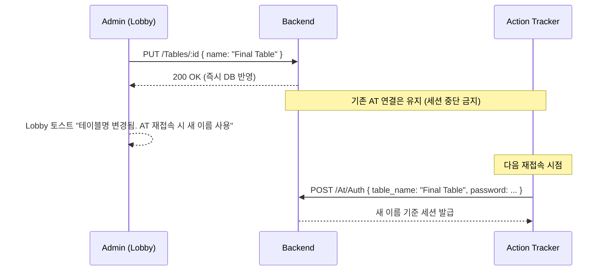

# Lobby — Operations (테이블 인증·진단·내보내기)

| 날짜 | 항목 | 내용 |
|------|------|------|
| 2026-04-15 | 신규 작성 | Settings/Preferences.md (구 BS-03-06) 를 Lobby 하위로 이전. Preferences 가 Settings 6탭 중 하나였으나 성격상 "테이블 운영" 에 가까우므로 Lobby/Operations 로 재편제. PC Specs 멀티 GPU 감지·Table Name 변경 시 AT 재연결 정책 보강 |
| 2026-05-07 | v3 cascade | Lobby v3.0.0 정체성 정합 — 4 진입 시점 컨텍스트 framing 추가 (additive only). |

---

## 개요

> **WSOP LIVE 정보 허브 역할 (Lobby v3.0.0 cascade, 2026-05-07)**: 운영자가 5 분 게이트웨이 동안 확인하는 **테이블 인증 · 진단 · 내보내기** (특히 4 진입 시점 ② "어긋났을 때" RFID 안테나 진단 / ④ "모든 것이 끝날 때" Hand History export 의 핵심 화면). Lobby = WSOP LIVE 거울의 한 면.

테이블 인증(Name·Password), 시스템 진단(PC Specs·RFID 안테나·System Log), 데이터 내보내기(Hand History·Logs·DB Export) 를 Lobby 에서 관리한다. Admin 전용. Lobby 헤더 `[Operations ⚙]` 메뉴 또는 단축키 `Ctrl+,` 로 접근.

**위치**: Lobby 하위 페이지 또는 480×400 px 모달. Admin 이외 역할은 버튼 미표시.

**저장 패턴**: 기본 **즉시 적용**. Table Name·Password 만 Update 버튼 명시 커밋 (서버 인증 정보이므로 실수 방지).

---

## 1. 컨트롤

### 1.1 Table 인증 (ID 1~3)

| ID | 이름 | 입력 타입 | 기본값 | 설명 | 오버레이 영향 |
|:--:|------|----------|--------|------|-------------|
| 1 | Table Name | Input + Update 버튼 | `"Table 1"` | Info Bar 테이블 라벨(M-02t) · NDI 소스명 `{PC이름} (EBS - {Table Name})` 과 동기화. AT 연결 시 이 이름으로 테이블 검색 | 없음 (AT 인증용) |
| 2 | Table Password | Input(masked) + Update 버튼 | `""` | AT 접속 비밀번호. 빈 값이면 비밀번호 없이 접속 허용 | 없음 |
| 3 | PASS / Reset | Button × 2 | — | PASS: 비밀번호만 초기화 / Reset: 이름+비밀번호 전체 초기화 | 없음 |

#### 1.1.1 Table Name 변경 후 AT(Action Tracker) 재연결 정책

- **기존 AT 연결 유지**: 이름 변경이 진행 중인 세션을 끊지 않는다. BO 의 세션 테이블은 `table_id` FK 기준이므로 이름 변경이 세션에 영향 없음.
- **AT 쪽 표시**: AT 가 새 이름을 인지하려면 재접속 필요. Lobby 에서 Update 성공 시 토스트로 안내.
- **자동 재연결 미수행**: Lobby 가 AT 를 강제 재접속 시키지 않는다 (AT 운영 환경이 독립적이므로).

### 1.2 Diagnostics (ID 4~6)

| ID | 이름 | 타입 | 설명 |
|:--:|------|------|------|
| 6 | PC Specs | ReadOnly Text | 시스템 부팅 시 자동 수집 — CPU 모델/코어, GPU·VRAM, RAM 용량, OS 버전 |
| 4 | Table Diagnostics | Button | 비모달 창 600×400 px — RFID 안테나 10개(좌석별 UPCARD + Muck + Community)의 연결 상태·신호 강도(dBm)·마지막 인식 시각 |
| 5 | System Log | Button | 비모달 창 800×500 px — WebSocket 메시지·RFID 이벤트·오류 실시간 스트리밍, 레벨 필터(INFO/WARN/ERROR), 자동 스크롤 |

#### 1.2.1 PC Specs — 멀티 GPU 환경 감지

Windows DirectX 기반 감지 (NVIDIA·AMD·Intel 모두 지원):

| 환경 | 표시 방식 |
|------|----------|
| 단일 GPU | "NVIDIA RTX 4080 (16 GB VRAM)" 한 줄 |
| 멀티 GPU (SLI·CrossFire 포함) | **활성(primary) GPU 만 표시** + 접기 아이콘 클릭 시 전체 나열. `DXGI_ADAPTER_FLAG_SOFTWARE` 제외 |
| 가상 머신 / 원격 데스크톱 | "Virtual GPU (감지 제한)" + 툴팁 "VM 환경에서는 물리 GPU 정보 불가" |
| GPU 감지 실패 | "감지 불가" 경고 배지 + 재시도 버튼 |

VRAM 합산 금지 (SLI 환경에서도 한 GPU VRAM 기준으로 렌더링되므로).

#### 1.2.2 비모달 창 관리 정책

- Table Diagnostics · System Log 는 각각 **최대 1 인스턴스**. 중복 실행 시 기존 창을 앞으로 가져옴.
- Lobby 를 닫으면 자식 창도 함께 종료.
- 창 크기는 사용자가 드래그로 조절 가능, 종료 시 마지막 크기를 localStorage 에 저장.

### 1.3 Export (ID 10~10.2)

| ID | 이름 | 타입 | 기본값 | 설명 |
|:--:|------|------|--------|------|
| 10 | Hand History Folder | Input + FolderPicker | `./Exports/` | 핸드별 JSON 저장 (카드·액션·팟 분배 전체 기록) |
| 10.1 | Export Logs Folder | Input + FolderPicker | `./Logs/` | 시스템 로그 일별/세션별 저장 |
| 10.2 | API DB Export Folder | Input + FolderPicker | `./db_exports/` | DB 추출 데이터(플레이어·세션·통계) JSON/CSV |

**즉시 적용**. 경로 미존재 시 자동 생성 시도, 권한 부족(읽기 전용) 이면 inline 에러 "폴더를 생성할 수 없습니다" + 재선택 요구.

---

## 2. UI 상태 (참조)

로딩·에러·성공 피드백은 `../Engineering.md §4.7 공통 UI 상태` 를 따른다.

| 상황 | UI |
|------|-----|
| Update 저장 중 | 버튼 내부 QSpinner + disable |
| Update 성공 | Positive Toast 3s |
| Update 실패 (네트워크) | 배너 + 재시도 버튼 |
| 비모달 창 로딩 중 | 창 내부 중앙 Spinner |

---

## 3. 트리거

| 트리거 | 주체 | 설명 |
|--------|:----:|------|
| Lobby 헤더 `[Operations ⚙]` 클릭 | Admin | 페이지/모달 열림 |
| Update 버튼 | Admin | Table Name/Password 서버 반영 |
| 시스템 부팅 | 자동 | PC Specs 수집 |
| 핸드 완료 | 게임 엔진 | Hand History 자동 저장 |

---

## 4. 경우의 수 매트릭스

| 조건 | Table 변경 | Diagnostics | Export 변경 |
|------|:---------:|:----------:|:----------:|
| CC IDLE | Update 즉시 적용 | 읽기 전용 / 창 열기 | 즉시 적용 |
| CC 핸드 진행 중 | Update 즉시 적용 (AT 세션 유지) | 동일 | 즉시 적용 |
| BO 서버 미실행 | 변경 불가 | PC Specs 만 표시 | 로컬 경로만 |
| AT 연결 중 Table Name 변경 | 기존 세션 유지, 재접속 시 반영 | — | — |
| 내보내기 폴더 미존재 | — | — | 자동 생성 or 경고 |

---

## 5. 유저 스토리

| # | As a | When | Then | Edge Case |
|:-:|------|------|------|-----------|
| O-1 | Admin | Table Name 을 "Final Table" 로 변경 후 Update | Info Bar 라벨·NDI 소스명 갱신, 토스트 "AT 재접속 시 반영" | AT 연결 중: 세션 유지 |
| O-2 | Admin | Table Password 설정 후 Update | AT 접속 시 비밀번호 요구 | 빈 값: 비밀번호 없이 접속 |
| O-3 | Admin | PASS 클릭 | 비밀번호만 초기화 | — |
| O-4 | Admin | Reset 클릭 | 이름 "Table 1" + 비밀번호 초기화 | — |
| O-5 | Admin | Table Diagnostics 클릭 | 안테나 상태 창 (600×400) | 안테나 미연결: "Disconnected" |
| O-6 | Admin | System Log 클릭 | 로그 뷰어 창 (800×500) | 이벤트 없음: 빈 로그 |
| O-7 | Admin | Hand History Folder 경로 변경 | 다음 핸드부터 새 경로 저장 | 경로 미존재: 자동 생성 or 경고 |

---

## 6. RBAC

| 역할 | Operations 접근 | 세부 권한 |
|------|:-------------:|---------|
| Admin | O | 전체 |
| Operator | X | 버튼 미표시 |
| Viewer | X | 버튼 미표시 |

---

## 관련 문서

- `../Engineering.md §4.7` — 공통 UI 상태
- `../Engineering.md §5` — WebSocket Client (System Log 스트리밍에 사용)
- `../../2.2 Backend/APIs/Backend_HTTP.md §5.11 Configs` — `/Configs/Preferences/*` 엔드포인트 (team1 발신: Lobby/Operations 소유 이관 예정)
