# BS-02 Lobby — 테이블 관리

| 날짜 | 항목 | 내용 |
|------|------|------|
| 2026-04-14 | rename | `BS-02-lobby.md` → `BS-02-00-overview.md` (BS-03/08 관례 정렬, ui-design/UI-01-lobby.md 와 이름 충돌 해소). H2 슬러그는 모두 보존. 외부 7건은 `CCR-DRAFT-team1-20260414-bs02-overview-rename.md` 로 위임. |
| 2026-04-06 | 신규 작성 | WSOP LIVE Staff App 구조 벤치마크 기반 초기 버전 |
| 2026-04-06 | UI 화면 설계 전면 교체 | ~~5화면 구조~~ → 3계층+Player 독립+Settings 별도 구조로 변경 (2026-04-09→2026-04-13), WSOP LIVE 실제 운영 스크린샷 삽입, 화면별 EBS 적용/제거 요소 분류 |
| 2026-04-07 | Gap 분석 기반 전면 보강 | 3-소스 교차 분석(PokerGFX+SysOp+2026 WSOP 실제 스케줄): Lobby 2모드(Setup/Operation), 124개 데이터 필드 정의, WSOP LIVE API 매핑, Mix 게임 모드(Single/Fixed/Choice) 17개 이벤트, 수동 Series/Event 생성(SysOp 참조), 세션 복원, 장애 디그레이드, Hand History, 인증 매트릭스, 멀티테이블 관제, 알림/감사, DB 스키마 |
| 2026-04-07 | doc-critic FAIL 항목 수정 | Lobby-Command Center 관계 섹션 신규 추가, 전문 용어 13종 첫 등장 시 설명 추가, 정의 섹션 5항목 테이블로 확장, Hand History 포커 용어 요약 추가, 장애 디그레이드 제목 보강 |
| 2026-04-07 | Lobby-Command Center 관계 재정의 | 웹 Lobby + Flutter Command Center 별도 앱 구조 확정 (WSOP LIVE 동일). 1:N 관계(1 Lobby : N Command Center), 활성 Command Center 모니터링, Command Center 활성화 리스트, 대회 진입 비밀번호. WSOP LIVE 원본 스크린샷 제거 |
| 2026-04-07 | 시각화 전면 삽입 | 신규 HTML 4종(데이터 연동, 모듈 의존성, API 시퀀스, ER 다이어그램) + 기존 이미지 7종 문서 삽입. Command Center 활성 시 Lobby 설정 잠금(LOCK/CONFIRM/FREE) 섹션 신규 추가 |
| 2026-04-08 | Mock RFID 모드 경로 추가 | Feature Table 상태 전환에 Mock 모드 덱 등록 경로 추가. RFID 상태 표시에 Mock Ready/Mock Deck Required 추가 |
| 2026-04-09 | 수동 CRUD 폼 상세 | Series/Event/Flight 수동 생성 폼 필드, 검증 규칙, 기본값, 에러 메시지 정의 |
| 2026-04-09 | Mix 게임 UI + 데이터 동기화 + 후반부 보강 | Mix 게임 모드 UI 상세(프리셋 HORSE/8-Game/PPC), 데이터 동기화 전략(캐시/WebSocket/충돌), Hand History/알림/폼 검증 뼈대 |
| 2026-04-09 | 화면 구조 재배정 + Settings 글로벌 명시 | Event+Flight 화면 통합(accordion 펼침), 5화면→3계층+Player 독립+Settings 별도, 화면 번호 재배정(화면3→Table, Player→독립 레이어), Settings는 글로벌(모든 CC 동일 적용, 테이블별 Settings 무의미) |
| 2026-04-09 | GAP-L-001 보강 | §세션 상태 보존 — 토큰 유효성 검증 가드 조건 추가 (서버 검증 없이 세션 복원 금지) |
| 2026-04-13 | Player 독립 레이어 전환 | 5계층→3계층+Player 독립 레이어, Player를 Table 종속에서 독립 화면으로 분리, 4화면→3화면+Player 독립+Settings 별도 |
| 2026-05-05 | Series 그룹핑 정책 정정 (디자인 정합) | "월별 그룹핑" → "**연도(Year) 1차 + 시작일 내림차순 2차**" 로 정정. `EBS_Lobby_Design/screens.jsx:29` (`g[s.year]`) 정합. UI.md §화면 1 §그룹핑 정책 (2026-05-05) 가 SSOT. |
| 2026-05-05 | 신 디자인 시각 자료 7장 cascade | `visual/screenshots/` 의 5장 (01 Series / 02 Events / 03 Flights / 04 Tables / 05 Players) 을 신 디자인 React prototype 기준 캡쳐로 overwrite + 06 Hand History / 07 Settings 신규 캡쳐 추가. 본문 §화면 6 Hand History · §화면 7 Settings 섹션 신설 (요소 표 + KPI 5 + 6 tabs + FREE/CONFIRM/LOCK 분류). 화면 표(line 280) 에 시각 자료 컬럼 추가. 테이블 ID 표기 `Day2-#069` → `#069` (신 디자인 정합, SHOW/FLIGHT 컨텍스트 헤더로 Day prefix 이전). References zip sync (Day2- prefix 제거, 구조 변경 0). |
| 2026-05-06 | Lobby Renewal autonomous cascade | **Phase 1 Sidebar 통합** (`LobbyShell` 단일 chrome, `_AppShell`+`NavigationRail` 폐기, items 5→10 항목 3그룹 Navigate/Drilldown/Tools), **Phase 2 TopBar Cluster** (SHOW/EVENT/TABLE 3 dynamic → SHOW/FLIGHT/LEVEL/NEXT 4 fixed, Sidebar badge wiring), **Phase 3 backend dynamic** (신규 `GET /api/v1/flights/:id/levels` endpoint + WS `cc_session_count` broadcast + frontend `flightLevelsProvider` FutureProvider.family + `LevelsStrip` mock 제거). 부수 정정: `auth` router prefix `/auth`→`/api/v1/auth` (frontend 정합), `bcrypt<4.0` pin (passlib 1.7.4 detect_wrap_bug 호환), `AppConfig.authBaseUrl=apiBaseUrl` + `host_resolver` (LAN IP 다른 PC 지원), `LobbyDashboardScreen` 죽은 코드 cleanup (-566 lines). 빌드 옵션 `--pwa-strategy=none` + SW kill switch. E2E Playwright 통과 (login 200 + series 200 + WebSocket connected). Commit `c23032ad`. |
| 2026-05-07 | v3 정체성 정합 | Lobby_PRD v3.0.0 cascade — 5분 게이트웨이 + WSOP LIVE 거울 정체성 반영. §개요 첫 단락에 정체성 박스 추가, §Lobby-Command Center 관계에 게이트웨이 framing 추가, §화면 계층 흐름에 4 진입 시점 카탈로그 신설. 기존 본문/changelog 변경 0 (additive only). 외부 인계 PRD 동기화 (`derivative-of: Lobby_PRD.md`). |
| 2026-05-11 | Cycle 2/3 cascade — 1 hand 자동 셋업 | Lobby_PRD v3.0.2 (§Ch.1.7 + 부록 H) 와 team1-frontend Cycle 2 wire 의 본 정본 측 반영: 본문 narrative 변경 0, derivative-of cascade 정합만 갱신 (last-updated 2026-05-07 → 2026-05-11). 실구현 코드 = `team1-frontend/lib/features/lobby/providers/hand_auto_setup_provider.dart` (Cycle 2 PR #258, 머지 commit `55795d91`). flight_status 정수 enum 정합 = `team1-frontend/lib/models/enums/flight_status.dart` ↔ `integration-tests/scenarios/60-event-flight-status-enum.http`. cascade:lobby-hand-ready broker publish seq=64. |
| 2026-05-12 | Cycle 9 — Lobby 3000 login 실패 fix (same-origin runtime) | 사용자 비판 "Lobby 3000 로그인 실패" 원인 = `EBS_BO_PORT` build-time const 가 `8000` baked-in → 호스트 BO 매핑 mismatch (host port 18001 / 미노출) → fetch 실패. 해결 = `AppConfig.fromEnvironment` 에 **`EBS_SAME_ORIGIN=true`** runtime mode 추가. Web 빌드는 `window.location` origin 사용 → `${origin}/api/v1`, `ws`/`wss` 자동 전환. nginx (`team1-frontend/nginx.conf` 기존) `/api/`, `/ws/` → `bo:8000` proxy 정합. 효과: (a) 호스트 BO port 매핑 무관, (b) LAN IP `192.168.x.x:3000` 디바이스 자동 작동, (c) HTTPS 배포 시 wss 자동. Non-web build 는 `resolveRuntimeOrigin()` 빈 문자열 → host+port mode fallback (backward compat). Dockerfile 빌드 명령 `--dart-define=EBS_SAME_ORIGIN=true` 추가. S11 docker rebuild 인계 (cycle 9 cascade). |

---

## 개요

> **정체성 (Lobby_PRD v3.0.0 cascade, 2026-05-07)**: Lobby = **5분 게이트웨이 + WSOP LIVE 거울**.
> 운영자가 머무는 화면은 Command Center 다 — Lobby 는 **CC 로 들어가기 위해, 거기서 나오기 위해, 어긋났을 때 돌아오기 위해 잠깐 거치는 게이트웨이**. 그 짧은 머무름 동안 **WSOP LIVE 의 모든 정보** (대회 / 이벤트 / 며칠 차 / 누가 살아남았는지 / 다음 레벨까지 얼마) 를 한 화면에 모은다.
> 본 정체성은 외부 인계 PRD `docs/1. Product/Lobby_PRD.md` v3.0.0 의 narrative SSOT 와 정합한다. 이전 v2.0.x "관제탑" framing 은 supersede 됨.


Lobby는 **WSOP LIVE Staff App의 우수한 기능을 EBS 방송 운영에 맞게 가져온** 화면이다. 
WSOP LIVE Staff App은 Series > Event(Day) > Table 3계층 + Player 독립 레이어 구조, 실시간 좌석 관리, Featured Table 운영 등 라이브 포커 대회 운영에 검증된 UI/UX를 갖추고 있다.

EBS Lobby는 이 중 **방송 테이블 운영에 필요한 기능만 선별하여 가져온다**:

| WSOP LIVE Staff App 기능 | EBS Lobby 적용 | 이유 |
|-------------------------|:--------------:|------|
| 3계층 네비게이션 (Series→Event→Table) + Player 독립 레이어 | ✅ 적용 | 데이터 구조 정렬, Player는 독립 접근 |
| Series/Event/Flight 생성 SysOp(WSOP LIVE 시스템 운영 관리자 도구) | ✅ 수동 생성 폴백 | API 연동 전 독립 운영 |
| Table Management (좌석 그리드, 상태 색상) | ✅ 그대로 | 핵심 운영 화면 |
| Featured Table (지연, 우선 표시, Place Here) | ✅ 그대로 + RFID/출력 추가 | 방송 테이블 핵심 |
| Player Registration (검색, 수동 등록) | ✅ 간소화 (KYC 제거) | 오버레이 표시용 정보만 |
| Seat Draw (자동/수동 배석) | ✅ 그대로 | 좌석 배치 필수 |
| BlindStructure (Event 인라인) | ✅ 그대로 | 오버레이 블라인드 표시 |
| Breadcrumb(현재 위치를 경로로 표시하는 상단 바) 네비게이션 | ✅ 그대로 | 빠른 레벨 이동 |
| ~~토너먼트 운영~~ (Registration, Late Reg, Re-Entry, Day Close) | ❌ 제거 | EBS 범위 외 |
| ~~금융~~ (Buy-In 결제, Fee, Tax, Payout, Prize Pool) | ❌ 제거 | EBS 범위 외 |
| ~~KYC(본인 확인 절차)/규정~~ (Identity Verification, Age Limit, Agreement) | ❌ 제거 | EBS 범위 외 |
| ~~파트너~~ (GGPass, Caesars Reward, Sumsub) | ❌ 제거 | EBS 범위 외 |

**EBS만의 추가 기능** (WSOP LIVE에 없는 것):

| EBS 추가 기능 | 용도 |
|-------------|------|
| RFID 리더 할당/상태 | Feature Table 카드 인식 |
| 덱 등록 상태 | RFID 카드 매핑 |
| 출력 상태 NDI/SDI(방송 영상 출력 규격) | 방송 출력 장비 |
| Mix 게임 모드 (Single/Fixed/Choice) | 17종 Mix 이벤트 대응 |
| 오버레이 미리보기 썸네일 | 방송 화면 확인 |
| Hand History | 핸드 기록/통계 |
| 세션 복원 (Continue/Change) | 빠른 재접속 |

> **설계 원칙**: WSOP LIVE Staff App에 이미 답이 있는 기능은 신규 설계하지 않고 그대로 가져온다. EBS에 불필요한 기능(토너먼트 운영, 금융, KYC)만 제거하고, 방송 전용 기능(RFID, 출력, Mix 게임, Hand History)을 추가한다.

> **데이터 연동**: Lobby의 모든 CRUD(생성/조회/수정/삭제) 작업은 **Back Office DB(EBS 중앙 데이터베이스)에 직접 연동**된다. WSOP LIVE API가 연결되면 자동 동기화하고, 연결 전에는 수동 입력으로 독립 운영한다. Lobby UI는 항상 Back Office DB를 읽는다.

## Lobby-Command Center 관계

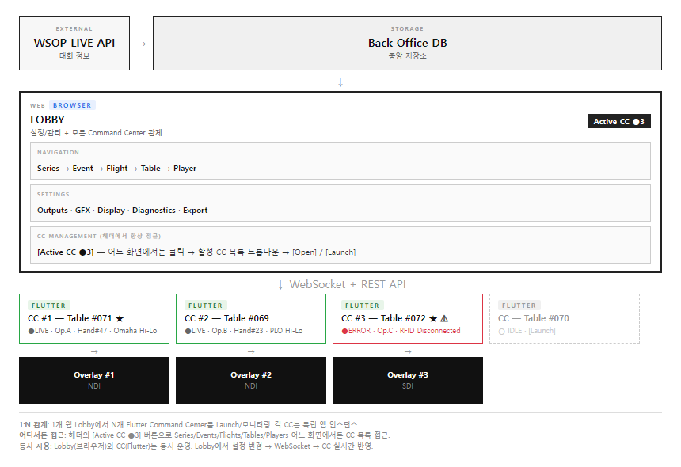

> **역할 분담 (Lobby_PRD v3.0.0 정체성, 2026-05-07)**: 운영자가 **머무는 화면 = Command Center** (한 테이블 / 한 핸드 / 한 베팅), **거치는 게이트웨이 = Lobby** (CC 진입 / 이탈 / 어긋났을 때 회귀). 1 Lobby ↔ N Command Center 의 1:N 관계는 이 정체성의 구조적 표현이다 — 운영자는 한 Lobby 화면에서 N 개 CC 를 게이트웨이 + 모니터링 한다.

Lobby와 Command Center는 **별도 앱**이다. WSOP LIVE 는 Staff Page(웹) + WSOP LIVE(Flutter 앱) 분리 구조이나, **EBS 는 Foundation Ch.5 §A.1 (2026-04-21) 결정으로 두 앱 모두 Flutter 프레임워크로 통일** (원칙 1 의도적 divergence — Rive 런타임 일치, 내부 앱 개발팀 생산성, `ebs_common` Dart 패키지 재사용). 배포 형태는 Lobby = **Flutter Web** (Docker nginx, 브라우저 접속), CC = **Flutter Desktop** (RFID 시리얼 + SDI/NDI 직결, Foundation §A.4 정점 SSOT). CC dev/test 보조 빌드는 Flutter Web (Docker `ebs-cc-web:3001`, 2026-04-27 SG-022 폐기 후 Multi-Service Docker 회복) 도 가능.

| 항목 | Lobby | Command Center |
|------|-------|---------------|
| **기술** | Flutter Web 앱 (Dart + Riverpod + Freezed + go_router + Rive) — Docker `ebs-lobby-web:3000` | Flutter Desktop 앱 (Dart + Rive, RFID 시리얼 + SDI/NDI 직결) — 정규 배포 / Flutter Web (Docker `ebs-cc-web:3001`) — dev/test 보조 |
| **역할** | 설정/관리 + 활성 Command Center 모니터링 | 실시간 방송 입력 |
| **데이터 방향** | REST API로 DB에 쓰기 + WebSocket 구독 | DB에서 로드 + 핸드 데이터 쓰기 + WebSocket 발행 |
| **동시 사용** | CC 활성화 후에도 Lobby 창 활성 (Desktop OS 창 분리) | Lobby와 동시 운영 (별도 창) |
| **직접 연동** | 없음 (Back Office DB 간접) | 없음 (Back Office DB 간접) |

### 1:N 관계 — 하나의 Lobby에서 여러 Command Center 관리

**핵심:**
- Lobby는 **1개** (Web 브라우저 탭 — 모든 테이블의 관제/설정 허브, LAN 다중 관찰 가능)
- Command Center는 **테이블당 1개** (Windows Desktop 앱 인스턴스, 별도 창)
- Lobby에서 [Launch]로 새 Command Center 인스턴스를 생성 (테이블 할당된 Windows 머신에서)
- 각 Command Center는 독립적으로 동작 (테이블 1개 = Command Center 1개 = Overlay 1개)
- Lobby는 모든 활성 Command Center의 상태를 실시간 모니터링 (WebSocket)

### 앱 전환 동작

| 전환 | 동작 | Lobby 상태 | Command Center 상태 |
|------|------|-----------|-------------------|
| Lobby → Command Center | [Enter Command Center] 클릭 | **브라우저 탭 유지** | CC 앱 실행/활성화, 테이블 ID로 설정 로드 |
| Command Center → Lobby | 브라우저로 전환 (Alt+Tab) | 활성화, 이전 상태 유지 | **백그라운드에서 계속 실행** |
| 동시 사용 | Admin이 Lobby 브라우저에서 다른 테이블 관리 + Command Center 방송 | 활성 | 활성 |

> **핵심**: Lobby 는 브라우저 기반이므로 여러 Windows/Mac 에서 동시 접속 가능. CC 는 RFID 하드웨어 접근 필요로 Windows Desktop native. Lobby 에서 설정 변경 → Back Office DB → WebSocket → Command Center 실시간 반영.

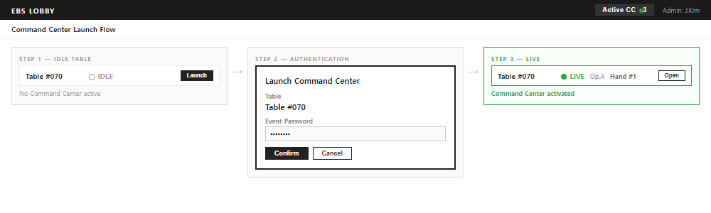

### 데이터 공유 (Back Office DB 간접)

| 데이터 | Lobby (웹) | Command Center (Flutter) | 동기화 |
|--------|:----------:|:------------------------:|--------|
| Series/Event/Flight 선택 | 쓰기 | 읽기 (로드) | REST API |
| Table 설정 (RFID, 덱, 출력) | 쓰기 | 읽기 (로드) | REST API |
| Player/좌석 배치 | 쓰기 | 읽기 | WebSocket 실시간 |
| Settings (Outputs, GFX, Display) | 쓰기 | 읽기 | WebSocket 실시간 |
| Hand 데이터 (핸드, 액션, 카드) | 읽기 (모니터링) | 쓰기 | WebSocket 실시간 |
| chip_count (실시간) | 읽기 (모니터링) | 쓰기 | WebSocket 실시간 |
| 세션 상태 (last_table_id) | 읽기 (복원) | 쓰기 (진입 시) | DB |


### Lobby에서 활성 Command Center 모니터링

Lobby(웹)에서 현재 활성화된 Command Center의 실시간 상태를 확인할 수 있다.

| 모니터링 항목 | WebSocket 이벤트 | 표시 위치 |
|-------------|-----------------|----------|
| 연결 상태 (● LIVE / ○ OFFLINE) | `operator_connected` / `disconnected` | 테이블 카드 |
| 현재 핸드 번호 | `hand_started` / `hand_ended` | 테이블 카드 |
| 현재 종목 (Mix시) | `game_changed` | 테이블 카드 |
| 현재 액션 (누가 무엇을) | `action_performed` | Dashboard (Admin) |
| RFID 상태 | `rfid_status_changed` | 테이블 카드 |
| Output 상태 (NDI/SDI) | `output_status_changed` | 테이블 카드 |
| 접속 Operator | `operator_connected` | Dashboard (Admin) |

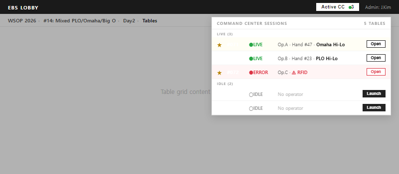

### Lobby에서 Command Center 활성화 리스트

Lobby의 Table Management 화면에서 Command Center를 생성/활성화할 수 있는 리스트가 제공된다.

| 상태 | 표시 | 동작 |
|------|------|------|
| ● LIVE | Operator 이름 + 핸드 번호 | [Open] — 해당 Command Center로 전환 |
| ○ IDLE | 미실행 | [Launch] — 새 Command Center 인스턴스 생성 |
| ⚠ ERROR | RFID 오류 등 | [Open] — 해당 Command Center로 전환 + 경고 |

### 대회 진입 시 비밀번호

Lobby에서 대회(Event)로 진입할 때 비밀번호 입력이 필요하다.

| 시점 | 동작 | 목적 |
|------|------|------|
| Event 선택 시 | 비밀번호 입력 다이얼로그 | 무단 접근 방지 |
| Command Center Launch 시 | 비밀번호 재확인 (또는 세션 유지) | Command Center 실행 권한 확인 |

> 참고: WSOP LIVE의 Table Password (Console Settings ID 2)와 유사한 패턴. 테이블별 비밀번호로 Operator가 할당된 테이블만 접근하도록 제한.

## 세션 상태 보존 및 네비게이션

> **📦 분리됨 (2026-04-14)**: 본 섹션 전체는 `BS-02-01-auth-session.md` 로 이관되었다.
> - §핵심 동작 + 세션 복원 가드 (GAP-L-001)
> - §Breadcrumb 네비게이션 (세션 영향 매트릭스)
> - §세션 저장 데이터 (`last_series_id`/`last_event_id`/`last_flight_id`/`last_table_id`)
>
> 외부 anchor `§세션 저장 데이터` 참조는 `BS-02-01-auth-session.md §세션 저장 데이터` 로 redirect (CCR-DRAFT-team1-20260414-bs02-overview-rename.md).

---

## 정의

Lobby는 Admin/Operator/Viewer가 방송 테이블의 생성, 설정, 모니터링을 수행하는 테이블 관리 화면이다. Back Office DB를 통해 테이블 세션, 플레이어 정보, Hand History를 영구 저장한다.

| 용어 | 정의 |
|------|------|
| **Lobby** | EBS의 테이블 관리 화면. Series > Event(Day) > Table 3계층 탐색 + Player 독립 레이어를 통해 방송 테이블을 찾고 CC로 진입하는 준비 화면 |
| **Back Office DB** | EBS 중앙 데이터베이스. 테이블, 플레이어, 핸드, 세션 등 모든 영구 데이터를 저장. WSOP LIVE API에서 수신한 데이터도 여기에 캐싱 |
| **Hand History** | Command Center에서 기록된 포커 핸드(1판)의 전체 이력. 플레이어 액션, 카드, 팟, 승자 등 핸드별 상세 데이터와 VPIP/PFR/AGR 등 통계를 포함 |
| **Feature Table** | 방송에 노출되는 핵심 테이블. RFID 리더 할당, 덱 등록, 출력 설정이 필수이며 일반 테이블과 구분 |
| **Session** | 사용자의 마지막 선택 상태(Series/Event/Table). 재접속 시 이전 상태를 복원하여 불필요한 탐색을 제거 |

## WSOP LIVE 참조 문서

| 참조 기능 | Confluence 문서 | Page ID | URL |
|----------|----------------|---------|-----|
| Tournament List (필터/정렬/상태 패턴) | 03. Tournament Manager | 1597800724 | https://ggnetwork.atlassian.net/wiki/spaces/WSOPLive/pages/1597800724 |
| Tournament Admin Dashboard (현황 패널) | 04. Tournament Admin | 1597735085 | https://ggnetwork.atlassian.net/wiki/spaces/WSOPLive/pages/1597735085 |
| Featured Table (지연 전송, 우선 표시) | Featured Table. | 1909424747 | https://ggnetwork.atlassian.net/wiki/spaces/WSOPLive/pages/1909424747 |
| Feature Table Player 표시 | Feature Table Player 표시 | 2193949020 | https://ggnetwork.atlassian.net/wiki/spaces/WSOPLive/pages/2193949020 |
| Table Management (CRUD, 좌석) | Table Management | 1615528545 | https://ggnetwork.atlassian.net/wiki/spaces/WSOPLive/pages/1615528545 |
| Seat Draw in Advance | Seat Draw in Advance | 2837708988 | https://ggnetwork.atlassian.net/wiki/spaces/WSOPLive/pages/2837708988 |
| Staff Admin (역할/권한) | 02. Staff Admin | 1597800711 | https://ggnetwork.atlassian.net/wiki/spaces/WSOPLive/pages/1597800711 |
| **Clock Control** (블라인드/레벨/Day Close) | Clock Control | 2334752899 | https://ggnetwork.atlassian.net/wiki/spaces/WSOPLive/pages/2334752899 → `Clock_Control.md` 신설 |
| **Tournament Registration · Sit-in · Seating** | (동명) | 1616674829 | https://ggnetwork.atlassian.net/wiki/spaces/WSOPLive/pages/1616674829 → `Registration.md` 신설 |
| **Player Management** (검색/Profile/Ban) | Player Management | 1567852545 | https://ggnetwork.atlassian.net/wiki/spaces/WSOPLive/pages/1567852545 → 별도 sprint (Lobby Backlog Top) |


## 트리거

| 트리거 유형 | 조건 | 발동 주체 |
|-----------|------|---------|
| 로그인 성공 | 인증 완료 | 시스템 (자동) |
| Command Center [종료]] | Command Center 화면에서 Lobby 복귀 | 운영자 (수동) |
| [+ New Table] 버튼 | Lobby 화면에서 | Admin (수동) |
| 테이블 카드 클릭 | 테이블 목록에서 | 운영자 (수동) |
| RFID 상태 변경 | 리더 연결/해제/에러 | 시스템 (자동) |
| WSOP LIVE API 수신 | 플레이어/이벤트 데이터 갱신 | 시스템 (자동) |
| Back Office DB 변경 감지 | 외부 DB 변경 동기화 | 시스템 (자동) |

## 전제조건

- 사용자가 BS-01 Auth를 통해 로그인 완료
- 역할(Admin/Operator/Viewer)이 할당됨
- 서버가 실행 중이고 **Back Office DB 연결 정상**
- Back Office DB 스키마가 초기화됨

---

## 데이터 연동 구조

### Back Office DB 직접 연동

Lobby의 모든 상태 변경은 Back Office DB에 직접 기록된다.

| 작업 | DB 테이블 (논리) | 설명 |
|------|----------------|------|
| 테이블 CRUD | `tables` | 테이블 생성/수정/삭제 |
| 플레이어 등록 | `table_players` | 테이블-플레이어 매핑 |
| 좌석 배치 | `table_seats` | 좌석-플레이어 매핑 |
| 상태 전환 | `table_sessions` | 세션 시작/종료 기록 |
| 핸드 데이터 | `hands`, `hand_actions` | Command Center에서 생성, Lobby에서 카운트 조회 |
| 플레이어 프로필 | `players` | WSOP LIVE API에서 수신 후 DB 캐싱 |

> **WSOP LIVE API → Back Office DB → Lobby UI**: 플레이어 정보는 WSOP LIVE API에서 수신하여 Back Office DB에 캐싱한다. Lobby는 항상 Back Office DB를 읽는다. API 연결이 끊겨도 DB에 캐싱된 데이터로 동작한다.

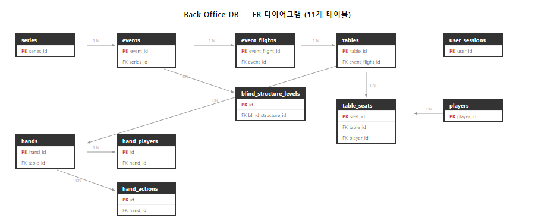

### 데이터 동기화 전략

Lobby가 BO DB 데이터를 읽고 갱신하는 전략.

#### 읽기 전략

| 화면 전환 | 동작 | 캐시 |
|----------|------|------|
| Series 목록 진입 | `GET /api/Series` | 5분 캐시 (stale-while-revalidate) |
| Event 목록 진입 | `GET /api/Series/:id/events` | 1분 캐시 |
| Flight 목록 진입 | `GET /api/Events/:id/flights` | 1분 캐시 |
| Table 목록 진입 | `GET /api/Flights/:id/tables` | 캐시 없음 (실시간) |
| Player 목록 진입 (독립 화면) | `GET /api/players?eventId=:id` | 캐시 없음 (실시간) |
| Breadcrumb 뒤로 가기 | 캐시 데이터 표시 + 백그라운드 재조회 | stale-while-revalidate |

#### WebSocket 자동 갱신

| 이벤트 | 갱신 대상 | 설명 |
|--------|----------|------|
| `table:status_changed` | Table 목록 + 상태 뱃지 | 상태 전환 시 즉시 갱신 |
| `table:player_seated` | Player 독립 화면 + Table 내 좌석 시각화 | 좌석 배정 변경 |
| `table:cc_launched` | CC 상태 인디케이터 | CC 활성/비활성 |
| `hand:started` | Hand# 표시 | 핸드 시작 알림 |
| `config:changed` | Settings 값 | Admin이 설정 변경 |

#### 충돌 해결

| 상황 | 해결 |
|------|------|
| 캐시와 서버 불일치 | 서버 우선 (Last-Write-Wins) |
| 동시 편집 | 409 Conflict → 최신 데이터 리프레시 |
| WebSocket 끊김 중 변경 | 재연결 시 전체 상태 스냅샷 수신 |

---

## UI 화면 설계 — 3계층 + Player 독립 레이어 + Settings + Graphic Editor + Operations

### 설계 근거

**EBS 로비의 핵심 목적**: Feature Table을 찾아서 Command Center로 진입하는 것. 대회/이벤트는 테이블을 찾기 위한 탐색 경로이다.

**레이어 구성**: EBS drill-down 구조는 `시리즈 > 이벤트(Day) > 테이블` 3계층이다. Event와 Flight는 **하나의 화면에서 accordion 펼침**으로 제공한다. Player·Settings·Graphic Editor·Operations 는 각각 **독립 레이어/페이지**로 Lobby 헤더에서 접근.

| 화면 | 내용 | 진입점 | 시각 자료 |
|------|------|--------|----------|
| 화면 0 | Login | 인증 + 세션 복원 | `visual/screenshots/ebs-lobby-00-login.png` (BS-02-01 분리) |
| 화면 1 | Series Lobby | 카드 그리드 (연도별) | `visual/screenshots/ebs-lobby-01-series.png` |
| 화면 2 | Event + Flight (통합) | Event 행 accordion 펼침 → Flight 인라인 | `visual/screenshots/ebs-lobby-02-events.png` + `ebs-lobby-03-flights.png` |
| 화면 3 | Table Management | EBS 핵심 화면 | `visual/screenshots/ebs-lobby-04-tables.png` |
| Player | Player List (독립 레이어) | Lobby 헤더 사이드바 | `visual/screenshots/ebs-lobby-05-players.png` |
| **Hand History** (화면 6) | EBS 고유 — Hand Browser / Detail / Player Stats 3 서브메뉴, 당일 한정 | Lobby 사이드바 `■ Hand History` (`Hand_History.md` SSOT) | `visual/screenshots/ebs-lobby-06-hands.png` |
| **Settings** (화면 7) | 글로벌 Settings (6탭: Outputs/GFX/Display/Rules/Stats/Preferences) | Lobby 헤더 `[Settings ⚙]` | `visual/screenshots/ebs-lobby-07-settings.png` |
| **Graphic Editor** (2026-04-15 신설) | Skin Editor — Import/Metadata/Activate/GE 8모드 편집 | Lobby 헤더 `[Graphic Editor]` 독립 버튼 | — |
| **Operations** (2026-04-15 이전) | 테이블 인증·진단·내보내기 (구 Settings/Preferences) | Lobby 헤더 `[Operations ⚙]` 또는 `Ctrl+,` | — |

> **변경 2026-04-15 (team1 발신, Round 2)**:
> - 구 Settings/Preferences 탭 → `Operations.md` 로 이전 (대회 운영 성격)
> - Graphic Editor(= Skin Editor) 는 Settings 탭 내 진입이 아닌 **Lobby 헤더 독립 진입점** 으로 승격. Settings/Graphics 에는 런타임 설정만 유지

> **변경 2026-04-21 (Conductor 발신, SG-016 revised)**:
> - Hand History 사이드바 섹션 신설 (`Hand_History.md` SSOT). 25개 분산 참조 통합. EBS Core §1.2 (3입력→오버레이 결과물) 의 사후 조회 도구. (Migration Plan: `docs/4. Operations/Plans/Lobby_Sidebar_HandHistory_Migration_Plan_2026-04-21.md`)

**선택 컨텍스트 유지**: 한 번 선택한 계층은 해당 단위가 종료될 때까지 세션에 유지된다. 재접속 시 이전 선택이 복원되어 불필요한 탐색을 제거한다.

| 계층 | 유지 기간 | 만료 조건 |
|------|----------|----------|
| 시리즈 | 수 주 | 시리즈 종료 또는 사용자 변경 |
| 이벤트 | 수 일 | 이벤트 Completed 또는 사용자 변경 |
| Flight | 수 시간 | Flight Completed 또는 사용자 변경 |

상단 breadcrumb에서 언제든 상위 계층을 클릭하여 다른 시리즈/이벤트/Flight로 전환 가능.

### 화면 계층 흐름

### 4 진입 시점 카탈로그 (Lobby_PRD v3.0.0 정합, 2026-05-07)

운영자가 Lobby 를 거치는 시점은 4 가지다. 각 시점은 5 화면 시퀀스 (Series → Events → Flights → Tables → Players) 와 Hand History / Settings 보조 화면으로 운영자를 데려간다.

| 진입 시점 | 의미 | 주요 거치는 화면 | 관련 feature 문서 |
|----------|------|---------------|----------------|
| **① 처음 진입** | 운영 시작 — CC 를 처음 켤 때 | Login → Series → Event → Flight → Tables → Launch | `Session_Restore.md` (last_table_id 복원), Login 흐름 |
| **② 어긋났을 때** | 예외 처리 — RFID 꺼짐 / 좌석 불일치 / 네트워크 단절 등 비상 회귀 | Tables (재진입) / Event_and_Flight (재선택) / Session_Restore | `Session_Restore.md`, `Table.md`, `Event_and_Flight.md`, Operations |
| **③ 게임이 바뀔 때** | transition — Day1 → Day2 / Late Reg 종료 / Mix 게임 회전 | Event_and_Flight (status 갱신) → Tables (재배석) | `Event_and_Flight.md`, `Table.md` |
| **④ 모든 것이 끝날 때** | 운영 종료 — Flight Completed / 방송 종료 / 시리즈 마감 | Tables → Hand History → Reports → Settings (signout) | `Hand_History.md`, `Reports.md`, `Operations.md` |

> **5 화면 시퀀스 (정본)**: `Series → Events → Flights → Tables → Players` — 4 진입 시점 모두 이 시퀀스의 한 지점에서 시작/종료된다. Hand History 와 Settings 는 4 진입 시점 어디서나 Tools 사이드바로 접근 가능한 보조 화면이다.

---

### 화면 0: 로그인 (Login)

> **📦 분리됨 (2026-04-14)**: 본 섹션 전체는 `BS-02-01-auth-session.md §화면 0: 로그인` 으로 이관되었다 (인증 방식 매트릭스, 2FA, Entra/Google OAuth, 세션 컨텍스트 복원 진입점 포함).
>
> 외부 anchor `§화면 0: 로그인` 참조는 `BS-02-01-auth-session.md §화면 0: 로그인` 으로 redirect (CCR-DRAFT-team1-20260414-bs02-overview-rename.md).

---

### 화면 1: 대회 로비 (Series Lobby)

> **근거**: WSOP는 연간 여러 시리즈(Circuit, Europe, Main 등)를 운영. 시리즈 선택이 첫 단계. 시리즈당 1회만 선택 (2~4주 유지).

**EBS 목업:**

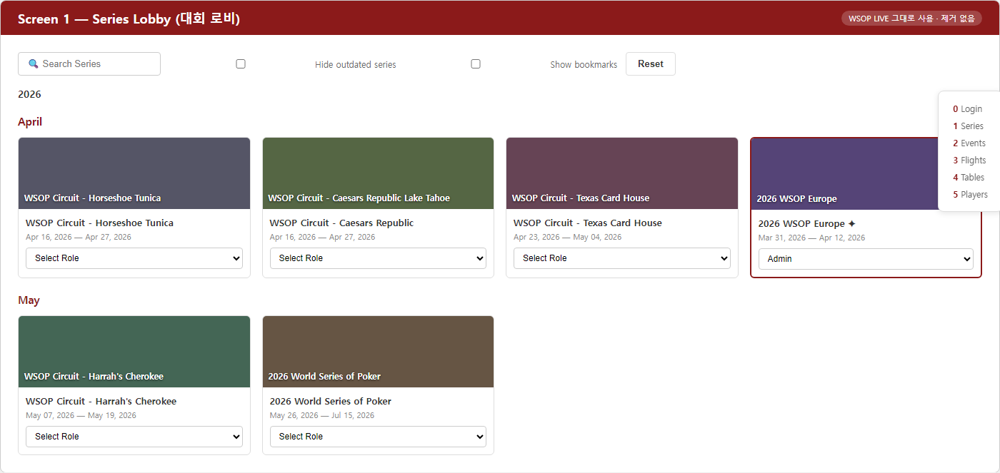

로그인 후 첫 화면. 진행 중인 모든 시리즈를 **연도(Year) 그룹핑된 카드 그리드**로 표시한다 (2026-05-05 디자인 정합 정정 — 이전 "월별" 표기는 SUPERSEDED, SSOT 는 `UI.md §화면 1 §그룹핑 정책`).

| 요소 | DB 소스 | EBS 적용 |
|------|---------|:-------:|
| 시리즈 카드 (장소 사진 + 이름 + 기간) | `series` | O — 그대로 사용 |
| Select Role 드롭다운 | `staff_roles` | O — Admin/Operator/Viewer 매핑 |
| **연도 그룹핑** (2026, 2025, 2024 …) | `series.start_date.year` | O — 디자인 자산 정합 (`screens.jsx:29`) |
| 검색 바 + Hide completed / Show bookmarks | — | O — 그대로 사용 (Hide outdated → Hide completed 명칭 정합) |
| **Status Badge Legend (5-color)** | — | O — Running / Registering / Announced / Completed / Created (UI.md §화면 1 SSOT) |

**불필요한 요소:** 없음 — 이 화면은 전체를 그대로 가져온다.

**수동 Series 생성 (API 연동 전 폴백):**

WSOP LIVE API 연동 전 또는 API에 없는 시리즈(테스트, 데모)를 수동으로 생성한다. [+ New Series] 버튼으로 트리거. 발동 주체: Admin (수동).

| 필드 | 필수 | 기본값 | DB 컬럼 | 설명 |
|------|:----:|--------|---------|------|
| Competition | O | — | `series.competition_name` | 대회명 (예: WSOP) |
| Series Name | O | — | `series.series_name` | 시리즈명 (예: 2026 WSOP Europe) |
| Start Date | O | — | `series.begin_at` | 시리즈 시작일 |
| End Date | O | — | `series.end_at` | 시리즈 종료일 |
| Time Zone | O | UTC | `series.time_zone` | 시간대 |
| Country Code | O | — | `series.country_code` | 국가 코드 (예: US, FR) |
| Series Image | — | 기본 이미지 | `series.image_url` | 카드에 표시할 대표 이미지 |
| Is Displayed | — | true | `series.is_displayed` | 목록 표시 여부 |
| Is Demo | — | false | `series.is_demo` | 데모/테스트 시리즈 여부 |

> 참고: 수동 생성된 시리즈는 `source = 'manual'`로 기록된다. API 연동 후 `series_name + begin_at` 기준으로 자동 매칭되어 `source = 'api'`로 전환된다. 매칭 실패 시 수동 레코드가 유지되며 사용자 확인 후 처리한다.

---

### 화면 2: 이벤트 + Flight 목록 (Event & Flight Management)

> **근거**: 한 시리즈에 수십 개 이벤트. Game Type이 다르므로 EBS 엔진 설정이 이벤트마다 다름. 이벤트당 1회 선택 (1~7일 유지). **Event 행을 클릭(accordion 펼침)하면 해당 이벤트의 Flight 목록이 인라인으로 표시된다.** 별도 화면 전환 없이 한 화면에서 Event와 Flight를 모두 조회한다.

**EBS 목업:** ~~취소선~~=제거 요소, <span style="color:green">녹색 EBS 배지</Span>=추가 요소

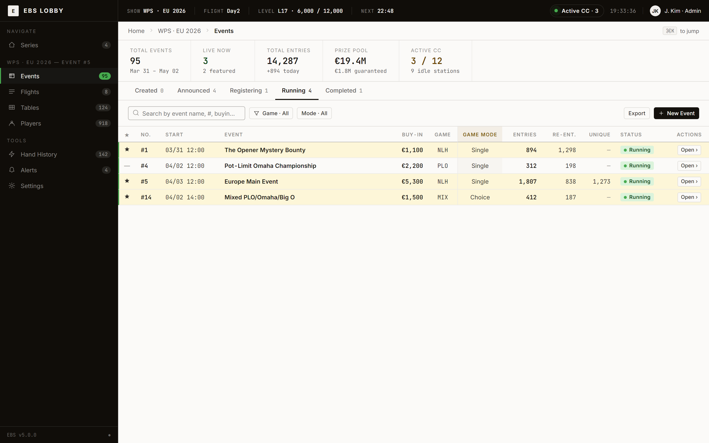

시리즈 선택 후 진입. 해당 시리즈의 **모든 이벤트를 테이블 형태**로 표시한다.


| 요소 | DB 소스 | EBS 적용 |
|------|---------|:-------:|
| Status 탭 (Created/Announced/Registering/Running/Completed) | `events.status` | O |
| Start Time | `events.start_time` | O |
| No. / Event Name | `events.serial_no`, `name` | O |
| Buy-In | `events.buy_in` | O — 읽기 전용 |
| Game | `events.game_type` | O — **EBS 핵심 (22종 매핑)** |
| Entries / Re-Entries / Unique | `events.entries` | O — 읽기 전용 |
| Status | `events.status` | O |
| **Feature Table 뱃지** | `tables.type = 'feature'` | O — **EBS 추가** |
| ~~Level~~ | — | X — 토너먼트 관리 |
| ~~Late Reg~~ | — | X — 토너먼트 관리 |
| ~~Prize Pool / Guarantee~~ | — | X — 불필요 |
| ~~Ticketed Events~~ | — | X — 불필요 |

**수동 Event 생성 (API 연동 전 폴백):**

[+ New Event] 버튼으로 트리거. 발동 주체: Admin (수동).

| 필드 | 필수 | 기본값 | DB 컬럼 | 설명 |
|------|:----:|--------|---------|------|
| Event No. | O | 자동 증가 | `events.event_no` | 이벤트 번호 |
| Event Name | O | — | `events.event_name` | 이벤트명 |
| Start Date | O | — | `events.start_time` | 시작 일시 |
| Buy-In | — | — | `events.buy_in` | 바이인 금액 |
| Display Buy-In | — | — | `events.display_buy_in` | 표시용 바이인 (예: "$10,000") |
| Table Size | O | 9 | `events.table_size` | 테이블당 최대 인원 |
| Starting Chip | O | — | `events.starting_chip` | 시작 칩 수량 |
| Game Mode | O | Single | `events.game_mode` | Single / Fixed Rotation / Dealer's Choice |
| Game Type | O | No Limit Hold'em | `events.game_type` | 22종 중 선택 (Single 모드) |
| Allowed Games | — | — | `events.allowed_games` | Mix 모드 시 허용 게임 목록 |
| Rotation Order | — | — | `events.rotation_order` | Fixed Rotation 시 게임 순서 |
| Rotation Trigger | — | — | `events.rotation_trigger` | 핸드 수 또는 시간 기반 전환 |
| Mix Preset | — | — | — | 프리셋 선택 시 위 3개 필드 자동 입력 |
| Blind Structure | O | — | `events.blind_structure_id` | 인라인 설정 (아래 참조) |

**BlindStructure 인라인 설정 (Event 생성 시):**

WSOP LIVE Staff Page와 동일하게 Event 생성 다이얼로그 내에서 BlindStructure를 직접 설정한다.

| 필드 | 필수 | 설명 |
|------|:----:|------|
| Structure Name | O | 구조명 (예: "$10K Main Event Structure") |
| Level | O | 레벨 번호 (자동 증가) |
| Small Blind | O | 스몰 블라인드 |
| Big Blind | O | 빅 블라인드 |
| Ante | — | 앤티 (0 = 없음) |
| Duration (min) | O | 레벨 지속 시간 (분) |

> 참고: [+ Add Level] 버튼으로 레벨을 추가하고, 드래그로 순서를 변경한다. 기존 BlindStructure를 복사하여 수정할 수도 있다.

**Days/Flight 설정 (Event 생성 시):**

| 필드 | 필수 | 설명 |
|------|:----:|------|
| Days | O | Day 수 (예: Day1, Day2, Day3) |
| Flight per Day | — | Day1에 Flight A/B/C 추가 가능 |

> 참고: [+ Add Flight] 버튼으로 Flight를 추가하고, [X] 버튼으로 제거한다. Flight 추가 시 `event_flights` 테이블에 레코드가 생성된다.

**Mix 게임 모드 (Game Mode):**

2026 WSOP 100개 이벤트 중 17개가 Mix 이벤트이다. EBS는 3가지 Game Mode를 지원한다.

| Game Mode | 설명 | 게임 전환 | Command Center 동작 |
|-----------|------|----------|--------|
| **Single** | 단일 게임 | 없음 | `game_type` 고정 |
| **Fixed Rotation** | 정해진 순서로 순환 | `rotation_trigger` 조건 충족 시 자동 | CC에 다음 게임 + 남은 핸드 표시 |
| **Dealer's Choice** | 딜러가 매 핸드 선택 | 매 핸드 Command Center 수동 입력 | Command Center에 게임 선택 드롭다운 표시 |

**Mix 프리셋 (11종):**

| # | 프리셋 | 포함 게임 | 게임 수 |
|:-:|--------|----------|:-------:|
| 1 | **HORSE** | Hold'em, Omaha Hi-Lo, Razz, Stud, Stud Hi-Lo | 5 |
| 2 | **TORSE** | Triple Draw 2-7, Omaha Hi-Lo, Razz, Stud, Stud Hi-Lo | 5 |
| 3 | **HEROS** | Hold'em, Razz, Omaha Hi-Lo, Stud, Stud Hi-Lo | 5 |
| 4 | **8-Game** | Triple Draw 2-7, Hold'em, Omaha Hi-Lo, Razz, Stud, Stud Hi-Lo, NL Hold'em, PLO | 8 |
| 5 | **9-Game / PPC** | 8-Game + NL 2-7 Single Draw | 9 |
| 6 | **10-Game** | 9-Game + Badugi | 10 |
| 7 | **Pick Your PLO** | PLO, PLO Hi-Lo, Big O, PLO 5-Card | 4 |
| 8 | **NLH/PLO Mix** | NL Hold'em, PLO | 2 |
| 9 | **Omaha Mix** | PLO, Omaha Hi-Lo | 2 |
| 10 | **Stud Mix** | Stud, Stud Hi-Lo, Razz | 3 |
| 11 | **Custom** | 사용자 정의 (Allowed Games에서 직접 선택) | N |

> 참고: 프리셋 선택 시 `allowed_games`, `rotation_order`, `rotation_trigger`가 자동 입력된다. Custom을 선택하면 직접 게임을 선택하고 순서를 지정한다.


### Mix 게임 모드 UI 상세

Event 생성 폼에서 Game Mode 선택 시 동적으로 표시되는 추가 필드.

#### Single (기본)
추가 필드 없음. Game Type Select에서 22종 중 1개 선택.

#### Fixed Rotation

| 필드 | 타입 | 필수 | 설명 |
|------|------|:----:|------|
| Rotation Preset | Select | O | HORSE / 8-Game / PPC / Custom |
| Rotation Games | MultiSelect | O | 프리셋 선택 시 자동 채움, Custom 시 직접 선택 |
| Hands Per Rotation | Number | O | 회전당 핸드 수 (기본: 8, 범위: 1~20) |
| Rotation Order | 나열 | O | 선택된 게임 순서. 드래그로 재배치 가능 |

**프리셋 상세**:

| 프리셋 | 게임 수 | 게임 목록 |
|--------|:------:|----------|
| HORSE | 5 | Hold'em → Omaha Hi-Lo → Razz → Stud → Stud Hi-Lo |
| 8-Game | 8 | Limit 2-7 Triple Draw → Limit Hold'em → Limit Omaha Hi-Lo → Razz → Limit Stud → Limit Stud Hi-Lo → NL Hold'em → PLO |
| PPC | 5 | NL Hold'em → PLO → PLO Hi-Lo → NL 2-7 Single Draw → Limit Hold'em |
| Custom | N | 사용자가 직접 게임 추가/제거/순서 변경 |

#### Dealer's Choice

| 필드 | 타입 | 필수 | 설명 |
|------|------|:----:|------|
| Available Games | MultiSelect | O | 딜러가 선택 가능한 게임 풀 (최소 2종) |
| Default Game | Select | O | 딜러 미선택 시 기본 게임 |

**운영 흐름**: 각 핸드 시작 시 딜러 좌석의 운영자가 CC에서 게임을 선택한다. 선택하지 않으면 Default Game으로 자동 진행.

**Event → Table → Command Center 데이터 흐름 (Mix 모드):**

---

#### Flight 인라인 표시 (Event 행 accordion 펼침)

> **근거**: 하나의 이벤트가 Day1A/1B/1C/Day2~6으로 분할. 같은 이벤트라도 Flight마다 테이블 구성이 다름. Flight당 1회 선택 (4~12시간 유지). **재접속 시 단축 진입점** — 시리즈/이벤트가 유지되므로 여기부터 시작.

Event 행을 클릭하면 해당 이벤트의 Flight 목록이 **accordion 형태로 펼쳐진다**. 별도 화면으로 이동하지 않는다.

**EBS 목업:**

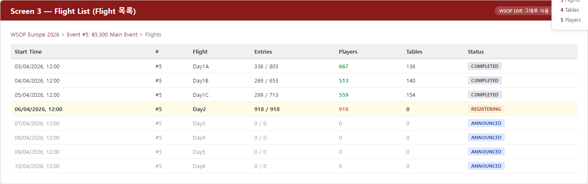

| 요소 | DB 소스 | EBS 적용 |
|------|---------|:-------:|
| Flight 이름 (Day1A, Day1B, Day2...) | `event_flights.name` | O |
| Entries (현재/전체, 예: 336/803) | `event_flights.entries` | O — 읽기 전용 |
| Players | `event_flights.players_remaining` | O |
| Tables | `event_flights.table_count` | O — **EBS 핵심** |
| Status (COMPLETED/REGISTERING/ANNOUNCED) | `event_flights.status` | O |

**불필요한 요소:** 없음 — 전체를 그대로 가져온다.

**Accordion UX 동작:**

| 동작 | 결과 |
|------|------|
| Event 행 클릭 | 해당 행 아래에 Flight 목록 펼침 (다른 Event는 접힘) |
| 다른 Event 클릭 | 이전 Event 접힘 + 새 Event 펼침 |
| Flight 행 클릭 | 화면 3 (테이블 관리) 진입 |
| Running/Registering Flight만 | 클릭 가능 (Completed/Announced는 읽기 전용) |

> Running 또는 Registering 상태의 Flight 선택 → 화면 3 (테이블 관리) 진입.

---

### 화면 3: 테이블 관리 (Table Management) — EBS 핵심 화면

> **근거**: Feature Table을 선택하고 Command Center로 진입하는 EBS의 핵심 화면. 방송 중 반복 접근.

**EBS 목업:** RFID/Deck/Output/Enter Command Center 컬럼 추가, Feature Table 금색 강조


| 요소 | DB 소스 | EBS 적용 |
|------|---------|:-------:|
| **상단 요약 바** | | |
| Players (등록/남은) | `table_players` COUNT | O |
| Total Tables | `tables` COUNT | O |
| Auto Seating | `tables.auto_seating` | O |
| Seats (전체/빈) | `table_seats` COUNT | O |
| Waiting | `waiting_list` COUNT | O |
| **좌석 그리드** | | |
| 테이블 행 (#069, #070...) | `tables.name` | O — 신 디자인 정합 (zip 갱신본 2026-05-05: SHOW/FLIGHT 컨텍스트 헤더에 Day 표시되므로 행에서 prefix 제거) |
| 좌석 색상 (녹색=착석, 빨강=탈락, 빈칸=빈좌석) | `table_seats.status` | O |
| Seated 카운트 | 계산 | O |
| **Waiting List (우측)** | `waiting_list` | O |
| **EBS 추가 요소** | | |
| RFID 상태 아이콘 (테이블별) | 실시간 | O — **EBS 추가** |
| Feature Table 강조 (별 아이콘 + 최상단) | `tables.type` | O — **EBS 추가** |
| 덱 등록 상태 | `tables.deck_registered` | O — **EBS 추가** |
| 출력 상태 (NDI/SDI) | 실시간 | O — **EBS 추가** |
| [Enter Command Center] 버튼 | — | O — **EBS 추가** |
| ~~Hold Search~~ | — | X — 토너먼트 운영 |
| ~~Export CSV~~ | — | X — 불필요 |

> Feature Table 행을 선택하고 [Enter Command Center] → Command Center 진입. 일반 테이블도 Command Center 진입 가능 (데이터 기록용).

---

### Player 독립 레이어: 플레이어 정보 (Player List)

> **근거**: 오버레이에 표시할 플레이어 데이터 확인 (칩, BB, 국적). Table drill-down 없이 어디서든 접근 가능한 독립 화면.

**EBS 목업:** VPIP/PFR/AGR 컬럼 추가, Feature Table Player 금색 강조


| 요소 | DB 소스 | EBS 적용 |
|------|---------|:-------:|
| **상단 요약** | | |
| Players (현재/전체) | `table_players` COUNT | O |
| Total Stack / Entered Stacks / Difference | 계산 | O — 무결성 검증 |
| **플레이어 리스트** | | |
| Place (순위) | 계산 | O |
| Player (이름 + 국기) | `players.name`, `nationality` | O |
| Chips/Price | `table_players.chips` | O |
| Big Blinds | 계산 | O — **EBS 핵심 (오버레이)** |
| State | `table_players.state` | O |
| Country | `players.country` | O |
| **EBS 추가 요소** | | |
| VPIP(Voluntarily Put money In Pot, 자발적 팟 참여율) / PFR(Pre-Flop Raise rate, 프리플롭 레이즈율) / AGR(Aggression Rate, 공격성 비율) | `hands` 계산 | O — **EBS 추가** |
| Feature Table Player 강조 | `table_seats` JOIN | O — **EBS 추가 (금색)** |
| ~~Peg & Swap List~~ | — | X — 불필요 |
| ~~Export CSV~~ | — | X — 불필요 |

---

### 화면 6: Hand History (Tools 사이드바)

> **근거**: EBS Core §1.2 (3입력→오버레이 결과물) 의 사후 조회 도구. 방송 중 또는 종료 후 특정 핸드 재생 / 보드 카드 / 액션 시퀀스 / P&L 확인. WSOP LIVE Staff App 에 없으나 EBS 고유 필수 기능 (SG-016 revised, 2026-04-21). 정본 SSOT: `Hand_History.md`.

**EBS 목업:** split view (좌측 hands 리스트 + 우측 hand detail) — 신 디자인 자산 정합


| 요소 | DB 소스 | EBS 적용 |
|------|---------|:-------:|
| **상단 KPI 5** | | |
| Table (현재 테이블 ID + Featured 표시) | `tables` | O |
| Hands Played (since L1) | `hands` COUNT | O |
| Showdowns (% of total) | `hands.showdown` 비율 | O |
| Biggest Pot | `hands.pot_total` MAX | O |
| Avg Pot (last 20 hands) | `hands.pot_total` AVG | O |
| **필터 / 검색** | | |
| Search hand # / player | — | O |
| All Hands / Showdown Only / Big Pots seg | `hands.showdown` + 기준 | O |
| Export Hand / Replay 액션 | — | O — **EBS 추가** |
| **좌측 hand 리스트** | `hands` | |
| Hand # | `hands.id` | O |
| Game | `hands.game_type` | O |
| Players | `hand_seats` COUNT | O |
| Winner | `hand_results.winner` | O |
| Pot | `hands.pot_total` | O |
| Time | `hands.completed_at` | O |
| **우측 detail** | | |
| Hand 헤더 (#id · Game (Limit) · Table · Pot · Blinds · time) | `hands` | O |
| Board (community cards) | `hand_actions.board` | O — **EBS 핵심 (오버레이 시각화)** |
| Players 표 (Seat/Player/Hole/Action/Result/P&L) | `hand_seats` JOIN `hand_results` | O |
| Action Sequence (Preflop/Flop/Turn/River pot 누적) | `hand_actions` 단계별 SUM | O — **EBS 추가** |
| Replay ▶ 버튼 | — | O |

> 상세 명세 / RBAC / 진입 경로: `Hand_History.md` SSOT 참조.

---

### 화면 7: Settings (글로벌, BS-03)

> **근거**: 모든 CC 인스턴스에 동일 적용되는 **글로벌** Settings (테이블별 Settings 없음). Lobby 헤더 또는 사이드바에서 별도 화면으로 접근. Save 시 WebSocket `ConfigChanged` → 모든 CC 일괄 반영.

**EBS 목업:** 6 tabs + FREE/CONFIRM/LOCK 분류 시각 — 신 디자인 자산 정합


| Tab | 항목 수 | 주 영역 | 정본 SSOT |
|-----|:-----:|--------|----------|
| **Outputs** | 13 | Resolution (Video Size / Frame Rate / 9:16) · Live Pipeline (NDI / RTMP / SRT / DIRECT) · Output Mode (Fill & Key / Key Type / Invert) | `Settings/Outputs` (구 BS-03-01) |
| **GFX** | 14 | Layout (Board / Player / Margins / Leaderboard) · Card & Player (Reveal / Fold / Showdown) · Animation · Player Display Toggles · Active Skin | `Settings/Graphics` (구 BS-03-02) |
| **Display** | 17 | Blinds · Currency · Hand # · Trail · Divide-by-100 등 | `Settings/Display` (구 BS-03-03) |
| **Rules** | 11 | BlindDetailType · Late Reg · Ante 정책 등 | `Event_and_Flight.md` + `Settings/Rules` (구 BS-03-04) |
| **Stats** | 15 | VPIP/PFR/AGR/3-bet 통계 정밀도 | `Settings/Stats` (구 BS-03-05) |
| **Preferences** | 9 | PC Specs / Table Name / 운영 환경 | `Operations.md` (구 BS-03-06) |

**분류 시각 (FREE/CONFIRM/LOCK):**

| Classification | 적용 시점 | UI 색상 | 예시 |
|----------------|----------|---------|------|
| FREE | 즉시 적용 | 녹색 | Margin / Player layout / Animation |
| CONFIRM | 다음 HandStarted 에 적용 | 황색 | Resolution / Frame Rate / NDI Output |
| LOCK | 라이브 핸드 중 비활성 | 회색 | Game Type 변경 등 |

**상단 메타 (운영자 visibility):**
- `ADMIN · GLOBAL SCOPE` — 권한·범위 표기
- `BO connected · 142ms` — Back Office 연결 latency
- `2 changes pending · queued for next hand` — CONFIRM 대기 카운트

> Settings 6 tabs 의 각 항목 상세 명세는 `Settings/` 폴더 (Outputs / Graphics / Display / Rules / Stats) + `Operations.md` (Preferences) 분산 SSOT. 본 §화면 7 은 시각 진입점 정의.

---

## 유저 스토리

### A. 테이블 목록 조회 및 필터링

> **WSOP LIVE 참조**: [03. Tournament Manager](https://ggnetwork.atlassian.net/wiki/spaces/WSOPLive/pages/1597800724) — Tournament List 필터/정렬/상태 UI 패턴

| # | As a | When | Then | Edge Case |
|:-:|------|------|------|-----------|
| A-1 | Admin | Lobby에 진입하면 | Back Office DB에서 모든 테이블을 조회하여 카드 형태로 나열한다. Feature Table이 목록 최상단에 표시된다 | 테이블 0개: "테이블이 없습니다. [+ New Table]로 생성하세요" |
| A-2 | Operator | Lobby에 진입하면 | DB에서 할당된 테이블만 조회하여 표시한다 | 할당 테이블 없음: "할당된 테이블이 없습니다. Admin에게 문의하세요" |
| A-3 | Viewer | Lobby에 진입하면 | 모든 테이블이 읽기 전용으로 표시된다 | — |
| A-4 | Admin | 상태 필터(All/Empty/Setup/Live/Completed)를 선택하면 | 해당 상태의 테이블만 표시된다 | 필터 결과 0건: "조건에 맞는 테이블이 없습니다" |
| A-5 | Admin | 유형 필터(All/Feature/General)를 선택하면 | 해당 유형의 테이블만 표시된다 | — |
| A-6 | Admin | 게임 종류 필터를 선택하면 | 해당 게임의 테이블만 표시된다 | — |

**테이블 카드 표시 정보:**

| 요소 | Feature Table | General Table | DB 소스 |
|------|:------------:|:------------:|---------|
| 테이블 이름 | O | O | `tables.name` |
| 게임 종류 | O | O | `tables.game_type` |
| 인원수 (현재/최대) | O | O | `table_seats` COUNT / `tables.max_players` |
| 상태 배지 (Empty/Setup/Live/Completed) | O | O | `tables.status` |
| RFID 상태 아이콘 | O | — | 실시간 하드웨어 |
| 오버레이 미리보기 썸네일 | O | — | 실시간 렌더링 |
| 출력 상태 (NDI/SDI) | O | — | 실시간 장비 |
| 핸드 카운트 | O | O | `hands` COUNT |
| 덱 등록 상태 | O | — | `tables.deck_registered` |
| Feature 뱃지 | O | — | `tables.type = 'feature'` |

### B. 테이블 CRUD

> **WSOP LIVE 참조**: [03. Tournament Manager](https://ggnetwork.atlassian.net/wiki/spaces/WSOPLive/pages/1597800724) — Tournament Create (Template/Previous/Empty) 패턴

| # | As a | When | Then | Edge Case |
|:-:|------|------|------|-----------|
| B-1 | Admin | [+ New Table]을 누르면 | 테이블 생성 다이얼로그가 열린다 | — |
| B-2 | Admin | 필수 필드를 입력하고 [Create]를 누르면 | Back Office DB에 Empty 상태의 테이블이 INSERT된다. Lobby 목록 갱신 | 이름 중복: DB unique 제약 → "이미 존재하는 테이블 이름입니다" |
| B-3 | Admin | 테이블 카드의 [Edit]을 누르면 | DB에서 해당 테이블 설정을 로드하여 편집 다이얼로그 표시 | Live 상태: 게임 종류/최대 인원 변경 불가 |
| B-4 | Admin | [Delete]를 누르면 | 확인 후 DB에서 soft delete(실제 삭제 대신 삭제 표시만 기록) 처리 | Live 상태: 삭제 불가 |
| B-5 | Admin | [Duplicate]를 누르면 | DB에서 기존 테이블 설정을 복사하여 새 레코드 INSERT | — |
| B-6 | Operator | [Edit]/[Delete] 시도 | 버튼 비활성. CRUD 불가 | — |

**테이블 생성 필드:**

| 필드 | 필수 | 기본값 | DB 컬럼 |
|------|:----:|--------|---------|
| Table Name | O | "Table {N}" | `tables.name` |
| Table Type | O | Feature | `tables.type` |
| Game Type | O | No Limit Hold'em | `tables.game_type` |
| Max Players | O | 9 | `tables.max_players` |
| Small Blind | O | — | `tables.small_blind` |
| Big Blind | O | — | `tables.big_blind` |
| Ante Type | — | No Ante | `tables.ante_type` |
| Ante Amount | — | 0 | `tables.ante_amount` |

### C. 테이블 요약 패널

> **WSOP LIVE 참조**: [04. Tournament Admin](https://ggnetwork.atlassian.net/wiki/spaces/WSOPLive/pages/1597735085) — Main Dashboard 현황 패널 (Players, Tables, Seats 통계)

| # | As a | When | Then | Edge Case |
|:-:|------|------|------|-----------|
| C-1 | Admin | 테이블 카드를 클릭하면 | 우측에 요약 패널이 펼쳐진다. DB에서 실시간 조회 | — |
| C-2 | Admin | 요약 패널에서 | 게임 종류, 블라인드, 등록 플레이어 수, 착석 플레이어 수, 핸드 카운트, RFID 상태, 덱 등록 여부, 출력 상태를 확인한다 | Feature Table만: RFID/덱/출력 상태 |
| C-3 | Admin | [Enter Command Center]를 누르면 | 해당 테이블의 Command Center로 진입 | — |

### D. 플레이어 등록

> **WSOP LIVE 참조**: [Table Management](https://ggnetwork.atlassian.net/wiki/spaces/WSOPLive/pages/1615528545) — Player Add (Random/Manual) + [Feature Table Player 표시](https://ggnetwork.atlassian.net/wiki/spaces/WSOPLive/pages/2193949020)

| # | As a | When | Then | Edge Case |
|:-:|------|------|------|-----------|
| D-1 | Admin | [Add Player]를 누르면 | 플레이어 등록 다이얼로그가 열린다. Back Office DB의 `players` 테이블에서 캐싱된 선수 목록을 검색하거나, 수동 입력 | DB 캐시 비어있음 + WSOP LIVE 연결 끊김: 수동 입력만 가능 |
| D-2 | Admin | DB에서 선수를 검색하여 선택하면 | 이름, 국적, 사진이 자동 입력. [Add]로 `table_players`에 INSERT | 동일 플레이어 중복: DB unique 제약 → "이미 등록된 플레이어입니다" |
| D-3 | Admin | 수동으로 이름을 입력하면 | `players` 테이블에 새 레코드 생성 후 `table_players`에 매핑 | 이름 미입력: [Add] 비활성 |
| D-4 | Admin | [Remove]를 누르면 | 확인 후 `table_players`에서 DELETE | Live 상태: "Command Center에서 Bust/Kick 처리하세요" |
| D-5 | Admin | 최대 인원까지 등록하면 | "최대 인원({N}명)에 도달했습니다" | — |

### E. 좌석 배치

> **WSOP LIVE 참조**: [Seat Draw in Advance](https://ggnetwork.atlassian.net/wiki/spaces/WSOPLive/pages/2837708988) + [Table Management](https://ggnetwork.atlassian.net/wiki/spaces/WSOPLive/pages/1615528545) Place Here 패턴

| # | As a | When | Then | Edge Case |
|:-:|------|------|------|-----------|
| E-1 | Admin | [Assign Seats]를 누르면 | 좌석 배치 화면. 타원형 테이블에 좌석 번호 표시 | — |
| E-2 | Admin | [Random Seat]를 누르면 | 등록 플레이어를 무작위 배치. `table_seats`에 INSERT | 등록 0명: 버튼 비활성 |
| E-3 | Admin | 플레이어를 드래그하여 빈 좌석에 놓으면 | `table_seats` UPDATE | 이미 착석: 두 플레이어 swap |
| E-4 | Admin | 좌석을 비우면 | `table_seats`에서 해당 매핑 DELETE | — |
| E-5 | Admin | [Clear All Seats]를 누르면 | 모든 `table_seats` DELETE | Live 상태: 버튼 비활성 |

### F. Feature Table 관리

> **WSOP LIVE 참조**: [Featured Table.](https://ggnetwork.atlassian.net/wiki/spaces/WSOPLive/pages/1909424747) — 체크박스, Set Delay Time, Featured Section 최상단, Place Here 우선 활성화

| # | As a | When | Then | Edge Case |
|:-:|------|------|------|-----------|
| F-1 | Admin | Type = Feature를 선택하면 | RFID 리더 할당 필드, Delay Time 설정이 추가 표시 | — |
| F-2 | Admin | RFID 리더를 할당하면 | `tables.rfid_reader_id` UPDATE. 연결 상태 실시간 표시 | 리더 이미 할당: "Table X에 할당됨. 재할당하시겠습니까?" |
| F-3 | Admin | Delay Time 설정 | `tables.delay_seconds` UPDATE. 카드 감지/이벤트 지연 전송 | 범위: 0~120초, 기본값 0 |
| F-4 | Admin | 덱 등록 미완료 | 테이블 카드에 경고. Setup → Live 전환 차단 | — |
| F-5 | Admin | Feature Table Live 상태 | 오버레이 미리보기 썸네일 실시간 갱신 | 출력 없음: "No Output" |

### G. 테이블 상태 전환

| # | As a | When | Then | Edge Case |
|:-:|------|------|------|-----------|
| G-1 | Admin | 테이블 생성 | `tables.status = 'empty'` INSERT | — |
| G-2 | Admin | [Start Setup] | `tables.status` UPDATE → **Setup**. `table_sessions` 레코드 생성 | 필수 조건 미충족: 전환 불가 (매트릭스 참조) |
| G-3 | Admin | [Go Live] | `tables.status` UPDATE → **Live** | Feature: 덱 미등록이면 차단 |
| G-4 | Admin | [Complete] | `tables.status` UPDATE → **Completed**. `table_sessions.ended_at` 기록 | 진행 중 핸드: "현재 핸드를 먼저 완료하세요" |
| G-5 | Admin | [Reset] | `tables.status` UPDATE → **Empty**. 핸드 카운트 초기화. 설정 유지 | 확인 다이얼로그 필수 |

**상태 전환:**

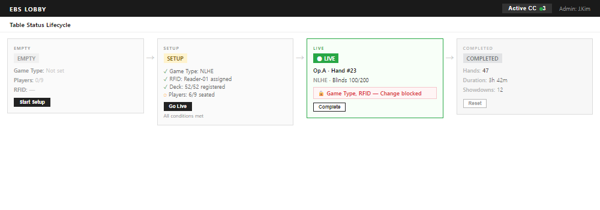

### H. Command Center 진입

| # | As a | When | Then | Edge Case |
|:-:|------|------|------|-----------|
| H-1 | Admin | 테이블 선택 → [Enter] | Command Center 진입 | Empty: Command Center 진입 불가 |
| H-2 | Operator | 할당 테이블 [Enter] | Command Center 진입 | 비할당: 비표시 |
| H-3 | Viewer | [Enter] | 읽기 전용 Command Center | 액션 버튼 비활성 |

### I. 멀티테이블 관제 (Admin Dashboard, Phase 3+)

> 다수의 Feature Table을 동시 운영하는 대규모 이벤트에서 Admin이 전체 테이블 상태를 한눈에 파악하는 Dashboard 뷰.

| # | As a | When | Then | Edge Case |
|:-:|------|------|------|-----------|
| I-1 | Admin | [Dashboard] 탭을 선택하면 | 모든 활성 테이블을 그리드 타일로 표시. 각 타일에 테이블명, 상태, 핸드 수, RFID 상태, 오버레이 미리보기 썸네일 | 활성 테이블 0개: "현재 Live 상태인 테이블이 없습니다" |
| I-2 | Admin | 타일을 클릭하면 | 해당 테이블 상세 패널 표시 (화면 3와 동일 정보) | — |
| I-3 | Admin | 테이블에 이상 발생 시 | 해당 타일에 경고 뱃지 표시 (RFID 끊김, 덱 에러, 출력 끊김) | — |
| I-4 | Admin | [Enter Command Center]를 타일에서 직접 클릭하면 | 해당 테이블 CC로 즉시 진입 | — |

**Dashboard 타일 정보:**

| 요소 | 소스 | 설명 |
|------|------|------|
| 테이블명 + Feature 뱃지 | `tables.name`, `tables.type` | Feature Table은 금색 테두리 |
| 상태 (Setup/Live/Completed) | `tables.status` | 색상 뱃지 |
| 현재 핸드 번호 | `hands.hand_number` | 실시간 갱신 |
| 플레이어 수 | `table_seats` COUNT | 현재/최대 |
| RFID 상태 | 실시간 | Ready/Disconnected/Error |
| 오버레이 미리보기 | 실시간 렌더링 | 축소 썸네일 |

### J. 장애 복구

> DB/API/서버/네트워크 장애 시 Lobby 동작 정의.

| # | As a | When | Then | Edge Case |
|:-:|------|------|------|-----------|
| J-1 | Admin | Back Office DB 연결이 끊기면 | "데이터베이스 연결 끊김. 자동 재연결 시도 중..." 배너 표시. 모든 CRUD 비활성. 읽기 전용 캐시로 목록 표시 | 30초 내 복구 시 자동 재연결 |
| J-2 | Admin | WSOP LIVE API 연결이 끊기면 | "API 연결 끊김" 배너. DB 캐시 데이터로 정상 운영 계속. 신규 플레이어 동기화만 중단 | Live 테이블 Command Center 영향 없음 |
| J-3 | Admin | 서버가 끊기면 (앱 서버) | "서버 연결 끊김. 재연결 시도 중..." 전체 화면 오버레이. 자동 재연결 5초 간격 | Live 테이블은 로컬 버퍼로 계속 동작 |
| J-4 | Admin | 네트워크가 전체 단절되면 | "네트워크 끊김" 전체 화면 오버레이. 로컬 캐시 읽기 전용. Command Center 진입 불가 | Live 중인 Command Center는 로컬 모드로 계속 |

### K. 세션 복원

> **📦 분리됨 (2026-04-14)**: 본 user story (K-1~K-4) 는 `BS-02-01-auth-session.md §유저 스토리 — K. 세션 복원` 으로 이관되었다.

---

## 경우의 수 매트릭스

### 테이블 CRUD 권한

| 역할 | Create | Edit | Delete | Duplicate | Command Center 진입 |
|:----:|:------:|:----:|:------:|:---------:|:------:|
| Admin | O | O | O | O | O |
| Operator | X | X | X | X | 할당 테이블만 |
| Viewer | X | X | X | X | 읽기 전용 |

### 상태 전환 조건 (Feature Table)

| 현재 | 대상 | 게임 설정 | 플레이어 1+ | 좌석 배치 | RFID 할당 | 덱 등록 | 결과 |
|:----:|:----:|:---------:|:----------:|:---------:|:---------:|:------:|------|
| Empty | Setup | O | O | — | — | — | 허용 |
| Empty | Setup | X | — | — | — | — | **차단** — "게임 종류를 선택하세요" |
| Empty | Setup | O | X | — | — | — | **차단** — "최소 1명 등록 필요" |
| Setup | Live | O | O | O | O | O | 허용 |
| Setup | Live | O | O | O | O | X | **차단** — "덱 등록을 완료하세요" |
| Setup | Live | O | O | O | X | — | **차단** — "RFID 리더를 할당하세요" |
| Setup | Live | O | O | X | O | O | **차단** — "좌석 배치를 완료하세요" |

### 상태 전환 조건 (General Table)

| 현재 | 대상 | 게임 설정 | 플레이어 1+ | 좌석 배치 | 결과 |
|:----:|:----:|:---------:|:----------:|:---------:|------|
| Empty | Setup | O | O | — | 허용 |
| Setup | Live | O | O | O | 허용 (RFID/덱 불필요) |

### Mock RFID 모드에서의 덱 등록 경로

Config에서 RFID 모드가 **Mock**일 때, Feature Table도 물리 RFID 리더 없이 Setup → Live 전환이 가능하다.

| RFID 모드 | 덱 등록 방법 | Setup → Live 조건 | 비고 |
|:---------:|:----------:|:----------------:|------|
| **Real** | 52장 실물 스캔 (BS-04-01) | RFID 할당 + 덱 등록 완료 필수 | 프로덕션 |
| **Mock** | "자동 등록" 1클릭 → 가상 52장 매핑 | 자동 등록 완료만 필수 (RFID 할당 불필요) | 개발/테스트/데모 |

**Mock 모드 전환**: Admin Settings > System > RFID Mode 토글. 핸드 진행 중 전환 불가 — Table IDLE 상태에서만.

> **참조**: Mock HAL 상세 → `../../../Contracts/api/API-03-rfid-hal-interface.md`, 덱 등록 행동 명세 → `../../../Team4Cc/Specs/BS-04-rfid/BS-04-01-deck-registration.md` (BS-04 는 team4 소유)

### RFID 상태 표시 (Feature Table)

| RFID 리더 | 덱 등록 | 표시 | 색상 |
|:---------:|:------:|------|:----:|
| Connected | 완료 | "Ready" | 초록 |
| Connected | 미완료 | "Deck Required" | 노랑 |
| Disconnected | — | "Disconnected" | 빨강 |
| Error | — | "Error" | 빨강 |
| 미할당 | — | "No Reader" | 회색 |
| **Mock** | 자동 등록 완료 | "Mock Ready" | 파랑 |
| **Mock** | 자동 등록 미완료 | "Mock — Deck Required" | 노랑 |

---

## Command Center 활성 시 Lobby 설정 잠금

Command Center가 테이블에 연결되어 LIVE 상태일 때, Lobby에서 해당 테이블의 일부 설정이 잠긴다.

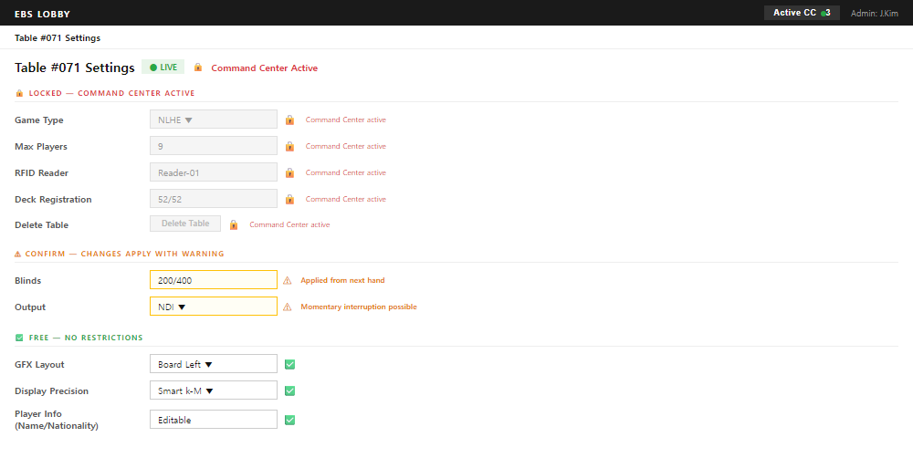

| 분류 | 필드 | 이유 | UI 표시 |
|:----:|------|------|---------|
| **LOCK** (변경 불가) | Game Type, Max Players, RFID Reader, Deck, Table 삭제, 상태 전환 | 방송 즉시 중단/오류 | 🔒 비활성 + "Command Center 활성 중" |
| **CONFIRM** (확인 후 허용) | Blinds, Output, Player 추가/제거 | 다음 핸드부터 영향 | ⚠ 확인 다이얼로그 |
| **FREE** (자유 변경) | GFX Layout, Display Precision, Player 정보(이름/국적) | 오버레이 표시만 변경 | ✅ 즉시 적용 |

---

## 장애 시 기능 축소 매트릭스 (Graceful Degradation)

| 장애 유형 | 영향 범위 | 가용 기능 | 불가 기능 | 자동 복구 | 사용자 메시지 |
|----------|----------|----------|----------|:---------:|-------------|
| **DB 끊김** | Lobby 전체 | 읽기 전용 캐시 표시 | 모든 CRUD, 상태 전환, Command Center 진입 | O (30초 간격 재시도) | "데이터베이스 연결 끊김. 자동 재연결 시도 중..." |
| **WSOP LIVE API 끊김** | 동기화만 | Lobby CRUD, Command Center, 핸드 기록 (DB 캐시 사용) | 신규 플레이어 동기화, 실시간 통계 갱신 | O (60초 간격 재시도) | "API 연결 끊김. 캐시 데이터로 운영 중" |
| **앱 서버 끊김** | Lobby UI | 없음 (전체 화면 차단) | 모든 기능 | O (5초 간격 재시도) | "서버 연결 끊김. 재연결 시도 중..." |
| **네트워크 전체 단절** | 전체 시스템 | 로컬 캐시 읽기 전용 | CRUD, Command Center 진입, 동기화 | X (수동 복구) | "네트워크 연결 끊김" |

> 참고: **Live 테이블 보호 정책** — DB/API/서버 장애가 발생해도 이미 CC에 진입하여 Live 중인 테이블은 로컬 버퍼로 계속 동작한다. 핸드 데이터는 로컬에 임시 저장되고 연결 복구 후 DB에 동기화된다.

**추가 비활성 조건:**

- 로그인 전: Lobby 접근 불가 (BS-01 Auth 선행)
- Operator + 할당 테이블 없음: Lobby 진입 가능하나 빈 목록

---

## 영향 받는 요소

| 요소 | 관계 | 설명 |
|------|:----:|------|
| **Back Office DB** | 양방향 | 모든 CRUD 작업의 영구 저장소. Lobby = DB의 UI 계층 |
| BS-01 Auth | 선행 | 로그인 + 역할 할당이 Lobby 접근 전제조건 |
| BS-03 Settings | 양방향 | **글로벌 Settings** — 모든 CC 인스턴스에 동일 적용 (테이블별 Settings 없음). Lobby 헤더 [⚙]에서 별도 화면으로 접근. Save 시 WebSocket ConfigChanged → 모든 CC 일괄 반영 |
| BS-04 RFID | 선행 | Feature Table Setup → Live에 덱 등록 완료 필수 |
| BS-05 Command Center | 후행 | Lobby에서 테이블 선택 → Command Center 진입. Command Center 핸드 데이터가 DB에 기록 |
| Game Engine (API-04 권위) | 후행 | Lobby 게임 설정이 Engine 초기화 파라미터 — 권위: `docs/2. Development/2.3 Game Engine/APIs/Overlay_Output_Events.md §6.0` (구 BS-06 family) |
| BS-07 Overlay | 후행 | Feature Table 오버레이 미리보기 썸네일 |
| WSOP LIVE API | 외부 | 선수 정보 수신 → Back Office DB `players` 테이블에 캐싱 |

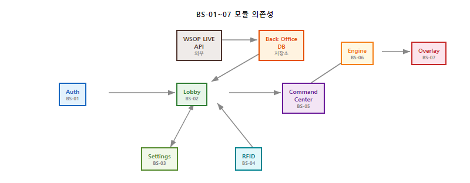

---

## WSOP LIVE API 데이터 매핑

### 124개 필드 소스별 분류

| 소스 | 필드 수 | 설명 |
|------|:-------:|------|
| **WSOP LIVE API** | ~55 | Series/Event/Flight/Table/Seat/Player 조회 |
| **EBS 전용** (방송/Mix/RFID) | ~15 | type, rfid, deck, output, game_mode, allowed_games 등 |
| **Command Center 생성** (Hand/Action) | ~23 | hand, hand_players, hand_actions |
| **Engine 계산** | ~5 | hand_rank, win_probability, street 등 |
| **RFID** | ~2 | hole_cards, community_cards |
| **Hand History 계산** | ~4 | VPIP, PFR, AGR, Cumulative P&L |
| **EBS 로컬** | ~6 | 세션 복원 데이터 |
| **총계** | **124** | |

### API 호출 흐름

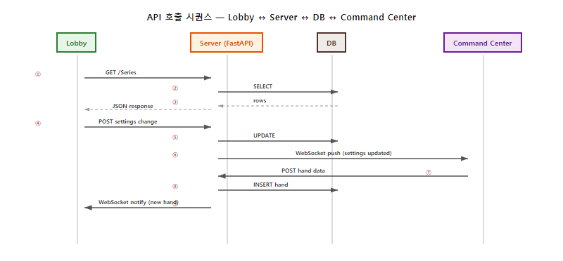

### 수동 입력 → API 동기화 규칙

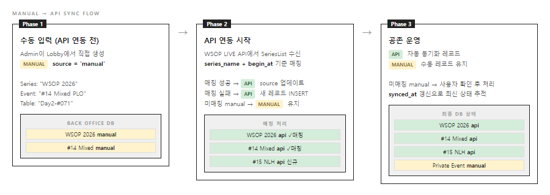

---

## Hand History

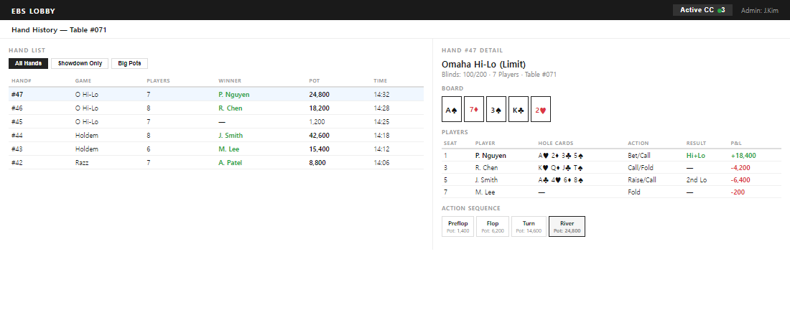

포커 1판(핸드)은 **Preflop**(첫 베팅) → **Flop**(공유 카드 3장 공개) → **Turn**(4번째 공개) → **River**(5번째 공개) 순서로 진행된다. 각 단계마다 플레이어가 Bet/Call/Raise/Fold 중 선택한다.

### 접근 경로

| 경로 | 트리거 | 발동 주체 |
|------|--------|----------|
| 테이블 카드 > [History] 버튼 | 해당 테이블의 핸드 목록 표시 | Admin/Operator (수동) |
| 플레이어 상세 > [Hands] 탭 | 해당 플레이어의 핸드 목록 표시 | Admin/Operator (수동) |
| Completed 테이블 > [Review] | 완료된 테이블의 전체 핸드 리뷰 | Admin (수동) |

### Hand 목록 구조

| 컬럼 | DB 소스 | 설명 |
|------|---------|------|
| Hand # | `hands.hand_number` | 핸드 번호 |
| Game | `hands.game_type` | 게임 종류 (Mix 시 핸드별 다름) |
| Pot | `hands.pot_total` | 팟 총액 |
| Players | `hand_players` COUNT | 참여 인원 |
| Winner | `hand_players.is_winner` | 승자 이름 |
| Duration | `hands.duration_sec` | 핸드 소요 시간 |
| Time | `hands.started_at` | 시작 시각 |

### Hand 상세 구조

| 섹션 | DB 소스 | 설명 |
|------|---------|------|
| Board Cards | `hands.board_cards` | 커뮤니티 카드 |
| Player Hands | `hand_players.hole_cards` | 각 플레이어 홀카드 |
| Action Sequence | `hand_actions` | 스트릿별 액션 시퀀스 (Preflop→Flop→Turn→River) |
| Winner / P&L | `hand_players.is_winner`, `pnl` | 승자 및 손익 |
| Hand Rank | `hand_players.hand_rank` | 핸드 랭크 |
| Win Probability | `hand_players.win_probability` | 승률 (%) |

### Hand History 통계 (오버레이용)

| 통계 | 계산 방식 | DB 소스 | 오버레이 표시 |
|------|----------|---------|:----------:|
| **VPIP** | Preflop 자발적 팟 참여율 | `hand_actions` (Preflop, action_type != Fold/Check) | O |
| **PFR** | Preflop Raise 비율 | `hand_actions` (Preflop, action_type = Raise) | O |
| **AGR** | Aggression Rate | `hand_actions` (Bet+Raise / Call) | O |
| **Cumulative P&L** | 누적 손익 | `hand_players.pnl` SUM | O |

---

## 알림 + 감사 로그

### 알림 유형 매트릭스

| 알림 유형 | 트리거 | 대상 | 우선순위 | 표시 방식 |
|----------|--------|------|:--------:|----------|
| RFID 연결 끊김 | RFID 리더 disconnect | Admin + 해당 Operator | **높음** | 빨강 배너 + 사운드 |
| 덱 등록 미완료 | Setup → Live 시도 시 | Admin | **높음** | 차단 다이얼로그 |
| DB 연결 끊김 | DB heartbeat(주기적 연결 확인 신호) 실패 | 전체 | **높음** | 전체 화면 배너 |
| API 동기화 실패 | API 호출 실패 3회 연속 | Admin | 중간 | 노랑 배너 |
| 테이블 상태 변경 | Live → Completed 등 | Admin | 중간 | 토스트 알림 |
| 플레이어 이동 | 좌석 변경/테이블 이동 | 해당 Operator | 낮음 | 토스트 알림 |
| 세션 만료 임박 | 인증 토큰 만료 5분 전 | 해당 사용자 | 낮음 | 노랑 배너 |

### 감사 로그 항목

| 항목 | 기록 내용 | 보존 기간 |
|------|----------|----------|
| 테이블 CRUD | 생성/수정/삭제, 실행 사용자, 타임스탬프 | 시리즈 종료 후 1년 |
| 상태 전환 | Empty→Setup→Live→Completed, 실행 사용자 | 시리즈 종료 후 1년 |
| 플레이어 등록/제거 | 대상 플레이어, 실행 사용자, 사유 | 시리즈 종료 후 1년 |
| 좌석 배치 변경 | 이전/이후 좌석, 실행 사용자 | 시리즈 종료 후 1년 |
| RFID 리더 할당/해제 | 리더 ID, 테이블, 실행 사용자 | 시리즈 종료 후 1년 |
| 로그인/로그아웃 | 사용자, IP, 역할, 타임스탬프 | 시리즈 종료 후 1년 |
| 장애 발생/복구 | 장애 유형, 발생/복구 시각, 영향 범위 | 시리즈 종료 후 1년 |

---

## Back Office DB 스키마


```sql
-- Series (WSOP LIVE API 또는 수동)
series (
  series_id, series_name, year, competition_id, competition_name,
  begin_at, end_at, image_url, time_zone, currency, country_code,
  is_completed, is_displayed, is_demo, source, synced_at
)

-- Events (WSOP LIVE API 또는 수동)
events (
  event_id, series_id FK, event_no, event_name,
  buy_in, display_buy_in, game_type, blind_structure_id,
  starting_chip, table_size, total_entries, players_left,
  start_time, status, extra_game_type_list,
  -- EBS 전용 (Mix)
  game_mode, allowed_games, rotation_order, rotation_trigger,
  source, synced_at
)

-- Event Flights (API 또는 Event 생성 시 Days 옵션)
event_flights (
  event_flight_id, event_id FK, display_name,
  start_time, is_tbd, entries, players_left,
  status, play_level, remain_time,
  source, synced_at
)

-- Blind Structure (Event 인라인)
blind_structure_levels (
  id, blind_structure_id, level_no,
  small_blind, big_blind, ante, duration_minutes
)

-- Tables (수동 생성 주도)
tables (
  table_id, event_flight_id FK, table_no, ring,
  is_breaking_table, status,
  -- EBS 전용
  type, rfid_reader_id, deck_registered,
  output_type, current_game, delay_seconds,
  source
)

-- Seats (API 동기화 + Command Center 갱신)
table_seats (
  seat_id, table_id FK, seat_no,
  player_id, wsop_id, player_name,
  nationality, country_code, chip_count,
  profile_image, status, player_move_status
)

-- Players (API 캐시 + 수동)
players (
  player_id, wsop_id, first_name, last_name,
  nationality, country_code, profile_image,
  player_status, is_demo, source, synced_at
)

-- Hands (Command Center 생성)
hands (
  hand_id, table_id FK, hand_number,
  game_type, bet_type, dealer_seat,
  board_cards, pot_total, side_pots,
  current_street, started_at, duration_sec
)

-- Hand Players (Command Center 생성)
hand_players (
  id, hand_id FK, seat_no, player_id,
  hole_cards, final_action, is_winner,
  pnl, hand_rank, win_probability
)

-- Hand Actions (Command Center 생성)
hand_actions (
  id, hand_id FK, seat_no,
  action_type, action_amount,
  street, action_order
)

-- Session (EBS 로컬)
user_sessions (
  user_id, role, last_series_id, last_event_id,
  last_flight_id, last_table_id, last_screen,
  updated_at
)
```

---

## 부록: WSOP LIVE 소스 매핑

| EBS Lobby 기능 | WSOP LIVE 원본 | Page ID | 적용 방식 |
|---------------|---------------|---------|----------|
| 테이블 카드 목록 | [03. Tournament Manager](https://ggnetwork.atlassian.net/wiki/spaces/WSOPLive/pages/1597800724) — Tournament List | 1597800724 | Tournament → Table. 카드 UI + 필터 패턴 유지 |
| 상태 필터 | 03장 Status 필터 (8종) | 1597800724 | 4상태로 단순화 (Empty/Setup/Live/Completed) |
| 게임 종류 필터 | 03장 Game Type 필터 | 1597800724 | Buy-In 제거, 유형(Feature/General) 추가 |
| 테이블 생성 다이얼로그 | 03장 Tournament Create | 1597800724 | Template → Duplicate로 단순화 |
| 테이블 요약 패널 | [04. Tournament Admin](https://ggnetwork.atlassian.net/wiki/spaces/WSOPLive/pages/1597735085) — Dashboard | 1597735085 | Financial 제거. RFID/출력/덱 상태 추가 |
| Feature Table 강조 | [Featured Table.](https://ggnetwork.atlassian.net/wiki/spaces/WSOPLive/pages/1909424747) | 1909424747 | 별 뱃지 + 목록 최상단 + Delay Time |
| 플레이어 등록 | [Table Management](https://ggnetwork.atlassian.net/wiki/spaces/WSOPLive/pages/1615528545) — Player Add | 1615528545 | DB 캐시 검색 + 수동 입력 폴백 |
| 좌석 배치 | [Seat Draw in Advance](https://ggnetwork.atlassian.net/wiki/spaces/WSOPLive/pages/2837708988) + Place Here | 2837708988 | Random/Manual. 드래그 앤 드롭 |
| 수동 Series/Event 생성 | SysOp Admin > Series/Event CRUD 참조 | — | Staff Page 동일 필드 구조. API 연동 전 수동 생성 폴백 |
| Mix 게임 모드 | SysOp Admin > Event GameType + ExtraGameTypeList | — | 3-Mode (Single/Fixed/Choice), 11 프리셋 |
| **미적용** | Clock, Blind Structure, Prize, Registration, Day/Flight, Room | — | 토너먼트 관리 기능 — EBS 범위 외 |

---

## 수동 생성 폼 상세

WSOP LIVE API 미연동 시, 운영자가 수동으로 Series/Event/Flight를 생성한다. 이 섹션은 각 폼의 필수 필드, 검증 규칙, 기본값을 정의한다.

> 참조: SysOp(WSOP LIVE 시스템 운영 관리자 도구) 패턴 — WSOP LIVE에서도 API 연동 전 수동 입력 지원

### Series 생성 폼

| 필드 | 타입 | 필수 | 기본값 | 검증 규칙 |
|------|------|:----:|--------|----------|
| Series Name | Input (text) | O | — | 1~100자, 중복 불가 |
| Year | Input (number) | O | 현재 연도 | 2020~2030 |
| Start Date | DatePicker | O | 오늘 | End Date 이전 |
| End Date | DatePicker | O | 오늘+30일 | Start Date 이후 |
| Description | Textarea | X | — | 최대 500자 |

**에러 메시지**:
| 조건 | 메시지 |
|------|--------|
| 이름 중복 | "이미 존재하는 Series 이름입니다" |
| 날짜 역전 | "End Date는 Start Date 이후여야 합니다" |

### Event 생성 폼

| 필드 | 타입 | 필수 | 기본값 | 검증 규칙 |
|------|------|:----:|--------|----------|
| Event Number | Input (number) | O | 자동 증가 | 1~999, Series 내 유일 |
| Event Name | Input (text) | O | — | 1~200자 |
| Game Type | Select | O | NL Hold'em | 22종 게임 — 권위: `../../2.3 Game Engine/Behavioral_Specs/Lifecycle_and_State_Machine.md` §2.6 `event_game_type` Enum + `Variants_and_Evaluation.md` §2.1 25 게임 마스터 (구 `Triggers.md` (legacy-id: `Triggers.md` (legacy-id: `Triggers.md` (legacy-id: BS-06-00-triggers))), 2026-04-27 통합) |
| Game Mode | Select | O | Single | Single / Fixed Rotation / Dealer's Choice |
| Buy-In Level | Select | X | — | Low/Medium/High/Super High Roller |
| Max Players Per Table | Input (number) | O | 9 | 2~10 |
| Start Date | DatePicker | O | 오늘 | Series 기간 내 |

**Game Mode = Fixed Rotation 시 추가 필드**:
| 필드 | 타입 | 필수 | 설명 |
|------|------|:----:|------|
| Rotation Games | MultiSelect | O | 회전 게임 목록 (HORSE=5종, 8-Game=8종 등) |
| Hands Per Rotation | Input (number) | O | 회전당 핸드 수 (기본 8) |

**Game Mode = Dealer's Choice 시 추가 필드**:
| 필드 | 타입 | 필수 | 설명 |
|------|------|:----:|------|
| Available Games | MultiSelect | O | 선택 가능한 게임 풀 |

### Flight 생성 폼

| 필드 | 타입 | 필수 | 기본값 | 검증 규칙 |
|------|------|:----:|--------|----------|
| Flight Name | Input (text) | O | "Day 1A" | 1~50자, Event 내 유일 |
| Date | DatePicker | O | 오늘 | Event 기간 내 |
| Starting Stack | Input (number) | O | 60000 | 1~10,000,000 |
| Starting Blind Level | Input (number) | O | 1 | 1~50 |

### 공통 동작

| 동작 | 설명 |
|------|------|
| [Create] | 유효성 검증 → 성공 시 BO DB 저장 + 리스트 갱신 |
| [Cancel] | 폼 닫기, 입력값 폐기 |
| 중복 검사 | 서버 측에서 수행, 409 Conflict 반환 시 에러 표시 |
| 자동 저장 | 없음 — 명시적 [Create] 클릭 필수 |

---

## Hand History 표시

Lobby Table 상세 화면에서 해당 테이블의 핸드 기록을 표시한다.

| 항목 | 설명 |
|------|------|
| 표시 위치 | Table 상세 → Hand History 탭 |
| 데이터 소스 | `GET /api/Tables/:id/hands` |
| 기본 정렬 | 최신 핸드 우선 |
| 표시 필드 | Hand#, Game Type, Players, Pot, Winner, Duration |
| 상세 보기 | 핸드 클릭 → 액션별 타임라인 |

---

## 알림 시스템

Lobby 헤더에 알림 벨 아이콘으로 운영 알림을 표시한다.

| 알림 유형 | 트리거 | 표시 방식 |
|----------|--------|----------|
| CC 연결 | CC Launch/종료 | 토스트 (3초) |
| 테이블 상태 | Empty→Setup→Live | 토스트 + 알림 목록 |
| RFID 이상 | 미인식/중복 | 경고 배너 (수동 닫힘) |
| 서버 연결 | 끊김/복구 | 영구 배너 |
| 설정 변경 | Admin Config 변경 | 토스트 |

---

## 폼 검증 규칙

| 규칙 | 적용 대상 | 에러 메시지 |
|------|----------|-----------|
| 필수 필드 비어있음 | 모든 필수 필드 | "이 필드는 필수입니다" |
| 문자열 길이 초과 | Name, Description | "최대 {max}자까지 입력 가능합니다" |
| 숫자 범위 초과 | Players, Blinds | "{min}~{max} 범위에서 입력하세요" |
| 날짜 역전 | Start/End Date | "종료일은 시작일 이후여야 합니다" |
| 중복 이름 | Series/Event/Flight | "이미 존재하는 이름입니다" (서버 409) |
| 특수문자 | Name 필드 | 허용: 영문, 숫자, 공백, -_#. 나머지 불가 |

> **동작**: 클라이언트 측 즉시 검증 + 서버 측 최종 검증. 서버 에러(4xx)는 해당 필드에 인라인 표시.
