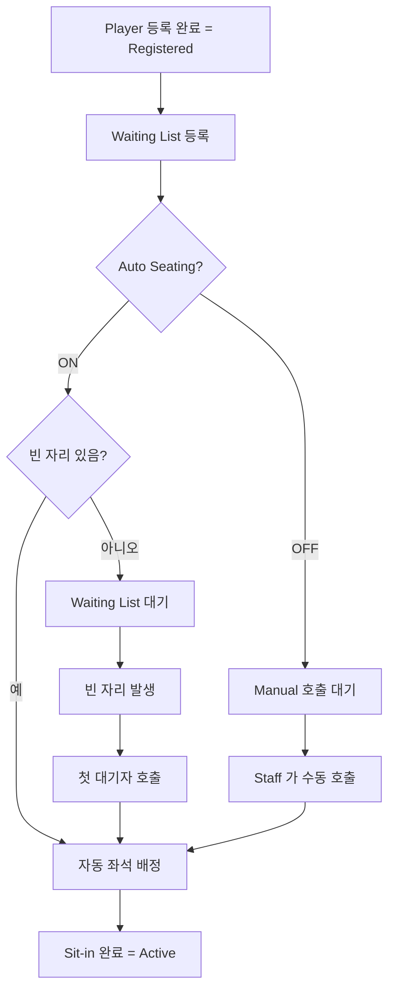

# Lobby — Tournament Registration · Sit-in · Seating

| 날짜 | 항목 | 내용 |
|------|------|------|
| 2026-04-15 | 신규 작성 | WSOP LIVE Confluence p1616674829 (Tournament Registration, Sit-in, Seating) 의 기능을 EBS Lobby 에 반영. team1 발신, Round 2 Phase A. |
| 2026-05-07 | v3 cascade | Lobby v3.0.0 정체성 정합 — WSOP LIVE 정보 허브 framing 추가 (additive only). |

---

## 개요

> **WSOP LIVE 정보 허브 역할 (Lobby v3.0.0 cascade, 2026-05-07)**: 운영자가 5 분 게이트웨이 동안 확인하는 **Tournament Registration · Sit-in · Seating**. Lobby = WSOP LIVE 거울의 한 면.

Tournament 등록 수락·거부, Sit-in 처리, Seating 배정, Late Registration 컨트롤, No-Show 처리, Refund 절차를 Lobby 에서 관리한다.

**근거**: [WSOP LIVE Tournament Registration · Sit-in · Seating p1616674829](https://ggnetwork.atlassian.net/wiki/spaces/WSOPLive/pages/1616674829/Tournament+Registration%2C+Sit-in%2C+Seating)

**RBAC**: 단계별 권한 분리
- **Registration**: Cashier · Tournament Director
- **Sit-in / Seating**: Floor Manager · Tournament Director
- **Refund / Prize Distribution**: Tournament Director (단독)

---

## 1. Registration (등록 처리)

### 1.1 등록 접수

| 동작 | 정의 |
|------|------|
| **수락** | Player ID + 결제 확인 후 Tournament Entry 생성. Status: `Registered` |
| **거부** | 등록 거부 사유 입력. Player 에게 알림 |
| **취소** | 등록 후 취소 (Late Reg 종료 전). Refund 트리거 |
| **Re-entry** | Eliminated 후 재등록. Entry Type 이 `Multiple Entries` 또는 `Re-entry Allowed` 인 경우만 |

### 1.2 Late Registration

| 컨트롤 | 동작 |
|--------|------|
| **Late Reg Open** | Late Reg 기간 진입 (자동, 첫 핸드 시작 시) |
| **Late Reg Close** | 종료 시각 도달 또는 수동 종료 |
| **Late Reg Override** | TD 가 종료 시각 변경 (Clock_Control 의 `Adjust Late Reg`) |

Late Reg 종료 시각 계산: `Event_and_Flight.md §Late Registration 타이머 공식` 참조.

### 1.3 Entry Type 별 등록 규칙

| Entry Type | 등록 규칙 |
|------------|----------|
| **Freezeout** | 1회 등록, Eliminated 후 재등록 불가 |
| **Multiple Entries** | 한 번에 여러 Entry 등록 가능 (테이블 이동 후 새 Entry) |
| **Stack Choice** | 등록 시 시작 스택 선택 (예: 5만/10만/20만, 다른 buy-in) |
| **Accumulator** | Late Reg 기간에 추가 Entry 가능. 모든 Entry 의 스택 합산 (또는 분리) |

---

## 2. Sit-in (착석 처리)

### 2.1 Sit-in 흐름



### 2.2 Waiting List 관리

| 동작 | 정의 |
|------|------|
| **순서 유지** | 등록 시각 순. 변경 가능 (TD 권한) |
| **호출** | "Player X, please come to Table N Seat M" 메시지 (Lobby 알림 + Player 모바일 알림 옵션) |
| **응답 대기** | 기본 5분. 미응답 시 No-Show 처리 |
| **수동 우선 호출** | TD 가 특정 Player 를 위로 |

### 2.3 Reserve Seat 처리

Waiting List 의 Player 가 Sit-in 시:
- Reserve Seat 가 있으면 Reserve 자동 해제 후 배정
- Reserve Table 에는 배정 불가 (Auto Seating 동일)

---

## 3. Seating (좌석 배정)

상세는 `Table.md §7.1 Player CRUD` 와 `§7.2 Auto Seating vs Manual Seating` 참조. 본 섹션은 등록·Sit-in 관점만.

### 3.1 초기 Seating

Tournament 시작 시 모든 등록자를 일괄 Seating:

| 모드 | 동작 |
|------|------|
| **Auto** | Random 알고리즘 (`Table.md §7.4` 의 색상 코드 알고리즘) |
| **Manual** | TD 가 모든 좌석 수동 배정. 보통 큰 대회 결승 테이블에 사용 |
| **Seat Draw in Advance** | 시작 전 일괄 추첨 후 결과 공개 |

### 3.2 Late Reg 동안 Seating

Late Reg 기간 등록자는 즉시 Sit-in 가능. Auto Seating ON 일 때 빈 자리 우선, 만석 시 대기.

---

## 4. No-Show 처리

| 시점 | 동작 |
|------|------|
| Sit-in 호출 후 5분 경과 | "No-Show" 마킹. 자리 보존 |
| 추가 5분 (총 10분) | 자동 Forfeit (시작 스택의 BB 비용 차감) |
| 30분 경과 | Eliminated 처리 + Refund 거부 (Tournament Rule 에 따름) |

| 컨트롤 | 동작 |
|--------|------|
| **Mark No-Show** | 수동 마킹 |
| **Wait More** | 추가 시간 부여 (TD 재량) |
| **Force Eliminate** | 즉시 탈락 처리 |

---

## 5. Tournament Refund (환불)

### 5.1 ITM 전 (In The Money 도달 전)

| 케이스 | Refund |
|--------|--------|
| Late Reg 기간 자발 취소 | 100% 환불 |
| Late Reg 종료 전 Eliminated 자발 환불 요청 | 거부 (Tournament Rule) |
| 시스템 장애로 Eliminated | 100% 환불 (TD 승인) |

### 5.2 ITM 후 (In The Money 도달 후)

| 케이스 | Refund |
|--------|--------|
| ITM 도달 후 자발 취소 | 거부. Prize 만 지급 |
| 시스템 장애 | Prize Distribution 재계산 (TD 단독 승인) |

### 5.3 Prize Distribution 처리

`Prize Pool & Payout` 모듈에서 처리 (별도 sprint, `Lobby/Backlog.md` Top 1 항목).

---

## 6. UI 레이아웃

```
┌─ Tab: Registration ──────────────────────────────┐
│ Registered: 1240   Waiting: 12   Active: 1228   │
│ Sit-in: [Auto ON]   Late Reg: ⏱ 02:34:00 left  │
├──────────────────────────────────────────────────┤
│ ⚙ Filter: All / Waiting / Active / Eliminated   │
│                                                  │
│ ┌──────────────────────────────────────────────┐│
│ │ #  │ Name       │ Status   │ Table │ Action ││
│ ├────┼────────────┼──────────┼───────┼────────┤│
│ │ 1  │ John Smith │ Active   │ T-3 S5│ ⋯      ││
│ │ 2  │ Jane Doe   │ Waiting  │ —     │ Call   ││
│ │ 3  │ ...        │ No-Show  │ —     │ Force  ││
│ └──────────────────────────────────────────────┘│
│                                                  │
│ [+ Register]  [Bulk Sit-in]  [Print Tickets]    │
└──────────────────────────────────────────────────┘
```

진입: Lobby Flight 페이지 헤더의 `[Registration]` 탭. Active 인원·Waiting·Late Reg 카운트는 `event_flight_summary` WebSocket 이벤트로 실시간.

---

## 7. UI 상태

`../Engineering.md §4.7 공통 UI 상태` 를 따른다.

| 상황 | UI |
|------|-----|
| Registration 목록 로딩 | QSkeleton (예상 행수만큼) |
| 빈 상태 (등록자 0) | EmptyState "첫 등록을 받으세요" + `[+ Register]` 버튼 (Cashier/TD 만) |
| Bulk Sit-in 진행 중 | 전체 화면 진행률 바 |
| 자동 호출 알림 | Positive Toast "Player N 호출됨" |
| No-Show 자동 마킹 | Warning Banner "Player M no-show 처리됨" |

---

## 8. WebSocket 이벤트

| 이벤트 | 클라이언트 처리 |
|--------|---------------|
| `event_flight_summary` | 카운트 카드 갱신 (Registered/Waiting/Active 등) |
| `tournament_status_changed` | Late Reg Open/Close 배지 갱신 |
| (신규 필요) `registration_changed` | Registration 행 추가/삭제/상태 변경 |
| (신규 필요) `sitin_called` | Waiting → 호출 알림 |

> 신규 이벤트 2종은 Backend NOTIFY 필요 (`docs/2. Development/2.2 Backend/Backlog.md` 에 등재).

---

## 9. 트리거

| 트리거 | 주체 | 결과 |
|--------|:----:|------|
| `[+ Register]` 클릭 | Cashier/TD | Player 검색 모달 → 등록 모달 |
| `[Call]` 버튼 | Floor Manager/TD | Sit-in 호출 + 알림 발송 |
| `[Force Eliminate]` | TD | No-Show 처리 후 Eliminated |
| Late Reg 종료 시각 도달 | 시스템 자동 | Late Reg Close + 신규 등록 차단 |
| ITM 도달 | 시스템 자동 | Refund 정책 변경 (§5.2 적용) |

---

## 10. 경우의 수 매트릭스

| 조건 | Register | Sit-in | Refund |
|------|:-------:|:------:|:------:|
| Late Reg 진행 중 | ✓ | ✓ | ✓ (자발 취소 100%) |
| Late Reg 종료 후 | ✗ | Waiting List 만 가능 | 거부 (자발) |
| ITM 도달 | ✗ | — | TD 단독 승인 시 Prize 재계산 |
| Tournament Completed | ✗ | ✗ | 거부 |
| WebSocket 단절 | HTTP 만 가능, 실시간 카운트 미갱신 | 동 위 | 동 위 |

---

## 11. 유저 스토리

| # | As a | When | Then |
|:-:|------|------|------|
| R-1 | Cashier | `[+ Register]` → Player 검색 → 결제 확인 → 등록 | Registered 카운트 +1, Waiting List 추가 |
| R-2 | Floor Manager | Player 호출 `[Call]` 클릭 | 알림 발송, 5분 카운트다운 시작 |
| R-3 | Floor Manager | Player 5분 미응답 | 자동 No-Show 마킹 + 추가 5분 부여 |
| R-4 | TD | Late Reg 종료 시각 변경 | Clock_Control `[Adjust Late Reg]` 사용 |
| R-5 | TD | 시스템 장애로 Player 환불 처리 | `[Force Refund]` → 사유 입력 → 100% 환불 |
| R-6 | Player (외부) | Late Reg 기간 등록 | Cashier 처리 후 자동 Sit-in (Auto ON 시) |

---

## 12. EBS divergence

| 항목 | WSOP LIVE | EBS |
|------|-----------|-----|
| Player 모바일 알림 | 별도 Player App 으로 push | EBS 는 Player App 미보유 (Phase 2+ 검토). Lobby 알림 + 카지노 PA 만 |
| Cashier Role | 독립 권한 | EBS 는 Admin 권한에 통합 (Cashier 별도 권한 미추가) |
| Bulk Sit-in | 제공 | 제공 (동일) |
| Refund Workflow | 단계별 승인 (Cashier → TD) | TD 단독 승인 (간소화). Cashier 권한 추가 시 변경 |
| Prize Distribution | 통합 모듈 | 별도 sprint (Lobby Backlog Top 1) |

---

## 13. 연관 문서

- `Table.md §7` — Player CRUD · Auto/Manual Seating · Seat 색상 코드
- `Clock_Control.md §1, §2.2` — Late Reg Open/Close 트리거
- `Event_and_Flight.md` — Entry Type 정의 · Late Reg 공식
- `Operations.md` — Player 검색 · Audit Log
- `../Engineering.md §5.4` — WebSocket 구독 매트릭스
- WSOP LIVE Confluence p1616674829 — 원본
