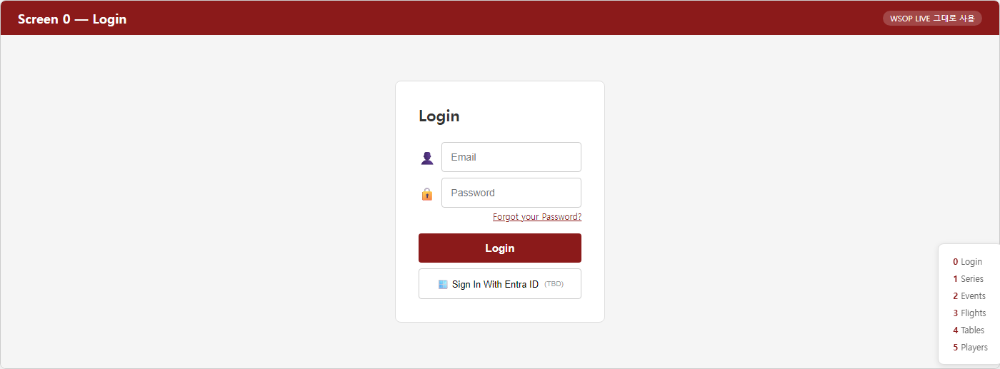

# EBS Lobby — 5 화면 시퀀스 + WSOP LIVE 정보 허브

> **Lobby 는 머무는 곳이 아니다. Command Center 로 들어가기 위해, 거기서 나오기 위해, 어긋났을 때 돌아오기 위해 — 잠깐 거치는 게이트웨이. 그 짧은 머무름 동안 WSOP LIVE 의 모든 진실이 한 화면에 펼쳐진다.**

운영자가 하루 종일 쳐다보는 화면은 Lobby 가 아니다. 그 화면은 **Command Center** — 한 테이블, 한 핸드, 한 베팅 — 다.

그러면 Lobby 는 무엇인가.

Lobby 는 **CC 에 들어가는 게이트웨이** 다. 호텔 로비처럼 — 객실로 들어가기 전, 객실에서 나올 때, 컨시어지에 무언가 물을 때 거치는 곳.

그리고 그 짧은 머무름 동안 Lobby 는 한 가지를 한다. **WSOP LIVE 와 연동된 모든 정보** — 어느 대회, 어느 이벤트, 며칠 차, 누가 살아남았는지, 다음 레벨까지 얼마나 — 를 한 화면에 모은다.


> *FIG · Lobby (게이트웨이 + 정보 허브) ↔ Command Center (실 작업 화면).*

운영자가 Lobby 를 보는 시점은 4 가지 — 처음 진입할 때, 어딘가 어긋났을 때, 게임이 바뀔 때, 모든 것이 끝날 때.

이 문서는 그 4 진입을 **운영자가 통과하는 화면 시퀀스** 로 따라간다.

---

## 이 문서가 데려가는 곳

<table role="presentation" width="100%">
<tr>
<td width="50%" valign="top" align="left">

**입구 — 지금 당신의 상태**

EBS Lobby 가 무엇인지 모릅니다. WSOP LIVE 와 어떤 관계인지, 운영자가 언제 보는지, 어떤 화면들이 있는지 모릅니다.

</td>
<td width="50%" valign="top" align="left">

**출구 — 이 문서를 끝까지 읽은 후**

4 진입 시점에서 운영자가 통과하는 화면 시퀀스를 그릴 수 있습니다. **Login → Series → Event → Flight → Tables → Launch** 의 흐름과, 각 화면이 WSOP LIVE 의 어떤 정보를 펼치는지 알게 되고, 그 시스템을 직접 만들 수 있습니다.

</td>
</tr>
</table>

---

## 목차

```
  PROLOGUE              머무는 곳이 아니다

  ACT I — 4 가지 진입 시점
    Ch.1   첫 진입       CC 를 처음 켤 때 (5 화면 시퀀스)
    Ch.2   비상 진입     RFID 가 꺼졌을 때
    Ch.3   변경 진입     게임이 바뀔 때
    Ch.4   종료 진입     방송이 끝날 때

  ACT II — Lobby 가 펼치는 WSOP LIVE 정보
    Ch.5   Series         어느 대회인가
    Ch.6   Event + Flight 어느 토너먼트, 며칠 차
    Ch.7   Players        칩 카운트가 어디서 오는가
    Ch.8   Tables Grid    124 줄의 한 줄 요약 + 3 view

  ACT III — Lobby 가 사라지면 (반증)
    Ch.9   각자 SSH 로 들어가는 세상
    Ch.10  WSOP LIVE 정보를 매번 따로 조회하는 운영실
    Ch.11  그래서 Lobby 가 게이트웨이 + 정보 허브로 존재한다

  EPILOGUE              짧은 머무름이 작업 시간을 작동시킨다

  부록 A~G              Lobby 개발자 reference (스크린샷 갤러리 + 데이터 모델)
```

> **약어**: BO (Back Office, 중앙 서버) · CC (Command Center, 테이블 PC 운영 화면) · RFID (무선 카드 인식) · NDI/SDI (방송 영상 신호) · LIVE/IDLE/ERROR (CC 3 상태). 부록 G 에 전체 사전.

---

# PROLOGUE — 머무는 곳이 아니다

운영자가 Command Center 에 들어가기 위해서는, 먼저 Lobby 를 통과해야 한다.

Lobby 는 운영자에게 다섯 가지를 차례로 묻는다 —

```
   누구입니까          ──→  Login
   어느 대회입니까     ──→  Series
   어느 이벤트입니까   ──→  Event
   며칠 차입니까       ──→  Flight
   어느 테이블입니까   ──→  Tables
                            │
                            ▼
                       [Launch ⚡] CC 시작
```

다섯 번의 답을 거치면 Command Center 가 열리고, Lobby 는 닫힌다.

이 다섯 화면이 본 문서의 1 막이다. 각 화면은 **WSOP LIVE API** 에서 BO (Back Office) 로 흘러들어 온 데이터를 운영자에게 보여준다.

---

# ACT I — 4 가지 진입 시점

## Ch.1 — 첫 진입: CC 를 처음 켤 때

운영자가 Lobby 를 처음 여는 순간, 그는 5 화면을 차례로 통과한다.

### 1.1 — Login



> *FIG · Login. EBS v5.0.0 — WSOP LIVE Integrated Broadcast System.*

두 가지 인증 경로 중 하나 — Email + Password (TOTP 2FA 포함) 또는 Entra ID OAuth.

로그인이 성공하면 BO 가 그의 권한 (Admin / Operator / Viewer) 을 자동 적용한다. 화면과 버튼이 권한에 맞게 활성/비활성된다.

### 1.2 — Series 목록


> *FIG · Series 목록. 8 개 Series 가 연도별로 그룹화 + 상태 배지.*

운영자의 첫 화면이다. 8 카드가 펼쳐진다 — World Poker Series 2026, Circuit — Sydney, Circuit — São Paulo, ... 각 카드는 venue (Las Vegas / Cannes / Sydney) 와 date range (May 27 ~ Jul 16) 와 event 수 (95) 를 보여준다.

이 8 카드는 어디서 오는가. **WSOP LIVE API** 에서 온다. BO 가 매일 동기화하여 Lobby 가 보여준다.

운영자가 운영할 Series 카드를 클릭하면 Event 목록으로 이동한다.

### 1.3 — Event 목록


> *FIG · Event 목록. WPS · EU 2026 의 95 이벤트 — Total Entries 14,287 / Prize Pool €19.4M / Active CC 3 / 12.*

상단에 KPI 5 박스 — Total Events 95 / Live Now 3 / Total Entries 14,287 / Prize Pool €19.4M / Active CC 3 / 12.

그 아래 5 status 탭 (Created / Announced / Registering / Running / Completed). 그 아래 데이터 테이블 — 95 행, 12 컬럼.

운영자는 "Running" 탭에서 Event #5 — Europe Main Event (€5,300) 를 클릭한다.

### 1.4 — Flight 목록


> *FIG · Flight 목록. Event #5 의 8 Day — Day1A/B/C 완료, Day2 진행 중 (918 생존), Day3~Final 예정.*

Event 의 안쪽이다. 8 Flight (Day1A → Final) 가 한 줄씩 표시된다. 진행 중인 Day2 가 강조 표시 — Total Entries 2,645 / Surviving 918 / In The Money 198.

운영자는 진행 중 "Day2" 행을 클릭한다.

### 1.5 — Tables 그리드


> *FIG · Tables 그리드 (Grid view). Day2 의 124 테이블 — Players 918 / Avg 27.4 BB / Active CC 3.*

다섯 번째 화면. 124 줄. 한 줄이 한 테이블. 각 줄에는 9 좌석 그리드 + RFID 상태 + 덱 등록 + 출력 신호 + Command Center 상태가 압축된다.
