# Login — Error Handling (로그인 실패·가드·잠금)

| 날짜 | 항목 | 내용 |
|------|------|------|
| 2026-04-15 | v10 분할 | 구 `BS-02-01-auth-session.md` 의 가드 조건·에러 경로를 본 파일로 분리. |
| 2026-04-15 | SSOT · 매핑 · 상태머신 | 담당 범위 블록, 에러코드↔HTTP↔i18n↔한글↔액션 매핑 테이블, OTP 재시도·계정 잠금 UI 상태 머신 추가 (team1 발신). |

---

## 개요

로그인 실패·토큰 검증 실패·세션 복원 가드·계정 잠금 등 **에러 경로**를 정의한다.

### 이 문서의 담당 범위 (SSOT)

| 주제 | 정답 문서 | 비고 |
|------|-----------|------|
| **로그인·세션 에러 코드 → UI 메시지 · i18n 키 · 사용자 액션 매핑** | **이 문서** | Flutter 의 `AppLocalizations` / `easy_localization` `error.*` key 는 이 표를 따른다 |
| **OTP 재시도 · 계정 잠금 UI 상태 머신** | **이 문서** | 컴포넌트 state 명은 이 표를 따른다 |
| HTTP 상태 코드 정책 · 서버 에러 본문 포맷 | `../../2.2 Backend/APIs/Auth_and_Session.md` | 코드 추가/변경은 그 문서에서 |
| Lockout 정책 수치 (최대 시도 횟수 · 잠금 시간) | `../../2.5 Shared/Authentication.md` §Lockout Policy | — |
| 토큰 검증 가드 GAP-L-001 원본 근거 | `../Spec_Gaps.md` | — |

> 이 문서는 "에러를 사용자에게 어떻게 보여주는가" 만 다룬다. 에러를 언제 어떤 코드로 발생시킬지는 Backend SSOT, 정책 수치(잠금 시간 등)는 Shared SSOT 를 따른다.

> **관련**:
> - 정상 로그인 폼: `Form.md`
> - 로그인 성공 시 세션 생성: `Session_Init.md`
> - 재접속 복원: `../Lobby/Session_Restore.md`
> - 글로벌 인증 계약: `../../2.5 Shared/Authentication.md`

---

## 토큰 검증 가드 (GAP-L-001)

> **가드 조건**: 세션 복원은 반드시 **토큰 유효성 검증 이후**에만 실행한다.
>
> - `GET /Auth/Session` 응답이 200 OK일 때만 세션 복원 다이얼로그를 표시한다.
> - 401/403 응답 시 세션 복원을 건너뛰고 로그인 화면으로 리다이렉트한다.
> - localStorage에 토큰이 존재하더라도 **서버 검증 없이** 세션 복원을 진행해서는 안 된다.

### 검증 흐름

| Step | 동작 | 결과 |
|:----:|------|------|
| 1 | 앱 시작 / 재접속 | localStorage 토큰 확인 |
| 2 | 토큰 있음 → `GET /Auth/Session` 호출 | — |
| 3 | 200 OK | `Session_Init` 데이터 복원, 복원 다이얼로그 표시 |
| 4 | 401/403 | 토큰 폐기, 로그인 화면(`Form.md`)으로 리다이렉트 |
| 5 | 5xx / 타임아웃 | 재시도 UI + 오프라인 모드 폴백 |

---

## 로그인 실패 처리 — 에러 매핑 테이블

본 표는 **서버 에러 코드 → HTTP 상태 → i18n 키 → 한글 문구 → 사용자 액션** 의 단일 진실이다. Flutter 구현은 이 표를 그대로 반영한다. 새 에러 코드 추가는 Backend SSOT 갱신 후 본 표에도 추가한다.

| 서버 에러 코드 | HTTP | i18n 키 (`ko` 기준) | 한글 문구 | 표시 위치 | 사용자 액션 · 후속 UI |
|-------|:----:|--------------------|----------|----------|--------------------|
| `AUTH_INVALID_CREDENTIALS` | 401 | `error.auth.invalid_credentials` | 이메일 또는 비밀번호가 올바르지 않습니다 | 폼 아래 inline | 입력 유지, Password 필드 focus, "비밀번호 찾기" 링크 표시 |
| `AUTH_2FA_INVALID` | 401 | `error.auth.otp_invalid` | 인증 코드가 일치하지 않습니다 | OTP 입력 박스 아래 inline | OTP 입력 clear + focus, 5회 실패 시 `AUTH_ACCOUNT_LOCKED` 전환 |
| `AUTH_2FA_EXPIRED` | 401 | `error.auth.otp_expired` | 인증 코드가 만료되었습니다. 다시 받으세요 | OTP 박스 아래 inline | "코드 재발송" 버튼 활성화, 재발송 쿨다운 30s 표시 |
| `AUTH_2FA_SEND_FAILED` | 502 | `error.auth.otp_send_failed` | 인증 코드 발송에 실패했습니다 | OTP 단계 상단 배너 | 재시도 버튼 + 대체 채널 안내 (관리자에게 문의) |
| `AUTH_ACCOUNT_LOCKED` | 423 | `error.auth.account_locked` | 계정이 잠겼습니다. {unlockAt} 이후 다시 시도하세요 | 전체 모달 | 모달 dismiss 불가. 잠금 해제 시각 카운트다운 + "관리자 문의" 링크 |
| `AUTH_ACCOUNT_DISABLED` | 403 | `error.auth.account_disabled` | 비활성화된 계정입니다. 관리자에게 문의하세요 | 전체 모달 | 관리자 이메일 mailto: 링크 |
| `AUTH_TOKEN_EXPIRED` | 401 | `error.auth.token_expired` | 세션이 만료되었습니다. 다시 로그인하세요 | 토스트(상단) | 토큰 폐기 + 로그인 화면 리다이렉트 (`Form.md`) |
| `AUTH_TOKEN_INVALID` | 401 | `error.auth.token_invalid` | 인증 정보가 유효하지 않습니다 | 토스트 | 토큰 폐기 + 로그인 화면 리다이렉트 |
| `AUTH_FORBIDDEN` | 403 | `error.auth.forbidden` | 권한이 없습니다 | 토스트 | 이전 화면 유지, 액션만 취소 |
| `VALIDATION_FAILED` | 422 | `error.validation.failed` | 입력 값이 올바르지 않습니다. 확인 후 다시 시도하세요 | 폼 아래 inline | 서버 응답의 `details[]` 를 필드별로 매핑하여 개별 표시 |
| `RATE_LIMITED` | 429 | `error.rate_limited` | 요청이 너무 많습니다. {retryAfter}초 후 다시 시도하세요 | 토스트 | Login 버튼 disable + 카운트다운 |
| `NETWORK_ERROR` | — (클라이언트) | `error.network` | 네트워크에 연결할 수 없습니다 | 전체 배너 | 재시도 버튼, 5회 자동 재시도(지수 백오프) 후 수동 모드 |
| `SERVER_ERROR` | 5xx | `error.server` | 일시적 오류가 발생했습니다. 잠시 후 다시 시도하세요 | 토스트 + Sentry 보고 | 재시도 버튼 |

### 매핑 규칙

- **i18n 키 네이밍**: `error.{영역}.{코드_snake_case}`. 영역은 `auth`, `validation`, `network`, `rate_limited`, `server` 중 하나.
- **`{placeholder}` 치환**: 서버 응답의 `details` 에서 해당 키를 i18n interpolation 으로 주입. 예: `AUTH_ACCOUNT_LOCKED` 의 `{unlockAt}` 은 서버가 보낸 ISO 시각을 로컬 포맷으로 변환.
- **표시 위치 규정**:
  - *inline*: 해당 입력 필드 바로 아래, 빨강 텍스트 (Flutter `TextField(decoration: InputDecoration(errorText: ..))`)
  - *토스트*: Flutter `SnackBar` (또는 `ScaffoldMessenger.showSnackBar`) 상단, 자동 dismiss 5s
  - *배너*: Flutter `MaterialBanner` 화면 상단 고정, 수동 dismiss
  - *전체 모달*: `showDialog(barrierDismissible: false)` dismiss 불가
- **신규 에러 추가 절차**: Backend 에서 새 코드 정의 → 본 표 + `i18n/{ko,en,es}.json` 3개 파일 동시 업데이트 → 구현.

> 수치(잠금 시간, 재시도 횟수, 쿨다운 등)는 본 표가 아닌 `../../2.5 Shared/Authentication.md` §Lockout Policy 와 §Rate Limit 이 SSOT. 본 표에는 `{unlockAt}` 처럼 placeholder 만 쓰고 값을 하드코딩하지 않는다.

---

## OTP / 2FA 흐름

| 단계 | 입력 | 실패 처리 |
|------|------|-----------|
| 1. 이메일/비밀번호 | Form.md | 위 401 처리 |
| 2. OTP 발송 | 자동 | 발송 실패 → "OTP 발송 실패, 재시도" |
| 3. OTP 입력 | 6자리 코드 | 위 401 처리 |
| 4. 성공 | — | `Session_Init.md` 흐름 진입 |

---

## UI 상태 머신 — OTP 재시도 · 계정 잠금

컴포넌트가 가져야 하는 모든 상태와 전이를 정의한다. `useLoginMachine()` composable 의 state 이름은 이 다이어그램과 1:1 대응한다.

```mermaid
stateDiagram-v2
    [*] --> CredentialEntry
    CredentialEntry --> CredentialSubmitting: submit()
    CredentialSubmitting --> CredentialEntry: AUTH_INVALID_CREDENTIALS
    CredentialSubmitting --> OtpWaitingSend: 200 OK (2FA 필요)
    CredentialSubmitting --> PostLogin: 200 OK (2FA 불필요)
    CredentialSubmitting --> Locked: AUTH_ACCOUNT_LOCKED
    CredentialSubmitting --> Disabled: AUTH_ACCOUNT_DISABLED

    OtpWaitingSend --> OtpSendFailed: AUTH_2FA_SEND_FAILED
    OtpWaitingSend --> OtpEntry: 발송 성공
    OtpSendFailed --> OtpWaitingSend: resend()

    OtpEntry --> OtpSubmitting: submit()
    OtpSubmitting --> OtpEntry: AUTH_2FA_INVALID (attempt < 5)
    OtpSubmitting --> Locked: attempt == 5
    OtpSubmitting --> OtpExpired: AUTH_2FA_EXPIRED
    OtpSubmitting --> PostLogin: 200 OK
    OtpExpired --> OtpWaitingSend: resend() (쿨다운 30s 경과 후)

    Locked --> CredentialEntry: 잠금 시각 경과 + 새로고침
    Disabled --> [*]: 관리자 문의 안내
    PostLogin --> [*]: Session_Init.md 흐름 진입
```

### 상태별 UI 요소

| 상태 | 주요 UI | Pinia `authStore` 필드 | 버튼/입력 활성 |
|------|---------|----------------------|---------------|
| `CredentialEntry` | 이메일/비밀번호 폼 | `stage='credential'`, `otpAttempts=0` | Login 활성 |
| `CredentialSubmitting` | 버튼 스피너 | `submitting=true` | 전체 비활성 |
| `OtpWaitingSend` | "코드 발송 중..." 로딩 | `stage='otp_sending'` | 전체 비활성 |
| `OtpSendFailed` | 배너 + 재시도 버튼 | `stage='otp_send_failed'` | 재시도만 활성 |
| `OtpEntry` | 6자리 입력 박스 + 재발송 쿨다운 | `stage='otp'`, `resendAt` ISO 시각 | 제출·재발송 (쿨다운 경과 후) |
| `OtpSubmitting` | 버튼 스피너 | `submitting=true` | 전체 비활성 |
| `OtpExpired` | inline 에러 + 재발송 버튼 | `stage='otp'`, `otpError='expired'` | 재발송 활성 |
| `Locked` | 전체 모달 + 잠금 해제 카운트다운 | `stage='locked'`, `unlockAt` ISO | dismiss 불가 |
| `Disabled` | 전체 모달 + 관리자 이메일 | `stage='disabled'` | mailto 링크만 |
| `PostLogin` | 화면 이동 | `stage='authenticated'` | — |

### 카운터 규칙

- `otpAttempts` 는 **세션 내 누적**. OTP 재발송 시 0으로 리셋하지 않는다. 5회 도달 시 Backend 가 423 을 반환하므로 클라이언트는 서버 응답만 신뢰한다.
- `resendAt` 은 서버 응답의 `retry_after_sec` 를 기반으로 계산. 로컬 타이머로 카운트다운 표시, 만료 시 재발송 버튼 활성.
- `unlockAt` 서버 제공 ISO 시각. 경과 여부는 매 분 로컬 재평가 (새로고침 없이 자동 해제 X, 새로고침 시 로그인 폼으로 복귀).

> 정책 수치(최대 시도 5회, 재발송 쿨다운 30s 등)의 정답은 `../../2.5 Shared/Authentication.md` §Lockout Policy · §Rate Limit. 위 본문의 5회·30s 는 해당 SSOT 가 정한 현재 값을 참고로 표기한 것이며, 충돌 시 Shared 문서를 따른다.
