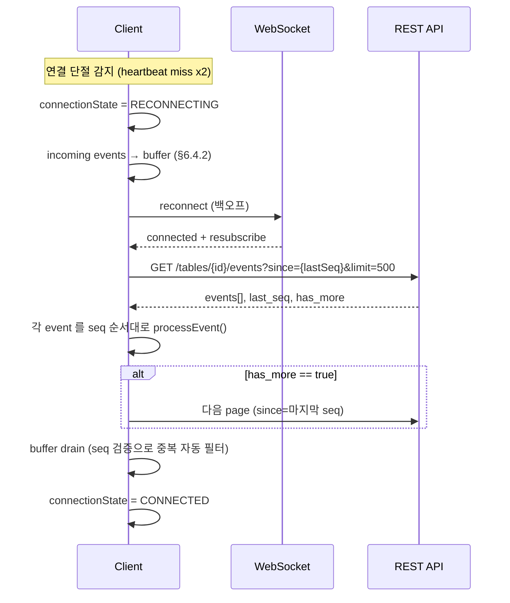

# API-05 WebSocket Events — CC ↔ BO ↔ Lobby 실시간 이벤트 프로토콜

| 날짜 | 항목 | 내용 |
|------|------|------|
| 2026-04-08 | 신규 작성 | 연결 아키텍처, 메시지 포맷, 이벤트 분류, 생명주기 |
| 2026-04-09 | GAP-L-002 보강 | §1.3 WebSocket JWT 인증 방식 추가 |
| 2026-04-10 | CCR-003 | client→server command 메시지에 `idempotency_key` 필드 추가 |
| 2026-04-10 | CCR-015 | envelope에 단조증가 `seq` 필드 + replay 엔드포인트 연동 |
| 2026-04-13 | EventFlightSummary + Clock | §4.2 Lobby 전용 이벤트에 `event_flight_summary`(25필드) + `clock_tick` + `clock_level_changed` 3종 추가 (WSOP LIVE Staff App Live 준거) |
| 2026-04-14 | CCR-050 | §4.2 에 `clock_detail_changed`/`clock_reload_requested`/`stack_adjusted`/`tournament_status_changed` 4종 추가 (SSOT Page 1793328277, 3728441546) |
| 2026-04-14 | CCR-054 | §4.2.0 WSOP LIVE SignalR ↔ EBS 이벤트 매핑표 신설. `blind_structure_changed`/`prize_pool_changed` 2종 추가 (SSOT Page 1793328277) |
| 2026-04-14 | 경계 pointer 보강 | API-04↔API-05 상호 참조 추가. in-process vs 네트워크 관심사 분리 명시 |
| 2026-04-15 | §3.3 신설 | 소비자 로컬 state 전이 맵 (CC/Lobby). HandStarted/ActionPerformed/StreetAdvanced/HandCompleted/SeatUpdated 5종 결정적 규칙 + 미확정 영역 목록. decision_owner: team2 (필요 시 team4 가 소비자 관점 보강) |
| 2026-04-15 | §3.3.1 publisher 실측 정합 | StreetAdvanced/SeatUpdated 는 publisher 가 발행하지 않음 (cc_handler.py:44-52 실측). §3.3.1 을 실제 3종(HandStarted/ActionPerformed/HandEnded) 로 축소. 대체 경로는 §3.3.4 재정의 |
| 2026-04-15 | envelope + edge 보강 | §2.1 `version` 필드 추가. §2.1.1 forward-compat (version drift). §3.3.2 동일 seq 순서 보장 재작성. §7.4 REST 4xx/5xx consumer 처리 매트릭스 |
| 2026-04-15 | §6.4.1~4 추가 | 재연결 + replay 통합 시퀀스, 수신 버퍼링 정책(MAX 500), replay 실패 처리 4케이스, 글로벌 이벤트 replay 경로. team1 발신, 기획 문서 충분성 보강. Frontend `../../2.1 Frontend/Engineering.md §5.4` 와 정합. |
| 2026-04-21 | §10.1/§10.5 정정 (notify: team2) | Type C 모순 해소 — "BO는 Game Engine에 전달" → "BO는 DB audit + Lobby 브로드캐스트. 게임 로직 검증은 Engine HTTP (CC 직접)". `Command_Center_UI/Overview.md §1.1.1` 확정 아키텍처 (CC=Orchestrator, Engine primary + BO secondary 병행) 반영. ActionAck 의 next_action_seat 는 참고값, SSOT 는 Engine 응답. decision_owner: team2 (team4 제안) |
| 2026-04-22 | §9.1/§11.1/§11.3 정정 (notify: team2) | P1/P2 cascade — §10 정정과 동형 패턴. WriteGameInfo "BO→Engine" 제거. WriteDeal Engine 호출 skip 명시 (createSession 이 auto HandStart+holecards 배분). DealAck.phase 는 참고값. Ack/Rejected 필드 의미 재정의 (BO validation 만). |

---

## 개요

이 문서는 EBS 3-앱 아키텍처(CC ↔ BO ↔ Lobby)의 **WebSocket 실시간 이벤트 프로토콜**을 정의한다. CC와 Lobby는 각각 독립된 WebSocket 연결로 BO에 접속하며, BO가 이벤트를 라우팅한다.

> **참조**: 이벤트 소스 분류는 `BS-06-00-triggers.md`, 모니터링 항목은 `BS-02-lobby.md §활성 CC 모니터링`, 용어 정의는 `BS-00-definitions.md`

> **경계 주의**: 본 문서는 **프로세스 간 네트워크 프로토콜**만 정의한다.
> CC 앱 내부에서 Game Engine → Overlay 로의 데이터 흐름(Security Delay, NDI/HDMI/크로마키 출력, Rive 애니메이션, 해상도 스케일링)은
> `API-04-overlay-output.md` 참조. 특히 §3 `OutputStatusChanged` 이벤트가 가리키는 실제 출력 채널 정의는 API-04 §2.

---

## 1. 연결 아키텍처

### 1.1 연결 토폴로지

```
CC (Flutter)  ───WebSocket───  BO (FastAPI)  ───WebSocket───  Lobby (웹)
   발행자                        라우터/저장소                    구독자
```

| 연결 | 프로토콜 | 엔드포인트 | 방향 | 용도 |
|------|---------|----------|------|------|
| CC → BO | WebSocket | `ws://{host}/ws/cc?table_id={id}` | 양방향 | 게임 데이터 발행 + 설정 수신 |
| Lobby → BO | WebSocket | `ws://{host}/ws/lobby` | 양방향 | 모니터링 구독 + 설정 발행 |

### 1.2 핵심 원칙

- CC와 Lobby는 **직접 연결하지 않는다** — BO를 경유한 간접 통신만 허용
- CC는 테이블당 1개 WebSocket 연결 (table_id로 식별)
- Lobby는 1개 WebSocket 연결로 모든 테이블 이벤트를 구독
- BO는 수신한 이벤트를 DB에 저장하고 구독자에게 포워딩

#### 1.2.1 Foundation §6.4 정합 — DB SSOT + 2 채널 동기화 (2026-04-22 신설)

Foundation §6.4 "실시간 상태 동기화" 정책에 따라 EBS 내부 상태 동기화는 다음 2 채널 조합으로 수행된다. 본 WebSocket 프로토콜은 **실시간 push 채널** 역할을 담당한다.

| 채널 | 역할 | 지연 SLO | 본 문서 범위 |
|------|------|:--------:|:-----------:|
| DB polling (REST) | 복구/재진입 baseline 로드 | 1-5초 | ❌ (→ API-01 참조) |
| **WebSocket push** (`/ws/lobby`, `/ws/cc`) | 실시간 상태 변경 알림 | **< 100ms** | ✅ **본 문서** |

**쓰기 경로 원칙**: 모든 상태 변경은 BO 가 **DB commit 을 먼저** 수행한 후에 WS broadcast 한다. 이는 `audit_events.seq` 단조 증가(§2 envelope `seq`) 를 보장하며, 소비자가 재연결 시 `GET /tables/{id}/events?since_seq=N` (API-01 replay) 로 gap 을 복구할 수 있게 한다.

**읽기 경로 원칙**:

1. 소비자 프로세스 시작 시 → REST `GET /api/v1/tables/{id}/state/snapshot` (baseline 로드)
2. 이후 WS 구독으로 델타 적용
3. WS 연결 끊김 복구 시 → replay (§6.4.1~4 재연결 + replay 통합 시퀀스) + 필요 시 snapshot 재로드

**Engine 상태 SSOT 예외**: 게임 상태(hands/cards/pots)는 **Engine HTTP 응답이 최종 SSOT** 이다. 본 WS 의 game 관련 이벤트는 **audit 참고값** + **Lobby 모니터 브로드캐스트** 목적. 상세: §10 WriteAction 정정 (2026-04-21), §11 WriteGameInfo 정정 (2026-04-22).

> **참조**: Foundation §6.4 (상위 정책), `Back_Office/Sync_Protocol.md §1` (팀2 내부 구현 scope).

### 1.3 WebSocket JWT 인증 방식

> **GAP-L-002 보강**: WebSocket 연결 시 JWT 토큰 전달 방식 명시.

WebSocket 프로토콜은 HTTP `Authorization` 헤더를 직접 지원하지 않는다. EBS는 **연결 URL query parameter** 방식을 사용한다.

| 연결 | 인증 방식 | 예시 |
|------|----------|------|
| CC → BO | `token` query param | `ws://{host}/ws/cc?table_id={id}&token={access_token}` |
| Lobby → BO | `token` query param | `ws://{host}/ws/lobby?token={access_token}` |

**인증 처리 흐름:**

```
클라이언트 WebSocket 연결 요청 (URL에 token 포함)
  │
  ├─ BO: token 검증 (JWT 서명, 만료 확인)
  │    │
  │    ├─ 유효 → 연결 수락, role 및 table_id 권한 확인
  │    │
  │    └─ 무효/만료 → 연결 거부 (HTTP 401 Upgrade 실패)
  │
  └─ 토큰 만료 중 재연결 시
       └─ 클라이언트가 먼저 POST /auth/refresh → 새 Access Token 취득
            └─ 새 token으로 WebSocket 재연결
```

**보안 주의사항:**

| 항목 | 내용 |
|------|------|
| token 노출 | URL에 포함되어 서버 로그에 남을 수 있음. HTTPS/WSS 필수 (운영 환경) |
| 개발 환경 | `ws://` 허용. 운영 환경은 `wss://` 강제 |
| 토큰 만료 | 연결 수립 후 15분 경과 시 BO가 연결을 강제 종료하지 않음. 단, 핸드 저장 등 API 호출이 필요한 시점에 Refresh 흐름 적용 |

---

## 2. 메시지 포맷

### 2.1 JSON Envelope

모든 WebSocket 메시지는 동일한 envelope 구조를 따른다.

```json
{
  "type": "HandStarted",
  "table_id": "tbl-5",
  "seq": 12345,
  "payload": {
    "hand_id": 42,
    "hand_number": 15,
    "dealer_seat": 3,
    "player_count": 6
  },
  "timestamp": "2026-04-08T14:30:00.123Z",
  "server_time": "2026-04-08T14:30:00.123Z",
  "source_id": "cc-table-5",
  "message_id": "msg-uuid-1234"
}
```

| 필드 | 타입 | 필수 | 설명 |
|------|------|:----:|------|
| `type` | string | O | 이벤트 타입 (PascalCase) |
| `table_id` | string | O | 테이블 식별자. 글로벌 이벤트는 `"*"` |
| `seq` | int (BIGINT) | O | **CCR-015** — 테이블당 단조증가 시퀀스. 재연결 시 gap 감지용. 글로벌 이벤트는 `table_id="*"`의 독립 시퀀스 |
| `payload` | object | O | 이벤트별 데이터 |
| `timestamp` | string (ISO 8601) | O | 이벤트 발생 시각 (ms 정밀도, 클라이언트/서버 생성 모두 허용) |
| `server_time` | string (ISO 8601) | O | **CCR-015** — 서버 기준 시각 (클록 스큐 보정용). BO가 append 시 강제 설정 |
| `source_id` | string | O | 발신자 식별 (`cc-table-{id}` / `lobby` / `bo`) |
| `message_id` | string (UUID) | O | 메시지 고유 ID (중복 방지) |
| `idempotency_key` | string (UUID/ULID) | 조건부 | **client→server command 메시지** 권장 (CCR-003). BO는 이 키로 중복 command 차단 + audit_events에 기록. |
| `version` | int | 선택 | Envelope schema version. 2026-04-15 현재 publisher 는 이 필드를 emit 하지 않음 (암묵적으로 v1). consumer 는 missing = 1 로 해석. v2 도입 시 publisher 가 명시적으로 세팅 후 consumer 가 분기 처리. forward-compatibility 원칙: 미지 version 은 §2.2.1 에 따라 log-and-ignore |

#### Seq 보장 규칙 (CCR-015)

| 규칙 | 내용 |
|------|------|
| SSOT | `audit_events.seq` 컬럼(DATA-04 §5.2)이 단일 진실. WebSocket 브로드캐스트는 DB commit 이후에만 수행한다. |
| 범위 | 테이블별 독립 시퀀스. 테이블 생성 시 0으로 리셋. `(table_id, seq)` UNIQUE. |
| 글로벌 이벤트 | `table_id="*"` 의 독립 시퀀스 유지. |
| HA failover | 재시작 시 DB에서 `SELECT MAX(seq) FROM audit_events WHERE table_id=...` 로 이어간다. |
| 순서 보장 범위 | **같은 테이블 내부만**. 테이블 간 순서는 `server_time` 기반으로 비교. |
| gap 복구 | 클라이언트가 `seq` 연속성 깨짐 감지 → `GET /api/v1/tables/{id}/events?since={last_seq}` 호출하여 누락 이벤트 replay (API-01 §5.7). |

### 2.1.1 Forward compatibility (version drift)

WebSocket 계약은 publisher-first 로 진화한다. 신규 event type 또는 `version` 의 상승이 있을 때 consumer 가 **구 version 으로 배포된 상태로도 깨지지 않아야** 한다.

| 시나리오 | 기대 동작 |
|----------|-----------|
| consumer 가 알 수 없는 `type` 수신 | debug log 후 **무시**. 예외 throw 금지. 재시도 금지. (§3.3.4 운영 이벤트와 동일) |
| consumer 가 알 수 없는 `version` 수신 | 해당 envelope 의 `type`/`payload` 해석은 best-effort. 필수 필드 접근 실패 시 debug log + 무시 |
| consumer 가 이미 알고 있던 `type` 의 payload 에 **새 필드** 추가됨 | 알려진 필드만 소비. 모르는 필드는 drop. JSON 파서가 strict 모드면 `additionalProperties: true` 로 설정 |
| consumer 가 이미 알고 있던 `type` 의 payload 에서 기존 필드 **삭제됨** | publisher 가 먼저 1 sprint 사전 공지 + Edit History 기록. consumer 는 미리 필드 optional 처리로 배포 |

publisher 쪽 책임: 필드 삭제·의미 변경은 버전 상승 동반. 증분 추가는 같은 version 내에서 허용.

### 2.2 응답/확인 메시지

서버가 클라이언트 메시지에 대해 확인을 보내는 경우:

```json
{
  "type": "Ack",
  "payload": {
    "original_message_id": "msg-uuid-1234",
    "status": "ok"
  },
  "timestamp": "2026-04-08T14:30:00.150Z",
  "source_id": "bo",
  "message_id": "msg-uuid-5678"
}
```

### 2.3 Client→Server command 메시지 예시 (CCR-003)

CC/Lobby가 BO에 상태 변경을 요청하는 command 메시지는 `idempotency_key` 필드를 포함해야 한다. BO는 동일 키 재수신 시 `idempotency_keys` 테이블(DATA-04 §4.5) 또는 `audit_events.idempotency_key` UNIQUE 제약으로 중복 처리를 차단한다.

```json
{
  "type": "AssignSeatCommand",
  "payload": {
    "table_id": 5,
    "seat_no": 3,
    "player_id": 1012
  },
  "timestamp": "2026-04-10T12:34:56.789Z",
  "source_id": "cc-table-5",
  "message_id": "msg-uuid-9001",
  "idempotency_key": "01J9M2K3A7Q8R5T6V0X1Y2Z3B4"
}
```

**BO 응답 패턴 (Ack)**:

| 상황 | Ack `status` | 비고 |
|------|-------------|------|
| 최초 처리 | `"ok"` | 정상 처리, audit_events append |
| 동일 키 + 동일 payload 재수신 | `"ok_replayed"` | 캐시된 응답 재생, audit_events append 없음 |
| 동일 키 + 상이한 payload | `"error"` + `error_code: "idempotency_key_reused"` | REST API의 409와 동일 의미 |

---

## 3. CC → BO 이벤트 (게임 데이터 발행)

CC가 게임 진행 중 BO에 발행하는 이벤트. BO는 DB에 저장 후 Lobby에 포워딩한다.

**§1.2.1 SSOT 분류** (Foundation §6.3/§6.4 정렬):

| 이벤트 | payload 주요 필드 | 발동 조건 | SSOT 분류 | 설명 |
|--------|------------------|----------|:---------:|------|
| `HandStarted` | hand_id, hand_number, dealer_seat, player_count, blind_level | 핸드 시작 | **audit 참고값** | 게임 상태 SSOT 는 Engine. BO 는 Lobby 모니터 브로드캐스트 + DB audit |
| `HandEnded` | hand_id, winner_seats, pot_total, duration_ms | 핸드 종료 | **audit 참고값** | 승패/팟 SSOT 는 Engine. BO 는 audit + 브로드캐스트 |
| `ActionPerformed` | hand_id, seat, action_type, amount, pot_after | 플레이어 액션 | **audit 참고값** | 액션 처리 SSOT 는 Engine (§10.1 2026-04-21 정정) |
| `CardDetected` | hand_id, seat, suit, rank, is_board, position | 카드 인식 | **audit 참고값** | 카드 인식 상태는 Engine gameState SSOT |
| `GameChanged` | table_id, previous_game, new_game | 종목 변경 | **state 변경** | Mix 게임 모드 전환은 BO DB 가 SSOT |
| `RfidStatusChanged` | table_id, status, antenna_count, error_code | RFID 상태 변경 | **state 변경** | 하드웨어 상태는 BO DB 가 SSOT |
| `OutputStatusChanged` | table_id, output_type, status, resolution | 출력 상태 변경 | **state 변경** | 출력 장비 상태는 BO DB 가 SSOT (채널 정의: `API-04-overlay-output.md` §2) |

> **audit 참고값**: 게임 상태 SSOT 는 Engine HTTP 응답. BO WS 이벤트는 Lobby 모니터용 브로드캐스트 + audit_events 영속화가 주 목적. 소비자는 Engine 응답을 우선하고 BO ack 와 불일치 시 경고 로그만 (§10.1.§1133 참조).
>
> **state 변경**: BO DB 가 SSOT. 소비자는 WS 수신 또는 DB snapshot (`GET /api/v1/tables/{id}/state/snapshot`, API-01) 에서 읽은 값을 신뢰.

### 3.1 HandStarted payload 상세

```json
{
  "hand_id": 42,
  "table_id": 5,
  "hand_number": 15,
  "dealer_seat": 3,
  "player_count": 6,
  "blind_level": {
    "level": 5,
    "sb": 200,
    "bb": 400,
    "ante": 50
  },
  "game": "holdem",
  "bet_structure": "no_limit"
}
```

### 3.2 ActionPerformed payload 상세

```json
{
  "hand_id": 42,
  "seat": 5,
  "action_type": "raise",
  "amount": 1200,
  "pot_after": 3400,
  "stack_after": 8800,
  "game_phase": 2,
  "action_index": 3
}
```

> `action_type` 값: `fold`, `check`, `bet`, `call`, `raise`, `allin`
> `game_phase` 값: BS-00 §3.2 참조 (0=IDLE ~ 7=HAND_COMPLETE)

### 3.3 소비자 로컬 state 전이 맵 (CC / Lobby)

본 섹션은 위 §3.1~§3.2 의 이벤트가 **소비자 쪽 로컬 state** 를 어떻게 갱신해야 하는지 규정한다. publisher (BO) 는 이벤트 payload 만 전송하고, 소비자(CC, Lobby) 는 아래 규칙을 결정적으로 따른다. 구현 시 개별 판단 금지 — 규칙이 부족하면 본 섹션을 **먼저 보강**한 뒤 구현한다.

`TableState`, `HandState`, `SeatState` 는 CC `src/lib/features/command_center/providers/` 및 Lobby 해당 store 의 공통 명명 규칙을 따른다.

#### 3.3.1 핵심 매핑 (publisher 실측 기준 3종)

> **실측**: 2026-04-15 기준 team2 publisher (`team2-backend/src/websocket/cc_handler.py:44-52`) 는 CC→BO 게임 이벤트로 `HandStarted`, `HandEnded`, `ActionPerformed`, `CardDetected`, `GameChanged`, `RfidStatusChanged`, `OutputStatusChanged` 만 전달한다. 이 중 state 전이 규칙이 결정적인 3종은 아래와 같다. `StreetAdvanced` / `SeatUpdated` 는 계약에 존재하지 않으므로 §3.3.4 로 이동했다 (대체 경로 병기).

| 이벤트 | 적용 순서 | 로컬 state 전이 (CC) |
|--------|-----------|---------------------|
| `HandStarted` | 1. `TableState.current_hand` 교체 (`id=payload.hand_id`, `number=payload.hand_number`) | 2. `HandState.phase = PRE_FLOP`, `dealer_seat = payload.dealer_seat`, `blind_level = payload.blind_level` | 3. `biggest_bet_amt = 0`, `seats[*].current_bet = 0`, `seats[*].has_folded = false` | 4. `action_on = null` (엔진의 `ActionOnResponse` 이후 세팅) |
| `ActionPerformed` | 1. 대상 seat = `payload.seat` | 2. `seats[seat].current_bet += payload.amount`, `seats[seat].stack = payload.stack_after` | 3. action_type 별 분기: `fold` → `seats[seat].has_folded = true`, `bet`/`raise` → `biggest_bet_amt = max(biggest_bet_amt, seats[seat].current_bet)`, `allin` → `seats[seat].is_all_in = true` + biggest_bet_amt 동일 갱신, `check`/`call` → biggest_bet_amt 유지 | 4. `HandState.pot_total = payload.pot_after` | 5. `action_on = null` (다음 `ActionOnResponse` 대기) |
| `HandEnded` (= HandCompleted) | 1. `HandState.phase = HAND_COMPLETE` | 2. `seats[*].stack = payload.seats[*].final_stack` 반영 | 3. `TableState.current_hand = null` (다음 `HandStarted` 까지) | 4. `hand_history.append(snapshot)` |

> **불변식**: 각 이벤트 적용 후 `sum(seats[i].current_bet) + HandState.pot_start <= HandState.pot_total` 이 유지되어야 한다. 위반 시 `ReplayEvents` 요청으로 복구.

#### 3.3.2 순서 보장

- 이벤트는 envelope `seq` (§2.1 CCR-015) 순서로 적용. gap 감지 시 §6.5 replay 먼저.
- **WebSocket 은 테이블당 단일 연결** 이므로 TCP 레벨에서 도착 순서 = `seq` 순서가 자연스럽게 보장된다. publisher 는 `(table_id, seq)` 가 UNIQUE 이므로 **동일 seq 의 여러 이벤트는 emit 하지 않는다** — 각 이벤트는 독립 seq 를 부여받는다.
- Replay REST (`GET /events?since={last_seq}`) 응답은 JSON array 로 반환. 배열 순서 = 적용 순서. consumer 는 **array index 순** 으로 하나씩 적용하며, 적용 사이에 새로 도착하는 live WebSocket 이벤트는 버퍼에 쌓아 replay 완료 후 seq 비교하여 중복 drop + 나머지 적용.
- 핸드 내 같은 seat 에 복수 필드 변경이 필요한 경우(예: 폴드 + 팟 갱신) publisher 가 **하나의 이벤트 payload 에 모든 필드** 를 넣어 발행 — consumer 가 "적용 순서" 를 고민할 일이 없다.

#### 3.3.3 Lobby 쪽 차이

Lobby 는 CC 와 거의 동일하게 적용하되, **hole cards** 는 수신하지 않으므로 `seats[seat].hole_cards` 필드는 항상 `null`. 카드 공개는 §4 `HoleCardsRevealed` 이벤트 도달 시에만 (§4.2 참조).

##### Lobby Hand History 소비자 (2026-04-21 신설 — SG-016 revised)

`Lobby/Hand_History.md` Hand Browser/Detail 화면이 본 3 이벤트를 실시간 갱신 트리거로 소비한다:

| 이벤트 | Hand Browser 동작 | Hand Detail 동작 |
|--------|------------------|------------------|
| `HandStarted` | 현재 필터 매칭 시 목록 prepend (hand_id, hand_number, started_at, table) | 해당 hand_id 진입 시 stream 모드 전환 |
| `ActionPerformed` | (목록 영향 없음) | timeline 행 append, pot_after 갱신 |
| `HandEnded` | 행의 `pot_total`/`winner_seats`/`duration` 갱신 | Winner Banner 노출 + stream 종료 |

Lobby Hand History 는 `seats[seat].hole_cards` 마스킹 규칙 (§3.3.3 본문) 을 그대로 따르되 RBAC 별 권한 (`Hand_History.md` §4):
- Admin/Operator(할당 테이블): 종료 핸드는 hole card 공개 (REST `/hands/:id/players` 응답)
- Viewer: 모든 hole card `★` 마스킹

> 소비자 SSOT: `docs/2. Development/2.1 Frontend/Lobby/Hand_History.md` §3.3 WebSocket.

#### 3.3.4 publisher 미구현 / 대체 경로

| 원래 가정한 이벤트 | 실제 publisher 상태 | 대체 경로 |
|-------------------|---------------------|-----------|
| `StreetAdvanced` | publisher 에 없음 | (a) `CardDetected(is_board=true)` 로 community_cards 누적 → 총 개수로 street 추론 (`3장=FLOP`, `4장=TURN`, `5장=RIVER`). (b) 스트리트별 `seats[*].current_bet=0` 리셋은 각 스트리트 첫 `ActionPerformed` 수신 시 이전 스트리트 bet 을 pot 에 sweep 하는 로직으로 대체 |
| `SeatUpdated` | publisher 에 없음 | 좌석 metadata 변경 (플레이어 이름/국기/앉기-쉬기) 은 REST `PATCH /api/v1/tables/{id}/seats/{seat_no}` + 응답 기반 로컬 state 갱신. 실시간 push 는 현재 미지원 — 다른 CC 세션이 동일 테이블 열고 있으면 주기적 GET 폴링으로 동기화 |
| `CardDetected` | publisher O | 공개 카드(`is_board=true`) 는 `TableState.community_cards` 에 append. holecards(`is_board=false`) 는 CC 에서는 무시하고 Overlay 파이프라인이 처리 |
| `GameChanged` | publisher O | Mix 게임 모드에서 게임 전환 시 현재 `HandState` snapshot 을 hand_history 에 저장 후 초기화. 상세 규칙 TBD — Mix 게임 구현 착수 시 본 섹션 확장 |
| `RfidStatusChanged`, `OutputStatusChanged` | publisher O | Operational alert 영역. game state 에는 영향 없음. 상단 info bar 표시만 |
| `HoleCardsRevealed` | publisher 에 없음 | Showdown 시 card reveal 은 Overlay 전용 API-04 `CardRevealed` 이벤트 (in-process). WebSocket 경유 X |

---

## 4. BO → Lobby 이벤트 (모니터링 포워딩)

BO가 CC 이벤트를 가공하여 Lobby에 포워딩하는 이벤트. CC → BO 이벤트를 그대로 전달하되, Lobby 전용 이벤트가 추가된다.

### 4.1 CC 이벤트 포워딩

§3의 모든 CC → BO 이벤트는 BO가 수신 후 Lobby에 동일 포맷으로 포워딩한다. `source_id`는 원본 CC의 값을 유지한다.

### 4.2 Lobby 전용 이벤트

#### 4.2.0 WSOP LIVE SignalR ↔ EBS 이벤트 매핑 (CCR-054)

> SSOT: Confluence Page 1793328277 (SignalR Service). 의도적 divergence: SignalR→순수 WebSocket 2 엔드포인트, CamelCase→snake_case + 동작형 suffix(`_changed`, `_requested`).

| WSOP LIVE Hub 이벤트 | EBS 이벤트 | 발행 트리거 | 정의 섹션 |
|---|---|---|---|
| `Clock` | `clock_tick` | 매 1초 (BO 내부 타이머) | §4.2.2 |
| `Clock` (레벨 전환) | `clock_level_changed` | 레벨 전이 시 | §4.2.3 |
| `ClockDetail` | `clock_detail_changed` | `PUT /flights/:id/clock/detail` | §4.2.4 (CCR-050) |
| `ClockReload` | `clock_reload_requested` (내부) | 클록 엔진 재로드 | 내부 이벤트 |
| `ClockReloadPage` | `clock_reload_requested` | `PUT /flights/:id/clock/reload-page` | §4.2.5 (CCR-050) |
| `TournamentStatus` | `tournament_status_changed` | EventFlightStatus 전이 | §4.2.6 (CCR-050) |
| `EventFlightSummary` | `event_flight_summary` | 엔트리/좌석/스택/스탯 변경 | §4.2.1 |
| `BlindStructure` | `blind_structure_changed` | 블라인드 구조 수정 | §4.2.7 (CCR-054) |
| `PrizePool` | `prize_pool_changed` | 엔트리/페이아웃 재계산 | §4.2.8 (CCR-054) |
| — (EBS 독자) | `stack_adjusted` | `PUT /flights/:id/clock/adjust-stack` | §4.2.9 (CCR-050) |

| 이벤트 | payload 주요 필드 | 발동 조건 | 설명 |
|--------|------------------|----------|------|
| `OperatorConnected` | table_id, operator_id, username | CC WebSocket 연결 | Operator가 CC를 실행 |
| `OperatorDisconnected` | table_id, operator_id, reason | CC WebSocket 끊김 | CC 종료 또는 네트워크 단절 |
| `event_flight_summary` | §4.2.1 참조 (25 필드) | 30초 주기 또는 핸드 종료/탈락 시 | Lobby 대시보드 실시간 요약 |
| `clock_tick` | §4.2.2 참조 | 매 1초 | 블라인드 타이머 실시간 표시 |
| `clock_level_changed` | §4.2.3 참조 | 레벨 전환·Break 시작/종료 시 | 블라인드 레벨 변경 알림 |
| `clock_detail_changed` | §4.2.4 참조 | Clock detail PUT | 테마/공지/이벤트명/그룹명 변경 (CCR-050) |
| `clock_reload_requested` | §4.2.5 참조 | Clock reload-page PUT | 대시보드 강제 리로드 신호 (CCR-050) |
| `tournament_status_changed` | §4.2.6 참조 | Flight Complete/Cancel | EventFlightStatus 전이 (CCR-050) |
| `blind_structure_changed` | §4.2.7 참조 | BlindStructure 수정 | 블라인드 구조 변경 브로드캐스트 (CCR-054) |
| `prize_pool_changed` | §4.2.8 참조 | 엔트리 변경·payout 재계산 | 상금 풀 갱신 (CCR-054) |
| `stack_adjusted` | §4.2.9 참조 | Clock adjust-stack PUT | 평균 스택 강제 조정 (CCR-050) |

#### 4.2.1 event_flight_summary (WSOP LIVE EventFlightSummary 준거)

Lobby 대시보드에 표시할 토너먼트 요약 정보. `table_id="*"` (글로벌 이벤트).

```json
{
  "type": "event_flight_summary",
  "table_id": "*",
  "seq": 99001,
  "server_time": "2026-04-13T14:30:00Z",
  "payload": {
    "event_flight_id": 123,
    "event_id": 45,
    "display_name": "Day 1A",
    "status": "live",
    "entries": 1200,
    "reentries": 340,
    "players_left": 890,
    "table_count": 100,
    "empty_seat_count": 12,
    "avg_stack": 45000,
    "median_stack": 38000,
    "largest_stack": 185000,
    "smallest_stack": 8200,
    "total_chips_in_play": 40050000,
    "play_level": 8,
    "current_blind": { "sb": 400, "bb": 800, "ante": 100 },
    "next_blind": { "sb": 500, "bb": 1000, "ante": 100 },
    "level_time_remaining_sec": 720,
    "is_on_break": false,
    "break_time_remaining_sec": null,
    "tables_breaking": 3,
    "players_moving": 12,
    "prizepool": null,
    "itm_threshold": null,
    "updated_at": "2026-04-13T14:30:00Z"
  }
}
```

| 필드 | 타입 | 설명 |
|------|------|------|
| `event_flight_id` | int | Flight 식별자 |
| `event_id` | int | Event 식별자 |
| `display_name` | string | "Day 1A" 등 |
| `status` | string | `created/registering/live/completed/canceled` |
| `entries` | int | 총 참가 수 |
| `reentries` | int | 재등록 수 |
| `players_left` | int | 잔여 플레이어 |
| `table_count` | int | 활성 테이블 수 |
| `empty_seat_count` | int | 빈 좌석 수 |
| `avg_stack` / `median_stack` | int | 평균/중간 스택 |
| `largest_stack` / `smallest_stack` | int | 최대/최소 스택 |
| `total_chips_in_play` | int | 총 칩 인 플레이 |
| `play_level` | int | 현재 블라인드 레벨 |
| `current_blind` / `next_blind` | object | `{sb, bb, ante}` |
| `level_time_remaining_sec` | int | 레벨 잔여 시간(초) |
| `is_on_break` | bool | 휴식 중 여부 |
| `break_time_remaining_sec` | int? | 휴식 잔여 시간(초), 휴식 아니면 null |
| `tables_breaking` | int | 해체 진행 테이블 수 |
| `players_moving` | int | 이동 중 플레이어 수 |
| `prizepool` | int? | 상금 풀 (Phase 2+) |
| `itm_threshold` | int? | ITM 기준 등수 (Phase 2+) |
| `updated_at` | string | ISO 8601 갱신 시각 |

**발동 주기**: 30초 간격 + 핸드 종료·플레이어 탈락·테이블 해체 시 즉시. WSOP LIVE `Staff App Live §EventFlightSummary` 3분 주기 대비 EBS는 **30초**로 단축 (방송 실시간 반영 요구).

#### 4.2.2 clock_tick

블라인드 타이머 실시간 카운트다운. `table_id="*"`. WSOP LIVE `Staff App Live §Clock` 준거.

```json
{
  "type": "clock_tick",
  "table_id": "*",
  "seq": 99002,
  "server_time": "2026-04-13T14:30:01Z",
  "payload": {
    "event_flight_id": 123,
    "status": "running",
    "level": 8,
    "level_index": 9,
    "blind_detail_type": 0,
    "duration_sec": 1200,
    "time_remaining_sec": 719,
    "start_time": "2026-04-13T14:10:01Z",
    "blind_info": { "sb": 400, "bb": 800, "ante": 100 },
    "is_paused": false,
    "pause_start_time": null,
    "pause_reason": null,
    "pause_duration_sec": 0,
    "auto_advance": true
  }
}
```

| 필드 | 타입 | 설명 |
|------|------|------|
| `status` | string | ClockFSM (BS-00 §3.7) |
| `level` | int | 현재 블라인드 레벨 (1부터) |
| `level_index` | int | 블라인드 구조 배열 인덱스 (Break 포함) |
| `blind_detail_type` | int | `0`=Blind, `1`=Break, `2`=DinnerBreak, `3`=HalfBlind, `4`=HalfBreak (BS-00 §3.8) |
| `duration_sec` | int | 현재 레벨/브레이크 전체 시간(초) |
| `time_remaining_sec` | int | 현재 레벨/브레이크 잔여 시간(초) |
| `start_time` | string (ISO 8601 UTC) | 현재 레벨 시작 시각 |
| `blind_info` | object | `{sb, bb, ante}` — 현재 블라인드 |
| `is_paused` | bool | 수동 일시정지 여부 |
| `pause_start_time` | string? (ISO 8601 UTC) | 일시정지 시작 시각 (null이면 미정지) |
| `pause_reason` | string? | 일시정지 사유 |
| `pause_duration_sec` | int | 누적 일시정지 시간(초) |
| `auto_advance` | bool | 레벨 자동 전환 여부 (false면 TD 수동 확인 대기) |

**발동 주기**: 매 1초. 클라이언트는 마지막 수신 값으로 로컬 카운트다운 표시, 1초마다 서버 보정.

**Pause 우선순위**: ManualPause > DinnerBreak > Break > AutoPause (BS-00 §3.7, WSOP LIVE 준거).

#### 4.2.3 clock_level_changed

블라인드 레벨 전환 시 1회 발행. `table_id="*"`.

```json
{
  "type": "clock_level_changed",
  "table_id": "*",
  "seq": 99003,
  "server_time": "2026-04-13T14:30:00Z",
  "payload": {
    "event_flight_id": 123,
    "old_level": 7,
    "new_level": 8,
    "blind_detail_type": 0,
    "new_blind": { "sb": 400, "bb": 800, "ante": 100 },
    "is_break": false,
    "next_break_at_level": 10
  }
}
```

| 필드 | 타입 | 설명 |
|------|------|------|
| `old_level` / `new_level` | int | 이전/이후 레벨 |
| `blind_detail_type` | int | `0`=Blind, `1`=Break, `2`=DinnerBreak, `3`=HalfBlind, `4`=HalfBreak (BS-00 §3.8) |
| `new_blind` | object | `{sb, bb, ante}` — 신규 블라인드 |
| `is_break` | bool | 브레이크 진입 여부 |
| `next_break_at_level` | int? | 다음 브레이크 예정 레벨 |

**발동 조건**: 레벨 자동 전환, Break 시작, Break 종료(→다음 레벨), DinnerBreak 시작/종료, 수동 레벨 변경.

#### 4.2.4 clock_detail_changed (CCR-050)

- **Trigger**: `PUT /flights/:id/clock/detail` 성공 시.
- **Payload** (변경된 필드만): `{ flight_id, theme?, announcement?, event_name_override?, group_name?, half_break_message?, bonus_name? }`
- **Consumer**: Lobby(전광판 UI), CC.
- **WSOP LIVE 대응**: `ClockDetail` SignalR 이벤트.

#### 4.2.5 clock_reload_requested (CCR-050)

- **Trigger**: `PUT /flights/:id/clock/reload-page` 성공 시.
- **Payload**: `{ flight_id }`
- **Consumer**: Lobby(대시보드) — 수신 시 페이지 강제 리로드.
- **WSOP LIVE 대응**: `ClockReloadPage`.

#### 4.2.6 tournament_status_changed (CCR-050)

- **Trigger**: `PUT /flights/:id/complete` 또는 `/cancel` 성공 시.
- **Payload**: `{ flight_id, old_status, new_status, reason?, final_results? }` (status 는 EventFlightStatus enum, BS-00 §3.6)
- **Consumer**: Lobby, CC (Canceled 전이 시 CC 세션 종료).
- **WSOP LIVE 대응**: `TournamentStatus` SignalR 이벤트.

#### 4.2.7 blind_structure_changed (CCR-054)

- **Trigger**: `PUT /flights/:id/blind-structure` 성공 또는 자동 레벨 재계산 시.
- **Payload**:

```json
{
  "flight_id": 3,
  "levels": [
    { "level": 1, "sb": 100, "bb": 200, "ante": 0, "duration_sec": 1200, "blind_detail_type": 0 },
    { "level": 2, "sb": 200, "bb": 400, "ante": 50, "duration_sec": 1200, "blind_detail_type": 0 }
  ]
}
```

- **Consumer**: Lobby(전광판), CC(레벨 표시), Engine(Team 3 — `BlindStructureChanged` 내부 이벤트 수신).
- **WSOP LIVE 대응**: `BlindStructure` SignalR 이벤트.

#### 4.2.8 prize_pool_changed (CCR-054)

- **Trigger**: 엔트리 수 변경 또는 `PUT /flights/:id/payout-structure` 수동 재계산 시.
- **Payload**:

```json
{
  "flight_id": 3,
  "total_pool": 171000,
  "entries": 342,
  "payouts": [
    { "place": 1, "amount": 50000 },
    { "place": 2, "amount": 30000 }
  ]
}
```

- **Consumer**: Lobby(전광판 상금 표시), CC(최종 테이블 페이아웃 표시).
- **WSOP LIVE 대응**: `PrizePool` SignalR 이벤트.

#### 4.2.9 stack_adjusted (CCR-050)

- **Trigger**: `PUT /flights/:id/clock/adjust-stack` 성공 시.
- **Payload**: `{ flight_id, average_stack, reason, actor_id, timestamp }`
- **Consumer**: Lobby, CC.
- **WSOP LIVE 대응**: EBS 독자 이벤트 (WSOP LIVE 미정의).

### 4.3 구독 필터링

Lobby는 연결 시 구독할 테이블 범위를 지정할 수 있다.

```json
{
  "type": "Subscribe",
  "payload": {
    "table_ids": [1, 5, 12],
    "event_types": ["HandStarted", "HandEnded", "OperatorConnected"]
  },
  "timestamp": "2026-04-08T09:00:00Z",
  "source_id": "lobby",
  "message_id": "msg-uuid-sub-1"
}
```

| 필드 | 설명 |
|------|------|
| `table_ids` | 빈 배열 = 모든 테이블 구독 (Admin/Viewer). Operator는 할당 테이블만 |
| `event_types` | 빈 배열 = 모든 이벤트 구독. 특정 타입만 필터링 가능 |

---

## 5. Lobby → BO → CC 이벤트 (설정 변경)

Lobby(또는 Settings)에서 설정을 변경하면 BO를 경유하여 CC에 실시간 반영한다.

| 이벤트 | payload 주요 필드 | 발동 조건 | 수신자 | 설명 |
|--------|------------------|----------|--------|------|
| `ConfigChanged` | table_id, config_key, old_value, new_value | Admin Settings 변경 | CC | 출력/오버레이/게임 설정 |
| `PlayerUpdated` | table_id, seat, player_id, fields_changed | Lobby 플레이어 수정 | CC | 이름/프로필 변경 |
| `TableAssigned` | table_id, rfid_reader_id, deck_status, output_preset | Lobby 테이블 설정 | CC | RFID/덱/출력 설정 |
| `BlindStructureChanged` | table_id, new_level, sb, bb, ante | Lobby 블라인드 변경 | CC | 새 블라인드 레벨 적용 |
| `skin_updated` | skin_id, version, transition_type, broadcasted_at | Admin이 GE에서 PUT /skins/{id}/activate 성공 (API-07 §6) | CC, Overlay | 스킨 전환 (CCR-015) |

### 5.3 skin_updated 이벤트 상세 (CCR-015)

```json
{
  "type": "skin_updated",
  "seq": 42,
  "payload": {
    "skin_id": "sk_01HVQK...",
    "version": 3,
    "transition_type": "fade",
    "broadcasted_at": "2026-04-14T10:30:00Z"
  },
  "timestamp": "2026-04-14T10:30:00.012Z",
  "source_id": "bo-api-07",
  "message_id": "msg-uuid-skin-42"
}
```

| 필드 | 설명 |
|------|------|
| `seq` | 단조증가. CCR-015 seq 정책 준수. Overlay replay 기준. |
| `skin_id` | 새로 활성화된 스킨의 ID |
| `version` | 스킨 버전 (편집마다 증가) |
| `transition_type` | 전환 효과. `BS-07-03 §5.2`의 5종 enum (`cut`/`fade`/`slide`/`dissolve`/`black`) |
| `broadcasted_at` | 서버 시각, Admin audit 용 |

**Consumer 동작 (CC/Overlay, Team 4)**:

1. `GET /api/v1/skins/{skin_id}` → `.gfskin` 바이트 다운로드 (API-07 §3)
2. `BS-07-03 §3 로드 FSM` 수행 (in-memory ZIP 해제 + JSON Schema 검증)
3. `BS-07-03 §5.2 전환 FSM` 수행 (`transition_type`에 따른 효과 적용)
4. Overlay 재렌더 (500ms 이내, GEA-06)
5. 로드 실패 시: `BS-07-03 §4` 폴백 스킨 전환

**Replay**: Overlay 재연결 또는 network gap 후 복구 시 `GET /api/v1/skins/active`로 current active 확인 후 `GET /events/replay?from_seq={last_seq}&channel=cc_event`로 놓친 `skin_updated` 이벤트 재생 (CCR-015 seq 단조증가 정책 활용).

### 5.1 ConfigChanged payload 상세 (2026-04-15 scope 확장)

```json
{
  "scope": "event",
  "scope_id": 17,
  "config_key": "overlay.security_delay_ms",
  "old_value": 30000,
  "new_value": 60000,
  "actor_user_id": 3,
  "applied_at_hint": "next_hand"
}
```

**scope 매칭 필터** (CC 수신 측 로직):

```python
if scope == "global":
    apply(event)
elif scope == "series" and my_table.series_id == scope_id:
    apply(event)
elif scope == "event" and my_table.event_id == scope_id:
    apply(event)
elif scope == "table" and my_table.table_id == scope_id:
    apply(event)
else:
    ignore(event)
```

BO 브로드캐스트는 `cc_event` 채널 전체로 송출한다 (fan-out). 필터링은 각 CC 가 자기 context(series/event/table ID) 를 알고 있으므로 수신 측에서 수행한다. 상세: `../2.4 Command Center/Settings.md §WebSocket 전달`.

`applied_at_hint` 값:
- `immediate`: IDLE 상태 즉시 반영
- `next_hand`: 핸드 진행 중이면 다음 핸드 시작 시 반영
- `manual`: 오퍼레이터가 명시적으로 적용 버튼을 눌러야 반영 (특수 케이스)

### 5.2 핸드 중간 설정 변경 지연

> **참조**: `BS-06-00-triggers.md §5.2` — CC 액션과 BO ConfigChanged 동시 발생 시 CC 우선

| 설정 유형 | 적용 시점 | 이유 |
|----------|----------|------|
| 블라인드 레벨 | 다음 핸드 시작 시 | 현재 핸드의 블라인드 일관성 유지 |
| 오버레이 스킨 | 즉시 | 시각적 변경만, 게임 로직 무관 |
| Security Delay | 즉시 | 보안 설정은 지연 없이 즉시 |
| RFID 모드 변경 | 현재 핸드 종료 후 | 카드 인식 방식 변경은 핸드 무결성 보호 |

---

## 6. 연결 생명주기

### 6.1 연결 흐름

```
클라이언트                    BO 서버
    │                           │
    │── WebSocket CONNECT ──→   │
    │                           │── JWT 검증
    │← 101 Switching ──────     │
    │                           │
    │── Auth { token } ────→    │
    │← AuthResult { ok } ──    │
    │                           │
    │── Subscribe {...} ───→    │  (Lobby만)
    │← Ack ─────────────────   │
    │                           │
    │←→ 이벤트 송수신 ←→        │
    │                           │
    │── Ping ──────────────→    │  (30초 간격)
    │← Pong ───────────────    │
    │                           │
```

### 6.2 인증

WebSocket 연결 후 첫 메시지로 인증 토큰을 전송해야 한다. 5초 이내 인증하지 않으면 서버가 연결을 종료한다.

```json
{
  "type": "Auth",
  "payload": {
    "access_token": "eyJhbGciOi..."
  },
  "timestamp": "2026-04-08T09:00:00Z",
  "source_id": "cc-table-5",
  "message_id": "msg-uuid-auth-1"
}
```

### 6.3 하트비트

| 항목 | 값 | 설명 |
|------|:--:|------|
| Ping 간격 | 30초 | 클라이언트 → 서버 |
| Pong 타임아웃 | 10초 | 서버 미응답 시 재연결 시도 |
| 최대 미응답 | 3회 | 3회 연속 미응답 시 연결 끊김 판정 |

### 6.4 재연결

| 시나리오 | 클라이언트 동작 |
|---------|---------------|
| 네트워크 일시 단절 | 지수 백오프 재연결 (1초 → 2초 → 4초 → 최대 30초) |
| 서버 재시작 | 동일 지수 백오프 + 이전 구독 재등록 |
| 토큰 만료 중 재연결 | Refresh Token으로 갱신 후 재연결 |
| 5분 이상 연결 실패 | 사용자에게 연결 실패 알림 + 수동 재연결 버튼 |

#### 6.4.1 재연결 + replay 통합 절차 (클라이언트 구현 규약)

> 2026-04-15 추가 (team1 발신). 클라이언트가 gap 을 안전하게 복구하기 위한 단계별 절차. Backend_HTTP.md §5.7 `GET /tables/:id/events` 와 1:1 대응.



#### 6.4.2 재연결 중 수신 메시지 버퍼링 정책

| 상태 | 처리 | 한계 |
|------|------|------|
| `CONNECTED` | 즉시 `processEvent` | — |
| `RECONNECTING` | 큐에 append. replay 완료 후 drain. seq 검증으로 중복은 자동 무시 | MAX 500건 |
| `DISCONNECTED` (5분+) | 큐 폐기. 수동 재연결 시 `since=lastSeq` 로 replay 호출하여 초기화 | — |

#### 6.4.3 replay 실패 처리

`GET /tables/:id/events` 호출 자체가 실패하는 경우:

| 상황 | 처리 |
|------|------|
| 5xx / 타임아웃 | 1회 재시도 (2s 후). 그래도 실패하면 페이지 전체 refresh — `lobbyStore.$reset()` 후 `GET /series` 부터 재조회 |
| 410 Gone (seq 너무 오래됨) | 페이지 전체 refresh (replay 불가, 전체 재조회) |
| 401/403 | `authStore.tryRestoreSession()` → 성공 시 재시도, 실패 시 `/login` |
| 200 이지만 `has_more=true` 무한 루프 (10페이지 초과) | 페이지 전체 refresh (데이터량 과다) |

#### 6.4.4 글로벌(테이블 비특정) 이벤트 replay

`event_flight_summary`, `clock_tick`, `ConfigChanged` 등 `table_id="*"` 또는 flight 단위 이벤트의 replay 는 아래 중 하나로 처리:

| 방법 | 현재 지원 | 비고 |
|------|:--------:|------|
| `GET /flights/:id/events?since=N` | **Phase 2 예정** | flight 단위 replay 엔드포인트 신설 필요 (별도 CCR) |
| `GET /series` + `GET /flights/:id/summary` 로 전체 재조회 | ✓ 현재 | replay 미구현 영역의 임시 전략. 초기 load 와 동일 |
| `ConfigChanged` 재생은 `GET /configs/*` 로 현재값만 재조회 | ✓ 현재 | settings 는 시점 상태만 중요 |

> 클라이언트는 §2 이벤트 매트릭스(Frontend `../../2.1 Frontend/Engineering.md §5.4`) 에 따라 어느 경로를 쓸지 결정한다. 테이블 범위 이벤트는 `/tables/:id/events` 로, 그 외는 전체 재조회로.

### 6.5 연결 끊김 처리

| 끊김 주체 | BO 서버 동작 | 상대방 알림 |
|----------|------------|-----------|
| CC 연결 끊김 | `operator_disconnected` 이벤트 저장 | Lobby에 `OperatorDisconnected` 발행 |
| Lobby 연결 끊김 | 구독 해제 | CC에 영향 없음 (독립 동작) |
| BO 서버 다운 | — | CC: 로컬 캐시로 게임 진행, Lobby: 재연결 대기 |

---

## 7. 에러 이벤트와 경고 이벤트 구분

### 7.1 에러 이벤트 (Error)

시스템 동작에 영향을 주는 이벤트. 즉시 처리가 필요하다.

| 이벤트 | 심각도 | 설명 | 후속 조치 |
|--------|:------:|------|----------|
| `AuthFailed` | CRITICAL | 인증 실패 | 연결 종료 |
| `TableNotFound` | ERROR | 존재하지 않는 table_id | 연결 종료 |
| `PermissionDenied` | ERROR | RBAC 권한 부족 | 해당 메시지 거부 |
| `InvalidMessage` | ERROR | 메시지 포맷 오류 | 해당 메시지 거부 + 에러 응답 |
| `RfidHardwareError` | ERROR | RFID 하드웨어 장애 | Lobby에 알림, 운영자 개입 필요 |

### 7.2 경고 이벤트 (Warning)

정보성 이벤트. 시스템은 정상 동작하지만 주의가 필요하다.

| 이벤트 | 설명 | 표시 위치 |
|--------|------|----------|
| `DuplicateCard` | 동일 카드 중복 감지 | CC 경고 배너 + Lobby 로그 |
| `CardConflict` | CC 수동 입력과 RFID 감지 불일치 | CC 경고 팝업 |
| `SlowConnection` | 하트비트 응답 지연 (>5초) | Lobby 연결 상태 표시 |
| `TokenExpiringSoon` | Access Token 만료 2분 전 | 내부 (자동 갱신 트리거) |

### 7.3 에러 응답 포맷

```json
{
  "type": "Error",
  "payload": {
    "code": "PERMISSION_DENIED",
    "message": "Operator not assigned to table 5",
    "original_message_id": "msg-uuid-1234"
  },
  "timestamp": "2026-04-08T14:30:01Z",
  "source_id": "bo",
  "message_id": "msg-uuid-err-1"
}
```

### 7.4 REST 계열 4xx / 5xx 응답 처리 (consumer 관점)

WebSocket 외에 consumer 가 호출하는 REST (`GET /events?since=…`, `GET /tables/.../state`, `POST /tables/.../game-settings` 등) 의 에러 응답도 아래 정책으로 처리한다.

| HTTP | 원인 | CC 처리 |
|------|------|---------|
| 400 | 요청 포맷 오류 (클라이언트 버그) | Sentry 로그 + "잘못된 요청" 토스트. 재시도 금지 |
| 401 | Access Token 만료·서명 불일치 | Refresh flow 트리거 → 성공 시 원본 요청 1회 재시도. 재시도도 401 이면 로그아웃 |
| 403 | RBAC 권한 부족 | "권한 없음" 모달. 재시도 금지 |
| 404 | 리소스 부재 (table_id 등) | UI 화면 전환 (예: Lobby 로 복귀) + 토스트 |
| 409 | 상태 충돌 (예: 핸드 진행 중 category A 필드 변경) | Game_Settings_Modal.md §2.3 참조 — Sentry 로그 + "상태 불일치 감지됨" 토스트 |
| 429 | Rate limit 초과 | `Retry-After` 헤더 값 만큼 대기 후 1회 자동 재시도. 계속 429 면 "잠시 후 다시 시도" 메시지 |
| 5xx | 서버 내부 오류 | 지수 백오프 (500ms → 1s → 2s, 최대 3회). 실패 시 circuit-breaker 10초 OPEN → HALF_OPEN 1 probe → 성공 시 CLOSED |

**공통**:
- 모든 4xx (401, 429 외) 는 **재시도 금지**. 재시도가 문제를 해결할 수 없는 범주.
- 모든 5xx 는 위 백오프 후 재시도.
- 에러 payload `{"error": "...", "field": "..."}` 형식이 있으면 Sentry 이벤트에 그대로 attach.

---

## 8. 직렬화 협상 (CCR-023)

### 8.1 배경

초당 수십 이벤트가 발생하는 라이브 방송 환경에서 JSON payload의 메타데이터 오버헤드(키 이름, 공백, 콤마)는 대역폭에 부담을 준다. WSOP LIVE Fatima.app은 **SignalR + MessagePack** 조합으로 payload를 평균 30~50% 압축하여 운영 중이다.

EBS는 SignalR로 전환하지 않고 **JSON과 MessagePack을 모두 지원**하는 타협안을 채택한다 (Option C).

### 8.2 연결 시 협상

WebSocket URL query param `format`으로 선택:

| 연결 | URL 예시 |
|------|---------|
| CC → BO (JSON, 기본) | `ws://{host}/ws/cc?table_id={id}&token={t}&format=json` |
| CC → BO (MessagePack) | `ws://{host}/ws/cc?table_id={id}&token={t}&format=msgpack` |
| Lobby → BO (JSON, 기본) | `ws://{host}/ws/lobby?token={t}&format=json` |
| Lobby → BO (MessagePack) | `ws://{host}/ws/lobby?token={t}&format=msgpack` |

**기본값**: `format` 생략 시 `json` (하위 호환). BO 초기 구현은 JSON만 지원, MessagePack은 Phase 2에서 활성화. 미지원 `format` 요청 시 WebSocket handshake를 HTTP 406 Not Acceptable로 거부.

**혼합 금지**: 한 연결 내에서 format 전환 불가. 전환 필요 시 연결 재수립.

### 8.3 MessagePack 스키마

기존 JSON envelope 구조를 MessagePack으로 1:1 매핑한다. 필드 이름과 값은 JSON과 **동일**:

```
fixmap 5 elements
  "type" → "HandStarted"
  "payload" → fixmap N elements
  "timestamp" → "2026-04-08T14:30:00.123Z"
  "source_id" → "cc-table-5"
  "message_id" → "msg-uuid-1234"
```

| JSON 타입 | MessagePack 타입 |
|----------|-----------------|
| string | fixstr / str8 / str16 / str32 |
| int | positive/negative fixint / int8~64 |
| float | float32 / float64 |
| boolean | true / false |
| null | nil |
| object | fixmap / map16 / map32 |
| array | fixarray / array16 / array32 |

**특수 케이스**:
- **Timestamp**: 문자열(ISO 8601)로 유지. MessagePack extension type 미사용 (상호운용성 우선).
- **UUID**: 문자열로 유지.
- **Binary data** (향후 image/file): MessagePack `bin8/16/32` 사용.

### 8.4 구현 라이브러리

| 환경 | 라이브러리 |
|------|-----------|
| Python (FastAPI) | `msgpack` |
| Dart (Flutter) | `messagepack` |
| JavaScript/TypeScript | `@msgpack/msgpack` |

각 클라이언트 직렬화 결과가 상호 decode 가능한지 Cross-compat 테스트 필수.

### 8.5 Fallback

MessagePack 파싱 실패 시 BO는 해당 메시지를 drop하지 않고 `DeserializationError` 이벤트로 로그 기록 후 연결을 종료한다. 클라이언트는 재연결 시 `format=json`으로 downgrade 가능.

---

## 9. WriteGameInfo 프로토콜 (CCR-024)

### 9.1 용도

> **2026-04-22 정정 (notify: team2, decision_owner: team2)** — "Game Engine의 HandFSM 전이" + "수신자: BO → Game Engine" 표현 제거. `Command_Center_UI/Overview.md §1.1.1` 확정 아키텍처 (CC = Orchestrator, Engine primary + BO secondary 병행) 반영. Type C 모순 해소.

CC의 NEW HAND 버튼이 CC 가 **병렬 2경로 dispatch** 하는 중 BO 경로 메시지. 핸드 초기화 메타데이터를 BO 에 발행하여 **DB audit + Lobby 모니터 브로드캐스트**를 수행한다.

**Engine HandFSM 전이 (IDLE → SETUP_HAND → PRE_FLOP)** 는 CC 가 별도 호출하는 `POST /api/session` (createSession — auto HandStart + 홀카드 배분 포함, `Harness_REST_API.md §2.1`) 의 책임. 본 BO 경로는 Engine 을 호출하지 않는다 (§1.1 line 71 "BO→Engine 없음" 준수).

- **발행자**: CC (BS-05-02 NEW HAND 버튼)
- **수신자**: BO (DB audit + Lobby 브로드캐스트)
- **응답**: `GameInfoAck { hand_id, ready_for_deal }` — `ready_for_deal` 은 BO `game_session` row INSERT 성공 여부. 실제 deal 준비는 Engine createSession 응답 기준 (§1.1.1 SSOT)
- **실패**: `GameInfoRejected { reason }` — BO side validation 실패. 게임 로직 rejection 은 Engine `ActionRejected` 별도.

### 9.2 필드 스키마 (24 fields)

```json
{
  "type": "WriteGameInfo",
  "payload": {
    "table_id": 5,
    "hand_id": 248,
    "dealer_seat": 3,
    "sb_seat": 4,
    "bb_seat": 5,
    "sb_amount": 500,
    "bb_amount": 1000,
    "ante_amount": 100,
    "big_blind_ante": false,
    "straddle_seats": [6],
    "straddle_amount": 2000,
    "blind_structure_id": "wsop-ft-2026-lv42",
    "blind_level": 42,
    "current_level_start_ts": "2026-04-10T14:30:00Z",
    "next_level_start_ts": "2026-04-10T14:50:00Z",
    "game_type": "no_limit_holdem",
    "allowed_games": ["nlhe"],
    "rotation_order": null,
    "chip_denominations": [100, 500, 1000, 5000, 25000, 100000],
    "active_seats": [1, 2, 3, 4, 5, 6, 7, 8],
    "dead_button_mode": true,
    "run_it_multiple_allowed": true,
    "bomb_pot_enabled": false,
    "cap_bb_multiplier": null
  },
  "timestamp": "2026-04-10T14:30:00.123Z",
  "source_id": "cc-table-5",
  "message_id": "msg-uuid-1234"
}
```

### 9.3 필드 정의

| # | 필드 | 타입 | 필수 | 설명 |
|:-:|------|------|:----:|------|
| 1 | `table_id` | int | ✓ | 테이블 식별자 |
| 2 | `hand_id` | int | ✓ | 핸드 식별자 (Backend에서 할당) |
| 3 | `dealer_seat` | int (0~9) | ✓ | Dealer button 좌석 |
| 4 | `sb_seat` | int (0~9) | ✓ | Small Blind 좌석 |
| 5 | `bb_seat` | int (0~9) | ✓ | Big Blind 좌석 |
| 6 | `sb_amount` | int | ✓ | SB 금액 |
| 7 | `bb_amount` | int | ✓ | BB 금액 |
| 8 | `ante_amount` | int | ✓ | Ante 금액 (0이면 없음) |
| 9 | `big_blind_ante` | bool | ✓ | true면 BB가 전체 ante 선납 |
| 10 | `straddle_seats` | int[] | ✓ | Straddle 활성 좌석 (빈 배열 = 없음) |
| 11 | `straddle_amount` | int | △ | `straddle_seats` 비어있지 않을 때 필수 |
| 12 | `blind_structure_id` | string | ✓ | 블라인드 구조 ID (Lobby가 생성) |
| 13 | `blind_level` | int | ✓ | 현재 레벨 번호 (1부터) |
| 14 | `current_level_start_ts` | ISO 8601 | ✓ | 현재 레벨 시작 시각 |
| 15 | `next_level_start_ts` | ISO 8601 | ✓ | 다음 레벨 시작 예정 시각 |
| 16 | `game_type` | enum | ✓ | `no_limit_holdem` / `pot_limit_holdem` / `limit_holdem` / `plo` / `mix` |
| 17 | `allowed_games` | string[] | ✓ | Mix 게임 시 허용 종목 리스트 |
| 18 | `rotation_order` | string[]\|null | △ | Mix 게임 순환 순서 (null = 랜덤) |
| 19 | `chip_denominations` | int[] | ✓ | 테이블 가용 토큰 단위 |
| 20 | `active_seats` | int[] | ✓ | 현재 핸드 참여 좌석 (Sitting Out 제외) |
| 21 | `dead_button_mode` | bool | ✓ | Dead Button Rule 적용 여부 |
| 22 | `run_it_multiple_allowed` | bool | ✓ | Run It Multiple(X2/X3) 허용 여부 |
| 23 | `bomb_pot_enabled` | bool | ✓ | 이 핸드가 Bomb Pot인지 |
| 24 | `cap_bb_multiplier` | int\|null | ✓ | Cap Game BB 배수 (null = 무제한) |

### 9.4 검증 규칙

- `dealer_seat`, `sb_seat`, `bb_seat`는 `active_seats`에 포함
- `straddle_seats`는 `active_seats`의 부분집합
- `sb_amount < bb_amount`, Straddle 존재 시 `bb_amount < straddle_amount`
- `game_type == "mix"`이면 `allowed_games` ≥ 2
- `current_level_start_ts < next_level_start_ts`

### 9.5 응답

**`GameInfoAck` (성공)**:
```json
{
  "type": "GameInfoAck",
  "payload": {
    "hand_id": 248,
    "ready_for_deal": true,
    "estimated_deal_ready_ts": "2026-04-10T14:30:00.200Z"
  }
}
```

CC는 이 응답 수신 후 DEAL 버튼을 활성화한다.

**`GameInfoRejected` (실패)**:
```json
{
  "type": "GameInfoRejected",
  "payload": {
    "hand_id": 248,
    "reason": "VALIDATION_FAILED",
    "field": "sb_amount",
    "message": "sb_amount must be < bb_amount"
  }
}
```

---

## 10. WriteAction 프로토콜 (CC → BO 액션 커맨드)

### 10.1 용도

> **2026-04-21 정정 (notify: team2, decision_owner: team2)** — 본 섹션이 "BO는 Game Engine에 전달하여 게임 로직 검증" 으로 기술되었으나, `Command_Center_UI/Overview.md §1.1 + §1.1.1` 확정 아키텍처는 **CC = Orchestrator** (Engine 직접 HTTP primary + BO WS secondary 병행). Type C 기획 모순 해소를 위해 본 §10.1 의 역할을 재정의.

CC 운영자가 액션 버튼(FOLD/CHECK/BET/CALL/RAISE/ALL-IN)을 누르면 CC 가 **병렬로 2 경로 dispatch** 하는 중 **BO 경로의 메시지 스키마**를 정의한다:

- **Engine HTTP** (primary, 별도 문서 `../../2.3 Game Engine/APIs/Harness_REST_API.md §2.3`): 게임 로직 검증 + outputEvents
- **BO WriteAction** (secondary, 본 문서): **이벤트 기록 / 감사 / Lobby 브로드캐스트** — Game Engine 을 호출하지 않음

BO 는 WriteAction 수신 시 DB 에 audit 기록 + `ActionPerformed` 이벤트를 Lobby 에 브로드캐스트한다. **BO 는 게임 로직 검증을 수행하지 않는다** (Overview.md §1.1 line 71 "BO→Engine 없음" 준수).

- **발행자**: CC (BS-05-02 액션 버튼)
- **수신자**: BO (DB audit + Lobby 브로드캐스트)
- **응답**: `ActionAck { hand_id, action_index }` — 단순 수신 확인용. CC 는 이 ack 없이도 Engine 응답으로 UI 진행 (eventual consistency)

### 10.2 필드 스키마

```json
{
  "type": "WriteAction",
  "payload": {
    "hand_id": 248,
    "seat": 5,
    "action_type": "raise",
    "amount": 1200
  },
  "timestamp": "2026-04-17T10:30:00.123Z",
  "source_id": "cc-table-5",
  "message_id": "msg-uuid-5678",
  "idempotency_key": "01HZ..."
}
```

### 10.3 필드 정의

| # | 필드 | 타입 | 필수 | 설명 |
|:-:|------|------|:----:|------|
| 1 | `hand_id` | int | ✓ | 현재 핸드 ID |
| 2 | `seat` | int (1~10) | ✓ | 액션 수행 좌석 (1-based) |
| 3 | `action_type` | enum | ✓ | `fold` / `check` / `bet` / `call` / `raise` / `allin` |
| 4 | `amount` | int | △ | `bet`/`raise`/`allin` 시 필수. `fold`/`check`/`call` 시 0 또는 생략 |

### 10.4 검증 규칙

- `seat`는 현재 `action_on` 좌석과 일치해야 함
- `action_type`은 현재 HandFSM 상태에서 허용된 액션이어야 함
- `amount`는 해당 좌석의 스택 이하
- `bet`/`raise` 시 `amount`는 최소 베팅 규칙 충족 (BS-06-02 참조)
- `allin` 시 `amount`는 해당 좌석의 전체 스택

### 10.5 응답

**`ActionAck` (성공)**:
```json
{
  "type": "ActionAck",
  "payload": {
    "hand_id": 248,
    "action_index": 3,
    "next_action_seat": 6
  }
}
```

> **2026-04-21 정정**: 본 ack 의 `next_action_seat` 는 **참고값** (BO audit용). 게임 상태 SSOT 는 Engine HTTP 응답 (`Harness_REST_API.md §2.3` — `gameState.actionOn`). CC 는 Engine 응답으로 `action_on` 을 이동하고, BO ack 의 `next_action_seat` 는 **차이 발생 시 경고 로그만** (두 경로 불일치 = data drift 신호). `Command_Center_UI/Overview.md §1.1.1` 참조.

동시에 BO가 `ActionPerformed` 이벤트를 Lobby 에 브로드캐스트하므로 Lobby 의 monitoring UI state 전이는 §3.3.1 규칙을 따른다. **CC 자체 state 전이는 Engine 응답 기준** (§1.1.1).

**`ActionRejected` (실패)**:
```json
{
  "type": "ActionRejected",
  "payload": {
    "hand_id": 248,
    "seat": 5,
    "reason": "NOT_YOUR_TURN",
    "message": "Action on seat 6, not seat 5"
  }
}
```

CC는 거부 시 UI에 에러 토스트를 표시하고 현재 상태를 유지한다.

---

## 11. WriteDeal 프로토콜 (CC → BO 딜 커맨드)

### 11.1 용도

> **2026-04-22 정정 (notify: team2)** — `Harness_REST_API.md §2.1 POST /api/session` 이 **auto HandStart + 홀카드 배분** 수행하여 createSession 완료 시점에 이미 PRE_FLOP 상태. DEAL 버튼은 **Engine 호출 없음**. `Command_Center_UI/Overview.md §1.1.1 Action-to-Transport Matrix` 반영.

CC 운영자가 DEAL 버튼을 누르면 BO 에 audit 용 이벤트 발행. **Engine 호출은 없음** — `engineClient.createSession()` (NEW HAND 시점) 이 이미 PRE_FLOP + 홀카드 배분 완료. DEAL 버튼은 CC UI 에서 홀카드 **공개 타이밍 마킹** + Lobby 브로드캐스트 용도.

- **발행자**: CC (BS-05-02 DEAL 버튼)
- **수신자**: BO (audit + Lobby 브로드캐스트)
- **Engine**: 호출 없음 (createSession 시 이미 PRE_FLOP)

### 11.2 필드 스키마

```json
{
  "type": "WriteDeal",
  "payload": {
    "hand_id": 248
  },
  "timestamp": "2026-04-17T10:30:01.000Z",
  "source_id": "cc-table-5",
  "message_id": "msg-uuid-6789",
  "idempotency_key": "01HZ..."
}
```

### 11.3 응답

**`DealAck`**: `{ hand_id, phase: "PRE_FLOP" }` — BO 가 DEAL 이벤트 기록 완료 확인. `phase` 는 **참고값** (createSession 시점에 CC 가 이미 Engine 응답에서 알고 있는 값). CC HandFSM 전이 책임은 Engine 응답 (§1.1.1 SSOT).
**`DealRejected`**: `{ hand_id, reason }` — BO audit 실패 (예: hand_id 중복, DB 오류). 게임 로직 rejection 은 Engine `ActionRejected` 별도.

---

## 12. CC → BO 커맨드 요약

| 커맨드 | §참조 | 발동 조건 | 응답 Ack | 응답 Rejected |
|--------|:-----:|----------|---------|--------------|
| `WriteGameInfo` | §9 | NEW HAND 버튼 | `GameInfoAck` | `GameInfoRejected` |
| `WriteDeal` | §11 | DEAL 버튼 | `DealAck` | `DealRejected` |
| `WriteAction` | §10 | FOLD/CHECK/BET/CALL/RAISE/ALL-IN | `ActionAck` | `ActionRejected` |
```

## 13. Admin/Operator 이벤트 (IMPL-008~011 cascade, 2026-05-03 신설)

> Wave 1 A3 endpoints (IMPL-008~011) 의 broadcast 이벤트 명세.
> Conductor → BO → 구독자 (Lobby/CC) 단방향 fan-out.

### 13.1 이벤트 요약

| Event | 발행 트리거 | 채널 | 소비자 |
|-------|------------|------|--------|
| `gfskin.deactivated` | `POST /skins/{id}/deactivate` (IMPL-008) | `/ws/cc` | Team 4 CC (UI 갱신) |
| `force_logout` | `POST /users/{id}/force-logout` (IMPL-009) | `/ws/lobby/{user_id}` + `/ws/cc/{user_id}` | 대상 user 의 모든 connection (close code 4003 동반) |
| `table.seat.added` | `POST /tables/{id}/seats` (IMPL-010) | `/ws/lobby/{table_id}` | Team 1 Lobby + Team 4 CC |
| `table.seat.removed` | `DELETE /tables/{id}/seats/{seat_no}` (IMPL-011) | `/ws/lobby/{table_id}` | Team 1 Lobby + Team 4 CC |

### 13.2 `gfskin.deactivated` payload

```json
{
  "type": "gfskin.deactivated",
  "v": 1,
  "ts": "2026-05-03T10:30:00Z",
  "seq": 12345,
  "payload": {
    "skin_id": "string",
    "deactivated_at": "2026-05-03T10:30:00Z",
    "actor_user_id": "string (admin who triggered)"
  }
}
```

CC 수신 시: 사용 중인 gfskin 이 비활성화되면 fallback skin 으로 자동 교체. 활성 hand 영향 0 (다음 hand 부터 적용 — IMPL-008 §business rules 2 정합).

### 13.3 `force_logout` payload + close code

대상 user 의 active WebSocket 모든 connection 에 동일 페이로드 송신 후 즉시 connection close.

```json
{
  "type": "force_logout",
  "v": 1,
  "ts": "2026-05-03T10:30:00Z",
  "seq": null,
  "payload": {
    "target_user_id": "string",
    "actor_user_id": "string (admin)",
    "reason": "string (audit)",
    "logout_at": "2026-05-03T10:30:00Z"
  }
}
```

**WebSocket close code**: `4003 force_logout` (custom application close code, range 4000-4999 per RFC 6455).

**Frontend 의무**:
1. `force_logout` 이벤트 수신 → 즉시 메시지 표시 + login 화면 redirect
2. close code `4003` 수신 → access/refresh token storage clear + login redirect (replay 시도 금지)
3. 재연결 시도 금지 — `4003` 은 재연결 차단 신호

### 13.4 `table.seat.added` payload

```json
{
  "type": "table.seat.added",
  "v": 1,
  "ts": "2026-05-03T10:30:00Z",
  "seq": 12346,
  "payload": {
    "table_id": "string",
    "seat_no": 1,
    "active": true,
    "created_at": "2026-05-03T10:30:00Z",
    "actor_user_id": "string (operator)"
  }
}
```

활성 hand 진행 중 수신 시: 다음 hand 부터 반영 (현재 hand 영향 0 — IMPL-010 §business rules 5 정합).

### 13.5 `table.seat.removed` payload

```json
{
  "type": "table.seat.removed",
  "v": 1,
  "ts": "2026-05-03T10:30:00Z",
  "seq": 12347,
  "payload": {
    "table_id": "string",
    "seat_no": 1,
    "removed_at": "2026-05-03T10:30:00Z",
    "actor_user_id": "string (operator)"
  }
}
```

empty seat 만 삭제됨 (IMPL-011 §business rules 1) — `player_id` 필드 부재 (이미 stand-up 처리된 후).

### 13.6 ack/reject 정책 (SG-020 정합)

| Event | ack 필요 | reject 가능 |
|-------|:-------:|:-----------:|
| `gfskin.deactivated` | ❌ (broadcast) | ❌ (서버 결정 사후 통지) |
| `force_logout` | ❌ (close 동반) | ❌ |
| `table.seat.added` | ❌ (broadcast) | ❌ |
| `table.seat.removed` | ❌ (broadcast) | ❌ |

모두 **server-driven broadcast** — client 의 ack/reject 발화 없음. SG-020 (ack/reject events) 의 server-side 한정 패턴 정합.

