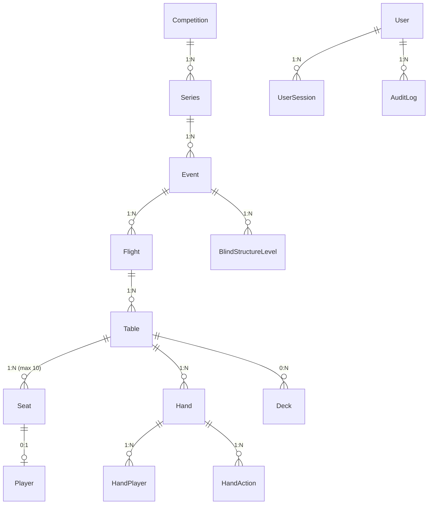
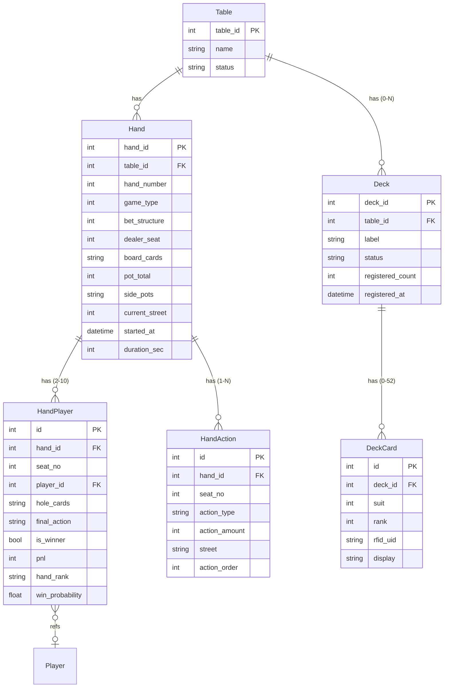
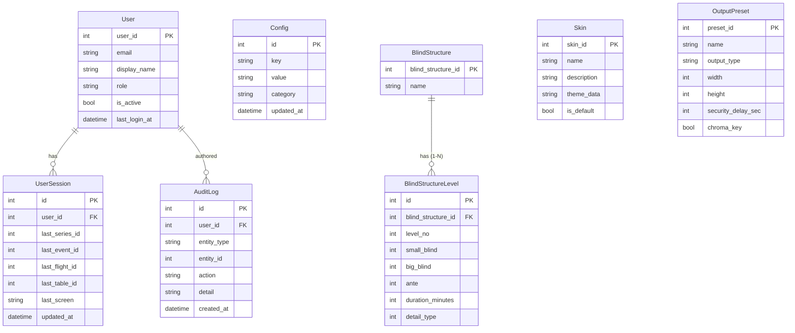

# DATA-01 ER 다이어그램

| 날짜 | 항목 | 내용 |
|------|------|------|
| 2026-04-08 | 신규 작성 | 3-앱 아키텍처 BO DB ER 다이어그램 초판 |

---

## 개요

EBS Back Office DB의 엔티티 관계를 정의한다. 3개 도메인(대회 계층, 게임 도메인, Admin 도메인)으로 분할하여 가독성을 확보한다.

> 참조: Game Engine 내부 데이터(GameState, Player, Card, Pot)는 BS-06-00-REF Ch.2에 정의. 이 문서는 BO 영구 저장 엔티티만 다룬다.

---

## Overview ER (전체 도메인)

---

## Detail ER 1: 대회 계층 (Competition ~ Seat)

대회 계층은 WSOP LIVE 데이터 구조를 그대로 따른다.

```mermaid
erDiagram
    Competition {
        int competition_id PK
        string name
        int competition_type
        int competition_tag
    }

    Series {
        int series_id PK
        int competition_id FK
        string series_name
        int year
        date begin_at
        date end_at
        string time_zone
        string country_code
        string source
    }

    Event {
        int event_id PK
        int series_id FK
        int event_no
        string event_name
        int game_type
        int bet_structure
        int game_mode
        int table_size
        int starting_chip
        int blind_structure_id
        string status
        string source
    }

    Flight {
        int event_flight_id PK
        int event_id FK
        string display_name
        datetime start_time
        int entries
        int players_left
        string status
        string source
    }

    Table {
        int table_id PK
        int event_flight_id FK
        int table_no
        string name
        string type
        string status
        int rfid_reader_id
        bool deck_registered
        int delay_seconds
        string source
    }

    Seat {
        int seat_id PK
        int table_id FK
        int seat_no
        int player_id FK
        string status
        int chip_count
    }

    Player {
        int player_id PK
        string wsop_id
        string first_name
        string last_name
        string nationality
        string country_code
        string source
    }

    Competition ||--o{ Series : "has"
    Series ||--o{ Event : "has"
    Event ||--o{ Flight : "has"
    Flight ||--o{ Table : "has"
    Table ||--o{ Seat : "has (0-10)"
    Seat }o--o| Player : "occupied by"
```

---

## Detail ER 2: 게임 도메인 (Hand, Action, Deck)

Hand 데이터는 Command Center에서 생성되어 BO DB에 기록된다.

---

## Detail ER 3: Admin 도메인 (User, Session, Config, AuditLog)

---

## 엔티티 수량 요약

| 도메인 | 엔티티 | 개수 |
|--------|--------|:----:|
| 대회 계층 | Competition, Series, Event, Flight, Table, Seat, Player | 7 |
| 게임 | Hand, HandPlayer, HandAction, Deck, DeckCard | 5 |
| Admin | User, UserSession, AuditLog, Config, BlindStructure, BlindStructureLevel, Skin, OutputPreset | 8 |
| **합계** | | **20** |
