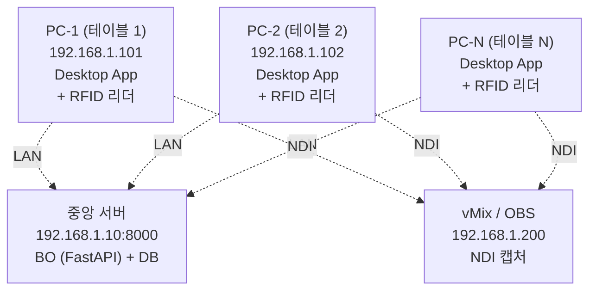

# IMPL-09 Build & Deployment — 빌드 타겟, Docker, 환경 변수

| 날짜 | 항목 | 내용 |
|------|------|------|
| 2026-04-08 | 신규 작성 | 앱별 빌드 명령, Docker 구성, 환경 변수, 배포 절차 |
| 2026-04-09 | Docker 서버 기본 설계 | BO+Lobby Docker 컨테이너 통합, docker-compose 전면 재설계 |

---

## 개요

이 문서는 EBS의 **빌드 및 배포 전략**을 정의한다. **Backend Server(BO)** 는 Docker 컨테이너로 실행되며, **EBS Desktop App** (Lobby+CC+Overlay 기능 조각 통합 Flutter Desktop 바이너리) 은 Foundation Ch.5 §B.2 미주의 다중창/단일창 모드에 따라 탭 모드 단일 프로세스 또는 다중창 독립 프로세스로 실행된다. Engine은 별도 서비스 (Docker 또는 `dart run`).

Foundation Ch.4 (3 그룹 6 기능) + Ch.5 (시스템 해부 — §A/§B/§C) + Ch.6 Scene 4 (복수 테이블 운영, 옛 §8.5) 를 공식 배포 모델로 채택한다:

| 배포 모델 | 용도 | 구성 |
|----------|------|------|
| **단일 PC** | 단일 테이블 운영 · 개발 · 데모 | BO+DB+Desktop App 동일 PC (Docker 포함) |
| **N PC + 중앙 서버** | 복수 테이블 방송 (2 테이블 이상) | 중앙 서버 1대(BO+DB) + N 개 테이블 PC, LAN 접속 |

> 참조: IMPL-01 기술 스택, IMPL-02 프로젝트 구조, Foundation Ch.4 (3 그룹 6 기능) + Ch.5 (§A/§B/§C 시스템 해부), Foundation Ch.6 Scene 4 (복수 테이블 운영), `docs/4. Operations/Network_Deployment.md` (LAN 배포 SSOT), `docs/4. Operations/Docker_Runtime.md` (컨테이너 운영 SSOT)

---

## 1. 빌드 타겟 요약

| 앱 | 빌드 도구 | 타겟 OS | 산출물 |
|----|---------|---------|--------|
| **CC** | `flutter build` | Windows / macOS / Linux | 실행 파일 (.exe / .app / binary) |
| **Overlay** | `flutter build` | Windows (1차) | 실행 파일 (.exe) |
| **BO** | Docker | Linux (컨테이너) | Docker 이미지 |
| **Engine** | `dart compile` | 크로스 플랫폼 | Dart 패키지 + Simulator CLI |
| **Lobby** | Docker (Next.js) | Linux (컨테이너) | Docker 이미지 |

---

## 2. Command Center (CC) — Flutter 빌드

### 2.1 빌드 명령

| 타겟 | 명령 | 산출물 경로 |
|------|------|-----------|
| Windows | `flutter build windows --release` | `build/windows/x64/runner/Release/` |
| macOS | `flutter build macos --release` | `build/macos/Build/Products/Release/` |
| Linux | `flutter build linux --release` | `build/linux/x64/release/bundle/` |

### 2.2 빌드 설정

| 항목 | 값 | 비고 |
|------|:--:|------|
| Flutter 채널 | stable | beta/dev 사용 금지 |
| 최소 Windows 버전 | Windows 10 (1809+) | Flutter Desktop 요구사항 |
| 앱 이름 | EBS Command Center | 윈도우 타이틀바 |
| 앱 아이콘 | `assets/icons/cc_icon.ico` | 커스텀 아이콘 |
| 서명 | 코드 서명 (Phase 2+) | Phase 1은 미서명 |

### 2.3 릴리스 체크리스트

| 단계 | 명령/확인 |
|------|----------|
| 1. 의존성 확인 | `flutter pub get` |
| 2. 분석 | `flutter analyze` (warning 0) |
| 3. 테스트 | `flutter test` (전체 통과) |
| 4. 빌드 | `flutter build windows --release` |
| 5. 크기 확인 | 빌드 산출물 < 100MB 확인 |
| 6. 스모크 테스트 | 빌드된 .exe 실행 → 로그인 → 테이블 선택 |

---

## 3. Overlay — Flutter 빌드

### 3.1 빌드 명령

| 타겟 | 명령 | 비고 |
|------|------|------|
| Windows | `flutter build windows --release` | Phase 1 1차 타겟 |

### 3.2 특수 설정

| 항목 | 값 | 비고 |
|------|:--:|------|
| 창 투명도 | 활성화 | 크로마키 합성을 위한 투명 배경 |
| 항상 위 | 선택 옵션 | OBS/vMix 캡처 시 |
| 해상도 | 1920x1080 (기본) / 3840x2160 (4K) | 런타임 설정 가능 |
| Rive 에셋 | `assets/rive/*.riv` | 빌드에 포함 |

---

## 4. Back Office (BO) — Docker 빌드

### 4.1 Dockerfile

```dockerfile
FROM python:3.12-slim

WORKDIR /app

# 시스템 의존성
RUN apt-get update && apt-get install -y --no-install-recommends \
    gcc \
    && rm -rf /var/lib/apt/lists/*

# Python 의존성
COPY requirements.txt .
RUN pip install --no-cache-dir -r requirements.txt

# 소스 코드
COPY src/ ./src/
COPY alembic/ ./alembic/
COPY alembic.ini .

# DB 마이그레이션 실행
RUN alembic upgrade head

# 포트
EXPOSE 8000

# 실행
CMD ["uvicorn", "src.main:app", "--host", "0.0.0.0", "--port", "8000"]
```

### 4.2 Docker Compose (서버 통합 구성)

```yaml
version: "3.8"

services:
  # ── Back Office API ──
  bo:
    build:
      context: ./ebs_bo
      dockerfile: Dockerfile
    ports:
      - "8000:8000"
    environment:
      # 연결·인증
      - DATABASE_URL=sqlite:///data/ebs.db
      - REDIS_URL=redis://redis:6379/0
      - JWT_SECRET=${JWT_SECRET:-dev-secret-change-me}
      - JWT_ALGORITHM=HS256
      - AUTH_PROFILE=dev
      - JWT_ACCESS_TTL_S=3600
      - JWT_REFRESH_TTL_S=604800
      # 타임아웃 (IMPL-05 §6.2, IMPL-10 §6 정합)
      - HTTP_TIMEOUT_MS=30000
      - WSOP_POLL_TIMEOUT_MS=10000
      - DB_QUERY_TIMEOUT_MS=5000
      - REDIS_TIMEOUT_MS=500
      - WS_PING_INTERVAL_MS=30000
      - WS_PONG_TIMEOUT_MS=60000
      - SAGA_TIMEOUT_MS=60000
      # 서킷브레이커 · 분산락 · 멱등성
      - CB_FAILURE_RATIO=0.5
      - CB_WINDOW_SIZE=20
      - CB_OPEN_DURATION_S=30
      - LOCK_DEFAULT_TTL_S=10
      - IDEMPOTENCY_TTL_S=86400
      # WSOP LIVE 동기화
      - WSOP_LIVE_BASE_URL=${WSOP_LIVE_BASE_URL:-}
      - WSOP_POLL_INTERVAL_S=5
      # 기타
      - RFID_MODE=mock
      - LOG_LEVEL=DEBUG
      - CORS_ORIGINS=["http://localhost:3000","http://lobby:3000"]
    volumes:
      - bo-data:/app/data
      - bo-logs:/app/logs
      - skin-assets:/app/skins
    healthcheck:
      test: ["CMD", "curl", "-f", "http://localhost:8000/health"]
      interval: 30s
      timeout: 5s
      retries: 3
    restart: unless-stopped

  # ── Lobby 웹 앱 ──
  lobby:
    build:
      context: ./ebs_lobby
      dockerfile: Dockerfile
    ports:
      - "3000:3000"
    environment:
      - NEXT_PUBLIC_BO_URL=http://bo:8000
      - NEXT_PUBLIC_WS_URL=ws://bo:8000/ws
    depends_on:
      bo:
        condition: service_healthy
    restart: unless-stopped

volumes:
  bo-data:
    driver: local
  bo-logs:
    driver: local
  skin-assets:
    driver: local
```

### 4.3 배포 모델별 구성 — Foundation Ch.6 Scene 4 정렬 (2026-04-22 재작성, 2026-05-08 cascade 정합)

| 배포 모델 | 배포 방식 | DB | 비고 |
|----------|----------|:--:|------|
| **단일 PC** (dev/demo) | `docker compose up` (BO 컨테이너 1개) | SQLite | 기본 실행. Desktop App 은 같은 PC 또는 원격 |
| **단일 PC** (prod 단일 테이블) | Docker + Nginx Reverse Proxy (선택) | SQLite 또는 PostgreSQL | HTTPS 강제 (`FORCE_HTTPS=true`) |
| **N PC + 중앙 서버** (prod 방송) | 중앙 서버 PC 에 `docker compose up` — 테이블 PC 들이 LAN 으로 접속 | PostgreSQL 권장 | 중앙 서버 SPOF. `Network_Deployment.md` 참조 |

> **이전 "Phase 1~3+" 라벨 제거** — 2026-04-20 프로젝트 의도 재정의로 MVP/Phase 개념 무효화. 배포 선택은 **운영 규모** (테이블 수 · 동시 CC · DB 신뢰성 요구) 기반으로 결정한다.

---

## 5. Game Engine — Dart 패키지 + Simulator

### 5.1 패키지 빌드

Engine은 CC/Overlay에 패키지로 import되므로 별도 빌드 산출물은 없다. 다만 **Interactive Simulator**를 CLI로 빌드한다.

| 타겟 | 명령 | 산출물 |
|------|------|--------|
| AOT 컴파일 | `dart compile exe bin/simulator.dart -o simulator` | 실행 파일 |
| JIT 실행 | `dart run bin/simulator.dart` | 직접 실행 (개발용) |

### 5.2 Interactive Simulator

Simulator는 터미널에서 게임을 시뮬레이션하는 CLI 도구다.

| 기능 | 설명 |
|------|------|
| 게임 선택 | 22종 게임 중 선택 |
| 수동 이벤트 입력 | 카드, 액션을 텍스트로 입력 |
| YAML 시나리오 재생 | 시나리오 파일 로드 → 자동 실행 |
| 상태 덤프 | 현재 GameState를 JSON으로 출력 |

### 5.3 Docker (Simulator 서버 모드)

```dockerfile
FROM dart:stable AS build
WORKDIR /app
COPY . .
RUN dart pub get
RUN dart compile exe bin/simulator.dart -o bin/simulator

FROM debian:bookworm-slim
COPY --from=build /app/bin/simulator /app/simulator
EXPOSE 8080
CMD ["/app/simulator", "--server", "--port", "8080"]
```

---

## 6. Lobby — Docker 빌드

### 6.1 Dockerfile

```dockerfile
FROM node:22-slim AS builder
WORKDIR /app
COPY package*.json ./
RUN npm ci
COPY . .
RUN npm run build

FROM node:22-slim
WORKDIR /app
COPY --from=builder /app/.next ./.next
COPY --from=builder /app/public ./public
COPY --from=builder /app/node_modules ./node_modules
COPY --from=builder /app/package.json .
EXPOSE 3000
CMD ["npm", "start"]
```

### 6.2 빌드 명령

| 명령 | 용도 |
|------|------|
| `docker compose build lobby` | Docker 이미지 빌드 |
| `docker compose up lobby` | Docker 컨테이너 실행 |
| `npm run dev` | 로컬 개발 (Hot Reload, Docker 외부) |

### 6.3 환경 변수

| 변수 | Docker 기본값 | 설명 |
|------|-------------|------|
| `NEXT_PUBLIC_BO_URL` | `http://bo:8000` | BO API (컨테이너 내부 네트워크) |
| `NEXT_PUBLIC_WS_URL` | `ws://bo:8000/ws` | WebSocket (컨테이너 내부) |

> 로컬 개발 시 (`npm run dev`): `http://localhost:8000`, `ws://localhost:8000/ws` 사용

---

## 7. 환경 변수 전체 목록

### 7.1 BO 환경 변수

> **정본**: IMPL-05 §6.2. 본 표는 docker-compose 와 일치시키기 위한 **동기화 참조**이며, 값 추가/수정 시 IMPL-05 §6.2 도 동시 변경.

**연결·인증**

| 변수 | 기본값 | 필수 | 설명 |
|------|--------|:----:|------|
| `DATABASE_URL` | `sqlite:///ebs.db` | O | DB 연결 문자열 |
| `REDIS_URL` | `redis://redis:6379/0` | O | Redis 연결 URL (lock, idempotency, CB, etc.) |
| `JWT_SECRET` | — | O | JWT 서명 키 (최소 32자) |
| `JWT_ALGORITHM` | `HS256` (P1) / `RS256` (P3+) | X | JWT 알고리즘 |
| `AUTH_PROFILE` | `dev` | X | 인증 프로파일 `dev\|staging\|prod\|live` (BS-01 §5, CCR-006) |
| `JWT_ACCESS_TTL_S` | 프로파일별 (dev 3600 / staging·prod 7200 / live 43200) | X | Access Token TTL 초 |
| `JWT_REFRESH_TTL_S` | `604800` (7d) | X | Refresh Token TTL 초 |

**타임아웃 카탈로그** (IMPL-10 §6 정본)

| 변수 | 기본값 | 필수 | 설명 |
|------|--------|:----:|------|
| `HTTP_TIMEOUT_MS` | `30000` | X | HTTP 요청 타임아웃 (client → BO) |
| `WSOP_POLL_TIMEOUT_MS` | `10000` | X | BO → WSOP LIVE 폴링 타임아웃 |
| `DB_QUERY_TIMEOUT_MS` | `5000` | X | DB 쿼리 타임아웃 |
| `REDIS_TIMEOUT_MS` | `500` | X | Redis 명령 타임아웃 |
| `WS_PING_INTERVAL_MS` | `30000` | X | WebSocket idle ping 주기 |
| `WS_PONG_TIMEOUT_MS` | `60000` | X | WebSocket pong 대기 타임아웃 |
| `SAGA_TIMEOUT_MS` | `60000` | X | Saga 전체 타임아웃 |

**서킷브레이커 · 분산락 · 멱등성**

| 변수 | 기본값 | 필수 | 설명 |
|------|--------|:----:|------|
| `CB_FAILURE_RATIO` | `0.5` | X | 서킷브레이커 실패율 임계 |
| `CB_WINDOW_SIZE` | `20` | X | 서킷브레이커 윈도우 (req 수) |
| `CB_OPEN_DURATION_S` | `30` | X | OPEN 지속 시간 |
| `LOCK_DEFAULT_TTL_S` | `10` | X | 분산락 기본 TTL |
| `IDEMPOTENCY_TTL_S` | `86400` (24h) | X | idempotency_keys TTL |

**WSOP LIVE 동기화**

| 변수 | 기본값 | 필수 | 설명 |
|------|--------|:----:|------|
| `WSOP_LIVE_BASE_URL` | — | X | WSOP LIVE API base (이전 `WSOP_LIVE_API_URL` 대체) |
| `WSOP_LIVE_API_KEY` | — | X | WSOP LIVE API 키 |
| `WSOP_POLL_INTERVAL_S` | `5` | X | 폴링 간격 |

**운영**

| 변수 | 기본값 | 필수 | 설명 |
|------|--------|:----:|------|
| `RFID_MODE` | `mock` | X | 기본 RFID 모드 |
| `LOG_LEVEL` | `INFO` | X | 로그 레벨 |
| `CORS_ORIGINS` | `["http://localhost:3000"]` | X | CORS 허용 오리진 |

> **Deprecated**: `ACCESS_TOKEN_EXPIRE_MINUTES`, `REFRESH_TOKEN_EXPIRE_DAYS` 는 CCR-006 활성 후 `AUTH_PROFILE` + `JWT_ACCESS_TTL_S` / `JWT_REFRESH_TTL_S` 로 대체됨.

#### 7.1.1 환경별 프로파일 (2026-04-15 G-C1)

| 환경 | AUTH_PROFILE | JWT Access TTL | Refresh TTL | DB | 시크릿 관리 | CORS_ORIGINS |
|------|:------------:|:--------------:|:-----------:|----|-----------|--------------|
| dev (로컬) | `dev` | 1h | 24h | SQLite | `.env.dev` 평문 (로컬) | `["http://localhost:3000"]` |
| staging | `staging` | 2h | 48h | PostgreSQL | AWS SSM Parameter Store | staging domain allowlist |
| prod | `prod` | 2h | 48h | PostgreSQL (RDS) | AWS Secrets Manager | prod domain allowlist |
| **prod-live** | `live` | **12h** | 48h | PostgreSQL (RDS Multi-AZ) | AWS Secrets Manager | live domain allowlist |

**`.env.prod-live` 템플릿** (secret manager 에서 주입):

```bash
# 인증
AUTH_PROFILE=live
JWT_SECRET=<32+ char random, rotated quarterly>
JWT_ACCESS_TTL_S=43200         # 12h
JWT_REFRESH_TTL_S=172800       # 48h
REFRESH_TOKEN_DELIVERY=cookie  # HttpOnly + SameSite=Strict (CCR-013)

# DB
DATABASE_URL=postgresql+asyncpg://<user>:<pwd>@<rds-endpoint>/ebs
DATABASE_POOL_SIZE=20

# WSOP LIVE outbound (Phase 2+ 실통합 시 설정)
WSOP_LIVE_AUTH_URL=https://auth.wsoplive.example/auth/token
WSOP_LIVE_CLIENT_ID=<from secrets manager>
WSOP_LIVE_CLIENT_SECRET=<from secrets manager>

# 관측
SENTRY_DSN=<from secrets manager>
LOG_LEVEL=INFO
PROMETHEUS_PUSHGATEWAY_URL=<optional>

# 보안
CORS_ORIGINS=["https://lobby.ebs.example","https://admin.ebs.example"]
FORCE_HTTPS=true
CSP_POLICY=default-src 'self'; frame-ancestors 'none'

# RFID
RFID_MODE=real
```

**시크릿 관리 정책**:
- **금지**: `JWT_SECRET`, `WSOP_LIVE_CLIENT_SECRET`, `DATABASE_URL` 평문을 git/이미지에 포함
- **필수**: prod/prod-live 는 AWS Secrets Manager (또는 HashiCorp Vault) 에서 런타임 주입. k8s 는 External Secrets Operator 권장
- **순환 (Rotation)**: `JWT_SECRET` 분기별(quarterly) 교체, `WSOP_LIVE_CLIENT_SECRET` WSOP 정책 따름. 교체 시 무중단: 이중 검증 창(old/new 동시 허용 24h) 적용

**prod-live 배포 체크리스트**:
- [ ] `JWT_SECRET` 32자 이상 무작위 (openssl rand -base64 32) 검증
- [ ] `FORCE_HTTPS=true` + ELB/ALB HTTPS redirect 확인
- [ ] `CORS_ORIGINS` 가 실제 lobby/admin 도메인만 포함 (* 금지)
- [ ] `DATABASE_URL` Multi-AZ 엔드포인트 사용
- [ ] Sentry DSN 구성 확인 (`curl sentry-dsn/0/capture` 테스트 이벤트)
- [ ] Secret Manager rotation 정책 활성화
- [ ] Alembic `upgrade head` 실행 후 health check 통과

### 7.2 CC 환경 변수 (커맨드라인 인자)

| 인자 | 환경 변수 | 기본값 | 설명 |
|------|---------|--------|------|
| `--bo-url` | `BO_URL` | `http://localhost:8000` | BO 서버 URL |
| `--rfid-mode` | `RFID_MODE` | BO Config에서 로드 | RFID 모드 |
| `--table-id` | — | 없음 | 초기 테이블 ID |
| `--log-level` | `LOG_LEVEL` | `WARNING` | 로그 레벨 |

### 7.3 Lobby 환경 변수

| 변수 | 기본값 | 설명 |
|------|--------|------|
| `NEXT_PUBLIC_BO_URL` | `http://localhost:8000` | BO API URL (클라이언트 노출) |
| `NEXT_PUBLIC_WS_URL` | `ws://localhost:8000` | BO WebSocket URL |

---

## 8. 배포 절차

### 8.1 단일 PC — Docker 배포

```
1. Docker 서버 시작 (BO + Lobby 통합)
   $ cd ebs
   $ docker compose up -d
   # BO: http://localhost:8000
   # Lobby: http://localhost:3000

2. CC 실행 (Flutter 데스크톱)
   $ ./ebs_cc.exe --bo-url=http://{server-ip}:8000

3. Overlay 실행 (Flutter 데스크톱)
   $ ./ebs_overlay.exe --bo-url=http://{server-ip}:8000
```

> **디버깅 시**: Docker 없이 개별 실행 가능 — `uvicorn src.main:app --reload` (BO), `npm run dev` (Lobby)

### 8.2 네트워크 구성 — N PC + 중앙 서버 (Foundation Ch.6 Scene 4)

방송 현장 유선 LAN 구성. 테이블당 1 PC 고정 할당, 중앙 서버 1대가 BO+DB 집중 서빙.



- **테이블 ↔ PC 1:1 고정** — 방송 중 PC 간 테이블 이동 불가 (Foundation Ch.6 Scene 4)
- **중앙 서버 SPOF** — 서버 다운 시 모든 테이블 영향. DR 시나리오: `Back_Office/Operations.md §중앙 서버 SPOF DR` (Phase C1)
- **LAN 장애 fallback** — `Network_Deployment.md` 참조
- **세션 격리** — 각 테이블은 독립 game session ID. PC 장애는 해당 테이블만 영향

### 8.3 헬스 체크

| 엔드포인트 | 방법 | 성공 기준 |
|-----------|------|----------|
| `GET /health` | HTTP 200 | BO 서버 정상 |
| `GET /health/db` | HTTP 200 + DB ping | DB 연결 정상 |
| WebSocket 연결 | Ping/Pong | 30초 이내 응답 |

---

## 9. 백업 전략

### 9.1 DB 백업

| DB 종류 | 방식 | 주기 | 보존 |
|---------|------|:----:|:----:|
| SQLite (dev / 단일 PC) | SQLite 파일 복사 | 방송 시작 전 + 종료 후 | 30일 |
| PostgreSQL (prod / N PC) | `pg_dump` | 1시간 간격 | 90일 |

### 9.2 방송 현장 백업 절차

```
방송 시작 전:
  1. SQLite DB 파일 복사 → backup/{date}_pre.db
  2. Rive 에셋 + Config 백업

방송 종료 후:
  1. SQLite DB 파일 복사 → backup/{date}_post.db
  2. 로그 파일 보관
  3. 핸드 리플레이 JSON Export
```
