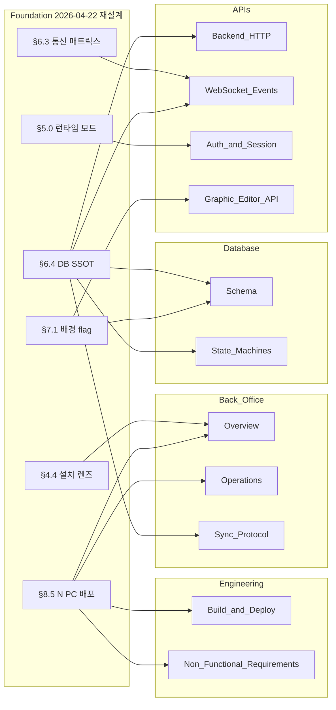

# Foundation Realignment Plan — team2 기획 문서 재정렬 계획

Foundation.md 2026-04-22 재설계(7 commit, 회의 7결정 반영)에 따라 team2 가 publisher 로서 소유한 모든 기획 문서를 재검토하여 정렬 필요 항목을 식별하고 실행 계획을 수립한다.

| 항목 | 값 |
|------|-----|
| 분석일 | 2026-04-22 |
| 분석 범위 | `docs/2. Development/2.2 Backend/**/*.md` (25 문서 + Backlog 66 항목) |
| Foundation SSOT | 2026-04-22 재설계판 (v1.7, commit `027d15a` 시점) |
| 추적 브랜치 | `work/team2/_team-20260422-183311` |

---

## 1. Foundation 재설계 핵심 변경 (team2 관점)

Foundation 본문에 2026-04-22 회의 7결정이 반영되며 아래 **6 축**이 team2 와 직접 맞닿는다.

| Axis | Foundation 위치 | 핵심 | team2 의무 |
|------|----------------|------|------------|
| **F-A1 설치 렌즈** | §4.4 | "설치 단위 3 SW + 1 HW" 중 BO = Backend Server (FastAPI + SQLite/PostgreSQL, 별도 서비스) | 설치 단위로서의 BO 경계 · 기술 스택 재확인 |
| **F-A2 런타임 모드** | §5.0 | 탭/슬라이딩 (단일 프로세스) vs 다중창 (독립 프로세스). Lobby Settings 선택 | 두 모드 모두 지원 (WS 연결·세션 관리) |
| **F-A3 통신 매트릭스** | §6.3 | Lobby→BO REST · Lobby←BO WS `ws/lobby` · CC↔BO WS `ws/cc` · Lobby↔CC 직접 금지 | 원칙 엔포스먼트 (WS auth · routing) |
| **F-A4 병행 dispatch** | §6.3 §1.1.1 | CC = Orchestrator. BO ack = audit 참고값, Engine = 게임 상태 SSOT | WriteAction/WriteDeal/WriteGameInfo 등 ack payload 를 "audit 용" 으로 명시 |
| **F-A5 실시간 동기화** | §6.4 (신설) | **DB = SSOT**, DB polling 1-5s + WS push <100ms. crash 시 DB snapshot 재로드 | ⚠ **"team2 가 Wave 2 에서 `docs/2. Development/2.2 Backend/APIs/` 에 발행" 의무 명시됨** — DB polling endpoint 스키마 + WS push payload 계약 상세 |
| **F-A6 배포 아키텍처** | §8.5 (신설) | 1 PC = 1 피처 테이블, N PC + 중앙 서버 (BO+DB) 1대. 멀티 EBS 폐기 | Base URL·배포 가이드·DR 시나리오 재정렬 |
| **F-A7 Overlay 배경** | §7.1 | 투명/단색 config flag (runtime 설정) | `configs` 테이블 설계 확인 + BO 저장·조회 경로 명시 (team2 는 저장만, 판독은 team4) |

> **F2.5 정본/참조 규칙 (commit `027d15a`)**: Foundation 이 상위 개념 계약만 선언하면, team2 는 구현 상세를 정본으로 발행한다. 이번 재설계로 **신규 발행 의무(F-A5)** 가 발생.

---

## 2. team2 문서 인벤토리 & Drift 분류

전체 25 개 활성 문서를 Drift 유형별로 분류한다. 분류 기준:

| 유형 | 의미 | 처리 우선순위 |
|:----:|------|:-------------:|
| **BREAKING** | Foundation 재설계로 team2 문서의 기존 서술이 **오정렬** — 즉시 수정 | P0 |
| **PUBLISH** | Foundation 이 team2 에 **신규 발행 의무** 부여 — Wave 2 내 작성 | P0 |
| **ADDITIVE** | 기존 내용 유지, 상위 개념 인용·링크만 추가 | P1 |
| **LABEL** | Phase/라벨 등 표현 정리 (프로젝트 의도 재정의 2026-04-20 병행) | P2 |
| **OK** | 영향 없음 또는 이미 반영 완료 | — |

### 2.1 APIs 섹션 (publisher)

| 문서 | 분류 | Gap 내용 | 근거 |
|------|:----:|----------|------|
| `APIs/Backend_HTTP.md` (API-01) | **PUBLISH** | F-A5 DB snapshot endpoint 신설 — 프로세스 재시작 시 baseline 로드용 (`GET /api/v1/tables/{id}/state/snapshot` 또는 기존 CRUD 를 snapshot 용도로 재분류 명시) | Foundation §6.4 "프로세스 시작 시 DB snapshot 로드" |
| `APIs/Backend_HTTP.md` (API-01) | **ADDITIVE** | §1 Base URL 에 F-A6 LAN 배포 모델 (단일 PC vs 중앙 서버 N PC) 각주 추가 | Foundation §8.5 |
| `APIs/WebSocket_Events.md` (API-05) | **ADDITIVE** | §1.2 핵심 원칙에 F-A5 "DB SSOT + WS push <100ms" 상위 인용. §3 이벤트 분류 표에 "audit 참고값" vs "state 변경 알림" 구분 보강 | Foundation §6.4. 기존 §10/§11.1/§11.3 정정은 이미 반영 완료 (2026-04-21/22) |
| `APIs/WebSocket_Events.md` (API-05) | **PUBLISH** | F-A5 WS push payload 상세: 각 이벤트가 DB commit **후** broadcast 됨을 명시. 재연결 시 replay (§6.4 `/tables/{id}/events`) 와 snapshot 의 조합 | Foundation §6.4 위임 선언 |
| `APIs/Backend_HTTP_Status.md` | **ADDITIVE** | 4xx/5xx consumer 처리 매트릭스에 "crash 복구 시 snapshot 재로드 권장" 주석 | Foundation §6.4 |
| `APIs/Auth_and_Session.md` (API-06) | **ADDITIVE** | F-A2 런타임 모드별 세션 동작 note: 탭 모드 = 단일 JWT / 다중창 모드 = 프로세스별 JWT 지원 (사실상 기존 계약 유지) | Foundation §5.0 |
| `APIs/Graphic_Editor_API.md` | **OK** → 확인 필요 | F-A7 Overlay 배경 config flag 저장소가 이 API 소유인지, `configs` KV 소유인지 판정 필요 | Foundation §7.1 |

### 2.2 Back_Office 섹션 (publisher)

| 문서 | 분류 | Gap 내용 |
|------|:----:|----------|
| `Back_Office/Overview.md` (BO-01) | **BREAKING** | §2.1 3-앱 관계 다이어그램: "Lobby (웹)" 표기 → Foundation §4.4 에서 Lobby 는 **EBS Desktop App** (Flutter Desktop) 의 기능 조각. team1 이 Docker Web 배포를 **복원** (2026-04-22 #11)한 것은 개발/프리뷰 모드로, §4.4 설치 렌즈 SSOT 는 Flutter Desktop. 표기 일관성 확보 필요 |
| `Back_Office/Overview.md` (BO-01) | **LABEL** | §2.2 §2.3 "Phase 1~2" "Phase 3+" 라벨 다수 — 2026-04-20 프로젝트 의도 재정의(MVP/Phase 무효화)와 Foundation §4.4 (설치 렌즈) 양쪽 관점에서 라벨 재작성 필요 |
| `Back_Office/Overview.md` (BO-01) | **ADDITIVE** | §2 에 F-A6 N PC + 중앙 서버 (BO+DB) 아키텍처 §신설. Foundation §8.5 pointer (`docs/4. Operations/Network_Deployment.md`) |
| `Back_Office/Operations.md` (BO-03) | **ADDITIVE** | §2 DR 시나리오에 F-A6 "중앙 서버 SPOF" (LAN 단절 / 중앙 서버 다운 / 로컬 fallback) 시나리오 추가 — Foundation §8.5 가 `Network_Deployment.md` 로 위임 |
| `Back_Office/Sync_Protocol.md` (BO-02) | **ADDITIVE** | §1 동기화 개요 상위에 F-A5 "DB SSOT + 2 채널 (polling + push)" 계약을 Foundation §6.4 인용으로 선언. 기존 WSOP LIVE 폴링과 별개로 **EBS 내부 BO ↔ 클라이언트 동기화** 정책이 §6.4 를 따른다는 scope 구분 |

### 2.3 Database 섹션 (publisher)

| 문서 | 분류 | Gap 내용 |
|------|:----:|----------|
| `Database/Schema.md` (DATA-04) | **LABEL** | "Phase 1 SQLite" / "Phase 3+ PostgreSQL" 라벨 — 라벨 삭제 또는 중립 표현으로 교체 (dev=SQLite / prod=PostgreSQL) |
| `Database/Schema.md` (DATA-04) | **ADDITIVE** | §개요 상단에 "본 스키마는 Foundation §6.4 에 따라 **DB = SSOT**. 모든 상태 변경은 여기 commit 된 후 WS broadcast 된다" 선언. `audit_events.seq` 와의 관계 강조 |
| `Database/State_Machines.md` (DATA-05) | **ADDITIVE** | 각 FSM 도입부에 F-A5 "프로세스 재시작 시 DB snapshot 로드 → 이후 WS push 로 델타 적용" 패턴 note |
| `Database/ER_Diagram.md` | **OK** | 영향 없음 |
| `Database/GFSkin_Schema.md` (DATA-07) | **ADDITIVE** | F-A7 Overlay 배경 flag 저장 위치가 `configs` KV 인지 `skins.manifest` 인지 판정 필요 — 2~3 줄 note |

### 2.4 Engineering 섹션 (publisher)

| 문서 | 분류 | Gap 내용 |
|------|:----:|----------|
| `Engineering/Build_and_Deploy.md` | **BREAKING** | Foundation §8.5 "중앙 서버 1대 (BO+DB) 필수" 를 반영. 기존 "단일 프로세스→Docker" 진화 서술을 "단일 PC 운영 / N PC + 중앙 서버" 두 배포 모델로 재작성. `Docker_Runtime.md` SSOT 참조 보강 |
| `Engineering/Non_Functional_Requirements.md` | **ADDITIVE** | F-A5 SLO 명시 — WS push <100ms (이미 있음), DB polling 1-5s (신규), crash recovery 복원 시간 SLO |
| `Engineering/Tech_Stack.md` | **LABEL** | Phase 라벨 정리. F-A1 설치 단위 "Backend Server" 공식 명칭 도입 |
| `Engineering/Dev_Setup.md` | **ADDITIVE** (선택) | F-A6 N PC LAN 시뮬레이션 가이드 — Docker Compose 로 "중앙 서버 PC + 테이블 PC" 이중 컨테이너 예시 |
| `Engineering/Dependency_Injection.md`, `Logging.md`, `Error_Handling.md`, `Testing_Strategy.md`, `State_Management.md`, `Project_Structure.md`, `Routing.md`, `Sandbox_Tournament_Generator.md` | **LABEL** | Phase 라벨 일괄 정리 (found via grep: 17 파일) |

### 2.5 Landing / Backlog

| 문서 | 분류 | 처리 |
|------|:----:|------|
| `2.2 Backend.md` (landing) | **OK** | CI 자동 생성 (tier: generated) — 직접 수정 금지 |
| `Backlog.md` | **ADDITIVE** | 본 계획의 후속 작업 B-team2-XXX 로 신규 등재 |

---

## 3. 영향 매트릭스 (요약)



총 변경 대상: **13 문서** (APIs 4 · Back_Office 3 · Database 2 · Engineering 2 + 일괄 라벨 정리 대상 별도).

---

## 4. Phase 별 실행 계획

### Phase A — Foundation §6.4 신규 발행 의무 (P0, 즉시)

Foundation §6.4 본문에 "team2 가 Wave 2 에서 **발행**한다" 선언이 있어 **신규 계약 문서 발행이 의무**. 이 Phase 가 밀리면 Foundation 재설계가 미완결 상태로 방치됨.

| 작업 | 대상 | 규모 | 산출 |
|------|------|:----:|------|
| **A1. WebSocket_Events §1.2 보강 + §3 이벤트 분류 갱신** | `APIs/WebSocket_Events.md` | ~50 줄 추가 | §6.4 상위 정책 인용 + 각 이벤트 "audit 참고값" vs "state 변경" 구분 표 |
| **A2. Backend_HTTP DB snapshot endpoint 명세** | `APIs/Backend_HTTP.md` | 1 endpoint 추가 또는 기존 재해석 | `GET /api/v1/tables/{id}/state/snapshot` (or re-use GET /tables/{id}) — baseline 로드 계약 |
| **A3. Sync_Protocol §1 §6.4 정책 인용** | `Back_Office/Sync_Protocol.md` | ~15 줄 추가 | "EBS 내부 동기화는 Foundation §6.4 를 따른다" scope 선언 |

### Phase B — Breaking 정정 (P0, 이번 주)

| 작업 | 대상 | 규모 | 산출 |
|------|------|:----:|------|
| **B1. BO Overview §2.1 다이어그램 정정** | `Back_Office/Overview.md` | 다이어그램 + §2.3 | Lobby 표기 → "Lobby (EBS Desktop App 의 로비 조각)", Mermaid 코드블록 전환 (11-ascii-diagram.md) |
| **B2. BO Overview §2.3/§2.4 재작성** | `Back_Office/Overview.md` | §재작성 | Phase 라벨 제거, §8.5 N PC + 중앙 서버 반영, §6.4 DB SSOT 원칙 명시 |
| **B3. Build_and_Deploy 재작성** | `Engineering/Build_and_Deploy.md` | §전반 | 단일 PC / N PC + 중앙 서버 두 배포 모델. `Docker_Runtime.md` 참조 보강 |

### Phase C — Additive 보강 (P1)

| 작업 | 대상 | 규모 | 산출 |
|------|------|:----:|------|
| **C1. Operations §8.5 SPOF DR 시나리오** | `Back_Office/Operations.md` | ~20 줄 추가 | LAN 단절 / 중앙 서버 다운 / 로컬 fallback — `Network_Deployment.md` 위임 |
| **C2. Schema §개요 DB SSOT 선언** | `Database/Schema.md` | 3~5 줄 추가 | "본 스키마는 Foundation §6.4 에 따라 DB = SSOT" |
| **C3. State_Machines crash 복구 note** | `Database/State_Machines.md` | 각 FSM 2~3 줄 | snapshot 로드 + WS delta 패턴 |
| **C4. Non_Functional_Requirements SLO 보강** | `Engineering/Non_Functional_Requirements.md` | 1~2 항목 | DB polling 1-5s, crash recovery 시간 |
| **C5. Backend_HTTP §1 Base URL 배포 모드 각주** | `APIs/Backend_HTTP.md` | 5 줄 | §8.5 pointer |
| **C6. Auth_and_Session §5.0 런타임 모드 note** | `APIs/Auth_and_Session.md` | 5~10 줄 | 다중창 모드 세션 동작 |
| **C7. Backend_HTTP_Status crash 복구 매트릭스** | `APIs/Backend_HTTP_Status.md` | 주석 1~2개 | snapshot 재로드 권장 |

### Phase D — Label 정리 (P2, 누적)

Phase 라벨 (Phase 1/2/3+) 을 **중립 표현** (`dev` / `prod` 또는 `current` / `future`) 으로 교체하거나, **프로젝트 의도 재정의 참조 각주** 로 해소.

- 대상: Schema.md, Tech_Stack.md, Logging.md, Error_Handling.md, State_Management.md, Project_Structure.md, Routing.md, Sandbox_Tournament_Generator.md, Dependency_Injection.md, Dev_Setup.md, Testing_Strategy.md (총 11 파일)
- 단일 커밋 또는 파일별 점진 커밋 둘 다 가능 — **Phase A/B/C 완료 후 별도 PR 권장** (리뷰 부담 분리).

### Phase E — 판정 필요 (블록됨 → 결정 후 집행)

| 결정 항목 | 관계 팀 | 임시 입장 |
|----------|:-------:|----------|
| **E1. Overlay 배경 config flag 저장소** | team2 ↔ team4 | `configs` KV (scope=global) 우선 안 — team4 의 runtime 판독 경로 확정 후 commit |
| **E2. Graphic_Editor_API 내 overlay runtime 설정 여부** | team1 ↔ team2 ↔ team4 | team1 (GE 편집) / team2 (persist) / team4 (runtime 판독) 3단계. 본 계획 밖 |

---

## 5. 리스크 & 의존성

| 리스크 | 완화 |
|--------|------|
| **Publisher.py trigger wiring 진행 중 (TODO-T2-014)** — Phase A1 이 WS 이벤트 분류를 바꾸면 코드 drift 발생 | 분류는 **문서 주석** 만 추가, WS payload 변경은 **금지**. 코드 변경은 별도 Backlog 로 분리 |
| **Backend_HTTP.md 신규 endpoint 추가 시 pytest 247 tests baseline 영향** | Phase A2 는 **명세만** 추가 (구현은 Backlog B-team2-XXX 로 분리). pytest 영향 없음 |
| **Overview.md 다이어그램 변경 시 cross-ref 파일** | grep 으로 "Lobby (웹)" 참조 검사 후 교체 (현재 확인 완료 — Foundation §4.4 기준 일관성만 회복) |
| **Phase 라벨 제거 시 사용자 이해 혼란** | 각주로 "프로젝트 의도 재정의 2026-04-20 참조" 또는 MEMORY.md §"project_intent_spec_validation" 링크 추가 |
| **Network_Deployment.md 내용 미확인** | Phase C1 전에 해당 문서 읽기 필수 — 교차 중복·모순 방지 |

---

## 6. 검증 기준

이 계획이 **성공적으로 집행 완료** 되었다는 판정 기준:

| 기준 | 측정 |
|------|------|
| **spec drift 회귀 없음** | `tools/spec_drift_check.py --all --format=json` 이전/이후 비교. D4 증가/PASS 감소 금지 |
| **pytest 247 tests 유지** | Phase A/B/C 는 문서 전용이므로 pytest 변화 없음 (baseline 고정) |
| **Foundation §6.4 발행 의무 충족** | `APIs/WebSocket_Events.md` · `APIs/Backend_HTTP.md` 에 §6.4 참조 1건 이상 확인 |
| **"Lobby (웹)" 표현 0건** | `grep -r "Lobby (웹)" docs/2. Development/2.2 Backend` 결과 0 |
| **Phase 라벨 (Phase 1~2, Phase 3+) 잔존 허용 범위** | Foundation §9.3 의 5단계 로드맵 인용만 허용. team2 내부 기술 결정에서 제거 |

---

## 7. 실행 권고 순서

이번 /team 호출은 **계획 수립 + 보고**. 실제 실행은 **다음 /team** 에서:

```
/team "Foundation Realignment Phase A — §6.4 발행 의무 (WebSocket_Events §1.2/§3 + Backend_HTTP snapshot + Sync_Protocol §1)"
/team "Foundation Realignment Phase B — Breaking 정정 (BO Overview §2 + Build_and_Deploy)"
/team "Foundation Realignment Phase C — Additive 보강 (Operations/Schema/State_Machines/NFR/Auth note)"
/team "Foundation Realignment Phase D — Label 정리 (Phase 라벨 일괄)"
```

Phase E (판정 블록) 는 관계 팀과의 동기화 후 별도 Backlog 항목으로 등재.

---

## 8. 후속 Backlog 항목

본 계획 집행을 위한 팀 백로그 후보 (본 문서 저장과 함께 `Backlog.md` 에 등재 예정):

| ID | Subject | Phase |
|----|---------|:----:|
| B-team2-100 | Foundation §6.4 발행 — WebSocket_Events §6.4 인용 보강 | A1 |
| B-team2-101 | Foundation §6.4 발행 — Backend_HTTP DB snapshot endpoint 명세 | A2 |
| B-team2-102 | Foundation §6.4 발행 — Sync_Protocol §1 정책 인용 | A3 |
| B-team2-103 | Foundation §4.4 breaking — BO Overview §2.1 다이어그램 Lobby 표기 정정 | B1 |
| B-team2-104 | Foundation §8.5 breaking — BO Overview §2 N PC 아키텍처 반영 | B2 |
| B-team2-105 | Foundation §8.5 breaking — Build_and_Deploy 배포 모델 재작성 | B3 |
| B-team2-106 | Foundation §8.5 additive — Operations SPOF DR 시나리오 | C1 |
| B-team2-107 | Foundation §6.4 additive — Schema DB SSOT 선언 & State_Machines 복구 note | C2, C3 |
| B-team2-108 | Foundation §6.4 additive — NFR DB polling SLO 보강 | C4 |
| B-team2-109 | Foundation §8.5 additive — Backend_HTTP Base URL 배포 모드 각주 | C5 |
| B-team2-110 | Foundation §5.0 additive — Auth_and_Session 런타임 모드 note | C6 |
| B-team2-111 | Foundation §6.4 additive — Backend_HTTP_Status crash 복구 매트릭스 | C7 |
| B-team2-112 | Foundation 정리 — Phase 라벨 일괄 제거 (Engineering 11 파일) | D |
| B-team2-113 | Foundation §7.1 decision — Overlay 배경 config flag 저장소 판정 (team4 조율) | E1 |

---

## Changelog

| 날짜 | 버전 | 변경 내용 | 결정 근거 |
|------|------|-----------|----------|
| 2026-04-22 | v1.0 | 최초 작성 — Foundation 2026-04-22 재설계 영향 매트릭스 + 5 Phase 실행 계획 + Backlog 14 항목 등재 계획 | 사용자 지시 "Foundation.md 전면 재설계되었어 이에 따라 team2 에서 책임지는 모든 기획 문서 전면 재검토하여 수정 계획 수립 및 보고" |
