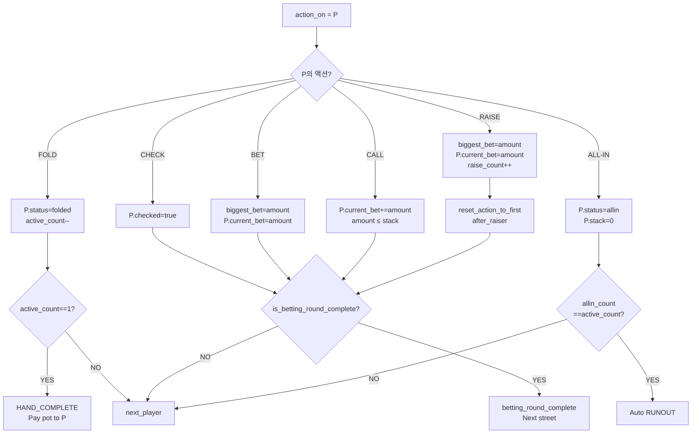

# Betting & Pots — Domain Master

> **존재 이유**: Hold'em 의 베팅 라운드 전체 사이클 (강제 베팅 → 액션 → 팟 분리 → 쇼다운 카드 공개 → 핸드 보호) 을 단일 SSOT 로 통합한다. BS-06-02 + BS-06-03 + BS-06-06 + BS-06-07 4개 문서를 zero information loss 로 병합. 상태 전이는 Lifecycle 도메인, 이벤트 파이프라인은 Triggers 도메인 권위.

| 날짜 | 항목 | 내용 |
|------|------|------|
| 2026-04-06 | BS-06-02 신규 | 6 액션 × 3 bet_structure × 특수 케이스 |
| 2026-04-06 | BS-06-03 신규 | Ante 7종 + Blind 4종 + Straddle + Heads-up + Bomb Pot |
| 2026-04-06 | BS-06-06 신규 | N-player all-in 사이드팟 생성/계산/판정 |
| 2026-04-06 | BS-06-07 신규 | 카드 공개 48 조합 + Muck + Venue/Broadcast Canvas |
| 2026-04-09 | BS-06-02 GAP-GE-006 | CALL/BET/RAISE/ALL-IN → is_betting_round_complete 분기 + 스트리트 전환 초기화 |
| 2026-04-09 | BS-06-02 CALL 보강 | enforcement pseudocode, 외부 amount 무시 강제 |
| 2026-04-10 | WSOP P0 (BS-06-02) | §5.1 Under-raise (Rule 95) + §5.2 Raise Cap (Rule 100.b) + §6.1 Incomplete All-in (Rule 96) |
| 2026-04-10 | WSOP (BS-06-02) | Rule 56 verbal/chip + Rule 80-83 Time bank/At-seat 참조 |
| 2026-04-10 | WSOP (BS-06-03) | Heads-up Button Adjust (Rule 87), Missed Blind 복귀 (Rule 86) |
| 2026-04-10 | WSOP P1/P2 (BS-06-07) | Tabled Hand 보호 (Rule 71), Folded Hand 복구 (Rule 110), Muck 재판정 (Rule 109) |
| 2026-04-13 | GAP-C (BS-06-03) | 통합 포스팅 순서 Pseudocode + ManagerRuling 패널티 |
| 2026-04-28 | 도메인 통합 (본 문서) | BS-06-02 + 03 + 06 + 07 lossless 병합. legacy-ids 보존. Lifecycle/Triggers 도메인 권위 위임. Chunk-by-chunk commit (sibling worktree). |
| 2026-05-07 | v3/v4 정체성 cascade Phase B2 | Lobby_PRD v3.0.0 + CC_PRD v4.0 정체성 정합 (LLM 전수 의미 판정 — Engine). §3.1 베팅 액션 트리거 표 → "CC 입력 (6 키)" + Phase-aware framing. 단축키 "F=Fold, C=Call, R=Raise" → CC v4.0 정본 매핑 (N·F·C·B·A·M + Ctrl+Z) 으로 정정. CC v4.0 §5 V14 *위치 기반 손가락 학습* 정합. | DOC |

---

## 1. Overview & Definitions

### 1.1 도메인 정의

본 도메인은 핸드 진행 중 **칩이 움직이는 모든 메커니즘** 을 통합한다:

1. **강제 베팅 (BS-06-03)**: SETUP_HAND 진입 시 Ante 7종 + Blind 4종 + Straddle 자동 수거 → `pot_initial` + `biggest_bet_amt` 확정
2. **베팅 액션 (BS-06-02)**: PRE_FLOP ~ RIVER 동안 Fold/Check/Bet/Call/Raise/All-in 6 액션 × NL/PL/FL 3 bet_structure 처리
3. **사이드팟 (BS-06-06)**: 서로 다른 all-in 금액으로 인한 자동 팟 분리 + eligible set 계산 + 역순 판정
4. **쇼다운 (BS-06-07)**: 카드 공개 순서 (Last Aggressor first) + Muck 권리 + Venue/Broadcast Canvas 차이 + Run It Twice + Hand 보호/복구

상태 전이 자체는 Lifecycle 도메인 마스터 권위. 본 도메인은 그 결과 **칩 흐름 + 팟 형성 + 승자 결정** 만 담는다.

### 1.2 핵심 개념 정의

#### 1.2.1 베팅 액션 (BS-06-02 §정의)

**베팅 액션**: 현재 액션 턴 (`action_on`) 을 가진 플레이어가 자신의 의도를 선언하는 행동. 6가지 유형:

1. **Fold** — 현재 핸드를 포기하고 팟에서 탈락
2. **Check** — 베팅 없이 액션을 다음 플레이어에게 넘김
3. **Bet** — 현재 스트리트에서 처음으로 금액을 베팅
4. **Call** — 현재까지 가장 높은 베팅액과 같은 금액을 납부
5. **Raise** — 현재까지 가장 높은 베팅액을 초과하는 금액을 베팅
6. **All-in** — 자신의 모든 칩을 팟에 넣음 (금액과 무관하게 상태 전환)

#### 1.2.2 베팅 구조 (bet_structure, BS-06-02 §정의)

- **NL (No Limit)** — 최소 big_blind 이상이면 스택 전액까지 베팅 가능
- **PL (Pot Limit)** — 베팅 금액의 상한 = 팟 + 2×콜액 계산식 적용
- **FL (Fixed Limit)** — 각 스트리트별 고정 금액 (low_limit / high_limit) 및 레이즈 상한 제한

#### 1.2.3 강제 베팅 (BS-06-03 §정의)

운영자가 CC 버튼을 누르지 않아도 게임 규칙에 의해 **자동으로 수거** 되는 의무 납부금:

- **Ante**: 핸드 시작 전 전원 (또는 특정 플레이어) 이 납부하는 추가 의무금
- **Blind**: 딜러 위치 기준 2~3명이 **순차적으로** 납부하는 강제 베팅
- **Straddle**: UTG 또는 Button 위치 플레이어가 자발적으로 납부하는 **추가 블라인드** (2× BB)

**속성**:
- **Dead Money vs Live Money**: Ante/Blind 는 일반적으로 Dead 이지만, Live Ante 는 예외
- **자동 처리**: 운영자 입력 불필요, 게임 엔진이 자동 처리
- **팟 초기값**: 모든 강제 베팅 합계 = `pot_initial`

#### 1.2.4 사이드팟 (BS-06-06 §정의)

**사이드팟**은 플레이어의 투입액 차이로 인해 자동으로 생성되는 **팟 분리 구조**:

- **메인팟**: 모든 플레이어가 참여 가능한 최소 투입액 기반 팟
- **사이드팟**: 추가 투입액 기반의 팟 (메인팟 이후)
- **eligible set**: 해당 팟에 우승할 자격이 있는 플레이어 목록

**핵심 원칙**:
- 모든 플레이어가 기여한 금액만큼만 팟에 참여 가능
- 팟 분배 순서는 **역순** (가장 작은 eligible set 의 팟부터)
- Fold 플레이어의 데드 머니 (이미 폴드한 플레이어가 넣어둔, 돌려받을 수 없는 금액) 는 각 팟에 비례 분배

#### 1.2.5 쇼다운 카드 공개 (BS-06-07 §정의)

**카드 공개**는 SHOWDOWN 또는 ALL_IN_RUNOUT 단계에서 플레이어의 홀카드를 가시화하는 프로세스:

- **Last Aggressor**: 마지막 베팅/레이즈를 한 플레이어 (공개 우선권)
- **Muck**: 패배자가 카드를 비공개 상태로 유지할 권리
- **Venue Canvas**: 신뢰성 중심 (홀카드 절대 미공개) — 현장 관중용 화면, 공정성 유지
- **Broadcast Canvas**: 시각화 중심 (항상 홀카드 표시, 이전 상태 유지) — 방송 시청자용 화면, 흥미 유발

**핵심 원칙**:
- 공개 순서: last aggressor first, then clockwise
- Muck 권리는 showdown 에서만 적용 (all-in 경우 강제 공개)
- Venue 와 Broadcast 는 홀카드 가시성이 반대

### 1.3 베팅 입력 방식 (BS-06-02 WSOP Rule 56)

EBS 는 CC (Command Center) 의 전자식 입력을 유일한 공식 소스로 간주한다. WSOP Official Live Action Rules Rule 56 은 구두/칩 동시 발생 시의 우선순위 (구두 우선, 또는 먼저 발생한 쪽 우선) 를 규정하지만, EBS 운영 환경에서는 다음과 같이 해석한다:

1. **라이브 테이블 (physical)**: 딜러 또는 CC 운영자가 Rule 56 을 적용하여 verbal/chip 의도를 판단한 후, 결과를 CC 에 **단일 이벤트** 로 입력한다.
2. **EBS Engine**: CC 가 전송한 이벤트를 재해석 없이 그대로 수락한다. Rule 56 재해석은 수행하지 않는다.
3. **CC UI 구현 권고** (Team 4 참조):
   - 구두 먼저 → 칩 금액 불일치 시 구두 우선 (Rule 56 전단)
   - Amount-only 선언은 동일 금액 call/raise 로 자동 판정 (Rule 56.c "declaring 200 = silently pushing 200 chips")
   - 불분명한 상황은 Floor 판정 버튼으로 전환

이 레이어는 Rule 95 (under-raise) 와 Rule 96 (incomplete all-in) 과 **독립적** 으로 동작한다.

### 1.4 용어 사전 (4 문서 통합)

| 용어 | 출처 | 설명 |
|------|------|------|
| **CC** | BS-06-02/07 | Command Center, 운영자가 게임을 제어하는 화면 |
| **NL/PL/FL** | BS-06-02 | No Limit / Pot Limit / Fixed Limit 베팅 구조 |
| **Pseudocode** | All | 실제 프로그래밍 언어가 아닌 가상 코드 (참고용) |
| **scoop** | BS-06-02/06 | 한 사람이 팟 전체를 가져가는 것 |
| **odd chip** | BS-06-02/06 | 팟을 나눌 때 딱 떨어지지 않는 나머지 1개 베팅 토큰 |
| **FSM** | BS-06-03 | Finite State Machine — 게임 진행 단계 흐름도 |
| **Dead Money** | BS-06-03/06 | 폴드한 플레이어가 팟에 남긴 돌려받을 수 없는 금액 |
| **Live Money** | BS-06-03 | 첫 라운드 베팅에 포함되는 ante 금액 (Live Ante 예외) |
| **Straddle** | BS-06-02/03 | UTG 또는 Button 의 자발적 추가 블라인드 (2× BB) |
| **TB Ante** | BS-06-03 | Two Blinds Ante — SB+BB 가 합산하여 전원분 ante 부담 |
| **Bomb Pot** | BS-06-02/03 | 전원 고정액 자동 납부 + PRE_FLOP 스킵 → FLOP 직행 |
| **Dead Button** | BS-06-03 | 이전 딜러 좌석이 빈 경우 button 위치 유지 |
| **Last Aggressor** | BS-06-07 | 마지막 베팅/레이즈 플레이어 (공개 우선권) |
| **Muck** | BS-06-07 | 패를 공개하지 않고 버리는 것 |
| **eligible set** | BS-06-06 | 해당 팟에 우승할 자격이 있는 플레이어 목록 |
| **cascade** | BS-06-06 | 하나의 이벤트가 연쇄적으로 다른 이벤트 발생 |
| **홀카드 (hole card)** | BS-06-07 | 각 플레이어에게 비공개로 나눠주는 카드 |

### 1.5 핵심 원칙 (4 문서 종합)

- 강제 베팅 (Ante/Blind/Straddle) 은 모두 결정론적 자동 처리 — 운영자 개입 없음
- 베팅 액션은 CC 의 단일 이벤트로 처리되며, 엔진이 amount 검증 (REJECTED 시 재입력)
- Call/AllIn 의 amount 는 엔진 내부 재계산 (외부 전달값 무시) — BS-06-02 의 핵심 invariant
- 사이드팟 분리는 자동 — 운영자 수동 입력 불필요
- 쇼다운 카드 공개 순서는 Last Aggressor first, 그 다음 시계방향
- Muck 권리는 SHOWDOWN 에서만 (ALL_IN_RUNOUT 은 강제 공개)

---

## 2. State Machine / Data Flow

### 2.1 Betting Round 전체 흐름

```
[SETUP_HAND]
  ├─ Step 1: Ante 포스팅 (ante_type 0~6 별 분기)
  ├─ Step 2: Blind 포스팅 (SB → BB → Third)
  ├─ Step 3: Straddle 옵션 (활성화 시)
  ├─ Step 4: Short Contribution 처리 (자동 all-in)
  ├─ Step 5: 상태 초기화 (acted_this_round = {})
  ↓
[PRE_FLOP] (Bomb Pot 시 SKIP → FLOP 직행)
  ├─ first_to_act = UTG (또는 SB heads-up / Straddle 다음)
  ├─ Loop: PlayerAction (Fold/Check/Bet/Call/Raise/AllIn)
  │       └─ is_betting_round_complete? (BS-06-10 권위 / Lifecycle 도메인 §5.7)
  ├─ Side Pot 분리 (all-in 발생 시 자동)
  ↓ (betting_round_complete == true)
[FLOP]
  ├─ 스트리트 전환 초기화 (biggest_bet_amt=0, current_bet=0, num_raises=0, acted_this_round={})
  ├─ first_to_act = SB (또는 BB heads-up)
  ├─ Loop: PlayerAction
  ↓
[TURN] (동일)
  ↓
[RIVER] (동일, final_betting_round=true)
  ↓
[SHOWDOWN]
  ├─ 카드 공개 순서: Last Aggressor first → clockwise
  ├─ Run It Twice 옵션 (조건 충족 시)
  ├─ 사이드팟 역순 판정: 가장 작은 eligible set 팟부터
  ├─ 데드 머니 분배 (각 팟 비례)
  ├─ Muck 권리 (Venue/Broadcast 별)
  ↓
[HAND_COMPLETE]
  ├─ Hand 보호 & 복구 (Rule 71/109/110)
  ├─ Statistics 업데이트
  ├─ Missed Blind 마크 (Rule 86)
  ├─ Heads-up Button Adjust (Rule 87)
```

> 상태 전이 권위: Lifecycle 도메인 §3.3 매트릭스 1 (Hold'em 상태 상세) + §3.6 매트릭스 4 (특수 오버라이드).

### 2.2 GameState 핵심 필드 (베팅/팟 측 view)

> Data Model 권위: Lifecycle 도메인 §5.1 GameState. 본 도메인은 베팅/팟 관련 필드의 의미만 명시.

| 필드 | 타입 | 의미 |
|------|------|------|
| `pot` | Pot | 메인 팟 (amount + eligible_seats) |
| `side_pots` | Pot[] | 사이드 팟 배열 |
| `biggest_bet_amt` | int | 현재 스트리트 최고 베팅액 (Bet/Raise/All-in 갱신) |
| `last_raise_increment` | int | 직전 raise 의 증가분 (next min raise 계산 기반) |
| `min_raise_amt` | int | 다음 레이즈 최소액 |
| `num_raises_this_street` | int | 현재 스트리트 raise 횟수 (FL cap 카운터) |
| `acted_this_round` | Set\<int\> | 현재 라운드 액션한 좌석 (BB check option 보호) |
| `last_aggressor` | int | 마지막 베팅/레이즈 좌석 (Showdown 공개 우선권) |
| `bomb_pot_enabled` | bool | Bomb Pot 모드 활성화 |
| `bomb_pot_amount` | int | Bomb Pot 전원 납부 금액 |
| `bomb_pot_opted_out` | Set\<int\> | Bomb Pot opt-out 좌석 (Rule 28.3.2) |
| `tournament_heads_up` | bool | 토너먼트 2명 남음 (FL raise cap 무시 판정) |
| `straddle_enabled` | bool | Straddle 활성화 |
| `straddle_seat` | int | Straddle 좌석 (UTG 또는 Button) |
| `bb_ante` | bool | BB Ante 활성 |
| `ante_type` | int | 0~6 (std/button/bb/bb_1st/live/tb/tb_1st) |
| `prev_hand_bb_seat` | int? | 직전 핸드 BB 좌석 (Rule 87 Heads-up Button Adjust) |
| `boxed_card_count` | int | 현재 핸드 boxed card 누적 수 (Rule 88, 2+ 시 misdeal) |

### 2.3 Player 베팅 관련 필드

| 필드 | 타입 | 의미 |
|------|------|------|
| `current_bet` | int | 현재 스트리트 기여액 (스트리트 전환 시 0 리셋) |
| `total_invested` | int | 핸드 전체 누적 기여액 (사이드팟 계산 기준) |
| `stack` | int | 남은 칩 |
| `status` | enum | active / folded / allin / sitting_out / busted |
| `missed_sb` | bool | SB 포지션 놓침 (Rule 86) |
| `missed_bb` | bool | BB 포지션 놓침 (Rule 86) |
| `cards_tabled` | bool | 명시적 카드 공개 (Rule 71 보호 활성) |

### 2.4 Pot 구조 (BS-06-06 §데이터 모델)

```python
class SidePot:
    pot_id: int                # 0=메인팟, 1=사이드팟1, 2=사이드팟2, ...
    amount: float              # 팟 금액
    eligible_seats: set[int]   # 이 팟에 우승할 자격 있는 플레이어 좌석
    winner_seat: int = -1      # 우승자 좌석 (-1=미결정)
    winning_hand: HandRank     # 우승자의 핸드 평가

class PotStructure:
    main_pot: SidePot
    side_pots: list[SidePot]   # [사이드팟1, 사이드팟2, ...]
    total_pot: float           # 전체 팟 합계

    def get_all_pots() -> list[SidePot]:
        return [self.main_pot] + self.side_pots

class HandState:  # 확장
    all_in_amounts: dict[int, float]      # {seat: amount}
    pot_structure: PotStructure
    side_pot_verdicts: list[dict]         # [{pot_id, winner_seat, amount, hand_rank}]
```

### 2.5 ShowdownSettings 구조 (BS-06-07 §데이터 모델)

```python
class ShowdownSettings:
    # Visibility
    card_reveal_type: int      # 0~5 (immediate/after_action/end_of_hand/never/showdown_cash/showdown_tourney)
    show_type: int             # 0~3 (immediate/action_on/after_bet/action_on_next)
    fold_hide_type: int        # 0~1 (immediate/delayed)

    # Muck
    allow_muck: bool           # showdown_tourney=True, broadcast=False
    muck_default: bool         # True=기본 Muck, False=기본 Show

    # Canvas
    canvas_type: str           # "venue" or "broadcast"

class CardRevealState:
    revealed_seats: set[int]
    last_aggressor_seat: int
    reveal_order: list[int]                   # [last_agg, next_clockwise, ...]
    mocked_seats: dict[int, bool]
    revealed_cards: dict[int, list[Card]]     # {seat: [card1, card2]}

class HandState:  # 확장
    showdown_settings: ShowdownSettings
    card_reveal_state: CardRevealState
    last_aggressor_seat: int
    all_in_runout: bool        # True = 강제 공개
```

### 2.6 RunItTwiceState 구조 (BS-06-07 §Run It Twice)

```python
class RunItTwiceState:
    can_select_run_it_twice: bool = False
    run_it_times: int = 0                       # 0=미사용, 2=2회, 3=3회
    run_it_times_remaining: int = 0             # 남은 횟수
    run_it_times_board_cards: list[list[int]] = []  # 각 런별 보드 카드 저장
```

### 2.7 스트리트 전환 시 초기화 (BS-06-02 §스트리트 전환)

다음 스트리트로 전환될 때마다 아래 값을 반드시 초기화한다. **이 초기화 없이는 BET 조건 (`biggest_bet_amt == 0`) 이 절대 충족되지 않는다.**

| 필드 | 초기화 값 | 이유 |
|------|:---------:|------|
| `biggest_bet_amt` | 0 | BET 가능 조건 충족, 스트리트 독립 |
| `num_raises_this_street` | 0 | FL cap 카운터 리셋 |
| `player[*].current_bet` | 0 | 각 플레이어의 스트리트 기여도 리셋 |
| `acted_this_round` | `{}` | BS-06-10 위임, 블라인드 포스터 포함 금지 |

> `player[*].current_bet = 0` 초기화는 side pot 계산 기준이기도 하다. 스트리트 간 누적 기여액은 별도 `total_invested` 필드로 추적.

### 2.8 베팅 라운드 종료 확인 — 공통 프로토콜 (BS-06-02 §베팅 라운드 종료)

모든 베팅 액션 (FOLD, CHECK, BET, CALL, RAISE, ALL-IN) 처리 후, **반드시** `is_betting_round_complete(state)` (Lifecycle 도메인 §5.7) 를 호출해야 한다.

| 반환값 | 처리 |
|:------:|------|
| **true** | 다음 스트리트 이벤트 발행 (StreetAdvance) 또는 HAND_COMPLETE |
| **false** | `action_on = next_active_player(action_on)` 으로 이동, 다음 액션 대기 |

> 이 체크는 CHECK 액션에만 적용하는 것이 아니다. CALL 이 마지막 필요 액션인 경우 (레이즈 후 전원 콜 완료 등) CALL 직후 라운드가 종료된다.

---

## 3. Trigger & Action Matrix

### 3.1 베팅 액션 트리거 (BS-06-02 §트리거)

| 트리거 유형 | 조건 | 발동 주체 | 정확도 |
|-----------|------|---------|--------|
| **CC 입력 (6 키)** | 운영자가 6 키 (N·F·C·B·A·M) 로 액션 발사. C=CHECK/CALL 동적, B=BET/RAISE 동적 (CC v4.0 Phase-aware, `Command_Center_PRD.md` Ch.5) | 운영자 (수동) | ≤100ms |
| **금액 입력 후 CONFIRM** | 운영자가 금액을 직접 입력하고 확인 (BET/RAISE 만) — v4.0 에서는 B 키 입력 시 자동 모달 + Enter 확정 | 운영자 (수동) | ≤150ms |
| **키보드 단축키 = 정본** | CC v4.0 의 6 키가 정본 입력 표면. F=FOLD, C=CHECK/CALL, B=BET/RAISE, A=ALL-IN, N=NEW HAND, M=MUCK + Ctrl+Z=UNDO (CC_PRD §5 V14: *같은 키 = 같은 손가락 위치 = 다른 의미*) | 운영자 (수동) | ≤50ms |

**전제조건** (모두 참):
1. `hand_in_progress == true`
2. `GamePhase ∈ {PRE_FLOP, FLOP, TURN, RIVER}`
3. `action_on == player_index`
4. `player.status == active` (folded ❌, allin ❌, busted ❌)
5. `num_active_players ≥ 2`
6. `betting_round_complete == false`

### 3.2 강제 베팅 트리거 (BS-06-03 §트리거)

| 트리거 유형 | 조건 | 발동 주체 | 처리 시간 |
|-----------|------|---------|---------|
| **NEW HAND 버튼** | 운영자가 CC "NEW HAND" 클릭 + precondition 충족 | 운영자 (수동) | 즉시 (<50ms) |
| **게임 엔진 자동** | SendStartHand() 응답 수신 후 SETUP_HAND 진입 | 게임 엔진 (자동) | 계산 기반 |
| **상태 추적** | `hand_in_progress = true`, 강제 베팅 수거 완료 시점 | 게임 엔진 (자동) | 상태 전이와 동시 |

**전제조건**:
1. `hand_in_progress == false` — 이전 핸드 완료 또는 초기 상태
2. `pl_dealer != -1` — 딜러 위치 할당됨 (0~num_seats-1)
3. `num_blinds ∈ {0, 1, 2, 3}`
4. `ante_type ∈ {0~6}`
5. `num_seats ≥ 2`
6. 게임 상태 ∈ {IDLE, HAND_COMPLETE}

### 3.3 매트릭스 1: 액션별 유효성 검증 (BS-06-02 Matrix 1, 6 actions × 3 bet_structures)

| 액션 | NL 유효조건 | NL 금액 범위 | PL 유효조건 | PL 금액 범위 | FL 유효조건 | FL 금액 |
|:----:|-----------|-----------|-----------|-----------|-----------|---------|
| **Fold** | 항상 가능 (active 상태만) | N/A | 항상 가능 | N/A | 항상 가능 | N/A |
| **Check** | biggest_bet_amt == player.current_bet | N/A | biggest_bet_amt == player.current_bet | N/A | biggest_bet_amt == player.current_bet | N/A |
| **Bet** | biggest_bet_amt == 0 | [big_blind, stack] | biggest_bet_amt == 0 | [big_blind, pot + 2×big_blind] | biggest_bet_amt == 0 | limit 값 고정 |
| **Call** | biggest_bet_amt > player.current_bet | [call_amount, min(call_amount, stack)] | biggest_bet_amt > player.current_bet | [call_amount, min(call_amount, stack)] | biggest_bet_amt > player.current_bet | call_amount (고정) |
| **Raise** | biggest_bet_amt > 0 && last_raise_increment > 0 | [min_raise, stack] | biggest_bet_amt > 0 | [min_raise, pot + call_amt + biggest_bet_amt + call_amt] | biggest_bet_amt > 0 && raise_count < cap | limit 고정 |
| **All-in** | player.stack > 0 | player.stack (자동) | player.stack > 0 | player.stack (자동) | player.stack > 0 | player.stack (자동) |

### 3.4 매트릭스 2: 액션 유효성 (GamePhase × biggest_bet_amt × player.status, BS-06-02 Matrix 2)

| GamePhase | biggest_bet_amt == 0 | biggest_bet_amt > 0 | player.stack == 0 | player.status == folded |
|:--------:|:---:|:---:|:---:|:---:|
| **PRE_FLOP** | CHECK/BET/RAISE 가능 | CHECK ❌ / CALL/RAISE 가능 | ALL-IN 만 가능 | 모든 액션 ❌ |
| **FLOP** | CHECK/BET/RAISE 가능 | CHECK ❌ / CALL/RAISE 가능 | ALL-IN 만 가능 | 모든 액션 ❌ |
| **TURN** | CHECK/BET/RAISE 가능 | CHECK ❌ / CALL/RAISE 가능 | ALL-IN 만 가능 | 모든 액션 ❌ |
| **RIVER** | CHECK/BET/RAISE 가능 | CHECK ❌ / CALL/RAISE 가능 | ALL-IN 만 가능 | 모든 액션 ❌ |
| **SHOWDOWN** | 모든 액션 ❌ | 모든 액션 ❌ | 모든 액션 ❌ | 모든 액션 ❌ |

### 3.5 매트릭스 3: 베팅 특수 상황 (BS-06-02 Matrix 3)

| 상황 | 조건 | 처리 |
|:---:|------|------|
| **Short all-in** | call_amount > player.stack | 모두 올인 상태로 처리, side pot 분리 |
| **BB check option** | PRE_FLOP && biggest_bet_amt == BB && action_on == BB_index | CHECK 허용 (이후 레이즈 들어오면 다시 액션 턴) |
| **Cap reached** | num_raises >= 4 && num_active_players > 2 && street ≠ heads-up | 추가 레이즈 거부 |
| **Heads-up cap override** | num_active_players == 2 | cap 미적용, 무제한 레이즈 |
| **Live ante included** | ante > 0 && biggest_bet_amt == 0 | 첫 베팅 금액 ≥ BB + ante (선택 옵션) |
| **Bomb Pot** | bomb_pot_active == true && street == PRE_FLOP | PRE_FLOP 베팅 스킵, DEAL 직행 |
| **Straddle** | straddle_index >= 0 && action_on < straddle_index | 스트래들이 마지막 액션 (BB 다음) |
| **Dead button** | button_dead == true | 액션 순서: SB → UTG → (button 스킵) |
| **Multiple all-ins** | 3+ players all-in with stack[i] ≠ stack[j] | side pot 다중 생성 (예: 3개 pot) |
| **0원 베팅 시도** | amount == 0 | REJECTED, 재입력 요청 |

### 3.6 매트릭스 4: Ante 7종 × Blind 4종 (BS-06-03 Matrix 1)

#### Ante 7 Type 정의

| Ante Type | 납부자 | 금액 | Dead/Live | 액션 순서 변경 |
|:---------:|-------|------|:---------:|--------------|
| **0** (std_ante) | 모든 활성 플레이어 | `ante_amount` (동일) | Dead | 일반 (UTG first) |
| **1** (button_ante) | 딜러 1명 | `ante_amount × num_seats` | Dead | 일반 |
| **2** (bb_ante) | BB 1명 (전원분 대납) | `ante_amount × num_seats` | Dead | 일반 (UTG first) |
| **3** (bb_ante_bb1st) | BB 1명 (전원분 대납) | `ante_amount × num_seats` | Dead | **BB 먼저 행동 (Option)** |
| **4** (live_ante) | 모든 활성 플레이어 | `ante_amount` (동일) | **Live** | 일반 (콜 시 ante 차감) |
| **5** (tb_ante) | SB+BB 2명이 나눔 | `ante_amount × num_seats` | Dead | 일반 |
| **6** (tb_ante_tb1st) | SB+BB 2명이 나눔 | `ante_amount × num_seats` | Dead | **SB/BB 먼저 행동** |

> Type 0~6 × Blind 0~3 = **28 조합**. 핵심 분기는 (a) 납부자, (b) Live/Dead, (c) 액션 순서 3 차원.

#### Blind 구조 4 종

| num_blinds | 형태 | 포스팅 | first_to_act |
|:----------:|------|--------|--------------|
| **0** | No Blind (Ante Only) | Ante 만 | 딜러 좌측 첫 활성 |
| **1** | BB only | BB 납부 | UTG (BB 다음) |
| **2** | SB + BB (표준) | SB → BB | UTG (3+) / SB(Dealer) heads-up PRE_FLOP / BB heads-up POST_FLOP |
| **3** | SB + BB + Third Blind | SB → BB → Third (보통 UTG+1, 2×BB) | first_to_act 결정 (biggest_bet = max(BB, Third)) |

### 3.7 매트릭스 5: 팟 초기값 계산 공식 (BS-06-03 Matrix 2)

| 요소 | 계산식 |
|------|-------|
| **SB 기여** | small_blind (if num_blinds ≥ 2) |
| **BB 기여** | big_blind (if num_blinds ≥ 1) |
| **Third 기여** | third_blind (if num_blinds == 3) |
| **Ante 기여** | ante_amount × count (ante_type 별) |
| **Straddle 기여** | straddle_amount (if straddle active) |
| **총 팟** | SB + BB + Third + Ante + Straddle |

**예시 1** (6인 NL Hold'em, BB Ante):
```
SB = 500, BB = 1000, ante_type = 2 (BB Ante), ante_amount = 1000, num_seats = 6
pot_initial = 500 + 1000 + (1000 × 6) = 8500
```

**예시 2** (6인 NL Hold'em, Straddle):
```
SB = 500, BB = 1000, Straddle = 2000 (UTG)
pot_initial = 500 + 1000 + 2000 = 3500
biggest_bet_amt = 2000 (Straddle 기준)
```

### 3.8 Straddle 경우의 수 (BS-06-03 §Straddle)

| straddle_enabled | Position | Stack | 결과 |
|:--------:|:--------:|:--------:|----------|
| ❌ | UTG | ≥ 2BB | Straddle 옵션 없음, 표준 PRE_FLOP |
| ✅ | UTG | ≥ 2BB | Straddle 선택 가능 |
| ✅ | UTG | < 2BB | 스택 부족, 옵션 회색 처리 |
| ✅ | Button | ≥ 2BB | Button Straddle 선택 가능 |
| ✅ | (Middle) | ≥ 2BB | 중간 위치는 Straddle 불가 |

**Re-Straddle**: `re_straddle_enabled = true` 시 다음 플레이어가 추가 Straddle (4× BB) 선택 가능. 마지막 Straddle 플레이어가 최종 Option 취득.

> Straddle 과 Bomb Pot 은 동시 활성화 불가 (PRE_FLOP 진행 방식 충돌).

### 3.9 Heads-up 특수 규칙 (BS-06-03 §Heads-up)

| 구분 | 일반 테이블 (3명+) | Heads-up (2인) |
|------|:----:|:----:|
| **Dealer 위치** | BTN | SB (Dealer = SB) |
| **SB 납부자** | Dealer 왼쪽 | Dealer 자신 |
| **BB 납부자** | SB 왼쪽 | 상대방 |
| **PRE_FLOP first to act** | UTG | **SB(Dealer)** |
| **POST_FLOP first to act** | SB | **BB(상대)** |

**딜링 순서 (Rule 87 보충)**: WSOP Rule 87 "마지막 카드는 버튼으로 처리됩니다":
1. 첫 hole card: BB(상대방) 에게 먼저
2. 두 번째 hole card: BB → SB(Dealer)
3. 결과적으로 마지막 카드가 Dealer 에게 도달

> Engine 구현: 논리적 딜링 순서는 `DealHoleCards` 이벤트의 `cards` 맵 순서로 표현. 물리적 RFID 스캔 순서는 Team 4 CC hardware layer 담당.

### 3.10 사이드팟 매트릭스 (BS-06-06)

#### 3.10.1 Matrix 1: 2인 올인 (Simple)

| 플레이어 | 투입액 | 메인팟 | 사이드팟1 | Eligible Set |
|:--------:|:-----:|:-----:|:--------:|:----------:|
| A | $100 | $100 | — | {A, B} |
| B | $200 | $100 | $100 | {B} |
| **합계** | $300 | $200 | $100 | — |

**판정 순서**: 사이드팟1 ({B}) → 메인팟 ({A,B})

#### 3.10.2 Matrix 2: 3인 올인 (Cascade)

| 플레이어 | 투입액 | 메인팟 | 사이드팟1 | 사이드팟2 | Eligible Set |
|:--------:|:-----:|:-----:|:--------:|:--------:|:----------:|
| A | $50 | $50 | — | — | {A,B,C} |
| B | $150 | $100 | $100 | — | {A,B,C} {B,C} |
| C | $300 | $150 | $200 | $150 | {A,B,C} {B,C} {C} |
| **합계** | $500 | $300 | $300 | $150 | — |

**판정 순서**: 사이드팟2 ({C}) → 사이드팟1 ({B,C}) → 메인팟 ({A,B,C})

#### 3.10.3 Matrix 3: 4인 (2 all-in, 2 계속 베팅)

| 플레이어 | 투입액 | 메인팟 | 사이드팟1 | 사이드팟2 | Eligible Set |
|:--------:|:-----:|:-----:|:--------:|:--------:|:----------:|
| A | $100 | $100 | — | — | {A,B,C,D} |
| B | $100 | $100 | — | — | {A,B,C,D} |
| C | $200 | $100 | $100 | — | {A,B,C,D} {C,D} |
| D | $350 | $100 | $100 | $150 | {A,B,C,D} {C,D} {D} |
| **합계** | $750 | $400 | $200 | $150 | — |

**판정 순서**: 사이드팟2 ({D}) → 사이드팟1 ({C,D}) → 메인팟 ({A,B,C,D})

#### 3.10.4 Matrix 4: Fold 플레이어 데드 머니

| 플레이어 | 상태 | 투입액 | 메인팟 배분 | 사이드팟1 배분 | 비고 |
|:--------:|:-----:|:-----:|:--------:|:--------:|------|
| A | Fold | $100 | $100 (데드) | — | 팟 반환 불가, 메인팟에 포함 |
| B | All-in | $200 | $100 | $100 | 메인팟과 사이드팟 eligible |
| C | 계속 | $300 | $100 | $200 | 사이드팟1 eligible |
| **합계** | — | $600 | $300 | $300 | A 데드 머니는 메인팟 우승자가 취함 |

### 3.11 Showdown 카드 공개 매트릭스 (BS-06-07)

#### 3.11.1 Matrix 1: 카드 공개 조합 (card_reveal × show × fold_hide = 48 조합)

| card_reveal_type | show_type | fold_hide_type | 설명 | Canvas | 유효성 |
|:--------:|:--------:|:--------:|------|--------|:------:|
| 0 (immediate) | 0 (immediate) | 0 (immediate) | 모든 카드 즉시 공개, 폴드 카드 즉시 숨김 | Broadcast | ✅ |
| 0 (immediate) | 0 (immediate) | 1 (delayed) | 모든 카드 즉시, 폴드 카드 액션 완료 후 숨김 | Broadcast | ✅ |
| 0 (immediate) | 1 (action_on) | 0 | action_on 카드 강조, 다른 카드 보조, 폴드 즉시 숨김 | Broadcast | ✅ |
| 0 (immediate) | 1 (action_on) | 1 | action_on 카드 강조, 폴드 지연 숨김 | Broadcast | ✅ |
| 0 (immediate) | 2 (after_bet) | 0 | 베팅 후 카드 공개, 폴드 즉시 숨김 | Broadcast | ✅ |
| 0 (immediate) | 2 (after_bet) | 1 | 베팅 후 카드 공개, 폴드 지연 숨김 | Broadcast | ✅ |
| 0 (immediate) | 3 (action_on_next) | 0 | 부드러운 전환, 폴드 즉시 숨김 | Broadcast | ✅ |
| 0 (immediate) | 3 (action_on_next) | 1 | 부드러운 전환, 폴드 지연 숨김 | Broadcast | ✅ |
| 1 (after_action) | 0~3 | 0~1 | (PRE_FLOP 용, SHOWDOWN 미사용) | — | ❌ |
| 2 (end_of_hand) | 0~3 | 0~1 | 핸드 완료 후 카드 공개 (가장 보수적) | Venue | ✅ |
| 3 (never) | 0~3 | 0~1 | 절대 공개 안 함 (히든 게임) | Venue | ✅ |
| 4 (showdown_cash) | 0~3 | 0~1 | SHOWDOWN 시만 공개 (캐시 게임) | Broadcast | ✅ |
| 5 (showdown_tourney) | 0~3 | 0~1 | SHOWDOWN 시만 공개 (토너먼트, Muck 적용) | Venue | ✅ |
| **48 조합** | — | — | 전체 | — | **~32 유효** |

#### 3.11.2 Matrix 2: Canvas 별 홀카드 가시성

| Canvas | card_reveal_type | 시청자 관점 | 신뢰성 | 시각성 |
|--------|:--------:|---------|:-----:|:-----:|
| **Broadcast** | 0~4 (except 2, 3) | 홀카드 **표시됨** | 낮음 (카드 노출, 스포일) | 높음 (흥미로움) |
| **Venue** | 2, 3, 5 (또는 0 ALL_IN_RUNOUT) | 홀카드 **미표시** (showdown_tourney 는 Muck 적용) | 높음 (공정성) | 낮음 (실시간 판정만) |

#### 3.11.3 Matrix 3: Muck 규칙 적용

| 상황 | Canvas | Muck 권리 | 카드 공개 | 설명 |
|------|--------|:------:|---------|------|
| **SHOWDOWN (자발 폴드 없음)** | Broadcast | ✅ YES | Optional (플레이어 선택) | 패배자 카드 비공개 가능 |
| **SHOWDOWN (자발 폴드 없음)** | Venue | ✅ YES | Optional (Muck 기본) | 모든 패배자는 default Muck |
| **ALL_IN_RUNOUT** | Broadcast | ❌ NO | Forced | 모든 액티브 강제 공개 |
| **ALL_IN_RUNOUT** | Venue | ❌ NO | Forced | 투명성 위해 강제 공개 |
| **강제 공개 요청** | Both | ❌ NO | Forced | 운영자가 "Show" 지시 |

#### 3.11.4 Matrix 4: WRONG_CARD 처리

| Canvas | RFID 감지 카드 | 예상 카드 | 시스템 반응 | Broadcast | Venue |
|--------|:--------:|:-------:|---------|---------|------|
| **Broadcast** | 7♠ | A♠ | Mismatch 경고 | 경고 표시, 이전 상태 유지 | — |
| **Venue** | 7♠ | A♠ | Mismatch 경고 | — | 에러 표시, 이전 상태 유지 |
| **Both** | 7♠ | A♠ | 사용자 확인 필요 | 수동 입력 또는 UNDO | UNDO 권장 |

### 3.12 Run It Twice 매트릭스 (BS-06-07 §Run It Twice)

| can_run_it_twice | game_state | num_allin | board_cards | run_it_times | 결과 |
|:--------:|:--------:|:--------:|:--------:|:--------:|----------|
| ❌ | SHOWDOWN | 2+ | < 5 | — | Run It Twice 옵션 없음 |
| ✅ | SHOWDOWN | 2+ | 0~4 | 2 | 2회 전개 |
| ✅ | SHOWDOWN | 2+ | 3 | 2 | TURN+RIVER 2회 |
| ✅ | SHOWDOWN | 2+ | 4 | 2 | RIVER 2회 |
| ✅ | SHOWDOWN | 2 | 5 | — | 보드 완성, Run It Twice 불가 |
| ✅ | SHOWDOWN | 1 | < 5 | — | 1인만 남음, Run It Twice 불필요 |

### 3.13 Missed Blind 복귀 옵션 (BS-06-03 Rule 86)

| missed_sb | missed_bb | 복귀 옵션 | 설명 |
|:---------:|:---------:|----------|------|
| false | false | 즉시 복귀 | 포스팅 의무 없음 |
| true  | false | 다음 SB 포지션까지 대기 또는 즉시 SB+BB 포스트 | SB 는 dead, BB 는 live bet |
| false | true  | 다음 BB 포지션까지 대기 또는 즉시 BB 포스트 | BB 는 live bet |
| true  | true  | SB+BB 동시 포스트 (SB dead, BB live) 또는 다음 BB 까지 대기 | 양쪽 포스팅 의무 |

### 3.14 Raise Cap 판정 표 (BS-06-02 §5.2 Rule 100.b)

| 게임 형식 | 핸드 내 2명 | 핸드 내 3명+ | 전체 토너먼트 2명 |
|-----------|:----------:|:-----------:|:---------------:|
| NL (No-Limit) | 무제한 | 무제한 | 무제한 |
| PL (Pot-Limit) | 무제한 | 무제한 | 무제한 |
| FL (Fixed-Limit) | **cap 적용** (1 bet + 4 raises) | cap 적용 | **cap 무제한** |
| Spread Limit | cap 적용 | cap 적용 | cap 무제한 |

> 엔진은 `state.tournament_heads_up: bool` 필드 참조. 캐시 heads-up 은 `tournament_heads_up = false` 고정 (Rule 100.b 불적용). House 옵션 `cash_heads_up_uncapped: bool` 검토.

### 3.15 검증 규칙 — REJECT 시 이유 메시지 (BS-06-02 §검증 규칙)

| 검증 항목 | 조건 | 에러 메시지 |
|:-------:|------|----------|
| **활성 상태** | player.status ≠ active | "이미 폴드한 플레이어입니다" |
| **액션 턴** | action_on ≠ player_index | "해당 플레이어의 차례가 아닙니다" |
| **CHECK 유효** | biggest_bet_amt ≠ player.current_bet | "베팅이 있으므로 체크할 수 없습니다" |
| **BET 유효** | biggest_bet_amt > 0 | "이미 베팅이 있습니다. CALL 또는 RAISE 선택" |
| **금액 범위 (NL)** | amount < big_blind | "최소 베팅액은 {big_blind} 칩입니다" |
| **금액 범위 (NL)** | amount > stack | "최대 베팅액은 {stack} 칩입니다" |
| **금액 범위 (PL)** | amount > max_amount | "최대 베팅액은 {max_amount} 칩입니다" |
| **최소 레이즈** | amount < min_raise | "최소 레이즈액은 {min_raise} 칩입니다" |
| **FL cap** | num_raises >= 4 && players > 2 | "이 스트리트 레이즈 상한 (4회) 도달" |
| **0원 베팅** | amount == 0 | "0칩은 베팅할 수 없습니다" |
| **게임 상태** | hand_in_progress == false | "게임이 진행 중이 아닙니다" |
| **모든 올인** | allin_count == active_count | "모두 올인 상태. 보드 자동 딜 진행 중..." |

### 3.16 비활성 조건 — 베팅 액션 불가 (BS-06-02 §비활성)

| 조건 | 이유 | 처리 |
|:---:|------|------|
| `hand_in_progress == false` | 핸드 종료 | REJECTED |
| GamePhase ∈ {IDLE, HAND_COMPLETE, SHOWDOWN} | 베팅 시간 아님 | REJECTED |
| `action_on == -1` 또는 `>= num_players` | 유효 액션 턴 없음 | REJECTED |
| `player.status == folded` | 이미 포기 | REJECTED |
| `player.status == allin` | 이미 올인 | REJECTED |
| `player.status == busted` | 게임 탈락 | REJECTED |
| `num_active_players < 2` | 1명 이하면 게임 종료 | REJECTED |
| `betting_round_complete == true` | 라운드 종료 | REJECTED |
| CC 모달 활성 (금액 입력 중) | UI 잠금 | 새 입력 대기 |

### 3.17 유저 스토리 — Betting (BS-06-02 §유저 스토리, 20건)

| # | As a | When | Then | Edge Case |
|:-:|------|------|------|-----------|
| 1 | 운영자 | SB 베팅 상황에서 CHECK 클릭 | 거부, "베팅이 있습니다" 경고 | CHECK 비활성 유지 |
| 2 | 운영자 | NL UTG 가 2× BB 레이즈 | 유효, min_raise_amt 갱신 | 다음은 최소 1×(레이즈 차액) 추가 |
| 3 | 운영자 | PL Omaha pot=100, bet=50, raise 300 | 유효 (300 = 100+50+100) | 301 입력 시 거부 |
| 4 | 운영자 | FL Hold'em PRE_FLOP, bet=2, raise=2 | 유효, 1라운드 레이즈 | 4번째 시도 시 "Cap reached" |
| 5 | 운영자 | FL heads-up (2인) cap 조건 | cap 미적용, 무제한 | 3명+ 일 때 cap 적용 |
| 6 | 운영자 | BB 가 PRE_FLOP raise 없이 체크 | BB check option, 체크 허용 | 누군가 레이즈 시 다시 액션 턴 |
| 7 | 운영자 | 스택 150, raise 200 시도 | 모두 올인 150 칩만 납부 | side pot 분리 |
| 8 | 운영자 | 모든 플레이어 all-in 상태 | 보드 자동 딜, showdown 직행 | 수동 입력 불가 |
| 9 | 운영자 | 전원 (3명) all-in: 100/300/500 | 3개 side pot (100/100/300) | pot 별 승률/수익률 계산 |
| 10 | 운영자 | Bomb Pot 시작, 전원 고정액 | PRE_FLOP 베팅 스킵, DEAL 직행 | 후속 BET 정상 처리 |
| 11 | 운영자 | Live ante 5칩, BB+5 옵션 | "With ante" 시 first_bet = BB+ante | 옵션 선택 |
| 12 | 운영자 | Straddle UTG+1=2× BB | 액션 순서 변경, Straddle 마지막 | check option 활성 |
| 13 | 운영자 | 첫 bet 후 두 번째 액션 | "Raise 최소액 계산" 전환 | Call 옵션 유지 |
| 14 | 운영자 | 3인 다양한 스택, P1 call/P2 all-in 150/P3 raise 300 | pot 재계산: main=450, side=300 | pot 별 분배 |
| 15 | 운영자 | 0원 베팅 시도 | REJECTED, "최소 베팅액 X 칩" | 재입력 |
| 16 | 운영자 | 스택 100, 베팅 150 입력 | 자동 all-in 100 납부 | short call 기록 |
| 17 | 운영자 | NL 최소 레이즈: bet=50, BB=10 | min raise = 50 + max(10, 이전 raise) | 다음 min=100 |
| 18 | 운영자 | 4번째 raise (FL cap=4, 3명+) | REJECTED, "Raise cap reached" | 2인 시 cap 무시 |
| 19 | 운영자 | All-in 후 side pot 영향 액션 | side pot 분리 후 다음 액션 | main → side A → side B |
| 20 | 운영자 | River 전원 all-in 후 showdown | 보드 공개, 패 평가 자동 | 승자 결정 후 분배 |

### 3.18 유저 스토리 — Blinds & Ante (BS-06-03 §유저 스토리, 16건)

| # | As a | When | Then |
|:-:|------|------|------|
| 1 | 운영자 | 10인 NL, NEW HAND, BB=1000, BB Ante=1000 | SB=500, BB=1000, Ante 10×1000=10000 → action_on=UTG |
| 2 | 운영자 | 6인 Button Ante, BB=100 | BTN 만 6×100=600 납부, 다른 변화 없음 |
| 3 | 운영자 | Live Ante=100, BB=1000, 누군가 500 Bet | UTG 콜 = 500-100(Ante 포함)=400 추가 |
| 4 | 운영자 | Heads-up 2인 NEW HAND | Dealer(SB)=500, Opponent(BB)=1000 → SB PRE_FLOP 먼저 |
| 5 | 운영자 | 3명 num_blinds=3 (Third Blind) | SB=50, BB=100, UTG+1=200 → biggest_bet=200 |
| 6 | 운영자 | Dead Button BTN=빈 좌석 | SB 포스팅 스킵 또는 다음 활성으로 이동 |
| 7 | 운영자 | Bomb Pot 새 핸드 | 모든 플레이어 bomb_pot_amount 자동 → PRE_FLOP 스킵 |
| 8 | 운영자 | TB Ante 6인 | SB+BB 가 Ante 6×100=600 합산, 팟+=600 |
| 9 | 운영자 | std Ante 8인, ante=50 | 모든 플레이어 50×8=400 (동일) |
| 10 | 운영자 | 블라인드 변경 (레벨 상승) | 이전 핸드 완료 후 새 SB/BB |
| 11 | 운영자 | 칩 부족 SB 500 필요, 350 보유 | 350 자동 납부 (All-in), Side Pot |
| 12 | 운영자 | Straddle UTG 200(2×BB) 자발 | BB Ante 후 Straddle → action_on=UTG (마지막) |
| 13 | 운영자 | 3인 BB Ante, 1명 Sitout | Sitout 제외, 2명만 Ante |
| 14 | 운영자 | 토너먼트 "Blinds Up" | 현 핸드 완료 후 다음부터 새 BB/SB |
| 15 | 운영자 | Blind Posting 실패 (네트워크) | UNDO 로 복귀, 재시도 |
| 16 | 시스템 | 강제 베팅 수거 완료 | 팟 확정, hand_in_progress=true, 베팅 라운드 시작 |

### 3.19 유저 스토리 — Side Pot (BS-06-06 §유저 스토리, 12건)

| # | As a | When | Then | Scenario |
|:-:|------|------|------|----------|
| 1 | 운영자 | 2인 올인 (A: $100, B: $200) | 메인팟 $200 (A×2), 사이드팟1 $100 (B×1) | 2인 simple |
| 2 | 운영자 | 3인 올인 (A: $50, B: $150, C: $300) | 메인팟 $150, 사이드팟1 $200 (B,C), 사이드팟2 $150 (C) | 3인 cascade |
| 3 | 운영자 | 2인 올인 (A: $100, B: $100) + C 계속 | 메인팟 $300 + 사이드팟1 (B,C 만) | 메인팟 + 사이드팟 |
| 4 | 운영자 | A FOLD ($50), B all-in $100 | 메인팟 $150 (A 데드, B), 사이드팟 $100 (B only) | Fold 데드 머니 |
| 5 | 운영자 | A=$100, B=$200, C=$300, D=$500 | 메인팟 $400, 사이드팟1 $300, 사이드팟2 $200, 사이드팟3 $200 | 4인 cascade |
| 6 | 게임 엔진 | 사이드팟 판정 (역순) | 가장 작은 eligible set 부터 | 역순 처리 |
| 7 | 게임 엔진 | 사이드팟3 = D (D only) | D 가 사이드팟3 전체 수령 | 역순 판정 이점 |
| 8 | 게임 엔진 | 메인팟 (4인 모두 eligible) | 최고 HandRank, Tie 시 split | 메인팟 최종 |
| 9 | 운영자 | 3인 올인, 일부 Fold (PRE_FLOP) | Fold 데드 머니 각 팟 계산 | Fold 후 올인 |
| 10 | 게임 엔진 | Run It Twice (2회차) | 각 런별 팟 동일, 2회차 재판정 | RIT 팟 반복 |
| 11 | 운영자 | Bomb Pot + 일부 short contribution | 전원 시도, 부족자 short | Bomb Pot 사이드팟 |
| 12 | 게임 엔진 | Odd chip 분배 | dealer-left 가까운 eligible 에게 | Split pot odd chip |

### 3.20 유저 스토리 — Showdown (BS-06-07 §유저 스토리, 12건)

| # | As a | When | Then | Canvas | Reveal Type |
|:-:|------|------|------|--------|-----------|
| 1 | Broadcast 시청자 | SHOWDOWN 진입 | 모든 활동 플레이어 홀카드 즉시 표시 (Last aggressor first) | Broadcast | immediate (0) |
| 2 | Venue 관중 | SHOWDOWN 진입 | 홀카드 미표시, 보드/평가 결과만 | Venue | immediate (0) |
| 3 | Broadcast 시청자 | 패배자 Muck 권리 | 패배자 카드 그레이아웃 또는 뒷면 | Broadcast | showdown_cash (4) |
| 4 | Venue 관중 | ALL_IN_RUNOUT (강제) | 패배자도 카드 공개 (Muck 없음) | Venue | immediate (0) |
| 5 | Broadcast 시청자 | 액션 플레이어 변경 | action_on 강조, 다른 카드 흐릿 | Broadcast | action_on (1) |
| 6 | Broadcast 시청자 | 베팅 후 카드 공개 | 베팅 직후 공개 (액션 강조) | Broadcast | after_bet (2) |
| 7 | Broadcast 시청자 | 첫 카드 후 다음 액션 | 부드러운 전환 | Broadcast | action_on_next (3) |
| 8 | Venue 관중 | SHOWDOWN 카드 게시 | 우승자만 공개, 패배자 비공개 | Venue | showdown_tourney (5) |
| 9 | Broadcast 시청자 | 패배자 카드 숨김 | 액션 완료 후 일괄 숨김 | Broadcast | delayed (1, fold_hide) |
| 10 | Broadcast 시청자 | Odd chip 분배 | 홀카드 공개 후 odd chip 수령자 강조 | Broadcast | showdown_cash (4) |
| 11 | Broadcast 시청자 | Run It Twice 1회차 | 1회차 결과 후 카드 유지, 2회차 전개 | Broadcast | immediate (0) |
| 12 | Venue 관중 | 카드 불일치 (WRONG_CARD) | 오류 표시, 이전 상태 유지 | Venue | immediate (0) |

---

## 4. Exceptions & Edge Cases

### 4.1 베팅 액션 거부 (BS-06-02 §액션 정의서)

각 액션의 거부 조건과 처리:

#### 4.1.1 FOLD 거부 / 처리

- 이미 folded 된 플레이어의 FOLD 시도 → REJECTED
- FOLD 후 처리:
  - `num_active_players == 1` → **HAND_COMPLETE 즉시 전이**, 남은 1인에게 팟 지급
  - `num_active_players >= 2` → `is_betting_round_complete(state)` 호출:
    - true → 다음 스트리트 전이 (남은 플레이어들이 이미 동액 완료)
    - false → 베팅 라운드 계속

#### 4.1.2 CHECK 특수 — BB Check Option (PRE_FLOP)

- 조건: `GamePhase == PRE_FLOP && biggest_bet_amt == big_blind && action_on == BB_index`
- 처리: CHECK 허용
- 이후: 누군가 레이즈하면 BB 에게 다시 액션 턴 부여
- 보호 메커니즘: `acted_this_round` 에 BB 미포함 (블라인드 포스팅은 액션 아님). `is_betting_round_complete` 의 조건 3 가 BB 가 액션 기회를 갖기 전 라운드 종료 막음.

#### 4.1.3 CALL 특수 — Short Call

- 예: biggest_bet = 100, player.stack = 70, player.current_bet = 0
- 처리: 70 자동 납부, all-in 으로 상태 전환, 30 칩 side pot 분리
- 금액 자동 계산: 엔진이 `min(call_amount, player.stack)` 으로 재계산. CC/외부에서 amount 전달하더라도 무시.

#### 4.1.4 RAISE 특수 — Short all-in raise

- 예: min_raise = 200, player.stack = 150
- 처리: 150 올인 허용, side pot 분리
- 다음 raise min: 이전 full raise 150 기준 유지 (100 추가 아님)

#### 4.1.5 ALL-IN 4 케이스 (BS-06-02 §6 액션 후 처리)

1. **Soft all-in**: `all_in_amount < biggest_bet_amt` → side pot 즉시 생성, 다음 액션 = next_active_player (올인 제외)
2. **일반 all-in**: `all_in_amount >= biggest_bet_amt` → 새 biggest_bet_amt 설정, 다른 플레이어 match/call 필요
3. **마지막 활성 플레이어 all-in**: `num_active_players - allin_count == 1` → 자동 betting_round_complete=true, runout 자동 진행
4. **모두 all-in**: `num_active_players == allin_count` → 보드 자동 딜, SHOWDOWN 직행, 수동 입력 불가

> ALL-IN 후 라운드 완료 판정: `is_betting_round_complete(state)` 호출. 케이스 3/4 는 true 반환하지만 공통 호출 경로 유지.

### 4.2 Under-raise (WSOP Rule 95) (BS-06-02 §5.1)

**원칙**: CC 가 제출한 raise 금액이 `min_raise_total` 미만인 경우, 해당 금액이 이전 raise 의 50% 이상인지에 따라 자동 분기.

#### 분기 로직

```
requested_raise_to = action.toAmount
previous_bet = biggest_bet_amt
previous_raise_increment = last_raise_increment  // 직전 raise 증가분
requested_increment = requested_raise_to - previous_bet

if requested_raise_to >= min_raise_total:
    # 정상 raise → 그대로 수락
    apply_raise(requested_raise_to)

elif requested_increment >= previous_raise_increment * 0.5:
    # 50% rule: Full raise 강제 (Rule 95 상단)
    apply_raise(min_raise_total)  // 자동 보정
    log_warn("raise amount adjusted to min_raise per Rule 95")

else:
    # 50% 미만 → Call 로 변환 (Rule 95 하단)
    apply_call()
    log_warn("raise amount too small, converted to call per Rule 95")
```

#### 예시

**상황**: NLH, BB=10. P1 bet 20 → P2 raise to 50 → P3 요청: raise to 65
- `requested_increment = 15`, `min_raise_total = 80`
- 65 < 80 → 정상 raise 아님
- `15 >= 30 * 0.5 = 15` → **Full raise 강제** → 자동 보정 80

**P3 가 55 요청**: `requested_increment = 5`, `5 < 15` → **Call 로 변환** → P3 call 50

#### UI 계층 정책

CC 의 raise 슬라이더는 `[min_raise_total, max_raise_total]` 범위만 허용하여 일반적으로 본 규정 미발동. 다음 경우에 엔진이 Rule 95 자동 적용:
- 외부 API (harness, 시뮬레이터) 가 임의 금액 제출
- CC UI advanced mode 에서 수동 입력 허용
- RFID 칩 카운트 오인식

#### All-in 예외

`amount == stack` 인 경우 본 규정 아닌 **§4.3 All-in Below Min Raise (Rule 96)** 적용.

### 4.3 Incomplete All-in (WSOP Rule 96) (BS-06-02 §6.1)

**원칙**: NL/PL 게임에서 all-in 금액이 `min_raise_total` 미만인 경우, 해당 베팅 라운드에서 **이미 행동한 플레이어에게 action 을 재개하지 않는다**.

#### 분기 조건

```
allin_size = player.stack  // all-in 금액 (current_bet 제외 잔여 스택)
previous_bet = biggest_bet_amt
current_bet = player.current_bet
raise_to = current_bet + allin_size  // all-in 후 total bet
raise_increment = raise_to - previous_bet
min_full_raise_increment = max(big_blind, last_raise_increment)

if raise_increment >= min_full_raise_increment:
    # Full raise → action reopen
    betting.actedThisRound = {player.index}
    betting.lastAggressor = player.index
    betting.minRaise = raise_increment
    betting.currentBet = raise_to
    betting.raiseCount += 1
else:
    # Incomplete all-in (Rule 96) — call matching 만
    betting.currentBet = max(betting.currentBet, raise_to)
    # 아래 3개는 변경 없음 (action reopen 금지):
    #   betting.actedThisRound  (기존 유지)
    #   betting.lastAggressor   (기존 aggressor 지위)
    #   betting.minRaise        (기존 raise 기준선)
    betting.actedThisRound.add(player.index)
```

#### 예시

NLH, BB=10, 3인 핸드. P1 raise 30 → P2 call 30 → P3 all-in 45 (stack=45)
- `raise_increment = 15`, `min_full_raise_increment = 20`
- `15 < 20` → **Incomplete all-in (Rule 96)**
- `betting.currentBet = 45`, `actedThisRound = {P1, P2, P3}` 유지
- P1, P2 call 45 매칭만 가능, raise 옵션 **없음**
- 액션 라운드 종료 → Flop 진행

P3 가 50 (all-in): `raise_increment = 20 >= 20` → Full raise → P1, P2 reopen.

#### FL 게임 적용

raise 증가분 고정 (`low_limit` / `high_limit`) 이므로 incomplete all-in 은 `raise_increment < fixed_raise_amount` 조건. Rule 100.b raise cap (§3.14) 와 **독립**.

#### Side Pot 연동

Incomplete all-in 도 side pot 생성 (BS-06-06). Action reopen 금지와 side pot 생성은 **병행 적용**.

### 4.4 Bomb Pot 모드 (BS-06-02 §특수 상황 / BS-06-03 §Bomb Pot)

**조건**: `bomb_pot_active == true` AND `bomb_pot_amount > 0`

**절차**:
1. NEW HAND 버튼 클릭
2. 모든 활성 플레이어가 `bomb_pot_amount` 자동 입금 → `pot += bomb_pot_amount × num_active_players`
3. **PRE_FLOP 베팅 라운드 스킵** → 직접 FLOP 진행
4. Flop 카드 3장 공개 (RFID 또는 수동, BS-06-12 권위)
5. 이후 표준 베팅 라운드 (FLOP → TURN → RIVER → SHOWDOWN)

**특징**: 캐시 게임 이벤트성 진행. PRE_FLOP 베팅 없이 즉각 보드 진행으로 스릴 증가.

> Straddle 과 Bomb Pot 동시 활성화 불가 (PRE_FLOP 진행 방식 충돌).

### 4.5 Live Ante (BS-06-02 §Live Ante)

**트리거**: `ante > 0 && GamePhase == PRE_FLOP`

**처리**:
1. **첫 액션 플레이어 (SB)**: 운영자에게 Option 제공
   - "With ante" 선택 → first_to_act_bet_min = BB + ante (이미 낸 칩 포함)
   - "Without ante" 선택 → first_to_act_bet_min = BB (ante 는 팟에만 남음)
2. **선택 후**: CHECK 가능 조건 = `biggest_bet_amt == player.current_bet`
3. **후속 플레이어**: 이전 선택과 무관하게 정상 베팅 규칙 적용

### 4.6 Straddle (BS-06-02 §Straddle / BS-06-03 §Straddle)

**트리거**: `straddle_enabled == true && straddle_index >= 0`

**처리**:
1. 스트래들 플레이어: 3번째 블라인드 자동 납부 (보통 2× BB)
2. 액션 순서 변경:
   ```
   SB → BB → Straddle → UTG → ... → (back to SB if needed)
   ```
3. 스트래들 플레이어 check option: PRE_FLOP 에서 누군가 레이즈하기 전까지 CHECK 가능
4. `biggest_bet_amt` 초기값: straddle 금액

### 4.7 Multiple All-ins (BS-06-02 / BS-06-06)

**상황**: 3명 이상 다른 금액으로 올인

**예**: P1 all-in 100, P2 all-in 300, P3 all-in 500

**처리**:
```
Main pot: 100 × 3명 = 300 (P1, P2, P3 eligible)
Side pot A: (300-100) × 2명 = 400 (P2, P3 eligible)
Side pot B: (500-300) × 1명 = 200 (P3 eligible)
```

**SHOWDOWN**:
1. 팟별 독립 승자 결정
2. P1 최고 핸드 → 300 팟 수령
3. P2/P3 중 최고 → 400 팟 수령
4. P3 최고 (P3 만 eligible) → 200 팟 자동

### 4.8 Time Bank / At-Seat (WSOP Rule 80-83) (BS-06-02 §특수 상황)

액션 타임아웃 및 플레이어 자리 규정. EBS 의 `state.action_timeout_ms` 필드 = 구현 접점.

**Rule 80 — "Time" 호출**:
- 다른 플레이어가 "time" 요청 시 딜러/CC 가 30~60초 카운트다운
- EBS 구현: CC UI "Call Time" 버튼 = 수동 트리거. 별도 엔진 이벤트 불필요 (시각적 타이머만)

**Rule 82 — "At Your Seat"**:
- 플레이어는 의자 닿거나 닿을 거리 이내여야 라이브 핸드 참여
- EBS 구현: 물리적 자리 감지 = Team 4 CC hardware layer 담당. 엔진 검증 불가.

**Rule 83 — Action Pending 자리 이탈**:
- 플레이어가 action 대기 중 자리 떠나면 자동 폴드 + 패널티
- EBS 구현: `action_timeout_ms` 초과 시 `TimeoutFold` 이벤트 자동 발행 (Triggers 도메인 IE-XX 참조). 엔진 자동 fold 보장.

**CC UI 구현 책임**:
- "Call Time" 버튼 (Rule 80)
- 카운트다운 타이머 표시
- 자리 이탈 감지 시 수동 플래그
- `TimeoutFold` 후 복귀 시 패널티 추적 (감사용)

### 4.9 Heads-up Button Adjust (WSOP Rule 87) (BS-06-03 §Heads-up)

**원칙**: 3명+ → 2명 전환 시, 직전 핸드에서 BB 였던 플레이어가 다음 핸드에도 연속으로 BB 가 되지 않도록 button 조정.

#### 전환 감지

```
HAND_COMPLETE 시점:
    num_active_next = count(seats where status != SITTING_OUT and stack > 0)
    if num_active_next == 2 and state.num_active_prev_hand >= 3:
        apply_heads_up_button_adjustment()
```

#### Button 조정 규칙

```
apply_heads_up_button_adjustment():
    prev_bb = state.prev_hand_bb_seat  // 직전 핸드 BB 위치
    remaining = [seats[i] for i in active_seats]

    if prev_bb in remaining:
        # 이전 BB 살아있음 → 다음 핸드 Dealer(=SB) 로 전환
        new_dealer_seat = prev_bb
    else:
        # 이전 BB 탈락 → 정상 회전
        new_dealer_seat = (state.dealer_seat + 1) % n

    state.dealer_seat = new_dealer_seat
```

**의존 State**: `state.prev_hand_bb_seat: int?` 필요. HAND_COMPLETE 시 현재 `bbSeat` 복사.

#### 예시

3인 토너먼트, 직전 P3 BB, 핸드에서 P1 탈락:
- 직전: dealer=P1, sb=P2, bb=P3 → P1 탈락, P2/P3 생존, `prev_hand_bb_seat = P3`
- 다음 (조정 전): dealer=P2, sb=P2, bb=P3 → **P3 연속 BB (위반)**
- 다음 (조정 후, Rule 87): dealer=P3(=SB), bb=P2 → P2 가 BB, P3 SB

### 4.10 Missed Blind 복귀 (WSOP Rule 86) (BS-06-03 §Missed Blind)

**원칙**: 플레이어가 SB 또는 BB 포지션을 놓친 후 (sit out, 자리 이탈 등) 복귀 시 missed blind 포스팅 의무.

#### Missed Blind 감지

```
HAND_COMPLETE 시점:
    for seat in state.seats:
        if seat.status == SITTING_OUT:
            if seat.index == sb_index:
                seat.missed_sb = true
            if seat.index == bb_index:
                seat.missed_bb = true
```

**의존 State**: `seat.missed_sb: bool`, `seat.missed_bb: bool`.

#### 의도적 회피 처벌

Rule 86: "의도적으로 blind 회피" 시 두 블라인드 모두 몰수 + 패널티. 단, EBS 엔진은 의도 감지 불가:
- Lobby seat 이동 시 Staff 수동 감시
- Staff App "missed blind intentional" 플래그 수동 설정 허용
- Missed blind 포스팅 없이 복귀 시 엔진은 경고만 (차단 X)
- 패널티는 운영자 재량으로 ManagerRuling 이벤트 (IE-12 in Triggers 도메인) 로 기록. Staff 가 수동 감지 후 CC 에서 ManagerRuling(penalty_type, seat_index) 전송 → 엔진 감사 로그 + OutputEvent (HandKilled 또는 Rejected) 발행.

#### 리셋 조건

- 해당 blind 포지션에 도달하여 정상 포스팅 완료
- 수동 포스팅 (다음 핸드 시작 전 `SitIn` + `PostBlinds` 옵션)
- Tournament 새 level 시작 (선택적, House 규정에 따름)

### 4.11 Dead Button (BS-06-03 §Dead Button)

**상황**: 테이블에 빈 좌석이 있고 Button 이 그곳에 위치한 경우

**규칙**:
1. **Button 건너뛰기**: Button 빈 좌석이므로 "위치" 로는 존재하지 않음
2. **SB 미포스팅 가능**: SB 빈 좌석일 수 있으므로 건너뛸 수 있음
3. **BB 는 항상 존재**: 제자리 또는 다음 활성 플레이어
4. **액션 순서**: Button → SB(빈) → BB → UTG (순환)

```
예: 좌석 0(빈)=Button, 좌석 1(P1)=SB, 좌석 2(빈), 좌석 3(P3)=BB
→ SB = 좌석 1, BB = 좌석 3
→ 액션 순서: 좌석 3 → 좌석 4 → ... → 좌석 1
```

### 4.12 Side Pot 비활성 / 미실행 (BS-06-06 §비활성)

#### 사이드팟 생성 미필요

- `num_allin < 2` → 1인만 올인 (나머지 계속 베팅)
- 모든 올인 플레이어 금액 동일 → 메인팟만, 사이드팟 미필요
- `num_remaining_players < 2` → 모두 폴드 (1인만)

#### 역순 판정 미실행

- `num_allin == 0` → 모두 계속 베팅, 정상 SHOWDOWN
- `board_cards.length < game_class 최대` → 보드 미완성, 판정 시점 아님

### 4.13 Showdown 비활성 / 미실행 (BS-06-07 §비활성)

- `num_remaining_players == 1` → 모두 폴드, 우승자 결정 (showdown 미실행)
- `card_reveal_type == never (3)` → 절대 공개 불가 (히든 게임)
- `game_state != SHOWDOWN && game_state != ALL_IN_RUNOUT` → 아직 showdown 단계 아님
- RFID 감지 실패 + WRONG_CARD → 카드 불일치, 공개 대기 (수동 입력 또는 UNDO)

### 4.14 Hand 보호 — Tabled Hand (WSOP Rule 71) (BS-06-07 §핸드 보호)

**원칙**: 플레이어가 명시적으로 테이블 위에 카드 공개한 경우, 딜러/엔진은 해당 핸드를 임의로 kill/muck 처리 불가.

#### Tabled 상태 설정

CC 가 `TableHand { seat_index }` 이벤트 (IE-11 in Triggers 도메인) 전송:

```
state.seats[seat_index].cards_tabled = true
emit OutputEvent.HandTabled { seat_index, cards }
```

#### 보호 규칙

```
for seat in state.seats:
    if seat.cards_tabled:
        # Muck 금지, 카드 정보 보존
        continue
    else:
        apply_muck_logic(seat)
```

#### Winning Hand 자동 수여

Tabled hand 중 명백한 winning hand 가 있으면 엔진 자동 award. 딜러/CC 수동 개입 없이 판정하여 Rule 71 "dealer cannot kill tabled hand" 보장.

### 4.15 Hand 복구 — Folded Hand (WSOP Rule 110) (BS-06-07 §핸드 보호)

**원칙**: 딜러 오류 또는 잘못된 정보로 인한 fold 는 manager discretion 판정 후 복구 가능.

#### 복구 조건

1. 카드가 완전히 muck 에 섞이기 전 (state 추적)
2. UNDO 5단계 제한 내 (Lifecycle 도메인 §4.7)
3. ManagerRuling 이벤트 (IE-12) 명시적 승인

#### 복구 절차

```
CC → ManagerRuling {
    decision: "retrieve_fold",
    target_seat: N,
    rationale: "dealer error"
}

Engine:
    # 1. UNDO 로 마지막 Fold 이벤트 취소
    session.undo()
    # 2. 복구 확인
    assert state.seats[N].status == ACTIVE
    # 3. 감사 로그 ManagerRuling 기록
    emit OutputEvent.HandRetrieved {
        seat: N,
        manager_rationale: "..."
    }
```

#### 복구 실패 조건

| 조건 | 엔진 응답 |
|------|----------|
| 카드 이미 muck 섞임 (다음 핸드 시작) | ERROR: "card already mucked" |
| UNDO 5단계 초과 | ERROR: "undo limit exceeded" |
| Fold 이벤트가 아닌 경우 | ERROR: "not a fold event" |
| target_seat 가 fold 상태 아님 | ERROR: "seat not in folded state" |

### 4.16 Hand 복구 — Muck 재판정 (WSOP Rule 109) (BS-06-07 §핸드 보호)

**원칙**: 기본 muck 카드는 dead 처리되나, 다음 조건 모두 충족 시 ManagerRuling 으로 재판정 가능.

#### 복구 조건 (AND)

1. 카드 식별 가능: Muck 시점 RFID 스캔 로그에 카드 정보 명확 (`state.muck_log: List<{seat, cards, timestamp}>` 필드 추가 예정)
2. Winning Hand: 해당 핸드가 evaluator 기준 명백한 winning hand
3. Manager 승인: Floor 권한의 CC 사용자가 ManagerRuling 전송

#### 복구 절차

```
CC → ManagerRuling {
    decision: "muck_retrieve",
    target_seat: N,
    rationale: "tabled winning hand mucked by dealer error"
}

Engine:
    # 1. muck_log 에서 N 카드 조회
    cards = state.muck_log.find(seat=N)
    assert cards is not None

    # 2. holeCards 복원
    state.seats[N].holeCards = cards
    state.seats[N].status = ACTIVE  # 또는 SHOWDOWN
    state.seats[N].cards_tabled = true  # Rule 71 보호 활성

    # 3. Showdown 재평가
    run_showdown_evaluation()

    # 4. 감사 로그
    emit OutputEvent.MuckRetrieved {
        seat: N,
        cards,
        rationale
    }
```

#### 복구 불가

- 카드 이미 다음 덱 섞임 (physical)
- 2개 이상 seat 동시 muck retrieve 요청
- Hand 이미 HAND_COMPLETE (새 핸드 시작 후)

#### Folded Hand 복구 vs Muck Retrieve 차이

| 구분 | Muck 재판정 (Rule 109) | Folded Hand 복구 (Rule 110) |
|------|----------------------|---------------------------|
| 대상 | 이미 muck 던진 카드 | 폴드 직후, muck 이전 |
| 조건 | Winning hand + 식별 가능 | 딜러 오류 + UNDO 가능 |
| 절차 | muck_log 에서 복원 | Session.undo() 로 이벤트 취소 |
| 시점 | Showdown 전후 | Fold 직후 |

> Manager 권한: CC RBAC Floor/Manager 이상만 ManagerRuling 전송 허용 (Team 4 관할). 모든 ManagerRuling 은 EventLog 영구 기록 → 감사/분쟁 해결.

### 4.17 Run It Twice — 복수 보드 전개 (BS-06-07 §Run It Twice)

쇼다운 후 보드가 완성되지 않은 상태에서 2명+ all-in 인 경우, 합의하에 남은 커뮤니티 카드를 복수 회 전개하여 팟 분할.

#### 활성화 전제조건

| 필드 | 조건 | 설명 |
|------|------|------|
| `special_rules.can_select_run_it_twice` | true | Run It Twice 선택 가능 |
| `game_state` | SHOWDOWN | SHOWDOWN 상태에서만 |
| `num_allin` | 2+ | 2명 이상 all-in |
| `board_cards.length` | < 5 | 보드 미완성 |

#### 카드 공개 처리

- **1회차**: 보드 완성 후 카드 공개, 승자 판정, 팟 1/N 분배
- **2회차**: 보드 리셋 후 재전개, 동일 공개 설정 적용
- **최종 결과**: 각 런별 카드 공개 후 합산

> Rabbit Hunting (WSOP Rule 81) 은 별개 — Lifecycle 도메인 §4.4 권위. 엔진은 `rabbit_hunt_request` 거부 (`rabbit_hunt_not_allowed`).

### 4.18 Side Pot — Bomb Pot Short Contribution

```
상황: SB=500, BB=1000, 4인 칩: 300, 700, 900, 5000

처리:
1. P1: 300 All-in (SB 500 필요 부족)
2. P2: 700 All-in (BB 1000 필요 부족)
3. P3: 900 All-in
4. P4: 정상 post

→ Main Pot: 300×4 = 1200
→ Side Pot 1: (700-300)×3 = 1200
→ Side Pot 2: (900-700)×2 = 400
```

### 4.19 에러 복구 — 유효하지 않은 액션 (BS-06-02 §에러 복구)

**처리 플로우**:
1. 검증 실패 → REJECTED
2. 에러 메시지 표시 (§3.15 검증 규칙 표 참조)
3. 동일 플레이어에게 다시 액션 턴 제공
4. CC UI 비활성 버튼 자동 disable

**예**:
- "최소 레이즈액은 200 칩입니다" (150 레이즈 시도)
- 운영자는 200 이상 재입력 또는 FOLD/CALL 선택

### 4.20 정상 복구 — UNDO

**참조**: Lifecycle 도메인 §4.7 / BS-05-command-center

- 5단계 이전 복구 가능
- UNDO 후 액션 턴 복구, 상태 롤백
- Blind Posting 실패 시도 UNDO 로 복귀

### 4.21 Sitout 플레이어 처리 (BS-06-03 §오류 처리)

```
상황: 8인 테이블, 1명 sitout

처리:
1. Sitout 플레이어는 강제 베팅 제외
2. 나머지 7명만 Ante 수거 (if std_ante)
3. Blind 는 위치 기반이므로 Sitout 도 위치 도달 시 지급 필요
```

### 4.22 칩 부족 (BS-06-03 §오류 처리 Case 1)

```
상황: SB=500 필요, player.stack=300

처리:
1. 가능한 만큼 납부: 300
2. player.status = "allin"
3. Side Pot 발생
4. 다음 핸드부터 플레이어 제외 또는 Re-buy
```

### 4.23 Showdown WRONG_CARD (BS-06-07 §케이스 3)

```
RFID: 7♠ 감지
예상: A♠
Canvas: Venue

→ 경고 표시, 공개 중지
→ 수동 입력 또는 UNDO 선택
→ 재스캔 또는 재입력 후 공개 재진행
```

---

## 5. Data Models (Pseudo-code)

### 5.1 NL 최소 레이즈 계산 (BS-06-02 §금액 계산)

```python
def calc_min_raise_nl(
    biggest_bet_amt: int,
    last_raise_increment: int,
    big_blind: int,
    player_current_bet: int
) -> int:
    """
    NL 레이즈 최소액 = 현재 최고 베팅 + max(BB, 이전 레이즈 증액)
    """
    min_raise_increment = max(big_blind, last_raise_increment)
    min_total_bet = biggest_bet_amt + min_raise_increment
    min_raise_amount = min_total_bet - player_current_bet
    return max(min_raise_amount, 0)

# 예시
biggest_bet = 50; last_raise = 50; bb = 10; current_bet = 0
=> min_raise_increment = max(10, 50) = 50
=> min_total = 50 + 50 = 100
=> min_amount = 100 - 0 = 100
```

### 5.2 PL 최대 베팅 계산 (BS-06-02 §금액 계산)

```python
def calc_max_raise_pl(
    pot: int,
    biggest_bet_amt: int,
    player_current_bet: int,
    player_stack: int
) -> int:
    """
    PL 레이즈 최대액:
    1) 콜 가정 → pot + call_amount
    2) 그 팟 전체 레이즈 → biggest_bet + call_amount
    3) 합산 = pot + call_amount + biggest_bet + call_amount
    """
    call_amount = biggest_bet_amt - player_current_bet
    max_total_bet = pot + call_amount + biggest_bet_amt + call_amount
    max_amount = min(max_total_bet - player_current_bet, player_stack)
    return max_amount

# 예시
pot = 100; biggest_bet = 50; current_bet = 0; stack = 500
=> call_amount = 50, max_total = 100 + 50 + 50 + 50 = 250
=> max_amount = min(250, 500) = 250
```

### 5.3 FL 레이즈 제약 (BS-06-02 §금액 계산)

```python
def is_raise_allowed_fl(
    num_raises_this_street: int,
    num_active_players: int,
    cap: int = 4
) -> bool:
    """
    FL 레이즈 제약:
    - 일반: num_raises < 4
    - 헤즈업: 무제한
    """
    if num_active_players == 2:
        return True
    else:
        return num_raises_this_street < cap

# 예시
num_raises = 3; active = 3 => True (4번째 가능)
num_raises = 4; active = 3 => False (5번째 거부)
num_raises = 4; active = 2 => True (헤즈업 무제한)
```

### 5.4 Raise Cap with tournament_heads_up (BS-06-02 §5.2 Rule 100.b)

```python
can_raise(state, limit):
    if limit.raise_cap is None:
        return True  # NL/PL 항상 무제한

    # FL/Spread: raise cap 존재
    if state.tournament_heads_up:
        return True  # 토너먼트 2인 → cap 무시 (Rule 100.b)

    # 캐시 게임 또는 핸드 내 2명+ → cap 적용
    return state.betting.raise_count < limit.raise_cap
```

> `state.tournament_heads_up` 설정 주체:
> - **BO**: 토너먼트 생성 시 player 수 추적 → 2명 도달 시 WebSocket 으로 `SET_TOURNAMENT_HEADS_UP { value: true }` (Team 2)
> - **Lobby**: 최종 2인 상태 UI 표시
> - **Engine**: 수동 설정 불가, BO 이벤트만
> - **Cash game**: 항상 false 고정

### 5.5 CALL 강제 재계산 (BS-06-02 §CALL §구현 강제)

```dart
case Call:
  // 전달된 Call.amount 무시하고 재계산
  correct_amount = biggest_bet_amt - player.current_bet
  actual_amount = min(correct_amount, player.stack)
  // Call.amount 는 참조하지 않는다
  player.stack -= actual_amount
  player.current_bet += actual_amount
  pot.addToMain(actual_amount)
```

> `Call.amount` 를 그대로 `player.stack -= Call.amount` 로 사용하면 명세 위반. 반드시 `biggest_bet_amt - player.current_bet` 로 재계산.

### 5.6 통합 포스팅 순서 (BS-06-03 §포스팅 순서 통합 알고리즘)

```
function postBlindsAndAntes(state, anteType):
  // Step 1: Ante 포스팅 (type 분기)
  switch anteType:
    case 0 (Standard):
      for each active seat in clockwise order:
        post(seat, ante_amount, as_dead_money=true)
    case 1 (Button):
      post(dealer_seat, ante_amount, as_dead_money=true)
    case 2 (BB Ante):
      # BB 가 전원분 대납
      post(bb_seat, ante_amount * active_count, as_dead_money=true)
    case 3 (BB 1st):
      # BB Ante 와 동일하되 BB 가 먼저 행동
      post(bb_seat, ante_amount * active_count, as_dead_money=true)
    case 4 (Live Ante):
      # currentBet 에 포함 (Live)
      for each active seat: post(seat, ante_amount, as_live_bet=true)
    case 5 (TB Ante):
      # SB+BB 합산
      post(sb_seat, ante_amount * active_count / 2, as_dead_money=true)
      post(bb_seat, ante_amount * active_count / 2, as_dead_money=true)
    case 6 (TB 1st):
      # TB Ante 와 동일하되 SB/BB 먼저 행동
      ... (동일)

  // Step 2: Blind 포스팅
  post(sb_seat, sb_amount, as_live_bet=true)
  post(bb_seat, bb_amount, as_live_bet=true)
  if num_blinds == 3:
    post(third_seat, third_amount, as_live_bet=true)

  // Step 3: Short Contribution
  // stack < required → 전액 투입 + allIn → Dead Money 로 Main Pot

  // Step 4: 상태 초기화
  acted_this_round = {}  # 블라인드/ante 포스터 미포함
  street = preflop
  firstToAct = nextActiveAfter(bb_seat)  # Straddle 시 nextActiveAfter(straddle_seat)
```

### 5.7 Side Pot 분리 알고리즘 (BS-06-06 §알고리즘)

```
Input: all_in_amounts {seat: amount}, initial_pot

1. 정렬: all_in_amounts 오름차순
   sorted_amounts = [50, 100, 150, 200, ...]

2. 팟 생성:
   previous_tier = 0
   all_pots = []

   for (amount, num_remaining_players) in sorted_amounts:
       tier_diff = amount - previous_tier
       pot_amount = tier_diff × num_remaining_players

       eligible_seats = {seat | seat.all_in ≥ amount}
       pot = SidePot(pot_amount, eligible_seats)
       all_pots.append(pot)

       previous_tier = amount

3. Fold 데드 머니 분배:
   for fold_seat in fold_seats:
       dead_money = fold_seat 투입액
       # 각 팟 비례 분배 (eligible 기준)
       for pot in all_pots:
           pot.amount += (dead_money × pot.num_eligible / total_eligible)

4. Main / Side 분류:
   main_pot = all_pots[0]
   side_pots = all_pots[1:]

Output: PotStructure(main_pot, side_pots)
```

### 5.8 Side Pot 역순 판정 (BS-06-06 §알고리즘)

```
Input: PotStructure, hand_evaluations

1. 팟 역순 정렬:
   pots_in_reverse = reverse(main_pot + side_pots)

2. 각 팟 판정 (역순):
   for pot in pots_in_reverse:
       eligible_players = pot.eligible_seats
       # 해당 팟 eligible 만 평가
       best_hand = evaluate_best_hand(eligible_players)
       pot.winner = best_hand.seat
       pot.winning_hand = best_hand.rank

3. 최종 분배:
   for pot in main_pot + side_pots:
       add_to_winner_stack(pot.winner, pot.amount)

Output: hand_results [{pot_id, winner, amount, hand_rank}]
```

### 5.9 Side Pot Python 구현 — `create_side_pots` (BS-06-02 §금액 계산)

```python
def create_side_pots(
    contributions: Dict[int, int],  # {player_index: total_contributed}
    stack_sizes: Dict[int, int]     # {player_index: remaining_stack}
) -> List[Dict]:
    """
    여러 플레이어가 다른 올인 금액으로 올인할 때 팟 분리
    """
    pots = []
    remaining_contributions = contributions.copy()

    while any(remaining_contributions.values()):
        min_contrib = min(
            (v for v in remaining_contributions.values() if v > 0),
            default=0
        )
        if min_contrib == 0:
            break

        current_pot = min_contrib * len(remaining_contributions)
        eligible_players = [
            i for i, contrib in remaining_contributions.items()
            if contrib > 0
        ]

        pots.append({
            'amount': current_pot,
            'eligible': eligible_players
        })

        for player_idx in remaining_contributions:
            if remaining_contributions[player_idx] > 0:
                remaining_contributions[player_idx] -= min_contrib

    return pots

# 예시: P1=100, P2=300, P3=500
# Step 1: min=100 → pot1=300 (100×3), eligible=[0,1,2]
# Step 2: min=200 (P2,P3) → pot2=400 (200×2), eligible=[1,2]
# Step 3: min=200 (P3) → pot3=200 (200×1), eligible=[2]
```

### 5.10 카드 공개 순서 알고리즘 (BS-06-07 §알고리즘)

```
Input: last_aggressor_seat, num_players, card_reveal_type

1. 공개 순서:
   reveal_order = [last_aggressor_seat]
   current_seat = (last_aggressor_seat + 1) % num_players
   while current_seat != last_aggressor_seat:
       if is_active(current_seat):
           reveal_order.append(current_seat)
       current_seat = (current_seat + 1) % num_players

2. card_reveal_type 별 실행:
   if card_reveal_type == 0 (immediate):
       for seat in reveal_order: show_hole_cards(seat)

   elif card_reveal_type == 2 (end_of_hand):
       wait_for_hand_complete()
       for seat in reveal_order: show_hole_cards(seat)

   elif card_reveal_type == 4 (showdown_cash):
       # SHOWDOWN 시만, Muck 적용
       for seat in reveal_order:
           if not is_mocked(seat):
               show_hole_cards(seat)

3. fold_hide_type 별 패배자 카드 처리:
   if fold_hide_type == 0 (immediate):
       hide_fold_cards()
   elif fold_hide_type == 1 (delayed):
       wait_for_action_complete()
       hide_fold_cards()

Output: revealed_cards {seat: [card1, card2]}
```

### 5.11 Heads-up 전환 Button 조정 (BS-06-03 §Heads-up Rule 87)

```
HAND_COMPLETE 시점:
    num_active_next = count(seats where status != SITTING_OUT and stack > 0)
    if num_active_next == 2 and state.num_active_prev_hand >= 3:
        prev_bb = state.prev_hand_bb_seat
        remaining = active_seats

        if prev_bb in remaining:
            # 이전 BB 살아있음 → Dealer(SB) 로 전환
            state.dealer_seat = prev_bb
        else:
            # 이전 BB 탈락 → 정상 회전
            state.dealer_seat = (state.dealer_seat + 1) % n
```

### 5.12 베팅 흐름 Mermaid Flowchart (BS-06-02 §상태 머신 전이)



### 5.13 통계 / 로깅 필드 (BS-06-02 §영향 받는 요소 / BS-06-03 §통계)

| 필드명 | 타입 | 설명 |
|-------|------|------|
| `session_ante_paid` | dict | {player_id: 누적 ante} |
| `session_blind_paid` | dict | {player_id: 누적 blind} |
| `hand_ante_collected` | int | 현재 핸드 Ante 수거액 |
| `hand_blind_collected` | int | 현재 핸드 Blind 수거액 |
| `pot_initial_value` | int | 강제 베팅 완료 후 팟 초기값 |
| `forced_bet_timestamp` | timestamp | 강제 베팅 수거 시각 |
| `VPIP` | % | Voluntarily Put In Pot — BET/CALL/RAISE 누적 |
| `PFR` | % | Pre-Flop Raise — PRE_FLOP RAISE 횟수 |
| `AGR` | ratio | (BET + RAISE) / CALL |
| `All-in frequency` | ratio | 올인 횟수 / 핸드 수 |
| `pot_structure` | struct | (메인팟 크기, 사이드팟 수) |
| `player_stats.money_dead` | int | dead money 누적 |

---

## 부록 A: Legacy-ID Mapping (추적성 보존)

| 원본 (legacy-id) | 원본 섹션 | 본 문서 위치 |
|-----------------|----------|-------------|
| **BS-06-02** Holdem/Betting.md | §개요 + Rule 56 | §1.3 |
| BS-06-02 | §정의 (6 액션 + bet_structure) | §1.2.1 / §1.2.2 |
| BS-06-02 | §트리거 + 전제조건 | §3.1 |
| BS-06-02 | §유저 스토리 20건 | §3.17 |
| BS-06-02 | §Matrix 1 (액션 × bet_structure) | §3.3 |
| BS-06-02 | §Matrix 2 (GamePhase × biggest_bet × status) | §3.4 |
| BS-06-02 | §Matrix 3 (특수 상황) | §3.5 |
| BS-06-02 | §스트리트 전환 초기화 | §2.7 |
| BS-06-02 | §베팅 라운드 종료 공통 프로토콜 | §2.8 |
| BS-06-02 | §FOLD/CHECK/BET/CALL/RAISE/ALL-IN 액션 정의서 | §4.1 (FOLD/CHECK 특수) + §4.7 (Multiple all-ins) + §5.5 (CALL 강제 재계산) |
| BS-06-02 | §5.1 Under-raise (Rule 95) | §4.2 |
| BS-06-02 | §5.2 Raise Cap (Rule 100.b) | §3.14 + §5.4 |
| BS-06-02 | §6.1 Incomplete All-in (Rule 96) | §4.3 |
| BS-06-02 | §금액 계산 Pseudocode (NL/PL/FL) | §5.1 / §5.2 / §5.3 |
| BS-06-02 | §Side Pot 분리 로직 (`create_side_pots`) | §5.9 |
| BS-06-02 | §상태 머신 전이 (Mermaid) | §5.12 |
| BS-06-02 | §비활성 조건 | §3.16 |
| BS-06-02 | §검증 규칙 (REJECT) | §3.15 |
| BS-06-02 | §특수 상황 (Bomb Pot/Live Ante/Straddle/Multi all-in/Time bank) | §4.4 / §4.5 / §4.6 / §4.7 / §4.8 |
| BS-06-02 | §에러 복구 (UNDO) | §4.19 / §4.20 |
| **BS-06-03** Holdem/Blinds_and_Ante.md | §개요 + 정의 (Ante/Blind/Straddle) | §1.2.3 |
| BS-06-03 | §트리거 + 전제조건 | §3.2 |
| BS-06-03 | §Ante 7종 (std/button/bb/bb_1st/live/tb/tb_1st) | §3.6 |
| BS-06-03 | §블라인드 구조 (num_blinds 0~3) | §3.6 |
| BS-06-03 | §Straddle 추가 블라인드 + Re-Straddle | §3.8 / §4.6 |
| BS-06-03 | §Heads-up 특수 규칙 + Rule 87 Button Adjust | §3.9 / §4.9 / §5.11 |
| BS-06-03 | §Missed Blind 복귀 (Rule 86) | §3.13 / §4.10 |
| BS-06-03 | §Dead Button | §4.11 |
| BS-06-03 | §Bomb Pot 절차 | §4.4 |
| BS-06-03 | §유저 스토리 16건 | §3.18 |
| BS-06-03 | §Matrix 1 (Ante × Blind 28 조합) | §3.6 |
| BS-06-03 | §Matrix 2 (팟 초기값) | §3.7 |
| BS-06-03 | §포스팅 순서 통합 알고리즘 | §5.6 |
| BS-06-03 | §비활성 조건 | §3.16 |
| BS-06-03 | §오류 처리 (칩 부족/Sitout/Blind 실패/Multi all-in) | §4.21 / §4.22 / §4.20 / §4.7 |
| BS-06-03 | §통계 및 로깅 | §5.13 |
| **BS-06-06** Holdem/Side_Pot.md | §정의 (사이드팟/eligible set) | §1.2.4 |
| BS-06-06 | §트리거 + 전제조건 | §3.1 (베팅 액션 트리거에 통합) |
| BS-06-06 | §유저 스토리 12건 | §3.19 |
| BS-06-06 | §Matrix 1~4 (2/3/4 인 + Fold) | §3.10 (4 sub) |
| BS-06-06 | §데이터 모델 (SidePot, PotStructure) | §2.4 |
| BS-06-06 | §사이드팟 생성 알고리즘 | §5.7 |
| BS-06-06 | §역순 판정 알고리즘 | §5.8 |
| BS-06-06 | §비활성 조건 | §4.12 |
| BS-06-06 | §예시 시나리오 (3인 cascade, Fold+all-in) | §3.10 행 (시나리오 흡수) |
| **BS-06-07** Holdem/Showdown.md | §정의 (Last Aggressor/Muck/Venue/Broadcast) | §1.2.5 |
| BS-06-07 | §트리거 + 전제조건 | §3.1 |
| BS-06-07 | §유저 스토리 12건 | §3.20 |
| BS-06-07 | §Matrix 1 (48 카드 공개 조합) | §3.11.1 |
| BS-06-07 | §Matrix 2 (Canvas 별 가시성) | §3.11.2 |
| BS-06-07 | §Matrix 3 (Muck 규칙) | §3.11.3 |
| BS-06-07 | §Matrix 4 (WRONG_CARD) | §3.11.4 |
| BS-06-07 | §데이터 모델 (ShowdownSettings, CardRevealState) | §2.5 |
| BS-06-07 | §카드 공개 순서 알고리즘 | §5.10 |
| BS-06-07 | §특수 케이스 (Venue+Muck/Broadcast+RIT/WRONG_CARD/RIT) | §4.13 / §4.14 / §4.17 / §4.23 |
| BS-06-07 | §Hand 보호 & 복구 (Rule 71/109/110) | §4.14 / §4.15 / §4.16 |
| BS-06-07 | §Run It Twice (RIT 매트릭스) | §3.12 / §4.17 / §2.6 |
| BS-06-07 | §비활성 조건 | §4.13 |

---

## 부록 B: Domain Boundaries (권위 위임)

본 도메인은 **칩 흐름 + 팟 형성 + 승자 결정** 에 한정. 다음 영역은 별도 도메인 마스터 권위:

| 영역 | 권위 | Cross-ref |
|------|------|-----------|
| 핸드 라이프사이클 (HandFSM 상태 전이) | **Lifecycle 도메인 마스터** (Phase 1) | §2.1 흐름도 / §3.4 매트릭스 |
| 액션 순환 (`is_betting_round_complete`) | **Lifecycle 도메인 §5.7** | §2.8 공통 프로토콜 호출 |
| 액션 순환 (`first_to_act`, `next_active_player`) | **Lifecycle 도메인 §5.5/§5.6** | §3.1 / §3.6 first_to_act 결정 |
| Bomb Pot Button Freeze (Rule 28.3.2) | **Lifecycle 도메인 §4.3.4** | §4.4 (절차만) |
| Run It Multiple vs Rabbit Hunting (Rule 81) | **Lifecycle 도메인 §4.4** | §4.17 (RIT 만 명시) |
| Mixed Game Rotation (Mixed Omaha 등) | **Lifecycle 도메인 §3.9 / §5.13** | (해당 없음 — Hold'em 한정) |
| GameState / Player Data Model 전체 | **Lifecycle 도메인 §5.1 / §5.2** | §2.2 / §2.3 (베팅 view 만) |
| UNDO 5단계 메커니즘 | **Lifecycle 도메인 §4.7** | §4.20 (참조만) |
| Miss Deal 처리 | **Lifecycle 도메인 §4.5** | (Showdown 전 SETUP 단계) |
| 트리거 ↔ 이벤트 분류 (CC/RFID/Engine/BO) | **Triggers 도메인 마스터** (Phase 2) | §3.1 / §3.2 (트리거 표면) |
| Input Events 13개 (IE-01~13) | **Triggers 도메인 §3.1** | §4.14 IE-11 / §4.15-§4.16 IE-12 등 |
| Internal Transitions 16개 (IT-01~16) | **Triggers 도메인 §3.3** | §3.2 (BlindsAutoPost=IT-01) / §4.9 (HeadsUpButtonAdjust=IT-11) / §4.10 (MissedBlindMark=IT-12) / §4.3 (IncompleteAllInNoReopen=IT-15) / §4.2 (UnderRaiseAdjust=IT-16) |
| Output Events 19개 (OE-01~19) | **Triggers 도메인 §3.4** | §4.14 OE-11 HandTabled / §4.15 OE-12 HandRetrieved / §4.16 OE-14 MuckRetrieved / §4.4 OE-03 PotUpdated / §3.4 OE-19 display_to_players |
| Coalescence (RFID burst 처리) | **Triggers 도메인 §3.11~§3.14** | (베팅 직접 영향 없음) |
| Card Pipeline (turn-based deal + atomic flop) | **Triggers 도메인 §3.5 (BS-06-12)** | §4.4 Bomb Pot Flop 카드 감지 |
| Hand Evaluator (HandRank, kicker, low) | **Variants & Evaluation 도메인 마스터** (Phase 4) | §5.8 역순 판정 결과 / §5.10 카드 공개 후 평가 |
| Boxed Card / Four-Card Flop / Tabled Hand 보호 | **Variants & Evaluation 도메인** (Exceptions.md 흡수) | §4.14 (보호 정책만 인용) / §4.16 (muck_log 필드만) |
| Hold'em / Omaha / Stud / Draw 변형별 hole/board card 수 | **Variants & Evaluation 도메인** | (Hold'em 한정) |
| DeckFSM (Deck Change, RFID 등록) | **Variants & Evaluation 도메인** | (해당 없음) |

> 본 도메인 (Phase 3) 은 위 영역의 **결과 + 트리거 입력** 만 담당. 충돌 시 권위 도메인 우선.
