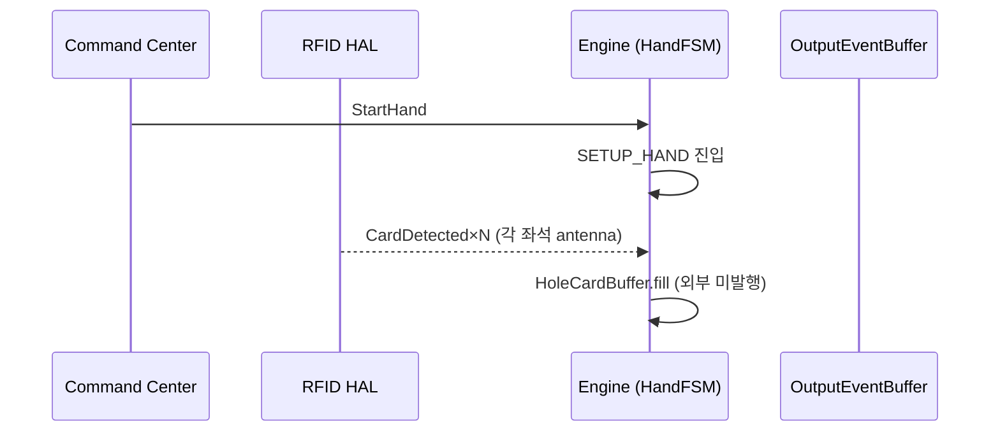
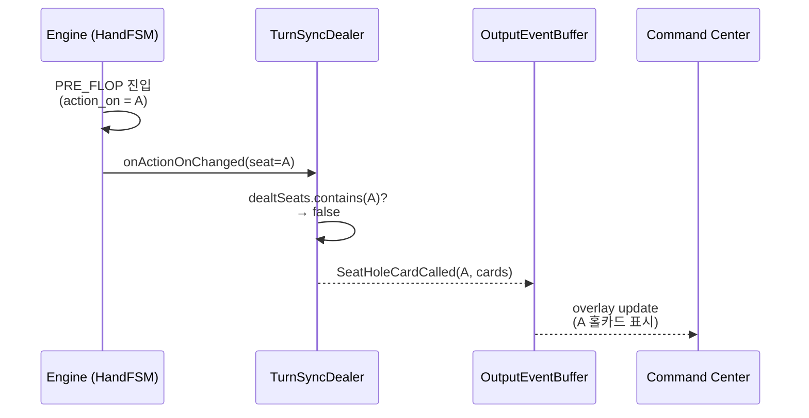
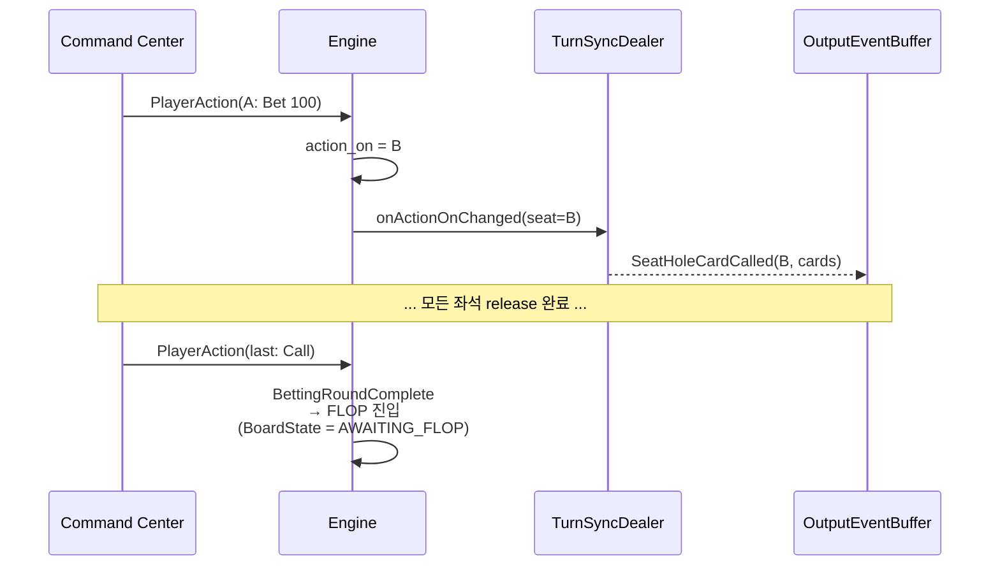
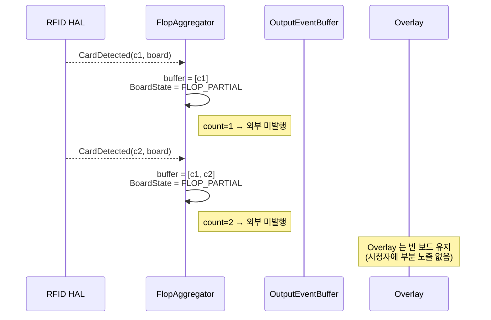
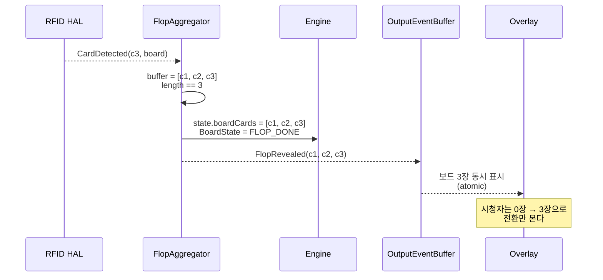
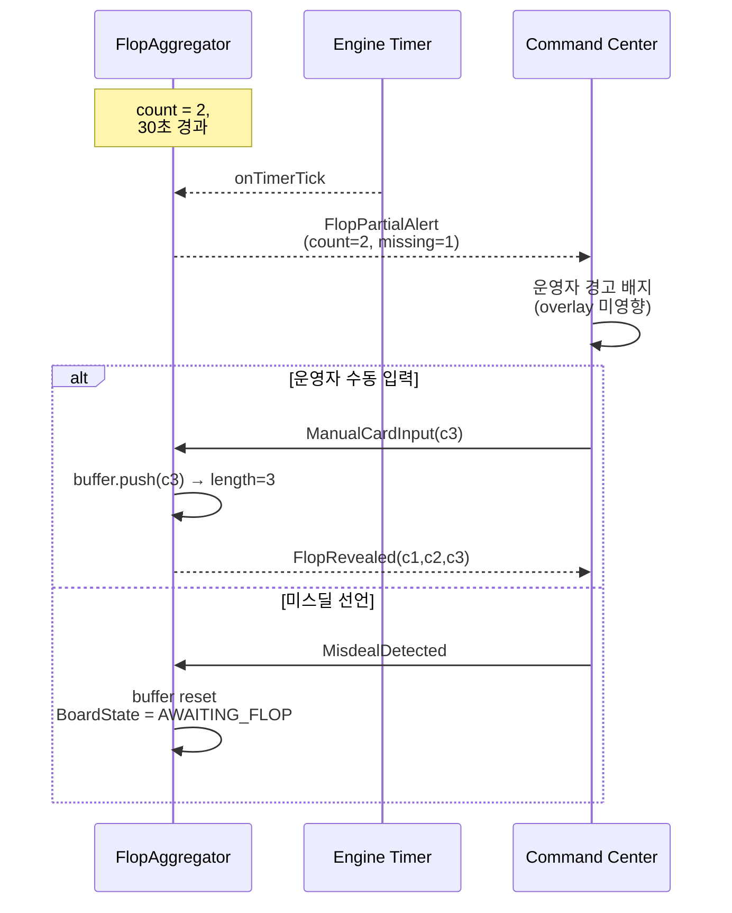

# BS-06-12: Card Pipeline Overview — Turn-Based Deal + 3-Card Flop Detection

> **존재 이유**: 두 개의 흩어진 규칙(① 홀카드 일괄 vs 턴 기반 호출, ② 플랍 부분 감지 시 동작)을 하나의 SSOT 로 통합한다. 본 문서는 카드 분배(Dealing) 와 카드 감지(Detection) 를 단일 상태머신·이벤트 파이프라인으로 정의하며, `Lifecycle.md`·`Triggers.md`·`Coalescence.md` 의 관련 절은 본 문서를 source of truth 로 한다.

| 날짜 | 항목 | 내용 |
|------|------|------|
| 2026-04-27 | 신규 작성 | 턴 기반 홀카드 호출 + 3장 충족 플랍 감지 통합 명세. `HoleCardsDealt(bulk)` deprecate, `BoardState.FLOP_*` 도입, 매트릭스 3(부분 감지) PENDING 으로 재정의 |

---

## 0. 개요

EBS Game Engine 의 "카드 파이프라인" 은 **외부 입력(RFID/CC) → Engine 상태 변경 → OutputEvent 발행** 의 3-stage 파이프라인이다. 본 문서는 이 파이프라인을 두 가지 변경된 규칙 위에서 재정의한다:

| # | 변경 전 | 변경 후 (본 SSOT) |
|---|---------|-------------------|
| 1 | 모든 플레이어 홀카드가 한꺼번에(bulk) 호출됨 (`HoleCardsDealt`) | 각 플레이어의 **ACTION_TURN** 도래 시 그 플레이어 홀카드만 개별 호출 (`SeatHoleCardCalled`) |
| 2 | 플랍 카드 1~2장 감지 시 `error log` 만 남김 (모호) | `BoardState.FLOP_PARTIAL` 로 결정적 PENDING. **정확히 3장 충족 시점에만** `FlopRevealed` 1회 발행 |

**원칙**:
- 카드 호출은 **트리거 기반(turn 또는 condition)** 이며, 시간(timer) 으로 발행하지 않는다.
- 부분 감지(partial detection) 는 에러가 아니다. 이것은 **PENDING 상태의 정상 흐름** 이다.
- 3장 충족(또는 타임아웃) 까지 외부에 어떤 보드 카드 OutputEvent 도 발행하지 않는다 (atomic flop guarantee).

---

## 1. System Architecture & State Overview

### 1.1 핵심 컴포넌트

```
                    +---------------------+
   RFID HAL ───────►|  CardIngressBuffer  |
   (CardDetected)   |  (per-antenna queue) |
                    +----------+----------+
                               │
                               ▼
                    +----------+----------+
   CC ManualInput ──►| CardCoalescer       |───┐
   (ManualCardInput) | (deduplicate +      |   │
                     |  500ms debounce)    |   │
                     +----------+----------+   │
                                │              │
                  (Hole vs Board│ classify     │
                   by antennaId)│              │
                ┌───────────────┴───────┐      │
                ▼                       ▼      │
    +---------------------+   +-----------------+
    | TurnSyncDealer      |   | FlopAggregator   |
    | (player-turn gated) |   | (3-card gated)   |
    +----------+----------+   +--------+--------+
               │                       │
               ▼                       ▼
            +--+-----------------------+--+
            |   Engine.HandFSM (reducer)  |
            |   GameState mutation        |
            +-------------+---------------+
                          │
                          ▼ (OutputEvent)
                +---------+---------+
                |  OutputEventBuffer |
                +---------+---------+
                          │
                          ▼
                  Overlay / CC / BO
```

| 컴포넌트 | 책임 | 위치 |
|---------|------|------|
| **CardIngressBuffer** | RFID antenna 별 raw card event 큐. 중복 burst 흡수 | `lib/core/cards/ingress_buffer.dart` |
| **CardCoalescer** | 500ms 윈도우 dedupe + 동일 카드 다중 인식 1회로 합성 (Coalescence.md §2 와 정렬) | `lib/core/cards/coalescer.dart` |
| **TurnSyncDealer** | `action_on` 과 동기화하여 해당 좌석의 홀카드만 release | `lib/core/cards/turn_sync_dealer.dart` |
| **FlopAggregator** | 3장 buffer. 정확히 3장 시 1회 atomic flush. 1~2장 시 PENDING 보존 | `lib/core/cards/flop_aggregator.dart` |
| **HandFSM (reducer)** | 위 컴포넌트로부터 정제된 트리거만 수신 | `lib/core/state/hand_fsm.dart` |
| **OutputEventBuffer** | OutputEvent 21종 발행 (`Overlay_Output_Events.md` §6.0) | `lib/core/output/output_event_buffer.dart` |

> **SSOT 경계**: `CardIngressBuffer` ~ `FlopAggregator` 까지가 본 문서 소유. `HandFSM` 이후는 `Lifecycle.md` 소유.

### 1.2 상태 정의

#### 1.2.1 `PlayerState` (좌석별, 기존 `seat.status` 보강)

| 값 | 의미 | 카드 호출 가능? |
|----|------|:---------------:|
| `WAITING` | 핸드 시작 전 또는 다른 플레이어 차례 | ❌ |
| `ACTION_TURN` | `action_on == this.seat`. 카드 호출 활성화 | ✅ (이번 턴 1회) |
| `ACTED` | 이번 라운드 액션 완료 (Check/Bet/Call/Raise 등) | ❌ (재호출 금지) |
| `FOLDED` | 폴드 완료. 카드 muck 상태 | ❌ |
| `ALL_IN` | 올인 후 후속 라운드 자동 통과 | ❌ |
| `SITTING_OUT` | 핸드 비참여 | ❌ |

> **유도 관계**: `PlayerState` 는 별도 필드가 아니라 `seat.status` + `action_on` + `seat.bet` + `seat.folded` 로부터 derive 한다 (`BS_Overview.md` §3 GameState).

#### 1.2.2 `BoardState` (테이블당 1개, **본 문서에서 신규 도입**)

```
       NEW_HAND
          │ (StartHand)
          ▼
      AWAITING_FLOP
          │ (CardRecognitionCount = 0)
          │
          │ ◄────── card_recognized (count = 1)
          ▼
      FLOP_PARTIAL
          │ (CardRecognitionCount ∈ {1, 2})
          │
          │ ◄────── card_recognized (count = 3)
          ▼
      FLOP_READY ──► (1회 flush) ──► FLOP_DONE
          │
          │
          ▼
      AWAITING_TURN ──► TURN_DONE ──► AWAITING_RIVER ──► RIVER_DONE
```

| `BoardState` | `CardRecognitionCount` | 외부 발행? | 다음 트리거 |
|--------------|:----------------------:|:----------:|------------|
| `AWAITING_FLOP` | 0 | — | RFID `CardDetected` (board antenna) |
| `FLOP_PARTIAL` | 1, 2 | **❌ (held)** | 추가 `CardDetected` 또는 timeout |
| `FLOP_READY` | 3 | ✅ `FlopRevealed` (1회) | reducer flush 후 `FLOP_DONE` |
| `FLOP_DONE` | 3 | — | betting 완료 시 `AWAITING_TURN` |
| `AWAITING_TURN` | 3 | — | RFID `CardDetected` (4번째) |
| `TURN_DONE` | 4 | ✅ `TurnRevealed` | — |
| `AWAITING_RIVER` | 4 | — | RFID `CardDetected` (5번째) |
| `RIVER_DONE` | 5 | ✅ `RiverRevealed` | showdown 진입 |

#### 1.2.3 핵심 카운터/필드

| 필드 | 타입 | 위치 | 설명 |
|------|------|------|------|
| `CardRecognitionCount` | int (0~5) | `GameState.board_card_count` | 현재 핸드에서 RFID/Manual 로 인식된 보드 카드 누적 수. HAND_COMPLETE 시 0 reset |
| `flop_buffer` | `List<Card>` (max 3) | `FlopAggregator.buffer` | 부분 감지 누적. 3 충족 시 atomic flush |
| `flop_pending_since` | `DateTime?` | `FlopAggregator.pending_since` | 첫 부분 감지 시각 (timeout 계산용) |
| `flop_timeout_sec` | int (default 30) | config | partial → manual fallback escalation 임계 (§3.4) |
| `turn_dealt_seats` | `Set<int>` | `TurnSyncDealer.dealt_seats` | 이번 핸드에서 홀카드 호출이 이미 release 된 좌석 (재호출 방지) |

---

## 2. Player Card Call Logic (Turn-Based Trigger)

### 2.1 변경 요지

**기존 (Deprecated)** — `Triggers.md §2.3` 의 `HoleCardsDealt` 는 "모든 플레이어 홀카드 배분 완료" 시 1회 발행:

```
SETUP_HAND 진입
  ├─ 모든 좌석 RFID antenna 가 카드 인식
  ├─ Engine 이 일괄 수집
  └─ HoleCardsDealt 발행 → PRE_FLOP
```

**변경 (이 SSOT)** — 각 플레이어 차례에 그 플레이어 카드만 호출:

```
SETUP_HAND 진입
  ├─ 모든 좌석 카드 인식 (CardIngressBuffer 에 보관)
  ├─ HoleCardsBuffered 발행 (내부, 외부 미공개)
  └─ PRE_FLOP 진입 (action_on = first_to_act)

PRE_FLOP / FLOP / TURN / RIVER 진입 직후
  └─ for each player (action 순서):
       on PlayerState 전이 WAITING → ACTION_TURN
         └─ TurnSyncDealer.release(seat = action_on)
              ├─ buffer 에서 해당 좌석 카드 2장 추출
              ├─ Engine state 업데이트 (player.hole_cards = ...)
              └─ OutputEvent: SeatHoleCardCalled(seat, cards)
```

### 2.2 트리거 정의

| 트리거 | 발동 주체 | 조건 | 발행 OutputEvent |
|--------|-----------|------|------------------|
| `seat_action_turn_entered` | Engine (자동) | `action_on` 값 변경 시 새 좌석에 대해 1회 | `SeatActionTurnStarted(seat)` |
| `hole_card_release` | Engine (자동) | `seat_action_turn_entered` ∧ `seat ∉ turn_dealt_seats` ∧ `buffer[seat].length >= variant.hole_card_count` | `SeatHoleCardCalled(seat, cards)` (= 기존 `OE-05 CardRevealed(hole)` payload 재사용) |
| `seat_card_pending` | Engine (자동) | `seat_action_turn_entered` ∧ `buffer[seat].length < variant.hole_card_count` | `SeatHoleCardPending(seat, missing_count)` (CC 경고 배지) |

> **OutputEvent 카탈로그 영향**: 기존 `OE-05 CardRevealed` 의 emit 시점이 변경됨 (전원 동시 → 턴별 1회). payload 스키마 동일. 카탈로그 항목 수 21 → 21 (no change). `Overlay_Output_Events.md §6.0` 의 emit-trigger 컬럼만 보강 필요.

### 2.3 의사코드

```dart
// lib/core/cards/turn_sync_dealer.dart
class TurnSyncDealer {
  final Set<int> dealtSeats = {};

  Iterable<OutputEvent> onActionOnChanged(GameState s) sync* {
    final seat = s.actionOn;
    if (seat == -1) return;                      // SHOWDOWN 등
    if (dealtSeats.contains(seat)) return;       // 이미 release

    final buffered = s.holeCardBuffer[seat];
    final required = s.variant.holeCardCount;

    if (buffered.length < required) {
      yield SeatHoleCardPending(seat: seat, missing: required - buffered.length);
      return;                                    // PlayerState = ACTION_TURN, but cards 미도착
    }

    // Atomic release
    s.players[seat].holeCards = List.from(buffered);
    dealtSeats.add(seat);
    yield SeatHoleCardCalled(seat: seat, cards: buffered);
  }
}
```

### 2.4 예외 처리

| 상황 | 처리 |
|------|------|
| **카드 미도착 후 액션** | `seat_card_pending` 만 발행 후 ACTION_TURN 유지. 운영자가 수동 입력(`ManualCardInput`) 또는 RFID 재인식 시 즉시 release. CC 는 ACTION 버튼을 30초간 disable (`Coalescence.md §4` action-gate 정렬) |
| **Bomb Pot (PRE_FLOP 스킵)** | PRE_FLOP 자체가 없으므로 release 트리거가 없음 → SETUP_HAND 종료 시점에 모든 active 좌석을 한번에 release (legacy bulk 동작 유지). `bomb_pot_enabled == true` 분기로 명시 |
| **All-in Runout** | `action_on` 이 -1 로 진입. 잔여 좌석 모두 즉시 release (showdown 카드 공개와 정합) |
| **카드 재인식 (이미 dealt 좌석)** | `dealtSeats` 가드. 재호출 무시 + `DUPLICATE_RELEASE_IGNORED` 경고 로그 |
| **Mix Game (변형 hole card 수)** | `variant.holeCardCount` 가 권위. NLH=2, Omaha=4, Pineapple=3 등 (Flop_Variants.md 정렬) |
| **Run It Multiple** | 추가 board 카드만 영향. hole card release 는 핸드당 좌석 1회 원칙 유지 |

### 2.5 매트릭스: action_on 진행 vs 카드 release

| 상태 | action_on | dealtSeats | 다음 transition |
|------|:---------:|:----------:|-----------------|
| PRE_FLOP 진입 | -1 → first_to_act | {} | release(first_to_act) |
| 첫 액션 후 | first → next_to_act | {first} | release(next) |
| ... | ... | ... | ... |
| PRE_FLOP betting 완료 | last → -1 | {모든 active 좌석} | FLOP 진입 |
| FLOP 진입 | -1 → flop_first_to_act | {...} | (이미 dealt) skip release |
| HAND_COMPLETE | — | reset | dealtSeats = {} |

> **불변량**: `dealtSeats ⊆ active_seats` ∧ `|dealtSeats| ≤ |active_seats|` ∧ HAND_COMPLETE 시 `dealtSeats = ∅`.

---

## 3. Flop Card Detection Logic (Condition-Based Trigger)

### 3.1 변경 요지

**기존 (Deprecated)** — `Lifecycle.md` 매트릭스 3:

```
PRE_FLOP (0장) | 0장 감지   | 변화 없음   | 정상
PRE_FLOP (0장) | 1~2장 감지 | error log   | 부분 감지 또는 카드 오인식
PRE_FLOP (0장) | 3장 감지   | → FLOP      | 정상 Flop 카드 감지
```

"1~2장 감지 → error log" 는 의미가 모호했다. 이는:
- 에러인가? (운영자 alert?)
- 무시인가? (silently drop?)
- 대기인가? (다음 카드 기다림?)

**변경 (이 SSOT)** — 결정적 PENDING:

```
PRE_FLOP (0장) | 0장 감지   | BoardState = AWAITING_FLOP   | (no-op)
PRE_FLOP (0장) | 1장 감지   | BoardState = FLOP_PARTIAL    | 외부 미발행, 카드 buffer 보관
PRE_FLOP (0장) | 2장 감지   | BoardState = FLOP_PARTIAL    | 외부 미발행, 카드 buffer 보관
PRE_FLOP (0장) | 3장 감지   | BoardState = FLOP_READY      | FlopRevealed 1회 발행 → FLOP_DONE
```

**원칙**: 1, 2장 시 어떤 OutputEvent 도 외부로 나가지 않는다. **Atomic flop**. 시청자가 "2장만 보이는 플랍" 을 보는 일이 없다.

### 3.2 트리거 정의

| 트리거 | 발동 주체 | 조건 | 발행 OutputEvent |
|--------|-----------|------|------------------|
| `card_recognized_board` | RFID HAL / CC ManualInput | `antennaId ∈ board_antennas` ∧ HandFSM ∈ {FLOP_AWAIT, ...} | (내부) `FlopAggregator.push(card)` |
| `flop_buffer_completed` | Engine (자동) | `FlopAggregator.buffer.length == 3` | `FlopRevealed(cards[3])` (= `OE-06 CardRevealed(board)` ×3 atomic 묶음) |
| `flop_partial_held` | Engine (자동) | `FlopAggregator.buffer.length ∈ {1, 2}` | (내부 only) `FlopProgressInternal(count)` — CC 디버깅용, overlay 미노출 |
| `flop_timeout_escalation` | Engine 타이머 | `pending_since + flop_timeout_sec` 도달 ∧ count < 3 | `FlopPartialAlert(count, missing)` → CC 경고 배지 (overlay 미노출) |

### 3.3 의사코드

```dart
// lib/core/cards/flop_aggregator.dart
class FlopAggregator {
  final List<Card> buffer = [];
  DateTime? pendingSince;

  Iterable<OutputEvent> push(Card c) sync* {
    if (buffer.contains(c)) {
      yield ErrorEvent(code: 'DUPLICATE_BOARD_CARD', card: c);
      return;
    }
    buffer.add(c);
    pendingSince ??= DateTime.now();

    // EXPLICIT GUARD: 3장 충족 시에만 외부 발행
    if (buffer.length == 3) {
      yield FlopRevealed(cards: List.from(buffer));
      pendingSince = null;
    } else {
      // 1장 또는 2장: PENDING 유지, 외부 미발행
      assert(buffer.length == 1 || buffer.length == 2);
      // (no yield to OutputEventBuffer)
    }
  }

  Iterable<OutputEvent> onTimerTick(DateTime now, Duration timeout) sync* {
    if (pendingSince == null || buffer.length == 3) return;
    if (now.difference(pendingSince!) >= timeout) {
      yield FlopPartialAlert(count: buffer.length, missing: 3 - buffer.length);
      // 상태는 유지 — 운영자 수동 입력 또는 추가 RFID 인식 대기
    }
  }
}
```

**Self-check (Gatekeeper §1)**: 위 코드의 `if (buffer.length == 3)` 가드가 있어 1, 2장 시 `FlopRevealed` 가 외부에 절대 나가지 않음. 검증 통과.

### 3.4 예외 처리

| 상황 | 처리 |
|------|------|
| **2장 인식 후 timeout (default 30초)** | `FlopPartialAlert` 발행 → CC 운영자에게 "1장 미인식" 표시. 운영자가 ① 수동 카드 입력 (`ManualCardInput`) → buffer.push() 로 3장 충족 → `FlopRevealed` 발행, ② RFID 재배치 시도, ③ 미스딜 선언 (`MisdealDetected` → IDLE 복귀) 중 선택 |
| **3장 인식 후 4번째 카드 인식** | `BoardState != AWAITING_TURN` 이면 reject. `AWAITING_TURN` 진입(=PRE_FLOP/FLOP betting 완료) 후에만 4번째 수용 |
| **중복 카드 인식 (같은 suit/rank)** | `DUPLICATE_BOARD_CARD` 에러 발행. buffer 에 추가하지 않음. 단, 동일 `cardUid` 의 burst 는 `CardCoalescer` 에서 이미 dedupe 됨 |
| **덱에 없는 카드** | `MisdealDetected` 발행 → IDLE 복귀 (`Lifecycle.md` §Miss Deal 정렬) |
| **PRE_FLOP betting 미완료 상태에서 보드 카드 감지** | reject + `OUT_OF_ORDER_BOARD_CARD` 경고 (보드 안테나에 카드 잘못 놓임) |
| **Bomb Pot 모드** | PRE_FLOP 스킵으로 `AWAITING_FLOP` 즉시 진입. 본 로직 그대로 적용 |
| **Stud / Draw variant** | 본 SSOT 미적용. Stud/Draw 는 `Stud_Games.md`, `Draw_Games.md` 의 자체 카드 호출 규칙 사용 (community board 없음) |

### 3.5 매트릭스: BoardState 전이

| 현재 BoardState | event | 다음 BoardState | OutputEvent |
|-----------------|-------|-----------------|-------------|
| `AWAITING_FLOP` | card_recognized (1번째) | `FLOP_PARTIAL` | (none) |
| `FLOP_PARTIAL` (count=1) | card_recognized (2번째) | `FLOP_PARTIAL` | (none) |
| `FLOP_PARTIAL` (count=2) | card_recognized (3번째) | `FLOP_READY` → `FLOP_DONE` | `FlopRevealed(c1,c2,c3)` |
| `FLOP_PARTIAL` (count<3) | timer_tick (timeout) | `FLOP_PARTIAL` (유지) | `FlopPartialAlert(count, missing)` |
| `FLOP_PARTIAL` (count<3) | manual_input | `FLOP_PARTIAL` 또는 `FLOP_DONE` | (count==3 시 `FlopRevealed`) |
| `FLOP_DONE` | betting_complete | `AWAITING_TURN` | (none) |
| `AWAITING_TURN` | card_recognized (4번째) | `TURN_DONE` | `TurnRevealed(c4)` (atomic 1장) |
| `AWAITING_RIVER` | card_recognized (5번째) | `RIVER_DONE` | `RiverRevealed(c5)` (atomic 1장) |
| any | misdeal_detected | `AWAITING_FLOP` (reset) | `MisdealDetected` |

> **Turn / River 는 1장 단위** 라 partial 상태 없음. Flop 만 atomic 3장 규칙 적용.

---

## 4. Sequence Diagram

### 4.1 Stage 1 — 핸드 시작 + 홀카드 buffer (4 nodes)



> Stage 1: 모든 좌석의 카드를 buffer 에만 저장. 외부 OutputEvent 없음.

### 4.2 Stage 2 — PRE_FLOP 진입 + 턴별 release (Player A 차례)



> Stage 2: A 의 차례에 A 의 카드만 release. 다른 좌석 카드는 buffer 에 유지.

### 4.3 Stage 3 — 턴 회전 + 베팅 완료 (B → C → ... 동일 패턴)



### 4.4 Stage 4 — Flop 카드 감지 (1장, 2장 = 대기)



### 4.5 Stage 5 — 3장 충족 시 atomic 발행 (최종)



### 4.6 Stage 6 — Timeout escalation (예외 흐름)



---

## 5. Cross-Reference 영향

본 SSOT 가 도입되면 아래 문서의 관련 절은 **본 문서를 source 로 참조** 한다 (additive 보강, 충돌 시 본 문서 우선):

| 문서 | 영향 절 | 변경 내용 |
|------|---------|-----------|
| `Behavioral_Specs/Holdem/Lifecycle.md` | §매트릭스 3 (보드 카드 수 기반 상태 전이) | "1~2장 감지 → error log" 행을 "1~2장 감지 → BoardState=FLOP_PARTIAL, 외부 미발행" 으로 갱신. 본 문서 §3 참조 footnote 추가 |
| `Behavioral_Specs/Triggers.md` | §2.3 Engine 이벤트 `HoleCardsDealt` | "전원 일괄" 의미를 deprecate. 신규 `SeatHoleCardCalled` (per-seat) 가 1차 트리거. `HoleCardsDealt` 는 SETUP_HAND 종료 표지로만 내부 사용 (외부 미발행) |
| `Behavioral_Specs/Holdem/Coalescence.md` | RFID burst 처리 | `CardCoalescer` ↔ `FlopAggregator` 직렬 관계 명시. burst 가 partial 상태로 흡수되도록 |
| `APIs/Overlay_Output_Events.md` | §6.0 카탈로그 | `OE-05 CardRevealed(hole)` 의 emit-trigger 컬럼: "전원 동시" → "각 좌석 ACTION_TURN 진입 시 1회". `OE-06 CardRevealed(board)` 의 emit-trigger: "보드 카드 감지" → "Flop 의 경우 3장 충족 시 atomic 1회, Turn/River 는 1장 단위". 카탈로그 항목 수 변동 없음 (21 유지) |

> 본 SSOT 의 effective date 부터 위 문서들의 해당 절은 본 문서를 권위로 한다. 동시에 cross-link 를 추가한다 (별도 PR 또는 후속 commit).

---

## 6. 비활성 조건

다음 조건에서 본 카드 파이프라인은 비활성화된다:

- HandFSM `IDLE` 상태 (StartHand 이전): RFID `CardDetected` 는 큐잉되지 않고 즉시 drop + `IGNORED_PRE_HAND` 로그
- HandFSM `HAND_COMPLETE` 이후 (다음 IDLE 까지): 동일
- Stud / Draw variant: 본 SSOT 미적용. 각 variant 자체 규칙 (`Stud_Games.md`, `Draw_Games.md`)
- Mock 모드 (RFID 없음): RFID 입력 경로가 `MockRfidReader.injectCard` 로 대체될 뿐, 위 모든 로직 동일하게 적용 (Triggers.md §4.1)

---

## 7. 영향 받는 요소

| 요소 | 영향 |
|------|------|
| Engine reducer | `TurnSyncDealer`, `FlopAggregator` 두 컴포넌트 신규 도입 |
| OutputEvent 카탈로그 | `OE-05`, `OE-06` 의 emit-trigger 의미 갱신 (스키마 동일) |
| CC UI | `SeatActionTurnStarted`, `SeatHoleCardPending`, `FlopPartialAlert` 신규 핸들러 (overlay 미노출, 운영자 배지) |
| RFID HAL | 변경 없음 (`CardDetected` 그대로) |
| Coalescence 레이어 | partial flop 상태에서 burst 가 dedupe 후 buffer 에 누적되도록 흐름 정렬 |
| Overlay | partial flop 시 보드 영역 빈 상태 유지. 변경 없음 (이미 그렇게 동작하는 것이 정상이지만 SSOT 부재로 우연히 동작) |
| Test | `phase4_flop_atomic_test.dart`, `phase5_turn_sync_dealer_test.dart` 신규 추가 필요 (Backlog 항목) |

---

## 8. Self-Correction 검증 (Gatekeeper)

본 문서 작성 완료 전 두 가지 사항을 자체 검증한다 (사용자 요구):

| # | 검증 항목 | 결과 |
|---|----------|------|
| 1 | 플레이어 카드 호출이 '한꺼번에' 일어나는 로직이 문서 내에 남아있지 않은가? | ✅ §2.1 에서 기존 bulk 모델을 deprecated 로 명시. §2.2 `hole_card_release` 트리거가 `seat == action_on` 으로 좌석별 1회 release. `dealtSeats` 가드로 좌석당 1회 보장. **단 1개 예외: Bomb Pot (PRE_FLOP 스킵) 시 SETUP_HAND 종료 시점 일괄 release** — 이는 bomb pot 의 정의(action 라운드 없음) 때문에 불가피하며 §2.4 에 명시함 |
| 2 | 플랍 카드 호출 조건에 '3장 인식' 이 명시적으로 시스템 로직으로 설명되었는가? | ✅ §3.2 트리거 표 `flop_buffer_completed` 의 조건 `FlopAggregator.buffer.length == 3`. §3.3 의사코드 `if (buffer.length == 3) yield FlopRevealed` explicit guard. §3.5 매트릭스 `FLOP_PARTIAL (count<3)` 행은 OutputEvent 컬럼이 `(none)`. atomic 보장 명시 |

검증 통과. 본 SSOT 는 두 변경 요구를 결정적·검증 가능 형태로 명세한다.

---

## 9. Open Items (Backlog)

| ID | 항목 | 소유 |
|----|------|------|
| B-343 | `Lifecycle.md` 매트릭스 3 본 SSOT 정렬 갱신 (additive cross-ref) | team3 |
| B-344 | `Triggers.md` §2.3 `HoleCardsDealt` deprecate 메모 + `SeatHoleCardCalled` 추가 | team3 |
| B-345 | `Overlay_Output_Events.md` §6.0 emit-trigger 컬럼 갱신 (OE-05, OE-06) | team3 |
| B-346 | `phase4_flop_atomic_test.dart` 신규 (3장 atomic 보장, 1·2장 PENDING, timeout escalation) | team3 |
| B-347 | `phase5_turn_sync_dealer_test.dart` 신규 (좌석별 release, dealtSeats 가드, Bomb Pot 분기) | team3 |
| B-348 | CC subscriber 보강: `FlopPartialAlert` 운영자 배지 핸들러 (team4 cross-team) | team4 |

---

## 부록 A: 용어

| 용어 | 정의 |
|------|------|
| **Atomic flop** | Flop 3장이 시청자/구독자에게 0장→3장 전환으로만 노출되는 보장. 1장/2장 중간 상태 노출 금지 |
| **PENDING** | BoardState 가 FLOP_PARTIAL 인 상태. 정상 흐름의 일부이며 에러 아님 |
| **Turn-based release** | 홀카드를 buffer 에 보관 후 각 좌석의 ACTION_TURN 진입 시점에 그 좌석 카드만 외부 발행하는 패턴 |
| **dealtSeats** | 이번 핸드에서 hole card 가 이미 release 된 좌석 집합. 재호출 가드 |
| **CardRecognitionCount** | 현재 핸드의 보드 카드 누적 인식 수. `GameState.board_card_count` 의 alias |

## 부록 B: 변경 추적

본 SSOT 의 효력 발생: 2026-04-27 (생성일).

이전 동작 의존 코드/문서:
- `lib/core/engine.dart` 의 `_dispatchHoleCardsDealt()` (전원 일괄 발행) → B-344, B-347 에서 deprecate
- `Lifecycle.md §매트릭스 3` 의 "error log" → B-343 에서 갱신
- `Triggers.md §2.3` 의 `HoleCardsDealt` 설명 → B-344 에서 갱신

DONE 처리 시 본 §9 항목들이 모두 closed 상태가 되어야 효력 일원화가 완료된다.
