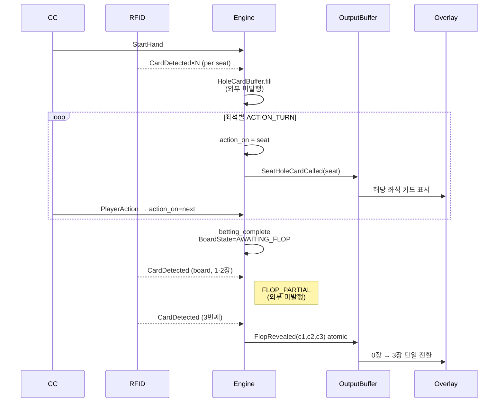

# BS-06-12: Card Pipeline (Turn-Based Deal + Atomic Flop)

| 날짜 | 항목 | 내용 |
|------|------|------|
| 2026-04-27 | SSOT | Turn-based hole release · 3-card atomic flop |

**Absolute Truth**:
- Hole card: bulk 호출 금지. 각 좌석 `ACTION_TURN` 진입 시점에 그 좌석만 1회 release.
- Flop: `buffer.length == 3` 시점에만 1회 발행. count ∈ {1, 2} → PENDING (외부 미발행).

---

## 1. Card Pipeline Architecture

---

## 2. Core Trigger Matrix

| # | Source | Condition | State Mutation | OutputEvent |
|---|--------|-----------|----------------|-------------|
| T1 | RFID | `CardDetected` (seat antenna) ∧ HandFSM=SETUP_HAND | `HoleCardBuffer[seat].push(card)` | (none) |
| T2 | Engine | `action_on` 변경 ∧ `seat ∉ dealtSeats` ∧ `buffer[seat].length ≥ variant.holeCardCount` | `dealtSeats.add(seat)` · `players[seat].holeCards = buffer` | **`SeatHoleCardCalled(seat, cards)`** |
| T3 | Engine | `action_on` 변경 ∧ `buffer[seat].length < variant.holeCardCount` | (none) | `SeatHoleCardPending(seat, missing)` |
| T4 | RFID | `CardDetected` (board) ∧ BoardState=AWAITING_FLOP | `flopBuffer.push` · BoardState=FLOP_PARTIAL | (none) |
| T5 | Engine | `flopBuffer.length ∈ {1, 2}` | (none) | **(none — PENDING)** |
| T6 | Engine | `flopBuffer.length == 3` | `boardCards = flopBuffer` · BoardState=FLOP_DONE | **`FlopRevealed(c1,c2,c3)` (atomic)** |
| T7 | RFID | `CardDetected` (board) ∧ BoardState=AWAITING_TURN | `boardCards.push` · BoardState=TURN_DONE | `TurnRevealed(c4)` |
| T8 | RFID | `CardDetected` (board) ∧ BoardState=AWAITING_RIVER | `boardCards.push` · BoardState=RIVER_DONE | `RiverRevealed(c5)` |
| T9 | Engine timer | BoardState=FLOP_PARTIAL ∧ `now - pendingSince ≥ 30s` | (none) | `FlopPartialAlert(count, missing)` (CC only) |
| T10 | Engine | 덱 외 카드 ∨ 중복 카드 | reset flopBuffer · BoardState=AWAITING_FLOP | `MisdealDetected` |
| T11 | Engine | HAND_COMPLETE 진입 | `dealtSeats.clear()` · `flopBuffer.clear()` | (none) |

> T5 행이 atomic guarantee 의 핵심. count ∈ {1, 2} 에서 OutputEvent 컬럼은 항상 `(none)`.

---

## 3. State Flow & Exceptions

### Turn Sync (T2/T3)
- `dealtSeats: Set<int>` — 핸드당 좌석 1회 release 가드.
- 트리거 = `action_on` 변경. 시간 기반 발행 금지.
- HAND_COMPLETE → `dealtSeats.clear()`.
- **Bomb Pot**: PRE_FLOP 스킵 → SETUP_HAND 종료 시 active 좌석 일괄 release (단일 예외).
- **All-in Runout**: `action_on == -1` 진입 시 잔여 좌석 일괄 release.
- **Mix Game**: `variant.holeCardCount` 권위 (NLH=2 / Omaha=4 / Pineapple=3).
- **카드 미도착**: T3 발행 + ACTION 버튼 30s disable. RFID 재인식 또는 `ManualCardInput` 시 즉시 T2.

### Atomic Flop (T4~T6)
- BoardState 전이: `AWAITING_FLOP → FLOP_PARTIAL → FLOP_DONE → AWAITING_TURN → TURN_DONE → AWAITING_RIVER → RIVER_DONE`.
- **3장 가드 (Absolute Truth)**: `if (flopBuffer.length == 3) yield FlopRevealed`. 그 외 외부 미발행.
- Turn / River = 1장 atomic (partial 없음).
- 중복 카드 → `DUPLICATE_BOARD_CARD` 에러, buffer 영향 없음.

### Timeout (T9, default 30s)
- `FLOP_PARTIAL` 30s 경과 → `FlopPartialAlert` (CC 배지, overlay 미영향).
- 운영자 분기:
  1. `ManualCardInput` → T6 (3장 충족 시 발행).
  2. RFID 재배치.
  3. `MisdealDetected` (T10) → IDLE 복귀.
- Overlay 는 partial 동안 빈 보드 유지.

### 비활성
- HandFSM ∈ {IDLE, HAND_COMPLETE} → RFID 입력 drop + `IGNORED_PRE_HAND` 로그.
- Stud / Draw variant → 본 SSOT 미적용 (각 variant 자체 규칙).
- Mock 모드 → `MockRfidReader.injectCard` 가 `CardDetected` 합성, 이후 동일.

---

**Cross-ref**: Lifecycle.md §매트릭스3 · Triggers.md §2.3 · Overlay_Output_Events.md §6.0 (OE-05/OE-06) · Coalescence.md (B-343 후속 정렬).
