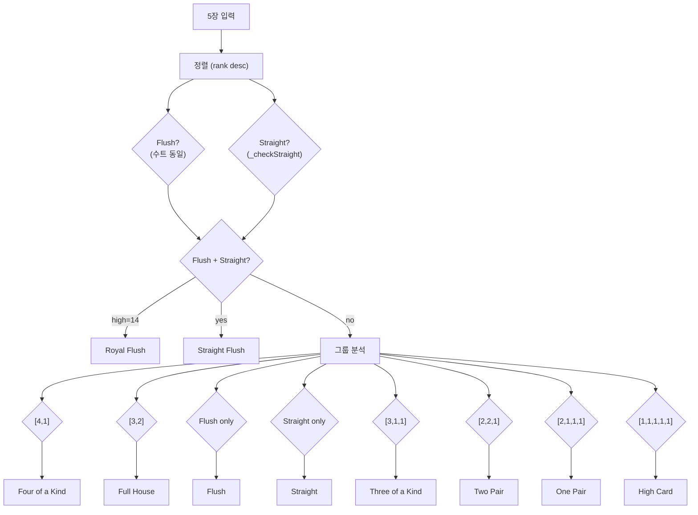
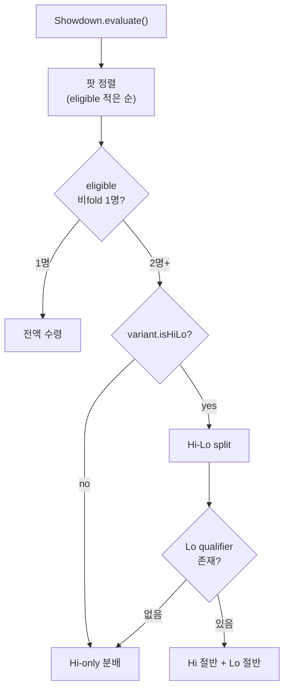

# Hand Evaluation 통합 레퍼런스

| 날짜 | 항목 | 내용 |
|------|------|------|
| 2026-04-17 | v1.1 | 요약 선행 구조로 재설계. 7룰 × 9조합 체계 |
| 2026-04-17 | v1.0 | 초판 — 25종 게임 평가 체계 집대성 |

> 코드 정본: `hand_evaluator.dart`, `badugi_evaluator.dart`, `showdown.dart`

---

## Executive Summary

### 숫자로 보는 전체 구조

```
  25종 게임  →  7개 승리 룰  →  9가지 조합
```

### 7개 승리 룰

| 룰 | "누가 이기나" | 최강 핸드 |
|:--:|-------------|----------|
| **R1** Standard Hi | 표준 10 카테고리 최강 | Royal Flush |
| **R2** Short Deck 6+ | Flush > Full House 로 순서 변경 | Royal Flush |
| **R3** Short Deck Triton | + Trips > Straight 추가 변경 | Royal Flush |
| **R4** 8-or-Better Lo | A=1, 페어 실격, 8 이하만 | A-2-3-4-5 |
| **R5** 2-7 Lowball | A=high, S/F 불리, 최약 핸드 승리 | 7-5-4-3-2 offsuit |
| **R6** A-5 Lowball | A=1, S/F 무시, 최저 핸드 승리 | A-2-3-4-5 |
| **R7** Badugi | 4장 고유 수트+랭크, 장 수 우선 | A♣2♦3♥4♠ |

### 9가지 조합 → 25종 게임 배치

| 조합 | 사용 룰 | 팟 분배 | 포함 게임 |
|:----:|--------|:------:|----------|
| **C1** | R1 | Hi 전액 | NLH, FLH, PLH, Pineapple, Omaha, 5CO, 6CO, Courchevel, 7-Card Stud, 5-Card Draw **(10종)** |
| **C2** | R2 | Hi 전액 | Short Deck 6+ **(1종)** |
| **C3** | R3 | Hi 전액 | Short Deck Triton **(1종)** |
| **C4** | R1 + R4 | Hi/Lo 50:50 | Omaha HL, 5CO HL, 6CO HL, Courchevel HL, 7CS HL **(5종)** |
| **C5** | R5 | Lo 전액 | 2-7 Single Draw, 2-7 Triple Draw **(2종)** |
| **C6** | R6 | Lo 전액 | A-5 Triple Draw, Razz **(2종)** |
| **C7** | R7 | Hi 전액 | Badugi **(1종)** |
| **C8** | R7 + R5 | Hi/Lo 50:50 | Badeucy **(1종)** |
| **C9** | R7 + R6 | Hi/Lo 50:50 | Badacey **(1종)** |

> C4의 Lo에서 qualifier 실패(8 이하 핸드 없음) → Hi가 전액 수령

### 카드 선택은 별도 축

승리 룰과 독립적으로, **어떤 카드 조합이 허용되는지**가 다름:

| 선택 | 규칙 | 적용 |
|------|------|------|
| **Free** | N장 중 아무 5장 | Hold'em, Stud, Draw (16종) |
| **Omaha** | 홀카드 2장 + 보드 3장 고정 | Omaha, Courchevel 계열 (8종) |
| **Badugi** | 4장 중 유효 부분집합 | Badugi 계열 (3종, R7 전용) |

---

이하 §1~§7은 각 룰의 **상세 알고리즘**.

---

## §1. R1~R3: Hi 평가 상세

---

### 1.1 핵심 함수: `_evaluate5()`

모든 Hi 평가의 종착점. 정확히 5장을 받아 HandRank를 반환한다.



### 1.2 Kicker 결정 규칙

| 카테고리 | kickers | 예시 |
|---------|---------|------|
| Royal Flush | [14] | A♠K♠Q♠J♠T♠ → [14] |
| Straight Flush | [straightHigh] | 9♥8♥7♥6♥5♥ → [9] |
| Four of a Kind | [quad, kicker] | QQQQ3 → [12, 3] |
| Full House | [trips, pair] | JJJ88 → [11, 8] |
| Flush | [5장 desc] | A♠J♠9♠7♠2♠ → [14,11,9,7,2] |
| Straight | [straightHigh] | 8-7-6-5-4 → [8] |
| Three of a Kind | [trips, k1, k2] | 777AK → [7,14,13] |
| Two Pair | [hiPair, loPair, k] | AAKK5 → [14,13,5] |
| One Pair | [pair, k1, k2, k3] | 99AKQ → [9,14,13,12] |
| High Card | [5장 desc] | AKJ95 → [14,13,11,9,5] |

### 1.3 Straight 감지 — R1 vs R2/R3 차이점

```
입력: values = [v1, v2, v3, v4, v5] (내림차순)

1. 연속 내림차순?  → return v1 (high card)
2. v1 == 14 (Ace)?
   rest = [v2,v3,v4,v5] 오름차순 정렬
   2a. rest == [2,3,4,5]?                → return 5  (standard wheel)
   2b. shortDeck && rest == [6,7,8,9]?   → return 9  (short deck wheel)
3. 해당 없음 → null (not straight)
```

| 입력 | shortDeck | 결과 |
|------|:---------:|------|
| [14,5,4,3,2] | false | straight, high=5 (wheel) |
| [14,9,8,7,6] | false | **null** (not straight) |
| [14,9,8,7,6] | **true** | straight, high=9 (short deck wheel) |
| [14,13,12,11,10] | any | straight, high=14 (Broadway) |

### 1.4 `HandRank.compareTo()` — 단일 비교 함수

```
1. strength 비교 → 높으면 승
2. 동점 → kickers[0] 비교 → kickers[1] → ... → 전부 동일 = 타이
```

이 함수 하나로 Hi, Lo, Lowball, Badugi 전부 처리한다. Lo/Lowball은 kicker를 반전하여 같은 비교 로직을 재사용.

---

### 1.5 R1~R3 카테고리 순서 비교

| 등급 | R1 standard | R2 6+ | R3 Triton |
|:----:|:-----------:|:-----:|:---------:|
| 1 | Royal Flush | Royal Flush | Royal Flush |
| 2 | Straight Flush | Straight Flush | Straight Flush |
| 3 | Four of a Kind | Four of a Kind | Four of a Kind |
| 4 | Full House | **Flush** | **Flush** |
| 5 | Flush | **Full House** | **Full House** |
| 6 | Straight | Straight | **Three of a Kind** |
| 7 | Three of a Kind | Three of a Kind | **Straight** |
| 8 | Two Pair | Two Pair | Two Pair |
| 9 | One Pair | One Pair | One Pair |
| 10 | High Card | High Card | High Card |

R2/R3에서 추가로 `shortDeck=true` → A-6-7-8-9 wheel 활성화 (36장 덱)

### 1.6 카드 선택: Free vs Omaha

#### Free 선택

C(N, 5) 전체 조합 중 최강 선택. Hold'em(7장→21조합), Stud(7장→21), Draw(5장→1)

#### Omaha 선택

C(H, 2) × C(C, 3) 제약 조합만 허용. 반드시 홀카드 2장 + 커뮤니티 3장.

| 게임 | 홀 | C(H,2) × C(5,3) | 총 조합 |
|------|:--:|:---------------:|:-------:|
| Omaha 4 | 4 | 6 × 10 | 60 |
| Omaha 5 / Courchevel | 5 | 10 × 10 | 100 |
| Omaha 6 | 6 | 15 × 10 | 150 |

> 홀카드 전부 같은 수트여도 커뮤니티에 같은 수트 3장 없으면 Flush 불가

---

## §2. R4~R6: Lo 평가 — 3방식 비교

### 공통 원리

Lo 평가는 기존 `compareTo()` 로직을 **kicker 반전**으로 재사용한다:

```
원래: 높은 kicker = 좋은 핸드
반전: 낮은 원래값 → 높은 kicker → "좋은" Lo 핸드
```

### 2.1 R4: 8-or-Better (`evaluateLo`)

**적용**: Omaha Hi-Lo, 5/6-Card Omaha Hi-Lo, Courchevel Hi-Lo, 7-Card Stud Hi-Lo (6종)

```
입력: 5장
──────────────────────────
1. A → 1 변환
2. 오름차순 정렬
3. 페어 존재?      → null (실격)
4. 최대값 > 8?     → null (실격)
5. kicker = 9 - value (반전)
6. strength = 1
```

| 핸드 | 원래값 | kicker (반전) | 등급 |
|------|:------:|:------------:|:----:|
| A-2-3-4-5 | [1,2,3,4,5] | [8,7,6,5,4] | **최강 (wheel)** |
| A-2-3-4-6 | [1,2,3,4,6] | [8,7,6,5,3] | 차강 |
| A-2-3-5-7 | [1,2,3,5,7] | [8,7,6,4,2] | 중간 |
| 2-3-4-6-8 | [2,3,4,6,8] | [7,6,5,3,1] | 약 |
| A-A-2-3-4 | 페어 | — | **실격** |
| 2-3-4-5-9 | 9 > 8 | — | **실격** |

**Omaha 제약**: `bestOmahaLo(hole, community)` = C(H,2)×C(C,3) 중 `evaluateLo()` != null인 조합에서 최강 선택

**Stud 제약**: `bestLow8(7장)` = C(7,5)=21 조합에서 qualifier 통과한 최강 선택

**qualifier 실패 시**: Hi가 팟 전액 수령 (split 미발생)

### 2.2 R5: 2-7 Lowball (`bestLowball27`)

**적용**: 2-7 Single Draw, 2-7 Triple Draw, Badeucy Lo절반 (3종)

```
입력: 5+장
──────────────────────────
1. C(N,5) 모든 조합에 표준 _evaluate5() 적용
2. 가장 '낮은' 표준 랭크 선택 (compareTo < 0)
3. 반전:
   strength = 11 - strength
   kicker   = 15 - kicker[i]
```

**규칙**:
- A = **14 (high)** — 불리한 카드
- Straight **인정** — 핸드를 강하게 만들어서 lowball에서 손해
- Flush **인정** — 같은 이유로 불리

| 핸드 | 표준 카테고리 | Lowball 등급 |
|------|:-----------:|:-----------:|
| 7-5-4-3-2 offsuit | High Card (strength 1) | **최강** (loStrength 10) |
| 7-6-4-3-2 offsuit | High Card | 차강 (6 > 5) |
| 8-5-4-3-2 offsuit | High Card | 약 (8-high) |
| A-2-3-4-5 | **Straight** (strength 5) | **불리** (loStrength 6) |
| 7-5-4-3-2 suited | **Flush** (strength 6) | **불리** (loStrength 5) |
| 2-2-3-4-5 | **One Pair** (strength 2) | 불리 (loStrength 9) |

### 2.3 R6: A-5 Lowball (`bestLowballA5`)

**적용**: A-5 Triple Draw, Razz, Badacey Lo절반 (3종)

```
입력: 5+장
──────────────────────────
1. C(N,5) 모든 조합에 _evaluateA5Lo() 적용
2. 최고 A-5 랭크 선택

_evaluateA5Lo(5장):
  1. A → 1 변환
  2. 스트레이트/플러시 판정 안 함
  3. 페어 존재?
     YES → strength = 0, kicker = 15 - value
     NO  → strength = 1, kicker = 15 - value
```

**규칙**:
- A = **1 (low)** — 유리한 카드
- Straight **무시** — 불이익 없음
- Flush **무시** — 불이익 없음
- Pair → **strength 0** (비페어 strength 1에 항상 열위)

| 핸드 | 페어? | tier | 등급 |
|------|:-----:|:----:|:----:|
| A-2-3-4-5 | N | 1 | **최강 (wheel)** |
| A-2-3-4-6 | N | 1 | 차강 |
| 2-3-4-5-7 | N | 1 | 중간 |
| A-A-2-3-4 | **Y** | 0 | 어떤 비페어보다 열위 |
| K-K-Q-J-T | **Y** | 0 | 최약 |

### 2.4 Lo 3방식 비교 테이블

| | 8-or-Better | 2-7 Lowball | A-5 Lowball |
|:-|:-----------:|:-----------:|:-----------:|
| **A** | 1 (low) | 14 (high) | 1 (low) |
| **Straight** | 무관 | 인정 (불리) | 무시 |
| **Flush** | 무관 | 인정 (불리) | 무시 |
| **Pair** | **실격** | 인정 (불리) | tier 0 (항상 열위) |
| **Qualifier** | ≤8 필수 | 없음 | 없음 |
| **실격 시** | Hi 전액 | N/A | N/A |
| **최강** | A-2-3-4-5 | **7-5-4-3-2 off** | A-2-3-4-5 |
| **kicker 반전** | `9 - v` | `15 - v` | `15 - v` |
| **strength** | 1 (고정) | `11 - std` | 0 또는 1 |

---

## §3. R7: Badugi 특수 평가

**적용**: Badugi, Badeucy(Hi절반), Badacey(Hi절반)

Badugi는 `_evaluate5()` 체계와 완전히 다른 별도 평가 시스템이다.

### 3.1 유효성 판정

4장 이하에서 **수트가 모두 다르고 랭크가 모두 다른** 최대 부분집합을 찾는다.

```
입력: 최대 4장 (A = 1)
──────────────────────────
1. 크기 4 → 3 → 2 → 1 순으로 모든 부분집합 시도
2. 각 부분집합: 수트 전부 다른가? 랭크 전부 다른가?
3. 처음 유효한 크기에서 최저값 조합 선택
4. 같은 크기에 여러 유효 조합 → 가장 낮은 high card 조합 선택
```

### 3.2 예시

```
입력: A♣ 2♦ 3♥ 4♠
  → 수트 4종, 랭크 4종 → 4장 Badugi ✓
  → values = [1, 2, 3, 4]

입력: A♣ 2♣ 3♥ 4♠
         ^^
    수트 ♣ 중복 → 4장 불가
  → 3장 조합 시도:
    [A♣, 3♥, 4♠] → values [1, 3, 4] ✓
    [2♣, 3♥, 4♠] → values [2, 3, 4] ✓
  → [1, 3, 4] 선택 (A=1이 더 낮음)
  → 3장 Badugi

입력: A♣ A♦ 3♥ 4♠
      ^^ ^^
    랭크 A 중복 → 4장 불가
  → 3장: [A♣, 3♥, 4♠] = [1, 3, 4] ✓
```

### 3.3 랭킹 체계

```
BadugiRank { cardCount: 1~4, values: [오름차순] }
```

**1차 기준: 장 수** (많을수록 강함)

| 장 수 | 변환 strength | 절대 우위 |
|:-----:|:------------:|----------|
| 4장 Badugi | 400 | 어떤 3장보다 강함 |
| 3장 | 300 | 어떤 2장보다 강함 |
| 2장 | 200 | 어떤 1장보다 강함 |
| 1장 | 100 | 최약 |

**2차 기준: 같은 장 수 내** — 높은 카드부터 비교, 낮을수록 승리

| 핸드 | 장 수 | values | 등급 |
|------|:----:|:------:|:----:|
| A♣2♦3♥4♠ | 4 | [1,2,3,4] | **최강** |
| A♣2♦3♥5♠ | 4 | [1,2,3,5] | 차강 (5 > 4) |
| 2♣3♦4♥K♠ | 4 | [2,3,4,13] | 약 (K 높음) |
| A♣2♦3♥ | 3 | [1,2,3] | 4장 전부에 열위 |

### 3.4 HandRank 변환

엔진 내부에서 통일된 비교를 위해 `BadugiRank` → `HandRank` 변환:

```
strength = cardCount × 100
kickers  = values.reversed.map(v → 15 - v)
```

### 3.5 Badeucy / Badacey — Split 게임

5장 카드로 **두 가지 평가**를 동시 수행:

| 게임 | Hi (Badugi) | Lo |
|------|------------|-----|
| **Badeucy** | `bestBadugi(5장)` → 4장 조합 | `bestLowball27(5장)` |
| **Badacey** | `bestBadugi(5장)` → 4장 조합 | `bestLowballA5(5장)` |

같은 선수가 Hi와 Lo 모두 이기면 **scoop** (팟 전액)

---

## §4. Showdown — 팟 분배

`Showdown.evaluate()` — 순수 함수, 모든 팟의 승자와 수령액을 반환.

### 4.1 분배 흐름



### 4.2 Hi-Only 분배

```
1. _findHiWinners(): 최고 evaluateHi() 핸드 보유자 (타이 포함)
2. _splitPot(): 균등 분할
```

### 4.3 Hi-Lo Split 분배

```
1. hiWinners = _findHiWinners()
2. loWinners = _findLoWinners()     ← evaluateLo() != null인 자 중 최강
3. loWinners 비어있음? → Hi가 전액 수령
4. 있으면:
   loHalf = potAmount ÷ 2  (정수 나눗셈)
   hiHalf = potAmount - loHalf  (홀수 칩은 Hi 쪽 — WSOP Rule 73)
```

### 4.4 Odd Chip 규칙

**승자 간 분할 불가능한 나머지 칩** → 딜러 왼쪽에서 가장 가까운 승자에게

```
distance = (seatIndex - dealerSeat - 1) % seatCount
가장 작은 distance 순으로 1칩씩 배분
```

예시: 팟 100, 승자 3명 (seat 2, 5, 7), dealer seat 0
- share = 33씩
- remainder = 1
- distance: seat2=(2-0-1)%9=1, seat5=4, seat7=6
- seat 2에게 +1 → [34, 33, 33]

### 4.5 사이드팟 평가 순서

```
eligible 인원이 적은 팟부터 먼저 평가
→ all-in 선수가 참여 가능한 가장 작은 팟을 먼저 분배
→ 이후 큰 팟에서는 all-in 선수 제외
```

### 4.6 7-2 사이드 베팅

`Showdown.checkSevenDeuceBonus()` — 7♠2♣ offsuit로 팟을 이기면 보너스

```
bonus = sevenDeuceAmount × (비fold 참가자 수 - 1)
```

---

## §5. 25종 게임 마스터 테이블

| # | 게임 | 홀 | 보드 | 카드선택 | 순서 | Hi | Lo | Split | Bring-in | 최강 Hi | 최강 Lo |
|:-:|------|:--:|:----:|:-------:|:----:|:--:|:--:|:-----:|:--------:|--------|--------|
| 1 | NL Hold'em | 2 | 5 | Free | std | bestHand | — | — | — | RF | — |
| 2 | FL Hold'em | 2 | 5 | Free | std | bestHand | — | — | — | RF | — |
| 3 | PL Hold'em | 2 | 5 | Free | std | bestHand | — | — | — | RF | — |
| 4 | Pineapple | 3→2 | 5 | Free | std | bestHand | — | — | — | RF | — |
| 5 | Short Deck 6+ | 2 | 5 | Free | **6+** | bestHand | — | — | — | RF | — |
| 6 | Short Deck Triton | 2 | 5 | Free | **Tri** | bestHand | — | — | — | RF | — |
| 7 | Omaha | 4 | 5 | **Omaha** | std | bestOmaha | — | — | — | RF | — |
| 8 | Omaha Hi-Lo | 4 | 5 | **Omaha** | std | bestOmaha | bestOmahaLo | **50/50** | — | RF | A2345 |
| 9 | 5-Card Omaha | 5 | 5 | **Omaha** | std | bestOmaha | — | — | — | RF | — |
| 10 | 5-Card Omaha HL | 5 | 5 | **Omaha** | std | bestOmaha | bestOmahaLo | **50/50** | — | RF | A2345 |
| 11 | 6-Card Omaha | 6 | 5 | **Omaha** | std | bestOmaha | — | — | — | RF | — |
| 12 | 6-Card Omaha HL | 6 | 5 | **Omaha** | std | bestOmaha | bestOmahaLo | **50/50** | — | RF | A2345 |
| 13 | Courchevel | 5 | 1+4 | **Omaha** | std | bestOmaha | — | — | — | RF | — |
| 14 | Courchevel HL | 5 | 1+4 | **Omaha** | std | bestOmaha | bestOmahaLo | **50/50** | — | RF | A2345 |
| 15 | 7-Card Stud | 7 | 0 | Free | std | bestHand | — | — | **Low** | RF | — |
| 16 | 7-Card Stud HL | 7 | 0 | Free | std | bestHand | bestLow8 | **50/50** | **Low** | RF | A2345 |
| 17 | Razz | 7 | 0 | Free | — | **lbA5** | — | — | **High** | A2345 | — |
| 18 | 5-Card Draw | 5 | 0 | Free | std | bestHand | — | — | — | RF | — |
| 19 | 2-7 Single Draw | 5 | 0 | Free | — | **lb27** | — | — | — | 75432o | — |
| 20 | 2-7 Triple Draw | 5 | 0 | Free | — | **lb27** | — | — | — | 75432o | — |
| 21 | A-5 Triple Draw | 5 | 0 | Free | — | **lbA5** | — | — | — | A2345 | — |
| 22 | Badugi | 4 | 0 | — | — | **badugi** | — | — | — | A234(4suit) | — |
| 23 | Badeucy | 5 | 0 | — | — | **badugi** | **lb27** | **50/50** | — | A234(4suit) | 75432o |
| 24 | Badacey | 5 | 0 | — | — | **badugi** | **lbA5** | **50/50** | — | A234(4suit) | A2345 |

> 약어: std=standard, 6+=shortDeck6Plus, Tri=shortDeckTriton, RF=Royal Flush, lb27=bestLowball27, lbA5=bestLowballA5, HL=Hi-Lo, o=offsuit

---

## Changelog

| 날짜 | 버전 | 변경 내용 | 변경 유형 | 결정 근거 |
|------|------|-----------|----------|----------|
| 2026-04-17 | v1.0 | 초판 작성 | - | - |
