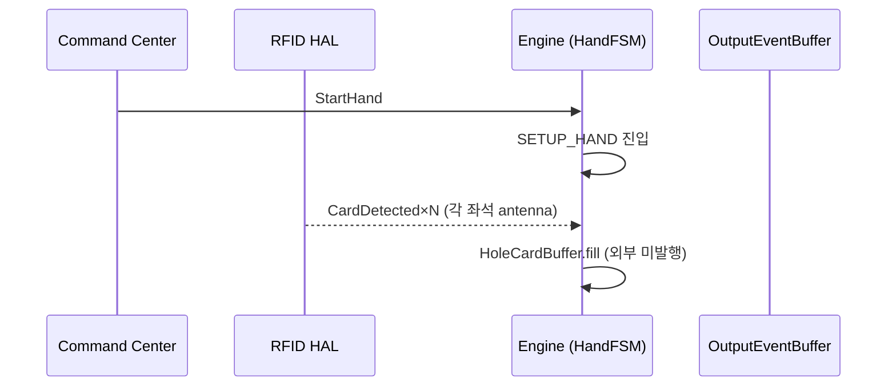
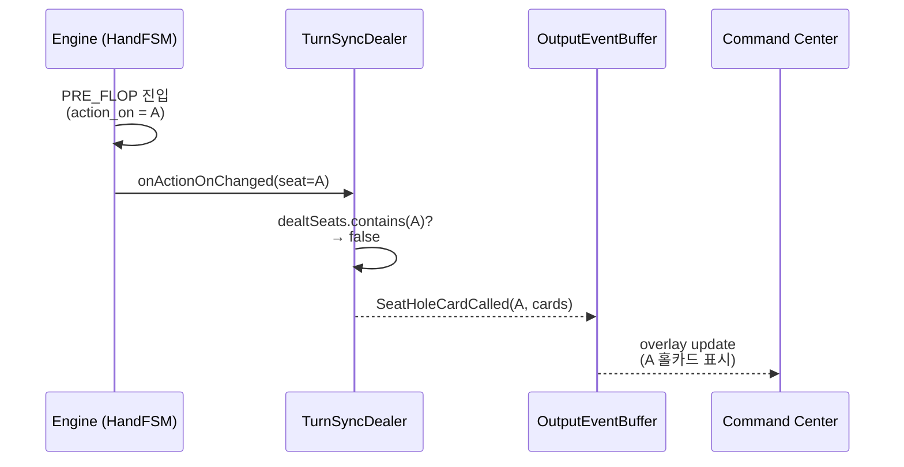
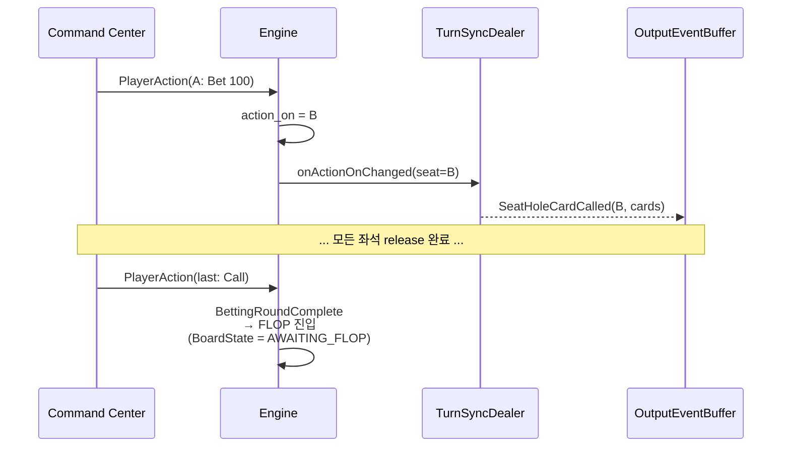
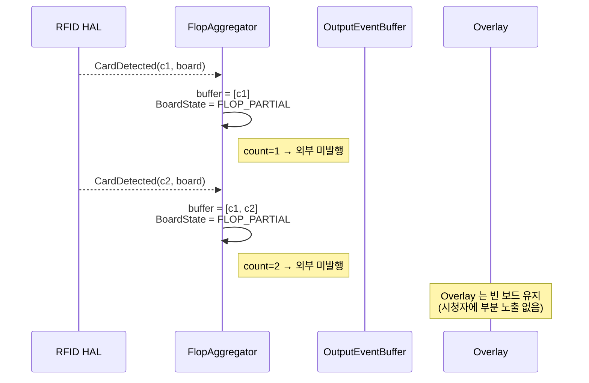
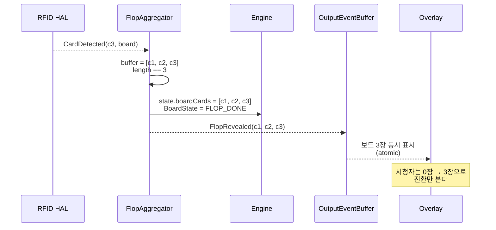
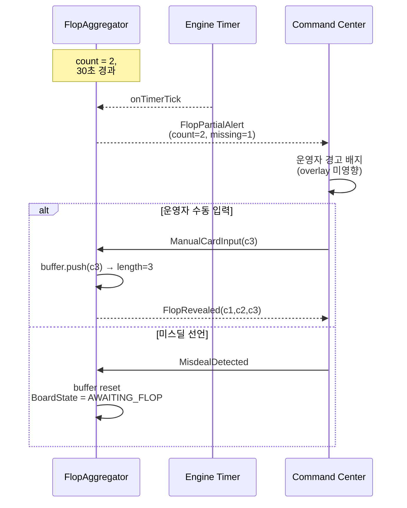

# Triggers & Event Pipeline — Domain Master

> **존재 이유**: 게임 엔진의 모든 이벤트 파이프라인 (외부 입력 트리거 + 내부 자동 전이 + 외부 출력) 과 그 충돌 해결 (coalescence) 을 단일 SSOT 로 통합한다. 본 문서는 BS-06-00-triggers (트리거 경계) + BS-06-09 (이벤트 카탈로그) + BS-06-04 (RFID coalescence) + BS-06-12 (카드 파이프라인) 4개 문서를 zero information loss 로 병합한다. 상태 전이 자체는 Lifecycle 도메인 마스터가 권위 — 본 문서는 그 전이를 일으키는 **트리거 + 이벤트 + 충돌 해결** 만 담는다.

| 날짜 | 항목 | 내용 |
|------|------|------|
| 2026-04-06 | BS-06-04 신규 | 트리거 정의 총괄 + 우선순위 + coalescence 알고리즘 |
| 2026-04-06 | BS-06-04 v2.0 보강 | 경계 조건, 상태별 활성 매트릭스, 유저 스토리 33건, 시나리오 매트릭스, 구현 가이드 확장 |
| 2026-04-08 | BS-06-08 신규 | 4 트리거 소스 (CC/RFID/Engine/BO), 이벤트 분류, Mock 합성 규칙 |
| 2026-04-08 | BS-06-09 신규 | Input/Internal/Output 3계층 이벤트 정의, payload 스키마, 유효 상태 매트릭스 |
| 2026-04-09 | BS-06-09 IE-02 보강 | Call/AllIn amount 외부 무시 + 엔진 내부 재계산 |
| 2026-04-10 | BS-06-09 WSOP P1/P2 | IE-10/11/12/13, IT-DealCommunityRecovery, OE-HandTabled/HandRetrieved/MuckRetrieved/FlopRecovered/DeckIntegrityWarning |
| 2026-04-13 | BS-06-08 설명 보강 | 모든 이벤트 친절한 설명, 시팅 트리거 6개, SeatFSM/TableFSM 매트릭스, WSOP LIVE 매핑 |
| 2026-04-13 | BS-06-08 Clock 트리거 | §2.4 BO ClockStarted/Paused/Resumed + §2.5 Auto Blind-Up 로직 |
| 2026-04-13 | BS-06-09 GAP-B 보강 | OE-05 legalActions payload, Output Accumulation 순서, OE-19 display_to_players |
| 2026-04-14 | BS-06-08 CCR-050 | §2.5 Clock 5종 추가 (ClockRestarted, clock_detail_changed, clock_reload_requested, stack_adjusted, tournament_status_changed) — WSOP LIVE SignalR Hub 정렬 |
| 2026-04-27 | BS-06-12 신규 (PR #4) | Turn-based hole release + 3-card atomic flop SSOT |
| 2026-04-27 | BS-06-12 압축 (PR #5) | verbose → quickref Trigger Matrix (T1~T11) |
| 2026-04-27 | 도메인 통합 (본 문서) | BS-06-00-triggers + BS-06-09 + BS-06-04 + BS-06-12 (verbose) 를 lossless 병합. legacy-ids 보존. Lifecycle 도메인 마스터 cross-ref. **Chunk-by-chunk commit 으로 작성** (sibling worktree retry after 2026-04-27 subdir conflict) |

---

## 1. Overview & Definitions

### 1.1 도메인 정의

본 도메인은 4 가지 직교 관심사를 통합한다:

1. **트리거 소스 분류** (BS-06-00-triggers): "어떤 이벤트가 누구에 의해 발동되는가" — 4 입력 소스 (CC / RFID / Engine / BO) 의 경계 정의
2. **이벤트 카탈로그** (BS-06-09): 트리거가 야기하는 Input / Internal / Output 3계층 이벤트의 payload 스키마
3. **충돌 해결** (BS-06-04 Coalescence): 동시 트리거 발생 시 우선순위 + 시간 윈도우 + 폐기/큐잉 규칙
4. **카드 파이프라인** (BS-06-12): RFID/CC → buffer → engine → OutputEvent 의 turn-based 분배 + atomic flop 감지

상태 전이 자체는 Lifecycle 도메인 마스터의 권위. 본 도메인은 **트리거 + 이벤트 + 충돌 해결** 만 담는다.

### 1.2 4 트리거 소스 (통합 정의 — BS-06-00-triggers §1 + BS-06-04 §우선순위 통합)

| 소스 | 발동 주체 | 처리 시간 | 신뢰도 | 채널 |
|------|---------|---------|--------|------|
| **CC** | 운영자 (수동) | 즉시 (<50ms) | 낮음 (인간 오류 가능) | CC Flutter → Game Engine |
| **RFID** | 시스템 (자동) | 변동 (50~150ms) | 높음 (하드웨어) | RFID HAL → CC → Game Engine |
| **Engine** | 시스템 (자동) | 결정론적 (<10ms) | 최고 (규칙 기반) | Game Engine 내부 |
| **BO** | 시스템 (자동) | 변동 (100~500ms) | 높음 | BO WebSocket → CC/Lobby |

> Coalescence (BS-06-04) 의 우선순위 계층은 §3.13 의 Rule 2 참조. 기본 RFID > CC > Engine, 단 `state_applied`/`runout_in_progress` 예외.

### 1.3 이벤트 3계층 분류 (BS-06-09 §개요)

```
┌─────────────────────────────────────────────┐
│             Input Events                     │
│  CC 버튼 / RFID 감지 → 엔진에 전달          │
│  (sealed class GameEvent의 직계 멤버)        │
└──────────────────┬──────────────────────────┘
                   ↓ reduce(state, event)
┌─────────────────────────────────────────────┐
│           Internal Transitions               │
│  reducer 내부에서 조건 충족 시 자동 수행      │
│  (외부에서 dispatch하지 않음)                 │
└──────────────────┬──────────────────────────┘
                   ↓ 상태 변경 완료
┌─────────────────────────────────────────────┐
│            Output Events                     │
│  엔진 → UI/오버레이/통계 모듈에 알림         │
│  (ReduceResult.outputs 리스트)               │
└─────────────────────────────────────────────┘
```

- **Input Event**: `game_event.dart` sealed class 의 직계 멤버. `reduce(HandState, GameEvent) → ReduceResult` 의 두 번째 인자.
- **Internal Transition**: 외부에서 dispatch 하지 않음. reducer 내부에서 조건 충족 시 연쇄 수행.
- **Output Event**: `ReduceResult.outputs: List<OutputEvent>` 로 반환. UI 가 구독하여 화면 갱신, 애니메이션, 사운드를 트리거.

### 1.4 카드 파이프라인 정의 (BS-06-12)

EBS Game Engine 의 "카드 파이프라인" 은 **외부 입력 (RFID/CC) → Engine 상태 변경 → OutputEvent 발행** 의 3-stage 파이프라인이다. 두 가지 핵심 규칙:

| # | 규칙 | OutputEvent |
|---|------|-------------|
| 1 | **턴 기반 홀카드 호출**: 모든 좌석이 SETUP_HAND 에서 buffer 에 채워지지만, 각 좌석의 `ACTION_TURN` 도래 시점에만 그 좌석 카드만 release | `SeatHoleCardCalled(seat, cards)` (좌석당 1회) |
| 2 | **Atomic 3-card flop**: 1·2장 인식 시 `BoardState.FLOP_PARTIAL` PENDING (외부 미발행). 정확히 3장 충족 시점에만 1회 atomic 발행 | `FlopRevealed(c1,c2,c3)` |

**원칙**:
- 카드 호출은 **트리거 기반 (turn 또는 condition)** 이며, 시간 (timer) 으로 발행하지 않는다.
- 부분 감지 (partial detection) 는 에러가 아니다. **PENDING 상태의 정상 흐름** 이다.
- 3장 충족 (또는 timeout) 까지 외부에 어떤 보드 카드 OutputEvent 도 발행하지 않는다 (atomic flop guarantee).

### 1.5 트리거 Coalescence 정의 (BS-06-04 §정의)

**트리거 Coalescence — 병합**: 복수의 이벤트 소스가 동일 시간 창 ±100ms 내에 발생했을 때, 우선순위 규칙에 따라 하나의 유효한 상태 전이로 통합하는 프로세스. 나머지 이벤트는 **큐잉** (나중에 처리) 하거나 **폐기** (무시) 한다.

**핵심 목표**: 운영자 UI 응답성을 해치지 않으면서도 RFID 감지 데이터의 신뢰도를 최우선으로 유지한다.

**적용 범위**: 핸드 진행 중, `hand_in_progress == true` 인 복수 트리거 이벤트. 단일 트리거 또는 `IDLE` 상태는 coalescence 적용 불필요.

> **WSOP LIVE 미정의 — 독립 설계**: Coalescence 개념과 ±100ms/200ms 윈도우는 WSOP LIVE Confluence 에 대응 규정 없음. RFID 하드웨어 (12 안테나 burst 특성) 기인 EBS 고유 구현이며 **정당화된 발산** (justified divergence).

### 1.6 ReduceResult 구조 (BS-06-09 §ReduceResult)

```
ReduceResult {
  state: HandState         // 최종 상태
  outputs: List<OutputEvent>  // UI에 전달할 이벤트 목록
}
```

하나의 `reduce()` 호출이 여러 Internal Transition 을 연쇄 수행하면, 각 전이마다 해당하는 OutputEvent 가 `outputs` 에 순서대로 추가된다.

예: `reduce(state, PlayerAction(seat:3, action:fold))` → AllFoldDetected 연쇄 시:

1. `OE-02 ActionProcessed(seat:3, fold)`
2. `OE-03 PotUpdated(...)`
3. `OE-05 ActionOnChanged(seat:-1)`
4. `OE-01 StateChanged(RIVER → HAND_COMPLETE)`
5. `OE-06 WinnerDetermined(...)`
6. `OE-09 HandCompleted(...)`

#### Output Accumulation 순서

`reduce()` 는 Input Event 처리 중 발생하는 **모든 OutputEvent 를 순서대로 accumulate** 한다.

- 발행 순서 = Internal Transition 발동 순서 = OutputEvent 배열 인덱스 순서
- 예시: `PlayerAction(seat:3, action:fold)` → `[ActionProcessed, StateChanged, ActionOnChanged]` (이 순서)
- 동일 타입 OutputEvent 가 1회 reduce 에서 복수 발행될 수 있음 (예: `PotUpdated` 연속)
- Consumer (UI) 는 배열 순서대로 처리하면 최종 상태에 도달함

### 1.7 ActionType Enum (BS-06-09 §ActionType)

| 값 | 이름 | BS-06-02 정의 | amount 필수 |
|:--:|------|-------------|:-----------:|
| 0 | fold | 포기 | ❌ |
| 1 | check | 체크 | ❌ |
| 2 | bet | 첫 베팅 | ✓ |
| 3 | call | 콜 | ❌ (자동 계산) |
| 4 | raise | 레이즈 | ✓ |
| 5 | allIn | 올인 | ❌ (자동: player.stack) |

> Call 의 금액은 `biggest_bet_amt - player.current_bet` 로 자동 계산. AllIn 의 금액은 `player.stack` 으로 자동 계산. 외부에서 amount 를 넘기더라도 무시.

### 1.8 용어 사전 (4 문서 통합)

| 용어 | 출처 | 설명 |
|------|------|------|
| **sealed class** | BS-06-09 | 정해진 종류만 존재할 수 있는 프로그래밍 분류 체계 |
| **reducer** | BS-06-09 | 현재 상태와 이벤트를 받아 새로운 상태를 만드는 함수 |
| **dispatch** | BS-06-09 | 이벤트를 처리 함수에 전달하는 것 |
| **payload** | BS-06-09 | 이벤트에 딸려오는 데이터 |
| **cascade** | BS-06-09 | 하나의 이벤트가 연쇄적으로 다른 이벤트를 발생시키는 것 |
| **RFID** | BS-06-04 / BS-06-09 | 무선 주파수로 카드를 자동 인식하는 기술. 카드에 내장된 IC 를 테이블 센서가 읽는다 |
| **CC** | BS-06-04 / BS-06-09 | Command Center, 운영자가 게임을 제어하는 화면 |
| **coalescence** | BS-06-04 | 여러 센서 신호가 동시에 들어올 때 하나로 합치는 처리 규칙 |
| **FSM** | BS-06-04 | 게임 진행 단계를 정의한 상태 흐름도 (Finite State Machine) |
| **debounce** | BS-06-04 | 같은 신호의 반복 입력을 일정 시간 차단 |
| **flush** | BS-06-04 | 버퍼에 쌓인 데이터를 모두 비우기 |
| **no-op** | BS-06-04 | 아무 동작도 하지 않음 |
| **inclusive** | BS-06-04 | 경계값 포함 |
| **Atomic flop** | BS-06-12 | Flop 3장이 시청자/구독자에게 0장→3장 전환으로만 노출되는 보장. 1장/2장 중간 상태 노출 금지 |
| **PENDING** | BS-06-12 | BoardState 가 FLOP_PARTIAL 인 상태. 정상 흐름의 일부이며 에러 아님 |
| **Turn-based release** | BS-06-12 | 홀카드를 buffer 에 보관 후 각 좌석의 ACTION_TURN 진입 시점에 그 좌석 카드만 외부 발행하는 패턴 |
| **dealtSeats** | BS-06-12 | 이번 핸드에서 hole card 가 이미 release 된 좌석 집합. 재호출 가드 |
| **CardRecognitionCount** | BS-06-12 | 현재 핸드의 보드 카드 누적 인식 수. `GameState.board_card_count` 의 alias |
| **state_applied** | BS-06-04 | 서버가 상태 변경 ACK 를 반환한 시점에서 true 가 되는 플래그 |
| **runout_in_progress** | BS-06-04 | 모든 플레이어 올인 → 보드 자동 공개 진행 중 플래그 |
| **MAX_QUEUE_SIZE** | BS-06-04 | coalescence 큐 오버플로우 보호 한계, 32 |

---

## 2. State Machine / Data Flow

### 2.1 Card Pipeline Architecture (BS-06-12 §1.1)

```
                    +---------------------+
   RFID HAL ───────►|  CardIngressBuffer  |
   (CardDetected)   |  (per-antenna queue) |
                    +----------+----------+
                               │
                               ▼
                    +----------+----------+
   CC ManualInput ──►| CardCoalescer       |───┐
   (ManualCardInput) | (deduplicate +      |   │
                     |  500ms debounce)    |   │
                     +----------+----------+   │
                                │              │
                  (Hole vs Board│ classify     │
                   by antennaId)│              │
                ┌───────────────┴───────┐      │
                ▼                       ▼      │
    +---------------------+   +-----------------+
    | TurnSyncDealer      |   | FlopAggregator   |
    | (player-turn gated) |   | (3-card gated)   |
    +----------+----------+   +--------+--------+
               │                       │
               ▼                       ▼
            +--+-----------------------+--+
            |   Engine.HandFSM (reducer)  |
            |   GameState mutation        |
            +-------------+---------------+
                          │
                          ▼ (OutputEvent)
                +---------+---------+
                |  OutputEventBuffer |
                +---------+---------+
                          │
                          ▼
                  Overlay / CC / BO
```

| 컴포넌트 | 책임 | 위치 |
|---------|------|------|
| **CardIngressBuffer** | RFID antenna 별 raw card event 큐. 중복 burst 흡수 | `lib/core/cards/ingress_buffer.dart` |
| **CardCoalescer** | 500ms 윈도우 dedupe + 동일 카드 다중 인식 1회로 합성 (Coalescence.md §2 와 정렬) | `lib/core/cards/coalescer.dart` |
| **TurnSyncDealer** | `action_on` 과 동기화하여 해당 좌석의 홀카드만 release | `lib/core/cards/turn_sync_dealer.dart` |
| **FlopAggregator** | 3장 buffer. 정확히 3장 시 1회 atomic flush. 1~2장 시 PENDING 보존 | `lib/core/cards/flop_aggregator.dart` |
| **HandFSM (reducer)** | 위 컴포넌트로부터 정제된 트리거만 수신 | `lib/core/state/hand_fsm.dart` |
| **OutputEventBuffer** | OutputEvent 21종 발행 (`Overlay_Output_Events.md` §6.0) | `lib/core/output/output_event_buffer.dart` |

> **SSOT 경계**: `CardIngressBuffer` ~ `FlopAggregator` 까지가 본 도메인 소유. `HandFSM` 이후 상태 전이는 Lifecycle 도메인 마스터 권위.

### 2.2 PlayerState (좌석별, derived) (BS-06-12 §1.2.1)

| 값 | 의미 | 카드 호출 가능? |
|----|------|:---------------:|
| `WAITING` | 핸드 시작 전 또는 다른 플레이어 차례 | ❌ |
| `ACTION_TURN` | `action_on == this.seat`. 카드 호출 활성화 | ✅ (이번 턴 1회) |
| `ACTED` | 이번 라운드 액션 완료 (Check/Bet/Call/Raise 등) | ❌ (재호출 금지) |
| `FOLDED` | 폴드 완료. 카드 muck 상태 | ❌ |
| `ALL_IN` | 올인 후 후속 라운드 자동 통과 | ❌ |
| `SITTING_OUT` | 핸드 비참여 | ❌ |

> **유도 관계**: `PlayerState` 는 별도 필드가 아니라 `seat.status` + `action_on` + `seat.bet` + `seat.folded` 로부터 derive 한다 (`BS_Overview.md` §3 GameState). PlayerStatus enum (active/folded/allin/eliminated/sitting_out) 의 권위는 Lifecycle 도메인 마스터 §2.4.

### 2.3 BoardState (테이블당 1개) (BS-06-12 §1.2.2)

```
       NEW_HAND
          │ (StartHand)
          ▼
      AWAITING_FLOP
          │ (CardRecognitionCount = 0)
          │
          │ ◄────── card_recognized (count = 1)
          ▼
      FLOP_PARTIAL
          │ (CardRecognitionCount ∈ {1, 2})
          │
          │ ◄────── card_recognized (count = 3)
          ▼
      FLOP_READY ──► (1회 flush) ──► FLOP_DONE
          │
          │
          ▼
      AWAITING_TURN ──► TURN_DONE ──► AWAITING_RIVER ──► RIVER_DONE
```

| `BoardState` | `CardRecognitionCount` | 외부 발행? | 다음 트리거 |
|--------------|:----------------------:|:----------:|------------|
| `AWAITING_FLOP` | 0 | — | RFID `CardDetected` (board antenna) |
| `FLOP_PARTIAL` | 1, 2 | **❌ (held)** | 추가 `CardDetected` 또는 timeout |
| `FLOP_READY` | 3 | ✅ `FlopRevealed` (1회) | reducer flush 후 `FLOP_DONE` |
| `FLOP_DONE` | 3 | — | betting 완료 시 `AWAITING_TURN` |
| `AWAITING_TURN` | 3 | — | RFID `CardDetected` (4번째) |
| `TURN_DONE` | 4 | ✅ `TurnRevealed` | — |
| `AWAITING_RIVER` | 4 | — | RFID `CardDetected` (5번째) |
| `RIVER_DONE` | 5 | ✅ `RiverRevealed` | showdown 진입 |

### 2.4 핵심 카운터 / 필드 (BS-06-12 §1.2.3)

| 필드 | 타입 | 위치 | 설명 |
|------|------|------|------|
| `CardRecognitionCount` | int (0~5) | `GameState.board_card_count` | 현재 핸드에서 RFID/Manual 로 인식된 보드 카드 누적 수. HAND_COMPLETE 시 0 reset |
| `flop_buffer` | `List<Card>` (max 3) | `FlopAggregator.buffer` | 부분 감지 누적. 3 충족 시 atomic flush |
| `flop_pending_since` | `DateTime?` | `FlopAggregator.pending_since` | 첫 부분 감지 시각 (timeout 계산용) |
| `flop_timeout_sec` | int (default 30) | config | partial → manual fallback escalation 임계 |
| `turn_dealt_seats` | `Set<int>` | `TurnSyncDealer.dealt_seats` | 이번 핸드에서 홀카드 호출이 이미 release 된 좌석 (재호출 방지) |

### 2.5 Coalescence 적용 조건 (BS-06-04 §적용 조건)

#### 전제조건

다음 모든 조건이 참일 때만 coalescence 규칙 적용:

1. `hand_in_progress == true` — 핸드 진행 중
2. 2개 이상의 서로 다른 소스 트리거 발생
3. 시간 윈도우 ±100ms 내에 도착
4. 게임 상태가 유효한 다음 액션 허용

#### 비활성 조건

1. `hand_in_progress == false` — 테이블 IDLE
2. RFID 에러 모드 활성 — 수동 입력 모드 실행 중
3. HAND_COMPLETE 상태 — 모든 새 입력 거부
4. 모달 다이얼로그 활성 — RFID 감지 대기, CC 입력 모두 금지
5. 단일 트리거만 발생 — 충돌 없음, 즉시 처리

### 2.6 상태별 Coalescence 활성 매트릭스 (BS-06-04 §상태별 활성 매트릭스)

| 상태 | 허용 입력 | 예상 RFID | 버퍼 동작 |
|------|---------|----------|----------|
| **IDLE** `coalescence_active` = false | NEW HAND | 없음, 버퍼 저장 | RFID 버퍼 저장, 다음 핸드 시 처리 |
| **SETUP_HAND** `coalescence_active` = true | DEAL | Hole card | 표준 100ms |
| **PRE_FLOP**~**RIVER** `coalescence_active` = true | FOLD, CHECK, BET, RAISE, CALL, ALL-IN | Board card | 표준 100ms — Engine 자동: 베팅 완료 → 다음 스트리트 |
| **SHOWDOWN** `coalescence_active` = true | SHOWDOWN | 없음 | 표준 100ms — Engine 자동: 핸드 평가 → HAND_COMPLETE |
| **HAND_COMPLETE** `coalescence_active` = false | NEW HAND | 없음, 폐기 | RFID 버퍼 flush |

> 이 매트릭스에 없는 조합은 해당 상태에 존재하지 않으므로 이벤트 수신 시 **STATE_CONFLICT** 에러를 발생시킨다.

### 2.7 Mock 모드 이벤트 합성 (BS-06-00-triggers §4)

#### 2.7.1 기본 원칙

Mock HAL (`MockRfidReader`) 은 CC UI 의 수동 입력을 받아 **Real HAL 과 동일한 이벤트 스트림** 을 생성한다.

```
[운영자] → CC 수동 카드 입력 (suit, rank)
    → MockRfidReader.injectCard(suit, rank)
    → Stream<RfidEvent> emit: CardDetected(
        antennaId: 0,           // Mock 고정값
        cardUid: generated,      // "MOCK-{suit}{rank}" 형식
        suit: suit,
        rank: rank,
        timestamp: DateTime.now(),
        confidence: 1.0          // Mock은 항상 100%
      )
    → Game Engine 수신 (Real과 동일 처리)
```

#### 2.7.2 이벤트별 합성 규칙

| Real 이벤트 | Mock 합성 방법 | 차이점 |
|------------|--------------|--------|
| `CardDetected` | CC 수동 카드 선택 → `injectCard()` | antennaId=0, uid="MOCK-XX", confidence=1.0 |
| `CardRemoved` | Mock 에서 미지원 | 테스트 필요 시 `injectRemoval()` API 사용 |
| `DeckRegistered` | "자동 등록" 버튼 → 52장 가상 매핑 즉시 생성 | 스캔 시간 0ms, 진행률 100% 즉시 |
| `DeckRegistrationProgress` | "자동 등록" 시 1회 100% 이벤트 | Real 은 1장씩 52회 이벤트 |
| `AntennaStatusChanged` | Mock 초기화 시 1회 `CONNECTED` | antenna 1개만 가상 존재 |
| `ReaderError` | `injectError(errorCode)` API | 테스트/데모용 에러 주입 |

#### 2.7.3 시나리오 스크립트 재생 (E2E 테스트용)

Mock HAL 은 **YAML 시나리오 파일** 을 로드하여 사전 정의된 이벤트 시퀀스를 재생할 수 있다.

```yaml
# scenarios/holdem-basic.yaml
scenario: "Basic Hold'em Hand"
events:
  - type: DeckRegistered
    delay_ms: 0
  - type: CardDetected
    delay_ms: 100
    payload: { seat: 0, suit: 3, rank: 12 }  # As (플레이어 1 홀카드 1)
  - type: CardDetected
    delay_ms: 100
    payload: { seat: 0, suit: 2, rank: 11 }  # Kh (플레이어 1 홀카드 2)
  # ... 계속
```

> **시나리오 파일 상세**: `docs/testing/TEST-04-mock-data.md`

---

## 3. Trigger & Action Matrix

### 3.1 Input Events 카탈로그 (BS-06-09 §Input Events)

#### IE-01: StartHand

| 필드 | 타입 | 설명 |
|------|------|------|
| — | — | payload 없음 |

- **소스**: CC (NEW HAND 버튼)
- **유효 상태**: `IDLE`, `HAND_COMPLETE`
- **전제조건**: BS-06-01 핸드 시작 전제조건 4개 충족 (`pl_dealer != -1`, `num_blinds ∈ 0~3`, `num_seats >= 2`, `state == IDLE`)
- **결과**: → `SETUP_HAND` (블라인드 수납 + 홀카드 딜 시작)
- **참조**: BS-06-01 유저 스토리 #2

#### IE-02: PlayerAction

| 필드 | 타입 | 설명 |
|------|------|------|
| `seat` | int | 액션 플레이어의 좌석 번호 |
| `action` | ActionType enum | fold / check / bet / call / raise / allIn |
| `amount` | int? | 베팅 금액 (bet/raise만 필수, 나머지 null) |

- **소스**: CC (6개 액션 버튼 + 금액 입력)
- **유효 상태**: `PRE_FLOP`, `FLOP`, `TURN`, `RIVER`
- **전제조건**: BS-06-02 전제조건 6개 (`hand_in_progress`, `action_on == seat`, `player.status == active` 등)
- **결과**: 상태 변경 (BS-06-02 액션 정의서), 이후 `action_on` 순환 (BS-06-10)
- **참조**: BS-06-02 전체, BS-06-10 액션 순환

> `amount` 검증은 `ActionValidator` 가 처리. 유효하지 않은 금액은 `REJECTED` output event 발생.

> **주의 — Call/AllIn 의 amount 처리**: Call 과 AllIn 의 금액은 엔진이 내부에서 재계산한다. IE-02 의 `amount` 필드에 값이 전달되더라도 무시하고 `biggest_bet_amt - current_bet` (Call) 또는 `player.stack` (AllIn) 으로 대체한다. 외부 전달값을 그대로 적용하면 명세 위반이다.

#### IE-03: BoardCardRevealed

| 필드 | 타입 | 설명 |
|------|------|------|
| `cards` | List\<PlayingCard\> | 공개된 보드 카드 (1~3장) |

- **소스**: RFID (보드 카드 감지) 또는 CC (수동 입력)
- **유효 상태**: `PRE_FLOP` (→ FLOP, 3장), `FLOP` (→ TURN, 1장), `TURN` (→ RIVER, 1장)
- **전제조건**: `betting_round_complete == true` (현재 스트리트 베팅 완료)
- **결과**: `board_cards` 갱신, 다음 스트리트로 전이
- **참조**: BS-06-01 매트릭스 3 / BS-06-12 §3 Atomic Flop 권위

#### IE-04: HoleCardDetected

| 필드 | 타입 | 설명 |
|------|------|------|
| `seat` | int | 해당 좌석 번호 |
| `card` | PlayingCard | 감지된 카드 |

- **소스**: RFID (홀카드 감지)
- **유효 상태**: `SETUP_HAND`
- **전제조건**: `hand_in_progress == true`, 해당 좌석의 홀카드 미완성
- **결과**: `player[seat].hole_cards` 갱신. 모든 플레이어 홀카드 완성 시 `HoleCardBuffer` 에 보관 후 `PRE_FLOP` 진입 (외부 미발행). 각 좌석 ACTION_TURN 시 `SeatHoleCardCalled` 1회 release (BS-06-12 권위)
- **참조**: BS-06-01 유저 스토리 #3 / BS-06-12 §2 Turn-Based Trigger

#### IE-05: ManualNextHand

| 필드 | 타입 | 설명 |
|------|------|------|
| — | — | payload 없음 |

- **소스**: CC (Next Hand 버튼 또는 overrideButton)
- **유효 상태**: `HAND_COMPLETE`
- **결과**: → `IDLE` (board_cards 리셋, action_on = -1)
- **참조**: BS-06-01 유저 스토리 #14

#### IE-06: Undo

| 필드 | 타입 | 설명 |
|------|------|------|
| — | — | payload 없음 |

- **소스**: CC (UNDO 버튼)
- **유효 상태**: `SETUP_HAND` ~ `HAND_COMPLETE` (hand_in_progress 중)
- **전제조건**: `undo_depth < 5` (최대 5단계)
- **결과**: event log 에서 마지막 이벤트 제거, 이전 상태 복원
- **참조**: BS-06-01 유저 스토리 #15, BS-06-08

#### IE-07: MissDeal

| 필드 | 타입 | 설명 |
|------|------|------|
| — | — | payload 없음 |

- **소스**: CC (Miss Deal 버튼) 또는 엔진 자동 (카드 불일치 감지)
- **유효 상태**: `SETUP_HAND` (홀카드 수 불일치 시)
- **결과**: → `IDLE`, pot 복귀, stacks 복구, board_cards 리셋
- **참조**: BS-06-01 유저 스토리 #16, BS-06-08

#### IE-08: RunItChoice

| 필드 | 타입 | 설명 |
|------|------|------|
| `times` | int | Run It 횟수 (2 또는 3) |

- **소스**: CC (플레이어 동의 후 운영자 입력)
- **유효 상태**: `SHOWDOWN` (all-in 상황, 2+ 플레이어)
- **전제조건**: 모든 관련 플레이어 동의
- **결과**: → `RUN_IT_MULTIPLE`, `run_it_times_remaining` 설정
- **참조**: BS-06-01 유저 스토리 #11, BS-06-07

#### IE-09: BombPotConfig

| 필드 | 타입 | 설명 |
|------|------|------|
| `amount` | int | 전원 납부 금액 |

- **소스**: CC (Bomb Pot 설정)
- **유효 상태**: `IDLE` (StartHand 전에 설정)
- **결과**: `bomb_pot_enabled = true`, `bomb_pot_amount` 설정. 다음 StartHand 시 PRE_FLOP 스킵
- **참조**: BS-06-01 Bomb Pot 상태 전이 변형 (Lifecycle 도메인 §4.3)

#### IE-10: BombPotOptOut (WSOP Rule 28.3.2)

| 필드 | 타입 | 설명 |
|------|------|------|
| `seat_index` | int | Opt-out 신청 플레이어 |

- **소스**: CC (플레이어 요청 대행)
- **유효 상태**: `SETUP_HAND` (`bomb_pot_enabled == true`)
- **전제조건**: `state.bomb_pot_opted_out` 에 아직 포함되지 않은 seat
- **결과**: `seat.status = SEATED_OUT`, `state.bomb_pot_opted_out.add(seat_index)`. Button freeze 로 position equity 보존
- **참조**: Lifecycle 도메인 §4.3.4 / WSOP Rule 28.3.2

#### IE-11: TableHand (WSOP Rule 71)

| 필드 | 타입 | 설명 |
|------|------|------|
| `seat_index` | int | 카드를 공개하는 플레이어 |

- **소스**: CC (showdown 시점 플레이어 요청 대행)
- **유효 상태**: `SHOWDOWN`, `HAND_COMPLETE` 직전
- **전제조건**: `seat.holeCards` 가 존재하고 not folded
- **결과**: `seat.cards_tabled = true`. 이후 엔진의 임의 muck 금지 (Rule 71 보호 활성)
- **참조**: BS-06-07 §핸드 보호 & 복구 §Tabled Hand 보호 / WSOP Rule 71

#### IE-12: ManagerRuling (WSOP Rules 71, 89, 109, 110)

| 필드 | 타입 | 설명 |
|------|------|------|
| `decision` | str | "retrieve_fold" \| "kill_hand" \| "muck_retrieve" \| "recover_four_card_flop" 중 하나 |
| `target_seat` | int? | 대상 seat (decision에 따라 필수 여부 상이) |
| `rationale` | str? | 운영자 사유 (감사 로그용, 필수 권장) |

- **소스**: CC (Floor/Manager 권한 필요)
- **유효 상태**: `EXCEPTION_*` 상태, `SHOWDOWN`, `HAND_COMPLETE` 직전
- **전제조건**: decision별 상이
  * `retrieve_fold`: UNDO 가능 (5단계 내), Fold 이벤트가 직전
  * `kill_hand`: 해당 seat 의 cards_tabled == false (tabled hand 는 Rule 71로 보호)
  * `muck_retrieve`: muck_log 에 해당 카드 정보 존재, 해당 seat 가 winning hand
  * `recover_four_card_flop`: `state.community.length == 4` 상태
- **결과**: decision 에 따른 복구/판정 수행
  * `retrieve_fold`: `session.undo()` 호출, `OutputEvent.HandRetrieved` 발행
  * `kill_hand`: `seat.status = FOLDED`, `OutputEvent.HandKilled` 발행
  * `muck_retrieve`: muck_log 에서 카드 복원, `OutputEvent.MuckRetrieved` 발행
  * `recover_four_card_flop`: 4장 shuffle, 1장 burn 보존, `OutputEvent.FlopRecovered` 발행
- **참조**: BS-06-07 §핸드 보호 & 복구, BS-06-08 §Four-Card Flop 복구

#### IE-13: DeckChangeRequest (WSOP Rule 78)

| 필드 | 타입 | 설명 |
|------|------|------|
| `reason` | str | "level_change" \| "dealer_push" \| "card_damage" \| "staff_request" \| "player_request_damage" 중 하나 |
| `requested_by` | str | 요청자 식별 ("BO", "Staff", "Manager", etc.) |

- **소스**: BO (자동) 또는 CC (수동)
- **유효 상태**: `HAND_COMPLETE` (현재 핸드 종료 후에만 허용)
- **전제조건**: Bomb pot / Run It Multiple 진행 중 아님
- **결과**: DeckFSM 상태 전이 트리거 (REGISTERED → UNREGISTERED). `OutputEvent.DeckChangeStarted` 발행
- **참조**: BS-06-08 §Deck Change 절차, WSOP Rule 78, DATA-03 DeckFSM

### 3.2 Input Event 유효 상태 매트릭스 (BS-06-09 §유효 상태 매트릭스)

모든 `(state, event)` 조합의 처리를 정의한다. **불법 전이는 `REJECT` 로 명시**.

| Event \ State | IDLE | SETUP | PRE_FLOP | FLOP | TURN | RIVER | SHOWDOWN | RUN_IT | COMPLETE |
|:---:|:---:|:---:|:---:|:---:|:---:|:---:|:---:|:---:|:---:|
| **StartHand** | ✓ | REJECT | REJECT | REJECT | REJECT | REJECT | REJECT | REJECT | ✓ |
| **PlayerAction** | REJECT | REJECT | ✓ | ✓ | ✓ | ✓ | REJECT | REJECT | REJECT |
| **BoardCardRevealed** | REJECT | REJECT | ✓→FLOP | ✓→TURN | ✓→RIVER | REJECT | REJECT | ✓ | REJECT |
| **HoleCardDetected** | REJECT | ✓ | IGNORE | IGNORE | IGNORE | IGNORE | IGNORE | IGNORE | IGNORE |
| **ManualNextHand** | IGNORE | REJECT | REJECT | REJECT | REJECT | REJECT | REJECT | REJECT | ✓ |
| **Undo** | REJECT | ✓ | ✓ | ✓ | ✓ | ✓ | ✓ | ✓ | ✓ |
| **MissDeal** | REJECT | ✓ | REJECT | REJECT | REJECT | REJECT | REJECT | REJECT | REJECT |
| **RunItChoice** | REJECT | REJECT | REJECT | REJECT | REJECT | REJECT | ✓ | REJECT | REJECT |
| **BombPotConfig** | ✓ | REJECT | REJECT | REJECT | REJECT | REJECT | REJECT | REJECT | REJECT |
| **BombPotOptOut** | REJECT | ✓ | REJECT | REJECT | REJECT | REJECT | REJECT | REJECT | REJECT |
| **TableHand** | REJECT | REJECT | REJECT | REJECT | REJECT | REJECT | ✓ | REJECT | ✓ |
| **ManagerRuling** | REJECT | ✓ | ✓ | ✓ | ✓ | ✓ | ✓ | ✓ | ✓ |
| **DeckChangeRequest** | REJECT | REJECT | REJECT | REJECT | REJECT | REJECT | REJECT | REJECT | ✓ |

> `✓` = 정상 처리, `REJECT` = 거부 (`OutputEvent.Rejected` 발생), `IGNORE` = 조용히 무시 (stray read 등), `✓→X` = 보드 카드 수에 따른 조건부 전이.
>
> **ManagerRuling 특이사항**: decision 별로 유효 상태가 달라진다. 매트릭스의 `✓` 는 "엔진이 이벤트를 수신할 수 있음" 을 의미하며, 실제 처리는 decision 에 따라 거부될 수 있다. 예: `retrieve_fold` 는 직전 Fold 이벤트가 있어야만 수행됨.

### 3.3 Internal Transitions (BS-06-09 §Internal Transitions)

외부에서 dispatch 하지 않는다. `reduce()` 내부에서 조건 충족 시 연쇄 수행된다.

| ID | 이름 | 트리거 조건 | 결과 | 참조 |
|:--:|------|-----------|------|------|
| IT-01 | **BlindsAutoPost** | StartHand 처리 시 자동 | SB/BB/Ante 수납, pot 갱신, biggest_bet_amt 설정 | BS-06-03 (Betting domain) |
| IT-02 | **DealComplete** | SETUP_HAND 에서 모든 홀카드 감지 완료 | → PRE_FLOP, action_on = first_to_act. **HoleCardBuffer 채움 (외부 미발행)** | BS-06-01 #3 / BS-06-12 §2 |
| IT-03 | **BettingRoundComplete** | 모든 active 플레이어 current_bet == biggest_bet_amt && 최소 1회 순환 완료 | → 다음 스트리트 대기 (board card 필요), current_bet 리셋 | BS-06-10 (Lifecycle domain §5.7) |
| IT-04 | **AllFoldDetected** | PlayerAction(Fold) 후 num_active_players == 1 | → HAND_COMPLETE, 남은 1인에게 팟 지급 | BS-06-01 #7 |
| IT-05 | **AllInDetected** | 모든 active 플레이어 status == allIn (또는 active 1명 + 나머지 allIn) | → SHOWDOWN, 남은 보드 자동 공개 대기 | BS-06-01 #8 |
| IT-06 | **ShowdownEvaluation** | SHOWDOWN 진입 시 자동 | 핸드 평가, 승자 결정, 팟 분배 | BS-06-05, BS-06-07 (Evaluation domain) |
| IT-07 | **RunItComplete** | RUN_IT_MULTIPLE 에서 run_it_times_remaining == 0 | → HAND_COMPLETE, 전체 런 합산 분배 | BS-06-01 #12 |
| IT-08 | **BombPotSkip** | StartHand 시 bomb_pot_enabled == true | SETUP → FLOP 직행 (PRE_FLOP 스킵) | BS-06-01 Bomb Pot |
| IT-09 | **ButtonFreezeBombPot** | HAND_COMPLETE 시 `bomb_pot_enabled == true` | `_endHand` 의 dealer +1 이동 스킵, `state.bomb_pot_enabled = false` 로 클리어 (WSOP Rule 28.3.2) | BS-06-01 §Bomb Pot Button Freeze |
| IT-10 | **ButtonFreezeMixedGame** | HAND_COMPLETE 시 `game_transition_pending == true` | `_endHand` 의 dealer +1 이동 스킵, `current_game_index += 1`, 다음 게임으로 전환. `OutputEvent.GameTransitioned` 발행 (New Blind Type: Mixed Omaha) | BS-06-00-REF Ch1.9 Mixed Game |
| IT-11 | **HeadsUpButtonAdjust** | HAND_COMPLETE 시 3명+ → 2명 전환 감지 | 이전 BB 플레이어가 남아있으면 해당 seat 을 dealer 로 설정 (연속 BB 방지, WSOP Rule 87) | BS-06-03 §Heads-up 전환 |
| IT-12 | **MissedBlindMark** | HAND_COMPLETE 시 SITTING_OUT 플레이어가 SB/BB 포지션 | `seat.missed_sb` 또는 `seat.missed_bb = true` 설정 (WSOP Rule 86) | BS-06-03 §Missed Blind |
| IT-13 | **BoxedCardMisdealCheck** | DealHoleCards/DealCommunity 후 boxed card 감지 | `state.boxed_card_count += 1`. 2 이상이면 Misdeal 트리거 (WSOP Rule 88) | BS-06-08 §Boxed Card |
| IT-14 | **DealCommunityRecovery** | Flop 감지 시 `community.length > 3` | 4장 shuffle → 1장 burn 보존, 3장 flop, `OutputEvent.FlopRecovered` 발행 (WSOP Rule 89) | BS-06-08 §Four-Card Flop 복구 |
| IT-15 | **IncompleteAllInNoReopen** | PlayerAction(AllIn) 처리 시 `raise_increment < min_full_raise_increment` | `actedThisRound` 보존, `lastAggressor`/`minRaise` 불변, `currentBet` 만 갱신 (WSOP Rule 96) | BS-06-02 §6.1 |
| IT-16 | **UnderRaiseAdjust** | PlayerAction(Raise) 처리 시 `requested_raise < min_raise_total` | 50% 이상이면 min_raise_total 로 보정, 50% 미만이면 Call 로 변환 (WSOP Rule 95) | BS-06-02 §5.1 |

### 3.4 Output Events (API-04 §6.0 권위, 21종)

`ReduceResult.outputs: List<OutputEvent>` 로 반환된다. UI 가 구독하여 화면 갱신, 애니메이션, 사운드를 트리거한다.

> **2026-04-28 (B-351 OE 번호 재정렬 / B-352 engine code 검증 완료)**: 본 표는 **API-04 §6.0 (`APIs/Overlay_Output_Events.md`) 권위 21종 카탈로그** 로 재정렬됨. 코드 정본: `team3-engine/ebs_game_engine/lib/core/actions/output_event.dart`. 옛 BS-06-09 OE-11~18 ↔ API-04 OE-14~21 매핑은 §3.4.1 권위 정합 표 참조.

| ID | 이름 | payload | 용도 |
|:--:|------|---------|------|
| OE-01 | **StateChanged** | `{prevPhase, newPhase, handState}` | 상태 전이 알림 → 오버레이 갱신 |
| OE-02 | **ActionProcessed** | `{seat, action, amount, newStack}` | 액션 처리 완료 → CC 버튼 갱신, 애니메이션 |
| OE-03 | **PotUpdated** | `{mainPot, sidePots[], displayToPlayers}` | 팟 금액 변경 → 오버레이 팟 표시. **`displayToPlayers: bool` 플래그 (WSOP Rule 101)**: NL/FL/Spread 게임에서 플레이어 UI 숨김 여부. (구 BS-06-09 의 별도 OE-19 view 는 본 OE-03 payload 확장으로 통합) |
| OE-04 | **BoardUpdated** | `{cards[], street}` | 보드 카드 공개 → 오버레이 카드 표시 |
| OE-05 | **ActionOnChanged** | `{seat, legalActions[], timeBank?}` | 액션 턴 이동 → CC 버튼 활성/비활성 |
| OE-06 | **WinnerDetermined** | `{winners[], potDistribution[]}` | 우승자 확정 → 팟 분배 애니메이션 |
| OE-07 | **Rejected** | `{event, reason, details}` | 불법 이벤트 거부 → CC 경고 메시지 |
| OE-08 | **UndoApplied** | `{restoredState, undoDepthRemaining}` | UNDO 완료 → UI 전체 갱신 |
| OE-09 | **HandCompleted** | `{handNumber, winners[], stats}` | 핸드 종료 → 통계 업데이트, 기록 저장 |
| OE-10 | **EquityUpdated** | `{equities[]}` | 승률 재계산 완료 → 오버레이 승률 표시 |
| **OE-11** | **CardRevealed** | `{seat?, cards[], card_type, visibility}` | 홀/보드 카드 공개 → Rive 카드 reveal. **트리거 권위: BS-06-12 §2 (turn-based hole release / `SeatHoleCardCalled`) + §3 (atomic flop / `FlopRevealed`/`TurnRevealed`/`RiverRevealed` — 본 도메인 §3.5 T2/T6/T7/T8)** |
| **OE-12** | **CardMismatchDetected** | `{seat?, expected, detected, source}` | RFID 감지 카드 ≠ 예상 → CC 경고 배너. **트리거: 본 도메인 §3.16.2 + Variants 도메인 §3.17 매트릭스 7** |
| **OE-13** | **SevenDeuceBonusAwarded** | `{winner_seat, bonus_amount, opponent_count}` | SHOWDOWN 7-2 offsuit 우승 → 보너스 배너. **권위: Variants 도메인 §3.9 + Betting 도메인 §5.12** |
| OE-14 | **HandTabled** (Rule 71) | `{seat_index, cards}` | 플레이어 카드 공개 → 오버레이에 표시, 엔진의 임의 muck 보호 활성. (구 BS-06-09 OE-11) |
| OE-15 | **HandRetrieved** (Rule 110) | `{seat, manager_rationale}` | Folded hand 복구 완료 → CC 에 복구 알림, 감사 로그. (구 BS-06-09 OE-12) |
| OE-16 | **HandKilled** (Rule 71 예외) | `{seat, manager_rationale}` | Manager 판정에 의한 수동 kill → 감사 로그. (구 BS-06-09 OE-13) |
| OE-17 | **MuckRetrieved** (Rule 109) | `{seat, cards, rationale}` | Muck 카드 재판정 복구 → showdown 재평가 트리거. (구 BS-06-09 OE-14) |
| OE-18 | **FlopRecovered** (Rule 89) | `{original_cards, new_flop, reserved_burn}` | Four-card flop 복구 완료 → 오버레이 새 flop 표시. (구 BS-06-09 OE-15) |
| OE-19 | **DeckIntegrityWarning** (Rule 78) | `{failure_count, suggested_action}` | RFID 3회 연속 실패 → CC 에 덱 교체 제안. (구 BS-06-09 OE-16) |
| OE-20 | **DeckChangeStarted** (Rule 78) | `{reason, requested_by}` | Deck change 절차 시작 → DeckFSM 전이 알림. (구 BS-06-09 OE-17) |
| OE-21 | **GameTransitioned** (Mixed Omaha) | `{from_game, to_game, button_frozen}` | Mixed 게임 전환 → CC/Overlay 에 전환 알림, button freeze 표시. (구 BS-06-09 OE-18) |

> **OE-05 `legalActions` payload 상세** (BS-06-09 GAP-B 보강):
>
> ```json
> legalActions: [
>   { "action": "fold" },
>   { "action": "check" },
>   { "action": "call", "amount": 100 },
>   { "action": "bet", "min": 20, "max": 1000 },
>   { "action": "raise", "min": 140, "max": 1000 },
>   { "action": "allIn", "amount": 500 }
> ]
> ```
>
> 각 액션의 min/max 는 BetLimit (NL/PL/FL) 규칙에 따라 엔진이 계산. fold 는 항상 포함 (active 상태만). check 는 `biggest_bet_amt == 0` 일 때만.

> **OE-03 `displayToPlayers` 플래그 (WSOP Rule 101, 구 BS-06-09 OE-19 view 통합)**:
> - `true` (기본): 팟 금액을 플레이어 UI 에 표시
> - `false`: 특정 게임 (Spread Limit 등) 에서 팟 크기를 플레이어에게 숨김. Overlay (방송) 에는 항상 표시
> - 엔진은 GameState 의 `pot_display_rule` 설정값에 따라 자동 결정
> - 코드: `output_event.dart` `PotUpdated.displayToPlayers` 필드 (default `true`)

### 3.4.1 OutputEvent 카탈로그 권위 정합 (B-350, 2026-04-28)

본 §3.4 BS-06-09 OutputEvent 카탈로그는 **행동 명세 view** 이며, 외부 API 계약 권위는 `APIs/Overlay_Output_Events.md` §6.0 (실측 21종) 이다. 두 카탈로그는 같은 OutputEvent 집합을 다른 시각으로 분류하므로 매핑 정합이 필요하다.

#### API-04 21 OE ↔ BS-06-09 19 OE 매핑

| API-04 (권위) | API-04 이름 | BS-06-09 매핑 | 차이 사유 |
|:-------------:|-----------|:-------------:|----------|
| OE-01 ~ OE-10 | StateChanged ~ EquityUpdated | BS-06-09 OE-01~10 (번호 일치) | — |
| **OE-11** | **CardRevealed** | **누락** → §3.4.1.A 신규 항목 추가 | BS-06-12 권위로 분리 |
| **OE-12** | **CardMismatchDetected** | **누락** → §3.4.1.B | §3.16.2 / Variants §3.17 시나리오로만 |
| **OE-13** | **SevenDeuceBonusAwarded** | **누락** → §3.4.1.C | Variants §3.9 / Betting §5.12 알고리즘만 |
| OE-14 | HandTabled (Rule 71) | BS-06-09 **OE-11** (3 칸 shift) | API-04 권위로 재번호 (B-351 후속) |
| OE-15 | HandRetrieved (Rule 110) | BS-06-09 OE-12 | (shift) |
| OE-16 | HandKilled (Rule 71 예외) | BS-06-09 OE-13 | (shift) |
| OE-17 | MuckRetrieved (Rule 109) | BS-06-09 OE-14 | (shift) |
| OE-18 | FlopRecovered (Rule 89) | BS-06-09 OE-15 | (shift) |
| OE-19 | DeckIntegrityWarning (Rule 78) | BS-06-09 OE-16 | (shift) |
| OE-20 | DeckChangeStarted (Rule 78) | BS-06-09 OE-17 | (shift) |
| OE-21 | GameTransitioned (Mixed Omaha) | BS-06-09 OE-18 | (shift) |
| (OE-03 의 payload 확장) | `display_to_players` 플래그 (Rule 101) | BS-06-09 **OE-19** (별도 entry view) | API-04 는 OE-03 payload 로 통합. BS-06-09 의 19 카운트 = 18 OE + 1 payload 확장 |

> **권위 결정**: 외부 subscriber (team1 Frontend / team4 CC) 코드 호환성 위해 API-04 번호가 권위. BS-06-09 의 OE-11~18 번호는 행동 명세 작성 시 임시 부여. **본 PR 은 cross-ref + 누락 3 OE 보강** 만, 전체 번호 재정렬은 후속 B-351 (큰 변경 + cross-team review).

#### §3.4.1.A — OE-11 CardRevealed (행동 명세 view)

| ID | 이름 | payload | 용도 |
|:--:|------|---------|------|
| **OE-11** (API-04 권위) | **CardRevealed** | `{seat?, cards[], card_type: "hole" \| "board"}` | 홀카드 / 보드 카드 공개 → Rive 카드 reveal 애니메이션 |

> **권위 위임**: 트리거 로직은 **BS-06-12** (`Card_Pipeline_Overview.md` / 본 도메인 §3.5 T2/T6/T7/T8) 권위. `SeatHoleCardCalled` (T2, hole) 와 `FlopRevealed` / `TurnRevealed` / `RiverRevealed` (T6/T7/T8, board) 가 emit 시점. 즉 **OE-11 CardRevealed 는 API-04 측에서 본 추상 OE 이며, 실제 emission 은 BS-06-12 의 atomic 규칙을 따른다**.

#### §3.4.1.B — OE-12 CardMismatchDetected (행동 명세 view)

| ID | 이름 | payload | 용도 |
|:--:|------|---------|------|
| **OE-12** (API-04 권위) | **CardMismatchDetected** | `{seat?, expected_card, detected_card, source: "rfid" \| "manual"}` | RFID 감지 카드 ≠ 예상 카드 (또는 CC + RFID 다른 카드 동시 입력) → CC 경고 배너 |

> **권위 위임**: 트리거 시나리오는 **본 도메인 §3.16.2** (CC + RFID 다른 카드 — `CARD_CONFLICT` 경고) + **Variants & Evaluation 도메인 §3.17 매트릭스 7** (Card Mismatch 처리 — Venue/Broadcast 분기). 본 OE 는 위 시나리오의 외부 발행 형태.

#### §3.4.1.C — OE-13 SevenDeuceBonusAwarded (행동 명세 view)

| ID | 이름 | payload | 용도 |
|:--:|------|---------|------|
| **OE-13** (API-04 권위) | **SevenDeuceBonusAwarded** | `{winner_seat, bonus_amount, opponent_count}` | SHOWDOWN 에서 7-2 offsuit 으로 우승 → 보너스 배너 + 팟 분배 후속 |

> **권위 위임**: 활성화 / 판정 / 매트릭스는 **Variants & Evaluation 도메인 §3.9** (7-2 Side Bet 매트릭스) 권위. 알고리즘은 **Betting & Pots 도메인 §5.12** (Showdown.checkSevenDeuceBonus()). 본 OE 는 알고리즘 결과의 외부 발행 형태.

#### §3.4.1.D — Cross-team 영향 + 후속 작업

본 §3.4.1 보강의 cross-team 영향:
- **team1 (Frontend)**: API-04 OE-11/12/13 구독 코드 추가 필요 (현재 BS-06-09 의 19 OE 만 핸들링 시 누락 가능)
- **team4 (CC)**: OE-12 CardMismatchDetected 핸들러 (Venue/Broadcast 분기) — 이미 §3.17 매트릭스 7 구현이 있다면 OE 발행만 연결
- **engine code** (`lib/core/output/output_event_buffer.dart`): API-04 21 enum 정합 검증 필요 (B-352 후속)

전체 번호 재정렬 (BS-06-09 OE-11~18 → API-04 OE-14~21) 은 **B-351 후속 PR** 에서 처리 (4 도메인 마스터 cross-ref + 코드 enum + cross-team review 필요).

---

### 3.5 BS-06-12 Card Pipeline Trigger Matrix (T1~T11)

본 매트릭스는 BS-06-12 의 turn-based hole release + atomic flop 의 11 트리거를 단일 표로 통합한다. §3.1~§3.4 의 IE/IT/OE 카탈로그와 정합.

| # | Source | Condition | State Mutation | OutputEvent |
|---|--------|-----------|----------------|-------------|
| T1 | RFID | `CardDetected` (seat antenna) ∧ HandFSM=SETUP_HAND | `HoleCardBuffer[seat].push(card)` | (none) |
| T2 | Engine | `action_on` 변경 ∧ `seat ∉ dealtSeats` ∧ `buffer[seat].length ≥ variant.holeCardCount` | `dealtSeats.add(seat)` · `players[seat].holeCards = buffer` | **`SeatHoleCardCalled(seat, cards)`** |
| T3 | Engine | `action_on` 변경 ∧ `buffer[seat].length < variant.holeCardCount` | (none) | `SeatHoleCardPending(seat, missing)` |
| T4 | RFID | `CardDetected` (board) ∧ BoardState=AWAITING_FLOP | `flopBuffer.push` · BoardState=FLOP_PARTIAL | (none) |
| T5 | Engine | `flopBuffer.length ∈ {1, 2}` | (none) | **(none — PENDING)** |
| T6 | Engine | `flopBuffer.length == 3` | `boardCards = flopBuffer` · BoardState=FLOP_DONE | **`FlopRevealed(c1,c2,c3)` (atomic)** |
| T7 | RFID | `CardDetected` (board) ∧ BoardState=AWAITING_TURN | `boardCards.push` · BoardState=TURN_DONE | `TurnRevealed(c4)` |
| T8 | RFID | `CardDetected` (board) ∧ BoardState=AWAITING_RIVER | `boardCards.push` · BoardState=RIVER_DONE | `RiverRevealed(c5)` |
| T9 | Engine timer | BoardState=FLOP_PARTIAL ∧ `now - pendingSince ≥ 30s` | (none) | `FlopPartialAlert(count, missing)` (CC only) |
| T10 | Engine | 덱 외 카드 ∨ 중복 카드 | reset flopBuffer · BoardState=AWAITING_FLOP | `MisdealDetected` |
| T11 | Engine | `HAND_COMPLETE` 진입 | `dealtSeats.clear()` · `flopBuffer.clear()` | (none) |

> T5 행이 atomic guarantee 의 핵심. count ∈ {1, 2} 에서 OutputEvent 컬럼은 항상 `(none)`. 시청자는 0장→3장 단일 전환만 본다.

### 3.6 Cascading 규칙 (BS-06-09 §Cascading)

하나의 Input Event 가 여러 Internal Transition 을 연쇄 발동할 수 있다. reducer 는 연쇄가 종료될 때까지 한 번의 `reduce()` 호출 내에서 처리한다.

#### 연쇄 패턴

| Input Event | 가능한 연쇄 | 최대 깊이 |
|------------|-----------|:--------:|
| StartHand | → IT-01(BlindsAutoPost) → IT-08?(BombPotSkip) | 2 |
| PlayerAction(Fold) | → IT-04?(AllFoldDetected) → OE-09(HandCompleted) | 2 |
| PlayerAction(Call/Check) | → IT-03?(BettingRoundComplete) | 1 |
| PlayerAction(AllIn) | → IT-05?(AllInDetected) | 1 |
| BoardCardRevealed | → IT-06?(ShowdownEvaluation, RIVER 후) | 1 |
| HoleCardDetected | → IT-02?(DealComplete, 모든 홀카드 완성 시) | 1 |
| RunItChoice | → IT-07?(RunItComplete) | 1 |

> `?` 는 조건부 발동. 연쇄 깊이가 3 이상인 경우는 없다.

### 3.7 Trigger 소스별 이벤트 분류 (BS-06-00-triggers §2)

#### 3.7.1 CC 소스 이벤트 (운영자 수동, 25개)

운영자가 CC 에서 버튼/키보드/터치로 발동하는 이벤트.

| 이벤트 | 트리거 조건 | 대상 FSM | 설명 |
|--------|-----------|---------|------|
| `StartHand` | IDLE 상태 + precondition 충족 | HandFSM | NEW HAND 버튼. 딜러 위치 이동, 블라인드 자동 수집 (SETUP_HAND) |
| `Deal` | SETUP_HAND 상태 | HandFSM | 홀카드 딜 시작. RFID 모드면 자동 인식, Mock 이면 수동 입력 |
| `Fold` | action_on == 해당 플레이어 | HandFSM | 카드 포기. 1명 남음 시 즉시 핸드 종료 |
| `Check` | biggest_bet_amt == 해당 플레이어 베팅액 | HandFSM | 추가 돈 없이 다음 사람 차례. PRE_FLOP BB 의 체크 옵션 포함 |
| `Bet` | biggest_bet_amt == 0 (첫 베팅) | HandFSM | 라운드 첫 베팅. NL 최소 베팅 = BB |
| `Call` | biggest_bet_amt > 해당 플레이어 베팅액 | HandFSM | 콜. 납부 금액 = `biggest_bet_amt - 본인 기투입액` (자동) |
| `Raise` | biggest_bet_amt > 0 (기존 베팅 존재) | HandFSM | 추가 베팅. NL 최소 레이즈 = 직전 베팅/레이즈 크기 이상 |
| `AllIn` | 스택 전부 베팅 | HandFSM | 보유 칩 전부 (`player.stack` 자동) |
| `Undo` | hand_in_progress == true | HandFSM | 이전 이벤트 되돌리기 (최대 5단계) |
| `ManualNextHand` | HAND_COMPLETE 상태 | HandFSM | 다음 핸드로 이동 |
| `ManualCardInput` | 카드 입력 모드 활성 | — | RFID 미인식 폴백. Mock 의 유일한 카드 입력 방법 |
| `SeatAssign` | Table SETUP/LIVE | SeatFSM | 플레이어 좌석 배치. Random / Manual 지원 |
| `SeatVacate` | Seat OCCUPIED | SeatFSM | 단순 이탈 (탈락 아님). Seat → EMPTY (E) |
| `SeatMove` | 두 Seat 간 이동 | SeatFSM | 좌석 이동. 도착 좌석 MOVED (M), 10분 후 PLAYING |
| `PauseTable` | Table LIVE | TableFSM | 테이블 일시 중단 (진행 중 핸드 완료 후 PAUSED) |
| `ResumeTable` | Table PAUSED | TableFSM | 테이블 재개 (PAUSED → LIVE) |
| `CloseTable` | Table LIVE/PAUSED | TableFSM | 테이블 완전 종료 (CLOSED) |
| `SetBombPot` | IDLE 상태 | HandFSM | Bomb Pot 모드 설정 (PRE_FLOP 스킵) |
| `SetRunItTimes` | SHOWDOWN 진입 전 올인 시 | HandFSM | Run It 횟수 (2 또는 3) 설정 |
| `ConfirmChop` | HAND_COMPLETE 진입 전 | HandFSM | 칩 합의 분배 확인 (토너먼트 파이널) |
| `RegisterDeck` | Deck UNREGISTERED | DeckFSM | 덱 등록 시작 (RFID 52장 스캔 또는 Mock 자동) |
| `SeatReserve` | Table SETUP/LIVE, Seat EMPTY | SeatFSM | 좌석 예약 (Auto Seating 제외, RESERVED) |
| `SeatRelease` | Seat RESERVED | SeatFSM | 예약 해제 (RESERVED → EMPTY) |
| `PlayerEliminate` | Seat OCCUPIED/PLAYING | SeatFSM | 탈락 처리 (2단계: Bust 요청 → FM/TD Confirm) |
| `UpdateChips` | hand_in_progress == false, Seat PLAYING | — | 칩 수량 수동 변경 (Add/Remove). 리바이/애드온 |

> **WSOP LIVE 대응**:
> - SeatAssign — Table Management → Player Create (Seat) Random/Manual
> - SeatVacate — Player 삭제 / 수동 해제
> - SeatMove — Player Move Random/Manual (시트까지 지정)
> - SeatReserve — Reserve Seat (짙은 회색 표시)
> - SeatRelease — Release Seat
> - PlayerEliminate — Table Dealer Page Bust 요청 → Table Management Confirm Bust
> - UpdateChips — Update Chips (Add/Remove)

#### 3.7.2 RFID 소스 이벤트 (시스템 자동, 6개)

RFID 리더가 안테나를 통해 카드를 감지/제거할 때 자동 발동.

| 이벤트 | 트리거 조건 | payload | 설명 |
|--------|-----------|---------|------|
| `CardDetected` | 안테나 위에 카드 배치 | antennaId, cardUid, suit, rank, timestamp | 카드 인식. 홀카드/보드 구분은 antennaId |
| `CardRemoved` | 안테나에서 카드 제거 | antennaId, cardUid, timestamp | 정보성 이벤트. **이 자체로 폴드 의미 안 됨**. 폴드는 운영자 FOLD 버튼 필수 |
| `DeckRegistered` | 52장 전수 스캔 완료 | deckId, cardMap[52], timestamp | 덱 등록 완료 (게임 시작 가능) |
| `DeckRegistrationProgress` | 스캔 진행 중 | scannedCount, totalCount | 등록 진행률 (CC 프로그레스 바) |
| `AntennaStatusChanged` | 안테나 연결/해제 | antennaId, status, timestamp | 안테나 상태. 미연결 시 카드 인식 불가 |
| `ReaderError` | 하드웨어 오류 | errorCode, message, antennaId | 통신 실패, 전원 문제, 펌웨어 오류. 심각하면 Mock 전환 제안 |

> RFID 이벤트는 `IRfidReader.events` 스트림을 통해 전달된다. 상세: `API-03-rfid-hal-interface.md`.

#### 3.7.3 Engine 소스 이벤트 (시스템 자동, 12개)

Game Engine 이 규칙에 따라 자동 발생시키는 이벤트. 외부 입력 없이 내부 상태 전이.

| 이벤트 | 트리거 조건 | 설명 |
|--------|-----------|------|
| `BlindsPosted` | SETUP_HAND 진입 + 블라인드 대상 확정 | SB/BB/Ante 자동 수집 |
| `HoleCardsDealt` | 모든 플레이어 홀카드 배분 완료 | (legacy 의미: 전원 일괄 발행). **BS-06-12 권위에 따라 외부 미발행, 좌석별 ACTION_TURN 시 SeatHoleCardCalled 로 분리 release**. SETUP_HAND 종료 표지 (내부) |
| `BettingRoundComplete` | 현재 라운드 모든 액션 완료 (동일 베팅액) | → 다음 Street 전이 |
| `AllFolded` | 1명 제외 전원 폴드 | → HAND_COMPLETE 직행 |
| `AllInRunout` | 올인 + 남은 베팅 불가 | 남은 보드 자동 공개 |
| `ShowdownStarted` | 최종 라운드 완료 + 2+ 플레이어 | 핸드 평가 시작 |
| `WinnerDetermined` | 핸드 평가 완료 | 우승자 + 팟 분배 계산 |
| `HandCompleted` | 팟 분배 + 통계 업데이트 완료 | → HAND_COMPLETE 전이 |
| `EquityUpdated` | 카드 상태 변경 (홀카드/보드 변경) | Monte Carlo / LUT 승률 재계산 |
| `SidePotCreated` | 올인 발생 시 초과분 분리 | 사이드 팟 생성 |
| `StatisticsUpdated` | 핸드 종료 시 | VPIP/PfR/WTSD/Agr 업데이트 |
| `MisdealDetected` | 카드 불일치 감지 | → IDLE 복귀, 스택 복원 |

#### 3.7.4 BO 소스 이벤트 (Back Office 자동, 14개)

Back Office 에서 데이터 변경 시 WebSocket 을 통해 Lobby/CC 에 통지하는 이벤트.

| 이벤트 | 트리거 조건 | 수신 대상 | 설명 |
|--------|-----------|----------|------|
| `ConfigChanged` | Admin 이 Settings 변경 | CC | 출력/오버레이/게임 설정 변경. 핸드 진행 중 수신 시 종료 후 적용 |
| `PlayerUpdated` | Lobby 에서 플레이어 정보 수정 | CC | 이름 / 국적 등 변경 |
| `TableAssigned` | Lobby 에서 테이블 설정 변경 | CC | RFID 할당, 덱 상태, 출력 설정 |
| `BlindStructureChanged` | Lobby 에서 블라인드 레벨 변경 | CC | 새 SB/BB/Ante. 다음 핸드부터 적용 |
| `OperatorConnected` | CC 가 BO 에 WebSocket 연결 | Lobby | 모니터링 화면 온라인 표시 |
| `OperatorDisconnected` | CC WebSocket 끊김 | Lobby | 오프라인 표시 (네트워크/앱 종료) |
| `HandStarted` | CC 에서 핸드 시작 → BO 기록 | Lobby | 모니터링 핸드 번호 갱신 |
| `HandEnded` | CC 에서 핸드 종료 → BO 기록 | Lobby | 모니터링 결과 (승자/팟 크기) 반영 |
| `GameChanged` | CC 에서 Mix 게임 종목 변경 → BO 기록 | Lobby | 모니터링 종목 표시 (HORSE 모드 전환 등) |
| `RfidStatusChanged` | CC 에서 RFID 상태 변경 → BO 기록 | Lobby | 테이블 카드 RFID 상태 |
| `OutputStatusChanged` | CC 에서 출력 상태 변경 → BO 기록 | Lobby | 테이블 카드 출력 상태 |
| `ActionPerformed` | CC 에서 액션 수행 → BO 기록 | Lobby (Admin) | 실시간 액션 모니터링. 일반 운영자 비공개, Admin 만 |
| `BreakTable` | Lobby 에서 테이블 깨기 | CC | 테이블 해체 → 플레이어 재배치 (Breaking Order 우선순위) |
| `BalanceTable` | 테이블 간 인원 차이 ≥ 3 | CC | 인원 균등화 (WSOP Rule 67). Auto/수동 |

#### 3.7.5 BO Clock 트리거 — Tournament Clock 관리 (BS-06-00-triggers §2.5, CCR-050)

> **소유**: Backend (Team 2). Game Engine (Team 3) 은 Clock 과 무관 — 시간 대신 `BlindStructureChanged` 명령을 수신.
> **ClockFSM 상태 정의**: BS-00-definitions §3.7.

| 트리거 | 발동 주체 | 수신 대상 | 설명 |
|--------|---------|---------|------|
| `ClockStarted` | Admin/Operator (Lobby) | `lobby_monitor` + `cc_event` | 토너먼트 타이머 시작 → ClockFSM: STOPPED → RUNNING |
| `ClockRestarted` | Admin/Operator | `lobby_monitor` + `cc_event` | 현재 레벨 duration 처음부터 재시작 (CCR-050) |
| `ClockPaused` | Operator/Admin (CC) | `lobby_monitor` + `cc_event` | TD 수동 정지 → ClockFSM: RUNNING → PAUSED |
| `ClockResumed` | Operator/Admin (CC) | `lobby_monitor` + `cc_event` | TD 재개 → ClockFSM: PAUSED → RUNNING |
| `clock_tick` | BO 내부 타이머 | `lobby_monitor` + `cc_event` | 매 1초 자동 발행. 클라이언트 카운트다운용 |
| `clock_level_changed` | BO 내부 타이머 | `lobby_monitor` + `cc_event` | 레벨 전환 · Break 진입/종료 시 발행 |
| `clock_detail_changed` | Admin/Operator | `lobby_monitor` + `cc_event` | 테마/공지/이벤트명/그룹명 변경 시 발행 (WSOP LIVE `ClockDetail` 대응, CCR-050) |
| `clock_reload_requested` | Admin/Operator | `lobby_monitor` + `cc_event` | 대시보드 강제 리로드 신호 (WSOP LIVE `ClockReloadPage` 대응, CCR-050) |
| `stack_adjusted` | Admin | `lobby_monitor` + `cc_event` | 평균 스택 강제 조정 시 발행 (CCR-050) |
| `tournament_status_changed` | Admin | `lobby_monitor` + `cc_event` | EventFlightStatus 전이 (Created/Announce/Registering/Running/Completed/Canceled) 시 발행 (WSOP LIVE `TournamentStatus` 대응, CCR-050) |
| `BlindStructureChanged` | BO (Auto Blind-Up 결과) | `cc_event` | Blind 레벨 전환 시 CC 에 새 SB/BB/Ante 전달 |

##### Auto Blind-Up 로직 (BO 내부)

```
[매 1초 BO 타이머]
  └─ time_remaining_sec 감소
       └─ = 0 도달?
            ├─ auto_advance = false → ClockFSM: RUNNING → PAUSED (TD 수동 확인 대기)
            └─ auto_advance = true
                 ├─ blind_detail_type = Break/DinnerBreak/HalfBreak → 휴식 종료 → 다음 Blind/HalfBlind 레벨
                 ├─ blind_detail_type = HalfBlind → 하프 디너 블라인드 종료 → 다음 HalfBreak 또는 Blind
                 └─ blind_detail_type = Blind
                      ├─ 다음: Break → ClockFSM: RUNNING → BREAK
                      ├─ 다음: DinnerBreak → ClockFSM: RUNNING → DINNER_BREAK
                      ├─ 다음: Blind → level++, 새 duration 시작
                      └─ 마지막 레벨 → ClockFSM: RUNNING → STOPPED
```

> **BlindDetailType enum**: BS-00 §3.8 (WSOP LIVE 준거).

레벨 전환 시 BO 는 동시에: ① `clock_level_changed` 발행 → ② `BlindStructureChanged` 발행 (순서 보장).

### 3.8 트리거 ↔ HandFSM 매핑 (BS-06-00-triggers §7)

| HandFSM 상태 | 허용 CC 트리거 | 허용 RFID 트리거 | 허용 Engine 트리거 |
|-------------|--------------|----------------|-------------------|
| **IDLE** | `StartHand`, `RegisterDeck` | `DeckRegistered`, `AntennaStatusChanged` | — |
| **SETUP_HAND** | `Deal` | `CardDetected` (홀카드) | `BlindsPosted` |
| **PRE_FLOP** | `Fold`, `Check`, `Bet`, `Call`, `Raise`, `AllIn`, `Undo` | — | `BettingRoundComplete`, `AllFolded`, `AllInRunout` |
| **FLOP** | `Fold`, `Check`, `Bet`, `Call`, `Raise`, `AllIn`, `Undo` | `CardDetected` (보드) | `BettingRoundComplete`, `AllFolded`, `AllInRunout` |
| **TURN** | `Fold`, `Check`, `Bet`, `Call`, `Raise`, `AllIn`, `Undo` | `CardDetected` (보드) | `BettingRoundComplete`, `AllFolded`, `AllInRunout` |
| **RIVER** | `Fold`, `Check`, `Bet`, `Call`, `Raise`, `AllIn`, `Undo` | `CardDetected` (보드) | `BettingRoundComplete`, `AllFolded`, `ShowdownStarted` |
| **SHOWDOWN** | `SetRunItTimes`, `ConfirmChop` | — | `WinnerDetermined`, `HandCompleted` |
| **RUN_IT_MULTIPLE** | — | `CardDetected` (추가 보드) | `HandCompleted` |
| **HAND_COMPLETE** | `ManualNextHand` | — | (overrideButton 시 자동 IDLE) |

### 3.9 SeatFSM 유효 상태 매트릭스 (BS-06-00-triggers §7)

> WSOP LIVE Seat Status 코드 기반 (Table Dealer Page, Table Management).

| 이벤트 \ Seat 상태 | EMPTY (E) | NEW (N) | PLAYING | MOVED (M) | BUSTED (B) | RESERVED (R) | OCCUPIED (O) | WAITING (W) | HOLD (H) |
|:---|:---:|:---:|:---:|:---:|:---:|:---:|:---:|:---:|:---:|
| **SeatAssign** | ✓→NEW | REJECT | REJECT | REJECT | REJECT | REJECT | REJECT | REJECT | REJECT |
| **SeatVacate** | REJECT | ✓→EMPTY | ✓→EMPTY | ✓→EMPTY | REJECT | REJECT | REJECT | ✓→EMPTY | REJECT |
| **SeatMove** (출발) | REJECT | REJECT | ✓→EMPTY | REJECT | REJECT | REJECT | REJECT | REJECT | REJECT |
| **SeatMove** (도착) | ✓→MOVED | REJECT | REJECT | REJECT | REJECT | REJECT | REJECT | REJECT | REJECT |
| **SeatReserve** | ✓→RESERVED | REJECT | REJECT | REJECT | REJECT | IGNORE | REJECT | REJECT | REJECT |
| **SeatRelease** | REJECT | REJECT | REJECT | REJECT | REJECT | ✓→EMPTY | REJECT | REJECT | REJECT |
| **PlayerEliminate** (요청) | REJECT | REJECT | ✓→BUSTED | REJECT | IGNORE | REJECT | REJECT | REJECT | REJECT |
| **PlayerEliminate** (확인) | REJECT | REJECT | REJECT | REJECT | ✓→EMPTY | REJECT | REJECT | REJECT | REJECT |

> **상태 전환 규칙**: NEW(N) 과 MOVED(M) 는 10분 카운트다운 후 자동으로 PLAYING 으로 전환된다. 핸드에 참여하면 즉시 PLAYING.
> **WAITING(W)**: 웨이팅 큐에서 Auto Seating 으로 배정된 상태. 플레이어 도착 시 PLAYING. 황색 표시.
> **HOLD(H)**: Seat Draw in Advance 에서 선점된 좌석. Hold 해제 시 EMPTY. 회색 표시.

### 3.10 TableFSM 유효 상태 매트릭스 (BS-06-00-triggers §7)

| 이벤트 \ Table 상태 | SETUP | LIVE | PAUSED | CLOSED | EMPTY | RESERVED_TABLE |
|:---|:---:|:---:|:---:|:---:|:---:|:---:|
| **PauseTable** | REJECT | ✓→PAUSED | IGNORE | REJECT | REJECT | REJECT |
| **ResumeTable** | REJECT | REJECT | ✓→LIVE | REJECT | REJECT | REJECT |
| **CloseTable** | ✓→CLOSED | ✓→CLOSED | ✓→CLOSED | IGNORE | REJECT | ✓→CLOSED |
| **BreakTable** | REJECT | ✓→EMPTY | ✓→EMPTY | REJECT | REJECT | REJECT |
| **BalanceTable** | REJECT | ✓ (유지) | REJECT | REJECT | REJECT | REJECT |
| **ReserveTable** | REJECT | ✓→RESERVED_TABLE | REJECT | REJECT | REJECT | IGNORE |
| **ReleaseTable** | REJECT | REJECT | REJECT | REJECT | REJECT | ✓→LIVE |

### 3.11 Coalescence 우선순위 — Quick Reference (BS-06-04 §우선순위)

**상황별 우선순위 1순위 결정, ±100ms 윈도우 내**:

| 상황 | 우선 처리 | 이유 |
|------|---------|------|
| RFID + CC 동시 | **기본**: RFID 우선. **예외**: CC 가 `state_applied == true` 이면 CC 우선 | 상태 변경 완료 예외 |
| RFID + Engine 동시 | **기본**: RFID 우선. **예외**: `runout_in_progress == true` 이면 Engine 우선 | 올인 런아웃 중 Engine 자동 진행 |
| CC + Engine 동시 | **Engine**, 상태 이미 변경 | 순차 실행이 이미 완료됨 |
| CC 전송 완료 + CC 대기 중 | **전송 완료** | 네트워크 우선순위 |
| RFID 중복 | **폐기** | 100ms 내 같은 UID = 신호 반사 제거 |
| CC 중복 | **먼저 도착** | 나중은 **INVALID** 상태 |

### 3.12 Coalescence Rule 1 — 시간 창 정의 (BS-06-04 §Rule 1)

**이벤트 클러스터링 시간 창 = ±100ms**

- 첫 번째 이벤트 t₀ 에서 t₀-100ms ~ t₀+100ms 내에 도착한 모든 이벤트 = 동시 이벤트로 간주
- 이 윈도우 내의 이벤트들만 coalescence 규칙 적용
- 윈도우 외 도착 이벤트 = 순차 처리, 별도 큐

**근거**: RFID 리더 지연 50~150ms + 네트워크 지연 ≤50ms + UI 입력 지연 ≤50ms 고려.

#### 경계 조건

| 조건 | 동작 | 상세 |
|------|------|------|
| t₀+100ms 시점 도착 | **윈도우 포함** — inclusive (경계값 포함) | t₀+100ms = 현재 윈도우 |
| 빈 윈도우 | **no-op** (아무 동작도 하지 않음) | 타이머 만료 시 처리 대상 없음 |
| 큐 오버플로우 | **최저 우선순위 폐기** | `MAX_QUEUE_SIZE` = 32 |
| 처리시간 > 100ms | **`processing_in_progress` 플래그** | 새 이벤트는 새 윈도우로 분리 |

### 3.13 Coalescence Rule 2 — 우선순위 계층 (BS-06-04 §Rule 2)

**계층 1 — 가장 높음: RFID 카드 감지**
- 이유: 물리 증거, 운영자 입력보다 신뢰도 높음
- 조건: 새로운 미처리 카드 감지만 적용

**계층 2: CC 버튼, 전송 완료**
- 이유: 사용자 의도 명시, 게임 상태 이미 업데이트됨
- 조건: 버튼 클릭이 이미 네트워크 전송 완료한 경우만

**계층 3: 게임 엔진 자동 전이**
- 이유: 규칙 기반, 상태 이미 변경됨
- 조건: 베팅 완료 감지, 올인 런아웃, 쇼다운 진행 등 자동 조건 충족

**계층 4 — 가장 낮음: 동일 소스 내 순서**
- RFID 복수 카드 = 좌석 번호 오름차순
- CC 버튼 복수 = 타임스탬프 오름차순
- 게임 엔진 복수 전이 = 상태 머신 정의 순서

#### 상태 변경 완료 예외

| 예외 | 조건 | 결과 | 근거 |
|------|------|------|------|
| **CC 전송 완료** | `state_applied == true` | RFID 보다 CC 우선, RFID 는 큐잉 | 상태 롤백 비용이 높음 |
| **올인 런아웃** | `runout_in_progress == true` | RFID 보다 Engine 우선, RFID 는 검증용 | 런아웃은 RFID 무관 자동 진행 |

#### 판단 흐름

```
이벤트 A, B가 ±100ms 내 도착
  ├─ A 또는 B가 이미 state_applied? → YES → 이미 적용된 이벤트 우선
  ├─ A 또는 B가 runout_in_progress? → YES → Engine 런아웃 우선
  └─ 둘 다 미적용 → 계층 순서 적용: RFID > CC > Engine
```

> `state_applied` 는 서버가 상태 변경 ACK 를 반환한 시점에서 true 가 된다.

#### RFID 서브 우선순위

| 서브 우선순위 — 높음 → 낮음 | 근거 |
|--------------------------|------|
| Hole card > Board card | 좌석 배정 우선, 보드는 공유 카드 |

### 3.14 Coalescence Rule 3 — 동작 (BS-06-04 §Rule 3)

#### A. 동일 우선순위 내 충돌

**사례 1: RFID 2개 카드 동시 감지**

```
Event A: 좌석 3 홀카드 감지 @ t=100ms
Event B: 좌석 5 홀카드 감지 @ t=105ms
=> 좌석 3 먼저 처리, 좌석 5 100ms 후 처리
```

**사례 2: CC 버튼 2개 동시 클릭**

```
Event A: FOLD 버튼 @ t=500ms
Event B: CALL 버튼 @ t=510ms
=> 먼저 도착한 FOLD 처리, CALL은 INVALID 처리
```

#### B. 다른 우선순위 간 충돌 → Rule 2 적용

**사례 3: CC BET 버튼 vs RFID 보드 카드**

```
Event A (계층 2): CC BET @ t=1000ms [이미 전송됨]
Event B (계층 1): RFID Flop 카드 감지 @ t=1050ms
=> BET 우선 처리 (네트워크 전송 완료됨)
=> RFID 감지는 다음 사이클에서 처리
```

**사례 4: 게임 엔진 자동 전이 vs CC FOLD 버튼**

```
Event A (계층 3): 베팅 완료 → Flop 공개 @ t=2000ms
Event B (계층 2): 운영자 FOLD 클릭 @ t=2005ms [아직 전송 중]
=> Flop 공개 우선 (상태 이미 변경)
=> FOLD는 REJECTED (이미 스트리트 변경됨)
```

#### C. 대기 vs 폐기

**대기해야 할 이벤트**:
- RFID 감지 during CC 버튼 모달 → 모달 닫힐 때까지 RFID 버퍼 유지
- CC 버튼 during 게임 엔진 자동 전이 → 엔진 상태 안정화 후 큐 처리

**폐기해야 할 이벤트**:
- 중복 RFID 감지 (같은 카드 UID, 100ms 내)
- 이미 폴드한 플레이어 입력 추가
- NEW_HAND 직후 이전 핸드 RFID 신호

### 3.15 경계 케이스 — CC vs RFID 동시 발생 (BS-06-00-triggers §3)

#### 3.15.1 카드 인식: RFID 자동 vs CC 수동

| 시나리오 | RFID 감지 | CC 수동 입력 | 우선순위 | 시스템 반응 |
|---------|:--------:|:-----------:|---------|-----------|
| Feature Table, Real 모드 | `CardDetected` | — | **RFID 우선** | 자동 인식된 카드 사용 |
| Feature Table, Real 모드, RFID 실패 | 실패/무응답 | `ManualCardInput` | **CC 폴백** | 수동 입력으로 전환 |
| Feature Table, Mock 모드 | — | `ManualCardInput` | **CC 유일** | 수동 입력 → `CardDetected` 합성 |
| General Table (RFID 없음) | — | `ManualCardInput` | **CC 유일** | 수동 입력만 가능 |
| Real 모드 + 수동 입력 동시 | `CardDetected` | `ManualCardInput` | **RFID 우선** | RFID 결과 사용, 수동 입력 무시 + 경고 로그 |

#### 3.15.2 폴드 인식: CC 버튼 vs RFID 카드 제거

| 시나리오 | 시스템 반응 |
|---------|-----------|
| 운영자가 FOLD 버튼 클릭 | `Fold` 이벤트 즉시 처리. RFID 카드 제거는 무시 |
| RFID 가 카드 제거 감지 (폴드 의도?) | **자동 폴드 안 함.** `CardRemoved` 경고 로그만. 운영자 FOLD 버튼 필수 |
| 운영자 FOLD + 동시에 RFID 카드 제거 | `Fold` 이벤트 1회만 처리 (중복 방지) |

> **핵심 원칙**: 카드 제거는 "정보" 이지 "액션" 이 아니다. 폴드는 반드시 운영자 의도 (CC 버튼) 로만 실행된다.

#### 3.15.3 보드 카드 공개: RFID vs CC

| 시나리오 | 시스템 반응 |
|---------|-----------|
| RFID 가 보드 카드 3장 감지 (Flop) | `CardDetected` × 3 → Engine 이 FLOP 전이 허용 |
| 운영자가 수동으로 보드 카드 입력 | `ManualCardInput` × 3 → `CardDetected` 합성 → Engine 동일 처리 |
| RFID 가 2장만 감지 (1장 미인식) | 경고 표시 → 운영자가 나머지 1장 수동 입력 → 혼합 가능 |

> **BS-06-12 권위**: 1·2장 감지 시 외부 미발행 (PENDING). 정확히 3장 충족 시점에만 `FlopRevealed` atomic 발행. 본 표의 "경고 표시" = `FlopPartialAlert` (T9).

### 3.16 충돌 해결 규칙 (BS-06-00-triggers §5)

#### 3.16.1 동일 이벤트 중복 수신

| 상황 | 해결 |
|------|------|
| 같은 카드 `CardDetected` 2회 수신 | 두 번째 이벤트 무시 + `DUPLICATE_CARD` 경고 로그 |
| `Fold` + `CardRemoved` 동시 | `Fold` 만 처리 (§3.15.2) |
| `Bet(100)` + `Bet(200)` 빠른 연속 | 첫 `Bet` 처리 후 두 번째는 `Raise` 로 재해석 또는 거부 |

#### 3.16.2 소스 간 충돌

| 상황 | 우선순위 | 해결 |
|------|---------|------|
| CC + RFID 동시 카드 입력 (같은 카드) | RFID | 수동 입력 무시, RFID 결과 사용 |
| CC + RFID 동시 카드 입력 (다른 카드) | RFID | RFID 카드 사용 + `CARD_CONFLICT` 경고 + 운영자 확인 요청 |
| CC 액션 + BO ConfigChanged 동시 | CC | 게임 진행 액션 우선, Config 는 핸드 종료 후 적용 (핸드 중간 설정 변경은 지연) |
| Engine 자동 전이 + CC Undo 동시 | CC | Undo 가 Engine 자동 전이를 되돌림 |

### 3.17 이벤트 순서 보장 (BS-06-00-triggers §6)

#### 3.17.1 선후관계 필수 케이스 (위반 시 에러)

| 선행 이벤트 | 후행 이벤트 | 이유 |
|-----------|-----------|------|
| `StartHand` | `BlindsPosted` | 핸드 시작 전 블라인드 수집 불가 |
| `BlindsPosted` | `HoleCardsDealt` | 블라인드 없이 딜 불가 |
| `HoleCardsDealt` | 첫 `Bet`/`Fold`/`Check` | 카드 없이 액션 불가 |
| `BettingRoundComplete` | 다음 Street 보드 카드 | 베팅 미완료 시 보드 공개 금지 |
| `CardDetected` (홀카드) | `EquityUpdated` | 카드 없이 승률 계산 불가 |
| `DeckRegistered` | 첫 `CardDetected` (게임 중) | 미등록 덱으로 게임 불가 |

#### 3.17.2 순서 무관 케이스 (병렬 처리 가능)

| 이벤트 A | 이벤트 B | 이유 |
|---------|---------|------|
| `EquityUpdated` | `StatisticsUpdated` | 독립 계산 |
| `OperatorConnected` | `ConfigChanged` | 서로 다른 채널 |
| `PlayerUpdated` (Lobby) | `ActionPerformed` (CC) | 서로 다른 앱 |
| `CardDetected` (Seat 1) | `CardDetected` (Seat 2) | 서로 다른 안테나 |

### 3.18 Coalescence 시나리오 매트릭스 — Trigger A × Trigger B × GamePhase → Resolution (BS-06-04 §Matrix 1)

#### 3.18.1 Hold'em — PRE_FLOP 라운드

| 트리거 조합 | 시간차 | 처리 순서 | 결과 |
|-----------|-------|---------|------|
| CC DEAL + RFID hole | 50ms | A → B | 정상 DEAL 흐름 |
| RFID hole[0] + RFID hole[1] | 30ms | A → B | 좌석 순서 |
| RFID hole[1] + RFID hole[0] | 10ms | B → A | 작은 좌석 우선 |
| CC FOLD + RFID board | 80ms | B → A | A 큐잉 |
| CC CHECK + RFID hole | 60ms | A → B | CHECK 우선 |
| Engine FLOP + CC FOLD | 50ms | A → B | B **REJECTED** |
| Engine FLOP + RFID board | 40ms | B → A | RFID 가 FLOP 상태에서 기록 |

#### 3.18.2 Hold'em — FLOP/TURN/RIVER 라운드

| 트리거 조합 | 시간차 | 처리 순서 | 결과 |
|-----------|-------|---------|------|
| CC RAISE + RFID board | 120ms | A → B | CC 모달 모드면 B 우선 |
| Engine 다음 라운드 + CC 버튼 | 30ms | A → B | B **REJECTED** |
| RFID board[0] + RFID board[1] | 10ms | A → B | 보드 순서대로 |
| CC BET + CC CALL 다른 운영자 | 5ms | A → B | 순차 처리 |

#### 3.18.3 All-In 시나리오

| 트리거 조합 | 시간차 | 처리 순서 | 결과 |
|-----------|-------|---------|------|
| CC ALL-IN + Engine **RUNOUT** | 10ms | A → B | 정상 |
| CC ALL-IN[seat1] + CC ALL-IN[seat2] | 30ms | A → B | 도착 순서 |
| Engine **RUNOUT** + RFID board | 50ms | A → B | RFID 는 검증용 |
| Engine **RUNOUT** + CC FOLD | 20ms | A → B | B **REJECTED** |

#### 3.18.4 Special — Run It Twice, Bomb Pot

| 트리거 조합 | 시간차 | 처리 순서 | 결과 |
|-----------|-------|---------|------|
| Engine Bomb Pot **PRE_FLOP** 스킵 + RFID board | 100ms | A → B | B 는 **FLOP** 상태에서 처리 |
| Engine Run It Twice 1st + RFID board | 60ms | A → B | 1차 → 2차 순차 |
| CC **SHOWDOWN** + Engine eval | 40ms | A → B | CC 트리거 후 엔진 평가 |

### 3.19 Coalescence 유저 스토리 33건 (BS-06-04 §시나리오)

#### Category 1: RFID vs CC 충돌

| # | 상황 | 처리 | 엣지 케이스 |
|:-:|------|------|-----------|
| 1 | 운영자가 FOLD 버튼 클릭 중 RFID 가 보드 카드 감지 | RFID 감지 먼저 처리. FOLD 는 큐에 대기 | RFID 감지가 예상 카드가 아닐 시 **WRONG_CARD** |
| 2 | 운영자가 BET 버튼을 누른 후 전송 완료 시 RFID 홀카드 감지 | BET 처리 먼저 완료. RFID 는 다음 사이클 | BET 가 아직 pending 이면 RFID 우선 |
| 3 | 운영자가 CALL 버튼 입력 시 상대방 카드 RFID 감지 | CALL 우선 처리. RFID 는 100ms 후 | 네트워크 지연 100ms 초과 시 RFID 먼저 |
| 4 | 운영자가 RAISE 금액 입력 모달 활성 중 RFID 보드 카드 감지 | RFID 감지 대기, 모달 활성 중 기록 불가 | 모달 닫힌 후 RFID 버퍼에서 자동 처리 |
| 5 | 운영자가 ALL-IN 클릭 중 RFID 가 홀카드 감지 | 올인 이미 처리됨 → RFID 먼저, 올인 모달 열림 → RFID 대기 | — |

#### Category 2: 게임 엔진 자동 전이 vs CC

| # | 상황 | 처리 | 엣지 케이스 |
|:-:|------|------|-----------|
| 6 | 운영자가 CHECK 직후 Flop 공개 | CHECK 먼저 처리. Flop 공개는 다음 사이클 | CHECK 가 마지막 액션이면 즉시 발동 |
| 7 | 시스템이 모두 올인 후 RFID 가 보드 감지 | 런아웃 자동 전이 우선. RFID 는 검증용 | RFID 감지 카드 ≠ 자동 딜 카드 시 경고만 |
| 8 | 운영자가 FOLD 중 다음 스트리트 자동 전이 | FOLD 먼저 → 전이, 전이 먼저 → FOLD **REJECTED** | — |
| 9 | 운영자가 NEW HAND 버튼 클릭 | 이전 핸드 RFID 잔여 신호 전부 flush | — |
| 10 | 운영자가 UNDO 실행 중 RFID 새 카드 감지 | UNDO 완료까지 RFID 감지 대기 | UNDO 롤백 후 새 감지 처리 |

#### Category 3: RFID 내부 충돌

| # | 상황 | 처리 | 엣지 케이스 |
|:-:|------|------|-----------|
| 11 | 2개 안테나에서 동시 카드 감지 | 좌석 안테나 홀카드 우선 | — |
| 12 | 같은 카드 UID 중복 감지, 100ms 내 | 첫 감지만 기록, 두 번째 폐기 | — |
| 13 | **FLOP** 공개 후 보드 카드 한 번에 감지 | 카드 배치 순서로 처리 | 순서 섞이면 도착 순서 사용 |
| 14 | 홀카드 감지 중 다른 좌석 홀카드도 감지 | 좌석 번호 순서 처리 | — |

#### Category 4: CC 내부 충돌

| # | 상황 | 처리 | 엣지 케이스 |
|:-:|------|------|-----------|
| 15 | CALL 후 즉시 RAISE 클릭 | 먼저 도착한 CALL 처리, RAISE **INVALID** | — |
| 16 | CHECK 와 FOLD 동시 클릭 | 타임스탬프 순서, 두 번째 **INVALID** | — |

#### Category 5: 특수 상황

| # | 상황 | 처리 | 엣지 케이스 |
|:-:|------|------|-----------|
| 17 | Run It Twice 합의 후 첫 보드 딜 | 엔진 보드 딜 우선, RFID 는 선택사항 | — |
| 18 | Bomb Pot **PRE_FLOP** 스킵 + RFID 보드 감지 | 스킵 먼저 실행, RFID 는 **FLOP** 상태에서 처리 | — |
| 19 | 2명 운영자가 동시에 ALL-IN | 네트워크 도착 순서, 동시 도착 시 seat index 낮은 쪽 | — |
| 20 | **HAND_COMPLETE** 직후 RFID 새 카드 감지 | 무시, 버퍼 flush | — |

#### Category 6: 복합 충돌

| # | 상황 | 처리 | 엣지 케이스 |
|:-:|------|------|-----------|
| 21 | CC BET + RFID board + Engine 자동 전이, 3-source 동시 | state_applied 먼저 확인. 미적용이면: RFID → CC → Engine | `runout_in_progress` 면 Engine 우선 |
| 22 | UNDO 중 RFID + CC FOLD | UNDO 완료까지 모두 대기, 완료 후 폐기 | 롤백 상태에서 대기 이벤트가 무효 가능 |
| 23 | Miss Deal 후 RFID 버퍼 잔여 | 버퍼 전체 무효화, 새 **SETUP_HAND** 초기화 | flush 중 새 RFID 도착 시 새 윈도우 |
| 24 | RFID 에러 모드 전환 중 새 RFID 도착 | 전환 완료까지 무시 | 전환 중간 도착한 RFID 폐기 |
| 25 | 네트워크 단절 중 CC 로컬 큐잉 + RFID 정상 | RFID 로컬 처리, CC 로컬 큐 저장, 복구 후 순차 전송 | 복구 후 불일치면 **REJECTED** |
| 26 | 설정 변경 중 RFID 감지 | 모달 활성 중 RFID 대기 | 설정 변경이 상태 영향 시 RFID 유효성 재검증 |
| 27 | UI lag 중 CC 버튼 클릭 | Engine 상태 기준 유효성 판단 | **STATE_SYNC_WARNING** 표시 |
| 28 | 크로스 좌석 RFID 감지 | **WRONG_CARD** 에러, 폐기 | 올바른 좌석 재감지 시 정상 처리 |
| 29 | 연속 UNDO 3회 | 각 UNDO 사이 윈도우 초기화 | UNDO 중 다른 입력 차단 |
| 30 | 샷클록 만료와 CC FOLD 동시 도착 | 먼저 `state_applied` 된 쪽 유효, 나머지 DUPLICATE_ACTION 폐기 | 결과 동일 (FOLD) |

#### Category 7: 다중 운영자

| # | 상황 | 처리 | 엣지 케이스 |
|:-:|------|------|-----------|
| 31 | 운영자 A 가 좌석 2 FOLD, B 가 좌석 5 CALL | 정상: 다른 좌석이므로 충돌 없음 | 같은 액션 턴이면 `currentActor` 기준 |
| 32 | A 가 좌석 3 BET, B 가 같은 좌석 3 RAISE | 먼저 도착 처리, 나중 **REJECTED** | 운영 에러, 에러 로그 기록 |
| 33 | A 가 UNDO 중 B 가 FOLD 입력 | UNDO 완료까지 차단 | 전체 핸드 상태 일관성 보호 |

---

## 4. Exceptions & Edge Cases

### 4.1 에러 유형별 Coalescence 영향 (BS-06-04 §에러 및 예외)

| 에러 | 원인 | coalescence 처리 |
|------|------|----------------|
| **RFID_MISSING_CARD** | 카드 미감지 | 이벤트 폐기, 타임아웃 후 수동 입력 |
| **WRONG_CARD** | 예상 ≠ 감지 | 경고만, 게임 진행 |
| **CC_BUTTON_TIMEOUT** | 전송 실패 | CC 이벤트 폐기, RFID 만 처리 |
| **DUPLICATE_RFID** | 신호 반사 | 이벤트 폐기 |
| **STATE_CONFLICT** | 유효성 오류 | **REJECTED**, 다음 유효 액션 대기 |
| **DUPLICATE_CARD** | 같은 카드 `CardDetected` 2회 수신 | 두 번째 이벤트 무시 + 경고 로그 |
| **CARD_CONFLICT** | CC + RFID 다른 카드 입력 | RFID 카드 사용 + 운영자 확인 요청 |
| **DUPLICATE_BOARD_CARD** | flop_buffer 에 같은 카드 재push | buffer 영향 없음, 에러 발행 (BS-06-12) |
| **DUPLICATE_RELEASE_IGNORED** | hole card 재호출 시도 (이미 dealtSeats) | 무시 + 경고 로그 (BS-06-12) |
| **OUT_OF_ORDER_BOARD_CARD** | PRE_FLOP betting 미완료 상태에서 보드 카드 감지 | reject + 경고 (BS-06-12) |
| **IGNORED_PRE_HAND** | HandFSM IDLE / HAND_COMPLETE 에서 RFID 입력 | drop + 로그 (BS-06-12) |
| **STATE_SYNC_WARNING** | UI lag 중 CC 버튼 클릭 | Engine 상태 기준 유효성 판단 후 경고 |

### 4.2 복구 절차 (BS-06-04 §복구 절차)

#### 4.2.1 RFID 연속 에러 (3회 이상)

- 수동 입력 모드 전환, RFID 버퍼 flush
- CC UI 에 "MANUAL CARD" 버튼 활성화
- 수동 입력 후 RFID 신호 도착 → 자동으로 비교 검증

#### 4.2.2 CC 네트워크 에러

- 로컬 버튼 상태 유지, 재전송 3회
- 실패 시 수동 입력

#### 4.2.3 Coalescence 윈도우 타임아웃

- 100ms 경과 후 처리 시작
- 후속은 새 윈도우

### 4.3 핸드 간 전이 Coalescence (BS-06-04 §핸드 간 전이)

| 시점 | 동작 | 상세 |
|------|------|------|
| HAND_COMPLETE 진입 즉시 | **RFID 버퍼 전체 flush** | 이전 핸드 미처리 이벤트 폐기 |
| HAND_COMPLETE 진입 즉시 | **CC 이벤트 큐 clear** | 미처리 CC 이벤트 폐기 |
| HAND_COMPLETE 진입 즉시 | **debounce map 리셋** | 새 핸드에서 같은 UID 재사용 가능 |
| HAND_COMPLETE → NEW HAND | **새 윈도우 시작** | 첫 이벤트 NEW HAND 가 t₀ |

#### 4.3.1 빠른 연속 핸드

1. **HAND_COMPLETE** flush 완료 전에 NEW HAND 도착 → flush 완료까지 **대기**
2. flush 완료 후 NEW HAND 처리 → **SETUP_HAND** 진입
3. 이전 핸드 잔여 RFID 신호 → **폐기**

#### 4.3.2 덱 스캔 오버랩

1. 덱 스캔 모드 중 `deck_scan_in_progress = true`
2. 좌석/보드 안테나 RFID → **폐기**, 덱 안테나만 처리
3. 덱 스캔 완료 후 정상 coalescence 재개

### 4.4 에러 복구 Coalescence (BS-06-04 §에러 복구)

#### 4.4.1 RFID 에러 모드 종료 후 재개

| 단계 | 동작 | 상세 |
|------|------|------|
| 수동 입력 완료 | `rfid_error_mode = false` | 수동 입력 카드 등록 완료 |
| RFID 재개 | 버퍼 flush 후 새 윈도우 | 에러 모드 중 도착 이벤트 전체 폐기 |
| 검증 | 수동 vs RFID 재감지 비교 | 불일치 시 **WRONG_CARD**, 수동 값 유지 |

#### 4.4.2 Miss Deal 후 초기화

1. 모든 게임 상태 초기화 → **IDLE** 복귀
2. RFID 버퍼 전체 무효화
3. debounce map 리셋
4. Miss Deal 중 RFID/CC 이벤트 모두 **폐기**

#### 4.4.3 네트워크 재연결

| 단절 시간 | CC 로컬 큐 | RFID 버퍼 | 복구 동작 |
|-----------|-----------|----------|----------|
| < 30초 | **보존** | **보존** | 재연결 후 순차 전송, 유효성 검증 |
| ≥ 30초 | **폐기** | **폐기** | 전체 상태 동기화, **RESYNC_REQUIRED** |

### 4.5 RFID 카드 감지 에러 (BS-06-04 §RFID 카드 감지)

#### 4.5.1 감지 정확도

- **정상**: UID 매칭 성공 → 즉시 카드 기록
- **미인식**: 안테나 간섭, 카드 손상 → `RFID_MISSING_CARD` 에러
- **중복 감지**: 같은 카드 다시 감지, 신호 반사 → 폐기
- **오카드**: 예상과 다른 카드 감지 → `WRONG_CARD` 에러

#### 4.5.2 에러 복구 모드

- RFID 연속 에러 3회 → 수동 입력 모드 전환
- 수동 입력 모드 중: CC 버튼 "MANUAL CARD" 활성화
- 수동 입력 후 RFID 신호 도착 → 자동으로 비교 검증

### 4.6 RFID 카드 감지 타입별 (BS-06-04 §카드 감지 타입)

| 타입 | 안테나 | 시점 | 대기 시간 |
|------|------|------|---------|
| **홀카드** | 좌석 개별 seat[i] | **SETUP** 단계, DEAL 후 | 100-200ms |
| **보드 카드** | 중앙 디스플레이 board antenna | **FLOP**/**TURN**/**RIVER** 공개 후 | 50-150ms |
| **덱 카드** | 덱 스캐너 deck antenna | NEW HAND 전 등록 | 2-3초 |

### 4.7 CC 버튼 특수 케이스 (BS-06-04 §CC 버튼)

#### 4.7.1 8가지 액션 버튼 전제조건

| 버튼 | 전제조건 | 게임 상태 제약 |
|------|--------|-----------|
| NEW HAND | — | **IDLE** 또는 **HAND_COMPLETE** |
| DEAL | `biggestBet == 0` | **SETUP** 상태 정확히 |
| FOLD | 액션 턴, `currentActor` | **PRE_FLOP**~**RIVER** |
| CHECK | `biggestBet == 0 && action turn` | 게임 진행 중 |
| CALL | `biggestBet > 0 && action turn` | 게임 진행 중 |
| BET | `biggestBet == 0 && action turn` | 게임 진행 중 |
| RAISE | `biggestBet > 0 && action turn` | 게임 진행 중 |
| ALL-IN | action turn | 게임 진행 중 |

> **전송 정확도**: 버튼 클릭 → 네트워크 전송 → 서버 게임 엔진 상태 업데이트 완료까지 ≤100ms.

#### 4.7.2 특수 케이스

- **금액 입력 모달 활성 중**: 새 버튼 클릭 무시
- **UNDO 진행 중**: 모든 새 입력 대기, UNDO 완료까지
- **키보드 단축키**: 버튼 클릭과 동일한 우선순위 적용

### 4.8 게임 엔진 자동 전이 제약 (BS-06-04 §게임 엔진 자동)

#### 4.8.1 자동 전이 조건

> 아래 상태명은 BS-06-01 GamePhase 와 매핑. `_PENDING` 은 "베팅 완료 후 보드 카드 대기 중" 상태를 coalescence 관점에서 구분한 것.

| 트리거 | 사전 상태 | 다음 상태 (BS-06-01 공식명) | 실행 시점 |
|-------|---------|--------------------------|---------|
| **베팅 완료** | **PRE_FLOP**, 모두 매칭 | 보드 대기 (→ **FLOP**) | 마지막 액션 처리 후 즉시 |
| **보드 카드 감지** | 보드 대기 | **FLOP** / **TURN** / **RIVER** | RFID 보드 감지 완료 후 |
| **올인 런아웃** | 모두 올인 | → **SHOWDOWN** | 자동 계산 시작, RFID 무관 |
| **쇼다운 진행** | **RIVER** 베팅 완료 | **SHOWDOWN** | CC "SHOWDOWN" 버튼 |
| **팟 분배** | **SHOWDOWN** 완료 | **HAND_COMPLETE** | 자동 실행 |

#### 4.8.2 제약

- 올인 런아웃: RFID 보드 감지 여부와 관계없이 자동 딜, 운영자 개입 불가
- 쇼다운: CC 버튼 필수, 자동 진행 불가, 운영자 의도 확인

### 4.9 Player Card Call 예외 처리 (BS-06-12 §2.4)

| 상황 | 처리 |
|------|------|
| **카드 미도착 후 액션** | `seat_card_pending` 만 발행 후 ACTION_TURN 유지. 운영자가 수동 입력 (`ManualCardInput`) 또는 RFID 재인식 시 즉시 release. CC 는 ACTION 버튼을 30초간 disable (`Coalescence` action-gate 정렬) |
| **Bomb Pot (PRE_FLOP 스킵)** | PRE_FLOP 자체가 없으므로 release 트리거가 없음 → SETUP_HAND 종료 시점에 모든 active 좌석을 한번에 release (legacy bulk 동작 유지). `bomb_pot_enabled == true` 분기로 명시 |
| **All-in Runout** | `action_on` 이 -1 로 진입. 잔여 좌석 모두 즉시 release (showdown 카드 공개와 정합) |
| **카드 재인식 (이미 dealt 좌석)** | `dealtSeats` 가드. 재호출 무시 + `DUPLICATE_RELEASE_IGNORED` 경고 로그 |
| **Mix Game (변형 hole card 수)** | `variant.holeCardCount` 가 권위. NLH=2, Omaha=4, Pineapple=3 등 (Variants & Evaluation 도메인 마스터 정렬 — Phase 4) |
| **Run It Multiple** | 추가 board 카드만 영향. hole card release 는 핸드당 좌석 1회 원칙 유지 |

### 4.10 Atomic Flop 예외 처리 (BS-06-12 §3.4)

| 상황 | 처리 |
|------|------|
| **2장 인식 후 timeout (default 30초)** | `FlopPartialAlert` 발행 → CC 운영자에게 "1장 미인식" 표시. 운영자가 ① 수동 카드 입력 (`ManualCardInput`) → buffer.push() 로 3장 충족 → `FlopRevealed` 발행, ② RFID 재배치 시도, ③ 미스딜 선언 (`MisdealDetected` → IDLE 복귀) 중 선택 |
| **3장 인식 후 4번째 카드 인식** | `BoardState != AWAITING_TURN` 이면 reject. `AWAITING_TURN` 진입 (=PRE_FLOP/FLOP betting 완료) 후에만 4번째 수용 |
| **중복 카드 인식 (같은 suit/rank)** | `DUPLICATE_BOARD_CARD` 에러 발행. buffer 에 추가하지 않음. 단, 동일 `cardUid` 의 burst 는 `CardCoalescer` 에서 이미 dedupe 됨 |
| **덱에 없는 카드** | `MisdealDetected` 발행 → IDLE 복귀 (Lifecycle 도메인 §4.5 권위) |
| **PRE_FLOP betting 미완료 상태에서 보드 카드 감지** | reject + `OUT_OF_ORDER_BOARD_CARD` 경고 (보드 안테나에 카드 잘못 놓임) |
| **Bomb Pot 모드** | PRE_FLOP 스킵으로 `AWAITING_FLOP` 즉시 진입. 본 로직 그대로 적용 |
| **Stud / Draw variant** | 본 SSOT 미적용. Stud/Draw 는 Variants & Evaluation 도메인 마스터 — Phase 4 의 자체 카드 호출 규칙 사용 (community board 없음) |

### 4.11 비활성 조건 (BS-06-12 §6, BS-06-04 §비활성 조건)

다음 조건에서 본 카드 파이프라인 / coalescence 는 비활성화:

- HandFSM `IDLE` 상태 (StartHand 이전): RFID `CardDetected` 는 큐잉되지 않고 즉시 drop + `IGNORED_PRE_HAND` 로그
- HandFSM `HAND_COMPLETE` 이후 (다음 IDLE 까지): 동일
- `hand_in_progress == false` — 테이블 IDLE
- RFID 에러 모드 활성 — 수동 입력 모드 실행 중
- 모달 다이얼로그 활성 — RFID 감지 대기, CC 입력 모두 금지
- 단일 트리거만 발생 — 충돌 없음, 즉시 처리
- Stud / Draw variant: 본 SSOT 미적용
- Mock 모드 (RFID 없음): RFID 입력 경로가 `MockRfidReader.injectCard` 로 대체될 뿐, 위 모든 로직 동일하게 적용

### 4.12 영향 받는 요소 (BS-06-04 §영향 받는 요소)

#### 4.12.1 게임 상태 머신

- **상태 전이 조건**: coalescence 규칙이 상태 진입 조건을 변경
- **액션 유효성**: **INVALID** 액션 큐잉 시 상태 머신 재확인

#### 4.12.2 오버레이 갱신

- **갱신 순서**: coalescence 가 UI 렌더링 순서 결정

#### 4.12.3 RFID 모듈

- **버퍼 관리**: coalescence 윈도우와 RFID 버퍼 동기화
- **에러 추적**: 중복/폐기 이벤트를 에러 로그에 기록

#### 4.12.4 Command Center 버튼

- **모달 중 버튼 상태**: 금액 입력 모달 활성 중 다른 버튼 비활성화
- **UNDO 모드**: UNDO 진행 중 모든 새 액션 버튼 비활성

---

## 5. Data Models (Pseudo-code)

### 5.1 ReduceResult 구조 (BS-06-09 §ReduceResult 재인용)

```
ReduceResult {
  state: HandState         // 최종 상태
  outputs: List<OutputEvent>  // UI에 전달할 이벤트 목록
}
```

### 5.2 ActionType Enum 코드 (BS-06-09 §ActionType 재인용)

```dart
enum ActionType {
  fold,    // 0: 포기
  check,   // 1: 체크
  bet,     // 2: 첫 베팅 (amount 필수)
  call,    // 3: 콜 (자동 계산)
  raise,   // 4: 레이즈 (amount 필수)
  allIn,   // 5: 올인 (자동: player.stack)
}
```

### 5.3 TurnSyncDealer Pseudocode (BS-06-12 §2.3)

```dart
// lib/core/cards/turn_sync_dealer.dart
class TurnSyncDealer {
  final Set<int> dealtSeats = {};

  Iterable<OutputEvent> onActionOnChanged(GameState s) sync* {
    final seat = s.actionOn;
    if (seat == -1) return;                      // SHOWDOWN 등
    if (dealtSeats.contains(seat)) return;       // 이미 release

    final buffered = s.holeCardBuffer[seat];
    final required = s.variant.holeCardCount;

    if (buffered.length < required) {
      yield SeatHoleCardPending(seat: seat, missing: required - buffered.length);
      return;                                    // PlayerState = ACTION_TURN, but cards 미도착
    }

    // Atomic release
    s.players[seat].holeCards = List.from(buffered);
    dealtSeats.add(seat);
    yield SeatHoleCardCalled(seat: seat, cards: buffered);
  }
}
```

### 5.4 FlopAggregator Pseudocode (BS-06-12 §3.3)

```dart
// lib/core/cards/flop_aggregator.dart
class FlopAggregator {
  final List<Card> buffer = [];
  DateTime? pendingSince;

  Iterable<OutputEvent> push(Card c) sync* {
    if (buffer.contains(c)) {
      yield ErrorEvent(code: 'DUPLICATE_BOARD_CARD', card: c);
      return;
    }
    buffer.add(c);
    pendingSince ??= DateTime.now();

    // EXPLICIT GUARD: 3장 충족 시에만 외부 발행
    if (buffer.length == 3) {
      yield FlopRevealed(cards: List.from(buffer));
      pendingSince = null;
    } else {
      // 1장 또는 2장: PENDING 유지, 외부 미발행
      assert(buffer.length == 1 || buffer.length == 2);
      // (no yield to OutputEventBuffer)
    }
  }

  Iterable<OutputEvent> onTimerTick(DateTime now, Duration timeout) sync* {
    if (pendingSince == null || buffer.length == 3) return;
    if (now.difference(pendingSince!) >= timeout) {
      yield FlopPartialAlert(count: buffer.length, missing: 3 - buffer.length);
      // 상태는 유지 — 운영자 수동 입력 또는 추가 RFID 인식 대기
    }
  }
}
```

> **Self-check (BS-06-12 §3 Gatekeeper)**: 위 코드의 `if (buffer.length == 3)` 가드가 있어 1, 2장 시 `FlopRevealed` 가 외부에 절대 나가지 않음. atomic guarantee 보장.

### 5.5 Coalescence 버퍼 관리 알고리즘 (BS-06-04 §구현 가이드)

```
Event Q = []  # coalescence 윈도우 내 모든 이벤트

On EventArrival(event):
  if Event Q is empty:
    t_window_start = current_time
    t_window_end = t_window_start + 100ms
    Event Q.append(event)
    Schedule(process_coalesced_events, delay=100ms)
  else if current_time <= t_window_end:
    Event Q.append(event)
  else:
    ProcessWindow(Event Q)
    Event Q = [event]
    Reschedule(process_coalesced_events, delay=100ms)

On process_coalesced_events():
  SortByPriority(Event Q)  # Rule 2 우선순위 적용
  for event in Event Q:
    if ShouldDiscard(event):
      continue
    if ShouldQueue(event):
      Queue(event)
    else:
      Process(event)
```

### 5.6 Debounce 구현 (BS-06-04 §Debounce)

```
RFID_debounce_map = {}  # {card_uid: last_timestamp}

On RFID_detection(card_uid, timestamp):
  if card_uid in RFID_debounce_map:
    if timestamp - RFID_debounce_map[card_uid] < 100ms:
      return DISCARD
  RFID_debounce_map[card_uid] = timestamp
  return ADD_TO_QUEUE
```

### 5.7 UNDO 버퍼 flush (BS-06-04 §UNDO 버퍼 flush)

```
On UNDO_requested():
  undo_in_progress = true
  for event in Event_Q:
    event.status = BLOCKED
  Execute_UNDO()
  Event_Q.clear()
  undo_in_progress = false
```

### 5.8 RFID 에러 모드 전환 (BS-06-04 §RFID 에러 모드 전환)

```
On RFID_error_count >= 3:
  rfid_error_mode = true
  RFID_buffer.flush()
  Enable_manual_card_input()

On Manual_card_input_complete():
  rfid_error_mode = false
  RFID_buffer.flush()
  RFID_debounce_map.clear()
  Resume_RFID_detection()
```

### 5.9 HAND_COMPLETE flush (BS-06-04 §HAND_COMPLETE flush)

```
On HAND_COMPLETE():
  Event_Q.clear()
  RFID_buffer.flush()
  RFID_debounce_map.clear()
  processing_in_progress = false
  Log("HAND_COMPLETE: all buffers flushed")
```

### 5.10 MAX_QUEUE_SIZE 보호 (BS-06-04 §MAX_QUEUE_SIZE)

```
MAX_QUEUE_SIZE = 32

On EventArrival(event):
  if len(Event_Q) >= MAX_QUEUE_SIZE:
    lowest = find_lowest_priority(Event_Q)
    Event_Q.remove(lowest)
    Log("QUEUE_OVERFLOW: discarded", lowest)
  Event_Q.append(event)
```

### 5.11 Rabbit Hunt 거부 (BS-06-12 §3.4 / Lifecycle §4.4 cross-ref)

> 세부 정책은 Lifecycle 도메인 §4.4 권위. 본 도메인은 엔진 응답 형식만 명시.

```
if event_type == "rabbit_hunt_request":
    emit OutputEvent.Error {
        code: "rabbit_hunt_not_allowed",
        message: "Rabbit hunting is not allowed (WSOP Rule 81)"
    }
    return state  // 상태 변경 없음
```

### 5.12 Card Pipeline 컴포넌트 위치 (BS-06-12 §1.1 재인용)

| 컴포넌트 | 소스 코드 위치 | 책임 |
|---------|--------------|------|
| **CardIngressBuffer** | `lib/core/cards/ingress_buffer.dart` | RFID antenna 별 raw card event 큐. 중복 burst 흡수 |
| **CardCoalescer** | `lib/core/cards/coalescer.dart` | 500ms 윈도우 dedupe + 동일 카드 다중 인식 1회로 합성 |
| **TurnSyncDealer** | `lib/core/cards/turn_sync_dealer.dart` | `action_on` 과 동기화하여 해당 좌석의 홀카드만 release |
| **FlopAggregator** | `lib/core/cards/flop_aggregator.dart` | 3장 buffer. 정확히 3장 시 1회 atomic flush. 1~2장 시 PENDING 보존 |
| **HandFSM (reducer)** | `lib/core/state/hand_fsm.dart` | 위 컴포넌트로부터 정제된 트리거만 수신 |
| **OutputEventBuffer** | `lib/core/output/output_event_buffer.dart` | OutputEvent 21종 발행 |

### 5.13 구현 체크리스트 (BS-06-04 §구현 체크리스트, 24 항목)

- [ ] coalescence 100ms 윈도우 구현
- [ ] Rule 2 우선순위 정렬, 계층 1~4
- [ ] RFID 중복 제거, `card_uid` 기반
- [ ] CC 버튼 모달 중 RFID 대기 로직
- [ ] UNDO 진행 중 새 입력 차단
- [ ] 타임아웃 발생 시 버퍼 플러시
- [ ] 에러 로그: 폐기/큐잉 이벤트 기록
- [ ] 상태 머신 전이 조건: coalescence 확인
- [ ] 오버레이 갱신: 우선순위 반영
- [ ] 테스트: 시나리오 Matrix 커버
- [ ] 경계 조건: t₀+100ms inclusive 검증
- [ ] 경계 조건: 빈 윈도우 no-op 검증
- [ ] `MAX_QUEUE_SIZE = 32` 초과 시 최저 우선순위 폐기
- [ ] `processing_in_progress` 플래그 동작 검증
- [ ] RFID 서브 우선순위: Hole card > Board card
- [ ] **HAND_COMPLETE** 버퍼 flush — RFID + CC + debounce map
- [ ] 빠른 연속 핸드: flush 완료 전 NEW HAND 대기
- [ ] 덱 스캔 오버랩: `deck_scan_in_progress` 중 좌석/보드 RFID 폐기
- [ ] RFID 에러 모드 전환/복귀 시 버퍼 flush
- [ ] Miss Deal 후 전체 초기화
- [ ] 네트워크 재연결: 30초 미만 보존, 30초 이상 폐기
- [ ] 3-source 동시 충돌 우선순위 정렬
- [ ] UNDO 중 모든 새 입력 차단 + 완료 후 폐기
- [ ] 다중 운영자: 같은 좌석 중복 입력 **REJECTED**

### 5.14 Card Pipeline Sequence Diagram (BS-06-12 §4)

#### Stage 1 — 핸드 시작 + 홀카드 buffer



#### Stage 2 — PRE_FLOP 진입 + 턴별 release (Player A 차례)



#### Stage 3 — 턴 회전 + 베팅 완료



#### Stage 4 — Flop 카드 감지 (1장, 2장 = 대기)



#### Stage 5 — 3장 충족 시 atomic 발행



#### Stage 6 — Timeout escalation (예외 흐름)



---

## 부록 A: Legacy-ID Mapping (추적성 보존)

본 문서가 통합한 원본 4 문서의 어느 섹션이 어디로 흡수되었는지 정확한 매핑.

| 원본 문서 (legacy-id) | 원본 섹션 | 본 문서 위치 |
|---------------------|----------|-------------|
| **BS-06-00-triggers** Triggers.md | §1 4 소스 정의 (CC/RFID/Engine/BO) | §1.2 |
| BS-06-00-triggers | §2.1 CC 소스 이벤트 25개 + 친절한 설명 | §3.7.1 |
| BS-06-00-triggers | §2.2 RFID 소스 이벤트 6개 + 친절한 설명 | §3.7.2 |
| BS-06-00-triggers | §2.3 Engine 소스 이벤트 12개 + 친절한 설명 | §3.7.3 |
| BS-06-00-triggers | §2.4 BO 소스 이벤트 14개 + 친절한 설명 | §3.7.4 |
| BS-06-00-triggers | §2.5 BO Clock 트리거 11개 + Auto Blind-Up 로직 (CCR-050) | §3.7.5 |
| BS-06-00-triggers | §3.1 카드 인식 RFID vs CC | §3.15.1 |
| BS-06-00-triggers | §3.2 폴드 인식 CC vs RFID | §3.15.2 |
| BS-06-00-triggers | §3.3 보드 카드 공개 RFID vs CC | §3.15.3 |
| BS-06-00-triggers | §4 Mock 모드 이벤트 합성 (4.1~4.3) | §2.7 |
| BS-06-00-triggers | §5.1 동일 이벤트 중복 수신 | §3.16.1 |
| BS-06-00-triggers | §5.2 소스 간 충돌 | §3.16.2 |
| BS-06-00-triggers | §6.1 선후관계 필수 케이스 | §3.17.1 |
| BS-06-00-triggers | §6.2 순서 무관 케이스 | §3.17.2 |
| BS-06-00-triggers | §7 트리거-HandFSM 매핑 | §3.8 |
| BS-06-00-triggers | §7 SeatFSM 매트릭스 | §3.9 |
| BS-06-00-triggers | §7 TableFSM 매트릭스 | §3.10 |
| BS-06-00-triggers | §비활성 조건 | §4.11 |
| **BS-06-09** Event_Catalog.md | §개요 (3계층 분류 + 다이어그램) | §1.3 |
| BS-06-09 | §Input Events IE-01 ~ IE-13 (13개) | §3.1 |
| BS-06-09 | §Input Event 유효 상태 매트릭스 | §3.2 |
| BS-06-09 | §Internal Transitions IT-01 ~ IT-16 (16개) | §3.3 |
| BS-06-09 | §Output Events OE-01 ~ OE-19 (19개 + OE-19 확장) | §3.4 |
| BS-06-09 | §Output Accumulation 순서 | §1.6 (Output Accumulation 부분) |
| BS-06-09 | §ReduceResult 구조 | §1.6 / §5.1 |
| BS-06-09 | §ActionType Enum | §1.7 / §5.2 |
| BS-06-09 | §Cascading 규칙 + 연쇄 패턴 | §3.6 |
| BS-06-09 | OE-05 legalActions payload 상세 (GAP-B) | §3.4 |
| BS-06-09 | OE-19 display_to_players 플래그 (Rule 101) | §3.4 |
| **BS-06-04** Coalescence.md | §정의 (트리거 Coalescence 병합) | §1.5 |
| BS-06-04 | §우선순위 테이블 — Quick Reference | §3.11 |
| BS-06-04 | §트리거 소스 정의 (CC/RFID/Engine 3 소스) | §1.2 (BS-06-00-triggers 4소스로 확장 흡수) |
| BS-06-04 | §RFID 카드 감지 타입 (홀/보드/덱) | §4.6 |
| BS-06-04 | §RFID 감지 정확도 + 에러 복구 모드 | §4.5 |
| BS-06-04 | §CC 8가지 액션 버튼 전제조건 + 특수 케이스 | §4.7 |
| BS-06-04 | §게임 엔진 자동 전이 조건 + 제약 | §4.8 |
| BS-06-04 | §적용 조건 + 비활성 조건 | §2.5 |
| BS-06-04 | §상태별 Coalescence 활성 매트릭스 | §2.6 |
| BS-06-04 | §Rule 1 — 시간 창 정의 + 경계 조건 | §3.12 |
| BS-06-04 | §Rule 2 — 우선순위 계층 + 상태 변경 완료 예외 + 판단 흐름 + RFID 서브 우선순위 | §3.13 |
| BS-06-04 | §Rule 3 — Coalescence 동작 (A/B/C 사례) | §3.14 |
| BS-06-04 | §시나리오 — 유저 스토리 33건 (Category 1~7) | §3.19 |
| BS-06-04 | §Matrix 1 — Trigger A x B x GamePhase | §3.18 |
| BS-06-04 | §에러 유형별 coalescence 영향 | §4.1 |
| BS-06-04 | §복구 절차 (RFID 연속/CC 네트워크/타임아웃) | §4.2 |
| BS-06-04 | §핸드 간 전이 (HAND_COMPLETE flush + 빠른 연속 + 덱 스캔 오버랩) | §4.3 |
| BS-06-04 | §에러 복구 (RFID 에러 모드 / Miss Deal / 네트워크 재연결) | §4.4 |
| BS-06-04 | §영향 받는 요소 (4 영역) | §4.12 |
| BS-06-04 | §구현 가이드 (5 pseudocode) | §5.5 ~ §5.10 |
| BS-06-04 | §구현 체크리스트 24항목 | §5.13 |
| **BS-06-12** Card_Pipeline_Overview.md | §0 개요 + 변경 전/후 표 | §1.4 |
| BS-06-12 | §1.1 Card Pipeline Architecture (다이어그램 + 컴포넌트 표) | §2.1 / §5.12 |
| BS-06-12 | §1.2.1 PlayerState (좌석별, derived) | §2.2 |
| BS-06-12 | §1.2.2 BoardState (테이블당 1개) | §2.3 |
| BS-06-12 | §1.2.3 핵심 카운터 / 필드 | §2.4 |
| BS-06-12 | §2 Player Card Call (Turn-Based Trigger) — 의사코드 + 매트릭스 | §3.5 (T2/T3) + §5.3 |
| BS-06-12 | §2.4 Player Card Call 예외 (Bomb Pot, All-in Runout, Mix Game, RIM) | §4.9 |
| BS-06-12 | §3 Flop Card Detection (Condition-Based Trigger) — 의사코드 + 매트릭스 | §3.5 (T4~T6, T9, T10) + §5.4 |
| BS-06-12 | §3.4 Atomic Flop 예외 (timeout, 중복, 덱 외 카드, OOO board card, Bomb Pot, Stud/Draw) | §4.10 |
| BS-06-12 | §4 Sequence Diagram (Stage 1~6) | §5.14 |
| BS-06-12 | §5 Cross-Reference 영향 + §6 비활성 조건 + §7 영향 받는 요소 | §4.11 (비활성) + 부록 B (cross-ref) |
| BS-06-12 | Trigger Matrix T1~T11 (PR #5 quickref) | §3.5 |

---

## 부록 B: Domain Boundaries (권위 위임)

본 도메인은 **트리거 + 이벤트 카탈로그 + 충돌 해결 + 카드 파이프라인** 에 한정된다. 다음 영역은 별도 도메인 마스터에 권위를 위임 (cross-reference 만 유지):

| 영역 | 권위 | Cross-ref 위치 |
|------|------|---------------|
| 핸드 라이프사이클 (IDLE → SHOWDOWN → HAND_COMPLETE 상태 전이) | **Lifecycle 도메인 마스터** (Phase 1) `Lifecycle_and_State_Machine.md` | §3.3 IT-02/04/05/07/09/10/11 결과 / §3.8 트리거-HandFSM 매핑 / §4.4.2 Miss Deal |
| 액션 순환 (`determine_first_to_act` / `next_active_player` / `is_betting_round_complete`) | **Lifecycle 도메인 마스터** §5.5~§5.10 | §3.3 IT-03 (BettingRoundComplete) 결과 |
| Bomb Pot 상태 전이 (활성화 / Button Freeze / Opt-Out / Short Contribution) | **Lifecycle 도메인 마스터** §4.3 | §3.1 IE-09/IE-10 / §3.3 IT-08/IT-09 / §4.9 Bomb Pot 분기 |
| Run It Multiple vs Rabbit Hunting (Rule 81) | **Lifecycle 도메인 마스터** §4.4 | §5.11 (엔진 응답 형식만 명시) |
| Mixed Game Rotation & Button Freeze (HORSE/8-Game/Mixed Omaha) | **Lifecycle 도메인 마스터** §3.9 / §5.13 | §3.3 IT-10 (ButtonFreezeMixedGame) / §3.4 OE-18 (GameTransitioned) |
| Heads-up Button Adjust / Missed Blind Mark | **Lifecycle 도메인 마스터** + **Betting & Pots 도메인** (Phase 3) | §3.3 IT-11 / IT-12 |
| GameState / Player Data Model (28 + 15 필드) | **Lifecycle 도메인 마스터** §5.1 / §5.2 | §1.6 ReduceResult.state 참조 |
| 베팅 액션 (Bet/Call/Raise/All-in 금액 계산) | **Betting & Pots 도메인 마스터** (Phase 3 — 미작성) | §3.1 IE-02 / §3.3 IT-15 / IT-16 |
| 블라인드 / 앤티 포스팅 | **Betting & Pots 도메인 마스터** (Phase 3) | §3.3 IT-01 (BlindsAutoPost) |
| Side Pot 분배 / Showdown evaluation | **Betting & Pots 도메인 마스터** (Phase 3) | §3.3 IT-06 (ShowdownEvaluation) / §3.4 OE-06 (WinnerDetermined) |
| Hand Evaluator (HandRank, kicker, low hand) | **Variants & Evaluation 도메인 마스터** (Phase 4 — 미작성) | §3.3 IT-06 결과 / §3.4 OE-06 payload |
| Miss Deal / Boxed Card / Four-Card Flop / Tabled Hand 보호 | **Variants & Evaluation 도메인 마스터** (Phase 4) — Exceptions.md 흡수 | §3.1 IE-07/IE-11/IE-12 / §3.3 IT-13/IT-14 / §3.4 OE-11~OE-15 |
| Hold'em / Omaha / Stud / Draw / Mix variant 별 hole card 수, board card 수 | **Variants & Evaluation 도메인 마스터** (Phase 4) — Flop_Variants/Stud_Games/Draw_Games 흡수 | §4.9 Mix Game 분기 (`variant.holeCardCount`) / §4.10 Stud/Draw 미적용 |
| Deck Change / DeckFSM 상태 전이 | **Variants & Evaluation 도메인 마스터** (Phase 4) — Exceptions.md 흡수 | §3.1 IE-13 (DeckChangeRequest) / §3.4 OE-16/OE-17 |

> 본 도메인 (Phase 2) 은 위 영역의 **트리거 → 이벤트 발행** 만 담당하고, 그 결과의 비즈니스 로직은 권위 도메인이 책임. 충돌 시 권위 도메인 우선.

---

## 부록 C: Output Event 카탈로그 권위 (외부 SSOT)

본 §3.4 Output Event 19개 (OE-01 ~ OE-19) 는 행동 명세 (BS-06-09) 측 정의다. 외부 API 계약 권위는 별도:

| 외부 SSOT | 경로 | 관계 |
|-----------|------|------|
| **API-04 OutputEvent 카탈로그 §6.0** | `docs/2. Development/2.3 Game Engine/APIs/Overlay_Output_Events.md` | 21종 카탈로그 (OE-05/OE-06 의 emit-trigger 의미는 BS-06-12 §2/§3 권위) |

> Phase 4 Variants & Evaluation 도메인 통합 시 BS-06-09 ↔ API-04 카탈로그 정합성 검증 (B-345 후속) 필요.
