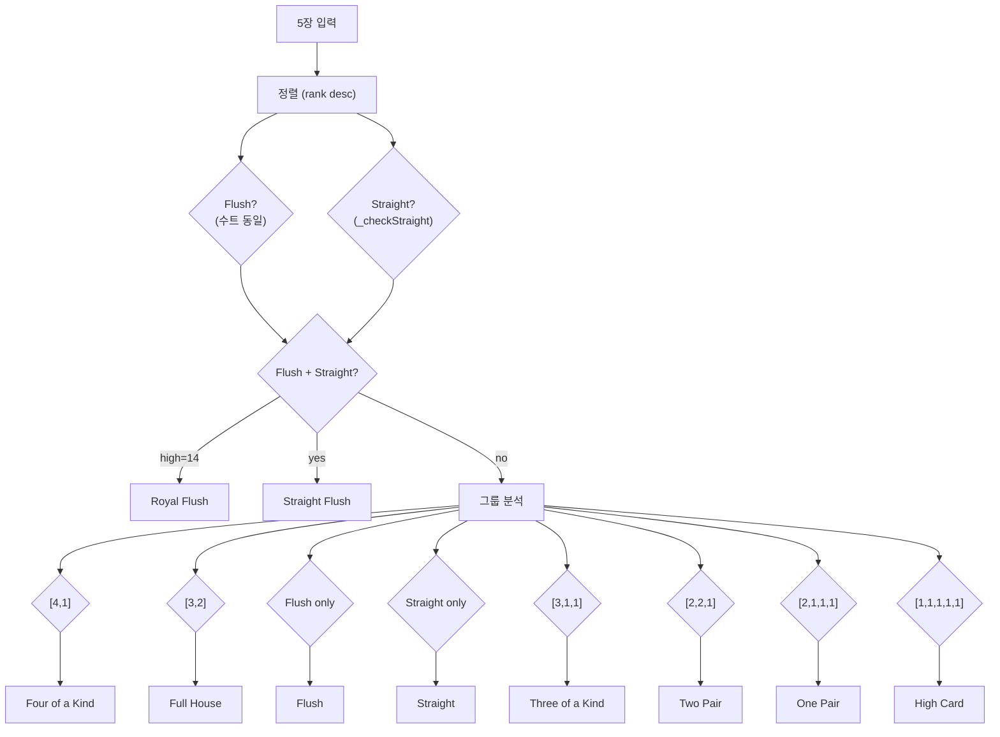
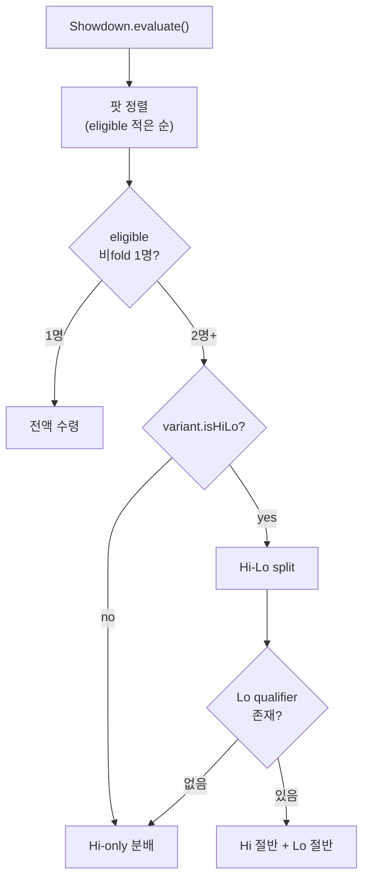

# Variants & Evaluation — Domain Master

> **존재 이유**: Hold'em 외 Variants (Short Deck / Pineapple / Omaha / Courchevel / Draw 7종 / Stud 3종) 의 게임별 차이점 + 통합 Hand Evaluation 체계 (25 게임 × 9 조합 × 7 룰) + 예외 처리 (Miss Deal / Boxed Card / Four-Card Flop / Deck Change / RFID Failure 등) 를 단일 SSOT 로 통합. 6 입력 문서를 zero information loss 로 병합. 상태 전이 / 트리거 / 베팅 / 팟 분배는 다른 도메인 마스터가 권위.

| 날짜 | 항목 | 내용 |
|------|------|------|
| 2026-04-06 | BS-06-05 신규 | standard_high evaluator + 7-2 Side Bet |
| 2026-04-06 | BS-06-08 신규 | 7 예외 (All Fold / All-in Runout / Bomb Pot / RIT / Miss Deal / RFID Failure / Card Mismatch) |
| 2026-04-09 | BS-06-08 GAP-GE-002 | Miss Deal ante 반환 ante_type 별 분기 |
| 2026-04-10 | BS-06-08 WSOP P1/P2 | Four-Card Flop 복구 (Rule 89), Deck Change (Rule 78), Boxed Card (Rule 88) |
| 2026-04-13 | BS-06-05 GAP-D | 입/출 예시 5건 (Short Deck Wheel 주의) |
| 2026-04-14 | BS-06-1X 통합 | BS-06-11/12/13/14 → 단일 Flop_Variants.md (Short Deck/Pineapple/Omaha/Courchevel) |
| 2026-04-14 | BS-06-2X 통합 | BS-06-21 + 22 → Draw_Games.md (라이프사이클 + 평가) |
| 2026-04-14 | BS-06-3X 통합 | BS-06-31 + 32 → Stud_Games.md (라이프사이클 + 평가) |
| 2026-04-17 | Evaluation_Reference v1.1 | 25 게임 × 9 조합 × 7 룰 통합 레퍼런스 |
| 2026-04-28 | 도메인 통합 (본 문서) | 6 입력 lossless 병합. legacy-ids 보존. Lifecycle/Triggers/Betting 권위 위임. Chunk-by-chunk commit (sibling worktree). |

---

## 1. Overview & Definitions

### 1.1 도메인 정의

본 도메인은 **게임 종류별 차이점 + 핸드 평가 알고리즘 + Hold'em 일반 흐름을 벗어나는 예외 처리** 를 통합한다:

1. **Hand Evaluation 통합 레퍼런스** (Evaluation_Reference): 25 게임 → 7 룰 (R1~R7) → 9 조합 (C1~C9) 체계
2. **Hold'em 평가** (BS-06-05): standard_high evaluator + 7-2 Side Bet
3. **Flop Variants** (BS-06-1X): Short Deck / Pineapple / Omaha / Courchevel — Hold'em 대비 차이
4. **Draw Games** (BS-06-2X): 7종 (draw5 / 2-7 SD/TD / A-5 TD / Badugi / Badeucy / Badacey)
5. **Stud Games** (BS-06-3X): 3종 (stud7 / stud7_hilo8 / Razz)
6. **Exceptions** (BS-06-08): All Fold / All-in Runout / Bomb Pot / Run It Twice / Miss Deal / RFID Failure / Card Mismatch + Boxed Card / Four-Card Flop / Deck Change

상태 전이 (Lifecycle), 이벤트 파이프라인 (Triggers), 칩 흐름 (Betting & Pots) 는 별도 도메인 권위.

### 1.2 핵심 개념 정의

#### 1.2.1 Hand Evaluation (Evaluation_Reference)

**핸드 평가** = 25 게임에서 승자를 결정하는 알고리즘. 3 차원 직교:

1. **승리 룰** (R1~R7): "누가 이기나" — Standard Hi / Short Deck 6+ / Triton / 8-or-Better Lo / 2-7 Lowball / A-5 Lowball / Badugi
2. **조합** (C1~C9): 9 게임 그룹 — 각 조합은 1~2 룰을 사용하여 팟 분배 (Hi 전액 / Hi-Lo 50:50 등)
3. **카드 선택**: Free (N장 중 최고 5장) / Omaha (홀 2 + 보드 3 must-use) / Badugi (4장 부분집합)

#### 1.2.2 Variant 차이

**Hold'em 표준** 대비 차이:
- **Deck size**: 52장 (default) vs 36장 (Short Deck)
- **Hole cards**: 2 / 3→2 (Pineapple) / 4 / 5 / 6
- **Board cards**: 5 (default) / 0 (Stud, Draw) / 1+4 (Courchevel SETUP+FLOP)
- **카드 조합**: Free best-5 / must-use 2+3 (Omaha/Courchevel) / 4-card Badugi
- **베팅 라운드 수**: 4 (Hold'em) / 2 (draw5) / 4 (Triple Draw / Stud) / 5 (Stud +1)
- **DRAW_PHASE**: 카드 교환 (Draw / Pineapple)
- **Bring-in**: ante + bring-in (Stud 전용) vs SB+BB (Hold'em)

#### 1.2.3 예외 (BS-06-08)

**예외 상황** = 정상 핸드 진행의 제어 흐름을 벗어나는 모든 경우. 7 + 3 유형:

- 핸드 진행 중: All Fold / All-in Runout / Bomb Pot / Run It Twice / Miss Deal / RFID Failure / Card Mismatch
- 카드 무결성: Boxed Card (Rule 88) / Four-Card Flop (Rule 89) / Deck Change (Rule 78)

### 1.3 용어 사전 (6 문서 통합)

| 용어 | 출처 | 설명 |
|------|------|------|
| **홀카드 (hole card)** | All | 각 플레이어에게 비공개로 나눠주는 카드 |
| **커뮤니티 카드** | BS-06-05 | 테이블 중앙 공개 공용 카드 |
| **kicker** | BS-06-05 | 같은 족보일 때 승부를 가르는 나머지 카드 |
| **odd chip** | BS-06-05/Evaluation_Ref | 팟을 나눌 때 딱 떨어지지 않는 1개 베팅 토큰 |
| **offsuit / suited** | BS-06-05 | 두 카드 무늬 다름 / 같음 |
| **evaluator** | All | 카드 조합 분석하여 승자 결정하는 함수 |
| **must-use 2+3** | BS-06-1X | 홀카드 정확히 2 + 보드 정확히 3 (Omaha/Courchevel) |
| **8-or-better** | BS-06-1X / BS-06-3X | Low 자격: 5장 모두 rank ≤ 8, 서로 다른 rank → Low 자격 |
| **scoop** | BS-06-05/Eval_Ref | 한 사람이 양쪽 팟 (Hi+Lo) 모두 가져가는 것 |
| **wheel** | BS-06-05 | A-2-3-4-5 (standard) 또는 A-6-7-8-9 (Short Deck) |
| **Boxed card** | BS-06-08 | 의도와 다르게 face-up 으로 딜링된 카드 |
| **bring-in** | BS-06-3X | Stud 게임의 약한 패 보유자가 의무로 내는 최소 베팅 |
| **down card / up card** | BS-06-3X | 비공개 (down) / 공개 (up) 카드 |
| **door card** | BS-06-3X | Stud 처음 받는 공개 카드 1장 |
| **draw / stand pat** | BS-06-2X | 카드 교환 / 한장도 교환하지 않는 것 |
| **DISCARD_PHASE** | BS-06-1X (Pineapple) | Pineapple 의 3장→2장 1장 폐기 단계 |
| **DRAW_ROUND** | BS-06-2X | Draw 게임 카드 교환 라운드 |
| **bitmask** | BS-06-2X | 각 플레이어 완료 여부 0/1 추적 |
| **reshuffling** | BS-06-2X | 덱 카드 부족 시 버린 카드 다시 섞어 사용 |
| **C(n,k)** | All | n 장에서 k 장 선택 조합 수 |
| **qualifier** | Evaluation_Ref | Lo 자격 조건 (예: 8-or-better) |
| **Royal Flush (RF)** | All | A-K-Q-J-10 같은 수트 |

### 1.4 핵심 원칙 (6 문서 종합)

- 25 게임은 7 룰 × 9 조합으로 환원 — 코드 정본 `hand_evaluator.dart` / `badugi_evaluator.dart` / `showdown.dart`
- Hi-Lo split 게임: Lo qualifier 미충족 시 Hi 가 전액 수령 (scoop)
- Odd chip: Hi 우선 / 딜러 왼쪽 가까운 승자 (WSOP Rule 73)
- Variant 별 evaluator 라우팅은 `game_id` (0-21+) 로 결정
- Coalescence 윈도우: Hold'em 100ms / DRAW_ROUND 200ms / Stud 3RD burst 확장
- Hand 보호 (Rule 71/89/109/110) 는 모든 variant 에 동일 적용
- Boxed Card 2+ → Misdeal (Rule 88)
- Four-Card Flop → 4장 shuffle, 1장 burn 보존, 3장 정식 flop (Rule 89)
- Deck Change → 핸드 종료 후에만 (Rule 78)

---

## 2. State Machine / Data Flow

### 2.1 25 게임 마스터 테이블 (Evaluation_Reference §5)

| # | 게임 | 홀 | 보드 | 카드선택 | 순서 | Hi | Lo | Split | Bring-in | 최강 Hi | 최강 Lo |
|:-:|------|:--:|:----:|:-------:|:----:|:--:|:--:|:-----:|:--------:|--------|--------|
| 1 | NL Hold'em | 2 | 5 | Free | std | bestHand | — | — | — | RF | — |
| 2 | FL Hold'em | 2 | 5 | Free | std | bestHand | — | — | — | RF | — |
| 3 | PL Hold'em | 2 | 5 | Free | std | bestHand | — | — | — | RF | — |
| 4 | Pineapple | 3→2 | 5 | Free | std | bestHand | — | — | — | RF | — |
| 5 | Short Deck 6+ | 2 | 5 | Free | **6+** | bestHand | — | — | — | RF | — |
| 6 | Short Deck Triton | 2 | 5 | Free | **Tri** | bestHand | — | — | — | RF | — |
| 7 | Omaha | 4 | 5 | **Omaha** | std | bestOmaha | — | — | — | RF | — |
| 8 | Omaha Hi-Lo | 4 | 5 | **Omaha** | std | bestOmaha | bestOmahaLo | **50/50** | — | RF | A2345 |
| 9 | 5-Card Omaha | 5 | 5 | **Omaha** | std | bestOmaha | — | — | — | RF | — |
| 10 | 5-Card Omaha HL | 5 | 5 | **Omaha** | std | bestOmaha | bestOmahaLo | **50/50** | — | RF | A2345 |
| 11 | 6-Card Omaha | 6 | 5 | **Omaha** | std | bestOmaha | — | — | — | RF | — |
| 12 | 6-Card Omaha HL | 6 | 5 | **Omaha** | std | bestOmaha | bestOmahaLo | **50/50** | — | RF | A2345 |
| 13 | Courchevel | 5 | 1+4 | **Omaha** | std | bestOmaha | — | — | — | RF | — |
| 14 | Courchevel HL | 5 | 1+4 | **Omaha** | std | bestOmaha | bestOmahaLo | **50/50** | — | RF | A2345 |
| 15 | 7-Card Stud | 7 | 0 | Free | std | bestHand | — | — | **Low** | RF | — |
| 16 | 7-Card Stud HL | 7 | 0 | Free | std | bestHand | bestLow8 | **50/50** | **Low** | RF | A2345 |
| 17 | Razz | 7 | 0 | Free | — | **lbA5** | — | — | **High** | A2345 | — |
| 18 | 5-Card Draw | 5 | 0 | Free | std | bestHand | — | — | — | RF | — |
| 19 | 2-7 Single Draw | 5 | 0 | Free | — | **lb27** | — | — | — | 75432o | — |
| 20 | 2-7 Triple Draw | 5 | 0 | Free | — | **lb27** | — | — | — | 75432o | — |
| 21 | A-5 Triple Draw | 5 | 0 | Free | — | **lbA5** | — | — | — | A2345 | — |
| 22 | Badugi | 4 | 0 | — | — | **badugi** | — | — | — | A234(4suit) | — |
| 23 | Badeucy | 5 | 0 | — | — | **badugi** | **lb27** | **50/50** | — | A234(4suit) | 75432o |
| 24 | Badacey | 5 | 0 | — | — | **badugi** | **lbA5** | **50/50** | — | A234(4suit) | A2345 |

> 약어: std=standard, 6+=shortDeck6Plus, Tri=shortDeckTriton, RF=Royal Flush, lb27=bestLowball27, lbA5=bestLowballA5, HL=Hi-Lo, o=offsuit. 25번째는 표준 Hold'em 변형 (NL/FL/PL 분리 카운트). game_id 매핑: 0~21+.

### 2.2 9 조합 → 25 게임 배치 (Evaluation_Reference §Executive Summary)

| 조합 | 사용 룰 | 팟 분배 | 포함 게임 | 게임 수 |
|:----:|--------|:------:|----------|:------:|
| **C1** | R1 | Hi 전액 | NLH, FLH, PLH, Pineapple, Omaha, 5CO, 6CO, Courchevel, 7-Card Stud, 5-Card Draw | **10종** |
| **C2** | R2 | Hi 전액 | Short Deck 6+ | 1종 |
| **C3** | R3 | Hi 전액 | Short Deck Triton | 1종 |
| **C4** | R1 + R4 | Hi/Lo 50:50 | Omaha HL, 5CO HL, 6CO HL, Courchevel HL, 7CS HL | **5종** |
| **C5** | R5 | Lo 전액 | 2-7 Single Draw, 2-7 Triple Draw | 2종 |
| **C6** | R6 | Lo 전액 | A-5 Triple Draw, Razz | 2종 |
| **C7** | R7 | Hi 전액 | Badugi | 1종 |
| **C8** | R7 + R5 | Hi/Lo 50:50 | Badeucy | 1종 |
| **C9** | R7 + R6 | Hi/Lo 50:50 | Badacey | 1종 |

> C4 의 Lo 에서 qualifier 실패 (8 이하 핸드 없음) → Hi 가 전액 수령 (scoop).

### 2.3 7 승리 룰 (Evaluation_Reference §Executive Summary)

| 룰 | 이름 | "누가 이기나" | 최강 핸드 |
|:--:|-----|-------------|----------|
| **R1** | Standard Hi | 표준 10 카테고리 최강 | Royal Flush |
| **R2** | Short Deck 6+ | Flush > Full House 로 순서 변경 | Royal Flush |
| **R3** | Short Deck Triton | + Trips > Straight 추가 변경 | Royal Flush |
| **R4** | 8-or-Better Lo | A=1, 페어 실격, 8 이하만 | A-2-3-4-5 |
| **R5** | 2-7 Lowball | A=high, S/F 불리, 최약 핸드 승리 | 7-5-4-3-2 offsuit |
| **R6** | A-5 Lowball | A=1, S/F 무시, 최저 핸드 승리 | A-2-3-4-5 |
| **R7** | Badugi | 4장 고유 수트+랭크, 장 수 우선 | A♣2♦3♥4♠ |

### 2.4 R1~R3 카테고리 순서 비교

| 등급 | R1 standard | R2 6+ | R3 Triton |
|:----:|:-----------:|:-----:|:---------:|
| 1 | Royal Flush | Royal Flush | Royal Flush |
| 2 | Straight Flush | Straight Flush | Straight Flush |
| 3 | Four of a Kind | Four of a Kind | Four of a Kind |
| 4 | Full House | **Flush** | **Flush** |
| 5 | Flush | **Full House** | **Full House** |
| 6 | Straight | Straight | **Three of a Kind** |
| 7 | Three of a Kind | Three of a Kind | **Straight** |
| 8 | Two Pair | Two Pair | Two Pair |
| 9 | One Pair | One Pair | One Pair |
| 10 | High Card | High Card | High Card |

> R2/R3 에서 추가로 `shortDeck=true` → A-6-7-8-9 wheel 활성화 (36장 덱).

### 2.5 카드 선택 (Evaluation_Reference §1.6)

| 선택 | 규칙 | 적용 |
|------|------|------|
| **Free** | N장 중 아무 5장 (C(N,5) 전체 조합 중 최강) | Hold'em (7→21조합), Stud (7→21조합), Draw (5→1조합) |
| **Omaha** | C(H, 2) × C(C, 3) — 홀카드 2장 + 보드 3장 고정 | Omaha 4/5/6, Courchevel 4/5 |
| **Badugi** | 4장 중 유효 부분집합 (수트+랭크 unique) | Badugi 계열 (3종, R7 전용) |

#### Omaha 조합 수

| 게임 | 홀 | C(H,2) × C(5,3) | 총 조합 |
|------|:--:|:---------------:|:-------:|
| Omaha 4 | 4 | 6 × 10 | 60 |
| Omaha 5 / Courchevel | 5 | 10 × 10 | 100 |
| Omaha 6 | 6 | 15 × 10 | 150 |

> 홀카드 전부 같은 수트여도 커뮤니티에 같은 수트 3장 없으면 Flush 불가.

### 2.6 Hold'em HandRank 분포 (BS-06-05 매트릭스 1)

| Rank | 이름 | 조건 | 예시 | 확률 |
|:--:|------|------|------|:----:|
| 0 | HighCard | 쌍 없음, 플러시 없음, 스트레이트 없음 | A♠K♥Q♦J♣9♠ | ~50% |
| 1 | Pair | 같은 랭크 2장 | K♠K♥Q♦J♣9♠ | ~42% |
| 2 | TwoPair | 서로 다른 쌍 2개 | K♠K♥Q♦Q♣9♠ | ~5% |
| 3 | Trips | 같은 랭크 3장 | K♠K♥K♦Q♣J♠ | ~2% |
| 4 | Straight | 연속 랭크 5장 | K♠Q♥J♦10♣9♠ | ~0.4% |
| 5 | Flush | 같은 수트 5장 | K♠Q♠J♠9♠7♠ | ~0.2% |
| 6 | FullHouse | Trips + Pair | K♠K♥K♦Q♣Q♠ | ~0.14% |
| 7 | FourOfAKind | 같은 랭크 4장 | K♠K♥K♦K♣Q♠ | ~0.024% |
| 8 | StraightFlush | Straight + Flush | K♠Q♠J♠10♠9♠ | ~0.0015% |

### 2.7 Variant Quick Comparison (BS-06-1X)

| 항목 | Hold'em | Short Deck | Pineapple | Omaha 4/5/6 | Courchevel |
|------|---------|------------|-----------|-------------|------------|
| `game_id` | 0 | 1, 2 | 3 | 4–9 | 10, 11 |
| `deck_size` | 52 | **36** | 52 | 52 | 52 |
| `hole_cards` | 2 | 2 | **3→2** | **4/5/6** | **5** |
| 조합 규칙 | best 5 of 7 | best 5 of 7 | best 5 of 7 | **must-use 2+3** | **must-use 2+3** |
| FSM | 9 상태 | 9 (동일) | **10** (DISCARD_PHASE 추가) | 9 (동일) | 9 (SETUP 확장) |
| SETUP 보드 | 0장 | 0장 | 0장 | 0장 | **1장** (`board_1`) |
| FLOP 보드 | 3장 | 3장 | 3장 | 3장 | **2장** (추가분만) |
| `evaluator` | standard_high | **standard_high_modified** | standard_high | standard_high / hilo_8or_better | standard_high / hilo_8or_better |
| Hi-Lo 변형 | 없음 | 없음 | 없음 | game 5/7/9 | game 11 |
| RFID burst (6인) | 12 | 12 | **18** (3장/인) | 24/30/**36** | 30 + board 1 |

### 2.8 Draw Games 라이프사이클 FSM (BS-06-2X §1)

```
IDLE
  │ SendStartHand()
  ▼
SETUP_HAND
  │ 홀카드 딜 완료 (RFID)
  ▼
PRE_DRAW_BET
  │ 베팅 완료
  ▼
DRAW_ROUND[1]  ──► POST_DRAW_BET[1]
  │                       │
  │ draw_count > 1        │ draw_count == 1
  ▼                       │
DRAW_ROUND[2] → POST_DRAW_BET[2]
  │
  │ draw_count == 3
  ▼
DRAW_ROUND[3] → POST_DRAW_BET[3]
  │
  ▼
SHOWDOWN → HAND_COMPLETE → IDLE
```

#### Draw 7 게임 (game 12-18)

| `game_id` | 이름 | `draw_count` | `hole_cards` | 베팅 라운드 | `evaluator` |
|:--:|------|:--:|:--:|:--:|------|
| 12 | draw5 | 1 | 5 | 2 | standard_high |
| 13 | deuce7_draw | 1 | 5 | 2 | lowball_27 |
| 14 | deuce7_triple | 3 | 5 | 4 | lowball_27 |
| 15 | a5_triple | 3 | 5 | 4 | lowball_a5 |
| 16 | badugi | 3 | **4** | 4 | badugi |
| 17 | badeucy | 3 | 5 | 4 | hilo_badugi_27 |
| 18 | badacey | 3 | 5 | 4 | hilo_badugi_a5 |

### 2.9 Stud Games 라이프사이클 FSM (BS-06-3X §1)

```
IDLE
  ▼
SETUP_HAND ─── ante 수집 + 3장 딜 (2 down + 1 up)
  ▼
3RD_STREET ─── bring-in 결정 + 1st 베팅
  ▼
4TH_STREET ─── +1 up, 2nd 베팅
  ▼
5TH_STREET ─── +1 up, 3rd 베팅 (big bet 시작)
  ▼
6TH_STREET ─── +1 up, 4th 베팅
  ▼
7TH_STREET ─── +1 down, final 베팅
  ▼
SHOWDOWN ───── 핸드 평가 + 팟 분배
  ▼
HAND_COMPLETE
```

#### Stud 3 게임 (game 19-21)

| `game_id` | 이름 | `evaluator` | 핵심 |
|:--:|------|------|------|
| 19 | stud7 | standard_high | 표준 하이 (BS-06-05 참조) |
| 20 | stud7_hilo8 | hilo_8or_better | Hi/Lo split + 8-or-better |
| 21 | razz | lowball_a5 | 로우볼 전용 |

#### Stud 베팅 구조 (FL 기준)

| Street | 베팅 크기 | 예외 |
|--------|---------|------|
| 3RD | `low_limit` | bring-in 별도 |
| 4TH | `low_limit` | pair visible 시 big bet 선택 |
| 5TH–7TH | `high_limit` | 없음 |

### 2.10 Pineapple DISCARD_PHASE (BS-06-1X §2)

```
IDLE → SETUP_HAND → PRE_FLOP (3장 보유)
  → DISCARD_PHASE (1장 버림)
  → FLOP → TURN → RIVER → SHOWDOWN → HAND_COMPLETE
```

| 속성 | 값 |
|------|-----|
| **Entry** | PRE_FLOP 베팅 완료 |
| **hand_in_progress** | true |
| **action_on** | -1 (전체 대기) |
| **board_cards** | 0 |
| **처리** | 각 active 플레이어가 3장 중 1장 폐기 |
| **Exit** | 모든 active 플레이어 discard 완료 → **FLOP** |
| **타임아웃** | 30초 후 CC 수동 입력 모드 |
| **RFID 감지 위치** | burn zone antenna #11 |
| **추가 상태변수** | `discard_pending` (active 수, 0 시 FLOP 전이) |

### 2.11 ExceptionState 데이터 모델 (BS-06-08 §데이터 모델)

```python
class ExceptionState:
    exception_type: str  # "all_fold", "all_in_runout", "bomb_pot", "run_it_twice",
                         # "miss_deal", "rfid_failure", "card_mismatch", "network_disconnect"
    triggered_at_state: str  # 예외 발생 당시 game_state
    triggered_at_time: float  # 타임스탬프
    recovery_actions: list[str]  # 복구 액션 히스토리
    is_resolved: bool = False

class HandState:  # 확장
    exception_state: ExceptionState = None
    saved_state_for_undo: HandState = None  # UNDO 용 이전 상태 백업

class RFIDFailureRetry:
    attempt_count: int = 0  # 1-5
    max_attempts: int = 5
    retry_interval: float = 2.0  # 초
    last_retry_time: float = None

    def should_retry(self) -> bool:
        return self.attempt_count < self.max_attempts

    def should_fallback_to_manual(self) -> bool:
        return self.attempt_count >= self.max_attempts
```

---

## 3. Trigger & Action Matrix

### 3.1 핸드 평가 트리거 (BS-06-05 §트리거)

| 소스 | 발동 주체 | 처리 시간 | 신뢰도 | 예시 |
|------|---------|---------|--------|------|
| **SHOWDOWN 진입** | 게임 엔진 (자동) | 결정론적 | 최고 | 최종 베팅 완료 → 2+ 플레이어 → 핸드 평가 |
| **Run It Twice 각 런** | 게임 엔진 (자동) | 결정론적 | 최고 | 각 런별 보드 완성 → 승자 재판정 |
| **All-in Runout** | 게임 엔진 (자동) | 결정론적 | 최고 | 모든 액티브 올인 → 보드 자동 완성 → 핸드 평가 |

**전제조건**:
1. `game_state` ∈ {SHOWDOWN, ALL_IN_RUNOUT}
2. `num_remaining_players ≥ 2`
3. `board_cards` 5장 (Hold'em / Variant 별 상이)
4. `hole_cards[seat]` 모든 액티브 플레이어
5. `evaluator_type` 정의됨 (game_id 기반 라우팅)

### 3.2 Tiebreaker 매트릭스 (BS-06-05 매트릭스 2)

| HandRank | Tiebreaker 순서 | 예시 | 결과 |
|:--------:|-----------|------|------|
| **Pair** | Pair rank > Kicker 1 > 2 > 3 | K♠K♥A♦Q♣J♠ vs K♥K♦A♠K♣10♠ | 두 번째 승리 (K♣ kicker) |
| **TwoPair** | High Pair > Low Pair > Kicker | A♠A♥K♦K♣Q♠ vs A♦A♣K♠K♥J♠ | 첫 번째 승리 (Q kicker) |
| **Trips** | Trips rank > Kicker 1 > 2 | K♠K♥K♦A♣Q♠ vs K♣K♦K♠K♥J♠ | 두 번째 불가 (4 cards 이상) |
| **Straight** | Highest card in straight | K♠Q♥J♦10♣9♠ vs Q♦J♣10♠9♥8♠ | 첫 번째 (K high) |
| **Flush** | Highest > 2nd > 3rd > 4th > 5th | A♠K♠Q♠J♠9♠ vs A♥K♥Q♥10♥8♥ | 첫 번째 (Q > 10) |
| **FullHouse** | Trips rank > Pair rank | K♠K♥K♦Q♣Q♠ vs K♣K♦K♠J♥J♠ | 첫 번째 (Q > J pair) |
| **FourOfAKind** | Quads rank > Kicker | A♠A♥A♦A♣K♠ vs A♠A♥A♦A♣Q♠ | 첫 번째 (K kicker) |
| **StraightFlush** | Highest card in straight | K♠Q♠J♠10♠9♠ vs Q♦J♦10♦9♦8♦ | 첫 번째 (K high) |

### 3.3 Hi-Lo Split 분배 매트릭스 (BS-06-1X §3 Omaha Hi-Lo)

| High 승자 | Low 자격 | Low 승자 | 분배 |
|:--:|:--:|:--:|------|
| A | 충족 | B | A 50%, B 50% |
| A | 충족 | A | A 100% (scoop) |
| A | 미충족 | — | A 100% (scoop) |
| A 타이 | 충족 | B | High 타이 분할 + Low 50% |
| A | 충족 | B,C 타이 | A 50%, B 25%, C 25% |

### 3.4 Lo 3 방식 비교 (Evaluation_Reference §2.4)

| | 8-or-Better (R4) | 2-7 Lowball (R5) | A-5 Lowball (R6) |
|:-|:-----------:|:-----------:|:-----------:|
| **A** | 1 (low) | 14 (high) | 1 (low) |
| **Straight** | 무관 | 인정 (불리) | 무시 |
| **Flush** | 무관 | 인정 (불리) | 무시 |
| **Pair** | **실격** | 인정 (불리) | tier 0 (항상 열위) |
| **Qualifier** | ≤8 필수 | 없음 | 없음 |
| **실격 시** | Hi 전액 | N/A | N/A |
| **최강** | A-2-3-4-5 | **7-5-4-3-2 off** | A-2-3-4-5 |
| **kicker 반전** | `9 - v` | `15 - v` | `15 - v` |
| **strength** | 1 (고정) | `11 - std` | 0 또는 1 |

### 3.5 8-or-Better Lo 자격 예시 (Evaluation_Reference §2.1)

| 핸드 | 원래값 | kicker (반전) | 등급 |
|------|:------:|:------------:|:----:|
| A-2-3-4-5 | [1,2,3,4,5] | [8,7,6,5,4] | **최강 (wheel)** |
| A-2-3-4-6 | [1,2,3,4,6] | [8,7,6,5,3] | 차강 |
| A-2-3-5-7 | [1,2,3,5,7] | [8,7,6,4,2] | 중간 |
| 2-3-4-6-8 | [2,3,4,6,8] | [7,6,5,3,1] | 약 |
| A-A-2-3-4 | 페어 | — | **실격** |
| 2-3-4-5-9 | 9 > 8 | — | **실격** |

### 3.6 Stud Hi-Lo 8-or-better 자격 예시 (BS-06-3X §2.1)

| 핸드 | 자격 | 이유 |
|------|:--:|------|
| A-2-3-4-5 | 충족 | wheel (최고 Low) |
| A-2-3-4-8 | 충족 | 모두 ≤ 8 |
| A-2-3-4-9 | 불충족 | 9 > 8 |
| A-2-3-3-5 | 불충족 | 3 중복 |
| 2-3-4-5-6 | 충족 | Straight 무시 |

### 3.7 Hold'em 입/출 평가 예시 (BS-06-05 §평가 입/출 예시)

| # | Hole Cards | Community | Best 5 | Category | Kicker |
|:-:|:----------:|:---------:|:------:|:--------:|:------:|
| 1 | A♠ K♠ | Q♠ J♠ T♠ 3♦ 7♣ | A♠ K♠ Q♠ J♠ T♠ | Royal Flush | A |
| 2 | A♠ A♥ | A♦ K♠ K♥ 9♣ 2♦ | A♠ A♥ A♦ K♠ K♥ | Full House | A, K |
| 3 | K♠ Q♠ | J♣ T♥ 9♦ 3♠ 2♣ | K♠ Q♠ J♣ T♥ 9♦ | Straight | K-high |
| 4 | A♠ 9♠ | 6♥ 7♣ 8♦ K♠ Q♣ | A♠ K♠ Q♣ 9♠ 8♦ | High Card | A (❌ Standard 에서 A-6-7-8-9 는 Straight 아님) |
| 5 | 5♠ 5♥ | 5♦ 5♣ A♠ K♥ Q♦ | 5♠ 5♥ 5♦ 5♣ A♠ | Four of a Kind | 5, A |

> 예시 4 는 Short Deck (6+) 에서만 A-6-7-8-9 가 Straight (Wheel) 로 인정됨. Standard Hold'em 에서는 High Card.

### 3.8 Short Deck Wheel 처리 (BS-06-05 §Short Deck)

| 항목 | 값 |
|------|------|
| Deck 크기 | 36장 (2~5 제거, 6~A 유지) |
| Wheel 정의 | **A-6-7-8-9 = low straight** (표준 A-2-3-4-5 아님) |
| Flush vs Full House | Flush > Full House (카드 장수 감소로 확률 역전) |
| 구현 위치 | `lib/core/variants/short_deck.dart` |

#### Straight 감지 매트릭스 (Evaluation_Reference §1.3)

| 입력 | shortDeck | 결과 |
|------|:---------:|------|
| [14,5,4,3,2] | false | straight, high=5 (wheel) |
| [14,9,8,7,6] | false | **null** (not straight) |
| [14,9,8,7,6] | **true** | straight, high=9 (short deck wheel) |
| [14,13,12,11,10] | any | straight, high=14 (Broadway) |

### 3.9 7-2 Side Bet 매트릭스 (BS-06-05 §7-2 Side Bet)

| 7-2 SideBet Enabled | Winner Hand | Suit | Opponent Count | Side Bet Amt | 결과 |
|:--------:|:--------:|:--------:|:--------:|:--------:|----------|
| ❌ | 7-2o | — | 3 | — | Side Bet 미활성화 |
| ✅ | 7-2o (offsuit) | ✅ | 3 | $10 | $30 (3x10) 수령 |
| ✅ | 7-2s (suited) | ❌ | 3 | $10 | Side Bet 미수령 |
| ✅ | 7-3o | ❌ | 3 | $10 | Side Bet 미수령 (7-2 아님) |
| ✅ | 7-2o | ✅ | 2 (1인 폴드) | $10 | $10 (남은 플레이어만) |
| ✅ | 7-2o | ✅ | 3 (패자도 7-2o) | $10 | $30 (패자 7-2 무시) |

> **활성화 전제**: `special_rules.seven_deuce_side_bet_enabled == true`. **offsuit 필수**: 7♠2♥, 7♥2♦ 등 수트 다름. **승리 필수**: SHOWDOWN 에서 7-2o 로 팟 이김 (Fold 한 7-2 무효).

### 3.10 Odd Chip 분배 (BS-06-05 매트릭스 3 / Evaluation_Reference §4.4)

| 팟 금액 | Num Players (Split) | Odd Chip | Recipient | 최종 분배 |
|:--------:|:-------:|:--------:|----------|---------|
| $101 | 2 (50/50) | $1 | dealer-left 가까운 플레이어 | $50 + $51 |
| $103 | 3 (33/33) | $1 | dealer +1 | $34 + $34 + $35 |
| $100 | 2 (50/50) | $0 | — | $50 + $50 |

> **알고리즘**: `distance = (seatIndex - dealerSeat - 1) % seatCount`. 가장 작은 distance 순 1 칩씩 배분.
> **Hi-Lo split**: Odd chip → Hi 우선 (WSOP Rule 73).

### 3.11 Stud Bring-in 매트릭스 (BS-06-3X §Bring-in)

#### 결정 규칙

| `game_id` | 기준 |
|:--:|------|
| 19, 20 | 최저 up card 보유자 |
| 21 (Razz) | **최고** up card 보유자 (역순) |

#### Bring-in 동작

| 상황 | 동작 |
|------|------|
| 단독 최저/최고 door | 해당 플레이어 bring-in |
| 동점 (game 19, 20) | suit 순서로 가장 낮은 suit |
| 동점 (game 21) | suit 순서로 가장 높은 suit |
| bring-in 포스팅 | bring-in 금액만 |
| bring-in complete | full small bet 선택 |
| bring-in 후 raise | small bet 이상 가능 |
| 미포스팅 | 30초 타임아웃 → 자동 강제 차감 또는 fold |
| 잔액 부족 | all-in 처리 |
| 모두 콜/체크 | 4TH_STREET |

#### Suit 순서

| 순위 | Suit |
|:--:|------|
| 1 (최저) | Clubs ♣ |
| 2 | Diamonds ♦ |
| 3 | Hearts ♥ |
| 4 (최고) | Spades ♠ |

> Suit 순서는 bring-in 결정에만 사용. SHOWDOWN 에서는 사용 안 함.

### 3.12 Stud Street 전이 매트릭스 (BS-06-3X §라이프사이클)

| 현재 | 트리거 | 다음 |
|------|--------|------|
| IDLE | SendStartHand() | SETUP_HAND |
| SETUP_HAND | 3장 RFID 완료 | 3RD_STREET |
| 3RD~6TH | 베팅 완료 | 다음 Street |
| 3RD~6TH | 전원 폴드 | HAND_COMPLETE |
| 7TH | 베팅 완료 + 2인+ | SHOWDOWN |
| 7TH | 전원 폴드 | HAND_COMPLETE |
| SHOWDOWN | 우승자 결정 | HAND_COMPLETE |
| HAND_COMPLETE | cycle 완료 | IDLE |

#### Stud RFID 카드 감지 (6인 기준 총 42 이벤트)

| Street | 카드 | 안테나 | 이벤트 (6인) |
|--------|------|--------|:--:|
| SETUP (3RD) | 2 down + 1 up | seat | **18** |
| 4TH | 1 up | 공개 | 6 |
| 5TH | 1 up | 공개 | 6 |
| 6TH | 1 up | 공개 | 6 |
| 7TH | 1 down | seat | 6 |

#### First to Act (Stud)

| Street | First | 기준 |
|--------|------|------|
| 3RD | bring-in | 최저/최고 door (game 별) |
| 4TH–7TH | 최고 visible hand | 공개 카드 best rank, 동점 시 딜러 왼쪽 |

### 3.13 Draw Games 라이프사이클 매트릭스 (BS-06-2X §라이프사이클)

| 현재 | 트리거 | 다음 |
|------|--------|------|
| IDLE | CC "NEW HAND" | SETUP_HAND |
| SETUP_HAND | RFID 홀카드 완전 감지 | PRE_DRAW_BET |
| PRE_DRAW_BET | 베팅 완료 | DRAW_ROUND[1] |
| PRE_DRAW_BET | All Fold | HAND_COMPLETE |
| DRAW_ROUND[N] | 모든 교환 완료 | POST_DRAW_BET[N] |
| POST_DRAW_BET[N] | 베팅 완료, N < draw_count | DRAW_ROUND[N+1] |
| POST_DRAW_BET[N] | 베팅 완료, N == draw_count | SHOWDOWN |
| POST_DRAW_BET[N] | All Fold | HAND_COMPLETE |
| SHOWDOWN | 우승자 결정 | HAND_COMPLETE |
| HAND_COMPLETE | 초기화 | IDLE |

### 3.14 DRAW_ROUND 카드 교환 절차 (BS-06-2X §DRAW_ROUND)

| 단계 | 행위 | 발동 주체 | RFID |
|:--:|------|---------|------|
| 1 | CC "DRAW N" 또는 "STAND PAT" 버튼 | 운영자 수동 | 없음 |
| 2 | 플레이어가 discard 카드를 테이블에 놓음 | 플레이어 | 없음 |
| 3 | burn zone antenna 에서 discard RFID 감지 | RFID 자동 | discard |
| 4 | 딜러가 새 카드 배분 | 딜러 | 없음 |
| 5 | seat antenna 에서 new dealt RFID 감지 | RFID 자동 | new_dealt |
| 6 | discard 수 == new dealt 수 검증 | 게임 엔진 | 검증 |
| 7 | `draw_completed[P]` 비트 set | 게임 엔진 | 없음 |

> **STAND PAT**: CC 버튼 클릭 → 즉시 `draw_completed` set, RFID 이벤트 없음.

#### RFID 순서 강제 (Draw)

| 규칙 | 설명 |
|------|------|
| discard 우선 | discard 처리 후에만 new dealt 처리 |
| 리오더링 | new dealt 가 먼저 도착 → 버퍼 보관, discard 처리 후 순차 |
| WRONG_SEQUENCE | discard 없이 new dealt 만 감지 → 에러 |
| 타임아웃 | discard 30초 미감지 → 수동 입력 모드 |

#### Coalescence 확장 윈도우

| 상태 | 윈도우 | 근거 |
|------|:--:|------|
| Hold'em (모든 상태) | 100ms | 단일 카드 감지 기준 |
| **DRAW_ROUND** | **200ms** | 물리적 카드 교환 100ms+ 소요 |

### 3.15 Pineapple DISCARD_PHASE 트리거 매트릭스 (BS-06-1X §2)

| Entry | Exit | 다음 상태 |
|-------|------|----------|
| PRE_FLOP 베팅 완료 | 모든 active discard 완료 | FLOP |
| PRE_FLOP 베팅 완료 | 30초 + CC 수동 | FLOP |
| PRE_FLOP all fold (1명) | — | HAND_COMPLETE (DISCARD_PHASE 스킵) |

#### Bomb Pot 상호작용

| 모드 | DISCARD_PHASE | 이유 |
|:----:|:------------:|------|
| OFF | 정상 진입 | 표준 흐름 |
| ON | **스킵** | PRE_FLOP 스킵 → DISCARD_PHASE 도 스킵 |

### 3.16 Variant 별 RFID 검증

#### Short Deck 덱 검증 (BS-06-1X §1)

| 트리거 | 감지 조건 | 처리 |
|--------|---------|------|
| RFID 자동 | 랭크 2~5 카드 UID 감지 | **WRONG_CARD** 에러 |
| 게임 엔진 | `deck_size`=36 인데 36장 외 입력 | **WRONG_CARD** 에러 |

| 조건 | 결과 |
|------|------|
| 36장 정확히 감지 | 정상 — 핸드 시작 |
| 36장 미만 / 초과 | **Miss Deal** — IDLE 복귀 |

#### Courchevel SETUP_HAND 확장 (BS-06-1X §4)

| 항목 | Hold'em | Courchevel |
|------|---------|------------|
| 홀카드 | 2장 | 5장 |
| 보드 | 0장 | **1장** (`board_1`) |
| RFID | seat | seat + board **동시** |
| Exit | 홀카드 완전 감지 | 홀카드 + `board_1` 감지 |

#### Courchevel FLOP 검증

| 조건 | 처리 |
|------|------|
| board 2장 감지 | 정상 진행 |
| board 3장 감지 | **WRONG_CARD** 에러 (`board_1` 중복) |
| board 1장만 | 타임아웃 → 수동 입력 |

### 3.17 예외 매트릭스 (BS-06-08 §매트릭스 1-7)

#### Matrix 1: All Fold 감지

| game_state | num_active | remaining | 결과 | 액션 |
|-----------|:----------:|:-------:|------|------|
| PRE_FLOP | 2 | 1 (fold) | All fold | HAND_COMPLETE, 1인 팟 수령 |
| FLOP | 3 | 1 (fold) | All fold | HAND_COMPLETE, 1인 팟 수령 |
| TURN | 4 | 1 (fold) | All fold | HAND_COMPLETE, 1인 팟 수령 |
| RIVER | 2 | 1 (fold) | All fold | HAND_COMPLETE, 1인 팟 수령 |
| SHOWDOWN | — | — | 불가능 | — |

#### Matrix 2: All-in Runout 감지

| game_state | num_active | all_in_count | board_cards | 결과 | 액션 |
|-----------|:----------:|:----------:|:----------:|------|------|
| PRE_FLOP | 2 | 2 | 0 | Runout 불필요 (카드 딜 중) | 계속 진행 |
| FLOP | 3 | 3 | 3 | Runout 필요 | TURN+RIVER 자동 → SHOWDOWN |
| FLOP | 3 | 2 | 3 | Runout 가능 (1인 계속) | side pot 생성 |
| TURN | 2 | 2 | 4 | Runout 필요 | RIVER 자동 → SHOWDOWN |
| RIVER | 2 | 2 | 5 | Runout 불필요 (보드 완성) | 직접 SHOWDOWN |

#### Matrix 3: Bomb Pot 예외

| Bomb Pot Enabled | bomb_pot_amount | num_active | All Stack ≥ | 결과 |
|:--------:|:--------:|:--------:|:--------:|------|
| ✅ | 2BB | 2+ | ✅ | 전원 수납, PRE_FLOP 스킵, FLOP 직행 |
| ✅ | 2BB | 2+ | ❌ (A<2BB) | A: short contribution (max stack), 정상 진행 |
| ✅ | 2BB | 2+ | ❌ (A,B<2BB) | A,B: short contribution, dead money, 정상 진행 |
| ✅ | 2BB | 1 | — | 1명만 남음, 즉시 HAND_COMPLETE |
| ❌ | — | — | — | Bomb Pot 미활성화, 표준 진행 |

#### Matrix 4: Run It Twice 예외

| State | all_in | board | run_it_times | run_it_times_remaining | 액션 |
|------|:------:|:-----:|:----------:|:-----:|------|
| SHOWDOWN | 2+ | 3-4 | 0 | — | run_it_times 선택 메뉴 제시 |
| SHOWDOWN | 2+ | 3-4 | 2 | 2 | 1회차 실행, remaining=1 |
| SHOWDOWN | 2+ | 3-4 | 2 | 1 | 2회차 실행, remaining=0 → HAND_COMPLETE |
| SHOWDOWN | 2+ | 5 | — | — | 보드 완성됨, Run It Twice 불가 |

#### Matrix 5: Miss Deal 복구

| game_state | 원인 | 감지 주체 | 복구 액션 |
|-----------|:---:|:-------:|---------|
| ANY | Card 불일치 | 운영자 또는 RFID | pot 복귀, stacks restore, blinds 반환, state=IDLE |
| ANY | Card 중복 감지 | RFID | 동일 복구 |
| ANY | 잘못된 card 딜 | 운영자 | 동일 복구 |
| ANY | **Boxed Card 2+ 감지 (Rule 88)** | RFID | **동일 복구** (§4.3 상세) |

#### Matrix 6: RFID Failure 재시도

| 시도 | 상태 | RFID 응답 | 액션 |
|:---:|------|:-------:|------|
| 1 | Detecting... | fail | 2초 대기 후 재시도 |
| 2 | Detecting... | fail | 2초 대기 후 재시도 |
| 3 | Detecting... | fail | 2초 대기 후 재시도 |
| 4 | Detecting... | fail | 2초 대기 후 재시도 |
| 5 | Detecting... | fail | 수동 입력 그리드 활성화, 운영자 수동 입력 대기 |

#### Matrix 7: Card Mismatch 처리

| RFID 감지 | 예상 카드 | 경고 | Venue | Broadcast |
|:--------:|:--------:|:---:|-------|----------|
| 7♠ | A♠ | ✅ WRONG_CARD | 공개 안 함 | 공개 안 함 (이전 상태 유지) |
| A♠ | A♠ | ❌ 일치 | 정상 공개 | 정상 공개 |
| (미감지) | A♠ | ✅ TIMEOUT | 수동 입력 대기 | 수동 입력 대기 |

### 3.18 유저 스토리 — Hand Evaluation (BS-06-05 §유저 스토리, 8건)

| # | As a | When | Then |
|:-:|------|------|------|
| 1 | 게임 엔진 | RIVER 베팅 완료, 2+ 플레이어 | standard_high evaluator 평가, 최고 HandRank 승자 결정 |
| 2 | 게임 엔진 | 동일 HandRank (둘 다 Pair) | Pair 등급 비교 → kicker 순차 → 동일 시 split |
| 3 | 게임 엔진 | Odd chip (팟 split) | dealer-left 가까운 플레이어에게 할당 |
| 4 | 게임 엔진 | Run It Twice 1회차 완료, 2회차 진행 | 각 런별 보드 다름, 독립 평가 후 합산 |
| 5 | 게임 엔진 | SHOWDOWN 3명+, 일부 올인 미발생 | 모든 액티브 동시 평가 후 분배 |
| 6 | 게임 엔진 | 패배자 카드 Muck | 승자 카드만 기반 분배 |
| 7 | 게임 엔진 | 7-2 Side Bet 활성, 승자 7-2 offsuit 보유 | 사이드벳 추가 수령 (상대 수 × side_bet_amount) |
| 8 | 게임 엔진 | 7-2 Side Bet, 승자 7-2 suited | 사이드벳 미수령 (offsuit 만 해당) |

### 3.19 유저 스토리 — Exceptions (BS-06-08 §유저 스토리, 15건)

| # | As a | When | Then | Type |
|:-:|------|------|------|------|
| 1 | 엔진 | PRE_FLOP 모두 폴드 | HAND_COMPLETE, 1인 팟, 카드 미공개 | All Fold |
| 2 | 엔진 | FLOP 모두 올인 + 보드 완성 불가 | SHOWDOWN, TURN+RIVER 자동 딜 | All-in Runout |
| 3 | 운영자 | NEW HAND (Bomb Pot) | bomb_pot_amount 자동 수납, PRE_FLOP 스킵 | Bomb Pot |
| 4 | 운영자 | Bomb Pot + stack < amount | Short contribution, max stack 수납, dead money 분배 | Bomb Pot Short |
| 5 | 엔진 | FLOP 모든 올인 + run_it_times 동의 | run_it_times=2, 1회차 보드 완성, 평가, remaining=1 | RIT |
| 6 | 운영자 | RIT 1회차 완료 | 1회차 결과 저장, 보드 리셋, 2회차 보드 자동 딜 | RIT Iteration |
| 7 | 엔진 | RIT 최종 (remaining=0) | 1회차+2회차 합산, 최종 분배 | RIT Complete |
| 8 | 운영자 | 미스딜 선언 | state=IDLE, pot 복귀, stacks restore, blinds 반환 | Miss Deal |
| 9 | RFID | 카드 감지 5회 실패 | RFID_FAILURE 경고, 수동 입력 활성화 | RFID Failure |
| 10 | RFID | 감지 성공 BUT 예상 카드 불일치 | WRONG_CARD 경고, 이전 상태 유지, UNDO/재스캔 | Card Mismatch |
| 11 | 운영자 | Card Mismatch 후 UNDO | 이전 상태 복귀, 재스캔 대기 | Card Mismatch UNDO |
| 12 | 운영자 | Card Mismatch 후 수동 입력 | 그리드 활성화, 카드 재입력, 게임 계속 | Card Mismatch Manual |
| 13 | 시스템 | 네트워크 단절 | state 보존, action_on 일시 중지, 자동 재연결 | Network Disconnect |
| 14 | 시스템 | 네트워크 재연결 성공 | 이전 state 복구, action_on 플레이어 재요청 | Network Reconnect |
| 15 | 운영자 | overrideButton 강제 상태 전이 | 임의 상태 전이 (위험, 로그 필수) | Manual Override |

---

## 4. Exceptions & Edge Cases

### 4.1 7 표준 예외 처리 (BS-06-08)

#### 4.1.1 All Fold

**감지**: `num_active_players == 1`. **처리**:
1. state = HAND_COMPLETE
2. pot → 남은 1인
3. 카드 미공개
4. next_hand 대기

#### 4.1.2 All-in Runout

**감지**: `all_in_count == num_active && board < max`. **처리**:
1. 보드 완성 (TURN+RIVER 또는 RIVER 자동 딜)
2. `run_it_times > 0`? → Run It Twice 처리
3. 아니면 → 직접 SHOWDOWN
4. 핸드 평가 실행

#### 4.1.3 Bomb Pot

**감지**: `bomb_pot_active == true`. 절차: Lifecycle 도메인 §4.3 / Betting 도메인 §4.4 권위.
- Short Contribution 처리: stack < bomb_pot_amount 시 max stack 만 수납, dead money 로 각 팟에 분배.

#### 4.1.4 Run It Twice

**감지**: SHOWDOWN 진입 + 2+ all-in + 보드 미완성 + can_select_run_it_twice. **처리**:
1. run_it_times=2, run_it_times_remaining=2
2. 1회차 보드 딜, 평가
3. 1회차 결과 저장
4. 보드 리셋
5. 2회차 보드 딜, 평가
6. run_it_times_remaining=0
7. 전체 결과 합산, HAND_COMPLETE

> Rabbit Hunting (Rule 81) 거부: Lifecycle 도메인 §4.4 권위.

#### 4.1.5 Miss Deal

**감지**: 카드 불일치 / Card 중복 / 잘못된 card 딜 / Boxed Card 2+. **처리**:
1. pot 복귀
2. stacks restore (블라인드 포함)
3. **ante 반환**: ante_type 별 분기 (BS-06-08 §알고리즘)
   - type 0 (std_ante): 전원 → 각자 반환
   - type 1 (button_ante): 딜러 → 딜러 반환
   - type 2 (bb_ante): BB → BB 반환
   - type 3~6: 해당 포스팅 주체에게 반환
4. board_cards 리셋
5. state = IDLE
6. NEW HAND 재시작

#### 4.1.6 RFID Failure

**감지**: `attempt_count >= 5`. **처리**:
1. RFID_FAILURE 경고
2. 수동 입력 그리드 활성화 (52장 선택 인터페이스)
3. State preservation: 현재 게임 상태 유지
4. 운영자 수동 입력 대기

#### 4.1.7 Card Mismatch

**감지**: RFID 감지 카드 ≠ 예상 카드. **처리**:
- Canvas=Venue: 공개 안 함
- Canvas=Broadcast: 이전 상태 유지
- UNDO 또는 수동 입력 선택지 제시
- 운영자 선택 대기

### 4.2 Network Disconnect / Reconnect (BS-06-08 §케이스 5)

```
상황: 네트워크 단절 → action_on 일시 중지
→ 30초 자동 재연결 시도
→ 재연결 실패 → 60초 재시도 (exponential backoff)
→ 재연결 성공 → 이전 state 복구, action_on 플레이어에게 재요청
```

### 4.3 Boxed Card 2+ 감지 (WSOP Rule 88) (BS-06-08)

**정의**: "Boxed card" = 의도와 다르게 face-up 으로 딜링된 카드. WSOP Rule 88: **2장 이상의 boxed card 감지 시 misdeal 가능**.

#### 감지 조건

```
state.boxed_card_count: int  # 핸드별 누적 카운트

if RFID reports card with face_up == true:
    state.boxed_card_count += 1

if state.boxed_card_count >= 2:
    trigger_misdeal("boxed_card_limit_exceeded")
```

#### 리셋 시점

HAND_COMPLETE 또는 MisDeal 발생 시 `boxed_card_count = 0`.

#### 하드웨어 의존

RFID 리더가 face-up/face-down 상태를 감지할 수 있어야 한다. 감지 불가능한 RFID 세대에서는 CC 운영자의 수동 플래그 (`ReportBoxedCard { seat_index }` 이벤트) 로 대체 (Team 4 CC 와 Team 3 Engine 의 hardware abstraction 협의 필요).

> 의존 State: `state.boxed_card_count: int` 필드 (Lifecycle 도메인 §5.1 GameState 권위 — 본 도메인은 사용 view).

### 4.4 Four-Card Flop 복구 (WSOP Rule 89) (BS-06-08)

**원칙**: Flop 에 4장 카드 감지 (노출 여부 무관) → 4장 회수 후 섞어 무작위 1장 다음 burn 으로 보존, 나머지 3장 정식 flop.

#### 감지 조건

```
state.street == FLOP
state.community.length > 3
```

#### 상태 전이

```
[FLOP]
  ↓ invariant violation: community.length == 4
[EXCEPTION_FOUR_CARD_FLOP]  // 신규 중간 상태
  ↓ ManagerRuling { decision: "recover_four_card_flop" } 수신
[FLOP_RECOVERY_SCRAMBLE]     // 신규 중간 상태
  ↓ engine 4장 shuffle → 무작위 1장 선택
  ↓ DealCommunityRecovery 내부 이벤트 적용
[FLOP]
  ↓ 베팅 라운드 정상 진행
```

#### 신규 이벤트

- **Input**: `ManagerRuling { decision: "recover_four_card_flop", ... }` (Triggers 도메인 IE-12)
- **Engine 내부**: `DealCommunityRecovery { extra_card, new_flop }` (Triggers 도메인 IT-14)
- **Output**: `FlopRecovered { original_cards, new_flop, reserved_burn }` (Triggers 도메인 OE-15)

#### 복구 불가 조건

- **5장 이상 감지**: 전체 misdeal
- **이미 action 시작**: 여전히 복구 가능 (Rule 89 노출 무관)
- **두 번째 four-card flop 재발**: 덱 손상 의심 → Deck Change 절차 (§4.5) 전환

### 4.5 Deck Change 절차 (WSOP Rule 78) (BS-06-08)

**원칙**: 덱 변경 = 규정된 시점에만. 플레이어 요청은 카드 손상 시만 허용.

#### 허용 조건

| 조건 | 트리거 | 자동/수동 |
|------|--------|:--------:|
| 블라인드 레벨 변경 | BO `LEVEL_CHANGE` 이벤트 | 자동 (Tournament 설정) |
| 딜러 교대 (dealer push) | Staff App `DealerPush` 이벤트 | 자동 (House 설정) |
| 카드 손상 감지 | RFID read failure (3회 연속) | 자동 |
| Staff 수동 요청 | Staff App `DeckChangeRequest` 이벤트 | 수동 |
| 플레이어 요청 (손상 증거) | Staff 승인 후 `DeckChangeRequest` | 수동 |

#### 절차

```
1. 현재 핸드 HAND_COMPLETE 대기
2. Deck FSM 상태 전이: REGISTERED → UNREGISTERED → REGISTERING → REGISTERED (새 덱)
3. 새 덱 RFID 등록
4. 다음 핸드 SETUP_HAND 진입
```

#### 금지

- **플레이어 단순 호기심/불안감**: Staff 거부 (Rule 78)
- **핸드 진행 중 덱 변경**: 종료까지 대기 필수
- **Bomb pot / RIM 진행 중**: 해당 흐름 완료 후

#### 긴급 덱 손상 감지

RFID 3회 연속 read failure 시:
```
engine emit OutputEvent.DeckIntegrityWarning {
    failure_count: 3,
    suggested_action: "change_deck"
}
→ CC 운영자가 수동 DeckChangeRequest 전송
→ 현재 핸드 MisDeal 처리 후 덱 교체
```

### 4.6 Pineapple DISCARD_PHASE 예외 (BS-06-1X §2)

| 예외 | 처리 |
|------|------|
| 30초 타임아웃 | CC 수동 입력 모드 |
| 폴드 플레이어 | discard 불필요, 자동 스킵 |
| RFID 감지 실패 | burn zone #11 재시도 또는 수동 |
| Bomb Pot 모드 | DISCARD_PHASE 스킵 (PRE_FLOP 자체 스킵) |
| Miss Deal 기준 | 홀카드 != 3 |

### 4.7 Draw Games 예외 (BS-06-2X §라이프사이클)

| 예외 | 감지 | 처리 |
|------|------|------|
| RFID 감지 실패 | 30초 타임아웃 | 수동 입력 모드 |
| WRONG_SEQUENCE | discard 없이 new dealt 만 감지 | new dealt 버퍼 보관, discard 대기 |
| 수량 불일치 | discard 수 ≠ new dealt 수 | 운영자 수동 보정 |
| 덱 소진 | 카드 수 추적 | discard reshuffle 재사용 |
| All-in 중 DRAW | 플레이어 상태 | 교환 스킵 (현재 홀카드 유지) |
| All-in POST_DRAW_BET | 액션 스킵 | 자동 진행 |
| All-in SHOWDOWN | 평가 포함 | 정상 평가 |
| 연결 끊김 | 네트워크 모니터링 | 상태 보존, 재개 |

### 4.8 Stud Games 예외 (BS-06-3X §예외 처리)

| 예외 | 트리거 | 처리 |
|------|--------|------|
| 3RD RFID burst 실패 | 18장 중 일부 미감지 (5초) | CC 수동 입력 모드 |
| 덱 부족 (7TH) | 잔여 < active | 커뮤니티 카드 1장 공개 (`stud_community_card = true`) |
| bring-in 미포스팅 | 30초 | 자동 강제 차감 |
| bring-in 잔액 부족 | bring-in > 스택 | all-in 처리 |
| all-in 발생 | 라운드 중 스택 소진 | 이후 Street 자동, 베팅 불참 |
| 미스딜 | down card 감지 != 2 | 경고 + 재딜 옵션 |
| up card RFID 불일치 | 시각 vs RFID | CC 수동 보정 |

### 4.9 Stud 7TH Street 덱 부족

**조건**: `잔여 카드 < active 플레이어` 수.
**처리**: 1장을 **커뮤니티 카드**로 공개 (모든 active 공유). `stud_community_card = true`.

### 4.10 Omaha 6 큐 오버플로우 (BS-06-1X §3)

| 조건 | 처리 |
|------|------|
| `len(Event_Q)` ≥ 32 | 최저 우선순위 이벤트 폐기 |
| 폐기 이벤트 | `QUEUE_OVERFLOW` 로그, 운영자 재스캔 안내 |
| 홀카드 vs 보드 | 홀카드가 보드보다 높은 서브 우선순위 |

> Omaha 6 은 유일하게 `MAX_QUEUE_SIZE=32` 초과 가능 (RFID burst 36 이벤트). 큐 확장 또는 배치 처리 검토.

### 4.11 비활성 조건 (BS-06-08 §비활성)

다음 조건에서 예외 처리 미실행:
- `game_state == IDLE` → 핸드 미진행, 예외 불필요
- `num_remaining_players ≥ 2` (All Fold 제외) → 정상 진행
- All card detected successfully + 일치 → Miss Deal/Card Mismatch 미발생
- RFID 정상 작동 → RFID Failure 미발생
- 네트워크 정상 연결 → Network Disconnect 미발생

### 4.12 영향 받는 요소 (BS-06-08 §영향)

| 예외 | 영향 |
|------|------|
| All Fold | hand_lifecycle (HAND_COMPLETE 즉시), Overlay ("All Fold → [1인]"), Statistics |
| All-in Runout | hand_evaluation, showdown_reveal (강제 공개), Overlay ("ALL-IN RUNOUT"), Statistics |
| Bomb Pot | hand_lifecycle (PRE_FLOP 스킵), side_pot (Short contribution dead money), chip_collection, Overlay |
| Run It Twice | hand_evaluation (각 런 평가), side_pot (런별 분배), showdown_reveal, Overlay ("RUN 1/2") |
| Miss Deal | hand_lifecycle (state=IDLE), chip_collection (팟 복귀), Stack restore, Overlay ("MISDEAL") |
| RFID Failure | card_detection (5회 재시도 후 수동), UI (수동 입력 그리드), State preservation |
| Card Mismatch | hand_lifecycle (공개 중지), showdown_reveal (Venue/Broadcast 차이), UI (UNDO/수동), Overlay ("WRONG CARD") |

### 4.13 7-2 Side Bet 비활성 조건 (BS-06-05 §7-2 Side Bet)

- `special_rules.seven_deuce_side_bet_enabled == false` → 사이드벳 미활성화
- 승자 핸드가 7-2 offsuit 이 아님 → 사이드팟 미수령
- 핸드가 끝나기 전 → 사이드벳 계산 미실행

### 4.14 핸드 평가 비활성 조건 (BS-06-05 §비활성)

- SHOWDOWN 도달 미달 (모두 폴드 → 1인 남음) → 핸드 평가 불필요
- All players all-in 미발생 (베팅 계속) → 핸드 평가 시점 아님
- board_cards 미완성 (올인 미발생) → 평가 시점 아님

---

## 5. Data Models (Pseudo-code)

### 5.1 HandEvaluator 인터페이스 (BS-06-05 §데이터 모델)

```python
class HandEvaluator:
    evaluator_type: str = "standard_high"

    def evaluate(hole_cards: list[Card], community_cards: list[Card]) -> HandRank:
        """홀카드 2장 + 커뮤니티 5장에서 최고 5장 조합의 HandRank 계산"""
        pass

    def compare(hand1: HandRank, hand2: HandRank) -> int:
        """hand1 > hand2: 1, hand1 == hand2: 0, hand1 < hand2: -1"""
        pass

    def tiebreak(hand1: HandDetail, hand2: HandDetail) -> int:
        """동일 rank 시 kicker 기반 비교"""
        pass

class StandardHighEvaluator(HandEvaluator):
    evaluator_type = "standard_high"
    rankings = [0, 1, 2, 3, 4, 5, 6, 7, 8]  # HighCard ~ StraightFlush
```

### 5.2 HandRank 구조 (BS-06-05 §데이터 모델)

```python
class HandRank:
    evaluator_type: str = "standard_high"
    rank: int               # 0-8 (HighCard ~ StraightFlush)
    primary: int            # Pair rank, Trips rank, Straight high, etc
    kicker: list[int]       # [kicker1, kicker2, ...]
    cards: list[Card]       # 핸드 구성 5장

class HandDetail:
    hand_rank: HandRank
    best: HandRank          # 7장 중 최고 5장 조합
```

### 5.3 BadugiRank 구조 (Evaluation_Reference §3.3)

```python
class BadugiRank:
    cardCount: int          # 1~4
    values: list[int]       # 오름차순

# HandRank 변환 (엔진 내부 통일 비교)
strength = cardCount × 100
kickers  = values.reversed.map(v → 15 - v)
```

### 5.4 Kicker 결정 규칙 (Evaluation_Reference §1.2)

| 카테고리 | kickers | 예시 |
|---------|---------|------|
| Royal Flush | [14] | A♠K♠Q♠J♠T♠ → [14] |
| Straight Flush | [straightHigh] | 9♥8♥7♥6♥5♥ → [9] |
| Four of a Kind | [quad, kicker] | QQQQ3 → [12, 3] |
| Full House | [trips, pair] | JJJ88 → [11, 8] |
| Flush | [5장 desc] | A♠J♠9♠7♠2♠ → [14,11,9,7,2] |
| Straight | [straightHigh] | 8-7-6-5-4 → [8] |
| Three of a Kind | [trips, k1, k2] | 777AK → [7,14,13] |
| Two Pair | [hiPair, loPair, k] | AAKK5 → [14,13,5] |
| One Pair | [pair, k1, k2, k3] | 99AKQ → [9,14,13,12] |
| High Card | [5장 desc] | AKJ95 → [14,13,11,9,5] |

### 5.5 _evaluate5() 알고리즘 (Evaluation_Reference §1.1)



### 5.6 Straight 감지 — R1 vs R2/R3 (Evaluation_Reference §1.3)

```
입력: values = [v1, v2, v3, v4, v5] (내림차순)

1. 연속 내림차순?  → return v1 (high card)
2. v1 == 14 (Ace)?
   rest = [v2,v3,v4,v5] 오름차순 정렬
   2a. rest == [2,3,4,5]?                → return 5  (standard wheel)
   2b. shortDeck && rest == [6,7,8,9]?   → return 9  (short deck wheel)
3. 해당 없음 → null (not straight)
```

### 5.7 R4: 8-or-Better evaluateLo (Evaluation_Reference §2.1)

```
입력: 5장
──────────────────────────
1. A → 1 변환
2. 오름차순 정렬
3. 페어 존재?      → null (실격)
4. 최대값 > 8?     → null (실격)
5. kicker = 9 - value (반전)
6. strength = 1
```

> Omaha 제약: `bestOmahaLo(hole, community)` = C(H,2)×C(5,3) 중 evaluateLo() != null 인 조합 중 최강.
> Stud 제약: `bestLow8(7장)` = C(7,5)=21 조합에서 qualifier 통과한 최강.
> qualifier 실패 시: Hi 가 팟 전액 (split 미발생).

### 5.8 R5: 2-7 Lowball bestLowball27 (Evaluation_Reference §2.2)

```
입력: 5+장
──────────────────────────
1. C(N,5) 모든 조합에 표준 _evaluate5() 적용
2. 가장 '낮은' 표준 랭크 선택 (compareTo < 0)
3. 반전:
   strength = 11 - strength
   kicker   = 15 - kicker[i]
```

#### 규칙
- A = 14 (high) — 불리
- Straight 인정 — 핸드 강화로 lowball 손해
- Flush 인정 — 같은 이유로 불리

#### 예시

| 핸드 | 표준 카테고리 | Lowball 등급 |
|------|:-----------:|:-----------:|
| 7-5-4-3-2 offsuit | High Card (strength 1) | **최강** (loStrength 10) |
| 7-6-4-3-2 offsuit | High Card | 차강 (6 > 5) |
| 8-5-4-3-2 offsuit | High Card | 약 (8-high) |
| A-2-3-4-5 | **Straight** (strength 5) | **불리** (loStrength 6) |
| 7-5-4-3-2 suited | **Flush** (strength 6) | **불리** (loStrength 5) |
| 2-2-3-4-5 | **One Pair** (strength 2) | 불리 (loStrength 9) |

### 5.9 R6: A-5 Lowball bestLowballA5 (Evaluation_Reference §2.3)

```
입력: 5+장
──────────────────────────
1. C(N,5) 모든 조합에 _evaluateA5Lo() 적용
2. 최고 A-5 랭크 선택

_evaluateA5Lo(5장):
  1. A → 1 변환
  2. 스트레이트/플러시 판정 안 함
  3. 페어 존재?
     YES → strength = 0, kicker = 15 - value
     NO  → strength = 1, kicker = 15 - value
```

#### 규칙
- A = 1 (low) — 유리
- Straight 무시 — 불이익 없음
- Flush 무시 — 불이익 없음
- Pair → strength 0 (비페어 strength 1 에 항상 열위)

### 5.10 R7: Badugi 평가 (Evaluation_Reference §3.1)

```
4장 이하에서 수트가 모두 다르고 랭크가 모두 다른 최대 부분집합 찾기
──────────────────────────
1. 크기 4 → 3 → 2 → 1 순으로 모든 부분집합 시도
2. 각 부분집합: 수트 전부 다른가? 랭크 전부 다른가?
3. 처음 유효한 크기에서 최저값 조합 선택
4. 같은 크기에 여러 유효 조합 → 가장 낮은 high card 조합 선택
```

#### 예시

```
입력: A♣ 2♦ 3♥ 4♠
  → 수트 4종, 랭크 4종 → 4장 Badugi ✓
  → values = [1, 2, 3, 4]

입력: A♣ 2♣ 3♥ 4♠ (수트 ♣ 중복)
  → 4장 불가, 3장 시도:
    [A♣, 3♥, 4♠] → values [1, 3, 4] ✓
    [2♣, 3♥, 4♠] → values [2, 3, 4] ✓
  → [1, 3, 4] 선택 (A=1 더 낮음)

입력: A♣ A♦ 3♥ 4♠ (랭크 A 중복)
  → 4장 불가, 3장: [A♣, 3♥, 4♠] = [1, 3, 4] ✓
```

#### 우위 비교

| 장 수 | 변환 strength | 절대 우위 |
|:-----:|:------------:|----------|
| 4장 Badugi | 400 | 어떤 3장보다 강 |
| 3장 | 300 | 어떤 2장보다 강 |
| 2장 | 200 | 어떤 1장보다 강 |
| 1장 | 100 | 최약 |

### 5.11 Showdown.evaluate() — 팟 분배 (Evaluation_Reference §4)



#### Hi-Only

```
1. _findHiWinners(): 최고 evaluateHi() 핸드 보유자 (타이 포함)
2. _splitPot(): 균등 분할
```

#### Hi-Lo Split

```
1. hiWinners = _findHiWinners()
2. loWinners = _findLoWinners()     ← evaluateLo() != null 중 최강
3. loWinners 비어있음? → Hi 가 전액 수령
4. 있으면:
   loHalf = potAmount ÷ 2  (정수 나눗셈)
   hiHalf = potAmount - loHalf  (홀수 칩은 Hi 쪽 — WSOP Rule 73)
```

#### Odd Chip 분배 알고리즘

```
distance = (seatIndex - dealerSeat - 1) % seatCount
가장 작은 distance 순으로 1칩씩 배분

예: 팟 100, 승자 3명 (seat 2, 5, 7), dealer seat 0
- share = 33씩, remainder = 1
- distance: seat2=1, seat5=4, seat7=6
- seat 2 에게 +1 → [34, 33, 33]
```

#### 사이드팟 평가 순서

```
eligible 인원이 적은 팟부터 먼저 평가
→ all-in 선수가 참여 가능한 가장 작은 팟 먼저 분배
→ 이후 큰 팟에서는 all-in 선수 제외
```

### 5.12 7-2 Side Bet 판정 (BS-06-05 §알고리즘)

```
Showdown.checkSevenDeuceBonus():
    if winner.holeCards == [7, 2] and offsuit:
        bonus = sevenDeuceAmount × (비fold 참가자 수 - 1)
        winner.stack += bonus
```

### 5.13 Pineapple DRAW_ROUND DISCARD 처리 (BS-06-1X §2)

```
state.discard_pending = active_player_count

On RFID burn zone #11 detected:
    seat = identify_seat(discard_event)
    if seat in active_players:
        state.discard_pending -= 1
        log("Player {seat} discarded {card}")

    if state.discard_pending == 0:
        # 모든 active discard 완료
        transition_to(FLOP)

On 30 second timeout:
    enable_cc_manual_input_mode()
    # 운영자가 CC 에서 폐기 카드 수동 지정
```

### 5.14 Draw STAND PAT / DRAW_COMPLETED 추적 (BS-06-2X §DRAW_ROUND)

```
draw_completed_bitmask: int  # 비트마스크 (각 좌석 0/1)

On CC "STAND PAT" 클릭 (seat S):
    draw_completed_bitmask |= (1 << S)
    # RFID 이벤트 없음

On CC "DRAW N" 클릭 (seat S, N=교환 카드 수):
    state.expected_discards[S] = N
    # discard 카드 N 장 + new dealt N 장 RFID 대기

On RFID discard detected (seat S):
    state.actual_discards[S] += 1
    # 이후 seat antenna 에서 new dealt 감지

On RFID new dealt detected (seat S):
    if state.actual_discards[S] < state.expected_discards[S]:
        # WRONG_SEQUENCE 에러
        state.draw_buffer[S].append(new_dealt)
        return
    state.player_holecards[S].append(new_dealt)
    if len(state.player_holecards[S]) == hole_card_count:
        draw_completed_bitmask |= (1 << S)

if all active have draw_completed bit set:
    transition_to(POST_DRAW_BET[N])
```

### 5.15 Stud Bring-in 결정 (BS-06-3X §Bring-in)

```
function determine_bring_in(state, game_id):
    door_cards = [seat.up_cards[0] for seat in active_seats]

    if game_id in [19, 20]:  # Stud / Stud HL
        target = min(door_cards by rank, then by suit ascending)
    elif game_id == 21:  # Razz
        target = max(door_cards by rank, then by suit descending)

    state.action_on = target.seat
    state.bring_in_seat = target.seat
    return target.seat
```

### 5.16 Stud 7TH 덱 부족 → 커뮤니티 카드 (BS-06-3X §7TH 예외)

```
On 7TH Street entry:
    remaining_cards = deck.size - cards_dealt_so_far
    active_count = num_active_players()

    if remaining_cards < active_count:
        # 덱 부족: 1장 커뮤니티 카드로 공개
        community_card = deck.deal_one()
        state.community_card = community_card
        state.stud_community_card = True
        for seat in active_seats:
            seat.is_using_community = True
    else:
        # 정상: 각 active 에게 1 down
        for seat in active_seats:
            seat.add_card(deck.deal_one(), face_down=True)
```

### 5.17 Four-Card Flop 복구 Pseudocode (BS-06-08 §Four-Card Flop)

```
recover_four_card_flop(state):
    extra_cards = state.community[:4]                  # 4장 전부
    shuffled = shuffle(extra_cards, seed=session_rng_seed)
    burn_candidate = shuffled[0]                       # 무작위 1장 = 다음 burn
    new_flop = shuffled[1:4]                           # 남은 3장 = 정식 flop

    state.community = new_flop
    state.pending_burn = burn_candidate                # turn 딜 전 사용
    state.street = FLOP

    emit OutputEvent.FlopRecovered {
        original_cards: extra_cards,
        new_flop,
        reserved_burn: burn_candidate
    }
```

### 5.18 Boxed Card 감지 Pseudocode (BS-06-08 §Boxed Card)

```
On RFID detection (card, face_up_status):
    if face_up_status == True:
        state.boxed_card_count += 1

    if state.boxed_card_count >= 2:
        trigger_misdeal(reason="boxed_card_limit_exceeded")
        state.boxed_card_count = 0  # reset (HAND_COMPLETE / MisDeal 시)
```

### 5.19 핸드 평가 알고리즘 — Hold'em 통합 (BS-06-05 §알고리즘)

```
1. SHOWDOWN 또는 ALL_IN_RUNOUT 진입
   └─ standard_high evaluator 적용 (game_id=0)

2. 각 플레이어 핸드 평가
   ├─ 홀카드 2장 + 커뮤니티 5장 (총 7장 중 최고 5장)
   └─ HandRank 계산 (0~8)

3. 핸드 비교
   ├─ 모든 플레이어 HandRank 정렬
   ├─ HandRank 동일 → tiebreaker (kicker 순차)
   └─ 최고 HandRank 플레이어 = 우승자

4. 팟 분배
   ├─ single winner: 전체 팟 수령
   ├─ split (tie): 팟 분할, odd chip → dealer-left
   └─ multiple rounds (Run It Twice): 각 런별 반복

5. 7-2 Side Bet 판정 (활성화 시)
   ├─ 승자 홀카드가 7-2 offsuit 인지 확인
   ├─ 해당 시: 각 상대에게서 side_bet_amount 수취
   └─ 미해당 시: 사이드벳 미수령
```

### 5.20 예외 처리 통합 알고리즘 (BS-06-08 §알고리즘)

```
1. 게임 엔진 루프 (매 액션 후)
   ├─ num_active_players == 1? → All Fold 처리
   ├─ all_in_count == num_active && board < max? → All-in Runout 처리
   ├─ card_mismatch 감지? → Card Mismatch 처리
   ├─ network_disconnect 감지? → Network Disconnect 처리
   ├─ boxed_card_count >= 2? → Misdeal (Rule 88)
   ├─ community.length > 3 (FLOP)? → Four-Card Flop 복구 (Rule 89)
   └─ 정상 진행

2. All Fold 처리 (§4.1.1)
3. All-in Runout 처리 (§4.1.2)
4. Run It Twice 처리 (§4.1.4)
5. RFID Failure 처리 (§4.1.6)
6. Card Mismatch 처리 (§4.1.7)
7. Miss Deal 처리 (§4.1.5) — ante 반환 ante_type 별 분기
8. Network Disconnect 처리 (§4.2)
```

### 5.21 통계 / 영향 받는 요소 (BS-06-05/08 §영향)

| 영역 | 필드 |
|------|------|
| **Hand Evaluation** | `player_stats.hand_types_won`, evaluator 별 통계, `hand_stats.winning_hand_rank` |
| **Tiebreaker** | `chip_collection.odd_chip_recipient` (dealer-left), `pot_split_count` |
| **7-2 Side Bet** | `player_stats.seven_deuce_wins`, `total_seven_deuce_bonuses` |
| **All Fold** | `hand_stats.all_fold=true`, `hand_stats.winner=seat` |
| **All-in Runout** | `hand_stats.all_in_runout=true` |
| **Bomb Pot** | `hand_stats.is_bomb_pot=true` |
| **Run It Twice** | `hand_stats.run_it_times`, `run_it_results` |
| **Miss Deal** | `hand_stats.is_misdeal=true`, `hand_count` 증가 안 함 |
| **RFID Failure** | `card_detection_failure_count` |
| **Card Mismatch** | `card_mismatch_count` |
| **Boxed Card** | `state.boxed_card_count` (HAND_COMPLETE/MisDeal 시 리셋) |

---

## 부록 A: Legacy-ID Mapping (추적성 보존)

| 원본 (legacy-id) | 원본 섹션 | 본 문서 위치 |
|-----------------|----------|-------------|
| **BS-06-05** Holdem/Evaluation.md | §개요 + 정의 (standard_high) | §1.2.1 |
| BS-06-05 | §트리거 + 전제조건 | §3.1 |
| BS-06-05 | §유저 스토리 8건 | §3.18 |
| BS-06-05 | §매트릭스 1 (HandRank 분포) | §2.6 |
| BS-06-05 | §매트릭스 2 (Tiebreaker) | §3.2 |
| BS-06-05 | §매트릭스 3 (Odd chip) | §3.10 |
| BS-06-05 | §데이터 모델 (HandEvaluator, HandRank) | §5.1 / §5.2 |
| BS-06-05 | §알고리즘 (핸드 평가 순서) | §5.19 |
| BS-06-05 | §핸드 평가 입/출 예시 5건 | §3.7 |
| BS-06-05 | §Short Deck Wheel | §3.8 |
| BS-06-05 | §7-2 Side Bet (활성화 + 판정 + 매트릭스 + 비활성) | §3.9 / §4.13 / §5.12 |
| BS-06-05 | §비활성 조건 | §4.14 |
| **BS-06-08** Holdem/Exceptions.md | §정의 (7 예외 유형) | §1.2.3 |
| BS-06-08 | §트리거 + 전제조건 | §3.1 (평가) — 트리거 표면만, 상세 §4 |
| BS-06-08 | §유저 스토리 15건 | §3.19 |
| BS-06-08 | §매트릭스 1~7 (All Fold/All-in Runout/Bomb Pot/RIT/Miss Deal/RFID Failure/Card Mismatch) | §3.17 (7 sub-matrices) |
| BS-06-08 | §데이터 모델 (ExceptionState, RFIDFailureRetry) | §2.11 |
| BS-06-08 | §알고리즘 (예외 감지/처리) | §5.20 |
| BS-06-08 | §7 표준 예외 처리 (All Fold/Runout/Bomb Pot/RIT/Miss Deal/RFID Failure/Card Mismatch) | §4.1.1~§4.1.7 |
| BS-06-08 | §Network Disconnect / Reconnect | §4.2 |
| BS-06-08 | §Boxed Card (Rule 88) | §4.3 / §5.18 |
| BS-06-08 | §Four-Card Flop (Rule 89) | §4.4 / §5.17 |
| BS-06-08 | §Deck Change (Rule 78) | §4.5 |
| BS-06-08 | §비활성 조건 | §4.11 |
| BS-06-08 | §영향 받는 요소 (7 예외) | §4.12 |
| BS-06-08 | §특수 케이스 (All Fold + All-in / Bomb Pot + RIT / RFID Failure + Manual / Card Mismatch + Canvas / Network Disconnect / Multiple Exceptions) | §4 (분산) |
| **BS-06-1X** Flop_Variants.md | §공통 용어 | §1.3 |
| BS-06-1X | §Variant Quick Comparison | §2.7 |
| BS-06-1X | §1 Short Deck (game 1, 2) — 덱/확률/랭킹/RFID 검증/매트릭스 | §3.16 (덱 검증) + §2.4 (R2/R3 카테고리) |
| BS-06-1X | §2 Pineapple (game 3) — DISCARD_PHASE FSM/RFID 감지/Coalescence/Bomb Pot 상호작용 | §2.10 / §3.15 / §4.6 / §5.13 |
| BS-06-1X | §3 Omaha (game 4-9) — Must-Use 2+3/조합/Hi-Lo/Coalescence | §2.5 / §3.3 / §4.10 |
| BS-06-1X | §4 Courchevel (game 10, 11) — SETUP 확장/RFID 시퀀스/FLOP 검증 | §2.7 / §3.16 (Courchevel SETUP/FLOP 검증) |
| BS-06-1X | 모든 §구현 체크리스트 | (4 chunk PR rollout 항목 — Backlog) |
| **BS-06-2X** Draw_Games.md | §공통 용어 + Hold'em 차이 | §1.2.2 / §1.3 |
| BS-06-2X | §대상 게임 7종 (game 12-18) | §2.8 |
| BS-06-2X | §1 라이프사이클 — FSM 다이어그램, 상태별 정의 (SETUP/PRE_DRAW_BET/DRAW_ROUND/POST_DRAW_BET/SHOWDOWN/HAND_COMPLETE), 상태 전이 매트릭스 | §2.8 / §3.13 |
| BS-06-2X | §1 DRAW_ROUND 메카닉 (절차/RFID 순서/Coalescence/STAND PAT) | §3.14 / §5.14 |
| BS-06-2X | §1 Triple Draw 라운드 흐름 / 블라인드/앤티 / 사이드 팟 / 예외 | §4.7 |
| BS-06-2X | §2 평가기 라우팅 (game_id 별) | §2.8 (라우팅 테이블) + §5.7~§5.10 (각 룰 알고리즘) |
| BS-06-2X | §2.1 draw5 (R1 standard) | §5.5 + §2.4 |
| BS-06-2X | §2.2 Lowball 2-7 (R5) | §5.8 |
| BS-06-2X | §2.3 Lowball A-5 (R6) | §5.9 |
| BS-06-2X | §2.4 Badugi (R7) | §5.10 |
| BS-06-2X | §2.5 Badeucy (Badugi + 2-7) | §2.2 (C8 조합) + §5.10/§5.8 (각 룰) |
| BS-06-2X | §2.6 Badacey (Badugi + A-5) | §2.2 (C9 조합) + §5.10/§5.9 |
| BS-06-2X | §통합 구현 체크리스트 | (Backlog) |
| **BS-06-3X** Stud_Games.md | §공통 용어 + Hold'em 차이 | §1.2.2 / §1.3 |
| BS-06-3X | §대상 게임 3종 (game 19-21) | §2.9 |
| BS-06-3X | §1 라이프사이클 — FSM 다이어그램, 상태별 정의 (SETUP/3RD~7TH/SHOWDOWN), 상태 전이 매트릭스 | §2.9 / §3.12 |
| BS-06-3X | §1 Bring-in 시스템 (결정 규칙/매트릭스/Suit 순서) | §3.11 / §5.15 |
| BS-06-3X | §1 RFID 카드 감지 (Down/Up 우선순위/Coalescence) | §3.12 (RFID 감지 표) |
| BS-06-3X | §1 블라인드/앤티 (Stud 전용) / 베팅 구조 (FL 기준) / First to Act | §2.9 / §3.12 |
| BS-06-3X | §1 예외 처리 | §4.8 / §4.9 / §5.16 |
| BS-06-3X | §2 평가기 라우팅 + Hi-Lo + Razz | §2.9 + §5.5/§5.7/§5.9 |
| BS-06-3X | §2.1 Stud Hi-Lo 8-or-better | §3.6 / §5.7 |
| BS-06-3X | §2.2 Razz | §5.9 + §3.11 (역순 bring-in) |
| BS-06-3X | §통합 구현 체크리스트 | (Backlog) |
| **Evaluation_Reference v1.1** | §Executive Summary (25 게임 → 7 룰 → 9 조합) | §1.2.1 |
| Evaluation_Reference | §1 R1~R3 Hi 평가 — _evaluate5(), Kicker, Straight 감지, compareTo, 카테고리 순서 비교, Free vs Omaha | §2.4 / §3.7 / §5.4 / §5.5 / §5.6 |
| Evaluation_Reference | §2 R4~R6 Lo 평가 — 8-or-Better, 2-7 Lowball, A-5 Lowball, 3 방식 비교 | §3.4 / §3.5 / §5.7 / §5.8 / §5.9 |
| Evaluation_Reference | §3 R7 Badugi — 유효성 판정, 예시, 랭킹 체계, HandRank 변환, Badeucy/Badacey | §5.3 / §5.10 |
| Evaluation_Reference | §4 Showdown 팟 분배 (Hi-Only / Hi-Lo Split / Odd Chip / 사이드팟 평가 순서 / 7-2) | §3.10 / §5.11 / §5.12 |
| Evaluation_Reference | §5 25 게임 마스터 테이블 | §2.1 |

---

## 부록 B: Domain Boundaries (권위 위임)

본 도메인은 **게임 별 차이 + 핸드 평가 + 예외 처리** 에 한정. 다음 영역은 별도 도메인 마스터 권위:

| 영역 | 권위 | Cross-ref |
|------|------|-----------|
| 핸드 라이프사이클 (HandFSM 상태 전이) | **Lifecycle 도메인 마스터** (Phase 1) | §2.8 (Draw FSM) / §2.9 (Stud FSM) — variant 별 FSM 만 |
| Hold'em 라이프사이클 (IDLE→PRE_FLOP→FLOP→TURN→RIVER→SHOWDOWN→HAND_COMPLETE) | **Lifecycle 도메인 §2.1** | (모든 variant 의 base) |
| 액션 순환 (`is_betting_round_complete`, `next_active_player`) | **Lifecycle 도메인 §5.5~§5.10** | (Stud 의 Street 별 first_to_act, Draw 의 SB-first 도 Lifecycle 권위 적용) |
| Bomb Pot Button Freeze (Rule 28.3.2) | **Lifecycle 도메인 §4.3.4** | §4.1.3 (절차만) |
| Run It Multiple vs Rabbit Hunting (Rule 81) | **Lifecycle 도메인 §4.4** | §4.1.4 (RIT 처리만) |
| Mixed Game Rotation (Mixed Omaha 등) | **Lifecycle 도메인 §3.9 / §5.13** | (해당 — Mixed Omaha 는 Omaha + Variant 컨텍스트) |
| GameState / Player Data Model (28+15 필드) | **Lifecycle 도메인 §5.1 / §5.2** | §2.11 ExceptionState 만 본 도메인 |
| UNDO 5단계 메커니즘 | **Lifecycle 도메인 §4.7** | §4.1.7 (Card Mismatch UNDO 만 인용) |
| 트리거 ↔ 이벤트 분류 (CC/RFID/Engine/BO) | **Triggers 도메인 마스터** (Phase 2) | §3.1 |
| Input Events 13개 (IE-01~13) | **Triggers 도메인 §3.1** | §4.4 IE-12 ManagerRuling / §4.5 IE-13 DeckChangeRequest |
| Internal Transitions 16개 (IT-01~16) | **Triggers 도메인 §3.3** | §4.4 IT-14 DealCommunityRecovery / §4.3 IT-13 BoxedCardMisdealCheck |
| Output Events 19개 (OE-01~19) | **Triggers 도메인 §3.4** | §4.4 OE-15 FlopRecovered / §4.5 OE-16 DeckIntegrityWarning, OE-17 DeckChangeStarted |
| Coalescence (RFID burst, ±100ms) | **Triggers 도메인 §3.11~§3.14** | §3.14 DRAW_ROUND 200ms 확장 (Draw 전용) |
| Card Pipeline (turn-based deal + atomic flop) | **Triggers 도메인 §3.5 (BS-06-12)** | §3.16 (Variant 별 RFID 검증) |
| 베팅 액션 6종 (Fold/Check/Bet/Call/Raise/All-in) | **Betting & Pots 도메인 마스터** (Phase 3) | §2.8/§2.9 (베팅 라운드 수만 명시) |
| NL/PL/FL 베팅 구조 + 금액 계산 | **Betting & Pots 도메인 §3.3, §5.1~§5.4** | §2.9 (Stud FL 기준만 명시) |
| 블라인드 / 앤티 7종 포스팅 | **Betting & Pots 도메인 §3.6** | §2.9 (Stud ante + bring-in 만 별도) |
| Side Pot 분리 + 역순 판정 | **Betting & Pots 도메인 §5.7, §5.8** | §3.10 (Odd chip 분배만 본 도메인) |
| Showdown 카드 공개 + Muck + Run It Twice | **Betting & Pots 도메인 §3.11~§3.12, §5.10** | §4.1.4 (RIT 결과 처리만) |
| Hand 보호 (Tabled Hand, Folded Hand, Muck Retrieve) | **Betting & Pots 도메인 §4.14~§4.16** | §4.4 / §4.5 (engine 측 절차 만 본 도메인) |
| ChopShare / Time Bank / At-Seat (Rule 80-83) | **Betting & Pots 도메인 §4.8** | (해당 없음) |

> 본 도메인 (Phase 4) 은 위 영역의 **결과 + 게임 별 차이** 만 담당. 충돌 시 권위 도메인 우선.
