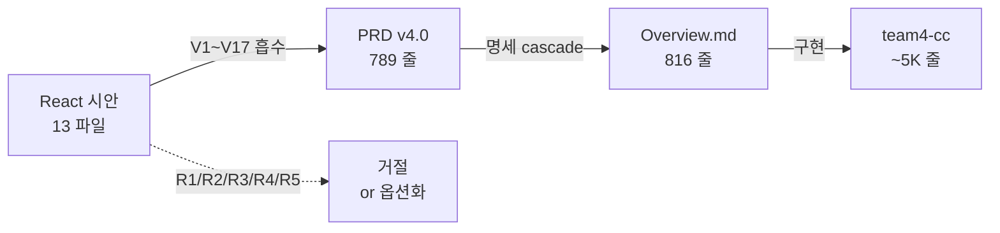

# NOTIFY-S10-W — CC PRD ↔ HTML Mockup ↔ team4-cc 3-way 정합 감사

## 요약 (한 줄)

> **PRD v4.0 은 React 시안을 흡수해 PRD ↔ 시안은 합의됐지만, team4-cc 구현이 PRD 의 핵심 시각 자산 4종 (Position Shift Arrows / Numpad / ACTING 명시 박스 / Hole Card Visibility 토글) 미구현 + 영역 높이/구조 drift 발생. PRD 보강 4건 + 구현 갭 9건 분리 권고.**

## 감사 범위 + 방법

| 소스 | 위치 | 크기 |
|------|------|:----:|
| **PRD** | `docs/1. Product/Command_Center.md` v4.0.0 (2026-05-07) | 789 줄 |
| **HTML Mockup** | `C:/claude/ebs/claude-design-archive/2026-05-06/cc-react-extracted/` | 13 파일 (App.jsx 567줄 + 12 시각/스타일 파일) |
| **정본 명세** | `docs/2. Development/2.4 Command Center/Command_Center_UI/Overview.md` | 816 줄 |
| **team4-cc 구현** | `team4-cc/src/lib/features/command_center/` | screens 7 + widgets 9 + providers 14 + services 5 |

> **PRD 경로 주의**: Cycle 10 PR #367 (`*_PRD.md → *.md` rename cascade) 이후 본 NOTIFY 는 `Command_Center.md` 경로 사용. 본문 v4.0 내용 (789 줄) 은 동일.

방법: 3 소스 1:1:1 항목 매핑 → PASS / DRIFT / GAP 분류. read-only audit (코드 변경 없음).



---

## 1. 정합 (PASS — 3 소스 일치) — 17 항목

| 항목 | PRD | Mockup | team4-cc | 상태 |
|------|:---:|:------:|:--------:|:----:|
| 1×10 가로 grid (Q1) | ✅ Ch.1.2 | ✅ App.jsx `.players-grid` | ✅ `at_01_main_screen:1010` 10 SeatCell Row | PASS |
| 4 영역 위계 (StatusBar/TopStrip/PlayerGrid/ActionPanel) | ✅ Ch.1.1 | ✅ `#app` grid-template-rows | ⚠ 일부 drift (M15-M18 참조) | PARTIAL |
| KeyboardHintBar (V1) | ✅ Ch.3.4 | ✅ `.kbd-hint` 6 칩 | ✅ `keyboard_hint_bar.dart` | PASS |
| 6 키 (N·F·C·B·A·M) | ✅ Ch.5.1 | ✅ App.jsx keyhandler | ✅ `keyboard_shortcut_handler.dart` | PASS |
| C/B 키 Phase-aware 자동 전환 | ✅ Ch.5.1 | ✅ App.jsx `ctx` 계산 | ✅ `action_button_provider.dart` | PASS |
| MiniDiagram (V3) + 펄스 | ✅ Ch.3.1 | ✅ `MiniDiagram.jsx` 120×120 SVG | ✅ `mini_table_diagram.dart` CustomPaint | PASS |
| MiniDiagram D/SB/BB 단일 source (R2) | ✅ R2 거절 | ✅ Mini read-only | ✅ R2 가드 코멘트 | PASS |
| Community Board 스트리트 라벨 (V8) | ✅ Ch.3.2 | ✅ `ts-slot-lbl` FLOP/TURN/RIVER | ✅ `at_01_main_screen:1174` streetLabels | PASS |
| ACTING glow + 펄스 (V6) | ✅ Ch.3.3, Ch.4.2 | ✅ `pcol.action-on` pulse | ✅ MiniTable pulse animation | PASS |
| Pre-hand DELETE strip (V15) | ✅ Ch.4.4 | ✅ `pcol-acting-strip.delete` | ✅ `_ActingStrip` preHand DELETE | PASS |
| ADD PLAYER affordance (V12) | ✅ Ch.4.3 | ✅ `.pcol.empty + ADD PLAYER` | ✅ seat_cell empty + ADD | PASS |
| Inline edit (이름/스택/벳) | ✅ Ch.4.1 | ✅ `FieldEditor.jsx` | ✅ `_editName/_editStack/_editBet` | PASS |
| HandFSM 9-state (R5) | ✅ Ch.6 / R5 거절 | ❌ 7-state (시안 결함) | ✅ HandFsm enum 9 | PASS (시안 거절) |
| Engine HTTP + BO WS 병행 dispatch (R4) | ✅ Ch.9 / R4 거절 | ❌ 100% local useState | ✅ `_dispatchAction` unawaited 병행 | PASS (시안 거절) |
| Layout 단일 (R1 거절) | ✅ Ch.14 R1 | ❌ layout-switcher 3종 | ✅ 단일 Bottom | PASS (시안 거절) |
| D7 hole card face-down (Production) | ✅ Ch.10 default OFF | ❌ CardPicker face-up | ✅ `_buildHoleCardBack` 값 노출 0 | PASS |
| Engine 연결 banner (3-stage) | ✅ Ch.3 banner | ✅ App.jsx topstrip banner | ✅ `EngineConnectionBanner` (오히려 깊이 우수) | PASS |

---

## 2. Mismatch (DRIFT / GAP) — 13 항목

> **분류 기준**: PRD ↔ Mockup ↔ team4-cc 3 점 중 **어느 둘이 다른지** + **누가 stale 한지**. A = PRD 보강 / B = 코드 보강.

| # | 항목 | PRD v4.0 | Mockup | team4-cc | 분류 | 우선순위 |
|:-:|------|----------|--------|----------|:----:|:--------:|
| **M1** | PlayerColumn 행 개수 | **9 행** (Ch.4.1) | **9 행** (PlayerColumn.jsx) | **10 행** (STRADDLE 분리) | A or B | MEDIUM |
| **M2** | Position Block 구조 (V4) | **3 sub-rows + ‹ › arrows** (Ch.4.5) | 3 sub-rows + ‹ › | **단일 POS 행, arrows 없음** | B (구현 갭) | **HIGH** |
| **M3** | ActionPanel DEAL 별도 버튼 | 없음 (§1.1.1 Matrix "DEAL 호출 skip") | 없음 | **DEAL 버튼 존재** | A or B | MEDIUM |
| **M5** | Numpad (V16) 0/000/← long-press | ✅ Ch.5.2 | ✅ `Numpad.jsx` 풀구현 | **❌ 미구현** | B (구현 갭) | **HIGH** |
| **M7** | Hole Card Visibility 토글 (V17) | ✅ Ch.10.4 4-단 방어 | ❌ 없음 (R3 거절) | **❌ 미구현** | B (구현 갭) — 사용자 결정 필요 | **HIGH** |
| **M8** | ACTING 우측 명시 박스 (V9) | ✅ Ch.3.3 "S8 · Choi" + "Stack" + phase | ✅ App.jsx `.ts-acting` 박스 | **❌ 없음** (`_DealerIndicator` 만 24×24) | B (구현 갭) | **HIGH** |
| **M9** | StatusBar 우측 아이콘 3종 (🏷/👁/⚙) | ✅ Ch.2.1 | ✅ `sb-icon-btn` 3종 | `_Toolbar` 4종 + CcStatusBar 우측 Players ratio only | B (통합 미완) | MEDIUM |
| **M11** | sync 아이콘 3 상태 (AUTO/MANUAL/CONFLICT) | ❌ PRD missing | ✅ data.js `sync` + Seat.jsx UI | ✅ state 있음, UI 없음 | A (PRD 보강) | MEDIUM |
| **M13** | seat LAST 행 의미 | "FOLD/CALL/BET 등 강제 override" (Ch.4.1) | bet/raise/call/check/fold/allin 6 옵션 | **activity enum** (folded/allIn/sittingOut) | A or B | MEDIUM |
| **M15** | TopStrip 높이 | **158px** (Ch.1.1) | **220px** (app.css) | **140px** (at_01_main_screen:1007) | A+B (3-way drift) | **HIGH** |
| **M16** | ActionPanel 높이 | **124px** | **124px** | **140px** | B (코드 drift) | MEDIUM |
| **M18** | _Toolbar + CcStatusBar 공존 (48+40=88px) | StatusBar 52px 단일 | StatusBar 52px 단일 | **공존, 4 영역 위계 위반** | B (통합 미완) | **HIGH** |
| **M12** | tokens.css Q2 톤 | Lobby B&W refined minimal (Ch.11) | oklch dark blue + 라임-옐로우 | EBS_Theme — Material ColorScheme | B (screenshot 검증) | LOW |

---

## 3. R-시리즈 (시안 거절/옵션 — 정합 확인)

| # | 시안 결함 | PRD 결정 | team4-cc 상태 | 평가 |
|:-:|----------|----------|--------------|:----:|
| R1 | Layout 스위처 3 버튼 | **거절** (Ch.14) | 단일 Bottom | ✅ |
| R2 | SB·BB 이중 표시 | **거절** — Mini = read-only | 분리 보장 | ✅ |
| R3 | Hole CardPicker face-up | **옵션화** (Ch.10 V17) | OFF 모드만, 토글 ❌ | ⚠ 옵션 미구현 (M7 와 연동) |
| R4 | game logic 로컬 | **거절** (Ch.14) | Engine HTTP + BO WS | ✅ |
| R5 | HandFSM 7-state | **거절** — 9-state | HandFsm enum 9 | ✅ |

---

## 4. 권고 변경 영역 — 정합 patch 제안

### A. PRD 보강 4건 (PRD 가 mockup/구현보다 stale)

| # | PRD 위치 | 변경 권고 | 근거 |
|:-:|---------|----------|------|
| **A1** | Ch.5.3 좌측 보조 버튼 | DEAL 버튼 *명시 제거* 또는 *명시 추가* 결정 | M3 — §1.1.1 Matrix "DEAL 호출 skip" 과 Ch.5.3 충돌 가능성 |
| **A2** | Ch.4.1 행 9 LAST action | "activity enum (folded/allIn/sittingOut)" vs "마지막 베팅 액션 override" 정의 명확화 | M13 |
| **A3** | Ch.1.1 4 영역 높이 표 | TopStrip 158px / ActionPanel 124px 사실 검증 (현 코드 140/140) | M15, M16 |
| **A4** | Ch.4.1 행 추가 (sync 아이콘) | Overview §5.1 의 3 상태 (AUTO_SYNC/MANUAL_OVERRIDE/CONFLICT) PRD 인계 | M11 |

### B. team4-cc 구현 갭 9건 (코드가 PRD/mockup 보다 stale)

| # | 위치 | 변경 권고 | PRD 근거 |
|:-:|------|----------|---------|
| **B1** | `widgets/seat_cell.dart::_buildOccupiedSeat` | Position **block** (3 sub-rows STRADDLE/SB·BB/D + 좌·우 ‹ › 화살표) 로 재구성. `position_shift_chip.dart` 통합 | Ch.4.5 V4 |
| **B2** | `widgets/numpad.dart` (신규) | Numpad — 0/000/← long-press 500ms + hardware keypad listener + Enter/Esc | Ch.5.2 V16 |
| **B3** | `widgets/acting_box.dart` (신규) | TopStrip 우측에 ActingBox — "S{n} · Name" + "Stack $...k" + phase 라벨 (IDLE/ACTING/SHOWDOWN/HAND OVER) | Ch.3.3 V9 |
| **B4** | `features/settings/` + `cc_config` enum | `cc_config.holeCardVisibility: PRODUCTION｜ADMIN｜DEBUG` + AT-06 토글 + 4-단 방어 (RBAC + 2-eyes + 60min timer + 부팅 banner + 상단 빨강 띠) | Ch.10.4 V17 |
| **B5** | `at_01_main_screen.dart::_Toolbar` | 폐기 (88px → 52px 단일화) — CcStatusBar 가 5 영역 모두 흡수 | Ch.1.1 |
| **B6** | `_ActionPanel` height | 140 → 124px | Ch.1.1 |
| **B7** | `_TopStrip` height | 140 → 158px | Ch.1.1 |
| **B8** | `_ActionPanel` DEAL 버튼 | A1 결정 따라 제거 또는 유지 | A1 + §1.1.1 |
| **B9** | `seat_cell` LAST 행 | A2 결정 따라 activity 표시 유지 또는 betting action override 확장 | A2 + Ch.4.1 |

### C. R-series (시안 거절) — 추가 작업 없음

R1/R2/R4/R5 모두 PRD 거절 + team4-cc 정합. R3 만 옵션화 → B4 와 연동.

---

## 5. 영향 범위 / cascade 매트릭스

| 변경 | 영향 PRD | 영향 정본 | 영향 코드 | scope owner |
|------|---------|----------|----------|:-----------:|
| A1~A4 (PRD 보강) | Command_Center.md | Overview.md (관련 §) | — | S3 (cc-stream) |
| B1 (PosBlock 3 sub-row) | — | Seat_Management.md §8 | seat_cell.dart + position_shift_chip.dart | S3 (team4-cc) |
| B2 (Numpad) | — | UI.md §V16 | widgets/numpad.dart 신규 | S3 (team4-cc) |
| B3 (ActingBox) | — | UI.md §V9 | widgets/acting_box.dart 신규 + _TopStrip 변경 | S3 (team4-cc) |
| **B4 (V17 옵션 토글)** | Command_Center.md Ch.10.4 | Settings.md §Rules + Game_Settings_Modal.md | cc_config + at_06_game_settings_modal.dart + RBAC | **S3 + S7 (BO endpoint)** |
| B5-B7 (영역 높이) | — | UI.md §3 | at_01_main_screen.dart | S3 (team4-cc) |
| B8-B9 (DEAL / LAST) | A1, A2 결정에 따라 | Action_Buttons.md | _ActionPanel | S3 |

> **B4 만 cross-stream cascade** (S7 BO `PUT /cc/:id/config` endpoint + 2-eyes 승인 endpoint 신규). 나머지 8 건은 S3 단독.

---

## 6. KPI 측정

| 지표 | 측정값 | 기대 |
|------|:------:|:----:|
| 3-way 검증 항목 (PRD vs Mockup vs team4-cc) | **30** | — |
| PASS (3 소스 일치) | **17** | — |
| Mismatch (DRIFT / GAP) | **13** | 0 (정합 후) |
| R-series 정합 (시안 거절) | **5 / 5** | 100% |
| PRD 보강 권고 (A) | **4** | — |
| 구현 갭 권고 (B) | **9** | — |
| Cross-stream cascade 발생 | **1** (B4 → S7) | — |

---

## 7. 후속 처리 (S10-W 와 협력)

1. **S10-W 가 본 NOTIFY 를 Spec_Gap_Triage 로 분류** — Type B (기획 공백 — A1~A4) + Type D (기획-구현 drift — B1~B9 일부)
2. **S3 가 본 cycle 내 B1~B7 구현 PR 생성 가능** (PRD 변경 없이 코드 정본 정합만으로 충분 — Overview.md 가 derivative-of takes precedence SSOT)
3. **B4 (V17 옵션 토글)** 는 **사용자 결정 필요** — Ch.10.4 의 4-단 방어 구현 우선순위 / 시점 / scope (60min timer Auto OFF, 부팅 banner 등) 결정
4. **A1~A4 PRD 보강은 S10-W 가 cascade** — `derivative-of: ../2. Development/2.4 Command Center/Command_Center_UI/Overview.md` 룰에 따라 Overview.md 가 정본. Overview.md 가 stale 한지 사전 검증 필요

## 8. broker MCP cascade

본 NOTIFY 생성 시 `cascade:cc-prd-mismatch-audit` 이벤트 발행 — S10-W subscribe → Spec_Gap_Registry 등재 → 후속 cycle 의 도메인 owner merge handoff.

---

## Appendix A — Mockup 13 파일 인벤토리

| 파일 | 줄 | 역할 |
|------|:--:|------|
| `App.jsx` | 567 | Main app + StatusBar + TopStrip + PlayerGrid + ActionPanel + state |
| `PlayerColumn.jsx` | 161 | 9 행 stacked seat (Acting/Seat/PosBlock 3sub/Country/Name/HoleCards/Stack/Bet/LastAction) |
| `MiniDiagram.jsx` | 106 | 120×120 SVG oval + 10 dots + D/SB/BB badges + ACTING pulse |
| `FieldEditor.jsx` | 495 | name/stack/bet/pos/lastAction/occupy/addPlayer/flag/seatNo modal |
| `Numpad.jsx` | 90 | BET/RAISE 슬라이드 업 + 0/000/← long-press + hardware keypad |
| `CardPicker.jsx` | 92 | 52 카드 4×13 그리드 (시안: board + hole 모두 face-up) |
| `MissDealModal.jsx` | 39 | M 키 → 확인 모달 |
| `Seat.jsx` | 90 | (legacy oval 시안 — 시각 reference) |
| `tweaks-panel.jsx` | 426 | debug 모드 hue/옵션 조절 + 5 control 헬퍼 |
| `data.js` | 74 | INITIAL_STATE 10 좌석 demo + SEAT_POSITIONS + cardImagePath |
| `tokens.css` | 87 | oklch 디자인 토큰 (다크 broadcast) |
| `app.css` | 1689 | 전체 layout + 9 영역 styled |
| `EBS Command Center.html` | (shell) | React 18 + Babel runtime entry |

## Appendix B — team4-cc 구현 인벤토리

| 파일 | 줄 | 매핑 |
|------|:--:|------|
| `screens/at_01_main_screen.dart` | 1399 | StatusBar (Toolbar+CcStatusBar) / TopStrip / SeatArea / ActionPanel |
| `widgets/seat_cell.dart` | 1029 | PlayerColumn 등가 (10 행, **PosBlock 3 sub-row 미구현**) |
| `widgets/mini_table_diagram.dart` | 267 | MiniDiagram 등가 (CustomPaint, R2 보강) |
| `widgets/cc_status_bar.dart` | 485 | StatusBar 등가 (40px, V2+V10) |
| `widgets/keyboard_hint_bar.dart` | 169 | KeyboardHintBar (V1) |
| `widgets/position_shift_chip.dart` | 222 | V4 chip (**SeatCell 통합 안 됨**) |
| `widgets/action_panel.dart` | 605 | 별도 ActionPanel 위젯 (at_01_main_screen `_ActionPanel` 과 별개 — 정합 확인 필요) |
| `widgets/engine_connection_banner.dart` | — | Engine banner (3-stage) |
| `widgets/numpad.dart` | **❌ 부재** | V16 미구현 |
| `widgets/acting_box.dart` | **❌ 부재** | V9 미구현 |
| `features/settings/cc_config_holecards.dart` | **❌ 부재** | V17 미구현 |

## Appendix C — 재검증 명령

```bash
# 3-way 정합 재측정 — main 기준
cd C:/claude/ebs
python tools/doc_discovery.py --impact-of "docs/1. Product/Command_Center.md"
python tools/doc_discovery.py --impact-of "docs/2. Development/2.4 Command Center/Command_Center_UI/Overview.md"

# team4-cc 빌드 검증
cd team4-cc/src && dart analyze .

# screenshot regression (선택)
flutter test integration_test/cc_full_layout_test.dart
```

---

## 변경 이력

| 날짜 | 작성자 | 변경 |
|------|--------|------|
| 2026-05-12 | S3 (cc-stream, Cycle 8 cc v04) | 최초 작성 — 30 항목 3-way 매트릭스 + 17 PASS + 13 mismatch + 4 PRD 보강 + 9 구현 갭 |
