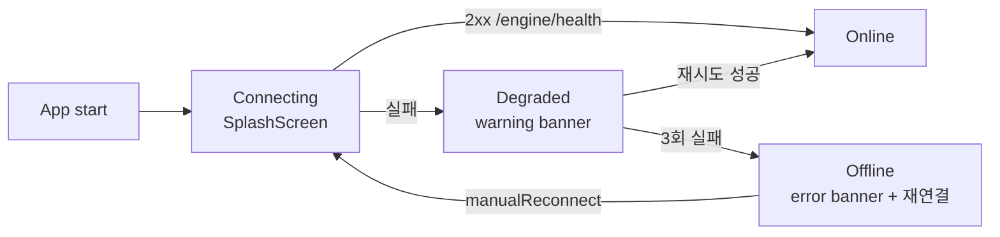

# Engine Dependency Contract

## 개요

team4 Command Center / Overlay 앱은 team3 Game Engine harness (`http://localhost:8080`) 에 의존한다. 본 문서는 ENGINE_URL · timeout · graceful 대기 · fallback 네 가지 계약을 명시한다.

결정 원본: [`docs/4. Operations/Conductor_Backlog/SG-002-engine-dependency-contract.md`](../../../../4.%20Operations/Conductor_Backlog/SG-002-engine-dependency-contract.md)

## Edit History

| Date | Author | Summary |
|------|--------|---------|
| 2026-04-20 | team4 | SG-002 resolved — banner + router guard + splash 구현 매핑 |

---

## 1. ENGINE_URL 환경변수

| 방법 | 문법 | 우선순위 |
|------|------|:--------:|
| `--dart-define=ENGINE_URL=<url>` | Flutter build/run CLI flag | **1 (권장)** |
| `launch_config.engineUrl` (BO 가 WS push) | JSON field | 2 (보조) |
| 기본값 | `http://localhost:8080` | 3 (fallback) |

```dart
const kEngineUrl = String.fromEnvironment(
  'ENGINE_URL',
  defaultValue: 'http://localhost:8080',
);
```

**Why**: team1 이 `EBS_BO_HOST` dart-define 을 이미 채택. 동일 패턴이 개발자 혼란 최소화.

## 2. Timeout 정책

| 단계 | 값 | 근거 |
|------|----:|------|
| `connectTimeout` | 5s | Docker compose 초기 기동 고려 |
| `sendTimeout` | 3s | 100ms 실시간성 유지 |
| `receiveTimeout` | 3s | 동상 |
| 재시도 backoff | 1s → 2s → 4s (총 3회) | exponential |

구현: `src/lib/features/command_center/providers/engine_connection_provider.dart` (`_maxAttempts = 3`, `_retryDelays`).

## 3. Graceful 대기 — 3-stage 상태 머신



| Stage | UI | Demo Mode |
|:-----:|----|:---------:|
| Connecting | `SplashScreen` ("엔진 연결 중...") | OFF |
| Degraded | `EngineConnectionBanner` (orange, 경고) | **자동 ON** |
| Offline | `EngineConnectionBanner` (red, "ENGINE_URL 확인 필요" + 재연결 버튼) | **유지** |
| Online | 배너 숨김 | OFF |

## 4. Fallback — StubEngine

> **2026-04-21 용어 정정**: 본 섹션의 구 제목은 "Demo Mode" 였으나 이는 `Command_Center_UI/Standalone_Mode.md` (Lobby 우회 실행) 와 혼동되어 "StubEngine Fallback" 으로 환원한다. Mode 개념이 아닌 Engine 상태머신의 Degraded/Offline stage 에서 활성화되는 fallback 메커니즘이다.

- Degraded / Offline 상태에서 `shouldUseStub == true` → `StubEngine` (`src/lib/features/command_center/services/stub_engine.dart`) 가 OutputEvent 를 모방
- Overlay consumer 는 stub 이벤트를 받아 basic 게임 진행을 렌더
- 엔진 복구 시 **현재 hand 종료 후에만** 자동 전환 (돌발 상태 변경 방지)

**Standalone Mode 와의 관계**: Standalone (`Standalone_Mode.md`) 도 Engine 미연결 시 동일 StubEngine 을 재사용한다. 즉 StubEngine 은 2 개 상위 개념 (Engine-Fallback 상태머신, Standalone Mode) 의 공통 dependency.

## 5. 구현 매핑

| 책임 | 파일 | 심볼 |
|------|------|------|
| 상태 머신 | `team4-cc/src/lib/features/command_center/providers/engine_connection_provider.dart` | `EngineConnectionController`, `EngineConnectionStage` |
| 헬스 프로브 | 동상 | `_probeHealth()` (GET `/engine/health`, fallback GET `/`) |
| 배너 위젯 | `team4-cc/src/lib/features/command_center/widgets/engine_connection_banner.dart` | `EngineConnectionBanner` |
| Splash | `team4-cc/src/lib/features/splash/splash_screen.dart` | `SplashScreen` |
| Router redirect | `team4-cc/src/lib/routing/app_router.dart` | `AppRoutes.splash`, `_RouterNotifier` |
| Stub engine | `team4-cc/src/lib/features/command_center/services/stub_engine.dart` | `StubEngine` |

## 6. 수락 기준

- [x] `--dart-define=ENGINE_URL=...` CLI flag 동작
- [x] engine 미기동 상태 `flutter run -d windows` → splash → (5s 내) Degraded → Offline 전환
- [x] Offline 배너 "재연결" 버튼이 `manualReconnect()` 호출
- [x] Banner 가 Online/Connecting 에서 zero-height (`SizedBox.shrink`)
- [ ] engine 복구 후 다음 hand 시작 시 실제 OutputEvent 수신 전환 (stub → live 전환 로직은 후속 Backlog 항목)

## 7. 참조

- SG-002 결정 문서: `docs/4. Operations/Conductor_Backlog/SG-002-engine-dependency-contract.md`
- Foundation Ch.7 (시스템 연결): `docs/1. Product/Foundation.md`
- API-04 Overlay Output Events: `../../2.3 Game Engine/APIs/Overlay_Output_Events.md`
