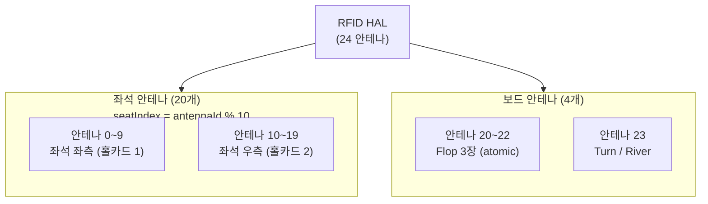

# BS-04-02 Card Detection — 게임 진행 중 카드 감지

| 날짜 | 항목 | 내용 |
|------|------|------|
| 2026-04-08 | 신규 작성 | 홀카드/보드 카드 감지, 카드 제거, 감지 실패 시나리오, 경우의 수 매트릭스 |
| 2026-04-29 | §3.3 atomic 정렬 (CF-002+003) | Triggers_and_Event_Pipeline.md §1.4/§3.5 T9/§4.10 권위에 정렬. 1~2장 부분 감지 = PENDING (외부 미발행), CC-only FlopPartialAlert. 4번째 카드 = AWAITING_TURN 컨텍스트별 분기 |
| 2026-04-29 | §1.1 안테나 시각화 (CF-005) | 24 안테나 물리 배치 Mermaid 다이어그램 추가 (좌석 20 + 보드 4) |

---

## 개요

이 문서는 **게임 진행 중 카드가 감지/제거되는 모든 경우의 수**를 정의한다. RFID 안테나가 카드를 인식하면 `CardDetected` 이벤트가 발행되고, Game Engine이 해당 카드를 게임 상태에 반영한다.

> **참조**: 트리거 경계는 `BS-06-00-triggers.md §3`, DeckFSM 상태는 `BS-04-01-deck-registration.md`, 수동 입력은 `BS-04-03-manual-fallback.md`

---

## 정의

| 용어 | 설명 |
|------|------|
| **홀카드** | 플레이어에게 비공개로 배분되는 카드 (Hold'em: 2장/인) |
| **보드 카드** | 테이블 중앙에 공개되는 공용 카드 (Flop 3장 + Turn 1장 + River 1장) |
| **안테나** | RFID 신호를 수신하는 물리 장치. 좌석별 2개 + 보드 4개 |
| **confidence** | RFID 인식 신뢰도 (0.0~1.0). Mock은 항상 1.0 |

---

## 전제조건

- DeckFSM 상태: REGISTERED 또는 MOCK (미등록 덱으로 카드 감지 불가)
- HandFSM 상태: SETUP_HAND 이후 (IDLE에서는 카드 감지 무시)
- RFID HAL: 초기화 완료 (status = `ready`)

---

## 1. 안테나 배치

### 1.1 안테나 ID 규약

| 안테나 ID | 위치 | 용도 |
|:---------:|------|------|
| 0~9 | Seat 0~9 좌측 | 홀카드 1번 |
| 10~19 | Seat 0~9 우측 | 홀카드 2번 |
| 20~22 | Board 좌/중/우 | Flop 카드 3장 |
| 23 | Board 추가 | Turn / River 카드 |

> **참조**: API-03 §5.1 — 테이블당 최대 24개 안테나. Flop 의 atomic 보장은 §3.3 + Triggers §1.4 / §3.5 T6.

### 1.2 좌석 안테나 → 플레이어 매핑

안테나 ID에서 좌석 번호를 도출한다:
- 안테나 0~9 → Seat 0~9 (홀카드 1)
- 안테나 10~19 → Seat 0~9 (홀카드 2)
- 즉, `seatIndex = antennaId % 10`

---

## 2. 홀카드 감지

### 2.1 Real 모드 흐름

1. 딜러가 카드를 플레이어 좌석 위에 놓음
2. 좌석 안테나가 카드 RFID 태그를 감지
3. `CardDetected(antennaId, cardUid, suit, rank, confidence)` 이벤트 발행
4. CC가 이벤트 수신 → 해당 좌석 플레이어의 홀카드로 기록
5. Game Engine이 홀카드 배분 상태 업데이트
6. 모든 플레이어 홀카드 배분 완료 시 `HoleCardsDealt` → PRE_FLOP 전이

### 2.2 Mock 모드 흐름

1. 운영자가 CC에서 플레이어 좌석 선택 → 카드 선택 UI에서 카드 지정
2. `MockRfidReader.injectCard(suit, rank, antennaId)` 호출
3. `CardDetected` 이벤트 합성 (confidence=1.0, uid="MOCK-{suit}{rank}")
4. 이후 흐름은 Real 모드와 동일

### 2.3 홀카드 감지 규칙

| 규칙 | 설명 |
|------|------|
| 좌석당 최대 2장 | Hold'em 기준. 3장 이상 감지 시 경고 + 무시 |
| 빈 좌석 무시 | SeatFSM = VACANT인 좌석의 안테나 이벤트 무시 |
| 순서 자유 | Seat 0부터 순서대로 감지할 필요 없음 |
| 중복 감지 무시 | 같은 좌석에 같은 카드 2회 감지 시 두 번째 무시 |

---

## 3. 보드 카드 감지

### 3.1 Street별 감지 규칙

| Street | 감지 카드 수 | 안테나 | HandFSM 조건 |
|--------|:----------:|--------|-------------|
| **Flop** | 3장 | 안테나 20~22 | BettingRoundComplete (PRE_FLOP 종료) |
| **Turn** | 1장 | 안테나 23 | BettingRoundComplete (FLOP 종료) |
| **River** | 1장 | 안테나 23 | BettingRoundComplete (TURN 종료) |

### 3.2 Real 모드 흐름

1. 딜러가 보드 카드를 테이블 중앙에 놓음
2. 보드 안테나가 카드 감지 → `CardDetected` × N장
3. CC가 이벤트 수신 → 보드 카드로 기록
4. Game Engine이 보드 카드 배치 확인
5. 필요한 장수만큼 감지 완료 시 해당 Street 베팅 라운드 시작

### 3.3 Flop 3장 atomic 감지

Flop 은 3장이 동시에 **atomic** 으로 발행된다. 부분 감지(1~2장)는 외부에 발행되지 않으며(`BoardState=FLOP_PARTIAL` PENDING), 정확히 3장 충족 시점에만 1회 `FlopRevealed(c1,c2,c3)` 가 발행된다.

> **권위**: `../../2.3 Game Engine/Behavioral_Specs/Triggers_and_Event_Pipeline.md` §1.4 (카드 파이프라인) · §3.5 T6/T7/T9 (트리거 매트릭스) · §4.10 (Atomic Flop 예외 처리). 본 문서는 그 권위에 정렬한다.

| 상황 | 시스템 반응 | BoardState | OutputEvent |
|------|------------|-----------|-------------|
| 3장 모두 감지 | atomic flush — Flop 보드 구성 완료 | `FLOP_PARTIAL → FLOP_READY → FLOP_DONE` | `FlopRevealed(c1,c2,c3)` (T6, atomic) |
| 1~2장 부분 감지 | **외부 미발행 (PENDING)**. 30s timeout 후 CC-only 경고 표시 | `FLOP_PARTIAL` | (none) → 30s 후 `FlopPartialAlert(count, missing)` (T9, CC only) |
| 3장 후 4번째 카드 (`AWAITING_TURN` 진입 후) | 정상 — Turn 카드로 수용 | `AWAITING_TURN → TURN_DONE` | `TurnRevealed(c4)` (T7) |
| 3장 후 4번째 카드 (`AWAITING_TURN` 미진입, FLOP betting 미완료) | reject (Triggers §4.10) | 변화 없음 | (none, 경고 로그) |

**핵심 보장**:
- 1~2장 부분 감지 시 Overlay 에 보드 카드가 표시되지 **않는다** (atomic flop guarantee).
- timeout 시 발행되는 `FlopPartialAlert` 는 **CC 운영자 only** 이며 Overlay 출력 채널에는 흐르지 않는다.
- 운영자 폴백: ① 수동 카드 입력(`Manual_Fallback.md` §5.7, AT-03 Card Selector) → buffer.push() 로 3장 충족 → `FlopRevealed` 발행, ② RFID 재배치 시도, ③ 미스딜 선언(`MisdealDetected` → IDLE 복귀).

### 3.4 Mock 모드

운영자가 CC 카드 선택 UI에서 보드 카드를 직접 지정한다. Flop 시 3장, Turn/River 시 1장씩 선택.

---

## 4. 카드 제거 감지

### 4.1 핵심 원칙

> **"카드 제거는 정보이지 액션이 아니다."** — BS-06-00-triggers §3.2

카드가 안테나에서 제거되면 `CardRemoved` 이벤트가 발행되지만, **자동 폴드나 게임 상태 변경은 일어나지 않는다.** 폴드는 반드시 운영자가 CC에서 FOLD 버튼을 눌러야 한다.

### 4.2 CardRemoved 이벤트 처리

| 시나리오 | 시스템 반응 |
|---------|-----------|
| 홀카드 제거 (폴드 의도) | `CardRemoved` 로그 기록, 운영자 FOLD 버튼 대기. **자동 폴드 안 함** |
| 홀카드 제거 (실수) | `CardRemoved` 로그 기록, 게임 상태 변경 없음 |
| 보드 카드 제거 | `CardRemoved` 로그 기록, 보드 상태 변경 없음 |
| FOLD 후 카드 제거 | `CardRemoved` 이벤트 무시 (이미 폴드됨) |

### 4.3 Mock 모드

Mock HAL에서 `CardRemoved`는 기본적으로 미지원이다. 테스트 필요 시 `injectRemoval()` API로 이벤트를 수동 주입할 수 있다.

---

## 5. 감지 실패 시나리오

| 시나리오 | 원인 | 시스템 반응 | 운영자 대응 |
|---------|------|-----------|-----------|
| **미인식** | 안테나 거리 초과, 카드 각도 불량 | 타임아웃 후 경고: "카드 미감지" | 카드 재배치 또는 수동 입력 |
| **중복 감지** | 같은 UID 2회 수신 | 두 번째 이벤트 무시 + `DUPLICATE_CARD` 경고 로그 | 조치 불필요 |
| **UID 불일치** | 미등록 덱의 카드 사용 | `ReaderError(unknownCard)` | 등록된 덱으로 교체 |
| **다른 좌석 감지** | 인접 좌석 안테나가 옆 카드를 읽음 | confidence 낮은 이벤트 무시 (threshold 이하) | 카드 위치 조정 |
| **안테나 장애** | 특정 안테나 연결 해제 | `AntennaStatusChanged(disconnected)` | 해당 좌석 수동 입력 전환 |
| **신호 약함** | 카드 태그 열화 | `ReaderError(readError)`, confidence 낮음 | 카드 교체 또는 수동 입력 |

---

## 6. CC vs RFID 동시 발생

> 참조: BS-06-00-triggers §3.1

| 시나리오 | RFID | CC | 우선순위 | 시스템 반응 |
|---------|:----:|:--:|---------|-----------|
| Feature Table, Real, 정상 | `CardDetected` | — | RFID | RFID 카드 사용 |
| Feature Table, Real, RFID 실패 | 실패 | `ManualCardInput` | CC 폴백 | 수동 입력 카드 사용 |
| Feature Table, Mock | — | `ManualCardInput` | CC 유일 | 수동 입력 → `CardDetected` 합성 |
| General Table | — | `ManualCardInput` | CC 유일 | 수동 입력만 가능 |
| Real + 수동 동시 (같은 카드) | `CardDetected` | `ManualCardInput` | RFID | RFID 결과 사용, 수동 무시 |
| Real + 수동 동시 (다른 카드) | `CardDetected` | `ManualCardInput` | RFID | RFID 카드 사용 + `CARD_CONFLICT` 경고 |

---

## 7. 유저 스토리

| ID | 역할 | 스토리 | 수락 기준 |
|----|------|--------|----------|
| US-D01 | 운영자 | 딜러가 카드를 놓으면 자동으로 홀카드가 인식된다 | CardDetected → 좌석별 홀카드 표시 |
| US-D02 | 운영자 | Flop 3장이 동시에 감지되어 보드에 표시된다 | 3장 CardDetected → 보드 Flop 구성 |
| US-D03 | 운영자 | 1장 미인식 시 경고를 보고 수동으로 입력한다 | 경고 표시 + 수동 입력 UI 활성화 |
| US-D04 | 운영자 | 카드가 제거되어도 게임이 중단되지 않는다 | CardRemoved → 로그만, 상태 변경 없음 |
| US-D05 | 운영자 | Mock 모드에서 카드를 직접 선택하여 지정한다 | 카드 선택 UI → injectCard → CardDetected 합성 |
| US-D06 | 운영자 | RFID와 수동 입력이 충돌하면 RFID가 우선된다 | RFID 카드 사용 + 경고 로그 |
| US-D07 | 운영자 | 중복 카드 감지 시 경고를 확인한다 | DUPLICATE_CARD 경고 표시 |
| US-D08 | 운영자 | 미등록 카드가 감지되면 에러를 확인한다 | unknownCard 에러 + 운영자 안내 |
| US-D09 | 시청자 | 카드가 감지되면 Overlay에 실시간으로 표시된다 | CardDetected → Equity 계산 → Overlay 반영 |
| US-D10 | Admin | Lobby에서 각 테이블의 카드 감지 상태를 모니터링한다 | RFID 상태 + 감지된 카드 수 표시 |

---

## 8. 경우의 수 매트릭스

### 8.1 모드 × 안테나 위치 × 감지 결과 × 시스템 반응

| 모드 | 안테나 위치 | 감지 결과 | 시스템 반응 |
|------|-----------|----------|-----------|
| **Real** | 좌석 (홀카드) | 성공 | CardDetected → 홀카드 기록 → Equity 계산 |
| **Real** | 좌석 (홀카드) | 실패 (미인식) | 타임아웃 경고 → 수동 입력 유도 |
| **Real** | 좌석 (홀카드) | 중복 (같은 카드 재감지) | 두 번째 이벤트 무시, DUPLICATE_CARD 로그 |
| **Real** | 센터 (보드) | 성공 — Flop 3장 | 3장 CardDetected → Flop 보드 구성 |
| **Real** | 센터 (보드) | 성공 — Turn 1장 | CardDetected → Turn 보드 추가 |
| **Real** | 센터 (보드) | 성공 — River 1장 | CardDetected → River 보드 추가 |
| **Real** | 센터 (보드) | 실패 — Flop 2장만 감지 | 경고 + 운영자 수동 입력 1장 |
| **Real** | 센터 (보드) | 중복 (이미 사용된 카드) | CardDetected 거부, DUPLICATE_CARD 에러 |
| **Real** | 임의 | UID 불일치 (미등록) | unknownCard 에러, 등록 덱 확인 유도 |
| **Mock** | 좌석 (홀카드) | 성공 (수동 입력) | injectCard → CardDetected 합성 → 홀카드 기록 |
| **Mock** | 센터 (보드) | 성공 (수동 입력) | injectCard → CardDetected 합성 → 보드 기록 |
| **Mock** | 임의 | 중복 (이미 선택된 카드) | UI에서 해당 카드 비활성화, 선택 차단 |
| **Mock** | 임의 | 에러 주입 테스트 | injectError → ReaderError 합성 |

---

## 비활성 조건

- HandFSM = IDLE 또는 HAND_COMPLETE일 때 카드 감지 이벤트 무시
- DeckFSM ≠ REGISTERED/MOCK일 때 카드 감지 차단
- SeatFSM = VACANT인 좌석의 홀카드 감지 무시
- 해당 Street에서 필요한 카드 수를 초과하는 감지 이벤트 무시

---

## 영향 받는 요소

| 영향 대상 | 이 문서와의 관계 |
|----------|----------------|
| `BS-04-01-deck-registration.md` | 등록된 덱 기반으로 카드 인식 |
| `BS-04-03-manual-fallback.md` | RFID 실패 시 수동 입력 전환 |
| `BS-06-00-triggers.md §3` | CC vs RFID 경계 케이스 |
| `BS-06-01-holdem-lifecycle.md` | HandFSM 상태 전이와 카드 감지 시점 |
| `BS-07-overlay/` | CardDetected → Overlay 카드 표시 |
