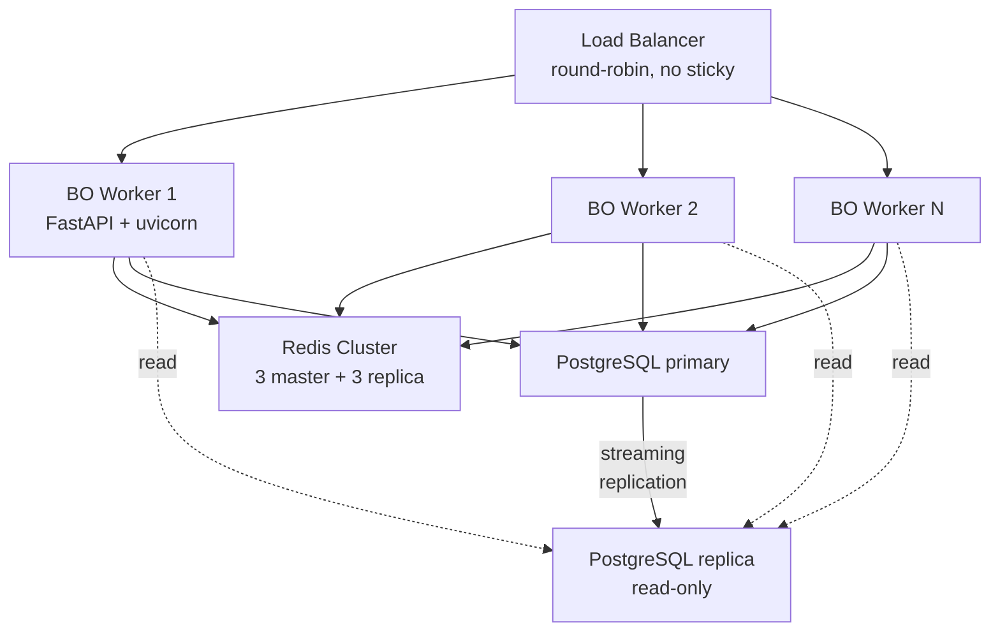
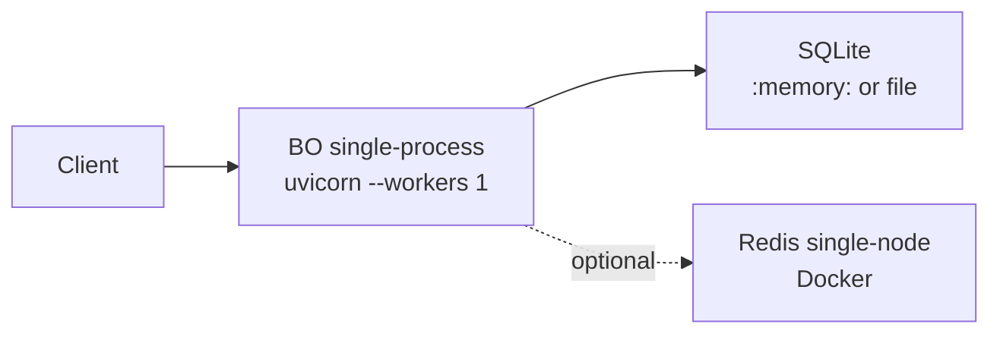
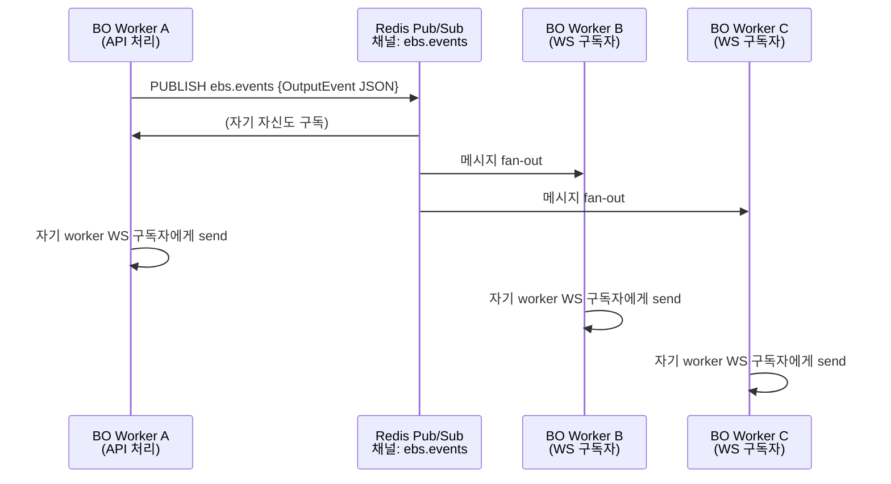

# Distributed Authentication Architecture (M2)

## 개요

본 문서는 **multi-instance EBS BO** (FastAPI worker N개) + **Redis Cluster** + **PostgreSQL primary/replica** 환경에서 인증·세션 도메인이 어떻게 동작해야 하는지 정의한다. BS-01 Authentication.md 가 정책 SSOT 라면, 본 문서는 **운영 토폴로지 SSOT**.

> **누가 이 문서를 읽어야 하는가**
> - SRE / DevOps: 배포 토폴로지 + Failover 시나리오
> - Backend 개발자: 분산 락 결정 매트릭스 + WebSocket fan-out 패턴
> - 신규 입사자: M5 Quickstart_Local_Cluster.md 와 짝으로 읽으면 30분 내 로컬 클러스터 + 운영 모델 동시 이해

## 1. 인스턴스 토폴로지

### 1.1 production 토폴로지 (목표 상태)



**핵심 의사결정**:
- **JWT stateless** → LB sticky session **불필요** (round-robin OK)
- Redis Cluster (3M+3R) — blacklist · rate limit · OAuth client_credentials 캐시 공유
- PostgreSQL primary 단일 write → 모든 인증 mutation (login/refresh/logout) 은 primary 직행
- Read replica → /auth/me 같은 read-only 만 (단, refresh race 방지를 위해 SELECT FOR UPDATE 는 primary 강제)

### 1.2 dev/test 토폴로지



- in-memory blacklist backend 기본 (Redis 없이도 동작)
- SQLite — 단일 인스턴스에서 race 자연 제거 (file lock)

### 1.3 staging 토폴로지

production 의 축소판 — BO 2 worker + Redis 3노드 (cluster mode 아닌 sentinel) + PostgreSQL single. 본 문서의 production 패턴을 정확히 재현하되 비용 절감.

---

## 2. 세션 데이터 분포 (Authority Map)

| 데이터 | Authority | 분포 메커니즘 | 위반 시 영향 |
|--------|-----------|--------------|-------------|
| **users.is_active / role / password_hash** | PostgreSQL primary | streaming replication → replica (~ms 지연) | replica lag 에서 권한 판정 stale 가능 — 보수적으로 primary 강제 |
| **users.failed_login_count / locked_until** | PostgreSQL primary | mutation 만 primary | 동시 실패 카운트 race — `UPDATE ... SET failed_login_count = failed_login_count + 1` 원자적 |
| **user_sessions(user_id, device_id) row** | PostgreSQL primary | mutation 만 primary | 동일 device 동시 로그인 시 UNIQUE 충돌 → app-level catch + UPSERT |
| **JWT access/refresh token (in-flight)** | client (cookie or LocalStorage) | request header 로 매 호출 전달 | client 분실 = 세션 분실. 24h~12h 후 자연 만료 |
| **blacklist:jti:{jti}** | Redis Cluster | SETEX with TTL = 잔여 access 수명 | propagation 지연 < 1ms (Redis local), but Redis 다운 시 fail-open (default) — `is_revoked()` returns False |
| **rate_limit:{user/ip}:{category}** | Redis Cluster | INCR + EXPIRE atomic | per-worker 격리되면 한도 N배 부풀려짐 — 반드시 Redis |
| **oauth_token_cache:wsop_live** | Redis Cluster | SET with TTL = expires_in - 30s | per-worker 격리 시 N배 vendor API 호출 — 반드시 Redis |
| **2fa_temp_token (5분)** | client (response body) | JWT 자체 expiration | server side state 없음 — 안전 |
| **password_reset_token (1h)** | client (email link) | JWT 자체 expiration | revoke 못함 (1회용 nonce 미구현, future work) |

> **권위(authority) 의 의미**: 동일 데이터에 대한 진실은 단 한 곳. 다른 노드의 캐시/replica 는 권위에서 derive. 권위 노드 fail 시 fall-back 정책은 §6 Failover 참조.

---

## 3. 분산 락 정책 (Decision Matrix)

| 시나리오 | 락 메커니즘 | 이유 |
|---------|-----------|------|
| **Refresh Token rotation race** (PR 4 미해소, M8 reserved) | PostgreSQL row lock — `SELECT ... FOR UPDATE` | refresh 가 rotation 도입 시 active. 본 EBS 는 현재 rotation 미구현 → race 미발생 |
| **Failed login counter increment** | atomic SQL (`UPDATE ... SET cnt = cnt + 1`) | 락 없이 RDBMS 원자성으로 충분. PostgreSQL `READ COMMITTED` isolation OK |
| **OAuth client_credentials 캐시 발급 race** | Redis SETNX (Redlock 단순화) | 만료 직전 N worker 가 동시 vendor API 호출 → 1개만 fetch. 나머지는 SETNX 실패 후 cached value 재조회 |
| **WebSocket session 등록 (테이블 점유)** | Redis SETNX with TTL | 두 CC 가 동일 table 동시 진입 — 첫 SETNX 만 성공 |
| **DB schema migration (alembic upgrade)** | Alembic 자체 advisory lock (`PostgreSQL pg_advisory_lock`) | 다중 worker 가 동시 startup 시 migration race 방지 |
| **JWT blacklist add (jti)** | **락 불필요** — Redis SET 자체 atomic, 동일 jti 중복 add 무해 | idempotent operation |
| **Permanent lock 설정 (10회 실패 → sentinel)** | **락 불필요** — UPDATE 1행 atomic | 동시 실패도 last-write-wins, 결과 동일 (sentinel 값 동일) |

### 3.1 PG row lock (`SELECT FOR UPDATE`) 사용 가이드

```python
# 예: Refresh rotation race 해소 (M8 시점에 활성화)
async with db.transaction():
    row = await db.execute(
        text("SELECT * FROM user_sessions WHERE refresh_token = :rt FOR UPDATE"),
        {"rt": refresh_token}
    ).fetchone()
    if not row:
        raise InvalidRefreshError()
    # 이 트랜잭션 끝날 때까지 다른 worker 의 동일 row SELECT FOR UPDATE 차단
    new_pair = issue_pair(row.user_id, row.device_id)
    await db.execute(
        text("UPDATE user_sessions SET refresh_token = :new WHERE id = :id"),
        {"new": new_pair.refresh, "id": row.id}
    )
```

**주의**: `FOR UPDATE` 는 PostgreSQL primary 만 의미 있음. read replica 에서 호출 시 ERROR 또는 무시. SQLAlchemy/SQLModel 의 read/write split 라우팅 시 명시적으로 primary 연결.

### 3.2 Redis SETNX (Redlock 경량형) 패턴

```python
# 예: OAuth client_credentials 캐시 갱신 race 회피
import time

LOCK_KEY = "lock:oauth:wsop_live:refresh"
LOCK_VALUE = f"{worker_id}:{time.time()}"
LOCK_TTL = 30  # seconds

if redis.set(LOCK_KEY, LOCK_VALUE, nx=True, ex=LOCK_TTL):
    try:
        new_token = await fetch_from_vendor()
        redis.setex(f"oauth:wsop_live:token", new_token.expires_in - 30, new_token.value)
    finally:
        # CAS unlock — 다른 worker 가 만료 후 잡았을 때 실수로 unlock 방지
        if redis.get(LOCK_KEY) == LOCK_VALUE:
            redis.delete(LOCK_KEY)
else:
    # Lock 못 잡음 → 다른 worker 가 처리 중. 잠시 대기 후 cache 재조회
    await asyncio.sleep(0.1)
    return redis.get("oauth:wsop_live:token")
```

> 정식 Redlock 알고리즘 (다중 master quorum) 은 이 단순 패턴보다 강력하지만 OAuth 캐시 갱신처럼 잠깐 stale 해도 무해한 경우 SETNX 로 충분. Refresh token rotation 같은 안전 임계 작업은 PG row lock 우선.

---

## 4. 토큰 Blacklist Propagation

### 4.1 구현 현황 (M1 Item 2 — PR #42 merged)

- `src/security/blacklist.py` (신규) — `_InMemoryBlacklist` (default) + `_RedisBlacklist` (Phase 2+ skeleton)
- `src/middleware/rbac.py` — `get_current_user` 가 decode 후 `is_revoked(jti)` 검증 → 401 `AUTH_TOKEN_REVOKED`
- `src/routers/auth.py` `POST /auth/logout` — 본 access token 의 jti + 잔여 TTL 로 `add_to_blacklist()`
- JWT (access + refresh) 에 `jti = uuid.uuid4().hex` 클레임 추가

### 4.2 Production 활성화 절차 (M5 / M8)

```python
# src/main.py startup event 에 추가 (M5 시점)
import redis.asyncio as redis
from src.security.blacklist import configure_redis_backend

@app.on_event("startup")
async def init_blacklist():
    if settings.redis_url:
        client = redis.from_url(settings.redis_url, decode_responses=True)
        configure_redis_backend(client)
```

**전환 시 주의**:
1. in-memory backend → Redis backend 전환 시 기존 in-memory blacklist 항목은 **유실** (낮은 위험: TTL 짧음)
2. Redis 다운 시 fail-open (검증 통과) — 보안 vs 가용성 trade-off. fail-closed 옵션은 M8 결정
3. 모든 worker 동시 reload 권장 (rolling restart 시 일부 worker 가 in-memory, 일부 Redis → 일관성 깨짐 잠시)

### 4.3 jti propagation latency

| 단계 | 예상 지연 |
|------|:--------:|
| logout request → BO worker | network RTT (~5ms) |
| BO worker → Redis SET | <1ms (local cluster) |
| 다른 worker 의 후속 request → blacklist 검증 (Redis EXISTS) | <1ms |
| **총 propagation** | **~6ms** |

> 비교: in-memory backend 시 다른 worker 는 propagation **불가능** (per-worker dict). Redis 전환 후에야 진정한 cross-instance revocation.

---

## 5. WebSocket Fan-out (Redis Pub/Sub)

### 5.1 문제

`POST /api/v1/Hands/{id}/Action` (BO API) 가 `OutputEvent` 발행 → 모든 CC/Lobby WebSocket 구독자에게 전달. 다중 worker 환경에서:

- API 호출이 worker A 에 도달
- WebSocket 구독자는 worker A/B/C 에 분산 (sticky 없음 → round-robin)
- worker A 는 자기 메모리의 connection 만 알고 있음 → B/C 의 구독자 누락

### 5.2 해결: Redis Pub/Sub fan-out



### 5.3 채널 설계

| 채널명 | publisher | subscribers |
|--------|-----------|-------------|
| `ebs.events.cc.{table_id}` | API (Hands/Action 등) | 해당 테이블 구독 CC |
| `ebs.events.lobby` | API (Series/Event/Table CRUD) | 모든 Lobby 클라이언트 |
| `ebs.auth.revoke.{user_id}` | API (logout, kick) | 해당 user 의 활성 WS 종료 트리거 |

**`ebs.auth.revoke.{user_id}`** 는 **M1 Item 2 의 확장**: blacklist 등록 시 함께 publish → WebSocket 도 즉시 종료 (현재는 다음 API 호출 때까지 살아있음).

---

## 6. Failover 시나리오

### 6.1 Redis primary 다운

| 시간 | 상태 | 영향 | 대응 |
|------|------|------|------|
| t=0 | Redis primary crash | 신규 SET/GET 실패 | Sentinel/Cluster 가 replica → primary promotion (~10s) |
| t=0~10s | promotion 진행 중 | blacklist 검증 fail-open → 모든 토큰 valid (revoked 토큰 잠시 통과) | 짧은 보안 윈도우. 운영팀 알람 |
| t=0~10s | rate limit 검증 fail-open | 한도 초과 가능 | OWASP API #4 위험 — 운영팀 알람 |
| t>10s | new primary 활성 | 정상 복구. blacklist 데이터는 보존 (replica 가 promote) | 재발 방지: cluster mode 권장 (auto failover) |

> **결론**: Redis 단일 노드 금지. **Sentinel (3+노드) 또는 Cluster 모드 필수**.

### 6.2 PostgreSQL primary 다운

| 시간 | 상태 | 영향 | 대응 |
|------|------|------|------|
| t=0 | primary crash | login/logout/refresh 모두 실패 (write 불가) | replica → primary promotion 수동 또는 patroni 자동 (~30s~5min) |
| t=0~promo | read-only 모드 | /auth/me 등 read-only 만 동작 | `502 Service Unavailable` for mutations |
| t>promo | 신규 primary 활성 | 정상 복구. session 데이터 보존 (sync replication 가정) | 재발 방지: streaming replication + patroni HA |

### 6.3 BO worker 1개 crash

| 시간 | 상태 | 영향 | 대응 |
|------|------|------|------|
| t=0 | worker A OOM/crash | 진행 중 request 실패 (5xx) + WS 연결 끊김 | LB health check 가 worker A 를 unhealthy 표시, 트래픽 우회 |
| t=0~5s | LB drain | 신규 트래픽 worker B/C 로 | 영향 받은 client 는 재로그인 또는 재연결 |
| t>5s | worker A restart 또는 영구 제외 | k8s/systemd 가 새 worker 기동 | rolling restart 패턴 — 무중단 |

> JWT stateless + Redis blacklist 구조 덕분에 worker 1개 crash 가 **세션 손실 없음** (token 자체는 client 보유, server-side session row 는 PG 에서 보존).

### 6.4 Read replica lag (RBAC 판정 stale)

| 상황 | 위험 | 대응 |
|------|------|------|
| Admin 이 user A 의 role 을 'admin' → 'viewer' 로 강등 (primary commit 완료) | A 가 즉시 admin endpoint 호출 → BO worker 가 read replica 조회 → 아직 'admin' 으로 보임 (stale) | `get_current_user` 가 user 조회를 **primary 강제** OR `prepared_statement` 캐시 disable. 또한 admin 강등 시 `ebs.auth.revoke.{user_id}` publish + 모든 jti blacklist 추가 |

### 6.5 Network partition (split brain)

partition 시나리오는 정의 외 (M8 Production_Deployment 에서 detailed). 본 문서 범위: single-DC 가정.

---

## 7. 운영 SLO

| 항목 | 목표 |
|------|:----:|
| Login p99 | < 500ms |
| /auth/me p99 (RBAC 판정 포함) | < 100ms |
| blacklist propagation (cross-worker) | < 50ms (Redis 활성 시) |
| Refresh token rotation 충돌율 | < 0.01% (M8 PG FOR UPDATE 활성 후) |
| Failover RTO (Redis) | < 15s (Sentinel/Cluster) |
| Failover RTO (PostgreSQL) | < 60s (patroni) |
| 동시 활성 세션 수 (production target) | 5,000 (1 user × 2 device 평균 = 10K rows) |

---

## 8. M2~M8 cross-reference

| 마일스톤 | 본 문서와의 관계 |
|---------|----------------|
| M3 Token_Lifecycle_Sequences.md | §3 의 PG FOR UPDATE 패턴이 sequence 다이어그램 Seq 2 (Refresh rotation) 에 시각화 |
| M4 Concurrency_and_Race_Conditions.md | §3 Decision Matrix 의 각 row 가 별도 시나리오로 detailed |
| M5 Quickstart_Local_Cluster.md | §1.2 dev 토폴로지 → docker-compose.cluster.yml 로 1-step setup |
| M6 Troubleshooting_Runbook.md | §6 Failover 시나리오의 진단 명령 (redis-cli, psql, log grep) |
| M8 Production_Deployment.md | 전체 §1.1 production 토폴로지의 Terraform/Helm 배포 가이드 |

---

## 9. ADR (Architecture Decision Records)

### ADR-1: JWT stateless + Redis blacklist (vs server-side session table)

**선택**: Hybrid — JWT (stateless verification) + Redis blacklist (revocation propagation) + PG `user_sessions` (auxiliary state: device_id, last_*, refresh_token).
**이유**: pure server-side session 은 매 request DB 조회 (성능 부담). pure JWT 는 revocation 불가. Hybrid 가 best of both.
**Trade-off**: Redis 다운 시 blacklist 검증 fail-open (보안 약화). M8 에서 fail-closed 옵션 평가.

### ADR-2: Sticky session 미사용 (LB round-robin)

**선택**: round-robin only.
**이유**: JWT stateless → 어느 worker 든 검증 가능. Sticky 는 HA 단순화 + 로드 밸런싱 효율 저하 trade-off 만 발생.
**예외**: WebSocket — connection 자체는 sticky (TCP). 단, 메시지 fan-out 은 Redis Pub/Sub 로 sticky 우회 (§5).

### ADR-3: PostgreSQL primary 단일 write (read replica fallback)

**선택**: 모든 인증 mutation 은 primary 강제. read 만 replica 사용 (선택).
**이유**: replica lag 에서 권한 판정 stale 위험 (user 강등 후 잠시 admin 으로 보임).
**대안 검토**: distributed SQL (CockroachDB) — 운영 복잡도 대비 EBS 규모에 과함.

### ADR-4: Refresh token rotation 미구현 (현 architecture)

**선택**: refresh token 은 첫 발급 후 만료 (48h) 까지 동일 값 유지. rotation 미구현.
**이유**: rotation 은 refresh race 해소 + 한 번 사용 후 폐기 (보안↑) 효과가 있으나, EBS 의 short-lived live access (12h) + Redis blacklist 가 이미 강제 무효화 경로 제공 → rotation 의 추가 가치 낮음.
**재검토 trigger**: M8 Production_Deployment 시 보안 규제 (예: PCI-DSS) 요구사항 확인. 필요 시 PG `SELECT FOR UPDATE` 기반 rotation 도입 (§3.1).

---

## 10. 참조

- BS-01 SSOT: `../Authentication.md`
- API-06 계약: `../../2.2 Backend/APIs/Auth_and_Session.md`
- M1 IMPL 추적: `../../2.2 Backend/Engineering/M1_Session_Drift_Audit_2026-04-28.md`
- Audit plan: `~/.claude/plans/role-and-objective-reactive-canyon.md`
- 후속: `Token_Lifecycle_Sequences.md` (M3) / `Troubleshooting_Runbook.md` (M6)
