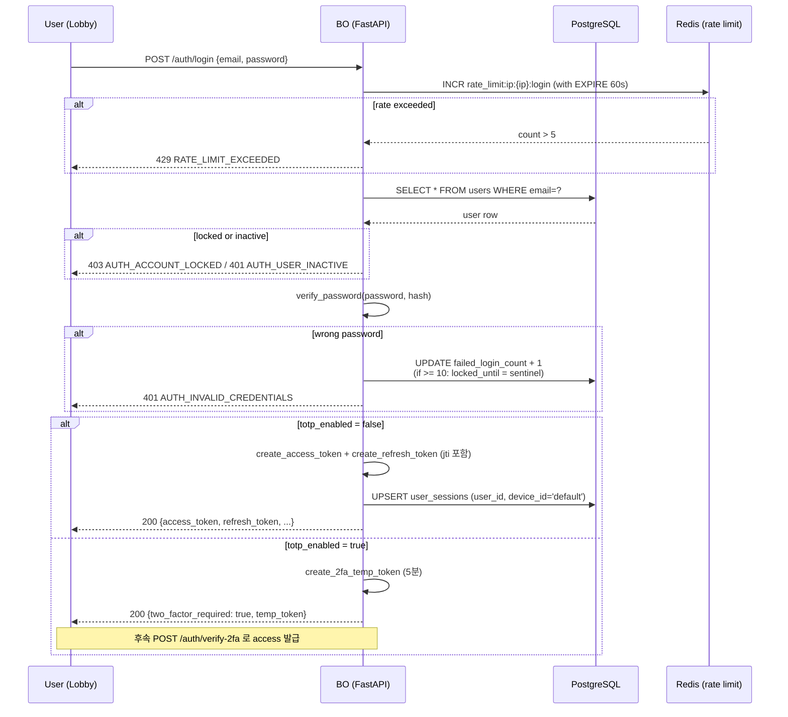
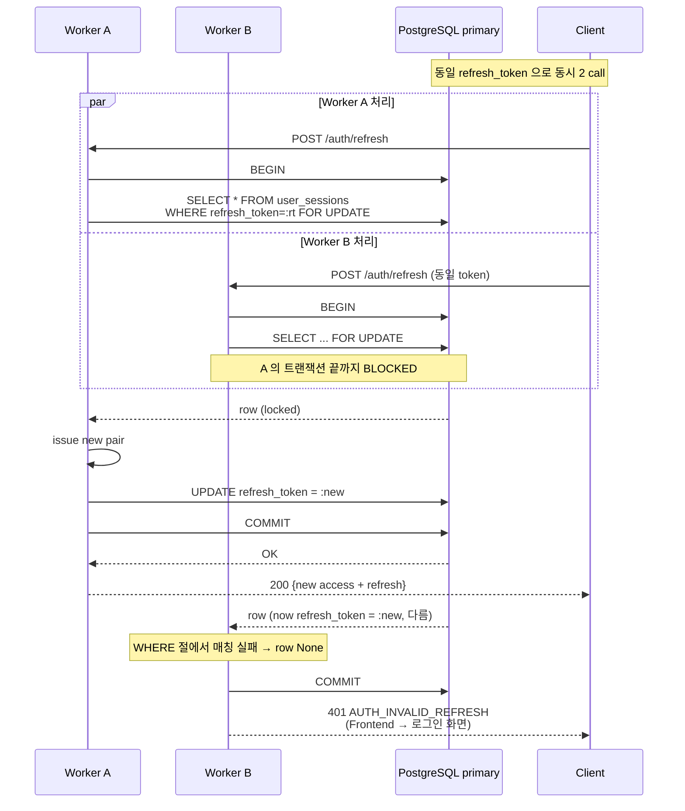
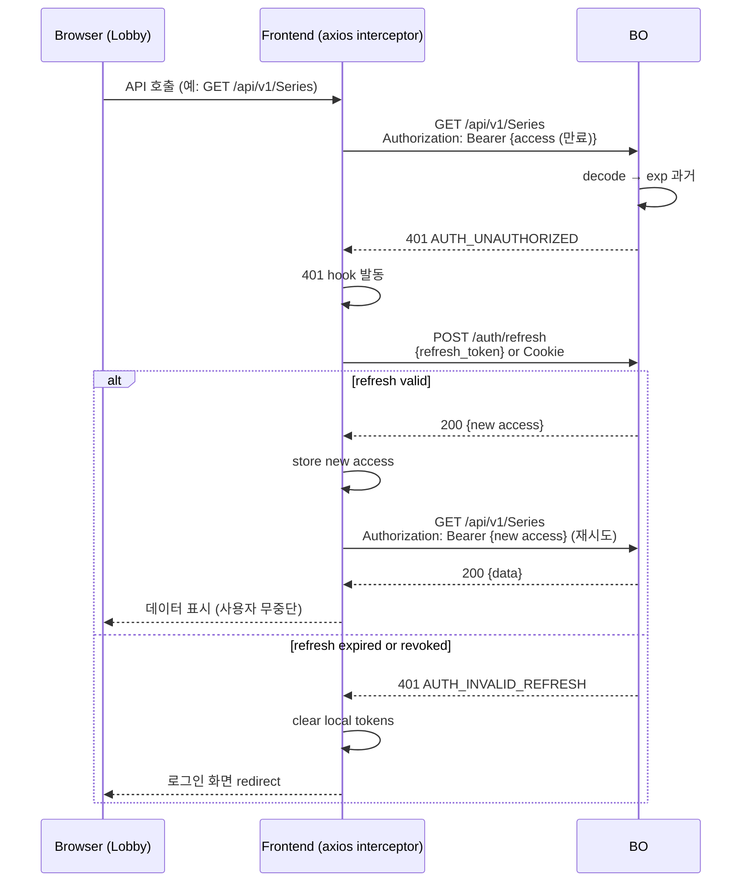
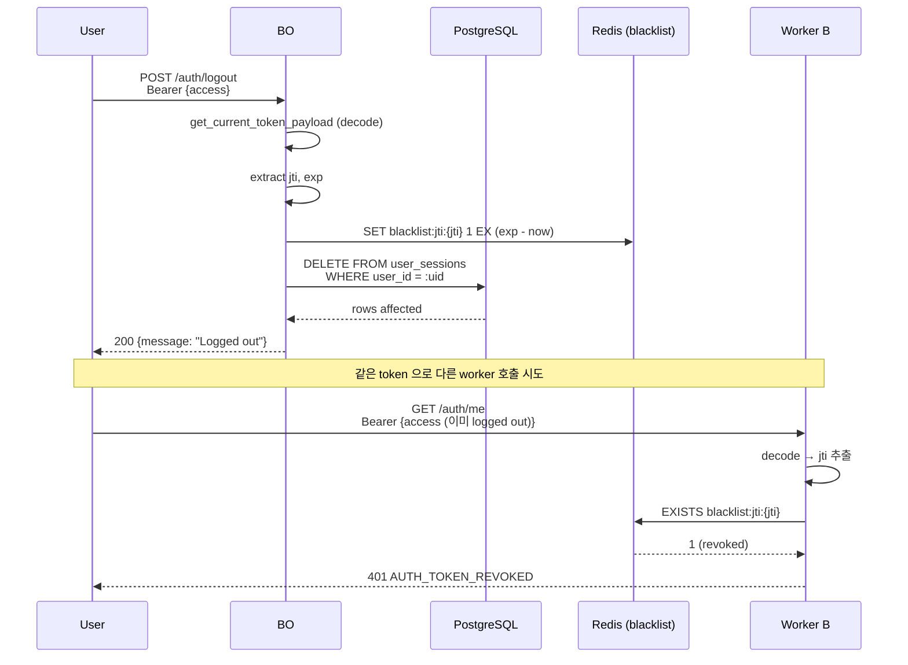
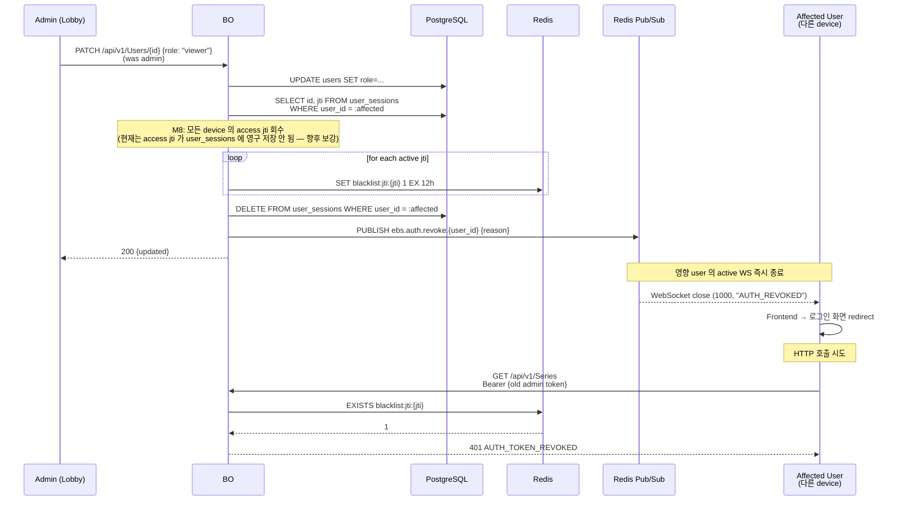
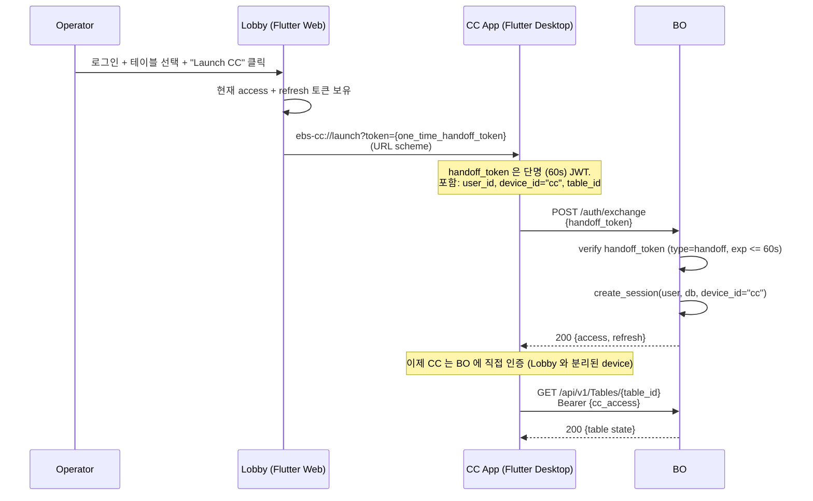
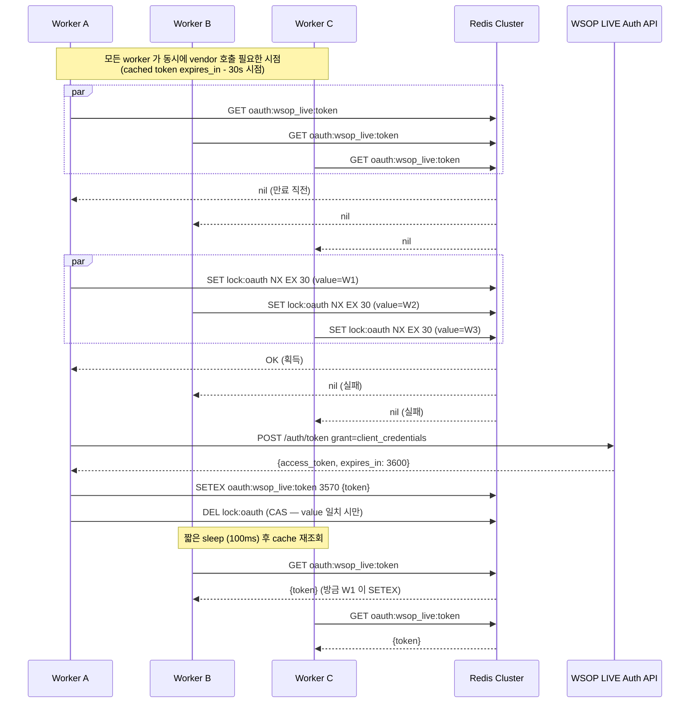

# Token Lifecycle Sequences (M3)

7 Mermaid 시퀀스로 BS-01 정책 + M2 분산 아키텍처가 실제 호출 흐름에서 어떻게
동작하는지 시각화. 각 시퀀스는 한 줄 invariant + 다이어그램 + 1-2 paragraph 설명
+ 위반 시 영향.

## 목차 + Invariant

| Seq | 시나리오 | 핵심 invariant |
|:---:|---------|--------------|
| 1 | Login (Email + Password + 2FA) | 2FA 활성 사용자는 access_token 직접 발급 받지 못함 (반드시 verify-2fa 통과) |
| 2 | Refresh Token Rotation (M8 PG FOR UPDATE) | 동일 refresh_token 으로 동시 N call → 정확히 1건만 새 토큰 받음 |
| 3 | Access Token 만료 → Auto Refresh (Frontend 401 hook) | 401 발생 → refresh 1회 시도 → 실패 시 로그인 화면 redirect |
| 4 | Logout (DB delete + blacklist add) | logout 후 동일 access token 으로 후속 호출 시 즉시 401 (TTL 잔여 무관) |
| 5 | 강제 무효화 (Admin → 모든 jti revoke) | role 강등 / 비밀번호 강제 변경 → 영향 사용자의 모든 활성 worker 가 < 50ms 내 401 |
| 6 | Lobby → CC Token Handoff | CC 는 독립 로그인 없이 Lobby 가 발급한 access token 으로 BO 인증 |
| 7 | OAuth client_credentials Cluster Cache | N worker 동시 만료 직전 → vendor API 호출 정확히 1회 |

---

## Seq 1 — Login (Email + Password + 2FA)

**위반 시 영향**: 2FA-required 사용자가 직접 access_token 받으면 BS-01 §2FA Level 정책 위반 (Medium/High level → bypass). 회귀 가드: `tests/test_auth_security.py::test_2fa_required_blocks_direct_access`.

---

## Seq 2 — Refresh Token Rotation (M8 PG FOR UPDATE)

**위반 시 영향**: FOR UPDATE 없이 구현하면 두 worker 모두 row 발견 → 둘 다 새 pair 발행 → DB 에 last-write-wins → 한 worker 의 응답 토큰은 DB 에 없는 상태 → 다음 호출 시 401. user 가 무작위 로그아웃 경험.

> **현재 상태 (2026-04-28)**: refresh rotation 미구현 (refresh token 은 48h 동안 동일 값). M8 Production_Deployment 시 본 시퀀스 활성화.

---

## Seq 3 — Access Token 만료 → Auto Refresh (Frontend hook)

**위반 시 영향**: hook 미구현 시 매 access 만료마다 user 가 명시적 재로그인. live (12h TTL) 환경에서는 1일 1-2 회 발생, dev (1h) 는 잦은 끊김. UX 저하.

---

## Seq 4 — Logout (DB delete + Blacklist add)

**위반 시 영향**: blacklist add 누락 → logout 후에도 동일 access token 이 잔여 TTL 동안 valid. live (12h) 환경에서 분실/탈취 토큰의 위험 노출. 회귀 가드: `tests/test_blacklist_propagation.py::test_logout_blacklists_access_jti`.

---

## Seq 5 — 강제 무효화 (Admin → 모든 jti revoke)

**위반 시 영향**: revoke 미구현 시 강등된 user 가 잔여 access TTL (live 최대 12h) 동안 admin 권한 유지. PCI/SOC 규정 위반 위험. M1 Item 2 (PR #42) 가 logout 경로에 blacklist 도입했으므로 admin 강등 경로 활성화는 향후 작은 PR.

---

## Seq 6 — Lobby Launch CC (Token Handoff)

**위반 시 영향**: handoff 미구현 시 CC 가 별도 로그인 화면 필요 (UX 저하 + 2FA 두 번). 또는 access token 을 query parameter 로 전달 (URL 로그/브라우저 history 노출 = 보안 위험).

> **현재 상태**: Lobby Launch CC 패턴은 BS-01 §A-02/A-04 (CC 독립 로그인 삭제, Lobby-Only Launch) 에 정책 정의. 코드 구현 (handoff_token + /auth/exchange endpoint) 은 별 PR 진행.

---

## Seq 7 — OAuth client_credentials Cluster Cache

**위반 시 영향**: 락 없이 구현 시 N worker 가 동시 vendor API 호출 → vendor rate limit 도달 + cost 증가. 또한 SET 순서 race 로 만료 시점 불일치.

---

## Cross-reference

| Seq | 관련 코드 | 회귀 테스트 |
|:---:|----------|-------------|
| 1 | `auth_service.py::authenticate`, `routers/auth.py::login` | `test_auth.py::test_login_*`, `test_auth_security.py::test_2fa_*` |
| 2 | `auth_service.py::refresh_session` (현재 단순), M8: PG FOR UPDATE 추가 | M8: `test_refresh_race.py` |
| 3 | Frontend `lib/.../api/interceptor.dart` | E2E `test_login_session_restore.dart` |
| 4 | `routers/auth.py::logout` + `security/blacklist.py` | `test_blacklist_propagation.py::test_logout_blacklists_access_jti` |
| 5 | (M5 구현 예정) `routers/users.py::patch_user` 의 revoke trigger | (M5) |
| 6 | (별 PR) `routers/auth.py::exchange` + Lobby URL scheme | E2E `test_launch_cc_handoff.dart` |
| 7 | `adapters/wsop_auth.py` (이미 OAuth client_credentials 구현) | `test_wsop_auth_extended.py` |

---

## 참조

- Architecture: `Distributed_Architecture.md` (M2)
- Concurrency: `Concurrency_and_Race_Conditions.md` (M4, 후속)
- Production: `../../2.2 Backend/Authentication/Production_Deployment.md` (M8, 후속)
- BS-01 정책 SSOT: `../Authentication.md`
