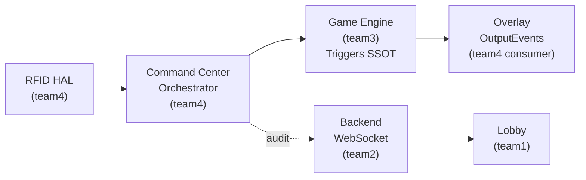

# Card Flow Index

이 문서는 **카드 호출 (RFID + 커뮤니티) 의 4-tier 문서 구조** 를 한눈에 매핑하는 네비게이션 인덱스다. 본 인덱스 자체는 SSOT 가 아니며, 각 tier 의 owned 문서 (특히 **Tier 2 Triggers_and_Event_Pipeline**) 가 권위 출처다.

| 날짜 | 항목 | 내용 |
|------|------|------|
| 2026-04-29 | 신규 작성 (CF-001) | RFID 카드 호출 + 커뮤니티 카드 호출 로직 정비 cascade 의 진입점. 4-tier 네비게이션 + Quick Lookup. |

---

## 0. 목적

EBS Core 흐름 `WSOP LIVE + RFID + Command Center → Game Engine → Overlay Graphics` 에서 **카드 입력 ~ 처리 ~ 출력** 을 가로지르는 4팀 publisher 계약을 단일 진입점으로 묶는다. 외부 통합자 / 팀 세션 / 신규 합류자가 "카드 흐름의 진실은 어디에 있는가" 를 30초 안에 식별하도록 한다.

---

## 1. Tier 0 — 비즈니스 규칙 (Game Rules)

| 문서 | 다루는 게임 군 | 보드 카드 |
|------|--------------|----------|
| `docs/1. Product/Game_Rules/Flop_Games.md` | Hold'em / Short Deck / Pineapple / Omaha (Hi/Hi-Lo, 5/6 Card) / Courchevel | Flop 3 + Turn 1 + River 1 |
| `docs/1. Product/Game_Rules/Seven_Card_Games.md` | Stud / Razz / Stud Hi-Lo | 없음 (개별 노출 카드) |
| `docs/1. Product/Game_Rules/Draw.md` | 5-Card Draw / 2-7 Triple Draw / Badugi | 없음 |

**소유**: conductor (+ team3 publisher).

---

## 2. Tier 1 — RFID 입력 측 (team4 publisher)

```
RFID 카드 입력 = team4 가 publish 하는 IRfidReader 인터페이스 (API-03) 의 6-stream
                 + Card_Detection / Deck_Registration / Manual_Fallback 기획서의 결합
```

| 문서 | legacy-id | 역할 |
|------|----------|------|
| `docs/2. Development/2.4 Command Center/RFID_Cards/Card_Detection.md` | BS-04-02 | 24 안테나 배치 (0~9 좌석1, 10~19 좌석2, 20~22 Flop, 23 Turn/River). atomic flop 정렬 (2026-04-29). |
| `docs/2. Development/2.4 Command Center/RFID_Cards/Deck_Registration.md` | BS-04-01 | 3 등록 모드 (Scan / Bulk JSON / 자동) + DeckFSM 5상태 (UNREGISTERED/REGISTERING/REGISTERED/PARTIAL/MOCK) |
| `docs/2. Development/2.4 Command Center/RFID_Cards/Manual_Fallback.md` | BS-04-03 | Mock 기본 + Real 폴백, 슬롯별 5초 타이머, RfidReaderStatus 매핑 |
| `docs/2. Development/2.4 Command Center/Command_Center_UI/Manual_Card_Input.md` | BS-05-04 | CardSlotStatus 5상태 FSM (EMPTY/DETECTING/DEALT/FALLBACK/WRONG_CARD), AT-03 Card Selector |
| `docs/2. Development/2.4 Command Center/APIs/RFID_HAL.md` | BS-04-04 | 운영자 관점 (5 상태 아이콘, 9 에러 코드 분류) |
| `docs/2. Development/2.4 Command Center/APIs/RFID_HAL_Interface.md` | API-03 | 엔지니어 관점 계약. `drift_ignore_rfid: true` (SG-011 OUT_OF_SCOPE_PROTOTYPE 의도적 보존) |

**소유**: team4 (publisher). 코드: `team4-cc/src/lib/rfid/abstract/i_rfid_reader.dart` (인터페이스), `mock/mock_rfid_reader.dart` (Mock), `providers/rfid_reader_provider.dart` (Riverpod DI).

---

## 3. Tier 2 — Pipeline 도메인 마스터 (team3, AUTHORITATIVE)

> ⭐ **카드 호출 로직의 권위 SSOT 는 Tier 2 의 첫 문서다.** Tier 0/1/3 변경 시 본 tier 와의 정렬 의무가 있다.

```
Card Pipeline Authority
  └─ Triggers_and_Event_Pipeline.md
       §1.4  카드 파이프라인 (Turn-based 홀카드 release + Atomic 3-card Flop)
       §2.3  BoardState (FLOP_PARTIAL / FLOP_READY / FLOP_DONE / AWAITING_TURN / TURN_DONE / AWAITING_RIVER / RIVER_DONE)
       §3.5  T1~T11 트리거 매트릭스 (T6=FlopRevealed atomic, T7=TurnRevealed, T9=FlopPartialAlert CC-only)
       §4.9  Bomb Pot PRE_FLOP 스킵 분기
       §4.10 Atomic Flop 예외 (timeout / 중복 / 덱 외 / OOO / Bomb Pot / Stud/Draw)
```

| 문서 | 권위 범위 |
|------|----------|
| `docs/2. Development/2.3 Game Engine/Behavioral_Specs/Triggers_and_Event_Pipeline.md` | **카드 파이프라인 SSOT** (BS-06-12 흡수, PR #9 머지 2026-04-27) |
| `docs/2. Development/2.3 Game Engine/Behavioral_Specs/Lifecycle_and_State_Machine.md` | FSM 도메인 마스터 (IDLE→SETUP_HAND→PRE_FLOP→FLOP→TURN→RIVER→SHOWDOWN→HAND_COMPLETE) |
| `docs/2. Development/2.3 Game Engine/APIs/Overlay_Output_Events.md` | API-04, 21 종 OutputEvent 카탈로그 (OE-04 BoardUpdated / OE-11 CardRevealed / OE-18 FlopRecovered) |
| `docs/2. Development/2.3 Game Engine/Behavioral_Specs/Card_Pipeline_Overview.md` | **DEPRECATED 2026-04-28**. 49줄 redirect shim 보존 (legacy-id BS-06-12 → Triggers_and_Event_Pipeline.md) |

**코드 SSOT**:
- `team3-engine/ebs_game_engine/lib/core/actions/output_event.dart` — OutputEvent 21종 정의
- `team3-engine/ebs_game_engine/lib/core/cards/flop_aggregator.dart` — atomic 3-card flop 구현

**소유**: team3 (publisher).

---

## 4. Tier 3 — Backend 전송 계약 (team2 publisher)

| 문서 | 카드 관련 섹션 | 정합 상태 |
|------|--------------|----------|
| `docs/2. Development/2.2 Backend/APIs/WebSocket_Events.md` | §3 (`CardDetected`, `RfidStatusChanged`), §3.3.4 (`StreetAdvanced` 미발행 + 대체 경로), §7 (`RfidHardwareError`, `CardConflict`) | 실측 정합 완료 (2026-04-15/21/22) |

**핵심 사실**:
- BO 는 `StreetAdvanced` 를 발행하지 **않는다**. CC 가 Engine HTTP 응답으로 phase 변경 감지 후 BO 에 결과만 broadcast.
- **Engine HTTP 가 phase 전환의 SSOT**, BO WebSocket 은 audit 참고값.

**소유**: team2 (publisher).

---

## 5. End-to-End Orchestrator (CC = Orchestrator 패턴)

| 문서 | 역할 |
|------|------|
| `docs/2. Development/2.4 Command Center/Command_Center_UI/Overview.md` (BS-05-00) | **CC = Orchestrator** 패턴 (2026-04-22 명시). 단일 action → Engine HTTP primary + BO WS audit 병행 dispatch. correlation_id 동형성 |
| `docs/2. Development/2.4 Command Center/Overlay/Sequences.md` | 트리거 → 렌더링 시간축 시퀀스 |
| `docs/2. Development/2.4 Command Center/Overlay/Engine_Dependency_Contract.md` | Rive 애니메이션 매핑 (카드 reveal 트리거) |
| `docs/2. Development/2.4 Command Center/Integration_Test_Plan.md` | E2E 테스트 시나리오 |

**운영 메트릭 (NFR — 핵심 가치 아님)**: RFID 감지 → Engine 처리 → WebSocket broadcast → Rive 렌더링 → SDI/NDI 송출 **100ms 이내** (Phase 2 측정 대상). EBS 핵심 가치는 Foundation §Ch.1.4 — 정확성·장비 안정성·단단한 HW 5 가치이며, 본 수치는 시스템 동작 기준점.

---

## 6. 데이터 흐름 (간단 다이어그램)



**Stage 별 책임**:
1. **R → CC**: Tier 1 (`Card_Detection.md` §3 atomic 규칙)
2. **CC → E**: Tier 2 (`Triggers_and_Event_Pipeline.md` §3.5 트리거 매트릭스)
3. **CC → BO**: Tier 3 (`WebSocket_Events.md` §3 audit 이벤트)
4. **E → O**: Tier 2 (`Overlay_Output_Events.md` API-04 21 종)
5. **BO → L**: Tier 3 (`WebSocket_Events.md` §3.3.1 결정적 3종)

---

## 7. Quick Lookup

| 질문 | 가야 할 곳 |
|------|----------|
| `BoardState.FLOP_PARTIAL` 정의는? | Tier 2 / Triggers §2.3 |
| Atomic 3-card flop 보장 코드는? | `team3-engine/.../core/cards/flop_aggregator.dart` |
| 1~2장 부분 감지 시 Overlay 표시? | **No** (Tier 1 / Card_Detection §3.3 + Tier 2 / Triggers §1.4) |
| `FlopPartialAlert` 가 Overlay 에 가는가? | **No, CC only** (Tier 2 / Triggers §3.5 T9) |
| 4번째 카드 처리 (`AWAITING_TURN` 진입 후)? | `TurnRevealed(c4)` (Tier 2 / Triggers §3.5 T7) |
| 4번째 카드 처리 (`AWAITING_TURN` 미진입)? | reject (Tier 2 / Triggers §4.10) |
| AT-05 Deck 등록 화면 UI? | Tier 1 / Deck_Registration.md (또는 BS-04-05 Register_Screen) |
| Bomb Pot 시 PRE_FLOP 처리는? | Tier 0 + Tier 2 §4.9 (PRE_FLOP 스킵 → SETUP_HAND 종료 시 active 좌석 일괄 release) |
| Run It Twice 시 다중 board 타이밍은? | Tier 2 / Triggers §3.18.4 |
| RFID 미감지 시 폴백 흐름은? | Tier 1 / Manual_Fallback.md + Tier 2 / Triggers §4.10 |
| `StreetAdvanced` 이벤트 발행되나? | **No** (Tier 3 / WebSocket_Events §3.3.4 — `CardDetected` 누적으로 추론) |
| Overlay OutputEvent 카탈로그? | Tier 2 / Overlay_Output_Events.md §6.0 (21 종) |
| RFID UID → Card Code 매핑? | DB `deck_cards.rfid_uid` UNIQUE (SG-006 RESOLVED) |
| Mock vs Real HAL 전환? | Tier 1 / RFID_HAL.md (운영자), API-03 Interface (엔지니어) |
| End-to-end 100ms NFR 측정? (운영 메트릭, EBS 핵심 가치 아님) | Phase 2 통합 테스트 (Tier 5 / Integration_Test_Plan.md) |

---

## 8. Cross-cutting 참조

| 영역 | 문서 |
|------|------|
| BS-00 정의 / 모드 | `docs/2. Development/2.5 Shared/BS_Overview.md` |
| BS-01 Authentication | `docs/2. Development/2.5 Shared/Authentication.md` |
| 거버넌스 (decision_owner) | `docs/2. Development/2.5 Shared/team-policy.json` (`contract_ownership`) |
| Risk Matrix | `docs/2. Development/2.5 Shared/Risk_Matrix.md` |
| Backlog 인덱스 | `docs/4. Operations/Conductor_Backlog.md` (B-CARD-FLOW-001) |
| Spec Drift 도구 | `tools/spec_drift_check.py --rfid --events` |

---

## 9. 정비 이력

본 인덱스의 신설 배경: 2026-04-29 cascade `CARD-FLOW-CONSOLIDATION-2026-04-29` (plan: `~/.claude/plans/rfid-peaceful-seal.md`).

- **Phase 1 (P0 drift fix)**: Card_Detection §3.3 atomic 정렬 (2026-04-29 완료)
- **Phase 2 (P1 인덱스+xref)**: 본 인덱스 + Flop_Games.md RIM/BombPot xref + legacy-id-redirect 검증 (2026-04-29)
- **Phase 3+ (P2 보강)**: 안테나 시각화 + backlinks + spec_drift_check 검증 (예정)

상세: `docs/4. Operations/Conductor_Backlog/B-CARD-FLOW-001-index-and-drift.md`
