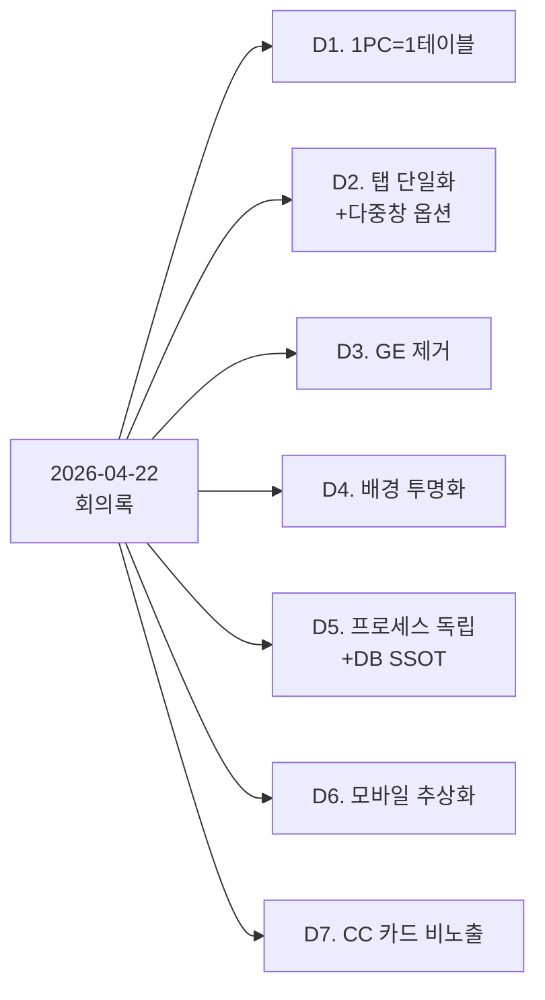
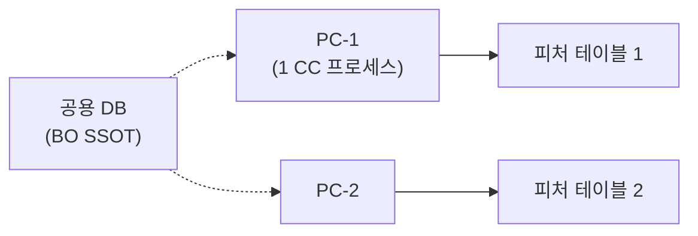
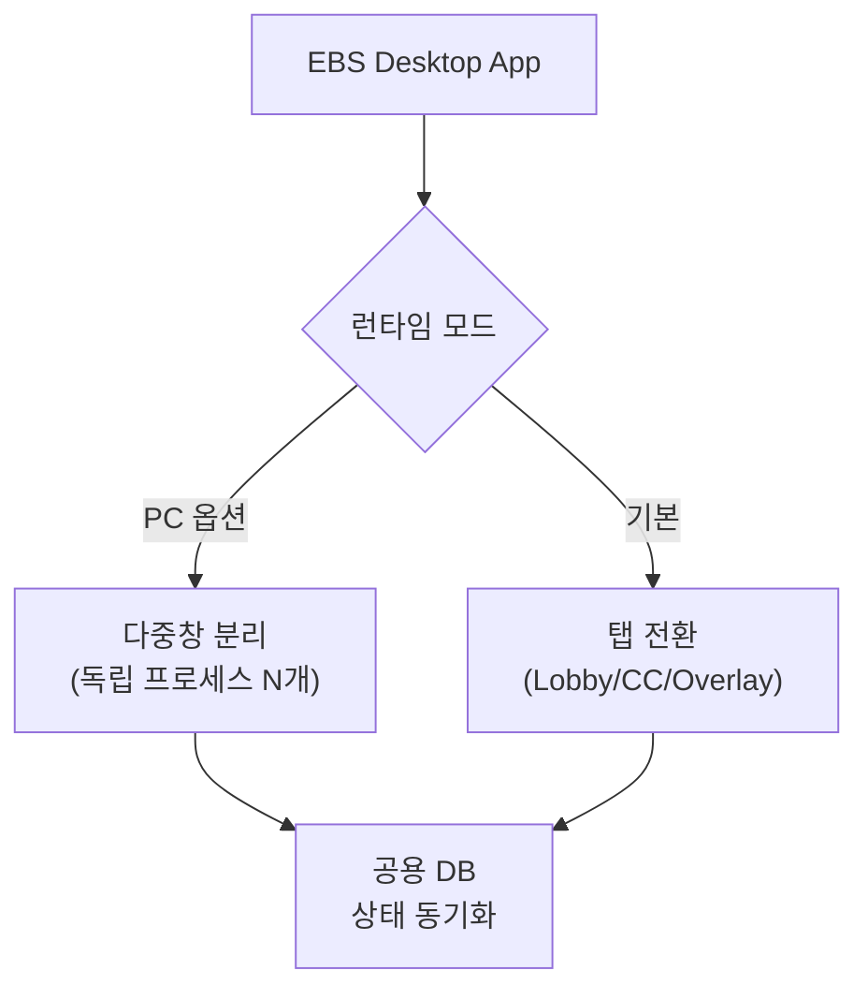
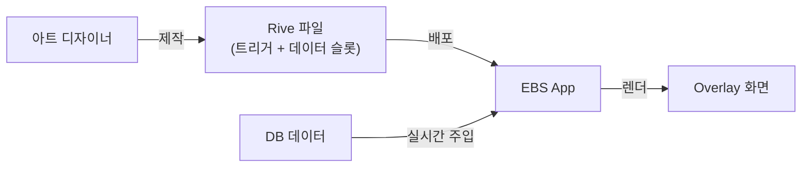
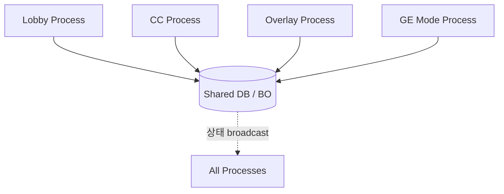
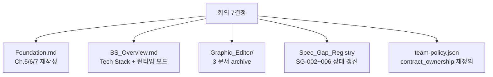

# 회의록 Critic 분석 — 2026-04-22

## Edit History

| 날짜 | 작성자 | 변경 |
|------|--------|------|
| 2026-04-22 | conductor | 초판 — 회의 7결정 critic 5-Phase |

---

## 1. 회의 요약 (한 장)

회의록 7건은 **아키텍처 전면 재설계 트리거**. 단일 기능 추가 아님.

---

## 2. Type 분류 (Spec_Gap_Triage)

| # | 결정 | Type | 분류 근거 |
|:--:|------|:----:|-----------|
| D1 | 1PC=1테이블 | **A → D** | Foundation Ch.5/6 에 이미 "테이블당 1 CC 인스턴스" 명시. **그러나** 하드웨어 제약(캡처카드) 이유는 신규 → D 보강 |
| D2 | 탭 단일화 + 다중창 옵션 | **D** | 기존 PRD 에 없던 신규 UX 패턴. "동일 앱 2 런타임 모드" 개념 부재 |
| D3 | GE 제거 | **C** | Graphic_Editor/ 3문서 존치 + SG-004 `.gfskin` PENDING 인데 회의는 폐기 — 명백한 모순 |
| D4 | 배경 투명화 | **A** | Foundation Ch.7 L410~415 이미 "투명 배경" 명시. 구현 확인만 필요 |
| D5 | 프로세스 독립 + DB SSOT | **A** | Foundation Ch.6.3 "Option A 채택" 이미 명시. SG-002 해소 필요 |
| D6 | 모바일 추상화 | **B** | 기획이 Windows Desktop 하드코딩, 폼팩터 abstract 부재 — 공백 |
| D7 | CC 카드 비노출 | **A** | Foundation L275 + Command_Center_UI 이미 원칙 명시. 계약 강화만 필요 |

**결론**: A 3건 (승인), B 1건 (공백 보강), C 1건 (모순 해소), D 2건 (신규 설계).

---

## 3. Critic 5-Phase (결정별)

### D1. 1PC = 1 피처 테이블

- **Counter-Evidence**: 소규모 이벤트 (≤4 테이블) 에서 1 PC 다중 테이블 수요 존재 가능. 모든 운영 시나리오를 1:1 강제하면 비용 상승.
- **원칙 충돌**: 원칙 1 (WSOP LIVE 정렬) — WSOP LIVE Confluence 에서 multi-table 통제 모델 확인 필요. **미검증**.
- **Hidden Cost**: Foundation Ch.5/6/8 재작성. Risk_Matrix R2 (게임 복잡도) 와 별개로 하드웨어 제약 리스크 R6 신설.
- **Judgement**: **GO-WITH-REVISION** — "1:1 기본, 복수 테이블은 복수 PC + 공용 BO" 표현으로 확정. WSOP LIVE 패턴 선확인.

### D2. UI 탭 단일화 + 다중창 옵션

- **Counter-Evidence**: "탭" = 동일 프로세스 라우팅 / "다중창" = 독립 프로세스 → **두 모드가 프로세스 모델 자체가 다름**. 단순 런타임 토글로 구현 불가. 빌드 타임 분기 또는 런타임 동적 프로세스 spawn 필요.
- **원칙 충돌**: D5 (프로세스 독립) 와 긴장 관계. 탭 모드는 독립 프로세스 원칙 위배.
- **Hidden Cost**: BS_Overview Tech Stack 재정의. `team-policy.json` teams[*].owns 재검토 (Lobby/CC 가 별 앱이 아니라 별 창이면?).
- **Judgement**: **GO-WITH-REVISION** — "기본 모드 = 다중창 독립 프로세스, 태블릿 소형화 대비 **단일창 탭 라우팅 모드 fallback**" 구조로 역전 제안. D5 와 정합.

### D3. 사내 그래픽 에디터 제거

- **Counter-Evidence**: "Rive 파일이 모든 메타데이터 정의" 가정은 테마 전환/다국어/숫자 포맷/조건 표시 같은 **비-그래픽 데이터 규칙** 을 어디서 관리할지 미답. 결국 축소판 에디터가 Lobby 설정 어딘가에 필요.
- **원칙 충돌**: SG-004 (`.gfskin` 스키마) 전면 폐기. Graphic_Editor/ 3 문서 archive. CCR-011 (2026-04-10) 재해석.
- **Hidden Cost**: team1 Backlog 에 GE 관련 아이템 일괄 정리. `team-policy.json` 의 GE publisher 언급 제거. Lobby Settings 에 "Rive 파일 로더 + 데이터 매핑 검증" 최소 UI 는 필요.
- **Judgement**: **GO-WITH-REVISION** — "별도 GE 앱 불필요" 는 확정하되, Lobby Settings 에 **Rive 파일 관리 섹션 (업로드/검증/활성화)** 을 정의해야 공백 방지.

### D4. 배경 투명화 / 단색

- **Counter-Evidence**: 불가. 방송 오버레이 업계 표준.
- **원칙 충돌**: 없음. Foundation Ch.7 L410 이미 명시.
- **Hidden Cost**: Overlay 렌더러 (team4) 에 config flag 추가. 스크린샷/QA 기준 업데이트.
- **Judgement**: **GO** — 구현 확인 작업만 Backlog 등재.

### D5. 윈도우 독립 프로세스 + DB SSOT

- **Counter-Evidence**: DB 기반 동기화는 실시간 (< 100ms) 에서 polling/push 전략 미정의 시 오버레이 지연 유발 가능. WebSocket + DB commit 이원 구조 필요 여부 검증 안됨.
- **원칙 충돌**: Foundation Ch.6.3 이미 "Option A 채택". SG-002 (ENGINE_URL graceful) 해소 필요.
- **Hidden Cost**: `Foundation Ch.6.3 프로세스 토폴로지 다이어그램` + `team2 BO state-broadcast 계약` + `team-policy.json contract_ownership` 업데이트.
- **Judgement**: **GO** — SG-002 해소와 동일 선상. DB polling 주기 + WebSocket push 병행 정책을 Ch.6.4 신설로 확정.

### D6. 모바일/태블릿 지원 (추상화)

- **Counter-Evidence**: "우선 Desktop 완성, 추상화만" 은 실제로 추상화 수준 미정의시 **Desktop 전용 코드 누적** → 나중 태블릿 포팅이 대규모 리팩토링 됨 (YAGNI 역작용).
- **원칙 충돌**: EBS Core v41 (Flutter+Rive 크로스 플랫폼) 과 정렬. 문제는 CC (team4) 가 Windows 하드코딩된 점.
- **Hidden Cost**: team4 CC 아키텍처 계약 — 입력 HAL (RFID/Touch/NDI) 추상화. Form Factor Layer 문서 신설.
- **Judgement**: **GO-WITH-REVISION** — "태블릿 포팅 시 영향받는 추상화 경계 목록" 을 **현재** 명시 (Desktop 구현하며 위반 방지). Backlog 에 "Form Factor Abstraction Contract" 신설.

### D7. CC 카드 비노출

- **Counter-Evidence**: 딜러 보조를 위한 **CC 운영자용 읽기 전용 카드 뷰** 수요 가능. 전면 비노출이 운영 편의성 제약.
- **원칙 충돌**: 없음. Foundation L275 이미 명시.
- **Hidden Cost**: Command_Center_UI/Overview.md 에 "Engine 상태 ↔ CC 화면" 경계 다이어그램 추가. Overlay 만 hole card 노출 계약 강화.
- **Judgement**: **GO** — 기본 원칙 확정. 운영자 카드 뷰는 별도 SG 로 추적 (필요 시).

---

## 4. 원칙 충돌 매트릭스

| 결정 | 원칙 1 (WSOP LIVE) | EBS Core v41 (3입력→Overlay) | 문서 표준 | 팀 소유권 |
|:--:|:---:|:---:|:---:|:---:|
| D1 | ⚠ 검증 | ✓ | ✓ | ✓ |
| D2 | ⚠ 검증 | ✓ | ✓ | ⚠ 재검토 |
| D3 | ✓ | ✓ | ⚠ 문서 3건 폐기 | ⚠ 재검토 |
| D4 | ✓ | ✓ | ✓ | ✓ |
| D5 | ✓ | ✓ | ✓ | ✓ |
| D6 | ✓ | ✓ | ⚠ 계약 신설 | ✓ |
| D7 | ✓ | ✓ | ✓ | ✓ |

`⚠ 검증` = WSOP LIVE Confluence mirror 에서 유사 패턴 선검색 필요.

---

## 5. 연쇄 변경 Top 5 (Hidden Cost)

1. **Foundation.md** — Ch.5 (UI 런타임 모드), Ch.6 (프로세스 토폴로지), Ch.7 (투명 배경 확인)
2. **BS_Overview.md** — 탭/창 용어 정의 + 폼팩터 경계
3. **Graphic_Editor/** 3문서 — archive 후 Lobby Settings/Rive_Manager 로 축소 이전
4. **Spec_Gap_Registry** — SG-002/003/004/005/006 상태 대량 갱신
5. **team-policy.json** — contract_ownership 에서 GE publisher 제거, Form Factor HAL publisher 신설 (team4)

---

## 6. 총괄 판정 (Judge Phase)

| 결정 | Type | Judgement | Top Risk |
|:--:|:----:|:---------:|----------|
| D1 | A→D | GO-WITH-REVISION | WSOP LIVE 패턴 미검증 |
| D2 | D | GO-WITH-REVISION | 탭 vs 독립 프로세스 정합 |
| D3 | C | GO-WITH-REVISION | Rive 외부 메타 관리 공백 |
| D4 | A | GO | 없음 |
| D5 | A | GO | 실시간 동기화 지연 |
| D6 | B | GO-WITH-REVISION | 추상화 경계 미명시 |
| D7 | A | GO | 운영자 뷰 수요 미확인 |

**종합**: GO 2건, GO-WITH-REVISION 5건, BLOCK 0건. 회의 승인은 타당. 단 **REVISION 5건을 재설계 계획 산출물로 문서화해야 완결**.

**다음 단계**: `docs/4. Operations/Plans/Redesign_Plan_2026_04_22.md` 작성 → Atomic Task 분해 → 팀별 Backlog 할당.
