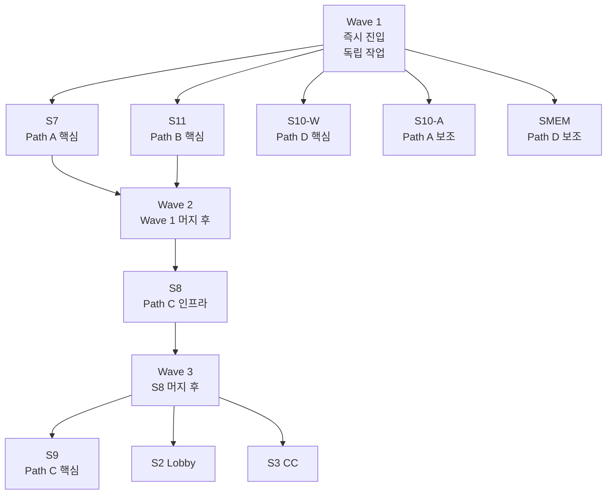

# Cycle Entry Playbook

매 cycle 진입 시 9 멀티 세션 분배 + 진입 명령 + Wave 의존성을 표준화한 SSOT.
**Cycle 1~4 에서 매번 재설계했던 진입 가이드를 본 문서가 영구 대체**한다.

S0 Conductor 는 신규 cycle 진입 시 본 문서를 참조하여 Issue 9개 생성 + Wave 매트릭스 작성 + 진입 명령 표 생성. 매번 재설계 금지.

---

## 1. 9 멀티 세션 표준 매트릭스 (불변)

| Stream | 폴더 (worktree, 절대 경로) | Role | scope_owns (Lord) |
|--------|--------------------------|------|-------------------|
| **S0** Conductor | `C:\claude\ebs` (main, 본 세션) | orchestrator + broker supervisor | CLAUDE.md, team_assignment, message_bus tools |
| **S2** Lobby | `C:\claude\ebs-lobby-stream` | Lobby UI 구현 | team1-frontend/**, Lobby |
| **S3** CC | `C:\claude\ebs-cc-stream` | Command Center UI 구현 | team4-cc/**, 2.4 CC/** |
| **S7** Backend | `C:\claude\ebs-backend-stream` | FastAPI BO 구현 | team2-backend/**, 2.2 Backend/** |
| **S8** Engine | `C:\claude\ebs-engine-stream` | Dart Engine 구현 | team3-engine/**, ebs_game_engine/** |
| **S9** QA | `C:\claude\ebs-qa` | e2e + integration-tests | integration-tests/**, .github/workflows/*e2e* |
| **S10-A** Gap 분석 | `C:\claude\ebs-gap-audit` | drift 등재 (read-mostly) | Spec_Gap_Registry, spec_drift_check.py |
| **S10-W** Gap 작성 | `C:\claude\ebs-gap-write` | PRD 보강 PR (write) | Conductor_Backlog/_template_spec_gap*, PRD 보강 PR |
| **S11** DevOps | `C:\claude\ebs-devops` | Docker, broker, observer_loop | Docker_Runtime.md, docker-compose.yml |
| **SMEM** Memory | `C:\claude\ebs-memory` | Conductor Memory (append-only) | MEMORY.md, case_studies/** |

**진입 명령 패턴 (모든 stream 공통)**:
Cycle N 작업 시작 — (한 줄 작업명) (#issue_no, Path 분류)

---

## 2. Path 분류 체계 (작업 의도 → cycle 묶음)

매 cycle 의 사용자 의도를 4 Path 로 분해. 한 cycle 은 1~4 Path 동시 진행 가능.

| Path | 의도 | 대표 stream | KPI 패턴 |
|:----:|------|------------|---------|
| **A** | 잔여 drift / 버그 해소 | S7 (backend) + S10-A (drift) | drift 카운트 감소 |
| **B** | 인프라 / 환경 안정화 | S11 (broker, docker) | observer 무중단 + events.db 증가 |
| **C** | 기능 확장 (e2e 시나리오) | S9 (QA) + S2/S3/S8 (cascade) | 새 e2e phase PASS |
| **D** | 문서 정합성 audit | S10-W (PRD audit) + SMEM | derivative-of pair 100% / case_study 등록 |

**자율 분류 룰**: 사용자가 "a b c d 모두" 라고 위임 시 S0 가 Path → stream 자율 매핑 + Issue 자동 생성.

---

## 3. Wave 의존성 표준 graph



**진입 순서 룰**:
- Wave 1 = 독립 작업 (다른 stream 의존 없음). 5 stream 동시 진입 가능.
- Wave 2 = Wave 1 의 핵심 PR 머지 후 진입. 1~2 stream.
- Wave 3 = Wave 2 인프라 완료 후 진입. UI / cascade stream 3개 동시.

**예외**: Path 조합에 따라 Wave 구조 변형 가능. 단, **Wave 1 만으로 끝나는 cycle 도 정당** (단순 cycle).

---

## 4. Cycle 진입 표준 절차 (S0 Conductor 책임)

Step 1. 사용자 의도 → Path 분류
        "a b c d 모두" → Path A+B+C+D 통합
        "drift 만" → Path A
        "v02 시나리오" → Path C

Step 2. cycle:N 라벨 생성
        gh label create cycle:N --color hex
        
Step 3. Issue 9개 일괄 생성
        - 각 Issue body 에 Context / 작업 범위 / KPI / 자율 룰 / 의존성 명시
        - 의존성 graph 의 Wave 표기

Step 4. 진입 가이드 표 생성
        - Wave 1 / 2 / 3 분할
        - 폴더 + 한 줄 첫 입력 (위 §1 표 참조)
        - critical path stream 에 별표 마크

Step 5. broker daemon 상태 확인
        python tools/orchestrator/start_message_bus.py --probe
        - daemon alive 이면 publish 시도
        - MCP disconnect 이면 §6 gh CLI fallback

Step 6. 사용자에게 보고
        - Wave 매트릭스 + 진입 명령 표
        - 예상 시간 (Wave 1: 30초 × stream 수)
        - critical path 강조

---

## 5. Cycle 종료 표준 절차

Step 1. 9/9 Issue closed 검증
        gh issue list --label cycle:N --state closed --limit 15

Step 2. KPI 결과 정량 측정
        - 인프라: curl /health × 5
        - drift: grep -c PENDING/OPEN Spec_Gap_Registry.md
        - e2e: evidence 파일 존재 확인
        - broker: events.db seq 증가량

Step 3. SMEM 에게 case_study 위임
        - memory/case_studies/YYYY-MM-DD_cycleN_<핵심학습>.md
        - MEMORY.md 인덱스 갱신

Step 4. 사용자에게 정직한 보고
        - 신호 vs 결과 갭 명시
        - 잔여 작업 + 후속 cycle 권장

---

## 6. Broker MCP Disconnect Fallback (graceful degradation)

시나리오 1: broker daemon alive + MCP connected
  → publish_event MCP tool 호출

시나리오 2: broker daemon alive + MCP disconnect (Cycle 4 검증 사례)
  → gh CLI fallback:
     - PR description 에 cross-link comment
     - Issue comment 로 의존성 unblock 알림
     - events.db 직접 조회는 read-only 분석용

시나리오 3: broker daemon down
  → tools/orchestrator/start_message_bus.py --detach 재시작
  → events.db replay 로 missed event 복구 (최대 50건)

시나리오 4: events.db 손상
  → S11 escalate (Path B critical)
  → 임시로 GitHub 만 SSOT 사용 (orchestrator_monitor --legacy)

---

## 7. 자율 룰 (모든 stream 공통, Issue body 에 자동 포함)

- 매 iteration 자가 검증 (도메인별 도구: pytest / dart test / playwright / spec_drift_check)
- 실패 3회 (circuit breaker) → S0 escalate
- broker MCP 가능 시 publish (pipeline:* / cascade:* / defect:*)
- MCP disconnect 시 gh CLI fallback
- 완료 시 Issue close + 의존 stream Issue comment cross-link
- scope_owns 위반 시 PreToolUse hook BLOCK (정상 동작)

---

## 8. Cycle 1~4 실 적용 결과 (학습 데이터)

| Cycle | 의도 | Path | Issue 범위 | 사용자 진입 | 결과 |
|:-----:|------|------|----------|:----------:|------|
| 1 | bootstrap | B (인프라) | #215~#223 | 9회 (Day 1) | Docker 6/6 healthy |
| 2 | 정합성 강화 | A+C 부분 | #235~#243 | 7회 | admin login 401 미달 |
| 3 | autonomous closure | A 잔여 | #261~#263 | 3회 | SG-035 + force_logout 완료 |
| 4 | first e2e | A+C 통합 | #264~#272 | 2회 | 1 hand e2e PASS (28분 자율) |
| 5 | A+B+C+D 통합 | 4 Path 동시 | #282~#290 | 9회 (예상) | (진행 중) |

**진화 트렌드**:
- 사용자 진입 횟수 = 작업 복잡도 + cross-stream 의존성에 비례
- 단순 cycle = 0~2 진입 가능 (Cycle 3, 4)
- 4 Path 통합 cycle = 9 진입 불가피 (Cycle 5)

---

## 9. KPI 표준 (Path 별)

| Path | metric | 측정 명령 |
|:----:|--------|----------|
| A | drift 카운트 | python tools/spec_drift_check.py --all |
| A | dup-uid HIGH | curl POST /api/v1/decks/{id}/cards 422 검증 |
| B | broker events 증가 | sqlite3 .claude/message_bus/events.db |
| B | docker health | curl http://localhost:{18001,18080,3000,3001,80}/health |
| C | e2e phase PASS | cat integration-tests/evidence/cycleN/v0X-*/summary.txt |
| C | screenshot evidence | ls test-results/v0X-{lobby,cc}/*.png |
| D | derivative-of pair | python tools/doc_discovery.py --frontmatter-audit |
| D | case_study 등록 | ls memory/case_studies/YYYY-MM-DD_*.md |

---

## 10. 사용자 진입 비용 최소화 전략

사용자 진입 = 사용자 부담 = 최소화 대상

진입점 줄이기 우선순위:
1. broker pub/sub → observer_loop --action-mode (S11 #284, Cycle 5 작업 중)
   효과: Wave 자동 unblock (cascade publish → 다음 stream 자동 진입)
   
2. PostToolUse hook 자동 publish (Cycle 2 #240 완료)
   효과: cascade:* + defect:* 자동 발사

3. SessionStart hook 의 .team 자동 inject (Cycle 1 완료)
   효과: worktree 진입 즉시 identity 인식

4. Issue body 의 자율 룰 명시 (현재 표준)
   효과: 첫 입력만으로 자율 iteration 시작

향후 목표 (Cycle 5~6):
- 사용자 진입 9회 → 1회 (S0 만 진입, observer_loop 가 8 stream 자동 trigger)
- 단, Wave 의존성 자동 분배는 broker → session-bridge inbox 구조 필요

---

## 11. Anti-Pattern (반복 금지)

| 패턴 | 왜 금지 |
|------|--------|
| 매 cycle 진입 가이드를 새로 작성 | 본 playbook 이 SSOT — 매번 재설계 비용 |
| Path 분류 없이 Issue 무작정 발급 | KPI 측정 불가, cycle 완료 판정 모호 |
| Wave 구조 무시하고 9 stream 동시 진입 | cross-stream 의존성 충돌 → rebase 폭증 |
| broker MCP fallback 없이 publish 실패 시 escalate | gh CLI graceful degradation 표준 절차 |
| critical path stream (별표) 비강조 | 사용자 진입 우선순위 혼동 |
| 사용자 진입 명령 패턴 변형 | Cycle N 작업 시작 패턴 통일 |

---

## 12. Critical Files

| 경로 | 역할 |
|------|-----|
| docs/4. Operations/Multi_Session_Design_v10.3.md | 9 stream 구조 SSOT |
| docs/4. Operations/team_assignment_v10_3.yaml | stream + scope_owns 매핑 |
| docs/4. Operations/Message_Bus_Runbook.md | broker daemon 운영 |
| tools/orchestrator/start_message_bus.py | broker daemon 제어 |
| tools/orchestrator/orchestrator_monitor.py | 9 stream 모니터링 |
| tools/orchestrator/dynamic_stream_activation.py | 신규 stream 활성화 |
| .claude/message_bus/events.db | broker event 영속 저장 |
| .claude/agents/s{0,2,3,7,8,9,10-a,10-w,11}-*.md | agent-view subagent 정의 (v1.1) |
| .claude/agents/smem-memory.md | SMEM subagent 정의 (v1.1) |

---

## 13. Agent View Integration (v1.1 신규)

Claude Code v2.1.139+ agent-view 통합. 9 sibling-worktree 분산 -> 1 터미널 + N background session.

### 13.1 사용자 진입 방식 변경

```
v1.0 (9 sibling-worktree):
  VSCode 9개 폴더 진입 -> 각 폴더 첫 입력 -> 9회 사용자 진입
  C:\claude\ebs-lobby-stream, ebs-cc-stream, ebs-backend-stream, ...

v1.1 (agent-view):
  $ claude agents
  Dispatch input: "@s7-backend Cycle N 작업 시작 — ..."
  1회 진입 + peek/reply UI
```

### 13.2 9 Subagent 매트릭스

| Subagent | 폴더 (v1.0 sibling) | dispatch 패턴 |
|----------|---------------------|---------------|
| s0-conductor | C:\claude\ebs (main) | @s0-conductor (또는 직접 작업) |
| s2-lobby | C:\claude\ebs-lobby-stream | @s2-lobby Cycle N 작업 시작 — ... |
| s3-cc | C:\claude\ebs-cc-stream | @s3-cc Cycle N 작업 시작 — ... |
| s7-backend | C:\claude\ebs-backend-stream | @s7-backend Cycle N 작업 시작 — ... |
| s8-engine | C:\claude\ebs-engine-stream | @s8-engine Cycle N 작업 시작 — ... |
| s9-qa | C:\claude\ebs-qa | @s9-qa Cycle N 작업 시작 — ... |
| s10-a-gap-audit | C:\claude\ebs-gap-audit | @s10-a-gap-audit Cycle N 작업 시작 — ... |
| s10-w-gap-write | C:\claude\ebs-gap-write | @s10-w-gap-write Cycle N 작업 시작 — ... |
| s11-devops | C:\claude\ebs-devops | @s11-devops Cycle N 작업 시작 — ... |
| smem-memory | C:\claude\ebs-memory | @smem-memory Cycle N 작업 시작 — ... |

### 13.3 자동 worktree isolation

agent-view dispatch session 은 `.claude/worktrees/<id>/` 에 자동 isolation:
- 같은 main checkout 공유 (읽기)
- 각 session 자체 worktree 에 쓰기
- parallel session conflict 없음
- session 삭제 시 worktree 자동 cleanup

subagent frontmatter `isolation: worktree` 가 이를 보장.

### 13.4 agent-view UI 핵심 단축키

| 단축키 | 동작 |
|--------|------|
| `claude agents` | view 열기 |
| `Enter` (input) | dispatch |
| `Space` | 선택 row peek (요약 + reply) |
| `Enter` / `→` | session attach (full conversation) |
| `←` | detach (background 유지) |
| `/bg <prompt>` | 현재 session background |
| `claude --bg "<prompt>"` | shell 직접 background dispatch |
| `Alt+1~9` | N번째 session 즉시 attach |

### 13.5 사용자 진입 비용 비교

```
v1.0: cycle 당 5~9회 진입 (Wave 1/2/3)
v1.1: cycle 시작 1회 진입 (claude agents) + peek/reply 만
       Iron Law trigger 시 reply

진입 절감 효과: 매 cycle 80%+ 감소
```

### 13.6 v1.0 sibling-worktree 처리 (점진 전환)

```
Phase A: subagent 정의 추가 (현재 — 본 v1.1)
Phase B: 신규 cycle 부터 agent-view dispatch 만 사용
Phase C: sibling-worktree 작업 완료 시 archive
        - ebs-gap-write 는 main worktree 라 영구 보존
        - 나머지 8 sibling 는 `git worktree remove` 권장 (Phase 5)
```

### 13.7 Mega-cycle 결합 (Full mega-cycle 모드)

v1.1 + mega-cycle 결합 시:
- 사용자 진입 = cycle 시작 1회
- macro-milestone 도달 시 사용자 alert
- Iron Law trigger 시 강제 멈춤 + 정직 보고
- 그 외 모든 작업 = S0 + 9 subagent 자율 연쇄

mega-cycle 정의는 본 plan §🚀 (`~/.claude/plans/kind-mapping-rivest.md`) 참조.

---

## 14. Hybrid Mode (v1.2 신규, 2026-05-12 사용자 결정)

S0 Conductor 의 자율 폴링 + 직접 처리 금지 + macro-milestone alert 통합 모드. **모든 신규 cycle 진입 시 본 모드 엄격 준수**.

### 14.1 Hybrid 5 규칙 (HARD ENFORCE)

```
1. dispatch 후 ScheduleWakeup 10-15분 자가 폴링 활성
2. 자가 wakeup → audit + 머지만 (직접 docker/flutter/playwright/git rebase/npm 실행 절대 X)
3. macro-milestone 도달 시 사용자 alert (다음 cycle 자동 진입 X)
4. Iron Law trigger 시 강제 멈춤 + 정직 보고
5. 사용자 명시 "다음 cycle 진행" 입력 시만 신규 dispatch
```

### 14.2 본 모드 vs 이전 모드 비교

| 항목 | mega-cycle 자율 (Cycle 4~8) | **Hybrid (v1.2)** | audit only (Cycle 9~10 보수) |
|------|--------------------------|--------------------|-------------------------|
| ScheduleWakeup | 무한 반복 | 1회 후 milestone 대기 | X |
| 자동 cycle 진입 | YES (Iron Law 까지) | **NO** | NO |
| 사용자 진입점 | 1회 | **milestone 별 1~2회** | cycle 당 3~5회 |
| over-engineering | 누적 위험 | **차단** | 차단 |
| Conductor 직접 처리 | 일부 | **금지** | 금지 |

### 14.3 위반 자동 감지 + 정정

```
위반 패턴 (반복 금지):
  ❌ ScheduleWakeup 무한 chain (자동 cycle 진입)
  ❌ Conductor 가 flutter build / docker rebuild / playwright run 직접 실행
  ❌ curl 200 만으로 QA 통과 판정 (QA_Pass_Criteria.md §1 위반)
  ❌ macro-milestone 도달 후 사용자 alert 우회

정정 절차:
  1. 위반 감지 시 즉시 응답 중단
  2. 정직 인정 (사용자 입력 받기 전에 본 세션 self-audit)
  3. Conductor 룰로 복귀
  4. 정확한 stream owner 에게 dispatch
```

### 14.4 본 모드 결정 근거 (사용자 비판 누적 cascade)

| 사용자 비판 | 정정 룰 |
|------------|--------|
| "장난해 (S9 활용 안 함)" | Conductor 직접 처리 X, S2/S7/S9/S11 dispatch |
| "qa 통과 기준 = screenshot + 사용자 확인" | curl 200 / evidence 머지 만 X. QA_Pass_Criteria.md §1 |
| "Lobby 3000 로그인 실패" | paper-work registry sync ≠ 실 검증 |
| "over-engineering 회피" | 무한 cycle 자동 진입 X |
| "Hybrid 모드 orchestrator 지침 엄격" | 본 §14 SSOT 영구 |

### 14.5 macro-milestone 정의 (사용자 alert trigger)

```
사용자 alert 발동 시점:
  - Cycle 9/9 Issue closed + main 머지 완료
  - 영역 통일 작업 완료 (예: Product 명명 통일)
  - macro 기능 완성 (예: v01/v02/v03 e2e PASS)
  - 정합성 100% 도달
  - Iron Law trigger 영역 진입 (production / DB / 외부 action)

alert 후 사용자가 "다음 cycle 진행" 명시 시만 신규 dispatch.
```

### 14.6 본 SSOT 의 영구성

- 모든 신규 cycle 진입 시 본 §14 규칙 자동 적용
- 임의 변경 금지 (사용자 명시 사항 없이는 본 모드 유지)
- 위반 시 즉시 정정 (self-audit + 사용자 알림)

---

## Changelog

| 날짜 | 버전 | 변경 내용 | 근거 |
|------|------|----------|------|
| 2026-05-12 | v1.0 | 최초 작성 — Cycle 1~4 실 적용 결과 통합 | 사용자 2026-05-12 지시 반복하지 않도록 명시 |
| 2026-05-12 | v1.1 | §13 Agent View Integration 추가 — Claude Code v2.1.139 agent-view 통합 + 10 subagent 매트릭스 | 사용자 2026-05-12 지시 "agent-view 활용. 1 터미널 멀티세션" |
| 2026-05-12 | v1.2 | §14 Hybrid Mode 추가 — ScheduleWakeup 자가 폴링 1회 + macro-milestone alert + Conductor 직접 처리 금지. **HARD ENFORCE 5 규칙**. 사용자 비판 4건 누적 정정 | 사용자 2026-05-12 지시 "hybrid 모드 orchestrator 지침에 엄격히 지킬것 명시" |
