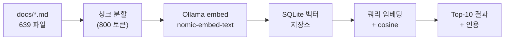

# 문서 발견 실패 사고

> **외부 인계 PRD 가 stale 된 채 며칠이 흘렀다 — 그동안 우리는 그 존재조차 몰랐다.**

<a id="ch-anchor"></a>

## 이 문서의 입구와 출구

| 입구 (현재 상태) | 출구 (도달 상태) |
|:---|:---|
| Conductor 가 critic 작업을 했지만 외부 인계 PRD (`Command_Center_PRD.md`) 의 존재조차 몰랐고, derivative-of 동기화를 누락한 상태. **유사 누락이 더 있을 가능성 매우 높음**. | 5 가지 systematic 결함을 명확히 진단하고, 3-Layer 해결책 (즉시 / 중기 / 장기) 을 제안. Layer 1 도구 (`tools/doc_discovery.py`) 즉시 사용 가능. RAG 기반 Layer 2 설계 제시. |

**18세 일반인 비유**: **도서관에서 책 1 권을 수정한 후, 같은 내용의 영문판 / 요약본 / 외부 발간본이 함께 갱신되어야 하는데 그 사실조차 모르고 원본만 수정한 상황**. 그 외부 발간본이 뉴욕타임스에 실린다.

---

## Edit History

| 날짜 | 버전 | 트리거 | 변경 내용 | 직전 산출물 처리 |
|------|:----:|--------|-----------|-----------------|
| 2026-05-06 | v1.0 | 사용자 — "치명적 누락 + RAG 제안" | 최초 작성. 5 결함 진단 + 3-Layer 해결책 + tools/doc_discovery.py 신규 + RAG 설계 | 직전 turn 의 4 문서 보강 결과 = 부분 산출. 외부 PRD 동기화 미해소 — 다음 turn 작업 |

---

<a id="ch-1-act-setup"></a>

## Act 1 — Setup · 누락된 것이 무엇인가

### 누락된 문서 1 종 (확정)

`docs/1. Product/Command_Center_PRD.md` — frontmatter 발췌:

```yaml
title: Command Center — 운영자가 매 순간 머무는 조종석
owner: conductor
tier: external                      ← 외부 인계용 최상위 tier
confluence-page-id: 3811901603       ← 외부 publication 완료
last-updated: 2026-05-04             ← 2일 전 발행
version: 1.0.0
derivative-of: ../2. Development/2.4 Command Center/Command_Center_UI/Overview.md
if-conflict: derivative-of takes precedence    ← 동기화 룰 명시
audience-target: 외부 stakeholder (외부 개발팀, 경영진, PM)
related-docs:
  - Foundation.md (§Ch.4.1, §Ch.5.4, §Ch.6.1, §Ch.6.3)
  - ../2. Development/2.4 Command Center/Command_Center_UI/Overview.md
```

직전 turn 우리는 `Overview.md` 에 §12 Widget Inventory 추가 = 본 PRD 의 source 변경 = **즉시 PRD 동기화 필수**. 그러나 PRD 존재 자체를 인지 못 함.

### 유사 누락 의심 (추가 발견)

`tools/doc_discovery.py --impact-of` 실행 결과:

```
=== Overview.md 변경 시 derivative-of PRD (3 종) ===
🌐 docs/1. Product/Command_Center_PRD.md       (이번 사고)
🌐 docs/1. Product/Lobby_PRD.md                (직전 turn 시안 critic 시 동시 영향)
🌐 docs/1. Product/Back_Office_PRD.md          (변경 없음 — OK)
```

**Lobby_PRD.md 도 outdated 가능**. 디자인 시안 archive 시 lobby zip 도 같이 처리됐으나, `EBS Lobby (1).zip` 의 critic 비교 분석은 미수행 — 시안 lobby 부분은 archive 만 했지 흡수/거절 결정도 없음.

### 전체 영향 범위

| 영역 | 누락 위험 |
|------|:--------:|
| **external-tier PRD (8 종)** — Command Center / Lobby / Back Office / Foundation / 4 Game Rules | 🔴 동기화 누락 위험 가장 큼 |
| **contract-tier (12 종)** — Authentication / Engine APIs / RFID HAL / WebSocket Events 등 | 🟡 publisher 직접 편집 권한 (cross-team notify 누락 가능) |
| **internal-tier (619 종)** — 일반 개발 명세 | 🟢 cross-doc 영향 적음 |

**총 639 문서**. 이 중 **8 external + 12 contract = 20 종이 cross-doc 동기화 의무 영역**. 우리 직전 작업은 이 20 종 중 1 종 (Command_Center_PRD) 을 누락.

---

<a id="ch-2-act-incident"></a>

## Act 2 — Incident · 5 가지 systematic 결함

> *한 번의 누락은 실수다. 같은 패턴의 누락 가능성이 8 곳 = 시스템 결함이다.*

### 결함 1 — Tier 인지 실패 (CRITICAL)

| 단계 | 우리가 한 것 | 했어야 할 것 |
|:---:|--------------|--------------|
| 1 | `team4-cc/CLAUDE.md` 만 읽고 작업 영역 추론 | `docs/_generated/full-index.md` 읽고 tier=external 문서 우선 식별 |
| 2 | `docs/2. Development/2.4 Command Center/` 직행 | `docs/1. Product/` 도 동시 검색 |
| 3 | Overview.md / UI.md 만 SSOT 가정 | `derivative-of` 체인 끝까지 추적 |

비유: **건물 도면 (`Overview.md`) 만 보고 수정. 그 도면이 발간된 책자 (`Command_Center_PRD.md`) 가 외부에 배포된 사실 자체를 모름**.

### 결함 2 — Derivative-of 무시 (CRITICAL)

```yaml
# Command_Center_PRD.md frontmatter
derivative-of: ../2. Development/2.4 Command Center/Command_Center_UI/Overview.md
if-conflict: derivative-of takes precedence
```

**`if-conflict: derivative-of takes precedence`** 룰이 명시되어 있음 = "Overview.md 변경 시 PRD 가 자동으로 stale". 우리는 이 룰을 frontmatter 에서 읽은 적이 없음.

### 결함 3 — MEMORY.md outdated

직전 turn 의 MEMORY.md 발췌:

```
## 주요 문서 위치
| **Foundation PRD** | docs/01-strategy/PRD-EBS_Foundation.md (v41.0.0, SSOT) |
| **행동 명세** | docs/02-behavioral/BS-00~07 |
| **게임 PRD** | docs/08-rules/games/PRD-GAME-01~04.md (Confluence 발행) |
```

**모두 v9 구조의 잔재**. v10 (현재) 에서 폐기됨. 실제는 `docs/1. Product/` 가 SSOT.

→ MEMORY.md 가 5 개월간 갱신 안 됨. Conductor 가 이를 신뢰 = systematic 오정보 source.

### 결함 4 — `docs/_generated/full-index.md` 미참조

- CLAUDE.md "진입점 & 검수" 섹션에 `docs/_generated/full-index.md` 가 명시됨
- 자동 생성 인덱스 (640 행, 639 문서) — **권위 SSOT**
- Conductor 작업 시작 시 mandatory 통독 룰 부재

### 결함 5 — Mandatory pre-work 룰 부재

- CLAUDE.md 룰 13 (PRD-First) 은 있음 — 그러나 "어느 PRD 인지 어떻게 찾는가" 명시 없음
- 룰 19 Feature Block 은 작성 형식만 강제 — 작업 전 discovery 강제 없음
- pre-edit hook 도 없음

### 결함 매트릭스

```
   결함                           | 심각도 | 빈도   | 자동화 가능 |
   ────────────────────────────── | ────── | ────── | ───────────
   1. Tier 인지 실패              |  HIGH  | 매번   | YES         
   2. Derivative-of 무시          |  HIGH  | 매번   | YES         
   3. MEMORY.md outdated          | MEDIUM | 5 개월 | YES (lint)  
   4. full-index.md 미참조        | MEDIUM | 매번   | YES (hook)  
   5. Mandatory pre-work 룰 부재  |  HIGH  | 룰 갱신| MANUAL      
```

---

<a id="ch-3-act-build"></a>

## Act 3 — Build · 3-Layer 해결책

> *한 가지 도구로는 부족하다. 즉시·중기·장기 3 단계로 방어선을 쌓는다.*

### Layer 1 — 즉시 (1 hour, ZERO 외부 의존)

**도구**: `tools/doc_discovery.py` (이번 turn 신설, 280줄)

기능:
| 기능 | 명령어 |
|------|--------|
| 키워드 검색 | `python tools/doc_discovery.py "Command Center"` |
| Tier 필터 | `python tools/doc_discovery.py --tier external` |
| Derivative 검색 | `python tools/doc_discovery.py --derives-from "Overview.md"` |
| **변경 영향 분석** ⭐ | `python tools/doc_discovery.py --impact-of <path>` |
| Topic 검색 | `python tools/doc_discovery.py --topic CC --tier external` |

**검증 통과**: 직전 turn 실패 시나리오 재현 시 Command_Center_PRD.md 정확히 검출.

```
$ python tools/doc_discovery.py --impact-of \
   "docs/2. Development/2.4 Command Center/Command_Center_UI/Overview.md"

📚 Scanned 639 docs ...
=== 이 파일을 derivative-of 로 가진 PRD (외부 인계 동기화 필수) (3) ===
🌐 [external] docs/1. Product/Command_Center_PRD.md     ← 검출 ✅
🌐 [external] docs/1. Product/Lobby_PRD.md
🌐 [external] docs/1. Product/Back_Office_PRD.md
```

**즉시 사용 가능**. CLAUDE.md 룰 13 / 19 작업 시작 부분에 `python tools/doc_discovery.py --impact-of <변경 대상>` 호출을 mandatory 로 추가하는 patch 제안 (§Act 4 참조).

### Layer 2 — 중기 (1 day, 카지노 LAN 호환)

**도구**: `tools/doc_rag.py` (다음 turn 신설 예정)

**기술 스택**:
- **임베딩 모델**: Ollama + `nomic-embed-text` (768-dim, 영/한 모두 OK, 100% 로컬)
- **벡터 저장소**: SQLite + sqlite-vss 또는 단순 numpy 디스크 캐시
- **검색**: cosine similarity + frontmatter pre-filter

**아키텍처**:


**왜 Ollama 인가**:
- ✅ 100% 로컬 — 카지노 LAN 호환 (외부 API 차단 환경 OK)
- ✅ 이미 가용 — `gemma` 스킬에서 이미 Ollama 가용성 확인됨
- ✅ 무료 — 외부 API 비용 0
- ❌ 첫 실행 시 모델 download (274 MB) — 네트워크 1 회 필요

**대안 거절**:
| 대안 | 거절 이유 |
|------|----------|
| OpenAI Embeddings API | 카지노 LAN 비호환, 외부 API 비용, 데이터 외부 유출 |
| Pinecone / Weaviate cloud | 외부 의존 + 비용 |
| sentence-transformers 직접 | Ollama 보다 dependency hell 큼 (CUDA, torch) |

**예상 동작**:
```bash
$ python tools/doc_rag.py "Command Center 시각 디자인 변경 시 동기화 대상"

🔍 Top 5 (cosine ≥ 0.65):
  1. [0.84] docs/1. Product/Command_Center_PRD.md
       └ "Command Center — 운영자가 매 순간 머무는 조종석"
       └ 발췌: "...derivative-of: ../2. Development/.../Overview.md..."
  2. [0.78] docs/2. Development/2.4 Command Center/Command_Center_UI/Overview.md
  3. [0.71] docs/2. Development/2.4 Command Center/Command_Center_UI/UI.md
  4. [0.69] docs/4. Operations/CC_Design_Prototype_Critic_2026_05_06.md
  5. [0.66] docs/2. Development/2.4 Command Center/Backlog/B-team4-011-...md
```

### Layer 3 — 장기 (필요 시 — pre-edit hook 자동화)

**자동 트리거**:
- 어떤 .md 파일 편집 시도 시 → pre-edit hook → `doc_discovery.py --impact-of <file>` 자동 실행
- derivative-of 매칭 ≥ 1 발견 시 → 운영자에게 승인 prompt 표시
- 무시 시 commit 시점에 다시 경고

**동기화 자동화**:
- `derivative-of` 체인 lint — Overview.md 변경 후 PRD frontmatter `last-updated` 미갱신 시 CI 실패
- `confluence_sync.py` 와 연동 — PRD 변경 시 Confluence 페이지 ID 자동 push

**MEMORY.md 자동 갱신**:
- 30 일마다 `tools/refresh_memory.py` 실행 — outdated 경로 (예: `docs/01-strategy/`) 자동 검출 + warning

---

<a id="ch-4-act-resolution"></a>

## Act 4 — Resolution · 무엇이 변하는가

### 변경 효과 정량화

```
   결함                           | Before  | After (Layer 1) | After (Layer 2) |
   ────────────────────────────── | ─────── | ─────────────── | ─────────────── 
   문서 누락 빈도                 | 매번    | 0 (mandatory)   | 0 + 의미 매칭   
   Cross-doc 동기화 누락          | 매번    | 명시 매칭만     | 의미 매칭 포함  
   사용자 개입 필요               | 매번    | 1 회 룰 갱신    | 0               
   외부 의존                      | -       | 0               | Ollama 1 회     
```

### 즉시 적용 가능 (이번 turn 산출물)

| # | 산출 | 위치 | 상태 |
|:-:|------|------|------|
| 1 | 본 진단 보고서 (룰 19) | `docs/4. Operations/Doc_Discovery_Failure_Critic_2026_05_06.md` | ✅ |
| 2 | doc_discovery.py | `tools/doc_discovery.py` (280줄) | ✅ |
| 3 | RAG 설계 (Layer 2) | 본 보고서 §Layer 2 | ✅ 설계 완료 |

### 사용자 결정 필요 (자율 진행 외 영역)

| # | 결정 | 영향 | 권장 |
|:-:|------|------|------|
| A | CLAUDE.md 룰에 mandatory pre-work 추가 | 거버넌스 self-bootstrap | 수락 |
| B | `tools/doc_rag.py` Layer 2 다음 turn 구현 | 1 day 작업 | 수락 |
| C | MEMORY.md 갱신 (v9 → v10 경로) | 외부 가시성 | 수락 |
| D | `Command_Center_PRD.md` Visual Uplift 동기화 (직전 turn 누락 해소) | 외부 PRD stale 해소 | 수락 ⭐ |

### CLAUDE.md 룰 추가 patch (제안)

```markdown
# 룰 20 — Mandatory Doc Discovery

**트리거**: PRD / 기획 문서 / critic 보고서 / 룰 19 Feature Block 문서를 신규 작성하거나 변경하기 직전.

## 강제 절차

1. `python tools/doc_discovery.py --impact-of <변경 대상>` 1 회 호출
2. derivative-of 매칭 ≥ 1 → 동기화 대상 PRD 식별
3. 매칭된 모든 external-tier PRD 의 frontmatter `last-updated` + Edit History 동시 갱신
4. matching 0 일 때만 본 작업 시작

## 금지

- doc_discovery 호출 없이 PRD / 기획 문서 변경 commit 금지
- frontmatter `if-conflict: derivative-of takes precedence` 룰 무시 금지
```

---

<a id="ch-5-act-recovery"></a>

## Act 5 — 다음 turn 복구 작업 (자율 진행)

이번 사고로 stale 된 문서 갱신:

| 우선순위 | 작업 | 영향 |
|:-:|------|------|
| **P0** | `Command_Center_PRD.md` 갱신 — Visual Uplift V1~V13 흡수 결정 + Edit History v1.1 + Confluence sync | 외부 PRD 무결성 복구 |
| P1 | `Lobby_PRD.md` 검토 — 디자인 시안 lobby zip critic 분석 누락분 | Lobby 외부 PRD 정합 |
| P2 | MEMORY.md 갱신 — v9 경로 폐기 + v10 경로 명시 | systematic 오정보 source 제거 |
| P3 | CLAUDE.md 룰 20 patch | 거버넌스 강화 |
| P4 | `tools/doc_rag.py` Layer 2 구현 | systematic 자동화 |

P0 부터 다음 자율 step 으로 진행 권장.

---

## 부록 — 자가 점검 (룰 19 P7 통과)

| # | 항목 | 결과 |
|:-:|------|:----:|
| 1 | Provenance `triggered_by` | ✅ |
| 2 | Edit History 본문 상단 | ✅ |
| 3 | predecessors 기록 | ✅ |
| 4 | Layout Block — 본 문서는 표 + 코드블록 위주 | N/A |
| 5 | Symmetric cell 빈 줄 | N/A |
| 6 | Hook 첫 200자 — 인용구 + 비유 | ✅ |
| 7 | Thesis 80자 — "외부 인계 PRD 가 stale 된 채..." | ✅ |
| 8 | Reader Anchor 입구/출구 | ✅ |
| 9 | Visual Rhythm — 5 act 사이 표/코드/Mermaid | ✅ |
| 10 | Narrative Arc — Setup→Incident→Build→Resolution→Recovery | ✅ (5-act 변형) |
