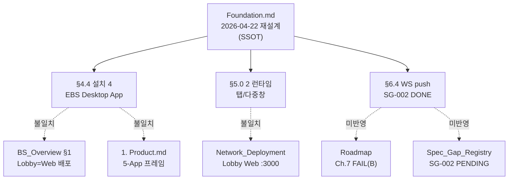
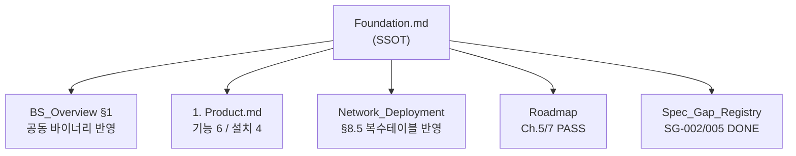
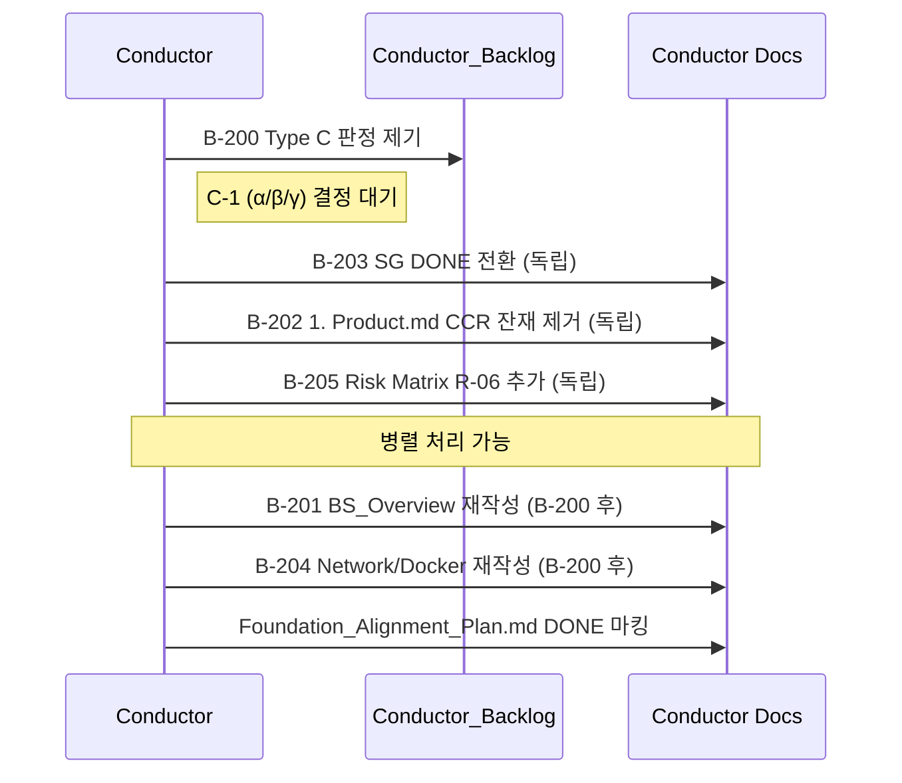

# Foundation 재설계 정렬 계획

> **목적**: 2026-04-22 `docs/1. Product/Foundation.md` 전면 재설계(Ch.4 2렌즈 / §5.0 2런타임 / §6.3 프로세스 모델 / §6.4 WS 동기화 / §7.1 Overlay flag / §8.5 복수 테이블) 에 따라 Conductor 소유 문서 전수 재검토 결과와 수정 계획을 기록한다.
>
> **범위**: `docs/1. Product/**` + `docs/2. Development/2.5 Shared/**` + `docs/4. Operations/**` (Conductor decision_owner). 팀 소유 문서(`2.1~2.4`)는 각 팀 세션에서 후속 등재.

## Changelog

| 날짜 | 버전 | 변경 | 유형 |
|------|:----:|------|:----:|
| 2026-04-22 | v1.1 | 재검토 라운드 2 — 진행 상태 반영 · 누락 문서 4건 편입 (Game_Rules/Flop_Games, 4. Operations.md, Plans/Redesign_Plan, Multi_Session_Handoff) · C-1 Type C retro (team1 PR#11-14 γ 해소 기록) · 매트릭스 17 → 21 | - |
| 2026-04-22 | v1.0 | 최초 작성 — Foundation 재설계 정렬 전수 plan | - |

---

## 1. Foundation 재설계 7대 변경점 (영향원)

Foundation 최근 7 커밋(`b577130` → `027d15a`) 이 도입한 개념. 이후 모든 Conductor 문서는 이 7대 기둥과 정렬되어야 한다.

| # | 섹션 | 핵심 | 결정 |
|:-:|------|------|:----:|
| **1** | Ch.4 + §4.4 | **2 렌즈**: 기능 6 ↔ 설치 4 (3 SW + 1 HW). team1+team4 = 공동 `EBS Desktop App` 바이너리 | — |
| **2** | §5.0 | **2 런타임 모드**: 탭/슬라이딩 (단일 프로세스, 기본) vs 다중창 (독립 프로세스, PC 옵션) | D2 |
| **3** | §6.3 | **프로세스 경계**: 다중창 모드 = Lobby/CC/Overlay 독립 OS 프로세스. 앱 간 직접 IPC 없음 (BO 경유) | D5 |
| **4** | §6.4 | **WS 실시간 동기화**: DB SSOT + DB polling(1-5초) + WebSocket push(<100ms). SG-002 해소 | D5 |
| **5** | §7.1 | **Overlay 배경 config flag**: (a) 완전 투명 (송출용 기본) / (b) 단색 (QA/디자이너용) | D4 |
| **6** | §8.5 | **복수 테이블**: 1 PC = 1 피처 테이블. N PC + 중앙 서버 1대(BO+DB). 멀티 EBS 개념 폐기 | D1 |
| **7** | Changelog | **SG-002 DONE** 전환 (§6.4), **SG-005 해소** (§6.3, 2026-04-20 커밋) | — |

---

## 2. 영향 매트릭스 — Conductor 소유 문서 17개

범례: **P0** (직접 모순, 즉시 수정) / **P1** (부분 수정) / **P2** (검증만 필요) / **OK** (영향 없음)

| 문서 | 우선순위 | 영향 기둥 | 핵심 Delta |
|------|:--------:|:---------:|-----------|
| `docs/2. Development/2.5 Shared/BS_Overview.md` | **P0** | 1, 2, 3 | §1 "Lobby=Web 배포" ↔ Foundation §5.1 "Flutter Desktop" / §4.4 공동 바이너리 누락 / "단일 Flutter 앱의 2개 화면 금지" ↔ §5.0 정면 모순 |
| `docs/1. Product/1. Product.md` | **P0** | 1 | "5-App + 1 Feature Module" 프레임 ↔ Foundation §4.4 "설치 4 + 기능 6" / "CCR 경유" 문구 잔존 |
| `docs/4. Operations/Network_Deployment.md` | **P0** | 1, 2, 6 | "Lobby Web :3000 Docker nginx" ↔ Foundation §5.1 Flutter Desktop / §8.5 중앙 서버 아키텍처 부재 |
| `docs/4. Operations/Roadmap.md` | **P0** | 7 | Ch.7 FAIL(B) / SG-002 PENDING / SG-005 미기재 — Foundation §6.3 §6.4 해소 반영 필요 |
| `docs/4. Operations/Spec_Gap_Registry.md` | **P0** | 7 | SG-002·SG-005 DONE 전환 |
| `docs/4. Operations/Conductor_Backlog/SG-002-*.md` | **P1** | 7 | status PENDING → DONE 전환 + 근거 Foundation §6.3-6.4 링크 |
| `docs/4. Operations/Conductor_Backlog/SG-005-*.md` | **P1** | 7 | status PENDING → DONE 전환 + 근거 Foundation §6.3 링크 |
| `docs/2. Development/2.5 Shared/team-policy.json` | **P1** | 1 | team1+team4 `EBS Desktop App` **joint ownership** 명시 검토 |
| `docs/2. Development/2.5 Shared/Risk_Matrix.md` | **P1** | 6 | 프로젝트 리스크 섹션에 §8.5 중앙 서버 SPOF 추가 |
| `docs/4. Operations/Docker_Runtime.md` | **P1** | 1, 2 | §1 "lobby-web 정규" ↔ Foundation §5.1 불일치 — 아래 §4 Type C 판정 필요 |
| `docs/4. Operations/SSOT_Alignment_Progress.md` | **P2** | — | `contracts/` 경로 언급(v11 구조 전환 정렬 재검증) |
| `docs/4. Operations/Multi_Session_Workflow.md` | **P2** | — | §5.0 런타임 모드와 직접 연관 없음. 확인만 |
| `docs/4. Operations/V5_Migration_Plan.md` | **P2** | — | 확인만 |
| `docs/4. Operations/Spec_Gap_Triage.md` | OK | — | Type A/B/C 프로토콜, Foundation 중립 |
| `docs/2. Development/2.5 Shared/Authentication.md` | OK | — | Auth 주제, Foundation Delta 무관 |
| `docs/2. Development/2.5 Shared/Naming_Conventions.md` | OK | — | 영향 없음 |
| `docs/2. Development/2.5 Shared/Network_Config.md` | OK | — | 영향 없음 |
| `docs/4. Operations/4. Operations.md` | **P0** | 의도 재정의 | L18 "Phase 별 런칭 로드맵 (2027-01 런칭, 2027-06 Vegas)" ↔ 2026-04-20 프로젝트 의도 재정의 (기획서 완결 프로토타입, MVP/런칭 무효) — **v1.1 신규 편입** |
| `docs/1. Product/Game_Rules/Flop_Games.md` | **P2** | 7 | "Foundation Ch.6 참조" 링크 (2건). Foundation §6.3 재구성 후 링크 유효성 검증만 — **v1.1 신규 편입** |
| `docs/4. Operations/Plans/Redesign_Plan_2026_04_22.md` | **P1** | 1~7 | 본 plan 과 동일 사건(2026-04-22) 대응 plan. Wave1 F3 "Spec_Gap 상태 갱신"이 본 plan P0-5 와 중복 — 통합 또는 교차 참조 명시 — **v1.1 신규 편입** |
| `docs/4. Operations/Multi_Session_Handoff.md` | **P2** | 7 | §Foundation/Roadmap/Spec_Gap_* 편집 기록 / "FAIL 1건 (Ch.7 SG-002)" 문구 — SG-002 해소 반영 — **v1.1 신규 편입** |

**집계 (v1.1)**: P0 6건 · P1 6건 · P2 5건 · OK 4건 (총 21, +4)

---

## 3. Delta 구조 다이어그램

### 3.1 현재 상태 (불일치 맵)

### 3.2 목표 상태 (정렬 완료)

---

## 3.5 진행 상태 재검토 (v1.1, 2026-04-22 저녁 추가)

v1.0 작성 직후 팀 세션들이 자발적으로 대응하여 **상당 부분 진행**됨. 실제 상태:

| 항목 | v1.0 상태 | v1.1 실측 | 근거 커밋 |
|------|:---------:|:---------:|----------|
| C-1 Type C 판정 | 미판정 | **γ (하이브리드) 방향 자발 해소** | team1 PR#11 (`67df477`), PR#13 (`704b255`), PR#14 (`14b01bf`) — Lobby Web 복원 + Desktop 개발자 모드 재분류 |
| SG-002 (Engine 의존 계약) | PENDING | 개별 파일 `RESOLVED` (2026-04-20) | `Conductor_Backlog/SG-002-*.md` frontmatter |
| SG-005 (Ch.6 연결 도식) | PENDING | 개별 파일 `RESOLVED` (2026-04-20) | `Conductor_Backlog/SG-005-*.md` frontmatter |
| team2 Phase A-D | 미시작 | **완료** (계약 발행 + BREAKING 정정 + ADDITIVE + Phase 라벨) | `fe8f2bd` → `ec63664` |
| team1 §8.5/§7.1 반영 | 미시작 | **완료** | `71b9771` |
| team3 8 backlog 등재 | 미시작 | **완료** | `36cb3bc` |
| team4 영향 분석 + 4 backlog | 미시작 | **완료** | `1d01d83` |
| Foundation_Alignment_Plan 자체 | 미작성 | **v1.0 작성** | `61e27b4` |

**그러나 Conductor 소유 문서 P0 대부분 미이행**:

| P0 항목 | 상태 |
|---------|:----:|
| (P0-1) BS_Overview §1 재작성 | **미이행** (Type C 판정 확정 후 진행 가능) |
| (P0-2) 1. Product.md 5-App → 설치 4 프레임 + CCR 잔재 제거 | **미이행** |
| (P0-3) Network_Deployment §8.5 반영 | **미이행** |
| (P0-4) Roadmap Ch.7 FAIL → PASS / SG-002/005 DONE 전환 | **미이행** |
| (P0-5) Spec_Gap_Registry SG-002/005 DONE | **미이행** — 개별 파일 RESOLVED 이지만 집계 문서 미갱신 (**집계 불일치**) |
| (P0-new) 4. Operations.md "2027 런칭" 문구 제거 | **미이행** |

**핵심 발견**: 개별 SG 파일은 RESOLVED 인데 Registry + Roadmap 은 PENDING — **Aggregate-vs-Source 동기화 실패**. tools 에 Registry 자동 갱신 레인이 없어 수동 보정 필요.

---

## 4. 주요 모순 — Type C 판정 필요 (CRITICAL)

### 모순 C-1: Lobby 배포 형태

| 근거 | 진술 |
|------|------|
| Foundation §5.1 (2026-04-21 SG-001 해소) | "Lobby/Settings/Graphic Editor 는 team4 CC/Overlay 와 동일한 **Flutter Desktop 스택**으로 통일" |
| Foundation §4.4 | "**EBS Desktop App**: 로비 + 커맨드 센터 + 오버레이 뷰 (Flutter Desktop + Rive)" |
| BS_Overview §1 (2026-04-20) | "Lobby 는 **Web 배포** (Docker nginx, 브라우저 접속)" |
| Docker_Runtime.md §1 (2026-04-22) | "team1-frontend 정규 배포 = **Docker Web 단독**. Flutter Desktop = 개발자 디버깅 모드" |
| team1 PR #11 (6h ago) | "Lobby Docker Web 배포 복원 — Type C 기획 모순 해소" |

> **상태**: 2026-04-21 Foundation 결정과 2026-04-22 team1/Docker_Runtime 결정이 **독립적으로 진행되어 동기화 실패**. 두 결정 모두 "Type C 해소" 명목으로 이뤄졌으나 정반대 방향.
>
> **Conductor 판정 필요**: 다음 중 택일
>
> **(α) Flutter Desktop 단일** — Docker_Runtime·Network_Deployment·BS_Overview 재정정, `ebs-lobby-web` 폐기
> **(β) Flutter Web 배포 (Docker nginx) 정규 + Desktop 개발자 모드** — Foundation §5.1 "Flutter Desktop 통일" 문장을 "Flutter 스택 통일 (배포는 Web)" 로 재작성
> **(γ) 하이브리드** — Foundation §5.0 2 모드에 "배포 타겟" 축 추가 (Web / Desktop), BS_Overview/Network_Deployment 를 양 지원으로 재서술

**권고**: **(γ) 하이브리드** — Foundation §5.0 이 이미 "2 런타임 모드" 를 도입한 만큼 "빌드 타겟 축" (Flutter Web vs Flutter Desktop) 을 직교 개념으로 공식화. 브라우저 다중 클라이언트 LAN 배포 요구(team1 PR #11)와 RFID 시리얼 접근 필수(CC Desktop)를 모두 수용.

**retro (v1.1)**: team1 세션이 PR#11 → #13 → #14 를 통해 **자발적으로 γ 방향 이행** (Lobby Web 정규 복원 + Desktop 개발자 디버깅 모드 재분류). Conductor 판정을 기다리지 않고 실 운영 요구(LAN 다중 클라이언트) 로 결론. **B-200-1 gate 효과적으로 해소**. 남은 작업은 Foundation §5.1/§4.4 문장을 γ 방향으로 재작성 + BS_Overview/Network_Deployment/Docker_Runtime 를 γ 방향으로 맞추는 것만 남음.

### 모순 C-2: "Change Requests" 폐기 잔재

- `docs/1. Product/1. Product.md` L89-90: "Shared (2.5), Product (1.), **Change Requests (승격 이후)**, Operations (4.) 는 Conductor 소유" / "팀 간 계약 변경은 `docs/3. Change Requests/pending/CR-teamN-*.md` 경유"
- `team-policy.json` v7: `governance_model: free_write_with_decision_owner` — CCR 완전 폐기
- **조치**: 1. Product.md 해당 문단 제거, "Publisher 직접 편집 권한 + additive 원칙" 으로 대체 (이미 §Publisher 직접 편집 섹션 존재)

---

## 5. 우선순위별 수정 계획

### 5.1 P0 — 즉시 수정 (5 문서)

**작업 단위**: 각 항목 별도 커밋으로 PR 분리 (git log 추적성 확보)

#### (P0-1) `docs/2. Development/2.5 Shared/BS_Overview.md`

- §1 앱 아키텍처 표를 Foundation §4.4 매핑과 정합 (설치 단위 = `EBS Desktop App` / BO / Engine / RFID HW)
- "Lobby = Web 배포" / "Command Center = Windows Desktop" 행 → **Type C 판정 후** 재작성
- "금지: 단일 Flutter 앱의 2개 화면" 문구 제거 — Foundation §5.0 "하나의 앱, 두 런타임 모드" 와 정합
- legacy-id: BS-00 유지, Edit History 추가: "2026-04-22 Foundation §4.4/§5.0 정렬"

#### (P0-2) `docs/1. Product/1. Product.md`

- "소프트웨어 컴포넌트 (5-App + 1 Feature Module)" → "설치 단위 4 + 기능 6" 프레임으로 재구성 (Foundation §4.4 그대로 인용)
- "docs/3. Change Requests/pending/CR-teamN-*.md 경유" 문장 제거 (v7 CCR 폐기)
- `last-updated: 2026-04-22`

#### (P0-3) `docs/4. Operations/Network_Deployment.md`

- **C-1 판정 γ 채택 시**: §컴포넌트별 설정 방법 — team1 Lobby 섹션을 "Flutter Web (기본 Docker 배포) + Flutter Desktop (개발자 디버깅) 양 지원" 으로 재서술
- §A/B/C 시나리오에 Foundation §8.5 중앙 서버 아키텍처 반영 (§B LAN 은 이미 근접, `server + N PC` 표기 추가)
- §서비스 포트 테이블에 "Command Center (Flutter Desktop) — RFID serial 필수" 명시 (현재도 존재, 강조)

#### (P0-4) `docs/4. Operations/Roadmap.md`

- Ch.2 (Overlay 8 요소): UNKNOWN → PASS (Foundation §2.1 명시)
- Ch.5 (Lobby & CC): UNKNOWN → PASS 또는 UNKNOWN 유지 (C-1 판정 후 결정)
- **Ch.7 (Overlay & RFID): FAIL(B) → PASS** — Foundation §6.3 ENGINE_URL / §6.4 graceful Demo Mode fallback 명시
- §Spec Gap index: SG-002 PENDING → **DONE**, SG-005 PENDING → **DONE**
- §최우선 FAIL: 5건 → 3건 (SG-002, SG-005 제거)

#### (P0-5) `docs/4. Operations/Spec_Gap_Registry.md`

- §4.4 SG 승격 index 에 SG-002, SG-005 행 DONE 전환 (또는 §§ "해소된 SG" 섹션 신설)
- Changelog v1.4 추가: "2026-04-22 SG-002/005 DONE, Foundation §6.3-6.4 근거"

### 5.2 P1 — 부분 수정 (5 문서)

| 문서 | 조치 |
|------|------|
| `Conductor_Backlog/SG-002-engine-dependency-contract.md` | frontmatter `status: PENDING → DONE`, 해소 근거 = Foundation §6.4 |
| `Conductor_Backlog/SG-005-foundation-ch6-system-connections.md` | frontmatter `status: PENDING → DONE`, 해소 근거 = Foundation §6.3 |
| `team-policy.json` | C-1 판정 γ 채택 시, `contract_ownership` 에 `docs/2. Development/2.1 Frontend/App_Binary_Share.md` (신규) joint ownership 추가 검토 |
| `Risk_Matrix.md` | §프로젝트 리스크 (Foundation Ch.9 기반) 섹션에 **"R-06: 중앙 서버 SPOF (§8.5)"** 항목 추가 |
| `Docker_Runtime.md` | C-1 판정 결과 반영 (α: lobby-web 폐기 / β·γ: 유지) |

### 5.3 P2 — 검증만 (3 문서)

| 문서 | 확인 포인트 |
|------|-------------|
| `SSOT_Alignment_Progress.md` | §contracts/ 경로 언급이 v11 구조(`docs/2. Development/`) 로 갱신되었는지 |
| `Multi_Session_Workflow.md` | §5.0 2 런타임과 L1-L3 충돌 방지 레이어 간 충돌 없음 재확인 |
| `V5_Migration_Plan.md` | Foundation §4.4 공동 바이너리 개념과 worktree 정책 충돌 여부 |

---

## 6. 후속 Backlog 등재 (Conductor_Backlog/)

아래 5 항목을 `docs/4. Operations/Conductor_Backlog/` 에 개별 파일로 등재 (Rule 15 백로그 캡처).

| ID (제안) | 제목 | 우선순위 | 의존 |
|:----------|------|:--------:|:----:|
| **B-200** | C-1 Lobby 배포 형태 Type C 모순 Conductor 판정 (α/β/γ) | **P0** | (모든 하위 작업의 gate) |
| **B-201** | BS_Overview §1 Foundation §4.4/§5.0 정렬 재작성 | P0 | B-200 |
| **B-202** | 1. Product.md §소프트웨어 컴포넌트 + CCR 잔재 제거 | P0 | — |
| **B-203** | Roadmap/Spec_Gap_Registry SG-002/SG-005 DONE 전환 | P0 | — |
| **B-204** | Network_Deployment/Docker_Runtime §8.5 중앙 서버 아키텍처 반영 | P1 | B-200 |
| **B-205** | Risk_Matrix R-06 중앙 서버 SPOF 등재 | P1 | — |
| **B-206** | 4. Operations.md "2027 런칭" 문구 제거 (의도 재정의 정렬) | P0 | — (v1.1 신규) |
| **B-207** | Plans/Redesign_Plan_2026_04_22 와 본 plan 관계 정리 (통합 or cross-ref) | P1 | — (v1.1 신규) |
| **B-208** | Aggregate-vs-Source 동기화 레인 — Spec_Gap_Registry 자동 갱신 tool | P1 | — (v1.1 신규, root-cause 대응) |

---

## 7. 실행 순서 (권고)

**독립 처리 가능** (B-200 gate 불필요): B-202, B-203, B-205
**B-200 판정 후**: B-201, B-204

---

## 8. 완료 기준 (Definition of Done)

- [ ] B-200 Type C 판정 완료 (α/β/γ 택일 + 근거 문서화)
- [ ] P0 5 문서 모두 Foundation 7대 기둥과 정합
- [ ] P1 5 문서 모두 수정 또는 "영향 없음" 판정 완료
- [ ] P2 3 문서 검증 완료
- [ ] Roadmap §집계 에서 "최우선 FAIL" 5건 → 3건 이하
- [ ] `tools/reimplementability_audit.py` 실행 결과 Conductor 소유 계약 문서 PASS 증가
- [ ] `tools/spec_drift_check.py --all` 결과 regression 없음
- [ ] 본 Plan 자체 DONE 마킹 (Changelog v1.1)

---

## 9. 범위 외 (Out of Scope)

- 팀 소유 문서(`docs/2. Development/2.1 ~ 2.4`): 각 팀 세션 `Backlog/` 에 별도 등재 필요. Conductor 가 대신 수정하지 않는다 (v7 free_write 는 허용하나 decision_owner 는 각 팀).
- 코드 변경: 본 Plan 은 기획 문서 정렬만 다룬다. Foundation §5.0 2 모드 구현은 team1 Wave 2 R02 후속.
- Foundation.md 자체: 본 Plan 의 수정 대상 아님 (이미 재설계 완료, SSOT).

---

## 참조

| 참조 대상 | 경로 |
|----------|------|
| Foundation (SSOT) | `docs/1. Product/Foundation.md` |
| 재설계 근거 회의 | `docs/4. Operations/Critic_Reports/` (2026-04-22) |
| CCR 폐기 거버넌스 | `team-policy.json` v7 |
| Spec Gap 분류 | `docs/4. Operations/Spec_Gap_Triage.md` |
| Type A/B/C 프로토콜 | `CLAUDE.md` §프로토타입 실패 대응 |
