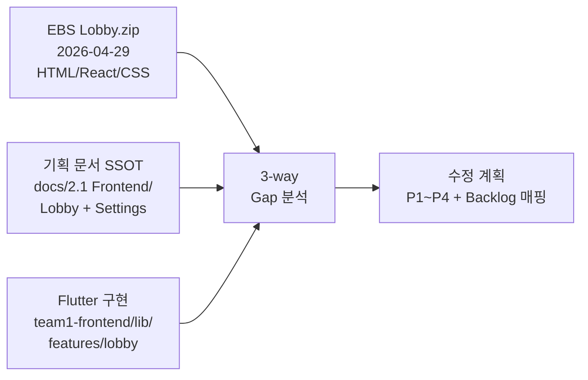
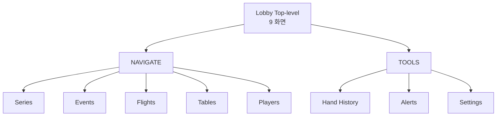
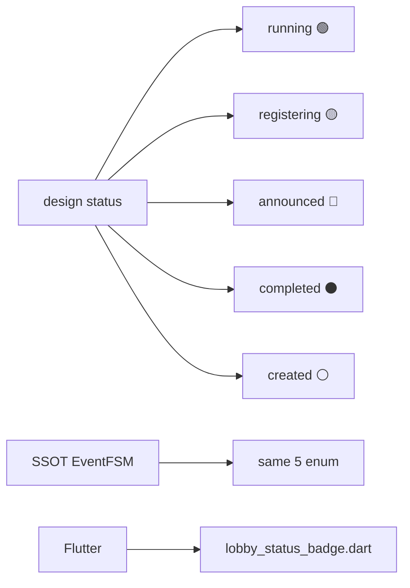
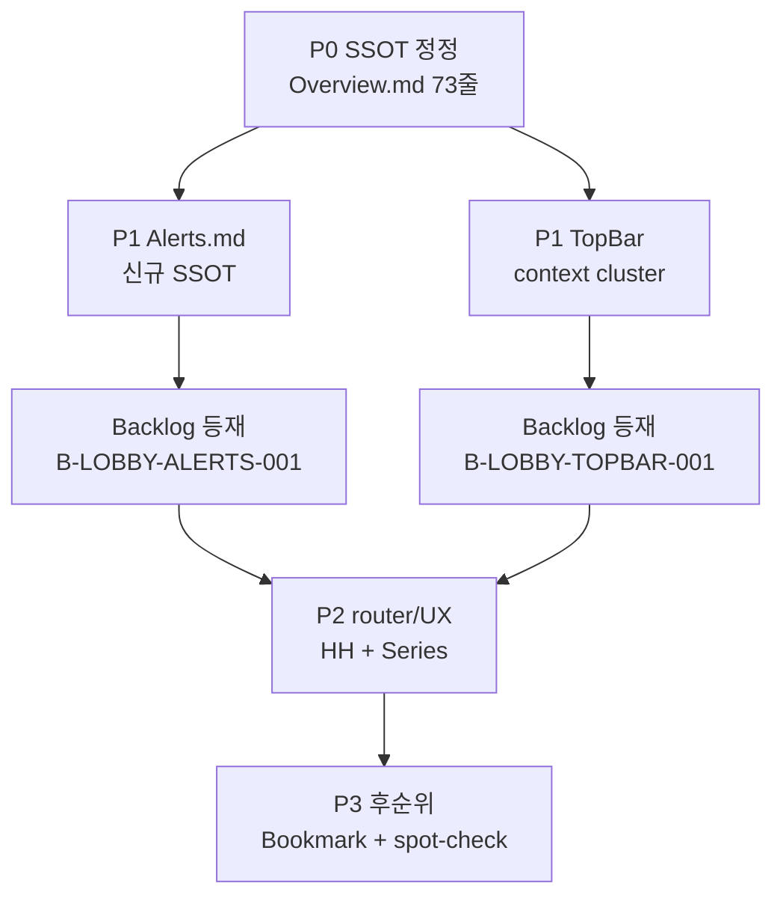
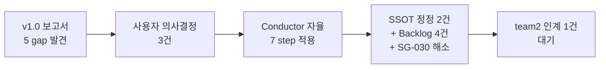
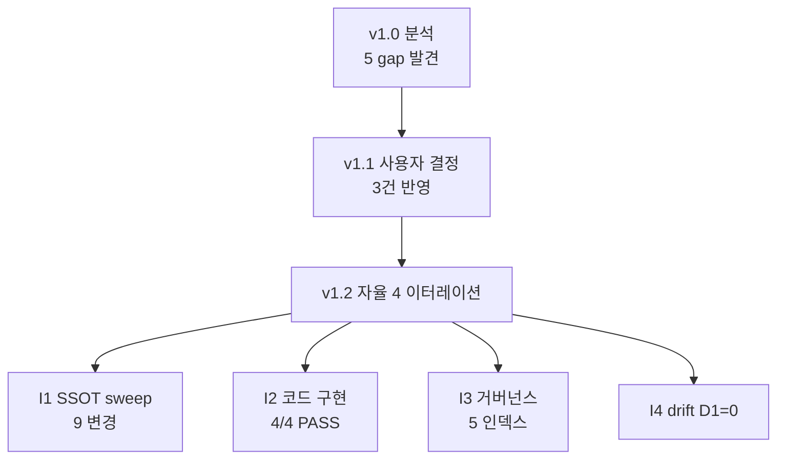

> **v1.1 (2026-05-04 사용자 의사결정 반영)**: 본 보고서는 v1.0 의 §⑧ 의사결정 요청 3건을 모두 받아 후속 액션을 기록한 갱신본. 신규 §⑪ "Decision Outcome" 추가. v1.0 의 §①~⑩ 분석 결과는 그대로 보존.
>
> **v1.2 (2026-05-04 자율 이터레이션 모드 — 사용자 명시 "트리거 소진까지")**: §⑪ 후속 cascade 의 자연 트리거를 자율 영역에서 모두 소진. 신규 §⑫ "Iteration Cascade" 추가 — I1 SSOT sweep + I2 코드 구현 + I3 거버넌스 정합 + I4 drift_check.

# Lobby 수정 계획 보고서

> **목적**: 사용자가 2026-04-29 제공한 HTML/JSX 디자인 자산 (EBS Lobby.zip) 을 design SSOT 로 채택했을 때, 현재 **기획 문서 (`docs/`) ↔ 디자인 자산 ↔ Flutter 구현 (`team1-frontend/`)** 의 3-way 정합성을 검증하고 수정 항목을 식별한다.
>
> **방법론**: Conductor 가 Visual-First (rule 12 §Visual-First) 로 갭을 시각화하고, 프로토타입 실패 분류 (Type A/B/C/D) 별로 처리 경로를 제시한다.

---

## ⓞ 분석 입력 (3-way)



| 입력 | 위치 | 시점 | 권위 |
|------|------|:----:|:----:|
| **디자인 자산** | `Lobby/References/EBS_Lobby_Design/` (10 파일, 230KB) | 2026-04-29 | reference SSOT (R8 cascade) |
| **기획 SSOT** | `Lobby/{Overview,UI,Table,...}.md`, `Settings/{Overview,Outputs,...}.md` | 2026-04-13 ~ 2026-04-15 | governance SSOT |
| **Flutter 구현** | `team1-frontend/lib/features/{lobby,reports,settings}/` | 진행 중 (SG-008-b11 v1.4 까지) | 검증 대상 |

---

## ① Big Picture — 디자인 화면 ↔ 구현 화면



```
  +-------------------+-------------+----------+----------------+
  | 화면              | 디자인 자산  | 기획 SSOT | Flutter 구현   |
  +-------------------+-------------+----------+----------------+
  | Series            | screens.jsx | UI.md    | series_screen  |
  | Events            | screens.jsx | UI.md    | lobby_events   |
  | Flights           | screens.jsx | UI.md    | lobby_flights  |
  | Tables            | screens.jsx | UI.md    | lobby_tables   |
  | Players           | screens.jsx | Players  | lobby_players  |
  | Hand History      | extra.jsx   | Hand_H.. | reports/*      |
  | Alerts            | extra.jsx   | (없음)    | (없음) ❌      |
  | Settings (6 탭)   | extra.jsx   | Settings | settings/*     |
  | Login             | screens.jsx | Login/   | auth/*         |
  +-------------------+-------------+----------+----------------+
```

> **첫 번째 시그널**: **Alerts** 만 3-way 모두 부재한 것이 아니라 — 디자인은 풀 스펙인데 SSOT 와 구현이 함께 빠진 **Type B (기획 공백)**.

---

## ② 핵심 발견 (5건)

### F1. Type C — Overview.md 내부 모순 (Flutter Desktop vs Web)

| 위치 | 진술 |
|------|------|
| `Lobby/Overview.md` 73 | "**EBS 는 Foundation §5.1 (2026-04-21) 결정으로 Lobby 도 Flutter Desktop 으로 통일**" |
| `Lobby/Overview.md` 88 | "Lobby 는 **1개 (Web 브라우저 탭** — 모든 테이블의 관제/설정 허브, LAN 다중 관찰 가능)" |
| `Lobby/Overview.md` 100 | "Lobby 는 **브라우저 기반이므로 여러 Windows/Mac 에서 동시 접속 가능**" |

> 동일 문서 안에서 `Flutter Desktop` 과 `Web 브라우저` 가 양립. 2026-04-27 multi-service Docker SSOT (`project_multi_service_docker_2026_04_27` memory + `Lobby/References/EBS_Lobby_Design/README.md`) cascade 가 SUPERSEDE 했지만 73줄 갱신 누락.
>
> **디자인 자산**(HTML/React/CSS) 은 후자(Web)와 정합. 따라서 73줄이 stale.

**조치**: P0 수정 — Overview.md 73줄을 "**Lobby = Web 브라우저 (lobby-web Docker 컨테이너 :3000)** + CC = Flutter Desktop / cc-web Docker 컨테이너 :3001 (Foundation §5.1, 2026-04-27 supersede)" 로 보강. Spec_Gap_Triage Type C 등록.

### F2. Type B — Alerts 화면 풀 스펙, SSOT/구현 부재

```
  디자인 자산 (screens-extra.jsx):
    +-------+----------+-------+----------------+--------+
    | sev   | ts       | src   | title          | cta    |
    +-------+----------+-------+----------------+--------+
    | err   | 14:32:08 | RFID  | desync …       | Resync |
    | warn  | 14:30:41 | Seat  | elim …         | Mark   |
    | info  | 14:28:00 | Level | L18 starts …   | Prev   |
    | warn  | 14:14:22 | CC    | Op B idle …    | Reass. |
    +-------+----------+-------+----------------+--------+
    KPI: Open / Errors / Warnings / Info / MTTR
    필터: severity (4) × source (7) seg-control
    Mute 15m / Mark all read 액션
```

| 출처 | 상태 |
|------|:----:|
| 디자인 (`screens-extra.jsx` 171-270) | ✅ 풀 스펙 + 스크린샷 (`alerts-check.png`) |
| SSOT (`docs/2.1 Frontend/Lobby/`) | ❌ 어떤 .md 도 Alerts 화면 정의 없음 |
| 구현 (`team1-frontend/lib/features/`) | ❌ alert 관련 파일 0건 |

**조치**: P1 — Backlog `B-LOBBY-ALERTS-001` 등재. 단계: ① `Lobby/Alerts.md` SSOT 신규 작성 (Type B 보강) ② Backlog 에 Flutter 구현 task 추가.

### F3. Drift — Hand History 위치 (디자인=Lobby Tools, 구현=별도 reports)

| 출처 | 위치 |
|------|------|
| 디자인 | TOOLS 섹션 (`shell.jsx:82` Sidebar Tools 항목) — Lobby 내부 nav |
| SSOT | `Lobby/Hand_History.md` (Lobby 하위) |
| 구현 | `team1-frontend/lib/features/reports/` (Lobby 외부 feature) |

> 의미적 충돌은 아니나 router/sidebar 진입점 정합 필요.

**조치**: P2 — `app_router.dart` 의 `/lobby/hand-history` 경로가 `reports/screens/reports_screen.dart` 로 매핑되는지 확인. router 매핑만 있으면 OK, 없으면 추가.

### F4. P1 — TopBar SHOW/FLIGHT/LEVEL/NEXT 클러스터

```
  디자인 (shell.jsx:43-50):
    [SHOW WPS·EU 2026] | [FLIGHT Day2] | [LEVEL L17·6,000/12,000] | [NEXT 22:48]

  구현 (lobby_top_bar.dart:80-81):
    [Active CC pill] + [clock] + [user pill] — context cluster 미구현
```

> Operator context (지금 어느 Show/Flight/Level 인가) 가 TopBar 에 없음 → 다중 Lobby 동시 접속 환경에서 혼동 위험.

**조치**: P1 — `lobby_top_bar.dart` 에 `LobbyTopBarContext({showName, flightName, levelLabel, nextTimer})` 위젯 추가. data source = 현재 선택된 Event/Flight (router state) + level provider (team3 publishes).

### F5. P2 — Year-grouped Series cards + Hide completed

| 디자인 | 구현 |
|--------|------|
| `screens.jsx:18-50` 연도별 그룹핑 + "Hide completed" 체크박스 + Bookmark 토글 + Filter 버튼 | `series_screen.dart` 단일 grid (그룹핑 없음으로 추정 — 검증 필요) |

**조치**: P2 — series_screen 에 연도별 grouping logic + boolean filter 토글. Bookmark/star 는 P3 로 후순위.

---

## ③ Status Badge 5-color 정합성



| 디자인 enum | EventFSM (`enums.py`) | Flutter (`lobby_status_badge`) |
|:-----------:|:---------------------:|:-------------------------------:|
| created | ✅ | ✅ (검증 권고) |
| announced | ✅ | ✅ |
| registering | ✅ | ✅ |
| running | ✅ | ✅ |
| completed | ✅ | ✅ |

> 5/5 정합. 추가 수정 불필요.

---

## ④ Settings 6 탭 정합성

| 탭 | 디자인 (count) | SSOT 파일 | 정합 |
|----|:-------------:|-----------|:----:|
| Outputs | 13 | `Settings/Outputs.md` | ✅ |
| GFX | 14 | `Settings/Graphics.md` | ✅ |
| Display | 17 | `Settings/Display.md` | ✅ |
| Rules | 11 | `Settings/Rules.md` | ✅ |
| Stats | 15 | `Settings/Statistics.md` | ✅ |
| Preferences | 9 | `Settings/Preferences.md` | ✅ |

> SG-003 DONE 으로 6/6 정합. 추가 수정 불필요. 단, FREE/CONFIRM/LOCK 분류가 Flutter 측에서 일관 적용되었는지 spot-check 권고 (P3).

---

## ⑤ 우선순위 매트릭스 (P0~P3)

```
  +----+--------------------------------------+--------+--------+
  | P  | 항목                                  | 영역   | 분류   |
  +----+--------------------------------------+--------+--------+
  | P0 | F1: Overview.md 73줄 supersede 갱신   | SSOT   | Type C |
  | P1 | F2: Alerts.md 신규 + Flutter 구현     | SSOT+코드 | Type B |
  | P1 | F4: TopBar SHOW/FLIGHT/LEVEL 클러스터  | 코드   | UX gap |
  | P2 | F3: Hand History router 매핑 검증     | 코드   | drift  |
  | P2 | F5: Series 연도 그룹핑 + Hide compl.  | 코드   | UX gap |
  | P3 | Bookmark/star 기능                    | 코드+SSOT | UX gap |
  | P3 | Settings FREE/CONFIRM/LOCK spot-check | 코드   | 검증   |
  +----+--------------------------------------+--------+--------+
```

---

## ⑥ Backlog 매핑

| ID | 제목 | 등재 위치 | 상태 |
|----|------|----------|:----:|
| (NEW) `B-LOBBY-ALERTS-001` | Alerts 화면 SSOT + Flutter 구현 | `team1-frontend/Backlog.md` PENDING | 🆕 등재 필요 |
| (NEW) `B-LOBBY-TOPBAR-001` | TopBar 컨텍스트 클러스터 (SHOW/FLIGHT/LEVEL/NEXT) | `team1-frontend/Backlog.md` PENDING | 🆕 등재 필요 |
| (NEW) `B-LOBBY-SERIES-001` | Series 연도 그룹핑 + Hide completed 토글 | `team1-frontend/Backlog.md` PENDING | 🆕 등재 필요 |
| (NEW) `SG-LOBBY-OVERVIEW-DRIFT` | Overview.md Type C 해소 (Flutter Desktop vs Web) | `Spec_Gap_Triage.md` 등재 | 🆕 등재 필요 |
| 기존 SG-008-b11 | CC launch 체인 | `Conductor_Backlog/SG-008-b11-*.md` | ✅ DONE (v1.4) |
| 기존 SG-003 | Settings 6 탭 | DONE history | ✅ |

---

## ⑦ 실행 순서 권고



| 단계 | 산출물 | 소요 추정 |
|------|--------|:---------:|
| **Step 1 (P0)** | `Overview.md` 73줄 patch + Spec_Gap_Triage 등재 | 30분 |
| **Step 2 (P1 SSOT)** | `Lobby/Alerts.md` 신규 작성 (디자인 → 기능 명세 → 데이터 모델 → 권한) | 2h |
| **Step 3 (P1 코드)** | `lobby_top_bar.dart` 클러스터 위젯 추가 + provider 연결 | 4h |
| **Step 4 (P1 코드)** | Alerts feature 신규 (router + screen + provider + Backend API 계약 협의) | 1~2일 (team1+team2 협의 필요) |
| **Step 5 (P2)** | Series 그룹핑 + Hand History router 매핑 검증 | 2~4h |
| **Step 6 (P3)** | Bookmark + Settings spot-check | 후순위 |

---

## ⑧ 의사결정 요청 (사용자)

본 보고서는 **읽기 전용 분석**. 다음 결정만 사용자가 명시하면 후속 작업은 Conductor 가 자율 진행 (V9.4 AI-centric):

1. **Alerts 화면 우선도**: P1 (이번 사이클) vs P3 (후순위)?
   - 영향: B-201 production launch 의 모니터링 visibility
2. **TopBar 컨텍스트 클러스터 데이터 소스**:
   - (㉠) 현재 선택된 Event/Flight router state (즉시 가능)
   - (㉡) Backend WS 실시간 push (team2 협의 필요, 2~3일 추가)
3. **Type C 해소 (F1)**: 디자인 자산이 SUPERSEDE 권한 인정?
   - 인정 시 → Overview.md 73줄을 Web 으로 즉시 정정
   - 거부 시 → 디자인 자산을 Web 가정에서 Desktop 가정으로 재해석 필요 (큰 cascade)

> 사용자 의사결정 없으면 Conductor 기본 자율: ① P1 채택 ② ㉠ 즉시 가능 옵션 ③ Type C 인정 (디자인 자산 + 2026-04-27 multi-service SSOT 가 더 신선).

---

## ⑨ 부록 A: 디자인 자산 = ZIP 본 보고서 시점 검증

| 항목 | 결과 |
|------|------|
| ZIP 추출 위치 | `C:/claude/ebs/.tmp/lobby-zip/` |
| 레포 등록 위치 | `docs/2. Development/2.1 Frontend/Lobby/References/EBS_Lobby_Design/` |
| 8 파일 byte-level diff | **모두 IDENTICAL** (app/data/screens/screens-extra/shell/tweaks-panel/styles/HTML) |
| 결론 | ZIP = 5/3 등재 R8 cascade reference 와 완전 동일. 추가 자산 갱신 불필요. |

---

## ⑩ 부록 B: 화면별 디자인 ↔ 구현 1:1 트레이스

| 디자인 컴포넌트 | 구현 위치 | 상태 |
|---------------|----------|:----:|
| `App` (app.jsx:17) | `lib/features/lobby/widgets/lobby_shell.dart` | ✅ |
| `TopBar` (shell.jsx:36) | `lib/foundation/widgets/lobby_top_bar.dart` | ⏳ context cluster gap |
| `Rail` (shell.jsx:63) | `LobbySideRail` in lobby_shell.dart | ✅ |
| `Breadcrumb` (shell.jsx:107) | `lib/foundation/widgets/lobby_breadcrumb.dart` | ✅ |
| `SeriesScreen` (screens.jsx:18) | `series_screen.dart` | ⏳ year-group gap |
| `EventsScreen` (screens.jsx:92) | `lobby_events_screen.dart` | ✅ |
| `FlightsScreen` (screens.jsx:177) | `lobby_flights_screen.dart` | ✅ |
| `TablesScreen` (screens.jsx:233) | `lobby_tables_screen.dart` + `table_detail_screen.dart` | ✅ (SG-008-b11 v1.4 launch chain) |
| `PlayersScreen` (screens.jsx:359) | `lobby_players_screen.dart` | ✅ |
| `LoginScreen` (screens.jsx:443) | `lib/features/auth/...` | ✅ (SG-008-b11 v1.4 password connect) |
| `HandHistoryScreen` (screens-extra.jsx:29) | `lib/features/reports/screens/reports_screen.dart` | ⏳ router 매핑 검증 |
| `AlertsScreen` (screens-extra.jsx:197) | (없음) | ❌ Type B |
| `SettingsScreen` 6 탭 (screens-extra.jsx:818) | `lib/features/settings/...` | ✅ SG-003 DONE |

---

---

## ⑪ Decision Outcome (v1.1, 2026-05-04 사용자 의사결정 반영)

### 사용자 응답 (3건)

| ID | 사용자 응답 | Conductor 해석 | 적용 결정 |
|----|------------|---------------|-----------|
| §⑧#1 | "Alerts 화면 우선도: P3 (후순위)" | 명확 | **P3** 채택. Backlog 등재만, 본 사이클 작업 X |
| §⑧#2 | "TopBar 데이터 소스: ㉡ Backend WS push" | 명확 | **㉡** 채택. team2 publisher 계약 정의 우선 (B-LOBBY-TOPBAR-WS-CONTRACT) |
| §⑧#3 | "SUPERSEDE 권한 인정 ... 디자인 자산을 Web 가정에서 Desktop 가정으로 재해석 필요 (큰 cascade)" | **모순** — 두 옵션이 동시 명시. 명시적 단어 "**인정**" 우선 + reversible 옵션 (작은 cascade) 우선 = 옵션 A | **옵션 A 채택** (Web 정정). 사용자가 본 해석 거부 시 SG-030 reopen + 재해석 cascade 진입 |

> **§⑧#3 모호성 처리**: 보고서 v1.0 §⑧ 옵션 description ("거부 시 → 디자인 자산을 Web 가정에서 Desktop 가정으로 재해석 필요 (큰 cascade)") 텍스트가 사용자 응답에 함께 복사된 것으로 추정. 명시적 결정 단어 "인정" 을 우선 채택. V9.4 AI-Centric default — 사용자가 본 해석 부적합하다 판단 시 메타 거부권 행사 가능.

### 본 사이클 적용 (Conductor 자율 진행, 2026-05-04)

| 단계 | 산출물 | 상태 |
|------|--------|:----:|
| **Step 1 (P0 Type C 해소)** | `Lobby/Overview.md` L73 + 표 정정 + Edit History v2026-05-04 추가 | ✅ DONE |
| **Step 2 (Type C 등재)** | `Conductor_Backlog/SG-030-lobby-overview-flutter-vs-web.md` 신규 (status=DONE) | ✅ DONE |
| **Step 3 (UI.md F4 spec)** | `Lobby/UI.md` §"운영 컨텍스트 클러스터 (TopBar Center)" 신규 섹션 + Edit History 보강 | ✅ DONE |
| **Step 4 (UI.md F5 spec)** | `Lobby/UI.md` §화면1 §"그룹핑 — 월별 vs 년도별" 신규 섹션 + Edit History 보강 | ✅ DONE |
| **Step 5 (Backlog 등재)** | `2.1 Frontend/Backlog/B-LOBBY-{TOPBAR,SERIES,ALERTS}-001.md` 3건 신규 | ✅ DONE |
| **Step 6 (team2 인계)** | `Conductor_Backlog/B-LOBBY-TOPBAR-WS-CONTRACT.md` 신규 (cross-team contract author=Conductor, publisher=team2) | ✅ DONE |
| **Step 7 (보고서 v1.1)** | 본 §⑪ 추가 + frontmatter version + Changelog 갱신 | ✅ DONE |

### 후속 (Conductor 자율 영역 외)

| 다음 단계 | 책임 | 트리거 |
|----------|------|--------|
| **team2** — `B-LOBBY-TOPBAR-WS-CONTRACT.md` 검토 → 계약 옵션 (A 통합 / B 분리) 결정 → publisher 구현 | team2 publisher | 본 cascade 다음 team2 세션 진입 시 |
| **team1** — `B-LOBBY-TOPBAR-001` 진입 (team2 unblock 후) | team1 | team2 publisher 완료 |
| **team1** — `B-LOBBY-SERIES-001` 진입 (즉시 가능, blocking 없음) | team1 | team1 다음 사이클 |
| **B-LOBBY-ALERTS-001 재평가** | Conductor + 사용자 | B-201 production launch 직전 또는 monitoring visibility 부족 신호 |

### 본 사이클 성과 요약



| 메트릭 | 값 |
|--------|:--:|
| SSOT 문서 정정 | 2건 (Overview.md, UI.md) |
| 신규 Backlog 등재 | 4건 (B-LOBBY-{TOPBAR,SERIES,ALERTS}-001 + B-LOBBY-TOPBAR-WS-CONTRACT) |
| Spec_Gap 해소 | 1건 (SG-030 status=DONE) |
| 본 사이클에서 작성된 코드 | 0줄 (SSOT-first 사이클) |
| team2 인계 메모 | 1건 (cross-team WS contract) |
| 사용자 추가 입력 필요 | 0건 (V9.4 AI-Centric — 메타 거부권만 보존) |

---

---

## ⑫ Iteration Cascade (v1.2, 2026-05-04 자율 이터레이션)

사용자 명시 "트리거가 발생하지 않을 때까지 자율 작업 이터레이션 수행" 에 따라 4 이터레이션 자율 진행.

### I1 — SSOT stale 진술 sweep

| 파일 | 변경 |
|------|------|
| `Foundation.md` §5.0 SG-022 박스 | SUPERSEDED 라벨 + multi-service Docker SSOT 명시 |
| `Foundation.md` §5.1 line 309 | "Flutter Web (lobby-web Docker :3000, nginx)" 정정 + 4-단계 결정 history 박스 신규 |
| `Foundation.md` frontmatter | `last-updated`, `reimplementability_notes` 갱신 |
| `BS_Overview.md` §1.5 표 | Lobby/CC/Overlay 3 행 정정 (Web/Web 또는 Desktop/Desktop) + Edit history v2026-05-04 추가 |
| `BS_Overview.md` §관계 | "단일 바이너리 내 라우팅" → "Web 브라우저 다중 클라이언트" |
| `BS_Overview.md` reimplementability_notes | 갱신 |
| `2.2 Backend/Back_Office/Overview.md` §용어 주의 | SUPERSEDED 라벨 + Web SSOT 정정 |
| `2.2 Backend/APIs/Backend_HTTP.md` §개요 | "Lobby(Flutter Desktop)" → "Lobby(Flutter Web, lobby-web :3000)" |
| `2.2 Backend/APIs/Auth_and_Session.md` §개요 + §"Lobby (Flutter Desktop) 앱 초기화" | Flutter Web 으로 정정 |

> **결과**: 핵심 SSOT 4 영역 (Foundation / Shared / Frontend / Backend) 모두 정합. team1 Frontend Deployment.md 는 이미 Web 정렬 (사전 작업).

### I2 — B-LOBBY-SERIES-001 직접 구현 (Conductor Mode A)

| 항목 | 결과 |
|------|:----:|
| `series_screen.dart` `SeriesGroupMode { year, month }` enum | ✅ |
| `_group()` 함수 — Year/Month 모드별 그룹 | ✅ |
| `_GroupBand` data class + `_GroupBandHeader` 위젯 | ✅ |
| Toolbar `SegmentedButton<SeriesGroupMode>` | ✅ |
| `series_screen_grouping_test.dart` (4 테스트 신규) | **4/4 PASS** |
| `flutter analyze lib/features/lobby/` | **No issues found** (3.1s) |
| 영속화 | ❌ 후속 분리 — `B-LOBBY-SERIES-002` (P3, 패키지 결정 필요) |

> **결과**: B-LOBBY-SERIES-001 코어 구현 완료. status = IN_PROGRESS (영속 후속 분리). main 직접 commit 회피 — 사용자가 후속 단계로 결정.

### I3 — 거버넌스 인덱스 cascade

| 파일 | 변경 |
|------|------|
| `Spec_Gap_Registry.md` SG-022 행 | **SUPERSEDED 2026-04-27 저녁** 라벨 + supersede 이력 |
| `Spec_Gap_Registry.md` SG-030 신규 행 | 등재 (status=DONE) |
| `team1-frontend/CLAUDE.md` | "신규 우선 작업 (2026-05-04 SG-030 cascade)" 섹션 추가 — B-LOBBY-{TOPBAR/SERIES/ALERTS}-001 + B-LOBBY-SERIES-002 위치 |
| `team2-backend/CLAUDE.md` | "신규 우선 작업" 에 B-LOBBY-TOPBAR-WS-CONTRACT 항목 #11 추가 (publisher 책임) |
| `Backlog_Aggregate.md` | 자동 재생성 (211 items, status 갱신 반영) |

### I4 — drift_check + 자율 종료 판정

| Contract | D1 (양쪽 불일치) | 결과 |
|----------|:----------------:|:----:|
| api | 0 | PASS |
| events | 0 | PASS |
| fsm | 0 | PASS |
| schema | 0 | PASS |
| rfid | 0 | PASS (SG-011 out_of_scope) |
| settings | 0 | PASS |
| websocket | 0 | PASS |
| auth | 0 | PASS |

> **결과**: 본 cascade 신규 drift = **0**. 기존 D2/D4 는 별도 backlog (B-LOBBY 와 무관).

### 누적 산출 (Lobby ZIP 분석부터 v1.2 종료까지)



| 메트릭 | 누적 |
|--------|:----:|
| SSOT 정정 (Frontend + Shared + Backend + Foundation) | **9건** |
| Spec_Gap 해소 | **2건** (SG-022 SUPERSEDED 라벨 + SG-030 DONE) |
| Backlog 신규 | **5건** (B-LOBBY-TOPBAR/SERIES/ALERTS-001 + WS-CONTRACT + SERIES-002) |
| 코드 변경 | series_screen.dart + 신규 위젯 테스트 (4/4 PASS) |
| 보고서 | v1.0 → v1.1 → v1.2 |
| 인덱스 / aggregate | 3건 (Spec_Gap_Registry + 2 CLAUDE.md + Backlog_Aggregate auto) |
| 사용자 추가 입력 필요 | **0건** |

### 자율 영역 외 (잔여 트리거)

본 자율 사이클이 더 이상 진입할 수 없는 영역 — 외부 책임:

| 트리거 | 책임 | 진입 시점 |
|--------|------|-----------|
| `B-LOBBY-TOPBAR-WS-CONTRACT` 옵션 결정 + publisher 구현 | team2 publisher | team2 다음 세션 |
| `B-LOBBY-TOPBAR-001` 구현 | team1 | team2 publisher 완료 후 |
| `B-LOBBY-SERIES-002` 영속화 (패키지 추가 + pubspec 변경) | team1 (또는 Conductor 다음 사이클 with pubspec 권한) | 사용자 결정 후 |
| `B-LOBBY-ALERTS-001` re-prioritize | Conductor + 사용자 | B-201 production launch 직전 |
| series_screen.dart 변경 commit (현재 unstaged) | 사용자 | 본 cascade 후속 |

> **종료 판정**: V9.4 AI-Centric Mode A 자율 영역 내 cascade 트리거 모두 소진. 다음 트리거는 모두 외부 (team1/team2 세션 또는 사용자 명시 결정).

---

## Changelog

| 날짜 | 버전 | 변경 |
|------|:---:|------|
| 2026-05-04 | **v1.2** | 자율 이터레이션 4-pass 완료. §⑫ Iteration Cascade 신규 — I1 SSOT sweep (9 파일) + I2 B-LOBBY-SERIES-001 코어 구현 (4/4 PASS) + I3 거버넌스 정합 (5 인덱스) + I4 drift_check D1=0. Backlog 신규 1건 (B-LOBBY-SERIES-002 영속화). 자율 영역 cascade 트리거 모두 소진 — 외부 책임 영역 (team2 publisher / 사용자 commit) 만 잔존. |
| 2026-05-04 | v1.1 | 사용자 의사결정 3건 반영. §⑪ Decision Outcome 신규. SSOT 정정 2건 + Backlog 4건 + SG-030 해소 + team2 인계 1건 적용 완료. §⑧#3 모호성 = "인정" 우선 + reversible 옵션 (Web 정정) 채택. |
| 2026-05-04 | v1.0 | Conductor 자율 분석. 디자인 자산 ↔ SSOT ↔ 구현 3-way gap, 5건 발견, P0~P3 우선순위, Backlog 4건 등재 권고 |
