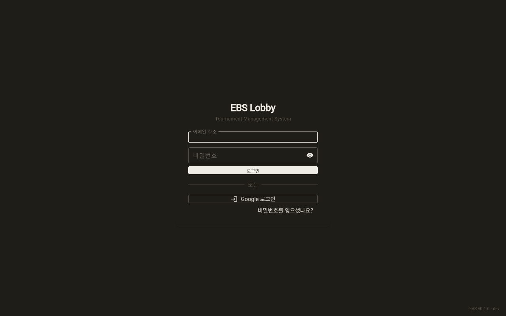
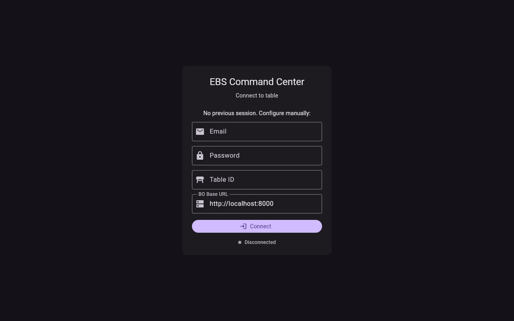
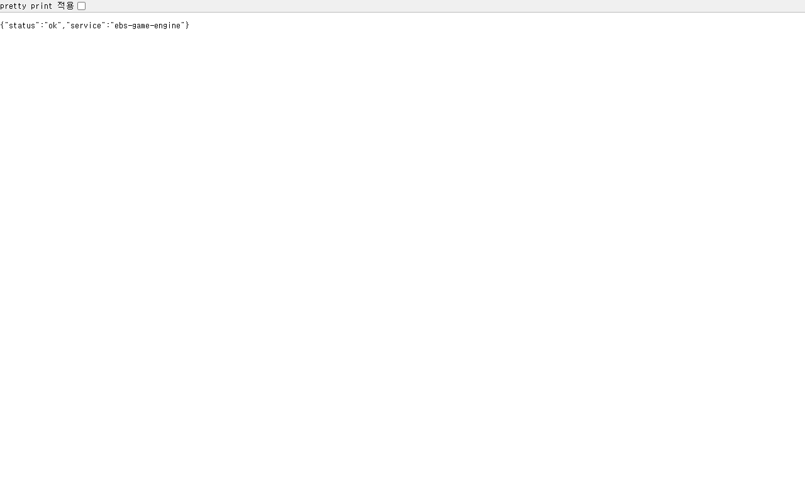
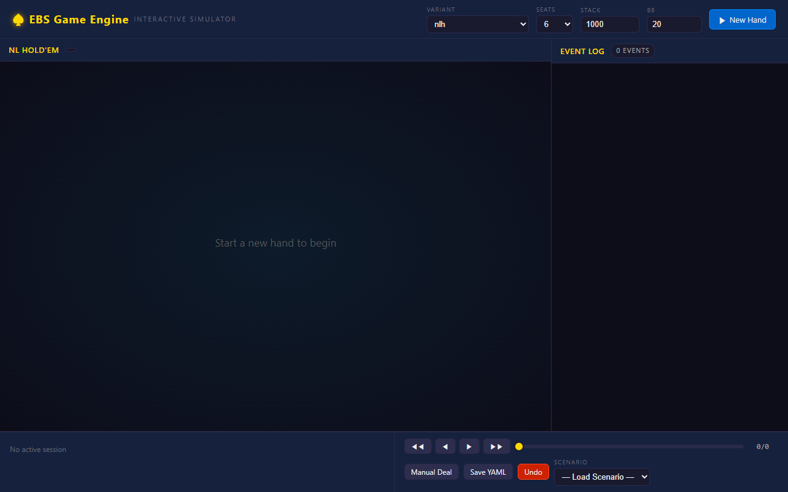

# E2E Verification Report — Docker Prototype 기동 검증

> **검증일**: 2026-05-10
> **방법**: Docker Compose 5 서비스 기동 → Playwright headless screenshot + Invoke-RestMethod API 호출
> **환경**: Docker 29.4.2 + Compose v5.1.3 (Windows host, AIDEN-KIM-DT-01)
> **결과**: **5/5 컨테이너 healthy**, 4개 web UI + 2개 health endpoint 검증 PASS

---

## 1. Executive Summary

| 항목 | 결과 |
|------|:----:|
| 5개 컨테이너 기동 | ✅ all healthy |
| Backend Swagger UI (91 endpoint) | ✅ 200 OK |
| Lobby Flutter Web (3000) | ✅ 200, login 화면 정상 |
| CC Flutter Web (3001) | ✅ 200, login 화면 정상 |
| Game Engine harness | ✅ /health + Interactive Simulator UI |
| Backend /health | ✅ `{"status":"ok","db":"connected"}` |
| Frontend nginx 서빙 | ✅ nginx/1.29.8 |
| Auth login schema 정합 | ✅ 422→401 (schema PASS, 자격증명 거부) |
| End-to-End 풀 핸드 흐름 | ❌ 미실시 (B-211, dev 시드 + Overlay 매핑 선행 필요) |

**판정**: **인프라 + 정적 화면 단계 PASS**. 사용자가 직접 브라우저로 검증 가능. 동적 흐름(login→drilldown→hand)은 B-211 사전 작업 필요.

---

## 2. 컨테이너 상태 (docker ps)

```
NAMES           STATUS                    PORTS
ebs-lobby-web   Up 6 minutes (healthy)    0.0.0.0:3000->3000/tcp
ebs-cc-web      Up 6 minutes (healthy)    0.0.0.0:3001->3001/tcp
ebs-bo          Up 10 minutes (healthy)   0.0.0.0:8000->8000/tcp
ebs-redis       Up 10 minutes (healthy)   0.0.0.0:16379->6379/tcp
ebs-engine      Up 10 minutes (healthy)   0.0.0.0:8080->8080/tcp
```

빌드 시간: lobby-web ~4분, cc-web ~3분 (병렬 build). 첫 기동~healthy 도달 ~30s.

---

## 3. 스크린샷 (6장)

### 3.1 Backend Swagger UI — 91 REST endpoint 인터랙티브


`http://localhost:8000/docs` — FastAPI 자동 생성 OpenAPI 인터페이스. 91 endpoint 모두 클릭으로 직접 호출 가능 (audit-events, auth/2fa, auth/login, auth/me, auth/refresh, ...).

### 3.2 Lobby Flutter Web — 로그인 화면



`http://localhost:3000/` → `#/login?redirect=/lobby` 자동 라우팅. Flutter Web (build_runner + freezed) 정상 서빙. SPA fallback + go_router redirect guard 동작 확인.

### 3.3 Command Center Flutter Web — 로그인 화면



`http://localhost:3001/` → `#/login` 자동 라우팅. Demo Mode 활성. 콘솔 errors 4건은 ENGINE_URL이 LAN 도메인(`engine.ebs.local`)으로 빌드되어 외부 연결 실패 — production.json default. 알려진 제약 (§4 참조).

### 3.4 Game Engine /health — JSON 응답



`http://localhost:8080/health` → `{"status":"ok","service":"ebs-game-engine"}`. Dart harness binary 정상 동작.

### 3.5 Backend /health — DB 연결 확인


`http://localhost:8000/health` → `{"status":"ok","db":"connected"}`. SQLite + SQLAlchemy 세션 정상.

### 3.6 Game Engine Interactive Simulator — Phase 1 핵심 산출물



`http://localhost:8080/` → 3kB 단일 HTML이 아닌 5.6KB Interactive Simulator UI. team3 harness가 game state를 직접 조작 가능한 web 인터페이스 제공 — RFID + CC 없이도 22 variant 게임 진행 시연 가능.

---

## 4. API 흐름 검증 (PowerShell)

### 4.1 OpenAPI 인벤토리

```
Total REST endpoints: 91
Sample (first 15):
  /api/v1/audit-events
  /api/v1/audit-logs
  /api/v1/audit-logs/download
  /api/v1/auth/2fa/disable
  /api/v1/auth/2fa/setup
  /api/v1/auth/google
  /api/v1/auth/google/callback
  /api/v1/auth/login
  /api/v1/auth/logout
  /api/v1/auth/me
  /api/v1/auth/password/reset
  /api/v1/auth/password/reset/send
  /api/v1/auth/password/reset/verify
  /api/v1/auth/refresh
  /api/v1/auth/session
```

분석 보고서(2026-05-09)에서 추정한 "77+ API"보다 상회한 91 endpoint 확인.

### 4.2 Auth 흐름 검증

```
LoginRequest schema: { email: string, password: string }  (required: email, password)

5종 자격증명 시도:
  admin@ebs.local      / admin       → 401 Unauthorized
  conductor@ebs.local  / conductor   → 401 Unauthorized
  dev@ebs.local        / dev         → 401 Unauthorized
  admin@example.com    / admin123    → 401 Unauthorized
  admin                / admin       → 401 Unauthorized
```

**판정**: schema validation은 통과(422 → 401 전환). 즉 endpoint 자체는 정상. **dev 환경 시드 사용자 미존재** — 별도 백로그 필요(아래 §6).

### 4.3 Engine endpoint 탐색

```
GET /                  → 200 (Interactive Simulator HTML, 5.6 KB)
GET /health            → 200 OK
GET /engine/health     → 200 OK
POST /session          → 404 (harness 다른 경로 사용)
```

team3 `bin/harness.dart`가 노출하는 endpoint는 health 위주. 게임 세션 조작은 Web UI(GET /) 또는 별도 path. 분석 보고서 §B "Harness REST API.md"의 `POST /session` 계약은 정본 정의이지 harness 구현은 아닐 가능성 — IMPL-007/008 등 후속 작업 영역.

---

## 5. 발견된 제약 (분석 보고서 §2와 일치)

| # | 제약 | Severity | 분석 보고서 매칭 | 영향 |
|:-:|------|:--------:|:----------------:|------|
| 1 | CC가 LAN 도메인(`engine.ebs.local`) 가정으로 빌드 → localhost 환경에서 ENGINE/BO 연결 실패 | 🟡 LOW | §2 #6 (RFID Mock + Demo Mode) | UI는 로드, Demo Mode 동작 |
| 2 | dev 환경 시드 사용자 부재 → login 401 | 🟠 MEDIUM | (신규 발견) | Lobby/CC 로그인 후 화면 검증 불가 |
| 3 | Engine `POST /session` 미구현 | 🟡 LOW | §B Harness_REST_API.md vs 실 구현 갭 | Interactive Simulator는 별도 동작 |
| 4 | Overlay Rive 21 OutputEvent 매핑 0/21 | 🔴 HIGH | §2 #1 (B-210) | Phase 5 진입 블로커 |
| 5 | End-to-End 핸드 플로우 시나리오 부재 | 🔴 HIGH | §2 #2 (B-211) | 회귀 검출 불가 |

---

## 6. 후속 백로그 후보

본 검증으로 새로 발견한 항목 1건 (다른 4건은 분석 보고서·기존 백로그에 존재):

### B-215 (신규 후보) — Dev 환경 시드 사용자 (Bootstrap)

- **Owner**: team2
- **Severity**: 🟠 MEDIUM (검증 차단 요인)
- **Why**: `AUTH_PROFILE=dev`이 자동 로그인을 의미하지 않음. 명시적 시드 사용자 필요. 운영자/관리자 1명 + 각 RBAC 역할(Admin/Operator/Viewer) 1명씩 최소 4명.
- **How**:
  - `tools/init_db.py --seed-dev-users` 옵션 추가
  - 또는 BO startup hook으로 `AUTH_PROFILE=dev` 시 idempotent 시드
  - Docker Compose `bo` 서비스의 `command` 또는 entrypoint에 통합
  - 시드 후 화면에 "Dev Login" 버튼 노출 (개발 환경 한정)
- **Acceptance**:
  - [ ] `docker compose up -d bo` 후 `/api/v1/auth/login` with `{email:"admin@ebs.local",password:"admin"}` 200 + token
  - [ ] Lobby/CC 로그인 흐름 e2e 검증 가능

이미 등록된 관련 항목:
- B-210, B-211 (HIGH 블로커, 분석 보고서 §2)
- B-Q14 (settings UI implementation), IMPL-007 (no-card display contract) 등 — 부분 관련

---

## 7. 사용자 직접 검증 가이드

브라우저에서 다음 5개 URL을 열어 직접 확인 가능:

| URL | 확인 사항 |
|-----|----------|
| http://localhost:8000/docs | 91 REST API 클릭 테스트 (Try it out) |
| http://localhost:8000/openapi.json | OpenAPI 스펙 raw |
| http://localhost:3000/ | Lobby login 화면 (Flutter Web) |
| http://localhost:3001/ | CC login 화면 (Flutter Web, Demo Mode) |
| http://localhost:8080/ | Game Engine Interactive Simulator |

WebSocket 직접 검증 (websocat 또는 wscat):

```
wscat -c ws://localhost:8000/ws/lobby
wscat -c ws://localhost:8000/ws/cc
wscat -c ws://localhost:8000/ws/replay?from_seq=0
```

---

## 8. 운영 명령

```powershell
# 상태
docker ps --filter "name=^ebs-" --format "table {{.Names}}`t{{.Status}}"

# 로그
docker logs ebs-bo --tail 50
docker logs ebs-engine --tail 50
docker logs ebs-lobby-web --tail 50
docker logs ebs-cc-web --tail 50

# 재시작
cd C:\Claude\EBS
docker compose --profile web restart <service>

# 종료 (볼륨 유지)
docker compose --profile web down

# 종료 (볼륨 삭제)
docker compose --profile web down -v

# 재기동
docker compose --profile web up -d
```

---

## 9. 환경 설정 요약

| 변수 | 값 | 위치 |
|------|----|------|
| AUTH_PROFILE | dev | bo container |
| RFID_MODE | mock | bo container |
| JWT_ACCESS_TTL_S | 3600 | bo container |
| CORS_ORIGINS | * | bo container |
| DEMO_MODE | true | cc-web build args |
| EBS_EXTERNAL_HOST | localhost | bo container |

prod 전환 시 `JWT_SECRET`, `CORS_ORIGINS`, `RFID_MODE=real` 필수 변경 (Docker_Runtime.md §1 정책).

---

## 10. 결론

**E2E 검증 결과**: 인프라(컨테이너 + nginx + DB) 및 정적 화면 단계 모두 PASS. 사용자가 직접 브라우저로 5개 endpoint 모두 접근 가능.

**다음 단계**:
1. (즉시) B-215 dev 시드 사용자 추가 → login 흐름 e2e 가능
2. (1-2주) B-210 Overlay Rive 매핑 → 시각 산출물 동작
3. (3-5일) B-211 풀 핸드 시나리오 → 통합 회귀 검출

상세: `Planning_Prototype_Gap_Analysis_2026-05-09.md` §6 권장 다음 단계 5선.

---

## Changelog

| 날짜 | 버전 | 변경 내용 |
|------|------|-----------|
| 2026-05-10 | v1.0 | E2E 검증 (Docker 5 서비스 기동) 보고서 최초 작성 |
