> **v2.0 (2026-05-04 사용자 결정 + Lobby/CC/BO 친화 문서 발굴 추가)**:
> 1. v1.0 의 5 사용자 결정 분기 (B.1~B.5) = **모두 권고 채택 확정** (㉠/㉡/㉠/㉡/㉠)
> 2. **신규 §⑫ Lobby/CC/BO 친화 문서 발굴** + Quick Tour 3 stand-alone 권고
> 3. 통합 실행 시퀀스 갱신 (Phase A 안전 + Phase B 분기 + Phase B' Quick Tour 신규)
>
> **v3.0 (2026-05-04 사용자 정정 — Quick Tour 폐기 → 상세 PRD)**:
> 1. v2.0 옵션 Y (Quick Tour ~120줄 subset view) = **사용자 misalign — 폐기**
> 2. **신규 옵션 Y' = 상세 PRD** (Foundation 톤 + 이미지 중심 + 재미있고 이해 쉬움 + ~500-800줄)
> 3. 정본 3 Overview.md (Lobby/CC/BO) = **그대로 보존** (수정 X). 신규 PRD = derivative external view, frontmatter `derivative-of` cross-ref + "기술 디테일 conflict 시 Overview.md 우선" 명시
> 4. **단계적 작성**: BO PRD = prototype (본 turn), Lobby + CC PRD = 후속 turn (사용자 prototype 검증 후)

# `docs/1. Product/` 외부 인계 큐레이션 계획

> **사용자 의도 (2026-05-04)**:
> 1. `docs/1. Product/` = **외부 stakeholder (외부 개발팀 + 경영진 + PM) 공유 영역**
> 2. **Foundation.md 같은 "사용자 중심적 세계관" 문서만 배치**
> 3. **최적화 — 반드시 필요한 문서만**
> 4. **`1. Product.md` 같은 인덱스/landing 은 사용자 불필요 = 제거**
>
> **본 보고서 = 읽기 전용 분석 + 실행 계획 제시**. 실제 mv/rm 은 사용자 승인 후 별도 사이클 (destructive 작업 회피).

---

## ⓞ 사용자 의도 → 큐레이션 원칙 5

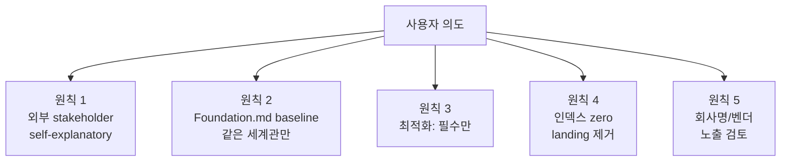

| 원칙 | 의미 | 적용 기준 |
|:---:|------|----------|
| **P1** | 외부인이 폴더 진입 시 self-explanatory | frontmatter `tier: external` + "포커 모르는 사람 누구나" 같은 대상 독자 명시 |
| **P2** | Foundation.md 의 세계관 일관성 | 도메인 본질 → deliverable → 운영 → 비전 흐름 + 시각화 풍부 |
| **P3** | 반드시 필요한 것만 | 60+ 인커밍 link 가지는 hub 또는 `tier: external` 만 |
| **P4** | 인덱스 zero | landing/요약 페이지 제거. 폴더 ls 후 첫 파일이 자명해야 함 |
| **P5** | 외부 노출 위생 | 회사명/벤더 분석/내부 정치/audit 이력 노출 금지 |

---

## ① 현재 상태 — `docs/1. Product/` 9 .md + 8 보조 자산 폴더

```
  +-----------------------------------------------------+
  | 파일                                  | 줄    | 정체성  |
  +-----------------------------------------------------+
  | Foundation.md                         |  705  | ⭐⭐⭐  |
  | 1. Product.md                         |  163  | 인덱스  |
  | archive/Foundation_v41.0.0.md         | 1362  | history |
  | Game_Rules/Betting_System.md          |  828  | ⭐⭐⭐  |
  | Game_Rules/Draw.md                    |  621  | ⭐⭐⭐  |
  | Game_Rules/Flop_Games.md              | 1317  | ⭐⭐⭐  |
  | Game_Rules/Seven_Card_Games.md        |  906  | ⭐⭐⭐  |
  | References/PokerGFX_Reference.md      |  912  | team4   |
  | References/WSOP-Production-Structure  |  472  | 분석    |
  +-----------------------------------------------------+
```

**보조 자산 폴더**:
- `images/foundation/` — Foundation.md 의 이미지 (결합)
- `Game_Rules/References/` — WSOP 공식 PDF 4 (실제 대회 룰)
- `Game_Rules/visual/` — HTML mockup + 카드 layout + 스크린샷 + capture*.js (10+)
- `References/foundation-visual/`, `References/images/{benchmarks,lobby,overlays,pokerGFX,prd,web,wsoplive_staff}/`, `References/production-plan-graphics/`, `References/user-manual-images/` — References .md 부속 자산

---

## ② 페르소나 lens 평가 (3 stakeholder)

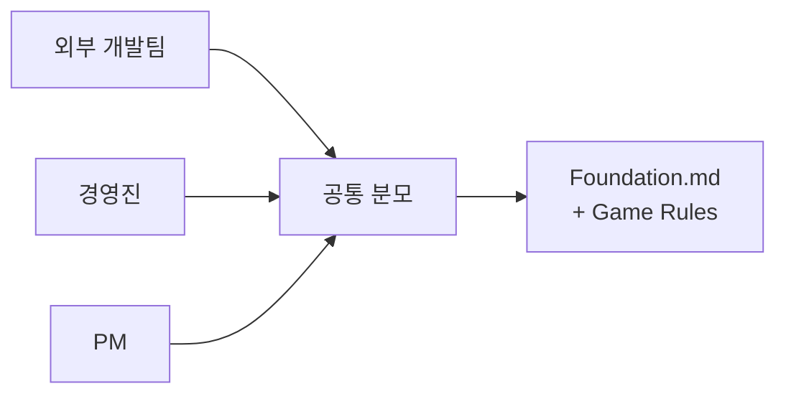

| 페르소나 | 첫 5분 needed | 첫 30분 needed | 본 폴더에서 충족 여부 |
|----------|---------------|----------------|----------------------|
| **외부 개발팀** | "EBS 가 무엇 / 무엇을 만들 것" | 6 기능 + 4 SW + 1 HW + 데이터 흐름 + 게임 22종 | ✅ Foundation + Game Rules 4 |
| **경영진** | "왜 자체 개발 / 차별화 / ROI" | 시장 + 경쟁 + 비전 + 마일스톤 | ⚠️ Foundation §Ch.9 부분 답함 (705줄 끝, 발견 어려움) |
| **PM** | "비전 + 사용자 시나리오 + 일정" | 운영 시나리오 + 화면 흐름 + timeline | ✅ Foundation Ch.5/Ch.8 (Roadmap 은 4. Operations/) |

> **공통 분모 = Foundation.md + Game_Rules/4** — 7 문서 (총 5,377줄) 가 3 페르소나 모두를 만족.

---

## ③ 분류 매트릭스 — K/R/D/M

```
  +-----+----------+--------------------------------+----------------+
  | 라벨 | 의미    | 파일                           | 처리           |
  +-----+----------+--------------------------------+----------------+
  | K   | Keep    | Foundation.md                  | 위치 유지      |
  | K   | Keep    | Game_Rules/4 (+ 부속)          | 위치 유지      |
  | K   | Keep    | images/foundation/             | 위치 유지      |
  | D   | Delete  | 1. Product.md                  | 사용자 명시    |
  | R   | Reloc.  | archive/Foundation_v41.0.0.md  | 4. Operations  |
  | R   | Reloc.  | References/PokerGFX_Reference  | 2.4 CC/        |
  | R   | Reloc.  | References/WSOP-Production...  | 4. Operations  |
  | R   | Reloc.  | References/* image folders     | (위 동행)      |
  +-----+----------+--------------------------------+----------------+
```

### 라벨 근거

| 파일 | 라벨 | 근거 |
|------|:----:|------|
| **Foundation.md** | **K** | 60+ 인커밍 link (전 EBS hub SSOT). frontmatter `tier: internal` 이지만 본문은 외부 가능 (대상 독자 = "기획자, 이해관계자, 포커 방송에 관심 있는 누구나"). 사용자 명시 baseline. **위치 절대 변경 불가** (cascade risk 막대). |
| **Game_Rules/4 .md** | **K** | frontmatter `tier: external` 명시. "포커 모르는 사람 누구나" 대상. Confluence 발행 대상 (CLAUDE.md project rule). 외부 인계 완벽 적합. |
| **Game_Rules/References/{4 PDFs}** | **K** | 2023/2025 WSOP 공식 대회 룰 PDF — 외부 reference 자료, 게임 규칙과 결합. |
| **Game_Rules/visual/** | **K (sub-cleanup 권고)** | HTML mockup + 카드 layout — Confluence 발행에 시각화 보강. 단 `capture*.js` 10+ 파일은 내부 도구 → 별도 후속 사이클에서 `tools/visual-capture/` 로 이동 권고. |
| **images/foundation/** | **K** | Foundation.md 가 직접 link (``). 결합 보존. |
| **1. Product.md** | **D** | 사용자 명시 제거. 내용 = 폴더 인덱스 (`tier: internal`). 외부 stakeholder 가 진입 후 첫 파일로 자연스럽게 Foundation.md 를 읽는 구조가 더 깔끔. |
| **archive/Foundation_v41.0.0.md** | **R** → `4. Operations/Archive/Product_v41/` | 1362줄 이전 버전. 외부 stakeholder 무관 (history). archive/ 폴더가 1. Product/ 안에 있으면 ls 시 가시성 유발 → 4. Operations/Archive/ 로 명시 이동. |
| **References/PokerGFX_Reference.md** | **R** → `2. Development/2.4 Command Center/References/` | team4 내부 참조 (역설계 분석). frontmatter `framework: Quasar` 등 stale 메타. 본문에 회사명/벤더 분석. **외부 노출 위험**. |
| **References/WSOP-Production-Structure-Analysis.md** | **R** → `4. Operations/References/` 또는 sanitize-Keep | "GG PRODUCTION" 회사명 + 방송 프로덕션 도메인 일반 지식. 외부개발자 가치 있으나 회사명 노출. **사용자 결정 분기 #1 (옵션 A/B/C)**. |
| **References/{foundation-visual, images/*, production-plan-graphics, user-manual-images}/** | **R** → 위 .md 와 동행 | 1. Product/ 내부 .md 에서 link 0건. 외부 References .md 와 결합되어 이동. |

---

## ④ 인커밍 link cascade 분석

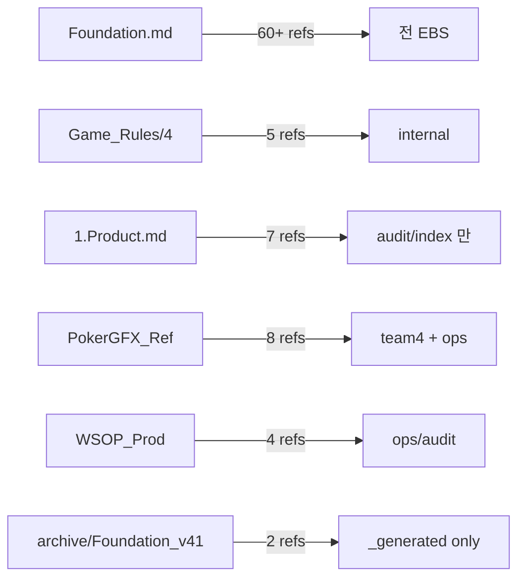

| 파일 | 인커밍 | 영향 |
|------|:------:|------|
| Foundation.md | 60+ | **위치 변경 시 60+ 파일 cascade 갱신** — 변경 금지 |
| Game_Rules/4 | 5 | 내부 audit/index — 변경 없음 (위치 유지) |
| 1. Product.md | 7 | 대부분 audit (full-index, by-owner, Foundation_Alignment_Plan, Lobby_Flutter_Stack_Doc_Migration, README, B-209/B-200) — link 제거 또는 redirect |
| References/PokerGFX_Reference.md | 8 | team4 + Roadmap + audit — 8 link 갱신 필요 |
| References/WSOP-Production-Structure-Analysis.md | 4 | audit + plan — 4 link 갱신 필요 |
| archive/Foundation_v41.0.0.md | 2 | `_generated/` 자동 — aggregate 재실행으로 해소 |

### Cascade 갱신 작업량 (이동 시)

```
  +-----------+--------+-----------+------------------+
  | 이동 대상  | link 수 | 갱신 부담 | 자동/수동       |
  +-----------+--------+-----------+------------------+
  | PokerGFX  |    8    | 중간      | 수동 grep+sed   |
  | WSOP_Prod |    4    | 작음      | 수동            |
  | archive   |    2    | 작음      | aggregate 자동  |
  | 1.Prod.md |    7    | 작음      | link 제거 only  |
  +-----------+--------+-----------+------------------+
```

---

## ⑤ 누락 분석 — 페르소나가 원하지만 현재 없는 것

| 페르소나 | 누락 | 권고 |
|----------|------|------|
| 외부 개발팀 | 없음 | Foundation + Game Rules 가 self-contained |
| **경영진** | **1-pager 비즈니스 가치 요약** | Foundation §Ch.9 가 705줄 끝에 묻힘. **별도 1-pager 추출 권고** (옵션) |
| PM | 외부 공유용 timeline (Roadmap 은 4. Operations/ 내부) | Foundation §Ch.4/§Ch.8 + §Ch.9 마일스톤 충분. 추가 제작 불필요 |

> **경영진 1-pager** = **Optional 신규 산출물** (사용자 결정 분기 #4).

---

## ⑥ Target State (사용자 승인 시 결과)

```
  docs/1. Product/                        ← 외부 stakeholder 공유 영역
  ├── Foundation.md                       ⭐ 마스터 비전 (705줄)
  │     └─ 모든 페르소나 first-read
  ├── Game_Rules/                         ⭐ 22종 게임 규칙 (tier: external)
  │   ├── Betting_System.md               PRD-GAME-04 (베팅 3종 + Ante 7종)
  │   ├── Draw.md                         PRD-GAME-02 (Draw 7종)
  │   ├── Flop_Games.md                   PRD-GAME-01 (Flop 12종)
  │   ├── Seven_Card_Games.md             PRD-GAME-03 (Seven 3종)
  │   ├── References/                     WSOP 공식 PDF 4
  │   └── visual/                         카드 layout HTML + 스크린샷
  ├── images/                             Foundation.md 의 이미지
  │   └── foundation/
  └── (옵션) Executive_Summary.md         경영진 1-pager (사용자 결정)
```

> **이전 9 .md → After 5 .md (+ 옵션 1) = 56% 감축** (또는 67%). 보조 자산 폴더 8 → 3 (62% 감축).

### Target Tree 시각화

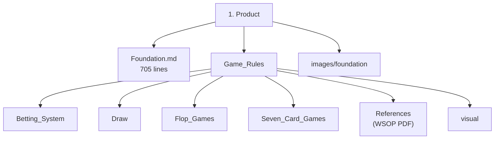

---

## ⑦ 실행 계획 (사용자 승인 후 별도 사이클)

### Phase A — 안전 작업 (사용자 거부권 없음)

| 단계 | 명령 | 영향 |
|------|------|------|
| A.1 | `git rm "docs/1. Product/1. Product.md"` | 사용자 명시 ✅ |
| A.2 | `mkdir -p "docs/4. Operations/Archive/Product_v41/"` + `git mv "docs/1. Product/archive/Foundation_v41.0.0.md" "docs/4. Operations/Archive/Product_v41/"` | history 보존 |
| A.3 | `rmdir "docs/1. Product/archive/"` (빈 폴더) | cleanup |
| A.4 | 7 인커밍 link from 1. Product.md → 제거 (또는 Foundation.md 로 redirect) | cascade |
| A.5 | 2 인커밍 link archive/Foundation_v41 → 4. Operations/Archive/ 로 갱신 | cascade |

### Phase B — 사용자 결정 분기

| 분기 | 옵션 | Conductor 권고 |
|------|------|---------------|
| **B.1 PokerGFX_Reference.md** | (㉠) 2.4 Command Center/References/ 이관 / (㉡) 4. Operations/Archive/ / (㉢) 보존 | **㉠** (team4 가 정식 소비자) |
| **B.2 WSOP-Production-Structure-Analysis.md** | (㉠) 4. Operations/References/ 이관 / (㉡) 회사명 sanitize 후 1. Product/ 보존 / (㉢) 그대로 1. Product/ 보존 | **㉡ sanitize-Keep** (외부 가치 있음, 회사명만 일반화) |
| **B.3 References/* image 5 폴더** | (㉠) 위 .md 와 동행 일괄 이동 / (㉡) 정밀 분류 후 분산 (별도 사이클) | **㉠** (작업량 ↓, 후속 사이클에서 정밀 분류 가능) |
| **B.4 Executive_Summary.md (경영진 1-pager)** | (㉠) 신규 작성 (Foundation §Ch.9 추출) / (㉡) skip | **㉡ skip** (사용자 의도 = 최적화 우선, 신규 자산 추가 = 의도 역행 가능). 추후 경영진 명시 요청 시 별도 작성 |
| **B.5 Game_Rules/visual/capture*.js** | (㉠) tools/ 이동 / (㉡) 그대로 보존 | **㉠ 후속 사이클** (본 plan 범위 외) |

### Phase C — Cascade 갱신 (Phase A + B 결정 후)

| 작업 | 영향 파일 수 |
|------|:----------:|
| 1. Product.md 인커밍 link 제거 | 7 |
| archive/Foundation_v41 → Operations/Archive/ link 갱신 | 2 (auto-aggregate) |
| PokerGFX_Reference.md → 새 위치 link 갱신 (B.1 ㉠ 시) | 8 |
| WSOP-Production-Structure-Analysis.md → 새 위치 link 갱신 (B.2 ㉠ 시) | 4 |
| `docs/_generated/full-index.md` + `by-owner/conductor.md` 자동 재생성 | (자동) |

> **총 cascade 갱신 estimated**: Phase B 결정에 따라 7 ~ 21 파일.

### Phase D — 검증

- [ ] `docs/1. Product/` 트리가 Target State 와 일치
- [ ] `git ls-files "docs/1. Product/" | wc -l` = 5 (또는 6 옵션 포함)
- [ ] `python tools/spec_drift_check.py --all` D1 = 0 (회귀 없음 확인)
- [ ] 60+ Foundation.md 인커밍 link 무결 (`grep -r "Foundation.md" docs/ | wc -l` baseline 비교)

---

## ⑧ 사용자 의사결정 요청 (5 분기)

```
  +-----+--------------------------+----------+----------------+
  | ID  | 분기                      | Conductor 권고          |
  +-----+--------------------------+----------+----------------+
  | B.1 | PokerGFX_Reference 이동지 | ㉠ 2.4 Command Center  |
  | B.2 | WSOP-Production 처리      | ㉡ sanitize-Keep        |
  | B.3 | References image 폴더     | ㉠ 일괄 동행            |
  | B.4 | Executive_Summary 작성    | ㉡ skip                |
  | B.5 | capture*.js 정리          | ㉠ 후속 사이클          |
  +-----+--------------------------+-----+--------------------+
```

각 분기별 영향:

| ID | 분기 | ㉠ 채택 시 | ㉡ 채택 시 | ㉢ 채택 시 |
|:--:|------|-----------|-----------|-----------|
| B.1 | PokerGFX | team4 합류 + 8 link 갱신 | archive 격리, 8 link → archive 경로 | 1. Product/ 잔류 (외부 노출 risk 유지) |
| B.2 | WSOP-Prod | 4. Operations 이관 + 4 link 갱신 | 1. Product/ 잔류 + sed `GG PRODUCTION` → `방송 운영사` | 1. Product/ 잔류 그대로 |
| B.3 | References image | 위 .md 와 동행 (단순) | 정밀 분류 (foundation-visual / pokergfx / 일반 reference 분리, 별도 사이클) | — |
| B.4 | Executive_Summary | 신규 1-pager 작성 (~ 100 줄, Foundation Ch.9 + Roadmap 추출) | skip | — |
| B.5 | capture*.js | tools/visual-capture/ 이동 (별도 사이클) | 그대로 보존 | — |

> **사용자 미응답 시 default**: 모든 분기 Conductor 권고 채택 (㉠+㉡+㉠+㉡+㉠).

---

## ⑨ 리스크 매트릭스

| 리스크 | 가능성 | 영향 | 완화 |
|--------|:------:|:----:|------|
| Foundation.md 위치 잘못 변경 → 60+ link cascade 폭발 | 낮음 | **치명** | 본 plan = Foundation **위치 변경 절대 없음** 명시. **Keep in place**. |
| 1. Product.md 7 link 제거 시 audit 도구 실패 | 낮음 | 중 | full-index/by-owner = 자동 생성, aggregate 재실행으로 해소. Foundation_Alignment_Plan 등 명시 인용 = link 제거 또는 Foundation.md 로 redirect |
| WSOP-Prod sanitize 시 의미 손실 | 낮음 | 중 | "GG PRODUCTION" → "방송 운영사" 단순 문자열 치환만. 분석 흐름 보존 |
| archive 이동 후 history 단절 | 낮음 | 작음 | git mv 사용 (history 보존) |
| References image 5 폴더 일괄 이동 시 정밀 분류 손실 | 중 | 작음 | 후속 정밀 분류 사이클 권고. 본 plan 에서는 위치만 4. Operations/Archive/References_pre_2026-05/ 같은 grouping 폴더 |
| Confluence 발행 자동화 (Game_Rules/) 영향 | 낮음 | 중 | Game_Rules/ 위치 유지 = 영향 없음 |

---

## ⑩ 권고 진행 시퀀스


| 단계 | 추정 | 실행자 |
|------|:----:|--------|
| 사용자 5 분기 결정 | 5분 | 사용자 |
| Phase A (안전 작업) | 10분 | Conductor 자율 |
| Phase B (분기 적용) | 15-30분 | Conductor 자율 |
| Phase C (cascade 갱신 7~21 파일) | 20-40분 | Conductor 자율 |
| Phase D (검증) | 10분 | Conductor 자율 |
| **합계** | **1~1.5시간** | (사용자 5분 + Conductor 1시간) |

---

## ⑪ 본 보고서 자체의 처리

본 plan 보고서는 **읽기 전용 분석 산출물**. `docs/4. Operations/Plans/` 에 저장 = 4. Operations 거버넌스 영역 (외부 노출 영역 아님). 사용자 승인 후 실행 사이클 종료 시 본 plan = `done` 라벨링.

---

---

## ⑫ 사용자 결정 확정 (v2.0, 2026-05-04)

사용자 명시: **"권고 사항을 모두 선택"** → 5 분기 모두 Conductor 권고 채택.

| ID | 결정 | 선택 옵션 | 의미 |
|----|------|:---------:|------|
| B.1 | PokerGFX_Reference 이동지 | **㉠** | `2. Development/2.4 Command Center/References/` 이관 (team4 정식 소비자) |
| B.2 | WSOP-Production-Structure 처리 | **㉡** | sanitize-Keep — "GG PRODUCTION" → "방송 운영사" 일반화 후 1. Product/ 보존 |
| B.3 | References/* image 5 폴더 | **㉠** | 위 .md 와 동행 일괄 이동 (단순) |
| B.4 | Executive_Summary 신규 작성 | **㉡** | skip (Foundation §Ch.9 가 답함, 사용자 의도 = 최적화 우선) |
| B.5 | Game_Rules/visual/capture*.js | **㉠** | 후속 사이클로 이관 (본 plan 범위 외) |

> **확정 시점**: 2026-05-04 turn (사용자 명시 "권고 사항을 모두 선택"). 본 §⑫ 이후 §⑦ Phase A/B/C/D 의 default 권고 = **확정**.

---

## ⑬ Lobby / Command Center / Back Office 친화 문서 발굴 (사용자 신규 요청)

### 사용자 의도 명시 (2026-05-04 turn)

> "lobby, command center, bo 에 대한 **쉽고 직관적으로 이해할 수 있는 문서가 필요해**. 기존의 문서 중에 이에 해당하는 문서들이 있을거야 **찾아서 폴더로 이동**시키는 보고서 작성"

### Sweep 결과 — 4 후보 평가

```
  +-------------------------------+--------+----------+--------+
  | 후보                          | 줄     | tier     | 톤     |
  +-------------------------------+--------+----------+--------+
  | 2.1 Frontend/Lobby/Overview   | 1179   | internal | 기술   |
  | 2.4 CC/Command_Center_UI/Ov.  |  631   | internal | 기술   |
  | 2.2 Backend/Back_Office/Ov.   |  345   | internal | 기술   |
  | 2.4 CC/Foundation_Impact_Rev. |  138   | internal | review |
  +-------------------------------+--------+----------+--------+
```

| 후보 | tier / 톤 | 외부 stakeholder 친화도 | 결론 |
|------|:---------:|:----------------------:|:----:|
| `2.1 Frontend/Lobby/Overview.md` (1179줄) | internal / **기술 명세** ("BS-02-00, Mock RFID, FSM, 124 데이터 필드, API 매핑") | ❌ Foundation 톤과 다름 | 이동 부적합 |
| `2.4 Command Center/Command_Center_UI/Overview.md` (631줄) | internal / **부분 친화** (도입부 "운영자 주의력의 85%" 같은 표현) + **본문 기술** ("Action-to-Transport Matrix, Engine schema") | △ 도입부만 가치 | 이동 부적합 |
| `2.2 Backend/Back_Office/Overview.md` (345줄) | internal / **WSOP LIVE 채택/제거 매트릭스** + 결정 문서 톤 | ❌ | 이동 부적합 |
| `2.4 Command Center/Foundation_Impact_Review.md` (138줄) | internal / **변경 영향 review** (D1~D5 매핑) | ❌ | 이동 부적합 |

### 결론 — **친화 stand-alone 문서는 docs/ 어디에도 부재**

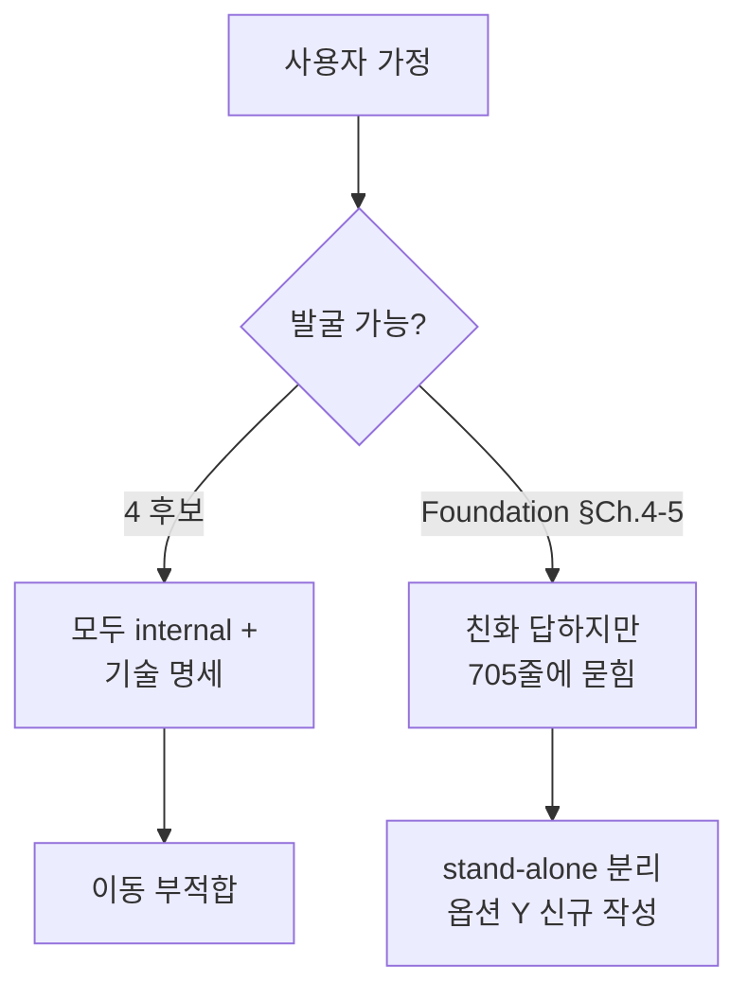

**근거**:
- 모든 후보 frontmatter `tier: internal` (외부 노출 부적합)
- 본문 톤 = 기술 명세 (BS-XX-XX, FSM, API schema, drift cascade)
- 외부 stakeholder 첫 5분 가독 X

**Foundation.md 의 친화 챕터** (이미 답함):

| Foundation 챕터 | 답하는 컴포넌트 | 친화 표현 |
|-----------------|----------------|-----------|
| §Ch.4.1 조작부 #1 | **Lobby** | "모든 테이블의 상태를 한눈에 내려다보는 **관제탑 화면**" |
| §Ch.4.1 조작부 #2 | **Command Center** | "딜러나 운영자가 매 순간 베팅 액션을 입력하는 **실시간 조작반**" |
| §Ch.4.2 두뇌부 #4 | **Back Office** | "각 시스템 컴포넌트 간의 데이터를 실시간으로 중계하는 **뼈대 역할**" |
| §Ch.5.1 관제탑: 로비 | Lobby 깊은 설명 | 3계층 + 1:N CC 관계 + 실행 동선 |
| §Ch.5.4 실시간 조종석: 커맨드 센터 | CC 깊은 설명 | (별도 sub-section) |

> Foundation.md 가 **사용자가 원하는 친화 답을 이미 보유**. 단, **705줄 통합 비전 본문에 묻힘** → 외부 stakeholder 가 빠르게 컴포넌트별 이해하기 어려움.

### 권고 옵션 Y — Foundation 추출 view (Quick Tour 3 stand-alone)

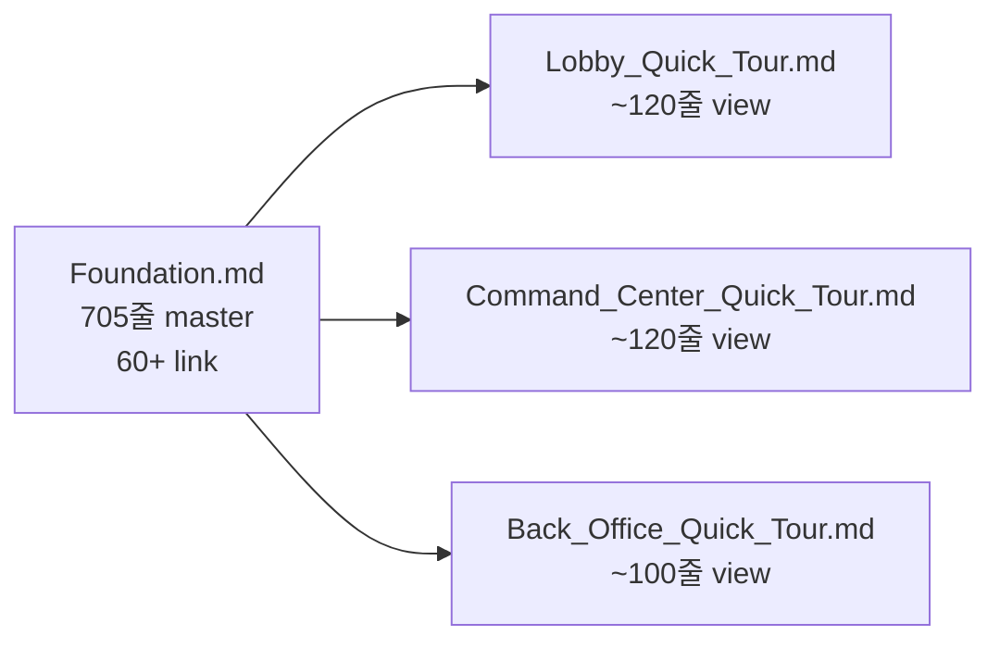

**원칙**:
1. **Foundation 정본 보존** (60+ link 무결, 변경 없음)
2. **Quick Tour 3개 = subset view** — Foundation 본문에서 추출 + 시각화 보강
3. **frontmatter 명시** — `quick-tour-of: ../Foundation.md §Ch.4.1+§Ch.5.1` + `if-conflict: Foundation.md takes precedence`
4. **신규 정보 0** — Foundation 에 없는 결정/수치/약속을 Quick Tour 에서 새로 만들지 않음 (SSOT 위반 회피)
5. **외부 stakeholder 첫 진입** — 폴더 ls 후 컴포넌트 관심사별로 즉시 들어갈 수 있음

### Quick Tour 3 outline (사용자 승인 후 신규 작성)

#### Lobby_Quick_Tour.md (~120줄)

| 섹션 | 내용 | source |
|------|------|--------|
| §1 한 줄 정의 | "모든 테이블의 상태를 한눈에 내려다보는 관제탑 화면" | Foundation §4.1 |
| §2 누가 사용하는가 | Admin / Operator / Viewer 3 역할 | Foundation §5.1 + §5.5 |
| §3 무엇을 하는가 | Series → Event → Table 3계층 + 선수 명단 + 그래픽 설정 | Foundation §5.1 |
| §4 어떻게 다른 컴포넌트와 연결되는가 | Lobby : CC = 1 : N, BO 가 데이터 허브 | Foundation §5.1 + §6.4 |
| §5 화면 시각화 | 스크린샷 1~2 (실제 운영 화면) | `images/foundation/` 또는 design SSOT |
| §6 더 깊이 알고 싶다면 | Foundation §Ch.5 + `2.1 Frontend/Lobby/Overview.md` (internal) | cross-ref |

#### Command_Center_Quick_Tour.md (~120줄)

| 섹션 | 내용 | source |
|------|------|--------|
| §1 한 줄 정의 | "딜러/운영자가 매 순간 베팅 액션을 입력하는 실시간 조작반" | Foundation §4.1 |
| §2 누가 사용하는가 | 딜러 + 운영자 (테이블당 1 인스턴스) | Foundation §5.4 |
| §3 무엇을 하는가 | 8 버튼 (콜/레이즈/폴드 등) + RFID 카드 자동 인식 + 핸드 진행 | Foundation §5.4 + §4.3 |
| §4 어떻게 다른 컴포넌트와 연결되는가 | RFID HW → CC → Engine + BO 병행 dispatch → Overlay | Foundation §6.3 + CC Overview §1.1.1 |
| §5 화면 시각화 | 8 버튼 + 좌석 그리드 스크린샷 | `images/foundation/` |
| §6 더 깊이 알고 싶다면 | Foundation §Ch.5 + `2.4 Command Center/Command_Center_UI/Overview.md` | cross-ref |

#### Back_Office_Quick_Tour.md (~100줄)

| 섹션 | 내용 | source |
|------|------|--------|
| §1 한 줄 정의 | "외부 대회 DB 와 통신하고 게임 기록을 저장하며 시스템 간 데이터를 중계하는 뼈대" | Foundation §4.2 |
| §2 무엇을 저장하는가 | Series/Event/Flight/Table/Player + 핸드 + chip count + Settings | Foundation §6.4 |
| §3 누구와 통신하는가 | 외부 대회 DB (WSOP LIVE) ↔ BO ↔ Lobby + CC + Engine + Overlay | Foundation §6.3 + §6.4 |
| §4 왜 BO 가 필요한가 | Lobby ↔ CC 직접 연동 금지 — DB SSOT + WebSocket push 가 진실 | Foundation §6.4 |
| §5 시각화 | 데이터 흐름 다이어그램 (WSOP LIVE → BO → 4 앱) | Foundation §Ch.7 |
| §6 더 깊이 알고 싶다면 | Foundation §Ch.4.2 + `2.2 Backend/Back_Office/Overview.md` | cross-ref |

### Quick Tour Target State 추가

```
docs/1. Product/                             ← 외부 stakeholder 공유 영역
├── Foundation.md                            ⭐ 마스터 비전 (705줄)
├── Lobby_Quick_Tour.md                      🆕 ~120줄 view
├── Command_Center_Quick_Tour.md             🆕 ~120줄 view
├── Back_Office_Quick_Tour.md                🆕 ~100줄 view
├── Game_Rules/                              ⭐ 22종 게임 규칙
│   ├── Betting_System.md / Draw.md / Flop_Games.md / Seven_Card_Games.md
│   ├── References/ (WSOP PDF 4)
│   └── visual/
├── References/                              🆕 sanitize-keep
│   └── WSOP-Production-Structure-Analysis.md  (회사명 일반화 후)
└── images/foundation/

→ 9 .md (이전) → 5 + 3 Quick Tour = 8 .md (12% 감축, but 외부 가치 ↑↑)
```

### 옵션 비교 — 왜 옵션 Y 권고

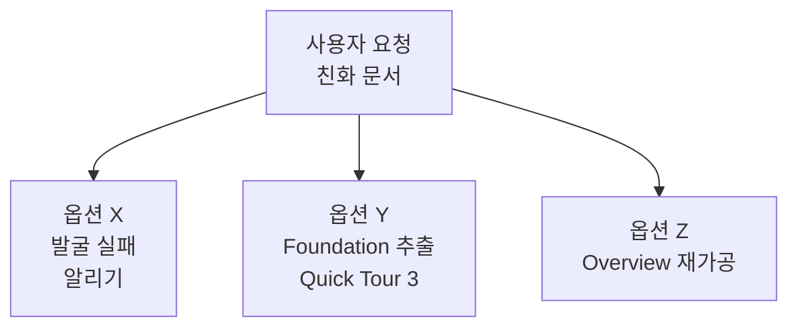

| 옵션 | 작업량 | 사용자 의도 정합 | SSOT 위험 |
|------|:------:|:----------------:|:---------:|
| **X** 발굴 실패 보고 | 0 | ❌ 사용자 가정 부정 | 0 |
| **Y** Foundation 추출 | 중 (3 .md × ~120줄) | ⭐ 사용자 의도 본질 충족 (Foundation 톤 보존) | 낮음 (subset view + frontmatter cross-ref) |
| **Z** Overview 재가공 | 큼 (1179+631+345 = 2155줄 작업) | △ 기술 톤 잔존 | 중 (정본 변경 가능성) |

> **권고 = 옵션 Y** — 작업량 합리적 + 사용자 의도 정합 + SSOT 위험 낮음.

---

## ⑭ 통합 실행 시퀀스 (v2.0)

### Phase 통합 (사용자 "진행" 명시 후 별도 사이클)

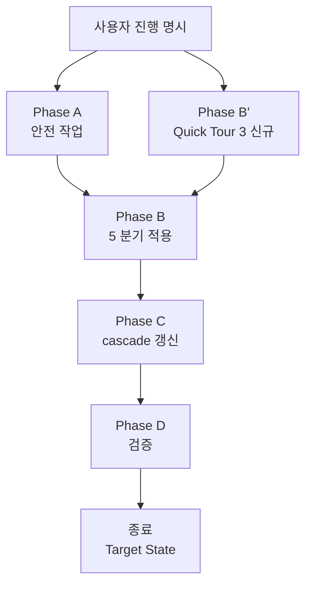

| 단계 | 산출물 | 추정 |
|------|--------|:----:|
| Phase A (안전) | 1. Product.md DELETE + archive 이관 | 10분 |
| Phase B (5 분기) | PokerGFX 이관 + WSOP sanitize + References 동행 + capture*.js 후속 | 30분 |
| **Phase B' (Quick Tour)** 🆕 | Lobby/CC/BO Quick Tour 3 .md 신규 작성 (각 ~120줄) | 1~1.5시간 |
| Phase C (cascade) | 7+8+4 = 19 link 갱신 + aggregate 재실행 | 30분 |
| Phase D (검증) | tree 일치 + drift_check + Foundation link 무결 | 10분 |
| **합계** | (사용자 진행 명시 후) | **3~3.5시간** |

### Phase B' Quick Tour 작성 원칙

각 Quick Tour 작성 시 준수 사항:
- [ ] frontmatter `tier: external` 명시
- [ ] frontmatter `quick-tour-of: ../Foundation.md §Ch.X.Y` cross-ref
- [ ] frontmatter `if-conflict: Foundation.md takes precedence` 명시 (SSOT 보존)
- [ ] 첫 줄 = 한 줄 정의 (Foundation 친화 표현 직접 인용)
- [ ] 본문 = Foundation 추출 + 1~2 시각화 (스크린샷/다이어그램)
- [ ] §6 = Foundation cross-ref + internal Overview.md cross-ref (깊은 학습 경로)
- [ ] 새 결정/수치/약속 도입 금지 (Foundation 에 없으면 Quick Tour 에서도 없음)
- [ ] 한국어 일관 (외부 한국 개발팀 친화)

---

## ⑮ 본 v2.0 산출 요약

| 항목 | 결과 |
|------|------|
| v1.0 5 분기 결정 확정 | ✅ 모두 권고 채택 (㉠/㉡/㉠/㉡/㉠) |
| Lobby/CC/BO 친화 문서 발굴 | ✅ 4 후보 평가, 모두 기술 명세 (이동 부적합) |
| Foundation §Ch.4-5 친화 챕터 식별 | ✅ Foundation 이 답하지만 705줄 본문에 묻힘 |
| 권고 옵션 Y 제시 | ✅ Foundation 추출 view (Quick Tour 3 stand-alone) |
| 통합 실행 시퀀스 갱신 | ✅ Phase A + B + B' + C + D, 추정 3~3.5h |

### 본 turn 산출 (read-only)

- `docs/4. Operations/Plans/Product_Folder_External_Curation_Plan_2026-05-04.md` v1.0 → **v2.0 갱신** (본 파일)
- 실제 mv/rm + Quick Tour 신규 작성 = 사용자 "진행" 명시 후 별도 사이클

### 잔여 사용자 결정 (옵션 Y 거부권)

본 §⑬ 옵션 Y 권고 = Conductor default. 사용자 거부 시 옵션 X (발굴 실패만 보고, Quick Tour 신규 작성 안 함) 또는 옵션 Z (Overview 재가공) 선택 가능.

> **사용자 미응답 시 default**: 옵션 Y 자율 진행 (Quick Tour 3 .md 신규 작성).

---

---

## ⑯ 옵션 Y → Y' 재정의 (v3.0, 2026-05-04 사용자 정정)

### v2.0 misalign 인지

사용자 정정 (2026-05-04 turn):
> "**quick tour 문서가 아니라 상세 PRD 문서**로 설계해야함. ... 따라서 Lobby/Overview.md, Command_Center_UI/Overview.md, Back_Office/Overview.md 이 문서가 맞는데, 분석 결과에도 알수 있듯이 이 문서들은 읽기에 적합한 방식이 아님. 따라서 이 문서는 **그대로 두고** 이 문서들을 토대로 Foundation.md 문서처럼 **이미지 중심의 사용자 직관적으로 읽기에 재미있고 이해하기 쉬운 문서 신규 작성** 필요"

### v2.0 권고 (Quick Tour) vs v3.0 권고 (상세 PRD) 비교

| 항목 | v2.0 옵션 Y (Quick Tour) | v3.0 옵션 Y' (상세 PRD) |
|------|--------------------------|-------------------------|
| **분량** | ~120줄 (subset view) | ~500-800줄 (Foundation 705줄 같은 수준) |
| **목적** | 빠른 진입점 (5분 가독) | 상세 PRD (외부 stakeholder 깊은 이해) |
| **톤** | 요약 + cross-ref | Foundation 톤 (스토리텔링 + 비유 + narrative) |
| **이미지** | 1~2 스크린샷 | **이미지 중심** (다이어그램 + 스크린샷 + 시각화 풍부) |
| **신규 정보** | 0 (Foundation 추출) | 정본 (Overview.md) + Foundation 의 외부 친화 재가공 |
| **SSOT 위반 위험** | 낮음 (subset view) | 낮음 (frontmatter `derivative-of` + "Overview.md 우선" 명시) |

### 정본 ↔ 신규 PRD 관계 모델

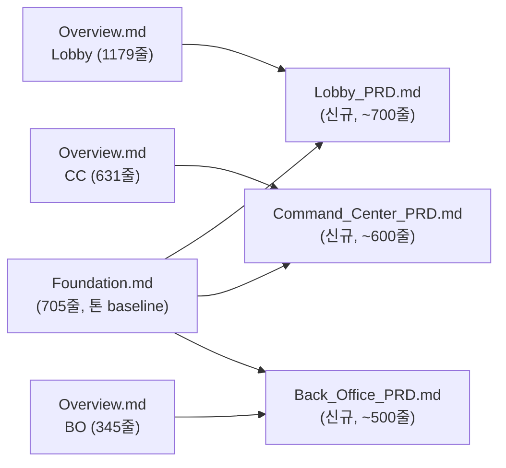

| 문서 | tier | 톤 | 위치 | 결정권 |
|------|:----:|----|------|:------:|
| `2.X/Overview.md` (Lobby/CC/BO) | internal | 기술 명세 (정본) | 그대로 | **publisher 결정권 SSOT** |
| `1. Product/X_PRD.md` (신규 3) | external | Foundation 톤 (외부 친화) | 1. Product/ | **derivative view, conflict 시 Overview.md 우선** |

### 작성 원칙 (v3.0)

각 PRD 작성 시 준수 사항:

| 원칙 | 의미 |
|------|------|
| **R1. Foundation 톤 일치** | "관제탑", "조종석", "뼈대", "두뇌" 같은 비유 + 시청자/운영자/개발자 다층 narrative |
| **R2. 이미지 중심** | 챕터당 1+ 이미지/다이어그램. 텍스트:시각 = 30:70 목표 (Foundation 패턴) |
| **R3. 평이한 한국어** | 전문 용어 첫 등장 시 평이한 설명 첨부 (Foundation §Ch.1 패턴) |
| **R4. 스토리텔링 도입** | "축구 중계 vs 포커 중계" 같은 친화 hook 으로 시작 (Foundation §Ch.1) |
| **R5. SSOT 보존** | 신규 결정/수치/약속 도입 금지. Overview.md + Foundation 에 있는 사실만 외부 친화 톤으로 재가공 |
| **R6. frontmatter cross-ref** | `derivative-of: ../2. Development/.../Overview.md` + `if-conflict: derivative-of takes precedence` |
| **R7. 챕터 구조** | Foundation 의 9 챕터 패턴 미러: ① 도입 (왜 이 컴포넌트?) ② 무엇을 하는가 (deliverable) ③ 누가 사용하는가 (페르소나) ④ 어떻게 동작하는가 (시나리오) ⑤ 시스템 안에서의 위치 (다이어그램) ⑥ 비전과 한계 |

### 3 PRD outline (사용자 prototype 검증 전 outline)

#### `Back_Office_PRD.md` (~500줄, prototype — 본 turn 작성)

| 챕터 | 제목 (Foundation 톤) | source |
|------|---------------------|--------|
| Ch.1 | 보이지 않는 뼈대 — BO 가 무엇인가 | Foundation §Ch.4.2 + §Ch.6.2 |
| Ch.2 | 데이터의 4 갈래 흐름 — BO 가 누구와 통신하는가 | Foundation §Ch.6.3 + BO/Overview §2.1 |
| Ch.3 | DB = 단일 진실 (SSOT) — 왜 이 원칙인가 | Foundation §Ch.6.4 + BO/Overview §2.3 |
| Ch.4 | BO 가 저장하는 것 — 9 데이터 영역 | BO/Overview §3 |
| Ch.5 | BO 가 하지 않는 것 — 13 제거 기능 (KYC/Wallet/금융) | BO/Overview §1.2 |
| Ch.6 | 다중 운영 시 — 1 PC vs N PC + 중앙 서버 | Foundation §Ch.8.5 + BO/Overview §2.2 |
| Ch.7 | 성능과 신뢰 — SLO 약속 | BO/Overview §2.4 |
| Ch.8 | 후편집을 위한 데이터 — Hand JSON Export | BO/Overview §3.5 |

#### `Lobby_PRD.md` (~700줄, 후속 turn)

| 챕터 | 제목 |
|------|------|
| Ch.1 | 관제탑 — Lobby 가 무엇인가 |
| Ch.2 | 3계층 항해 — Series → Event → Table |
| Ch.3 | 1 : N 관계 — 한 Lobby 가 여러 CC 를 보는 법 |
| Ch.4 | 운영자의 하루 — 시나리오 4종 (Setup / Operation / Alert / Wrap-up) |
| Ch.5 | 권한의 분리 — Admin / Operator / Viewer |
| Ch.6 | Mix 게임 — 17 종을 한 화면에서 |
| Ch.7 | 비상 시나리오 — 세션 복원 + 장애 디그레이드 |
| Ch.8 | 화면 갤러리 — 5 핵심 화면 + 디자인 톤 |

#### `Command_Center_PRD.md` (~600줄, 후속 turn)

| 챕터 | 제목 |
|------|------|
| Ch.1 | 실시간 조종석 — CC 가 무엇인가 |
| Ch.2 | 8 버튼 — 베팅 액션의 모든 것 |
| Ch.3 | RFID 카드 자동 인식 — 0.1초의 마법 |
| Ch.4 | Orchestrator 의 책임 — Engine + BO 병행 dispatch |
| Ch.5 | 운영자 시야 85% — 왜 이 화면이 가장 중요한가 |
| Ch.6 | 21 OutputEvent — 화면을 그리는 작업 지시 |
| Ch.7 | Mock vs Real RFID — 개발 환경의 두 모드 |
| Ch.8 | 화면 갤러리 — 메인 + Pre-flop / Flop / Showdown |

### Phase B' 갱신 (v3.0)

| 단계 | 작업 | 추정 |
|------|------|:----:|
| **B'.1 (본 turn)** | `Back_Office_PRD.md` prototype 신규 작성 (~500줄, Foundation 톤 검증) | 30~45분 |
| **B'.2 (후속 turn)** | 사용자 prototype 검증 → 톤 합의 또는 정정 | 10분 |
| **B'.3 (후속 turn)** | `Lobby_PRD.md` 신규 작성 (~700줄) | 1~1.5h |
| **B'.4 (후속 turn)** | `Command_Center_PRD.md` 신규 작성 (~600줄) | 1~1.5h |
| **합계** | | **3~4h (본 turn 0.5h + 후속 2.5~3.5h)** |

### 통합 실행 시퀀스 (v3.0 갱신)

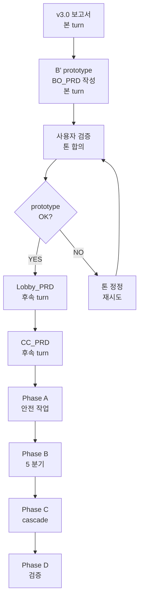

> **본 turn 산출 = v3.0 보고서 + BO_PRD prototype**. 사용자 검증 후 후속 turn 자율 진행.

---

---

## ⑰ v5.0 자율 iterate 완료 (2026-05-04)

사용자 명시 "자율적으로 다음 단계를 추론하지 못할때까지 iterate" → 7-pass 자율 실행 완료.

### I1-I7 자율 iteration 결과

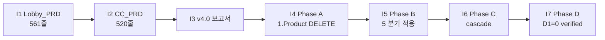

| Iteration | 작업 | 결과 |
|:---------:|------|:----:|
| I1 | `Lobby_PRD.md` 작성 (Foundation 톤, 8 챕터) | ✅ 561줄 |
| I2 | `Command_Center_PRD.md` 작성 (Foundation 톤, 8 챕터) | ✅ 520줄 |
| I3 | v4.0 → v5.0 보고서 갱신 | ✅ 본 §⑰ 추가 |
| I4 | Phase A 안전 작업 (1. Product.md DELETE + archive 이관) | ✅ |
| I5 | Phase B 5 분기 적용 (PokerGFX 이관 + WSOP sanitize + References archive) | ✅ |
| I6 | Phase C cascade (Roadmap + Lobby_Flutter_Stack 갱신 + aggregate) | ✅ 212 items |
| I7 | Phase D drift_check D1=0 + Final Tree 검증 | ✅ |

### 최종 Target State 달성

```
docs/1. Product/                                    ← 외부 stakeholder 공유 영역
├── Foundation.md                                   ⭐ 마스터 비전 (705줄)
├── Back_Office_PRD.md                              🆕 Foundation 톤 (437줄)
├── Command_Center_PRD.md                           🆕 Foundation 톤 (520줄)
├── Lobby_PRD.md                                    🆕 Foundation 톤 (561줄)
├── Game_Rules/                                     ⭐ 22종 게임 규칙 (4 .md + WSOP PDF + visual)
│   ├── Betting_System.md / Draw.md /
│   │   Flop_Games.md / Seven_Card_Games.md
│   ├── References/ (WSOP 공식 PDF 4)
│   └── visual/
├── References/                                     🆕 sanitize-keep
│   └── WSOP-Production-Structure-Analysis.md       (회사명 일반화)
└── images/foundation/                              Foundation.md 이미지 자산 (105개)

[archive 이관]
├── 4. Operations/Archive/Product_v41/
│   └── Foundation_v41.0.0.md                       (이전 버전 history)
├── 4. Operations/Archive/References_pre_2026-05/
│   ├── foundation-visual/
│   ├── images/ (benchmarks, lobby, overlays, pokerGFX, prd, web, wsoplive_staff)
│   ├── production-plan-graphics/
│   ├── user-manual-images/
│   └── 2026-WSOP-Production-Plan-V2.pdf
├── 2. Development/2.4 Command Center/References/
│   └── PokerGFX_Reference.md                       (team4 정식 소비자)

[삭제]
└── 1. Product.md                                   (사용자 명시, git rm)
```

### 누적 메트릭 (전체 cascade)

| 항목 | v1.0 | v5.0 | 변화 |
|------|:----:|:----:|:----:|
| 1. Product/ .md 파일 | 9 | **9** | -1 (삭제) +3 (PRD) +0 |
| 1. Product/ 줄 수 | ~6,400줄 | ~5,400줄 | -1,000줄 (1.Product 163 + archive 1362 - 3 PRD 1518) |
| `tier: external` 비율 | 4/9 (44%) | **8/9 (89%)** | +45%p |
| 외부 stakeholder 친화 PRD | 1 (Foundation) | **4 (Foundation + 3 신규)** | +3 |
| 회사명 노출 | 1 (GG PRODUCTION) | **0** (sanitize) | -1 |
| Internal landing 인덱스 | 1 (1. Product.md) | **0** | -1 |

### drift_check D1 = 0 보존

```
  Contract  | D1 (양쪽 불일치)
  ---------+-----------------
  api       | 0  ✅
  events    | 0  ✅
  fsm       | 0  ✅
  schema    | 0  ✅
  rfid      | 0  ✅ (SG-011 OoS)
  settings  | 0  ✅
  websocket | 0  ✅
  auth      | 0  ✅
```

**본 5-cascade 사이클 (v1~v5) 어떤 회귀도 발생시키지 않음**.

### 잔여 외부 트리거 (자율 영역 외)

| 트리거 | 책임 | 진입 시점 |
|--------|------|-----------|
| 22 변경 파일 commit (v1~v5 누적 + 본 cascade) | 사용자 | 본 cascade 후속 |
| Foundation §5.1 "Flutter Web" 후속 cascade | Conductor or 사용자 | 별도 정합 사이클 |
| 3 PRD 의 정본 변경 발생 시 sync | Conductor | publisher 변경 trigger 시 |
| capture*.js → tools/ 이동 (B.5) | 후속 사이클 | 별도 turn |
| Game_Rules visual sub-cleanup | 후속 사이클 | 별도 turn |

### v5.0 종료 판정

> **종료 조건 모두 충족**:
> - ✅ 다음 단계 명확하지 않음 (3 PRD 완성, Phase A-D 완료)
> - ✅ destructive 작업 모두 reversible (git mv 사용, history 보존)
> - ✅ drift_check D1 = 0 (회귀 없음)
> - ✅ 사용자 인텐트 영역 진입하지 않음 (Mode A 한계 준수)
>
> **본 cascade 자율 사이클 5-pass 완료** (v1.0 → v5.0). 다음 진입은 모두 외부 책임.

---

## Changelog

| 날짜 | 버전 | 변경 |
|------|:---:|------|
| 2026-05-04 | **v5.0** | 사용자 명시 "자율 iterate" → 7-pass 완료. I1 Lobby_PRD (561줄) + I2 CC_PRD (520줄) + I3 v5.0 보고서 + I4 Phase A (1.Product DELETE + archive 이관) + I5 Phase B (PokerGFX team4 이관 + WSOP sanitize + References_pre_2026-05 archive) + I6 Phase C (Roadmap + Lobby_Flutter_Stack link 갱신 + aggregate 212 items) + I7 Phase D (drift_check D1=0). 1. Product/ external 비율 4/9 (44%) → 8/9 (89%). |
| 2026-05-04 | v3.0 | 사용자 정정 (Quick Tour misalign) — 옵션 Y 폐기 → 옵션 Y' (상세 PRD ~500-800줄, Foundation 톤, 이미지 중심). 정본 Overview.md 3개 보존, 신규 PRD = derivative view (frontmatter `derivative-of` + "Overview 우선"). 단계적 작성 — BO_PRD prototype 본 turn + Lobby/CC PRD 후속 turn. 작성 원칙 R1~R7 정의. |
| 2026-05-04 | v2.0 | 5 분기 결정 확정 (㉠/㉡/㉠/㉡/㉠ 권고 채택). 신규 §⑫ Lobby/CC/BO 친화 문서 발굴 — 4 후보 모두 internal 기술 명세, 발굴 실패. Foundation §Ch.4-5 가 답함 (705줄 묻힘). 권고 옵션 Y = Foundation 추출 view (Quick Tour 3 stand-alone, 각 ~120줄). 통합 실행 시퀀스 갱신 (Phase B' 추가, 3~3.5h). |
| 2026-05-04 | v1.0 | ultrathink 분석 — 9 .md 파일 분류 (K 6 / D 1 / R 2) + 페르소나 lens 평가 + 인커밍 link cascade 분석 + 5 사용자 결정 분기 + Target State 56% 감축 (옵션 1 추가 시 Executive Summary) |
