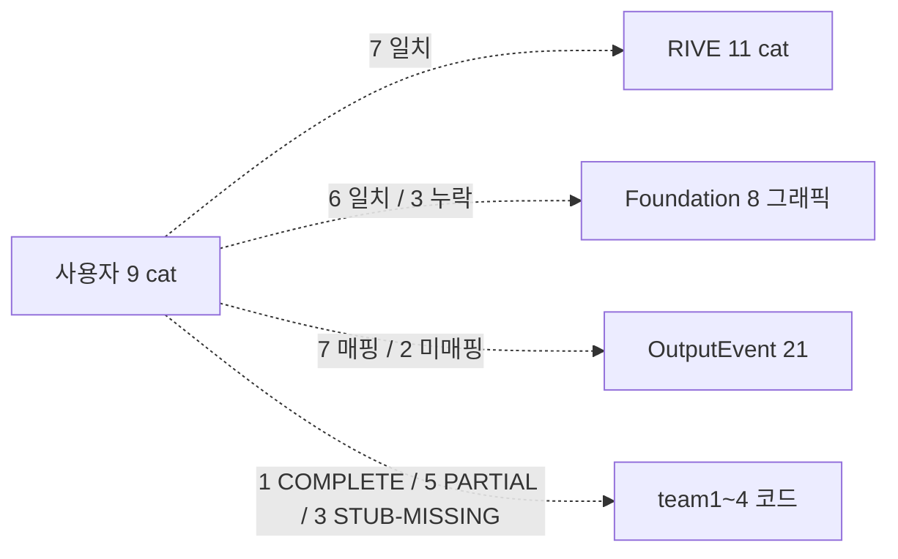
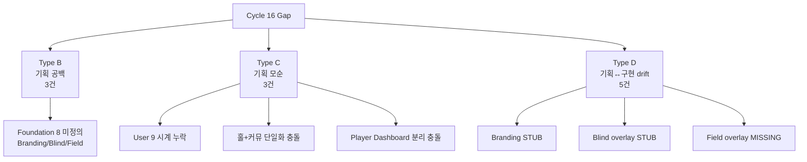
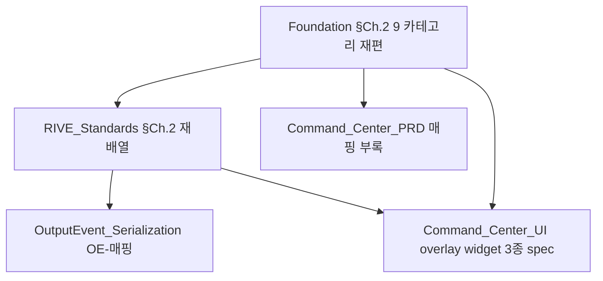

# Overlay 9 Categories Mapping Audit (Cycle 16)

> 사용자 명시 인텐트 (시청자 시선 기반 9 카테고리) vs 현재 spec (RIVE 11 / Foundation 8 / OutputEvent 21) vs team1~4 코드 구현 4-way 정합 검증. **결론: Foundation Scene 1 의 "8 그래픽" 가 사용자 9 카테고리 와 부정합. Type B 3건 + Type C 3건 + Type D 5건 식별. P0=7건.**

---

## 0. 한 줄 요약



| 축 | 결과 |
|----|------|
| **4-way 매핑** | 9 카테고리 × 4 sources 매트릭스 (§2 표) |
| **Type B (기획 공백)** | 3건 (Branding/Blind/Field Foundation Scene 1 미정의) |
| **Type C (기획 모순)** | 3건 (시계 누락, 홀+커뮤 단일화, Player Dashboard 분리) |
| **Type D (기획-구현 drift)** | 5건 (Branding STUB, Blind STUB, Field MISSING, Equity 시각화 미흡, OE 번호 자체 inconsistency) |
| **P0 즉시 조치** | 7건 (B-1,B-2,B-3, D-1,D-2,D-3,D-5) |
| **S10-W 트리거** | 4 문서 동시 수정 매트릭스 권고 (§5) |
| **신규 SG 등재** | SG-040 (B+C 복합), SG-041 (D overlay 누락) — rebase 시 SG-038/039 충돌 회피 (Cycle 15 audit 이 같은 ID 선점) |

---

## 1. 사용자 명시 9 카테고리 (Cycle 16 인텐트 기준)

```
+----+----------------------+--------------------------------------------+
| #  | 카테고리              | 핵심 데이터                                 |
+----+----------------------+--------------------------------------------+
| 1  | 플레이어 대시보드      | Name + 국적 + 포지션 + 칩스택               |
| 2  | 핸드 그래픽           | 홀카드 (RFID)                              |
| 3  | 액션 인디케이터        | 체크 / 벳 / 레이즈 / 폴드                   |
| 4  | 실시간 승률           | Equity                                     |
| 5  | 보드 / 커뮤니티        | Flop / Turn / River                        |
| 6  | 이벤트 브랜딩          | WSOP / APT 로고                            |
| 7  | 블라인드 정보          | 레벨 + 앤티                                 |
| 8  | 중앙 팟               | 총 베팅                                     |
| 9  | 필드 현황판            | 참가자 / ITM / FT                          |
+----+----------------------+--------------------------------------------+
```

> 분류 원칙: **시청자 시선 기반 — 한 화면에서 동시 인지하는 정보 묶음**. 백엔드 데이터 모델(11/21)이 아니라 프론트엔드 인지 단위(9). 매핑 시 N:M 관계 자연 발생.

---

## 2. 4-way 매핑 매트릭스 (핵심)

| # | User 9 카테고리 | RIVE Ch.2 (11) | Foundation §Ch.2 Scene 1 (8) | Game Engine OutputEvent (21) | team1~4 구현 |
|:-:|------------------|----------------|-------------------------------|------------------------------|:------------:|
| 1 | 플레이어 대시보드 | #1 Player Card + #2 Stack/Bet (2개로 분리) | #7 플레이어 정보 + #8 위치 | OE-02, 05, 06, 09, 13(추정) | **PARTIAL** (player_info.dart 83L) |
| 2 | 핸드 그래픽 (RFID 홀카드) | #3 카드 — 홀+커뮤 단일 | #1 홀카드 표시 | OE-11, 14, 17 + OE-12, 15, 16 (추정) | **PARTIAL** (hole_cards.dart 176L, <100ms 명시) |
| 3 | 액션 인디케이터 | #5 액션 표식 | #3 액션 배지 | OE-02, 05, 07 | **COMPLETE** (action_badge.dart 129L) |
| 4 | 실시간 승률 | #4 Hand Strength + Equity | #5 승률 바 + #6 아웃츠 | OE-10 | **PARTIAL** (% 텍스트만, no progress bar) |
| 5 | 보드 / 커뮤니티 | #3 카드 — 홀+커뮤 단일 | #2 커뮤니티 카드 | OE-04, 11, 18 | **PARTIAL** (board.dart 143L) |
| 6 | 이벤트 브랜딩 | #10 브랜딩 | **NONE — Scene 2 디자인팀 영역 명시 제외** | OE-01 (Phase 배너 부분), 21 (게임 타이틀 부분) | **STUB** (scene_schema logoPath 파라미터만) |
| 7 | 블라인드 정보 | #7 블라인드 / 레벨 | **NONE** | **NONE** (GameState 직접 렌더링) | **STUB(overlay)** (backend API 완전, overlay widget 부재) |
| 8 | 중앙 팟 | #6 팟 | #4 팟 카운터 | OE-03, 06, 09 | **PARTIAL** (pot_display.dart 99L) |
| 9 | 필드 현황판 | #8 토너먼트 상태 | **NONE** | **NONE** (GameState 직접) | **MISSING(overlay)** (DB total_entries만, ITM/FT API/widget 전무) |

### 2.1 RIVE 11 中 User 9 와 매핑 안 되는 카테고리

| RIVE # | 명칭 | User 9 매핑 | 처리 권고 |
|:------:|------|-------------|----------|
| #9 | 시계 (Hand Clock + Level Clock) | **없음** | C-1 → 사용자 표 보강 검토 (Type C) |
| #11 | 운영자 전용 표식 | **없음** | 시청자 화면 외 → 사용자 9 범위 밖 (정상 제외) |

### 2.2 OutputEvent 中 9 카테고리 외부

| OE # | 명칭 | 분류 외부 사유 |
|:----:|------|---------------|
| OE-08 | UndoApplied | 전체 씬 롤백 — 단일 카테고리 귀속 불가 (정상) |
| OE-19 | DeckIntegrityWarning | 운영 시스템 경고 — 시청자 화면 외 (정상) |
| OE-20 | DeckChangeStarted | 운영 시스템 — 시청자 화면 외 (정상) |

---

## 3. Gap 분류 (Type B / C / D)



### 3.1 Type B — 기획 공백 (Foundation Scene 1)

| ID | 영역 | 갭 내용 | 영향 | 우선순위 |
|:--:|------|---------|------|:--------:|
| **B-1** | Foundation §Ch.2 Scene 1 | **Branding (WSOP/APT 로고)** 미정의. Scene 2 의 "사전 제작 = 디자인팀" 으로 명시 제외. 사용자 9 카테고리에 포함됨. | EBS 책임 영역 불명확 → 구현팀 혼란 | **P0** |
| **B-2** | Foundation §Ch.2 Scene 1 | **Blind (레벨 + 앤티)** 미정의. RIVE Ch.2 #7 / backend API 모두 존재. Foundation 만 누락. | overlay 책임 미정의 → D-2 직접 야기 | **P0** |
| **B-3** | Foundation §Ch.2 Scene 1 | **Field (참가자 / ITM / FT)** 미정의. RIVE Ch.2 #8 "토너먼트 상태" 로 존재. Foundation 만 누락. | overlay 책임 미정의 → D-3 직접 야기 | **P0** |

### 3.2 Type C — 기획 모순 (분류 충돌)

| ID | 영역 | 갭 내용 | 영향 | 우선순위 |
|:--:|------|---------|------|:--------:|
| **C-1** | User 9 vs RIVE Ch.2 / Foundation Scene 1 | User 9 에 **시계 (Hand Clock + Level Clock)** 누락. RIVE #9 + Foundation Scene 1 핵심 그래픽으로 존재. | 사용자 9 가 spec base 면 시계 제외 위험 (실제 방송 필수 그래픽) | **P1** |
| **C-2** | RIVE Ch.2 #3 vs User 9 #2 + #5 | RIVE 는 **홀카드 + 커뮤니티 = #3 단일 카테고리**, User 9 는 **#2 핸드 그래픽 + #5 보드 분리** | 카테고리 base 가 시청자(분리) vs 기술(단일) 충돌 | **P2** |
| **C-3** | RIVE Ch.2 #1+#2 vs User 9 #1 | RIVE 는 **Player Card #1 / Stack+Bet #2 분리**, User 9 는 **플레이어 대시보드 #1 통합 (Name+국적+포지션+칩스택)** | 분류 base 충돌 — 어느 쪽 채택하면 다른 쪽 재배치 필요 | **P2** |

### 3.3 Type D — 기획-구현 drift

| ID | 영역 | 갭 내용 | 영향 | 우선순위 |
|:--:|------|---------|------|:--------:|
| **D-1** | overlay/layer1 Branding | scene_schema.dart 에 logoPath 파라미터 + BrandingOverrides 선언만 존재. 실제 로고 렌더링 위젯 / 전용 overlay 레이어 부재. | spec(RIVE #10) ↔ 구현 zero | **P0** |
| **D-2** | overlay/layer1 Blind | backend blind_structures.py CRUD + 레벨 API 완전, team1 blind_structure_provider.dart + levels_strip.dart 존재. **overlay layer1 에 blind/level 전용 위젯 없음** + scene_schema 미포함. | spec(RIVE #7) ↔ overlay 구현 zero | **P0** |
| **D-3** | overlay/layer1 Field | backend models/competition.py 의 total_entries, entries 필드만. **ITM / remaining_players / FT 전용 API 없음, overlay widget 전무.** | spec(RIVE #8 "토너먼트 상태") ↔ 구현 zero | **P0** |
| **D-4** | overlay/layer1 Equity | equity_bar.dart (34L) 가 % 텍스트만 표시. RIVE #4 "Hand Strength + Equity **확률 시각화**" 와 drift. UI-02 명시. | UX 약화 (확률 시각 인지 ↓) | **P1** |
| **D-5** | OutputEvent_Serialization.md OE-12~21 | Overlay_Output_Events.md §6.0 (publisher 실측) ↔ OutputEvent_Serialization.md 의 OE 번호 매핑 불일치. **B-356 PENDING P1 (carry-over Cycle 12+).** | 외부 인계 팀 OE 매핑 오인 위험 | **P0** |

---

## 4. 우선순위 매트릭스

```
P0 (즉시 조치, Cycle 17 spec PR) :
  B-1  Branding   ─┐
  B-2  Blind       ├─ Foundation §Ch.2 Scene 1 재편 (8→9 그래픽)
  B-3  Field      ─┘
  D-1  Branding overlay 신규 widget  ─┐
  D-2  Blind overlay 신규 widget       ├─ overlay/layer1 3종 추가 (team4)
  D-3  Field overlay 신규 widget      ─┘
  D-5  OutputEvent OE-12~21 번호 정렬 (B-356 closure)

P1 (Cycle 17~18) :
  C-1  User 9 카테고리에 시계 추가 검토 (사용자 결정 영역)
  D-4  Equity 확률 시각화 보강 (% 텍스트 → progress bar)

P2 (Cycle 18+) :
  C-2  홀+커뮤니티 분리 vs 단일 — RIVE Ch.2 #3 분리 권고
  C-3  Player Dashboard 통합 vs 분리 — RIVE Ch.2 #1+#2 통합 권고
```

---

## 5. S10-W 도메인 PRD 수정 권고 매트릭스

> S10-W (Gap Writing Stream) 가 Cycle 17 에서 처리할 spec 동기화 작업. **Foundation Ch.2 가 SSOT root**, 나머지는 derivative.

| # | 문서 | 수정 영역 | 관련 Gap | 작업 유형 |
|:-:|------|----------|---------|-----------|
| 1 | docs/1. Product/Foundation.md §Ch.2 Scene 1 | "8 그래픽" → **"9 카테고리"** 재정의. Branding/Blind/Field 추가. 시계는 9 외부 (운영 그래픽 별도 챕터) | B-1, B-2, B-3, C-1 | **MAJOR rewrite** |
| 2 | docs/1. Product/RIVE_Standards.md §Ch.2 | 11 카테고리 표 재배열. User 9 base + 시계/운영자 표식을 별도 § 분리. #3 카드 → 홀카드 #3a + 커뮤니티 #3b 분리. #1+#2 → 플레이어 대시보드 통합 | C-2, C-3 | **MAJOR restructure** |
| 3 | docs/1. Product/Command_Center_PRD.md | UI 영역 9 카테고리 매핑 표 신규 부록. CC 가 각 카테고리에 어떤 이벤트를 발행하는지 명시 | B-1~3 cascade | **MINOR append** |
| 4 | docs/2. Development/2.3 Game Engine/APIs/OutputEvent_Serialization.md | 21 OE ↔ 9 cat 매핑 컬럼 부록. OE-12~21 번호 정렬 (B-356 closure) | D-5 | **MINOR append + critical fix** |
| 5 | docs/2. Development/2.4 Command Center/Command_Center_UI/Overview.md | overlay/layer1 widget 3종 신규: branding_layer.dart, blind_panel.dart, field_status.dart spec | D-1, D-2, D-3 | **NEW spec sections** |

### 5.1 S10-W cascade 의존성



> **순서**: Foundation 먼저 → RIVE/Command_Center/UI 동시 → OutputEvent 마지막.

---

## 6. 구현 후속 매트릭스 (S10-W 후 코드 PR)

| # | 코드 영역 | 신규 작업 | 의존 spec | Stream |
|:-:|----------|----------|-----------|:------:|
| 1 | team4-cc/.../overlay/layer1/branding_layer.dart | 신규 widget 작성 | #5 UI spec 후 | S2 (Lobby/CC) |
| 2 | team4-cc/.../overlay/layer1/blind_panel.dart | 신규 widget + scene_schema 통합 | #5 UI spec 후 | S2 |
| 3 | team4-cc/.../overlay/layer1/field_status.dart | 신규 widget | #5 UI spec 후 | S2 |
| 4 | team2-backend/.../routers/field_status.py | ITM/remaining/FT 전용 API 신규 | #5 UI spec 후 | S7 (Backend) |
| 5 | team4-cc/.../overlay/layer1/equity_bar.dart | progress bar 추가 (UI-02) | #4 OE 매핑 후 | S2 |

---

## 7. 신규 SG 등재 권고

> **ID 재할당 노트 (rebase, 2026-05-13)**: 작업 당시 SG-038/SG-039 로 등재 시도했으나, 동시 진행된 Cycle 15 audit (main PR #392) 이 같은 ID 를 `sync_cursors` D2 regression / Settings IA migrate drift 로 먼저 점유. 본 audit 의 작업 내용 (4-way 매트릭스 + Type B/C/D 분류 + S10-W cascade) 은 그대로 보존하고 ID 만 SG-040/SG-041 로 재할당.

### SG-040: User 9 카테고리 vs Foundation Scene 1 부정합 (Type B+C 복합)

- **유형**: spec_gap (B-1,B-2,B-3) + spec_inconsistency (C-1,C-2,C-3)
- **영역**: docs/1. Product/Foundation.md §Ch.2 + docs/1. Product/RIVE_Standards.md §Ch.2
- **상태**: PENDING
- **권고**: §5 cascade 매트릭스 적용. Foundation MAJOR rewrite + RIVE MAJOR restructure
- **broker payload**: pipeline:gap-classified → S10-W H-1 항목

### SG-041: Overlay layer1 widget 3종 누락 (Type D)

- **유형**: spec_drift (D-1, D-2, D-3)
- **영역**: team4-cc/src/lib/features/overlay/layer1/
- **상태**: PENDING
- **권고**: SG-040 spec 정합 후 team4 implementation PR (S2 stream)
- **carry-over**: B-356 (OE 번호 매핑) — D-5 closure 와 함께

---

## 8. 한 줄 결론

```
사용자 명시 9 카테고리 = 시청자 시선 기반 인지 단위.
Foundation Scene 1 (8 그래픽) 의 Branding/Blind/Field 명시 제외가 핵심 부정합.
overlay/layer1 의 해당 3 widget 부재로 구현 drift 동시 발생.
P0 = Foundation §Ch.2 재편 + overlay widget 3종 신규 = Cycle 17 S10-W + S2 cascade.
```

---

## 9. Edit History

| 날짜 | 작성자 | 변경 |
|------|--------|------|
| 2026-05-13 | S10-A | 초판 — Cycle 16 4-way 매트릭스 + Type B/C/D 분류 + S10-W cascade 매트릭스 + SG-036/SG-037 등재 권고 |
