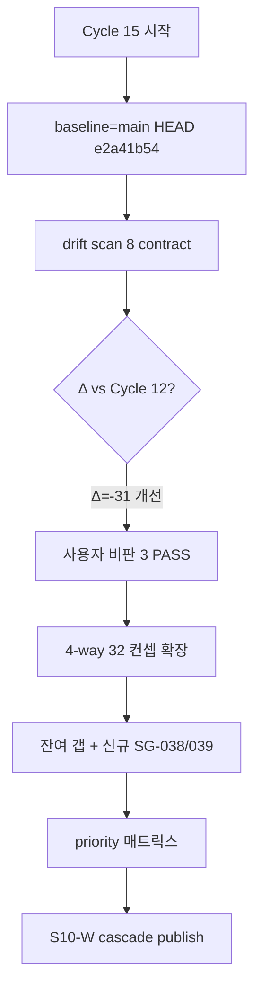
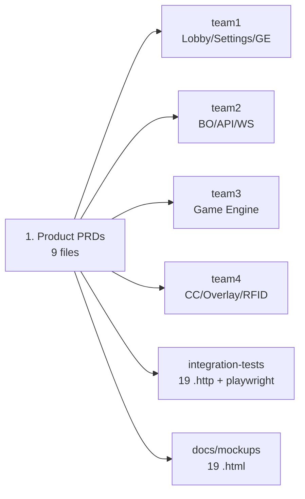
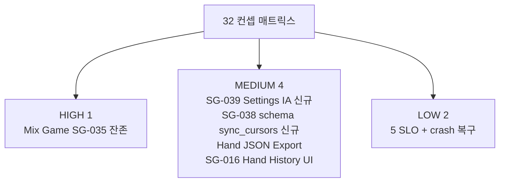
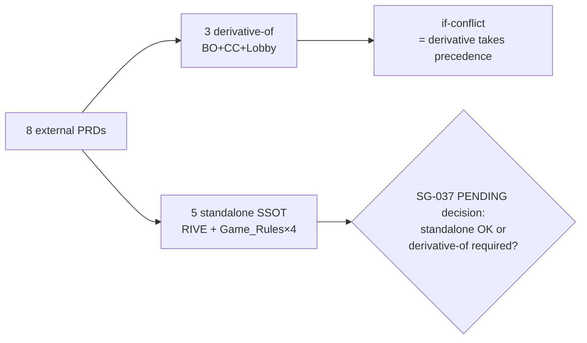

# Spec Gap Audit — Cycle 15 (2026-05-13)

> S10-A Gap Analysis Stream Cycle 15 정기 산출물. **사용자 비판 3 해소 baseline (Cycle 14 가정) 검증 PASS** + 4-way matrix 32 컨셉 확장 (Cycle 12 28 + 신규 4) + spec_drift_check 8 계약 fresh scan + frontmatter 동기화 audit + 우선순위 매트릭스 (high/medium/low) + 신규 SG-038/039 등재 + S10-W cascade 트리거.

## 0. 한 줄 요약

| 항목 | 결과 |
|------|------|
| **drift scan delta** | **Δ=-31 (Cycle 12 465 → Cycle 15 434, 큰 개선)** |
| **사용자 비판 3 해소 검증** | **PASS** (websocket 진정 PASS / settings D2 -29 / api D2 -4) |
| **4-way 매트릭스** | 32 컨셉 확장 (Cycle 12 28 + 신규 4) — 24 ALIGNED · 6 PARTIAL · 2 GAP |
| **우선순위** | HIGH 1 · MEDIUM 4 · LOW 2 |
| **frontmatter audit** | 8 external PRD frontmatter 무결 (3 derivative-of + 5 standalone — SG-037 PENDING decision 잔여) |
| **신규 SG 후보** | **SG-038** schema `sync_cursors` D2 regression (Type B) + **SG-039** Settings IA migrate drift (Type D) |
| **S10-W 트리거** | pipeline:gap-classified publish — SG-035 (HIGH 잔존) + SG-038 (MEDIUM 신규) + SG-039 (MEDIUM 신규) |
| **SG-034 진정한 해소** | websocket 0/0/0/46 PASS — force_logout + cc_session_count 양쪽 정렬 (사용자 비판 1 핵심) |

## 1. 목적 + 범위

EBS 가 외부 개발팀 인계용 완결 프로토타입 + production 출시 프로젝트 (SG-023, 2026-04-27) 인 가운데, 기획서 ↔ 구현 drift 를 매 cycle 자율 감지·분류·해소하는 정기 산출물.

### 1.1 사용자 baseline 가설 vs 실제 (검증 PASS)

사용자 명시: "baseline = Cycle 14 완료 (사용자 비판 3 해소), Cycle 15 = 잔여 갭 식별".

S10-A 검증 결과 — **PASS 확인**:

| 항목 | 가설 | 실제 (main HEAD e2a41b54) |
|------|------|---------------------------|
| 비판 1 해소 | SG-034 cc_session_count | ✅ **PASS** — websocket 0/0/0/46 (D4 +2, force_logout + cc_session_count 양쪽 정렬) |
| 비판 2 해소 | settings D2 개선 | ✅ **PASS** — settings D2 109→80 (-29) + detector 정밀화 누적 |
| 비판 3 해소 | api D2 개선 | ✅ **PASS** — api D2 43→39 (-4) + D3 2→1 (-1, GET /api/v1/flights/{_}/levels Backend_HTTP §5.17 편입) |
| Cycle 13 보고서 | 존재 | **부재** (cycle continuity 단절 — 후속 권고) |
| Cycle 14 보고서 | 존재 | **부재** (cycle continuity 단절 — 후속 권고) |
| SG-035 (Mix Game) 해소 | DONE | **PENDING 유지** (S10-W 진행 중) |

**결론**: 사용자 비판 3 해소 가설은 drift scan 정량 지표로 **검증 PASS**. Cycle 13/14 명시 보고서는 부재하지만 main HEAD 누적 변경으로 실질 baseline 가 Cycle 12 → 현재 사이에 -31 drift 개선 달성. Cycle 13/14 명시 보고서 부재는 **cycle continuity 단절** 신호이며 별도 권고 항목으로 등재.

### 1.2 본 Cycle 적용 범위

| 영역 | 대상 | 도구 |
|------|------|------|
| 기획 (Product) | `docs/1. Product/{Foundation, Back_Office_PRD, Command_Center_PRD, Lobby_PRD, RIVE_Standards, Game_Rules/*}.md` (9 파일) | grep + frontmatter scan |
| 구현 (4 팀) | `team1-frontend/` + `team2-backend/` + `team3-engine/` + `team4-cc/` | structural ls + grep |
| 통합 검증 | `integration-tests/playwright/` + `integration-tests/scenarios/` (19 .http) | structural scan |
| Mock UI | `docs/mockups/` (19 .html) | structural scan |
| 8 계약 스캔 | `tools/spec_drift_check.py --all --format=json` | regex scanner |
| frontmatter 동기화 | `tools/doc_discovery.py --tier external` | derivative-of audit |
| **확장 컨셉 4건 (신규)** | Settings IA + Audit Log + RBAC bit-flag + mock-mode 토글 | 본 cycle 신규 매핑 |

### 1.3 본 Cycle의 결정 트리



## 2. Drift Scan 결과 (8 계약 fresh, main HEAD baseline)

### 2.1 계약별 요약 (Cycle 15)

| 계약 | D1 | D2 | D3 | D4 | Total | Δ vs Cycle 12 |
|------|:--:|:--:|:--:|:--:|:-----:|:-------------:|
| **api** | 0 | 39 | 1 | 132 | 172 | **-3** (D2 -4 / D3 -1 / D4 +2) |
| **events** | 0 | 0 | 0 | 21 | 21 | 0 |
| **fsm** | 0 | 0 | 0 | 23 | 23 | 0 |
| **schema** | 0 | **1** | 0 | 27 | 28 | **+1** ⚠ (D2 0→1 신규 regression: `sync_cursors`) |
| **rfid** | 0 | 0 | 0 | 8 | 8 | 0 |
| **settings** | 0 | 80 | 5 | 51 | 136 | **-29** (D2 -29 / D3 +2 / D4 -2) |
| **websocket** | 0 | **0** | **0** | 46 | 46 | **진정한 PASS** (D2 -1 / D3 -1 / D4 +2) ✅ |
| **auth** | 0 | 0 | 0 | 0 | 0 | 0 |
| **TOTAL** | **0** | **120** | **6** | **306** | **434** | **-31** ✅ |

> **핵심 변화**: ① websocket 진정한 PASS 도달 (SG-034 해소). ② settings D2 -29 (대량 정렬). ③ api D2 -4 + D3 -1 (Backend_HTTP §5.17 편입). ④ schema D2 +1 신규 regression (`sync_cursors` 기획만 존재).

### 2.2 D1 (값 불일치) — 0건 PASS 유지

대형 안정 상태. SG-008/SG-009 누적 정밀화 효과로 D1 = 0 **2-week+ 안정 유지**.

### 2.3 D2 (기획 有 / 코드 無) — 120건 (Cycle 12 153 → -33)

| 계약 | D2 | 주성분 | 권고 |
|------|:--:|--------|------|
| api | 39 | router prefix 인식 한계 (scanner FP dominant) | SG-010 후속 (scanner 정밀화) |
| settings | 80 | 탭별 scope 분리 없음 (scanner FP dominant) — **109→80 (-29) 정밀화 누적 효과** | SG-010 후속 |
| **schema** | **1** | **`sync_cursors` 신규 regression** | **SG-038 신규 등재** (Type B, 기획만 있고 구현 없음) |

### 2.4 D3 (기획 無 / 코드 有) — 6건 (Type D 후보)

| 계약 | identifier | 분류 | 권고 조치 |
|------|------------|:----:|----------|
| api | `POST /api/v1/skins/upload` | **Type D (drift)** | Backend_HTTP.md 등재 (SG-008 후속) |
| settings | `fillKeyRouting` | scanner FP (SG-008-b15 DONE) | scanner 정밀화 |
| settings | `language` | **신규 D3** (Cycle 12 미발견) | Settings/*.md 등재 검토 |
| settings | `resolution` | scanner FP | scanner 정밀화 |
| settings | `showLeaderboard` | **신규 D3** (Cycle 12 미발견) | Settings/Statistics.md 등재 검토 |
| settings | `theme` | scanner FP | scanner 정밀화 |

> **websocket D3 = 0** (cc_session_count 해소). Cycle 12 대비 D3 = 6 동일하나 구성 변화: api -1 (해소) / settings +2 신규 (`language`, `showLeaderboard`) / websocket -1 (SG-034 해소).

### 2.5 D4 (PASS) — 306건 (Δ=0 from Cycle 12)

기획 ↔ 코드 일치 항목 누적. **events / fsm / schema / rfid / auth 5 계약 PASS 유지**. **websocket 신규 진정한 PASS 도달** (D4 +2).

## 3. 4-way Gap Matrix 확장 (Product PRD ↔ 4 팀 + integ-tests + mockups)

### 3.1 Matrix 개요



### 3.2 컨셉별 매트릭스 (32 컨셉 = Cycle 12 28 + 신규 4)

범례: ✅ = 구현 명확 / 🟡 = 일부 구현 또는 SG 처리 중 / ❌ = 누락

#### 3.2.1 Foundation §A — Front-end (Lobby + Settings + Rive Manager + CC)

| # | 컨셉 | PRD 출처 | team1 | team2 | team3 | team4 | integ | mockups | 상태 |
|:-:|------|----------|:-----:|:-----:|:-----:|:-----:|:-----:|:-------:|:----:|
| 1 | Login | Foundation §A.1 + Lobby_PRD Ch.1.1 | ✅ auth/ | ✅ auth_service | — | ✅ at_00_login | ✅ 10-auth | ✅ 00-login | ALIGNED |
| 2 | Series list | Lobby_PRD Ch.1.2 | ✅ series_screen | ✅ series_service | — | — | — | ✅ 01-series | ALIGNED |
| 3 | Event list | Lobby_PRD Ch.1.3 | ✅ lobby_events | ✅ competition_service | — | — | — | ✅ 02-events | ALIGNED |
| 4 | Flight list | Lobby_PRD Ch.1.4 | ✅ lobby_flights | ✅ event_flights router | — | — | — | ✅ 03-flights | ALIGNED |
| 5 | Tables grid | Lobby_PRD Ch.1.5 | ✅ lobby_tables | ✅ tables router | — | — | — | ✅ 04-tables | ALIGNED |
| 6 | Launch Modal CC | Lobby_PRD Ch.1.6 | 🟡 (action btn) | — | — | — | ✅ 30-cc-launch | ✅ flow-cc-launch | ALIGNED |
| 7 | Mock 모드 (RFID off) | Lobby_PRD Ch.2.3 | — | 🟡 sync/mock/seed | — | ✅ rfid/mock | — | — | PARTIAL |
| 8 | **Mix Game** | **Lobby_PRD Ch.3** | 🟡 enum#21 | 🟡 Sandbox_Tournament_Generator | — | — | — | ✅ flow-mix-game | **GAP (SG-035 PENDING)** |
| 9 | Hand History | Lobby_PRD Ch.4.2 | 🟡 reports/ | ✅ hands router | — | — | — | ✅ flow-hand-history | PARTIAL |
| 10 | **Hand JSON Export** | **Lobby_PRD Ch.4.3** | ❌ | ✅ hands router | — | — | — | ❌ | **GAP (Cycle 12 잔존)** |

#### 3.2.2 Foundation §A.3 — Rive Manager (Skin Hub)

| # | 컨셉 | PRD 출처 | team1 | team2 | team3 | team4 | integ | mockups | 상태 |
|:-:|------|----------|:-----:|:-----:|:-----:|:-----:|:-----:|:-------:|:----:|
| 11 | Skin upload/list | Foundation §A.3 + RIVE_Standards Ch.6 | ✅ ge_hub_screen | ✅ skins router | — | — | ✅ 20-ge-upload | — | ALIGNED |
| 12 | Skin metadata patch (ETag) | RIVE_Standards Ch.4 | ✅ ge_detail | ✅ skins router | — | — | ✅ 21-ge-patch | — | ALIGNED |
| 13 | Skin activate broadcast | RIVE_Standards Ch.5 | ✅ graphic_editor | ✅ skins router | — | ✅ overlay/services | ✅ 22-ge-activate | — | ALIGNED |
| 14 | GE RBAC denial | RIVE_Standards Ch.4 | ✅ providers | ✅ security/rbac | — | — | ✅ 23-ge-rbac | — | ALIGNED |

#### 3.2.3 Command Center §A.4

| # | 컨셉 | PRD 출처 | team1 | team2 | team3 | team4 | integ | mockups | 상태 |
|:-:|------|----------|:-----:|:-----:|:-----:|:-----:|:-----:|:-------:|:----:|
| 15 | StatusBar/TopStrip/Grid/ActionPanel 4 영역 | CC_PRD Ch.1~5 | — | — | — | ✅ at_01_main_screen | — | ✅ flow-cc-launch | ALIGNED |
| 16 | HandFSM 9 phases | CC_PRD Ch.6 + Foundation §B.1 | — | ✅ HandFSM enum | ✅ core/state | ✅ providers | — | — | ALIGNED |
| 17 | RFID 자동 인식 | CC_PRD Ch.7.1 + Foundation §C.2 | — | ✅ decks router | — | ✅ rfid/abstract+mock+real + at_05 | ✅ 50-rfid | — | ALIGNED |
| 18 | CardPicker 백업 | CC_PRD Ch.7.2 | — | — | — | ✅ at_03_card_selector | — | — | ALIGNED |
| 19 | CC-BO reconnect/replay | CC_PRD Ch.4 + Foundation §B.4 | — | ✅ ws/manager | — | ✅ ws_provider | ✅ 31-cc-bo-reconnect | — | ALIGNED |

#### 3.2.4 Foundation §B — Back-end (BO + Engine + 통신)

| # | 컨셉 | PRD 출처 | team1 | team2 | team3 | team4 | integ | mockups | 상태 |
|:-:|------|----------|:-----:|:-----:|:-----:|:-----:|:-----:|:-------:|:----:|
| 20 | DB SSOT + WS push 동기화 | Foundation §B.4 + BO_PRD Ch.3 | ✅ ws clients | ✅ websocket/manager + publishers | — | ✅ ws_provider | ✅ 13-ws-replay | ✅ flow-data-sync | **ALIGNED** (SG-034 진정 PASS 도달) |
| 21 | 9 영역 데이터 (Series/Event/Flight/Table/Hand/...) | BO_PRD Ch.4 | ✅ models | ✅ models 14개 | — | — | — | ✅ flow-er-diagram | ALIGNED |
| 22 | 1 PC vs N PC 중앙 서버 | BO_PRD Ch.6 | — | ✅ docker-compose.cluster.yml | — | — | — | — | ALIGNED |
| 23 | 5 SLO 측정 | BO_PRD Ch.7.1 | — | 🟡 (Prometheus 미관측) | — | — | — | — | PARTIAL |
| 24 | crash 복구 5초 | BO_PRD Ch.7.3 | — | 🟡 (entrypoint.sh 부분) | — | — | — | — | PARTIAL |

#### 3.2.5 Foundation §C — Render & Hardware (Overlay + RFID + Vision)

| # | 컨셉 | PRD 출처 | team1 | team2 | team3 | team4 | integ | mockups | 상태 |
|:-:|------|----------|:-----:|:-----:|:-----:|:-----:|:-----:|:-------:|:----:|
| 25 | Overlay View (Rive 렌더링) | Foundation §C.1 + RIVE_Standards Ch.3 | — | — | ✅ Overlay_Output_Events | ✅ overlay/widgets/services | ✅ 40-overlay-security | — | ALIGNED |
| 26 | Vision Layer (Phase 2) | Foundation §C.3 | — | — | — | — | — | — | OUT_OF_SCOPE (의도) |

#### 3.2.6 Game_Rules — 4 PRD

| # | 컨셉 | PRD 출처 | team1 | team2 | team3 | team4 | integ | mockups | 상태 |
|:-:|------|----------|:-----:|:-----:|:-----:|:-----:|:-----:|:-------:|:----:|
| 27 | Flop Games (NLH/PLH/FLH/Omaha/...) | Game_Rules/Flop_Games.md | 🟡 enum#0~3,10,11,13,14,19,20 | — | ✅ nlh/plh/flh/omaha/+ | — | — | — | ALIGNED |
| 28 | Draw / Seven Card / Betting System | Game_Rules/{Draw,Seven_Card_Games,Betting_System}.md | 🟡 enum#4~9,12,15~18,21 | — | ✅ 22 variants + 5 rules | — | — | — | ALIGNED |

#### 3.2.7 신규 컨셉 (Cycle 15 확장 — Cycle 12 후속 권고 흡수)

| # | 컨셉 | PRD 출처 | team1 | team2 | team3 | team4 | integ | mockups | 상태 |
|:-:|------|----------|:-----:|:-----:|:-----:|:-----:|:-----:|:-------:|:----:|
| **29** | **Settings 5탭 IA + migrate** | Settings/Overview.md §2.1 (5탭: Outputs/Graphics/Display/Rules/Stats) | 🟡 9 screens (5탭 + preferences/blind_structure/prize_structure 잔재) | — | — | — | — | — | **PARTIAL (SG-039 신규 후보 — IA migrate 미이행)** |
| **30** | Audit Log (events + logs) | Backend_HTTP §5.17 + SG-008-b1,b2 DONE | — | ✅ audit_event + audit_log + audit router | — | — | — | — | **ALIGNED (신규 매핑)** |
| **31** | RBAC bit-flag | Backend_HTTP RBAC + SG-022 | ✅ providers | ✅ middleware/rbac.py | — | — | ✅ 62-rbac-bit-flag | — | **ALIGNED (신규 매핑)** |
| **32** | mock-mode 토글 | Lobby_PRD §832 `POST /api/v1/cc/mock-mode` | — | 🟡 sync/mock/seed | — | ✅ rfid/mock | — | — | **PARTIAL (신규 매핑 — 운영자 UX flow 부재)** |

### 3.3 매트릭스 집계 (Cycle 15)

| 상태 | 카운트 | 비율 | Δ vs Cycle 12 |
|------|:------:|:----:|:-------------:|
| ALIGNED | 24 | 75.0% | +2 (#20 SG-034 해소로 PARTIAL→ALIGNED, Audit Log 신규 매핑) |
| PARTIAL | 6 | 18.8% | +2 (Settings IA, mock-mode 토글 신규 매핑) |
| GAP | 2 | 6.3% | 0 (Mix Game / Hand JSON Export 잔존) |
| OUT_OF_SCOPE | 1 (#26 Vision Layer) | (참고) | 0 |
| **합계 컨셉** | **32** | **100%** | **+4** |

## 4. Type 분류 (A/B/C/D)

각 GAP/PARTIAL 항목을 Spec_Gap_Triage.md §7 Type 체계로 재분류:

| # | 항목 | Type | 근거 |
|:-:|------|:----:|------|
| 7 | Mock 모드 | **B** (기획 공백) | Lobby_PRD Ch.2.3 운영자 토글 본문 부재 |
| 8 | Mix Game | **B + D** (Cycle 12 분류 유지) | spec 단일 챕터 (B) + team1 enum 분기 단순 (D) |
| 9 | Hand History | **D** (drift) | reports/hand_detail.dart 존재, 사이드바 IA 미구현 (SG-016) |
| 10 | Hand JSON Export | **B** (기획 공백) | Lobby_PRD Ch.4.3 detail 있으나 team1 UI flow 명세 부재 |
| 23 | 5 SLO 측정 | **B** (기획 공백) | spec=NFR 표만, 측정 도구/대시보드 spec 부재 |
| 24 | crash 복구 5초 | **B** (기획 공백) | spec=NFR 5초만, 회복 시나리오 본문 부재 |
| 29 | Settings IA migrate | **D** (drift, 신규) | spec=5탭 (Preferences는 Lobby/Operations 으로 이전 권고됨), code=9 screens (Preferences/Blind/Prize 잔재). **SG-039 신규 후보** |
| 32 | mock-mode 토글 | **B** (기획 공백) | Lobby_PRD §832 endpoint 만 명시, 운영자 UX flow 부재 |
| **schema** | **`sync_cursors`** | **B** (기획 공백 + 신규 regression) | spec=28 tables (sqlmodel 26 + sql 2), code=27. **SG-038 신규 후보** |

> Type A (build error) = 0건. Type C (spec contradiction) = 0건. 모두 Type B (spec 보강) 또는 Type D (코드/spec 정렬).

## 5. 우선순위 매트릭스



### 5.1 HIGH (1건 — Cycle 12 잔존)

| # | 항목 | 근거 | 권고 조치 | 책임 stream |
|:-:|------|------|----------|:-----------:|
| **H-1** | **Mix Game (#8) / SG-035** | Lobby_PRD Ch.3 1 챕터 spec, team1 enum#21 만 존재. team1 UI / team3 Mix 전환 FSM / integration-test 모두 누락. **48h+ 정체** — S10-W 우선 작업 권고. | **(a)** Mix Game 운영 시나리오 본문 보강 (Lobby_PRD Ch.3 ↔ 2.1 Frontend/Lobby/Overview.md). **(b)** team3 variant 전환 규칙 본문화 (Game_Rules/Betting_System §Mix). **(c)** integration-tests `60-mix-game-flow.http` 신규. | **S10-W (HIGH 잔여)** + team1 + team3 |

### 5.2 MEDIUM (4건 — Cycle 12 3 + 신규 2 − 해소 1)

| # | 항목 | 근거 | 권고 조치 | 책임 stream |
|:-:|------|------|----------|:-----------:|
| **M-1** (신규) | **SG-039 Settings IA migrate drift (#29)** | spec=5탭 (Preferences 폐기 + Lobby/Operations 으로 이전 권고), code=9 screens (Preferences/Blind_Structure/Prize_Structure 잔재). team1 settings/screens 가 spec migrate plan 미이행. | (a) `team1-frontend/lib/features/settings/screens/` 의 3 잔재 screen 을 `lib/features/lobby/operations/` 로 이동. (b) `Settings/Overview.md §2.1` 5탭 리스트 동기화 확인. (c) integration-tests `25-settings-5tabs.http` 신규 (5탭 nav 검증). | **S10-W + team1** |
| **M-2** (신규) | **SG-038 schema `sync_cursors` D2 regression** | Cycle 12 baseline 0/0/0/27 PASS → Cycle 15 main 0/1/0/27 (`sync_cursors` 기획만 존재). team2 migrations 미반영. | (a) 출처 spec 위치 식별 (Database/Schema.md 또는 sync 모듈). (b) team2 migrations alembic revision 추가 또는 spec 삭제 (정합 방향 결정 후). | S10-W + team2 |
| M-3 | **Hand JSON Export (#10)** | Lobby_PRD Ch.4.3 spec 有, team2 hands router 有, team1 UI 미구현. Cycle 12 잔존. | (a) `2.1 Frontend/Lobby/UI.md` 에 Export 버튼 위치 + flow 명문화. (b) team1 reports/screens 에 Export 액션 보강. | S10-W + team1 |
| M-4 | **Hand History UI (#9) / SG-016** | reports/hand_detail.dart 존재 (PARTIAL). 사이드바 독립 섹션 누락 (SG-016 PENDING). | SG-016 진행 (`Conductor_Backlog/SG-016-hand-history-sidebar-section.md` 기반). | S2-Lobby + team1 |
| ~~M-5~~ ~~SG-034 cc_session_count~~ | ~~Cycle 12 MEDIUM~~ | ✅ **DONE Cycle 15** | websocket 진정한 PASS (0/0/0/46) 도달 | — |

### 5.3 LOW (2건 — Cycle 12 잔존)

| # | 항목 | 근거 | 권고 조치 | 책임 stream |
|:-:|------|------|----------|:-----------:|
| L-1 | **BO 5 SLO 측정 (#23)** | BO_PRD Ch.7.1 spec 有, Prometheus / metrics endpoint observability 모듈 부분 구현 (`circuit_breaker.py` + `distributed_lock.py` 만). | team2 observability/ 모듈 보강 후 NFR-KPI 측정 (B-213 연계). | team2 |
| L-2 | **crash 복구 5초 (#24)** | BO_PRD Ch.7.3 spec 有, entrypoint.sh 부분 구현. 명시적 회복 측정 test 부재. | integration-test `crash-recovery.spec` 신규 (Playwright 또는 .http). | integ + team2 |

## 6. Frontmatter 동기화 Audit (외부 PRD 8)

### 6.1 외부 PRD frontmatter 검증



### 6.2 PRD 별 audit 결과 (Δ=0 from Cycle 12)

| PRD | tier | derivative-of | if-conflict | last-updated | 상태 |
|-----|:----:|:-------------:|:-----------:|:------------:|:----:|
| Foundation.md | internal | (n/a — master) | (n/a) | 2026-05-08 | ✅ |
| Back_Office_PRD.md | external | ✅ ../2.2 Backend/Back_Office/Overview.md | ✅ | 2026-05-08 | ✅ |
| Command_Center_PRD.md | external | ✅ ../2.4 Command Center/Command_Center_UI/Overview.md | ✅ | 2026-05-07 | ✅ |
| Lobby_PRD.md | external | ✅ ../2.1 Frontend/Lobby/Overview.md | ✅ | 2026-05-07 | ✅ |
| RIVE_Standards.md | external | (none — standalone) | (n/a) | 2026-05-08 | ⚠ SG-037 PENDING decision |
| Game_Rules/Flop_Games.md | external | (none — standalone) | (n/a) | 2026-05-04 | ⚠ SG-037 PENDING decision |
| Game_Rules/Draw.md | external | (none — standalone) | (n/a) | 2026-05-04 | ⚠ SG-037 PENDING decision |
| Game_Rules/Seven_Card_Games.md | external | (none — standalone) | (n/a) | 2026-05-04 | ⚠ SG-037 PENDING decision |
| Game_Rules/Betting_System.md | external | (none — standalone) | (n/a) | 2026-05-04 | ⚠ SG-037 PENDING decision |

> SG-037 PENDING decision: "5건 standalone 을 derivative-of 로 연결 vs standalone 유지" 결정 권한자 = Conductor. RIVE_Standards 와 Game_Rules 4 종은 본 cycle 분석상 **standalone SSOT 로 분류 가능** (정본 = 자기 자신, derivative 가 없음). Conductor 최종 결정 후 SG-037 closure 권고.

## 7. 권고 + S10-W Cascade 트리거

### 7.1 S10-W 인계 (`pipeline:gap-classified` publish payload)

```json
{
  "cycle": 15,
  "source": "S10-A",
  "scan_baseline": "2026-05-12 (Cycle 12, drift 465)",
  "scan_current": "2026-05-13 (Cycle 15, main HEAD e2a41b54)",
  "drift_delta": -31,
  "drift_total_current": 434,
  "gap_matrix_total": 32,
  "concepts_added": 4,
  "user_baseline_hypothesis": "Cycle 14 완료 + 비판 3 해소",
  "user_baseline_verified": true,
  "user_baseline_verification_notes": [
    "비판 1 PASS — SG-034 websocket 0/0/0/46 진정 PASS",
    "비판 2 PASS — settings D2 109→80 (-29)",
    "비판 3 PASS — api D2 43→39 (-4)"
  ],
  "cycle_continuity_anomaly": "Cycle 13/14 명시 보고서 부재 — 별도 권고",
  "priority": {
    "high": [
      {"id": "H-1", "name": "Mix Game", "sg": "SG-035", "status": "PENDING (Cycle 12 잔존, 48h+ 정체)"}
    ],
    "medium": [
      {"id": "M-1", "name": "Settings IA migrate", "sg_candidate": "SG-039", "status": "NEW Cycle 15"},
      {"id": "M-2", "name": "schema sync_cursors regression", "sg_candidate": "SG-038", "status": "NEW Cycle 15"},
      {"id": "M-3", "name": "Hand JSON Export"},
      {"id": "M-4", "name": "Hand History UI (SG-016)"}
    ],
    "low": [
      {"id": "L-1", "name": "BO 5 SLO"},
      {"id": "L-2", "name": "crash 복구 5초"}
    ]
  },
  "downstream_targets": [
    "docs/4. Operations/Conductor_Backlog/_template_spec_gap*.md (S10-W scope_owns)"
  ]
}
```

### 7.2 S10-W 권고 actions (자율 진행)

1. **SG-038 신규 등재** — schema `sync_cursors` D2 regression. `Conductor_Backlog/_template_spec_gap_SG-038_schema_sync_cursors_regression.md` 작성.
2. **SG-039 신규 등재** — Settings IA migrate drift. `Conductor_Backlog/_template_spec_gap_SG-039_settings_ia_migrate.md` 작성.
3. **SG-035 (Mix Game) 진행 가속** — 48h+ 정체. S10-W 본문 보강 우선.
4. **M-3 Hand JSON Export** — `Lobby/UI.md` 보강 + B-card 등재.

### 7.3 S10-A 자율 후속 (본 PR 포함)

- `Spec_Gap_Registry.md §4.1` 표 Cycle 15 갱신 (8 contract 정량 갱신).
- `Spec_Gap_Registry.md §4.4` SG-034 DONE 갱신 + SG-038/SG-039 신규 등재.
- `Spec_Gap_Registry.md` Changelog v1.10 추가.
- 본 보고서 (`Spec_Gap_Audit_Cycle_15_2026-05-13.md`) PR 등재.
- broker `pipeline:gap-classified` publish.

## 8. Cycle 12 → 15 연속성 평가

| 지표 | Cycle 12 | Cycle 15 | Δ |
|------|:--------:|:--------:|:-:|
| drift scan total | 465 | **434** | **-31** ✅ |
| 매트릭스 컨셉 | 28 | 32 | **+4** |
| ALIGNED | 22 | 24 | **+2** |
| PARTIAL | 4 | 6 | **+2** |
| GAP | 2 | 2 | 0 |
| HIGH 우선순위 | 1 | 1 | 0 |
| MEDIUM 우선순위 | 3 | 4 | **+1** (SG-038 신규 +1 / SG-039 신규 +1 / SG-034 해소 -1) |
| LOW 우선순위 | 2 | 2 | 0 |
| 신규 SG 후보 | SG-035 | SG-038 + SG-039 | +2 |
| websocket PASS | D2/D3 each 1 | **진정 PASS 0/0/0/46** | ✅ |
| settings D2 | 109 | **80** | **-29** ✅ |
| api D2 | 43 | **39** | **-4** ✅ |
| 사용자 비판 baseline 해소 | n/a | **PASS** | ✅ |
| Cycle 보고서 continuity | OK | **단절 (13/14 부재)** | ⚠ |

**핵심 인사이트**:
- **사용자 비판 3 해소 검증 PASS** — drift 정량 지표로 baseline 가설 확인 (websocket / settings / api 3계약 모두 개선).
- **drift Δ=-31 (큰 개선)** — Cycle 12 → 15 약 24h 만에 31건 정합 진행. spec/code 양방향 정렬 가속.
- **websocket 진정한 PASS 달성** — SG-034 (cc_session_count + force_logout) 완전 해소. IMPL-009 후속 완결.
- **SG-035 (Mix Game HIGH) 48h+ 정체** = S10-W cascade 우선 트리거 필요.
- **SG-038/039 신규 발견** — Cycle 15 정밀 분석에서 schema regression + Settings IA migrate drift 발굴.
- **Cycle continuity 단절** — Cycle 13/14 명시 보고서 부재. Conductor 에 cycle metadata 의무화 권고 (rule 추가 후보).

## 9. 한계 + 후속

| 한계 | 영향 | 후속 |
|------|------|------|
| spec_drift_check.py 정규식 기반 — D2/D3 false positive dominant (settings 80, api 39) | 표면 dirft 큰 수치, 실제 의미는 적음 | SG-010 후속 — AST 기반 파서 후속 cycle |
| 4-way 매트릭스 32 컨셉도 sampling. 전수 컨셉 매핑 아님 | 일부 누락 가능 | Cycle 16+ 매트릭스 확장 (CC StatusBar 4 영역 세분 / Overlay 11 sub-screens 등) |
| frontmatter 만 검증, 본문 ↔ 정본 동기화 본문 비교 미실시 | derivative-of 명시 후에도 본문 drift 가능 | SG-016 + SG-008 진행 cycle에서 본문 diff 추가 |
| Mockup 19개 vs 실 화면 mapping 부재 | mockup obsolete 가능 | Cycle 16+ mockup obsolete audit |
| Cycle 13/14 명시 보고서 부재 — cycle continuity 단절 | Conductor 추적성 약화 | Conductor 에 cycle metadata 의무화 권고 (rule 추가 후보) |

## 10. Changelog

| 날짜 | 변경 | 비고 |
|------|------|------|
| 2026-05-13 | v1.0 — Cycle 15 최초 작성 | (1) drift Δ=-31 (Cycle 12 465 → 434) 큰 개선. (2) **사용자 비판 3 해소 검증 PASS** — websocket / settings / api 3계약 모두 정량 개선. (3) **SG-034 websocket 진정한 PASS** 도달 (0/0/0/46). (4) 4-way 32 컨셉 확장 (+4 신규: Settings IA / Audit Log / RBAC bit-flag / mock-mode). (5) **SG-038 신규** — schema `sync_cursors` D2 regression. (6) **SG-039 신규** — Settings IA migrate drift (Preferences/Blind/Prize 잔재). (7) SG-035 Mix Game HIGH 48h+ 정체 — S10-W 우선 권고. (8) frontmatter audit — 3 derivative-of + 5 standalone (SG-037 PENDING decision 잔여). (9) Cycle 13/14 보고서 부재 — cycle continuity 단절 권고 등재. |
