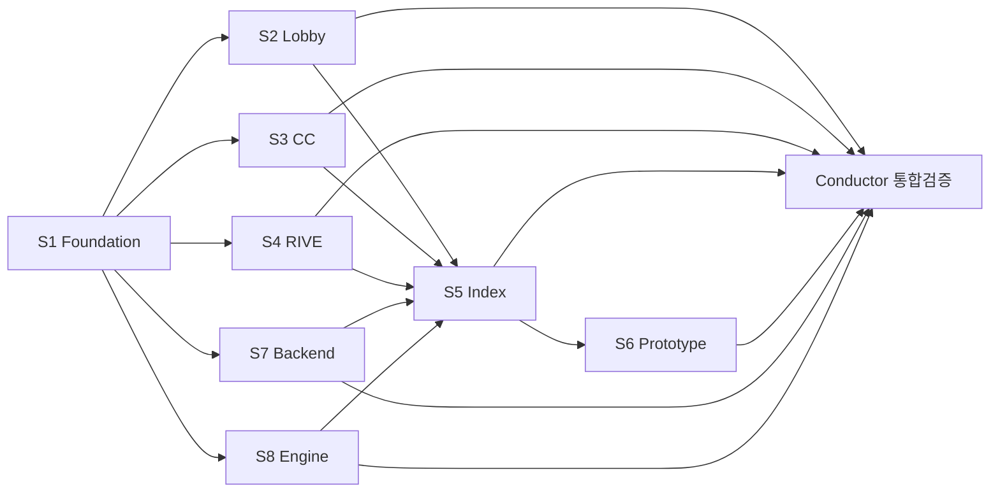

# 정합성 감사 — Master Plan

> **사용자 요구사항**: `docs/1. Product/` 를 기준점으로 해서 이 프로젝트의 모든 문서 정합성을 100% 로 맞춘다.

## 1. 작업 정의

| 항목 | 값 |
|------|-----|
| **기준점 (SSOT)** | `docs/1. Product/` (15 .md files) |
| **감사 대상** | 전 프로젝트 .md 683 files |
| **목표** | derivative-of cascade 100% 정합 + drift 0건 |
| **방식** | 8 Stream 병렬 + Conductor 통합 검증 |
| **자율성** | autonomous iteration (사용자 진입점 = 폴더 클릭만) |

## 2. Stream 매트릭스 (8 활성 + Conductor)

```
+------+--------------------+--------------------------+------------+--------+
| ID   | 이름                | 주 영역                   | 영향 .md   | Phase  |
+------+--------------------+--------------------------+------------+--------+
| S1   | Foundation         | 1.Product/Foundation+    |            |        |
|      |                    | BO_PRD + Game_Rules      |    6       | P1     |
| S2   | Lobby              | 1.P/Lobby_PRD +          |            |        |
|      |                    | 2.1 Frontend/**          |   116      | P2     |
| S3   | Command Center     | 1.P/CC_PRD +             |            |        |
|      |                    | 2.4 CC/**                |    74      | P2     |
| S4   | RIVE Standards     | 1.P/RIVE_Standards +     |            |        |
|      |                    | rive 참조 cascade         |    ~10     | P2     |
| S5   | AI Track / Index   | _generated/** +          |            |        |
|      |                    | spec_aggregate 재실행      |   ~30      | P3     |
| S6   | Prototype          | integration-tests/ +     |            |        |
|      |                    | 4.Ops/Plans/             |   ~20      | P3     |
| S7   | Backend (활성화)    | 2.2 Backend/**           |   104      | P2     |
| S8   | Game Engine (활성화) | 2.3 Engine/**            |    62      | P2     |
+------+--------------------+--------------------------+------------+--------+
| Cnd  | Conductor (main)   | 2.5 Shared, 3.CR,        |            |        |
|      |                    | 4.Ops 잔여, 통합 검증       |   ~250     | P0+P4  |
+------+--------------------+--------------------------+------------+--------+
                                          합계 약 683 files (전수)
```

## 3. 의존성 + 진입 순서



**진입 순서**:
1. **Wave 1**: S1 (단독, blocking gate) — Foundation SSOT 자가 정합 + Game_Rules + BO_PRD
2. **Wave 2**: S2, S3, S4, S7, S8 (병렬) — 각자 영역에서 Foundation cascade
3. **Wave 3**: S5, S6 (병렬) — 인덱스 재생성 + 프로토타입 정합
4. **Wave 4**: Conductor — 통합 검증 + 잔여 영역

## 4. Phase 0 산출물 (이 폴더)

| 파일 | 역할 |
|------|------|
| `README.md` | 본 master plan |
| `foundation_ssot.md` | Foundation v4.5 핵심 사실 추출 — 모든 Stream read 기준 |
| `classification.md` | 683 .md 파일 전수 → Stream 분류 매트릭스 |
| `stream-specs/S1-foundation.md` | S1 작업 spec (영향 파일, 검증 절차) |
| `stream-specs/S2-lobby.md` | S2 작업 spec |
| `stream-specs/S3-cc.md` | S3 작업 spec |
| `stream-specs/S4-rive.md` | S4 작업 spec |
| `stream-specs/S5-index.md` | S5 작업 spec |
| `stream-specs/S6-prototype.md` | S6 작업 spec |
| `stream-specs/S7-backend.md` | S7 작업 spec |
| `stream-specs/S8-engine.md` | S8 작업 spec |
| `conductor-spec.md` | Conductor 잔여 영역 + 통합 검증 spec |

## 5. 사용자 진입점

```
사용자
  │
  ├─ Step 1: VSCode 에서 C:/claude/ebs-foundation/ 열기 (S1 진입)
  │   → SessionStart hook 자동 발동 → identity 주입
  │   → "작업 시작" 한 줄 입력 → 자율 iteration 진행
  │
  ├─ Step 2: S1 PR 머지 후 (Conductor 가 알림)
  │   → 5 폴더 (S2/S3/S4/S7/S8) 동시 열기 (각 VSCode 창)
  │
  └─ Step 3: 모든 PR 머지 후 (Conductor 가 통합 검증 보고)
      → 정합성 감사 완료 100%
```

## 6. 정합성 검증 기준 (각 Stream 자율 적용)

| 검증 | 도구 / 절차 |
|------|------------|
| derivative-of frontmatter | `grep -E "derivative-of:" docs/1. Product/*.md` |
| Foundation cascade | `python tools/doc_discovery.py --impact-of "docs/1. Product/Foundation.md"` |
| Stream scope 위반 | `orch_PreToolUse.py` 자동 차단 |
| CI gate | `.github/workflows/scope_check.yml` + `product_cascade.yml` |
| Match Rate | gap-detector ≥ 90% (자동 iteration trigger) |

## 7. 자율 Iteration 규칙

각 Stream 은 다음 자율 cycle:

```
1. doc_discovery --impact-of foundation_ssot 로 영향 파일 list 확보
2. 각 파일 읽기 → Foundation 사실과 drift 탐지
3. drift 발견 시 정정 (단일 commit)
4. 모든 파일 검증 후 PR ready
5. CI gate 통과 시 auto-merge
6. drift 없으면 그대로 종료
```

Match Rate < 90% 시 자동 pdca-iterator trigger (Circuit Breaker: 5 iterations).

## 8. 엣지 케이스

| 상황 | 처리 |
|------|------|
| Stream A 가 Stream B 영역 수정 필요 | A 가 NOTIFY-{B}-{date}-*.md backlog 생성, B 가 처리 |
| Foundation 자체 수정 필요 | S1 영역. S2~S8 은 read-only |
| frozen 파일 (References, archive) | 수정 금지. drift 발견 시 conductor 보고 |
| 3. Change Requests/in-progress | 정합성 감사 대상 외 (별도 워크플로우) |

## 9. Edit History

| 날짜 | 변경 |
|------|------|
| 2026-05-08 | Phase 0 Architect Setup 완료 — 8 Stream 활성화 + Conductor 잔여 |
