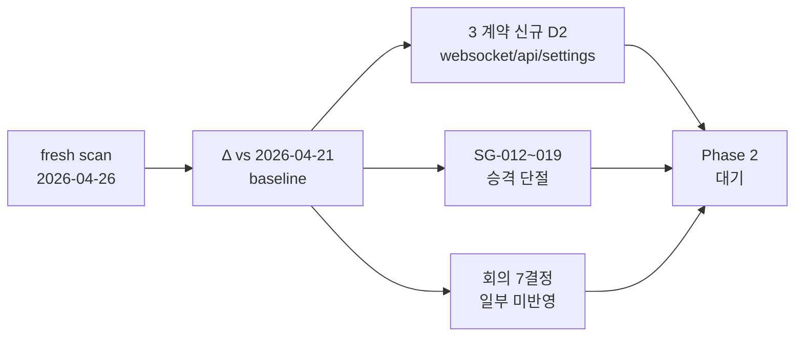
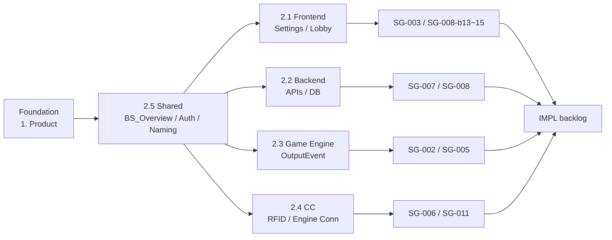
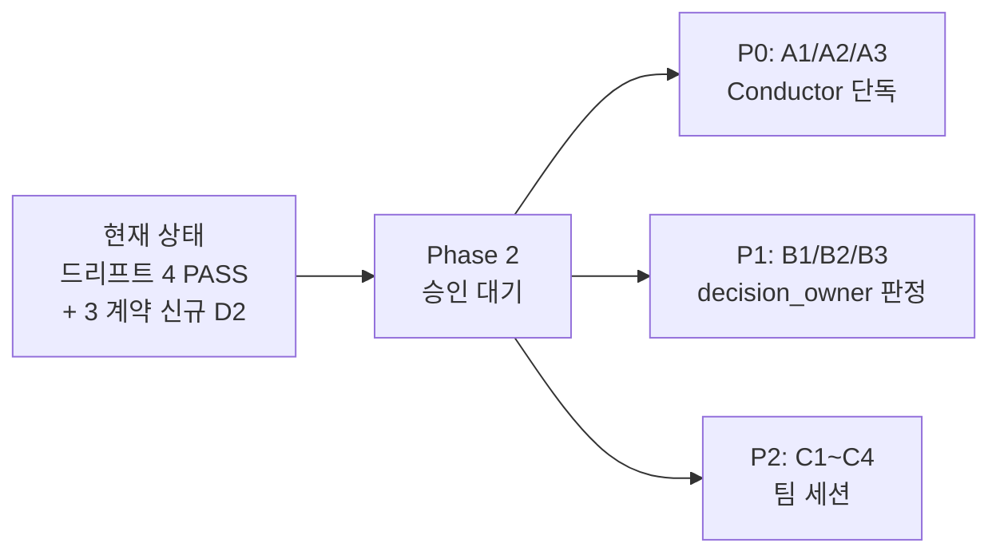

# Spec Gap Audit — Phase 1 (2026-04-26)

> **Phase 1 = 분석/보고만**. 기획 수정 PR 은 사용자 승인 후 Phase 2 에서 진행.
> Spec-Driven Multi-Agent 워크플로우 (사용자 정의) 의 Phase 1 산출물.

## Edit History

| 날짜 | 작성자 | 변경 |
|------|--------|------|
| 2026-04-26 | conductor | 초판 — fresh drift scan + SG backlog audit + Redesign Plan 후속 추적 |

---

## 0. Executive Summary



**핵심 발견**:

| # | 발견 | Type | 우선순위 |
|:-:|------|:----:|:--------:|
| 1 | WebSocket 6 신규 D2 (Ack/Reject 이벤트) — 기획에만 존재 | **B/D2** | **P0** |
| 2 | API 6 신규 D2 endpoint — 기획에만 존재 | **B/D2** | P1 |
| 3 | Settings D2 +7, D3 +2 지속 증가 | **D1/D3** | P2 |
| 4 | SG-012~019 (8건) Registry §4.4 만 등재, 개별 SG 파일 미생성 | **process gap** | **P0** |
| 5 | 회의 D3 (GE 제거) ↔ SG-004 PENDING 모순 미해소 | **C** | P1 |
| 6 | 회의 D6 (모바일 추상화) — 기획 공백 | **B** | P2 |
| 7 | 회의 D2 (탭 단일화 + 다중창) — 신규 설계 필요 | **D** | P2 |

**완결성 정량**: 7 계약 중 4 계약 PASS 유지 (events / fsm / rfid OUT_OF_SCOPE / 거의-PASS schema). 문제는 **api / settings / websocket** 3 계약과 backlog 추적 단절.

---

## 1. Drift Snapshot — Fresh Scan Δ vs Baseline

### 1.1 계약별 비교

| Contract | Baseline (2026-04-21) | Fresh (2026-04-26) | Δ | 평가 |
|----------|:----------------------:|:-------------------:|:-:|:----:|
| **events** | 0/0/0/21 | 0/0/0/21 | — | ✅ PASS 유지 |
| **fsm** | 0/0/0/23 | 0/0/0/23 | — | ✅ PASS 유지 |
| **rfid** | 0/0/0/8 | 0/0/0/8 | — | ✅ OUT_OF_SCOPE (SG-011) |
| **schema** | 0/1/2/23 | 0/1/2/23 | — | ✅ 거의 PASS (SG-010 잔여) |
| **websocket** | 0/0/0/44 | **0/6/0/38** | **D2 +6 / D4 -6** | ⚠️ **REGRESSION** |
| **api** | 7/42/0/114 | 7/**48**/0/114 | **D2 +6** | ⚠️ 신규 drift |
| **settings** | 0/97/17/39 | 0/**104**/**19**/37 | **D2 +7 / D3 +2** | ⚠️ 지속 drift |

> 형식: `D1/D2/D3/D4` (D1=값 불일치 / D2=기획有 코드無 / D3=코드有 기획無 / D4=PASS).

### 1.2 신규 D2 (기획만 추가, 코드 미동기화)

#### WebSocket — 6건 (P0)

| Identifier | 추정 발행자 | 추정 트리거 |
|------------|-------------|-------------|
| `ActionAck` / `ActionRejected` | team3 (Engine) → team1/4 (Lobby/CC) | CC ActionRequest 처리 결과 |
| `DealAck` / `DealRejected` | team3 (Engine) → team1/4 | Deal command 처리 결과 |
| `GameInfoAck` / `GameInfoRejected` | team2 (Backend) → team4 (CC) | Set Game Info form 제출 결과 |

**진단**: J2 작업 (publishers.py 20 event skeleton) 이후 기획에서 ack/reject 카탈로그가 추가되었으나 publisher 가 동시 동기화되지 않음. 작업 단절(handoff drop) 신호.

#### API — 6건 (P1)

```
DELETE /auth/session
DELETE /series/{_}/blind-structures/{_}
DELETE /series/{_}/payout-structures/{_}
GET    /api/session/{_}
GET    /api/v1/auth/me
GET    /api/v1/skins/{_}/metadata
GET    /api/v1/tables/{_}/state/snapshot
GET    /configs
GET    /configs/output
GET    /configs/resolved
GET    /events/replay
GET    /events/{_}/blind-structure
... (총 48건 D2, 위 12건은 prefix 정렬 head)
```

**진단**: 일부는 SG-008-b1~b15 의 옵션 채택 결과로 기획 명시된 신규 endpoint. team2 라우터 미구현이 정상 흐름이지만, 신규 D2 +6 은 baseline 이후 기획만 추가된 항목. team2 IMPL 백로그 진입 여부 확인 필요.

#### Settings — D2 +7, D3 +2

| 신규 D3 (코드有 기획無, 잔여 19건 중 신규 2건) | 추정 |
|---|---|
| `dead_button_rule`, `short_all_in_rule`, `under_raise_rule`, `showdown_order` | Game Rules 탭 신설 후보 (SG-008-b13 v2 잔류) |
| `outputProtocol`, `resolution`, `displayMode`, `precisionDigits` | Display 탭 (Settings/Display.md 보강 필요) |
| `theme`, `layoutPreset`, `diagnosticsEnabled`, `sleeperEnabled` | UI Preferences 신설 후보 |

> Settings Triage 는 **SG-008-b13 v2.0** (Registry §4.4) 의 작업 범위. 해당 SG 가 PENDING 인 한 매 scan 마다 잔량 증가 가능.

### 1.3 안정 영역 (변화 없음)

- **events** 21 카탈로그 (Overlay_Output_Events §6.0) — 완전 정렬
- **fsm** 7 enum (TableFSM/HandFSM/SeatFSM/PlayerStatus/DeckFSM/EventFSM/ClockFSM) — SG-009 직렬화 규약 적용 후 안정
- **schema** D2 1 (`payout_structures`) + D3 2 (`cards`/`settings_kv`) — SG-010 scanner 잔여 noise

---

## 2. SG Backlog 추적 단절

### 2.1 미승격 SG (8건)

`Spec_Gap_Registry.md §4.4` 에는 등재되었으나 `Conductor_Backlog/` 에 개별 파일이 **없음**.

| SG ID | 주제 | Source | 미승격 영향 |
|-------|------|--------|-------------|
| SG-012 | Lobby 사이드바 SSOT 부재 | Critic_Reports §3 | decision_owner 알림 누락 |
| SG-013 | "lobby" 용어 충돌 (원칙 1 정렬) | Critic_Reports §4.1 | 결정 미확정 |
| SG-014 | Graphic Editor 진입점 이중화 | Critic_Reports §4.3 | IA 모순 잔존 |
| SG-015 | Players 섹션 유지 근거 미문서화 | Critic_Reports §3 | WSOP LIVE 정렬 미검증 |
| SG-016 | Hand History 사이드바 섹션 공식화 | Critic_Reports §7.1-7.2 | 25개 분산 참조 통합 plan 진행 안 됨 |
| SG-017 | Settings "글로벌 단위" 모순 | Critic_Reports §10 #5 | decision_owner 판정 대기 |
| SG-018 | 5NF 메타모델 테이블 부재 | Critic_Reports §5.2-5.3 | DB 설계 공백 |
| SG-019 | Reports/Insights 경계 미정의 | Critic_Reports §6.2 | 포스트프로덕션 경계 미문서화 |

**원인 추정**: 2026-04-21 critic 리포트가 Registry §4.4 에는 직접 추가되었으나 `_template_spec_gap.md` 기반 개별 파일 생성 단계가 누락. Spec_Gap_Triage §4 의 "Backlog 이동 흐름" 위반.

### 2.2 PENDING SG 총괄 (P0/P1)

| SG | 상태 | Owner | 다음 액션 |
|----|:----:|:-----:|-----------|
| SG-008 (a) 77건 | PENDING | team2 | Backend_HTTP §5.17 라우터 실구현 |
| SG-008-b1~b9 | PENDING | team2 | default 옵션 반영 endpoint 실구현 |
| SG-008-b10~b12 | PENDING | team2 | 옵션 채택 (default = 삭제 / Phase1 미지원) |
| SG-008-b13 | PENDING | team1 | Settings 17 D3 잔류 (a)6/(b)2/(c)0 triage |
| SG-008-b14 | PENDING | team1 | twoFactorEnabled 정책 |
| SG-008-b15 | PENDING | team1 | NDI fillKeyRouting 정책 |
| SG-009 | IN_PROGRESS | conductor | TableFSM 직렬화 규약 적용 |
| SG-010 | PENDING | conductor | scanner 정밀화 P/F 잔량 (Schema) |
| SG-011 | OUT_OF_SCOPE | — | 프로토타입 범위 밖 |

---

## 3. 회의 7결정 후속 추적 (Redesign_Plan_2026_04_22)

| # | 결정 | Type | Wave 1 진행 | Wave 2 진행 | 잔여 |
|:-:|------|:----:|:-----------:|:-----------:|------|
| D1 | 1PC=1테이블 | A→D | ✅ Foundation §5.1 γ hybrid (b8dac2d) | — | WSOP LIVE 패턴 대조 V2 |
| D2 | 탭 단일화 + 다중창 옵션 | D | ⚠️ 부분 (B-200 γ hybrid) | — | "런타임 모드 토글" SSOT 미정 |
| D3 | GE 제거 | **C** | ✅ B-209 5 지점 전파 (57fce5b) | — | **SG-004 .gfskin PENDING ↔ GE 제거 모순 미해소** |
| D4 | 배경 투명화 | A | Foundation Ch.7 기존 명시 | — | 구현 확인만 (team1) |
| D5 | 프로세스 독립 + DB SSOT | A | ✅ SG-002 RESOLVED | ✅ J1/J2 부분 | Foundation §6.3 / §6.4 정착 |
| D6 | 모바일 추상화 | **B** | ❌ 기획 공백 | — | **HAL/폼팩터 추상화 챕터 미작성** |
| D7 | CC 카드 비노출 | A | Foundation L275 기존 명시 | — | 계약 강화만 (team4) |

**잔여 P0/P1**:
- D3 모순 (Type C): SG-004 .gfskin 포맷이 GE 제거 결정과 충돌. SUPERSEDED 표시되었으나 후속 manifest 재설계 (B-209 noted) 미완.
- D6 공백 (Type B): Foundation 또는 2.4 Command Center 에 폼팩터 추상화 챕터 신설 필요.

---

## 4. Requirements Traceability Matrix (Snapshot)

### 4.1 계약 → SG → IMPL 흐름



### 4.2 정량 매핑 (현재 상태)

| Layer | 항목 수 | 상태 분포 |
|-------|:-------:|----------|
| 계약 문서 (audit 대상) | 93 | PASS 75 (81%) / UNKNOWN 15 (16%) / N/A 3 (3%) / FAIL 0 |
| 활성 SG (개별 파일) | 26 | DONE 6 / RESOLVED 4 / PENDING 14 / IN_PROGRESS 1 / OUT_OF_SCOPE 1 |
| 미승격 SG (Registry only) | 8 | SG-012~019 |
| 회의 결정 (D1~D7) | 7 | DONE/거의 4 / 모순/공백/공백 3 |
| Drift D1+D2+D3 | 184 | 신규 +15 (api +6 / ws +6 / set +9 minus -6) |

---

## 5. Phase 2 권장 작업 (사용자 승인 대기)

> 본 절은 **권고**. 사용자가 승인하면 Phase 2 진입.

### 5.1 P0 — 즉시 처리 권고 (Conductor 단독 가능)

| # | 작업 | 산출물 | 예상 시간 |
|:-:|------|--------|----------|
| **A1** | SG-012~019 개별 파일 8개 생성 (`_template_spec_gap.md` 기반) | 8 SG 파일 + Registry §4.4 link 갱신 | 30~45 분 |
| **A2** | WebSocket 6 신규 D2 → SG 승격 (단일 SG 또는 SG-008 후속) | `Conductor_Backlog/SG-020-websocket-ack-reject.md` | 15 분 |
| **A3** | Spec_Gap_Registry §4.1 fresh scan 결과 갱신 (api/settings/websocket 3행) | Registry §4.1 + §4.4 + Changelog v1.5 | 15 분 |

### 5.2 P1 — decision_owner 판정 필요 (별도 세션)

| # | 작업 | decision_owner | 비고 |
|:-:|------|:--------------:|------|
| B1 | D3 GE 제거 ↔ SG-004 모순 최종 판정 | conductor + team1 | manifest 재설계 SG 신설 (B-209 후속) |
| B2 | D6 모바일 추상화 챕터 신설 | conductor (Foundation) | 폼팩터 HAL 추상화 |
| B3 | D2 "런타임 모드 토글" SSOT 결정 | conductor + team1 | 단일창 탭 vs 다중창 |

### 5.3 P2 — 팀 세션 위임 (Wave 2)

| # | 작업 | 대상 팀 | Backlog ID |
|:-:|------|:-------:|:----------:|
| C1 | Settings 19 D3 (b13 v2) 매핑 PR | team1 | SG-008-b13 |
| C2 | API 48 D2 — Backend_HTTP §5.17 라우터 실구현 | team2 | SG-008 (a) |
| C3 | WebSocket 6 ack/reject publisher 구현 | team2 (publisher) + team3 (Engine ack 발행) | A2 후속 |
| C4 | D7 CC 카드 비노출 계약 강화 | team4 | A1 후속 |

### 5.4 차단/주의

- **SG-008-b1~b9**: 9건 default 옵션 채택 자체는 SG 파일 frontmatter 내 명시되어 있음. team2 가 default 로 진행할지 명시적 confirm 필요.
- **scanner 한계**: api D2 일부는 §5.17 편입 후 prefix drift 흡수 미반영. 정밀화 PR 필요 (SG-010 후속).
- **Conductor 직접 편집 금지**: publisher 팀 (team2/3/4) 소유 계약 (`docs/2. Development/2.X/APIs/`) 의 파괴적 변경 — 알림만 가능.

---

## 6. 결론



**기획서 완결성 (외부 개발팀 인계 가능성)**:

| 영역 | 상태 |
|------|:----:|
| Foundation + 1. Product | ✅ 80% (SG-001/002/005 RESOLVED 후 stable) |
| 2.5 Shared 계약 | ✅ 90% (BS_Overview / Auth / Risk_Matrix 정렬) |
| 2.2 Backend APIs | ⚠️ 70% (SG-008 a/b 진행 중) |
| 2.3 Game Engine | ✅ 95% (OutputEvent 21 PASS) |
| 2.4 Command Center | ✅ 85% (SG-002/006 RESOLVED, SG-011 OUT_OF_SCOPE) |
| 2.1 Frontend | ⚠️ 65% (SG-003 PARTIAL, SG-008-b13 v2 잔여, SG-012~019 미승격) |
| **Backlog 추적** | ⚠️ **75%** (SG-012~019 8건 단절) |

**권고 1**: P0 작업(A1/A2/A3) 은 본 세션에서 즉시 처리 가능. 사용자 승인 시 진행.

**권고 2**: P1 decision_owner 판정은 회의 또는 추가 분석 필요. 본 세션에서는 SG 승격 + 옵션 정리까지 가능.

**권고 3**: 다음 주간 scan 전에 P0/P1 처리하여 Registry §4.1 fresh baseline 갱신.

---

## 부록 A — 본 audit 의 한계

- 스캐너 정규식 기반 best-effort. D2/D3 에 false positive 섞임 (Spec_Gap_Registry §7 한계 테이블 참조).
- 본 audit 는 **계약 문서 + Registry + 회의 결정** 만 비교. 팀 작업 브랜치(work/team{N}/*) 미반영.
- audit 범위는 `2.5 Shared/`, `1. Product/`, 미승격 SG 경계 — README/Backlog/NOTIFY 에 frontmatter 강요는 명시적 금지 (feedback_audit_scope_discipline).

## 부록 B — 데이터 소스

| 파일 | 용도 |
|------|------|
| `logs/drift_report_2026-04-26.json` | fresh scan raw (1568 lines) |
| `docs/4. Operations/Spec_Gap_Registry.md` | drift 집계 + SG index (v1.4) |
| `docs/4. Operations/Multi_Session_Handoff.md` | 2026-04-21 baseline (21 문제 해결 대비) |
| `docs/4. Operations/Critic_Reports/Lobby_IA_Sidebar_2026-04-21.md` | SG-012~019 source |
| `docs/4. Operations/Critic_Reports/Meeting_Analysis_2026_04_22.md` | D1~D7 Type 분류 |
| `docs/4. Operations/Plans/Redesign_Plan_2026_04_22.md` | Wave 1/2/3 계획 |
| `git log --oneline --since="2026-04-21"` | baseline 이후 25 커밋 |
