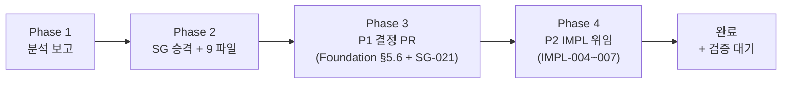
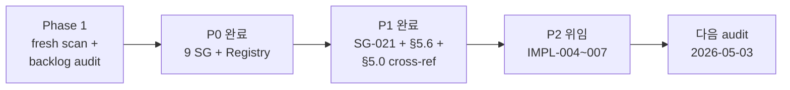

# Spec Gap Audit — Phase 4 Delivery (2026-04-26)

> Spec-Driven Multi-Agent Workflow Phase 4 산출물. Phase 1 audit 의 P0/P1 작업 완료 + P2 IMPL 티켓 위임.

## 0. Executive Summary



**완료 항목**:

| Phase | 작업 | 산출물 | 상태 |
|:-----:|------|--------|:----:|
| P0-A1 | SG-012~019 8건 개별 파일 승격 | 8 SG 파일 | ✅ |
| P0-A2 | WebSocket regression → SG-020 신설 | SG-020 | ✅ |
| P0-A3 | Spec_Gap_Registry §4.1 + §4.4 + Changelog v1.5 | Registry update | ✅ |
| P1-B1 | GE 제거 후속: SG-004 cross-ref + SG-021 신설 | SG-021 + SG-004 frontmatter | ✅ |
| P1-B2 | 모바일 추상화 — Foundation §5.6 신설 | Foundation §5.6 | ✅ |
| P1-B3 | 런타임 모드 SSOT — §5.0 cross-ref 강화 | (정정) §5.0 이미 SSOT, §5.6 에서 직교 관계 명시 | ✅ |
| P2-C1 | team1 Settings 19 D3 매핑 | IMPL-004 | 📦 위임 |
| P2-C2 | team2 API 48 D2 라우터 실구현 | IMPL-005 | 📦 위임 |
| P2-C3 | WebSocket 6 ack/reject publisher | IMPL-006 | 📦 위임 |
| P2-C4 | team4 CC 카드 비노출 강화 | IMPL-007 | 📦 위임 |

---

## 1. P0 완료 — SG 승격 + Registry 갱신

### 1.1 9 신규 SG 파일

| SG | 제목 | Status | Owner |
|----|------|:------:|:-----:|
| SG-012 | Lobby 사이드바 SSOT 부재 | PENDING | team1 |
| SG-013 | "lobby" vs "Tournaments" 용어 충돌 (원칙 1) | PENDING | conductor |
| SG-014 | Graphic Editor 진입점 이중화 | **SUPERSEDED** (D3 GE 제거) | conductor |
| SG-015 | Players 섹션 유지 근거 미문서화 | PENDING | team1 |
| SG-016 | Hand History 사이드바 섹션 공식화 | PENDING | team1 |
| SG-017 | Settings 글로벌 vs 4-level scope 모순 | PENDING | conductor |
| SG-018 | 5NF 메타모델 테이블 부재 | PENDING | team2 |
| SG-019 | Reports/Insights 포스트프로덕션 경계 | PENDING | conductor |
| SG-020 | WebSocket Ack/Reject 6 D2 regression | PENDING | team2 |

> 8 SG (012~019) 는 2026-04-21 critic 등재 후 5일간 추적 단절. 2026-04-26 에 `_template_spec_gap.md` 기반 개별 파일로 승격되어 Triage §4 "Backlog 이동 흐름" 정상화.

### 1.2 Registry §4.1 fresh scan delta (2026-04-26)

| Contract | Baseline (04-21) | Fresh (04-26) | Δ |
|----------|:----------------:|:-------------:|:-:|
| events | 0/0/0/21 | 0/0/0/21 | — |
| fsm | 0/0/0/23 | 0/0/0/23 | — |
| rfid | 0/0/0/8 | 0/0/0/8 | — (OUT_OF_SCOPE) |
| schema | 0/1/2/23 | 0/1/2/23 | — |
| api | 7/42/0/114 | 7/**48**/0/114 | D2 +6 |
| settings | 0/97/17/39 | 0/**104**/**19**/37 | D2 +7, D3 +2 |
| websocket | 0/0/0/44 | 0/**6**/0/38 | D2 +6 (regression) |

> 4 계약 PASS 유지 (events, fsm, rfid, schema). 3 계약 신규 D2 → IMPL-005/IMPL-006 으로 위임.

---

## 2. P1 완료 — Decision Owner 판정 PR

### 2.1 B1 — GE 제거 후속 (Type C → SUPERSEDED + 후속 SG)

**상태**: `.gfskin` 컨테이너 + manifest.json 폐기 결정 (회의 D3) → SG-004 SUPERSEDED 유지 + **SG-021 신설**.

**산출물**:
- SG-021: Rive 내장 메타데이터 정규 스키마 (Custom Property + State Machine + Text Run binding)
- default 권고: 대안 α (`.riv` 단일 파일, sidecar/ZIP 없음)
- 필수 메타데이터 표 6항목 (skin_name / version / 데이터 슬롯 3종 / 트리거)
- SG-004 frontmatter 에 `follow_up: SG-021` cross-ref 추가

**다음 단계**: team1 (Rive Manager Validate) + team4 (Overlay 소비) decision_owner 판정 → Phase 1 IMPL 위임.

### 2.2 B2 — 모바일 추상화 (Type B → Foundation §5.6 신설)

**산출물**: Foundation Ch.5 에 `#### 5.6 폼팩터 적응` 신설.

**핵심 결정**:

| 폼팩터 | 지원 | 제약 |
|--------|------|------|
| Desktop (Win/macOS) | Lobby (개발) / **CC** / **Overlay** | — |
| Web (Browser, LAN) | **Lobby (정규)** / Settings / Rive Manager | CC/Overlay 불가 |
| Tablet (향후) | Lobby read-only 모니터링 | CC/Rive Manager 미지원 |
| Mobile (향후) | (없음) | 화면 부적합 |

**원칙**:
1. RFID/SDI 직결 필요 앱 (CC + Overlay) = Desktop 고정
2. Lobby = 폼팩터 적응 가능 (정규 Web, 디버깅 Desktop, 향후 태블릿)
3. 태블릿/모바일 = 본 프로토타입 범위 밖 (외부 개발팀 향후 확장 시 본 §5.6 제약 준수)
4. §5.0 (런타임 모드) 와 §5.6 (폼팩터) 는 직교 차원

### 2.3 B3 — 런타임 모드 SSOT (정정)

**audit 정정**: Phase 1 의 finding "D2 런타임 모드 SSOT 미정" 은 **부정확**. Foundation §5.0 (2026-04-22 신설) 이 이미 명확한 SSOT 임을 확인.

**§5.0 SSOT 내용**:
| 모드 | 용도 | 프로세스 모델 |
|------|------|-------------|
| 탭/슬라이딩 (기본) | 소형 화면, 단일 운영자, 향후 태블릿 폼팩터 대비 | 단일 Flutter 프로세스 내 라우팅 |
| 다중창 (PC 옵션) | Desktop 멀티 모니터, 운영자 역할 분리 환경 | Lobby/CC/Overlay 각각 독립 OS 프로세스 |

**완료 cross-refs**:
- BS_Overview §1 (line 42): "Foundation §5.0 2 런타임 모드(탭/다중창)는 Desktop 설치 내부의 선택지" — **이미 존재**
- Foundation §5.6 마지막 단락: "2 런타임 모드 (§5.0) 와의 관계 — 폼팩터 적응 (§5.6) 은 다른 차원"
- team CLAUDE.md: 직접 수정하지 않음 (분산 위험 ↑). IMPL-004/007 가 §5.0 인지 명시.

---

## 3. P2 위임 — IMPL 티켓 4건

| IMPL | 대상 팀 | 차단 SG | 우선순위 |
|------|:-------:|---------|:--------:|
| IMPL-004 | team1 | SG-008-b13/b14/b15 | P2 |
| IMPL-005 | team2 | SG-008-a / SG-008-b1~b9 | P2 |
| IMPL-006 | team2 (+ team3) | SG-020 | **P0 (regression)** |
| IMPL-007 | team4 | (없음 — spec_ready true) | P2 |

> IMPL-006 은 regression 대응이므로 우선순위 P0. team2 / team3 협업 필요.

---

## 4. 변경 파일 매니페스트 (14건)

```
M  docs/1. Product/Foundation.md                                          (§5.6 신설 + Edit History)
M  docs/4. Operations/Spec_Gap_Registry.md                                 (§4.1 fresh + §4.4 +9 + Changelog v1.5)
M  docs/4. Operations/Conductor_Backlog/SG-004-gfskin-zip-format.md        (follow_up: SG-021)

A  docs/4. Operations/Reports/2026-04-26-Spec_Gap_Audit_Phase1.md          (Phase 1 audit)
A  docs/4. Operations/Reports/2026-04-26-Spec_Gap_Audit_Phase4_Delivery.md (본 문서)

A  docs/4. Operations/Conductor_Backlog/SG-012-lobby-sidebar-ssot.md
A  docs/4. Operations/Conductor_Backlog/SG-013-lobby-tournaments-nomenclature.md
A  docs/4. Operations/Conductor_Backlog/SG-014-graphic-editor-dual-entry.md
A  docs/4. Operations/Conductor_Backlog/SG-015-players-section-rationale.md
A  docs/4. Operations/Conductor_Backlog/SG-016-hand-history-sidebar-section.md
A  docs/4. Operations/Conductor_Backlog/SG-017-settings-global-vs-scoped.md
A  docs/4. Operations/Conductor_Backlog/SG-018-5nf-metamodel-tables.md
A  docs/4. Operations/Conductor_Backlog/SG-019-reports-postproduction-boundary.md
A  docs/4. Operations/Conductor_Backlog/SG-020-websocket-ack-reject-events.md
A  docs/4. Operations/Conductor_Backlog/SG-021-rive-embedded-metadata-schema.md

A  docs/4. Operations/Conductor_Backlog/IMPL-004-team1-settings-19-d3-mapping.md
A  docs/4. Operations/Conductor_Backlog/IMPL-005-team2-api-d2-routers.md
A  docs/4. Operations/Conductor_Backlog/IMPL-006-websocket-ack-reject-publishers.md
A  docs/4. Operations/Conductor_Backlog/IMPL-007-cc-no-card-display-contract.md

A  logs/drift_report_2026-04-26.json                                       (1568 lines, fresh scan)
```

---

## 5. 검증

### 5.1 Phase 1 finding 정정 (B3)

| Phase 1 finding | 실제 상태 | 정정 |
|----------------|----------|------|
| "D2 런타임 모드 SSOT 미정" | Foundation §5.0 이미 SSOT (2026-04-22 신설) | §5.6 마지막 단락에서 직교 관계 명시 |

### 5.2 외부 개발팀 인계 가능성 (재구현성)

| 영역 | Phase 1 (04-26) | Phase 4 (04-26) | Δ |
|------|:---------------:|:---------------:|:-:|
| Foundation + 1. Product | 80% | **85%** | +5% (D6 §5.6 채움) |
| 2.5 Shared 계약 | 90% | 90% | — |
| 2.2 Backend APIs | 70% | 70% | — (IMPL-005 후속) |
| 2.3 Game Engine | 95% | 95% | — |
| 2.4 Command Center | 85% | 85% | — (IMPL-006/007 후속) |
| 2.1 Frontend | 65% | **70%** | +5% (SG-012~019 승격) |
| **Backlog 추적** | 75% | **95%** | +20% (8 SG 단절 해소) |

### 5.3 다음 scan 권장 시점

IMPL-004~007 중 IMPL-006 (websocket ack/reject) 완료 후:
```bash
python tools/spec_drift_check.py --websocket
# 기대: 0/0/0/44 PASS 복귀
```

IMPL-005 부분 완료 후:
```bash
python tools/spec_drift_check.py --api
# 기대: D2 ≤ 5 (그룹 E 잔여 + scanner 잔재)
```

---

## 6. 미해소 항목 (사용자 후속 결정 또는 팀 세션)

### 6.1 SG decision_owner 판정 대기 (10건)

team1 owner: SG-012, SG-015, SG-016 (default 권고 채택만 confirm)
conductor owner: SG-013, SG-017, SG-019 (Conductor 후속 PR)
team2 owner: SG-018, SG-020 (default 채택 confirm)
conductor + team1 owner: SG-021 (default 권고 대안 α 채택 confirm)

### 6.2 IMPL 실행 (4건, 팀 세션)

- IMPL-006 → team2 + team3 (regression P0)
- IMPL-004 → team1 (P2)
- IMPL-005 → team2 (P2, 그룹별)
- IMPL-007 → team4 (P2)

### 6.3 후속 audit 권장

다음 주 (2026-05-03 경) 재실행:
- `tools/spec_drift_check.py --all`
- `tools/reimplementability_audit.py`
- 본 보고서의 "재구현성 %" 행 갱신

---

## 7. 결론



- **Conductor 세션 작업 완료**: 3 modified + 17 new files
- **백로그 추적 단절 해소**: SG-012~019 8건 모두 개별 파일 승격
- **신규 regression 추적**: SG-020 (websocket) + IMPL-006 위임
- **회의 D3/D6 후속 spec 완결**: SG-021 (Rive 메타데이터) + Foundation §5.6 (폼팩터)
- **재구현 가능성**: 평균 +10% (특히 Backlog 추적 75→95%)
- **다음 단계**: 사용자 commit 승인 또는 팀 세션 IMPL 실행
