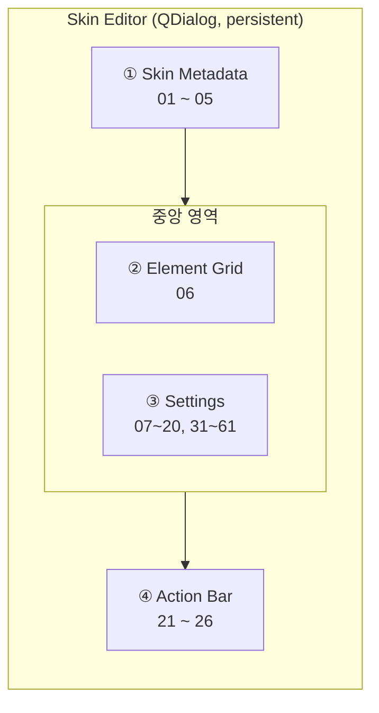
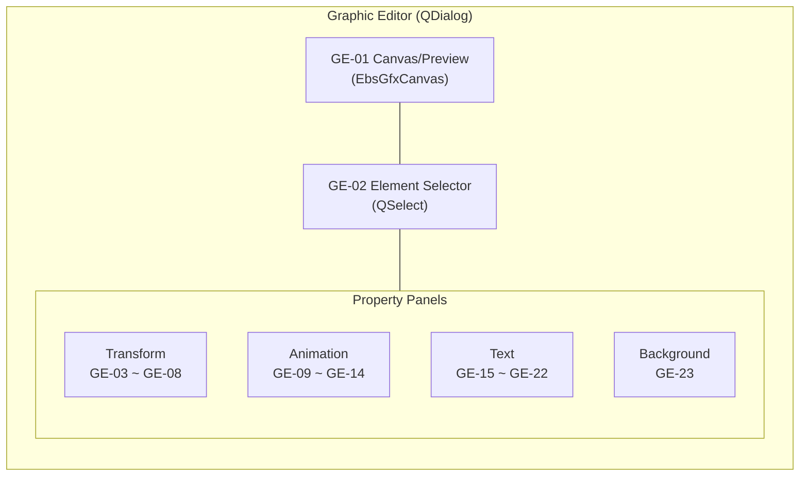
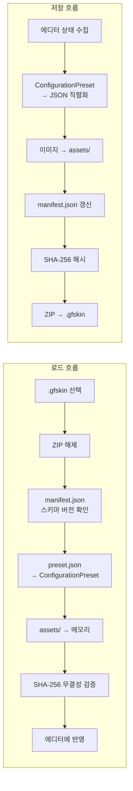
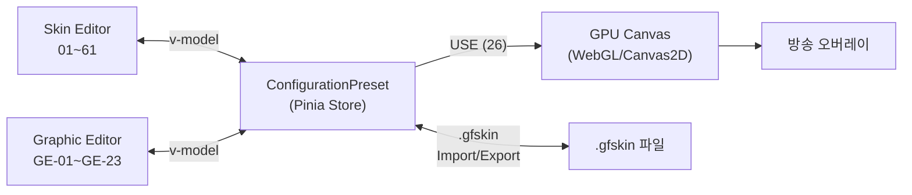

# EBS Skin Editor — 스킨 편집기 UI 설계

> **SSOT**: 이 문서는 EBS Skin Editor UI 설계의 유일한 정본입니다. PokerGFX 역공학 분석(PRD-0005)의 WHAT/WHY를 Quasar Framework 기반 UI 설계로 변환합니다.
>
> **관계**: 본 문서는 [EBS-UI-Design-v3](../../ebs/docs/00-prd/EBS-UI-Design-v3.prd.md)의 Skin Editor 서브 설계 문서이며, [PRD-0005](prd-skin-editor.prd.md)의 역공학 분석을 EBS 구현 사양으로 변환합니다.

## 1장. 문서 개요

> **TODO**: EBS-UI-Design-v3 통합 시 §1로 링크 대체 예정. 현재는 독립 문서로 유지.

### 1.1 이 문서의 목적

PRD-0005가 PokerGFX Skin Editor의 **"무엇이 있는가"**(역공학 분석)를 정의한다면, 본 문서는 EBS Skin Editor의 **"어떻게 만드는가"**(Quasar UI 설계)를 정의한다.

| 문서 | 역할 | 범위 |
|------|------|------|
| **PRD-0005** | 역공학 분석 (AS-IS) | PokerGFX WinForms 94개 컨트롤, skin_type 187 필드, 오버레이 Impact Map |
| **본 문서** | UI 설계 (TO-BE) | EBS Quasar Framework 컴포넌트, S-##/GE-## element ID, 데이터 흐름 |
| **EBS-UI-Design-v3** | 앱 전체 레이아웃 | 4탭 + Settings 구조, M-##/O-## element ID |

### 1.2 설계 원칙

1. **PokerGFX 기능 완전 계승**: 37개 Skin Editor 컨트롤 + Graphic Editor 전체 기능을 누락 없이 이전
2. **Quasar 네이티브 UX**: WinForms 모달 패턴 → QDialog persistent + responsive 레이아웃
3. **중복 배제**: skin_type 매핑, Impact Map은 PRD-0005 교차 참조로 처리

### 1.3 Scoping Decisions — EBS 범위 외 요소

Whitepaper는 15개 오버레이 요소를 문서화한다. EBS는 이 중 5개를 **의도적으로 제외**한다. 반복 질의를 방지하기 위해 제외 사유를 명시한다.

| Whitepaper 요소 | 제외 사유 | 대체 |
|----------------|----------|------|
| **PIP** (Picture-in-Picture) | 전용 하드웨어 비디오 스위처 영역. 소프트웨어 오버레이와 무관 | 해당 없음 |
| **Commentary Header** | 해설자 오디오 라우팅/자막 전용. 오버레이 스킨과 무관 | 해당 없음 |
| **Split Screen Divider** | 멀티뷰 레이아웃 전용. EBS v1은 단일 테이블 뷰만 지원 | 향후 멀티테이블 지원 시 재검토 |
| **Cards** (독립 렌더) | Whitepaper의 독립 Cards 오버레이는 EBS에서 11~13(카드 PIP 관리)으로 대체 | 11~13 |
| **Countdown** | Secure Delay 기능 폐지에 따른 비활성 기능 (Whitepaper 54개 비활성 목록) | 해당 없음 |
| **Ticker** | EBS 스코프에서 제외 확정. 별도 자막 시스템으로 대체 예정 | 향후 별도 설계 |

### 1.4 진입 경로

```
EBS Main → GFX 탭 → [Skin Editor 열기] → Skin Editor (QDialog)
                                            └→ [요소 클릭] → Graphic Editor (QDialog)
```

편집 빈도: GFX(방송마다) > Skin Editor(시즌마다) > Graphic Editor(디자인 변경 시). 빈도가 낮을수록 접근이 깊다 (PRD-0005 §1).

---

## 2장. Skin Editor 메인 레이아웃

### 2.1 전체 구조 (QDialog)

PokerGFX Skin Editor는 897×468 모달 윈도우(PRD-0005 §6). EBS에서는 `QDialog`(persistent, maximizable)로 구현하여 responsive 레이아웃을 지원한다.




*Skin Editor QDialog — 3열 레이아웃: Metadata 상단 전폭 + Element Grid/Adjust | Visual Settings | Behavior Settings. [HTML 원본](mockups/ebs-skin-editor.html)*


*영역별 컬러 Bounding Box — ■ Metadata (01~05) ■ Elements (06, 27~30) ■ Settings (07~61) ■ Actions (21~26)*

| 구역 | 위치 | Element ID | PRD-0005 참조 |
|:----:|------|:----------:|:---:|
| ① Skin Metadata | 최상단 | 01 ~ 05 | §7 |
| ② Element Grid + Adjustments | 좌측 중앙 | 06, 27~30 | §8, §12 |
| ③ Settings (Text/Cards/Player/Flags + Chipcount/Currency/Stats/CardDisplay/Layout/Misc) | 우측 중앙 | 07~20, 31~61 | §9~§11 |
| ④ Action Bar | 최하단 | 21 ~ 26 | §12 |

### 2.2 Skin Metadata (01 ~ 05)

스킨 식별 정보 + 글로벌 옵션. PRD-0005 §7에서 5개 컨트롤 확인.

| Element ID | 이름 | Quasar 컴포넌트 | 설명 | → 오버레이 영향 |
|:----------:|------|-----------------|------|:---:|
| **01** | Name (= Theme Name) | `QInput` | 스킨 이름 (예: "Titanium"). Whitepaper의 "Theme name"과 동일 필드 | 없음 (메타데이터) |
| **02** | Details | `QInput[type=textarea]` | 스킨 설명 | 없음 (메타데이터) |
| **03** | Remove Transparency | `QToggle` | 크로마키 모드 반투명 픽셀 제거 | 전체 (#1~#10) |
| **04** | 4K Design | `QToggle` | Graphic Editor 좌표계 1920×1080 ↔ 3840×2160 전환 | 전체 (#1~#10) |
| **05** | Adjust Size | `QSlider` | 스킨 전체 스케일 팩터 | 전체 (#1~#10) |

> **skin_type 매핑**: 01→`name`, 02→`details`, 03→`remove_partial_alpha`, 04→`video_lines`, 05→`scale_factor` (PRD-0005 §7)

### 2.3 Element Grid (06)

8개 요소 버튼을 4열 Grid로 배치. 각 버튼 클릭 시 해당 Graphic Editor(§3장)가 QDialog로 열린다. 범위 외 요소(Split Screen Divider, Ticker 등)는 §1.3 Scoping Decisions 참조.

| Element ID | 이름 | 배치 | → Graphic Editor 모드 | → 오버레이 요소 | PRD-0005 참조 |
|:----------:|------|:----:|:---:|:---:|:---:|
| **06** | Element Grid | — | — | — | §8 |
| 06.1 | Board | 1행 1열 | Board 모드 (§3.3) | #5, #8 | §13 |
| 06.2 | Blinds | 1행 2열 | Blinds 모드 | #7 | §14 |
| 06.3 | Outs | 1행 3열 | Outs 모드 | #4 승률 바 (간접) | §15 |
| 06.4 | Strip | 1행 4열 | Strip 모드 | #7, #9, #10 | — |
| 06.5 | Hand History | 2행 1열 | History 모드 | (독립 오버레이 패널) | §16 |
| 06.6 | Action Clock | 2행 2열 | Clock 모드 (§3.3) | #3 Action Badge (간접) | — |
| 06.7 | Leaderboard | 2행 3열 | Leaderboard 모드 | (별도 패널) | §17 |
| 06.8 | Field | 2행 4열 | Field 모드 | #9 | §20 |

Quasar 구현: `QBtn` × 8, `q-btn-group`으로 Grid 레이아웃. 각 버튼은 `@click`으로 Graphic Editor QDialog를 열며 모드 파라미터를 전달.

### 2.4 Settings 영역

우측 중앙 Settings 영역은 9개 서브섹션으로 구성된다. `QExpansionItem`으로 접이식 구현.

#### 2.4.1 Text/Font (07 ~ 10)

전역 텍스트 속성. 모든 오버레이 텍스트 요소에 영향. PRD-0005 §9.

| Element ID | 이름 | Quasar 컴포넌트 | 설명 | → 오버레이 영향 |
|:----------:|------|-----------------|------|:---:|
| **07** | All Caps | `QToggle` | 전체 텍스트 대문자 변환 | #1,#3,#4,#7~#9 |
| **08** | Reveal Speed | `QSlider` | 텍스트 등장 타이핑 효과 속도 | #1,#3 |
| **09** | Font 1/2 | `QInput` + `QBtn[...]` | 1차/2차 폰트 패밀리 (Font Picker) | 모든 텍스트 |
| **10** | Language | `QBtn` | 다국어 텍스트 설정 | 텍스트 전환 |

> **skin_type**: 07→`all_caps`, 08→`text_effect_speed`, 09→`font_family_name`/`font_family_name2`, 10→`lang` (PRD-0005 §9)

#### 2.4.2 Cards (11 ~ 13)

카드 PIP 이미지 관리. PRD-0005 §10.

| Element ID | 이름 | Quasar 컴포넌트 | 설명 | → 오버레이 영향 |
|:----------:|------|-----------------|------|:---:|
| **11** | Card Preview | `QImg` × 5 | 4수트 A + 뒷면 미리보기 | — |
| **12** | Card Management | `QBtn` × 3 (Add/Replace/Delete) + `QSelect` | 카드 세트 선택/관리 | #2, #5 |
| **13** | Import Card Back | `QBtn` | 카드 뒷면 이미지 교체 | #2 |

> **skin_type**: 11→`card_image`, 12→`ai_card_image`/`card_image_set_num`, 13→`card_image_xx` (PRD-0005 §10)

#### 2.4.3 Player/Flags (14 ~ 20)

Player Panel 외형 결정. PRD-0005 §11.

| Element ID | 이름 | Quasar 컴포넌트 | 설명 | → 오버레이 영향 |
|:----------:|------|-----------------|------|:---:|
| **14** | Variant | `QSelect` | 게임 타입 (HOLDEM/OMAHA 등) → 카드 장수 | #1, #2 |
| **15** | Player Set | `QSelect` | 게임별 Player 에셋 세트 | #1 |
| **16** | Set Management | `QBtn` × 3 (Edit/New/Delete) | Player Set CRUD. Edit → Graphic Editor §3.3 Player 모드 | #1 |
| **17** | Crop to Circle | `QToggle` | 플레이어 사진 원형 마스크 | #1 |
| **18** | Country Flag Mode | `QToggle` | 국기 독립 표시 모드 (P2) | #1 |
| **19** | Edit Flags | `QBtn` | 국기 이미지 편집 다이얼로그 (P2) | #1 |
| **20** | Hide Flag After | `QInput[type=number]` | N초 후 국기 자동 숨김, 0=숨기지 않음 (P2) | #1 |

> **skin_type**: 14→`skin_layout`, 15→`player` (List), 17→`pic_crop_circle`, 18→`flag_independent_of_photo`, 20→`hide_flag_period` (PRD-0005 §11)

> **ID 범위 참고**: 21~26은 Action Bar (§2.5), 27~30은 Adjust Colours (§2.6)에 배정되어 있다. Settings 영역의 확장 ID는 31부터 시작한다.

#### 2.4.4 Chipcount Display (31 ~ 33)

칩 카운트 숫자 표시 정밀도 및 형식. Whitepaper: 8개 독립 precision 필드 × 3단계 + display type.

| Element ID | 이름 | Quasar 컴포넌트 | 설명 | → 오버레이 영향 |
|:----------:|------|-----------------|------|:---:|
| **31** | Chipcount Precision | `QSelect` × 8 | 영역별 숫자 정밀도. 각 드롭다운: full / smart / smart_ext | #1,#7,#8 |
| **32** | Display Type | `QSelect` | 금액 표시 형식: amount / bb_multiple / both | #1,#7,#8 |
| **33** | Text Size | `QSlider` | 글로벌 텍스트 크기 조절 | 전체 텍스트 |

**Precision 영역 매핑**:

| 드롭다운 | skin_type | 영향 위치 |
|----------|-----------|----------|
| Leaderboard | `cp_leaderboard` | Leaderboard 패널 |
| Player Stack | `cp_pl_stack` | #1 Player Panel 스택 |
| Player Action | `cp_pl_action` | #3 Action Badge 금액 |
| Blinds | `cp_blinds` | #7 Bottom Strip 블라인드 |
| Pot | `cp_pot` | #8 팟 카운터 |
| Twitch | `cp_twitch` | Twitch 연동 표시 |
| Ticker | `cp_ticker` | (범위 외, 예약) |
| Strip | `cp_strip` | #7 Strip 금액 |

> **Precision 단계**: `full` = "1,000,000", `smart` = "1M", `smart_ext` = "1.0M"
> **skin_type**: 31→`cp_*`, 32→`chipcount_disp_type`, 33→`text_size`

#### 2.4.5 Currency (34 ~ 37)

통화 기호 및 금액 표시 설정. 국제 방송 필수.

| Element ID | 이름 | Quasar 컴포넌트 | 설명 | → 오버레이 영향 |
|:----------:|------|-----------------|------|:---:|
| **34** | Currency Symbol | `QInput` | 통화 기호 (예: "$", "€", "₩") | 모든 금액 표시 |
| **35** | Show Currency | `QToggle` | 통화 기호 표시 여부 | 모든 금액 표시 |
| **36** | Trailing Symbol | `QToggle` | 기호 위치: 선행("$100") / 후행("100$") | 모든 금액 표시 |
| **37** | Divide by 100 | `QToggle` | 금액을 100으로 나누어 표시 (센트→달러 변환) | 모든 금액 표시 |

> **skin_type**: 34→`currency_symbol`, 35→`show_currency`, 36→`trailing_currency_symbol`, 37→`divide_amts_by_100`

#### 2.4.6 Statistics (38 ~ 44)

자동 통계 표시 구성. Whitepaper: 12+ boolean 필드.

| Element ID | 이름 | Quasar 컴포넌트 | 설명 | → 오버레이 영향 |
|:----------:|------|-----------------|------|:---:|
| **38** | Auto Stats | `QToggle` | 통계 자동 표시 마스터 스위치 | #1 Player Panel |
| **39** | Stat Types | `QToggle` × 5 | VPIP / PFR / AGR / WTSD / CumWin 개별 on/off | #1 Player Panel |
| **40** | Show Rank | `QToggle` | 순위 표시 | #1 Player Panel |
| **41** | Show Seat Number | `QToggle` | 좌석 번호 표시 | #1 Player Panel |
| **42** | Show Eliminated | `QToggle` | 탈락 상태 표시 | #1 Player Panel |
| **43** | Show Action-On Text | `QToggle` | 액션 대기 텍스트 표시 | #3 Action Badge |

> **skin_type**: 38→`auto_stats`, 39→`auto_stat_vpip/pfr/agr/wtsd/cumwin`, 40→`show_rank`, 41→`show_seat_num`, 42→`show_eliminated`, 43→`show_action_on_text`
>
> **예약 필드** (범위 외): `auto_stat_ticker_vpip`, `auto_stat_ticker_pfr` — Ticker 통계용. §1.3 Scoping Decisions에 따라 미구현

#### 2.4.7 Card Display (44 ~ 49)

카드 공개/숨김 타이밍 설정. 방송 연출의 핵심.

| Element ID | 이름 | Quasar 컴포넌트 | 설명 | → 오버레이 영향 |
|:----------:|------|-----------------|------|:---:|
| **44** | At Showdown | `QSelect` | 쇼다운 시 공개 방식 (4종) | #2 홀카드 |
| **45** | Card Reveal | `QSelect` | 카드 공개 타이밍 (6종) | #2 홀카드 |
| **46** | Fold Hide | `QSelect` | 폴드 시 카드 숨김 방식 (2종) | #2 홀카드 |
| **47** | Fold Hide Period | `QInput[type=number]` | 폴드 후 카드 숨김 지연 (초) | #2 홀카드 |
| **48** | Winning Hand Highlight | `QSelect` | 승리 핸드 강조 방식 (4종) | #2, #5 |
| **49** | Override Card Set | `QToggle` | 스킨의 카드 세트가 GFX 탭 설정을 오버라이드 | #2, #5 |

> **skin_type**: 44→`at_show`, 45→`card_reveal`, 46→`fold_hide`, 47→`fold_hide_period`, 48→`hilite_winning_hand_type`, 49→`override_card_set`
>
> **추가 옵션** (P2): `rabbit_hunt` (래빗 헌트 카드 표시), `dead_cards` (죽은 카드 표시)

#### 2.4.8 Layout (50 ~ 56)

오버레이 기본 배치(수직/수평, 마진, 보드 위치) 설정.

| Element ID | 이름 | Quasar 컴포넌트 | 설명 | → 오버레이 영향 |
|:----------:|------|-----------------|------|:---:|
| **50** | Board Position | `QSelect` | 보드 위치 (3종: top/center/bottom) | #5 커뮤니티 카드 |
| **51** | GFX Vertical | `QToggle` | 수직 레이아웃 모드 | 전체 배치 |
| **52** | GFX Bottom Up | `QToggle` | 아래→위 정렬 | 전체 배치 |
| **53** | GFX Fit | `QToggle` | 해상도 맞춤 자동 스케일 | 전체 배치 |
| **54** | Heads-Up Layout | `QSelect` + `QSelect` | 모드 (3종) + 방향 (2종) | 헤드업 시 배치 |
| **55** | X Margin | `QInput[type=number]` | 수평 마진 (px) | 전체 배치 |
| **56** | Y Margin Top/Bottom | `QInput[type=number]` × 2 | 상/하 마진 (px) | 전체 배치 |

> **skin_type**: 50→`board_pos`, 51→`gfx_vertical`, 52→`gfx_bottom_up`, 53→`gfx_fit`, 54→`heads_up_layout_mode`/`heads_up_layout_direction`, 55→`x_margin`, 56→`y_margin_top`/`y_margin_bot`

#### 2.4.9 Misc (57 ~ 61)

기타 ConfigurationPreset 필드. Whitepaper에 존재하나 주요 카테고리에 속하지 않는 설정.

| Element ID | 이름 | Quasar 컴포넌트 | 설명 | → 오버레이 영향 |
|:----------:|------|-----------------|------|:---:|
| **57** | Vanity Text | `QInput` | 커스텀 표시 텍스트 | #7 Bottom Strip |
| **58** | Game Name in Vanity | `QToggle` | Vanity Text에 게임명 포함 | #7 Bottom Strip |
| **59** | Leaderboard Position | `QSelect` | 리더보드 위치 (9종 enum) | Leaderboard 패널 |
| **60** | Strip Display Type | `QSelect` | off / stack / cumwin | #7 Strip |
| **61** | Order Players Type | `QSelect` | 플레이어 정렬 기준 | #1 Player Panel |

> **skin_type**: 57→`vanity_text`, 58→`game_name_in_vanity`, 59→`leaderboard_pos_enum`, 60→`strip_display_type`, 61→`order_players_type`
>
> **추가 필드** (구현 시 매핑): `media_path`, `nit_display`, `indent_action`

### 2.5 Action Bar (21 ~ 26)

최하단 액션 버튼 행. PRD-0005 §12.

| Element ID | 이름 | Quasar 컴포넌트 | 설명 | → 오버레이 영향 |
|:----------:|------|-----------------|------|:---:|
| **21** | IMPORT | `QBtn` | .gfskin 파일 선택 → 에디터에 로드 | 전체 (새 스킨 로드) |
| **22** | EXPORT | `QBtn` | 현재 상태 → .gfskin 저장 | — |
| **23** | DOWNLOAD | `QBtn` | 온라인 스킨 마켓플레이스 (P2) | — |
| **24** | RESET | `QBtn` | 내장 기본 스킨 복원 | 전체 (초기화) |
| **25** | DISCARD | `QBtn` | 마지막 저장 상태 복원 | 전체 (복원) |
| **26** | USE | `QBtn[color=primary]` | ConfigurationPreset → GPU Canvas 즉시 반영 | 전체 (적용) |

**EBS 추가**: EXPORT FOLDER 버튼 — .gfskin을 폴더 구조(ZIP 해제 상태)로 내보내기. 커뮤니티 스킨 수정 편의성 제공 (P2, SE-F16).

### 2.6 Adjust Colours (27 ~ 30)

Element Grid 하단 Adjustments 영역. 인라인 `QExpansionItem` × 2로 접근 (Colour Adjustment + Colour Replacement). PRD-0005 §12, §21.4.

| Element ID | 이름 | Quasar 컴포넌트 | 설명 | → 오버레이 영향 |
|:----------:|------|-----------------|------|:---:|
| **27** | Colour Adjustment (헤더) | `QExpansionItem` | Hue/Tint 접이식 패널 진입점 (기본 펼침) | — |
| **28** | Hue | `QSlider` | 색상 시프트 | 전체 (#1~#10) |
| **29** | Tint R/G/B | `QSlider` × 3 | RGB 틴트 강도 | 전체 (#1~#10) |
| **30** | Color Replace | `QCard` × 3 (규칙 리스트) | 3개 독립 색상 교체 규칙 (아래 상세) | 전체 (#1~#10) |

**Color Replace 상세** (30): 3개 독립 규칙(cr1/cr2/cr3), 각각:

| 필드 | Quasar 컴포넌트 | 설명 | skin_type |
|------|-----------------|------|-----------|
| Enable | `QToggle` | 규칙 활성화 | `cr{N}_enabled` |
| Source Color | `QColor` + `QPopupProxy` | 교체 대상 색상 | `cr{N}_source` |
| Dest Color | `QColor` + `QPopupProxy` | 교체 결과 색상 | `cr{N}_dest` |
| Threshold | `QSlider` (0~255) | 색상 유사도 허용 범위 | `cr{N}_threshold` |

> **skin_type**: 28→`adjust_hue`, 29→`adjust_tint_r/g/b`, 30→`cr1_*/cr2_*/cr3_*` (PRD-0005 §12)

---

## 3장. Graphic Editor

### 3.1 통합 설계 결정

PokerGFX는 Board Graphic Editor(`gfx_edit.cs`)와 Player Graphic Editor(`gfx_edit_player.cs`)를 별도 클래스로 구현한다 (PRD-0005 부록 B: Board 39 + Player 48 컨트롤). EBS에서는 **단일 Graphic Editor QDialog + 모드 전환**으로 통합한다.

| 결정 | PokerGFX (AS-IS) | EBS (TO-BE) | 사유 |
|------|-------------------|-------------|------|
| 에디터 수 | Board GE + Player GE 별도 | 단일 GE + 모드 파라미터 | 코드 중복 제거 (공통 패널 87% 동일) |
| 진입 방식 | 06 버튼 → 별도 모달 | 06 버튼 → QDialog(mode=Board\|Player\|...) | 일관된 UX |
| ~~Ticker~~ | ~~Graphic Editor 아님, 별도 모달~~ | **EBS 범위 외** (§1.3 Scoping Decisions) | — |

### 3.2 공통 패널 구조

모든 Graphic Editor 모드에 공통으로 나타나는 패널. PRD-0005 §21.




*Graphic Editor QDialog — Canvas + Property Panels (GE-01~GE-23, sub-ID GE-08a~GE-08d 포함 총 27개). [HTML 원본](mockups/ebs-graphic-editor.html)*

#### 적응형 레이아웃 패턴 (A/B/C)

캔버스 크기와 서브요소 수에 따라 3종 레이아웃 패턴을 적용한다.

| 패턴 | 구조 | 적용 모드 | 캔버스 | 서브요소 |
|:----:|------|----------|:------:|:--------:|
| **A** | Left(Element List) \| Center(Canvas) \| Right(Properties) | Board, Field, Strip | ≤300px | 3~14 |
| **B** | Canvas Top 전폭 + 2×2 Grid (Transform\|Text / Animation\|Background) | Blinds, History | 극단적 가로 띠 | 3~4 |
| **C** | Canvas Top 전폭 + 3열 하단 (Transform \| Animation \| Text+Background) | Player, Outs, Leaderboard | 465px+ | 3~9 |

**패턴 선택 기준**: 캔버스 폭 ≤300px → A, 종횡비 >10:1 또는 서브요소 ≤4개 → B, 그 외 → C.

각 모드별 목업:
- 패턴 A: [Board](mockups/ebs-ge-board.html) | [Field](mockups/ebs-ge-field.html) | [Strip](mockups/ebs-ge-strip.html)
- 패턴 B: [Blinds](mockups/ebs-ge-blinds.html) | [History](mockups/ebs-ge-history.html)
- 패턴 C: [Player](mockups/ebs-ge-player.html) | [Outs](mockups/ebs-ge-outs.html) | [Leaderboard](mockups/ebs-ge-leaderboard.html)

#### Canvas/Preview (GE-01)

| Element ID | 이름 | Quasar 컴포넌트 | 설명 |
|:----------:|------|-----------------|------|
| **GE-01** | WYSIWYG Canvas | `EbsGfxCanvas` (커스텀, §4.2.1) | 요소 프리뷰 + 마우스 드래그. 캔버스 크기는 모드별 상이 (Board 296×197, Blinds 790×52 등). 선택된 서브요소는 노란 점선 하이라이트 |

#### Element Selector (GE-02)

| Element ID | 이름 | Quasar 컴포넌트 | 설명 |
|:----------:|------|-----------------|------|
| **GE-02** | Element Dropdown | `QSelect` | 모드별 서브요소 선택. Board=14개, Player=N+7개 등 (PRD-0005 §8 서브요소 목록). Player 공식: N(카드) + 5(Name/Action/Stack/Odds/Position) + 2(Photo/Flag) = N+7 |

#### Transform (GE-03 ~ GE-08)

| Element ID | 이름 | Quasar 컴포넌트 | 설명 | → 오버레이 변화 |
|:----------:|------|-----------------|------|:---:|
| **GE-03** | Left | `QInput[type=number]` | 수평 위치 (px) | 요소 X 좌표 |
| **GE-04** | Top | `QInput[type=number]` | 수직 위치 (px) | 요소 Y 좌표 |
| **GE-05** | Width | `QInput[type=number]` | 너비 (px) | 요소 너비 |
| **GE-06** | Height | `QInput[type=number]` | 높이 (px) | 요소 높이 |
| **GE-07** | Z-order | `QInput[type=number]` | 레이어 순서 (-99~99) | 겹침 순서 |
| **GE-08** | Angle | `QInput[type=number]` | 회전 (-360°~360°) | 요소 회전 |

추가 Transform 컨트롤:

| Element ID | 이름 | Quasar 컴포넌트 | 설명 |
|:----------:|------|-----------------|------|
| GE-08a | Anchor H | `QSelect` (Left/Right) | 해상도 변경 시 수평 기준점 |
| GE-08b | Anchor V | `QSelect` (Top/Bottom) | 해상도 변경 시 수직 기준점 |
| GE-08c | Margins X/Y | `QInput[type=number]` × 2 | 요소 내부 여백 |
| GE-08d | Corner Radius | `QInput[type=number]` | 배경 라운드 모서리 |

> **좌표계**: Design Resolution 기준 (04에 따라 1920×1080 또는 3840×2160). 출력 해상도가 다르면 자동 스케일링 (PRD-0005 §27).

#### Animation (GE-09 ~ GE-14)

| Element ID | 이름 | Quasar 컴포넌트 | 설명 | → 오버레이 변화 |
|:----------:|------|-----------------|------|:---:|
| **GE-09** | Transition In | `QSelect` | 5종: Global, Fade, Slide, Pop, Expand | 등장 효과 |
| **GE-10** | Transition Out | `QSelect` | 5종 (동일) | 퇴장 효과 |
| **GE-11** | AnimIn File | `QBtn` (Import) | 커스텀 등장 애니메이션 파일 | 등장 연출 |
| **GE-12** | AnimIn Speed | `QSlider` | 등장 속도 (ms) | 전환 지속 시간 |
| **GE-13** | AnimOut File | `QBtn` (Import) | 커스텀 퇴장 애니메이션 파일 | 퇴장 연출 |
| **GE-14** | AnimOut Speed | `QSlider` | 퇴장 속도 (ms) | 전환 지속 시간 |

> **Transition 타입 enum**: 두 종류의 transition enum이 존재한다.
> - `transition_type` (요소별): `fade=0, slide=1, pop=2, expand=3` — 4값
> - `skin_transition_type` (스킨 레벨): `global=0, fade=1, slide=2, pop=3, expand=4` — 5값. 값 0("Global")은 전역 설정을 사용한다는 의미 (PRD-0005 §24)

#### Text (GE-15 ~ GE-22)

텍스트를 포함하는 서브요소 선택 시 활성화. PRD-0005 §21.3.

| Element ID | 이름 | Quasar 컴포넌트 | 설명 | → 오버레이 변화 |
|:----------:|------|-----------------|------|:---:|
| **GE-15** | Text Visible | `QToggle` | 텍스트 렌더링 on/off | 텍스트 표시 |
| **GE-16** | Font Select | `QSelect` (Font 1/Font 2) | 폰트 패밀리 선택 | 텍스트 폰트 |
| **GE-17** | Text Colour | `QColor` + `QPopupProxy` | 텍스트 색상 | 텍스트 색상 |
| **GE-18** | Hilite Colour | `QColor` + `QPopupProxy` | 강조 상태 색상 | 강조 색상 |
| **GE-19** | Alignment | `QSelect` (Left/Center/Right) | 텍스트 정렬 | 정렬 |
| **GE-20** | Drop Shadow | `QToggle` + `QSelect` (9방향) | 그림자 효과 + 방향 | 텍스트 그림자 |
| **GE-21** | Shadow Colour | `QColor` + `QPopupProxy` | 그림자 색상 | 그림자 색상 |
| **GE-22** | Triggered by Language | `QToggle` | 다국어 전환 시 갱신 여부 | 텍스트 전환 |

> **Drop Shadow 방향 enum**: `none=0, north=1, north_east=2, east=3, south_east=4(기본), south=5, south_west=6, west=7, north_west=8` (PRD-0005 §24)
>
> **font_type 추가 필드** (구현 시 매핑 필요): 위 GE-15~GE-22에 추가로 per-text `z_pos`, `background_bm` (개별 배경 이미지), `margins`, `margins_h`, `background_corner_radius`, `font_set`, `rendered_size` 필드가 존재한다. 이 필드들은 Transform(GE-03~GE-08) 또는 Background(GE-23)와 중복 가능하므로 구현 시 통합 여부를 결정한다.

#### Background (GE-23)

| Element ID | 이름 | Quasar 컴포넌트 | 설명 |
|:----------:|------|-----------------|------|
| **GE-23** | Background Image | `QImg` + `QBtn` (Import/Delete) | 요소별 배경 이미지. Import Mode 드롭다운으로 모드별 이미지 교체 (Board: Auto/AT Flop/AT Draw, Leaderboard: Header/Repeat/Footer 등) |

### 3.3 모드별 상세

각 모드는 §3.2 공통 패널을 공유하되, Element 드롭다운 서브요소와 Import Mode가 다르다. 상세는 PRD-0005 §13~§20을 정본으로 참조한다.

| 모드 | 캔버스 크기 | Element 서브요소 수 | Import Mode | PRD-0005 | 목업 |
|------|:----------:|:---:|------|:---:|:---:|
| **Board** | 296 × 197 | 14 (Card 1~5, Sponsor Logo, PokerGFX.io, 100,000, Pot, Blinds, 50,000/100,000, Hand, 123, Game Variant) | Auto / AT (Flop) / AT (Draw/Stud) — 3종 | §13 | [HTML](mockups/ebs-ge-board.html) |
| **Player** | 270×90 (compact) / 465×84 (vertical) / 465×120 (horizontal+photo) | N+7 (Card 1~N, Name, Action, Stack, Odds, Position, Photo, Flag). Holdem: 9, Omaha: 11 | AT Mode / AT with photo 등 | §19 | [HTML](mockups/ebs-ge-player.html) |
| **Blinds** | 790 × 52 | 4 (Blinds, 50,000/100,000, Hand, 123) | Blinds with Hand # | §14 | [HTML](mockups/ebs-ge-blinds.html) |
| **Outs** | 465 × 84 | 3 (Card 1, Name, # Outs) | — | §15 | [HTML](mockups/ebs-ge-outs.html) |
| **Field** | 270 × 90 | 3 (Total, Remain, Field) | — | §20 | [HTML](mockups/ebs-ge-field.html) |
| **Leaderboard** | 800 × 103 | 9 (Player Photo, Player Flag, Sponsor Logo, Title, Left, Centre, Right, Footer, Event Name) | Header / Repeating / Footer — 3종 | §17 | [HTML](mockups/ebs-ge-leaderboard.html) |
| **Hand History** | 345 × 33 | 3 (Pre-Flop, Name, Action) | Header / Repeating header / Repeating detail / Footer — 4종 | §16 | [HTML](mockups/ebs-ge-history.html) |
| **Action Clock** | 109 × 109 | 2 (Clock Face, Time Text) | — | — | — |
| **Strip** | 270 × 90 | 6 (Name, Count, Position, VPIP, PFR, Logo) | Strip | §20 | [HTML](mockups/ebs-ge-strip.html) |

#### 모드별 캔버스 레이아웃

각 모드의 캔버스 내 서브요소 배치를 시각화한 와이어프레임 목업:


*Board — 14개 서브요소: Card 1~5 (상단), Sponsor Logo/PokerGFX.io (중단), Pot/Blinds (하단). [HTML 원본](mockups/ebs-ge-board.html)*


*Player — 서브요소: Photo/Card 1~N/Name/Flag (상단), Action/Stack/Odds/Position (하단). [HTML 원본](mockups/ebs-ge-player.html)*

> **Player 캔버스 크기 — `skin_layout_type` 매핑**:
> | `skin_layout_type` | 캔버스 크기 | 설명 |
> |:---|:---:|:---|
> | `compact` | 270×90 | 사진 없음, 최소 정보 |
> | `vertical_only` | 465×84 | 수직 레이아웃, 사진 없음 |
> | `horizontal_with_photo` | 465×120 | 수평 레이아웃, 사진 포함 (기본) |


*Blinds — 4개 서브요소: Blinds/50,000/100,000/Hand/123 가로 배열. [HTML 원본](mockups/ebs-ge-blinds.html)*


*Outs — 3개 서브요소: Card 1/Name/# Outs. [HTML 원본](mockups/ebs-ge-outs.html)*


*Field — 3개 서브요소: Field (상단 바), Remain/Total (하단). [HTML 원본](mockups/ebs-ge-field.html)*


*Leaderboard — 9개 서브요소: Photo/Flag/Title/Left/Centre/Right/Logo (상단), Event Name/Footer (하단). [HTML 원본](mockups/ebs-ge-leaderboard.html)*


*Hand History — 3개 서브요소: Pre-Flop/Name/Action (가로 배열). [HTML 원본](mockups/ebs-ge-history.html)*


*Strip — 6개 서브요소: Name/Count/Pos/VPIP/PFR/Logo (가로 배열). [HTML 원본](mockups/ebs-ge-strip.html)*

---

## 4장. Quasar Component 매핑

### 4.1 WinForms → Quasar 매핑 테이블

PokerGFX Skin Editor의 WinForms 컨트롤을 Quasar Framework 컴포넌트로 1:1 매핑한다. PRD-0005 §6~§21에서 식별된 모든 컨트롤 타입을 커버한다.

| WinForms 컨트롤 | Quasar 컴포넌트 | 사용처 | 비고 |
|-----------------|-----------------|--------|------|
| TextBox | `QInput` | 01 Name, 02 Details, 09 Font | `type="text"`, Details는 `type="textarea"` |
| CheckBox | `QToggle` | 03, 04, 07, 17, 18, GE-09 | `v-model` boolean 바인딩 |
| ComboBox | `QSelect` | 14 Variant, 15 Player Set, GE-02, GE-16 | `emit-value`, `map-options` |
| TrackBar | `QSlider` | 05, 08, GE-12, GE-14 | `min`/`max`/`step`, `label-always` |
| NumericUpDown | `QInput[type=number]` | GE-03~GE-08, 20 | `type="number"`, `min`/`max`/`step` |
| ColorPicker | `QColor` + `QPopupProxy` | GE-17, GE-18, GE-20, GE-21, 28~30 | 팝업 방식 색상 선택 |
| Button | `QBtn` | 21~26, 06, 12, 16, 19 | `@click` 이벤트 |
| PictureBox | `QImg` / `<canvas>` | 11 Card Preview, GE-01 Canvas | 미리보기 영역 |
| Label | `QField` label / `<span>` | 캔버스 크기 표시, 섹션 라벨 | 정적 텍스트 |
| GroupBox | `QCard` + `QExpansionItem` | Elements, Adjustments, Cards, Player, Flags | 섹션 그룹핑 |
| Panel (모달) | `QDialog` | Skin Editor 전체, Graphic Editor | `persistent`, `maximized` 옵션 |
| OpenFileDialog | `QFile` + native picker | 21 Import, GE-23 Background, 13 Card Back | `.gfskin`, `.png` 필터 |

### 4.2 커스텀 컴포넌트

표준 Quasar 컴포넌트로 대체할 수 없는 2개 영역은 커스텀 구현이 필요하다.

#### 4.2.1 WYSIWYG Canvas (`EbsGfxCanvas`)

Graphic Editor의 핵심 프리뷰 영역. PokerGFX `gfx_edit.cs`의 Canvas + 마우스 드래그 기능을 재현한다.

| 속성 | 설명 | PRD-0005 참조 |
|------|------|:---:|
| 기술 | HTML5 `<canvas>` + Canvas 2D API | §13~§20 WYSIWYG |
| 기능 | 서브요소 렌더링, 선택(노란 점선), 드래그 이동/리사이즈 | GE-F02 |
| 입력 | `ConfigurationPreset` 현재 요소 데이터 | §21.1 Transform |
| 출력 | 드래그 결과 → L/T/W/H 값 양방향 바인딩 | GE-F03 |
| 해상도 | Design Resolution 기준 좌표계 (1920×1080 또는 3840×2160) | §27 |

#### 4.2.2 Color Adjustment Dialog (`EbsColorAdjust`)

Hue/Tint 일괄 색상 조정 다이얼로그. PRD-0005 §12, §21.4 Adjust Colours 기능을 재현한다.

| 속성 | 설명 | PRD-0005 참조 |
|------|------|:---:|
| 기술 | `QDialog` + `QSlider` × 4 | §12 Adjust Colours |
| 컨트롤 | Hue, Tint R, Tint G, Tint B 슬라이더 | 28~30 |
| 적용 | 전체 오버레이 요소(#1~#10) 일괄 색상 변환 | §5.1 Impact Map |
| skin_type | `adjust_hue`, `adjust_tint_r/g/b` (float × 4) | §12 |

---

## 5장. 데이터 흐름

### 5.1 .gfskin 로드/저장

EBS는 PokerGFX `.skn`(AES+BinaryFormatter)에서 `.gfskin`(ZIP+JSON) 개방형 포맷으로 전환한다. 상세 파일 구조와 로드/저장 흐름은 PRD-0005 §22~§25를 정본으로 참조한다.



| 비교 항목 | PokerGFX .skn | EBS .gfskin |
|-----------|:---:|:---:|
| 컨테이너 | 단일 바이너리 | ZIP 아카이브 |
| 직렬화 | BinaryFormatter | JSON |
| 암호화 | AES 강제 | 선택적 (상용만) |
| 이미지 | byte[] 인라인 | assets/ 개별 PNG |
| 호환성 | 버전 종속 | 스키마 버전 + 마이그레이션 |

> **하위 호환**: PokerGFX `.skn` 읽기 전용 임포트 지원 (AES 복호화 → BinaryFormatter 역직렬화 → preset.json 변환). PRD-0005 §25.3.
>
> **무결성 검증 이중 경로**:
> - `.gfskin` (신규): SHA-256 해시 — `manifest.json`에 기록, 로드 시 검증
> - `.skn` (임포트): CRC32 (`skin_crc` 필드) — 원본 무결성 검증 후 변환 진행. CRC32 불일치 시 손상 경고 + 사용자 확인 요구

### 5.2 Editor State ↔ ConfigurationPreset

Skin Editor/Graphic Editor의 모든 UI 값은 `ConfigurationPreset` DTO(187+ 필드)와 양방향 바인딩된다.



| 계층 | 기술 | 역할 |
|------|------|------|
| UI Layer | Quasar Components (S-##, GE-##) | 사용자 입력 수집 |
| State Layer | Pinia Store (`useSkinStore`) | ConfigurationPreset 반응형 관리 |
| Persistence Layer | .gfskin (ZIP+JSON) | 파일 I/O |
| Render Layer | Canvas 2D / WebGL | 오버레이 프리뷰 + 방송 출력 |

skin_type 187개 필드의 카테고리별 분류와 전체 매핑은 PRD-0005 §23, 부록 C를 참조한다.

---

## 6장. 요구사항 교차 참조

### 6.1 PRD-0005 → EBS 매핑

PRD-0005 §28~§30의 기능 요구사항을 본 문서의 Element ID와 교차 매핑한다.

#### Skin Editor 기능 요구사항 (SE-F01 ~ SE-F16)

| PRD-0005 ID | 요구사항 | EBS Element ID | 본 문서 섹션 | 우선순위 |
|:---:|----------|:---:|:---:|:---:|
| SE-F01 | 스킨 로드 (.gfskin Import) | 21 | §2.5 | P1 |
| SE-F02 | 스킨 저장 (.gfskin Export) + 선택적 AES | 22 | §2.5 | P1 |
| SE-F03 | 스킨 생성 (기본 템플릿) | 24 | §2.5 | P1 |
| SE-F04 | 스킨 프리뷰 (실시간 렌더링) | GE-01 | §3.2 | P1 |
| SE-F05 | 배경 이미지 Import (요소별) | 06 → GE-23 | §2.3, §3.2 | P1 |
| SE-F06 | 카드 PIP 이미지 관리 | 11~13 | §2.4.2 | P1 |
| SE-F07 | 좌표 편집 (LTWH, Z, Angle, Anchor) | GE-03~GE-08 | §3.2 | **P0** |
| SE-F08 | 폰트 설정 (Font 1/2, All Caps) | 07~09 | §2.4.1 | P1 |
| SE-F09 | 색상 조정 (Hue/Tint) | 27~30 | §2.6 | P1 |
| SE-F10 | Undo/Redo | (Pinia 히스토리) | — | P2 |
| SE-F11 | 이미지 에셋 교체 (배경/로고) | GE-23 | §3.2 | P1 |
| SE-F12 | 애니메이션 속도/타입 설정 | GE-09~GE-14 | §3.2 | P1 |
| SE-F13 | 투명도 제거 (크로마키) | 03 | §2.2 | P1 |
| SE-F14 | 레이어 Z-order 제어 | GE-07 | §3.2 | **P0** |
| SE-F15 | Player Set 복제/관리 | 15~16 | §2.4.3 | P1 |
| SE-F16 | 스킨 내보내기 (폴더 구조) | 22 (확장) | §2.5 | P2 |

#### Graphic Editor 기능 요구사항 (GE-F01 ~ GE-F15)

| PRD-0005 ID | 요구사항 | EBS Element ID | 본 문서 섹션 | 우선순위 |
|:---:|----------|:---:|:---:|:---:|
| GE-F01 | Element 드롭다운 서브요소 선택 | GE-02 | §3.2 | **P0** |
| GE-F02 | WYSIWYG 프리뷰 + 마우스 드래그 | GE-01 | §3.2, §4.2.1 | **P0** |
| GE-F03 | Transform (L/T/W/H) 편집 | GE-03~GE-06 | §3.2 | **P0** |
| GE-F04 | Z-order 제어 | GE-07 | §3.2 | **P0** |
| GE-F05 | Anchor 설정 (해상도 적응) | GE-08a~GE-08b | §3.2 | **P0** |
| GE-F06 | Animation/Transition 설정 (타입 + 파일 + 속도) | GE-09~GE-14 | §3.2 | P1 |
| GE-F08 | 텍스트 속성 편집 (Font/Color/Align/Shadow) | GE-15~GE-21 | §3.2 | P1 |
| GE-F09 | 배경 이미지 설정 | GE-23 | §3.2 | P1 |
| GE-F10 | Adjust Colours (색상 조정) | 27~30 | §2.6, §4.2.2 | P1 |
| GE-F11 | Board — 커뮤니티 카드 배치 (5장) | GE-01 (Board 모드) | §3.3 | **P0** |
| GE-F12 | Board — POT/딜러 영역 배치 | GE-01 (Board 모드) | §3.3 | **P0** |
| GE-F13 | Player — 이름/칩/홀카드/액션/승률/포지션 배치 | GE-01 (Player 모드) | §3.3 | **P0** |
| GE-F14 | Player — 카드 애니메이션 | GE-11~GE-14 (Player 모드) | §3.2, §3.3 | P1 |
| GE-F15 | 캔버스 크기 표시 (Design Resolution) | GE-01 | §3.2 | P1 |

### 6.2 구현 우선순위 (P0/P1/P2)

| 우선순위 | 범위 | 요구사항 ID | 목표 |
|:--------:|------|------------|------|
| **P0** (MVP) | Graphic Editor Transform + Element 선택 + WYSIWYG + Board/Player 핵심 배치 | GE-F01~F05, GE-F11~F13, SE-F07, SE-F14 | 오버레이 요소 위치/크기 편집 가능 |
| **P1** (초기 배포) | Skin Editor 전체 (로드/저장/프리뷰/폰트/색상/애니메이션/카드/Player Set) | SE-F01~F09, SE-F11~F15, GE-F06~F10, GE-F14~F15 | 완전한 스킨 편집 워크플로우 |
| **P2** (안정화 후) | Undo/Redo, 폴더 내보내기, 온라인 다운로드, 국기 설정 | SE-F10, SE-F16, 23, 18~20 | 편의 기능 및 커뮤니티 기능 |

### 6.3 비기능 요구사항

PRD-0005 §29에서 정의. EBS 맥락으로 재해석.

| ID | 요구사항 | 기준 |
|:--:|----------|------|
| SE-NF01 | 스킨 로드 시간 | .gfskin < 5MB 기준 < 2초 |
| SE-NF02 | 프리뷰 프레임레이트 | 편집 중 최소 30fps (Canvas 2D) |
| SE-NF03 | GPU 메모리 | 스킨 1개 로드 시 < 512MB VRAM |
| SE-NF04 | .gfskin 파일 크기 | 기본 < 10MB, 커스텀 카드 포함 < 50MB |
| SE-NF05 | 하위 호환 | PokerGFX .skn 읽기 전용 임포트 |
| SE-NF06 | 해상도 적응 | 1080p~4K 자동 스케일링, 업스케일 경고 |
| SE-NF07 | Master-Slave 동기화 | 스킨 변경 후 Slave 적용 < 5초 |

---

## 7장. 설계 결정 (Architecture Decision Records)

### 7.1 통합 Graphic Editor 복잡도 관리 (DR-01)

**결정**: Board/Player 등 8개 모드를 단일 QDialog에 통합한다.

**우려**: Board(14 sub-element, 3 Import Mode) + Player(가변 sub-element, 6+ 배경 상태) + 6개 추가 모드를 단일 다이얼로그에 통합하면 상태 관리 복잡도가 폭발할 수 있다. "87% 공통"이라 주장하나, 모드별 상태 관리 구현 시 실제 공통률은 낮을 가능성이 있다.

**완화 전략**: Base class + mode-specific panel 패턴 적용. 공통 패널(Transform/Animation/Text/Background)은 `GfxEditorBase` 컴포넌트로 추출하고, 모드별 Element 목록과 Import Mode만 mode-specific 패널에서 관리한다.

### 7.2 .gfskin 무결성 vs Authenticity (DR-02)

**결정**: v1은 SHA-256 hash-only. 서명은 v2에서 검토.

**우려**: SHA-256은 integrity만 제공하며 authenticity(출처 인증)는 보장하지 않는다. 상용 스킨 서명이 언급되었으나 키 관리, 서명 알고리즘, 검증 흐름이 미정의 상태다.

**완화 전략**: v1은 hash 검증으로 무결성만 보장한다. v2에서 Ed25519 서명 또는 HMAC-SHA256 기반 서명 모델을 설계한다. `.skn` 임포트 경로는 CRC32 검증으로 처리한다 (C-02 참조).

### 7.3 Canvas 2D 프리뷰 범위 명시 (DR-03)

**결정**: WYSIWYG 프리뷰는 정적 레이아웃만 보장한다.

Whitepaper는 11개 애니메이션 클래스, 16 AnimationState, 60fps PNG 시퀀스를 문서화한다. Canvas 2D는 이 모든 것을 실시간 프리뷰할 수 없다.

| 프리뷰 범위 | 지원 | 비고 |
|:---:|:---:|------|
| 정적 레이아웃 (위치/크기/색상) | ✅ | Canvas 2D 기본 기능 |
| Transition In/Out | ⚠️ 제한적 | CSS transition으로 근사치 제공, 정확한 GPU 결과와 차이 가능 |
| PNG 시퀀스 애니메이션 | ❌ | 파일 임포트만 지원, 프리뷰 불가. 실제 결과는 USE(26) 후 확인 |

### 7.4 187+ 필드 양방향 바인딩 성능 (DR-04)

**우려**: `skin_player_type` 38필드, `font_type` 17필드 등 중첩 구조의 실시간 reactive 바인딩 시 키 입력마다 전체 반응 체인이 트리거될 수 있다.

**완화 전략**:
- Input 필드: debounce 300ms 적용
- 복잡 구조(Player/Board sub-elements): draft state + 명시적 Apply 패턴
- Pinia Store: `shallowRef` 사용하여 deep reactivity 최소화

### 7.5 에러 상태 및 유효성 검증 (DR-05)

에러 핸들링 및 유효성 검증 사양을 정의한다.

| 에러 상황 | 처리 방식 | 사용자 피드백 |
|----------|----------|-------------|
| .gfskin ZIP 손상 | 로드 중단 | `QDialog` 에러 메시지 + 파일 경로 표시 |
| .skn CRC32 불일치 | 경고 후 사용자 확인 | `QDialog` 확인/취소 (손상 가능성 안내) |
| 스키마 버전 불일치 | 자동 마이그레이션 시도 → 실패 시 중단 | 마이그레이션 성공/실패 `QNotify` |
| 이미지 크기 초과 (> 4096×4096) | Import 거부 | 최대 크기 안내 `QNotify` |
| 폰트 미존재 | fallback 폰트 적용 + 경고 | 누락 폰트명 표시 `QBanner` |
| Transform 범위 초과 | 값 클램핑 | 입력 필드 빨간 테두리 + 범위 표시 |
| .gfskin 저장 실패 (디스크 공간 등) | 재시도 + 대체 경로 제안 | `QDialog` 에러 + 경로 선택 |

---

## 8장. ConfigurationPreset 필드 감사 요약 (MO-02)

Whitepaper의 ConfigurationPreset 99+ 필드를 귀속별로 분류한다. 전체 필드 상세는 PRD-0005 §23, 부록 C 정본을 참조한다.

| 카테고리 | 필드 수 (근사) | 귀속 | 본 문서 참조 |
|----------|:-----------:|------|-------------|
| Skin Metadata | 5 | Skin Editor (01~05) | §2.2 |
| Element Grid | 8 요소 | Skin Editor (06) | §2.3 |
| Text/Font | 6 | Skin Editor (07~10) | §2.4.1 |
| Cards | 5 | Skin Editor (11~13) | §2.4.2 |
| Player/Flags | 8 | Skin Editor (14~20) | §2.4.3 |
| Chipcount Precision | 10 | Skin Editor (31~33) | §2.4.4 |
| Currency | 4 | Skin Editor (34~37) | §2.4.5 |
| Statistics | 11 | Skin Editor (38~43) | §2.4.6 |
| Card Display/Reveal | 8 | Skin Editor (44~49) | §2.4.7 |
| Layout | 10 | Skin Editor (50~56) | §2.4.8 |
| Misc | 5+ | Skin Editor (57~61) | §2.4.9 |
| Color Adjust | 7 | Skin Editor (27~30) | §2.6 |
| Transform (per element) | 6+4 | Graphic Editor (GE-03~GE-08) | §3.2 |
| Animation (per element) | 6 | Graphic Editor (GE-09~GE-14) | §3.2 |
| Text (per element) | 8 | Graphic Editor (GE-15~GE-22) | §3.2 |
| Background (per element) | 1 | Graphic Editor (GE-23) | §3.2 |
| **GFX 탭 전용** | ~30 | GFX 탭 (본 문서 범위 외) | EBS-UI-Design-v3 |
| **Runtime-only** | ~15 | 내부 상태 (UI 노출 없음) | — |

> **TODO**: 구현 시작 전 PRD-0005 부록 C 전체 필드를 1:1 대조하여 누락 필드를 최종 확인한다. 현재 ~88개 필드가 본 문서에 명시적으로 매핑되었으며, 나머지는 GFX 탭 또는 Runtime 전용으로 분류된다.

---

## Changelog

| 날짜 | 버전 | 변경 내용 | 변경 유형 | 결정 근거 |
|------|------|-----------|----------|----------|
| 2026-03-16 | v1.5.0 | UI Design 전략 제안서 교차 참조 추가 ([PRD-0007-S2](ebs-ui-design-strategy.md)) — 디자인 토큰, 공유 컴포넌트 8종, Phase별 로드맵 | PRODUCT | PRD-0007 벤치마크 + PRD-0007-S1 솔루션 종합 전략 |
| 2026-03-13 | v1.4.0 | §2.6 Adjust Colours 재설계 — 27 버튼→QExpansionItem 흡수, 30 Color Replace 3규칙 HTML 추가, 인라인 접이식 패널 전환 | PRODUCT | skin_type 전체 UI 노출 원칙 |
| 2026-03-12 | v1.3.0 | §2장 Skin Editor 3열 리디자인 (Element Grid+Adjust \| Visual Settings \| Behavior Settings). §3.2 적응형 레이아웃 패턴 A/B/C 가이드 신설. GE 8종 목업 전면 리디자인 + Player 캔버스 465×120 수정. PNG 10개 재캡처 | PRODUCT | 업계 표준(Figma/vMix) 3-column 패턴 도입, 캔버스 크기별 공간 효율 최적화 |
| 2026-03-12 | v1.2.0 | Critic Report 27건 반영: (C) transition enum "Global" 정정, CRC32/.skn 검증 추가, Scoping Decisions 섹션 신설, Player 캔버스 465×84 vertical 추가; (M) Chipcount/Currency/Statistics/Card Display/Layout/Misc 6개 Settings 섹션 신설, Action Clock 모드 추가, Color Replace 3-rule 상세화; (MO) Player 서브요소 공식 N+7, font_type 누락 필드 명시; (DR) 설계 결정 5건 ADR 추가; (8장) ConfigurationPreset 필드 감사 요약 | PRODUCT | Whitepaper 정본 대조 — 사실 오류 정정 + 누락 기능 보완 + 설계 위험 문서화 |
| 2026-03-11 | v1.1.0 | UI 와이어프레임 목업 2종 삽입 (Skin Editor, Graphic Editor) | PRODUCT | B&W Refined Minimal 와이어프레임으로 Element ID 시각화 |
| 2026-03-11 | v1.0.0 | 최초 작성 | - | PRD-0005 역공학 분석 → EBS Quasar UI 설계 변환 |
