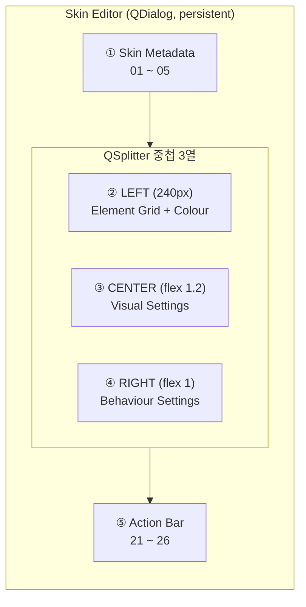
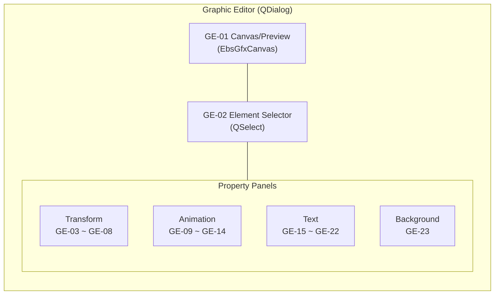
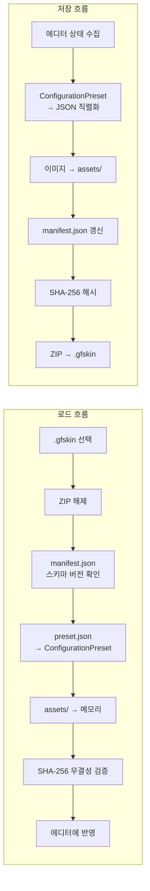
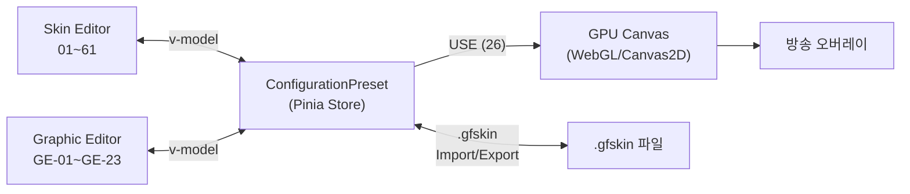

# EBS Skin Editor — 스킨 편집기 UI 설계 v2

> **SSOT**: 이 문서는 EBS Skin Editor UI 설계의 유일한 정본입니다(v2). v1의 기능 명세(01~61, GE-01~GE-23)를 완전히 유지하면서, PRD-0007 벤치마크 분석 → PRD-0007-S1 솔루션 → PRD-0007-S2 전략 → Layout Anatomy → Design Plan의 개선 사항을 통합합니다.
>
> **관계**: 본 문서는 [EBS-UI-Design-v3](../../ebs/docs/00-prd/EBS-UI-Design-v3.prd.md)의 Skin Editor 서브 설계 문서이며, [v1](archive/EBS-Skin-Editor.prd.md)을 대체합니다.

## 1장. 문서 개요

> **TODO**: EBS-UI-Design-v3 통합 시 §1로 링크 대체 예정. 현재는 독립 문서로 유지.

### 1.1 이 문서의 목적

PRD-0005가 PokerGFX Skin Editor의 **"무엇이 있는가"**(역공학 분석)를 정의한다면, 본 문서는 EBS Skin Editor의 **"어떻게 만드는가"**(Quasar UI 설계)를 정의한다.

| 문서 | 역할 | 범위 |
|------|------|------|
| **PRD-0005** | 역공학 분석 (AS-IS) | PokerGFX WinForms 94개 컨트롤, skin_type 187 필드, 오버레이 Impact Map |
| **본 문서 (v2)** | UI 설계 (TO-BE) | EBS Quasar Framework 컴포넌트, S-##/GE-## element ID, 데이터 흐름, 디자인 시스템, 레이아웃 아키텍처 |
| **EBS-UI-Design-v3** | 앱 전체 레이아웃 | 4탭 + Settings 구조, M-##/O-## element ID |

### 1.2 설계 원칙

1. **PokerGFX 기능 완전 계승**: 37개 Skin Editor 컨트롤 + Graphic Editor 전체 기능을 누락 없이 이전
2. **Quasar 네이티브 UX**: WinForms 모달 패턴 → QDialog persistent + responsive 레이아웃
3. **중복 배제**: skin_type 매핑, Impact Map은 PRD-0005 교차 참조로 처리

#### 5대 설계 원칙 (PRD-0007-S2)

| # | 원칙 | 설명 |
|:-:|------|------|
| 1 | **WYSIWYG-First** | Canvas 프리뷰가 편집의 중심. 모든 변경은 즉시 시각적 피드백 |
| 2 | **Progressive Disclosure** | T1(항상)/T2(1클릭)/T3(Advanced) 3단계로 정보 노출 제어 |
| 3 | **Spatial Consistency** | SE↔GE 간 동일 속성은 동일 위치. 학습 비용 최소화 |
| 4 | **Density Balance** | 열 간 정보 밀도 편차 ≤20%. 빈 공간 zero tolerance |
| 5 | **PokerGFX Parity** | 187필드 완전 매핑. 기능 누락 zero |

### 1.3 Scoping Decisions — EBS 범위 외 요소

Whitepaper는 15개 오버레이 요소를 문서화한다. EBS는 이 중 5개를 **의도적으로 제외**한다. v2.2.0에서 운영 설정 3개 추가 제외. 반복 질의를 방지하기 위해 제외 사유를 명시한다.

| Whitepaper 요소 | 제외 사유 | 대체 |
|----------------|----------|------|
| **PIP** (Picture-in-Picture) | 전용 하드웨어 비디오 스위처 영역. 소프트웨어 오버레이와 무관 | 해당 없음 |
| **Commentary Header** | 해설자 오디오 라우팅/자막 전용. 오버레이 스킨과 무관 | 해당 없음 |
| **Split Screen Divider** | 멀티뷰 레이아웃 전용. EBS v1은 단일 테이블 뷰만 지원 | 향후 멀티테이블 지원 시 재검토 |
| **Cards** (독립 렌더) | Whitepaper의 독립 Cards 오버레이는 EBS에서 11~13(카드 PIP 관리)으로 대체 | 11~13 |
| **Countdown** | Secure Delay 기능 폐지에 따른 비활성 기능 (Whitepaper 54개 비활성 목록) | 해당 없음 |
| **Ticker** | EBS 스코프에서 제외 확정. 별도 자막 시스템으로 대체 예정 | 향후 별도 설계 |
| **Panel** (`gfx_type=4`) | GfxPanelType 20종(None, ChipCount, VPiP, PfR, Blinds, Agr, WtSd, Position, CumulativeWin, Payouts, PlayerStat1~10)은 GFX 탭에서 런타임 패널 전환을 제어하는 기능. Skin Editor의 정적 스킨 편집 범위가 아닌 GFX 탭 라이브 운영 영역 | GFX 탭 (EBS-UI-Design-v3) |
| **Action Clock** (v2.2.0) | 운영 설정. 스킨 외형이 아닌 런타임 타이머 제어 | GFX 탭 운영 패널로 이동 예정 |
| **Currency** (v2.2.0) | 운영 설정. 통화 기호/표시는 방송별 설정이며 스킨 고유 속성이 아님 | GFX 탭 운영 패널로 이동 예정 |
| **Auto Blinds/Stats Timing** (v2.2.0) | 운영 타이밍 설정. 스킨 외형과 무관 | GFX 탭 운영 패널로 이동 예정 |

### 1.4 진입 경로

```
EBS Main → GFX 탭 → [Skin Editor 열기] → Skin Editor (QDialog)
                                            └→ [요소 클릭] → Graphic Editor (QDialog)
```

편집 빈도: GFX(방송마다) > Skin Editor(시즌마다) > Graphic Editor(디자인 변경 시). 빈도가 낮을수록 접근이 깊다 (PRD-0005 §1).

### 1.5 v1 → v2 핵심 변경점

| 영역 | v1 | v2 | 변경 사유 |
|------|----|----|----------|
| 레이아웃 | Grid 160px 고정 3열 | QSplitter 중첩 3열 (240px + flex 1.2 + flex 1), Flexbox Stretch | PRD-0007 벤치마크 — 업계 평균 좌측 220-280px, 열 높이 600px 편차 해소 |
| 시각 디자인 | 미정의 | Quasar Brand 8색 + EBS 커스텀 5색, 8px 그리드, Typography 체계 | PRD-0007-S2 §3 디자인 시스템 도입 |
| 정보 아키텍처 | 전 섹션 동일 레벨 | T1/T2/T3 Progressive Disclosure 3단계 | PRD-0007-S2 §4 — Gutenberg Diagram 기반 배치 |
| 공유 컴포넌트 | 없음 (SE/GE 독립) | 8종 공유 컴포넌트 (EbsSectionHeader 외 7종) | PRD-0007-S2 §6 — SE↔GE 일관성 전략 |
| GE 레이아웃 | 단일 패턴 | 적응형 A/B/C 패턴 + CSS Grid 상세 | layout-anatomy §3 — 캔버스 크기별 최적 배치 |
| 검증 | 없음 | 정량 지표 5종 + 사용성 체크리스트 10항 | PRD-0007-S2 §7 — 열 높이 편차 ≤50px 등 |
| 구현 로드맵 | 없음 | Phase 1~4 태스크 분해 | ebs-ui-design-plan.md — 4Phase 실행 계획 |

### 1.6 소스 문서 체계

본 v2 문서가 통합하는 분석/전략 문서:

| 문서 ID | 파일명 | 역할 | 본 문서 반영 영역 |
|---------|--------|------|------------------|
| PRD-0005 | `prd-skin-editor.prd.md` | PokerGFX 역공학 분석 — 7 Parts, skin_type 187 필드 | 전체 Element ID, skin_type 매핑, 오버레이 Impact |
| PRD-0007 | `prd-skin-editor-layout-references.prd.md` | 18개 에디터 벤치마크 분석 | §1.5 변경 사유, §2.1 레이아웃 개선 근거 |
| PRD-0007-S1 | `skin-editor-layout-balance-solutions.md` | 6개 CSS/컴포넌트 솔루션 | §2.1 Flexbox Stretch CSS, QSplitter 중첩 |
| PRD-0007-S2 | `ebs-ui-design-strategy.md` | UI Design 전략 — 5대 원칙, 디자인 토큰 | §1.2 설계 원칙, 시각 디자인 시스템, 검증 전략 |
| — | `ebs-ui-layout-anatomy.md` | 화면별 상세 배치 명세 (L1 전술) | §2.1 열 치수, §3.2 GE 패턴 CSS Grid |
| PLAN-UI-001 | `ebs-ui-design-plan.md` | Quasar 구현 계획 — 공유 컴포넌트, Phase별 로드맵 | 공유 컴포넌트 8종, Phase 1~4 태스크 |

---

## 2장. Skin Editor 메인 레이아웃

### 2.1 전체 구조 (QDialog)

PokerGFX Skin Editor는 897×468 모달 윈도우(PRD-0005 §6). EBS에서는 `QDialog`(persistent, maximizable)로 구현하여 responsive 레이아웃을 지원한다.

v1의 Grid 160px 고정 3열 구조를 **QSplitter 중첩 3열**로 재설계한다. 근본 원인(PRD-0007-S1 §1): Grid에 `align-items: stretch` 없음 → 열 높이 최대 600px 편차, 좌측 160px 협소(업계 평균 220-280px), 우측 Behaviour 전부 접힘 → 빈 공간 극대화.



#### CSS 구조 (PRD-0007-S1 §S1 기반)

```css
.skin-editor-body {
  display: flex;
  align-items: stretch;     /* 모든 열 동일 높이 */
  gap: 16px;
  min-height: 0;            /* 중첩 flex overflow 방지 */
}
.col-left {
  width: 240px;             /* 160→240px 확대 (업계 평균) */
  flex-shrink: 0;
  display: flex;
  flex-direction: column;
  gap: 16px;
}
.col-left .colour-section {
  flex-grow: 1;             /* 남는 높이를 Colour가 흡수 */
  overflow-y: auto;
}
.col-center { flex: 1.2; }
.col-right  { flex: 1; }
```

#### 열 치수 테이블

| 영역 | CSS | 값 | QSplitter limits | 비고 |
|------|-----|----|:----------------:|------|
| 좌측 열 | `width` | 240px | [15%, 35%] | `flex-shrink: 0`, 고정 |
| 중앙 열 | `flex` | 1.2 | [40%, 70%] (내부) | 좌/우 대비 20% 넓음 |
| 우측 열 | `flex` | 1 | [40%, 70%] (내부) | 기준 열 |
| 열 간격 | `gap` | 16px | — | 8px 그리드 단위 (`q-gutter-md`) |
| 컨트롤 내부 | `padding` | 4px | — | 최소 내부 여백 (`q-pa-xs`) |


*Skin Editor QDialog — 3열 레이아웃: Metadata 상단 전폭 + Element Grid/Adjust | Visual Settings | Behavior Settings. [HTML 원본](mockups/ebs-skin-editor.html)*


*영역별 컬러 Bounding Box — ■ Metadata (01~05) ■ Elements (06, 27~30) ■ Settings (07~61) ■ Actions (21~26)*

| 구역 | 위치 | Element ID | Tier | PRD-0005 참조 |
|:----:|------|:----------:|:----:|:---:|
| ① Skin Metadata | 최상단 | 01 ~ 05 | — | §7 |
| ② Element Grid + Adjustments | 좌측 중앙 | 06 | T1/T2/T3 | §8, §12 |
| ③ Settings (중앙: Text/Cards/Player/Flags + Vanity 인라인) | 중앙+우측 | 07~13, 15~19, 57~58 | T1/T2/T3 | §9~§11 |
| ④ Action Bar | 최하단 | 21 ~ 26 | — | §12 |

### 2.2 Skin Metadata (01 ~ 05)

스킨 식별 정보 + 글로벌 옵션. PRD-0005 §7에서 5개 컨트롤 확인.

| Element ID | 이름 | Quasar 컴포넌트 | 설명 | → 오버레이 영향 |
|:----------:|------|-----------------|------|:---:|
| **01** | Name (= Theme Name) | `QInput` | 스킨 이름 (예: "Titanium"). Whitepaper의 "Theme name"과 동일 필드 | 없음 (메타데이터) |
| **02** | Details | `QInput[type=textarea]` | 스킨 설명 | 없음 (메타데이터) |
| **03** | Remove Transparency | `QToggle` | 크로마키 모드 반투명 픽셀 제거 | 전체 (#1~#10) |
| **04** | 4K Design | `QToggle` | Graphic Editor 좌표계 1920×1080 ↔ 3840×2160 전환 | 전체 (#1~#10) |
| **05** | Adjust Size | `QSlider` | 스킨 전체 스케일 팩터 | 전체 (#1~#10) |

> **skin_type 매핑**: 01→`name`, 02→`details`, 03→`remove_partial_alpha`, 04→`video_lines`, 05→`scale_factor` (PRD-0005 §7)

### 2.3 Element Grid (06)

7개 요소 버튼을 4+3 Grid로 배치. 각 버튼 클릭 시 해당 Graphic Editor(§3장)가 QDialog로 열린다. 범위 외 요소(Split Screen Divider, Ticker, Action Clock 등)는 §1.3 Scoping Decisions 참조.

| Element ID | 이름 | 배치 | → Graphic Editor 모드 | → 오버레이 요소 | PRD-0005 참조 |
|:----------:|------|:----:|:---:|:---:|:---:|
| **06** | Element Grid | — | — | — | §8 |
| 06.1 | Board | 1행 1열 | Board 모드 (§3.3) | #5, #8 | §13 |
| 06.2 | Blinds | 1행 2열 | Blinds 모드 | #7 | §14 |
| 06.3 | Outs | 1행 3열 | Outs 모드 | #4 승률 바 (간접) | §15 |
| 06.4 | Strip | 1행 4열 | Strip 모드 | #7, #9, #10 | — |
| 06.5 | Hand History | 2행 1열 | History 모드 | (독립 오버레이 패널) | §16 |
| 06.6 | Leaderboard | 2행 2열 | Leaderboard 모드 | (별도 패널) | §17 |
| 06.7 | Field | 2행 3열 | Field 모드 | #9 | §20 |

Quasar 구현: `QBtn` × 7, `q-btn-group`으로 4+3 Grid 레이아웃. 각 버튼은 `@click`으로 Graphic Editor QDialog를 열며 모드 파라미터를 전달.

### 2.4 Settings 영역

중앙+우측 Settings 영역은 9개 서브섹션(중앙 6 + 우측 3)으로 구성된다. `QExpansionItem`으로 접이식 구현. v2.2.0에서 Currency 삭제, Card Display/Statistics를 우측→중앙 이동.

#### 2.4.1 Text/Font (07 ~ 10)

전역 텍스트 속성. 모든 오버레이 텍스트 요소에 영향. PRD-0005 §9.

| Element ID | 이름 | Quasar 컴포넌트 | 설명 | → 오버레이 영향 |
|:----------:|------|-----------------|------|:---:|
| **07** | All Caps | `QToggle` | 전체 텍스트 대문자 변환 | #1,#3,#4,#7~#9 |
| **08** | Reveal Speed | `QSlider` | 텍스트 등장 타이핑 효과 속도 | #1,#3 |
| **09** | Font 1/2 | `QInput` + `QBtn[...]` | 1차/2차 폰트 패밀리 (Font Picker) | 모든 텍스트 |
| **10** | Language | `QBtn` | 다국어 텍스트 설정 | 텍스트 전환 |

> **skin_type**: 07→`all_caps`, 08→`text_effect_speed`, 09→`font_family_name`/`font_family_name2`, 10→`lang` (PRD-0005 §9)

#### 2.4.2 Cards (11 ~ 13)

카드 PIP 이미지 관리. PRD-0005 §10.

| Element ID | 이름 | Quasar 컴포넌트 | 설명 | → 오버레이 영향 |
|:----------:|------|-----------------|------|:---:|
| **11** | Card Preview | `QImg` × 5 | 4수트 A + 뒷면 미리보기 | — |
| **12** | Card Management | `QBtn` × 3 (Add/Replace/Delete) + `QSelect` | 카드 세트 선택/관리 | #2, #5 |
| **13** | Import Card Back | `QBtn` | 카드 뒷면 이미지 교체 | #2 |

> **skin_type**: 11→`card_image`, 12→`ai_card_image`/`card_image_set_num`, 13→`card_image_xx` (PRD-0005 §10)

#### 2.4.3 Player/Flags (14 ~ 20)

Player Panel 외형 결정. PRD-0005 §11.

| Element ID | 이름 | Quasar 컴포넌트 | 설명 | → 오버레이 영향 |
|:----------:|------|-----------------|------|:---:|
| **14** | Variant | `QSelect` | 게임 타입 (HOLDEM/OMAHA 등) → 카드 장수 | #1, #2 |

| **15** | Player Set | `QSelect` | 게임별 Player 에셋 세트 | #1 |
| **16** | Set Management | `QBtn` × 3 (Edit/New/Delete) | Player Set CRUD. Edit → Graphic Editor §3.3 Player 모드 | #1 |
| **17** | Crop to Circle | `QToggle` | 플레이어 사진 원형 마스크 | #1 |
| **18** | Country Flag Mode | `QToggle` | 국기 독립 표시 모드 (P2) | #1 |
| **19** | Edit Flags | `QBtn` | 국기 이미지 편집 다이얼로그 (P2) | #1 |
| **20** | Hide Flag After | `QInput[type=number]` | N초 후 국기 자동 숨김, 0=숨기지 않음 (P2) | #1 |

> **skin_type**: 14→`skin_layout`, 15→`player` (List), 17→`pic_crop_circle`, 18→`flag_independent_of_photo`, 20→`hide_flag_period` (PRD-0005 §11)

> **ID 범위 참고**: 21~26은 Action Bar (§2.5), 27~30은 Adjust Colours (§2.6)에 배정되어 있다. Settings 영역의 확장 ID는 31부터 시작한다.

#### ~~2.4.4 Chipcount Display (31 ~ 33)~~ — v3.0.0에서 Console 전용 이관

칩 카운트 숫자 표시 정밀도 및 형식. Whitepaper: 8개 독립 precision 필드 × 3단계 + display type.

| Element ID | 이름 | Quasar 컴포넌트 | 설명 | → 오버레이 영향 |
|:----------:|------|-----------------|------|:---:|
| **31** | Chipcount Precision | `QSelect` × 8 | 영역별 숫자 정밀도. 각 드롭다운: full / smart / smart_ext | #1,#7,#8 |
| **32** | Display Type | `QSelect` | 금액 표시 형식: amount / bb_multiple / both | #1,#7,#8 |
| **33** | Text Size | `QSlider` | 글로벌 텍스트 크기 조절 | 전체 텍스트 |

**Precision 영역 매핑**:

| 드롭다운 | skin_type | 영향 위치 |
|----------|-----------|----------|
| Leaderboard | `cp_leaderboard` | Leaderboard 패널 |
| Player Stack | `cp_pl_stack` | #1 Player Panel 스택 |
| Player Action | `cp_pl_action` | #3 Action Badge 금액 |
| Blinds | `cp_blinds` | #7 Bottom Strip 블라인드 |
| Pot | `cp_pot` | #8 팟 카운터 |
| Twitch | `cp_twitch` | Twitch 연동 표시 |
| Strip | `cp_strip` | #7 Strip 금액 |

> **Precision 단계**: `full` = "1,000,000", `smart` = "1M", `smart_ext` = "1.0M"
> **skin_type**: 31→`cp_*`, 32→`chipcount_disp_type`, 33→`text_size`

> **v3.0.0 스코프 변경**: 31~33(Chipcount Display) → Console Display 탭 전용 이관. .gfskin JSON 필드 유지, Skin Editor UI 제거.

#### ~~2.4.5 Currency (34 ~ 37)~~ — v2.2.0에서 삭제

> **삭제 사유**: Currency(34~37)는 운영 설정으로 Skin Editor 범위 밖. 향후 GFX 탭 운영 패널로 이동 예정.
> **skin_type 보존**: `currency_symbol`, `show_currency`, `trailing_currency_symbol`, `divide_amts_by_100` — .gfskin JSON에 필드 유지, UI만 제거.

#### ~~2.4.6 Statistics (38 ~ 43)~~ — v3.0.0에서 Console 전용 이관

통계 표시 토글 구성. Whitepaper: 12+ boolean 필드 중 스킨 외형 관련 6개만 잔존.

| Element ID | 이름 | Quasar 컴포넌트 | 설명 | → 오버레이 영향 |
|:----------:|------|-----------------|------|:---:|
| **38** | Auto Stats | `QToggle` | 통계 자동 표시 마스터 스위치 | #1 Player Panel |
| **39** | Stat Types | `QToggle` × 5 | VPIP / PFR / AGR / WTSD / CumWin 개별 on/off | #1 Player Panel |
| **40** | Show Rank | `QToggle` | 순위 표시 | #1 Player Panel |
| **41** | Show Seat Number | `QToggle` | 좌석 번호 표시 | #1 Player Panel |
| **42** | Show Eliminated | `QToggle` | 탈락 상태 표시 | #1 Player Panel |
| **43** | Show Action-On Text | `QToggle` | 액션 대기 텍스트 표시 | #3 Action Badge |

> **skin_type**: 38→`auto_stats`, 39→`auto_stat_vpip/pfr/agr/wtsd/cumwin`, 40→`show_rank`, 41→`show_seat_num`, 42→`show_eliminated`, 43→`show_action_on_text`
>
> **v2.2.0 삭제**: 62(`auto_stats_time`), 63(`auto_stats_first_hand`), 64(`auto_stats_hand_interval`) — 운영 타이밍 설정. .gfskin JSON 필드 유지, UI 제거.
>
> **예약 필드** (범위 외): `auto_stat_ticker_vpip`, `auto_stat_ticker_pfr` — Ticker 통계용. §1.3 Scoping Decisions에 따라 미구현

> **v3.0.0 스코프 변경**: 38~43(Statistics) → Console Stats 탭 전용 이관. .gfskin JSON 필드 유지, Skin Editor UI 제거.

#### ~~2.4.7 Card Display (44 ~ 49, 65 ~ 67)~~ — v3.0.0에서 Console 전용 이관

카드 공개/숨김 타이밍 설정. 방송 연출의 핵심.

| Element ID | 이름 | Quasar 컴포넌트 | 설명 | → 오버레이 영향 |
|:----------:|------|-----------------|------|:---:|
| **44** | At Showdown | `QSelect` | 쇼다운 시 공개 방식 (4종) | #2 홀카드 |
| **45** | Card Reveal | `QSelect` | 카드 공개 타이밍 (6종) | #2 홀카드 |
| **46** | Fold Hide | `QSelect` | 폴드 시 카드 숨김 방식 (2종) | #2 홀카드 |
| **47** | Fold Hide Period | `QInput[type=number]` | 폴드 후 카드 숨김 지연 (초) | #2 홀카드 |
| **48** | Winning Hand Highlight | `QSelect` | 승리 핸드 강조 방식 (4종) | #2, #5 |
| **49** | Override Card Set | `QToggle` | 스킨의 카드 세트가 GFX 탭 설정을 오버라이드 | #2, #5 |
| **65** | Equity Show Type | `QSelect` | 승률(equity) 표시 시점: start_of_hand=0, after_first_betting_round=1 | #4 승률 바 |
| **66** | Outs Show Type | `QSelect` | Outs 표시 조건: never=0, heads_up=1, heads_up_all_in=2 | #4 승률 바 (간접) |
| **67** | Outs Position | `QSelect` | Outs 표시 위치: right=0, left=1 | #4 승률 바 (간접) |

> **skin_type**: 44→`at_show`, 45→`card_reveal`, 46→`fold_hide`, 47→`fold_hide_period`, 48→`hilite_winning_hand_type`, 49→`override_card_set`, 65→`equity_show_type`, 66→`outs_show_type`, 67→`outs_pos_type`
>
> **추가 옵션** (P2): `rabbit_hunt` (래빗 헌트 카드 표시), `dead_cards` (죽은 카드 표시)

> **v3.0.0 스코프 변경**: 44~49, 65~67(Card Display) → Console GFX 탭 전용 이관. .gfskin JSON 필드 유지, Skin Editor UI 제거.

#### ~~2.4.8 Layout (50 ~ 56)~~ — v3.0.0에서 Console 전용 이관

오버레이 기본 배치(수직/수평, 마진, 보드 위치) 설정.

| Element ID | 이름 | Quasar 컴포넌트 | 설명 | → 오버레이 영향 |
|:----------:|------|-----------------|------|:---:|
| **50** | Board Position | `QSelect` | 보드 위치 (3종: left/centre/right). `board_pos_type` enum 기준 | #5 커뮤니티 카드 |
| **51** | GFX Vertical | `QToggle` | 수직 레이아웃 모드 | 전체 배치 |
| **52** | GFX Bottom Up | `QToggle` | 아래→위 정렬 | 전체 배치 |
| **53** | GFX Fit | `QToggle` | 해상도 맞춤 자동 스케일 | 전체 배치 |
| **54** | Heads-Up Layout | `QSelect` + `QSelect` | 모드 (3종) + 방향 (2종) | 헤드업 시 배치 |
| **55** | X Margin | `QInput[type=number]` | 수평 마진 (px) | 전체 배치 |
| **56** | Y Margin Top/Bottom | `QInput[type=number]` × 2 | 상/하 마진 (px) | 전체 배치 |

> **skin_type**: 50→`board_pos`, 51→`gfx_vertical`, 52→`gfx_bottom_up`, 53→`gfx_fit`, 54→`heads_up_layout_mode`/`heads_up_layout_direction`, 55→`x_margin`, 56→`y_margin_top`/`y_margin_bot`

> **v3.0.0 스코프 변경**: 50~56(Layout) → Console GFX 탭 전용 이관. .gfskin JSON 필드 유지, Skin Editor UI 제거.

#### 2.4.9 Misc (57 ~ 61, 69, 70, 72)

기타 ConfigurationPreset 필드. Whitepaper에 존재하나 주요 카테고리에 속하지 않는 설정. v2.2.0에서 운영 설정(68 Action Clock Count, 71 Auto Blinds Type) 제거.

| Element ID | 이름 | Quasar 컴포넌트 | 설명 | → 오버레이 영향 |
|:----------:|------|-----------------|------|:---:|
| **57** | Vanity Text | `QInput` | 커스텀 표시 텍스트 | #7 Bottom Strip |
| **58** | Game Name in Vanity | `QToggle` | Vanity Text에 게임명 포함 | #7 Bottom Strip |
| **59** | Leaderboard Position | `QSelect` | 리더보드 위치 (9종 enum) | Leaderboard 패널 |
| **60** | Strip Display Type | `QSelect` | off / stack / cumwin | #7 Strip |
| **61** | Order Players Type | `QSelect` | 플레이어 정렬 기준 | #1 Player Panel |
| **69** | Heads-Up Custom Y Position | `QInput[type=number]` | 헤드업 레이아웃 커스텀 Y 좌표 (px). `heads_up_layout_mode`(54)가 활성일 때 사용 | 헤드업 배치 |
| **70** | Order Strip Type | `QSelect` | Strip 정렬 기준: seating=0, count=1 | #7 Strip |
| **72** | Nit Display | `QSelect` | Nit(타이트 플레이어) 표시 모드: at_risk=0, safe=1 | #1 Player Panel |

> **skin_type**: 57→`vanity_text`, 58→`game_name_in_vanity`, 59→`leaderboard_pos_enum`, 60→`strip_display_type`, 61→`order_players_type`, 69→`heads_up_custom_ypos`, 70→`order_strip_type`, 72→`nit_display`
>
> **v3.0.0 스코프 변경**: 59(LB Position), 60(Strip Display), 61(Order Players) → Console 전용 이관. Skin Editor UI에서 제거.
>
> **v3.0.0 스코프 변경**: 69(HU Custom Y) → Console 전용 이관 (Layout 관련). 70(Order Strip) → Console 전용 이관.
>
> **v2.2.0 삭제**: 68(`action_clock_count`) — Action Clock 제거에 따른 삭제. 71(`auto_blinds_type`) — 운영 설정. .gfskin JSON 필드 유지, UI 제거.
>
> **추가 필드** (구현 시 매핑): `media_path`, `indent_action`

### 2.5 Action Bar (21 ~ 26)

최하단 액션 버튼 행. PRD-0005 §12.

| Element ID | 이름 | Quasar 컴포넌트 | 설명 | → 오버레이 영향 |
|:----------:|------|-----------------|------|:---:|
| **21** | IMPORT | `QBtn` | .gfskin 파일 선택 → 에디터에 로드 | 전체 (새 스킨 로드) |
| **22** | EXPORT | `QBtn` | 현재 상태 → .gfskin 저장 | — |
| **23** | DOWNLOAD | `QBtn` | 온라인 스킨 마켓플레이스 (P2) | — |
| **24** | RESET | `QBtn` | 내장 기본 스킨 복원 | 전체 (초기화) |
| **25** | DISCARD | `QBtn` | 마지막 저장 상태 복원 | 전체 (복원) |
| **26** | USE | `QBtn[color=primary]` | ConfigurationPreset → GPU Canvas 즉시 반영 | 전체 (적용) |

**EBS 추가**: EXPORT FOLDER 버튼 — .gfskin을 폴더 구조(ZIP 해제 상태)로 내보내기. 커뮤니티 스킨 수정 편의성 제공 (P2, SE-F16).

### ~~2.6 Adjust Colours (27 ~ 30)~~ — v3.0.0에서 GE 서브 editor로 이관

Element Grid 하단 Adjustments 영역. 인라인 `QExpansionItem` × 2로 접근 (Colour Adjustment + Colour Replacement). PRD-0005 §12, §21.4.

| Element ID | 이름 | Quasar 컴포넌트 | 설명 | → 오버레이 영향 |
|:----------:|------|-----------------|------|:---:|
| **27** | Colour Adjustment (헤더) | `QExpansionItem` | Hue/Tint 접이식 패널 진입점 (기본 펼침) | — |
| **28** | Hue | `QSlider` | 색상 시프트 | 전체 (#1~#10) |
| **29** | Tint R/G/B | `QSlider` × 3 | RGB 틴트 강도 | 전체 (#1~#10) |
| **30** | Color Replace | `QCard` × 3 (규칙 리스트) | 3개 독립 색상 교체 규칙 (아래 상세) | 전체 (#1~#10) |

**Color Replace 상세** (30): 3개 독립 규칙(cr1/cr2/cr3), 각각:

| 필드 | Quasar 컴포넌트 | 설명 | skin_type |
|------|-----------------|------|-----------|
| Enable | `QToggle` | 규칙 활성화 | `cr{N}_enabled` |
| Source Color | `QColor` + `QPopupProxy` | 교체 대상 색상 | `cr{N}_source` |
| Dest Color | `QColor` + `QPopupProxy` | 교체 결과 색상 | `cr{N}_dest` |
| Threshold | `QSlider` (0~255) | 색상 유사도 허용 범위 | `cr{N}_threshold` |

> **skin_type**: 28→`adjust_hue`, 29→`adjust_tint_r/g/b`, 30→`cr1_*/cr2_*/cr3_*` (PRD-0005 §12)

> **v3.0.0 스코프 변경**: 27~30(Colour Tools) → GE 서브 editor(Adjust Colours 모달)로 이관. 원본 PokerGFX 모달 패턴 복원. .gfskin JSON 필드 유지, Skin Editor 메인 UI 제거.

---

## 3장. Graphic Editor

### 3.1 통합 설계 결정

PokerGFX는 Board Graphic Editor(`gfx_edit.cs`)와 Player Graphic Editor(`gfx_edit_player.cs`)를 별도 클래스로 구현한다 (PRD-0005 부록 B: Board 39 + Player 48 컨트롤). EBS에서는 **단일 Graphic Editor QDialog + 모드 전환**으로 통합한다.

| 결정 | PokerGFX (AS-IS) | EBS (TO-BE) | 사유 |
|------|-------------------|-------------|------|
| 에디터 수 | Board GE + Player GE 별도 | 단일 GE + 모드 파라미터 | 코드 중복 제거 (공통 패널 87% 동일) |
| 진입 방식 | 06 버튼 → 별도 모달 | 06 버튼 → QDialog(mode=Board\|Player\|...) | 일관된 UX |
| ~~Ticker~~ | ~~Graphic Editor 아님, 별도 모달~~ | **EBS 범위 외** (§1.3 Scoping Decisions) | — |

### 3.2 공통 패널 구조

모든 Graphic Editor 모드에 공통으로 나타나는 패널. PRD-0005 §21.




*Graphic Editor QDialog — Canvas + Property Panels (GE-01~GE-23, sub-ID GE-08a~GE-08d 포함 총 27개). [HTML 원본](mockups/ebs-graphic-editor.html)*

#### 적응형 레이아웃 패턴 (A/B/C)

캔버스 크기와 서브요소 수에 따라 3종 레이아웃 패턴을 적용한다.

| 패턴 | 구조 | 적용 모드 | 캔버스 | 서브요소 |
|:----:|------|----------|:------:|:--------:|
| **A** | Left(Element List) \| Center(Canvas) \| Right(Properties) | Board, Field, Strip | ≤300px | 3~14 |
| **B** | Canvas Top 전폭 + 2×2 Grid (Transform\|Text / Animation\|Background) | Blinds, History | 극단적 가로 띠 | 3~4 |
| **C** | Canvas Top 전폭 + 3열 하단 (Transform \| Animation \| Text+Background) | Player, Outs, Leaderboard | 465px+ | 3~9 |

**패턴 선택 기준**: 캔버스 폭 ≤300px → A, 종횡비 >10:1 또는 서브요소 ≤4개 → B, 그 외 → C.

#### CSS Grid 상세 (layout-anatomy §3.1 기반)

```
패턴 A (3열)              패턴 B (전폭+2×2)        패턴 C (전폭+3열)
┌────┬───────┬─────┐     ┌──────────────────┐     ┌──────────────────┐
│List│Canvas │Props│     │  Canvas (전폭)   │     │  Canvas (전폭)   │
│    │296×197│     │     │   790×52         │     │   465×120        │
│120 │       │ 280 │     ├────────┬─────────┤     ├──────┬─────┬─────┤
│ px │       │  px │     │Transform│Animat. │     │Trans.│Anim.│Text │
│    │       │     │     ├────────┼─────────┤     │      │     │     │
│    │       │     │     │Text    │Backgnd. │     │      │     │     │
└────┴───────┴─────┘     └────────┴─────────┘     └──────┴─────┴─────┘
```

**패턴 A**: QSplitter (ElementList 120px | Canvas flex:1 | Props 280px)

```css
/* 패턴 A — 3열 QSplitter */
.ge-pattern-a .element-list { width: 120px; flex-shrink: 0; overflow-y: auto; }
.ge-pattern-a .canvas-area  { flex: 1; }
.ge-pattern-a .props-panel  { width: 280px; flex-shrink: 0; overflow-y: auto; }
```

**패턴 B**: Canvas 전폭 + `.grid-2x2 { grid-template-columns: 1.15fr 1fr }`

```css
/* 패턴 B — Canvas 전폭 + 2×2 Grid */
.ge-pattern-b .canvas-area { width: 100%; }
.ge-pattern-b .grid-2x2 {
  display: grid;
  grid-template-columns: 1.15fr 1fr;
  gap: 16px;
}
```

**패턴 C**: Canvas 전폭 + `.three-col { grid-template-columns: 1.2fr 1fr 1.3fr }`

```css
/* 패턴 C — Canvas 전폭 + 3열 Grid */
.ge-pattern-c .canvas-area { width: 100%; }
.ge-pattern-c .three-col {
  display: grid;
  grid-template-columns: 1.2fr 1fr 1.3fr;
  gap: 16px;
}
```

#### 모드별 치수 요약 테이블

| 모드 | 패턴 | Canvas (px) | 서브요소 | ElementList | Props 열 | CSS Grid |
|------|:----:|:-----------:|:--------:|:-----------:|:--------:|----------|
| Board | A | 296×197 | 14 | 120px 고정 | 280px 고정 | — |
| Field | A | 270×90 | 3 | 120px 고정 | 280px 고정 | — |
| Strip | A | 270×90 | 6 | 120px 고정 | 280px 고정 | — |
| Blinds | B | 790×52 | 4 | — | — | `1.15fr 1fr` (2×2) |
| History | B | 345×33 | 3 | — | — | `1.15fr 1fr` (2×2) |
| Player | C | 465×120 | 9 | — | — | `1.2fr 1fr 1.3fr` (3열) |
| Outs | C | 465×84 | 3 | — | — | `1.2fr 1fr 1.3fr` (3열) |
| Leaderboard | C | 800×103 | 9 | — | — | `1.2fr 1fr 1.3fr` (3열) |

각 모드별 목업:
- 패턴 A: [Board](mockups/ebs-ge-board.html) | [Field](mockups/ebs-ge-field.html) | [Strip](mockups/ebs-ge-strip.html)
- 패턴 B: [Blinds](mockups/ebs-ge-blinds.html) | [History](mockups/ebs-ge-history.html)
- 패턴 C: [Player](mockups/ebs-ge-player.html) | [Outs](mockups/ebs-ge-outs.html) | [Leaderboard](mockups/ebs-ge-leaderboard.html)

#### Canvas/Preview (GE-01)

| Element ID | 이름 | Quasar 컴포넌트 | 설명 |
|:----------:|------|-----------------|------|
| **GE-01** | WYSIWYG Canvas | `EbsGfxCanvas` (커스텀, §4.2.1) | 요소 프리뷰 + 마우스 드래그. 캔버스 크기는 모드별 상이 (Board 296×197, Blinds 790×52 등). 선택된 서브요소는 노란 점선 하이라이트 |

#### Element Selector (GE-02)

| Element ID | 이름 | Quasar 컴포넌트 | 설명 |
|:----------:|------|-----------------|------|
| **GE-02** | Element Dropdown | `QSelect` | 모드별 서브요소 선택. Board=14개, Player=N+7개 등 (PRD-0005 §8 서브요소 목록). Player 공식: N(카드) + 5(Name/Action/Stack/Odds/Position) + 2(Photo/Flag) = N+7 |

#### Transform (GE-03 ~ GE-08)

| Element ID | 이름 | Quasar 컴포넌트 | 설명 | → 오버레이 변화 |
|:----------:|------|-----------------|------|:---:|
| **GE-03** | Left | `QInput[type=number]` | 수평 위치 (px) | 요소 X 좌표 |
| **GE-04** | Top | `QInput[type=number]` | 수직 위치 (px) | 요소 Y 좌표 |
| **GE-05** | Width | `QInput[type=number]` | 너비 (px) | 요소 너비 |
| **GE-06** | Height | `QInput[type=number]` | 높이 (px) | 요소 높이 |
| **GE-07** | Z-order | `QInput[type=number]` | 레이어 순서 (-99~99) | 겹침 순서 |
| **GE-08** | Angle | `QInput[type=number]` | 회전 (-360°~360°) | 요소 회전 |

추가 Transform 컨트롤 (서브ID — GE-08의 하위 속성):

| Element ID | 이름 | Quasar 컴포넌트 | 설명 | skin_type |
|:----------:|------|-----------------|------|-----------|
| GE-08a | Anchor H | `QSelect` (Left/Center/Right) | 해상도 변경 시 수평 기준점. 4K↔1080p 전환 시 요소 위치 보정 기준 | per-element `anchor_x` |
| GE-08b | Anchor V | `QSelect` (Top/Center/Bottom) | 해상도 변경 시 수직 기준점 | per-element `anchor_y` |
| GE-08c | Margins X/Y | `QInput[type=number]` × 2 | 요소 내부 여백 (per-text `margins`/`margins_h`와 동일) | per-element `margins`, `margins_h` |
| GE-08d | Corner Radius | `QInput[type=number]` | 배경 라운드 모서리 (per-text `background_corner_radius`와 동일) | per-element `background_corner_radius` |

> **좌표계**: Design Resolution 기준 (04에 따라 1920×1080 또는 3840×2160). 출력 해상도가 다르면 자동 스케일링 (PRD-0005 §27).

#### Animation (GE-09 ~ GE-14)

| Element ID | 이름 | Quasar 컴포넌트 | 설명 | → 오버레이 변화 |
|:----------:|------|-----------------|------|:---:|
| **GE-09** | Transition In | `QSelect` | `skin_transition_type` 5종: Global(=스킨 전역 설정 사용), Fade, Slide, Pop, Expand. 요소별 설정 | 등장 효과 |
| **GE-10** | Transition Out | `QSelect` | `skin_transition_type` 5종 (동일). Global 선택 시 `trans_in`/`trans_out`(`transition_type` 4종)의 전역 값 적용 | 퇴장 효과 |
| **GE-11** | AnimIn File | `QBtn` (Import) | 커스텀 등장 애니메이션 파일 | 등장 연출 |
| **GE-12** | AnimIn Speed | `QSlider` | 등장 속도 (ms) | 전환 지속 시간 |
| **GE-13** | AnimOut File | `QBtn` (Import) | 커스텀 퇴장 애니메이션 파일 | 퇴장 연출 |
| **GE-14** | AnimOut Speed | `QSlider` | 퇴장 속도 (ms) | 전환 지속 시간 |

> **Transition 타입 enum**: 두 종류의 transition enum이 존재한다.
> - `transition_type` (요소별): `fade=0, slide=1, pop=2, expand=3` — 4값
> - `skin_transition_type` (스킨 레벨): `global=0, fade=1, slide=2, pop=3, expand=4` — 5값. 값 0("Global")은 전역 설정을 사용한다는 의미 (PRD-0005 §24)

#### Text (GE-15 ~ GE-22)

텍스트를 포함하는 서브요소 선택 시 활성화. PRD-0005 §21.3.

| Element ID | 이름 | Quasar 컴포넌트 | 설명 | → 오버레이 변화 |
|:----------:|------|-----------------|------|:---:|
| **GE-15** | Text Visible | `QToggle` | 텍스트 렌더링 on/off | 텍스트 표시 |
| **GE-16** | Font Select | `QSelect` (Font 1/Font 2) | 폰트 패밀리 선택 | 텍스트 폰트 |
| **GE-17** | Text Colour | `QColor` + `QPopupProxy` | 텍스트 색상 | 텍스트 색상 |
| **GE-18** | Hilite Colour | `QColor` + `QPopupProxy` | 강조 상태 색상 | 강조 색상 |
| **GE-19** | Alignment | `QSelect` (Left/Center/Right) | 텍스트 정렬 | 정렬 |
| **GE-20** | Drop Shadow | `QToggle` + `QSelect` (9방향) | 그림자 효과 + 방향 | 텍스트 그림자 |
| **GE-21** | Shadow Colour | `QColor` + `QPopupProxy` | 그림자 색상 | 그림자 색상 |
| **GE-22** | Triggered by Language | `QToggle` | 다국어 전환 시 갱신 여부 | 텍스트 전환 |

> **Drop Shadow 방향 enum**: `none=0, north=1, north_east=2, east=3, south_east=4(기본), south=5, south_west=6, west=7, north_west=8` (PRD-0005 §24)
>
> **font_type 추가 필드** (구현 시 매핑 필요): 위 GE-15~GE-22에 추가로 per-text `z_pos`, `background_bm` (개별 배경 이미지), `margins`, `margins_h`, `background_corner_radius`, `font_set`, `rendered_size` 필드가 존재한다. 이 필드들은 Transform(GE-03~GE-08) 또는 Background(GE-23)와 중복 가능하므로 구현 시 통합 여부를 결정한다.

#### Background (GE-23)

| Element ID | 이름 | Quasar 컴포넌트 | 설명 |
|:----------:|------|-----------------|------|
| **GE-23** | Background Image | `QImg` + `QBtn` (Import/Delete) | 요소별 배경 이미지. Import Mode 드롭다운으로 모드별 이미지 교체 (Board: Auto/AT Flop/AT Draw, Leaderboard: Header/Repeat/Footer 등) |

### 3.3 모드별 상세

각 모드는 §3.2 공통 패널을 공유하되, Element 드롭다운 서브요소와 Import Mode가 다르다. 상세는 PRD-0005 §13~§20을 정본으로 참조한다.

| 모드 | 캔버스 크기 | Element 서브요소 수 | Import Mode | PRD-0005 | 목업 |
|------|:----------:|:---:|------|:---:|:---:|
| **Board** | 296 × 197 | 14 (Card 1~5, Sponsor Logo, PokerGFX.io, 100,000, Pot, Blinds, 50,000/100,000, Hand, 123, Game Variant) | Auto / AT (Flop) / AT (Draw/Stud) — 3종 | §13 | [HTML](mockups/ebs-ge-board.html) |
| **Player** | 270×90 (compact) / 465×84 (vertical) / 465×120 (horizontal+photo) | N+7 (Card 1~N, Name, Action, Stack, Odds, Position, Photo, Flag). Holdem: 9, Omaha: 11 | AT Mode / AT with photo 등 | §19 | [HTML](mockups/ebs-ge-player.html) |
| **Blinds** | 790 × 52 | 4 (Blinds, 50,000/100,000, Hand, 123) | Blinds with Hand # | §14 | [HTML](mockups/ebs-ge-blinds.html) |
| **Outs** | 465 × 84 | 3 (Card 1, Name, # Outs) | — | §15 | [HTML](mockups/ebs-ge-outs.html) |
| **Field** | 270 × 90 | 3 (Total, Remain, Field) | — | §20 | [HTML](mockups/ebs-ge-field.html) |
| **Leaderboard** | 800 × 103 | 9 (Player Photo, Player Flag, Sponsor Logo, Title, Left, Centre, Right, Footer, Event Name) | Header / Repeating / Footer — 3종 | §17 | [HTML](mockups/ebs-ge-leaderboard.html) |
| **Hand History** | 345 × 33 | 3 (Pre-Flop, Name, Action) | Header / Repeating header / Repeating detail / Footer — 4종 | §16 | [HTML](mockups/ebs-ge-history.html) |
| **Strip** | 270 × 90 | 6 (Name, Count, Position, VPIP, PFR, Logo) | Strip | §20 | [HTML](mockups/ebs-ge-strip.html) |

#### 모드별 캔버스 레이아웃

각 모드의 캔버스 내 서브요소 배치를 시각화한 와이어프레임 목업:


*Board — 14개 서브요소: Card 1~5 (상단), Sponsor Logo/PokerGFX.io (중단), Pot/Blinds (하단). [HTML 원본](mockups/ebs-ge-board.html)*


*Board Annotated — EID/Zone 매핑. Transform GE-03~GE-08e, Text GE-15~GE-22, Animation GE-09~GE-14, Background GE-23.*


*Player — 서브요소: Photo/Card 1~N/Name/Flag (상단), Action/Stack/Odds/Position (하단). [HTML 원본](mockups/ebs-ge-player.html)*

> **Player 캔버스 크기 — `skin_layout_type` 매핑**:
> | `skin_layout_type` | 캔버스 크기 | 설명 |
> |:---|:---:|:---|
> | `compact` | 270×90 | 사진 없음, 최소 정보 |
> | `vertical_only` | 465×84 | 수직 레이아웃, 사진 없음 |
> | `horizontal_with_photo` | 465×120 | 수평 레이아웃, 사진 포함 (기본) |


*Blinds — 4개 서브요소: Blinds/50,000/100,000/Hand/123 가로 배열. [HTML 원본](mockups/ebs-ge-blinds.html)*


*Outs — 3개 서브요소: Card 1/Name/# Outs. [HTML 원본](mockups/ebs-ge-outs.html)*


*Field — 3개 서브요소: Field (상단 바), Remain/Total (하단). [HTML 원본](mockups/ebs-ge-field.html)*


*Leaderboard — 9개 서브요소: Photo/Flag/Title/Left/Centre/Right/Logo (상단), Event Name/Footer (하단). [HTML 원본](mockups/ebs-ge-leaderboard.html)*


*Hand History — 3개 서브요소: Pre-Flop/Name/Action (가로 배열). [HTML 원본](mockups/ebs-ge-history.html)*


*Strip — 6개 서브요소: Name/Count/Pos/VPIP/PFR/Logo (가로 배열). [HTML 원본](mockups/ebs-ge-strip.html)*

---

## 4장. Quasar Component 매핑

### 4.1 WinForms → Quasar 매핑 테이블

PokerGFX Skin Editor의 WinForms 컨트롤을 Quasar Framework 컴포넌트로 1:1 매핑한다. PRD-0005 §6~§21에서 식별된 모든 컨트롤 타입을 커버한다.

| WinForms 컨트롤 | Quasar 컴포넌트 | 사용처 | 비고 |
|-----------------|-----------------|--------|------|
| TextBox | `QInput` | 01 Name, 02 Details, 09 Font | `type="text"`, Details는 `type="textarea"` |
| CheckBox | `QToggle` | 03, 04, 07, 17, 18, GE-09 | `v-model` boolean 바인딩 |
| ComboBox | `QSelect` | 14 Variant, 15 Player Set, GE-02, GE-16 | `emit-value`, `map-options` |
| TrackBar | `QSlider` | 05, 08, GE-12, GE-14 | `min`/`max`/`step`, `label-always` |
| NumericUpDown | `QInput[type=number]` | GE-03~GE-08, 20 | `type="number"`, `min`/`max`/`step` |
| ColorPicker | `QColor` + `QPopupProxy` | GE-17, GE-18, GE-20, GE-21, 28~30 | 팝업 방식 색상 선택 |
| Button | `QBtn` | 21~26, 06, 12, 16, 19 | `@click` 이벤트 |
| PictureBox | `QImg` / `<canvas>` | 11 Card Preview, GE-01 Canvas | 미리보기 영역 |
| Label | `QField` label / `<span>` | 캔버스 크기 표시, 섹션 라벨 | 정적 텍스트 |
| GroupBox | `QCard` + `QExpansionItem` | Elements, Adjustments, Cards, Player, Flags | 섹션 그룹핑 |
| Panel (모달) | `QDialog` | Skin Editor 전체, Graphic Editor | `persistent`, `maximized` 옵션 |
| OpenFileDialog | `QFile` + native picker | 21 Import, GE-23 Background, 13 Card Back | `.gfskin`, `.png` 필터 |

### 4.2 커스텀 컴포넌트

표준 Quasar 컴포넌트로 대체할 수 없는 2개 영역은 커스텀 구현이 필요하다.

#### 4.2.1 WYSIWYG Canvas (`EbsGfxCanvas`)

Graphic Editor의 핵심 프리뷰 영역. PokerGFX `gfx_edit.cs`의 Canvas + 마우스 드래그 기능을 재현한다.

| 속성 | 설명 | PRD-0005 참조 |
|------|------|:---:|
| 기술 | HTML5 `<canvas>` + Canvas 2D API | §13~§20 WYSIWYG |
| 기능 | 서브요소 렌더링, 선택(노란 점선), 드래그 이동/리사이즈 | GE-F02 |
| 입력 | `ConfigurationPreset` 현재 요소 데이터 | §21.1 Transform |
| 출력 | 드래그 결과 → L/T/W/H 값 양방향 바인딩 | GE-F03 |
| 해상도 | Design Resolution 기준 좌표계 (1920×1080 또는 3840×2160) | §27 |

#### 4.2.2 Color Adjustment Dialog (`EbsColorAdjust`)

Hue/Tint 일괄 색상 조정 다이얼로그. PRD-0005 §12, §21.4 Adjust Colours 기능을 재현한다.

| 속성 | 설명 | PRD-0005 참조 |
|------|------|:---:|
| 기술 | `QDialog` + `QSlider` × 4 | §12 Adjust Colours |
| 컨트롤 | Hue, Tint R, Tint G, Tint B 슬라이더 | 28~30 |
| 적용 | 전체 오버레이 요소(#1~#10) 일괄 색상 변환 | §5.1 Impact Map |
| skin_type | `adjust_hue`, `adjust_tint_r/g/b` (float × 4) | §12 |

### 4.3 공유 컴포넌트 8종

SE↔GE 간 일관성을 보장하는 공유 에디터 컴포넌트. PRD-0007-S2 §6 일관성 전략, ebs-ui-design-plan.md §4 기반.

#### EbsSectionHeader

접이식 섹션 헤더. SE/GE 모든 섹션의 일관된 접이식 패턴.

```typescript
interface EbsSectionHeaderProps {
  label: string;
  tier: 1 | 2 | 3;        // T1=항상 펼침, T2=1클릭, T3=Advanced
  group?: string;          // QExpansionItem group
}
```

Quasar 의존성: `QExpansionItem`, `QCard`, `QCardSection`

#### EbsPropertyRow

라벨+컨트롤 행. 교차 배경색 자동 적용 (Unity Inspector 패턴).

```typescript
interface EbsPropertyRowProps {
  label: string;
}
```

Quasar 의존성: 없음 (CSS 유틸리티만 사용)

#### EbsColorPicker

색상 선택기. `QColor` + `QPopupProxy` 래퍼.

```typescript
interface EbsColorPickerProps {
  modelValue: string;      // hex color (#RRGGBB)
  label?: string;
}
```

Quasar 의존성: `QColor`, `QPopupProxy`, `QBtn`

#### EbsNumberInput

숫자 입력 필드. min/max/step 범위 제한 + suffix 표시.

```typescript
interface EbsNumberInputProps {
  modelValue: number;
  min?: number;
  max?: number;
  step?: number;
  suffix?: string;         // "px", "°", "ms"
}
```

Quasar 의존성: `QInput`

#### EbsSlider

슬라이더. label-always 기본 활성화.

```typescript
interface EbsSliderProps {
  modelValue: number;
  min: number;
  max: number;
  step?: number;
  labelAlways?: boolean;   // 기본 true
}
```

Quasar 의존성: `QSlider`

#### EbsToggle

토글 스위치. 라벨 정렬 보장.

```typescript
interface EbsToggleProps {
  modelValue: boolean;
  label: string;
}
```

Quasar 의존성: `QToggle`

#### EbsSelect

드롭다운 선택. emit-value + map-options 기본 패턴.

```typescript
interface EbsSelectProps {
  modelValue: string | number;
  options: Array<{ label: string; value: string | number }>;
  emitValue?: boolean;     // 기본 true
  mapOptions?: boolean;    // 기본 true
}
```

Quasar 의존성: `QSelect`

#### EbsActionBar

하단 액션 버튼 행. SE(6버튼)/GE(Apply/Reset) 공통 패턴.

```typescript
interface ActionButton {
  label: string;
  color?: string;
  flat?: boolean;
  outlined?: boolean;
  onClick: () => void;
}

interface EbsActionBarProps {
  buttons: ActionButton[];
}
```

Quasar 의존성: `QBtn`, `QSeparator`

#### GfxEditorBase.vue

GE 공통 레이아웃 컨테이너. `mode` prop으로 A/B/C 패턴을 분기한다.

```typescript
interface GfxEditorBaseProps {
  mode: 'board' | 'player' | 'blinds' | 'outs' | 'strip'
    | 'history' | 'leaderboard' | 'field';
  pattern: 'A' | 'B' | 'C';
}
```

패턴 분기 로직:
- `pattern === 'A'`: 3열 QSplitter (ElementList 120px | Canvas flex:1 | Props 280px)
- `pattern === 'B'`: Canvas 전폭 + 2×2 Grid (`grid-template-columns: 1.15fr 1fr`)
- `pattern === 'C'`: Canvas 전폭 + 3열 Grid (`grid-template-columns: 1.2fr 1fr 1.3fr`)

Quasar 의존성: `QSplitter`, `QCard`

---

## 5장. 데이터 흐름

### 5.1 .gfskin 로드/저장

EBS는 PokerGFX `.skn`(AES+BinaryFormatter)에서 `.gfskin`(ZIP+JSON) 개방형 포맷으로 전환한다. 상세 파일 구조와 로드/저장 흐름은 PRD-0005 §22~§25를 정본으로 참조한다.



| 비교 항목 | PokerGFX .skn | EBS .gfskin |
|-----------|:---:|:---:|
| 컨테이너 | 단일 바이너리 | ZIP 아카이브 |
| 직렬화 | BinaryFormatter | JSON |
| 암호화 | AES 강제 | 선택적 (상용만) |
| 이미지 | byte[] 인라인 | assets/ 개별 PNG |
| 호환성 | 버전 종속 | 스키마 버전 + 마이그레이션 |

> **하위 호환**: PokerGFX `.skn` 읽기 전용 임포트 지원 (AES 복호화 → BinaryFormatter 역직렬화 → preset.json 변환). PRD-0005 §25.3.
>
> **무결성 검증 이중 경로**:
> - `.gfskin` (신규): SHA-256 해시 — `manifest.json`에 기록, 로드 시 검증
> - `.skn` (임포트): CRC32 (`skin_crc` 필드) — 원본 무결성 검증 후 변환 진행. CRC32 불일치 시 손상 경고 + 사용자 확인 요구

### 5.2 Editor State ↔ ConfigurationPreset

Skin Editor/Graphic Editor의 모든 UI 값은 `ConfigurationPreset` DTO(187+ 필드)와 양방향 바인딩된다.



| 계층 | 기술 | 역할 |
|------|------|------|
| UI Layer | Quasar Components (S-##, GE-##) | 사용자 입력 수집 |
| State Layer | Pinia Store (`useSkinStore`) | ConfigurationPreset 반응형 관리 |
| Persistence Layer | .gfskin (ZIP+JSON) | 파일 I/O |
| Render Layer | Canvas 2D / WebGL | 오버레이 프리뷰 + 방송 출력 |

skin_type 187개 필드의 카테고리별 분류와 전체 매핑은 PRD-0005 §23, 부록 C를 참조한다.

---

## 6장. 요구사항 교차 참조

### 6.1 PRD-0005 → EBS 매핑

PRD-0005 §28~§30의 기능 요구사항을 본 문서의 Element ID와 교차 매핑한다.

#### Skin Editor 기능 요구사항 (SE-F01 ~ SE-F16)

| PRD-0005 ID | 요구사항 | EBS Element ID | 본 문서 섹션 | 우선순위 |
|:---:|----------|:---:|:---:|:---:|
| SE-F01 | 스킨 로드 (.gfskin Import) | 21 | §2.5 | P1 |
| SE-F02 | 스킨 저장 (.gfskin Export) + 선택적 AES | 22 | §2.5 | P1 |
| SE-F03 | 스킨 생성 (기본 템플릿) | 24 | §2.5 | P1 |
| SE-F04 | 스킨 프리뷰 (실시간 렌더링) | GE-01 | §3.2 | P1 |
| SE-F05 | 배경 이미지 Import (요소별) | 06 → GE-23 | §2.3, §3.2 | P1 |
| SE-F06 | 카드 PIP 이미지 관리 | 11~13 | §2.4.2 | P1 |
| SE-F07 | 좌표 편집 (LTWH, Z, Angle, Anchor) | GE-03~GE-08 | §3.2 | **P0** |
| SE-F08 | 폰트 설정 (Font 1/2, All Caps) | 07~09 | §2.4.1 | P1 |
| SE-F09 | 색상 조정 (Hue/Tint) | 27~30 | §2.6 | P1 |
| SE-F10 | Undo/Redo | (Pinia 히스토리) | — | P2 |
| SE-F11 | 이미지 에셋 교체 (배경/로고) | GE-23 | §3.2 | P1 |
| SE-F12 | 애니메이션 속도/타입 설정 | GE-09~GE-14 | §3.2 | P1 |
| SE-F13 | 투명도 제거 (크로마키) | 03 | §2.2 | P1 |
| SE-F14 | 레이어 Z-order 제어 | GE-07 | §3.2 | **P0** |
| SE-F15 | Player Set 복제/관리 | 15~16 | §2.4.3 | P1 |
| SE-F16 | 스킨 내보내기 (폴더 구조) | 22 (확장) | §2.5 | P2 |

#### Graphic Editor 기능 요구사항 (GE-F01 ~ GE-F15)

| PRD-0005 ID | 요구사항 | EBS Element ID | 본 문서 섹션 | 우선순위 |
|:---:|----------|:---:|:---:|:---:|
| GE-F01 | Element 드롭다운 서브요소 선택 | GE-02 | §3.2 | **P0** |
| GE-F02 | WYSIWYG 프리뷰 + 마우스 드래그 | GE-01 | §3.2, §4.2.1 | **P0** |
| GE-F03 | Transform (L/T/W/H) 편집 | GE-03~GE-06 | §3.2 | **P0** |
| GE-F04 | Z-order 제어 | GE-07 | §3.2 | **P0** |
| GE-F05 | Anchor 설정 (해상도 적응) | GE-08a~GE-08b | §3.2 | **P0** |
| GE-F06 | Animation/Transition 설정 (타입 + 파일 + 속도) | GE-09~GE-14 | §3.2 | P1 |
| GE-F08 | 텍스트 속성 편집 (Font/Color/Align/Shadow) | GE-15~GE-21 | §3.2 | P1 |
| GE-F09 | 배경 이미지 설정 | GE-23 | §3.2 | P1 |
| GE-F10 | Adjust Colours (색상 조정) | 27~30 | §2.6, §4.2.2 | P1 |
| GE-F11 | Board — 커뮤니티 카드 배치 (5장) | GE-01 (Board 모드) | §3.3 | **P0** |
| GE-F12 | Board — POT/딜러 영역 배치 | GE-01 (Board 모드) | §3.3 | **P0** |
| GE-F13 | Player — 이름/칩/홀카드/액션/승률/포지션 배치 | GE-01 (Player 모드) | §3.3 | **P0** |
| GE-F14 | Player — 카드 애니메이션 | GE-11~GE-14 (Player 모드) | §3.2, §3.3 | P1 |
| GE-F15 | 캔버스 크기 표시 (Design Resolution) | GE-01 | §3.2 | P1 |

### 6.2 구현 우선순위 (P0/P1/P2)

| 우선순위 | 범위 | 요구사항 ID | 목표 |
|:--------:|------|------------|------|
| **P0** (MVP) | Graphic Editor Transform + Element 선택 + WYSIWYG + Board/Player 핵심 배치 | GE-F01~F05, GE-F11~F13, SE-F07, SE-F14 | 오버레이 요소 위치/크기 편집 가능 |
| **P1** (초기 배포) | Skin Editor 전체 (로드/저장/프리뷰/폰트/색상/애니메이션/카드/Player Set) | SE-F01~F09, SE-F11~F15, GE-F06~F10, GE-F14~F15 | 완전한 스킨 편집 워크플로우 |
| **P2** (안정화 후) | Undo/Redo, 폴더 내보내기, 온라인 다운로드, 국기 설정 | SE-F10, SE-F16, 23, 18~20 | 편의 기능 및 커뮤니티 기능 |

### 6.3 비기능 요구사항

PRD-0005 §29에서 정의. EBS 맥락으로 재해석.

| ID | 요구사항 | 기준 |
|:--:|----------|------|
| SE-NF01 | 스킨 로드 시간 | .gfskin < 5MB 기준 < 2초 |
| SE-NF02 | 프리뷰 프레임레이트 | 편집 중 최소 30fps (Canvas 2D) |
| SE-NF03 | GPU 메모리 | 스킨 1개 로드 시 < 512MB VRAM |
| SE-NF04 | .gfskin 파일 크기 | 기본 < 10MB, 커스텀 카드 포함 < 50MB |
| SE-NF05 | 하위 호환 | PokerGFX .skn 읽기 전용 임포트 |
| SE-NF06 | 해상도 적응 | 1080p~4K 자동 스케일링, 업스케일 경고 |
| SE-NF07 | Master-Slave 동기화 | 스킨 변경 후 Slave 적용 < 5초 |

## 7장. 디자인 시스템

### 7.1 설계 비전

> **"화면 어디를 봐도 다음 행동이 명확한 에디터"**

모든 시각 요소는 이 비전에 수렴한다. 색상, 타이포그래피, 간격, 계층 구조가 사용자의 다음 행동을 직관적으로 안내해야 한다.

### 7.2 Brand Colors

VS Code Dark+ 계열, PokerGFX 톤 보정. Quasar Brand 8색 + EBS 커스텀 확장 5색.

#### Quasar Brand 8색

| Quasar Brand | SCSS 변수 | 값 | 용도 |
|---|---|---|---|
| primary | `$primary` | `#0e639c` | 포커스/선택 강조, CTA 버튼 |
| secondary | `$secondary` | `#26a69a` | 보조 액션 |
| accent | `$accent` | `#9c27b0` | 강조 |
| dark | `$dark` | `#1e1e1e` | 앱 배경 (Dark Mode 기본) |
| positive | `$positive` | `#21ba45` | 성공 상태 |
| negative | `$negative` | `#c10015` | 에러 상태 |
| info | `$info` | `#31ccec` | 정보 |
| warning | `$warning` | `#f2c03e` | 경고 |

#### EBS 커스텀 확장 5색

| 이름 | SCSS 변수 | 값 | 용도 |
|---|---|---|---|
| Surface | `$ebs-surface` | `#2d2d30` | 교차 배경색 (odd row) |
| Panel | `$ebs-panel` | `#252526` | 교차 배경색 (even row), 패널 배경 |
| Hover | `$ebs-hover` | `#2a2d2e` | 호버 상태 배경 |
| Border | `$ebs-border` | `#3c3c3c` | 최소 경계선 |
| Text Muted | `$ebs-text-muted` | `#969696` | 보조 텍스트, 힌트 |

```scss
// src/css/quasar.variables.scss
$primary   : #0e639c;
$secondary : #26a69a;
$accent    : #9c27b0;
$dark      : #1e1e1e;
$positive  : #21ba45;
$negative  : #c10015;
$info      : #31ccec;
$warning   : #f2c03e;

// EBS 커스텀 확장
$ebs-surface   : #2d2d30;
$ebs-panel     : #252526;
$ebs-hover     : #2a2d2e;
$ebs-border    : #3c3c3c;
$ebs-text-muted: #969696;
```

### 7.3 Spacing

8px 그리드 시스템. Quasar CSS 유틸리티 클래스 패턴: `q-[p|m][t|r|b|l|a|x|y]-[none|xs|sm|md|lg|xl]`

| Quasar 클래스 | 값 | 용도 | 예시 |
|---|---|---|---|
| `q-*-none` | 0 | 제로 간격 | `q-pa-none` |
| `q-*-xs` | 4px | 컨트롤 내부 | `q-pa-xs` |
| `q-*-sm` | 8px | 컨트롤 간격 | `q-mt-sm` |
| `q-*-md` | 16px | 섹션 간격 | `q-pa-md` |
| `q-*-lg` | 24px | 그룹 간격 | `q-mt-lg` |
| `q-*-xl` | 32px | 영역 간격 | `q-pa-xl` |

### 7.4 Typography

| 역할 | Quasar 클래스 | 스타일 | 용도 |
|---|---|---|---|
| 섹션 헤더 | `text-subtitle1 text-weight-bold` | 16px/600 | QExpansionItem 헤더 |
| 서브 헤더 | `text-subtitle2` | 14px/500 | 패널 내 그룹 라벨 |
| 본문 라벨 | `text-body2` | 14px/400 | 속성 라벨 |
| 보조 텍스트 | `text-caption` | 12px/400 | 힌트, 범위 표시 |
| 코드/수치 | `text-body2 font-mono` | 14px mono | 좌표값, 색상코드 |

### 7.5 교차 배경색

Unity Inspector 패턴 적용. 밀집된 속성 행을 시각적으로 구분한다.

```scss
.property-row:nth-child(odd)  { background: $ebs-surface; }
.property-row:nth-child(even) { background: $ebs-panel; }
```

`EbsPropertyRow` 컴포넌트(§4.3)가 `.property-row` 클래스를 자동 적용하므로, 개발자가 별도로 배경색을 지정할 필요 없다.

### 7.6 경계선 → 여백 전환

Figma UI3 패턴 적용. `border: 1px solid` 제거 → `class="q-mt-lg"` 섹션 간 여백 + `<q-separator />` 최소 경계선.

| 요소 | Before (v1) | After (v2) |
|------|------------|------------|
| 섹션 간 구분 | `border-bottom: 1px solid #ccc` | `class="q-mt-lg"` (24px 여백) |
| 패널 간 구분 | `border: 1px solid` | `<q-separator />` 최소 사용 |
| 열 간 구분 | `border-right: 1px solid` | QSplitter 핸들 (기본 제공) |

**목표**: Phase 2 이후 전체 `border` CSS 속성 ≤5개 (검증 지표 §9.1).

### 7.7 컴포넌트 시각 계층

3단 계층으로 정보의 중요도를 시각적으로 구분한다.

| 단계 | Quasar 클래스 | 예시 |
|------|---------------|------|
| 섹션 헤더 | `text-subtitle1 text-weight-bold bg-dark-2` | "Text & Font" |
| 라벨 | `text-body2` | "Font Size" |
| 보조 텍스트 | `text-caption text-grey-6` | "px, 8~72" |

---

## 8장. 레이아웃 아키텍처

### 8.1 근본 원인 진단

v1 목업(`ebs-skin-editor.html`)의 CSS Grid 3열 구조에서 발견된 3가지 근본 원인:

| # | 원인 | CSS 레벨 | 영향 |
|---|------|---------|------|
| 1 | Grid에 `align-items: stretch` 없음 | 열 높이가 콘텐츠 기준으로 독립 렌더링 | 열 간 높이 차 최대 600px |
| 2 | 좌측 폭 160px 고정 | 업계 평균(220-280px) 대비 협소 → 콘텐츠 적재량 제한 | 좌측 세로 밀도 낮음 |
| 3 | 우측 Behaviour 전부 접힘 | 헤더만 표시 → ~200px로 축소 | 우측 빈 공간 극대화 |

**v1 실제 렌더링 높이**:

```
  col-left (~320px)    col-center (~800px+)   col-right (~200px)
  ┌──────────┐         ┌──────────────┐       ┌──────────┐
  │ Element  │         │ Text/Font ▼  │       │ Chip ▶   │
  │ Grid     │         │ (상세 펼침)  │       │ Currency▶│
  │ [7 btns] │         │              │       │ Stats ▶  │
  ├──────────┤         │ Cards ▶      │       │ Layout ▶ │
  │ Colour   │         │              │       │ Misc ▶   │
  │ Adj.     │         │ Player ▶     │       └──────────┘
  │          │         │              │       ↑ ~200px
  ├──────────┤         │ Flags ▶      │
  │ Colour   │         │              │         ~600px
  │ Replace  │         │              │         공백
  └──────────┘         └──────────────┘
  ↑ ~320px             ↑ ~800px+
```

### 8.2 콘텐츠 중요도 기반 배치

#### Gutenberg Diagram + F-Pattern

에디터 다이얼로그에서 사용자의 시선 흐름:

```
  ┌─────────┬──────────────┬──────────┐
  │ ★★★     │  ★★★★        │  ★★      │ ← Primary Optical Area
  │ 좌상단   │  중앙 상단    │  우상단   │    시선 시작점
  │         │              │          │
  │ ★★★     │  ★★★★★       │  ★★★     │ ← Strong Fallow Area
  │ 좌중단   │  중앙 (핵심)  │  우중단   │    핵심 작업 영역
  │         │              │          │
  │ ★       │  ★★          │  ★★★     │ ← Terminal Area
  │ 좌하단   │  중앙 하단    │  우하단   │    CTA/Action 배치
  └─────────┴──────────────┴──────────┘
```

★ 수는 Gutenberg 모델 시선 빈도 — 좌상(Primary) → 우하(Terminal) 순으로 감소.

#### Content Priority Matrix

각 UI 요소를 **사용 빈도 × 작업 중요도**로 분류:

| UI 요소 | 빈도 | 중요도 | Priority | 현재 위치 | 권고 |
|---------|:----:|:-----:|:--------:|----------|------|
| Element Grid (7 버튼) | ★★★★★ | ★★★★ | **P1** | 좌상 | 유지 |
| Visual: Text/Font | ★★★★ | ★★★★★ | **P1** | 중앙 | 유지 |
| Visual: Cards | ★★★ | ★★★★ | **P2** | 중앙 | 유지 |
| Visual: Card Display | ★★★ | ★★★ | **P2** | 중앙 | 우측→중앙 이동 (T3→T2 승격) |
| Visual: Player/Flags | ★★★ | ★★★ | **P2** | 중앙 | 유지 |
| Visual: Statistics | ★★ | ★★ | **P3** | 중앙 | 우측→중앙 이동 |
| Colour Adjustment | ★★ | ★★★ | **P3** | 좌중 | 유지 (flex-grow:1 흡수) |
| Colour Replacement | ★★ | ★★ | **P3** | 좌하 | T3 Advanced 접힘 |
| Behaviour: Chipcount | ★★★ | ★★★ | **P2** | 우상 | 유지 + 기본 펼침 |
| Behaviour: Layout | ★★★ | ★★★ | **P2** | 우중 | 유지 + 기본 펼침 |
| Behaviour: Misc | ★ | ★ | **P4** | 우하 | T3 Advanced 숨김 |

#### Progressive Disclosure 3-Tier 모델

| Tier | 노출 수준 | 적용 대상 | 패턴 |
|------|----------|----------|------|
| **T1** (항상 표시) | 기본 펼침 | Element Grid, Text/Font, Chipcount, Layout | `default-opened` |
| **T2** (접힘, 1클릭) | 접힌 헤더 표시 | Cards, Card Display, Player/Flags, Statistics, Colour Adjust | 접힌 상태 |
| **T3** (숨김, Advanced) | 토글 뒤 | Colour Replace, Misc | "Advanced" 토글 |

**Tier 적용 후 기본 표시 콘텐츠 균형** (v2.2.0):
- 좌측: Element Grid(T1) + Colour Adjust(T2) — Colour Replace는 T3
- 중앙: Text/Font(T1) + Cards(T2) + Card Display(T2) + Player/Flags(T2) + Statistics(T2)
- 우측: Chipcount(T1) + Layout(T1) — Misc는 T3

### 8.3 SE 메인 레이아웃 상세

#### SE 전체 구조 트리

```
SkinEditorDialog (QDialog)
│
├─ SkinMetadata (01~05) ──────────── 상단 전폭, ~80px
│
├─ QSplitter (수평)
│   │
│   ├─ 좌측 열 (240px) ──────────── Element + Colour
│   │   ├─ ElementGrid [T1] — QBtn×7 (4+3)
│   │   │   Board | Blinds | Outs | Strip
│   │   │   History | Leaderboard | Field
│   │   │
│   │   ├─ ColourAdjust [T2] — 28 Hue, 29 Tint
│   │   │
│   │   └─ ColourReplace [T3] — 30 Rule1/2/3
│   │
│   └─ QSplitter (중앙:우측)
│       │
│       ├─ 중앙 열 (flex:1.2) ──── Visual + Context
│       │   ├─ Text & Font [T1] — 07~10
│       │   ├─ Cards [T2] — 11~13
│       │   ├─ Card Display [T2] — 44~49, 65~67
│       │   ├─ Player [T2] — 14~17
│       │   ├─ Flags [T2] — 18~20
│       │   └─ Statistics [T2] — 38~43
│       │
│       └─ 우측 열 (flex:1) ────── Numbers + Layout
│           ├─ Chipcount Display [T1] — 31~33
│           ├─ Layout [T1] — 50~56
│           └─ Misc [T3] — 57~61, 69, 70, 72
│
└─ ActionBar (21~26) ─────────────── 하단 전폭, ~48px
```

**열 역할 재정의** (v2.2.0):

```
  좌측: Element + Colour     중앙: Visual + Context    우측: Numbers + Layout
  ─────────────────────     ────────────────────     ────────────────────
  요소 선택, 색상 조정       시각 외형 편집 전체       수치/배치 설정
  7버튼, 3패널 (20 ctrl)    6패널 (29 ctrl)          3패널 (25 ctrl)
```

#### Tier 분포 요약

| 열 | T1 (기본펼침) | T2 (1클릭) | T3 (Advanced) | 총 패널 |
|----|:------------:|:----------:|:-------------:|:-------:|
| 좌측 | 1 (ElementGrid) | 1 (ColourAdj) | 1 (ColourReplace) | 3 |
| 중앙 | 1 (Text/Font) | 5 (Cards, CardDisplay, Player, Flags, Statistics) | 0 | 6 |
| 우측 | 2 (Chipcount, Layout) | 0 | 1 (Misc) | 3 |

> **검증**: T1 분포 = 좌1/중1/우2 → 편차 1개 → ≤1 목표 **PASS**

#### 접이식 상태 매핑

| EbsSectionHeader | Tier | 기본 상태 | 접힌 높이 | 펼친 높이(추정) |
|-----------------|:----:|:--------:|:---------:|:--------------:|
| Element Grid | T1 | **고정 (접이식 아님)** | — | ~100px |
| Colour Adjustment | T2 | 접힘 | 32px | ~180px |
| Colour Replace | T3 | 접힘 | 32px | ~220px |
| Text & Font | T1 | **펼침** | — | ~160px |
| Cards | T2 | 접힘 | 32px | ~120px |
| Card Display | T2 | 접힘 | 32px | ~200px |
| Player | T2 | 접힘 | 32px | ~140px |
| Flags | T2 | 접힘 | 32px | ~100px |
| Statistics | T2 | 접힘 | 32px | ~160px |
| Chipcount Display | T1 | **펼침** | — | ~280px |
| Layout | T1 | **펼침** | — | ~240px |
| Misc | T3 | 접힘 | 32px | ~160px |

**기본 표시 높이** (T1 펼침 + T2/T3 접힘):
- 좌측: 100 + 32 + 32 = ~164px (+ flex-grow 흡수)
- 중앙: 160 + 32×5 = ~320px
- 우측: 280 + 240 + 32 = ~552px

### 8.4 GE 적응형 레이아웃 상세

#### 패턴 총괄

| 패턴 | 조건 | Canvas 위치 | 패널 배치 | 적용 모드 |
|:----:|------|:----------:|----------|----------|
| **A** | Canvas ≤300px | 좌측 3열 | ElementList \| Canvas \| Props | Board, Field, Strip |
| **B** | 극단 가로비 | 상단 전폭 | Canvas(전폭) + 2×2 grid | Blinds, History |
| **C** | Canvas 465px+ | 상단 전폭 | Canvas(전폭) + 3열 grid | Player, Outs, Leaderboard |

#### 패널 내부 구성

**TransformPanel** (10 컨트롤):

| ID | 이름 | 컨트롤 | 범위/값 |
|----|------|--------|---------|
| GE-03 | Position X | EbsNumberInput | 0 ~ canvas.width |
| GE-04 | Position Y | EbsNumberInput | 0 ~ canvas.height |
| GE-05 | Width | EbsNumberInput | 1 ~ 9999 |
| GE-06 | Height | EbsNumberInput | 1 ~ 9999 |
| GE-07 | Rotation | EbsSlider | 0° ~ 360° |
| GE-08 | Opacity | EbsSlider | 0% ~ 100% |
| GE-08a | Anchor X | EbsSelect | Left/Center/Right |
| GE-08b | Anchor Y | EbsSelect | Top/Center/Bottom |
| GE-08c | Flip Horizontal | EbsToggle | on/off |
| GE-08d | Flip Vertical | EbsToggle | on/off |

**AnimationPanel** (6 컨트롤):

| ID | 이름 | 컨트롤 | 범위/값 |
|----|------|--------|---------|
| GE-09 | Entry Type | EbsSelect | None, Fade, SlideL/R/U/D, Scale |
| GE-10 | Entry Duration | EbsSlider | 0 ~ 2000ms (step 50) |
| GE-11 | Entry Delay | EbsSlider | 0 ~ 5000ms (step 100) |
| GE-12 | Exit Type | EbsSelect | None, Fade, SlideL/R/U/D, Scale |
| GE-13 | Exit Duration | EbsSlider | 0 ~ 2000ms (step 50) |
| GE-14 | Exit Delay | EbsSlider | 0 ~ 5000ms (step 100) |

**TextPanel** (8 컨트롤):

| ID | 이름 | 컨트롤 | 범위/값 |
|----|------|--------|---------|
| GE-15 | Font Family | EbsSelect | 시스템 폰트 목록 |
| GE-16 | Font Size | EbsNumberInput | 6 ~ 200px |
| GE-17 | Font Weight | EbsSelect | Light/Regular/Medium/Bold/Black |
| GE-18 | Font Color | EbsColorPicker | HEX/RGB |
| GE-19 | Text Align | EbsSelect | Left/Center/Right |
| GE-20 | Line Height | EbsSlider | 0.8 ~ 3.0 (step 0.1) |
| GE-21 | Letter Spacing | EbsSlider | -5 ~ 20px |
| GE-22 | Text Transform | EbsSelect | None/Uppercase/Lowercase/Capitalize |

**BackgroundPanel** (1 컨트롤):

| ID | 이름 | 컨트롤 | 비고 |
|----|------|--------|------|
| GE-23 | Background Image | QBtn + Preview | 이미지 파일 선택 → 미리보기 표시 |

#### 패널별 Tier 요약

| 패널 | Tier | 기본 상태 | 컨트롤 수 | 추정 높이 |
|------|:----:|:--------:|:---------:|:---------:|
| Transform | T1 | **펼침** | 10 | ~260px |
| Animation | T2 | 접힘 | 6 | ~200px |
| Text | T2 | 접힘 | 8 | ~280px |
| Background | T2 | 접힘 | 1 | ~100px |
| **합계** | — | — | **25** | — |

### 8.5 Before / After

```
v2.1.0 (BEFORE):                    v2.2.0 (AFTER):
┌────────┬───────────┬──────────┐   ┌────────┬──────────────┬─────────┐
│ 240px  │ flex 1.2  │ flex 1   │   │ 240px  │  flex 1.2    │ flex 1  │
│        │           │          │   │        │              │         │
│ Grid   │ Text/Font │Chipcount │   │ Grid   │ Text/Font    │Chipcount│
│ (8btn) │ Cards     │ Layout   │   │ (7btn) │ Cards        │ Layout  │
│ Hue    │ Player    │ Currency │   │ Hue    │ CardDisplay  │ Misc    │
│ Tint   │ Flags     │ Stats    │   │ Tint   │ Player       │         │
│ ColRep │           │ CardDisp │   │ ColRep │ Flags        │         │
│        │           │ Misc     │   │        │ Statistics   │         │
│        │ 4패널     │ 6패널    │   │        │ 6패널        │ 3패널   │
│        │ (11ctrl)  │ (24ctrl) │   │        │ (29ctrl)     │(25ctrl) │
│        │           │          │   │        │              │         │
│ 밀도편차: 246% FAIL │          │   │ 밀도편차: 14% PASS   │         │
├────────┴───────────┴──────────┤   ├────────┴──────────────┴─────────┤
│          Action Bar           │   │          Action Bar              │
└───────────────────────────────┘   └──────────────────────────────────┘
```

---

## 9장. 검증 전략

### 9.1 정량 지표 5종

| 지표 | 측정 방법 | 목표 |
|------|----------|------|
| 열 높이 편차 | `max(col height) - min(col height)` | ≤ 50px |
| T1 분포 | 각 열의 T1 항목 수 | 편차 ≤ 1개 |
| 정보 밀도 | 컨트롤 수 / 열 면적 | 열 간 편차 ≤ 20% |
| 여백 비율 | 여백 / 전체 면적 | 각 열 25-35% |
| 경계선 수 | `border` 속성 카운트 | Phase 2 후 ≤ 5개 |

### 9.2 사용성 체크리스트

| # | 항목 |
|:-:|------|
| 1 | 첫 방문 사용자가 3초 내 편집 시작점을 찾을 수 있는가? |
| 2 | Element Grid → GE → 속성 편집 → 결과 확인이 3클릭 이내인가? |
| 3 | T1 섹션만으로 기본 스킨 편집이 완료 가능한가? |
| 4 | SE와 GE에서 동일 속성(예: 색상)이 동일 위치에 있는가? |
| 5 | 모든 열의 높이가 시각적으로 균등한가? |
| 6 | 접힌 섹션 헤더만으로 내용을 예측할 수 있는가? |
| 7 | Advanced 토글 없이도 핵심 기능이 모두 접근 가능한가? |
| 8 | 8px 그리드에서 벗어난 간격이 없는가? |
| 9 | 교차 배경색으로 밀집 행이 시각적으로 구분되는가? |
| 10 | Canvas 프리뷰가 속성 변경에 즉시 반응하는가? |

### 9.3 SE 메인 검증

| # | 지표 | 측정 방법 | 목표 | 현재 추정 | 판정 |
|:-:|------|----------|:----:|:---------:|:----:|
| 1 | 열 높이 편차 | `max(col) - min(col)` | ≤50px | ~40px (S1 적용 후) | PASS |
| 2 | T1 분포 | 각 열의 T1 항목 수 | 편차 ≤1개 | 좌1/중1/우2 (편차 1) | PASS |
| 3 | 정보 밀도 | 컨트롤 수 / 열 면적 | 편차 ≤20% | 좌20/2.4=8.3, 중29/3.96=7.3, 우25/3.3=7.6 → max/min=1.14 → **14%** | PASS |
| 4 | 여백 비율 | 여백 / 전체 면적 | 25-35% | ~30% (T2 접힘 시) | PASS |
| 5 | 경계선 수 | `border` CSS 카운트 | ≤5 | 3 (QSplitter 핸들 2 + dialog border 1) | PASS |

> **v2.2.0 밀도 균형**: Card Display(9ctrl) + Statistics(6ctrl)를 우측→중앙으로 이동하여 밀도 편차 246%→14%로 개선. 좌(20ctrl)/중(29ctrl)/우(25ctrl) 3열 균등 배분 달성.

### 9.4 GE 모드별 검증

| 화면 | 열 높이 편차 | T1 분포 | 밀도 편차 | 여백 비율 | 경계선 수 | 판정 |
|------|:-----------:|:-------:|:---------:|:---------:|:---------:|:----:|
| Board (A) | ≤50px | T1×1열 | ≤20% | ~28% | 3 | PASS |
| Field (A) | ≤50px | T1×1열 | ≤20% | ~32% | 3 | PASS |
| Strip (A) | ≤50px | T1×1열 | ≤20% | ~30% | 3 | PASS |
| Blinds (B) | N/A (2×2) | T1×1셀 | ≤20% | ~27% | 4 | PASS |
| History (B) | N/A (2×2) | T1×1셀 | ≤20% | ~35% | 4 | PASS |
| Player (C) | ≤50px | T1×1열 | ≤20% | ~25% | 3 | PASS |
| Outs (C) | ≤50px | T1×1열 | ≤20% | ~33% | 3 | PASS |
| Leaderboard (C) | ≤50px | T1×1열 | ≤20% | ~26% | 3 | PASS |

### 9.5 목업 검증 사이클

```
HTML 수정 → Chrome headless 캡처 → Read 도구 시각 검증 → 지표 측정 → 수정 반복
```

Phase별 검증 사이클:

| Phase | 검증 대상 | 방법 |
|:-----:|----------|------|
| 1 | 3열 동일 높이 | 목업 HTML → 스크린샷 비교 |
| 2 | T1/T2/T3 접이식 동작 | Cypress Component 테스트 |
| 3 | GE A/B/C 패턴 분기 | 9개 모드 각각 Playwright E2E |
| 4 | 여백 비율 + 교차 배경색 | 시각 검증 + CSS 감사 |

## 10장. 설계 결정 (Architecture Decision Records)

### 10.1 통합 Graphic Editor 복잡도 관리 (DR-01)

**결정**: Board/Player 등 8개 모드를 단일 QDialog에 통합한다.

**우려**: Board(14 sub-element, 3 Import Mode) + Player(가변 sub-element, 6+ 배경 상태) + 6개 추가 모드를 단일 다이얼로그에 통합하면 상태 관리 복잡도가 폭발할 수 있다. "87% 공통"이라 주장하나, 모드별 상태 관리 구현 시 실제 공통률은 낮을 가능성이 있다.

**완화 전략**: Base class + mode-specific panel 패턴 적용. 공통 패널(Transform/Animation/Text/Background)은 `GfxEditorBase` 컴포넌트로 추출하고, 모드별 Element 목록과 Import Mode만 mode-specific 패널에서 관리한다.

### 10.2 .gfskin 무결성 vs Authenticity (DR-02)

**결정**: v1은 SHA-256 hash-only. 서명은 v2에서 검토.

**우려**: SHA-256은 integrity만 제공하며 authenticity(출처 인증)는 보장하지 않는다. 상용 스킨 서명이 언급되었으나 키 관리, 서명 알고리즘, 검증 흐름이 미정의 상태다.

**완화 전략**: v1은 hash 검증으로 무결성만 보장한다. v2에서 Ed25519 서명 또는 HMAC-SHA256 기반 서명 모델을 설계한다. `.skn` 임포트 경로는 CRC32 검증으로 처리한다 (C-02 참조).

### 10.3 Canvas 2D 프리뷰 범위 명시 (DR-03)

**결정**: WYSIWYG 프리뷰는 정적 레이아웃만 보장한다.

Whitepaper는 11개 애니메이션 클래스, 16 AnimationState, 60fps PNG 시퀀스를 문서화한다. Canvas 2D는 이 모든 것을 실시간 프리뷰할 수 없다.

| 프리뷰 범위 | 지원 | 비고 |
|:---:|:---:|------|
| 정적 레이아웃 (위치/크기/색상) | ✅ | Canvas 2D 기본 기능 |
| Transition In/Out | ⚠️ 제한적 | CSS transition으로 근사치 제공, 정확한 GPU 결과와 차이 가능 |
| PNG 시퀀스 애니메이션 | ❌ | 파일 임포트만 지원, 프리뷰 불가. 실제 결과는 USE(26) 후 확인 |

### 10.4 187+ 필드 양방향 바인딩 성능 (DR-04)

**우려**: `skin_player_type` 38필드, `font_type` 17필드 등 중첩 구조의 실시간 reactive 바인딩 시 키 입력마다 전체 반응 체인이 트리거될 수 있다.

**완화 전략**:
- Input 필드: debounce 300ms 적용
- 복잡 구조(Player/Board sub-elements): draft state + 명시적 Apply 패턴
- Pinia Store: `shallowRef` 사용하여 deep reactivity 최소화

### 10.5 에러 상태 및 유효성 검증 (DR-05)

에러 핸들링 및 유효성 검증 사양을 정의한다.

| 에러 상황 | 처리 방식 | 사용자 피드백 |
|----------|----------|-------------|
| .gfskin ZIP 손상 | 로드 중단 | `QDialog` 에러 메시지 + 파일 경로 표시 |
| .skn CRC32 불일치 | 경고 후 사용자 확인 | `QDialog` 확인/취소 (손상 가능성 안내) |
| 스키마 버전 불일치 | 자동 마이그레이션 시도 → 실패 시 중단 | 마이그레이션 성공/실패 `QNotify` |
| 이미지 크기 초과 (> 4096×4096) | Import 거부 | 최대 크기 안내 `QNotify` |
| 폰트 미존재 | fallback 폰트 적용 + 경고 | 누락 폰트명 표시 `QBanner` |
| Transform 범위 초과 | 값 클램핑 | 입력 필드 빨간 테두리 + 범위 표시 |
| .gfskin 저장 실패 (디스크 공간 등) | 재시도 + 대체 경로 제안 | `QDialog` 에러 + 경로 선택 |

### 10.6 레이아웃 아키텍처 — Grid → QSplitter Flexbox 전환 (DR-06)

**결정**: CSS Grid 3열(`160px 1fr 1fr`) → Flexbox Stretch + QSplitter 중첩(`240px / flex 1.2 / flex 1`) 전환.

**근거**: PRD-0007 벤치마크에서 18개 에디터 분석 결과, 3-column 레이아웃의 업계 평균 좌측 폭은 220-280px이다. Figma/Unity Inspector 패턴을 적용하여 `align-items: stretch`로 열 높이를 동일하게 강제하고, QSplitter로 사용자 조절 가능한 패널 비율을 제공한다.

**우려**: QSplitter 중첩 시 성능 이슈 가능. 외부 QSplitter(좌측 | 나머지) 안에 내부 QSplitter(중앙 | 우측)를 중첩하면 리사이즈 이벤트가 이중으로 발생할 수 있다.

**완화 전략**:
- QSplitter `limits`로 최소/최대 비율 제한 (좌측 [15%, 35%], 중앙/우측 [40%, 70%])
- 패널 내용에 lazy rendering 적용 — T2/T3 섹션은 첫 펼침 시에만 컴포넌트 마운트
- QSplitter 리사이즈 이벤트에 `requestAnimationFrame` throttle 적용

---

## 11장. ConfigurationPreset 필드 감사 요약

Whitepaper의 ConfigurationPreset 99+ 필드를 귀속별로 분류한다. 전체 필드 상세는 PRD-0005 §23, 부록 C 정본을 참조한다.

| 카테고리 | 필드 수 (근사) | 귀속 | 본 문서 참조 |
|----------|:-----------:|------|-------------|
| Skin Metadata | 5 | Skin Editor (01~05) | §2.2 |
| Element Grid | 7 요소 | Skin Editor (06) | §2.3 |
| Text/Font | 6 | Skin Editor (07~10) | §2.4.1 |
| Cards | 5 | Skin Editor (11~13) | §2.4.2 |
| Player/Flags | 8 | Skin Editor (14~20) | §2.4.3 |
| Chipcount Precision | 10 | Skin Editor (31~33) | §2.4.4 |
| ~~Currency~~ | ~~4~~ | ~~삭제 (v2.2.0)~~ | ~~§2.4.5~~ |
| Statistics | 6 | Skin Editor (38~43) | §2.4.6 |
| Card Display/Reveal + Outs/Equity | 11 | Skin Editor (44~49, 65~67) | §2.4.7 |
| Layout | 10 | Skin Editor (50~56) | §2.4.8 |
| Misc | 8 | Skin Editor (57~61, 69, 70, 72) | §2.4.9 |
| Color Adjust | 7 | Skin Editor (27~30) | §2.6 |
| Transform (per element) | 6+4 | Graphic Editor (GE-03~GE-08d) | §3.2 |
| Animation (per element) | 6 | Graphic Editor (GE-09~GE-14) | §3.2 |
| Text (per element) | 8+7 | Graphic Editor (GE-15~GE-22). per-text 추가 필드 7개(`z_pos`, `background_bm`, `margins`, `margins_h`, `background_corner_radius`, `font_set`, `rendered_size`)는 Transform/Background와 중복 가능 — 구현 시 통합 여부 결정 | §3.2 |
| Background (per element) | 1 | Graphic Editor (GE-23) | §3.2 |
| Logo Assets | 3 | Skin Editor (GE-23 Import 또는 별도) | §3.2 |
| **GFX 탭 전용** | ~30 | GFX 탭 (본 문서 범위 외). Panel `gfx_type=4` + GfxPanelType 20종 포함 | EBS-UI-Design-v3 |
| **Runtime-only** | ~15 | 내부 상태 (UI 노출 없음) | — |

> **감사 현황**: v2.2.0 기준 — 운영 설정 제거(Currency 34~37, Auto Stats Timing 62~64, Action Clock 68, Auto Blinds 71) 후 잔존 ~83개 필드가 본 문서에 매핑됨. 제거된 필드는 .gfskin JSON에 유지되며 UI만 삭제. per-text 추가 필드 7개는 GE-08c/GE-08d/GE-23과 중복 가능하여 구현 시 통합 결정 보류.

---

## 12장. 구현 로드맵

### 12.1 프로젝트 구조

```
src/
├── css/
│   ├── quasar.variables.scss    ← Quasar Brand + EBS 커스텀
│   └── editor-shared.scss       ← SE+GE 공유 스타일
├── components/
│   ├── editor/                  ← 공유 에디터 컴포넌트 8종
│   │   ├── EbsSectionHeader.vue
│   │   ├── EbsPropertyRow.vue
│   │   ├── EbsColorPicker.vue
│   │   ├── EbsNumberInput.vue
│   │   ├── EbsSlider.vue
│   │   ├── EbsToggle.vue
│   │   ├── EbsSelect.vue
│   │   └── EbsActionBar.vue
│   ├── skin-editor/             ← SE 전용
│   │   ├── SkinEditorDialog.vue ← 메인 QDialog
│   │   ├── SkinMetadata.vue     ← 01~05
│   │   ├── ElementGrid.vue      ← 06
│   │   ├── ColourAdjust.vue     ← 27~30
│   │   ├── VisualSettings.vue   ← 07~20
│   │   └── BehaviourSettings.vue ← 31~61
│   └── graphic-editor/          ← GE 전용
│       ├── GfxEditorDialog.vue  ← 메인 QDialog (mode prop)
│       ├── GfxEditorBase.vue    ← 공통 패널 컨테이너 (A/B/C 분기)
│       ├── EbsGfxCanvas.vue     ← GE-01 커스텀 Canvas
│       ├── ElementSelector.vue  ← GE-02
│       ├── TransformPanel.vue   ← GE-03~GE-08
│       ├── AnimationPanel.vue   ← GE-09~GE-14
│       ├── TextPanel.vue        ← GE-15~GE-22
│       └── BackgroundPanel.vue  ← GE-23
├── stores/
│   └── useSkinStore.ts          ← ConfigurationPreset Pinia Store
└── types/
    └── skin-types.ts            ← ConfigurationPreset 타입 정의
```

### 12.2 Pinia Store 설계

#### useSkinStore 구조

```typescript
// stores/useSkinStore.ts
import { defineStore } from 'pinia';
import { shallowRef } from 'vue';
import type { ConfigurationPreset } from '@/types/skin-types';

export const useSkinStore = defineStore('skin', () => {
  // shallowRef: deep reactivity 방지 (187+ 필드 성능 보호)
  const preset = shallowRef<ConfigurationPreset>(createDefaultPreset());
  const isDirty = ref(false);

  // Getters
  const modeElements = computed(() => (mode: string) =>
    getElementsForMode(preset.value, mode)
  );
  const t1Sections = computed(() => filterByTier(preset.value, 1));
  const t2Sections = computed(() => filterByTier(preset.value, 2));
  const t3Sections = computed(() => filterByTier(preset.value, 3));

  // Actions
  async function loadGfskin(file: File) { /* ZIP 해제 → JSON 파싱 → preset 갱신 */ }
  async function saveGfskin() { /* preset → JSON → ZIP → .gfskin 다운로드 */ }
  function applyToCanvas() { /* preset → GPU Canvas 반영 (26 USE) */ }
  function resetToDefault() { /* 기본 프리셋 복원 (24 RESET) */ }

  return { preset, isDirty, modeElements, t1Sections, t2Sections, t3Sections,
           loadGfskin, saveGfskin, applyToCanvas, resetToDefault };
});
```

#### Debounce 전략

| 컨트롤 유형 | Debounce | 이유 |
|:---:|:---:|------|
| QInput (텍스트/숫자) | 300ms | 키 입력마다 반응 체인 방지 |
| QSlider | 100ms | 부드러운 드래그 + 적절한 갱신 빈도 |
| QToggle / QSelect | 즉시 | 이산값, 반응 체인 짧음 |

### 12.3 Phase별 구현 태스크

#### Phase 1 (1-2일): Foundation

| # | 태스크 | 파일 | 산출물 |
|:-:|--------|------|--------|
| 1.1 | Quasar 프로젝트 초기화 | `quasar.config.js`, `quasar.variables.scss` | Brand 테마 + Dark Mode |
| 1.2 | 공유 컴포넌트 4종 | `components/editor/EbsSectionHeader.vue` 외 3종 | SectionHeader, PropertyRow, NumberInput, Select |
| 1.3 | SkinEditorDialog 스켈레톤 | `SkinEditorDialog.vue` | QSplitter 중첩 3열 레이아웃 |
| 1.4 | ElementGrid 구현 | `ElementGrid.vue` | 4×2 QBtn Grid (06) |
| 1.5 | useSkinStore 기본 | `stores/useSkinStore.ts`, `types/skin-types.ts` | ConfigurationPreset 타입 + 초기 상태 |

#### Phase 2 (1 스프린트): Core Editor

| # | 태스크 | 파일 | 산출물 |
|:-:|--------|------|--------|
| 2.1 | SkinMetadata (01~05) | `SkinMetadata.vue` | 5개 컨트롤 |
| 2.2 | VisualSettings (07~20) | `VisualSettings.vue` | 4섹션: Text/Font, Cards, Player, Flags |
| 2.3 | BehaviourSettings (31~33, 50~61, 69~72) | `BehaviourSettings.vue` | 3섹션: Chipcount, Layout, Misc |
| 2.4 | ColourAdjust (27~30) | `ColourAdjust.vue` | Hue/Tint + Color Replace 3규칙 |
| 2.5 | ActionBar (21~26) | `EbsActionBar.vue` | 6버튼 + Import/Export 로직 |
| 2.6 | .gfskin 로드/저장 | `useSkinStore.ts` | ZIP+JSON 직렬화 |

#### Phase 3 (1 스프린트): Graphic Editor

| # | 태스크 | 파일 | 산출물 |
|:-:|--------|------|--------|
| 3.1 | GfxEditorBase (A/B/C) | `GfxEditorBase.vue` | 3패턴 레이아웃 분기 |
| 3.2 | EbsGfxCanvas | `EbsGfxCanvas.vue` | Canvas 2D WYSIWYG 프리뷰 |
| 3.3 | TransformPanel (GE-03~08) | `TransformPanel.vue` | 6+4 컨트롤 (L/T/W/H/Z/Angle + Anchor/Margins/Corner) |
| 3.4 | AnimationPanel (GE-09~14) | `AnimationPanel.vue` | 6 컨트롤 (In/Out Type/File/Speed) |
| 3.5 | TextPanel (GE-15~22) | `TextPanel.vue` | 8 컨트롤 (Visible/Font/Color/Hilite/Align/Shadow) |
| 3.6 | BackgroundPanel (GE-23) | `BackgroundPanel.vue` | Import + Preview + Mode 드롭다운 |
| 3.7 | Board/Player 모드 통합 | `GfxEditorDialog.vue` | 8 모드 Element Selector + Canvas 크기 분기 |

#### Phase 4 (2 스프린트): Polish & UX

| # | 태스크 | 파일 | 산출물 |
|:-:|--------|------|--------|
| 4.1 | 교차 배경색 | `editor-shared.scss` | nth-child odd/even 패턴 |
| 4.2 | 패널 Toggle 버튼 | `SkinEditorDialog.vue` | 좌/우 패널 접기 (Figma 패턴) |
| 4.3 | T3 Advanced 토글 | `BehaviourSettings.vue` | Colour Replace/Misc 분리 |
| 4.4 | Quick Preview | `ColourAdjust.vue` | 좌측 하단 미니 프리뷰 영역 |
| 4.5 | Dark Mode 전환 | `quasar.config.js` | `setCssVar()` 런타임 Brand 오버라이드 |

### 12.4 검증 계획

#### Phase별 검증 기준

| Phase | 검증 항목 | 목표 (§9.1) |
|:-----:|----------|------------|
| 1 | 3열 동일 높이 렌더링 | 열 높이 편차 ≤ 50px |
| 2 | T1 분포 균형 | 각 열 T1 항목 수 편차 ≤ 1개 |
| 2 | 정보 밀도 균일 | 열 간 컨트롤 밀도 편차 ≤ 20% |
| 3 | GE A/B/C 패턴 정상 분기 | 9개 모드 각각 올바른 패턴 렌더링 |
| 4 | 여백 비율 | 각 열 25-35% |

#### 테스트 전략

| 레벨 | 도구 | 범위 |
|------|------|------|
| 단위 | Vitest | Pinia Store, 유틸 함수, 컴포넌트 props |
| 컴포넌트 | Cypress Component | 공유 컴포넌트 8종 독립 렌더링 |
| E2E | Playwright | SE 전체 플로우 (Import → Edit → Export), GE 모드 전환 |

#### 성능 기준

| ID | 항목 | 기준 |
|:--:|------|------|
| SE-NF01 | .gfskin 로드 | < 2s (5MB 기준) |
| SE-NF02 | Canvas 프리뷰 | 30fps 이상 |
| SE-NF03 | GPU 메모리 | < 512MB VRAM |

---

## Changelog

| 날짜 | 버전 | 변경 내용 | 변경 유형 | 결정 근거 |
|------|------|-----------|----------|----------|
| 2026-03-19 | v3.0.0 | 스코프 전면 재점검 — Console/GE 중복 설정 Skin Editor에서 제거. 제거: 27~30(Colour→GE 서브 editor), 31~33(Chipcount→Console), 38~43(Statistics→Console), 44~49/65~67(Card Display→Console), 50~56(Layout→Console), 59~61/69~70(Misc 운영→Console). 유지: 01~20, 21~26, 57~58. Zone②에서 27~30 제거, Zone③ 범위 07~13,14~20,57~58으로 축소 | PRODUCT | 사용자 피드백: 메인 화면에 Console/GE 전용 설정 다수 포함. D1~D4 SSOT Console 전용 이관 |
| 2026-03-17 | v2.2.0 | 레이아웃 재설계 — 운영 설정 제거(Currency 34~37, Auto Stats Timing 62~64, Action Clock 06.6/68, Auto Blinds 71) + 밀도 균형 재배치(Card Display T3→T2 승격 + 우→중 이동, Statistics 우→중 이동). Element Grid 8→7버튼(4+3). 3열 역할 재정의: 좌(Element+Colour 20ctrl) / 중(Visual+Context 29ctrl) / 우(Numbers+Layout 25ctrl). 밀도 편차 246%→14%. GfxEditorBase mode에서 'clock' 제거. BehaviourSettings 6→3섹션 축소 | PRODUCT | 운영 설정 분리 후 밀도 균형 분석 — 유일한 PASS 조합(CD+Stats 중앙 이동) 적용 |
| 2026-03-17 | v2.1.0 | 역설계 대조 검증 12건 반영: (GAP) Element ID 62~72 신규 배정 — Statistics 타이밍 3개(62~64), Outs/Equity 3개(65~67), Action Clock/HU Y-pos/Strip Order/Auto Blinds/Nit Display 5개(68~72); (MISMATCH) board_pos_type 값 정정 top/center/bottom→left/centre/right, transition_type vs skin_transition_type 구분 명확화; (이슈) §2.4.6 ID범위 44중복 해소, GE-08a~d 서브ID skin_type 매핑 추가, cp_ticker 범위외 명시, panel gfx_type=4 범위결정(§1.3), §11 감사 테이블 ~99필드 커버 보강 | TECH | PRD-0005 역설계 정본 대조 검증 — ConfigurationPreset 99+ 필드 전수 감사 |
| 2026-03-16 | v2.0.0 | v1→v2 전면 업그레이드: 7장 디자인 시스템, 8장 레이아웃 아키텍처, 9장 검증 전략, 12장 구현 로드맵 신설. §2.1 QSplitter 3열, §3.2 A/B/C CSS 상세, §4.3 공유 컴포넌트 8종 추가. 10장/11장 번호 이동 | PRODUCT | PRD-0007 벤치마크 + S1 솔루션 + S2 전략 + Layout Anatomy + Design Plan 통합 |
| 2026-03-16 | v1.5.0 | UI Design 전략 제안서 교차 참조 추가 ([PRD-0007-S2](ebs-ui-design-strategy.md)) — 디자인 토큰, 공유 컴포넌트 8종, Phase별 로드맵 | PRODUCT | PRD-0007 벤치마크 + PRD-0007-S1 솔루션 종합 전략 |
| 2026-03-13 | v1.4.0 | §2.6 Adjust Colours 재설계 — 27 버튼→QExpansionItem 흡수, 30 Color Replace 3규칙 HTML 추가, 인라인 접이식 패널 전환 | PRODUCT | skin_type 전체 UI 노출 원칙 |
| 2026-03-12 | v1.3.0 | §2장 Skin Editor 3열 리디자인 (Element Grid+Adjust \| Visual Settings \| Behavior Settings). §3.2 적응형 레이아웃 패턴 A/B/C 가이드 신설. GE 8종 목업 전면 리디자인 + Player 캔버스 465×120 수정. PNG 10개 재캡처 | PRODUCT | 업계 표준(Figma/vMix) 3-column 패턴 도입, 캔버스 크기별 공간 효율 최적화 |
| 2026-03-12 | v1.2.0 | Critic Report 27건 반영: (C) transition enum "Global" 정정, CRC32/.skn 검증 추가, Scoping Decisions 섹션 신설, Player 캔버스 465×84 vertical 추가; (M) Chipcount/Currency/Statistics/Card Display/Layout/Misc 6개 Settings 섹션 신설, Action Clock 모드 추가, Color Replace 3-rule 상세화; (MO) Player 서브요소 공식 N+7, font_type 누락 필드 명시; (DR) 설계 결정 5건 ADR 추가; (8장) ConfigurationPreset 필드 감사 요약 | PRODUCT | Whitepaper 정본 대조 — 사실 오류 정정 + 누락 기능 보완 + 설계 위험 문서화 |
| 2026-03-11 | v1.1.0 | UI 와이어프레임 목업 2종 삽입 (Skin Editor, Graphic Editor) | PRODUCT | B&W Refined Minimal 와이어프레임으로 Element ID 시각화 |
| 2026-03-11 | v1.0.0 | 최초 작성 | - | PRD-0005 역공학 분석 → EBS Quasar UI 설계 변환 |
