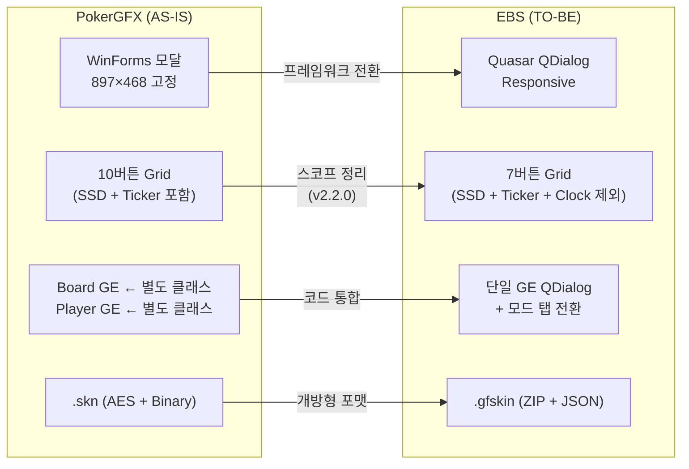
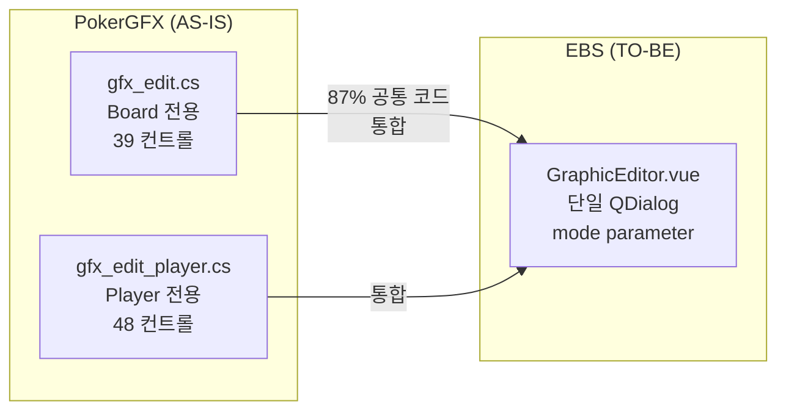

# PokerGFX → EBS Skin Editor UI Design 비교

## 스냅샷 목차 (총 851줄)

| 장 | 주제 | 라인 |
|----|------|-----:|
| 1 | 비교 개요 (AS-IS vs TO-BE 요약) | L15~52 |
| 2 | Skin Editor 메인 화면 비교 | L53~79 |
| 3 | Graphic Editor 아키텍처 비교 | L80~112 |
| 4 | GE 모드별 비교 (8종) | L113~740 |
| 5 | 신규 추가 영역 (EBS 전용) | L741~793 |
| 6 | 파일 포맷 전환 (.skn → .gfskin) | L794~807 |
| 7 | 설계 결정 요약 | L808~ |

> 목적: AS-IS/TO-BE 나란히 비교. 구현은 `prd-skin-editor.prd.md` 참조.

## 1장. 비교 개요

> **이 문서의 목적**: PokerGFX Skin Editor(AS-IS)와 EBS Skin Editor(TO-BE)의 UI 설계를 **시각적으로 나란히 비교**하여, 무엇이 바뀌었고 왜 바뀌었는지 추적한다.

| 비교 항목 | PokerGFX (AS-IS) | EBS (TO-BE) |
|-----------|:-:|:-:|
| 프레임워크 | WinForms (.NET 4.x) | Quasar (Vue 3) |
| Graphic Editor | 2개 분리 클래스 (`gfx_edit.cs` + `gfx_edit_player.cs`) | 1개 통합 QDialog + 모드 탭 |
| Element Grid | 10개 버튼 (Board~Field + SSD, Ticker) | 7개 버튼 (SSD, Ticker, Action Clock 제외) |
| Settings 구성 | 플랫 인라인 (Text/Cards/Player+Flags) | 9개 접이식 `QExpansionItem` (중앙 6 + 우측 3, Currency 삭제) |
| 파일 포맷 | `.skn` (AES + Binary) | `.gfskin` (ZIP + JSON) |
| 테마 | 다크 (회색/검정) | B&W Refined Minimal |
| 해상도 | 고정 897×468 | Responsive QDialog |

**참조 문서**: [PRD-0005](prd-skin-editor.prd.md) (역공학 분석) | [EBS-Skin-Editor.prd.md](EBS-Skin-Editor.prd.md) (UI 설계 v1.2.0)

## 2장. Skin Editor 메인 화면 비교

### 2.1 메인 화면 이미지 비교

| PokerGFX Original | 
|:-:|
|  |
| EBS Design |
|  |
| *WinForms 897×468, 다크 테마, 94개 컨트롤* |
| *Quasar QDialog, B&W Refined Minimal, 01~61* |
| EBS Annotation |
|  |
| *영역별 컬러 Bounding Box: ■ Metadata (01~05) ■ Elements (06, 27~30) ■ Settings (07~61) ■ Actions (21~26)* |

### 2.2 4-Zone 비교

| Zone | PokerGFX | EBS | 변경점 |
|:----:|----------|-----|--------|
| ① Metadata | Name, Details, Remove Alpha, 4K, Scale (5개) | 01~05 (동일 5개) | 컨트롤 타입만 변경 (CheckBox→QToggle, TrackBar→QSlider) |
| ② Elements | 10버튼 + Adjust Colours 모달 | 7버튼 + 27~30 인라인 | -3버튼(SSD, Ticker, Action Clock). Adjust Colours 모달→인라인 전환, 30 Color Replace 추가 |
| ③ Settings | Text/Cards/Player+Flags (플랫 노출) | 3개 QExpansionItem (Text/Font, Cards, Player/Flags) + Vanity 인라인 | v3.0.0 스코프 재정의 — 스킨 고유 설정만 유지, 운영/동작 설정은 Console/GE로 분리 |

> **목업 접힌/펼친 컨벤션**: 기존 3개 섹션(Text/Font, Cards, Player/Flags)은 **펼침 (▼)** 상태로 전체 컨트롤 노출. 신규 6개 섹션(31~61)은 **접힘 (▸)** 상태 + 헤더에 컨트롤 수 요약 표시. HTML 소스에는 모든 컨트롤 markup이 포함되어 있어 인터랙티브 확인 가능.
| ④ Actions | 6버튼 (IMPORT~USE) | 21~26 (동일 6개) | 레이아웃만 변경 |

## 3장. Graphic Editor 아키텍처 비교

### 3.1 클래스 통합

*PokerGFX의 2개 분리 클래스(87% 코드 중복)를 EBS에서 단일 QDialog로 통합*

> **EBS 적응형 레이아웃 3종 (패턴 A/B/C)** → [EBS-Skin-Editor_v3.prd.md §9.5](EBS-Skin-Editor_v3.prd.md) 참조

### 3.3 주요 차이점

| 항목 | PokerGFX | EBS | 변경 사유 |
|------|----------|-----|----------|
| 모드 전환 | 별도 윈도우 (Board GE / Player GE) | 탭 전환 (단일 QDialog) | 코드 중복 87% 제거 |
| 패널 레이아웃 | 플랫 (Transform/Animation/Text 모두 노출) | 접이식 (`QExpansionItem`), 기본 전체 펼침 | 목업에서 모든 컨트롤 확인 가능 |
| Canvas 위치 | 하단 | 좌측 상단 (Side-by-Side) 또는 상단 전폭 (Stacked) | WYSIWYG 우선 노출 |
| 적응형 레이아웃 | 고정 크기 | 캔버스별 3종 패턴: A(3-Column Figma), B(Canvas Top+2×2), C(Canvas Top+3열) | 캔버스 크기·서브요소 수에 맞는 최적 배치 |
| Transform | 우측 상단 산개 | 우측 접이식 그룹 | 정보 밀도 향상 |
| Import Mode | 상단 드롭다운 | 좌측 하단 드롭다운 | Canvas와 근접 배치 |
| Adjust Colours | 별도 모달 (Hue/Tint/3 Color Replace + WYSIWYG Preview) | GE 서브 editor 복원 (각 GE "Adjust Colours" 버튼에서 모달 접근) | v3.0.0: 원본 모달 패턴으로 회귀. 메인에서 인라인 제거 |

## 4장. GE 모드별 비교 (8종)

### 4.1 Board

| PokerGFX |
|:-:|
|  |
| *Canvas 296×197, 서브요소: Card 1~5, Sponsor Logo, PokerGFX.io, 100,000, Pot, Blinds, 50,000/100,000, Hand, 123, Game Variant (14개)* |
| EBS |
|  |
| *동일 서브요소, 접이식 패널 레이아웃* |
| EBS Annotation |
|  |
| *5-Zone: ■ Canvas ■ Elements ■ Transform ■ Text/Anim/BG ■ Actions* |
| PokerGFX Adjust Colours |
|  |
| *별도 모달: Colour Replacement 3 rules + Hue/Tint 슬라이더 + WYSIWYG 프리뷰* |
| EBS Adjust Colours |
|  |
| *인라인 Col 3: Colour Replace + Tint & Hue 통합* |

| 항목 | PokerGFX | EBS |
|------|----------|-----|
| Canvas 크기 | 296×197 | 동일 |
| 서브요소 수 | 14개 | 14개 (변경 없음) |
| Import Mode | Auto / AT Mode (Flop Game) / AT Mode (Draw/Stud Game) | 동일 3종 |

#### 서브요소 상세 (Element Catalog)

| # | 서브요소 | 타입 | PokerGFX 기본값 (L/T/W/H/Z) | 오버레이 대응 | skin_type 필드 | EBS 변경 |
|:-:|---------|------|:---------------------------:|:---:|----------------|---------|
| 1~5 | Card 1~5 | Image (PIP) | 288/0/56/80/Z=1, Anchor=Right/Top | #5 커뮤니티 카드 | `board_cards_rect` (RectangleF[]), `z_board_cards`, `rot_board_cards` | 변경 없음 |
| 6 | Sponsor Logo | Image | (좌표 가변) | #10 스폰서 로고 | `board_logo_rect` (RectangleF) | 변경 없음 |
| 7 | PokerGFX.io | Text | — | (브랜딩) | — | EBS 브랜딩으로 교체 |
| 8 | 100,000 | Text | — | #8 팟 카운터 | `board_pot` (font_type) | 변경 없음 |
| 9 | Pot | Text | — | #8 팟 라벨 | (board_pot 내) | 변경 없음 |
| 10 | Blinds | Text | — | #7 Blinds 라벨 | (Board에서 참조) | 변경 없음 |
| 11 | 50,000/100,000 | Text | — | #7 Blinds 금액 | (Board에서 참조) | 변경 없음 |
| 12 | Hand | Text | — | 핸드# 라벨 | — | 변경 없음 |
| 13 | 123 | Text | — | 핸드# 값 | — | 변경 없음 |
| 14 | Game Variant | Text | — | 게임 타입 표시 | — | 변경 없음 |

#### Import Mode 비교

| Mode | PokerGFX 동작 | EBS 변경 |
|------|-------------|---------|
| Auto | `board_image` / `ai_board_image` (byte[] / asset_image) 기본 배경 로드 | 변경 없음 |
| AT Mode (Flop Game) | `board_at_image` / `ai_board_at_image` — Flop 게임용 대체 배경 | 통합 드롭다운으로 변경 |
| AT Mode (Draw/Stud Game) | `board_at_image` / `ai_board_at_image` — Draw/Stud 게임용 대체 배경 | 통합 드롭다운으로 변경 |

#### 오버레이 영향 상세

| 설정 변경 | → 오버레이 요소 | 변화 내용 | skin_type 필드 |
|-----------|:---:|----------|----------------|
| Card 1~5 좌표 변경 | #5 커뮤니티 카드 | 카드 배치 위치/크기/회전 | `board_cards_rect`, `z_board_cards`, `rot_board_cards` |
| 100,000/Pot 텍스트 스타일 | #8 팟 카운터 | 폰트/색상/정렬/그림자 | `board_pot` (font_type) |
| Board 배경 이미지 교체 | #5, #8 전체 배경 | 커뮤니티 카드 + 팟 영역 외형 | `board_image` / `ai_board_image` |
| Import Mode 전환 | #5, #8 배경 전환 | AT Mode별 배경 이미지 자동 전환 | `board_at_image` / `ai_board_at_image` |

#### 설계 변경 요약

| 항목 | PokerGFX (AS-IS) | EBS (TO-BE) | 변경 이유 |
|------|---------|-----|----------|
| 에디터 구조 | 별도 GE 윈도우 (`gfx_edit.cs`) | 통합 QDialog Board 탭 | 코드 중복 87% 제거 |
| 프레임워크 | WinForms (.NET 4.x) | Quasar (Vue 3) | 웹 기반 크로스플랫폼 |
| 색상 조정 | Adjust Colours 별도 다이얼로그 | GE 서브 editor 모달 복원 (v3.0.0) | 원본 모달 패턴 회귀, 메인 인라인 제거 |
| AT Mode 선택 | 분리된 Import/AT 드롭다운 | 통합 Import Mode 드롭다운 | 조작 단계 축소 |

### 4.2 Player

| PokerGFX |
|:-:|
|  |
| *Canvas 465×120, 서브요소: Photo, Card 1~N, Name, Action, Stack, POS* |
| EBS |
|  |
| *동일 서브요소, 통합 QDialog 내 Player 모드* |
| EBS Annotation |
|  |
| *4-Zone: ■ Canvas ■ Transform ■ Text/Anim/BG ■ Actions* |

| 항목 | PokerGFX | EBS |
|------|----------|-----|
| Canvas 크기 | 465×120 | 동일 |
| 서브요소 수 | N+7 (Variant 의존) | 동일 공식 |
| 전용 클래스 | `gfx_edit_player.cs` (별도) | `GraphicEditor.vue` mode=player |

#### 서브요소 상세 (Element Catalog)

서브요소 수는 게임 Variant에 따라 가변: Holdem N=2, Omaha N=4.

| # | 서브요소 | 타입 | PokerGFX 기본값 (L/T/W/H/Z) | 오버레이 대응 | skin_type 필드 | EBS 변경 |
|:-:|---------|------|:---------------------------:|:---:|----------------|---------|
| 1~N | Card 1~N | Image (PIP) | Card1: 372/5/44/64/Z=1, Anchor=Right/Top | #2 홀카드 | `player_cards_rect` (RectangleF[]) | 변경 없음 |
| N+1 | Name | Text | Font 1 Gotham, Left | #1 Player Panel | `player_name` (font_type) | 변경 없음 |
| N+2 | Action | Text | — | #3 Action Badge | `player_action` (font_type) | 변경 없음 |
| N+3 | Stack | Text | — | #1 Player Panel | `player_stack` (font_type) | 변경 없음 |
| N+4 | Odds | Text | — | #4 Equity Bar | `player_odds` (font_type) | 변경 없음 |
| N+5 | Position | Text | — | #1 Player Panel | `player_pos` (font_type) | 변경 없음 |
| N+6 | Photo | Image | — | #1 Player Panel | `player_pic_rect` (RectangleF) | 변경 없음 |
| N+7 | Flag | Image | — | #1 Player Panel | `player_flag_rect` (RectangleF) | 변경 없음 |

#### 가변 캔버스 (skin_layout_type별)

| layout_type | 캔버스 | 설명 |
|:---|:---:|:---|
| compact | 270×90 | 사진 없음, 최소 정보 |
| vertical_only | 465×84 | 수직 레이아웃 |
| horizontal_with_photo | 465×120 | 수평+사진 (기본) |

**horizontal_with_photo (기본)** — 465×120, 9 elements (Photo+Flag 포함)

| # | Element | Type | skin_type 필드 |
|:-:|---------|:----:|----------------|
| 1 | Photo | Image | `player_pic_rect` |
| 2 | Card 1 | Image | (카드 렌더링) |
| 3 | Card 2 | Image | (카드 렌더링) |
| 4 | Name | Text | `player_name` |
| 5 | Flag | Image | `player_flag_rect` |
| 6 | Odds | Text | `player_odds` |
| 7 | Action | Text | `player_action` |
| 8 | Stack | Text | `player_stack` |
| 9 | POS | Text | `player_pos` |

**vertical_only** — 465×84, 7 elements (Photo/Flag 제거)

| # | Element | Type | skin_type 필드 | 비고 |
|:-:|---------|:----:|----------------|------|
| 1 | Card 1 | Image | (카드 렌더링) | |
| 2 | Card 2 | Image | (카드 렌더링) | |
| 3 | Name | Text | `player_name` | selected |
| 4 | Odds | Text | `player_odds` | |
| 5 | Action | Text | `player_action` | |
| 6 | Stack | Text | `player_stack` | |
| 7 | POS | Text | `player_pos` | |

> Photo, Flag 제거 — `skin_layout_type == vertical_only` 시 렌더링 제외

**compact** — 270×90, 5 elements (최소 구성)

| # | Element | Type | skin_type 필드 | 비고 |
|:-:|---------|:----:|----------------|------|
| 1 | Name | Text | `player_name` | selected |
| 2 | Odds | Text | `player_odds` | |
| 3 | Action | Text | `player_action` | |
| 4 | Stack | Text | `player_stack` | |
| 5 | POS | Text | `player_pos` | |

> Photo, Flag, Card 제거 — `skin_layout_type == compact` 시 최소 구성

#### Player Set 드롭다운

| Player Set | 카드 수 | 용도 |
|:---|:---:|:---|
| 2 Card Games | N=2 | Holdem 계열 |
| 4 Card Games | N=4 | Omaha 계열 |

#### 배경 이미지 6상태

| # | 상태 | skin_type 필드 | 트리거 |
|:-:|------|----------------|--------|
| 1 | 기본 | `player_image` (byte[]) | 일반 상태 |
| 2 | 액션 중 | `player_action_image` | 플레이어 액션 시 |
| 3 | 자동 | `player_auto_image` | Auto-play 상태 |
| 4 | 사진 포함 | `player_pic_image` | Photo 활성 시 |
| 5 | AT 기본 | (AT variant) | AT Mode 기본 |
| 6 | AT 사진 | (AT variant + photo) | AT Mode + Photo |

#### Drop Shadow 8방향

None / North / North East / East / **South East**(기본) / South / South West / West / North West

#### 오버레이 영향 상세

| 설정 변경 | → 오버레이 요소 | 변화 내용 | skin_type 필드 |
|-----------|:---:|----------|----------------|
| Name 좌표/스타일 | #1 Player Panel | 이름 위치/폰트/색상/정렬/그림자 | `player_name` (font_type) |
| Card 1~N 좌표 | #1, #2 홀카드 | 홀카드 위치/크기 | `player_cards_rect` (RectangleF[]) |
| Action/Odds/Stack/Pos | #1, #3, #4 | 텍스트 스타일 (폰트/색상/정렬) | `player_action`, `player_odds`, `player_stack`, `player_pos` |
| Player 배경 교체 | #1 Panel 배경 | 6상태×Photo 유무별 외형 | `player_image` 등 byte[] × 6 |
| Drop Shadow 방향 | #1 텍스트 그림자 | 8방향 그림자 렌더링 | shadow_direction |

#### 설계 변경 요약

| 항목 | PokerGFX (AS-IS) | EBS (TO-BE) | 변경 이유 |
|------|---------|-----|----------|
| 에디터 구조 | 별도 `gfx_edit_player.cs` | 통합 QDialog Player 탭 | 87% 코드 중복 제거 |
| 프레임워크 | WinForms (.NET 4.x) | Quasar (Vue 3) | 웹 기반 크로스플랫폼 |
| 색상 조정 | Adjust Colours 별도 다이얼로그 | GE 서브 editor 모달 복원 (v3.0.0) | 원본 모달 패턴 회귀, 메인 인라인 제거 |
| Player Set | 드롭다운 (2/4 Card Games) | 동일 | 변경 없음 |

### 4.3 Blinds

| PokerGFX |
|:-:|
|  |
| *Canvas 790×52* |
| EBS |
|  |
| *동일 캔버스, 접이식 패널* |
| EBS Annotation |
|  |
| *4-Zone: ■ Canvas ■ Transform ■ Text/Anim/BG ■ Actions* |

| 항목 | PokerGFX | EBS |
|------|----------|-----|
| Canvas 크기 | 790×52 | 동일 |
| → 오버레이 | #7 Bottom Strip | 동일 |

#### 서브요소 상세 (Element Catalog)

| # | 서브요소 | 타입 | PokerGFX 기본값 (L/T/W/H) | 오버레이 대응 | skin_type 필드 | EBS 변경 |
|:-:|---------|------|:---------------------------:|:---:|----------------|---------|
| 1 | Blinds | Text | 19/12/105/28, Font 1 Gotham, Left, Shadow SE ☑ | #7 Bottom Strip | `blinds_msg` (font_type) | 변경 없음 |
| 2 | 50,000/100,000 | Text | — | #7 Bottom Strip | `blinds_amt` (font_type) | 변경 없음 |
| 3 | Hand | Text | — | #7 Bottom Strip | (참조) | 변경 없음 |
| 4 | 123 | Text | — | #7 Bottom Strip | (참조) | 변경 없음 |

#### Import Mode 비교

| Mode | PokerGFX 동작 | EBS 변경 |
|------|-------------|---------|
| Blinds with Hand # | `blinds_image` / `ai_blinds_image` (byte[] / asset_image) 기본 배경 | 변경 없음 |
| Ante 활성 시 | `blinds_ante_image` 배경 자동 전환 + `ante_msg`, `ante_amt` (font_type × 2) | 변경 없음 |

**Blinds with Hand # (기본)** — 4 elements

| # | Element | Type | skin_type 필드 |
|:-:|---------|:----:|----------------|
| 1 | Blinds | Text | `blinds_msg` |
| 2 | 50,000/100,000 | Text | `blinds_amt` |
| 3 | Hand | Text | (참조) |
| 4 | 123 | Text | (참조) |

**Ante** — 6 elements (+ante_msg, +ante_amt)

| # | Element | Type | skin_type 필드 | 비고 |
|:-:|---------|:----:|----------------|------|
| 1 | Blinds | Text | `blinds_msg` | selected |
| 2 | 50,000/100,000 | Text | `blinds_amt` | |
| 3 | Hand | Text | (참조) | |
| 4 | 123 | Text | (참조) | |
| 5 | Ante Msg | Text | `ante_msg` | Ante 모드 추가 |
| 6 | Ante Amt | Text | `ante_amt` | Ante 모드 추가 |

> Ante 활성 시 배경이 `blinds_ante_image`로 자동 전환, 요소 2개 추가

#### 오버레이 영향 상세

| 설정 변경 | → 오버레이 요소 | 변화 내용 | skin_type 필드 |
|-----------|:---:|----------|----------------|
| Blinds 텍스트 좌표/스타일 | #7 Bottom Strip | Blinds 라벨 위치/폰트/색상 | `blinds_msg` (font_type) |
| Amount 텍스트 변경 | #7 Bottom Strip | Blind 금액 표시 스타일 | `blinds_amt` (font_type) |
| Hand/123 변경 | #7 Bottom Strip | 핸드 번호 위치/스타일 | (참조) |
| Blinds 배경 교체 | #7 Bottom Strip | Blinds 영역 외형 (Ante 시 자동 전환) | `blinds_image`, `blinds_ante_image` |

#### 설계 변경 요약

| 항목 | PokerGFX (AS-IS) | EBS (TO-BE) | 변경 이유 |
|------|---------|-----|----------|
| 에디터 구조 | 별도 GE 윈도우 | 통합 QDialog Blinds 탭 | 코드 중복 제거 |
| 프레임워크 | WinForms (.NET 4.x) | Quasar (Vue 3) | 웹 기반 크로스플랫폼 |
| 색상 조정 | Adjust Colours 별도 다이얼로그 | GE 서브 editor 모달 복원 (v3.0.0) | 원본 모달 패턴 회귀, 메인 인라인 제거 |

### 4.4 Outs

| PokerGFX |
|:-:|
|  |
| *Canvas 465×84, 서브요소: Card 1, Name, # Outs (3개)* |
| EBS |
|  |
| *동일 3개 서브요소* |
| EBS Annotation |
|  |
| *4-Zone: ■ Canvas ■ Transform ■ Text/Anim/BG ■ Actions* |

| 항목 | PokerGFX | EBS |
|------|----------|-----|
| Canvas 크기 | 465×84 | 동일 |
| 서브요소 수 | 3개 | 3개 (변경 없음) |

#### 서브요소 상세 (Element Catalog)

| # | 서브요소 | 타입 | PokerGFX 기본값 (L/T/W/H/Z) | 오버레이 대응 | skin_type 필드 | EBS 변경 |
|:-:|---------|------|:---------------------------:|:---:|----------------|---------|
| 1 | Card 1 | Image (PIP) | 5/0/56/80/Z=1 | Outs 패널 | `outs_cards_rect` (RectangleF[]), `z_outs_cards`, `rot_outs_cards` | 변경 없음 |
| 2 | Name | Text | — | Outs 패널 | `outs_name` (font_type) | 변경 없음 |
| 3 | # Outs | Text | — | Outs 패널 | `outs_num` (font_type) | 변경 없음 |

#### 오버레이 영향 상세

| 설정 변경 | → 오버레이 요소 | 변화 내용 | skin_type 필드 |
|-----------|:---:|----------|----------------|
| Card 1 좌표 변경 | Outs 패널 | 카드 배치 위치/크기/회전 | `outs_cards_rect`, `z_outs_cards`, `rot_outs_cards` |
| Name 텍스트 스타일 | Outs 패널 | 이름 폰트/색상/정렬 | `outs_name` (font_type) |
| # Outs 텍스트 스타일 | Outs 패널 | 숫자 폰트/색상 | `outs_num` (font_type) |
| 배경 이미지 교체 | Outs 패널 | Outs 패널 외형 | `outs_image` / `ai_outs_image` |

#### 설계 변경 요약

| 항목 | PokerGFX (AS-IS) | EBS (TO-BE) | 변경 이유 |
|------|---------|-----|----------|
| 에디터 구조 | 별도 GE 윈도우 | 통합 QDialog Outs 탭 | 코드 중복 제거 |
| 프레임워크 | WinForms (.NET 4.x) | Quasar (Vue 3) | 웹 기반 크로스플랫폼 |
| 색상 조정 | Adjust Colours 별도 다이얼로그 | GE 서브 editor 모달 복원 (v3.0.0) | 원본 모달 패턴 회귀, 메인 인라인 제거 |
| 투명도 표시 | 체스보드 패턴 (WinForms GDI+) | CSS 투명도 그리드 | 웹 표준 호환 |

### 4.5 Hand History

| PokerGFX |
|:-:|
|  |
| *Canvas 345×33, 서브요소: Pre-Flop, Name, Action (3개)* |
| EBS |
|  |
| *동일 3개 서브요소* |
| EBS Annotation |
|  |
| *4-Zone: ■ Canvas ■ Transform ■ Text/Anim/BG ■ Actions* |

| 항목 | PokerGFX | EBS |
|------|----------|-----|
| Canvas 크기 | 345×33 | 동일 |
| Import Mode | Header, Repeating header, Repeating detail, Footer | 동일 4종 |

#### 서브요소 상세 (Element Catalog)

| # | 서브요소 | 타입 | PokerGFX 기본값 (L/T/W/H) | 오버레이 대응 | skin_type 필드 | EBS 변경 |
|:-:|---------|------|:---------------------------:|:---:|----------------|---------|
| 1 | Pre-Flop | Text | 14/9/317/19, Font 1 Gotham, Centre | History 패널 | `history_panel_header` (font_type) | 변경 없음 |
| 2 | Name | Text | — | History 패널 | `history_panel_detail_left_col` (font_type) | 변경 없음 |
| 3 | Action | Text | — | History 패널 | `history_panel_detail_right_col` (font_type) | 변경 없음 |

#### Import Mode 비교

| Mode | PokerGFX 동작 | EBS 변경 |
|------|-------------|---------|
| Header | `ai_history_panel_header_image` (asset_image) — 패널 상단 헤더 배경 | 비주얼 섹션 편집기 |
| Repeating header | `ai_history_panel_repeat_section_header_image` — 반복 헤더 배경 | 비주얼 섹션 편집기 |
| Repeating detail | `ai_history_panel_repeat_section_detail_image` — 반복 상세 배경 | 비주얼 섹션 편집기 |
| Footer | `ai_history_panel_footer_image` — 패널 하단 푸터 배경 | 비주얼 섹션 편집기 |

**Header (기본)** — 1 element (Pre-Flop 헤더)

| # | Element | Type | skin_type 필드 |
|:-:|---------|:----:|----------------|
| 1 | Pre-Flop | Text | `history_panel_header` |

> 배경: `ai_history_panel_header_image`

**Repeating detail** — 2 elements (Name + Action)

| # | Element | Type | skin_type 필드 |
|:-:|---------|:----:|----------------|
| 1 | Name | Text | `history_panel_detail_left_col` |
| 2 | Action | Text | `history_panel_detail_right_col` |

> 배경: `ai_history_panel_repeat_section_detail_image`

**Repeating header** — 1 element (반복 섹션 헤더)

| # | Element | Type | skin_type 필드 |
|:-:|---------|:----:|----------------|
| 1 | Rep. Header | Text | (반복 섹션 헤더) |

> 배경: `ai_history_panel_repeat_section_header_image`

**Footer** — 1 element (푸터)

| # | Element | Type | skin_type 필드 |
|:-:|---------|:----:|----------------|
| 1 | Footer | Text | (푸터 텍스트) |

> 배경: `ai_history_panel_footer_image`

기본 비트맵: `history_panel_bitmap` / `ai_history_panel_bitmap` (byte[] / asset_image)

#### 오버레이 영향 상세

| 설정 변경 | → 오버레이 요소 | 변화 내용 | skin_type 필드 |
|-----------|:---:|----------|----------------|
| Pre-Flop 텍스트 스타일 | History 패널 | 라운드 헤더 폰트/색상/정렬 | `history_panel_header` |
| Name 텍스트 스타일 | History 패널 | 플레이어 이름 폰트/색상 | `history_panel_detail_left_col` |
| Action 텍스트 스타일 | History 패널 | 액션 텍스트 폰트/색상 | `history_panel_detail_right_col` |

#### 설계 변경 요약

| 항목 | PokerGFX (AS-IS) | EBS (TO-BE) | 변경 이유 |
|------|---------|-----|----------|
| 에디터 구조 | 별도 GE 윈도우 | 통합 QDialog History 탭 | 코드 중복 제거 |
| 프레임워크 | WinForms (.NET 4.x) | Quasar (Vue 3) | 웹 기반 크로스플랫폼 |
| 색상 조정 | Adjust Colours 별도 다이얼로그 | GE 서브 editor 모달 복원 (v3.0.0) | 원본 모달 패턴 회귀, 메인 인라인 제거 |
| Import Mode | 드롭다운 4종 선택 | 비주얼 섹션 편집기 | 반복 구조 직관적 편집 |

### 4.6 Leaderboard

| PokerGFX |
|:-:|
|  |
| *Canvas 800×103, 서브요소 9개: Player Photo, Player Flag, Sponsor Logo, Title, Left, Centre, Right, Footer, Event Name* |
| EBS |
|  |
| *동일 9개 서브요소* |
| EBS Annotation |
|  |
| *4-Zone: ■ Canvas ■ Transform ■ Text/Anim/BG ■ Actions* |

| 항목 | PokerGFX | EBS |
|------|----------|-----|
| Canvas 크기 | 800×103 | 동일 |
| 서브요소 수 | 9개 | 9개 (변경 없음) |
| Import Mode | Header, Repeating section, Footer | 동일 3종 |

#### 서브요소 상세 (Element Catalog)

| # | 서브요소 | 타입 | PokerGFX 기본값 (L/T/W/H/Z) | 오버레이 대응 | skin_type 필드 | EBS 변경 |
|:-:|---------|------|:---------------------------:|:---:|----------------|---------|
| 1 | Player Photo | Image | 727/10/60/83/Z=1 | LB 패널 | `panel_photo_rect` (RectangleF) | 변경 없음 |
| 2 | Player Flag | Image | — | LB 패널 | `panel_flag_rect` (RectangleF) | 변경 없음 |
| 3 | Sponsor Logo | Image | — | LB 패널 | `panel_logo_rect` (RectangleF) | 변경 없음 |
| 4 | Title | Text | — | LB 패널 | `panel_header` (font_type) | 변경 없음 |
| 5 | Left | Text | — | LB 패널 | `panel_left_col` (font_type) | 변경 없음 |
| 6 | Centre | Text | — | LB 패널 | `panel_centre_col` (font_type) | 변경 없음 |
| 7 | Right | Text | — | LB 패널 | `panel_right_col` (font_type) | 변경 없음 |
| 8 | Footer | Text | — | LB 패널 | `panel_footer` (font_type) | 변경 없음 |
| 9 | Event Name | Text | — | LB 패널 | `panel_game_title` (font_type) | 변경 없음 |

#### Import Mode 비교

| Mode | PokerGFX 동작 | EBS 변경 |
|------|-------------|---------|
| Header | `ai_panel_header_image` (asset_image) — 패널 상단 헤더 배경 | 통합 드롭다운 |
| Repeating section | `ai_panel_repeat_image` — 반복 섹션 배경 | 통합 드롭다운 |
| Footer | `ai_panel_footer_image` — 패널 하단 푸터 배경 | 통합 드롭다운 |

**Header (기본)** — 4 elements (Title, Event, Logo, Footer)

| # | Element | Type | skin_type 필드 |
|:-:|---------|:----:|----------------|
| 1 | Title | Text | `panel_header` |
| 2 | Event Name | Text | `panel_game_title` |
| 3 | Sponsor Logo | Image | `panel_logo_rect` |
| 4 | Footer | Text | `panel_footer` |

> 배경: `ai_panel_header_image`

**Repeating section** — 5 elements (Photo, Flag, L/C/R)

| # | Element | Type | skin_type 필드 |
|:-:|---------|:----:|----------------|
| 1 | Player Photo | Image | `panel_photo_rect` |
| 2 | Player Flag | Image | `panel_flag_rect` |
| 3 | Left | Text | `panel_left_col` |
| 4 | Centre | Text | `panel_centre_col` |
| 5 | Right | Text | `panel_right_col` |

> 배경: `ai_panel_repeat_image`

**Footer** — 3 elements (Logo, Event, Footer)

| # | Element | Type | skin_type 필드 |
|:-:|---------|:----:|----------------|
| 1 | Sponsor Logo | Image | `panel_logo_rect` |
| 2 | Event Name | Text | `panel_game_title` |
| 3 | Footer | Text | `panel_footer` |

> 배경: `ai_panel_footer_image`

기본 비트맵: `panel_bitmap` / `ai_panel_bitmap` (byte[] / asset_image)

Transition: In/Out 모두 **Expand** (PokerGFX 기본 Default → EBS에서 Expand로 변경)

#### 오버레이 영향 상세

| 설정 변경 | → 오버레이 요소 | 변화 내용 | skin_type 필드 |
|-----------|:---:|----------|----------------|
| Title~Right 텍스트 스타일 | LB 패널 | 컬럼 헤더/데이터 텍스트 폰트/색상 | `panel_header` ~ `panel_right_col` (font_type × 5) |
| Photo/Flag 좌표 | LB 패널 | 사진/국기 배치 위치 | `panel_photo_rect`, `panel_flag_rect` |
| Logo 좌표 | LB 패널 | 스폰서 로고 위치/크기 | `panel_logo_rect` |
| 배경 이미지 교체 (3종) | LB 패널 | Header/Repeating/Footer 영역 외형 | `ai_panel_header_image` 등 |
| Transition Expand | LB 패널 | 등장/퇴장 확장 효과 | (transition 설정) |

#### 설계 변경 요약

| 항목 | PokerGFX (AS-IS) | EBS (TO-BE) | 변경 이유 |
|------|---------|-----|----------|
| 에디터 구조 | 별도 GE 윈도우 | 통합 QDialog Leaderboard 탭 | 코드 중복 제거 |
| 프레임워크 | WinForms (.NET 4.x) | Quasar (Vue 3) | 웹 기반 크로스플랫폼 |
| 색상 조정 | Adjust Colours 별도 다이얼로그 | GE 서브 editor 모달 복원 (v3.0.0) | 원본 모달 패턴 회귀, 메인 인라인 제거 |
| Import Mode | 분리된 드롭다운 | 통합 Import Mode 드롭다운 | UX 일관성 |
| 기본 Transition | Default | Expand | LB 특성에 맞는 시각 효과 |

### 4.7 Field

| PokerGFX |
|:-:|
|  |
| *Canvas 270×90, 서브요소: Total, Remain, Field (3개)* |
| EBS |
|  |
| *동일 3개 서브요소* |
| EBS Annotation |
|  |
| *5-Zone: ■ Canvas ■ Elements ■ Transform ■ Text/Anim/BG ■ Actions* |

| 항목 | PokerGFX | EBS |
|------|----------|-----|
| Canvas 크기 | 270×90 | 동일 |
| → 오버레이 | #9 FIELD | 동일 |

#### 서브요소 상세 (Element Catalog)

| # | 서브요소 | 타입 | PokerGFX 기본값 (L/T/W/H) | 오버레이 대응 | skin_type 필드 | EBS 변경 |
|:-:|---------|------|:---------------------------:|:---:|----------------|---------|
| 1 | Total | Text | 145/51/120/33, Font 1 Gotham, Left, Text Visible ☑ | #9 FIELD | `field_total` (font_type) | 변경 없음 |
| 2 | Remain | Text | — | #9 FIELD | `field_remain` (font_type) | 변경 없음 |
| 3 | Field | Text | — | #9 FIELD | `field_title` (font_type) | 변경 없음 |

배경: `ai_field_image` (asset_image)
Transition: In/Out 모두 **Pop** (PokerGFX 기본 Default → EBS에서 Pop으로 변경) — `field_trans_in`, `field_trans_out` (skin_transition_type)

#### 오버레이 영향 상세

| 설정 변경 | → 오버레이 요소 | 변화 내용 | skin_type 필드 |
|-----------|:---:|----------|----------------|
| Total 텍스트 변경 | #9 FIELD | 총 인원 카운터 위치/폰트 | `field_total` (font_type) |
| Remain 텍스트 변경 | #9 FIELD | 잔여 인원 카운터 위치/폰트 | `field_remain` (font_type) |
| Field 텍스트 변경 | #9 FIELD | 라벨 위치/폰트 | `field_title` (font_type) |
| Transition Pop | #9 FIELD | 등장/퇴장 팝업 효과 | `field_trans_in`, `field_trans_out` |
| 배경 이미지 교체 | #9 FIELD | Field 카운터 외형 | `ai_field_image` |

#### 설계 변경 요약

| 항목 | PokerGFX (AS-IS) | EBS (TO-BE) | 변경 이유 |
|------|---------|-----|----------|
| 에디터 구조 | 별도 GE 윈도우 | 통합 QDialog Field 탭 | 코드 중복 제거 |
| 프레임워크 | WinForms (.NET 4.x) | Quasar (Vue 3) | 웹 기반 크로스플랫폼 |
| 색상 조정 | Adjust Colours 별도 다이얼로그 | GE 서브 editor 모달 복원 (v3.0.0) | 원본 모달 패턴 회귀, 메인 인라인 제거 |
| 기본 Transition | Default | Pop | Field 카운터 특성에 맞는 시각 효과 |

### 4.8 Strip

| PokerGFX |
|:-:|
|  |
| *Canvas 270×90, 서브요소: Name, Count, Position, VPIP, PFR, Logo (6개)* |
| EBS |
|  |
| *동일 6개 서브요소* |
| EBS Annotation |
|  |
| *5-Zone: ■ Canvas ■ Elements ■ Transform ■ Text/Anim/BG ■ Actions* |

| 항목 | PokerGFX | EBS |
|------|----------|-----|
| Canvas 크기 | 270×90 | 동일 |
| 서브요소 수 | 6개 | 6개 (변경 없음) |

#### 서브요소 상세 (Element Catalog)

| # | 서브요소 | 타입 | 오버레이 대응 | skin_type 필드 | EBS 변경 |
|:-:|---------|------|:---:|----------------|---------|
| 1 | Name | Text | #7 Bottom Strip | `strip_name` (font_type) | 변경 없음 |
| 2 | Count | Text | #7 Bottom Strip | `strip_count` (font_type) | 변경 없음 |
| 3 | Position | Text | #7 Bottom Strip | `strip_pos` (font_type) | 변경 없음 |
| 4 | VPIP | Text | #7 Bottom Strip | `strip_vpip` (font_type) | 변경 없음 |
| 5 | PFR | Text | #7 Bottom Strip | `strip_pfr` (font_type) | 변경 없음 |
| 6 | Logo | Image | #10 스폰서 로고 | (이미지 좌표) | 변경 없음 |

배경: `ai_strip_image` (asset_image)
Transition: `strip_trans_in`, `strip_trans_out` (skin_transition_type)
Video Lines: `strip_asset_video_lines` (int) — Strip 해상도 세로 픽셀 수

#### 오버레이 영향 상세

| 설정 변경 | → 오버레이 요소 | 변화 내용 | skin_type 필드 |
|-----------|:---:|----------|----------------|
| Name~PFR 텍스트 스타일 (5건) | #7 Bottom Strip | 각 텍스트 위치/폰트/색상 | `strip_name` ~ `strip_pfr` (font_type × 5) |
| Strip 배경 교체 | #7 Bottom Strip | Strip 영역 외형 | `ai_strip_image` |
| Logo 좌표 변경 | #10 스폰서 로고 | 로고 위치/크기 | (이미지 좌표) |
| Transition 설정 | #7 Bottom Strip | 등장/퇴장 효과 | `strip_trans_in`, `strip_trans_out` |
| Video Lines 변경 | #7, #9, #10 | Strip 렌더링 해상도 (세로 픽셀) | `strip_asset_video_lines` (int) |

#### 설계 변경 요약

| 항목 | PokerGFX (AS-IS) | EBS (TO-BE) | 변경 이유 |
|------|---------|-----|----------|
| 에디터 구조 | 별도 GE 윈도우 | 통합 QDialog Strip 탭 | 코드 중복 제거 |
| 프레임워크 | WinForms (.NET 4.x) | Quasar (Vue 3) | 웹 기반 크로스플랫폼 |
| 색상 조정 | Adjust Colours 별도 다이얼로그 | GE 서브 editor 모달 복원 (v3.0.0) | 원본 모달 패턴 회귀, 메인 인라인 제거 |
| Video Lines | 숨겨진 설정 (config 전용) | 명시적 슬라이더 | 접근성 개선 |

### 4.9 공통 GE 드롭다운/옵션 (텍스트 추출)

이미지 삽입 대신 텍스트로 기재:

| 항목 | 값 목록 |
|------|---------|
| Transition 타입 | Default, Fade, Slide, Pop, Expand (5종) |
| Anchor H | Left, Right |
| Anchor V | Top, Bottom |
| Shadow 방향 | None, North, North East, East, South East(기본), South, South West, West, North West (9방향) |

## 5장. 신규 추가 영역 (EBS 전용)

PokerGFX에 **UI 컨트롤이 없었으나** `skin_type` 필드로 존재했던 6개 섹션. EBS에서 Settings 영역에 `QExpansionItem`으로 표면화.

| 섹션 | Element ID | PokerGFX 상태 | EBS 변경 | skin_type 필드 수 |
|------|:----------:|---------------|----------|:-:|
| **Chipcount Precision** | 31~33 | `cp_*` 8개 필드, UI 없음 (config 전용) | QSelect × 8 + Display Type + Text Size | 10 |
| ~~**Currency**~~ | ~~34~37~~ | ~~`currency_symbol` 등 4필드, UI 없음~~ | ~~v2.2.0에서 삭제 (운영 설정)~~ | ~~4~~ |
| **Statistics** | 38~43 | `auto_stats` 등 6필드, UI 없음 | QToggle × 6 (마스터 + 개별 5종 + Rank/Seat/Eliminated/Action-On). v2.2.0: 타이밍 설정(62~64) 제거, 우→중앙 이동 | 6 |
| **Card Display** | 44~49 | `at_show` 등 8필드, UI 없음 | QSelect × 3 + QToggle × 2 + QInput | 8 |
| **Layout** | 50~56 | `board_pos` 등 10필드, UI 없음 | QSelect + QToggle × 3 + QInput × 3 | 10 |
| **Misc** | 57~61 | `vanity_text` 등 5필드, UI 없음 | QInput + QToggle + QSelect × 3 | 5 |

> **설계 근거**: 이 48개 `skin_type` 필드는 PokerGFX에서 `.skn` 파일을 직접 편집하거나 API로만 설정 가능했다. EBS는 모든 skin_type 필드를 UI로 노출하여 config 파일 편집 필요성을 제거한다. (PRD-0005 vs EBS-Skin-Editor.prd.md §2.4.4~§2.4.9)

### 5.1 GAP 분석 결과

RE 문서(PRD-0005)의 모든 Skin 관련 필드를 EBS Skin Editor UI와 대조한 결과.

#### P1 — 즉시 반영 (HIGH/MED)

| # | 누락 기능 | RE 문서 위치 | 심각도 | 조치 |
|:-:|----------|-------------|:------:|------|
| G1 | `_flip_x` (수평 반전) | image_element 41필드 | **HIGH** | GE Transform 패널에 QToggle 추가 |
| G2 | 텍스트 아웃라인 (`custom_text_renderer`) | text_element 52필드 | **MED** | GE Text 패널에 Outline 두께/색상 추가 |
| G4 | `game_name_in_vanity` | ConfigurationPreset Misc | **MED** | Misc 섹션(57~61)에 QToggle 추가 |
| G7 | `cp_strip` precision 위치 불명확 | Chipcount Precision | **MED** | Strip GE 모드에서 Chipcount 섹션에 명시 |

#### P2 — 백로그 (LOW)

| # | 누락 기능 | RE 문서 위치 | 심각도 | 비고 |
|:-:|----------|-------------|:------:|------|
| G3 | 텍스트 그라디언트 (`gradient fills`) | text_element | **LOW** | P2 검토 항목 — 그라디언트 렌더러 엔진 의존 |
| G5 | `nit_display` (NIT 표시 모드) | ConfigurationPreset Additional | **LOW** | Misc 섹션에 QSelect 추가 검토 |
| G6 | 스프라이트 프레임 제어 (`_seq_num`/`_frame_num`) | image_element | **LOW** | P2 고급 기능 — 애니메이션 시퀀스 제어 |
| G8 | Effects Chain 세밀 제어 (Crop/ColorMatrix) | GPU Effects Chain | **LOW** | 현재 Brightness/Hue/Tint만 노출. 엔진 레벨 P2 |

#### VERIFY — 확인 후 재분류

| # | 항목 | RE 문서 위치 | 확인 내용 |
|:-:|------|-------------|----------|
| G9 | `skin_transition_type` "global=0" 의미 | Animation enum | 개별 GE 모드에서 global transition 참조 메커니즘 확인 필요 |

#### 의도적 제거 확인 (DROP)

| 항목 | 필드 | 제거 사유 |
|------|------|----------|
| Ticker | `ticker_stat_*` 6종 | Element Grid에서 Ticker 제외 (별도 시스템) |
| Action Clock | `action_clock_count` | 운영 설정으로 분리 |
| Currency | 4필드 | v2.2.0에서 Console 전용으로 이관 |
| Twitch/Ticker CP | `cp_twitch`, `cp_ticker` | 명시적 DROP |
| PIP Editor | PIP 관련 | 카메라 오버레이, Skin Editor 범위 밖 |

## 6장. 파일 포맷 전환

| 항목 | PokerGFX `.skn` | EBS `.gfskin` |
|------|:----------------:|:-------------:|
| 컨테이너 | Binary blob | ZIP archive |
| 직렬화 | BinaryFormatter | JSON (UTF-8) |
| 암호화 | AE256 강제 (Zero IV) | 선택적 (상용 스킨만) |
| 이미지 에셋 | BinaryFormatter 내 임베딩 | ZIP 내 개별 PNG/JPEG |
| 확장성 | 불가 (바이너리 호환 필수) | JSON 스키마 버전 관리 |
| 공유 | 파일 복사 전용 | 파일 + 폴더 Export (P2) |
| 보안 취약점 | Zero IV 재사용 (MITM 가능) | 표준 AES-GCM (선택 시) |

> 상세: [EBS-Skin-Editor.prd.md §5.1](EBS-Skin-Editor.prd.md) 파일 포맷 명세

## 7장. 설계 결정 요약

| # | 결정 | PokerGFX (AS-IS) | EBS (TO-BE) | 사유 | 위험 |
|:-:|------|-------------------|-------------|------|------|
| 1 | GE 통합 | 2개 별도 클래스 | 단일 QDialog + mode | 코드 중복 87% 제거 | 모드별 예외 처리 복잡도 |
| 2 | Element Grid 축소 | 10버튼 | 7버튼 (SSD, Ticker, Action Clock 제외) | 범위 정리, Ticker 별도 시스템, Action Clock 운영 설정 분리 | 향후 복원 시 Grid 재설계 |
| 3 | Settings 확장 | 3섹션 (플랫) | 9섹션 (접이식) | 숨겨진 48개 필드 UI 노출 | 초보 사용자 혼동 가능 |
| 4 | 파일 포맷 전환 | .skn (AES+Binary) | .gfskin (ZIP+JSON) | 개방형 포맷, 보안 취약점 해소 | 하위 호환성 없음 |
| 5 | Canvas 위치 변경 | 하단 | 좌측 상단 | WYSIWYG 우선 노출 | 우측 패널 폭 제약 |
| 6 | 패널 접이식 전환 | 플랫 (모두 노출) | QExpansionItem | 화면 공간 최적화 | 클릭 횟수 증가 |
| 7 | 테마 전환 | 다크 (회색/검정) | B&W Refined Minimal | 모던 UI 표준, 문서/목업 일관성 | 방송 환경 밝기 대비 |
| 8 | Console-Skin 필드 중복 해결 | 동일 필드 양쪽 노출 (충돌 가능) | Skin = 디자인 기본값, Console = 런타임 override | SSOT 명확화, 데이터 충돌 방지 | Skin 로드 시 Console 값 초기화 여부 UX 합의 필요 |
| 9 | Colour Tools GE 서브 editor 이관 | 메인 인라인 (v2.2.0) | GE 서브 editor 모달 복원 | PokerGFX 원본: GE "Adjust Colours" 모달 (글로벌 적용, GE 프리뷰 제공). v2.2.0에서 인라인 전환했으나 v3.0.0에서 원본 패턴 복원 | GE 간 전환 시 컨텍스트 유지 필요 |
| 10 | Skin Editor 스코프 재정의 | 9개 Settings 섹션 (48개 필드 표면화) | 3개 Settings + Vanity 인라인 (스킨 고유만 유지) | Console D1~D4 중복 필드 + Colour Tools를 제거하여 SSOT 명확화 | Console 우선 override 시 Skin 기본값 무시 가능 |

### 7.1 Console-Skin 중복 필드 SSOT 지정

| # | 필드 그룹 | Console 위치 | Skin Editor 위치 | SSOT | Override 정책 |
|:-:|----------|-------------|-----------------|:----:|-------------|
| D1 | Layout (`board_pos`, margins 등 7필드) | GFX 탭 Layout | Settings Layout(50~56) | **Console** | Console 전용 — Skin Editor에서 제거. Layout은 Console GFX 탭에서만 설정 |
| D2 | Chipcount Precision (5영역) | Display 탭 Precision | Settings Chipcount(31~33) | **Console** | Console 전용 — Skin Editor에서 제거. Chipcount Precision은 Console Display 탭에서만 설정 |
| D3 | Card Display (`at_show`, `card_reveal` 등) | GFX 탭 Card&Player | Settings CardDisplay(44~49) | **Console** | Console 전용 — Skin Editor에서 제거. Card Display는 Console GFX 탭에서만 설정 |
| D4 | Statistics (`auto_stats` 등 6필드) | Stats 탭 | Settings Statistics(38~43) | **Console** | Console 전용 — Skin Editor에서 제거. Statistics는 Console Stats 탭에서만 설정 |
| D5 | Transition In/Out (타입+시간) | GFX 탭 Animation | GE Animation 패널 | **Skin** | Console Override — 운영 중 전환 효과 즉시 변경 |

> **정책 요약**: `.gfskin` 파일이 디자인 기본값을 저장하고, Console "Load Skin" 시 기본값으로 초기화한다. 이후 Console에서 변경한 값은 "Save GFX Configuration" JSON에 별도 저장되며, Skin 파일 자체는 변경되지 않는다.

## Changelog

| 날짜 | 버전 | 변경 내용 | 변경 유형 | 결정 근거 |
|------|------|-----------|----------|----------|
| 2026-03-20 | v2.2.0 | §4.2 Player GE canvas PokerGFX 원본 배치로 수정 (Name/Stack 수직→수평 2행). Mode 드롭다운 Layout Type 3종(Horiz.+Photo/Vertical/Compact)으로 변경. §4.2~4.6 Import Mode별 canvas 목업 추가 (Player 3종, Blinds Ante, History 4종, Leaderboard 3종 = 12 canvas). `contain: inline-size` 적용으로 dialog 폭 고정 | PRODUCT | Mode별 canvas 구성 차이 시각화, Player canvas 원본 충실도 개선 |
| 2026-03-19 | v2.1.0 | §3.2 EBS 패턴 A/B/C 와이어프레임 제거 — EBS-Skin-Editor_v2.prd.md §3.2 정본 참조로 대체 (중복 제거) | PRODUCT | 비교 문서-설계 문서 간 패턴 A/B/C 중복 해소 |
| 2026-03-19 | v2.0.0 | §2.2 Zone ③ 스코프 재정의 — 9개→3개 Settings + Vanity 인라인. Console D1~D4 중복 제거 (Card Display 44~49, Layout 50~56, Statistics 38~43, Chipcount 31~33, Misc 59~61). Colour Tools 27~30 GE 서브 editor로 이관 (설계 결정 #9). §3.3 Adjust Colours GE 모달 복원. §7.1 D1~D4 SSOT Console 전용으로 변경. 설계 결정 #9/#10 추가 | PRODUCT | 사용자 피드백: 메인 화면에 Console/GE 전용 설정 다수 포함 → 스코프 전면 재점검 |
| 2026-03-19 | v1.9.0 | 4-Column 레이아웃 리밸런싱 — Statistics(38~43) Col-3→Col-2 이동, Misc(57~61) 접힌 헤더 가시화, Zone annotation 업데이트. 최대 높이 차이 208px→76px (63% 개선) | PRODUCT | Col 간 높이 불균형 해소 (Col-2 최저 136px vs Col-3 최고 344px) |
| 2026-03-19 | v1.8.0 | GAP P1 HTML 목업 반영 — G1: GE Transform에 Flip X 토글 추가 (8종), G2: GE Text에 Outline 토글/Width/Colour 추가 (8종), G4: 이미 반영 확인 (Misc #58), G7: Strip GE에 Chipcount Precision 섹션 추가 | PRODUCT | v1.7.0 GAP P1 4건 목업 동기화 |
| 2026-03-18 | v1.7.0 | §5.1 GAP 분석 결과 추가 (G1~G9: P1 4건, P2 4건, VERIFY 1건, DROP 5건), §7 #8 Console-Skin 중복 해결 정책 추가 (D1~D5 SSOT 지정), §7.1 중복 필드 테이블 추가 | PRODUCT | RE 전수 대조 기반 GAP/중복 분석 |
| 2026-03-17 | v1.6.0 | EBS-Skin-Editor v2.2.0 레이아웃 재설계 반영 — Element Grid 8→7(Action Clock 제외), Currency 삭제, Settings 9섹션(중앙6+우측3) 재배치, 밀도 균형 반영 | PRODUCT | PRD v2.2.0 밀도 분석 기반 레이아웃 재설계 |
| 2026-03-13 | v1.5.0 | §4.1~§4.8 GE 모드별 Annotated 이미지 추가 (5-Zone 컬러 바운딩 박스: Canvas/Elements/Transform/Text·Anim·BG/Actions) | PRODUCT | 기능 영역 시각화 |
| 2026-03-13 | v1.4.0 | §2.2 Zone ② Adjust Colours 비교 갱신, §3.3 Adjust Colours 행 추가 | PRODUCT | 30 Color Replace 누락 반영 |
| 2026-03-12 | v1.3.0 | §3.2 적응형 레이아웃 패턴 A/B/C로 전면 리디자인 (A: 3-Column Figma식, B: Canvas Top+2×2, C: Canvas Top+3열). Skin Editor 3열 분리 (Visual/Behavior). Player 캔버스 465×120 수정. PNG 10개 재캡처 | PRODUCT | 업계 표준(Figma/vMix) 3-column 패턴 도입, 캔버스 크기별 공간 효율 최적화 |
| 2026-03-12 | v1.2.0 | §3.2 적응형 레이아웃 3종 반영 (Side-by-Side Medium/Narrow, Stacked). §3.3 패널 전체 펼침 컨벤션 + 적응형 레이아웃 행 추가. Skin Editor 목업에 31~61 6개 접힌 섹션 추가. GE 8종 목업 Animation/Text/Background 전체 펼침 + 캔버스별 레이아웃 최적화. PNG 9개 재캡처 | PRODUCT | 접힌 패널에서 기능 누락 판단 불가 문제 해소 + UI 균형 개선 |
| 2026-03-12 | v1.1.0 | §4.1~§4.8 GE 모드별 상세 보강 — 서브요소 카탈로그(14/N+7/4/3/3/9/3/6), Import Mode 비교, 오버레이 영향 상세, 설계 변경 요약 추가. skin_type 매핑 인라인 통합 | PRODUCT |
| 2026-03-12 | v1.0.0 | 최초 작성 | - | - |
