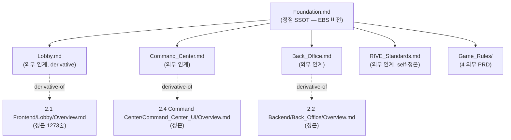
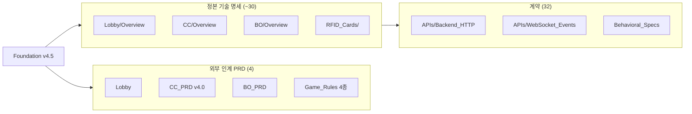

# EBS 문서 인과관계 대시보드

> 이 페이지는 EBS 모든 Confluence 문서의 **인과관계를 한 화면**에서 확인할 수 있도록 자동 생성된 인덱스.
> 각 페이지의 상단 `ℹ️ 문서 인과관계` 박스에서 본 대시보드로 이동 가능 (frontmatter `derivative-of` / `related-docs` 자동 변환 결과).

---

## §1 5 SSOT (정점 문서)

EBS 문서 인과관계는 **5 정점 SSOT** 에서 cascade 한다. 각 SSOT 변경 시 영향 받는 derivative 가 자동 동기화 (frontmatter `derivative-of` + `if-conflict: derivative-of takes precedence`).



| SSOT | 역할 | tier | Owner |
|------|------|:----:|------|
| `Foundation.md` | EBS 비전 + 핵심 정체성 (3 입력 → 오버레이) | internal | conductor |
| `Lobby.md` | 외부 인계 — 5 화면 게이트웨이 | external | stream:S2 |
| `Command_Center.md` | 외부 인계 — 운영자 조종석 v4.0 | external | conductor |
| `Back_Office.md` | 외부 인계 — 보이지 않는 뼈대 | external | conductor |
| `RIVE_Standards.md` | Overlay 그래픽 표준 (self-정본) | external | conductor |

**충돌 시**: `derivative-of takes precedence` (정본 = 진실, 외부 PRD = 정본 follow).

---

## §2 Foundation cascade (전체 영향 범위)

`Foundation.md` 를 변경하면 다음 영역이 영향:



**영향 매트릭스** (`tools/doc_discovery.py --impact-of "docs/1. Product/Foundation.md"`):

- derivative-of 직접 영향: 4 외부 PRD
- related-docs 영향: 4 추가 (SG-033 Conductor_Backlog 포함)
- 정본 cascade: ~30 기술 명세
- 계약 cascade: 32 contract 파일

---

## §3 Confluence Label 검색 가이드

본 Confluence 인스턴스에서 다음 label 로 navigate:

| Label | 효과 | 예시 |
|-------|------|------|
| `tier-external` | 9 외부 인계 PRD | Foundation, Lobby, CC_PRD, BO_PRD, RIVE_Standards, Game_Rules 4 |
| `tier-internal` | 정본 기술 명세 + governance | Foundation, 1.Product, 2.X Overview |
| `tier-contract` | API / DATA 계약 (32) | Backend_HTTP, WebSocket_Events, Auth_and_Session |
| `owner-s1` ~ `owner-s8` | Stream 별 owner | Lobby (S2), CC (S3), Backend (S7), Engine (S8) |
| `owner-conductor` | Conductor 영역 | Foundation, Operations, Reports |
| `legacy-bs-05` | CC UI sub-section (12) | Action_Buttons (BS-05-02), Seat_Management (BS-05-03), ... |
| `legacy-bs-06` | Engine Behavioral Specs (16) | Lifecycle (BS-06-01), Betting (BS-06-02), Triggers, ... |
| `legacy-bs-07` | Overlay (8) | Elements, Animations, Skin_Loading, ... |
| `legacy-api-01` ~ `legacy-api-07` | Backend / Engine APIs | Backend_HTTP, WebSocket_Events, Overlay_Output_Events |

Confluence search bar 에서 `label:tier-external` 입력 → 해당 영역 모든 페이지 list.

---

## §4 Legacy ID 매핑

195 파일에 `legacy-id` frontmatter 부착. 각 legacy-id → 정본 파일 매핑:

| Legacy ID 범위 | 영역 | 정본 path |
|---------------|------|----------|
| `BS-01-XX` | Authentication | `docs/2. Development/2.5 Shared/Authentication/` |
| `BS-02-XX` | Login (Lobby Auth) | `docs/2. Development/2.1 Frontend/Login/` |
| `BS-03-XX` | Settings | `docs/2. Development/2.1 Frontend/Settings/` |
| `BS-04-XX` | RFID Cards | `docs/2. Development/2.4 Command Center/RFID_Cards/` |
| `BS-05-XX` | Command Center UI | `docs/2. Development/2.4 Command Center/Command_Center_UI/` |
| `BS-06-XX` | Game Engine Behavioral Specs | `docs/2. Development/2.3 Game Engine/Behavioral_Specs/` |
| `BS-07-XX` | Overlay | `docs/2. Development/2.4 Command Center/Overlay/` |
| `BS-08-XX` | Graphic Editor | `docs/2. Development/2.1 Frontend/Graphic_Editor/` |
| `API-01..07` | Backend / Engine APIs | `docs/2. Development/2.{2,3}/APIs/` |
| `DATA-XX` | Database Schema | `docs/2. Development/2.2 Backend/Database/` |
| `UI-XX` | UI 와이어프레임 | 각 영역 `UI.md` |

전체 매핑 = `docs/_generated/legacy-id-redirect.json` (195 entries).

---

## §5 변경 영향 빠른 검색

특정 SSOT 변경 시 영향 범위 즉시 확인:

```bash
# Foundation 변경 시
python tools/doc_discovery.py --impact-of "docs/1. Product/Foundation.md"

# 정본 변경 시 (derivative PRD 동기화 강제)
python tools/doc_discovery.py --impact-of "docs/2. Development/2.1 Frontend/Lobby/Overview.md"

# legacy-id 추적
python tools/doc_discovery.py --legacy-id "BS-05-03"
```

CI gate (`scope_check.yml` + `product_cascade.yml`) 가 동시 변경 강제 — 정본 만 변경 + derivative PRD 미동기화 시 PR fail.

---

## §6 인과관계 도구 카탈로그

| 도구 | 역할 |
|------|------|
| `tools/doc_discovery.py` | frontmatter 그래프 분석 (Layer 1) |
| `tools/doc_rag.py` | RAG 의미 검색 (Layer 2) |
| `tools/spec_aggregate.py` | by-owner / by-feature / full-index 자동 생성 |
| `lib/confluence/md2confluence.py` | markdown → Confluence (인과관계 박스 + cross-link 자동) |
| `tools/sync_confluence.py` | bulk sync wrapper (tier 기반 자동 발견) |
| `tools/confluence_drift_check.py` | parent 정합 검증 (CI gate) |
| `.claude/hooks/orch_PreToolUse.py:cascade_advisory()` | Edit 직전 advisory hook |

---

## §7 사용자 워크플로우

### A. 새 문서 작성 시

1. `docs/` 안 적절한 위치에 `.md` 파일 작성
2. frontmatter 에 `owner`, `tier`, `audience-target` 명시
3. 정본 cascade 시 `derivative-of: <정본 path>` + `if-conflict: derivative-of takes precedence`
4. `last-updated: YYYY-MM-DD` 추가
5. CI 가 자동 검증 + Confluence sync 시 인과관계 박스 + label 자동 부착

### B. 기존 문서 변경 시

1. `python tools/doc_discovery.py --impact-of <path>` 실행 → 영향 list
2. derivative 동시 갱신 (`last-synced` 동기화)
3. PR 생성 → CI scope_check 통과 → main 머지
4. 자동 Confluence sync (다음 sync_confluence 실행 시)

### C. Confluence 에서 인과관계 확인

1. 페이지 상단 `ℹ️ 문서 인과관계` Info 박스 → 정본 / 관련 문서 link 클릭 (Confluence 내부 page link)
2. 페이지 label (`tier-external` 등) 클릭 → 같은 영역 모든 페이지 list
3. 이 대시보드 페이지 (현재 페이지) → 5 SSOT cascade graph + legacy-id 매핑 빠른 참조

---

## §8 Edit History

| 날짜 | 변경 |
|------|------|
| 2026-05-08 | 신규 작성 (Phase 7 — Conductor 자율 dashboard 자동 생성) |
