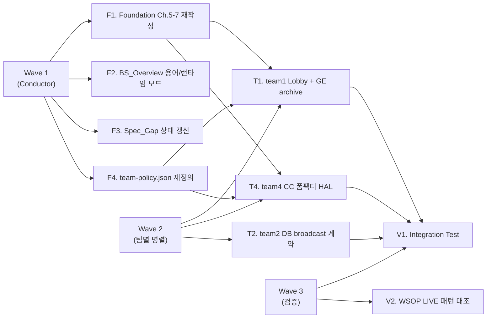

# Redesign Plan — 2026-04-22

## Edit History

| 날짜 | 작성자 | 변경 |
|------|--------|------|
| 2026-04-22 | conductor | 초판 — 회의 7결정 Atomic Task 분해 |

---

## 0. Plan at a Glance



- **Wave 1** — Conductor 세션. 기획 계약 재정의 (docs/1 + docs/2.5 + docs/4).
- **Wave 2** — 팀 세션 병렬 (team1/2/4). Wave 1 확정 후 진입.
- **Wave 3** — 통합 검증 + WSOP LIVE 정렬 확인.

---

## 1. Scope & 범위

| 항목 | 포함 | 제외 |
|------|------|------|
| 회의 7결정 문서화 | ✓ | — |
| Foundation/BS_Overview 재작성 | ✓ | — |
| 팀 Backlog 항목 신설 | ✓ | 팀 구현 자체 (팀 세션 위임) |
| WSOP LIVE 정렬 검증 | Wave 3 | SSOT 역동기화 |
| 프로토타입 E2E 실행 | Wave 3 후반 | 실제 하드웨어 테스트 |

**최상위 전제 재확인**: 본 재설계는 **기획서 완결 프로토타입** 목적. 실제 출시 일정 무관.

---

## 2. Wave 1 — Conductor Atomic Tasks

### F1. Foundation.md Ch.5-7 재작성

**파일**: `docs/1. Product/Foundation.md`

| Step | 섹션 | 변경 내용 |
|:----:|------|-----------|
| F1.1 | Ch.5 (UI) | "단일 앱 2 런타임 모드" 도입 — 기본 다중창 독립 프로세스 / 옵션 탭 라우팅 |
| F1.2 | Ch.6.3 (프로세스 토폴로지) | 다이어그램 재작성 (D2+D5 정합). DB SSOT 중심 |
| F1.3 | Ch.6.4 (신설) | 실시간 동기화 정책 — DB polling + WebSocket push 병행 |
| F1.4 | Ch.7.1 (Overlay 투명 배경) | "투명 / 단색 config flag" 명시 (D4) |
| F1.5 | Ch.8 (운영) | 1PC=1테이블 운영 시나리오 + 복수 테이블 = 복수 PC + 공용 BO 문단 |

**예상 변경량**: ~150줄 (현 493줄 → ~530줄)
**의존**: 없음. 즉시 착수 가능.
**Acceptance**: 회의 7결정 각각이 Ch.X 어디에 반영됐는지 trace table 추가.

### F2. BS_Overview 용어 + 런타임 모드

**파일**: `docs/2. Development/2.5 Shared/BS_Overview.md`

| Step | 변경 내용 |
|:----:|-----------|
| F2.1 | §1 Tech Stack — Lobby+CC 동일 Flutter Desktop 앱으로 통일 (Web 분리 폐기 논의 별건) |
| F2.2 | §1 용어 사전 신설 — "탭 / 창 / 프로세스 / 폼팩터" 4 용어 정의 |
| F2.3 | §2 앱 아키텍처 — "런타임 모드 선택" 섹션 신설 (사용자 2026-04-22 결정: 탭/슬라이딩 기본 / 다중창 PC 옵션) |
| F2.4 | §3 폼팩터 경계 — Desktop (확정) / Tablet (추상화만) 2 단계 명시 |
| **F2.5** | **§1 용어 사전 entry schema 확장 — "정본 섹션 + 참조 섹션" 필드 필수화** (F1.7 lessons learned) |

**F2.5 용어 entry schema (신설)**:

각 용어 정의에 다음 2 필드를 반드시 포함:

```markdown
### {용어}

- **정의**: 1-2줄 개념 설명
- **정본 섹션**: `Foundation.md §X.Y` (이 용어의 canonical 상세 정의가 있는 섹션)
- **참조 섹션**: `BS_Overview §A.B`, `§C.D` (관련 언급이 있는 섹션들 — 중복 확산 추적용)
```

**근거**: F1.7 에서 "5 애플리케이션"·"1 PC = 1 테이블"·"DB SSOT" 등이 3~4곳에서 반복 진술되어 중복이 누적됨. 용어 entry 가 정본/참조를 명시적으로 추적하면:

1. 신규 섹션 작성 시 "이 용어는 정본 섹션이 있는가?" 를 빠르게 판정 — 있으면 본문 중복 대신 "정본 섹션 참조"
2. 주기적 audit (B-101) 실행 시 "참조 섹션 목록" 이 검증 체크리스트 역할
3. 팀 세션이 계약 문서 작성 시 용어 정본을 바로 찾아갈 수 있음 (외부 인계팀 친화성)

**확장 가능성**: 이 규칙은 BS_Overview 용어 사전에 우선 적용하되, 추후 docs/ 전체의 메타 규칙으로 승격 가능. 상세는 B-101 audit 반복 데이터 축적 후 판단.

**의존**: F1.2 (Ch.6.3 토폴로지) 확정 후.
**Acceptance**:
- BS_Overview 읽은 외부 개발팀이 "어떤 모드로 빌드하나?" 답할 수 있음
- 용어 사전 entry 전수에 "정본 섹션 + 참조 섹션" 필드 존재
- F1.7 에서 식별된 주요 용어 (EBS Desktop App / 런타임 모드 / DB SSOT / 1PC=1테이블) 가 용어 사전에 등재

### F3. Spec_Gap_Registry 상태 갱신

**파일**: `docs/4. Operations/Spec_Gap_Registry.md`

| SG | 현 상태 | 회의 후 조치 |
|:--:|:-------:|-------------|
| SG-002 | PENDING (ENGINE_URL graceful) | F1.3 로 해소 — DONE 전환 |
| SG-003 | PENDING (Settings 6탭 스키마) | Rive_Manager 섹션 신설로 재정의 — IN_PROGRESS |
| SG-004 | PENDING (.gfskin 스키마) | **CANCELLED** — D3 (GE 제거) 로 무효 |
| SG-005 | PENDING (Foundation Ch.6 병합) | F1.2 로 해소 — DONE 전환 |
| SG-006 | PENDING (RFID codemap) | 별도 작업 (회의 범위 밖) |
| **SG-007** (신설) | — | 폼팩터 추상화 경계 (D6) — PENDING |
| **SG-008** (신설) | — | Rive 외부 메타 관리 (D3 revision) — PENDING |

**Acceptance**: Registry 갱신 후 `tools/spec_drift_check.py --all` 실행 시 PASS 증가 확인.

### F4. team-policy.json 재정의

**파일**: `docs/2. Development/2.5 Shared/team-policy.json`

| Step | 변경 |
|:----:|------|
| F4.1 | contract_ownership 에서 GE publisher 제거 (team1 Lobby 산하로 축소) |
| F4.2 | Form Factor HAL publisher 신설 (team4 소유) |
| F4.3 | DB State Broadcast publisher 명시 (team2 소유) |

**의존**: F3 확정 후. Hook + tools 가 SSOT 로 참조하므로 마지막에 변경.
**Acceptance**: `.claude/hooks/branch_guard.py` 재실행 시 모든 팀 경로 정상.

---

## 3. Wave 2 — 팀별 Backlog 항목 (신규 등재)

### team1 (Frontend)

| ID | 제목 | 의존 |
|----|------|------|
| B-team1-R01 | Graphic_Editor/ 3문서 archive + Lobby Settings/Rive_Manager 신설 | F4.1 |
| B-team1-R02 | Lobby UI — 탭/창 모드 토글 구현 명세 | F2.3 |
| B-team1-R03 | Settings 스키마에 Overlay 배경 config flag (투명/단색) 추가 | F1.4 |

### team4 (Command Center)

| ID | 제목 | 의존 |
|----|------|------|
| B-team4-R01 | Form Factor HAL 계약 문서 신설 (Desktop/Tablet 2단계) | F4.2, SG-007 |
| B-team4-R02 | CC 카드 비노출 경계 계약 강화 (Engine 상태 ↔ CC 화면 matrix) | F1.1 |
| B-team4-R03 | Overlay 투명 배경 렌더링 구현 확인 | F1.4 |
| B-team4-R04 | CC 독립 프로세스 검증 (Lobby 종료 후에도 동작) | F1.2 |

### team2 (Backend)

| ID | 제목 | 의존 |
|----|------|------|
| B-team2-R01 | DB State Broadcast 계약 — polling + WebSocket push 이원 정의 | F1.3, F4.3 |
| B-team2-R02 | 복수 PC 공용 BO 시나리오 — 세션 격리 정책 | F1.5 |

### team3 (Game Engine)

- 회의 D7 (CC 카드 비노출) 은 Engine 에 영향 없음 — 이미 OutputEvent 로 분리 구현됨.
- team3 신규 Backlog **없음**.

---

## 4. Wave 3 — 검증

### V1. Integration Test

| Scenario | 검증 |
|----------|------|
| 1PC 단일 CC + 1 Overlay 창 | 독립 프로세스 동시 실행 확인 |
| Lobby 프로세스 강제 종료 → CC 계속 동작 | 독립성 검증 |
| DB 상태 변경 → 모든 프로세스 반영 | < 100ms 지연 확인 |
| Overlay 투명 배경 스크린샷 비교 | picture-diff PASS |
| CC 화면 hole card 미표시 + Engine 상태 정확 | 카드 비노출 검증 |

**실행**: `integration-tests/` (HTTP/WebSocket only, 소스 import 금지).

### V2. WSOP LIVE 패턴 대조

| 대조 포인트 | 확인 |
|-------------|------|
| Multi-table 통제 모델 | `C:/claude/wsoplive/docs/confluence-mirror/` 에서 1PC:1테이블 vs N 모델 검색 |
| Lobby / CC / Overlay 프로세스 분리 | WSOP LIVE 앱 구조 비교 |
| Rive 관리 방식 | WSOP LIVE 에 `.gfskin` 유사체 있는지 확인 |

**산출물**: `docs/4. Operations/Reports/WSOP_Live_Alignment_2026_04_22.md`

---

## 5. 우선순위 + 일정 (Relative)

```mermaid
gantt
    title Wave 진행 (상대 일정)
    dateFormat X
    axisFormat Day %d

    section Wave 1
    F1 Foundation     :a1, 0, 3
    F2 BS_Overview    :a2, after a1, 2
    F3 Spec_Gap       :a3, after a2, 1
    F4 team-policy    :a4, after a3, 1

    section Wave 2
    team1 Lobby+GE    :b1, after a4, 3
    team4 CC HAL      :b2, after a4, 3
    team2 DB Contract :b3, after a4, 2

    section Wave 3
    V1 Integration    :c1, after b1, 2
    V2 WSOP Align     :c2, after a4, 2
```



> 일정은 **상대** 단위 (Day N). 실제 캘린더 일정 아님 (프로젝트 의도: 기획서 완결, 출시 일정 무관).

---

## 6. 리스크 + 완화

| 리스크 | 확률 | 영향 | 완화 |
|--------|:---:|:---:|------|
| WSOP LIVE 에 1PC:N 테이블 패턴 존재 → D1 철회 필요 | LOW | HIGH | V2 선행 완료 후 Wave 1 착수 |
| Rive 외부 메타 관리 공백 → Lobby Settings 과도 팽창 | MEDIUM | MEDIUM | SG-008 로 추적, 최소 UI 원칙 고수 |
| 탭 vs 독립 프로세스 정합 실패 → 구현 불가 | LOW | HIGH | F2.3 에서 "탭 = fallback" 단일 모델로 고정 |
| 폼팩터 추상화 YAGNI 역작용 | MEDIUM | LOW | SG-007 에서 **현재 추상화 경계 명시** (미래 작업 회피) |
| DB 동기화 지연 > 100ms | MEDIUM | HIGH | F1.3 에서 WebSocket push 병행 필수화 |

---

## 7. 후속 /team 호출 매트릭스

각 Atomic Task 를 /team 호출로 직접 실행 가능:

| Task | 세션 | /team 호출 예시 |
|------|:----:|----------------|
| F1 | Conductor | `/team "Foundation Ch.5-7 재작성 — D1/D2/D5 반영"` |
| F2 | Conductor | `/team "BS_Overview 용어 사전 + 런타임 모드 섹션 신설"` |
| F3 | Conductor | `/team "Spec_Gap_Registry SG-002~008 상태 갱신"` |
| F4 | Conductor | `/team "team-policy.json contract_ownership 재정의"` |
| T1 | team1 | `/team "Graphic_Editor archive + Rive_Manager 신설 (B-team1-R01~R03)"` |
| T4 | team4 | `/team "Form Factor HAL 계약 + CC 카드 비노출 경계 (B-team4-R01~R04)"` |
| T2 | team2 | `/team "DB State Broadcast 계약 (B-team2-R01~R02)"` |
| V1 | Conductor | `/team "Integration Test 시나리오 실행 + 결과 보고"` |
| V2 | Conductor | `/team "WSOP LIVE Confluence 패턴 대조 (/ssot-align)"` |

---

## 8. 완결 기준 (Definition of Done)

- [ ] Foundation.md Ch.5/6/7 재작성 완료, reimplementability: PASS 복귀
- [ ] BS_Overview.md 용어 사전 + 런타임 모드 섹션 추가
- [ ] Spec_Gap_Registry SG-002 DONE / SG-004 CANCELLED / SG-005 DONE / SG-007+008 신설 PENDING
- [ ] team-policy.json GE publisher 제거 + Form Factor HAL publisher 추가
- [ ] team1/2/4 Backlog 항목 9건 등재
- [ ] WSOP LIVE 패턴 대조 보고서 공유
- [ ] Integration Test 5 시나리오 PASS

**외부 인계 완결 판정**: 외부 개발팀이 이 계획서 + Foundation.md + BS_Overview.md 만으로 재구현 가능한가.
