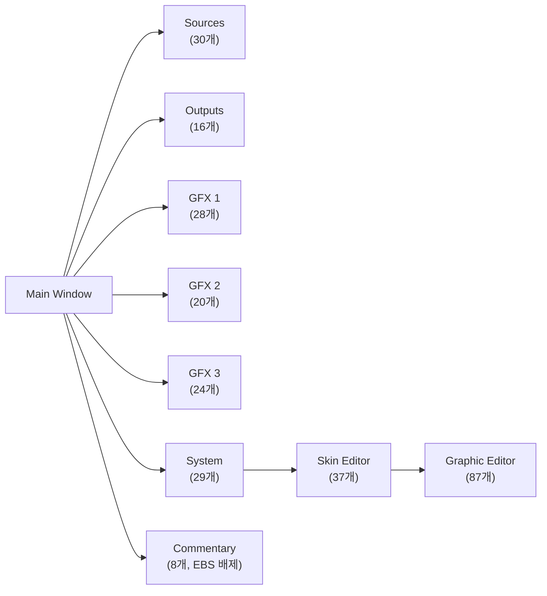
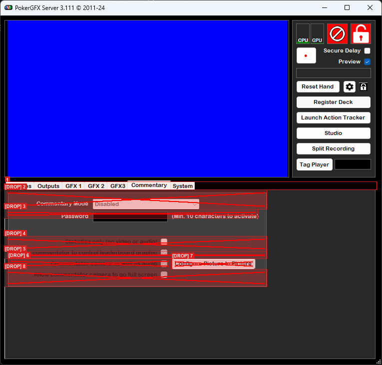

# PRD-0004: PokerGFX 원본 분석

> PokerGFX 289개 UI 요소의 전수 분석과 6탭→5탭 변환 원칙을 기록한 참조 문서.
>
> **이 문서는 PokerGFX 원본 분석 전용이다.** EBS 설계는 아래 문서를 참조:
> - [EBS-UI-Design-v3.prd.md](../00-prd/EBS-UI-Design-v3.prd.md) — EBS 통합 설계서 (1~11장)
> - [PRD-0004-element-catalog.md](PRD-0004-element-catalog.md) — EBS 180개 요소 카탈로그

### 읽기 순서

| 장 | 내용 |
|:---:|------|
| 2 | PokerGFX 전체 구조 — 10개 화면, 289개 요소 분포 |
| 3 | 6탭 Element Catalog — 화면별 전수 기록 (EBS 행선지 표기) |
| 4 | 6탭→5탭 변환 — 변환 원칙, Commentary 배제, 감축 상세 |

### Element ID 체계

| 접두사 | 의미 | 예시 |
|:------:|------|------|
| S | Sources(입력) 요소 | S-01 Video Sources Table |
| O | Outputs(출력) 요소 | O-01 Video Size |
| G | GFX 그래픽 요소 | G-01 Graphic Table |
| Y | System 요소 | Y-03 RFID Reset |
| M | Main Window 요소 | M-01 Title Bar |
| SK | Skin Editor 요소 | SK-01 Skin Name |

이 ID는 문서 간 교차 참조에 사용된다. 각 ID의 EBS 설계 상세는 [element-catalog.md](PRD-0004-element-catalog.md)에 있다.

---

## 2장. PokerGFX 전체 구조

PokerGFX는 Main Window + 6개 설정 탭 + Skin Editor + Graphic Editor로 구성된다. Commentary 탭(8개)은 EBS에서 배제한다(4장 참조).

### PokerGFX 원본 네비게이션 맵

### 289개 요소 분포

| 화면 | 요소 수 | 역할 |
|------|:-------:|------|
| Main Window | 10개 | 모니터링 + 탭 분기 (annotation 물리 박스 기준) |
| Sources | 30개 | 비디오 입력 소스 |
| Outputs | 16개 | 출력 파이프라인 (annotation 물리 박스 기준) |
| GFX 1 | 28개 | 그래픽 배치 + 연출 |
| GFX 2 | 20개 | 표시 설정 + 게임 규칙 |
| GFX 3 | 24개 | 수치 렌더링 |
| System | 29개 | RFID, AT, 진단 |
| Commentary | 8개 | 해설자 오버레이 (EBS 배제) |
| Skin Editor | 37개 | 스킨 테마 편집 |
| Graphic Editor | 87개 | 요소 픽셀 편집 |
| **합계** | **289개** | PokerGFX 원본 요소 총 수. v29.0에서 Sources 오버레이 1:1 확장 반영 (행별 합산: 10+30+16+28+20+24+29+8+37+87=289. v28.0 기준 284 대비 +5: Sources S-03/S-04/S-14 그룹핑 해제, S-25~S-29 신규 추가) |

---

## 3장. PokerGFX 6탭 Element Catalog

> 이 장은 PokerGFX 원본의 모든 UI 요소를 화면별로 기록한다. 각 요소의 EBS 행선지를 **EBS** 열에 표기한다.
>
> **읽는 법**: 각 화면을 **① 원본 캡처** → **② 분석 오버레이** 순으로 배치했다. 분석 오버레이에서 번호는 annotation 박스 라벨, 빨간 X는 Drop 확정 요소를 나타낸다.
>
> EBS 설계 상세는 → [element-catalog.md](PRD-0004-element-catalog.md) 참조.

### 3.1 Main Window (10개 요소)

> → EBS Main Window로 변환. EBS 설계 상세 → [element-catalog.md](PRD-0004-element-catalog.md)

시스템 전체를 한눈에 모니터링하고, 6개 설정 탭으로 분기하는 중앙 통제실. 본방송 중 운영자 주의력의 15%가 여기에 할당된다.

> **① 원본 캡처**:
>
> 
>
> **② 분석 오버레이** *(번호 = annotation 박스 라벨, 빨간 X = Drop)*:
>
> 
>
> 원본 기능 테이블: [PokerGFX-UI-Analysis.md](PokerGFX-UI-Analysis.md) 참조

#### Element Catalog

| # | 요소 | 타입 | 설명 | EBS |
|:-:|------|------|------|:---:|
| 1 | Title Bar | AppBar | 앱 이름 + 버전 + 윈도우 컨트롤 | → M-01 |
| 2 | Preview Panel | Canvas | 출력 해상도(O-01)와 동일한 종횡비 유지, Chroma Key Blue, GFX 오버레이 실시간 렌더링. 해상도 정책: 실제 출력은 Full HD(1920×1080) 기준 리사이징. 문서 표기(480×270)는 UI 공간 내 표시 크기로 가독성용 축약 표기. | → M-02 |
| 3 | Status Indicators | ProgressBar+Icon | CPU/GPU 사용률 + Error + RFID 상태 + Lock. 매뉴얼: "The icons on the left indicate CPU and GPU usage. If they turn red, usage is too high for the Server to operate reliably." (p.34). RFID 7색 표시: Green=정상, Grey=보안 링크 수립 중, Blue=미등록 카드 감지, Black=중복 카드 감지, Magenta=중복 카드, Orange=응답 없음, Red=미연결. | → M-03~M-07 (분할) |
| ~~4~~ | ~~Secure Delay + Preview~~ | ~~Checkbox~~ | ~~방송 보안 딜레이 + 미리보기 토글~~ | ~~Drop~~ |
| 5 | Reset Hand + Settings + Lock | ButtonGroup | Reset Hand 버튼 + 톱니바퀴(전역 설정) + 자물쇠(설정 잠금). 매뉴얼: "Click the Lock symbol next to the Settings button to password protect the Settings Window." (p.33) | → M-11, M-12 |
| 6 | Register Deck | ElevatedButton | 52장 RFID 일괄 등록, 진행 다이얼로그 | → M-13 |
| 7 | Launch Action Tracker | ElevatedButton | AT 실행/포커스 전환 (F8) | → M-14 |
| ~~8~~ | ~~Studio~~ | ~~ElevatedButton~~ | ~~Studio 모드 진입~~ | ~~Drop~~ |
| ~~9~~ | ~~Split Recording~~ | ~~ElevatedButton~~ | ~~핸드별 분할 녹화 (SV-030)~~ | ~~Drop~~ |
| ~~10~~ | ~~Tag Player~~ | ~~ElevatedButton+Dropdown~~ | ~~플레이어 태그~~ | ~~Drop~~ |

### 3.2 Sources 탭 (30개 요소)

> → EBS I/O 탭의 Input 섹션으로 변환. EBS 설계 상세 → [element-catalog.md](PRD-0004-element-catalog.md)

비디오 입력 소스를 등록하고 속성을 조절한다. 자동 카메라 제어 설정도 이 화면에서 한다.

> **① 원본 캡처**:
>
> 
>
> **② 분석 오버레이** *(번호 = annotation 박스 라벨, 빨간 X = Drop)*:
>
> 
>
> 원본 기능 테이블: [PokerGFX-UI-Analysis.md](PokerGFX-UI-Analysis.md) 참조

#### Element Catalog

| # | 그룹 | 요소 | 타입 | 설명 | Ref | EBS |
|:-:|------|------|------|------|:---:|:---:|
| ~~S-00~~ | ~~Output Mode~~ | ~~Mode Selector~~ | ~~RadioGroup~~ | ~~Fill & Key / Chroma Key / Internal (기본: Fill & Key). I/O 탭에서 Sources 전체 제거로 Output Mode Selector 불필요~~ | ~~#1~~ | ~~Drop~~ |
| S-01 | Video Sources | Device Table | DataTable | NDI, 캡처 카드, 네트워크 카메라 목록. 매뉴얼: "The Sources tab contains a list of available video sources." (p.35) | #2 | Keep |
| S-02 | Video Sources | Add Button | TextButton | NDI 자동 탐색 또는 수동 URL | #22 | Defer |
| S-03 | Video Sources | L Column | DataColumn | 좌측 비디오 소스 할당 (X 표시). 매뉴얼: "click both the Left and Right columns for the desired source." (p.35) | #5 | Keep |
| S-04 | Video Sources | Format/Input/URL | DataColumn | 소스 포맷 및 입력 URL 표시 | #3 | Keep |
| ~~S-05~~ | ~~Camera~~ | ~~Board Cam Hide GFX~~ | ~~Checkbox~~ | ~~보드 카메라 시 GFX 자동 숨기기. 매뉴얼: "If the 'Hide GFX' option is enabled, all player graphics will be made invisible while the board cam is active." (p.36)~~ | ~~#11~~ | ~~Drop~~ |
| ~~S-06~~ | ~~Camera~~ | ~~Auto Camera Control~~ | ~~Checkbox~~ | ~~게임 상태 기반 자동 전환~~ | ~~#12~~ | ~~Drop~~ |
| S-07 | Camera | Mode | Dropdown | Static / Dynamic. 매뉴얼: "To display video sources in rotation, select 'Cycle' mode instead of 'Static'." (p.35) | #13 | Defer |
| S-08 | Camera | Heads Up Split | Checkbox | 헤즈업 화면 분할. 매뉴얼: "When play is heads up, and both players are covered by separate cameras, a split screen view showing each player will automatically be displayed." (p.37) | #14 | Defer |
| ~~S-09~~ | ~~Camera~~ | ~~Follow Players~~ | ~~Checkbox~~ | ~~플레이어 추적. 매뉴얼: "If Action Tracker is enabled, the video will switch to ensure that the player whose turn it is to act is always displayed." (p.37)~~ | ~~#15~~ | ~~Drop~~ |
| ~~S-10~~ | ~~Camera~~ | ~~Follow Board~~ | ~~Checkbox~~ | ~~보드 추적. 매뉴얼: "When 'Follow Board' is enabled, the video will switch to the community card close-up for a few seconds whenever flop, turn or river cards are dealt." (p.36)~~ | ~~#16~~ | ~~Drop~~ |
| S-11 | Background | Enable | Checkbox | 크로마키 활성화. 매뉴얼: "To enable chroma key, enable the 'Chroma Key' checkbox." (p.39) | #21 | Keep |
| S-12 | Background | Background Colour | ColorPicker | 배경색 (기본 Blue). 매뉴얼: "repeatedly click the 'Background Key Colour' button until the desired colour is selected." (p.39) | #20 | Keep |
| S-13 | External | Switcher Source | Dropdown | ATEM 스위처 연결 (Fill & Key 필수). 매뉴얼: "When using a camera source for video capture from an external vision switcher, select this capture device using the 'External Switcher Source' dropdown box." (p.38) | #26 | Keep |
| S-14 | External | ATEM Control | Checkbox | ATEM 스위처 제어 활성화. 매뉴얼: "PokerGFX can control a Blackmagic ATEM Video Switcher to automatically switch camera inputs to follow the action." (p.40) | #27 | Keep |
| ~~S-15~~ | ~~Sync~~ | ~~Board Sync~~ | ~~NumberInput~~ | ~~보드 싱크 보정 (ms). 매뉴얼: "Delays the detection of community cards by the specified number of milliseconds." (p.38)~~ | ~~#29~~ | ~~Drop~~ |
| ~~S-16~~ | ~~Sync~~ | ~~Crossfade~~ | ~~NumberInput~~ | ~~크로스페이드 (ms, 기본 300). 매뉴얼: "Setting this value to a higher value between 0.1 and 2.0 causes sources to crossfade." (p.38)~~ | ~~#30~~ | ~~Drop~~ |
| ~~S-17~~ | ~~Audio~~ | ~~Input Source~~ | ~~Dropdown~~ | ~~오디오 소스 선택. 매뉴얼: "Select the desired audio capture device and volume." (p.38)~~ | ~~#23~~ | ~~Drop~~ |
| ~~S-18~~ | ~~Audio~~ | ~~Audio Sync~~ | ~~NumberInput~~ | ~~오디오 싱크 보정 (ms)~~ | ~~#24~~ | ~~Drop~~ |
| ~~S-19~~ | ~~Camera~~ | ~~Linger on Board~~ | ~~NumberInput~~ | ~~보드 카드 딜 후 카메라 유지 시간 (초)~~ | ~~#17~~ | ~~Drop~~ |
| ~~S-20~~ | ~~Camera~~ | ~~Post Bet Default~~ | ~~NumberInput~~ | ~~베팅 후 기본 대기 시간 (초)~~ | ~~#18~~ | ~~Drop~~ |
| ~~S-21~~ | ~~Camera~~ | ~~Post Hand Default~~ | ~~NumberInput~~ | ~~핸드 종료 후 기본 대기 시간 (초)~~ | ~~#19~~ | ~~Drop~~ |
| ~~S-22~~ | ~~Audio~~ | ~~Audio Level~~ | ~~Slider~~ | ~~오디오 레벨 조절~~ | ~~#25~~ | ~~Drop~~ |
| ~~S-23~~ | ~~Footer~~ | ~~Player Dropdown~~ | ~~Dropdown~~ | ~~플레이어 선택 드롭다운. Drop 사유: 카메라 제어 기능(S-05~S-10, S-19~S-21) 전체 Drop에 따른 연동 UI 불필요~~ | ~~#31~~ | ~~Drop~~ |
| ~~S-24~~ | ~~Footer~~ | ~~View Dropdown~~ | ~~Dropdown~~ | ~~뷰 선택 드롭다운. Drop 사유: 카메라 제어 기능 전체 Drop에 따른 연동 UI 불필요~~ | ~~#32~~ | ~~Drop~~ |
| S-25 | Video Sources | R Column | DataColumn | 우측 비디오 소스 할당 (X 표시) | #6 | Keep |
| S-26 | Video Sources | Cycle Column | DataColumn | 소스 순환 표시 시간 (초 단위, 0=제외). 매뉴얼: "Enter the number of seconds that each video source should be displayed in the 'Cycle' column." (p.35) | #7 | Keep |
| S-27 | Video Sources | Status Column | DataColumn | 소스 활성/비활성 상태 (ON/OFF) | #8 | Keep |
| S-28 | Video Sources | Action (Preview/Settings) | DataColumn | Preview 토글 + Settings 버튼. 매뉴얼: "To edit the properties of the video source, click on the 'Settings' keyword." (p.35) | #4 | Keep |
| S-29 | External | ATEM IP | TextField | ATEM 스위처 IP 주소 입력 필드 (Fill & Key 필수) | #28 | Keep |

### 3.3 Outputs 탭 (16개 요소)

> → EBS I/O 탭의 Output 섹션으로 변환. EBS 설계 상세 → [element-catalog.md](PRD-0004-element-catalog.md)

출력 파이프라인을 설정한다. Delay 이중 출력은 추후 개발 범위이며, 현재는 Live 단일 출력 구조로 설계한다.

> **① 원본 캡처**:
>
> 
>
> **② 분석 오버레이** *(번호 = annotation 박스 라벨, 빨간 X = Drop)*:
>
> 
>
> 원본 기능 테이블: [PokerGFX-UI-Analysis.md](PokerGFX-UI-Analysis.md) 참조

#### Element Catalog

| # | 그룹 | 요소 | 설명 | Ref | EBS |
|:-:|------|------|------|:---:|:---:|
| O-01 | Resolution | Video Size | 1080p/4K 출력 해상도. 매뉴얼: "Select the desired resolution and frame rate of the video output." (p.42) | #2 | Keep |
| O-02 | Resolution | 9x16 Vertical | 세로 모드 (모바일). 매뉴얼: "PokerGFX supports vertical video natively by enabling the '9x16 Vertical' checkbox." (p.43) | #3 | Keep |
| O-03 | Resolution | Frame Rate | 30/60fps | #4 | Keep |
| O-04 | Live | Video/Audio/Device | Live 파이프라인 3개 드롭다운. 매뉴얼: "Sends the live and/or delayed video and audio feed to a Blackmagic Decklink device output (if installed), or to an NDI stream on the local network." (p.42) | #5,#7,#9 | Keep |
| O-05 | Live | Key & Fill | Live Fill & Key 출력 (DeckLink 채널 할당). 매뉴얼: "When an output device that supports external keying is selected, the 'Key & Fill' checkbox is enabled. Activating this feature causes separate key & fill signals to be sent to 2 SDI connectors on the device." (p.43) | #11 | Keep |
| O-06 | Delay | Video/Audio/Device | Delay 파이프라인 (Live와 독립) | #6,#8,#10 | Defer |
| O-07 | Delay | Key & Fill | Delay Fill & Key 출력 (DeckLink 채널 할당) | #12 | Defer |
| ~~O-08~~ | ~~Delay~~ | ~~Secure Delay~~ | ~~보안 딜레이 시간(분) 설정. 매뉴얼: "Sets the length of a secure delay, in minutes." (p.42)~~ | ~~#15~~ | ~~Drop~~ |
| ~~O-09~~ | ~~Delay~~ | ~~Dynamic Delay~~ | ~~동적 딜레이 활성화~~ | ~~#16~~ | ~~Drop~~ |
| ~~O-10~~ | ~~Delay~~ | ~~Auto Stream~~ | ~~자동 스트림 시간(분) 설정~~ | ~~#17~~ | ~~Drop~~ |
| ~~O-11~~ | ~~Delay~~ | ~~Show Countdown~~ | ~~카운트다운 표시~~ | ~~#18~~ | ~~Drop~~ |
| ~~O-12~~ | ~~Delay~~ | ~~Countdown Video + BG~~ | ~~카운트다운 리드아웃 비디오 + 배경~~ | ~~#19~#20~~ | ~~Drop~~ |
| ~~O-14~~ | ~~Virtual~~ | ~~Camera~~ | ~~가상 카메라 (OBS 연동). 매뉴얼: "Sends the video and audio feed (live OR delayed, depending on this setting) to the POKERGFX VCAM virtual camera device." (p.43)~~ | ~~#13~~ | ~~Drop~~ |
| ~~O-15~~ | ~~Recording~~ | ~~Mode~~ | ~~Video / Video+GFX / GFX only~~ | ~~#14~~ | ~~Drop~~ |
| ~~O-16~~ | ~~Streaming~~ | ~~Platform~~ | ~~Twitch/YouTube/Custom RTMP~~ | ~~#21~~ | ~~Drop~~ |
| ~~O-17~~ | ~~Streaming~~ | ~~Account Connect~~ | ~~OAuth 연결~~ | ~~#22~#23~~ | ~~Drop~~ |

> **EBS 신규 요소**: O-18(Fill & Key Color), O-19(Fill/Key Preview), O-20(DeckLink Channel Map)은 PGX 원본에 없는 EBS 신규 추가 요소이므로 EBS 설계서에만 기술한다.

### 3.4 GFX 1 탭 (28개 요소)

> → EBS GFX 탭으로 변환. EBS 설계 상세 → [element-catalog.md](PRD-0004-element-catalog.md)

GFX 1은 그래픽 배치(어디에)와 연출(어떤 방식으로)을 담당한다. PokerGFX 원본의 GFX 1 탭 구조를 직접 계승한다.

> **① 원본 캡처**:
>
> 
>
> **② 분석 오버레이** *(번호 = annotation 박스 라벨, 빨간 X = Drop)*:
>
> 

> 원본 기능 테이블: [PokerGFX-UI-Analysis.md](PokerGFX-UI-Analysis.md) 참조

#### Element Catalog

##### Layout 그룹 (배치)

| # | 요소 | 타입 | 설명 | Ref | EBS |
|:-:|------|------|------|:---:|:---:|
| G-01 | Board Position | Dropdown | 보드 카드 위치 (Left/Right/Centre/Top). 매뉴얼: "Position of the Board graphic (shows community cards, pot size and optionally blind levels). Choices are LEFT, CENTRE and RIGHT." (p.48) | #2 | Keep |
| G-02 | Player Layout | Dropdown | 플레이어 배치. Horizontal, Vert/Bot/Spill, Vert/Bot/Fit, Vert/Top/Spill, Vert/Top/Fit | #4 | Keep |
| G-03 | X Margin | NumberInput | 좌우 여백 (%, 기본 0.04). 매뉴얼: "This setting controls the size of the horizontal margins. Valid values are between 0 and 1." (p.49) | #41 | Keep |
| G-04 | Top Margin | NumberInput | 상단 여백 (%, 기본 0.05) | #44 | Keep |
| G-05 | Bot Margin | NumberInput | 하단 여백 (%, 기본 0.04) | #47 | Keep |
| G-06 | Leaderboard Position | Dropdown | 리더보드 위치. 매뉴얼: "Selects the position of the Leaderboard graphic." (p.49) | #14 | Keep |
| ~~G-07~~ | ~~Heads Up Layout L/R~~ | ~~Dropdown~~ | ~~헤즈업 화면 분할 배치. 매뉴얼: "Overrides the player layout when players are heads-up." (p.48)~~ | ~~#24~~ | ~~Drop~~ |
| ~~G-08~~ | ~~Heads Up Camera~~ | ~~Dropdown~~ | ~~헤즈업 카메라 위치~~ | ~~#26~~ | ~~Drop~~ |
| ~~G-09~~ | ~~Heads Up Custom Y~~ | ~~Checkbox+NumberInput~~ | ~~Y축 미세 조정. 매뉴얼: "Use this to specify the vertical position of player graphics when Heads Up layout is active." (p.48)~~ | ~~#28~~ | ~~Drop~~ |
| G-10 | Sponsor Logo 1 | ImageSlot | Leaderboard 스폰서. 매뉴얼: "Displays a sponsor logo at the top of the Leaderboard. NOTE: Pro only." (p.50) | #35 | Keep |
| G-11 | Sponsor Logo 2 | ImageSlot | Board 스폰서. 매뉴얼: "Displays a sponsor logo to the side of the Board. NOTE: Pro only." (p.50) | #36 | Keep |
| G-12 | Sponsor Logo 3 | ImageSlot | Strip 스폰서. 매뉴얼: "Displays a sponsor logo at the left-hand end of the Strip. NOTE: Pro only." (p.50) | #37 | Keep |
| G-13 | Vanity Text | TextField+Checkbox | 테이블 텍스트 + Game Variant 대체 | #39~#40 | Keep |

##### Visual 그룹 (연출)

| # | 요소 | 타입 | 설명 | Ref | EBS |
|:-:|------|------|------|:---:|:---:|
| G-14 | Reveal Players | Dropdown | 카드 공개 시점. 매뉴얼: "Determines when players are shown: Immediate / On Action / After Bet / On Action + Next" (p.50) | #6 | Keep |
| G-15 | How to Show Fold | Dropdown+NumberInput | 폴드 표시. Immediate / Delayed | #8,#10 | Keep |
| G-16 | Reveal Cards | Dropdown | 카드 공개 연출. Immediate / After Action / End of Hand / Showdown Cash / Showdown Tourney / Never | #12 | Keep |
| G-17 | Transition In | Dropdown+NumberInput | 등장 애니메이션 + 시간 | #16 | Keep |
| G-18 | Transition Out | Dropdown+NumberInput | 퇴장 애니메이션 + 시간 | #20 | Keep |
| G-19 | Indent Action Player | Checkbox | 액션 플레이어 들여쓰기 | #46 | Keep |
| G-20 | Bounce Action Player | Checkbox | 액션 플레이어 바운스 | #52 | Keep |
| ~~G-21~~ | ~~Show Action Camera~~ | ~~Checkbox+NumberInput~~ | ~~액션 카메라 표시 + 타임아웃(초). overlay #60=값 필드, #61=초 단위~~ | ~~#59,#60~~ | ~~Drop~~ |
| G-22 | Show Leaderboard | Checkbox+Settings | 핸드 후 리더보드 자동 표시 | #53,#54 | Keep |
| G-23 | Show PIP Capture | Checkbox+Settings | 핸드 후 PIP 표시 | #55,#56 | Defer |
| G-22s | Show Player Stats | Checkbox+Settings | 핸드 후 티커 통계 표시. 통계 시스템 전제. (구 G-24) | #57,#58 | Defer |
| G-25 | Heads Up History | Checkbox | 헤즈업 히스토리 | #50 | Defer |

##### Skin 그룹

| # | 요소 | 타입 | 설명 | Ref | EBS |
|:-:|------|------|------|:---:|:---:|
| G-13s | Skin Info | Label | 현재 스킨명 + 용량 (`Titanium, 1.41 GB`) | #32 | Keep |
| G-14s | Skin Editor | TextButton | 별도 창 스킨 편집기 실행 | #33 | Defer |
| G-15s | Media Folder | TextButton | 스킨 미디어 폴더 탐색기 | #34 | Defer |

### 3.5 GFX 2 탭 (20개 요소)

> → EBS Rules 탭 + Display 탭으로 분리 변환. EBS 설계 상세 → [element-catalog.md](PRD-0004-element-catalog.md)

GFX 2는 표시 설정(무엇을 보여줄지)과 게임 규칙(어떤 규칙으로)을 담당한다. PokerGFX 원본의 GFX 2 탭 구조를 직접 계승한다.

> **① 원본 캡처**:
>
> 
>
> **② 분석 오버레이** *(번호 = annotation 박스 라벨, 빨간 X = Drop)*:
>
> 

> 원본 기능 테이블: [PokerGFX-UI-Analysis.md](PokerGFX-UI-Analysis.md) 참조

#### Element Catalog

##### Leaderboard 그룹

| # | 요소 | 타입 | 설명 | Ref | EBS |
|:-:|------|------|------|:---:|:---:|
| G-26 | Show Knockout Rank | Checkbox | 녹아웃 순위 | #2 | Defer |
| G-27 | Show Chipcount % | Checkbox | 칩카운트 퍼센트 | #3 | Defer |
| G-28 | Show Eliminated | Checkbox | 탈락 선수 표시 | #4 | Defer |
| G-29 | Cumulative Winnings | Checkbox | 누적 상금 | #5 | Defer |
| G-30 | Hide Leaderboard | Checkbox | 핸드 시작 시 숨김 | #6 | Defer |
| G-31 | Max BB Multiple | NumberInput | BB 배수 상한 | #7 | Defer |

##### Player Display 그룹

| # | 요소 | 타입 | 설명 | Ref | EBS |
|:-:|------|------|------|:---:|:---:|
| G-32 | Add Seat # | Checkbox | 좌석 번호 추가 | #12 | Keep |
| G-33 | Show as Eliminated | Checkbox | 스택 소진 시 탈락 | #13 | Keep |
| ~~G-34~~ | ~~Unknown Cards Secure Mode~~ | ~~Checkbox~~ | ~~Secure Mode 시 미확인 카드 표시 (RFID 미인식 시각 경보)~~ | ~~#15~~ | ~~Drop~~ |
| G-35 | Clear Previous Action | Checkbox | 이전 액션 초기화 | #17 | Keep |
| G-36 | Order Players | Dropdown | 플레이어 정렬 순서 | #18 | Keep |

##### Equity 그룹

| # | 요소 | 타입 | 설명 | Ref | EBS |
|:-:|------|------|------|:---:|:---:|
| G-37 | Show Hand Equities | Dropdown | Equity 표시 시점 (방송 긴장감 직결) | #19 | Defer |
| G-38 | Hilite Winning Hand | Dropdown | 위닝 핸드 강조 시점 | #20 | Keep |
| G-39 | Hilite Nit Game | Dropdown | 닛 게임 강조 조건 | #16 | Defer |

##### Game Rules 그룹

| # | 요소 | 타입 | 설명 | Ref | EBS |
|:-:|------|------|------|:---:|:---:|
| G-52 | Move Button Bomb Pot | Checkbox | 봄팟 후 버튼 이동 | #8 | Keep |
| G-53 | Limit Raises | Checkbox | 유효 스택 기반 레이즈 제한 | #9 | Keep |
| G-54 | Allow Rabbit Hunting | Checkbox | 래빗 헌팅 허용 | #14 | Defer |
| G-55 | Straddle Sleeper | Dropdown | 스트래들 위치 규칙 | #10 | Keep |
| G-56 | Sleeper Final Action | Dropdown | 슬리퍼 최종 액션 | #11 | Keep |
| G-57 | Ignore Split Pots | Checkbox | Equity/Outs에서 Split pot 무시 | #21 | Defer |

### 3.6 GFX 3 탭 (24개 요소)

> → EBS Display 탭으로 변환. EBS 설계 상세 → [element-catalog.md](PRD-0004-element-catalog.md)

GFX 3은 수치 렌더링(어떤 형식으로)을 담당한다. PokerGFX 원본의 GFX3 탭 구조를 직접 계승한다.

> **① 원본 캡처**:
>
> 
>
> **② 분석 오버레이** *(번호 = annotation 박스 라벨, 빨간 X = Drop)*:
>
> 

> 원본 기능 테이블: [PokerGFX-UI-Analysis.md](PokerGFX-UI-Analysis.md) 참조

#### Element Catalog

##### Outs & Strip 그룹

| # | 요소 | 타입 | 설명 | Ref | EBS |
|:-:|------|------|------|:---:|:---:|
| G-40 | Show Outs | Dropdown | 아웃츠 조건 (Heads Up/All In/Always) | #2 | Defer |
| G-41 | Outs Position | Dropdown | 아웃츠 위치 | #3 | Defer |
| G-42 | True Outs | Checkbox | 정밀 아웃츠 계산 | #4 | Defer |
| G-43 | Score Strip | Dropdown | 하단 스코어 스트립 | #5 | Defer |
| G-44 | Order Strip By | Dropdown | 스트립 정렬 기준 | #6 | Defer |
| G-44b | Show Eliminated in Strip | Checkbox | Strip에 탈락 선수 표시 | #7 | Defer |

##### Blinds & Currency 그룹

| # | 요소 | 타입 | 설명 | Ref | EBS |
|:-:|------|------|------|:---:|:---:|
| G-45 | Show Blinds | Dropdown | 블라인드 표시 조건 | #8 | Keep |
| G-46 | Show Hand # | Checkbox | 핸드 번호 표시 | #9 | Keep |
| G-47 | Currency Symbol | TextField | 통화 기호 (한국 방송: ₩) | #10 | Keep |
| G-48 | Trailing Currency | Checkbox | 후치 통화 기호 | #11 | Keep |
| G-49 | Divide by 100 | Checkbox | 금액 100분의 1 | #12 | Keep |

##### Precision & Mode 그룹

| # | 요소 | 타입 | 설명 | Ref | EBS |
|:-:|------|------|------|:---:|:---:|
| G-50 | Chipcount Precision | PrecisionGroup | 8개 영역별 수치 형식 (Leaderboard/Player Stack/Action/Blinds/Pot/~~TwitchBot~~/~~Ticker~~/~~Strip~~) | #13~#20 | Keep (5개) / ~~Drop (3개)~~ |
| G-51 | Display Mode | ModeGroup | Amount vs BB 전환 (Chipcounts/Pot/Bets) | #21~#23 | Keep |

### 3.7 System 탭 (29개 요소)

> → EBS System 탭으로 변환. EBS 설계 상세 → [element-catalog.md](PRD-0004-element-catalog.md)

RFID, Action Tracker 연결, 시스템 진단을 담당한다. RFID를 상단으로 이동하여 준비 첫 단계에 배치했다.

> **① 원본 캡처**:
>
> 
>
> **② 분석 오버레이** *(번호 = annotation 박스 라벨, 빨간 X = Drop)*:
>
> 

> 원본 기능 테이블: [PokerGFX-UI-Analysis.md](PokerGFX-UI-Analysis.md) 참조

#### Element Catalog

| # | 그룹 | 요소 | 설명 | Ref | EBS |
|:-:|------|------|------|:---:|:---:|
| Y-01 | Table | Name | 테이블 식별 이름. 매뉴얼: "Enter an optional name for this table. This is required when using MultiGFX mode." (p.60) | #2 | Keep |
| Y-02 | Table | Password | 접속 비밀번호. 매뉴얼: "Password for this table. Anyone attempting to use Action Tracker with this table will be required to enter this password." (p.60) | #6 | Keep |
| Y-03 | RFID | Reset | RFID 시스템 초기화. 매뉴얼: "Resets the RFID Reader connection, as if PokerGFX had been closed and restarted." (p.60) | #3 | Keep |
| Y-04 | RFID | Calibrate | 안테나별 캘리브레이션. 매뉴얼: "Perform the once-off table calibration procedure, which 'teaches' the table about its physical configuration." (p.60). overlay에서 #3(Reset)과 통합 영역 — #4 별도 라벨 없음 | #3 | Keep |
| Y-04b | License | Serial Number | 시리얼 번호 표시 (읽기 전용) | #11 | Drop (라이선스) |
| Y-05 | RFID | UPCARD Antennas | UPCARD 안테나로 홀카드 읽기. 매뉴얼: "Enables all antennas configured for reading UPCARDS in STUD games to also detect hole cards when playing any flop or draw game." (p.59) | #16 | Keep |
| Y-06 | RFID | Disable Muck | AT 모드 시 muck 안테나 비활성. 매뉴얼: "Causes the muck antenna to be disabled when in Action Tracker mode." (p.59) | #17 | Keep |
| Y-07 | RFID | Disable Community | 커뮤니티 카드 안테나 비활성 | #18 | Keep |
| Y-04c | License | PRO License | PRO 라이선스 활성화 상태 표시 | #13 | Drop (라이선스) |
| Y-08 | System Info | Hardware Panel | CPU/GPU/OS/Encoder 자동 감지 | #24 | Defer |
| Y-09 | Diagnostics | Table Diagnostics | 안테나별 상태, 신호 강도 (별도 창). 매뉴얼: "Displays a diagnostic window that displays the physical table configuration along with how many cards are currently detected on each antenna." (p.60) | #23 | Keep |
| Y-10 | Diagnostics | System Log | 로그 뷰어 | #25 | Keep |
| ~~Y-11~~ | ~~Diagnostics~~ | ~~Secure Delay Folder~~ | ~~보안 딜레이 녹화 파일 저장 경로~~ | ~~#26~~ | ~~Drop~~ |
| Y-12 | Diagnostics | Export Folder | 내보내기 폴더. 매뉴얼: "When the Developer API is enabled, use this to specify the location for writing the JSON hand history files." (p.60) | #27 | Keep |
| Y-13 | AT | Allow AT Access | AT 접근 허용. 매뉴얼: "'Track the action' can only be started from Action Tracker if this option is enabled." (p.58) | #20 | Keep |
| Y-14 | AT | Predictive Bet | 베팅 예측 입력. 매뉴얼: "Action Tracker will auto-complete bets and raises based on the initial digits entered, min raise amount and stack size." (p.60) | #21 | Keep |
| ~~Y-15~~ | ~~AT~~ | ~~Kiosk Mode~~ | ~~AT 키오스크 모드. 매뉴얼: "When the Server starts, Action Tracker is automatically started on the same PC on the secondary display in kiosk mode." (p.58)~~ | ~~#22~~ | ~~Drop~~ |
| ~~Y-16~~ | ~~Advanced~~ | ~~MultiGFX~~ | ~~다중 테이블 운영. 매뉴얼: "Forces PokerGFX to sync to another primary PokerGFX running on a different, networked computer." (p.58)~~ | ~~#7~~ | ~~Drop~~ |
| ~~Y-17~~ | ~~Advanced~~ | ~~Sync Stream~~ | ~~스트림 동기화~~ | ~~#8~~ | ~~Drop~~ |
| ~~Y-18~~ | ~~Advanced~~ | ~~Sync Skin~~ | ~~스킨 동기화. 매뉴얼: "Causes the secondary MultiGFX server skin to auto update from the skin that is currently active on the primary server." (p.58)~~ | ~~#9~~ | ~~Drop~~ |
| ~~Y-19~~ | ~~Advanced~~ | ~~No Cards~~ | ~~카드 비활성화~~ | ~~#10~~ | ~~Drop~~ |
| ~~Y-20~~ | ~~Advanced~~ | ~~Disable GPU~~ | ~~GPU 인코딩 비활성화~~ | ~~#14~~ | ~~Drop~~ |
| ~~Y-21~~ | ~~Advanced~~ | ~~Ignore Name Tags~~ | ~~네임 태그 무시. 매뉴얼: "When enabled, player ID tags are ignored; player names are entered manually in Action Tracker." (p.59)~~ | ~~#15~~ | ~~Drop~~ |
| Y-22 | Advanced | Auto Start | OS 시작 시 자동 실행 | #19 | Keep |
| ~~Y-23~~ | ~~Advanced~~ | ~~Stream Deck~~ | ~~Elgato Stream Deck 매핑~~ | ~~#28~~ | ~~Drop~~ |
| Y-24 | Updates | Version + Check | 버전 표시 + 업데이트 확인 | #12 | Defer |
| ~~Y-25~~ | ~~Network~~ | ~~WiFi~~ | ~~WiFi 연결 설정 (EBS 유선 환경 — 불필요)~~ | ~~#5~~ | ~~Drop~~ |

> **Y-05 주의**: Y-05는 반드시 **UPCARD Antennas** (WiFi Connect로 재할당 금지)

---

## 4장. 6탭 → 5탭 변환

### 4.1 변환 원칙

PokerGFX 6탭은 방송 준비 워크플로우 순서로 배치되어 있다(System → Sources → Outputs → GFX 1 → GFX 2 → GFX 3). EBS 5탭은 이 흐름을 유지하되, 기능 응집도(cohesion) 기준으로 재편한다.

**핵심 관찰**: Sources(입력)와 Outputs(출력)는 물리적 파이프라인의 양 끝이며 운영 문맥이 동일하다. 함께 보는 것이 설정 오류를 줄인다. GFX 1/2/3은 "배치", "규칙", "수치 형식"으로 기능이 다르지만 하나의 탭에 혼재되어 혼란을 유발한다.

| 관찰 | 변환 결정 |
|------|----------|
| Sources: ATEM 설정이 출력 모드와 무관하게 항상 노출 → 혼란 | I/O 탭에서 Fill & Key 모드 조건부 표시 |
| Outputs: Live/Delay 2열이 동일 화면에서 병렬 관리 | I/O 탭에서 단일 뷰로 통합 |
| GFX 1: 레이아웃(배치)과 규칙 요소(Reveal, Fold)가 혼재 | GFX 탭(배치/연출)과 Rules 탭(규칙) 분리 |
| GFX 2: 게임 규칙과 Leaderboard 옵션이 혼재 | Rules 탭(게임 규칙)과 Display 탭(표시 옵션) 분리 |
| GFX 3: 수치 형식 전담이지만 탭 이름이 불명확 | Display 탭으로 통합, 이름 명확화 |
| System: RFID 안테나가 하단 배치 → 준비 첫 단계인데 위치 어색 | System 탭 내 RFID 상단 이동 유지 |

### 4.2 Commentary 배제 결정 (-8)

**결정**: Commentary 탭 8개 요소 전체 EBS 완전 배제. 불필요 분류.

> **Commentary 탭 원본** *(전체 Drop — 빨간 X 8개)*:
>
> 

| 배제 근거 | 상세 |
|----------|------|
| 운영팀 미사용 확정 | 기존 포커 방송 프로덕션에서 Commentary 기능을 사용한 적이 없음. 해설자 정보는 별도 그래픽 소스(OBS Scene)로 처리 |
| 운영 방식 불일치 | 해설자 원격 접속 기능 자체가 EBS 현장 운영 방식과 불일치 |
| 우선순위 최하위 | 8개 요소 전체 불필요 분류. 복제하더라도 운영 워크플로우에 투입될 가능성 없음 |
| 개발 리소스 집중 | 핵심 기능(RFID, AT, GFX 연출)에 집중. Commentary 복제는 낭비 |

Commentary 탭 원본 구성(8개): Commentary ON/OFF 토글(SV-021), Commentator Name 1/2, Commentary Display Mode, Show Commentator Names, Commentary PIP(SV-022), PIP Size, PIP Position.

향후 해설자 오버레이가 필요해질 경우 GFX-Visual 서브탭의 확장으로 대응 가능하며, 별도 탭으로 구현하지 않는다.

### 4.3 6탭→5탭 매핑 테이블

| PokerGFX 원본 탭 | 요소 | EBS 탭 | 처리 방식 |
|-----------------|------|--------|---------|
| ~~Sources~~ | ~~S-01, S-03, S-04, S-11~S-14~~ | ~~I/O~~ | ~~v33.0.0 전체 제거 (비디오 입력은 OBS 처리)~~ |
| Outputs | O-01~O-05, O-18~O-20 | Output | Output 탭으로 변경 |
| GFX 1 Layout | G-01~G-06 | GFX | Layout 서브그룹 |
| GFX 1 Card & Player | G-14~G-16, G-22~G-23 | GFX | Card & Player 서브그룹 |
| GFX 1 Animation | G-17~G-20 | GFX | Animation 서브그룹 |
| GFX 1 Skin/Branding | G-10~G-13, G-13s~G-15s, G-22s | GFX | Branding 서브그룹 |
| GFX 1 Heads Up | G-07~G-09 | GFX | v2.0 Defer |
| GFX 2 Game Rules | G-52, G-53, G-55, G-56 | Rules | Game Rules 서브그룹 |
| GFX 2 Player Display | G-32, G-33, G-35, G-36, G-38 | Rules | Player Display 서브그룹 |
| GFX 3 Blinds/Currency | G-45~G-49 | Display | Blinds 서브그룹 |
| GFX 3 Precision (핵심 5개) | G-50a~G-50e | Display | Precision 서브그룹 |
| GFX 3 Mode | G-51a~G-51c | Display | Mode 서브그룹 |
| GFX 3 Outs | G-40~G-42 | Display | Outs 서브그룹 |
| System | Y-01~Y-02, Y-03~Y-07, Y-09~Y-10, Y-12~Y-14, Y-22 | System | 전체 계승 |

### 4.4 감축 상세

```mermaid
flowchart LR
    A["289"] -->|"Commentary -8"| B["281"]
    B -->|"MW Drop -4"| C["277"]
    C -->|"v17 제거 -10"| D["267"]
    D -->|"GE 통합 -69"| E["198"]
    E -->|"Sources -6"| F["192"]
    F -->|"Outputs 보정 -3"| F2["189"]
    F2 -->|"기타 -5"| G["184"]
    G -->|"라이선스/기타 Drop -6"| G2["178"]
    G2 -->|"EBS 신규 +2"| H["180"]
```

| 감축 요인 | 감축 수 | 상세 |
|----------|:-------:|------|
| Commentary 탭 배제 | -8 | 8개 전체 EBS 배제 |
| Main Window Drop | -4 | #4 Secure Delay, #8 Studio, #9 Split Recording, #10 Tag Player |
| v17 기능 제거 | -10 | Outputs Secure Delay(O-08)/Dynamic Delay(O-09)/Auto Stream(O-10)/Countdown(O-11~O-12), System Kiosk(Y-15) 등 |
| Graphic Editor 통합 | -69 | Board(39)+Player(48)=87 → 공통 18개로 통합 |
| Sources 추가 감축 | -6 | S-19~S-24: 카메라 타이밍(Linger/PostBet/PostHand), Audio Level, Footer UI 2개 |
| Outputs 미카운트 보정 | -3 | O-15 Recording, O-16~O-17 Streaming (v27.4 Outputs 13→16 보정분) |
| 기타 통합/정리 | -5 | 요소 통합에 의한 감축 |
| 라이선스/기타 Drop | -6 | Y-04b/Y-04c(라이선스 2개), Y-25(WiFi), G-34(Secure Mode) 등 |
| **합계** | **-111** | |

289개(PokerGFX 원본, v29.0 기준) - 111개(감축) + 2개(EBS 신규) = **180개(EBS v1.0 기준)**

> **수식 보정 이력**: v29.0에서 Sources 오버레이 1:1 확장(25→30개, S-03/S-04/S-14 그룹핑 해제 + S-25~S-29 신규)으로 원본 총 수가 289로 갱신. 감축 수 111은 변동 없음(신규 5개는 모두 Keep).

---

## 변경 이력

| 날짜 | 버전 | 변경 내용 | 결정 근거 |
|------|------|-----------|----------|
| 2026-03-06 | v30.0.0 | S-00 Keep→Drop 변경. 4.3 매핑 테이블 Sources 행 제거(v33.0.0 제거 반영). Outputs→Output 탭명 변경 | EBS-UI-Design v33.0.0 Sources 전체 제거 동기화 |
| 2026-03-03 | v29.0.0 | Sources 탭 Element Catalog 오버레이 1:1 확장 (25→30): S-03/S-04/S-14 그룹핑 해제, S-25~S-29 신규 추가. 총 284→289, EBS 175→180 | 오버레이 #1~#32(30개)와 Element Catalog 불일치 해소 |
| 2026-03-02 | v1.0.0 | PRD-0004 v28.0.0에서 3~5장 분리 독립. 감축 수식 284-111+2=175 정합성 확보 | 문서 분리 구조화 — PokerGFX 원본 분석을 참조 문서로 독립 |

---
**Version**: 30.0.0 | **Updated**: 2026-03-06
