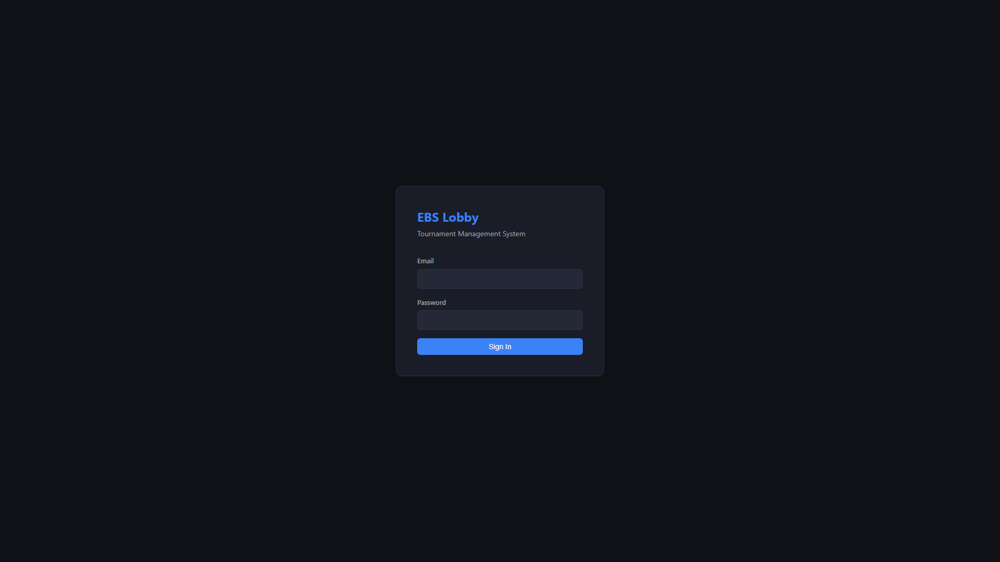
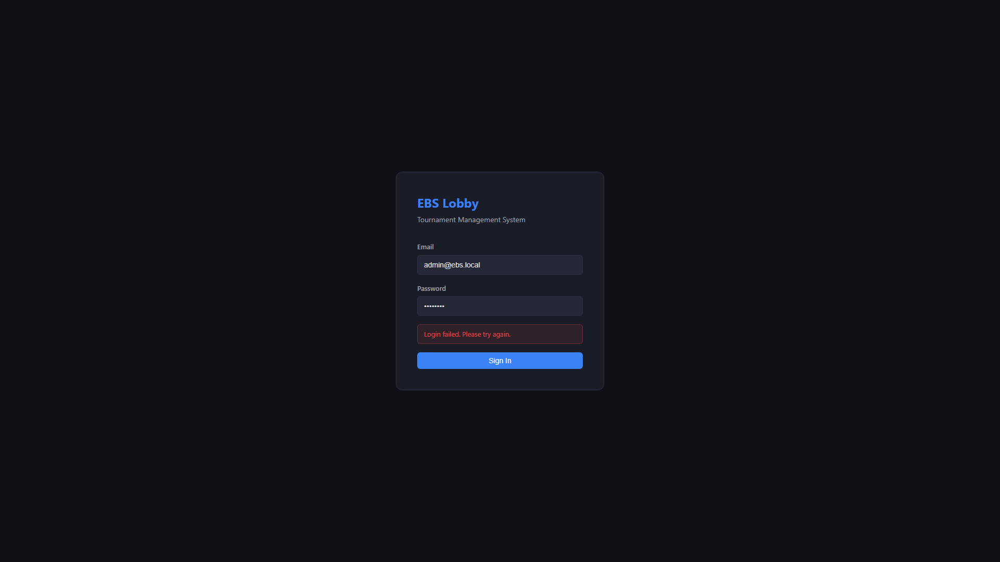

# QA-LOBBY-02: Lobby QA 체크리스트 (BS-02 기반)

| 날짜 | 항목 | 내용 |
|------|------|------|
| 2026-04-09 | 신규 작성 | BS-02 행동 명세 기반 QA 체크리스트 + 구현 대조 |
| 2026-04-09 | 재작성 | React 19 코드베이스 기준 재작성 (Flutter 무효화) |
| 2026-04-10 | critic revision | DEPRECATED 배너 추가 (Quasar 전환), 본문 체크리스트는 BS-02 행동 검증이므로 보존 |

> **⚠️ DEPRECATED — 참조용 아카이브**
> 본 문서는 React 19 + Vite 6 기준으로 작성되었습니다.
> Team 1 의 기술 스택이 **Quasar Framework (Vue 3) + TypeScript** 로 확정(2026-04-10) 됨에 따라,
> 본 문서의 체크리스트 중 기술 스택 의존 항목(Zustand, react-router-dom, use-websocket.ts 등 코드 참조)은 **역사적 참조용** 으로만 사용합니다.
> 다만 BS-02 행동 명세 기반의 **기능 검증 체크리스트 본문은 기술 스택 무관** 하므로 그대로 보존되며, Quasar 전환 후에도 동일 기준으로 재활용합니다.
> 신규 작업은 `QA-LOBBY-06+` 시리즈(Quasar 전환 후 신규 작성 예정)를 따릅니다.

---

## 개요

ebs_lobby/ (React 19 + TypeScript + Vite + Zustand) 기준.
기존 ebs_lobby_web/ (Flutter) 체크리스트는 폐기.

> 레포: C:\claude\ebs_lobby\ | 프레임워크: React 19 + Vite | 상태관리: Zustand
> 라우팅: react-router-dom v6 | API: fetch + JWT auto-refresh | 실시간: WebSocket (use-websocket.ts)

**범례**

| 기호 | 의미 |
|------|------|
| ✅ | 구현 완료 |
| ⚠️ | 부분 구현 / Mock / 제한적 |
| ❌ | 미구현 |
| — | 백엔드 필요 (코드 존재하나 검증 불가) |

---

## SECTION 0 — Login (LB-00)

### BS 목업 vs 실제 캡처

| BS-02 목업 | 실제 캡처 (Playwright) |
|:----------:|:---------------------:|
|  |  |

**차이점:**

| 항목 | BS 목업 | 실제 구현 | 판정 |
|------|---------|----------|:----:|
| 제목 | "Login" | "EBS Lobby" + "Tournament Management System" | ⚠️ |
| 테마 | 빨간색 (WSOP LIVE 동일) | 다크 테마 (파란색 계열) | ⚠️ |
| "Forgot your Password?" 링크 | 있음 | 없음 | ❌ |
| "Sign In With Entra ID" 버튼 | 있음 (TBD) | 없음 | — (TBD) |
| 필드 아이콘 | 사용자/잠금 아이콘 있음 | 아이콘 없음 | ⚠️ |
| 에러 메시지 | — | "Login failed. Please try again." 표시됨 | ✅ |

**로그인 실패 시 에러 메시지 (백엔드 미연결)**

> ✅ Flutter 대비 개선: 에러 메시지가 정상 표시됨. "Login failed. Please try again." 빨간 박스.

### 체크리스트

| # | 요구사항 | 구현 | 근거 | Playwright |
|---|----------|:----:|------|------------|
| LB-00-01 | 로그인 화면 진입 | ✅ | `LoginPage.tsx` + `LoginForm.tsx` | ✅ `react-00-login.png` |
| LB-00-02 | Email/Password 입력 필드 | ✅ | `LoginForm.tsx:37-51` — `type="email"`, `type="password"`, `required`, `autoComplete` | ✅ 확인 |
| LB-00-03 | 로그인 버튼 동작 | ✅ | `LoginForm.tsx:57` — `handleSubmit` → `auth-store.login()` → API 호출 | ✅ 클릭 동작 확인 |
| LB-00-04 | 로그인 실패 에러 메시지 | ⚠️ | `LoginForm.tsx:22-28` — 단일 메시지만 ("Login failed" / "Invalid email or password"). 네트워크/인증/타임아웃 분기 없음 | ✅ `react-00-login-error.png` |
| LB-00-05 | Forgot Password 링크 | ❌ | 코드에 없음 | ❌ |
| LB-00-06 | 2FA 표시 | ❌ | `models.ts:139` `totp_enabled` 필드 존재, UI 미구현 | ❌ |
| LB-00-07 | 세션 복원 다이얼로그 | ❌ | `LoginPage.tsx:12` — 로그인 성공 시 `/series`로 고정 이동. 세션 복원 로직 없음 | — |
| LB-00-08 | ProtectedRoute 리다이렉트 | ✅ | `ProtectedRoute.tsx:28-36` — 미인증 시 `/login`으로 리다이렉트 | ✅ /series 접근 시 /login 리다이렉트 확인 |
| LB-00-09 | Loading 상태 표시 | ✅ | `LoginForm.tsx:57` — `disabled={loading}`, "Signing in..." 텍스트 변경 | — |

---

## SECTION 1 — Series (LB-01)

### BS 목업

> 실제 캡처: 백엔드 미연결 — ProtectedRoute에서 /login 리다이렉트. 인증 후 화면 캡처 불가.

### 체크리스트

| # | 요구사항 | 구현 | 근거 | Playwright |
|---|----------|:----:|------|------------|
| LB-01-01 | 카드 그리드 표시 | ✅ | `SeriesListPage.tsx:54-71` — `.card-grid` 내 `.card` 반복 렌더링 | — |
| LB-01-02 | 월별 그룹핑 | ❌ | 월별 그룹핑 로직 없음. 전체 시리즈를 flat 리스트로 표시 | — |
| LB-01-03 | Series 카드 정보 (이름/기간/Competition) | ✅ | `SeriesListPage.tsx:57-66` — series_name, year, begin_at, end_at, competition 표시 | — |
| LB-01-04 | Series 클릭 → Event 목록 이동 | ✅ | `SeriesListPage.tsx:27-29` — `navigate(/series/${id}/events)` + nav store 업데이트 | — |
| LB-01-05 | 검색 바 | ❌ | 검색 UI 없음 | — |
| LB-01-06 | [+ New Series] (Admin만) | ✅ | `SeriesListPage.tsx:47-49` — `role === 'admin'` 조건부 렌더링 | — |
| LB-01-07 | Series 생성 폼 필드 | ⚠️ | `SeriesListPage.tsx:74-100` — Series Name, Year, Begin/End Date, Competition 있음. Time Zone, Country Code, Image, Is Demo 없음 | — |
| LB-01-08 | 빈 상태 메시지 | ✅ | `SeriesListPage.tsx:69-71` — "No series found." | — |
| LB-01-09 | StatusBadge 표시 | ✅ | `SeriesListPage.tsx:64` — completed/running 상태 뱃지 | — |

---

## SECTION 2 — Events (LB-02)

### BS 목업

### 체크리스트

| # | 요구사항 | 구현 | 근거 | Playwright |
|---|----------|:----:|------|------------|
| LB-02-01 | Event 테이블 표시 | ✅ | `EventListPage.tsx:60-66` — `DataTable` 컴포넌트 사용 | — |
| LB-02-02 | 상태별 탭 필터 (Created/Announced/Registering/Running/Completed) | ❌ | 탭 필터 UI 없음. 전체 이벤트를 단일 테이블로 표시 | — |
| LB-02-03 | Event 컬럼 (No./Name/Game/Buy-In/Table Size/Status/Start Time) | ✅ | `EventListPage.tsx:36-44` — 7개 컬럼 정의 | — |
| LB-02-04 | GameType 매핑 (22종) | ✅ | `enums.ts:1-24` — 22종 게임 타입 정의 (`GameType` Record) | — |
| LB-02-05 | Event 클릭 → Flight 이동 | ✅ | `EventListPage.tsx:65` — `onRowClick → navigate(/events/${id}/flights)` | — |
| LB-02-06 | [+ New Event] (Admin만) | ✅ | `EventListPage.tsx:54-56` — `role === 'admin'` 조건부 | — |
| LB-02-07 | Event 생성 폼 — 기본 필드 | ⚠️ | `EventListPage.tsx:68-93` — Event No, Name, Game Type, Buy-In, Table Size. **누락**: Start Date, Starting Chip, Display Buy-In | — |
| LB-02-08 | Game Mode 선택 (Single/Fixed/Dealer's Choice) | ❌ | 폼에 Game Mode 선택 없음. `models.ts:41` `game_mode` 필드 존재하나 UI 미구현 | — |
| LB-02-09 | Mix 프리셋 (HORSE/8-Game 등) | ❌ | 프리셋 UI 없음 | — |
| LB-02-10 | Blind Structure 인라인 설정 | ❌ | Event 생성 폼에 없음. 별도 Admin 페이지(`BlindStructuresPage`)에서만 관리 | — |
| LB-02-11 | [+ Add Flight] | ❌ | Event 폼에 Flight 추가 UI 없음 | — |
| LB-02-12 | Feature Table 뱃지 | ❌ | Event 목록에 Feature Table 뱃지 없음 | — |

---

## SECTION 3 — Flights (LB-03)

### BS 목업

### 체크리스트

| # | 요구사항 | 구현 | 근거 | Playwright |
|---|----------|:----:|------|------------|
| LB-03-01 | Flight 카드 그리드 표시 | ✅ | `FlightListPage.tsx:51-67` — `.card-grid` 내 카드 반복 | — |
| LB-03-02 | Flight 카드 정보 (이름/Entries/Players/Tables/Level) | ✅ | `FlightListPage.tsx:54-58` — display_name, entries, players_left, table_count, play_level | — |
| LB-03-03 | Flight 상태 뱃지 | ✅ | `FlightListPage.tsx:59` — `StatusBadge` 표시 | — |
| LB-03-04 | Flight 클릭 → Table 목록 이동 | ✅ | `FlightListPage.tsx:53` — `navigate(/flights/${id}/tables)` | — |
| LB-03-05 | [+ New Flight] (Admin만) | ✅ | `FlightListPage.tsx:43-45` — `role === 'admin'` 조건부 | — |
| LB-03-06 | Flight 생성 폼 | ⚠️ | `FlightListPage.tsx:70-79` — Display Name, Start Time만. **누락**: 기타 필드 (is_tbd 등) | — |
| LB-03-07 | 빈 상태 메시지 | ✅ | `FlightListPage.tsx:65-67` — "No flights for this event." | — |

---

## SECTION 4 — Table Management (LB-04)

### BS 목업

### 체크리스트 — Table List

| # | 요구사항 | 구현 | 근거 | Playwright |
|---|----------|:----:|------|------------|
| LB-04-01 | 테이블 카드 그리드 표시 | ✅ | `TableListPage.tsx:50-76` — `.card-grid` 카드 반복 | — |
| LB-04-02 | Feature Table 강조 (최상단) | ⚠️ | `TableListPage.tsx:55` — `.card.feature` CSS 클래스 적용. 그러나 정렬 로직은 없음 (서버 응답 순서 의존) | — |
| LB-04-03 | 상태/타입 필터 | ❌ | 필터 UI 없음 | — |
| LB-04-04 | Summary bar (Players/Tables/Seats) | ❌ | Summary bar 없음 | — |
| LB-04-05 | 좌석 색상 (Green/Red/Grey) | — | CSS에서 `.seat-circle.occupied` / `.seat-circle.vacant` 존재. 실제 색상은 `pages.css` 참조 | — |
| LB-04-06 | RFID 상태 인디케이터 | ⚠️ | `TableListPage.tsx:62-65` — Feature Table만 "RFID ON/OFF" 텍스트. 실시간 아닌 `rfid_reader_id` 유무 | — |
| LB-04-07 | 덱 등록 상태 | ❌ | 테이블 카드에 덱 등록 상태 미표시 | — |
| LB-04-08 | 출력 상태 (NDI/SDI) | ❌ | 테이블 카드에 출력 상태 미표시 | — |
| LB-04-09 | [Enter CC] 버튼 | ❌ | Table 화면에서 직접 CC 진입. 테이블 목록에 없음, TableDetailPage에서만 "Launch CC" | — |
| LB-04-10 | [+ New Table] (Admin만) | ✅ | `TableListPage.tsx:44-46` — `role === 'admin'` 조건부 | — |
| LB-04-11 | Table 생성 폼 | ⚠️ | `TableListPage.tsx:79-103` — Name, Type, Max Players, Game Type. **누락**: Small/Big Blind, Ante, Delay | — |
| LB-04-12 | 빈 상태 메시지 | ✅ | `TableListPage.tsx:74-76` — "No tables in this flight." | — |

### 체크리스트 — Table Detail (TableDetailPage)

| # | 요구사항 | 구현 | 근거 | Playwright |
|---|----------|:----:|------|------------|
| LB-04-13 | 좌석 그리드 WSOP 행 기반 레이아웃 | ✅ | `TableDetailPage.tsx:15-27` — `SEAT_POSITIONS` 10좌석 좌표 + 행 기반 그리드 | — |
| LB-04-14 | 좌석 클릭 → 플레이어 배정 다이얼로그 | ✅ | `TableDetailPage.tsx:143-155` — 좌석 클릭 시 `seatDialog` open | — |
| LB-04-15 | 플레이어 검색 (Add Player) | ✅ | `TableDetailPage.tsx:64-69` — `playersApi.search(q)` 2글자 이상 검색 | — |
| LB-04-16 | 플레이어 배정 (Assign) | ✅ | `TableDetailPage.tsx:71-83` — `seatsApi.update()` 호출 | — |
| LB-04-17 | Table Info 패널 (Name/Type/Game/Blinds/Status/RFID/Output/Delay) | ✅ | `TableDetailPage.tsx:117-126` — 8개 정보 항목 | — |
| LB-04-18 | 상태 전환 버튼 (Empty→Setup→Live→Completed) | ✅ | `TableDetailPage.tsx:28-36` — `getNextStatuses()` + 동적 버튼 렌더링 | — |
| LB-04-19 | 상태 전환 조건 (Feature: RFID+덱 필수) | ❌ | 클라이언트 측 전환 조건 검증 없음. 서버 의존 | — |
| LB-04-20 | Launch CC 버튼 | ✅ | `TableDetailPage.tsx:90-95` — `tablesApi.launchCc()` → `window.open` | — |
| LB-04-21 | 좌석 상태 표시 (occupied/vacant) | ✅ | `TableDetailPage.tsx:138-153` — `isOccupied` 분기 + player_name/chip_count | — |
| LB-04-22 | Paused 상태 지원 | ✅ | `enums.ts:36` — `PAUSED: "paused"` + `TableDetailPage.tsx:33` — Live→Paused 전환 | — |

---

## SECTION 5 — Player List (LB-05)

### BS 목업

### 체크리스트

| # | 요구사항 | 구현 | 근거 | Playwright |
|---|----------|:----:|------|------------|
| LB-05-01 | 독립 플레이어 목록 화면 | ❌ | 별도 PlayerListPage 없음. TableDetailPage 내 좌석 다이얼로그로만 접근 | — |
| LB-05-02 | 플레이어 검색 | ✅ | `TableDetailPage.tsx:64-69` — `playersApi.search()` | — |
| LB-05-03 | VPIP/PFR/AGR 통계 | ❌ | 통계 표시 없음 | — |
| LB-05-04 | Feature Table Player 강조 (금색) | ❌ | 미구현 | — |
| LB-05-05 | 플레이어 수동 등록 | ❌ | 검색만 가능, 수동 신규 등록 폼 없음 | — |

---

## SECTION 6 — CC Integration (LB-06)

| # | 요구사항 | 구현 | 근거 | Playwright |
|---|----------|:----:|------|------------|
| LB-06-01 | Launch CC | ✅ | `TableDetailPage.tsx:90-95` — API 호출 + `window.open` | — |
| LB-06-02 | CC 상태 표시 (LIVE/IDLE/ERROR) | ❌ | 테이블 목록/상세에 CC 상태 미표시 | — |
| LB-06-03 | Operator/Hand# 실시간 표시 | ❌ | WebSocket 이벤트 수신 없음 | — |
| LB-06-04 | Active CC 드롭다운 | ❌ | AppLayout에 CC 모니터링 UI 없음 | — |

---

## SECTION 7 — WebSocket 실시간 (LB-07)

| # | 요구사항 | 구현 | 근거 | Playwright |
|---|----------|:----:|------|------------|
| LB-07-01 | WebSocket 연결 | ✅ | `use-websocket.ts:6-17` — `ws://{host}/ws/{room}` 자동 연결 | — |
| LB-07-02 | 자동 재연결 | ✅ | `use-websocket.ts:13-15` — `onclose` → 3초 후 `connect()` 재호출 | — |
| LB-07-03 | 메시지 수신 → UI 갱신 | ❌ | `useWebSocket` 훅이 존재하나 **어떤 페이지에서도 사용하지 않음**. UI 실시간 갱신 없음 | — |
| LB-07-04 | table:status_changed 처리 | ❌ | 미연결 | — |
| LB-07-05 | table:player_seated 처리 | ❌ | 미연결 | — |
| LB-07-06 | hand:started 처리 | ❌ | 미연결 | — |

---

## SECTION 8 — Authentication & Session (LB-08)

| # | 요구사항 | 구현 | 근거 | Playwright |
|---|----------|:----:|------|------------|
| LB-08-01 | JWT 토큰 localStorage 영속화 | ✅ | `auth-store.ts:17-19` — `localStorage.getItem/setItem` | — |
| LB-08-02 | 401 자동 refresh | ✅ | `client.ts:21-30` — 401 응답 시 `refresh()` → 토큰 갱신 → 재요청 | — |
| LB-08-03 | Refresh 실패 시 logout | ✅ | `client.ts:27-29` — `refreshed` 실패 → `logout()` + throw | — |
| LB-08-04 | ProtectedRoute 가드 | ✅ | `ProtectedRoute.tsx:7-37` — `isAuthenticated` 체크 + `loadSession` 검증 | — |
| LB-08-05 | Breadcrumb 네비게이션 | ✅ | `Breadcrumb.tsx:19-45` — URL segment 기반 동적 breadcrumb + Link 클릭 이동 | — |
| LB-08-06 | Nav Store (계층 상태 유지) | ✅ | `nav-store.ts:1-25` — Series→Event(Day)→Table 3계층 상태 + Player 독립. 상위 변경 시 하위 초기화 | — |
| LB-08-07 | 세션 복원 (last_table_id 등) | ❌ | `LoginPage.tsx:12` — 로그인 후 무조건 `/series`. 복원 다이얼로그 없음 | — |

---

## SECTION 9 — RBAC (LB-09)

| # | 요구사항 | 구현 | 근거 | Playwright |
|---|----------|:----:|------|------------|
| LB-09-01 | Admin — 전체 접근 | ✅ | `Sidebar.tsx:6` — `isAdmin` 조건으로 Admin 메뉴 표시 | — |
| LB-09-02 | Admin — CRUD 버튼 표시 | ✅ | 모든 페이지에서 `role === 'admin'` 조건부 New 버튼 | — |
| LB-09-03 | Operator — 할당 테이블만 | ❌ | Operator 할당 테이블 필터링 없음. 모든 테이블 접근 가능 | — |
| LB-09-04 | Viewer — 읽기 전용 | ⚠️ | New 버튼은 숨겨지나 (Admin만 표시), 직접 API 호출 차단은 서버 의존 | — |
| LB-09-05 | Sidebar Admin 메뉴 숨김 | ✅ | `Sidebar.tsx:23-48` — `isAdmin &&` 조건부 Admin 섹션 | — |

---

## SECTION 10 — Degradation (LB-10)

| # | 요구사항 | 구현 | 근거 | Playwright |
|---|----------|:----:|------|------------|
| LB-10-01 | DB 연결 끊김 배너 | ❌ | Degradation 배너 UI 없음 | — |
| LB-10-02 | API 연결 끊김 배너 | ❌ | 미구현 | — |
| LB-10-03 | 서버 끊김 전체 오버레이 | ❌ | 미구현 | — |
| LB-10-04 | 읽기 전용 캐시 폴백 | ❌ | 캐시 전략 없음 (매 요청 직접 fetch) | — |
| LB-10-05 | 심각도별 분류 | ❌ | 미구현 | — |

---

## SECTION 11 — Hand History (LB-11)

| # | 요구사항 | 구현 | 근거 | Playwright |
|---|----------|:----:|------|------------|
| LB-11-01 | Hand History 조회 | ✅ | `HandHistoryPage.tsx` — `DataTable` + API 호출 | — |
| LB-11-02 | Table ID 필터 | ✅ | `HandHistoryPage.tsx:11-16` — `tableFilter` 입력 → API params | — |
| LB-11-03 | Hand 상세 (플레이어/액션) | ✅ | `HandHistoryPage.tsx:81-100` — expandable row, `hand_players` + `hand_actions` 테이블 | — |
| LB-11-04 | VPIP/PFR 통계 | — | `models.ts:176-177` — `vpip`, `pfr` boolean 필드 존재, 집계 UI 없음 | — |

---

## SECTION 12 — Admin Pages (LB-12)

| # | 요구사항 | 구현 | 근거 | Playwright |
|---|----------|:----:|------|------------|
| LB-12-01 | Users 관리 | ✅ | `admin/UsersPage.tsx` 존재 | — |
| LB-12-02 | Settings 관리 | ✅ | `admin/SettingsPage.tsx` 존재 | — |
| LB-12-03 | Skins 관리 | ✅ | `admin/SkinsPage.tsx` 존재 | — |
| LB-12-04 | Blind Structures 관리 | ✅ | `admin/BlindStructuresPage.tsx` 존재 | — |
| LB-12-05 | Audit Log 조회 | ✅ | `admin/AuditLogPage.tsx` 존재 | — |
| LB-12-06 | Reports | ✅ | `admin/ReportsPage.tsx` 존재 | — |
| LB-12-07 | WSOP Sync | ✅ | `sync/WsopSyncPage.tsx` 존재 | — |

---

## SECTION 13 — Data Model (LB-13)

| # | 요구사항 | 구현 | 근거 | Playwright |
|---|----------|:----:|------|------------|
| LB-13-01 | 3계층 + Player 독립 모델 (Series→Event(Day)→Table + Player 독립 레이어) | ✅ | `models.ts` — Series, Event, Table, Player 전체 정의 | — |
| LB-13-02 | Player 모델 | ✅ | `models.ts:117-131` — wsop_id, nationality, country_code, profile_image | — |
| LB-13-03 | Hand/HandPlayer/HandAction 모델 | ✅ | `models.ts:145-191` — hand_number, board_cards, pot, actions | — |
| LB-13-04 | Mix 게임 필드 (game_mode, allowed_games, rotation_order, rotation_trigger) | ✅ | `models.ts:41-44` — Event 모델에 4개 필드 존재 | — |
| LB-13-05 | RFID 필드 (rfid_reader_id, deck_registered) | ✅ | `models.ts:87-89` — Table 모델에 존재 | — |
| LB-13-06 | Output 필드 (output_type, delay_seconds) | ✅ | `models.ts:90-92` — Table 모델에 존재 | — |
| LB-13-07 | Enum 정의 (GameType 22종, TableStatus, SeatStatus, EventStatus, UserRole) | ✅ | `enums.ts:1-58` — 전체 정의 완료 | — |

---

## Gap Analysis

### 심각도별 미구현 항목

| 심각도 | 항목 | 설명 |
|:------:|------|------|
| **CRITICAL** | LB-07-03 | **WebSocket UI 미연결** — `useWebSocket` 훅이 존재하나 어떤 페이지에서도 import/사용하지 않음. 실시간 데이터 갱신 완전 불가. CC↔Lobby 통합 차단 |
| **CRITICAL** | LB-08-07 | **세션 복원 미구현** — 로그인 후 무조건 `/series`로 이동. BS-02 핵심 요구사항 (last_table_id → CC 바로 진입) 미충족 |
| **CRITICAL** | LB-10-01~05 | **Degradation 전체 미구현** — 배너, 오버레이, 캐시 폴백, 심각도 분류 모두 없음. 장애 시 사용자 안내 불가 |
| **HIGH** | LB-02-08~09 | **Game Mode / Mix 프리셋 UI 미구현** — `models.ts`에 필드 존재하나 Event 생성 폼에서 Single/Fixed/Choice 선택 불가. 17종 Mix 이벤트 생성 차단 |
| **HIGH** | LB-02-10 | **Blind Structure 인라인 미구현** — Event 생성 시 Blind Structure 설정 불가. Admin 별도 페이지에서만 관리 |
| **HIGH** | LB-02-02 | **Event 상태 탭 필터 미구현** — 대규모 이벤트 운영 시 탐색 효율 저하 |
| **HIGH** | LB-04-03 | **Table 상태/타입 필터 미구현** — 대규모 테이블 운영 시 탐색 효율 저하 |
| **HIGH** | LB-04-04 | **Summary bar 미구현** — Players/Tables/Seats 요약 정보 미표시 |
| **HIGH** | LB-09-03 | **Operator 할당 테이블 제한 미구현** — Operator가 모든 테이블에 접근 가능. 보안 요구사항 위반 |
| **HIGH** | LB-00-05 | **Forgot Password 링크 없음** — 비밀번호 분실 시 복구 경로 없음 |
| **HIGH** | LB-06-02~04 | **CC 모니터링 UI 없음** — CC 상태, Active CC 드롭다운, Operator/Hand# 표시 없음 |
| **MEDIUM** | LB-01-02 | 월별 그룹핑 없음 — flat list로 표시 |
| **MEDIUM** | LB-01-05 | Series 검색 바 없음 |
| **MEDIUM** | LB-00-04 | 에러 메시지 단일 분기 — 네트워크/인증/타임아웃 구분 없음 |
| **MEDIUM** | LB-00-06 | 2FA UI 없음 — `totp_enabled` 필드만 존재 |
| **MEDIUM** | LB-04-19 | Feature Table 상태 전환 조건 (RFID+덱) 클라이언트 검증 없음 — 서버 의존 |
| **MEDIUM** | LB-05-01 | 독립 Player List 화면 없음 — 좌석 다이얼로그로만 접근 |
| **LOW** | LB-01-07 | Series 생성 폼 — Time Zone, Country Code, Image, Is Demo 누락 |
| **LOW** | LB-03-06 | Flight 생성 폼 — 최소 필드만 (Display Name, Start Time) |
| **LOW** | LB-04-11 | Table 생성 폼 — Blind, Ante, Delay 필드 누락 |

### Flutter 대비 React 개선 사항

| 항목 | Flutter (이전) | React (현재) | 판정 |
|------|---------------|-------------|:----:|
| 로그인 에러 메시지 | 백엔드 미연결 시 무반응 | "Login failed. Please try again." 표시 | ✅ 개선 |
| ProtectedRoute | — | 미인증 시 /login 리다이렉트 + loadSession 검증 | ✅ 신규 |
| JWT auto-refresh | — | 401 시 자동 갱신 + 실패 시 logout | ✅ 신규 |
| Admin 사이드바 숨김 | Role 추적만 | `isAdmin &&` 조건부 Admin 메뉴 | ✅ 개선 |
| Hand History | — | DataTable + 상세 확장 + 필터 | ✅ 신규 |
| Admin 페이지 (7종) | — | Users/Settings/Skins/Blinds/Audit/Reports/Sync | ✅ 신규 |
| Flight CRUD | 읽기 전용 | [+ New Flight] 생성 가능 | ✅ 개선 |
| WebSocket UI 연결 | `WsClient` 존재, UI 미연결 | `useWebSocket` 존재, UI 미연결 | ⚠️ 동일 |
| 세션 복원 | `SessionRestoreDialog` 존재 | 미구현 | ❌ 퇴보 |

---

## 현재 상태 요약

> **BS-02 기준 구현율: 약 55%**
>
> **구현 완료**: 3계층 라우팅 + Player 독립 레이어, 로그인/인증(JWT+refresh), CRUD 폼 (Series/Event/Table), 좌석 그리드 WSOP 행 기반 레이아웃, 플레이어 검색/배정, 상태 전환 FSM, Breadcrumb, Admin 페이지 7종, Hand History, RBAC 부분 적용
>
> **핵심 미구현 (CRITICAL)**: WebSocket UI 미연결, 세션 복원, Degradation 전체
>
> **주요 미구현 (HIGH)**: Game Mode/Mix UI, Blind Structure 인라인, 상태 탭 필터, Summary bar, Operator 할당 제한, CC 모니터링, Forgot Password
>
> **참고**: 백엔드 미연결 상태로 로그인 후 화면(Series~Table)은 Playwright 캡처 불가. 인증 후 화면 캡처는 백엔드 구동 후 재실행 필요.
